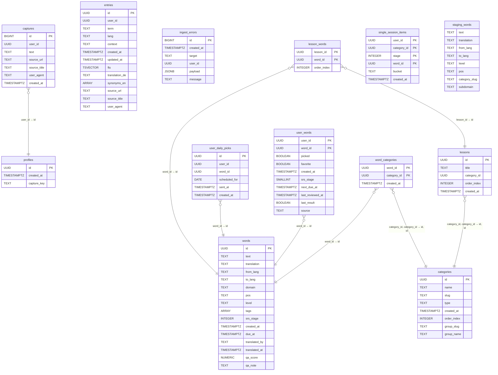
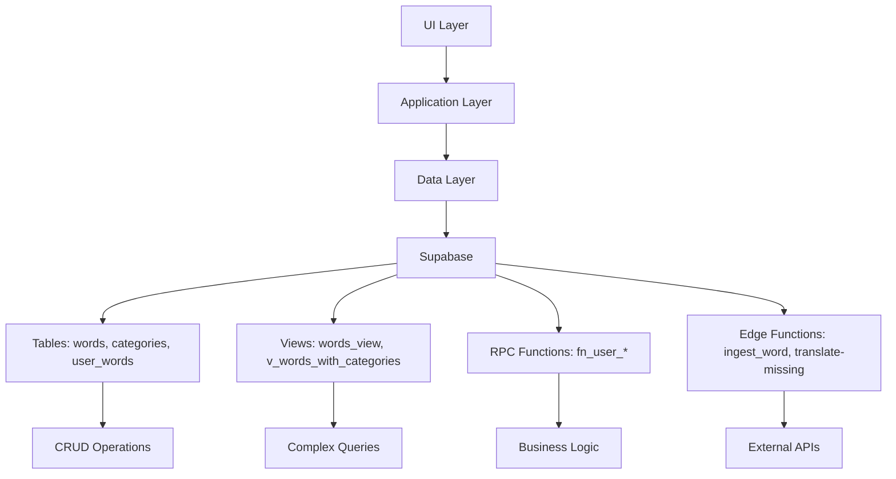

# 📋 Programmliste - Vollständiger Code aller Dateien

> **Erstellt:** 07.11.2025

Diese Datei enthält den vollständigen Codeinhalt aller relevanten Projektdateien.

---

### `DATA_DICTIONARY.md`

**Typ:** MD  
**Zeilen:** 229

```markdown
# Talvori – Data Dictionary (public)

Generiert: 2025-11-07 13:56

## public.captures

> RLS: user_id = auth.uid().

| # | Column | Type | Null | PK | Default | Description |
|---|--------|------|------|----|---------|-------------|
| 1 | id | bigint | NO | YES | nextval('captures_id_seq'::regclass) |  |
| 2 | user_id | uuid | NO |  |  |  |
| 3 | text | text | NO |  |  |  |
| 4 | source_url | text | YES |  |  |  |
| 5 | source_title | text | YES |  |  |  |
| 6 | user_agent | text | YES |  |  |  |
| 7 | created_at | timestamp with time zone | YES |  | now() |  |

#### Foreign Keys
- **captures_user_id_fkey**: (user_id) → public.profiles (id) · on update NO ACTION · on delete CASCADE


## public.categories

> Vokabel-Gruppierungen (CEFR, Topics, Domains); steuernde Reihenfolge.

| # | Column | Type | Null | PK | Default | Description |
|---|--------|------|------|----|---------|-------------|
| 1 | id | uuid | NO | YES | gen_random_uuid() |  |
| 2 | name | text | NO |  |  |  |
| 3 | slug | text | NO |  |  |  |
| 4 | type | text | NO |  |  | z. B. 'cefr', 'topic', 'domain'. |
| 5 | created_at | timestamp with time zone | NO |  | now() |  |
| 6 | order_index | integer | YES |  |  |  |
| 7 | group_slug | text | YES |  |  |  |
| 8 | group_name | text | YES |  |  |  |


## public.entries

> RLS: user_id = auth.uid().

| # | Column | Type | Null | PK | Default | Description |
|---|--------|------|------|----|---------|-------------|
| 1 | id | uuid | NO | YES | gen_random_uuid() |  |
| 2 | user_id | uuid | NO |  |  |  |
| 3 | term | text | NO |  |  |  |
| 4 | lang | text | YES |  | 'de'::text |  |
| 5 | context | text | YES |  |  |  |
| 6 | created_at | timestamp with time zone | YES |  | now() |  |
| 7 | updated_at | timestamp with time zone | YES |  | now() |  |
| 8 | fts | tsvector | YES |  | to_tsvector('simple'::regconfig, ((COALESCE(term, ''::text) \|\| ' '::text) \|\| COALESCE(context, ''::text))) | Volltextindex für Suche. |
| 9 | translation_de | text | YES |  |  |  |
| 10 | synonyms_en | text[] | YES |  | '{}'::text[] |  |
| 11 | source_url | text | YES |  |  |  |
| 12 | source_title | text | YES |  |  |  |
| 13 | user_agent | text | YES |  |  |  |


## public.ingest_errors

> Fehlerprotokoll beim Import/Parsing.

| # | Column | Type | Null | PK | Default | Description |
|---|--------|------|------|----|---------|-------------|
| 1 | id | bigint | NO | YES | nextval('ingest_errors_id_seq'::regclass) |  |
| 2 | created_at | timestamp with time zone | YES |  | now() |  |
| 3 | target | text | YES |  |  |  |
| 4 | user_id | uuid | YES |  |  |  |
| 5 | payload | jsonb | YES |  |  |  |
| 6 | message | text | YES |  |  |  |


## public.lesson_words

> Reihenfolge von Wörtern innerhalb einer Lesson.

| # | Column | Type | Null | PK | Default | Description |
|---|--------|------|------|----|---------|-------------|
| 1 | lesson_id | uuid | NO | YES |  |  |
| 2 | word_id | uuid | NO | YES |  |  |
| 3 | order_index | integer | NO |  | 0 |  |

#### Foreign Keys
- **lesson_words_lesson_id_fkey**: (lesson_id) → public.lessons (id) · on update NO ACTION · on delete CASCADE
- **lesson_words_word_id_fkey**: (word_id) → public.words (id) · on update NO ACTION · on delete CASCADE


## public.lessons

> Kuratiertes Set (Titel, Kategorie, Reihenfolge).

| # | Column | Type | Null | PK | Default | Description |
|---|--------|------|------|----|---------|-------------|
| 1 | id | uuid | NO | YES | gen_random_uuid() |  |
| 2 | title | text | NO |  |  |  |
| 3 | category_id | uuid | YES |  |  |  |
| 4 | order_index | integer | NO |  | 0 |  |
| 5 | created_at | timestamp with time zone | NO |  | now() |  |

#### Foreign Keys
- **lessons_category_fkey**: (category_id) → public.categories (id) · on update NO ACTION · on delete SET NULL
- **lessons_category_id_fkey**: (category_id) → public.categories (id) · on update NO ACTION · on delete SET NULL


## public.profiles

> App-Profil je User (z. B. capture_key).

| # | Column | Type | Null | PK | Default | Description |
|---|--------|------|------|----|---------|-------------|
| 1 | id | uuid | NO | YES |  |  |
| 2 | created_at | timestamp with time zone | YES |  | now() |  |
| 3 | capture_key | text | YES |  |  |  |

#### Foreign Keys
- **profiles_id_fkey**: (id) → auth.users (id) · on update NO ACTION · on delete CASCADE


## public.single_session_items

> Einmal-Session-Queue (Bucket, Stage) ohne Persistenz in SRS.

| # | Column | Type | Null | PK | Default | Description |
|---|--------|------|------|----|---------|-------------|
| 1 | user_id | uuid | NO | YES | auth.uid() |  |
| 2 | category_id | uuid | NO | YES |  |  |
| 3 | stage | integer | NO | YES |  |  |
| 4 | word_id | uuid | NO | YES |  |  |
| 5 | bucket | text | NO |  |  |  |
| 6 | created_at | timestamp with time zone | NO |  | now() |  |


## public.staging_words

> Import-Zwischentabelle (CSV/Batch), wird in words überführt.

| # | Column | Type | Null | PK | Default | Description |
|---|--------|------|------|----|---------|-------------|
| 1 | text | text | NO |  |  |  |
| 2 | translation | text | NO |  |  |  |
| 3 | from_lang | text | NO |  | 'en'::text |  |
| 4 | to_lang | text | NO |  | 'de'::text |  |
| 5 | level | text | YES |  |  |  |
| 6 | pos | text | YES |  |  |  |
| 7 | category_slug | text | NO |  |  |  |
| 8 | subdomain | text | YES |  |  |  |


## public.user_daily_picks

> Tägliche Push-Auswahl je User (Scheduling & Versandzeit).

| # | Column | Type | Null | PK | Default | Description |
|---|--------|------|------|----|---------|-------------|
| 1 | id | uuid | NO | YES | gen_random_uuid() |  |
| 2 | user_id | uuid | NO |  |  |  |
| 3 | word_id | uuid | NO |  |  |  |
| 4 | scheduled_for | date | YES |  |  | Geplanter Tag für Push/Reminder. |
| 5 | sent_at | timestamp with time zone | YES |  |  |  |
| 6 | created_at | timestamp with time zone | NO |  | now() |  |

#### Foreign Keys
- **user_daily_picks_user_id_fkey**: (user_id) → auth.users (id) · on update NO ACTION · on delete CASCADE
- **user_daily_picks_word_id_fkey**: (word_id) → public.words (id) · on update NO ACTION · on delete CASCADE


## public.user_words

> RLS: user_id = auth.uid().

| # | Column | Type | Null | PK | Default | Description |
|---|--------|------|------|----|---------|-------------|
| 1 | user_id | uuid | NO | YES |  |  |
| 2 | word_id | uuid | NO | YES |  |  |
| 3 | picked | boolean | NO |  | true |  |
| 4 | favorite | boolean | NO |  | false |  |
| 5 | created_at | timestamp with time zone | NO |  | now() |  |
| 6 | srs_stage | smallint | NO |  | 0 | Aktuelle SRS-Stufe (z. B. 0–5). |
| 7 | next_due_at | timestamp with time zone | YES |  |  | Nächster Wiederholzeitpunkt (Scheduler). |
| 8 | last_reviewed_at | timestamp with time zone | YES |  |  | Zeitpunkt der letzten Wiederholung. |
| 9 | last_result | boolean | YES |  |  |  |
| 10 | source | text | YES |  | 'app'::text |  |

#### Foreign Keys
- **user_words_user_id_fkey**: (user_id) → auth.users (id) · on update NO ACTION · on delete CASCADE
- **user_words_word_id_fkey**: (word_id) → public.words (id) · on update NO ACTION · on delete CASCADE


## public.word_categories

> N:M-Link: words ↔ categories.

| # | Column | Type | Null | PK | Default | Description |
|---|--------|------|------|----|---------|-------------|
| 1 | word_id | uuid | NO | YES |  | FK → words.id |
| 2 | category_id | uuid | NO | YES |  | FK → categories.id |
| 3 | created_at | timestamp with time zone | NO |  | now() |  |

#### Foreign Keys
- **word_categories_category_fkey**: (category_id) → public.categories (id) · on update NO ACTION · on delete CASCADE
- **word_categories_category_id_fkey**: (category_id) → public.categories (id) · on update NO ACTION · on delete CASCADE
- **word_categories_word_id_fkey**: (word_id) → public.words (id) · on update NO ACTION · on delete CASCADE


## public.words

> Master-Lexikon: jedes Wort einmal, Sprache/Pos/Level, Metadaten (QA, Tags).

| # | Column | Type | Null | PK | Default | Description |
|---|--------|------|------|----|---------|-------------|
| 1 | id | uuid | NO | YES | gen_random_uuid() |  |
| 2 | text | text | NO |  |  | Grundform/Token (engl.). |
| 3 | translation | text | NO |  |  | Standard-Übersetzung (z. B. de). |
| 4 | from_lang | text | NO |  |  |  |
| 5 | to_lang | text | NO |  |  |  |
| 6 | domain | text | YES |  |  |  |
| 7 | pos | text | YES |  |  | Part of Speech (noun, verb, adj, …). |
| 8 | level | text | YES |  |  | CEFR-Level (A1–C2) oder custom. |
| 9 | tags | text[] | YES |  | '{}'::text[] |  |
| 11 | srs_stage | integer | YES |  | 0 |  |
| 12 | created_at | timestamp with time zone | YES |  | now() |  |
| 13 | due_at | timestamp with time zone | YES |  |  |  |
| 14 | translated_by | text | YES |  |  |  |
| 15 | translated_at | timestamp with time zone | YES |  |  |  |
| 16 | qa_score | numeric | YES |  |  |  |
| 17 | qa_note | text | YES |  |  |  |


```

---

### `ERD.md`

**Typ:** MD  
**Zeilen:** 143

```markdown


```

---

### `PROGRAMMLISTE_SUMMARY.md`

**Typ:** MD  
**Zeilen:** 151

```markdown
# 📋 Programmliste - Aktualisierte Übersicht

> **Letzte Aktualisierung:** Januar 2025  
> **Version:** 1.1  
> **Status:** ✅ Aktualisiert

## 📊 Projekt-Statistiken

- **Total Dart Files**: 140
- **Words Feature**: 102 Dateien
- **Home Feature**: 25 Dateien
- **Core**: 5 Dateien

## 📁 Hauptstruktur

### Core Layer

- **Events**: StageTransitionEvent, ResetEvent
- **Services**: BrowserReturnService
- **Theme**: AppTheme mit ThemeExtension
- **UI Widgets**: ProgressBar, RoundIcon

### Features

#### 🏠 Home (25 Dateien)

- **Application**: HomeController, HomeState
- **Data**: ShareIngestService
- **Screens**: Home, Course, Profile, Vocab, Category
- **Widgets**: BottomNav, CategoryPopup, PracticePicker, TopBar

#### 📚 Words (102 Dateien)

- **Application**:
  - Controllers: LearnMode, Category, WordList, CategoryDetail
  - Mix Feature: Navigation, Search, Selection Controllers
  - Sort Feature: VocabSortController
  - Providers: S0Lock, LearningEngine, LevelSelection, SRSMode
  - SRS: Config, Logic
- **Data**:
  - SupabaseWordRepository (Komplette RPC-Integration)
  - CategoryRepository
  - WordHubTaxonomy (8 Sections: Life, People, Society, Nature, Action, Culture, Language, Levels)
- **Domain**: Word, SRSKind
- **Services**: SFXService
- **UI**:
  - Screens: LearnMode, CategoryDetail, WordHub, WordList, MixBuilder, QuickSets, MyWords, VocabSort
  - Cards: SwipeableWordCard, WordCard
  - Widgets: 45+ Widgets (Controls, Indicators, Badges, etc.)

#### 🃏 Decks (1 Datei)

- Deck Domain Model

#### 🔔 Push (1 Datei)

- DailyPicksStore

#### 🏆 Rewards (1 Datei)

- RewardsCenterScreen

## 🎯 Haupt-Features

### Spaced Repetition System (SRS)

- **Stufen**: S0 (Neu) → S1-S5 (Gelernt)
- **Modi**: S0-S5, S1-S5, Single Stage
- **Engines**: T-SRS, A-SRS, Hybrid
- **S0 Lock**: Optional Sperre für neue Karten

### Mix Feature

- Custom Word Collections
- Multi-Category Support
- Search Integration
- Donut Toggle Interface

### Quick Sets

- My Words
- Favorites
- Known Words (S1+)
- My Mix

### Word Hub

- 8 Hauptbereiche
- 40+ Kategorien
- Taxonomie-basierte Navigation

## 🔗 Edge Functions

### ingest_word

- DeepL Integration
- QA-System (Back-Translation)
- Case-insensitive Lookup
- German Noun Capitalization

### translate-missing

- Batch Processing
- Rate Limit Handling
- QA-Option
- Dry-Run Support

## 📊 Supabase Integration

### RPC Functions

- `fn_user_stage_counts`
- `fn_user_workload_today`
- `fn_user_learn_queue_mode`
- `fn_user_review`
- `fn_user_category_progress`
- `fn_single_session_seed`
- `fn_single_session_counts`
- `fn_single_session_move`
- `fn_single_session_reset`
- `fn_single_session_next`

### Views

- `words_view`: Base word queries
- `v_words_with_categories`: Category joins
- `v_words_user`: User flags & metadata

### Tables

- `words`: Haupt-Wörter-Tabelle
- `categories`: Kategorien-Management
- `user_words`: User-Wort-Verknüpfung

## 🎨 Theme System

- **ThemeExtension**: WordsColors, AppTheme
- **Layout**: WordsLayout (zentrale Konstanten)
- **Home Theme**: Feature-spezifische Themes
- **Dynamic Colors**: Kontrast-Anpassung

## 📝 Vollständige Code-Dokumentation

Die vollständige Code-Dokumentation mit allen Dateien ist in `Programmliste.md` enthalten (15,088 Zeilen).

---

_Für strukturelle Details siehe: PROJECT_STRUCTURE.md_
_Für Supabase-Architektur siehe: SUPABASE_ARCHITECTURE.md_


```

---

### `PROJECT_STRUCTURE.md`

**Typ:** MD  
**Zeilen:** 447

```markdown
# Talvori - Flutter App Project Structure

## 📁 Project Overview

- **Total Dart Files**: 140
- **Architecture**: Feature-based with Clean Architecture principles
- **State Management**: Riverpod (NotifierProvider)
- **Backend**: Supabase
- **UI Framework**: Flutter Material Design
- **Theme System**: Centralized with ThemeExtension
- **Platforms**: iOS, Android

## 🏗️ Core Architecture

### 📂 `lib/core/` - Shared Infrastructure

```
lib/core/
├── events/                    # Global event system
│   ├── events.dart           # Barrel file for events
│   └── reset_event.dart      # Reset event for app-wide resets
├── services/                  # Core services
│   ├── services.dart         # Barrel file for services
│   └── browser_return_service.dart  # Browser navigation service
├── theme/                     # App theming
│   └── app_theme.dart        # Main app theme configuration with ThemeExtension
└── ui/widgets/               # Reusable UI components
    ├── progress_bar.dart     # Generic progress bar widget
    └── round_icon.dart       # Round icon button widget
```

## 🎯 Feature Modules

### 📂 `lib/features/` - Feature-based Organization

#### 🏠 Home Feature (`lib/features/home/`) - Refactored Architecture

```
lib/features/home/
├── application/              # Business logic & state management
│   ├── application.dart     # Barrel file for application layer
│   ├── home_controller.dart # Home screen controller (NotifierProvider)
│   └── home_state.dart      # Home screen state model
├── data/                     # Data layer
│   ├── data.dart            # Barrel file for data layer
│   └── share_ingest_service.dart  # Share data ingestion service
├── providers.dart            # Riverpod provider definitions
└── ui/
    ├── screens/              # Home-related screens
    │   ├── course_screen.dart
    │   ├── home_screen.dart  # Fully refactored & presentational
    │   ├── profile_screen.dart
    │   └── vocab_screen.dart
    ├── strings/              # Localization & UI strings
    │   ├── strings.dart      # Barrel file for strings
    │   └── home_strings.dart # Centralized UI strings
    ├── theme/                # Theme & styling
    │   ├── theme.dart        # Barrel file for theme
    │   └── home_theme.dart   # Colors, spacing & dimensions
    └── widgets/              # Home-specific widgets
        ├── widgets.dart      # Barrel file for widgets
        ├── bottom_nav.dart
        ├── category_popup.dart    # Category selection popup
        ├── counter_badge.dart
        ├── glow_sweep_ring.dart
        ├── practice_picker.dart   # Practice mode picker
        ├── progress_pill.dart
        ├── tap_flash.dart
        └── top_bar.dart
```

#### 📚 Words Feature (`lib/features/words/`) - Main Learning Module (102 files)

```
lib/features/words/
├── application/              # Business logic & state management
│   ├── application.dart     # Barrel file for application layer
│   ├── category_controller.dart        # Category state management
│   ├── category_controller.g.dart      # Generated code
│   ├── category_detail_controller.dart  # Category detail state management
│   ├── category_detail_state.dart       # Category detail state model
│   ├── category_id_cache.dart          # Category ID caching
│   ├── category_stats_provider.dart     # Category statistics
│   ├── learn_mode_controller.dart       # Main learning controller (NotifierProvider)
│   ├── learn_navigation_origin.dart     # Navigation origin tracking
│   ├── learning_engine_provider.dart    # Learning engine toggle state
│   ├── level_selection_controller.dart  # Level selection logic
│   ├── level_selection_provider.dart    # Level selection state (S0-S5, S1-S5, Single)
│   ├── mix/                            # Mix feature controllers
│   │   ├── mix_groups.dart             # Mix group definitions
│   │   ├── mix_navigation_controller.dart
│   │   ├── mix_navigation_origin.dart
│   │   ├── mix_search_providers.dart
│   │   └── mix_selection_controller.dart
│   ├── quick_sets_providers.dart        # Quick sets feature
│   ├── s0_lock_provider.dart           # S0 lock state (prevents new cards)
│   ├── sort/                           # Sort feature controllers
│   │   ├── add_button_lock_provider.dart
│   │   ├── category_stroke_colors.dart
│   │   └── vocab_sort_controller.dart
│   ├── srs_config.dart      # Spaced Repetition System config
│   ├── srs_logic.dart       # SRS algorithm implementation
│   ├── srs_mode_controller.dart        # SRS mode (T-SRS, A-SRS, Hybrid)
│   ├── timer_helpers.dart   # Timer utility functions
│   ├── word_list_controller.dart       # Word list state management
│   ├── word_list_controller.g.dart     # Generated code
│   └── word_providers.dart  # Riverpod providers for words
├── data/                     # Data layer
│   ├── category_repository.dart        # Category data access
│   ├── last_shared_word_provider.dart  # Shared word tracking
│   ├── mock_word_repository.dart       # Mock data for testing
│   ├── supabase_word_repository.dart  # Supabase integration (RPC calls)
│   ├── word_hub_taxonomy.dart         # Hub taxonomy definitions
│   └── words_store.dart                # Local word storage
├── domain/                   # Domain models
│   ├── srs_kind.dart        # SRS kind enum (tSrs, aSrs, neutral)
│   └── word.dart            # Word entity
├── services/                 # Feature-specific services
│   ├── services.dart        # Barrel file for services
│   └── sfx_service.dart     # Sound effects & haptic feedback
└── ui/                      # User interface
    ├── theme/               # Centralized theme system
    │   ├── theme.dart       # Barrel file for theme
    │   ├── words_colors.dart # ThemeExtension for colors
    │   └── words_layout.dart # Centralized layout constants
    ├── cards/               # Card components
    │   ├── cards.dart       # Barrel file for cards
    │   ├── counter_badge.dart
    │   ├── glow_sweep_ring.dart
    │   ├── swipeable_word_card.dart  # Main learning card
    │   ├── tap_flash.dart
    │   └── word_card.dart
    ├── screens/             # Screen components
    │   ├── category_detail_screen.dart  # Refactored with controller
    │   ├── learn_mode_screen.dart    # Main learning interface
    │   ├── mix_builder_screen.dart   # Mix builder interface
    │   ├── my_words_screen.dart
    │   ├── quick_sets_detail_screen.dart  # Quick sets detail
    │   ├── vocab_sort_screen.dart
    │   ├── word_hub_screen.dart      # Word hub with taxonomy
    │   └── word_list_screen.dart
    ├── widgets/             # UI widgets (45+ widgets)
    │   ├── widgets.dart     # Barrel file for widgets
    │   ├── bottom_controls.dart      # Play/Pause/Reset controls
    │   ├── burger_section_card.dart  # Section card for hub
    │   ├── cancel_timer_button.dart
    │   ├── card_area.dart           # Card display area
    │   ├── category_card.dart       # Category display card
    │   ├── category_header_capsule.dart  # Category header component
    │   ├── category_wheel.dart      # Category selector
    │   ├── category_wheel_example.dart
    │   ├── empty_state.dart         # Empty state widget
    │   ├── glow_circle_button.dart  # Glowing circular button
    │   ├── glow_rect_tile.dart      # Glowing rectangular tile
    │   ├── grid_section.dart        # Grid layout section
    │   ├── header_bar.dart          # Top navigation bar
    │   ├── learning_status_panel.dart  # Progress & stats panel
    │   ├── level_badge.dart         # CEFR level display (A1-C2)
    │   ├── level_selector_buttons.dart  # Level selection buttons (S0-S5, S1-S5, Single)
    │   ├── levels_card.dart         # SRS levels display card (with S0 lock support)
    │   ├── list_end_footer.dart     # List footer with loading
    │   ├── menu_sheet.dart          # Context menu
    │   ├── mini_badge.dart          # Mini badge component
    │   ├── mix_donut_toggle.dart    # Mix donut toggle
    │   ├── mix_pick_or_search_bar.dart   # Mix pick/search bar
    │   ├── mix_search_result_tile.dart   # Mix search results
    │   ├── mix_top_bar.dart         # Mix top bar
    │   ├── mode_toggle.dart         # Learning engine toggle (E-SRS/L-SRS)
    │   ├── play_pause_button.dart
    │   ├── progress_ring.dart       # Circular progress indicator
    │   ├── reset_button.dart        # Hold-to-reset button
    │   ├── section_header.dart      # Section header
    │   ├── shimmer_box.dart         # Shimmer loading box
    │   ├── shimmer_list.dart        # Shimmer loading list
    │   ├── single_mode_switch_row.dart  # Single mode switch row (S{n}, SR1, SR2)
    │   ├── single_stage_picker.dart     # Single stage picker widget
    │   ├── sort/                    # Sort-specific widgets
    │   │   └── word_decision_wheel.dart
    │   ├── stage_switch_row.dart    # SRS stage indicators (with S0 lock support)
    │   ├── stats_helpers.dart       # Statistics helper functions
    │   ├── srs_mode_toggle.dart    # SRS mode toggle (T-SRS/A-SRS/Hybrid)
    │   ├── srs_mode_toggle_with_hint.dart  # SRS mode toggle with hint
    │   ├── srs_visuals.dart        # SRS visual helpers
    │   ├── timer_bar.dart           # Progress timer
    │   ├── vertical_stage_switch.dart  # Individual stage switch (with lock overlay)
    │   ├── vocab_sort_left_panel.dart  # Vocab sort left panel
    │   ├── word_list_item.dart     # Word list item
    │   ├── word_list_toolbar.dart  # Word list toolbar
    │   └── widgets.dart
    └── ui_constants.dart           # UI constants
```

#### 🃏 Decks Feature (`lib/features/decks/`)

```
lib/features/decks/
└── domain/
    └── deck.dart            # Deck entity model
```

#### 🔔 Push Feature (`lib/features/push/`)

```
lib/features/push/
└── data/
    └── daily_picks_store.dart  # Daily push notifications
```

#### 🏆 Rewards Feature (`lib/features/rewards/`)

```
lib/features/rewards/
└── ui/screens/
    └── rewards_center_screen.dart
```

## 🎨 UI Architecture Highlights

### 🎯 Centralized Theme System

- **`WordsColors` ThemeExtension**: Scalable color management with fallback support
- **`WordsLayout`**: Centralized layout constants for consistent spacing and dimensions
- **`HomeTheme`**: Feature-specific theme constants for colors, spacing, and dimensions
- **`app_theme.dart`**: Main theme configuration with ThemeExtension registration
- **Dynamic color adaptation**: LevelBadge automatically adjusts text color for contrast
- **Consistent spacing**: Standardized gaps and padding throughout the app
- **Single source of truth**: All layout values managed centrally
- **Localization ready**: `HomeStrings` for centralized UI text management

### 🧩 Component Architecture

- **Modular widgets**: Each UI component is self-contained
- **Barrel files**: Clean imports with `widgets.dart`, `cards.dart`, etc.
- **Reusable components**: ProgressBar, RoundIcon, etc. in core

### 📱 Learn Mode UI Structure

```
LearnModeScreen
├── HeaderBar (Back button + CategoryWheel)
├── CardArea (SwipeableWordCard + TimerBar)
├── StageSwitchRow (S0-S5 indicators with S0 lock support)
└── BottomControls (Play/Pause/Reset/Menu)
```

### 🔒 S0 Lock Feature

The S0 (New) stage can be locked to prevent new cards from being added to the learning queue. The lock state is synchronized across Category Screen and Learn Mode Screen:

- **Provider**: `s0LockedProvider` (StateProvider<bool>) in `application/s0_lock_provider.dart`
- **UI Component**: `VerticalStageSwitch` shows lock overlay when `isLocked = true`
- **Visual Feedback**: Locked switch is dimmed (45% opacity) with white lock icon overlay
- **Blink Effect**: S0 briefly glows when unlocked via `StageSwitchRowController.blinkS0Once()`
- **Business Logic**: When locked, new cards should be excluded from learning queue

## 🔧 Key Technical Features

### 🧠 Spaced Repetition System (SRS)

- **Adaptive algorithm**: Adjusts based on user performance
- **Stage progression**: S0 (new) → S1-S5 (mastered)
- **Smart queue management**: Balances new cards with reviews
- **Gate logic**: Prevents overwhelming users with too many new cards
- **S0 Lock**: Option to lock S0 stage to prevent new cards
- **Multiple modes**: S0-S5, S1-S5, Single stage mode
- **Three engines**: T-SRS (Traditional), A-SRS (Adaptive), Hybrid

### 🎯 Mix Feature

- **Custom word collections**: Build personalized word mixes
- **Search integration**: Add words via search
- **Multi-category support**: Combine words from different categories
- **Donut toggle**: Visual selection interface

### ⚡ Quick Sets

- **Quick access**: Fast navigation to predefined word sets
- **My Words**: Words marked by user
- **Favorites**: User's favorite words
- **Known Words**: Words in S1+ stages
- **My Mix**: Custom word collections

### ⏱️ Timer System

- **Visual progress bar**: Shows remaining time
- **Pause/Resume functionality**: User can control learning pace
- **Auto-reset**: Timer resets after each card

### 🎵 Audio & Haptic Feedback

- **SFX Service**: Sound effects for correct/incorrect answers
- **Haptic feedback**: Tactile responses for better UX
- **Fallback system**: Haptic when audio fails

### 🎨 Visual Feedback

- **Swipe animations**: Smooth card transitions
- **Stage indicators**: Visual progress tracking
- **Level badges**: CEFR level display with proper contrast
- **Glow effects**: Visual emphasis for important elements
- **Lock overlay**: White lock icon on locked S0 switch

## 📊 State Management

### 🏪 Riverpod Providers

- **`learnModeControllerProvider`**: Main learning state (NotifierProvider.autoDispose)
- **`categoryDetailControllerProvider`**: Category detail state management
- **`homeControllerProvider`**: Home screen state management (NotifierProvider)
- **`s0LockedProvider`**: S0 lock state (StateProvider<bool>)
- **`levelSelectionProvider`**: Level selection mode (S0-S5, S1-S5, Single)
- **`srsModeControllerProvider`**: SRS mode (T-SRS, A-SRS, Hybrid)
- **Granular selectors**: `currentWordProvider`, `stagesProvider`, `isPlayingProvider`, etc.
- **Auto-dispose**: Automatic cleanup when not needed
- **Modern Riverpod**: Using NotifierProvider instead of StateNotifierProvider
- **Provider separation**: Provider definitions in separate `providers.dart` files

### 🔄 State Flow

1. **User interaction** → Controller method
2. **Business logic** → State update
3. **UI rebuild** → Provider notification
4. **Visual feedback** → User sees changes

## 🗄️ Data Layer

### 🗃️ Supabase Integration

- **Real-time sync**: Live updates across devices
- **RPC functions**: Server-side logic for SRS
- **User progress**: Persistent learning data

### 💾 Local Storage

- **SharedPreferences**: Offline progress tracking
- **Stage persistence**: Local SRS stage data
- **Session management**: Current learning session

## 🚀 Performance Optimizations

### ⚡ Efficient Rebuilds

- **Selective providers**: Only rebuild necessary widgets
- **Memoization**: Expensive calculations cached
- **Lazy loading**: Components loaded on demand

### 🎯 Memory Management

- **Auto-dispose providers**: Automatic cleanup
- **Timer management**: Proper cancellation
- **Image optimization**: Efficient asset loading

## 📱 Platform Support

- **iOS**: Native iOS design patterns
- **Android**: Material Design compliance
- **Responsive**: Adapts to different screen sizes

## 🔧 Development Tools

- **Hot reload**: Fast development iteration
- **Debug logging**: Comprehensive debugging info
- **Error handling**: Graceful failure recovery
- **Type safety**: Full Dart type checking

## 🆕 Recent Updates

### 🎯 Mix & Quick Sets Features (January 2025)

- **Mix Builder Screen**: Create custom word collections
- **Mix Navigation**: Dedicated navigation for mix feature
- **Mix Search**: Search and add words to mixes
- **Mix Donut Toggle**: Visual selection interface
- **Quick Sets**: Fast access to predefined word sets
- **Quick Sets Detail**: Detailed view for quick sets

### 🔒 S0 Lock Feature (January 2025)

- **New Provider**: `s0LockedProvider` for managing S0 lock state
- **UI Enhancement**: Lock overlay on `VerticalStageSwitch` when S0 is locked
- **Visual Feedback**: Dimmed switch (45% opacity) with white lock icon
- **Blink Effect**: S0 briefly glows when unlocked
- **Synchronization**: Lock state shared between Category Screen and Learn Mode Screen
- **Integration**: `StageSwitchRow` and `LevelsCard` support S0 lock functionality

### 🎨 UI Loading & Performance Improvements

- **Stale-While-Revalidate**: Implemented instant render pattern for better perceived performance
- **Loading Condition Fixes**: Fixed unnecessary spinners when data is already available
- **Riverpod Integration**: Replaced local `_CategoryCard` with Riverpod `CategoryCard` in WordHubScreen
- **SWR-Correct Loading**: Category cards now show existing data during revalidation instead of shimmer
- **ListEndFooter Enhancement**: Added `showDone` parameter for intelligent footer display
- **Debug Visibility**: Added debug prints for loading state monitoring
- **Instant Render**: Controllers immediately show cached data, only show spinners when truly empty

### 🏠 Home Feature Refactoring

- **Controller Architecture**: `HomeController` with `NotifierProvider` for state management
- **Service Extraction**: `ShareIngestService` for handling incoming share data
- **Widget Extraction**: `PracticePicker` and `CategoryPopup` as reusable components
- **Provider Separation**: Provider definitions moved to dedicated `providers.dart` files
- **Lifecycle Management**: `WidgetsBindingObserver` for proper app lifecycle handling
- **Presentational Screen**: `HomeScreen` is now fully presentational (no business logic)
- **Theme Centralization**: `HomeTheme` for colors, spacing, and dimensions
- **String Centralization**: `HomeStrings` for UI text and localization preparation
- **Barrel Files**: Clean imports with `application.dart`, `data.dart`, `widgets.dart`, `theme.dart`, and `strings.dart`

### 🎨 Theme System Overhaul

- **ThemeExtension Integration**: `WordsColors` for scalable color management
- **Centralized Layout**: `WordsLayout` class for consistent spacing and dimensions
- **Barrel Files**: Clean imports with `theme.dart` barrel file
- **Fallback Support**: Robust theme handling with graceful degradation

### 🏗️ Architecture Improvements

- **Controller Refactoring**: `CategoryDetailController` and `HomeController` for better state management
- **Component Extraction**: Modular UI components for better maintainability
- **Modern Riverpod**: Migration to `NotifierProvider` for better performance
- **Clean Imports**: Barrel files for simplified dependency management
- **Error Handling**: Improved error handling with silent catch blocks

### 🎯 UI/UX Enhancements

- **Gold Glow Effects**: Updated all main buttons (Categories, Practice, Play) to use gold glow effects
- **Consistent Button Styling**: All buttons now use the same TapFlash system with gold accents
- **Visual Feedback**: Enhanced user feedback with consistent golden glow animations
- **Button Color Unification**: Categories button and Play button now share the same gold color scheme

### 🐛 Bug Fixes

- **Compilation Errors**: Fixed const expression errors in layout constants
- **Wheel Transitions**: Smooth category wheel transitions with proper background opacity
- **State Synchronization**: Improved client-server state synchronization
- **Import Cleanup**: Removed unused imports after widget extraction
- **Loading State Issues**: Fixed unnecessary loading spinners when data is already available

---

_Last updated: January 2025_
_Total files: 140 Dart files_
_Architecture: Feature-based Clean Architecture with Modern Riverpod_
_Theme System: Centralized with ThemeExtension, Layout Constants, and Feature-specific Themes_
_Features: Words (102 files), Home (25 files), Mix, Quick Sets, Vocab Sort_
_Home Feature: Fully refactored with Presentational UI, Centralized Theme & Strings_
_S0 Lock Feature: Lock/unlock S0 stage to prevent new cards in learning queue_
_Mix Feature: Custom word collections with search and multi-category support_

```

---

### `Programmliste.md`

**Typ:** MD  
**Zeilen:** 15088

```markdown
# 📋 Programmliste - Vollständiger Code aller Dateien

> **Erstellt:** Januar 2025  
> **Version:** 1.0  
> **Status:** Vollständige Code-Dokumentation

Diese Datei enthält den vollständigen Codeinhalt aller Dateien im Projekt.

## 📁 Inhaltsverzeichnis

1. [Main Entry Point](#main-entry-point)
2. [Core Layer](#core-layer)
3. [Features](#features)
4. [Supabase Functions](#supabase-functions)

---

## Core/events

### `lib/core/events/events.dart`

**Typ:** Dart  
**Zeilen:** 24

**Vollständiger Code:**

```dart
import 'dart:async';
export 'reset_event.dart';

// === Heute-Statistiken: Stage-Transition ===
// Zählt "new" hoch/runter: S0 -> S1+ (+1), S1+ -> S0 (-1); repeats separat.
class StageTransitionEvent {
  final String categoryId;
  final String wordId;
  final int fromStage; // 0..5
  final int toStage;   // 0..5
  final bool wasDueBefore; // true, wenn die Karte VOR dem Schritt fällig war (für repeats)

  StageTransitionEvent({
    required this.categoryId,
    required this.wordId,
    required this.fromStage,
    required this.toStage,
    required this.wasDueBefore,
  });

  static final _ctrl = StreamController<StageTransitionEvent>.broadcast();
  static Stream<StageTransitionEvent> get stream => _ctrl.stream;
  static void emit(StageTransitionEvent e) => _ctrl.add(e);
}

```

---

### `lib/core/events/reset_event.dart`

**Typ:** Dart  
**Zeilen:** 20

**Vollständiger Code:**

```dart
// lib/core/events/reset_event.dart
import 'dart:async';

/// Globaler Event-Stream für Reset-Events
class ResetEvent {
  static final StreamController<String> _controller = StreamController<String>.broadcast();

  /// Stream für Reset-Events
  static Stream<String> get stream => _controller.stream;

  /// Sende ein Reset-Event für eine bestimmte Kategorie
  static void notifyReset(String categoryId) {
    _controller.add(categoryId);
  }

  /// Schließe den Stream
  static void dispose() {
    _controller.close();
  }
}

```

---

## Core/services

### `lib/core/services/browser_return_service.dart`

**Typ:** Dart  
**Zeilen:** 131

**Vollständiger Code:**

```dart
import 'package:shared_preferences/shared_preferences.dart';
// import 'package:share_handler/share_handler.dart';  // Temporär deaktiviert
import 'dart:async';


class BrowserReturnService {
  static const String _kLastUrl = 'last_shared_url';

  /// Einmal in `main()` vor `runApp()` aufrufen.
  static Future<void> initShareListener() async {
    // Temporär deaktiviert wegen iOS-Problemen mit share_handler
    // TODO: Später wieder aktivieren wenn iOS-Probleme gelöst sind
    /*
    final handler = ShareHandlerPlatform.instance;

    // App kalt über "Teilen" gestartet
    final initial = await handler.getInitialSharedMedia();
    if (initial != null) {
      await _persistFromShared(initial);
    }

    // App offen und es kommt eine Share-Aktion rein
    handler.sharedMediaStream.listen((SharedMedia media) async {
      await _persistFromShared(media);
    });
    */
  }

  static Future<void> _persistFromShared(dynamic media) async {
    String? url;

    // 1) Textinhalt prüfen
    final txt = media.content?.trim();
    if (txt != null && (txt.startsWith('http') || _isLocalLike(txt))) {
      url = txt;
    }


    // 2) Anhänge prüfen (temporär deaktiviert)
    /*
    if (url == null) {
      for (final a in (media.attachments ?? const <SharedAttachment?>[])
          .whereType<SharedAttachment>()) {
        final p = a.path;
        if (p.startsWith('http') || _isLocalLike(p)) {
          url = p;
          break;
        }
      }
    }
    */

    if (url == null) return;

    // 3) http/https normalisieren (Anker/Highlights bleiben erhalten)
    if (url.startsWith('http')) {
      url = _normalizeUrl(url);
    }
    await _saveUrl(url);
  }

  // Broadcast, wenn eine neue Quelle gespeichert wurde
  static final StreamController<String> _savedController =
      StreamController<String>.broadcast();

  static Stream<String> get onSavedUrl => _savedController.stream;

  static Future<void> _saveUrl(String url) async {
    final prefs = await SharedPreferences.getInstance();
    await prefs.setString(_kLastUrl, url);
    _savedController.add(url); // 🔔 Event feuern
  }

  static Future<String?> getLastUrl() async {
    final prefs = await SharedPreferences.getInstance();
    return prefs.getString(_kLastUrl);
  }

  static Future<bool> hasLastUrl() async {
    return (await getLastUrl()) != null;
  }

  // Manuell setzen, z. B. wenn im Share-Text eine URL erkannt wird
  static Future<void> setLastUrl(String url) => _saveUrl(url);

  /// Zum Long-Press-Reset am Chrome-Icon.
  static Future<void> clear() async {
    final prefs = await SharedPreferences.getInstance();
    await prefs.remove(_kLastUrl);
  }
}

// ───────────────────────── Helpers ─────────────────────────

bool looksLikePdf(String url) {
  final low = url.toLowerCase();
  return low.endsWith('.pdf') || low.contains('.pdf?') || low.contains('.pdf#');
}

String _normalizeUrl(String raw) {
  final u = raw.trim();
  final uri = Uri.tryParse(u);
  if (uri == null) return u;

  const banned = {
    'utm_source','utm_medium','utm_campaign','utm_term','utm_content',
    'fbclid','gclid','igsh','ref','referrer'
  };

  final all = Map<String, List<String>>.from(uri.queryParametersAll)
    ..removeWhere((k, _) => banned.contains(k));

  // Uri.queryParameters erwartet Map<String,String>
  final qp = <String, String>{};
  all.forEach((k, v) {
    if (v.isNotEmpty) qp[k] = v.length == 1 ? v.first : v.join(',');
  });

  return Uri(
    scheme: uri.scheme,
    userInfo: uri.userInfo,
    host: uri.host,
    port: uri.hasPort ? uri.port : null,
    path: uri.path,
    queryParameters: qp.isEmpty ? null : qp,
    fragment: uri.fragment.isEmpty ? null : uri.fragment,
  ).toString();
}

bool _isLocalLike(String s) =>
    s.startsWith('content://') || s.startsWith('file://') || s.startsWith('/');

```

---

### `lib/core/services/services.dart`

**Typ:** Dart  
**Zeilen:** 2

**Vollständiger Code:**

```dart
// lib/core/services/services.dart
export 'browser_return_service.dart';

```

---

## Core/theme

### `lib/core/theme/app_theme.dart`

**Typ:** Dart  
**Zeilen:** 54

**Vollständiger Code:**

```dart
import 'package:flutter/material.dart';
import 'package:talvori/features/words/ui/theme/theme.dart';

class AppTheme {
  static ThemeData get dark {
    const seed = Color(0xFF7BB1AA);
    final scheme = ColorScheme.fromSeed(
      seedColor: seed,
      brightness: Brightness.dark,
    ).copyWith(
      // Farben für .tonal Buttons (IconButton.filledTonal, FilledButton.tonal)
      secondaryContainer: const Color(0xFF2E335A),
      onSecondaryContainer: Colors.white,
      // Farben für normale FilledButtons
      primary: const Color(0xFF7C4DFF),
      onPrimary: Colors.white,
    );

    return ThemeData(
      brightness: Brightness.dark,
      colorScheme: scheme,
      useMaterial3: true,
      scaffoldBackgroundColor: Colors.black,
      appBarTheme: const AppBarTheme(
        backgroundColor: Colors.transparent,
        elevation: 0,
        centerTitle: true,
      ),
      chipTheme: const ChipThemeData(side: BorderSide(color: Colors.transparent)),

      // Optional: Standard-Styles
      filledButtonTheme: FilledButtonThemeData(
        style: FilledButton.styleFrom(
          backgroundColor: scheme.primary,        // wirkt auf FilledButton()
          foregroundColor: scheme.onPrimary,
        ),
      ),
      iconButtonTheme: IconButtonThemeData(
        style: IconButton.styleFrom(
          backgroundColor: scheme.secondaryContainer,   // wirkt auf IconButton.filledTonal
          foregroundColor: scheme.onSecondaryContainer,
        ),
      ),

      // WordsColors ThemeExtension
      extensions: const [
        WordsColors(
          surfaceBg: Colors.black, // Gleiche Farbe wie scaffoldBackgroundColor
          cardBg: Color(0xFF2D2D2F),
        ),
      ],
    );
  }
}
```

---

## Core/ui/widgets

### `lib/core/ui/widgets/progress_bar.dart`

**Typ:** Dart  
**Zeilen:** 46

**Vollständiger Code:**

```dart
import 'package:flutter/material.dart';

class ProgressBar extends StatelessWidget {
  final double value; // 0..1
  final double height;
  final BorderRadius radius;
  final Gradient? gradient;
  final Color? background;

  const ProgressBar({
    super.key,
    required this.value,
    this.height = 6,
    this.radius = const BorderRadius.all(Radius.circular(3)),
    this.gradient,
    this.background,
  });

  @override
  Widget build(BuildContext context) {
    return Container(
      height: height,
      decoration: BoxDecoration(
        color: background ?? Colors.white10,
        borderRadius: radius,
      ),
      child: ClipRRect(
        borderRadius: radius,
        child: Align(
          alignment: Alignment.centerLeft,
          child: FractionallySizedBox(
            widthFactor: value.clamp(0, 1),
            child: DecoratedBox(
              decoration: BoxDecoration(
                gradient: gradient ?? LinearGradient(
                  colors: [Colors.white30, Colors.white70],
                ),
              ),
              child: SizedBox.expand(),
            ),
          ),
        ),
      ),
    );
  }
}

```

---

### `lib/core/ui/widgets/round_icon.dart`

**Typ:** Dart  
**Zeilen:** 32

**Vollständiger Code:**

```dart
import 'package:flutter/material.dart';

class RoundIcon extends StatelessWidget {
  final IconData icon;
  final VoidCallback? onTap;
  final VoidCallback? onLongPress;

  const RoundIcon({super.key, required this.icon, this.onTap, this.onLongPress});

  @override
  Widget build(BuildContext context) {
    return Material(
      color: Colors.transparent,
      child: InkWell(
        customBorder: const CircleBorder(),
        onTap: onTap,
        onLongPress: onLongPress,
        child: Container(
          width: 44,
          height: 44,
          decoration: BoxDecoration(
            color: const Color(0xFF2D2D2F),
            shape: BoxShape.circle,
            border: Border.all(color: Colors.black, width: 1),
          ),
          alignment: Alignment.center,
          child: Icon(icon, color: Colors.white70),
        ),
      ),
    );
  }
}

```

---

## Features/decks/domain

### `lib/features/decks/domain/deck.dart`

**Typ:** Dart  
**Zeilen:** 17

**Vollständiger Code:**

```dart
class Deck {
  final String id, name;
  final String? description;
  final DateTime createdAt;

  const Deck({required this.id, required this.name, this.description, required this.createdAt});

  factory Deck.fromJson(Map<String, dynamic> j) => Deck(
    id: j['id'], name: j['name'], description: j['description'],
    createdAt: DateTime.parse(j['created_at']),
  );

  Map<String, dynamic> toJson() => {
    'id': id, 'name': name, 'description': description,
    'created_at': createdAt.toIso8601String(),
  };
}

```

---

## Features/home/application

### `lib/features/home/application/application.dart`

**Typ:** Dart  
**Zeilen:** 3

**Vollständiger Code:**

```dart
export 'home_controller.dart';
export 'home_state.dart';
export '../providers.dart';

```

---

### `lib/features/home/application/home_controller.dart`

**Typ:** Dart  
**Zeilen:** 78

**Vollständiger Code:**

```dart
import 'dart:async';
import 'package:flutter/material.dart';
import 'package:flutter_riverpod/flutter_riverpod.dart';
import 'package:talvori/features/home/application/home_state.dart';
import 'package:talvori/features/home/data/share_ingest_service.dart';
import 'package:talvori/features/words/data/supabase_word_repository.dart';
import 'package:talvori/features/words/data/last_shared_word_provider.dart';

class HomeController extends Notifier<HomeState> with WidgetsBindingObserver {
  final SupabaseWordRepository _wordRepo = SupabaseWordRepository();
  final ShareIngestService _shareService = ShareIngestService();

  @override
  HomeState build() {
    refreshMyWordsCount(); // Initial load
    return const HomeState();
  }

  Future<void> init(BuildContext context) async {
    WidgetsBinding.instance.addObserver(this);

    await _shareService.init(
      onIncomingText: (text) async {
        await _shareService.handleIncomingShare(text);
        ref.invalidate(lastSharedWordProvider);
        await refreshMyWordsCount();
        if (context.mounted) {
          ScaffoldMessenger.of(context).showSnackBar(
            const SnackBar(content: Text('Inhalt erfasst')),
          );
        }
      },
      onSavedUrl: ({required bool isPdf}) {
        if (context.mounted) {
          ScaffoldMessenger.of(context).showSnackBar(
            SnackBar(content: Text(isPdf ? 'PDF-Position gespeichert' : 'Seitenposition gespeichert')),
          );
        }
      },
    );
  }

  Future<void> dispose() async {
    WidgetsBinding.instance.removeObserver(this);
    await _shareService.dispose();
  }

  // Lifecycle
  @override
  void didChangeAppLifecycleState(AppLifecycleState state) {
    if (state == AppLifecycleState.resumed) {
      ref.invalidate(lastSharedWordProvider);
    }
  }

  // UI toggles
  void toggleImage() => state = state.copyWith(imageExpanded: !state.imageExpanded);
  void setImageDark(bool v) => state = state.copyWith(imageIsDark: v);
  void setCategoriesActive(bool v) => state = state.copyWith(categoriesActive: v);

  // Data
  Future<void> refreshMyWordsCount() async {
    try {
      final c = await _wordRepo.countMyWords();
      debugPrint('🔢 My Words Count: $c');
      state = state.copyWith(myWordsCount: c);
    } catch (_) {/* still */}
  }

  Future<String?> handleIncomingShare(String rawText) async {
    final markedWord = await _shareService.handleIncomingShare(rawText);
    if (markedWord != null) {
      ref.invalidate(lastSharedWordProvider); // Trigger UI refresh for last shared word
      await refreshMyWordsCount();
    }
    return markedWord;
  }
}

```

---

### `lib/features/home/application/home_state.dart`

**Typ:** Dart  
**Zeilen:** 30

**Vollständiger Code:**

```dart
import 'package:flutter/foundation.dart';

@immutable
class HomeState {
  final bool imageExpanded;
  final bool imageIsDark;
  final bool categoriesActive;
  final int myWordsCount;

  const HomeState({
    this.imageExpanded = false,
    this.imageIsDark = false,
    this.categoriesActive = false,
    this.myWordsCount = 0,
  });

  HomeState copyWith({
    bool? imageExpanded,
    bool? imageIsDark,
    bool? categoriesActive,
    int? myWordsCount,
  }) {
    return HomeState(
      imageExpanded: imageExpanded ?? this.imageExpanded,
      imageIsDark: imageIsDark ?? this.imageIsDark,
      categoriesActive: categoriesActive ?? this.categoriesActive,
      myWordsCount: myWordsCount ?? this.myWordsCount,
    );
  }
}

```

---

## Features/home/data

### `lib/features/home/data/data.dart`

**Typ:** Dart  
**Zeilen:** 1

**Vollständiger Code:**

```dart
export 'share_ingest_service.dart';

```

---

### `lib/features/home/data/share_ingest_service.dart`

**Typ:** Dart  
**Zeilen:** 127

**Vollständiger Code:**

```dart
import 'dart:async';
import 'dart:convert';
import 'package:flutter/foundation.dart';
import 'package:app_links/app_links.dart';
import 'package:flutter_dotenv/flutter_dotenv.dart';
import 'package:shared_preferences/shared_preferences.dart';
import 'package:supabase_flutter/supabase_flutter.dart';
import 'package:http/http.dart' as http;
import 'package:talvori/core/services/services.dart';

class ShareIngestService {
  ShareIngestService({AppLinks? appLinks})
      : _appLinks = appLinks ?? AppLinks();

  final AppLinks _appLinks;
  StreamSubscription<Uri>? _linksSub;
  StreamSubscription<String>? _savedUrlSub;

  Future<void> init({
    required void Function(String) onIncomingText,
    required void Function({required bool isPdf}) onSavedUrl,
  }) async {
    // Initialer Link (App via Share geöffnet)
    final initial = await _appLinks.getInitialLink();
    final t = initial?.queryParameters['text']?.trim();
    if (t != null && t.isNotEmpty) onIncomingText(t);

    // Laufende Links (App offen)
    _linksSub = _appLinks.uriLinkStream.listen((uri) {
      final text = uri.queryParameters['text']?.trim();
      if (text != null && text.isNotEmpty) onIncomingText(text);
    });

    _savedUrlSub = BrowserReturnService.onSavedUrl.listen((url) {
      final isPdf = url.toLowerCase().trim().endsWith('.pdf');
      onSavedUrl(isPdf: isPdf);
    });
  }

  Future<void> dispose() async {
    await _linksSub?.cancel();
    await _savedUrlSub?.cancel();
  }

  /// URL aus Text erkennen und persistieren (für Browser-Return).
  Future<void> captureUrlIfPresent(String text) async {
    final m = RegExp(r'(https?:\/\/[^\s<>()\[\]]+)').firstMatch(text);
    if (m != null) {
      await BrowserReturnService.setLastUrl(m.group(1)!);
    }
  }

  /// Erstes Wort aus Text extrahieren (ohne URL).
  String? extractMarkedWord(String text) {
    final urlPattern = RegExp(r'https?://[^\s]+');
    final textWithoutUrl = text.replaceAll(urlPattern, '').trim();
    final sourceText = textWithoutUrl.isEmpty ? text : textWithoutUrl;

    final matches = RegExp(r"[A-Za-zÀ-ÖØ-öø-ÿ'-]+")
        .allMatches(sourceText)
        .map((m) => m.group(0)!)
        .toList();

    if (matches.isEmpty) return null;
    return matches.first;
  }

  /// Sichert „last_shared_word“ lokal (für Provider) und triggert Supabase-Function.
  Future<String?> handleIncomingShare(String rawText) async {
    final text = rawText.trim();
    if (text.isEmpty) return null;

    await captureUrlIfPresent(text);

    final marked = extractMarkedWord(text);
    if (marked != null) {
      final prefs = await SharedPreferences.getInstance();
      await prefs.setString('last_shared_word', marked);
    }

    final sb = Supabase.instance.client;

    // Test-Login (falls kein User)
    if (sb.auth.currentUser == null) {
      final email = dotenv.env['TEST_EMAIL'];
      final pw = dotenv.env['TEST_PASSWORD'];
      if (email != null && pw != null && email.isNotEmpty && pw.isNotEmpty) {
        try {
          await sb.auth.signInWithPassword(email: email, password: pw);
        } catch (e) {
          debugPrint('Login fehlgeschlagen: $e');
          // Kein Throw – UI soll weiterlaufen
        }
      }
    }

    // Token neu holen, wenn nötig
    var session = sb.auth.currentSession;
    session ??= await sb.auth.refreshSession().then((_) => sb.auth.currentSession);
    final token = session?.accessToken;

    // Supabase Functions (Edge)
    const functionsUrl =
        'https://naplllscmpqexahxtbwg.functions.supabase.co/ingest_word';

    try {
      final resp = await http.post(
        Uri.parse(functionsUrl),
        headers: {
          'Content-Type': 'application/json',
          if (token != null) 'Authorization': 'Bearer $token',
        },
        body: jsonEncode({
          'text': text,
          'fromLang': 'EN',
          'toLang': 'DE',
        }),
      );
      if (resp.statusCode >= 200 && resp.statusCode < 300) {
        return marked;
      }
    } catch (e) {
      debugPrint('Share-Fehler: $e');
    }
    return marked;
  }
}

```

---

## Features/home

### `lib/features/home/providers.dart`

**Typ:** Dart  
**Zeilen:** 7

**Vollständiger Code:**

```dart
import 'package:flutter_riverpod/flutter_riverpod.dart';
import 'package:talvori/features/home/application/home_controller.dart';
import 'package:talvori/features/home/application/home_state.dart';

final homeControllerProvider = NotifierProvider<HomeController, HomeState>(() {
  return HomeController();
});

```

---

## Features/home/ui

### `lib/features/home/ui/home_screen.dart`

**Typ:** Dart  
**Zeilen:** 38

**Vollständiger Code:**

```dart
import 'package:flutter/material.dart';
import 'package:flutter_riverpod/flutter_riverpod.dart';

final counterProvider = NotifierProvider<CounterNotifier, int>(() => CounterNotifier());

class CounterNotifier extends Notifier<int> {
  @override
  int build() => 0;

  void increment() => state++;
}

class HomeScreen extends ConsumerWidget {
  const HomeScreen({super.key});

  @override
  Widget build(BuildContext context, WidgetRef ref) {
    final count = ref.watch(counterProvider);
    return Scaffold(
      appBar: AppBar(title: const Text('Talvori')),
      body: Center(
        child: Column(
          mainAxisSize: MainAxisSize.min,
          children: [
            const Text('Hello, Talvori'),
            const SizedBox(height: 12),
            Text('$count'),
            const SizedBox(height: 12),
            ElevatedButton(
              onPressed: () => ref.read(counterProvider.notifier).increment(),
              child: const Text('Increment'),
            ),
          ],
        ),
      ),
    );
  }
}

```

---

## Features/home/ui/screens

### `lib/features/home/ui/screens/category_screen.dart`

**Typ:** Dart  
**Zeilen:** 15

**Vollständiger Code:**

```dart
import 'package:flutter/material.dart';

class CategoryScreen extends StatelessWidget {
  const CategoryScreen({super.key});

  @override
  Widget build(BuildContext context) {
    return Scaffold(
      appBar: AppBar(title: const Text('Vocab Sort')),
      body: SafeArea(
        child: Center(child: Text('Categories', style: TextStyle(fontSize: 20))),
      ),
    );
  }
}

```

---

### `lib/features/home/ui/screens/course_screen.dart`

**Typ:** Dart  
**Zeilen:** 90

**Vollständiger Code:**

```dart
import 'package:flutter/material.dart';
import 'package:talvori/features/push/data/daily_picks_store.dart';

class CourseScreen extends StatelessWidget {
  const CourseScreen({super.key});

  @override
  Widget build(BuildContext context) {
    final store = DailyPicksStore.I;

    // Reagiert live, wenn du über QuickSend Wörter hinzufügst
    return AnimatedBuilder(
      animation: store,
      builder: (context, _) {
        final count = store.items.length;
        final max   = store.maxCount;
        final full  = count >= max;

        return Scaffold(
          appBar: AppBar(
            title: Text("Course  •  $count/$max picks"),
            actions: [
              IconButton(
                tooltip: full ? 'Send now' : 'Send (need ${max - count} more)',
                onPressed: count == 0
                    ? null
                    : () async {
                        final ok = await showDialog<bool>(
                          context: context,
                          builder: (ctx) => AlertDialog(
                            title: const Text('Mark as sent?'),
                            content: Text(
                              full
                                  ? 'Send $count words now and clear the list?'
                                  : 'You have only $count of $max picks.\nSend anyway and clear the list?',
                            ),
                            actions: [
                              TextButton(onPressed: () => Navigator.pop(ctx, false), child: const Text('Cancel')),
                              FilledButton(onPressed: () => Navigator.pop(ctx, true), child: const Text('Send')),
                            ],
                          ),
                        );
                        if (!context.mounted) return;

                        if (ok == true) {
                          store.clear();
                          ScaffoldMessenger.of(context).showSnackBar(
                            const SnackBar(content: Text('Daily picks cleared')),
                          );
                        }
                      },
                icon: const Icon(Icons.outbound_rounded),
              ),
            ],
          ),
          body: Padding(
            padding: const EdgeInsets.all(16),
            child: Column(
              crossAxisAlignment: CrossAxisAlignment.start,
              children: [
                Text(
                  full
                      ? 'Ready: You reached your $max picks.'
                      : 'Pick ${max - count} more word${max - count == 1 ? '' : 's'}.',
                  style: Theme.of(context).textTheme.titleMedium,
                ),
                const SizedBox(height: 12),
                if (store.items.isEmpty)
                  Text('No picks yet. Use the ↓ button on the Home card to add.',
                      style: TextStyle(color: Theme.of(context).colorScheme.onSurfaceVariant))
                else
                  Wrap(
                    spacing: 8,
                    runSpacing: 8,
                    children: [
                      for (final w in store.items)
                        Chip(
                          label: Text(w),
                          onDeleted: () => store.remove(w),
                        ),
                    ],
                  ),
              ],
            ),
          ),
        );
      },
    );
  }
}

```

---

### `lib/features/home/ui/screens/home_screen.dart`

**Typ:** Dart  
**Zeilen:** 209

**Vollständiger Code:**

```dart
import 'package:flutter/material.dart';
import 'package:flutter_riverpod/flutter_riverpod.dart';

import 'package:talvori/features/words/ui/cards/word_card.dart' as wc;
import 'package:talvori/features/words/ui/screens/vocab_sort_screen.dart';
import 'package:talvori/features/home/ui/screens/profile_screen.dart';
import 'package:talvori/features/words/ui/screens/my_words_screen.dart';

import 'package:talvori/features/home/application/application.dart';
import 'package:talvori/features/home/ui/widgets/widgets.dart';
import 'package:talvori/features/home/ui/theme/theme.dart';
import 'package:talvori/features/home/ui/strings/strings.dart';
import 'package:talvori/features/words/data/last_shared_word_provider.dart';
import 'package:talvori/features/push/data/daily_picks_store.dart';

class HomeScreen extends ConsumerStatefulWidget {
  const HomeScreen({super.key});

  @override
  ConsumerState<HomeScreen> createState() => _HomeScreenState();
}

class _HomeScreenState extends ConsumerState<HomeScreen> {
  ProviderSubscription<HomeState>? _homeSub;

  @override
  void initState() {
    super.initState();

    // Controller-Listener ohne ref in dispose
    _homeSub = ref.listenManual<HomeState>(
      homeControllerProvider,
      (prev, next) {
        // Optional: auf State-Änderungen reagieren
      },
    );

    // Controller initialisieren (kümmert sich um Lifecycle & Share-Listener)
    WidgetsBinding.instance.addPostFrameCallback((_) {
      ref.read(homeControllerProvider.notifier).init(context);
    });
  }

  @override
  void dispose() {
    // ✅ Subscription ohne ref schließen
    _homeSub?.close();
    _homeSub = null;
    super.dispose();
  }

  void _todo(String what) {
          if (!mounted) return;
    ScaffoldMessenger.of(context)
        .showSnackBar(SnackBar(content: Text('$what${HomeStrings.todo}')));
  }


  @override
  Widget build(BuildContext context) {
    final state = ref.watch(homeControllerProvider);

    return Scaffold(
      backgroundColor: HomeTheme.background,
      body: SafeArea(
        child: Padding(
          padding: HomeTheme.horizontal,
          child: Column(
            children: [
              AnimatedBuilder(
                animation: DailyPicksStore.I,
                builder: (context, _) {
                  final count = DailyPicksStore.I.items.length;
                  final max = DailyPicksStore.I.maxCount;

                  return HomeTopBar(
                    onAllWords: () => Navigator.of(context).push(
                      MaterialPageRoute(builder: (_) => const VocabSortScreen()),
                    ),
                    onRewards: () => _todo('Rewards/Leaderboard/Stats'),
                    onProgressTap: () => _todo('Daily picks settings'),
                    selected: count,
                    max: max,
                    showProgress: count < max,
                  );
                },
              ),
              const SizedBox(height: 16),

              Center(
                child: ConstrainedBox(
                  constraints: const BoxConstraints(maxWidth: 360),
                  child: LayoutBuilder(
                    builder: (ctx, box) {
                      final w = box.maxWidth;
                      final h = w * (570 / 360);

                      return SizedBox(
                        width: w,
                        height: h,
                        child: wc.WordCard(
                          key: ValueKey((state.imageIsDark, state.imageExpanded)),
                          initialWord: null, // WordCard verwendet lastSharedWordProvider
                          onQuickSend: () async {
                            // Aktuelles Wort aus dem Provider holen
                            final currentWord = await ref.read(lastSharedWordProvider.future) ?? 'to assume';
                            final res = DailyPicksStore.I.add(currentWord);

                            // Context nach await prüfen
                            if (!context.mounted) return;

                            switch (res) {
                              case AddResult.ok:
                                ScaffoldMessenger.of(context).showSnackBar(
                                  const SnackBar(content: Text(HomeStrings.added)),
                                );
                                break;
                              case AddResult.duplicate:
                                ScaffoldMessenger.of(context).showSnackBar(
                                  const SnackBar(content: Text(HomeStrings.duplicate)),
                                );
                                break;
                              case AddResult.full:
                                ScaffoldMessenger.of(context).showSnackBar(
                                  SnackBar(
                                      content: Text(
                                          '${HomeStrings.full} (${DailyPicksStore.I.maxCount})')),
                                );
                                break;
                              case AddResult.invalid:
                                ScaffoldMessenger.of(context).showSnackBar(
                                  const SnackBar(content: Text(HomeStrings.invalid)),
                                );
                                break;
                            }
                          },
                          isImageExpanded: state.imageExpanded,
                          onToggleImage: () => ref.read(homeControllerProvider.notifier).toggleImage(),
                          isImageDark: state.imageIsDark,
                          onImageBrightnessChanged: (isDark) => ref.read(homeControllerProvider.notifier).setImageDark(isDark),
                          contentPadding: HomeTheme.contentPadding,

                          userWordCount: state.myWordsCount,
                          onCountTap: () async {

                            final nav = Navigator.of(context); // vor await
                            await nav.push(
                              MaterialPageRoute(builder: (_) => const MyWordsScreen()),
                            );
                            if (!context.mounted) return;
                          },
                          onSpeak: () => _todo('Speak word'),
                          onMarkWords: () => _todo('Open Mark Words (web)'),
                          onGo: () => _todo('Start: My Words practice'),
                        ),
                      );
                    },
                  ),
                ),
              ),
            ],
          ),
        ),
      ),
      bottomNavigationBar: SafeArea(
        child: Padding(
          padding: HomeTheme.bottomPadding,
          child: HomeBottomNav(
            onCategories: () async {
              ref.read(homeControllerProvider.notifier).setCategoriesActive(true);
              await showCategoryPopup(
                context: context,
                onRefreshMyWords: () async {
                  // Refresh My Words count after returning from My Words screen
                  await ref.read(homeControllerProvider.notifier).refreshMyWordsCount();
                },
                onTodo: (s) => _todo(s),
              );
                if (!mounted) return;
              ref.read(homeControllerProvider.notifier).setCategoriesActive(false);
            },
            onPractice: () => showPracticePicker(context),
            onProfile: () => Navigator.of(context).push(
              MaterialPageRoute(builder: (_) => const ProfileScreen()),
            ),
            categoriesActive: state.categoriesActive,
          ),
        ),
      ),
    );
  }
}

/// Kleiner Helfer um „Tap außerhalb“ ohne Boilerplate zu ermöglichen.
class PositionedFill extends StatelessWidget {
  final VoidCallback onTapOutside;
  const PositionedFill({super.key, required this.onTapOutside});

  @override
  Widget build(BuildContext context) {
    return Positioned.fill(
      child: GestureDetector(
        behavior: HitTestBehavior.opaque,
        onTap: onTapOutside,
      ),
    );
  }
}

```

---

### `lib/features/home/ui/screens/profile_screen.dart`

**Typ:** Dart  
**Zeilen:** 15

**Vollständiger Code:**

```dart
import 'package:flutter/material.dart';

class ProfileScreen extends StatelessWidget {
  const ProfileScreen({super.key});

  @override
  Widget build(BuildContext context) {
    return Scaffold(
      appBar: AppBar(title: const Text('Vocab Sort')),
      body: SafeArea(
        child: Center(child: Text('Profile', style: TextStyle(fontSize: 20))),
      ),
    );
  }
}

```

---

### `lib/features/home/ui/screens/vocab_screen.dart`

**Typ:** Dart  
**Zeilen:** 15

**Vollständiger Code:**

```dart
import 'package:flutter/material.dart';

class VocabScreen extends StatelessWidget {
  const VocabScreen({super.key});

  @override
  Widget build(BuildContext context) {
    return Scaffold(
      appBar: AppBar(title: const Text('Vocab Sort')),
      body: SafeArea(
        child: Center(child: Text('Vocab', style: TextStyle(fontSize: 20))),
      ),
    );
  }
}

```

---

## Features/home/ui/strings

### `lib/features/home/ui/strings/home_strings.dart`

**Typ:** Dart  
**Zeilen:** 7

**Vollständiger Code:**

```dart
class HomeStrings {
  static const added = "Added to today's picks";
  static const duplicate = "Already in today's picks";
  static const full = "Limit reached";
  static const invalid = "Cannot add empty word";
  static const todo = " – TODO";
}

```

---

### `lib/features/home/ui/strings/strings.dart`

**Typ:** Dart  
**Zeilen:** 1

**Vollständiger Code:**

```dart
export 'home_strings.dart';

```

---

## Features/home/ui/theme

### `lib/features/home/ui/theme/home_theme.dart`

**Typ:** Dart  
**Zeilen:** 8

**Vollständiger Code:**

```dart
import 'package:flutter/material.dart';

class HomeTheme {
  static const background = Color(0xFF111111);
  static const contentPadding = EdgeInsets.fromLTRB(20, 16, 20, 16);
  static const horizontal = EdgeInsets.symmetric(horizontal: 16, vertical: 12);
  static const bottomPadding = EdgeInsets.fromLTRB(16, 0, 16, 12);
}

```

---

### `lib/features/home/ui/theme/theme.dart`

**Typ:** Dart  
**Zeilen:** 1

**Vollständiger Code:**

```dart
export 'home_theme.dart';

```

---

## Features/home/ui/widgets

### `lib/features/home/ui/widgets/bottom_nav.dart`

**Typ:** Dart  
**Zeilen:** 126

**Vollständiger Code:**

```dart
import 'package:flutter/material.dart';
import 'package:talvori/features/home/ui/widgets/tap_flash.dart';

// Einheitliche Größe für die runden Bottom-Buttons (Category/Profile)
const double kTopBtnSize = 52; // oder 52 – nimm deinen Zielwert

class HomeBottomNav extends StatelessWidget {
  final VoidCallback onCategories;
  final VoidCallback onPractice;
  final VoidCallback onProfile;
  final bool categoriesActive;
  final bool practiceActive;


  const HomeBottomNav({
    super.key,
    required this.onCategories,
    required this.onPractice,
    required this.onProfile,
    this.categoriesActive = false,
    this.practiceActive = false,
  });

  @override
  Widget build(BuildContext context) {
    final cs = Theme.of(context).colorScheme;
    const gold = Color(0xFFF1C86B);

    return Padding(
      padding: const EdgeInsets.symmetric(vertical: 8),
      child: Row(
        mainAxisAlignment: MainAxisAlignment.spaceBetween,
        children: [
          // ⬅︎ Category (links) – identische Größe + volle Ausdehnung
          SizedBox.square(
            dimension: kTopBtnSize,
            child: Stack(
              fit: StackFit.expand, // Kinder füllen die ganze Fläche
              children: [
                TapFlash(
                  color: gold,
                  shape: BoxShape.circle,
                  maxOpacity: 1.0,
                  blur: 22,
                  spread: 4,
                  duration: const Duration(milliseconds: 220),
                  onTapAfter: onCategories,
                  child: DecoratedBox(
                    decoration: BoxDecoration(
                      color: Theme.of(context).colorScheme.secondaryContainer,
                      shape: BoxShape.circle,
                    ),
                    child: Center(
                      child: Icon(
                        Icons.grid_view_rounded,
                        size: 24,
                        color: Theme.of(context).colorScheme.onSecondaryContainer,
                      ),
                    ),
                  ),
                ),
                if (categoriesActive)
                  IgnorePointer(
                    child: DecoratedBox(
                      decoration: BoxDecoration(
                        shape: BoxShape.circle,
                        border: Border.all(color: gold, width: 2),
                      ),
                    ),
                  ),
              ],
            ),
          ),

          SizedBox(
            width: 140,
            height: 52,
            child: TapFlash(
              color: gold,                                          // Flash-Farbe
              shape: BoxShape.rectangle,
              borderRadius: const BorderRadius.all(Radius.circular(999)),
              onTapAfter: onPractice,                               // nach dem Flash ausführen
              child: Container(
                decoration: BoxDecoration(
                  color: cs.secondaryContainer,                     // Button-Farbe
                  borderRadius: const BorderRadius.all(Radius.circular(999)),
                ),
                padding: EdgeInsets.zero,
                alignment: Alignment.center,
                child: const Row(
                  mainAxisSize: MainAxisSize.min,
                  children: [
                    Icon(Icons.school_rounded, size: 22),
                    SizedBox(width: 8),
                    Text(
                      'practice',
                      style: TextStyle(fontSize: 18, fontWeight: FontWeight.w700),
                    ),
                  ],
                ),
              ),
            ),
          ),

          // ───────── PROFILE (Kreis, 52×52) ─────────
          SizedBox.square(
            dimension: 52,
            child: TapFlash(
              color: cs.primary,                                    // Flash-Farbe
              shape: BoxShape.circle,
              onTapAfter: onProfile,                                // nach dem Flash ausführen
              child: Container(
                decoration: BoxDecoration(
                  color: cs.secondaryContainer,                     // Button-Farbe
                  shape: BoxShape.circle,
                ),
                alignment: Alignment.center,
                child: Icon(Icons.person_rounded, color: cs.onSecondaryContainer),
              ),
            ),
          ),
        ],
      ),
    );
  }
}

```

---

### `lib/features/home/ui/widgets/category_popup.dart`

**Typ:** Dart  
**Zeilen:** 197

**Vollständiger Code:**

```dart
import 'package:flutter/material.dart';
import 'package:talvori/features/words/ui/screens/my_words_screen.dart';
import 'package:talvori/features/words/ui/screens/word_hub_screen.dart';

typedef VoidSnack = void Function(String);

Future<void> showCategoryPopup({
  required BuildContext context,
  required Future<void> Function() onRefreshMyWords,
  required VoidSnack onTodo,
}) {
  final cs = Theme.of(context).colorScheme;
  const gold = Color(0xFFF1C86B);

  ButtonStyle pill(BuildContext ctx) => FilledButton.styleFrom(
        backgroundColor: cs.surfaceContainerHighest,
        foregroundColor: cs.onSurface,
        shape: RoundedRectangleBorder(borderRadius: BorderRadius.circular(18)),
        padding: EdgeInsets.zero,
        fixedSize: const Size(110, 48),
        minimumSize: const Size(110, 48),
        tapTargetSize: MaterialTapTargetSize.shrinkWrap,
        visualDensity: VisualDensity.compact,
      );

  Widget content(BuildContext context) => Material(
        color: cs.surface,
        shape: RoundedRectangleBorder(
          borderRadius: BorderRadius.circular(24),
          side: const BorderSide(color: gold, width: 1.6),
        ),
        child: Padding(
          padding: const EdgeInsets.fromLTRB(16, 14, 16, 16),
          child: Column(
            mainAxisSize: MainAxisSize.min,
            children: [
              Text(
                'Category',
                style: Theme.of(context)
                    .textTheme
                    .titleMedium
                    ?.copyWith(fontWeight: FontWeight.w800),
              ),
              const SizedBox(height: 16),

              Row(
                mainAxisAlignment: MainAxisAlignment.spaceBetween,
                children: [
                  FilledButton.tonal(
                    onPressed: () {
                      Navigator.pop(context);
                      onTodo('All words');
                    },
                    style: pill(context),
                    child: const Text('All words'),
                  ),
                  FilledButton.tonal(
                    onPressed: () async {
                      Navigator.pop(context);
                      final nav = Navigator.of(context);
                      await nav.push(
                        MaterialPageRoute(builder: (_) => const MyWordsScreen()),
                      );
                      await onRefreshMyWords();
                    },
                    style: pill(context),
                    child: const Text('My words'),
                  ),
                ],
              ),
              const SizedBox(height: 16),

              Row(
                mainAxisAlignment: MainAxisAlignment.spaceBetween,
                children: [
                  FilledButton.tonal(
                    onPressed: () {
                      Navigator.pop(context);
                      onTodo('Favorites');
                    },
                    style: pill(context),
                    child: const Text('Favorites'),
                  ),
                  FilledButton.tonal(
                    onPressed: () {
                      Navigator.pop(context);
                      onTodo('Daily picks');
                    },
                    style: pill(context),
                    child: const Text('Daily picks'),
                  ),
                ],
              ),

              const SizedBox(height: 20),

              Align(
                alignment: Alignment.center,
                child: InkWell(
                  borderRadius: BorderRadius.circular(18),
                  onTap: () {
                    Navigator.pop(context);
                    Navigator.of(context).push(
                      MaterialPageRoute(builder: (_) => const WordHubScreen()),
                    );
                  },
                  child: Container(
                    width: 232,
                    height: 103,
                    decoration: BoxDecoration(
                      color: cs.surfaceContainerHighest,
                      borderRadius: BorderRadius.circular(18),
                      boxShadow: const [BoxShadow(blurRadius: 12, color: Colors.black26)],
                    ),
                    padding: const EdgeInsets.all(16),
                    alignment: Alignment.centerRight,
                    child: Text(
                      'Word hub',
                      style: TextStyle(color: cs.onSurface.withValues(alpha: 0.9)),
                    ),
                  ),
                ),
              ),

              const SizedBox(height: 24),

              Align(
                alignment: Alignment.center,
                child: SizedBox(
                  width: 180,
                  height: 40,
                  child: FilledButton(
                    onPressed: () {
                      Navigator.pop(context);
                      onTodo('Make your own mix');
                    },
                    style: FilledButton.styleFrom(
                      backgroundColor: gold,
                      foregroundColor: Colors.black,
                      shape: RoundedRectangleBorder(
                        borderRadius: BorderRadius.circular(18),
                      ),
                      padding: const EdgeInsets.symmetric(horizontal: 24),
                    ),
                    child: const Text('Make your own mix'),
                  ),
                ),
              ),
            ],
          ),
        ),
      );

  return showDialog(
    context: context,
    barrierDismissible: true,
    barrierColor: Colors.black.withValues(alpha: 0.5),
    builder: (ctx) {
      const double navBtn = 52;
      const double navPad = 12;
      const double leftPad = 16;
      const double gap = 10;
      const double offsetX = 8;
      const double offsetY = 32;

      final bottomInset = MediaQuery.of(ctx).padding.bottom;
      final double baseBottom = bottomInset + navPad + navBtn + gap;

      final double posLeft = leftPad + offsetX;
      final double posBottom = baseBottom + offsetY;

      final screen = MediaQuery.of(ctx).size;
      final safeLeft = posLeft.clamp(0.0, screen.width - 280);
      final safeBottom = posBottom.clamp(8.0, screen.height - 415 - 8);

      return Stack(
        children: [
          Positioned.fill(
            child: GestureDetector(
              behavior: HitTestBehavior.opaque,
              onTap: () => Navigator.pop(ctx),
            ),
          ),
          Positioned(
            left: safeLeft,
            bottom: safeBottom,
            child: SizedBox(
              width: 280,
              height: 415,
              child: content(ctx),
            ),
          ),
        ],
      );
    },
  );
}

```

---

### `lib/features/home/ui/widgets/counter_badge.dart`

**Typ:** Dart  
**Zeilen:** 67

**Vollständiger Code:**

```dart
// lib/features/home/ui/widgets/counter_badge.dart
import 'package:flutter/material.dart';

class CounterBadge extends StatelessWidget {
  final int count;
  final VoidCallback? onTap;
  final double horizontalPadding;
  final double verticalPadding;

  /// Optional: Text-/Icon-Farbe (z. B. für hell/dunkel über Bild)
  final Color? color;

  const CounterBadge({
    super.key,
    required this.count,
    this.onTap,
    this.horizontalPadding = 18,
    this.verticalPadding = 10,
    this.color, // <- wichtig: im Konstruktor führen
  });

  @override
  Widget build(BuildContext context) {
    final cs = Theme.of(context).colorScheme;
    final fg = color ?? cs.onSurface;

    final badge = Container(
      padding: EdgeInsets.symmetric(
        horizontal: horizontalPadding,
        vertical: verticalPadding,
      ),
      decoration: BoxDecoration(
        color: cs.surfaceContainerHighest.withValues(alpha: 0.35),
        borderRadius: BorderRadius.circular(14),
        border: Border.all(
          color: (color ?? cs.primary).withValues(alpha: 0.7), // Rand passt sich an
          width: 2,
        ),
        boxShadow: [
          BoxShadow(
            color: Colors.black.withValues(alpha: 0.45),
            blurRadius: 16,
            offset: const Offset(0, 8),
          ),
        ],
      ),
      child: Text(
        '$count',
        style: TextStyle(
          color: fg,
          fontWeight: FontWeight.w700,
          fontSize: 20,
          letterSpacing: 0.2,
        ),
      ),
    );

    return Material(
      color: Colors.transparent,
      child: InkWell(
        borderRadius: BorderRadius.circular(14),
        onTap: onTap,
        child: badge,
      ),
    );
  }
}

```

---

### `lib/features/home/ui/widgets/glow_sweep_ring.dart`

**Typ:** Dart  
**Zeilen:** 161

**Vollständiger Code:**

```dart
import 'package:flutter/material.dart';

/// Glow-Ring mit umlaufendem Lichtsektor.
/// - Eine Umdrehung dauert [duration].
/// - Er läuft [cyclesPerBurst] Runden, pausiert dann [idle], und wiederholt das,
///   wenn [loop] = true.
/// - Wenn [loop] = false, läuft er genau [cyclesPerBurst] Runden und blendet
///   sich danach aus (nur wenn [hideWhenDone] = true).
class GlowSweepRing extends StatefulWidget {
  final double size;                 // Außendurchmesser
  final double strokeWidth;          // Ringbreite
  final Duration duration;           // Dauer einer Umdrehung
  final int cyclesPerBurst;          // Runden pro Burst (z.B. 3)
  final Duration idle;               // Pause nach einem Burst (z.B. 5s)
  final bool loop;                   // true = endlos Bursts
  final bool hideWhenDone;           // nur relevant wenn loop=false
  final Color color;                 // Glow-Farbe

  const GlowSweepRing({
    super.key,
    required this.size,
    this.strokeWidth = 4,
    this.duration = const Duration(milliseconds: 900),
    this.cyclesPerBurst = 3,
    this.idle = const Duration(seconds: 5),
    this.loop = true,
    this.hideWhenDone = true,
    this.color = const Color(0xFFF1C86B), // Gold
  });

  @override
  State<GlowSweepRing> createState() => _GlowSweepRingState();
}

class _GlowSweepRingState extends State<GlowSweepRing>
    with SingleTickerProviderStateMixin {
  late final AnimationController _ctrl =
      AnimationController(vsync: this, duration: widget.duration);
  int _doneInThisBurst = 0;
  bool _finishedOneShot = false;

  @override
  void initState() {
    super.initState();
    _ctrl.addStatusListener(_onStatus);
    _startNextTurn();
  }

  void _onStatus(AnimationStatus s) async {
    if (s == AnimationStatus.completed) {
      _doneInThisBurst++;

      // Noch Runden in diesem Burst übrig?
      if (_doneInThisBurst < widget.cyclesPerBurst) {
        _startNextTurn();
        return;
      }

      // Burst fertig
      if (widget.loop) {
        // Pause, dann neuer Burst
        await Future.delayed(widget.idle);
        if (!mounted) return;
        _doneInThisBurst = 0;
        _startNextTurn();
      } else {
        // One-shot fertig
        if (widget.hideWhenDone && mounted) {
          setState(() => _finishedOneShot = true);
        }
      }
    }
  }

  void _startNextTurn() {
    // eine Umdrehung
    _ctrl
      ..value = 0
      ..forward();
  }

  @override
  void dispose() {
    _ctrl.removeStatusListener(_onStatus);
    _ctrl.dispose();
    super.dispose();
  }

  @override
  Widget build(BuildContext context) {
    if (_finishedOneShot) return const SizedBox.shrink();

    return AnimatedBuilder(
      animation: _ctrl,
      builder: (_, __) {
        final angle = _ctrl.value * 6.283185307179586; // 2π
        return CustomPaint(
          size: Size.square(widget.size),
          painter: _SweepGlowPainter(
            angle: angle,
            color: widget.color,
            strokeWidth: widget.strokeWidth,
          ),
        );
      },
    );
  }
}

class _SweepGlowPainter extends CustomPainter {
  final double angle;
  final Color color;
  final double strokeWidth;

  _SweepGlowPainter({
    required this.angle,
    required this.color,
    required this.strokeWidth,
  });

  @override
  void paint(Canvas canvas, Size size) {
    final rect = Offset.zero & size;
    final r = (size.shortestSide - strokeWidth) / 2;

    // Grundring (dezent)
    final basePaint = Paint()
      ..style = PaintingStyle.stroke
      ..strokeWidth = strokeWidth
      ..color = color.withValues(alpha: 0.18);
    canvas.drawCircle(rect.center, r, basePaint);

    // Leuchtsektor mit Sweep-Gradient, rotiert
    final sweep = SweepGradient(
      startAngle: 0,
      endAngle: 6.283185307179586,
      colors: [
        Colors.transparent,
        color.withValues(alpha: 0.0),
        color.withValues(alpha: 0.95),
        color.withValues(alpha: 0.0),
        Colors.transparent,
      ],
      stops: const [0.0, 0.40, 0.50, 0.60, 1.0],
      transform: GradientRotation(angle),
    );

    final glowPaint = Paint()
      ..style = PaintingStyle.stroke
      ..strokeWidth = strokeWidth
      ..shader = sweep.createShader(rect)
      ..maskFilter = const MaskFilter.blur(BlurStyle.normal, 6);

    final path = Path()..addOval(Rect.fromCircle(center: rect.center, radius: r));
    canvas.drawPath(path, glowPaint);
  }

  @override
  bool shouldRepaint(covariant _SweepGlowPainter old) =>
      old.angle != angle || old.color != color || old.strokeWidth != strokeWidth;
}

```

---

### `lib/features/home/ui/widgets/practice_picker.dart`

**Typ:** Dart  
**Zeilen:** 103

**Vollständiger Code:**

```dart
import 'package:flutter/material.dart';
import 'package:talvori/features/home/ui/screens/course_screen.dart';
import 'package:talvori/features/home/ui/screens/vocab_screen.dart';

Future<void> showPracticePicker(BuildContext context) {
  const double btnWidth = 140;
  const double btnHeight = 52;

  return showModalBottomSheet(
    context: context,
    isScrollControlled: true,
    isDismissible: true,
    enableDrag: true,
    backgroundColor: Colors.transparent,
    barrierColor: Colors.black.withValues(alpha: 0.5),
    builder: (ctx) {
      final cs = Theme.of(ctx).colorScheme;

      final bottomInset = MediaQuery.of(ctx).padding.bottom;
      const navBottomPadding = 12.0;
      const overlapAdjust = 6.0;
      final bottom = bottomInset + navBottomPadding + overlapAdjust;

      final ButtonStyle pillTonal = FilledButton.styleFrom(
        backgroundColor: cs.secondaryContainer,
        foregroundColor: cs.onSecondaryContainer,
        shape: const StadiumBorder(),
        padding: EdgeInsets.zero,
        minimumSize: const Size(btnWidth, btnHeight),
        fixedSize: const Size(btnWidth, btnHeight),
        tapTargetSize: MaterialTapTargetSize.shrinkWrap,
        visualDensity: VisualDensity.compact,
      );

      const TextStyle labelStyle =
          TextStyle(fontSize: 18, fontWeight: FontWeight.w700, letterSpacing: 0.2);

      return Stack(
        children: [
          Positioned.fill(
            child: GestureDetector(
              behavior: HitTestBehavior.opaque,
              onTap: () => Navigator.pop(ctx),
            ),
          ),
          Positioned(
            left: 0,
            right: 0,
            bottom: bottom,
            child: Column(
              mainAxisSize: MainAxisSize.min,
              children: [
                SizedBox(
                  width: btnWidth,
                  height: btnHeight,
                  child: FilledButton(
                    onPressed: () {
                      Navigator.pop(ctx);
                      Navigator.of(context).push(
                        MaterialPageRoute(builder: (_) => const CourseScreen()),
                      );
                    },
                    style: pillTonal,
                    child: const Row(
                      mainAxisSize: MainAxisSize.min,
                      children: [
                        Icon(Icons.school_rounded, size: 22),
                        SizedBox(width: 8),
                        Text('course', style: labelStyle),
                      ],
                    ),
                  ),
                ),
                const SizedBox(height: 16),
                SizedBox(
                  width: btnWidth,
                  height: btnHeight,
                  child: FilledButton(
                    onPressed: () {
                      Navigator.pop(ctx);
                      Navigator.of(context).push(
                        MaterialPageRoute(builder: (_) => const VocabScreen()),
                      );
                    },
                    style: pillTonal,
                    child: const Row(
                      mainAxisSize: MainAxisSize.min,
                      children: [
                        Icon(Icons.menu_book_rounded, size: 22),
                        SizedBox(width: 8),
                        Text('vocab', style: labelStyle),
                      ],
                    ),
                  ),
                ),
              ],
            ),
          ),
        ],
      );
    },
  );
}

```

---

### `lib/features/home/ui/widgets/progress_pill.dart`

**Typ:** Dart  
**Zeilen:** 66

**Vollständiger Code:**

```dart
import 'package:flutter/material.dart';

class ProgressPill extends StatelessWidget {
  final int selected;          // z.B. 1
  final int max;               // z.B. 5 (später 1–20)
  final double barWidth;       // Breite des Balkens
  final VoidCallback? onTap;   // öffnet später dein Einstellungs-Sheet
  final Widget? leading;       // optional eigenes Icon/SVG

  const ProgressPill({
    super.key,
    required this.selected,
    required this.max,
    this.barWidth = 140,
    this.onTap,
    this.leading,
  });

  @override
  Widget build(BuildContext context) {
    final cs = Theme.of(context).colorScheme;
    final value = (selected / max).clamp(0.0, 1.0);

    final pill = Container(
      padding: const EdgeInsets.symmetric(horizontal: 12, vertical: 6),
      decoration: BoxDecoration(
        color: cs.secondaryContainer,
        borderRadius: BorderRadius.circular(20),
      ),
      child: Row(
        mainAxisSize: MainAxisSize.min,
        children: [
          leading ?? Icon(Icons.system_update_alt_rounded,
              size: 16, color: cs.onSecondaryContainer),
          const SizedBox(width: 6),
          Text(
            '$selected/$max',
            style: TextStyle(
              fontWeight: FontWeight.w700,
              color: cs.onSecondaryContainer,
            ),
          ),
          const SizedBox(width: 8),
          SizedBox(
            width: barWidth,
            height: 10,
            child: ClipRRect(
              borderRadius: BorderRadius.circular(8),
              child: LinearProgressIndicator(
                value: value,
                minHeight: 10,
                backgroundColor: cs.onSecondaryContainer.withValues(alpha: 0.25),
                valueColor:
                    AlwaysStoppedAnimation<Color>(cs.onSecondaryContainer),
              ),
            ),
          ),
        ],
      ),
    );

    return onTap == null
        ? pill
        : InkWell(borderRadius: BorderRadius.circular(20), onTap: onTap, child: pill);
  }
}

```

---

### `lib/features/home/ui/widgets/tap_flash.dart`

**Typ:** Dart  
**Zeilen:** 113

**Vollständiger Code:**

```dart
import 'dart:async';
import 'package:flutter/material.dart';

/// TapFlash: kurzer Glow/Flash beim Tippen, dann onTapAfter().
/// - Für Kreise: [shape] = BoxShape.circle
/// - Für Pillen/Buttons: [shape] = BoxShape.rectangle + [borderRadius]
class TapFlash extends StatefulWidget {
  final Widget child;
  final FutureOr<void> Function()? onTapAfter;
  final Color color;
  final Duration duration;       // Gesamtdauer (hin & zurück)
  final double maxOpacity;       // 0..1, Helligkeit des Flash
  final double blur;             // Weichheit des Glows
  final double spread;           // Ausbreitung (Pixel)
  final BoxShape shape;          // circle / rectangle
  final BorderRadius? borderRadius; // für rectangle

  const TapFlash({
    super.key,
    required this.child,
    this.onTapAfter,
    required this.color,
    this.duration = const Duration(milliseconds: 240),
    this.maxOpacity = 0.85,
    this.blur = 18,
    this.spread = 6,
    this.shape = BoxShape.rectangle,
    this.borderRadius,
  });

  @override
  State<TapFlash> createState() => _TapFlashState();
}

class _TapFlashState extends State<TapFlash> with SingleTickerProviderStateMixin {
  late final AnimationController _c =
      AnimationController(vsync: this, duration: widget.duration);
  late final Animation<double> _a = CurvedAnimation(
    parent: _c,
    curve: Curves.easeOutCubic,
    reverseCurve: Curves.easeInCubic,
  );

  bool _running = false;

  @override
  void dispose() {
    _c.dispose();
    super.dispose();
  }

  Future<void> _run() async {
    if (_running) return;
    _running = true;
    try {
      await _c.forward();
      if (mounted) await _c.reverse();
      final cb = widget.onTapAfter;
      if (cb != null) await cb();
    } finally {
      _running = false;
    }
  }

  @override
  Widget build(BuildContext context) {
    // Der Glow sitzt als Overlay über dem Child und wird per Opacity animiert.
    final borderRadius = widget.borderRadius ?? BorderRadius.circular(20);

    final glow = AnimatedBuilder(
      animation: _a,
      builder: (_, __) {
        final opacity = _a.value * widget.maxOpacity;
        final color = widget.color.withValues(alpha: opacity);

        final decoration = widget.shape == BoxShape.circle
            ? BoxDecoration(
                shape: BoxShape.circle,
                boxShadow: [
                  BoxShadow(color: color, blurRadius: widget.blur, spreadRadius: widget.spread),
                ],
              )
            : BoxDecoration(
                borderRadius: borderRadius,
                boxShadow: [
                  BoxShadow(color: color, blurRadius: widget.blur, spreadRadius: widget.spread),
                ],
              );

        return IgnorePointer(
          child: AnimatedOpacity(
            duration: const Duration(milliseconds: 1),
            opacity: opacity > 0 ? 1 : 0,
            child: Container(decoration: decoration),
          ),
        );
      },
    );

    return GestureDetector(
      behavior: HitTestBehavior.translucent,
      onTap: _run,
      child: Stack(
        fit: StackFit.passthrough,
        alignment: Alignment.center,
        children: [
          widget.child,
          Positioned.fill(child: glow),
        ],
      ),
    );
  }
}

```

---

### `lib/features/home/ui/widgets/top_bar.dart`

**Typ:** Dart  
**Zeilen:** 295

**Vollständiger Code:**

```dart
import 'package:flutter/material.dart';
import 'package:flutter_svg/flutter_svg.dart';
import 'package:flutter/services.dart' show HapticFeedback;

import 'package:talvori/features/home/ui/widgets/tap_flash.dart';
import 'progress_pill.dart';
import 'package:talvori/features/rewards/ui/screens/rewards_center_screen.dart';

class HomeTopBar extends StatefulWidget {
  final VoidCallback onAllWords;
  final VoidCallback onRewards;         // bleibt für Kompatibilität, wird für Tap genutzt
  final VoidCallback? onProgressTap;
  final int selected;
  final int max;
  final bool showProgress;

  const HomeTopBar({
    super.key,
    required this.onAllWords,
    required this.onRewards,
    this.onProgressTap,
    this.selected = 1,
    this.max = 5,
    this.showProgress = true,
  });

  @override
  State<HomeTopBar> createState() => _HomeTopBarState();
}

class _HomeTopBarState extends State<HomeTopBar> {
  // Größen / Layout
  static const double _dim = 52.0;     // Durchmesser deiner Topbar-Buttons
  static const double _quickBtnSize = 56.0; // Größe der Quick-Select-Buttons
  static const double _gap = 16.0;     // Abstand zwischen Krone und Quick-Buttons

  final GlobalKey _crownKey = GlobalKey();
  OverlayEntry? _rewardsOverlay;
  bool _quickOpen = false;

  void _showRewardsQuick(BuildContext context) {
    if (_quickOpen) return;
    final overlay = Overlay.of(context);

    final rb = _crownKey.currentContext?.findRenderObject() as RenderBox?;
    if (rb == null) return;

    final crownTopLeft = rb.localToGlobal(Offset.zero);
    final crownSize = rb.size;
    final screenW = MediaQuery.of(context).size.width;

    _quickOpen = true;
    HapticFeedback.mediumImpact();

    _rewardsOverlay = OverlayEntry(
      builder: (ctx) {
        // Basis-Positionen
        double redLeft  = crownTopLeft.dx - _gap - _quickBtnSize;                 // Leaderboard (rot) links
        double blueLeft = crownTopLeft.dx + crownSize.width + _gap;               // Stats (blau) rechts
        final top = crownTopLeft.dy + (crownSize.height - _quickBtnSize) / 2;

        // Sichtbarkeits-Checks
        final roomRightForBlue = blueLeft + _quickBtnSize <= screenW - 8;
        final roomLeftForRed   = redLeft >= 8;

        if (!roomRightForBlue && roomLeftForRed) {
          // Kein Platz rechts -> beide auf die linke Seite
          blueLeft = crownTopLeft.dx - (_gap * 2) - (_quickBtnSize * 2);
        } else if (!roomLeftForRed && roomRightForBlue) {
          // Kein Platz links -> beide auf die rechte Seite
          redLeft  = crownTopLeft.dx + crownSize.width + _gap;
          blueLeft = redLeft + _gap + _quickBtnSize;
        } else if (!roomLeftForRed && !roomRightForBlue) {
          // Extrem eng (sehr kleiner Screen) -> packe Buttons rechts an den Rand
          redLeft  = screenW - _quickBtnSize - 8 - _gap - _quickBtnSize;
          blueLeft = screenW - _quickBtnSize - 8;
        }

        return Stack(
          children: [
            // Tap-Outside: schließt & aktiviert ProgressPill wieder
            Positioned.fill(
              child: GestureDetector(
                behavior: HitTestBehavior.opaque,
                onTap: _hideRewardsQuick,
                child: const SizedBox.expand(),
              ),
            ),

            // Leaderboard (Rot)
            Positioned(
              left: redLeft,
              top: top,
              child: _quickBtn(
                color: const Color(0xFFFE9393),
                icon: Icons.emoji_events_rounded,
                onTap: () {
                  _hideRewardsQuick();
                  Navigator.of(context).push(
                    PageRouteBuilder(
                      pageBuilder: (_, __, ___) => const RewardsCenterScreen(
                        initialTab: RewardsTab.leaderboard,
                      ),
                      transitionsBuilder: (_, a, __, child) =>
                          FadeTransition(opacity: a, child: child),
                    ),
                  );
                },
              ),
            ),

            // Stats (Blau)
            Positioned(
              left: blueLeft,
              top: top,
              child: _quickBtn(
                color: const Color(0xFFB0CCFE),
                icon: Icons.bar_chart_rounded,
                onTap: () {
                  _hideRewardsQuick();
                  Navigator.of(context).push(
                    PageRouteBuilder(
                      pageBuilder: (_, __, ___) => const RewardsCenterScreen(
                        initialTab: RewardsTab.stats,
                      ),
                      transitionsBuilder: (_, a, __, child) =>
                          FadeTransition(opacity: a, child: child),
                    ),
                  );
                },
              ),
            ),
          ],
        );
      },
    );

    overlay.insert(_rewardsOverlay!);
    setState(() {}); // ProgressPill ausblenden
  }


  void _hideRewardsQuick() {
    _rewardsOverlay?.remove();
    _rewardsOverlay = null;
    _quickOpen = false;
    setState(() {}); // Progressbar einblenden
  }

  // runder Quick-Select-Button
  Widget _quickBtn({
    required Color color,
    required IconData icon,
    required VoidCallback onTap,
  }) {
    return GestureDetector(
      onTap: onTap,
      child: Container(
        width: _quickBtnSize,
        height: _quickBtnSize,
        decoration: BoxDecoration(
          color: const Color(0xFF2A2A2A),
          shape: BoxShape.circle,
          border: Border.all(color: color, width: 2),
          boxShadow: [
            BoxShadow(
              color: Colors.black.withValues(alpha: 0.35),
              blurRadius: 16,
              offset: const Offset(0, 6),
            ),
          ],
        ),
        alignment: Alignment.center,
        child: Icon(icon, color: color, size: 24),
      ),
    );
  }

  @override
  Widget build(BuildContext context) {
    final cs = Theme.of(context).colorScheme;

    return SizedBox(
      height: _dim,
      child: Row(
        children: [
          // ───────── links: V-Button (rund) mit TapFlash ─────────
          SizedBox.square(
            dimension: _dim,
            child: TapFlash(
              color: cs.primary, // Flash-Farbe
              shape: BoxShape.circle,
              onTapAfter: widget.onAllWords,
              child: Container(
                decoration: BoxDecoration(
                  color: cs.secondaryContainer,
                  shape: BoxShape.circle,
                ),
                alignment: Alignment.center,
                child: SvgPicture.asset(
                  'assets/icons/v.svg',
                  width: 24,
                  height: 24,
                  colorFilter: ColorFilter.mode(
                    cs.onSecondaryContainer,
                    BlendMode.srcIn,
                  ),
                ),
              ),
            ),
          ),

          // ───────── Mitte: Progress-Pill (blendet aus, wenn Quick-Select offen) ─────────
          Expanded(
            child: Center(
              child: widget.showProgress
                  ? AnimatedOpacity(
                      duration: const Duration(milliseconds: 120),
                      opacity: _quickOpen ? 0.0 : 1.0,
                      child: IgnorePointer(
                        ignoring: _quickOpen,
                        child: (widget.onProgressTap == null)
                            ? ProgressPill(
                                selected: widget.selected,
                                max: widget.max,
                                barWidth: 120,
                              )
                            : TapFlash(
                                color: cs.secondary,
                                shape: BoxShape.rectangle,
                                borderRadius: BorderRadius.circular(20),
                                onTapAfter: widget.onProgressTap,
                                child: ProgressPill(
                                  selected: widget.selected,
                                  max: widget.max,
                                  barWidth: 120,
                                ),
                              ),
                      ),
                    )
                  : const SizedBox.shrink(),
            ),
          ),

          // ───────── rechts: Krone (Tap = wie bisher, Long-Press = Quick-Select) ─────────
          GestureDetector(
            behavior: HitTestBehavior.translucent,
            onLongPressStart: (_) => _showRewardsQuick(context),
            child: SizedBox.square(
              dimension: _dim,
              child: TapFlash(
                color: cs.tertiary, // Akzent fürs Rewards
                shape: BoxShape.circle,
                onTapAfter: () {
                  // kurzer Tap: wie bisher (Standard-Rewards öffnen)
                  HapticFeedback.selectionClick();
                  Navigator.of(context).push(
                    PageRouteBuilder(
                      pageBuilder: (_, __, ___) => const RewardsCenterScreen(),
                      transitionsBuilder: (_, a, __, child) =>
                          FadeTransition(opacity: a, child: child),
                    ),
                  );
                },
                child: Container(
                  key: _crownKey, // wichtig für die Overlay-Position
                  decoration: BoxDecoration(
                    color: cs.secondaryContainer,
                    shape: BoxShape.circle,
                  ),
                  alignment: Alignment.center,
                  child: SvgPicture.asset(
                    'assets/icons/crown.svg',
                    width: 24,
                    height: 19,
                    colorFilter: ColorFilter.mode(
                      cs.onSecondaryContainer,
                      BlendMode.srcIn,
                    ),
                  ),
                ),
              ),
            ),
          ),
        ],
      ),
    );
  }

  @override
  void dispose() {
    _hideRewardsQuick();
    super.dispose();
  }
}

```

---

### `lib/features/home/ui/widgets/widgets.dart`

**Typ:** Dart  
**Zeilen:** 8

**Vollständiger Code:**

```dart
export 'bottom_nav.dart';
export 'category_popup.dart';
export 'counter_badge.dart';
export 'glow_sweep_ring.dart';
export 'practice_picker.dart';
export 'progress_pill.dart';
export 'tap_flash.dart';
export 'top_bar.dart';

```

---

## Features/push/data

### `lib/features/push/data/daily_picks_store.dart`

**Typ:** Dart  
**Zeilen:** 34

**Vollständiger Code:**

```dart
import 'package:flutter/foundation.dart';

class DailyPicksStore extends ChangeNotifier {
  static final DailyPicksStore I = DailyPicksStore._();
  DailyPicksStore._();

  int maxCount = 5; // später aus Settings
  final List<String> _items = [];
  List<String> get items => List.unmodifiable(_items);

  AddResult add(String word) {
    final w = word.trim();
    if (w.isEmpty) return AddResult.invalid;
    if (_items.contains(w)) return AddResult.duplicate;
    if (_items.length >= maxCount) return AddResult.full;
    _items.add(w);
    notifyListeners();
    return AddResult.ok;
  }

  bool remove(String word) {
    final ok = _items.remove(word);
    if (ok) notifyListeners();
    return ok;
  }

  void clear() {
    if (_items.isEmpty) return;
    _items.clear();
    notifyListeners();
  }
}

enum AddResult { ok, duplicate, full, invalid }

```

---

## Features/rewards/ui/screens

### `lib/features/rewards/ui/screens/rewards_center_screen.dart`

**Typ:** Dart  
**Zeilen:** 346

**Vollständiger Code:**

```dart
import 'package:flutter/material.dart';
import 'package:flutter_svg/flutter_svg.dart';

class RewardsCenterScreen extends StatefulWidget {
  const RewardsCenterScreen({super.key, this.initialTab = RewardsTab.rewards}); // ⬅️ neu
  final RewardsTab initialTab; // ⬅️ neu
  @override
  State<RewardsCenterScreen> createState() => _RewardsCenterScreenState();
}

enum RewardsTab { rewards, leaderboard, stats }

class _RewardsCenterScreenState extends State<RewardsCenterScreen> {
  late RewardsTab tab;

  // Keys für Ausrichtung
  final _statsKey = GlobalKey();
  final _leaderKey = GlobalKey();
  final _rewardsKey = GlobalKey();
  final _trackKey = GlobalKey(); // Referenzfläche mit gleichem Padding wie die Button-Row

  double _tongueAlignX = 0; // -1..1 (Alignment.x)


  // Größen
  static const double kBtnSize = 56;       // Durchmesser der runden Buttons
  static const double kBtnGap = 16;       // Abstand zwischen den drei Top-Buttons
  static const double kTongueHeight = 140;  // Höhe der Zunge
  static const double kTopRowTop = 8;      // Padding oben für die Button-Row
  static const double kCardTop = 92;       // Position der Karte
  static const double kTongueOverlap = 27;  // wie weit die Zunge "hinter" den Button ragt
  static const double kTongueXOffsetPx = 0; // + = nach rechts, - = nach links
  static const double kTongueTopRadius = 28;     // Radius oben
  static const double kTongueBottomRadius = 28;  // Radius unten
  static const double kTongueWidth = 56; // ← deine Wunschbreite in px (z.B. 60)


   // Pro-Tab X-Korrektur der Zunge (Pixel): + = rechts, − = links
  static const Map<RewardsTab, double> kTongueOffsetsPx = {
    RewardsTab.rewards: 44,   // Gold
    RewardsTab.leaderboard: 23, // Rot
    RewardsTab.stats: 2,     // Blau
  };

  // Markenfarben
  static const gold = Color(0xFFFAD17D);
  static const red  = Color(0xFFFE9393);
  static const blue = Color(0xFFB0CCFE);
  Color get accent => switch (tab) {
        RewardsTab.rewards => gold,
        RewardsTab.leaderboard => red,
        RewardsTab.stats => blue,
      };

  @override
  void initState() {
    super.initState();
    tab = widget.initialTab; // <-- vom Aufrufer übergeben

    WidgetsBinding.instance.addPostFrameCallback((_) {
      // Richte die Zunge unter dem passenden Button aus
      final GlobalKey targetKey = switch (tab) {
        RewardsTab.stats => _statsKey,
        RewardsTab.leaderboard => _leaderKey,
        _ => _rewardsKey,
      };
      _updateTongueFor(targetKey);
    });
  }

  /// Berechne die X-Ausrichtung relativ zum Track (gleiche Breite/Einrückung wie Buttons)
  void _updateTongueFor(GlobalKey key) {
    WidgetsBinding.instance.addPostFrameCallback((_) {
      final rb = key.currentContext?.findRenderObject() as RenderBox?;
      final track = _trackKey.currentContext?.findRenderObject() as RenderBox?;
      if (rb == null || track == null) return;

      final centerGlobal = rb.localToGlobal(rb.size.center(Offset.zero));
      final trackOrigin = track.localToGlobal(Offset.zero);
      final localX = centerGlobal.dx - trackOrigin.dx; // x innerhalb des Tracks
      final w = track.size.width;

      setState(() => _tongueAlignX = ((localX + kTongueXOffsetPx + (kTongueOffsetsPx[tab] ?? 0)) / w) * 2 - 1);
    });
  }

  @override
  Widget build(BuildContext context) {
    return Scaffold(
      backgroundColor: const Color(0xFF101010),
      body: SafeArea(
        child: Stack(
          children: [
            // 1) ZUNGE – GANZ HINTEN (unter Buttons & unter Karte)
            Positioned(
              top: kTopRowTop + (kBtnSize / 2) - kTongueOverlap,
              left: 0,
              right: 0,
              child: KeyedSubtree(
                key: _trackKey,
                child: Padding(
                  padding: const EdgeInsets.symmetric(horizontal: 16),
                  child: IgnorePointer(
                    ignoring: true,
                    child: AnimatedAlign(
                      duration: const Duration(milliseconds: 200),
                      curve: Curves.easeOut,
                      alignment: Alignment(_tongueAlignX, -1),
                      child: Container(
                        width: kTongueWidth,
                        height: kTongueHeight,
                        decoration: BoxDecoration(
                          borderRadius: BorderRadius.only(
                            topLeft: Radius.circular(kTongueTopRadius),
                            topRight: Radius.circular(kTongueTopRadius),
                            bottomLeft: Radius.circular(kTongueBottomRadius),
                            bottomRight: Radius.circular(kTongueBottomRadius),
                          ),
                        ),
                        foregroundDecoration: BoxDecoration(
                          color: accent,
                          borderRadius: BorderRadius.only(
                            topLeft: Radius.circular(kTongueTopRadius),
                            topRight: Radius.circular(kTongueTopRadius),
                            bottomLeft: Radius.circular(kTongueBottomRadius),
                            bottomRight: Radius.circular(kTongueBottomRadius),
                          ),
                        ),
                      ),

                    ),
                  ),
                ),
              ),
            ),

            // 2) KARTE – MITTIG (liegt über der Zunge)
            Positioned.fill(
              top: kCardTop,
              child: Padding(
                padding: const EdgeInsets.symmetric(horizontal: 16),
                child: Container(
                  decoration: BoxDecoration(
                    color: const Color(0xFF2A2A2A),
                    borderRadius: BorderRadius.circular(30),
                    border: Border.all(color: accent, width: 1),
                  ),
                  child: _buildScrollableCard(),
                ),
              ),
            ),

            // 3) TOP-ROW – GANZ VORNE (Buttons + Zurück)
            Positioned(
              left: 16,
              right: 16,
              top: kTopRowTop,
              child: Row(
                children: [
                  _roundIcon(
                    icon: Icons.arrow_back,
                    onTap: () => Navigator.of(context).maybePop(),
                  ),
                  const Spacer(),
                  _switchButton(
                    (c) => Icon(Icons.bar_chart_rounded, color: c, size: 26),
                    RewardsTab.stats,
                    key: _statsKey,
                  ),
                  const SizedBox(width: kBtnGap),
                  _switchButton(
                    (c) => Icon(Icons.emoji_events_rounded, color: c, size: 26),
                    RewardsTab.leaderboard,
                    key: _leaderKey,
                  ),
                  const SizedBox(width: kBtnGap),
                  _switchButton(
                    (c) => SvgPicture.asset(
                      'assets/icons/crown.svg',
                      width: 24,
                      height: 19,
                      colorFilter: ColorFilter.mode(c, BlendMode.srcIn),
                    ),
                    RewardsTab.rewards,
                    key: _rewardsKey,
                  ),
                ],
              ),
            ),
          ],
        ),
      ),
    );
  }

  // Sticky-Header (Titel bleibt beim Scrollen sichtbar)
  Widget _buildScrollableCard() {
    return CustomScrollView(
      slivers: [
        SliverPersistentHeader(
          pinned: true,
          delegate: _TitleHeaderDelegate(
            height: 72,
            child: Container(
              decoration: const BoxDecoration(
                color: Color(0xFF2A2A2A),
                borderRadius: BorderRadius.vertical(top: Radius.circular(30)),
              ),
              alignment: Alignment.center,
              child: Text(
                switch (tab) {
                  RewardsTab.rewards => 'Rewards',
                  RewardsTab.leaderboard => 'Leaderboard',
                  RewardsTab.stats => 'Stats',
                },
                style: const TextStyle(
                  fontSize: 24,
                  letterSpacing: 1.2,
                  color: Colors.white,
                  fontWeight: FontWeight.w600,
                ),
              ),
            ),
          ),
        ),
        SliverToBoxAdapter(child: _tabContent()),
        const SliverToBoxAdapter(child: SizedBox(height: 24)),
      ],
    );
  }

  // Inhalte je Tab (Platzhalter)
  Widget _tabContent() {
    switch (tab) {
      case RewardsTab.rewards:
        return _sectionPlaceholder('Rewards-Inhalt …');
      case RewardsTab.leaderboard:
        return _sectionPlaceholder('Leaderboard-Inhalt …');
      case RewardsTab.stats:
        return _sectionPlaceholder('Stats-Inhalt …');
    }
  }

  Widget _sectionPlaceholder(String text) => Padding(
        padding: const EdgeInsets.all(20),
        child: Column(
          crossAxisAlignment: CrossAxisAlignment.start,
          children: List.generate(
            12,
            (i) => Padding(
              padding: const EdgeInsets.only(bottom: 16),
              child: Container(
                height: 56,
                decoration: BoxDecoration(
                  color: const Color(0xFF3A3A3A),
                  borderRadius: BorderRadius.circular(16),
                ),
                alignment: Alignment.centerLeft,
                padding: const EdgeInsets.symmetric(horizontal: 16),
                child: Text(
                  '$text  •  Row ${i + 1}',
                  style: const TextStyle(color: Colors.white70),
                ),
              ),
            ),
          ),
        ),
      );

  Widget _roundIcon({required IconData icon, required VoidCallback onTap}) {
    return GestureDetector(
      onTap: onTap,
      child: Container(
        width: 40,
        height: 40,
        decoration: const BoxDecoration(
          color: Color(0xFF2A2A2A),
          shape: BoxShape.circle,
        ),
        child: Icon(icon, color: Colors.white70),
      ),
    );
  }

  Widget _switchButton(
    Widget Function(Color) iconBuilder,
    RewardsTab target, {
    Key? key,
  }) {
    final selected = tab == target;
    final color = selected ? accent : Colors.white60;
    return GestureDetector(
      key: key,
      onTap: () {
        setState(() => tab = target);
        _updateTongueFor(
          target == RewardsTab.stats
              ? _statsKey
              : target == RewardsTab.leaderboard
                  ? _leaderKey
                  : _rewardsKey,
        );
      },
      child: Container(
        width: kBtnSize,
        height: kBtnSize,
        decoration: BoxDecoration(
          color: const Color(0xFF2A2A2A),
          shape: BoxShape.circle,
          boxShadow: selected
              ? [
                  BoxShadow(
                    color: accent.withValues(alpha: 0.4),
                    blurRadius: 16,
                    offset: const Offset(0, 6),
                  )
                ]
              : null,
          border: Border.all(
            color: selected ? accent : Colors.white24,
            width: 2,
          ),
        ),
        alignment: Alignment.center,
        child: iconBuilder(color),
      ),
    );
  }
}

class _TitleHeaderDelegate extends SliverPersistentHeaderDelegate {
  final double height;
  final Widget child;
  const _TitleHeaderDelegate({required this.height, required this.child});
  @override
  double get minExtent => height;
  @override
  double get maxExtent => height;
  @override
  Widget build(BuildContext context, double shrinkOffset, bool overlapsContent) =>
      child;
  @override
  bool shouldRebuild(covariant _TitleHeaderDelegate old) =>
      old.height != height || old.child != child;
}

```

---

## Features/words/application

### `lib/features/words/application/application.dart`

**Typ:** Dart  
**Zeilen:** 5

**Vollständiger Code:**

```dart
// lib/features/words/application/application.dart
export 'learn_mode_controller.dart';
export 'word_providers.dart';
export 'srs_logic.dart';
export 'srs_config.dart';

```

---

### `lib/features/words/application/category_controller.dart`

**Typ:** Dart  
**Zeilen:** 169

**Vollständiger Code:**

```dart
import 'dart:async';
import 'dart:convert';
import 'package:riverpod_annotation/riverpod_annotation.dart';
import 'package:shared_preferences/shared_preferences.dart';
import 'package:talvori/features/words/data/category_repository.dart';

part 'category_controller.g.dart';

class CategoryState {
  final List<Category> categories;
  final bool loading;
  final String? error;
  final bool offline;

  const CategoryState({
    this.categories = const [],
    this.loading = false,
    this.error,
    this.offline = false,
  });

  CategoryState copyWith({
    List<Category>? categories,
    bool? loading,
    String? error,
    bool? offline,
  }) {
    return CategoryState(
      categories: categories ?? this.categories,
      loading: loading ?? this.loading,
      error: error,
      offline: offline ?? this.offline,
    );
  }
}

class _CacheEntry {
  final List<Category> categories;
  final DateTime timestamp;

  _CacheEntry(this.categories) : timestamp = DateTime.now();

  bool get isFresh => DateTime.now().difference(timestamp) < const Duration(minutes: 5);

  CategoryState get state => CategoryState(
    categories: categories,
    loading: false,
    offline: false,
  );
}

@riverpod
class CategoryController extends _$CategoryController {
  final _repo = CategoryRepository();
  static final Map<String, _CacheEntry> _cache = {};
  StreamSubscription? _connSub;

  @override
  CategoryState build() {
    final link = ref.keepAlive();
    ref.onDispose(() async {
      await _connSub?.cancel();
      link.close();
    });

    if (_cache['categories'] != null && _cache['categories']!.isFresh) {
      _revalidate(unawaited: true);
      return _cache['categories']!.state.copyWith(loading: false);
    }

    // Prefs-Hydration sofort starten (setzt loading=false, wenn Daten da sind)
    _hydrateFromPrefs();

    // Revalidate im Hintergrund
    _revalidate(unawaited: true);

    // nur dann als "loading" starten, wenn noch keine Items da sind
    return const CategoryState(loading: true);
  }

  Future<void> _hydrateFromPrefs() async {
    try {
      final sp = await SharedPreferences.getInstance();
      final raw = sp.getString('cache_categories_v1');
      if (raw == null) return;
      final List data = jsonDecode(raw);
      final items = data.map((m) => Category.fromJson(m as Map<String, dynamic>)).toList();
      // sofort anzeigen, kein Spinner
      state = state.copyWith(categories: items, loading: false, error: null);
      _cache['categories'] = _CacheEntry(items);
    } catch (_) {
      // ignoriere Pref-Fehler still
    }
  }

  Future<void> _revalidate({bool unawaited = false}) async {
    final future = _loadFromServer();
    if (unawaited) {
      // ignore: discarded_futures
      future;
    } else {
      await future;
    }
  }


  Future<List<Category>> _loadSnapshot() async {
    try {
      final sp = await SharedPreferences.getInstance();
      final raw = sp.getString('cached_categories');
      if (raw == null) return [];
      final List list = jsonDecode(raw);
      return list.map((m) => Category.fromJson(m as Map<String, dynamic>)).toList();
    } catch (_) {
      return [];
    }
  }

  Future<void> _loadFromServer() async {
    try {
      final categories = await _repo.fetchCategories();
      _cache['categories'] = _CacheEntry(categories);
      state = state.copyWith(
        categories: categories,
        loading: false,
        offline: false,
        error: null,
      );
    } catch (e) {
      // Bei Fehler: Snapshot versuchen
      final snapshot = await _loadSnapshot();
      if (snapshot.isNotEmpty) {
        state = state.copyWith(
          categories: snapshot,
          loading: false,
          offline: true,
          error: 'Offline – zeige zuletzt geladene Kategorien',
        );
      } else {
        state = state.copyWith(
          loading: false,
          offline: false,
          error: e.toString(),
        );
      }
    }
  }


  Future<void> refresh() async {
    state = state.copyWith(loading: true, error: null);
    try {
      final categories = await _repo.fetchCategories();
      _cache['categories'] = _CacheEntry(categories);
      state = state.copyWith(
        categories: categories,
        loading: false,
        offline: false,
        error: null,
      );
    } catch (e) {
      state = state.copyWith(
        loading: false,
        offline: false,
        error: e.toString(),
      );
    }
  }
}
```

---

### `lib/features/words/application/category_controller.g.dart`

**Typ:** Dart  
**Zeilen:** 27

**Vollständiger Code:**

```dart
// GENERATED CODE - DO NOT MODIFY BY HAND

part of 'category_controller.dart';

// **************************************************************************
// RiverpodGenerator
// **************************************************************************

String _$categoryControllerHash() =>
    r'394eb4a9a184ac1350ca190a282f46fa206d0ee2';

/// See also [CategoryController].
@ProviderFor(CategoryController)
final categoryControllerProvider =
    AutoDisposeNotifierProvider<CategoryController, CategoryState>.internal(
      CategoryController.new,
      name: r'categoryControllerProvider',
      debugGetCreateSourceHash: const bool.fromEnvironment('dart.vm.product')
          ? null
          : _$categoryControllerHash,
      dependencies: null,
      allTransitiveDependencies: null,
    );

typedef _$CategoryController = AutoDisposeNotifier<CategoryState>;
// ignore_for_file: type=lint
// ignore_for_file: subtype_of_sealed_class, invalid_use_of_internal_member, invalid_use_of_visible_for_testing_member, deprecated_member_use_from_same_package

```

---

### `lib/features/words/application/category_detail_controller.dart`

**Typ:** Dart  
**Zeilen:** 196

**Vollständiger Code:**

```dart
import 'dart:async';
import 'package:flutter/widgets.dart';
import 'package:flutter_riverpod/flutter_riverpod.dart';
import 'package:shared_preferences/shared_preferences.dart';
import 'package:supabase_flutter/supabase_flutter.dart';
import 'category_detail_state.dart';
import 'package:talvori/features/words/data/supabase_word_repository.dart';
import 'package:talvori/features/words/ui/widgets/stats_helpers.dart';
import 'package:talvori/core/events/events.dart';

final categoryDetailControllerProvider =
  NotifierProvider<CategoryDetailController, CategoryDetailState>(
    () => CategoryDetailController(),
  );

class CategoryDetailController extends Notifier<CategoryDetailState> {
  @override
  CategoryDetailState build() => const CategoryDetailState();

  Timer? _switchDebounce;
  StreamSubscription<String>? _resetSub;
  StreamSubscription<StageTransitionEvent>? _stageSub;

  // === lifecycle ===
  Future<void> init({String? categoryId, String? categorySlug, required String fallbackTitle}) async {
    state = state.copyWith(loading: true);
    try {
      final cats = await fetchAllCategories();
      final idx = _findInitialIndex(cats, categoryId, categorySlug, fallbackTitle);
      state = state.copyWith(categories: cats, selectedIndex: idx);

      if (cats.isNotEmpty) {
        final selId = _currentCatId;
        await ensureTodayBucket(selId);
        await _loadProgress(selId, preferLocal: true);
        await _loadVocabsTotal(selId);
      }

      // events
      _resetSub?.cancel();
      _resetSub = ResetEvent.stream.listen((catId) async {
        if (catId == _currentCatId) {
          await applyLocalReset(catId);
          await reload();
        }
      });

      _stageSub?.cancel();
      _stageSub = StageTransitionEvent.stream.listen((e) async {
        if (e.categoryId != _currentCatId) return;
        await ensureTodayBucket(e.categoryId);
        final prefs = await SharedPreferences.getInstance();
        var todayNew = prefs.getInt('today_new_${e.categoryId}') ?? 0;
        var todayRep = prefs.getInt('today_repeats_${e.categoryId}') ?? 0;

        if (e.fromStage == 0 && e.toStage >= 1) todayNew += 1;
        else if (e.fromStage >= 1 && e.toStage == 0) todayNew = (todayNew - 1).clamp(0, 1<<30);
        if (e.wasDueBefore == true) todayRep += 1;

        await prefs.setInt('today_new_${e.categoryId}', todayNew);
        await prefs.setInt('today_repeats_${e.categoryId}', todayRep);
        state = state.copyWith(dailyNew: todayNew, dailyRepeats: todayRep);
      });
    } finally {
      state = state.copyWith(loading: false);
    }
  }

  Future<void> disposeSubscriptions() async {
    _switchDebounce?.cancel();
    await _resetSub?.cancel();
    await _stageSub?.cancel();
  }

  // === intents ===
  Future<void> switchTo(int idx) async {
    if (idx < 0 || idx >= state.categories.length) return;
    state = state.copyWith(selectedIndex: idx);
    _switchDebounce?.cancel();
    _switchDebounce = Timer(const Duration(milliseconds: 180), () async {
      final selId = _currentCatId;
      await _loadProgress(selId, preferLocal: false);
      await _loadVocabsTotal(selId);
    });
  }

  Future<void> reload() async {
    if (state.categories.isEmpty) return;
    final selId = _currentCatId;
    await ensureTodayBucket(selId);
    await _loadProgress(selId, preferLocal: true);
    await _loadVocabsTotal(selId);
  }

  Future<void> applyLocalReset(String categoryId) async {
    final prefs = await SharedPreferences.getInstance();
    await prefs.setString('learn_stages_$categoryId', '0,0,0,0,0,0');
    await prefs.setInt('today_new_$categoryId', 0);
    await prefs.setInt('today_repeats_$categoryId', 0);
    await prefs.setBool('just_reset_$categoryId', true);
  }

  Future<void> seedForStart(String categoryId) async {
    final sb = Supabase.instance.client;
    await sb.rpc('fn_seed_user_category', params: {'p_category_id': categoryId});
    final prefs = await SharedPreferences.getInstance();
    await prefs.remove('learn_stages_$categoryId');
    await prefs.remove('just_reset_$categoryId');
    await prefs.setBool('just_seeded_$categoryId', true);
  }

  // === private ===
  String get _currentCatId => state.categories.isNotEmpty ? state.categories[state.selectedIndex].id : '';

  Future<void> _loadVocabsTotal(String catId) async {
    final sb = Supabase.instance.client;
    final res = await sb.rpc('fn_category_word_count', params: {'p_category_id': catId});
    state = state.copyWith(vocabsTotal: (res as int?) ?? 0);
  }

  Future<void> _loadProgress(String selId, {required bool preferLocal}) async {
    final prefs = await SharedPreferences.getInstance();
    final stageKey = 'learn_stages_$selId';
    final stored = prefs.getString(stageKey);
    List<int>? localStages;
    if (stored != null) {
      try {
        final parsed = stored.split(',').map(int.parse).toList();
        if (parsed.length == 6) localStages = parsed;
      } catch (_) {}
    }
    final justReset  = prefs.getBool('just_reset_$selId')  ?? false;
    final justSeeded = prefs.getBool('just_seeded_$selId') ?? false;

    if (justSeeded) {
      final prog = await fetchCategoryProgress(selId);
      final wl   = await fetchWorkloadToday(selId);
      await prefs.remove('just_seeded_$selId');

      final daily = await loadDailyLearningStats(selId);
      state = state.copyWith(
        progress: CategoryProgress(
          total: prog.total,
          stages: prog.stages,
          dueToday: prog.dueToday,
          newTotal: prog.newTotal,
        ),
        workload: wl,
        dailyNew: daily.$1,
        dailyRepeats: daily.$2,
      );
      return;
    }

    if (justReset && localStages != null) {
      await prefs.remove('just_reset_$selId');
      state = state.copyWith(
        progress: CategoryProgress(total: 0, stages: localStages, dueToday: 0, newTotal: 0),
        workload: WorkloadToday(dueToday: 0, newTotal: 0),
        dailyNew: 0,
        dailyRepeats: 0,
      );
      return;
    }

    final prog = await fetchCategoryProgress(selId);
    final wl   = await fetchWorkloadToday(selId);
    final daily = await loadDailyLearningStats(selId);

    final stages = (preferLocal && localStages != null) ? localStages : prog.stages;
    state = state.copyWith(
      progress: CategoryProgress(total: prog.total, stages: stages, dueToday: prog.dueToday, newTotal: prog.newTotal),
      workload: wl,
      dailyNew: daily.$1,
      dailyRepeats: daily.$2,
    );
  }

  int _findInitialIndex(List<CategoryInfo> cats, String? id, String? slug, String title) {
    if (id != null && id.isNotEmpty) {
      final i = cats.indexWhere((c) => c.id == id);
      if (i >= 0) return i;
    }
    if (slug != null && slug.isNotEmpty) {
      final i = cats.indexWhere((c) => c.slug == slug);
      if (i >= 0) return i;
    }
    final name = title.trim().toLowerCase();
    var i = cats.indexWhere((c) => c.name.trim().toLowerCase() == name);
    if (i >= 0) return i;
    final tslug = title.toLowerCase().replaceAll('&', 'and')
      .replaceAll(RegExp(r'[^a-z0-9]+'), '-').replaceAll(RegExp(r'^-+|-+$'), '');
    i = cats.indexWhere((c) => c.slug == tslug);
    return i >= 0 ? i : 0;
  }
}

```

---

### `lib/features/words/application/category_detail_state.dart`

**Typ:** Dart  
**Zeilen:** 45

**Vollständiger Code:**

```dart
import 'package:talvori/features/words/data/supabase_word_repository.dart';

class CategoryDetailState {
  final bool loading;
  final List<CategoryInfo> categories;
  final int selectedIndex;
  final CategoryProgress? progress;
  final WorkloadToday? workload;
  final int vocabsTotal;
  final int dailyNew;
  final int dailyRepeats;

  const CategoryDetailState({
    this.loading = false,
    this.categories = const [],
    this.selectedIndex = 0,
    this.progress,
    this.workload,
    this.vocabsTotal = 0,
    this.dailyNew = 0,
    this.dailyRepeats = 0,
  });

  CategoryDetailState copyWith({
    bool? loading,
    List<CategoryInfo>? categories,
    int? selectedIndex,
    CategoryProgress? progress,
    WorkloadToday? workload,
    int? vocabsTotal,
    int? dailyNew,
    int? dailyRepeats,
  }) {
    return CategoryDetailState(
      loading: loading ?? this.loading,
      categories: categories ?? this.categories,
      selectedIndex: selectedIndex ?? this.selectedIndex,
      progress: progress ?? this.progress,
      workload: workload ?? this.workload,
      vocabsTotal: vocabsTotal ?? this.vocabsTotal,
      dailyNew: dailyNew ?? this.dailyNew,
      dailyRepeats: dailyRepeats ?? this.dailyRepeats,
    );
  }
}
```

---

### `lib/features/words/application/category_id_cache.dart`

**Typ:** Dart  
**Zeilen:** 25

**Vollständiger Code:**

```dart
import 'package:flutter_riverpod/flutter_riverpod.dart';

// label -> categoryId
final categoryIdCacheProvider = NotifierProvider<CategoryIdCache, Map<String, String>>(() => CategoryIdCache());

class CategoryIdCache extends Notifier<Map<String, String>> {
  @override
  Map<String, String> build() => {};

  void setCategoryId(String label, String id) {
    state = {...state, label: id};
  }

  String? getCategoryId(String label) {
    return state[label];
  }
}

// Helper: liest/schreibt atomar in den Cache
String? getCachedCategoryId(Ref ref, String label) {
  return ref.read(categoryIdCacheProvider.notifier).getCategoryId(label);
}
void setCachedCategoryId(Ref ref, String label, String id) {
  ref.read(categoryIdCacheProvider.notifier).setCategoryId(label, id);
}

```

---

### `lib/features/words/application/category_stats_provider.dart`

**Typ:** Dart  
**Zeilen:** 44

**Vollständiger Code:**

```dart
import 'package:flutter_riverpod/flutter_riverpod.dart';
import 'package:talvori/features/words/data/word_hub_taxonomy.dart';
import 'package:talvori/features/words/data/supabase_word_repository.dart';
import 'package:talvori/features/words/application/word_providers.dart';
import 'package:talvori/features/words/application/category_id_cache.dart';

// kleines DTO
class CategoryStats {
  final int total;
  final int dueToday;
  final int newTotal;
  const CategoryStats({required this.total, required this.dueToday, required this.newTotal});
}

// liefert Stats zu einer Subkategorie (per Label/ID-Auflösung)
final categoryStatsProvider = FutureProvider.family<CategoryStats?, HubSubcat>((ref, sub) async {
  final repo = ref.read(supabaseWordRepositoryProvider);

  // Cache-Lookup vor Repo-Call
  final cached = getCachedCategoryId(ref, sub.label);
  if (cached != null) {
    final prog = await fetchCategoryProgress(cached);
    final wl = await fetchWorkloadToday(cached);
    return CategoryStats(total: prog.total, dueToday: wl.dueToday, newTotal: prog.stages[0]);
  }

  final String? catId = (sub.supabaseId != null && sub.supabaseId!.isNotEmpty)
      ? sub.supabaseId
      : await repo.findCategoryIdByName(sub.label);

  if (catId == null) return null;

  // Cache-Speicherung nach findCategoryIdByName
  setCachedCategoryId(ref, sub.label, catId);

  final prog = await fetchCategoryProgress(catId);
  final wl = await fetchWorkloadToday(catId);

  return CategoryStats(
    total: prog.total,
    dueToday: wl.dueToday,
    newTotal: prog.stages[0],
  );
});

```

---

### `lib/features/words/application/learn_mode_controller.dart`

**Typ:** Dart  
**Zeilen:** 1116

**Vollständiger Code:**

```dart
// lib/features/words/application/learn_mode_controller.dart
import 'dart:async';
import 'dart:math' as math;
import 'package:flutter/services.dart';
import 'package:flutter_riverpod/flutter_riverpod.dart';
import 'package:shared_preferences/shared_preferences.dart';
import 'package:talvori/features/words/data/supabase_word_repository.dart';
import 'package:talvori/features/words/application/srs_logic.dart';
import 'package:talvori/features/words/application/srs_config.dart';
import 'package:talvori/features/words/services/sfx_service.dart';
import 'package:supabase_flutter/supabase_flutter.dart';
import 'package:talvori/core/events/events.dart';
import 'package:talvori/features/words/application/level_selection_provider.dart';
import 'package:talvori/features/words/ui/widgets/level_selector_buttons.dart';

/// ---------- State ----------

class LearnModeState {
  final String categoryId;
  final String title;

  final bool loading;
  final List<CategoryInfo> categories;
  final int selectedCategoryIndex;

  final List<int> stages; // [S0..S5]
  final int totalWordsInCategory;

  final List<WordUserView> wordQueue;      // Originale Wortliste (Objekte)
  final List<String> shuffledWordIds;      // Reihenfolge (nur IDs)
  final int index;                         // Zeiger in shuffledWordIds

  final bool showTranslation;

  // Timer
  final bool running;          // Timer läuft (nicht pausiert)
  final bool timerActive;      // Timer wurde gestartet (Play gedrückt)
  final bool timerPaused;      // explizit pausiert
  final double remainingMillis;
  final int timeLimit;         // Sekunden pro Karte

  // Reviews
  final List<String> recentlySwiped; // IDs der Karten, die in dieser Session korrekt geswipet wurden
  final int cardsSwipedInSession;
  final bool hasLoadedReviews;

  const LearnModeState({
    this.categoryId = '',
    this.title = '',

    this.loading = false,
    this.categories = const [],
    this.selectedCategoryIndex = 0,

    this.stages = const [0, 0, 0, 0, 0, 0],
    this.totalWordsInCategory = 0,

    this.wordQueue = const [],
    this.shuffledWordIds = const [],
    this.index = 0,

    this.showTranslation = false,

    this.running = false,
    this.timerActive = false,
    this.timerPaused = false,
    this.remainingMillis = 10000.0,
    this.timeLimit = 10,

    this.recentlySwiped = const [],
    this.cardsSwipedInSession = 0,
    this.hasLoadedReviews = false,
  });

  factory LearnModeState.initial() => const LearnModeState();

  LearnModeState copyWith({
    String? categoryId,
    String? title,

    bool? loading,
    List<CategoryInfo>? categories,
    int? selectedCategoryIndex,

    List<int>? stages,
    int? totalWordsInCategory,

    List<WordUserView>? wordQueue,
    List<String>? shuffledWordIds,
    int? index,

    bool? showTranslation,

    bool? running,
    bool? timerActive,
    bool? timerPaused,
    double? remainingMillis,
    int? timeLimit,

    List<String>? recentlySwiped,
    int? cardsSwipedInSession,
    bool? hasLoadedReviews,
  }) {
    return LearnModeState(
      categoryId: categoryId ?? this.categoryId,
      title: title ?? this.title,

      loading: loading ?? this.loading,
      categories: categories ?? this.categories,
      selectedCategoryIndex: selectedCategoryIndex ?? this.selectedCategoryIndex,

      stages: stages ?? this.stages,
      totalWordsInCategory: totalWordsInCategory ?? this.totalWordsInCategory,

      wordQueue: wordQueue ?? this.wordQueue,
      shuffledWordIds: shuffledWordIds ?? this.shuffledWordIds,
      index: index ?? this.index,

      showTranslation: showTranslation ?? this.showTranslation,

      running: running ?? this.running,
      timerActive: timerActive ?? this.timerActive,
      timerPaused: timerPaused ?? this.timerPaused,
      remainingMillis: remainingMillis ?? this.remainingMillis,
      timeLimit: timeLimit ?? this.timeLimit,

      recentlySwiped: recentlySwiped ?? this.recentlySwiped,
      cardsSwipedInSession: cardsSwipedInSession ?? this.cardsSwipedInSession,
      hasLoadedReviews: hasLoadedReviews ?? this.hasLoadedReviews,
    );
  }
}

/// ---------- Provider ----------

final learnModeControllerProvider =
    NotifierProvider<LearnModeController, LearnModeState>(() {
  return LearnModeController();
});

/// ---------- Controller ----------

class LearnModeController extends Notifier<LearnModeState> {
  @override
  LearnModeState build() => LearnModeState.initial();

  Timer? _wordTimer;
  SfxService? _sfx;

  // ---- SRS-Einstellungen und Konstanten ----

  // Stage-Daten für Switches (s0..s5)
  int _goalPerStage = 100;

  // Kartenbasiertes Wiederholungssystem
  static const int _newCardsBeforeReview = 4; // Nach X neuen Karten → Wiederholungen
  static const double _reviewRatio = 0.8; // 80% der neuen Karten wiederholen (anpassbar)

  // SRS Stats für adaptive Konfiguration
  double _rollingAccuracy = 0.8; // Rolling accuracy (0..1)
  double _avgSwipeMs = 3000.0; // Durchschnittliche Antwortzeit in ms
  int _recentTimeouts = 0; // Anzahl der letzten Timeouts

  // --- S0 Cooldown: wie viele andere Karten MINDESTENS dazwischen liegen müssen
  static const int _s0MinOthers = 3; // ← gern auf 5 erhöhen, wenn gewünscht
  final Map<String, int> _cooldown = {}; // wordId -> verbleibende "andere Karten"

  // --- Queue-Steuerung: wie viele Karten vorn „gesteuert" werden

  String get _currentCatId {
    final cats = state.categories;
    final i = state.selectedCategoryIndex;
    if (cats.isEmpty || i >= cats.length) return state.categoryId;
    return cats[i].id;
  }

  String get _stageStoreKey => 'learn_stages_$_currentCatId';

  // ---- Public API (Screen ruft das auf) ----

  Future<void> init({required String categoryId, required String title}) async {
    _set(categoryId: categoryId, title: title);
    _sfx = ref.read(sfxProvider);
    await _loadCategories();
  }

  void onSwipeRight() {
    if (!_canInteract()) return;
    _sfx?.correct();
    _handleAnswer(correct: true);
  }

  void onSwipeLeft() {
    if (!_canInteract()) return;
    _sfx?.wrong();
    _handleAnswer(correct: false);
  }

  void toggleFlip() {
    if (!_canInteract()) return;
    _set(showTranslation: !state.showTranslation);
  }

  /// Prüft, ob Interaktionen erlaubt sind (nicht pausiert)
  bool _canInteract() {
    return !state.timerPaused;
  }

  void startTimer() {
    print('🎮 startTimer() aufgerufen');
    _startWordTimer(forceActive: true);
  }
  void pauseTimer() => _set(timerPaused: true, running: false);
  void resumeTimer() {
    if (!state.timerActive) return; // nur wenn Timer aktiv ist
    _set(timerPaused: false, running: true);
  }
  void cancelTimer() => _stopTimer();

  Future<void> selectCategoryIndex(int idx) async {
    _set(selectedCategoryIndex: idx, index: 0);
    _resetCardBasedSystem();
    await _loadStageData();
    await _loadWords();
  }

  Future<void> performReset() async {
    // Single-Session Reset falls im Single-Modus
    final mode = ref.read(levelSelectionProvider);
    if (mode == LevelSelectionMode.single) {
      await resetSingleSession();
    } else {
      await _performReset();
    }
  }

  // ---- Loading ----

  Future<void> _loadCategories() async {
    _set(loading: true);
    try {
      final cats = await fetchAllCategories();
      final sel = _findInitialIndex(cats);
      _set(categories: cats, selectedCategoryIndex: sel);
      await _loadStageData();
      await _loadWords();
    } finally {
      _set(loading: false);
    }
  }

  Future<void> _persistStageData() async {
    try {
      final prefs = await SharedPreferences.getInstance();
      await prefs.setString(_stageStoreKey, state.stages.join(','));
    } catch (_) {}
  }

  Future<void> _loadStageData() async {
    bool hasLocal = false;

    try {
      // 1) Schnell lokal
      final prefs = await SharedPreferences.getInstance();
      final stored = prefs.getString(_stageStoreKey);
      if (stored != null) {
        try {
          final parsed = stored.split(',').map(int.parse).toList();
          if (parsed.length == 6) {
            _set(stages: parsed);
            hasLocal = true;
          }
        } catch (_) {}
      }

      // 2) Backend
      final prog = await fetchCategoryProgress(_currentCatId);
      if (!hasLocal) {
        _set(stages: prog.stages);
      }
      _set(totalWordsInCategory: prog.total);

      // 3) Lokal sichern
      await _persistStageData();

    } catch (_) {
      if (state.stages.every((s) => s == 0)) {
        _set(stages: const [0, 0, 0, 0, 0, 0]);
      }
    }
  }

  Future<void> _loadWords() async {
    try {
      final catId = _currentCatId;
      final mode = ref.read(levelSelectionProvider);
      final singleStage = ref.read(singleStageProvider); // 1..5, nur für Single relevant

      print('🧪 RPC: fn_user_learn_queue_mode(catId=$catId, mode=$mode, singleStage=$singleStage)');
      final words = await fetchLearnQueueForMode(
        catId,
        mode: mode,
        singleStage: singleStage,
      );

        // Client-seitige Filterung als zusätzliche Absicherung
        final allowed = ref.read(allowedStagesProvider);
        final filteredWords = words.where((w) => allowed.contains(w.srsStage)).toList();

        // Session-Buckets für Single-Modus initialisieren
        if (mode == LevelSelectionMode.single) {
          final cnt = filteredWords.length;
          ref.read(singleSessionBucketsProvider.notifier).state = SingleSessionBuckets(src: cnt);

          // Single-Session seeden
          try {
            await singleSeed(catId, singleStage);
            final counts = await singleCounts(catId, singleStage);
            print('🔢 SingleCounts for $catId (stage $singleStage): src=${counts.$1}, sr1=${counts.$2}, sr2=${counts.$3}');
            ref.read(singleSessionBucketsProvider.notifier).state = SingleSessionBuckets(
              src: counts.$1,
              sx: counts.$2,
              sy: counts.$3,
            );
            // Auch die neuen Counts setzen
            ref.read(singleSessionCountsProvider.notifier).state = SingleSessionCounts(
              counts.$1, counts.$2, counts.$3,
            );
          } catch (e) {
            print('❌ Single session seed failed: $e');
          }
        }

      // Histogramm ausgeben
      final rpcHist = <int,int>{};
      for (final w in words.take(60)) { rpcHist[w.srsStage] = (rpcHist[w.srsStage] ?? 0) + 1; }
      print('🧪 Words(60) stages: $rpcHist');

      // Ersten 10 Stufen klar loggen
      print('🧪 First10 stages: ${words.take(10).map((w) => w.srsStage).toList()}');

      if (filteredWords.isEmpty) {
        _set(wordQueue: const [], shuffledWordIds: const [], index: 0);
        return;
      }

      final queue = _buildQueueDueFirst(filteredWords);

      // Sofort prüfen: Queue-Stages analysieren
      final hist = <int,int>{};
      for (final w in queue.take(50)) {
        hist[w.srsStage] = (hist[w.srsStage] ?? 0) + 1;
      }
      print('🔎 Queue first50 stages: $hist');

      // Config berechnen und übergeben
      final now = DateTime.now();
      final dueCount = queue.where((w) => w.nextDueAt != null && !w.nextDueAt!.isAfter(now)).length;

      // Stats für adaptive Konfiguration
      final stats = SrsStats(
        rollingAccuracy: _rollingAccuracy,
        avgSwipeMs: _avgSwipeMs,
        recentTimeouts: _recentTimeouts,
      );

      final cfg = computeSrsConfig(
        totalWordsInCategory: state.totalWordsInCategory,
        dueCount: dueCount,
        stats: stats,
      );

      final allowedMaxStage = _computeAllowedMaxStageFromQueue(queue);
      final order = buildSmartCardOrder(queue, config: cfg, allowedMaxStage: allowedMaxStage);

      // Debug-Log für Gate-Logik
      final s1Count = queue.where((w) => w.srsStage == 1).length;
      final s2Count = queue.where((w) => w.srsStage == 2).length;
      final s3Count = queue.where((w) => w.srsStage == 3).length;
      final s4Count = queue.where((w) => w.srsStage == 4).length;
      print('🚪 Gate: allowedMaxStage=$allowedMaxStage (Queue: S1:$s1Count, S2:$s2Count, S3:$s3Count, S4:$s4Count)');

      // Debug-Log für SRS-Ratio Verifikation
      final headSizePreview = order.take(40).map((ix) => queue[ix]).toList();
      final newCount = headSizePreview.where((w) => w.srsStage == 0).length;
      final dueCountHead = headSizePreview.where((w) => w.nextDueAt != null && !w.nextDueAt!.isAfter(DateTime.now())).length;
      print('🧠 Head[40]: new=$newCount, due=$dueCountHead, total=${headSizePreview.length}');

      _set(
        wordQueue: queue,
        shuffledWordIds: [for (final i in order) queue[i].id],
        index: 0,
      );
    } catch (_) {
      _set(wordQueue: const [], shuffledWordIds: const [], index: 0);
    }
  }

  /// bevorzugt fällige Karten, Rest zufällig gemischt
  List<WordUserView> _buildQueueDueFirst(List<WordUserView> words) {
    final due = <WordUserView>[];
    final notDue = <WordUserView>[];
    final now = DateTime.now();

    for (final w in words) {
      if (w.nextDueAt != null && !w.nextDueAt!.isAfter(now)) {
        due.add(w);
      } else {
        notDue.add(w);
      }
    }

    due.shuffle();
    notDue.shuffle();
    return [...due, ...notDue];
  }


  // ---- Single Session Reset ----

  Future<void> resetSingleSession() async {
    final mode = ref.read(levelSelectionProvider);
    if (mode == LevelSelectionMode.single) {
      try {
        final singleStage = ref.read(singleStageProvider);
        await singleReset(_currentCatId, singleStage);

        // Counts nachladen und UI aktualisieren
        final counts = await singleCounts(_currentCatId, singleStage);
        ref.read(singleSessionBucketsProvider.notifier).state = SingleSessionBuckets(
          src: counts.$1,
          sx: counts.$2,
          sy: counts.$3,
        );
        ref.read(singleSessionCountsProvider.notifier).state = SingleSessionCounts(
          counts.$1, counts.$2, counts.$3,
        );
      } catch (e) {
        print('❌ Single session reset failed: $e');
      }
    }
  }

  // ---- Review / Antwort-Handling ----

  Future<void> _handleAnswer({required bool correct}) async {
    final mode = ref.read(levelSelectionProvider);

        // Progress-Update basierend auf Modus
        if (mode == LevelSelectionMode.single) {
          // Single-Modus: Server-Session updaten
          try {
            final st = ref.read(singleStageProvider);     // 1..5
            final catId = _currentCatId;                  // wie bei Seed

            // Aktuelles Wort aus wordQueue und index ableiten
            final currentWord = state.wordQueue.isNotEmpty && state.index < state.wordQueue.length
                ? state.wordQueue[state.index]
                : null;

            if (currentWord == null) return; // Kein aktuelles Wort verfügbar

            // 1) in Session-Bucket verschieben
            await singleMove(catId, st, currentWord.id, correct);

            // 2) nächste Karte aus SRC holen
            final nextId = await singleNextWordId(catId, st);

            // Falls es eine nächste Karte gibt -> IDs & Queue aktualisieren
            final ids = List<String>.from(state.shuffledWordIds);
            final i = state.index;

            if (nextId != null) {
              // IDs auf die nächste Karte setzen
              if (i < ids.length) {
                ids[i] = nextId;
              } else {
                ids.add(nextId);
              }
              // Wortobjekt nachladen (für CardArea)
              final next = await fetchWordById(nextId);
              if (next != null) {
                final q = List<WordUserView>.from(state.wordQueue);
                if (i < q.length) {
                  q[i] = next;
                } else {
                  q.add(next);
                }
                _set(wordQueue: q, shuffledWordIds: ids);
              } else {
                _set(shuffledWordIds: ids);
              }
            } else {
              // keine SRC-Karte mehr -> aktuelle ID entfernen
              if (i < ids.length) {
                ids.removeAt(i);
              }
              final newIdx = ids.isEmpty ? 0 : (i % ids.length);
              _set(shuffledWordIds: ids, index: newIdx);
            }

            // 3) Zähler aktualisieren (S{n}, SR1, SR2)
            final c = await singleCounts(catId, st);
            ref.read(singleSessionCountsProvider.notifier).state =
                SingleSessionCounts(c.$1, c.$2, c.$3);
          } catch (e) {
            print('❌ Single session move failed: $e');
          }
          return; // ✅ KEIN normales SRS-Update ausführen
        }

    if (mode == LevelSelectionMode.s1toS5) {
      // S1-S5: nur in 1..5 bewegen; niemals 0
      final queue = state.wordQueue;
      final ids = state.shuffledWordIds;
      if (queue.isEmpty || ids.isEmpty) return;

      final i = state.index;
      if (i >= ids.length) return;

      final currentId = ids[i];
      final current = queue.firstWhere((w) => w.id == currentId, orElse: () => queue.first);

      final oldStage = current.srsStage;
      final delta = correct ? 1 : -1;
      final newStage = (oldStage + delta).clamp(1, 5); // Niemals unter 1

      // Lokale Stage-Update
      final stages = [...state.stages];
      if (oldStage >= 1 && oldStage < stages.length) {
        stages[oldStage] = (stages[oldStage] - 1).clamp(0, 1 << 30);
      }
      if (newStage >= 1 && newStage < stages.length) {
        stages[newStage] = stages[newStage] + 1;
      }
      _set(stages: stages);

      // Server-Update
      try {
        final result = await submitReview(currentId, correct);
        final serverStage = result.$1;
        final serverDue = result.$2;

        // Server-Response verwenden
        final q = List<WordUserView>.from(state.wordQueue);
        final pos = q.indexWhere((w) => w.id == currentId);
        if (pos != -1) {
          q[pos] = q[pos].copyWith(srsStage: serverStage, nextDueAt: serverDue);
          _set(wordQueue: q);
        }

        // Stages mit Server-Response synchronisieren
        if (serverStage != newStage) {
          final updatedStages = [...state.stages];
          if (newStage >= 1 && newStage < updatedStages.length) {
            updatedStages[newStage] = (updatedStages[newStage] - 1).clamp(0, 1 << 30);
          }
          if (serverStage >= 1 && serverStage < updatedStages.length) {
            updatedStages[serverStage] = updatedStages[serverStage] + 1;
          }
          _set(stages: updatedStages);
        }
      } catch (e) {
        print('❌ Review submission failed: $e');
      }

      // Nächste Karte
      final nextIndex = (i + 1) % ids.length;
      _set(index: nextIndex);

      return;
    }

    // S0-S5: normale Logik (inkl. 0 ↔ 1 Übergänge)

    final queue = state.wordQueue;
    final ids   = state.shuffledWordIds;
    if (queue.isEmpty || ids.isEmpty) return;

    final i = state.index;
    if (i >= ids.length) return;

    // 🔑 1) Aktuelle Karte über shuffled IDs auflösen (statt queue[i])
    final currentId = ids[i];
    final current = queue.firstWhere((w) => w.id == currentId, orElse: () => queue.first);

    // Debug-Log für Karten-Bewertung
    final nowUtc = DateTime.now().toUtc();
    final isDueNow = current.nextDueAt != null && !current.nextDueAt!.isAfter(nowUtc);
    print('🎯 Bewerte Karte: ${current.text} (Stage: ${current.srsStage}, Due: $isDueNow) - $correct');

    // 1) Timer-Status merken (nicht stoppen!)
    final wasActive = state.timerActive;
    final wasPaused = state.timerPaused;
    final wasRunning = state.running;

    // 2) Stage lokal hoch/runter schätzen (nur für Stufen-Zähler)
    int oldStage = current.srsStage;
    int newStage = oldStage;
    if (correct) {
      newStage = (newStage < 5) ? newStage + 1 : 5;
    } else {
      newStage = (newStage > 0) ? newStage - 1 : 0;
    }

    // 3) Fortschritt updaten (lokal)
    final stages = [...state.stages];
    if (oldStage >= 0 && oldStage < stages.length) {
      stages[oldStage] = (stages[oldStage] - 1).clamp(0, 1 << 30);
    }
    if (newStage >= 0 && newStage < stages.length) {
      stages[newStage] = stages[newStage] + 1;
    }
    _set(stages: stages);

    // 4) Review an Backend schicken und Server-Response verwenden
    int serverStage = newStage; // Fallback auf lokale Schätzung
    DateTime? serverDue;
    try {
      final result = await submitReview(currentId, correct);
      serverStage = result.$1;
      serverDue = result.$2;
      print('🗂 Server says: word=$currentId -> stage=$serverStage, due=$serverDue (old=$oldStage, correct=$correct)');

      // aktuelles Word-Objekt im Cache updaten
      final q = List<WordUserView>.from(state.wordQueue);
      final pos = q.indexWhere((w) => w.id == currentId);
      if (pos != -1) {
        q[pos] = q[pos].copyWith(srsStage: serverStage, nextDueAt: serverDue);
        _set(wordQueue: q);
      }

      // Stages mit Server-Response synchronisieren (falls abweichend)
      if (serverStage != newStage) {
        final updatedStages = [...state.stages];
        // Alte lokale Schätzung rückgängig machen
        if (newStage >= 0 && newStage < updatedStages.length) {
          updatedStages[newStage] = (updatedStages[newStage] - 1).clamp(0, 1 << 30);
        }
        // Server-Stage hinzufügen
        if (serverStage >= 0 && serverStage < updatedStages.length) {
          updatedStages[serverStage] = updatedStages[serverStage] + 1;
        }
        _set(stages: updatedStages);
        print('🔄 Stages korrigiert: lokale Schätzung $newStage -> Server $serverStage');
      }

      final allowedMaxStage = _computeAllowedMaxStageFromQueue(state.wordQueue);
      final now = DateTime.now();
      final isNowDue = serverDue != null && !serverDue.isAfter(now);

      // ⛔️ Entfernen, wenn:
      // 1) Gate überschritten (z.B. S2 bei allowed=1)
      // 2) oder S1+ und nicht (mehr) fällig – ABER NICHT, wenn es gerade S0→S1 wurde (Echo bleibt)
      final bool justLearnedToS1 = (oldStage == 0 && serverStage == 1);

      final shouldRemoveFromSession =
          (serverStage > allowedMaxStage) ||
          ((serverStage >= 1) && !isNowDue && !justLearnedToS1);

      if (shouldRemoveFromSession) {
        final newIds = List<String>.from(state.shuffledWordIds);
        final pos = newIds.indexOf(currentId);
        if (pos != -1) {
          newIds.removeAt(pos);
          var nextIndex = state.index;
          if (pos <= state.index && nextIndex > 0) nextIndex -= 1;
          _set(shuffledWordIds: newIds, index: newIds.isEmpty ? 0 : nextIndex);
          print('🗑️ Karte entfernt: $currentId (Stage: $serverStage, allowed: $allowedMaxStage, due: $isNowDue)');
        }
      }

      // Echo nur, wenn es wirklich S0→S1 war:
      if (correct && justLearnedToS1) {
        _scheduleImmediateReinforce(currentId, after: 10);
        _startCooldownForS0(currentId, minOthers: 8);
      }

      // (optional) auch für S1 bei korrekt einmaliges „Echo":
      if (correct && oldStage == 1) {
        _scheduleImmediateReinforce(currentId, after: 14);
      }
    } catch (e) {
      // optional loggen
      print('❌ Review submission failed: $e');
    }

    // 5) Nächste Karte
    final nextIndex = (i + 1) % ids.length;

    // 6) recentlySwiped aktualisieren
    final newSwiped = [...state.recentlySwiped, currentId];
    if (newSwiped.length > 50) newSwiped.removeAt(0);

    _set(
      index: nextIndex,
      recentlySwiped: newSwiped,
      cardsSwipedInSession: state.cardsSwipedInSession + 1,
    );

    // 7) ggf. neu mischen, wenn am Ende
    if (nextIndex == 0) {
      // Config für Re-Shuffle berechnen
      final now = DateTime.now();
      final dueCount = queue.where((w) => w.nextDueAt != null && !w.nextDueAt!.isAfter(now)).length;

      final stats = SrsStats(
        rollingAccuracy: _rollingAccuracy,
        avgSwipeMs: _avgSwipeMs,
        recentTimeouts: _recentTimeouts,
      );

      final cfg = computeSrsConfig(
        totalWordsInCategory: state.totalWordsInCategory,
        dueCount: dueCount,
        stats: stats,
      );

      final allowedMaxStage = _computeAllowedMaxStageFromQueue(queue);
      final shuffled = buildSmartCardOrder(queue, config: cfg, allowedMaxStage: allowedMaxStage);

      // Debug-Log für Re-Shuffle
      final reshufflePreview = shuffled.take(40).map((ix) => queue[ix]).toList();
      final reshuffleNewCount = reshufflePreview.where((w) => w.srsStage == 0).length;
      final reshuffleDueCount = reshufflePreview.where((w) => w.nextDueAt != null && !w.nextDueAt!.isAfter(DateTime.now())).length;
      print('🔄 Re-Shuffle[40]: new=$reshuffleNewCount, due=$reshuffleDueCount, total=${reshufflePreview.length}');

      _set(shuffledWordIds: [for (final k in shuffled) queue[k].id]);
    }

    // 7b) Mini-Reshuffle nach dem „Burst" (z. B. nach 10 Swipes)
    final shouldMiniReshuffle = state.cardsSwipedInSession == 10 ||
                                (state.cardsSwipedInSession > 10 &&
                                 state.cardsSwipedInSession % 8 == 0); // danach regelmäßig

    if (shouldMiniReshuffle) {
      final now = DateTime.now();
      final dueCount = state.wordQueue.where((w) => w.nextDueAt != null && !w.nextDueAt!.isAfter(now)).length;

      final cfg = computeSrsConfig(
        totalWordsInCategory: state.totalWordsInCategory,
        dueCount: dueCount,
        stats: SrsStats(
          rollingAccuracy: _rollingAccuracy,
          avgSwipeMs: _avgSwipeMs,
          recentTimeouts: _recentTimeouts,
        ),
      );

      final allowedMaxStage = _computeAllowedMaxStageFromQueue(state.wordQueue);
      final newOrderIdx = buildSmartCardOrder(state.wordQueue, config: cfg, allowedMaxStage: allowedMaxStage);
      final newIds = [for (final i in newOrderIdx) state.wordQueue[i].id];

      // Index auf gleiche Karte (per id) abbilden, damit kein Sprung sichtbar ist
      final currentId = state.shuffledWordIds[state.index];
      final newIndex = newIds.indexOf(currentId);
      _set(shuffledWordIds: newIds, index: newIndex >= 0 ? newIndex : 0);

      print('🔄 Mini-Reshuffle nach ${state.cardsSwipedInSession} Swipes');
    }

    // 8) Timer-Verhalten wie gewünscht:
    //    - Wenn der Timer zuvor aktiv war:
    //        * Wenn pausiert: nur Restzeit für neue Karte setzen, PAUSE bleibt.
    //        * Wenn laufend: Restzeit resetten und weiterlaufen.
    //    - Wenn Timer zuvor NICHT aktiv war: NICHT starten.
    _restartCountdownPreservingState(
      wasActive: wasActive,
      wasPaused: wasPaused,
      wasRunning: wasRunning,
    );

    // 9) S0 Cooldown und Advance Logic
    if (correct) {
      // Richtig: normal weiter
      _tickCooldowns();
      _advanceToNextEligible(avoidId: currentId);
    } else {
      // Falsch: aktuelle Karte hinten re-queuen, S0 bekommt Cooldown
      final oldIndex = state.shuffledWordIds.indexOf(currentId);
      if (oldIndex != -1) {
        final newShuffled = List<String>.from(state.shuffledWordIds);
        newShuffled.removeAt(oldIndex);
        newShuffled.add(currentId);
        _set(shuffledWordIds: newShuffled);
      }

      // Nur bei S0 Cooldown starten
      _startCooldownIfNeeded(currentId);

      // Index auf aktuelle Position clampen
      final newIndex = state.index % state.shuffledWordIds.length;
      _set(index: newIndex);

      // Eine "andere Karte" wird als nächstes gezeigt → Cooldowns ticken schon JETZT
      _tickCooldowns();

      // Wähle die nächste Karte, die nicht im Cooldown ist
      _advanceToNextEligible(avoidId: currentId);
    }

    // 10) lokalen Fortschritt speichern
    await _persistStageData();

    // 11) Stage-Transition Event feuern
    print('🎯 EMIT StageEvent cat=${state.categoryId} word=$currentId from=$oldStage to=$serverStage due=$isDueNow');
    StageTransitionEvent.emit(StageTransitionEvent(
      categoryId: state.categoryId,
      wordId: currentId,
      fromStage: oldStage,
      toStage: serverStage,
      wasDueBefore: isDueNow,
    ));

  }

  // ---- Timer ----

  /// Startet den Timer explizit (Play-Button).
  /// - forceActive: true => setzt timerActive/running = true
  void _startWordTimer({bool forceActive = false}) {
    _wordTimer?.cancel();

    final shouldBeActive = forceActive || state.timerActive;
    final keepPaused = state.timerPaused && !forceActive;

    _set(
      remainingMillis: state.timeLimit * 1000.0,
      timerPaused: keepPaused,
      timerActive: shouldBeActive,
      running: keepPaused ? false : true,
    );

    // Nur ticken, wenn nicht pausiert UND aktiv
    if (!keepPaused && shouldBeActive) {
      const tick = Duration(milliseconds: 16);
      _wordTimer = Timer.periodic(tick, (t) {
        if (state.timerPaused) return;

        final left = state.remainingMillis - 16;
        if (left <= 0) {
          t.cancel();
          HapticFeedback.mediumImpact();
          // Zeit abgelaufen -> als falsch werten
          _handleAnswer(correct: false);
        } else {
          _set(remainingMillis: left);
        }
      });
    }
  }

  /// Für den Kartenwechsel: nur die Restzeit auf neue Karte setzen.
  /// Startet den Ticker nur, wenn der Timer vorher aktiv UND nicht pausiert war.
  void _restartCountdownPreservingState({
    required bool wasActive,
    required bool wasPaused,
    required bool wasRunning,
  }) {
    _wordTimer?.cancel();

    if (!wasActive) {
      // Timer war nicht aktiv -> nur Remaining resetten, aber nicht aktivieren
      _set(
        remainingMillis: state.timeLimit * 1000.0,
        timerActive: false,
        timerPaused: false,
        running: false,
      );
      return;
    }

    // Timer war aktiv -> Restzeit auf neue Karte setzen
    _set(
      remainingMillis: state.timeLimit * 1000.0,
      timerActive: true,
      timerPaused: wasPaused,
      running: wasPaused ? false : wasRunning,
    );

    // Nur tick starten, wenn NICHT pausiert
    if (!wasPaused && wasRunning) {
    const tick = Duration(milliseconds: 16);
    _wordTimer = Timer.periodic(tick, (t) {
      if (state.timerPaused) return;
      final left = state.remainingMillis - 16;
      if (left <= 0) {
        t.cancel();
        HapticFeedback.mediumImpact();
        _handleAnswer(correct: false);
      } else {
        _set(remainingMillis: left);
      }
    });
    }
  }

  void _stopTimer() {
    _wordTimer?.cancel();
    _set(
      timerActive: false,
      timerPaused: false,
      running: false,
      remainingMillis: state.timeLimit * 1000.0,
    );
  }

  // ---- S0 Cooldown Logic ----

  void _startCooldownIfNeeded(String wordId) {
    // Cooldown nur für S0
    final word = state.wordQueue.firstWhere((w) => w.id == wordId, orElse: () => state.wordQueue.first);
    final stage = word.srsStage;
    if (stage == 0) {
      final cur = _cooldown[wordId] ?? 0;
      _cooldown[wordId] = cur > 0 ? (cur > _s0MinOthers ? cur : _s0MinOthers) : _s0MinOthers;
    }
  }

  void _tickCooldowns() {
    if (_cooldown.isEmpty) return;
    final keys = List<String>.from(_cooldown.keys);
    for (final k in keys) {
      final next = (_cooldown[k] ?? 0) - 1;
      if (next <= 0) {
        _cooldown.remove(k);
      } else {
        _cooldown[k] = next;
      }
    }
  }

  /// Setzt _index auf die nächste Karte, die nicht im Cooldown ist.
  /// avoidId: die eben geswipte Karte soll nicht sofort wieder kommen.
  void _advanceToNextEligible({String? avoidId}) {
    final len = state.shuffledWordIds.length;
    if (len == 0) {
      _set(index: 0);
      return;
    }
    int currentIndex = state.index % len; // Sicherheit

    int tries = 0;
    while (tries < len) {
      final candidateId = state.shuffledWordIds[currentIndex];
      final blocked = (_cooldown[candidateId] ?? 0) > 0 || (avoidId != null && candidateId == avoidId);
      if (!blocked) break;
      currentIndex = (currentIndex + 1) % len;
      tries++;
    }

    _set(index: currentIndex);
  }

  void _scheduleImmediateReinforce(String wordId, {int after = 8}) {
    final ids = List<String>.from(state.shuffledWordIds);
    final curPos = ids.indexOf(wordId);
    if (curPos == -1 || ids.isEmpty) return;

    // Karte an Position „index + after" verschieben (wrap-around)
    ids.removeAt(curPos);
    final insertAt = ((state.index + after) % (ids.length + 1)).clamp(0, ids.length);
    ids.insert(insertAt, wordId);

    _set(shuffledWordIds: ids);
  }

  /// Für S0-Karten auch bei KORREKT einen Cooldown zählen,
  /// damit sie NICHT sofort wieder direkt nebenan auftauchen.
  void _startCooldownForS0(String wordId, {int minOthers = 8}) {
    final cur = _cooldown[wordId] ?? 0;
    _cooldown[wordId] = (cur > 0) ? (cur > minOthers ? cur : minOthers) : minOthers;
  }

  int _computeAllowedMaxStageFromQueue(List<WordUserView> queue) {
    // Zähle Stufen in der aktuell aktiven Menge (kannst auch _capActivePool-Spiegel nutzen)
    int s1 = 0, s2 = 0, s3 = 0, s4 = 0;
    for (final w in queue) {
      switch (w.srsStage) {
        case 1: s1++; break;
        case 2: s2++; break;
        case 3: s3++; break;
        case 4: s4++; break;
      }
    }

    // Gate-Stufen NUR anhand der real verfügbaren Karten in der Queue öffnen
    if (s1 < 12) return 1;  // erst S1 aufbauen
    if (s2 < 20) return 2;  // dann S2
    if (s3 < 25) return 3;  // dann S3
    if (s4 < 30) return 4;  // dann S4
    return 5;
  }

  // ---- Helpers ----

  int _findInitialIndex(List<CategoryInfo> cats) {
    if (state.categoryId.isNotEmpty) {
      final i = cats.indexWhere((c) => c.id == state.categoryId);
      if (i >= 0) return i;
    }
    final i = cats.indexWhere((c) => c.name == state.title);
    return i >= 0 ? i : 0;
  }

  void _resetCardBasedSystem() {
    _set(
      recentlySwiped: const <String>[],
      cardsSwipedInSession: 0,
      hasLoadedReviews: false,
    );
  }

  Future<void> _performReset() async {
    // === Im Reset-Handler EINSETZEN (bestehende lokale-only-Resets ersetzen) ===
    final sb = Supabase.instance.client;
    final prefs = await SharedPreferences.getInstance();
    final catId = state.categoryId; // oder deine aktuelle Category-ID

    try {
      // 1) Server-Reset
      await sb.rpc('fn_reset_user_category', params: {'p_category_id': catId});

      // 2) Sofort für LearnMode wieder befüllen (volle S0)
      await sb.rpc('fn_seed_user_category', params: {'p_category_id': catId});

      // 3) Category-Ansicht soll 0 zeigen → just_reset setzen
      await prefs.setString('learn_stages_$catId', '0,0,0,0,0,0');
      await prefs.setInt('today_new_$catId', 0);
      await prefs.setInt('today_repeats_$catId', 0);
      await prefs.setBool('just_reset_$catId', true);

      // 4) Event feuern (damit Category neu lädt – sie zeigt 0 dank Marker)
      ResetEvent.notifyReset(catId);

      // 5) Laufende Session/Queues leeren
      _cooldown.clear();
      _wordTimer?.cancel();
      _set(
        wordQueue: const [],
        shuffledWordIds: const [],
        index: 0,
        recentlySwiped: const [],
        cardsSwipedInSession: 0,
      );

      // 6) LearnMode danach NICHT aus den lokalen Prefs lesen, sondern Backend neu laden
      final prog = await fetchCategoryProgress(catId);   // <- zieht S0 voll vom Server
      _set(stages: prog.stages); // <- nutze hier prog.stages (NICHT localStages)

      // 7) Frisch laden
      await _loadWords();

    } catch (e) {
      // optional: SnackBar/Log
      print('⚠️ Reset failed: $e');
    }
  }

  // ---- State setter (einheitlich) ----
  void _set({
    String? categoryId,
    String? title,

    bool? loading,
    List<CategoryInfo>? categories,
    int? selectedCategoryIndex,

    List<int>? stages,
    int? totalWordsInCategory,

    List<WordUserView>? wordQueue,
    List<String>? shuffledWordIds,
    int? index,

    bool? showTranslation,

    // timer
    bool? running,
    bool? timerActive,
    bool? timerPaused,
    double? remainingMillis,

    // reviews
    List<String>? recentlySwiped,
    int? cardsSwipedInSession,
    bool? hasLoadedReviews,
  }) {
    state = state.copyWith(
      categoryId: categoryId,
      title: title,

      loading: loading,
      categories: categories,
      selectedCategoryIndex: selectedCategoryIndex,

      stages: stages,
      totalWordsInCategory: totalWordsInCategory,

      wordQueue: wordQueue,
      shuffledWordIds: shuffledWordIds,
      index: index,

      showTranslation: showTranslation,

      running: running,
      timerActive: timerActive,
      timerPaused: timerPaused,
      remainingMillis: remainingMillis,

      recentlySwiped: recentlySwiped,
      cardsSwipedInSession: cardsSwipedInSession,
      hasLoadedReviews: hasLoadedReviews,
    );
  }
}

```

---

### `lib/features/words/application/learning_engine_provider.dart`

**Typ:** Dart  
**Zeilen:** 7

**Vollständiger Code:**

```dart
import 'package:flutter_riverpod/flutter_riverpod.dart';

/// Zwei Engines: Zeitbasiert (Ebbinghaus) vs. Adaptiv (lernbasiert)
enum LearningEngine { timeSRS, adaptiveSRS }

final learningEngineProvider =
    StateProvider<LearningEngine>((_) => LearningEngine.timeSRS);

```

---

### `lib/features/words/application/level_selection_controller.dart`

**Typ:** Dart  
**Zeilen:** 27

**Vollständiger Code:**

```dart
import 'package:flutter/material.dart';
import 'package:flutter_riverpod/flutter_riverpod.dart';
import 'package:talvori/features/words/application/level_selection_provider.dart';
import 'package:talvori/features/words/ui/widgets/level_selector_buttons.dart';
import 'package:talvori/features/words/ui/widgets/single_stage_picker.dart';

class LevelSelectionController {
  static Future<void> handleModeChange(
    BuildContext context,
    WidgetRef ref,
    LevelSelectionMode mode,
  ) async {
    ref.read(levelSelectionProvider.notifier).state = mode;

    if (mode == LevelSelectionMode.single) {
      final picked = await showModalBottomSheet<int>(
        context: context,
        backgroundColor: const Color(0xFF1E1E1F),
        shape: RoundedRectangleBorder(borderRadius: BorderRadius.circular(16)),
        builder: (_) => const SingleStagePicker(),
      );
      if (picked != null) {
        ref.read(singleStageProvider.notifier).state = picked;
      }
    }
  }
}

```

---

### `lib/features/words/application/level_selection_provider.dart`

**Typ:** Dart  
**Zeilen:** 43

**Vollständiger Code:**

```dart
import 'package:flutter_riverpod/flutter_riverpod.dart';
import 'package:talvori/features/words/ui/widgets/level_selector_buttons.dart';

final levelSelectionProvider =
    StateProvider<LevelSelectionMode>((ref) => LevelSelectionMode.s0toS5);

// Single-Zielstufe 1..5
final singleStageProvider = StateProvider<int>((ref) => 1);

// NEU: Auswahl läuft (bis Nutzer eine Stufe tippt)
final selectingSingleProvider = StateProvider<bool>((ref) => false);

// Session-Buckets für Single-Modus (nur Learn-Modus)
class SingleSessionBuckets {
  int src; // S{n}
  int sx;  // virtuell
  int sy;  // virtuell
  SingleSessionBuckets({required this.src, this.sx = 0, this.sy = 0});
}

final singleSessionBucketsProvider = StateProvider<SingleSessionBuckets>((ref) => SingleSessionBuckets(src: 0));

// State für die drei Zähler (nur Learn-Mode)
class SingleSessionCounts {
  final int src, sr1, sr2;
  const SingleSessionCounts(this.src, this.sr1, this.sr2);
}

final singleSessionCountsProvider = StateProvider<SingleSessionCounts>((_) => const SingleSessionCounts(0, 0, 0));

// Sicht/Filter der Stufen aus Modus ableiten
final allowedStagesProvider = Provider<Set<int>>((ref) {
  final mode = ref.watch(levelSelectionProvider);
  switch (mode) {
    case LevelSelectionMode.s0toS5:
      return {0,1,2,3,4,5};
    case LevelSelectionMode.s1toS5:
      return {1,2,3,4,5};           // ← KEIN 0!
    case LevelSelectionMode.single:
      final st = ref.watch(singleStageProvider);
      return {st.clamp(1,5)};       // genau eine Stufe
  }
});

```

---

### `lib/features/words/application/s0_lock_provider.dart`

**Typ:** Dart  
**Zeilen:** 4

**Vollständiger Code:**

```dart
import 'package:flutter_riverpod/flutter_riverpod.dart';

/// true = S0 gesperrt (keine neuen Karten ausgeben)
final s0LockedProvider = StateProvider<bool>((ref) => false);

```

---

### `lib/features/words/application/srs_config.dart`

**Typ:** Dart  
**Zeilen:** 95

**Vollständiger Code:**

```dart
// lib/features/words/application/srs_config.dart
class SrsStats {
  final double rollingAccuracy; // 0..1
  final double avgSwipeMs;      // Durchschnittliche Antwortzeit in ms (letzte N)
  final int recentTimeouts;     // letzte N
  const SrsStats({
    required this.rollingAccuracy,
    required this.avgSwipeMs,
    required this.recentTimeouts,
  });
}

class SrsPhase {
  final int length;        // wie viele Karten für diese Phase "steuern"
  final double reviewRatio; // 0..1
  const SrsPhase({required this.length, required this.reviewRatio});
}

class SrsConfig {
  final int initialNewBurst;
  final int headSize;
  final List<int> stageWeights;   // S0..S5
  final List<SrsPhase> phases;    // Ratio-Phasen nach dem Burst
  final int activePoolCap;        // wie viele Karten maximal gleichzeitig im Umlauf

  const SrsConfig({
    required this.initialNewBurst,
    required this.headSize,
    required this.stageWeights,
    required this.phases,
    required this.activePoolCap,
  });
}

/// Rechnet eine sinnvolle Konfiguration aus:
/// - totalWordsInCategory: 159..1379 etc.
/// - dueCount: aktuell fällige Anzahl
/// - stats: Leistung + Tempo
SrsConfig computeSrsConfig({
  required int totalWordsInCategory,
  required int dueCount,
  required SrsStats stats,
}) {
  // 1) Initialer Burst skaliert moderat mit Kategoriegröße
  final burst = _clampInt(
    (0.018 * totalWordsInCategory).round(),
    8, 14,
  ); // ~2% der Kategorie, min 8, max 14

  // 2) Kopfgröße (wie viele wir "steuern")
  final head = _clampInt(
    (totalWordsInCategory < 400) ? 120 : 180,
    90, 220,
  );

  // 3) Grund-Ratios
  double r1 = 0.70, r2 = 0.80, r3 = 0.90;

  // 4) Adaptieren anhand Accuracy
  if (stats.rollingAccuracy < 0.75) { r1 += 0.10; r2 += 0.05; r3 += 0.00; }
  if (stats.rollingAccuracy > 0.90) { r1 -= 0.05; r2 -= 0.05; r3 -= 0.05; }

  // 5) Adaptieren anhand Tempo / Timeouts
  if (stats.avgSwipeMs > 5000 || stats.recentTimeouts > 2) {
    r1 = (r1 + 0.10).clamp(0.6, 0.95);
    r2 = (r2 + 0.05).clamp(0.6, 0.95);
    // r3 belassen – Endphase bleibt review-lastig
  } else if (stats.avgSwipeMs < 2000) {
    r1 = (r1 - 0.05).clamp(0.6, 0.95);
  }

  // 6) Phasenlängen abhängig von vorhandenen "due"s (wenn viele fällig → schneller in hohe Review-Ratio)
  final p1Len = (dueCount > 50) ? 30 : 40;
  final p2Len = (dueCount > 100) ? 70 : 60;

  // 7) Stage-Gewichte (S0..S5) – S2/S3 leicht priorisieren
  final weights = <int>[1, 3, 4, 4, 2, 1];

  // 8) Active-Pool-Cap – wie viele Karten gleichzeitig im Umlauf:
  final cap = (totalWordsInCategory < 400) ? 80 : 120;

  return SrsConfig(
    initialNewBurst: burst,
    headSize: head,
    stageWeights: weights,
    phases: [
      SrsPhase(length: p1Len, reviewRatio: r1),
      SrsPhase(length: p2Len, reviewRatio: r2),
      const SrsPhase(length: 99999, reviewRatio: 0.90), // Rest der Session
    ],
    activePoolCap: cap,
  );
}

int _clampInt(int v, int min, int max) => v < min ? min : (v > max ? max : v);

```

---

### `lib/features/words/application/srs_logic.dart`

**Typ:** Dart  
**Zeilen:** 188

**Vollständiger Code:**

```dart
// lib/features/words/application/srs_logic.dart
import 'dart:math';
import 'package:talvori/features/words/data/supabase_word_repository.dart';
import 'package:talvori/features/words/application/srs_config.dart';

List<int> buildSmartCardOrder(
  List<WordUserView> queue, {
  SrsConfig? config,
  int allowedMaxStage = 1, // default = nur S0/S1
}) {
  final now = DateTime.now();
  if (queue.isEmpty) return const [];

  // Fallback-Config
  final cfg = config ??
      const SrsConfig(
        initialNewBurst: 10,
        headSize: 150,
        stageWeights: [1, 3, 4, 4, 2, 1],
        phases: [
          SrsPhase(length: 40, reviewRatio: 0.70),
          SrsPhase(length: 60, reviewRatio: 0.80),
          SrsPhase(length: 99999, reviewRatio: 0.90),
        ],
        activePoolCap: 120,
      );

  // --- (optional) aktiven Pool begrenzen -----------------------------
  final pool = _capActivePool(queue, cfg.activePoolCap, now);

  // --- Buckets -------------------------------------------------------
  final dueByStage  = List.generate(6, (_) => <int>[]);
  final waitByStage = List.generate(6, (_) => <int>[]);
  final rest        = <int>[];
  final forbidden   = <int>[]; // Karten mit st > allowedMaxStage

  bool isDue(WordUserView w) => w.nextDueAt != null && !w.nextDueAt!.isAfter(now);

  for (var i = 0; i < pool.length; i++) {
    final w  = pool[i];
    final st = w.srsStage.clamp(0, 5);
    final due = isDue(w);

    if (st > allowedMaxStage) {
      forbidden.add(i);
      continue;
    }
    (due ? dueByStage[st] : waitByStage[st]).add(i);
  }

  void shuffleAll() {
    for (var s = 0; s < 6; s++) {
      dueByStage[s].shuffle();
      waitByStage[s].shuffle();
    }
    rest.shuffle();
  }
  shuffleAll();

  int? pullAnyDue() {
    for (var s = allowedMaxStage; s >= 0; s--) {
      if (dueByStage[s].isNotEmpty) return dueByStage[s].removeLast();
    }
    return null;
  }

  int? pullReview() {
    for (var s = allowedMaxStage; s >= 1; s--) {
      if (dueByStage[s].isNotEmpty) return dueByStage[s].removeLast();
    }
    if (dueByStage[0].isNotEmpty) return dueByStage[0].removeLast();
    // gewichtete wait-Reviews (nur bis allowedMaxStage)
    final weighted = <int>[];
    for (var s = 1; s <= allowedMaxStage; s++) {
      if (waitByStage[s].isEmpty) continue;
      for (var k = 0; k < cfg.stageWeights[s]; k++) {
        weighted.add(s);
      }
    }
    if (weighted.isEmpty) return null;
    final s = weighted[Random().nextInt(weighted.length)];
    return waitByStage[s].removeLast();
  }

  int? pullNew() => waitByStage[0].isNotEmpty ? waitByStage[0].removeLast() : null;

  // --- Head ----------------------------------------------------------
  final head = <int>[];

  // Debug-Log für Gate-Logik
  print('🚪 SRS Logic: allowedMaxStage=$allowedMaxStage, forbidden=${forbidden.length}');

  // kleine due-Vorstreuung
  while (head.length < min(12, cfg.headSize)) {
    final d = pullAnyDue();
    if (d == null) break;
    head.add(d);
  }

  // initialer Burst (Neue)
  while (head.length < cfg.headSize &&
      head.where((i) => pool[i].srsStage == 0 && !isDue(pool[i])).length < cfg.initialNewBurst) {
    final d = pullAnyDue();
    if (d != null) { head.add(d); continue; }
    final n = pullNew();
    if (n == null) break;
    head.add(n);
  }

  // Phasen (Ratios)
  int produced = 0;
  for (final p in cfg.phases) {
    final target = min(cfg.headSize, head.length + p.length);
    while (head.length < target) {
      final d = pullAnyDue();
      if (d != null) { head.add(d); continue; }

      // Verhältnis prüfen
      final revCount = head.where((ix) {
        final w = pool[ix];
        final isNewWait = (w.srsStage == 0) && !isDue(w);
        return !isNewWait;
      }).length;
      final newCount = head.length - revCount;
      final currentRatio = revCount / max(1, revCount + newCount);

      int? pick;
      if (currentRatio < p.reviewRatio) {
        pick = pullReview() ?? pullNew();
      } else {
        pick = pullNew() ?? pullReview();
      }
      if (pick == null) break;
      head.add(pick);
      produced++;
      if (head.length >= cfg.headSize) break;
    }
    if (head.length >= cfg.headSize) break;
  }

  // Tail NUR aus erlaubten Buckets, dann erst Verbotene anhängen:
  final tail = <int>[];
  for (var s = allowedMaxStage; s >= 0; s--) {
    tail.addAll(dueByStage[s]);
  }
  for (var s = allowedMaxStage; s >= 0; s--) {
    tail.addAll(waitByStage[s]);
  }
  tail.addAll(rest);
  tail.addAll(forbidden); // ganz hinten
  tail.shuffle();

  // Indizes wieder auf Original-queue beziehen:
  // `pool` ist ggf. beschnitten – wir müssen auf die Original-Indizes abbilden.
  final poolToOriginal = <int, int>{};
  for (var i = 0; i < pool.length; i++) {
    poolToOriginal[i] = queue.indexWhere((w) => w.id == pool[i].id);
  }

  List<int> mapBack(List<int> arr) => [
        for (final i in arr)
          poolToOriginal[i] ?? i // fallback (sollte nicht passieren)
      ];

  return <int>[...mapBack(head), ...mapBack(tail)];
}

// Beschneidet die aktive Menge auf `cap` Karten: due zuerst, dann restl. Mischung
List<WordUserView> _capActivePool(List<WordUserView> queue, int cap, DateTime now) {
  if (queue.length <= cap) return queue;

  final due = <WordUserView>[];
  final wait = <WordUserView>[];

  bool isDue(WordUserView w) => w.nextDueAt != null && !w.nextDueAt!.isAfter(now);
  for (final w in queue) {
    (isDue(w) ? due : wait).add(w);
  }
  due.shuffle();
  wait.shuffle();

  final take = <WordUserView>[];
  take.addAll(due.take(cap));
  if (take.length < cap) {
    take.addAll(wait.take(cap - take.length));
  }
  return take;
}

```

---

### `lib/features/words/application/srs_mode_controller.dart`

**Typ:** Dart  
**Zeilen:** 128

**Vollständiger Code:**

```dart
import 'dart:async';
import 'package:flutter/services.dart';
import 'package:flutter/material.dart';
import 'package:flutter_riverpod/flutter_riverpod.dart';

// Öffentliche API
enum SrsSystem { time, adaptive, hybrid }

class SrsModeState {
  final SrsSystem mode;
  final SrsSystem lastNonHybrid;
  final bool counting;   // läuft der Countdown?
  final int count;       // 3..1 (0 = aus)

  const SrsModeState({
    required this.mode,
    required this.lastNonHybrid,
    required this.counting,
    required this.count,
  });

  SrsModeState copyWith({
    SrsSystem? mode,
    SrsSystem? lastNonHybrid,
    bool? counting,
    int? count,
  }) => SrsModeState(
        mode: mode ?? this.mode,
        lastNonHybrid: lastNonHybrid ?? this.lastNonHybrid,
        counting: counting ?? this.counting,
        count: count ?? this.count,
      );

  static const initial = SrsModeState(
    mode: SrsSystem.time,
    lastNonHybrid: SrsSystem.time,
    counting: false,
    count: 0,
  );
}

class SrsModeController extends StateNotifier<SrsModeState> {
  SrsModeController() : super(SrsModeState.initial);

  Timer? _timer;

  // UI ruft nur diese Methoden:

  void tap() {
    if (state.counting) return;
    if (state.mode == SrsSystem.hybrid) {
      // zurück in letzten Nicht-Hybrid
      state = state.copyWith(mode: state.lastNonHybrid);
      HapticFeedback.selectionClick();
    } else {
      toggleTimeAdaptive();
    }
  }

  void toggleTimeAdaptive() {
    if (state.counting) return;
    final next = (state.mode == SrsSystem.time)
        ? SrsSystem.adaptive
        : SrsSystem.time;
    state = state.copyWith(mode: next, lastNonHybrid: next);
    HapticFeedback.selectionClick();
  }

  void longPressStart() {
    if (state.counting || state.mode == SrsSystem.hybrid) return;
    _cancel();
    state = state.copyWith(counting: true, count: 2);
    HapticFeedback.lightImpact();

    _timer = Timer.periodic(const Duration(seconds: 1), (t) {
      final c = state.count;
      if (c > 1) {
        state = state.copyWith(count: c - 1);
      } else {
        t.cancel();
        _timer = null;
        _toHybrid();
      }
    });
  }

  void longPressEnd() {
    // Abbruch vor 0
    if (state.counting) _cancel();
  }

  void _toHybrid() {
    state = state.copyWith(
      counting: false,
      count: 0,
      lastNonHybrid: state.mode,
      mode: SrsSystem.hybrid,
    );
    HapticFeedback.mediumImpact();
  }

  void _cancel() {
    _timer?.cancel();
    _timer = null;
    state = state.copyWith(counting: false, count: 0);
  }

  @override
  void dispose() {
    _cancel();
    super.dispose();
  }
}

// Riverpod Provider
final srsModeControllerProvider =
    StateNotifierProvider<SrsModeController, SrsModeState>(
  (ref) => SrsModeController(),
);

// (Optional) abgeleitete Farbe pro Modus
final srsAccentColorProvider = Provider<Color>((ref) {
  switch (ref.watch(srsModeControllerProvider).mode) {
    case SrsSystem.time:    return const Color(0xFF6FD3FF);
    case SrsSystem.adaptive:return const Color(0xFF66FFA8);
    case SrsSystem.hybrid:  return const Color(0xFFE5B966);
  }
});

```

---

### `lib/features/words/application/timer_helpers.dart`

**Typ:** Dart  
**Zeilen:** 21

**Vollständiger Code:**

```dart
import 'dart:async';

class WordTimerHelper {
  static Timer? start({
    required Duration tick,
    required void Function() onExpire,
    required void Function(double newRemaining) onTick,
    required double initialMillis,
  }) {
    double remaining = initialMillis;
    return Timer.periodic(tick, (t) {
      remaining -= tick.inMilliseconds;
      if (remaining <= 0) {
        t.cancel();
        onExpire();
      } else {
        onTick(remaining);
      }
    });
  }
}

```

---

### `lib/features/words/application/word_list_controller.dart`

**Typ:** Dart  
**Zeilen:** 373

**Vollständiger Code:**

```dart
import 'dart:async';
import 'dart:convert';
import 'package:connectivity_plus/connectivity_plus.dart';
import 'package:flutter/material.dart';
import 'package:riverpod_annotation/riverpod_annotation.dart';
import 'package:shared_preferences/shared_preferences.dart';
import 'package:supabase_flutter/supabase_flutter.dart';
import 'package:talvori/features/words/domain/word.dart';
import 'package:talvori/features/words/data/supabase_word_repository.dart';

part 'word_list_controller.g.dart';

class _CacheEntry {
  final WordListState state;
  final DateTime ts;
  _CacheEntry(this.state) : ts = DateTime.now();
  bool get fresh => DateTime.now().difference(ts) < const Duration(minutes: 5);
}

enum WordFilterKind { about, domain, pos, level, category, query }

@immutable
class WordListFilter {
  final WordFilterKind kind;
  final String value;
  const WordListFilter(this.kind, this.value);
}

enum SortMode { az, newest }

@immutable
class WordListState {
  final List<Word> words;
  final Set<String> picked;
  final bool isFirstLoad;
  final bool isLoadingMore;
  final bool hasMore;
  final int offset;
  final String query;
  final SortMode sort;
  final String? error; // NEU
  final bool offline; // NEU

  const WordListState({
    this.words = const [],
    this.picked = const {},
    this.isFirstLoad = true,
    this.isLoadingMore = false,
    this.hasMore = true,
    this.offset = 0,
    this.query = '',
    this.sort = SortMode.az,
    this.error,
    this.offline = false, // NEU
  });

  WordListState copyWith({
    List<Word>? words,
    Set<String>? picked,
    bool? isFirstLoad,
    bool? isLoadingMore,
    bool? hasMore,
    int? offset,
    String? query,
    SortMode? sort,
    String? error,
    bool? offline, // NEU
  }) {
    return WordListState(
      words: words ?? this.words,
      picked: picked ?? this.picked,
      isFirstLoad: isFirstLoad ?? this.isFirstLoad,
      isLoadingMore: isLoadingMore ?? this.isLoadingMore,
      hasMore: hasMore ?? this.hasMore,
      offset: offset ?? this.offset,
      query: query ?? this.query,
      sort: sort ?? this.sort,
      error: error,
      offline: offline ?? this.offline,
    );
  }
}

@riverpod
class WordListController extends _$WordListController {
  final _repo = SupabaseWordRepository();

  static final Map<String, _CacheEntry> _cache = {}; // key = provKey
  Timer? _debounce; // (hast du schon)
  StreamSubscription? _connSub;
  late String _provKey; // merken

  late WordListFilter _baseFilter;
  String? _overrideCategoryId;

  static const _pageSize = 50;

  // Family-Arg kommt hier rein:
  @override
  WordListState build(String provKey) {
    _provKey = provKey;
    final link = ref.keepAlive();
    ref.onDispose(() {
      _debounce?.cancel();
      _connSub?.cancel();
      link.close();
    });

    // Verbindung überwachen
    _connSub = Connectivity().onConnectivityChanged.listen((results) async {
      final online = !results.contains(ConnectivityResult.none);
      if (online && state.offline) {
        // Supabase einmal testen (Ping)
        try {
          await Supabase.instance.client.from('words').select('id').limit(1);
          // Wenn erfolgreich → neu laden
          await loadFirstPage(resetCache: true);
        } catch (_) {
          // bleibt offline
        }
      }
    });

    final hit = _cache[provKey];
    if (hit != null && hit.fresh) {
      return hit.state.copyWith(isFirstLoad: false); // sofort anzeigen
    }
    return const WordListState(); // kalt, lädt via init()
  }

  Future<void> init({
    required WordListFilter filter,
    String? overrideCategoryId,
  }) async {
    _baseFilter = filter;
    _overrideCategoryId = overrideCategoryId;

    // SWR: Zeig Snapshot, wenn vorhanden (kein Spinner)
    await _hydrateFromSnapshotIfAny();

    // Nur laden, wenn wirklich leer (oder explizit Refresh)
    if (state.words.isEmpty) {
      // unawaited: stilles Revalidate
      // ignore: discarded_futures
      loadFirstPage();
    }
  }

  WordListFilter _effectiveFilter() {
    final value = _overrideCategoryId ?? _baseFilter.value;
    return WordListFilter(_baseFilter.kind, value);
  }

  Future<void> _saveOfflineSnapshot(List<Word> words) async {
    try {
      final sp = await SharedPreferences.getInstance();
      final data = words.map((w) => w.toJson()).toList();
      await sp.setString('wl_snapshot_$_provKey', jsonEncode(data));
    } catch (_) {/* silent */}
  }

  Future<List<Word>?> _loadOfflineSnapshot() async {
    try {
      final sp = await SharedPreferences.getInstance();
      final raw = sp.getString('wl_snapshot_$_provKey');
      if (raw == null) return null;
      final List list = jsonDecode(raw);
      return list.map<Word>((m) => Word.fromJson(m as Map<String, dynamic>)).toList();
    } catch (_) {
      return null;
    }
  }

  Future<void> _hydrateFromSnapshotIfAny() async {
    final snap = await _loadOfflineSnapshot();
    if (snap != null && snap.isNotEmpty) {
      state = state.copyWith(
        words: snap,
        isFirstLoad: false,   // <- kein Spinner
        isLoadingMore: false,
        hasMore: false,       // korrigiert sich nach Netz-Load
        error: null,
        offline: false,
      );
      _cache[_provKey] = _CacheEntry(state);
    }
  }

  Future<void> loadFirstPage({bool resetCache = false}) async {
    if (resetCache) _cache.remove(_provKey);

    // Instant Render: Behalte vorhandene Wörter, nur Spinner wenn wirklich leer
    final hadWords = state.words.isNotEmpty;

    state = state.copyWith(
      isFirstLoad: !hadWords,   // Spinner nur, wenn wirklich leer
      isLoadingMore: false,
      // words NICHT leeren, wenn hadWords == true
      picked: <String>{},
      offset: 0,
      hasMore: true,
    );

    try {
      final batch = await _repo.fetchByFilter(
        _effectiveFilter(),
        limit: _pageSize,
        offset: 0,
        query: state.query.isEmpty ? null : state.query,
        sort: state.sort,
      );

      if (batch == null) {
        // 304 – nichts neu → State so lassen, nur Flags korrigieren
        state = state.copyWith(
          isFirstLoad: false,
          isLoadingMore: false,
          error: null,
          offline: false,
          // hasMore bleibt wie zuvor (optional: neu berechnen, wenn nötig)
        );
        _cache[_provKey] = _CacheEntry(state);
        await _saveOfflineSnapshot(state.words);
        return;
      }

      // Normaler 200-Pfad
      Set<String> pickedIds = {};
      if (batch.isNotEmpty) {
        pickedIds = await _repo.getPickedWordIds(batch.map((w) => w.id));
      }

      state = state.copyWith(
        words: [...batch],
        picked: {...pickedIds},
        offset: batch.length,
        hasMore: batch.length == _pageSize,
        isFirstLoad: false,
        isLoadingMore: false,
        error: null,
        offline: false,
      );
      _cache[_provKey] = _CacheEntry(state);
      await _saveOfflineSnapshot(state.words);
    } catch (e) {
      // Offline-Snapshot versuchen
      final snap = await _loadOfflineSnapshot();
      if (snap != null && snap.isNotEmpty) {
        state = state.copyWith(
          words: snap,
          isFirstLoad: false,
          isLoadingMore: false,
          hasMore: false,
          error: 'Offline – zeige zuletzt geladene Liste',
          offline: true, // NEU
        );
        _cache[_provKey] = _CacheEntry(state);
      } else {
        state = state.copyWith(
          isFirstLoad: false,
          isLoadingMore: false,
          error: e.toString(),
          offline: false,
        );
      }
    }
  }

  Future<void> loadMore() async {
    if (state.isLoadingMore || !state.hasMore) return;

    state = state.copyWith(isLoadingMore: true);

    try {
      final batch = await _repo.fetchByFilter(
        _effectiveFilter(),
        limit: _pageSize,
        offset: state.offset,
        query: state.query.isEmpty ? null : state.query,
        sort: state.sort,
      );

      if (batch == null) {
        // 304 beim Pagination-Call ist ungewöhnlich, aber: nichts tun
        state = state.copyWith(isLoadingMore: false, error: null, offline: false);
        _cache[_provKey] = _CacheEntry(state);
        return;
      }

      Set<String> pickedIds = {};
      if (batch.isNotEmpty) {
        pickedIds = await _repo.getPickedWordIds(batch.map((w) => w.id));
      }

      state = state.copyWith(
        words: [...state.words, ...batch],
        picked: {...state.picked, ...pickedIds},
        offset: state.offset + batch.length,
        hasMore: batch.length == _pageSize,
        isLoadingMore: false,
        error: null,
        offline: false,
      );
      _cache[_provKey] = _CacheEntry(state);
      await _saveOfflineSnapshot(state.words);
    } catch (e) {
      state = state.copyWith(
        isFirstLoad: false,
        isLoadingMore: false,
        error: e.toString(),
      );
    }
  }

  void setQueryDebounced(String q, {Duration delay = const Duration(milliseconds: 300)}) {
    _debounce?.cancel();
    _debounce = Timer(delay, () async {
      if (state.query != q) {
        state = state.copyWith(query: q);
      }
      await loadFirstPage(); // NEU: serverseitig neu laden
      _cache[_provKey] = _CacheEntry(state);
    });
  }

  // optional weiterhin verfügbar
  void setQuery(String q) => state = state.copyWith(query: q);

  void setSort(SortMode s) async {
    if (state.sort == s) return;
    state = state.copyWith(sort: s);
    await loadFirstPage(); // NEU: serverseitig neu laden
    _cache[_provKey] = _CacheEntry(state);
  }

  void setSortDebounced(SortMode s, {Duration d = const Duration(milliseconds: 150)}) {
    _debounce?.cancel();
    _debounce = Timer(d, () => setSort(s));
  }

  Future<String?> togglePick(BuildContext ctx, Word w) async {
    final wasPicked = state.picked.contains(w.id);

    // Optimistisch
    final newPicked = {...state.picked};
    if (wasPicked) {
      newPicked.remove(w.id);
    } else {
      newPicked.add(w.id);
    }
    state = state.copyWith(picked: newPicked);

    try {
      if (wasPicked) {
        await _repo.removeFromMyWords(w.id);
        return 'Entfernt: ${w.text}';
      } else {
        await _repo.addToMyWords(w.id);
        return 'Hinzugefügt: ${w.text}';
      }
    } catch (e) {
      // Rollback
      final rollback = {...state.picked};
      if (wasPicked) {
        rollback.add(w.id);
      } else {
        rollback.remove(w.id);
      }
      state = state.copyWith(picked: rollback);
      return 'Fehler: $e';
    }
  }
}
```

---

### `lib/features/words/application/word_list_controller.g.dart`

**Typ:** Dart  
**Zeilen:** 165

**Vollständiger Code:**

```dart
// GENERATED CODE - DO NOT MODIFY BY HAND

part of 'word_list_controller.dart';

// **************************************************************************
// RiverpodGenerator
// **************************************************************************

String _$wordListControllerHash() =>
    r'31f1c9f025e8ace6323cbfc9f62297e94e895350';

/// Copied from Dart SDK
class _SystemHash {
  _SystemHash._();

  static int combine(int hash, int value) {
    // ignore: parameter_assignments
    hash = 0x1fffffff & (hash + value);
    // ignore: parameter_assignments
    hash = 0x1fffffff & (hash + ((0x0007ffff & hash) << 10));
    return hash ^ (hash >> 6);
  }

  static int finish(int hash) {
    // ignore: parameter_assignments
    hash = 0x1fffffff & (hash + ((0x03ffffff & hash) << 3));
    // ignore: parameter_assignments
    hash = hash ^ (hash >> 11);
    return 0x1fffffff & (hash + ((0x00003fff & hash) << 15));
  }
}

abstract class _$WordListController
    extends BuildlessAutoDisposeNotifier<WordListState> {
  late final String provKey;

  WordListState build(String provKey);
}

/// See also [WordListController].
@ProviderFor(WordListController)
const wordListControllerProvider = WordListControllerFamily();

/// See also [WordListController].
class WordListControllerFamily extends Family<WordListState> {
  /// See also [WordListController].
  const WordListControllerFamily();

  /// See also [WordListController].
  WordListControllerProvider call(String provKey) {
    return WordListControllerProvider(provKey);
  }

  @override
  WordListControllerProvider getProviderOverride(
    covariant WordListControllerProvider provider,
  ) {
    return call(provider.provKey);
  }

  static const Iterable<ProviderOrFamily>? _dependencies = null;

  @override
  Iterable<ProviderOrFamily>? get dependencies => _dependencies;

  static const Iterable<ProviderOrFamily>? _allTransitiveDependencies = null;

  @override
  Iterable<ProviderOrFamily>? get allTransitiveDependencies =>
      _allTransitiveDependencies;

  @override
  String? get name => r'wordListControllerProvider';
}

/// See also [WordListController].
class WordListControllerProvider
    extends AutoDisposeNotifierProviderImpl<WordListController, WordListState> {
  /// See also [WordListController].
  WordListControllerProvider(String provKey)
    : this._internal(
        () => WordListController()..provKey = provKey,
        from: wordListControllerProvider,
        name: r'wordListControllerProvider',
        debugGetCreateSourceHash: const bool.fromEnvironment('dart.vm.product')
            ? null
            : _$wordListControllerHash,
        dependencies: WordListControllerFamily._dependencies,
        allTransitiveDependencies:
            WordListControllerFamily._allTransitiveDependencies,
        provKey: provKey,
      );

  WordListControllerProvider._internal(
    super._createNotifier, {
    required super.name,
    required super.dependencies,
    required super.allTransitiveDependencies,
    required super.debugGetCreateSourceHash,
    required super.from,
    required this.provKey,
  }) : super.internal();

  final String provKey;

  @override
  WordListState runNotifierBuild(covariant WordListController notifier) {
    return notifier.build(provKey);
  }

  @override
  Override overrideWith(WordListController Function() create) {
    return ProviderOverride(
      origin: this,
      override: WordListControllerProvider._internal(
        () => create()..provKey = provKey,
        from: from,
        name: null,
        dependencies: null,
        allTransitiveDependencies: null,
        debugGetCreateSourceHash: null,
        provKey: provKey,
      ),
    );
  }

  @override
  AutoDisposeNotifierProviderElement<WordListController, WordListState>
  createElement() {
    return _WordListControllerProviderElement(this);
  }

  @override
  bool operator ==(Object other) {
    return other is WordListControllerProvider && other.provKey == provKey;
  }

  @override
  int get hashCode {
    var hash = _SystemHash.combine(0, runtimeType.hashCode);
    hash = _SystemHash.combine(hash, provKey.hashCode);

    return _SystemHash.finish(hash);
  }
}

@Deprecated('Will be removed in 3.0. Use Ref instead')
// ignore: unused_element
mixin WordListControllerRef on AutoDisposeNotifierProviderRef<WordListState> {
  /// The parameter `provKey` of this provider.
  String get provKey;
}

class _WordListControllerProviderElement
    extends
        AutoDisposeNotifierProviderElement<WordListController, WordListState>
    with WordListControllerRef {
  _WordListControllerProviderElement(super.provider);

  @override
  String get provKey => (origin as WordListControllerProvider).provKey;
}

// ignore_for_file: type=lint
// ignore_for_file: subtype_of_sealed_class, invalid_use_of_internal_member, invalid_use_of_visible_for_testing_member, deprecated_member_use_from_same_package

```

---

### `lib/features/words/application/word_providers.dart`

**Typ:** Dart  
**Zeilen:** 259

**Vollständiger Code:**

```dart
import 'dart:async';
import 'package:flutter_riverpod/flutter_riverpod.dart';
import 'package:equatable/equatable.dart';
import 'package:talvori/features/words/data/mock_word_repository.dart';
import 'package:talvori/features/words/domain/word.dart';
import 'package:talvori/features/words/application/learn_mode_controller.dart';
import 'package:talvori/features/words/data/supabase_word_repository.dart';

import 'package:talvori/features/words/data/supabase_word_repository.dart' show WordUserView;

final wordRepositoryProvider = Provider<MockWordRepository>((ref) {
  return MockWordRepository();
});

final recentWordsProvider = FutureProvider<List<Word>>((ref) async {
  return ref.read(wordRepositoryProvider).fetchRecentWords();
});

// ---- Learn Mode Selektoren ----

/// Aktuelles Wort basierend auf Index und Queue
final currentWordProvider = Provider<WordUserView?>((ref) {
  final s = ref.watch(learnModeControllerProvider);
  if (s.shuffledWordIds.isEmpty || s.index >= s.shuffledWordIds.length) return null;
  final id = s.shuffledWordIds[s.index];
  final w = s.wordQueue.where((e) => e.id == id);
  return w.isEmpty ? null : w.first;
});

/// Stages für die Switches
final stagesProvider = Provider<List<int>>((ref) {
  return ref.watch(learnModeControllerProvider.select((s) => s.stages));
});

/// Timer-Status (aktiv und läuft)
final isPlayingProvider = Provider<bool>((ref) {
  return ref.watch(learnModeControllerProvider.select((s) => s.timerActive && s.running));
});

/// Timer-Status (pausiert)
final isPausedProvider = Provider<bool>((ref) {
  return ref.watch(learnModeControllerProvider.select((s) => s.timerActive && s.timerPaused));
});

/// Verbleibende Zeit
final remainingTimeProvider = Provider<double>((ref) {
  return ref.watch(learnModeControllerProvider.select((s) => s.remainingMillis));
});

/// Karten in Session
final cardsSwipedProvider = Provider<int>((ref) {
  return ref.watch(learnModeControllerProvider.select((s) => s.cardsSwipedInSession));
});

/// Loading-Status
final isLoadingProvider = Provider<bool>((ref) {
  return ref.watch(learnModeControllerProvider.select((s) => s.loading));
});

/// Kategorien
final categoriesProvider = Provider<List<CategoryInfo>>((ref) {
  return ref.watch(learnModeControllerProvider.select((s) => s.categories));
});

/// Ausgewählte Kategorie
final selectedCategoryProvider = Provider<CategoryInfo?>((ref) {
  final s = ref.watch(learnModeControllerProvider);
  if (s.selectedCategoryIndex < 0 || s.selectedCategoryIndex >= s.categories.length) return null;
  return s.categories[s.selectedCategoryIndex];
});

// ===== WordHub (Liste/Suche/Pagination) =====

// WICHTIG: eigener Name, kollidiert nicht mit MockWordRepository oben.
final supabaseWordRepositoryProvider = Provider<SupabaseWordRepository>((ref) {
  return SupabaseWordRepository();
});

class WordHubState extends Equatable {
  final bool loading;
  final List<Word> items;
  final String? query;
  final String? categorySlug;
  final bool canLoadMore;

  const WordHubState({
    this.loading = false,
    this.items = const [],
    this.query,
    this.categorySlug,
    this.canLoadMore = true,
  });

  WordHubState copyWith({
    bool? loading,
    List<Word>? items,
    String? query,
    String? categorySlug,
    bool? canLoadMore,
  }) => WordHubState(
        loading: loading ?? this.loading,
        items: items ?? this.items,
        query: query ?? this.query,
        categorySlug: categorySlug ?? this.categorySlug,
        canLoadMore: canLoadMore ?? this.canLoadMore,
      );

  @override
  List<Object?> get props => [loading, items, query, categorySlug, canLoadMore];
}

class WordHubController extends Notifier<WordHubState> {
  static const _pageSize = 50;
  late final SupabaseWordRepository _repo;
  Timer? _debounce;

  @override
  WordHubState build() {
    _repo = ref.read(supabaseWordRepositoryProvider);
    ref.onDispose(() => _debounce?.cancel());
    return const WordHubState();
  }

  Future<void> init({String? categorySlug}) async {
    state = state.copyWith(loading: true, categorySlug: categorySlug);
    final data = await _repo.fetchRecentWords(limit: _pageSize);
    state = state.copyWith(
      loading: false,
      items: data,
      canLoadMore: data.length == _pageSize,
    );
  }

  Future<void> search(String? q) async {
    state = state.copyWith(query: q);
    await init(categorySlug: state.categorySlug);
  }

  Future<void> loadMore() async {
    if (!state.canLoadMore || state.loading) return;
    state = state.copyWith(loading: true);
    final more = await _repo.fetchRecentWords(limit: _pageSize);
    state = state.copyWith(
      loading: false,
      items: [...state.items, ...more],
      canLoadMore: more.length == _pageSize,
    );
  }

  // Exponiere Repo für bestehende Card-Stats (_CategoryCard nutzt derzeit Repo-Methoden)
  SupabaseWordRepository get repo => _repo;

  void searchDebounced(String q, {Duration delay = const Duration(milliseconds: 350)}) {
    _debounce?.cancel();
    _debounce = Timer(delay, () => search(q));
  }
}

// Riverpod-Provider für Controller/State
final wordHubControllerProvider =
    NotifierProvider<WordHubController, WordHubState>(() => WordHubController());

// ===== Meine Wörter (Liste / Suche / Pagination) =====

// State
class MyWordsState extends Equatable {
  final bool loadingFirst;
  final bool loadingMore;
  final bool hasMore;
  final List<Word> items;
  final String query;
  final int offset;

  const MyWordsState({
    this.loadingFirst = false,
    this.loadingMore = false,
    this.hasMore = true,
    this.items = const [],
    this.query = '',
    this.offset = 0,
  });

  MyWordsState copyWith({
    bool? loadingFirst,
    bool? loadingMore,
    bool? hasMore,
    List<Word>? items,
    String? query,
    int? offset,
  }) => MyWordsState(
        loadingFirst: loadingFirst ?? this.loadingFirst,
        loadingMore: loadingMore ?? this.loadingMore,
        hasMore: hasMore ?? this.hasMore,
        items: items ?? this.items,
        query: query ?? this.query,
        offset: offset ?? this.offset,
      );

  @override
  List<Object?> get props => [loadingFirst, loadingMore, hasMore, items, query, offset];
}

// Controller
class MyWordsController extends Notifier<MyWordsState> {
  static const _pageSize = 50;
  late final SupabaseWordRepository _repo;
  Timer? _debounce;

  @override
  MyWordsState build() {
    _repo = ref.read(supabaseWordRepositoryProvider);
    ref.onDispose(() => _debounce?.cancel());
    return const MyWordsState();
  }

  Future<void> init() async {
    state = state.copyWith(loadingFirst: true, items: [], offset: 0, hasMore: true);
    final batch = await _repo.fetchMyWords(limit: _pageSize, offset: 0, query: state.query);
    state = state.copyWith(
      loadingFirst: false,
      items: batch,
      offset: batch.length,
      hasMore: batch.length == _pageSize,
    );
  }

  void setQuery(String q) {
    state = state.copyWith(query: q);
  }

  void searchDebounced(String q, {Duration delay = const Duration(milliseconds: 350)}) {
    setQuery(q);
    _debounce?.cancel();
    _debounce = Timer(delay, () => init());
  }

  Future<void> loadMore() async {
    if (state.loadingMore || !state.hasMore) return;
    state = state.copyWith(loadingMore: true);
    final batch = await _repo.fetchMyWords(limit: _pageSize, offset: state.offset, query: state.query);
    state = state.copyWith(
      loadingMore: false,
      items: [...state.items, ...batch],
      offset: state.offset + batch.length,
      hasMore: batch.length == _pageSize,
    );
  }

  Future<void> removeWord(String wordId) async {
    await _repo.removeFromMyWords(wordId);
    final next = [...state.items]..removeWhere((w) => w.id == wordId);
    state = state.copyWith(items: next, offset: next.length);
  }
}

// Provider
final myWordsControllerProvider =
    NotifierProvider<MyWordsController, MyWordsState>(() => MyWordsController());


```

---

## Features/words/data

### `lib/features/words/data/category_repository.dart`

**Typ:** Dart  
**Zeilen:** 112

**Vollständiger Code:**

```dart
import 'package:http/http.dart' as http;
import 'package:shared_preferences/shared_preferences.dart';
import 'package:flutter_dotenv/flutter_dotenv.dart';
import 'dart:convert';

class Category {
  final String id;
  final String name;
  final String slug;
  final String? description;
  final int wordCount;
  final String? groupSlug;
  final String? groupName;

  const Category({
    required this.id,
    required this.name,
    required this.slug,
    this.description,
    required this.wordCount,
    this.groupSlug,
    this.groupName,
  });

  factory Category.fromJson(Map<String, dynamic> json) => Category(
    id: json['id'] as String,
    name: json['name'] as String,
    slug: json['slug'] as String,
    description: json['description'] as String?,
    wordCount: (json['word_count'] as int?) ?? 0,
    groupSlug: json['group_slug'] as String?,
    groupName: json['group_name'] as String?,
  );

  Map<String, dynamic> toJson() => {
    'id': id,
    'name': name,
    'slug': slug,
    'description': description,
    'word_count': wordCount,
    'group_slug': groupSlug,
    'group_name': groupName,
  };
}

class CategoryRepository {

  Future<List<Category>?> _getCachedCategories() async {
    try {
      final sp = await SharedPreferences.getInstance();
      final raw = sp.getString('cached_categories');
      if (raw == null) return null;
      final List list = jsonDecode(raw);
      return list.map((m) => Category.fromJson(m as Map<String, dynamic>)).toList();
    } catch (_) {
      return null;
    }
  }

  Future<void> _setCachedCategories(List<Category> categories) async {
    try {
      final sp = await SharedPreferences.getInstance();
      final data = categories.map((c) => c.toJson()).toList();
      await sp.setString('cached_categories', jsonEncode(data));
    } catch (_) {/* silent */}
  }

  Future<List<Category>> fetchCategories() async {
    final baseUrl = '${dotenv.env['SUPABASE_URL']}/rest/v1/categories';
    final apiKey = dotenv.env['SUPABASE_ANON_KEY']!;
    final etagKey = 'categories';

    final prefs = await SharedPreferences.getInstance();
    final oldEtag = prefs.getString('etag_cat_$etagKey');

    final headers = {
      'apikey': apiKey,
      'Authorization': 'Bearer $apiKey',
      'Accept': 'application/json',
      if (oldEtag != null) 'If-None-Match': oldEtag,
    };

    final uri = Uri.parse('$baseUrl?select=id,name,slug,description,word_count,group_slug,group_name&order=name.asc');

    final resp = await http.get(uri, headers: headers);

    // 304: keine Änderungen → Cache zurückgeben
    if (resp.statusCode == 304) {
      final cached = await _getCachedCategories();
      return cached ?? [];
    }

    if (resp.statusCode != 200) {
      throw Exception('HTTP ${resp.statusCode}: ${resp.reasonPhrase}');
    }

    // Neuen ETag speichern
    final newEtag = resp.headers['etag'];
    if (newEtag != null) {
      await prefs.setString('etag_cat_$etagKey', newEtag);
    }

    // Daten parsen
    final List data = jsonDecode(resp.body);
    final categories = data.map((m) => Category.fromJson(m)).toList();

    // Cache aktualisieren
    await _setCachedCategories(categories);

    return categories;
  }
}
```

---

### `lib/features/words/data/last_shared_word_provider.dart`

**Typ:** Dart  
**Zeilen:** 41

**Vollständiger Code:**

```dart
import 'dart:io';
import 'package:flutter_riverpod/flutter_riverpod.dart';
import 'package:shared_preferences/shared_preferences.dart';
import 'package:path/path.dart' as p;
import 'package:flutter/services.dart';

const _appGroupId = 'group.com.talvori.app'; // <- exakt wie in Xcode
const _fileName   = 'last_shared_word.txt';
const _prefsKey   = 'last_shared_word';

final lastSharedWordProvider = FutureProvider<String?>((ref) async {
  try {
    // nur iOS: App-Group lesen
    if (Platform.isIOS) {
      final dir = await _getAppGroupDirectory(_appGroupId);
      if (dir != null) {
        final file = File(p.join(dir, _fileName));
        if (await file.exists()) {
          final s = (await file.readAsString()).trim();
          if (s.isNotEmpty) return s;
        }
      }
    }
  } catch (_) {/* ignore and fall back */}

  // Fallback: SharedPreferences
  final prefs = await SharedPreferences.getInstance();
  final s = prefs.getString(_prefsKey)?.trim();
  return (s == null || s.isEmpty) ? null : s;
});

// Lokale Implementierung für App Group Directory
Future<String?> _getAppGroupDirectory(String appGroupId) async {
  try {
    const platform = MethodChannel('app_group_directory');
    final String? directory = await platform.invokeMethod('getAppGroupDirectory');
    return directory;
  } catch (e) {
    return null;
  }
}

```

---

### `lib/features/words/data/mock_word_repository.dart`

**Typ:** Dart  
**Zeilen:** 49

**Vollständiger Code:**

```dart
import 'package:talvori/features/words/domain/word.dart';
import 'package:talvori/features/words/application/word_list_controller.dart';

/// Kleiner Vertrag für das UI
abstract class WordRepository {
  Future<List<Word>?> fetchByFilter(WordListFilter filter, {int limit = 50, int offset = 0, String? query, SortMode? sort});
  Future<List<Word>> fetchRecentWords({int limit = 20});
}

/// Deine Mock-Implementierung (behält fetchRecentWords bei)
class MockWordRepository implements WordRepository {
  static final MockWordRepository I = MockWordRepository._();
  MockWordRepository._();
  factory MockWordRepository() => I;  // erlaubt MockWordRepository() in Providern

  @override
  Future<List<Word>> fetchRecentWords({int limit = 20}) async {
    await Future<void>.delayed(const Duration(milliseconds: 300));
    final now = DateTime.now();
    return List.generate(limit, (i) => Word(
      id: 'w$i',
      text: 'bridge_$i',
      translation: 'Brücke',
      fromLang: 'en',
      toLang: 'de',
      createdAt: now.subtract(Duration(minutes: i)),
      srsStage: i % 5,
    ));
  }

  @override
  Future<List<Word>?> fetchByFilter(WordListFilter filter, {int limit = 50, int offset = 0, String? query, SortMode? sort}) async {
    await Future<void>.delayed(const Duration(milliseconds: 250));
    // einfache Demo-Daten auf Basis des Filters
    return List.generate(limit, (i) {
      final idx = offset + i;
      return Word(
        id: 'mock_${filter.kind.name}_${filter.value}_$idx',
        text: '${filter.value.toLowerCase()}_$idx',
        translation: 'Übersetzung $idx',
        fromLang: 'en',
        toLang: 'de',
        createdAt: DateTime.now().subtract(Duration(days: idx)),
        favorite: idx % 7 == 0,
        srsStage: idx % 5,
      );
    });
  }
}

```

---

### `lib/features/words/data/supabase_word_repository.dart`

**Typ:** Dart  
**Zeilen:** 584

**Vollständiger Code:**

```dart
import 'package:supabase_flutter/supabase_flutter.dart';
import 'package:talvori/features/words/domain/word.dart';
// Wir brauchen nur die Typen für den Filter:
import 'package:talvori/features/words/application/word_list_controller.dart'
    show WordListFilter, WordFilterKind, SortMode;
import 'package:flutter/foundation.dart'; // für debugPrint
import 'package:http/http.dart' as http;
import 'package:shared_preferences/shared_preferences.dart';
import 'package:flutter_dotenv/flutter_dotenv.dart';
import 'dart:convert';
import 'package:talvori/features/words/ui/widgets/level_selector_buttons.dart';
import 'package:flutter_riverpod/flutter_riverpod.dart'; // falls noch nicht


class StageCount {
  final int stage;
  final int count;
  StageCount(this.stage, this.count);
}

class WorkloadToday {
  final int dueToday;
  final int newTotal;
  WorkloadToday({required this.dueToday, required this.newTotal});
}

// Falls du keinen kombinierten Typ hast: minimaler View-Mapper für v_words_user
class WordUserView {
  final String id;
  final String text;
  final String translation;
  final String? level;
  final bool inMyWords;
  final bool pickedUser;
  final bool favoriteUser;
  final int srsStage;
  final DateTime? nextDueAt;
  final DateTime? userAddedAt;

  WordUserView({
    required this.id,
    required this.text,
    required this.translation,
    this.level,
    this.inMyWords = false,
    this.pickedUser = false,
    this.favoriteUser = false,
    this.srsStage = 0,
    this.nextDueAt,
    this.userAddedAt,
  });

  WordUserView.fromJson(Map<String, dynamic> j)
      : id = (j['id'] as String?) ?? '',
        text = (j['text'] as String?) ?? '',
        translation = (j['translation'] as String?) ?? '',
        level = j['level'] as String?,
        inMyWords = (j['in_my_words'] as bool?) ?? false,
        pickedUser = (j['picked_user'] as bool?) ?? false,
        favoriteUser = (j['favorite_user'] as bool?) ?? false,
        srsStage = (j['srs_stage_user'] as int?) ?? 0,
        nextDueAt = j['next_due_at_user'] != null ? DateTime.parse(j['next_due_at_user']) : null,
        userAddedAt = j['user_added_at'] != null ? DateTime.parse(j['user_added_at']) : null;

  WordUserView copyWith({
    int? srsStage,
    DateTime? nextDueAt,
    bool setDueNull = false,
  }) {
    return WordUserView(
      id: id,
      text: text,
      translation: translation,
      level: level,
      inMyWords: inMyWords,
      pickedUser: pickedUser,
      favoriteUser: favoriteUser,
      srsStage: srsStage ?? this.srsStage,
      nextDueAt: setDueNull ? null : (nextDueAt ?? this.nextDueAt),
      userAddedAt: userAddedAt,
    );
  }
}

final _sb = Supabase.instance.client;

/// 1) Stufen-Balken pro Kategorie
Future<List<StageCount>> fetchStageCounts(String categoryId) async {
  final rows = await _sb.rpc('fn_user_stage_counts', params: {'cat': categoryId});
  final list = (rows as List).cast<Map<String, dynamic>>();
  return list.map((r) => StageCount((r['stage'] as int?) ?? 0, (r['cnt'] as int?) ?? 0)).toList();
}

/// 2) „Aktuelle Aufgabe“ (fällig heute + neu gesamt) pro Kategorie
Future<WorkloadToday> fetchWorkloadToday(String categoryId) async {
  final res = await Supabase.instance.client
      .rpc('fn_user_workload_today', params: {'cat': categoryId});

  late final Map<String, dynamic> j;
  if (res is Map<String, dynamic>) {
    j = res;
  } else if (res is List && res.isNotEmpty && res.first is Map<String, dynamic>) {
    j = res.first as Map<String, dynamic>;
  } else {
    j = const {}; // fallback
  }

  return WorkloadToday(
    newTotal: (j['newTotal'] ?? j['new_total'] ?? 0) as int,
    dueToday: (j['dueToday'] ?? j['due_today'] ?? 0) as int,
  );
}


/// Lern-Queue (alle Wörter der Kategorie – Größe dynamisch aus Progress)
Future<List<WordUserView>> fetchLearnQueueAll(String categoryId) async {
  final prog = await fetchCategoryProgress(categoryId);
  final take = (prog.total > 0) ? prog.total : 2000; // Fallback
  final rows = await _sb.rpc('fn_user_learn_queue', params: {'cat': categoryId, 'take': take});
  final list = (rows as List).cast<Map<String, dynamic>>();
  return list.map((j) => WordUserView.fromJson(j)).toList();
}

/// Lern-Queue für Learn Mode (nur S0 + fällige S1-S5)
Future<List<WordUserView>> fetchLearnQueueForMode(
  String categoryId, {
  required LevelSelectionMode mode,
  int? singleStage, // 1..5 (nur relevant bei single)
}) async {
  // Korrekte RPC-Funktion mit korrekten Parameter-Namen
  final modeStr = switch (mode) {
    LevelSelectionMode.s0toS5 => 'all',
    LevelSelectionMode.s1toS5 => 'reviews',
    LevelSelectionMode.single => 'single',
  };

  final params = <String, dynamic>{
    'category_id': categoryId,        // ✅ genau so benannt
    'mode': modeStr,                  // 'all' | 'reviews' | 'single'
    if (mode == LevelSelectionMode.single) 'single_stage': singleStage, // 1..5
    'limit': 50,                      // falls in SQL unterstützt
  };

  final res = await _sb.rpc('fn_user_learn_queue_mode', params: params);
  final list = (res as List).cast<Map<String, dynamic>>();
  return list.map((j) => WordUserView.fromJson(j)).toList();
}


/// Review-Ergebnis senden (true = richtig, false = falsch)
Future<(int stage, DateTime due)> submitReview(String wordId, bool correct) async {
  final rows = await _sb.rpc('fn_user_review', params: {
    'p_word': wordId,
    'p_result': correct,
  });

  final list = (rows as List).cast<Map<String, dynamic>>();
  final row = list.first;

  final stage = (row['srs_stage'] as int?) ?? 0;
  final dueStr = row['next_due_at'] as String?;
  final due = dueStr != null ? DateTime.parse(dueStr) : DateTime.now();

  return (stage, due);
}

/// Convenience:
Future<(int stage, DateTime due)> reviewCorrect(String wordId) =>
    submitReview(wordId, true);

Future<(int stage, DateTime due)> reviewWrong(String wordId) =>
    submitReview(wordId, false);

class CategoryProgress {
  final int total;
  final List<int> stages; // [s0..s5]
  final int dueToday;
  final int newTotal;
  CategoryProgress({
    required this.total,
    required this.stages,
    required this.dueToday,
    required this.newTotal,
  });
}

Future<CategoryProgress> fetchCategoryProgress(String categoryId) async {
  final rows = await _sb.rpc('fn_user_category_progress', params: {'cat': categoryId});
  final r = rows.cast<Map<String, dynamic>>().first;

  return CategoryProgress(
    total: (r['total'] as int?) ?? 0,
    stages: [
      (r['stage0'] as int?) ?? 0,
      (r['stage1'] as int?) ?? 0,
      (r['stage2'] as int?) ?? 0,
      (r['stage3'] as int?) ?? 0,
      (r['stage4'] as int?) ?? 0,
      (r['stage5'] as int?) ?? 0,
    ],
    dueToday: (r['due_today'] as int?) ?? 0,
    newTotal: (r['new_total'] as int?) ?? 0,
  );
}

class SupabaseWordRepository {
  final _sb = Supabase.instance.client;


  Future<List<Word>> fetchRecentWords({int limit = 20}) async {
    final data = await _sb
        .from('words')
        .select()
        .order('created_at', ascending: false)
        .limit(limit);

    return (data as List)
        .map((j) => Word.fromJson(j as Map<String, dynamic>))
        .toList();
  }

    Future<String> _ensureCategorySlug(String value) async {
    // Wenn 'value' already a slug, einfach zurückgeben (heuristik: enthält keine '{' und keine ':' und keine Großbuchstaben)
    final isUuidLike = RegExp(r'^[0-9a-fA-F-]{36}$').hasMatch(value);
    if (!isUuidLike) return value; // already a slug

    // sonst: per UUID -> slug nachschlagen
    final row = await _sb
        .from('categories')
        .select('slug')
        .eq('id', value)
        .maybeSingle();
    if (row == null || row['slug'] == null) {
      throw Exception('Kategorie-Slug nicht gefunden für id=$value');
    }
    return row['slug'] as String;
  }

  Future<List<Word>?> fetchByFilter(
    WordListFilter filter, {
    int limit = 50,
    int offset = 0,
    String? query,
    SortMode? sort,
  }) async {
    final baseUrl = '${dotenv.env['SUPABASE_URL']}/rest/v1/words_view';
    final apiKey = dotenv.env['SUPABASE_ANON_KEY']!;

    // Lokaler Schlüssel pro Filter+Sort-Kombination
    final etagKey = '${filter.kind}:${filter.value}:${sort ?? ''}:${query ?? ''}';
    final prefs = await SharedPreferences.getInstance();
    final oldEtag = prefs.getString('etag_$etagKey');

    final headers = {
      'apikey': apiKey,
      'Authorization': 'Bearer $apiKey',
      'Accept': 'application/json',
      if (oldEtag != null) 'If-None-Match': oldEtag,
    };

    // Querystring aufbauen
    final params = <String>[
      'select=id,text,translation,level,pos,created_at,category_id',
      'limit=$limit',
      'offset=$offset',
      'order=${sort == SortMode.newest ? 'created_at.desc' : 'text.asc'}',
    ];

    // Filter (per eq)
    switch (filter.kind) {
      case WordFilterKind.category:
        params.add('category_id=eq.${filter.value}');
        break;
      case WordFilterKind.level:
        params.add('level=eq.${filter.value}');
        break;
      case WordFilterKind.pos:
        params.add('pos=eq.${filter.value}');
        break;
      case WordFilterKind.domain:
        params.add('group_slug=eq.${filter.value}');
        break;
      case WordFilterKind.about:
        params.add('category_slug=eq.${filter.value}');
        break;
      case WordFilterKind.query:
        break;
    }

    if (query != null && query.trim().isNotEmpty) {
      final q = query.trim();
      params.add('or=(text.ilike.%$q%,translation.ilike.%$q%)');
    }

    final uri = Uri.parse('$baseUrl?${params.join('&')}');

    // Anfrage senden
    final resp = await http.get(uri, headers: headers);

    // 👇 nur Debug
    // ignore: avoid_print
    print('ETag fetch ${uri.path}: ${resp.statusCode} (If-None-Match=${headers['If-None-Match'] != null})');

    if (resp.statusCode == 304) {
      return null; // WICHTIG: „unverändert" – UI nicht überschreiben!
    }

    if (resp.statusCode != 200) {
      throw Exception('HTTP ${resp.statusCode}: ${resp.reasonPhrase}');
    }

    // Neuen ETag speichern
    final newEtag = resp.headers['etag'];
    if (newEtag != null) {
      await prefs.setString('etag_$etagKey', newEtag);
    }

    // Daten parsen
    final List data = jsonDecode(resp.body);
    final words = data.map((m) => Word.fromJson(m)).toList();

    // Dedupe nach ID
    final seen = <String>{};
    final unique = <Word>[];
    for (final w in words) {
      if (seen.add(w.id)) unique.add(w);
    }
    return unique;
  }

  Future<void> addToMyWords(String wordId) async {
    final user = _sb.auth.currentUser;
    if (user == null) throw Exception('Not authenticated');
    await _sb.from('user_words').upsert({
      'user_id': user.id,
      'word_id': wordId,
      'picked': true,
    });
  }

  Future<void> removeFromMyWords(String wordId) async {
    final user = _sb.auth.currentUser;
    if (user == null) throw Exception('Not authenticated');
    await _sb
        .from('user_words')
        .delete()
        .eq('user_id', user.id)
        .eq('word_id', wordId);
  }

  /// Optional: initiale Markierungen für eine Liste abfragen (Batch)
  Future<Set<String>> getPickedWordIds(Iterable<String> wordIds) async {
    final user = _sb.auth.currentUser;
    if (user == null || wordIds.isEmpty) return {};
    final data = await _sb
        .from('user_words')
        .select('word_id')
        .eq('user_id', user.id)
        .inFilter('word_id', wordIds.toList());

    return {
      for (final row in (data as List))
        (row as Map<String, dynamic>)['word_id'] as String
    };
  }

  Future<void> testIngestWord() async {
    final supabase = Supabase.instance.client;

    final response = await supabase.functions.invoke(
      'ingest_word',
      body: {
        'text': 'house',
        'fromLang': 'EN',
        'toLang': 'DE',
      },
    );

    debugPrint('🔹 Function response: ${response.data}');
  }

}

// --- MyWords API: fetch + count --------------------------------------------
extension MyWordsApi on SupabaseWordRepository {
  /// Gemerkte Wörter des aktuellen Users (Pagination). Optional clientseitige Suche.
  Future<List<Word>> fetchMyWords({
    int limit = 50,
    int offset = 0,
    String? query,
  }) async {
    final user = _sb.auth.currentUser;
    if (user == null) throw Exception('Not authenticated');

    // Join: user_words -> words (als "word")
    final data = await _sb
        .from('user_words')
        .select('word:words(*)')
        .eq('user_id', user.id)
        .eq('picked', true)
        .order('created_at', ascending: false)
        .range(offset, offset + limit - 1);

    // Map zu Word-Liste
    var items = (data as List)
        .map((row) => Word.fromJson(
              (row as Map<String, dynamic>)['word'] as Map<String, dynamic>,
            ))
        .toList();

    // Einfache clientseitige Suche
    final q = query?.trim().toLowerCase();
    if (q != null && q.isNotEmpty) {
      items = items
          .where((w) =>
              w.text.toLowerCase().contains(q) ||
              w.translation.toLowerCase().contains(q))
          .toList();
    }

    return items;
  }

  /// Anzahl der gemerkten Wörter (einfach & robust).
  Future<int> countMyWords() async {
    final user = _sb.auth.currentUser;
    if (user == null) return 0;

    final data = await _sb
        .from('user_words')
        .select('word_id') // kein head/count – einfach zählen
        .eq('user_id', user.id)
        .eq('picked', true);

    return (data as List).length;
  }
}

// --- Kategorie-Resolver -----------------------------------------------
extension CategoryLookup on SupabaseWordRepository {
  /// Sucht die Kategorie-ID (UUID) per Anzeigename (case-insensitive).
  Future<String?> findCategoryIdByName(String name) async {
    final row = await _sb
        .from('categories')
        .select('id')
        .ilike('name', name) // "Health & Fitness" ≈ "health & fitness"
        .maybeSingle();
    if (row == null) return null;
    return row['id'] as String?;
  }
}

/// Info für die UI
class CategoryInfo {
  final String id;
  final String name;
  final String slug;
  final String? groupSlug;
  final String? groupName;
  final int? orderIndex;

  CategoryInfo({
    required this.id,
    required this.name,
    required this.slug,
    this.groupSlug,
    this.groupName,
    this.orderIndex,
  });

  factory CategoryInfo.fromJson(Map<String, dynamic> j) => CategoryInfo(
        id: (j['id'] as String?) ?? '',
        name: (j['name'] as String?) ?? '',
        slug: (j['slug'] as String?) ?? '',
        groupSlug: j['group_slug'] as String?,
        groupName: j['group_name'] as String?,
        orderIndex: j['order_index'] as int?,
      );
}


Future<List<CategoryInfo>> fetchAllCategories() async {
  final rows = await _sb
      .from('categories')
      .select('id,name,slug,group_slug,group_name,order_index,type')
      .eq('type', 'topic')
      .order('group_slug', ascending: true)
      .order('order_index', ascending: true);
  return (rows as List).map((e) => CategoryInfo.fromJson(e as Map<String, dynamic>)).toList();
}

// === Single Session Hooks ===

Future<void> singleSeed(String catId, int stage) =>
  _sb.rpc('fn_single_session_seed', params: {
    'p_category_id': catId, 'p_stage': stage, 'p_limit': 200,
  });

Future<(int src, int sr1, int sr2)> singleCounts(String catId, int stage) async {
  final res = await _sb.rpc('fn_single_session_counts', params: {
    'p_category_id': catId,
    'p_stage': stage,
  });
  final list = (res as List).cast<Map<String, dynamic>>(); // ⬅ wie bei deinen anderen RPCs
  final row = list.isEmpty ? null : list.first;
  return (
    (row?['src'] ?? 0) as int,
    (row?['sr1'] ?? 0) as int,
    (row?['sr2'] ?? 0) as int
  );
}

Future<void> singleMove(String catId, int stage, String wordId, bool correct) =>
  _sb.rpc('fn_single_session_move', params: {
    'p_category_id': catId,
    'p_stage': stage,
    'p_word_id': wordId,
    'p_correct': correct, // <-- boolean statt Bucket-String
  });

Future<void> singleReset(String catId, int stage) =>
  _sb.rpc('fn_single_session_reset', params: {
    'p_category_id': catId, 'p_stage': stage,
  });

Future<Map<String, dynamic>?> fetchNextFromSingle(String catId, int stage) async {
  final res = await _sb
      .from('single_session_items')
      .select('word_id, bucket')
      .eq('category_id', catId)
      .eq('stage', stage)
      .eq('bucket', 'src')
      .limit(1);
  if (res.isEmpty) return null;
  final wordId = res[0]['word_id'];
  // Lade Wortdaten wie sonst auch:
  final w = await _sb.from('v_words_user')
      .select()
      .eq('id', wordId)
      .maybeSingle();
  return w;
}

Future<String?> singleNextWordId(String catId, int stage) async {
  final res = await _sb
      .rpc('fn_single_session_next', params: {
        'p_category_id': catId,
        'p_stage': stage,
      });

  if (res == null) return null;

  // Rückgabe kann Liste oder Map sein (je nach Supabase-Version)
  final data = res is List
      ? (res.isNotEmpty ? res.first as Map<String, dynamic> : null)
      : (res as Map<String, dynamic>?);

  if (data == null) return null;

  final wordId = data['word_id'] as String?;
  final bucket = data['bucket'] as String?;

  if (wordId == null) return null;

  // Debug-Ausgabe zur Kontrolle
  debugPrint('🧩 Next word: $wordId from bucket=$bucket');

  // Wortdaten nachladen (wie bisher)
  final w = await _sb.from('v_words_user')
      .select()
      .eq('id', wordId)
      .maybeSingle();

  return w == null ? null : wordId;
}

Future<WordUserView?> fetchWordById(String wordId) async {
  final row = await _sb
      .from('v_words_user')
      .select()
      .eq('id', wordId)
      .maybeSingle();
  return row == null ? null : WordUserView.fromJson(row);
}

```

---

### `lib/features/words/data/word_hub_taxonomy.dart`

**Typ:** Dart  
**Zeilen:** 109

**Vollständiger Code:**

```dart
class HubSubcat {
  final String key;
  final String label;
  final String? supabaseId; // UUID deiner word_categories (später befüllen)
  const HubSubcat({required this.key, required this.label, this.supabaseId});
}

class HubSection {
  final String key;
  final String title;
  final String focus;
  final List<HubSubcat> subcats;
  const HubSection({required this.key, required this.title, required this.focus, required this.subcats});
}

// Acht Bereiche + Tabs (Labels = deine neuen Kategorien)
const hubSections = <HubSection>[
  HubSection(
    key: 'life_daily_flow',
    title: 'Life & Daily Flow',
    focus: 'Alltag & Routinen',
    subcats: [
      HubSubcat(key: 'health_fitness', label: 'Health & Fitness'),
      HubSubcat(key: 'home_living', label: 'Home & Living'),
      HubSubcat(key: 'food_cooking', label: 'Food & Cooking'),
      HubSubcat(key: 'style_fashion', label: 'Style & Fashion'),
      HubSubcat(key: 'money_shopping', label: 'Money & Shopping'),
    ],
  ),
  HubSection(
    key: 'people_mind',
    title: 'People & Mind',
    focus: 'Zwischenmenschliches, Emotionen',
    subcats: [
      HubSubcat(key: 'personality', label: 'Personality'),
      HubSubcat(key: 'feelings', label: 'Feelings'),
      HubSubcat(key: 'relationships', label: 'Relationships'),
      HubSubcat(key: 'thoughts', label: 'Thoughts'),
    ],
  ),
  HubSection(
    key: 'society_systems',
    title: 'Society & Systems',
    focus: 'Welt, Arbeit, Bildung',
    subcats: [
      HubSubcat(key: 'tech_innovation', label: 'Tech & Innovation'),
      HubSubcat(key: 'work_careers', label: 'Work & Careers'),
      HubSubcat(key: 'school_studies', label: 'School & Studies'),
      HubSubcat(key: 'media_news', label: 'Media & News'),
      HubSubcat(key: 'law_politics', label: 'Law & Politics'),
    ],
  ),
  HubSection(
    key: 'nature_beyond',
    title: 'Nature & Beyond',
    focus: 'Umwelt, Tiere, Wissenschaft',
    subcats: [
      HubSubcat(key: 'environment', label: 'Environment'),
      HubSubcat(key: 'animals', label: 'Animals'),
      HubSubcat(key: 'nature', label: 'Nature'),
      HubSubcat(key: 'space', label: 'Space'),
      HubSubcat(key: 'science', label: 'Science'),
    ],
  ),
  HubSection(
    key: 'action_adventure',
    title: 'Action & Adventure',
    focus: 'Bewegung & Reisen',
    subcats: [
      HubSubcat(key: 'sports', label: 'Sports'),
      HubSubcat(key: 'travel', label: 'Travel'),
      HubSubcat(key: 'gaming', label: 'Gaming'),
      HubSubcat(key: 'transport', label: 'Transport'),
    ],
  ),
  HubSection(
    key: 'culture_creativity',
    title: 'Culture & Creativity',
    focus: 'Ausdruck & Kunst',
    subcats: [
      HubSubcat(key: 'music_entertainment', label: 'Music & Entertainment'),
      HubSubcat(key: 'art_literature', label: 'Art & Literature'),
    ],
  ),
  HubSection(
    key: 'language_tools',
    title: 'Language Tools',
    focus: 'Lernhilfen & Grammatik',
    subcats: [
      HubSubcat(key: 'top_500', label: 'Top 500 Words'),
      HubSubcat(key: 'phrases_idioms', label: 'Phrases & Idioms'),
      HubSubcat(key: 'irregular_verbs', label: 'Irregular Verbs'),
      HubSubcat(key: 'grammar_syntax', label: 'Grammar & Syntax'),
    ],
  ),
  HubSection(
    key: 'levels_progress',
    title: 'Levels & Progress',
    focus: 'Sprachstufen & Lernpfade',
    subcats: [
      HubSubcat(key: 'a1', label: 'A1'),
      HubSubcat(key: 'a2', label: 'A2'),
      HubSubcat(key: 'b1', label: 'B1'),
      HubSubcat(key: 'b2', label: 'B2'),
      HubSubcat(key: 'c1', label: 'C1'),
      HubSubcat(key: 'c2', label: 'C2'),
    ],
  ),
];

```

---

### `lib/features/words/data/words_store.dart`

**Typ:** Dart  
**Zeilen:** 27

**Vollständiger Code:**

```dart
import 'package:flutter/foundation.dart';

class WordsStore extends ChangeNotifier {
  static final WordsStore I = WordsStore._();
  WordsStore._();

  final List<String> _items = [];
  List<String> get items => List.unmodifiable(_items);

  void add(String w) {
    if (w.trim().isEmpty) return;
    _items.insert(0, w.trim());
    notifyListeners();
  }

  void updateAt(int i, String w) {
    if (i < 0 || i >= _items.length) return;
    _items[i] = w.trim();
    notifyListeners();
  }

  void removeAt(int i) {
    if (i < 0 || i >= _items.length) return;
    _items.removeAt(i);
    notifyListeners();
  }
}

```

---

## Features/words/domain

### `lib/features/words/domain/srs_kind.dart`

**Typ:** Dart  
**Zeilen:** 2

**Vollständiger Code:**

```dart
/// Fachlicher SRS-Typ (ohne UI-Bezug)
enum SrsKind { tSrs, aSrs }

```

---

### `lib/features/words/domain/word.dart`

**Typ:** Dart  
**Zeilen:** 53

**Vollständiger Code:**

```dart
class Word {
  final String id, text, translation, fromLang, toLang;
  final String? deckId;
  final bool favorite;
  final DateTime createdAt;
  final DateTime? dueAt;
  final int srsStage;

  const Word({
    required this.id,
    required this.text,
    required this.translation,
    required this.fromLang,
    required this.toLang,
    this.deckId,
    this.favorite = false,
    required this.createdAt,
    this.dueAt,
    this.srsStage = 0,
  });

  Word copyWith({
    String? id, String? text, String? translation, String? fromLang, String? toLang,
    String? deckId, bool? favorite, DateTime? createdAt, DateTime? dueAt, int? srsStage,
  }) => Word(
    id: id ?? this.id, text: text ?? this.text, translation: translation ?? this.translation,
    fromLang: fromLang ?? this.fromLang, toLang: toLang ?? this.toLang,
    deckId: deckId ?? this.deckId, favorite: favorite ?? this.favorite,
    createdAt: createdAt ?? this.createdAt, dueAt: dueAt ?? this.dueAt,
    srsStage: srsStage ?? this.srsStage,
  );

  factory Word.fromJson(Map<String, dynamic> j) => Word(
    id: (j['id'] as String?) ?? '',
    text: (j['text'] as String?) ?? '',
    translation: (j['translation'] as String?) ?? '',
    fromLang: (j['from_lang'] as String?) ?? '',
    toLang: (j['to_lang'] as String?) ?? '',
    deckId: j['deck_id'] as String?,
    favorite: (j['favorite'] ?? false) as bool,
    createdAt: DateTime.parse(j['created_at']),
    dueAt: j['due_at'] != null ? DateTime.parse(j['due_at']) : null,
    srsStage: (j['srs_stage'] ?? 0) as int,
  );

  Map<String, dynamic> toJson() => {
    'id': id, 'text': text, 'translation': translation,
    'from_lang': fromLang, 'to_lang': toLang,
    'deck_id': deckId, 'favorite': favorite,
    'created_at': createdAt.toIso8601String(),
    'due_at': dueAt?.toIso8601String(), 'srs_stage': srsStage,
  };
}
```

---

## Features/words/services

### `lib/features/words/services/services.dart`

**Typ:** Dart  
**Zeilen:** 2

**Vollständiger Code:**

```dart
// lib/features/words/services/services.dart
export 'sfx_service.dart';

```

---

### `lib/features/words/services/sfx_service.dart`

**Typ:** Dart  
**Zeilen:** 42

**Vollständiger Code:**

```dart
// lib/features/words/application/sfx_service.dart
import 'package:audioplayers/audioplayers.dart';
import 'package:flutter/services.dart';
import 'package:flutter_riverpod/flutter_riverpod.dart';

/// SFX Service für Sounds und Haptik
class SfxService {
  final _player = AudioPlayer();

  /// Korrekte Antwort - Sound oder Haptik
  Future<void> correct() async {
    try {
      await _player.play(AssetSource('sounds/correct.mp3'));
    } catch (_) {
      HapticFeedback.lightImpact();
    }
  }

  /// Falsche Antwort - Sound oder Haptik
  Future<void> wrong() async {
    try {
      await _player.play(AssetSource('sounds/incorrect.mp3'));
    } catch (_) {
      HapticFeedback.mediumImpact();
    }
  }

  /// Neue Karte - Sound oder Haptik
  Future<void> newCard() async {
    try {
      await _player.play(AssetSource('sounds/new_card.mp3'));
    } catch (_) {
      HapticFeedback.selectionClick();
    }
  }

  /// Ressourcen freigeben
  void dispose() => _player.dispose();
}

/// Provider für SFX Service
final sfxProvider = Provider((_) => SfxService());

```

---

## Features/words/ui/cards

### `lib/features/words/ui/cards/cards.dart`

**Typ:** Dart  
**Zeilen:** 5

**Vollständiger Code:**

```dart
export 'word_card.dart';
export 'swipeable_word_card.dart';
export 'counter_badge.dart';
export 'tap_flash.dart';
export 'glow_sweep_ring.dart';

```

---

### `lib/features/words/ui/cards/counter_badge.dart`

**Typ:** Dart  
**Zeilen:** 38

**Vollständiger Code:**

```dart
import 'package:flutter/material.dart';

class CounterBadge extends StatelessWidget {
  final int count;
  final VoidCallback? onTap;
  final Color? color;
  final Color? textColor;

  const CounterBadge({
    super.key,
    required this.count,
    this.onTap,
    this.color,
    this.textColor,
  });

  @override
  Widget build(BuildContext context) {
    return GestureDetector(
      onTap: onTap,
      child: Container(
        padding: const EdgeInsets.symmetric(horizontal: 12, vertical: 6),
        decoration: BoxDecoration(
          color: color ?? Theme.of(context).colorScheme.primary,
          borderRadius: BorderRadius.circular(14),
        ),
        child: Text(
          count.toString(),
          style: TextStyle(
            color: textColor ?? Colors.white,
            fontWeight: FontWeight.bold,
            fontSize: 16,
          ),
        ),
      ),
    );
  }
}

```

---

### `lib/features/words/ui/cards/glow_sweep_ring.dart`

**Typ:** Dart  
**Zeilen:** 140

**Vollständiger Code:**

```dart
import 'package:flutter/material.dart';
import 'dart:math' as math;

class GlowSweepRing extends StatefulWidget {
  final double size;
  final double strokeWidth;
  final Color? color;
  final Duration duration;
  final int cyclesPerBurst;
  final Duration idle;
  final bool loop;

  const GlowSweepRing({
    super.key,
    required this.size,
    this.strokeWidth = 3.0,
    this.color,
    this.duration = const Duration(milliseconds: 1200),
    this.cyclesPerBurst = 1,
    this.idle = const Duration(seconds: 5),
    this.loop = true,
  });

  @override
  State<GlowSweepRing> createState() => _GlowSweepRingState();
}

class _GlowSweepRingState extends State<GlowSweepRing>
    with SingleTickerProviderStateMixin {
  late AnimationController _controller;
  late Animation<double> _animation;

  @override
  void initState() {
    super.initState();
    _controller = AnimationController(
      duration: widget.duration,
      vsync: this,
    );
    _animation = Tween<double>(begin: 0.0, end: 1.0).animate(_controller);

    // Start animation and repeat
    _startAnimation();
  }

  void _startAnimation() {
    if (!mounted) return;

    _controller.forward().then((_) {
      if (mounted && widget.loop) {
        Future.delayed(widget.idle, () {
          if (mounted) {
            _controller.reset();
            _startAnimation();
          }
        });
      }
    });
  }

  @override
  void dispose() {
    _controller.dispose();
    super.dispose();
  }

  @override
  Widget build(BuildContext context) {
    return SizedBox(
      width: widget.size,
      height: widget.size,
      child: AnimatedBuilder(
        animation: _animation,
        builder: (context, child) {
          return CustomPaint(
            painter: GlowSweepPainter(
              progress: _animation.value,
              strokeWidth: widget.strokeWidth,
              color: widget.color ?? Theme.of(context).colorScheme.primary,
            ),
          );
        },
      ),
    );
  }
}

class GlowSweepPainter extends CustomPainter {
  final double progress;
  final double strokeWidth;
  final Color color;

  GlowSweepPainter({
    required this.progress,
    required this.strokeWidth,
    required this.color,
  });

  @override
  void paint(Canvas canvas, Size size) {
    final center = Offset(size.width / 2, size.height / 2);
    final radius = (size.width - strokeWidth) / 2;

    // Draw the full ring background (subtle)
    final backgroundPaint = Paint()
      ..color = color.withValues(alpha: 0.1)
      ..strokeWidth = strokeWidth
      ..style = PaintingStyle.stroke
      ..strokeCap = StrokeCap.round;

    canvas.drawCircle(center, radius, backgroundPaint);

    // Add glow effect by drawing multiple strokes
    for (int i = 0; i < 3; i++) {
      final glowRadius = radius + (i * 2);
      final glowAlpha = 0.8 - (i * 0.2);
      final glowStrokeWidth = strokeWidth + (i * 2);

      final paint = Paint()
        ..color = color.withValues(alpha: glowAlpha)
        ..strokeWidth = glowStrokeWidth
        ..style = PaintingStyle.stroke
        ..strokeCap = StrokeCap.round;

      final sweepAngle = 2 * math.pi * progress;
      canvas.drawArc(
        Rect.fromCircle(center: center, radius: glowRadius),
        -math.pi / 2, // Start from top
        sweepAngle,
        false,
        paint,
      );
    }
  }

  @override
  bool shouldRepaint(GlowSweepPainter oldDelegate) {
    return oldDelegate.progress != progress;
  }
}

```

---

### `lib/features/words/ui/cards/swipeable_word_card.dart`

**Typ:** Dart  
**Zeilen:** 318

**Vollständiger Code:**

```dart
import 'dart:math' as math;
import 'package:flutter/material.dart';
import 'package:flutter/services.dart';
import 'package:talvori/features/words/ui/ui_constants.dart';
import '../widgets/level_badge.dart';

typedef SwipeDecision = Future<void> Function(bool correct);

class SwipeableWordCard extends StatefulWidget {
  final String frontText;
  final String backText;
  final String? level;               // CEFR Level (A1-C2)
  final bool showTranslation;
  final bool gesturesEnabled;        // blockt Flip/Swipe bei pausiertem Timer
  final Widget? footer;              // TimerBar etc.
  final SwipeDecision onSwipe;       // true = right/correct, false = left/incorrect
  final VoidCallback onFlip;         // UI -> Controller.toggleFlip()

  const SwipeableWordCard({
    super.key,
    required this.frontText,
    required this.backText,
    required this.level,
    required this.showTranslation,
    required this.gesturesEnabled,
    required this.onSwipe,
    required this.onFlip,
    this.footer,
  });

  @override
  State<SwipeableWordCard> createState() => _SwipeableWordCardState();
}

class _SwipeableWordCardState extends State<SwipeableWordCard>
    with TickerProviderStateMixin {
  late final AnimationController _flipCtrl;
  late final Animation<double> _flipAnim;

  Offset _offset = Offset.zero;
  double _rotation = 0;
  bool _dragging = false;
  bool _slidingIn = false;

  @override
  void initState() {
    super.initState();
    _flipCtrl = AnimationController(
      vsync: this,
      duration: const Duration(milliseconds: 400),
    );
    _flipAnim = CurvedAnimation(parent: _flipCtrl, curve: Curves.easeInOut);
  }

  @override
  void didUpdateWidget(covariant SwipeableWordCard oldWidget) {
    super.didUpdateWidget(oldWidget);
    // Sync Flip-Animation mit showTranslation
    if (widget.showTranslation && _flipCtrl.status != AnimationStatus.forward && _flipCtrl.value == 0) {
      _flipCtrl.forward();
    } else if (!widget.showTranslation && _flipCtrl.value != 0) {
      _flipCtrl.reverse();
    }
  }

  @override
  void dispose() {
    _flipCtrl.dispose();
    super.dispose();
  }

  void _resetPos() {
    setState(() {
      _offset = Offset.zero;
      _rotation = 0;
    });
  }

  Future<void> _animateAway(bool correct) async {
    final width = MediaQuery.of(context).size.width;
    final endX = correct ? width * 1.5 : -width * 1.5;

    HapticFeedback.mediumImpact();
    setState(() {
      _offset = Offset(endX, _offset.dy - 100);
      _rotation = correct ? 0.5 : -0.5;
    });

    await Future.delayed(const Duration(milliseconds: 300));
    await widget.onSwipe(correct);

    // Flip zurück auf Front
    _flipCtrl.reset();

    await Future.delayed(const Duration(milliseconds: 50));
    setState(() {
      _offset = Offset.zero;
      _rotation = 0;
      _slidingIn = true;
    });
    await Future.delayed(const Duration(milliseconds: 400));
    if (mounted) setState(() => _slidingIn = false);
  }

  @override
  Widget build(BuildContext context) {
    final threshold = MediaQuery.of(context).size.width * 0.35;

    return GestureDetector(
      onTap: () {
        if (!widget.gesturesEnabled) return;
        HapticFeedback.selectionClick();
        widget.onFlip();
      },
      onPanUpdate: (d) {
        if (!widget.gesturesEnabled) return;
        setState(() {
          _dragging = true;
          _offset += d.delta;
          _rotation = (_offset.dx / 1000).clamp(-0.26, 0.26);
        });
      },
      onPanEnd: (_) {
        if (!_dragging) return;
        setState(() => _dragging = false);
        if (!widget.gesturesEnabled) {
          _resetPos();
          return;
        }
        if (_offset.dx > threshold) {
          _animateAway(true);
        } else if (_offset.dx < -threshold) {
          _animateAway(false);
        } else {
          _resetPos();
        }
      },
      child: AnimatedContainer(
        duration: _dragging
            ? Duration.zero
            : (_slidingIn
                ? const Duration(milliseconds: 400)
                : const Duration(milliseconds: 300)),
        curve: _slidingIn ? Curves.easeOutCubic : Curves.easeOut,
        transform: Matrix4.identity()
          ..translate(_offset.dx, _offset.dy)
          ..rotateZ(_slidingIn ? 0 : _rotation),
        child: _buildFlip(),
      ),
    );
  }

  Widget _buildFlip() {
    return AnimatedBuilder(
      animation: _flipAnim,
      builder: (_, __) {
        final angle = _flipAnim.value * math.pi;
        final isFront = angle < math.pi / 2;

        return Transform(
          transform: Matrix4.identity()
            ..setEntry(3, 2, 0.001)
            ..rotateY(angle),
          alignment: Alignment.center,
          child: isFront ? _buildFront() : Transform(
            transform: Matrix4.identity()..rotateY(math.pi),
            alignment: Alignment.center,
            child: _buildBack(),
          ),
        );
      },
    );
  }

  Widget _buildFront() {
    return _CardShell(
      child: Stack(
        children: [
          Positioned(top: 12, right: 12, child: LevelBadge(level: widget.level)),
          const Positioned(
            top: 12, left: 12,
            child: Icon(Icons.rocket_launch_rounded, color: Colors.white70, size: 20),
          ),
          Center(
            child: Padding(
              padding: const EdgeInsets.symmetric(horizontal: 36, vertical: 28),
              child: _AdaptiveText(widget.frontText),
            ),
          ),
          if (widget.footer != null)
            Positioned(bottom: 8, left: 30, right: 30, child: widget.footer!),
        ],
      ),
    );
  }

  Widget _buildBack() {
    return _CardShell(
      dark: true,
      child: Stack(
        children: [
          const _SwipeHint(),
          Center(
            child: Padding(
              padding: const EdgeInsets.symmetric(horizontal: 36, vertical: 28),
              child: _AdaptiveText(widget.backText, back: true),
            ),
          ),
          if (widget.footer != null)
            Positioned(bottom: 8, left: 30, right: 30, child: widget.footer!),
        ],
      ),
    );
  }
}

/// re-usable Shell
class _CardShell extends StatelessWidget {
  final Widget child;
  final bool dark;
  const _CardShell({required this.child, this.dark = false});

  @override
  Widget build(BuildContext context) {
    return Container(
      width: MediaQuery.of(context).size.width * 0.78,
      height: MediaQuery.of(context).size.height * 0.52,
      decoration: BoxDecoration(
        color: dark ? const Color(0xFF3A3939) : WordsUIConstants.cardBackground,
        borderRadius: BorderRadius.circular(WordsUIConstants.borderRadius),
        border: Border.all(color: Colors.white24),
        boxShadow: WordsUIConstants.cardShadow,
      ),
      child: child,
    );
  }
}

class _AdaptiveText extends StatelessWidget {
  final String text;
  final bool back;
  const _AdaptiveText(this.text, {this.back = false});

  @override
  Widget build(BuildContext context) {
    final wordCount = text.split(' ').length;
    final isPhrase = wordCount > 1;
    final total = text.length;

    double fontSize; int maxLines;

    if (isPhrase) {
      if (back) {
        if (total > 50) { fontSize = 24; maxLines = 5; }
        else if (total > 35) { fontSize = 26; maxLines = 4; }
        else if (total > 20) { fontSize = 28; maxLines = 3; }
        else { fontSize = 30; maxLines = 2; }
      } else {
        if (total > 40) { fontSize = 26; maxLines = 4; }
        else if (total > 25) { fontSize = 28; maxLines = 3; }
        else { fontSize = 30; maxLines = 2; }
      }
    } else {
      if (back) {
        if (total > 20) { fontSize = 26; maxLines = 3; }
        else if (total > 14) { fontSize = 28; maxLines = 2; }
        else if (total > 10) { fontSize = 30; maxLines = 2; }
        else { fontSize = 32; maxLines = 1; }
      } else {
        if (total > 18) { fontSize = 28; maxLines = 2; }
        else if (total > 12) { fontSize = 30; maxLines = 2; }
        else { fontSize = 34; maxLines = 1; }
      }
    }

    return Text(
      text.isNotEmpty ? text : '—',
      textAlign: TextAlign.center,
      maxLines: maxLines,
      overflow: TextOverflow.visible,
      softWrap: true,
      style: TextStyle(
        color: Colors.white,
        fontSize: fontSize,
        fontWeight: FontWeight.w600,
        letterSpacing: 0.3,
        height: 1.33,
      ),
    );
  }
}

class _SwipeHint extends StatelessWidget {
  const _SwipeHint();

  @override
  Widget build(BuildContext context) {
    return Positioned(
      top: 16, left: 0, right: 0,
      child: Center(
        child: Row(
          mainAxisAlignment: MainAxisAlignment.center,
          children: [
            Icon(Icons.swipe_left,  color: Colors.red.withOpacity(0.6),   size: 16),
            const SizedBox(width: 4),
            Text('Falsch',  style: TextStyle(color: Colors.red.withOpacity(0.7), fontSize: 11, fontWeight: FontWeight.w600)),
            const SizedBox(width: 16),
            Text('•', style: TextStyle(color: Colors.white.withOpacity(0.3))),
            const SizedBox(width: 16),
            Text('Richtig', style: TextStyle(color: Colors.green.withOpacity(0.7), fontSize: 11, fontWeight: FontWeight.w600)),
            const SizedBox(width: 4),
            Icon(Icons.swipe_right, color: Colors.green.withOpacity(0.6), size: 16),
          ],
        ),
      ),
    );
  }
}

```

---

### `lib/features/words/ui/cards/tap_flash.dart`

**Typ:** Dart  
**Zeilen:** 80

**Vollständiger Code:**

```dart
import 'package:flutter/material.dart';

class TapFlash extends StatefulWidget {
  final Widget child;
  final Color color;
  final BoxShape shape;
  final BorderRadius? borderRadius;
  final VoidCallback? onTapAfter;

  const TapFlash({
    super.key,
    required this.child,
    required this.color,
    this.shape = BoxShape.rectangle,
    this.borderRadius,
    this.onTapAfter,
  });

  @override
  State<TapFlash> createState() => _TapFlashState();
}

class _TapFlashState extends State<TapFlash> with SingleTickerProviderStateMixin {
  late AnimationController _controller;
  late Animation<double> _animation;

  @override
  void initState() {
    super.initState();
    _controller = AnimationController(
      duration: const Duration(milliseconds: 200),
      vsync: this,
    );
    _animation = Tween<double>(begin: 0.0, end: 1.0).animate(_controller);
  }

  @override
  void dispose() {
    _controller.dispose();
    super.dispose();
  }

  void _handleTap() {
    _controller.forward().then((_) {
      _controller.reverse();
      widget.onTapAfter?.call();
    });
  }

  @override
  Widget build(BuildContext context) {
    return GestureDetector(
      onTap: _handleTap,
      child: AnimatedBuilder(
        animation: _animation,
        builder: (context, child) {
          return Container(
            decoration: BoxDecoration(
              borderRadius: widget.borderRadius,
              shape: widget.shape,
            ),
            child: Stack(
              children: [
                widget.child,
                if (_animation.value > 0)
                  Container(
                    decoration: BoxDecoration(
                      color: widget.color.withValues(alpha: _animation.value * 0.3),
                      borderRadius: widget.borderRadius,
                      shape: widget.shape,
                    ),
                  ),
              ],
            ),
          );
        },
      ),
    );
  }
}

```

---

### `lib/features/words/ui/cards/word_card.dart`

**Typ:** Dart  
**Zeilen:** 516

**Vollständiger Code:**

```dart
import 'package:flutter/material.dart';
import 'package:flutter_svg/flutter_svg.dart';
import 'counter_badge.dart';
import 'dart:ui' as ui;
import 'glow_sweep_ring.dart';
import 'tap_flash.dart';
import 'package:url_launcher/url_launcher.dart';
import 'package:talvori/core/services/services.dart';
import 'package:flutter_riverpod/flutter_riverpod.dart';
import 'package:talvori/features/words/data/last_shared_word_provider.dart';
import 'package:shared_preferences/shared_preferences.dart';

// ignore_for_file: use_build_context_synchronously
// ignore_for_file: unnecessary_null_comparison


class WordCard extends ConsumerWidget {
  // Aktionen
  final VoidCallback onSpeak;
  final VoidCallback onMarkWords;
  final VoidCallback onQuickSend;
  final VoidCallback onGo;

  // Bild
  final ImageProvider? wordImage;
  final VoidCallback? onImageTap;
  final VoidCallback? onImageLongPress; // (derzeit ungenutzt)

  // Zähler
  final int userWordCount;
  final VoidCallback? onCountTap;

  // Größe + Wort
  final double? height;      // äußere Zielhöhe der Karte (nur als Mindesthöhe)
  final double? maxWidth;    // äußere Zielbreite (Deckel)
  final String? initialWord; // optionales Fallback

  // Feste Innenränder der Karte (bleiben IMMER gleich)
  final EdgeInsets contentPadding;

  // Bild-Modus
  final bool isImageExpanded;     // true = großes, randloses Bild
  final VoidCallback? onToggleImage;

  final bool isImageDark;                           // <- NEU
  final ValueChanged<bool>? onImageBrightnessChanged; // <- NEU

  const WordCard({
    super.key,
    required this.onSpeak,
    required this.onMarkWords,
    required this.onQuickSend,
    required this.onGo,
    this.wordImage,
    this.onImageTap,
    this.onImageLongPress,
    this.userWordCount = 0,
    this.onCountTap,
    this.height,
    this.maxWidth,
    this.initialWord,
    this.contentPadding = const EdgeInsets.fromLTRB(20, 16, 20, 16),
    this.isImageExpanded = false,
    this.onToggleImage,
    this.isImageDark = false,
    this.onImageBrightnessChanged,
  });

  @override
  Widget build(BuildContext context, WidgetRef ref) {
    final cs = Theme.of(context).colorScheme;
    final cardRadius = BorderRadius.circular(28);
    final onImageFg = isImageDark ? Colors.white : Colors.black;          // helle/dunkle Schrift/Icons
    final onImageIcon = isImageDark ? Colors.white : Colors.black87;      // Icons minimal kräftiger
    final asyncWord = ref.watch(lastSharedWordProvider);
    final displayWord = asyncWord.maybeWhen(
      data: (v) => (v != null && v.trim().isNotEmpty) ? v.trim() : (initialWord ?? 'to assume'),
      orElse: () => initialWord ?? 'to assume',
    );


    return ConstrainedBox(
      constraints: BoxConstraints(
        minHeight: height ?? 500,   // du nutzt im Home-Screen 570 – das passt
        maxWidth:  maxWidth ?? 360,
      ),
      child: ClipRRect(
        // sorgt dafür, dass die Rundung auch fürs große Bild gilt
        borderRadius: cardRadius,
        child: Stack(
          fit: StackFit.expand,
          children: [
            // ───────────────── HINTERGRUND: großes Bild (nur Optik) ─────────────────
            if (isImageExpanded)
              // Bild liegt UNTER dem Inhalt und füllt die Karte komplett aus
              GestureDetector(
                onTap: onToggleImage ?? onImageTap,
                child: _WordImageWithProbe(provider: wordImage, fit: BoxFit.cover, onLuma: onImageBrightnessChanged) // <- meldet true = dunkel, false = hell)
              ),

            // ───────────────── VORDERGRUND (alles mit festen Pixelwerten) ─────────────────
            // Der gesamte Inhalt liegt über dem Bild und hat IMMER dasselbe Padding.
            Padding(
              padding: contentPadding,
              child: Stack(
                children: [
                  // ─── KLEINES BILD (nur wenn NICHT erweitert) ───
                  if (!isImageExpanded)
                    Positioned(
                      top: 16,       // Abstand von oben
                      left: 10,      // seitlicher Rand links
                      right: 10,     // seitlicher Rand rechts
                      height: 200,   // Höhe des kleinen Bildrahmens
                      child: ClipRRect(
                        borderRadius: BorderRadius.circular(22),
                        child: GestureDetector(
                          onTap: onToggleImage ?? onImageTap,
                          child: _WordImageWithProbe(
                            provider: wordImage,
                            fit: BoxFit.cover,
                            onLuma: onImageBrightnessChanged, // <- meldet dunkel/hell auch im kleinen Bild
                          ),
                        ),
                      ),
                    ),

                  // ─── COUNTER (mit TapFlash) ───
                  Positioned(
                    top: 16, left: 0, right: 0,
                    child: Center(
                      child: TapFlash(
                        color: Theme.of(context).colorScheme.primary, // Flash-Farbe
                        shape: BoxShape.rectangle,
                        borderRadius: BorderRadius.circular(14),
                        onTapAfter: onCountTap,
                        child: CounterBadge(
                          count: userWordCount,
                          onTap: null,            // TapFlash übernimmt das Tippen
                          color: Colors.black.withValues(alpha: 0.7), // Hintergrund
                          textColor: onImageFg,   // Textfarbe
                        ),
                      ),
                    ),
                  ),

                  // ─── "My Words" (immer identisch) ───
                  Positioned(
                    top: 70, left: 0, right: 0,
                    child: Center(
                      child: Text(
                        'My Words',
                        style: TextStyle(
                          fontSize: 18,
                          fontWeight: FontWeight.w600,
                          // <- NUR EINE Farbe und NICHT const außenrum:
                          color: onImageFg, // <- immer dynamisch (hell/dunkel) – auch im kleinen Bild
                          shadows: const [Shadow(color: Colors.black54, blurRadius: 6)],
                        ),
                      ),
                    ),
                  ),

                  // ─── WORT (immer identisch) ───
                  Positioned(
                    top: 220, left: 0, right: 0,
                    child: GestureDetector(
                      onLongPress: () async {
                        final controller = TextEditingController(text: displayWord);
                        final ok = await showDialog<bool>(
                          context: context,
                          builder: (ctx) => AlertDialog(
                            title: const Text('Wort setzen'),
                            content: TextField(
                              controller: controller,
                              autofocus: true,
                              decoration: const InputDecoration(
                                hintText: 'Neues Wort eingeben',
                              ),
                            ),
                            actions: [
                              TextButton(onPressed: () => Navigator.of(ctx).pop(false), child: const Text('Abbrechen')),
                              TextButton(onPressed: () => Navigator.of(ctx).pop(true), child: const Text('OK')),
                            ],
                          ),
                        ) ?? false;

                        if (!ok || !context.mounted) return;
                        final w = controller.text.trim();
                        if (w.isEmpty) return;

                        final prefs = await SharedPreferences.getInstance();
                        await prefs.setString('last_shared_word', w);
                        // Provider neu laden
                        ref.invalidate(lastSharedWordProvider);

                        ScaffoldMessenger.of(context).showSnackBar(
                          SnackBar(content: Text('Gesetzt: $w')),
                        );
                      },
                      child: Text(
                        displayWord,
                        textAlign: TextAlign.center,
                        style: TextStyle(
                          fontSize: 42,
                          fontWeight: FontWeight.w800,
                          color: isImageExpanded ? onImageFg : cs.onSurface,
                          shadows: isImageExpanded
                              ? const [Shadow(color: Colors.black54, blurRadius: 8)]
                              : const [],
                        ),
                      ),
                    ),
                  ),

                  // ─── SPEAKER (mit TapFlash) ───
                  Positioned(
                    top: 276, left: 0, right: 0, // 220 + 56
                    child: SizedBox(
                      width: 44, height: 44,
                      child: TapFlash(
                        color: Theme.of(context).colorScheme.primary, // Flash-Farbe
                        shape: BoxShape.circle,
                        onTapAfter: onSpeak,                     // nach Flash ausführen
                        child: Container(
                          decoration: const BoxDecoration(shape: BoxShape.circle),
                          alignment: Alignment.center,
                          child: Icon(
                            Icons.volume_up,
                            size: 28,
                            color: isImageExpanded ? onImageIcon : cs.onSurfaceVariant,
                          ),
                        ),
                      ),
                    ),
                  ),

                  // ─── PLAY (nur Icon, unten mittig, fix) ───
                  Positioned(
                    bottom: 30, left: 0, right: 0,
                    child: GestureDetector(
                      onTap: onMarkWords,
                      behavior: HitTestBehavior.translucent,
                      child: SizedBox(
                        width: 100,
                        height: 100,
                        child: Stack(
                          alignment: Alignment.center,
                          children: [
                            // Glow: 1 Runden -> 5s Pause -> wiederholen
                            GlowSweepRing(
                              size: 100,
                              strokeWidth: 5,
                              duration: const Duration(milliseconds: 1200), // 1 Runde ≈ 1.2s
                              cyclesPerBurst: 1,
                              idle: const Duration(seconds: 5),
                              loop: true,
                              color: const Color(0xFFF1C86B), // Gold
                            ),

                            // Play-Icon
                            SvgPicture.asset(
                              'assets/icons/circle-play.svg',
                              width: 94,
                              height: 94,
                              colorFilter: ColorFilter.mode(
                                isImageExpanded ? onImageIcon : cs.onSurface,
                                BlendMode.srcIn,
                              ),
                            ),
                          ],
                        ),
                      ),
                    ),
                  ),

                  // ─── LINKES ICON (unten links) mit TapFlash ───
                  Positioned(
                    bottom: 16, left: 8,
                    child: SizedBox.square(
                      dimension: 52,
                      child: TapFlash(
                        color: Theme.of(context).colorScheme.primary, // deine App-Farbe, NICHT Gold
                        shape: BoxShape.circle,
                        onTapAfter: onQuickSend,
                        child: Container(
                          decoration: const BoxDecoration(shape: BoxShape.circle),
                          alignment: Alignment.center,
                          child: SvgPicture.asset(
                            'assets/icons/cellphone_arrow_down_icon.svg',
                            width: 40, height: 40,
                            colorFilter: ColorFilter.mode(
                              isImageExpanded ? onImageIcon : cs.onSurface,
                              BlendMode.srcIn,
                            ),
                          ),
                        ),
                      ),
                    ),
                  ),

                  // ─── RECHTES ICON Chrome Button(unten rechts) mit TapFlash ───
                  Positioned(
                    bottom: 16, right: 8,
                    child: Tooltip(
                      message: 'Zuletzt geteilte Quelle öffnen (Long-press: zurücksetzen)',
                      child: GestureDetector( // ⬅️ NEU für Long-Press
                        onLongPress: () async {
                          final ok = await showDialog<bool>(
                            context: context,
                            builder: (ctx) => AlertDialog(
                              title: const Text('Gespeicherten Link löschen?'),
                              content: const Text('Die „Zurück zum Browser“-Position wird zurückgesetzt.'),
                              actions: [
                                TextButton(onPressed: () => Navigator.of(ctx).pop(false), child: const Text('Abbrechen')),
                                TextButton(onPressed: () => Navigator.of(ctx).pop(true), child: const Text('Löschen')),
                              ],
                            ),
                          ) ?? false;

                          if (!context.mounted) return;
                          if (ok) {
                            await BrowserReturnService.clear();
                            ScaffoldMessenger.of(context).showSnackBar(
                              const SnackBar(content: Text('Zurück-Position gelöscht')),
                            );
                          }
                        },
                        child: SizedBox.square(
                          dimension: 52,
                          child: TapFlash(
                            color: Theme.of(context).colorScheme.primary,
                            shape: BoxShape.circle,
                            onTapAfter: () => onChromeButtonTap(context),
                            child: Container(
                              decoration: const BoxDecoration(shape: BoxShape.circle),
                              alignment: Alignment.center,
                              child: SvgPicture.asset(
                                'assets/icons/line_chrome.svg',
                                width: 56, height: 56,
                                colorFilter: ColorFilter.mode(
                                  isImageExpanded ? onImageIcon : cs.onSurface,
                                  BlendMode.srcIn,
                                ),
                              ),
                            ),
                          ),
                        ),
                      ),
                    ),
                  ),

                ],
              ),
            ),
          ],
        ),
      ),
    );
  }
}

void onChromeButtonTap(BuildContext context) {
  final messenger = ScaffoldMessenger.of(context);

  BrowserReturnService.getLastUrl().then((url) async {
    if (!context.mounted) return;

    if (url == null) {
      messenger.showSnackBar(const SnackBar(content: Text('Kein geteilter Link gefunden')));
      return;
    }

    final isPdf = looksLikePdf(url);

    // vorher: SnackBar mit Action „Kopieren“
    // nachher: kurzer Auto-Dismiss, kein Button
    messenger
      ..hideCurrentSnackBar()
      ..showSnackBar(
        SnackBar(
          content: Text(isPdf
              ? 'Öffne zuletzt geteilte PDF …'
              : 'Öffne zuletzt geteilte Quelle …'),
          duration: const Duration(milliseconds: 1500),
          behavior: SnackBarBehavior.floating,
          dismissDirection: DismissDirection.horizontal,
        ),
      );

    // Primär öffnen
    final Uri primary = url.startsWith('/') ? Uri.file(url) : Uri.parse(url);
    final ok = await launchUrl(primary, mode: LaunchMode.externalApplication);

    // PDF-Fallback (nur http/https)
    if (!ok && isPdf && (primary.scheme == 'http' || primary.scheme == 'https')) {
      final gview = Uri.parse(
        'https://docs.google.com/gview?embedded=1&url=${Uri.encodeComponent(url)}',
      );
      await launchUrl(gview, mode: LaunchMode.externalApplication);
    }
  });
}


/// Optionaler Helfer (falls du den Titel separat brauchst)
// ignore: unused_element
class _MyWordsTitle extends StatelessWidget {
  const _MyWordsTitle();
  @override
  Widget build(BuildContext context) {
    return const Text(
      'My Words',
      style: TextStyle(
        fontSize: 18,
        fontWeight: FontWeight.w600,
        color: Colors.white,
        shadows: [Shadow(color: Colors.black54, blurRadius: 6)],
      ),
    );
  }
}

// Bild + Helligkeitsmessung
class _WordImageWithProbe extends StatefulWidget {
  final ImageProvider? provider;
  final BoxFit fit;
  final ValueChanged<bool>? onLuma;
  const _WordImageWithProbe({
    required this.provider,
    // ignore: unused_element_parameter
    this.fit = BoxFit.cover,
    this.onLuma,
  });

  @override
  State<_WordImageWithProbe> createState() => _WordImageWithProbeState();
}

class _WordImageWithProbeState extends State<_WordImageWithProbe> {
  ImageStream? _stream;
  ImageStreamListener? _listener;

  @override
  void didChangeDependencies() {
    super.didChangeDependencies();
    _subscribe();
  }

  @override
  void didUpdateWidget(covariant _WordImageWithProbe oldWidget) {
    super.didUpdateWidget(oldWidget);
    if (oldWidget.provider != widget.provider) {
      _unsubscribe();
      _subscribe();
    }
  }

  void _subscribe() {
    final prov = widget.provider ?? const AssetImage('assets/images/placeholder_1.png');
    _stream = prov.resolve(const ImageConfiguration());
    _listener = ImageStreamListener((info, _) async {
      try {
        final ui.Image img = info.image;
        final byteData = await img.toByteData(format: ui.ImageByteFormat.rawRgba);
        if (byteData == null) return;
        final bytes = byteData.buffer.asUint8List();

        // Grobe Stichprobe: 20x20 Pixel aus der Bildmitte mitteln (spart Zeit)
        final sample = 20;
        final startX = (img.width / 2 - sample / 2).clamp(0, img.width - 1).toInt();
        final startY = (img.height / 2 - sample / 2).clamp(0, img.height - 1).toInt();
        int count = 0;
        double lumSum = 0;
        for (int y = 0; y < sample; y += 2) {
          for (int x = 0; x < sample; x += 2) {
            final px = ((startY + y) * img.width + (startX + x)) * 4;
            if (px + 3 >= bytes.length) continue;
            final r = bytes[px].toDouble();
            final g = bytes[px + 1].toDouble();
            final b = bytes[px + 2].toDouble();
            // sRGB Luminanz
            final luma = 0.2126 * r + 0.7152 * g + 0.0722 * b;
            lumSum += luma;
            count++;
          }
        }
        if (count > 0 && widget.onLuma != null) {
          final avg = lumSum / count; // 0..255
          final isDark = avg < 128;   // Schwelle: 128
          widget.onLuma!(isDark);
        }
      } catch (_) {/* ignorieren */}
    });

    _stream?.addListener(_listener!);
  }

  void _unsubscribe() {
    if (_listener != null && _stream != null) {
      _stream!.removeListener(_listener!);
    }
  }

  @override
  void dispose() {
    _unsubscribe();
    super.dispose();
  }

  @override
  Widget build(BuildContext context) {
    final prov = widget.provider ?? const AssetImage('assets/images/placeholder_1.png');
    return Image(image: prov, fit: widget.fit);
  }

}

```

---

## Features/words/ui/screens

### `lib/features/words/ui/screens/category_detail_screen.dart`

**Typ:** Dart  
**Zeilen:** 286

**Vollständiger Code:**

```dart
import 'package:flutter/material.dart';
import 'package:flutter_riverpod/flutter_riverpod.dart';
import 'package:talvori/features/words/application/word_list_controller.dart';
import 'package:talvori/features/words/ui/screens/word_list_screen.dart';
import 'package:talvori/features/words/ui/screens/learn_mode_screen.dart';
import 'package:talvori/features/words/ui/widgets/category_header_capsule.dart';
import 'package:talvori/features/words/ui/widgets/learning_status_panel.dart';
import 'package:talvori/features/words/ui/widgets/levels_card.dart';
import 'package:talvori/features/words/ui/widgets/mode_toggle.dart';
import 'package:talvori/features/words/ui/widgets/level_selector_buttons.dart';
import 'package:talvori/features/words/application/level_selection_provider.dart';
import 'package:talvori/features/words/application/category_detail_controller.dart';
import 'package:talvori/features/words/application/category_detail_state.dart';
import 'package:talvori/features/words/ui/theme/theme.dart';
// removed srs_mode_provider import to avoid SrsSystem conflicts; we use controller enum
import 'package:talvori/features/words/ui/widgets/srs_mode_toggle.dart';
import 'package:talvori/features/words/ui/widgets/srs_mode_toggle_with_hint.dart';
import 'package:talvori/features/words/application/srs_mode_controller.dart';


// ===== KONSTANTEN =====
const kAccentBlue = Color(0xFFB1CCFE);

/// ==============================
/// SCREEN
/// ==============================
class CategoryDetailScreen extends ConsumerStatefulWidget {
  final String title;              // z.B. "Health & Fitness"
  final String? categoryId;        // Supabase UUID (word_categories.id); kann null sein
  final String? categorySlug;    // fallback:
  final WordListFilter listFilter; // Fallback/Anzeige-Liste

  const CategoryDetailScreen({
    super.key,
    required this.title,
    this.categoryId,
    this.categorySlug,
    required this.listFilter,
  });

  @override
  ConsumerState<CategoryDetailScreen> createState() => _CategoryDetailScreenState();
}

class _CategoryDetailScreenState extends ConsumerState<CategoryDetailScreen> with WidgetsBindingObserver {
  ProviderSubscription<CategoryDetailState>? _controllerSub;

  @override
  void initState() {
    super.initState();
    WidgetsBinding.instance.addObserver(this);

    // Controller-Listener ohne ref in dispose
    _controllerSub = ref.listenManual<CategoryDetailState>(
      categoryDetailControllerProvider,
      (prev, next) {
        // Optional: auf State-Änderungen reagieren
      },
    );

    WidgetsBinding.instance.addPostFrameCallback((_) {
      ref.read(categoryDetailControllerProvider.notifier).init(
        categoryId: widget.categoryId,
        categorySlug: widget.categorySlug,
        fallbackTitle: widget.title,
      );
      // Sicherstellen: Toggle startet NICHT im Hybrid-Modus
      final ctrl = ref.read(srsModeControllerProvider.notifier);
      final st = ref.read(srsModeControllerProvider);
      if (st.mode == SrsSystem.hybrid) {
        // per Tap-Logik zurück (setzt auf lastNonHybrid)
        ctrl.tap();
      }

    });
  }

  @override
  void dispose() {
    WidgetsBinding.instance.removeObserver(this);
    // ✅ Subscription ohne ref schließen
    _controllerSub?.close();
    _controllerSub = null;
    super.dispose();
  }

  @override
  void didChangeAppLifecycleState(AppLifecycleState state) {
    if (state == AppLifecycleState.resumed) {
      // Reload über WidgetsBinding, nicht über ref
      WidgetsBinding.instance.addPostFrameCallback((_) {
        if (mounted) {
          ref.read(categoryDetailControllerProvider.notifier).reload();
        }
      });
    }
  }

  @override
  Widget build(BuildContext context) {
    final s = ref.watch(categoryDetailControllerProvider);
    final loading = s.loading;
    final stages = s.progress?.stages ?? const [0,0,0,0,0,0];
    final mode = ref.watch(levelSelectionProvider);
    final selecting = ref.watch(selectingSingleProvider);
    final allowed = ref.watch(allowedStagesProvider);
    final mask = List<bool>.generate(6, (i) => allowed.contains(i));

    final dailyTotal = s.dailyNew + s.dailyRepeats;
    const dailyTarget = 20;
    final dailyPercent = dailyTarget == 0 ? 0.0 : (dailyTotal / dailyTarget).clamp(0.0,1.0);

    final totalWords = s.progress?.total ?? stages.fold<int>(0, (a,b)=>a+b);
    final learnedWords = stages.skip(1).fold<int>(0,(a,b)=>a+b);
    final overallPercent = totalWords == 0 ? 0.0 : (learnedWords/totalWords).clamp(0.0,1.0);
    final overallLabel = '$learnedWords/$totalWords';

    final cats = s.categories;
    final selIndex = s.selectedIndex;
    final currentId = cats.isNotEmpty ? cats[selIndex].id : '';

    // Fix 4: Loader nur zeigen, wenn wirklich leer
    if (loading && s.categories.isEmpty) {
      return const Scaffold(
        body: Center(child: CircularProgressIndicator()),
      );
    }


    final srs = ref.watch(srsModeControllerProvider);

    return Scaffold(
      body: SafeArea(
        child: Stack(
          children: [
            Column(
                  children: [
            // FIX: fester Header – kein Flexible
            SizedBox(
              height: WordsLayout.topCapsuleH,
              child: CategoryHeaderCapsule(
                height: WordsLayout.topCapsuleH,
                title: cats.isNotEmpty ? cats[selIndex].name : widget.title,
                vocabsCount: s.vocabsTotal,
                categories: cats.map((e)=>e.name).toList(),
                selectedIndex: cats.isEmpty ? 0 : selIndex.clamp(0, cats.length - 1),
                onWheelChanged: (idx, _) => ref.read(categoryDetailControllerProvider.notifier).switchTo(idx),
                      onBack: () => Navigator.of(context).pop(),
                      onVocabs: () {
                        if (currentId.isEmpty) return;
                        final currentName = cats.isNotEmpty ? cats[selIndex].name : widget.title;
                        Navigator.of(context).push(
                          MaterialPageRoute(
                            builder: (_) => WordListScreen(
                              filter: widget.listFilter,
                              overrideCategoryId: currentId,
                              overrideCategoryLabel: currentName,
                            ),
                          ),
                        );
                      },
                        onAdd: () {
                          ScaffoldMessenger.of(context).showSnackBar(
                            const SnackBar(content: Text('Add tapped')),
                          );
                        },
                        onSettings: () {
                          ScaffoldMessenger.of(context).showSnackBar(
                            const SnackBar(content: Text('Settings tapped')),
                          );
                        },
                // Offsets wie im Learn-Mode:
                wheelOffsetX: WordsLayout.wheelOffsetX,
                wheelOffsetY: WordsLayout.wheelOffsetY,
                rowOffsetX: WordsLayout.rowOffsetX,
                rowOffsetY: WordsLayout.rowOffsetY,
                vocabsTileOffsetX: WordsLayout.vocabsTileOffsetX,
                vocabsTileOffsetY: WordsLayout.vocabsTileOffsetY,
                rightBtnsOffsetX: WordsLayout.rightBtnsOffsetX,
                rightBtnsOffsetY: WordsLayout.rightBtnsOffsetY,
                wheelBottomGap: WordsLayout.wheelBottomGap,
                accentColor: kAccentBlue,
                backgroundColor: Theme.of(context).scaffoldBackgroundColor,
                trailingRightBelow: const SrsModeToggleWithHint(),
              ),
            ),

            const SizedBox(height: WordsLayout.gapBelowTop),

            // FIX: Mittel + Levels scrollbar machen, damit nix überläuft
          Expanded(
              child: SingleChildScrollView(
                padding: const EdgeInsets.only(bottom: WordsLayout.pageBottomPadding),
            child: Column(
                        children: [
                    LearningStatusPanel(
                                percent: dailyPercent,
                      percentLabel: '${(dailyPercent*100).round()}%',
                      newCount: s.dailyNew,
                      repeatsCount: s.dailyRepeats,
                      repeatsOfTargetLabel: '$dailyTotal/$dailyTarget',
                      overallPercent: overallPercent,
                      overallLabel: overallLabel,
                          ),

                          const SizedBox(height: WordsLayout.gapAboveBottom),
                          Transform.translate(
                            offset: const Offset(0, -24), // 🔼 nach oben (spiel mit -16…-32)
                            child: SizedBox(
                              height: WordsLayout.levelsCardH,
                              child: LevelsCard(
                                height: WordsLayout.levelsCardH,
                                  stages: stages,
                                  goalPerStage: 100,
                                  mode: mode,
                                  selectingSingle: selecting,                         // ← NEU
                                  visibleMask: mask,                                 // ← NEU
                                  onSelectSingleStage: (stg) {                        // ← NEU
                                    ref.read(singleStageProvider.notifier).state = stg;      // 1..5
                                    ref.read(selectingSingleProvider.notifier).state = false; // Pulse stoppen
                                  },
                                  onModeChanged: (m) async {
                                    ref.read(levelSelectionProvider.notifier).state = m;
                                    if (m == LevelSelectionMode.single) {
                                      // 1× sequentiell blinken (S1..S5), dann Idle-Pulse starten
                                      // await _switchCtrl.blinkSequentialS1toS5();     // du hast den Controller schon in LevelsCard; hier aufrufen, falls exposed
                                      ref.read(selectingSingleProvider.notifier).state = true;
                                    } else {
                                      ref.read(selectingSingleProvider.notifier).state = false;
                                    }
                                  },
                                  titleOffsetY: -15, // Buttons höher positionieren
                                  onStartPressed: () async {
                            if (currentId.isEmpty) return;
                            await ref.read(categoryDetailControllerProvider.notifier).seedForStart(currentId);
                            if (mounted) {
                              await Navigator.of(context).push(MaterialPageRoute(
                                        builder: (_) => LearnModeScreen(
                                          categoryId: currentId,
                                  title: cats.isNotEmpty ? cats[selIndex].name : widget.title,
                                ),
                              ));
                              await ref.read(categoryDetailControllerProvider.notifier).reload();
                            }
                          },
                        ),
                      ),
                      ),
                    ],
                  ),
              ),
            ),
          ],
            ),

            if (srs.counting) Positioned.fill(
              child: IgnorePointer(
                child: Container(
                  color: Colors.black.withOpacity(0.75),
                  alignment: const Alignment(0, -1.0),
        child: Column(
                    mainAxisSize: MainAxisSize.min,
          children: [
                      const Text(
                        'System wird auf Hybrid umgestellt',
                        textAlign: TextAlign.center,
                        style: TextStyle(fontSize: 26, fontWeight: FontWeight.w700, color: Colors.white70),
                      ),
                      const SizedBox(height: 10),
                      Text(
                        '${srs.count}',
                        textAlign: TextAlign.center,
                        style: const TextStyle(fontSize: 96, fontWeight: FontWeight.w900, color: Colors.white),
                      ),
                    ],
                  ),
                ),
              ),
            ),
          ],
        ),
      ),
    );
  }
}
```

---

### `lib/features/words/ui/screens/learn_mode_screen.dart`

**Typ:** Dart  
**Zeilen:** 195

**Vollständiger Code:**

```dart
import 'package:flutter/material.dart';
import 'package:flutter_riverpod/flutter_riverpod.dart';
import 'package:talvori/features/words/application/application.dart';
import 'package:talvori/features/words/application/level_selection_provider.dart';
import 'package:talvori/features/words/ui/widgets/level_selector_buttons.dart';
import 'package:talvori/features/words/ui/ui_constants.dart';
import '../widgets/widgets.dart';
import 'package:talvori/features/words/ui/widgets/single_mode_switch_row.dart';
import 'package:talvori/features/words/application/srs_mode_controller.dart';
import 'package:talvori/features/words/ui/widgets/srs_visuals.dart';
import 'package:talvori/features/words/application/s0_lock_provider.dart';


class LearnModeScreen extends ConsumerStatefulWidget {
  final String categoryId;
  final String title; // z. B. "Money & Shopping"

  const LearnModeScreen({
    super.key,
    required this.categoryId,
    required this.title,
  });

  @override
  ConsumerState<LearnModeScreen> createState() => _LearnModeScreenState();
}

class _LearnModeScreenState extends ConsumerState<LearnModeScreen> {
  // Controller (Business-Logik)
  late final LearnModeController _controller;
  // Controller für Switch-Row Blink-Effekte
  final _switchCtrl = StageSwitchRowController();


  @override
  void initState() {
    super.initState();
    _controller = ref.read(learnModeControllerProvider.notifier);

    // Init nach 1. Frame (damit Provider hängt)
    WidgetsBinding.instance.addPostFrameCallback((_) {
      _controller.init(
        categoryId: widget.categoryId,
        title: widget.title,
      );
    });
  }


  // === Build ===

  @override
  Widget build(BuildContext context) {
    final mode = ref.watch(levelSelectionProvider);
    final allowed = ref.watch(allowedStagesProvider);
    final mask = List<bool>.generate(6, (i) => allowed.contains(i));
    final state = ref.watch(learnModeControllerProvider);
    final s = state.stages; // [S0..S5]

    Widget switchesRow;
    if (mode == LevelSelectionMode.single) {
      final st = ref.watch(singleStageProvider);                 // z.B. 2
      final counts = ref.watch(singleSessionCountsProvider);     // (src, sr1, sr2)

      // Modus → Stroke & Prefix ableiten
      final srsMode = ref.watch(srsModeControllerProvider);
      final kind = switch (srsMode.mode) {
        SrsSystem.time => SrsKind.tSrs,
        SrsSystem.adaptive => SrsKind.aSrs,
        SrsSystem.hybrid => SrsKind.neutral,
      };
      final t = Theme.of(context);
      // Stroke: T/A ausblenden, Hybrid beibehalten
      final stroke = () {
        switch (kind) {
          case SrsKind.tSrs:
          case SrsKind.aSrs:
            return Colors.transparent;
          case SrsKind.neutral:
            return innerCapsuleStrokeColor(t, kind);
        }
      }();
      // Inner-Fill je Modus
      final innerFill = () {
        switch (kind) {
          case SrsKind.tSrs:
            return const Color(0xFF1A1A1A);
          case SrsKind.aSrs:
            return const Color(0xFF162743);
          case SrsKind.neutral:
            return const Color(0xFF2D2D2F);
        }
      }();
      final prefix = switch (kind) {
        SrsKind.tSrs => 'T',
        SrsKind.aSrs => 'A',
        SrsKind.neutral => '', // Hybrid
      };
      final stageLabelText = prefix.isEmpty ? 'S$st' : '$prefix$st';
      final srPrefix = prefix; // '' => Hybrid zeigt 'R1/R2'

      switchesRow = SingleModeSwitchRow(
        stageLabel: stageLabelText,
        srcCount: counts.src,
        sr1Count: counts.sr1,
        sr2Count: counts.sr2,
        srPrefix: srPrefix,               // ← NEU
        innerStrokeColor: stroke,         // ← NEU
        innerFillColor: innerFill,        // ← NEU
      );
    } else {
      // Non-Single: S0–S5 / S1–S5
      // Modus → Stroke & Prefix ableiten
      final srsMode = ref.watch(srsModeControllerProvider);
      final kind = switch (srsMode.mode) {
        SrsSystem.time => SrsKind.tSrs,
        SrsSystem.adaptive => SrsKind.aSrs,
        SrsSystem.hybrid => SrsKind.neutral,
      };
      final t = Theme.of(context);
      // Stroke: T/A ausblenden, Hybrid beibehalten
      final stroke = () {
        switch (kind) {
          case SrsKind.tSrs:
          case SrsKind.aSrs:
            return Colors.transparent;
          case SrsKind.neutral:
            return innerCapsuleStrokeColor(t, kind);
        }
      }();
      // Inner-Fill je Modus
      final innerFill = () {
        switch (kind) {
          case SrsKind.tSrs:
            return const Color(0xFF1A1A1A);
          case SrsKind.aSrs:
            return const Color(0xFF162743);
          case SrsKind.neutral:
            return const Color(0xFF2D2D2F);
        }
      }();
      final prefix = switch (kind) {
        SrsKind.tSrs => 'T',
        SrsKind.aSrs => 'A',
        SrsKind.neutral => '',
      };

      switchesRow = StageSwitchRow(
        controller: _switchCtrl,
        counts: s,
        goalPerStage: 100,
        gap: 12, // kSwitchGap
        sizes: const StageSwitchSizes(width: 42, height: 75, knobTop: 2, knobBottom: 18),
        colors: StageSwitchColors(
          newOuter: const Color(0xFFA05260),
          stageOuter: const Color(0xFFE4B866),
          inner: innerFill,
          disabledOuter: Colors.white,
          innerStroke: stroke,
        ),
        labels: StageSwitchLabels(newLabel: 'New', newNote: '0', stagePrefix: prefix),
        visibleMask: mask,                        // ⚠️ KEINE visibleMask hier für Single – diese Branch rendert nur für non-Single
        s0Locked: ref.watch(s0LockedProvider),
        onTapS0: () async {
          final notifier = ref.read(s0LockedProvider.notifier);
          final wasLocked = notifier.state;
          notifier.state = !wasLocked;

          // Wenn gerade ENTSPERRT wurde → einmal S0 blinken lassen
          if (wasLocked) {
            await _switchCtrl.blinkS0Once();
          }
        },
      );
    }

    return Scaffold(
      body: SafeArea(
        bottom: false,
        child: Column(
          children: [
            const HeaderBar(),
            const CardArea(),
            switchesRow,
            const SizedBox(height: WordsUIConstants.sectionSpacing), // Mehr Luft zwischen Switches und Buttons
            const BottomControls(),
          ],
        ),
      ),
    );
  }
}


```

---

### `lib/features/words/ui/screens/my_words_screen.dart`

**Typ:** Dart  
**Zeilen:** 104

**Vollständiger Code:**

```dart
import 'package:flutter/material.dart';
import 'package:flutter_riverpod/flutter_riverpod.dart';
import 'package:talvori/features/words/application/word_providers.dart';
import 'package:talvori/features/words/ui/widgets/empty_state.dart';
import 'package:talvori/features/words/ui/screens/word_hub_screen.dart';

class MyWordsScreen extends ConsumerStatefulWidget {
  const MyWordsScreen({super.key});

  @override
  ConsumerState<MyWordsScreen> createState() => _MyWordsScreenState();
}

class _MyWordsScreenState extends ConsumerState<MyWordsScreen> {
  @override
  void initState() {
    super.initState();
    // ersten Load starten
    Future.microtask(() => ref.read(myWordsControllerProvider.notifier).init());
  }

  @override
  Widget build(BuildContext context) {
    final vm = ref.watch(myWordsControllerProvider);
    final c = ref.read(myWordsControllerProvider.notifier);

    return Scaffold(
      appBar: AppBar(title: const Text('Meine Wörter')),
      body: Column(
        children: [
          Padding(
            padding: const EdgeInsets.fromLTRB(16, 12, 16, 8),
            child: TextField(
              onChanged: (v) => c.searchDebounced(v.trim()),
              onSubmitted: (_) => c.init(),
              textInputAction: TextInputAction.search,
              decoration: InputDecoration(
                hintText: 'Suchen in „Meine Wörter“',
                prefixIcon: const Icon(Icons.search),
                border: OutlineInputBorder(borderRadius: BorderRadius.circular(14)),
              ),
            ),
          ),
          Expanded(
            child: vm.loadingFirst && vm.items.isEmpty
                ? const Center(child: CircularProgressIndicator())
                : RefreshIndicator(
                    onRefresh: () => c.init(),
                    child: vm.items.isEmpty
                        ? ListView(
                            physics: const AlwaysScrollableScrollPhysics(),
                            children: [
                              const SizedBox(height: 120),
                              EmptyState(
                                icon: Icons.bookmark_add_outlined,
                                title: 'Noch keine Wörter gemerkt',
                                message: 'Markiere Wörter im Word Hub oder in Kategorien, um sie hier zu sehen.',
                                cta: 'Zum Word Hub',
                                onTap: () => Navigator.of(context).push(
                                  MaterialPageRoute(builder: (_) => const WordHubScreen()),
                                ),
                              ),
                            ],
                          )
                        : NotificationListener<ScrollNotification>(
                            onNotification: (n) {
                              if (n.metrics.extentAfter < 400) c.loadMore();
                              return false;
                            },
                            child: ListView.separated(
                              padding: const EdgeInsets.all(16),
                              itemCount: vm.items.length + ((vm.loadingMore || vm.hasMore) ? 1 : 0),
                              separatorBuilder: (_, __) => const Divider(height: 1),
                              itemBuilder: (context, i) {
                                if (i >= vm.items.length) {
                                  return const Padding(
                                    padding: EdgeInsets.symmetric(vertical: 16),
                                    child: Center(child: CircularProgressIndicator()),
                                  );
                                }
                                final w = vm.items[i];
                                return ListTile(
                                  title: Text(w.text),
                                  subtitle: Text(w.translation),
                                  trailing: IconButton(
                                    icon: const Icon(Icons.remove_circle_outline),
                                    tooltip: 'Aus „Meine Wörter" entfernen',
                                    onPressed: () async {
                                      final messenger = ScaffoldMessenger.of(context);
                                      await c.removeWord(w.id);
                                      messenger.showSnackBar(SnackBar(content: Text('Entfernt: ${w.text}')));
                                    },
                                  ),
                                );
                              },
                            ),
                          ),
                  ),
          ),
        ],
      ),
    );
  }
}

```

---

### `lib/features/words/ui/screens/vocab_sort_screen.dart`

**Typ:** Dart  
**Zeilen:** 15

**Vollständiger Code:**

```dart
import 'package:flutter/material.dart';

class VocabSortScreen extends StatelessWidget {
  const VocabSortScreen({super.key});

  @override
  Widget build(BuildContext context) {
    return Scaffold(
      appBar: AppBar(title: const Text('Vocab Sort')), // 👈 back button
      body: SafeArea(
        child: Center(child: Text('Vocab Sort', style: TextStyle(fontSize: 20))),
      ),
    );
  }
}

```

---

### `lib/features/words/ui/screens/word_hub_screen.dart`

**Typ:** Dart  
**Zeilen:** 201

**Vollständiger Code:**

```dart
import 'package:flutter/material.dart';
import 'package:flutter_riverpod/flutter_riverpod.dart';
import 'package:talvori/features/words/application/word_list_controller.dart';
import 'package:talvori/features/words/ui/screens/word_list_screen.dart';
import 'package:talvori/features/words/ui/screens/category_detail_screen.dart';
import 'package:talvori/features/words/data/word_hub_taxonomy.dart';
import 'package:talvori/features/words/data/supabase_word_repository.dart';
import 'package:talvori/features/words/application/word_providers.dart';
import 'package:talvori/features/words/ui/widgets/category_card.dart';

class WordHubScreen extends ConsumerWidget {
  const WordHubScreen({super.key});

  @override
  Widget build(BuildContext context, WidgetRef ref) {
    final theme = Theme.of(context);
    final bottomInset = MediaQuery.of(context).padding.bottom;
    final repo = ref.read(wordHubControllerProvider.notifier).repo; // nur hier bezogen

    return Scaffold(
      backgroundColor: theme.colorScheme.surface,
      appBar: AppBar(
        automaticallyImplyLeading: false,
        backgroundColor: Colors.black87,
        elevation: 0,
        toolbarHeight: 56,
        leading: IconButton(
          icon: const Icon(Icons.close),
          onPressed: () => Navigator.of(context).pop(),
          tooltip: 'Schließen',
        ),
        title: const Text('Word Hub'),
        centerTitle: false,
        actions: [
          Padding(
            padding: const EdgeInsets.only(right: 12),
            child: FilledButton.tonal(
              style: FilledButton.styleFrom(
                padding: const EdgeInsets.symmetric(horizontal: 14, vertical: 8),
                shape: const StadiumBorder(),
              ),
              onPressed: () {},
              child: const Text('Alles freischalten'),
            ),
          ),
        ],
      ),
      body: CustomScrollView(
        slivers: [
          // Suche
          SliverToBoxAdapter(
            child: Padding(
              padding: const EdgeInsets.fromLTRB(16, 12, 16, 8),
              child: TextField(
                textInputAction: TextInputAction.search,
                onSubmitted: (q) {
                  final query = q.trim();
                  if (query.isEmpty) return;
                  Navigator.of(context).push(
                    MaterialPageRoute(
                      builder: (_) => WordListScreen(
                        filter: WordListFilter(WordFilterKind.query, query),
                      ),
                    ),
                  );
                },
                decoration: InputDecoration(
                  hintText: 'Suchen',
                  prefixIcon: const Icon(Icons.search),
                  border: OutlineInputBorder(borderRadius: BorderRadius.circular(14)),
                ),
              ),
            ),
          ),

          // Sektionen
          for (final section in hubSections) ...[
            _SectionHeader('${section.title} • ${section.focus}'),
            _GridSection(
              sectionKey: section.key,
              subs: section.subcats,
              repo: repo,
              onTapSub: (sub) async {
                String? catId;
                try {
                  catId = (sub.supabaseId != null && sub.supabaseId!.isNotEmpty)
                      ? sub.supabaseId
                      : await repo.findCategoryIdByName(sub.label);
                } catch (_) {
                  catId = null;
                }

                if (!context.mounted) return;
                if (catId == null && sub.supabaseId == null) {
                  ScaffoldMessenger.of(context).showSnackBar(
                    const SnackBar(content: Text('Hinweis: Kategorie-Lookup nicht möglich. Fallback aktiv.')),
                  );
                }

                if (catId != null) {
                  Navigator.of(context).push(
                    MaterialPageRoute(
                      builder: (_) => CategoryDetailScreen(
                        title: sub.label,
                        categoryId: catId!,
                        categorySlug: null,
                        listFilter: WordListFilter(WordFilterKind.category, catId),
                      ),
                    ),
                  );
                } else {
                  final (kind, value) = _mapToFilter(section.key, sub.label);
                  Navigator.of(context).push(
                    MaterialPageRoute(
                      builder: (_) => CategoryDetailScreen(
                        title: sub.label,
                        categoryId: null,
                        categorySlug: _slugifyLocal(sub.label),
                        listFilter: WordListFilter(kind, value),
                      ),
                    ),
                  );
                }
              },
            ),
          ],

          SliverToBoxAdapter(child: SizedBox(height: bottomInset + 10)),
        ],
      ),
    );
  }

  (WordFilterKind, String) _mapToFilter(String sectionKey, String label) {
    if (sectionKey == 'levels_progress') {
      return (WordFilterKind.level, label);
    }
    return (WordFilterKind.about, label);
  }
}

class _SectionHeader extends StatelessWidget {
  final String title;
  const _SectionHeader(this.title);

  @override
  Widget build(BuildContext context) {
    return SliverToBoxAdapter(
      child: Padding(
        padding: const EdgeInsets.fromLTRB(16, 12, 16, 8),
        child: Text(title, style: Theme.of(context).textTheme.titleMedium),
      ),
    );
  }
}

class _GridSection extends StatelessWidget {
  final String sectionKey;
  final List<HubSubcat> subs;
  final SupabaseWordRepository repo;
  final void Function(HubSubcat sub)? onTapSub;

  const _GridSection({
    required this.sectionKey,
    required this.subs,
    required this.repo,
    this.onTapSub,
  });

  @override
  Widget build(BuildContext context) {
    return SliverPadding(
      padding: const EdgeInsets.symmetric(horizontal: 16),
      sliver: SliverGrid(
        delegate: SliverChildBuilderDelegate(
          (context, i) => CategoryCard(
            sectionKey: sectionKey,
            sub: subs[i],
            onTap: onTapSub == null ? null : () => onTapSub!(subs[i]),
          ),
          childCount: subs.length,
        ),
        gridDelegate: const SliverGridDelegateWithFixedCrossAxisCount(
          crossAxisCount: 2,
          mainAxisSpacing: 16,
          crossAxisSpacing: 16,
          childAspectRatio: 1.1,
        ),
      ),
    );
  }
}

String _slugifyLocal(String s) {
  return s
      .toLowerCase()
      .replaceAll('&', 'and')
      .replaceAll(RegExp(r'[^a-z0-9]+'), '-')
      .replaceAll(RegExp(r'^-+|-+$'), '');
}


```

---

### `lib/features/words/ui/screens/word_list_screen.dart`

**Typ:** Dart  
**Zeilen:** 201

**Vollständiger Code:**

```dart
import 'dart:async';
import 'package:flutter/material.dart';
import 'package:flutter_riverpod/flutter_riverpod.dart';
import 'package:talvori/features/words/domain/word.dart';
import 'package:talvori/features/words/application/word_list_controller.dart';
import 'package:talvori/features/words/ui/widgets/word_list_toolbar.dart';
import 'package:talvori/features/words/ui/widgets/word_list_item.dart';
import 'package:talvori/features/words/ui/widgets/list_end_footer.dart';
import 'package:talvori/features/words/ui/widgets/shimmer_list.dart';

class WordListScreen extends ConsumerStatefulWidget {
  final WordListFilter filter;
  final String? titleOverride;
  final String? overrideCategoryId;
  final String? overrideCategoryLabel;

  const WordListScreen({
    super.key,
    required this.filter,
    this.titleOverride,
    this.overrideCategoryId,
    this.overrideCategoryLabel,
  });

  @override
  ConsumerState<WordListScreen> createState() => _WordListScreenState();
}

class _WordListScreenState extends ConsumerState<WordListScreen> {
  final _scroll = ScrollController();
  late final String _provKey; // stabiler Key für provider family
  Timer? _scrollThrottle; // oben bei _scroll
  ProviderSubscription<WordListState>? _controllerSub; // NEU: für listenManual

  @override
  void initState() {
    super.initState();
    _provKey = _buildKey();
    _scroll.addListener(_onScroll);

    // Re-Online Snackbar - FIX: listenManual statt listen
    _controllerSub = ref.listenManual<WordListState>(
      wordListControllerProvider(_provKey),
      (prev, next) {
        if ((prev?.offline ?? false) && !next.offline) {
          if (!mounted) return;
          ScaffoldMessenger.of(context).showSnackBar(
            const SnackBar(
              content: Text('Wieder online'),
              backgroundColor: Colors.green,
              behavior: SnackBarBehavior.floating,
              duration: Duration(seconds: 2),
            ),
          );
        }
      },
    );

    // Controller initialisieren
    WidgetsBinding.instance.addPostFrameCallback((_) {
      final s = ref.read(wordListControllerProvider(_provKey));
      if (s.isFirstLoad && s.words.isEmpty) {
        ref
            .read(wordListControllerProvider(_provKey).notifier)
            .init(filter: widget.filter, overrideCategoryId: widget.overrideCategoryId);
      }
    });
  }

  String _buildKey() =>
      '${widget.filter.kind}:${widget.overrideCategoryId ?? widget.filter.value}';

  @override
  void dispose() {
    _scroll.removeListener(_onScroll);
    _scroll.dispose();
    _scrollThrottle?.cancel();
    // FIX: Subscription schließen
    _controllerSub?.close();
    _controllerSub = null;
    super.dispose();
  }

  void _onScroll() {
    final s = ref.read(wordListControllerProvider(_provKey));
    if (s.isLoadingMore || !s.hasMore) return;
    if (_scroll.position.pixels >= _scroll.position.maxScrollExtent - 200) {
      if (_scrollThrottle != null) return; // throttle aktiv
      _scrollThrottle = Timer(const Duration(milliseconds: 200), () {
        _scrollThrottle = null;
      });
      ref.read(wordListControllerProvider(_provKey).notifier).loadMore();
    }
  }

  @override
  Widget build(BuildContext context) {
    final state = ref.watch(wordListControllerProvider(_provKey));
    final ctrl = ref.read(wordListControllerProvider(_provKey).notifier);
    final effectiveCategoryLabel =
        widget.overrideCategoryLabel ?? widget.filter.value;
    final title = widget.titleOverride ?? 'Word Hub • $effectiveCategoryLabel';

    final list = state.words;

    return Scaffold(
      appBar: AppBar(title: Text(title)),
      body: Column(
        children: [
          WordListToolbar(
            onQueryChanged: ctrl.setQueryDebounced, // <-- statt ctrl.setQuery
            sort: state.sort,
            onSortChanged: ctrl.setSortDebounced,
            visibleCount: list.length, // statt: sorted.length
            offline: state.offline, // NEU
          ),
          Expanded(
            child: state.words.isEmpty && state.isFirstLoad
                ? const ShimmerList(items: 10)
                : state.error != null
                    ? Center(
                        child: Column(
                          mainAxisSize: MainAxisSize.min,
                          children: [
                            Text('Fehler: ${state.error}', textAlign: TextAlign.center),
                            const SizedBox(height: 12),
                            FilledButton(
                              onPressed: () => ctrl.loadFirstPage(),
                              child: const Text('Erneut versuchen'),
                            ),
                          ],
                        ),
                      )
                    : RefreshIndicator(
                        onRefresh: () => ctrl.loadFirstPage(resetCache: true),
                        child: _buildList(context, list, state, ctrl),
                      ),
          ),
        ],
      ),
    );
  }


  Widget _buildList(BuildContext context, List<Word> list, WordListState state,
      WordListController ctrl) {
    if (list.isEmpty) {
      return Center(
        child: Column(
          mainAxisSize: MainAxisSize.min,
          children: [
            const Text('Keine Wörter gefunden.'),
            const SizedBox(height: 12),
            FilledButton(
              onPressed: () async {
                // Suche zurücksetzen + neu laden (serverside)
                ctrl.setQuery('');
                await ctrl.loadFirstPage();
                if (context.mounted) {
                  ScaffoldMessenger.of(context).showSnackBar(
                    const SnackBar(content: Text('Filter zurückgesetzt')),
                  );
                }
              },
              child: const Text('Filter zurücksetzen'),
            ),
          ],
        ),
      );
    }

    return ListView.separated(
      key: PageStorageKey('wordList:$_provKey'),
      controller: _scroll,
      padding: const EdgeInsets.all(16),
      itemCount: list.length + 1, // immer ein Footer
      separatorBuilder: (_, __) => const Divider(height: 1),
      itemBuilder: (_, i) {
        if (i == list.length) {
          return ListEndFooter(
            loading: state.isLoadingMore,
            showDone: !state.hasMore,
          );
        }
        final w = list[i];
        final picked = state.picked.contains(w.id);
        return WordListItem(
          word: w,
          picked: picked,
          onTogglePick: () async {
            final msg = await ctrl.togglePick(context, w);
            if (context.mounted && msg != null) {
              ScaffoldMessenger.of(context).showSnackBar(SnackBar(content: Text(msg)));
            }
          },
          onTap: () {},
        );
      },
    );
  }
}

```

---

## Features/words/ui/theme

### `lib/features/words/ui/theme/theme.dart`

**Typ:** Dart  
**Zeilen:** 2

**Vollständiger Code:**

```dart
export 'words_colors.dart';
export 'words_layout.dart';

```

---

### `lib/features/words/ui/theme/words_colors.dart`

**Typ:** Dart  
**Zeilen:** 22

**Vollständiger Code:**

```dart
import 'package:flutter/material.dart';

@immutable
class WordsColors extends ThemeExtension<WordsColors> {
  final Color surfaceBg;
  final Color cardBg;

  const WordsColors({required this.surfaceBg, required this.cardBg});

  @override
  WordsColors copyWith({Color? surfaceBg, Color? cardBg}) =>
      WordsColors(surfaceBg: surfaceBg ?? this.surfaceBg, cardBg: cardBg ?? this.cardBg);

  @override
  ThemeExtension<WordsColors> lerp(ThemeExtension<WordsColors>? other, double t) {
    final o = other as WordsColors;
    return WordsColors(
      surfaceBg: Color.lerp(surfaceBg, o.surfaceBg, t)!,
      cardBg: Color.lerp(cardBg, o.cardBg, t)!,
    );
  }
}

```

---

### `lib/features/words/ui/theme/words_layout.dart`

**Typ:** Dart  
**Zeilen:** 44

**Vollständiger Code:**

```dart
import 'package:flutter/material.dart';

/// Zentrale Layout- und Spacing-Definitionen für Words-UI.
class WordsLayout {
  /// Header / Top-Kachel
  static const double topCapsuleH = 260.0;
  static const EdgeInsets topPadding = EdgeInsets.fromLTRB(14, 12, 14, 12);

  /// Abstände zwischen Blöcken
  static const double gapBelowTop = 16.0;
  static const double gapAboveBottom = 40.0;
  static const double pageBottomPadding = 24.0;

  /// Mittelteil (Progress/Stats)
  static const double midPaddingH = 25.0;

  /// Levels-Card
  static const double levelsCardH = 260.0;
  static const EdgeInsets levelsOuterPadding =
      EdgeInsets.fromLTRB(20, 8, 20, 0);

  /// Header-Row (Vocabs + Buttons) Offsets
  static const double rowOffsetX = 0.0;
  static const double rowOffsetY = 0.0;
  static const double vocabsTileOffsetX = 0.0;
  static const double vocabsTileOffsetY = 0.0;
  static const double rightBtnsOffsetX = 0.0;
  static const double rightBtnsOffsetY = 0.0;

  /// Wheel im Header
  static const double wheelOffsetX = 0.0;
  static const double wheelOffsetY = 0.0;
  static const double wheelHeight = 72.0;
  static const double wheelBottomGap = 28.0;

  /// Stage-Switches
  static const double switchGap = 12.0;
  static const double switchesOffsetX = 0.0;
  static const double switchesOffsetY = -12.0;

  /// Start-Button
  static const double startBtnOffsetX = 0.0;
  static const double startBtnOffsetY = 0.0;
}

```

---

## Features/words/ui

### `lib/features/words/ui/ui_constants.dart`

**Typ:** Dart  
**Zeilen:** 78

**Vollständiger Code:**

```dart
// lib/features/words/ui/ui_constants.dart
import 'package:flutter/material.dart';

/// UI-Konstanten für den Words-Feature
class WordsUIConstants {
  // ---- Farben ----

  /// Karten-Hintergrund
  static const Color cardBackground = Color(0xFF2D2C2C);

  /// Stage-Switch Farben
  static const Color stageOuter = Color(0xFFE4B866);
  static const Color stageInner = Color(0xFF2D2C2C);
  static const Color stageInnerRed = Color(0xFFA05260);
  static const Color stageInnerDark = Color(0xFF2D2D2F);

  /// Inaktive Stage-Switch Farbe (jetzt komplett Weiß)
  static Color get stageInactive => Colors.white;

  /// Loading-Indikator Farbe
  static const Color loadingIndicator = Colors.white54;

  // ---- Abstände ----

  /// Abstand zwischen Stage-Switches
  static const double switchGap = 8.0;

  /// Standard-Padding für Screens
  static const EdgeInsets screenPadding = EdgeInsets.fromLTRB(18, 10, 18, 5);
  static const EdgeInsets bottomControlsPadding = EdgeInsets.fromLTRB(18, 8, 18, 24);

  /// Abstände zwischen UI-Elementen
  static const double smallSpacing = 8.0;
  static const double mediumSpacing = 12.0;
  static const double largeSpacing = 80.0;
  static const double sectionSpacing = 20.0; // Abstand zwischen Hauptbereichen

  // ---- Offsets ----

  /// Stage-Switch Offsets
  static const Offset switchOffset = Offset(0.0, 0.0);

  /// Header-Offset
  static const Offset headerOffset = Offset(0.0, 0.0);

  // ---- Größen ----

  /// Header-Höhe
  static const double headerHeight = 72.0;

  /// Icon-Größen
  static const double iconSize = 44.0;
  static const double smallIconSize = 22.0;

  /// Stage-Switch Größen
  static const double stageSwitchWidth = 42.0;
  static const double stageSwitchHeight = 75.0; // Zurück auf 75px
  static const double stageSwitchRadius = 21.0;

  /// Loading-Indikator Größen
  static const Size loadingSize = Size(280.0, 72.0);

  /// Border-Radius
  static const double borderRadius = 22.0;

  /// Card-Shadow
  static const List<BoxShadow> cardShadow = [
    BoxShadow(color: Colors.black54, blurRadius: 20, offset: Offset(0, 12)),
  ];

  // ---- Stage-Switch spezifische Konstanten ----

  /// Ziel-Anzahl für Stage-Completion
  static const int stageGoal = 100;

  /// Highlight-Schwellenwert
  static const int highlightThreshold = 100;
}

```

---

## Features/words/ui/widgets

### `lib/features/words/ui/widgets/bottom_controls.dart`

**Typ:** Dart  
**Zeilen:** 63

**Vollständiger Code:**

```dart
// lib/features/words/ui/widgets/bottom_controls.dart
import 'package:flutter/material.dart';
import 'package:flutter_riverpod/flutter_riverpod.dart';
import 'package:talvori/features/words/application/application.dart';
import 'package:talvori/features/words/ui/ui_constants.dart';
import 'package:talvori/core/ui/widgets/round_icon.dart';
import 'package:talvori/features/words/ui/widgets/play_pause_button.dart';
import 'package:talvori/features/words/ui/widgets/cancel_timer_button.dart';
import 'package:talvori/features/words/ui/widgets/reset_button.dart';
import 'package:talvori/features/words/ui/widgets/menu_sheet.dart';

class BottomControls extends ConsumerWidget {
  const BottomControls({super.key});

  @override
  Widget build(BuildContext context, WidgetRef ref) {
    final isPlaying = ref.watch(isPlayingProvider);
    final s = ref.watch(learnModeControllerProvider);
    final c = ref.read(learnModeControllerProvider.notifier);

    return Padding(
      padding: WordsUIConstants.bottomControlsPadding,
      child: Row(
        mainAxisAlignment: MainAxisAlignment.center,
        children: [
          RoundIcon(
            icon: Icons.grid_view_rounded,
            onTap: () => _showMenu(context),
          ),
          const SizedBox(width: WordsUIConstants.largeSpacing),
          PlayPauseButton(
            isPlaying: isPlaying,
            onTap: () {
              if (!s.timerActive) {
                c.startTimer();
              } else {
                if (s.running) {
                  c.pauseTimer();
                } else {
                  c.resumeTimer();
                }
              }
            },
          ),
          const SizedBox(width: WordsUIConstants.largeSpacing),
          s.timerActive
              ? CancelTimerButton(onTap: c.cancelTimer)
              : ResetButton(onResetComplete: c.performReset),
        ],
      ),
    );
  }

  void _showMenu(BuildContext context) {
    showWordsMenuSheet(context, items: [
      MenuItemData(Icons.auto_awesome, 'ChatGPT', () {}),
      MenuItemData(Icons.translate_rounded, 'DeepL', () {}),
      MenuItemData(Icons.favorite_border, 'Favorit', () {}),
      MenuItemData(Icons.note_alt_outlined, 'Notizen', () {}),
      MenuItemData(Icons.settings_rounded, 'Einstellungen', () {}),
    ]);
  }
}

```

---

### `lib/features/words/ui/widgets/cancel_timer_button.dart`

**Typ:** Dart  
**Zeilen:** 36

**Vollständiger Code:**

```dart
import 'package:flutter/material.dart';

class CancelTimerButton extends StatelessWidget {
  final VoidCallback onTap;

  const CancelTimerButton({super.key, required this.onTap});

  @override
  Widget build(BuildContext context) {
    return Material(
      color: Colors.transparent,
      child: InkWell(
        customBorder: const CircleBorder(),
        onTap: onTap,
        child: Container(
          width: 44,
          height: 44,
          decoration: BoxDecoration(
            color: const Color(0xFF2D2D2F),
            shape: BoxShape.circle,
            border: Border.all(color: Colors.black, width: 1),
            boxShadow: [
              BoxShadow(
                color: Colors.black.withOpacity(0.3),
                blurRadius: 8,
                offset: const Offset(0, 2),
              ),
            ],
          ),
          alignment: Alignment.center,
          child: const Icon(Icons.close_rounded, color: Colors.red, size: 24),
        ),
      ),
    );
  }
}

```

---

### `lib/features/words/ui/widgets/card_area.dart`

**Typ:** Dart  
**Zeilen:** 43

**Vollständiger Code:**

```dart
// lib/features/words/ui/widgets/card_area.dart
import 'package:flutter/material.dart';
import 'package:flutter_riverpod/flutter_riverpod.dart';
import 'package:talvori/features/words/application/application.dart';
import 'package:talvori/features/words/ui/cards/swipeable_word_card.dart';
import 'package:talvori/features/words/ui/widgets/timer_bar.dart';

class CardArea extends ConsumerWidget {
  const CardArea({super.key});

  @override
  Widget build(BuildContext context, WidgetRef ref) {
    final current = ref.watch(currentWordProvider);
    final isPaused = ref.watch(isPausedProvider);
    final s = ref.watch(learnModeControllerProvider);
    final c = ref.read(learnModeControllerProvider.notifier);


    final word = current?.text ?? (s.shuffledWordIds.isEmpty ? 'Keine Wörter\nverfügbar' : '—');
    final translation = current?.translation ?? '';

    return Expanded(
      child: Center(
        child: SwipeableWordCard(
          frontText: word,
          backText: translation,
          level: current?.level,
          showTranslation: s.showTranslation,
          gesturesEnabled: !isPaused,
          footer: TimerBar(s: s),
          onSwipe: (correct) async {
            if (correct) {
              c.onSwipeRight();
            } else {
              c.onSwipeLeft();
            }
          },
          onFlip: () => c.toggleFlip(),
        ),
      ),
    );
  }
}

```

---

### `lib/features/words/ui/widgets/category_card.dart`

**Typ:** Dart  
**Zeilen:** 110

**Vollständiger Code:**

```dart
import 'dart:async';
import 'package:flutter/material.dart';
import 'package:flutter/services.dart';
import 'package:flutter_riverpod/flutter_riverpod.dart';
import 'package:talvori/core/events/events.dart';
import 'package:talvori/features/words/data/word_hub_taxonomy.dart';
import 'package:talvori/features/words/application/category_stats_provider.dart';
import 'mini_badge.dart';
import 'shimmer_box.dart';

class CategoryCard extends ConsumerStatefulWidget {
  final String sectionKey;
  final HubSubcat sub;
  final VoidCallback? onTap;

  const CategoryCard({
    required this.sectionKey,
    required this.sub,
    this.onTap,
    super.key,
  });

  @override
  ConsumerState<CategoryCard> createState() => _CategoryCardState();
}

class _CategoryCardState extends ConsumerState<CategoryCard> with WidgetsBindingObserver {
  StreamSubscription<String>? _resetSubscription;

  @override
  void initState() {
    super.initState();
    WidgetsBinding.instance.addObserver(this);
    // Invalidate Stats bei Reset-Events
    _resetSubscription = ResetEvent.stream.listen((_) {
      ref.invalidate(categoryStatsProvider(widget.sub));
    });
  }

  @override
  void didChangeAppLifecycleState(AppLifecycleState state) {
    super.didChangeAppLifecycleState(state);
    if (state == AppLifecycleState.resumed) {
      ref.invalidate(categoryStatsProvider(widget.sub));
    }
  }

  @override
  void dispose() {
    WidgetsBinding.instance.removeObserver(this);
    _resetSubscription?.cancel();
    super.dispose();
  }

  @override
  Widget build(BuildContext context) {
    final t = Theme.of(context);
    final asyncStats = ref.watch(categoryStatsProvider(widget.sub));
    final stats = asyncStats.value; // kann schon befüllt sein
    final loading = asyncStats.isLoading && stats == null; // 👈 nur dann "echt" laden

    return Material(
      color: t.colorScheme.surfaceContainerHighest,
      borderRadius: BorderRadius.circular(16),
      clipBehavior: Clip.antiAlias,
      child: InkWell(
        onTap: () {
          HapticFeedback.selectionClick();
          if (widget.onTap != null) widget.onTap!();
        },
        overlayColor: WidgetStatePropertyAll(Theme.of(context).colorScheme.primary.withValues(alpha: 0.06)),
        splashFactory: InkRipple.splashFactory,
        child: Container(
          decoration: BoxDecoration(
            border: Border.all(color: t.colorScheme.outlineVariant),
            borderRadius: BorderRadius.circular(16),
          ),
          padding: const EdgeInsets.all(14),
          child: Column(
            crossAxisAlignment: CrossAxisAlignment.start,
          children: [
            Row(children: [
              if (loading) const Expanded(child: ShimmerBox(height: 16, borderRadius: 999)),
              if (loading) const SizedBox(width: 8),
              if (!loading && stats != null) ...[
                MiniBadge(icon: Icons.refresh, label: '${stats.dueToday}'),
                const SizedBox(width: 6),
                MiniBadge(icon: Icons.fiber_new, label: '${stats.newTotal}'),
              ],
            ]),
              const Spacer(),
              Row(
                crossAxisAlignment: CrossAxisAlignment.end,
                children: [
                  if (loading)
                    const Expanded(child: ShimmerBox(height: 18, borderRadius: 6))
                  else
                    Expanded(child: Text(widget.sub.label, style: t.textTheme.titleMedium)),
                  if (!loading && stats != null) Text('${stats.total}', style: t.textTheme.bodyMedium),
                  if (loading) const SizedBox(width: 12),
                  if (loading) const ShimmerBox(height: 14, borderRadius: 6),
                ],
              ),
            ],
          ),
        ),
      ),
    );
  }
}

```

---

### `lib/features/words/ui/widgets/category_header_capsule.dart`

**Typ:** Dart  
**Zeilen:** 189

**Vollständiger Code:**

```dart
import 'package:flutter/material.dart';
import 'package:talvori/features/words/ui/widgets/srs_mode_toggle_with_hint.dart';
import 'package:talvori/features/words/ui/widgets/category_wheel.dart';
import 'package:talvori/features/words/ui/widgets/glow_circle_button.dart';
import 'package:talvori/features/words/ui/widgets/glow_rect_tile.dart';
import 'package:talvori/features/words/ui/theme/theme.dart';

class CategoryHeaderCapsule extends StatelessWidget {
  final double height;

  final String title;
  final int vocabsCount;

  final List<String> categories;
  final int selectedIndex;
  final void Function(int index, String label) onWheelChanged;

  final VoidCallback onBack;
  final VoidCallback onVocabs;
  final VoidCallback onAdd;
  final VoidCallback onSettings;

  // Offsets/Knobs – Defaults wie bisher, aber überschreibbar
  final double wheelOffsetX;
  final double wheelOffsetY;
  final double rowOffsetX;
  final double rowOffsetY;
  final double vocabsTileOffsetX;
  final double vocabsTileOffsetY;
  final double rightBtnsOffsetX;
  final double rightBtnsOffsetY;
  final double wheelBottomGap; // NEU

  final Color accentColor;
  final Color? backgroundColor;

  // Optional: zusätzliches Widget rechts unter den Add/Settings-Buttons (z. B. Toggle)
  final Widget? trailingRightBelow;

  const CategoryHeaderCapsule({
    super.key,
    required this.height,
    required this.title,
    required this.vocabsCount,
    required this.categories,
    required this.selectedIndex,
    required this.onWheelChanged,
    required this.onBack,
    required this.onVocabs,
    required this.onAdd,
    required this.onSettings,
    this.wheelOffsetX = WordsLayout.wheelOffsetX,
    this.wheelOffsetY = WordsLayout.wheelOffsetY,
    this.rowOffsetX = WordsLayout.rowOffsetX,
    this.rowOffsetY = WordsLayout.rowOffsetY,
    this.vocabsTileOffsetX = WordsLayout.vocabsTileOffsetX,
    this.vocabsTileOffsetY = WordsLayout.vocabsTileOffsetY,
    this.rightBtnsOffsetX = WordsLayout.rightBtnsOffsetX,
    this.rightBtnsOffsetY = WordsLayout.rightBtnsOffsetY,
    this.wheelBottomGap = WordsLayout.wheelBottomGap,
    this.accentColor = const Color(0xFFB1CCFE),
    this.backgroundColor,
    this.trailingRightBelow,
  });

  @override
  Widget build(BuildContext context) {
    return Container(
      width: double.infinity,
      height: height,
      color: backgroundColor ?? Theme.of(context).scaffoldBackgroundColor,
      child: Padding(
        padding: WordsLayout.topPadding,
        child: SingleChildScrollView(
          physics: const NeverScrollableScrollPhysics(),
          child: Column(
            crossAxisAlignment: CrossAxisAlignment.start,
            mainAxisSize: MainAxisSize.min,
            children: [
            // Back + Wheel - mit fester Höhe wie im Learn-Mode
            SizedBox(
              height: WordsLayout.wheelHeight,
              child: Row(
                crossAxisAlignment: CrossAxisAlignment.center,
                children: [
                  InkWell(
                    borderRadius: BorderRadius.circular(22),
                    onTap: onBack,
                    child: const SizedBox(
                      width: 44, height: 44,
                      child: Icon(Icons.arrow_back_ios_new_rounded, color: Colors.white),
                    ),
                  ),
                  Expanded(
                    child: Center(
                      child: CategoryWheel(
                        categories: categories,
                        initialIndex: selectedIndex,
                        onChanged: onWheelChanged,
                      ),
                    ),
                  ),
                  const SizedBox(width: 28),
                ],
              ),
            ),
            SizedBox(height: wheelBottomGap), // ← statt const SizedBox(height: 10),

            // Vocabs-Kachel + Buttons
            Transform.translate(
              offset: Offset(rowOffsetX, rowOffsetY),
              child: Row(
                crossAxisAlignment: CrossAxisAlignment.start,
                children: [
                  Transform.translate(
                    offset: Offset(vocabsTileOffsetX, vocabsTileOffsetY),
                    child: Padding(
                      padding: const EdgeInsets.only(left: 16),
                      child: Material(
                        color: Colors.transparent,
                        child: InkWell(
                          borderRadius: BorderRadius.circular(15),
                          onTap: onVocabs,
                          child: GlowRectTile(
                            width: 84,
                            height: 85,
                            radius: 15,
                            title: 'Vocabs',
                            icon: const Icon(Icons.menu_book_rounded, color: Colors.white, size: 28),
                            outlineColor: accentColor,
                            glowColor: accentColor,
                            badgeText: '$vocabsCount',
                          ),
                        ),
                      ),
                    ),
                  ),
                  const Spacer(),
                  Transform.translate(
                    offset: Offset(rightBtnsOffsetX, rightBtnsOffsetY),
                    child: Column(
                      crossAxisAlignment: CrossAxisAlignment.end,
                      children: [
                        Padding(
                          padding: const EdgeInsets.only(right: 24),
                          child: Row(
                            mainAxisSize: MainAxisSize.min,
                            children: [
                            GlowCircleButton(
                              size: 62,
                              onTap: onAdd,
                              child: const Icon(Icons.add, color: Colors.white, size: 28),
                              outlineColor: accentColor,
                              glowColor: accentColor,
                            ),
                            const SizedBox(width: 10),
                            GlowCircleButton(
                              size: 62,
                              onTap: onSettings,
                              child: const Icon(Icons.tune_rounded, color: Colors.white, size: 24),
                              outlineColor: accentColor,
                              glowColor: accentColor,
                            ),
                            ],
                          ),
                        ),
                        if (trailingRightBelow != null) ...[
                          const SizedBox(height: 25), // weiter nach unten
                          Align(
                            alignment: Alignment.centerRight,
                            child: Padding(
                              padding: const EdgeInsets.only(right: 70), // mehr nach innen
                              child: trailingRightBelow!,
                            ),
                          ),
                        ],
                      ],
                    ),
                  ),
                ],
              ),
            ),
            ],
          ),
        ),
      ),
    );
  }
}

```

---

### `lib/features/words/ui/widgets/category_wheel.dart`

**Typ:** Dart  
**Zeilen:** 372

**Vollständiger Code:**

```dart
import 'dart:async';
import 'package:flutter/material.dart';
import 'package:flutter/services.dart';

const double kWheelWidth = 280.0;
const double kWheelHeight = 72.0;
const double kWheelItemExtent = 34.0;
const double kWheelPillWidth = 240.0;
const double kWheelPillRadius = 14.0;

const double kWheelActiveOpacity = 1.0;
const double kWheelNeighborOpacity = 0.55;
const double kWheelFarOpacity = 0.30;

const double kWheelActiveScale = 1.00;
const double kWheelNeighborScale = 0.94;
const double kWheelFarScale = 0.88;

const double kWheelGlowBlur = 18.0;
const double kWheelGlowOpacity = 0.35;

const double kWheelEdgeFadeHeight = 24.0;

const double kWheelArrowRightOut = 22.0;
const int kWheelArrowAutoHideMs = 800;
const double kWheelArrowNudge = 0.0;

/// Reine UI-Komponente – liefert den gedimmten Wheel-Selector.
/// `onChanged(index, label)` wird bei Auswahl aufgerufen.
class CategoryWheel extends StatefulWidget {
  final List<String> categories;
  final int initialIndex;
  final void Function(int index, String label) onChanged;

  const CategoryWheel({
    super.key,
    required this.categories,
    required this.initialIndex,
    required this.onChanged,
  });

  @override
  State<CategoryWheel> createState() => _CategoryWheelState();
}

class _CategoryWheelState extends State<CategoryWheel>
    with SingleTickerProviderStateMixin {
  Timer? _notifyDebounce;
  late FixedExtentScrollController _ctrl;
  late int _current;
  bool _showArrows = false;
  bool _flashUp = false;
  bool _flashDown = false;
  DateTime _lastMove = DateTime.now();

  @override
  void initState() {
    super.initState();
    _current = widget.initialIndex.clamp(0, (widget.categories.length - 1).clamp(0, 9999));
    _ctrl = FixedExtentScrollController(initialItem: _current);
  }

  @override
  void dispose() {
    _notifyDebounce?.cancel();
    _ctrl.dispose();
    super.dispose();
  }

  @override
  void didUpdateWidget(covariant CategoryWheel oldWidget) {
    super.didUpdateWidget(oldWidget);

    if (widget.categories.length != oldWidget.categories.length) {
      _current = _current.clamp(0, (widget.categories.length - 1).clamp(0, 9999));
    }

    if (widget.initialIndex != oldWidget.initialIndex &&
        !_ctrl.position.isScrollingNotifier.value) {
      final newIndex =
          widget.initialIndex.clamp(0, (widget.categories.length - 1).clamp(0, 9999));
      _current = newIndex;
      WidgetsBinding.instance.addPostFrameCallback((_) {
        if (mounted) _ctrl.jumpToItem(_current);
      });
    }
  }

  void _onChanged(int idx) {
    if (idx == _current) return;
    final oldCurrent = _current;
    setState(() {
      _flashUp = idx < oldCurrent;
      _flashDown = idx > oldCurrent;
      _showArrows = true;
      _current = idx;
      _lastMove = DateTime.now();
    });

    HapticFeedback.lightImpact();

    Future.delayed(const Duration(milliseconds: kWheelArrowAutoHideMs), () {
      if (mounted &&
          DateTime.now().difference(_lastMove).inMilliseconds >=
              kWheelArrowAutoHideMs) {
        setState(() => _showArrows = false);
      }
    });

    widget.onChanged(idx, widget.categories[idx]);
  }

  @override
  Widget build(BuildContext context) {
    final cats = widget.categories;
    if (cats.isEmpty) {
      return Container(
        width: kWheelWidth,
        height: kWheelHeight,
        decoration: BoxDecoration(
          color: Colors.red.withOpacity(0.3),
          borderRadius: BorderRadius.circular(8),
        ),
        child: const Center(
          child: Text('Loading...', style: TextStyle(color: Colors.white)),
        ),
      );
    }

    return SizedBox(
      width: kWheelWidth,
      height: kWheelHeight,
      child: Stack(
        clipBehavior: Clip.none,
        children: [
          _EdgeFade(
            fadeHeight: kWheelEdgeFadeHeight,
            child: ListWheelScrollView.useDelegate(
              controller: _ctrl,
              itemExtent: kWheelItemExtent,
              physics: const FixedExtentScrollPhysics(),
              onSelectedItemChanged: _onChanged,
              diameterRatio: 2.2,
              perspective: 0.002,
              overAndUnderCenterOpacity: 1,
              childDelegate: ListWheelChildBuilderDelegate(
                childCount: cats.length,
                builder: (context, index) {
                  final dist = (index - _current).abs();

                  final opacity = dist == 0
                      ? kWheelActiveOpacity
                      : (dist == 1 ? kWheelNeighborOpacity : kWheelFarOpacity);

                  final scale = dist == 0
                      ? kWheelActiveScale
                      : (dist == 1 ? kWheelNeighborScale : kWheelFarScale);

                  return Center(
                    child: AnimatedOpacity(
                      duration: const Duration(milliseconds: 120),
                      opacity: opacity,
                      child: Transform.scale(
                        scale: scale,
                        child: _AdaptivePill(
                          text: cats[index],
                          width: kWheelPillWidth,
                          height: kWheelItemExtent - 6,
                          radius: kWheelPillRadius,
                          active: dist == 0,
                        ),
                      ),
                    ),
                  );
                },
              ),
            ),
          ),

          // rechte Pfeile
          Positioned.fill(
            right: -kWheelArrowRightOut,
            child: IgnorePointer(
              ignoring: false,
              child: Align(
                alignment: Alignment.centerRight,
                child: AnimatedOpacity(
                  duration: const Duration(milliseconds: 200),
                  opacity: _showArrows ? 1.0 : 0.0,
                  child: Padding(
                    padding: const EdgeInsets.only(right: kWheelArrowNudge),
                    child: Column(
                      mainAxisSize: MainAxisSize.min,
                      children: [
                        _ArrowIcon(
                          up: true,
                          flash: _flashUp,
                          onTap: () => _ctrl.animateToItem(
                            (_current - 1).clamp(0, cats.length - 1),
                            duration: const Duration(milliseconds: 220),
                            curve: Curves.easeOut,
                          ),
                        ),
                        const SizedBox(height: 8),
                        _ArrowIcon(
                          up: false,
                          flash: _flashDown,
                          onTap: () => _ctrl.animateToItem(
                            (_current + 1).clamp(0, cats.length - 1),
                            duration: const Duration(milliseconds: 220),
                            curve: Curves.easeOut,
                          ),
                        ),
                      ],
                    ),
                  ),
                ),
              ),
            ),
          ),
        ],
      ),
    );
  }
}

class _AdaptivePill extends StatelessWidget {
  final String text;
  final double width;
  final double height;
  final double radius;
  final bool active;

  const _AdaptivePill({
    required this.text,
    required this.width,
    required this.height,
    required this.radius,
    required this.active,
  });

  @override
  Widget build(BuildContext context) {
    return Container(
      width: width,
      height: height,
      decoration: BoxDecoration(
        color: const Color(0xFF2D2C2C),
        borderRadius: BorderRadius.circular(radius),
        border: Border.all(color: Colors.white24),
        boxShadow: active && kWheelGlowBlur > 0
            ? [
                BoxShadow(
                  color: Colors.white.withOpacity(kWheelGlowOpacity),
                  blurRadius: kWheelGlowBlur,
                ),
              ]
            : const [],
      ),
      padding: const EdgeInsets.symmetric(horizontal: 12),
      child: Center(
        child: FittedBox(
          fit: BoxFit.scaleDown,
          child: Text(
            text,
            maxLines: 1,
            overflow: TextOverflow.visible,
            style: TextStyle(
              color: Colors.white,
              fontWeight: active ? FontWeight.w700 : FontWeight.w500,
              fontSize: 15,
              letterSpacing: 0.2,
            ),
          ),
        ),
      ),
    );
  }
}

class _EdgeFade extends StatelessWidget {
  final double fadeHeight;
  final Widget child;
  const _EdgeFade({required this.fadeHeight, required this.child});

  @override
  Widget build(BuildContext context) {
    return Stack(
      children: [
        child,
        Positioned(
          left: 0, right: 0, top: 0, height: fadeHeight,
          child: IgnorePointer(
            child: DecoratedBox(
              decoration: BoxDecoration(
                gradient: LinearGradient(
                  begin: Alignment.topCenter, end: Alignment.bottomCenter,
                  colors: [
                    Theme.of(context).scaffoldBackgroundColor.withOpacity(0.95),
                    Theme.of(context).scaffoldBackgroundColor.withOpacity(0.7),
                    Theme.of(context).scaffoldBackgroundColor.withOpacity(0.4),
                    Theme.of(context).scaffoldBackgroundColor.withOpacity(0.1),
                    Theme.of(context).scaffoldBackgroundColor.withOpacity(0.0),
                  ],
                  stops: const [0.0, 0.3, 0.6, 0.8, 1.0],
                ),
              ),
            ),
          ),
        ),
        Positioned(
          left: 0, right: 0, bottom: 0, height: fadeHeight,
          child: IgnorePointer(
            child: DecoratedBox(
              decoration: BoxDecoration(
                gradient: LinearGradient(
                  begin: Alignment.bottomCenter, end: Alignment.topCenter,
                  colors: [
                    Theme.of(context).scaffoldBackgroundColor.withOpacity(0.95),
                    Theme.of(context).scaffoldBackgroundColor.withOpacity(0.7),
                    Theme.of(context).scaffoldBackgroundColor.withOpacity(0.4),
                    Theme.of(context).scaffoldBackgroundColor.withOpacity(0.1),
                    Theme.of(context).scaffoldBackgroundColor.withOpacity(0.0),
                  ],
                  stops: const [0.0, 0.3, 0.6, 0.8, 1.0],
                ),
              ),
            ),
          ),
        ),
      ],
    );
  }
}

class _ArrowIcon extends StatelessWidget {
  final bool up;
  final bool flash;
  final VoidCallback onTap;
  const _ArrowIcon({required this.up, required this.flash, required this.onTap});

  @override
  Widget build(BuildContext context) {
    return GestureDetector(
      behavior: HitTestBehavior.opaque,
      onTap: () {
        HapticFeedback.selectionClick();
        onTap();
      },
      child: AnimatedOpacity(
        duration: const Duration(milliseconds: 120),
        opacity: 0.7,
        child: Container(
          width: 32,
          height: 32,
          decoration: BoxDecoration(
            color: Colors.white.withOpacity(0.08),
            shape: BoxShape.circle,
            border: Border.all(color: Colors.white24),
            boxShadow: const [BoxShadow(color: Colors.black26, blurRadius: 6)],
          ),
          alignment: Alignment.center,
          child: Icon(
            up ? Icons.keyboard_arrow_up_rounded : Icons.keyboard_arrow_down_rounded,
            color: Colors.white,
            size: 22,
          ),
        ),
      ),
    );
  }
}

```

---

### `lib/features/words/ui/widgets/category_wheel_example.dart`

**Typ:** Dart  
**Zeilen:** 125

**Vollständiger Code:**

```dart
import 'package:flutter/material.dart';
import 'package:flutter_riverpod/flutter_riverpod.dart';
import 'package:talvori/features/words/application/category_controller.dart';
import 'package:talvori/features/words/ui/widgets/shimmer_list.dart';
import 'package:talvori/ui/common/mini_badge.dart';

/// Beispiel für die Verwendung des CategoryController im UI
class CategoryWheelExample extends ConsumerWidget {
  const CategoryWheelExample({super.key});

  @override
  Widget build(BuildContext context, WidgetRef ref) {
    final catState = ref.watch(categoryControllerProvider);

    return Column(
      children: [
        if (catState.offline) const MiniBadge(icon: Icons.cloud_off, label: 'Offline'),
        Expanded(
          child: _buildContent(catState, ref),
        ),
      ],
    );
  }

  Widget _buildContent(CategoryState catState, WidgetRef ref) {
    // Mikro-Check
    debugPrint('wheel: loading=${catState.loading} items=${catState.categories.length}');

    if (catState.loading && catState.categories.isEmpty) {
      return const ShimmerList(items: 5); // Shimmer während Loading
    }

    if (catState.error != null && catState.categories.isEmpty) {
      return Center(
        child: Column(
          mainAxisAlignment: MainAxisAlignment.center,
          children: [
            Text('Fehler: ${catState.error}'),
            const SizedBox(height: 16),
            ElevatedButton(
              onPressed: () => ref.read(categoryControllerProvider.notifier).refresh(),
              child: const Text('Erneut versuchen'),
            ),
          ],
        ),
      );
    }

    return ListView.builder(
      itemCount: catState.categories.length,
      itemBuilder: (context, index) {
        final category = catState.categories[index];
        return ListTile(
          title: Text(category.name),
          subtitle: Text('${category.wordCount} Wörter'),
          trailing: Text(category.slug),
        );
      },
    );
  }
}

/// Erweiterte Verwendung mit Pull-to-Refresh
class CategoryWheelWithRefresh extends ConsumerWidget {
  const CategoryWheelWithRefresh({super.key});

  @override
  Widget build(BuildContext context, WidgetRef ref) {
    final catState = ref.watch(categoryControllerProvider);

    return Column(
      children: [
        if (catState.offline) const MiniBadge(icon: Icons.cloud_off, label: 'Offline'),
        Expanded(
          child: RefreshIndicator(
            onRefresh: () => ref.read(categoryControllerProvider.notifier).refresh(),
            child: _buildRefreshContent(catState, ref, context),
          ),
        ),
      ],
    );
  }

  Widget _buildRefreshContent(CategoryState catState, WidgetRef ref, BuildContext context) {
    if (catState.loading && catState.categories.isEmpty) {
      return const ShimmerList(items: 5);
    }

    if (catState.error != null && catState.categories.isEmpty) {
      return SingleChildScrollView(
        physics: const AlwaysScrollableScrollPhysics(),
        child: SizedBox(
          height: MediaQuery.of(context).size.height * 0.7,
          child: Center(
            child: Column(
              mainAxisAlignment: MainAxisAlignment.center,
              children: [
                Text('Fehler: ${catState.error}'),
                const SizedBox(height: 16),
                ElevatedButton(
                  onPressed: () => ref.read(categoryControllerProvider.notifier).refresh(),
                  child: const Text('Erneut versuchen'),
                ),
              ],
            ),
          ),
        ),
      );
    }

    return catState.categories.isEmpty
        ? const Center(child: Text('Keine Kategorien gefunden'))
        : ListView.builder(
            itemCount: catState.categories.length,
            itemBuilder: (context, index) {
              final category = catState.categories[index];
              return ListTile(
                title: Text(category.name),
                subtitle: Text('${category.wordCount} Wörter'),
                trailing: Text(category.slug),
              );
            },
          );
  }
}

```

---

### `lib/features/words/ui/widgets/empty_state.dart`

**Typ:** Dart  
**Zeilen:** 40

**Vollständiger Code:**

```dart
import 'package:flutter/material.dart';

class EmptyState extends StatelessWidget {
  final IconData icon;
  final String title;
  final String message;
  final String cta;
  final VoidCallback onTap;

  const EmptyState({
    super.key,
    required this.icon,
    required this.title,
    required this.message,
    required this.cta,
    required this.onTap,
  });

  @override
  Widget build(BuildContext context) {
    final t = Theme.of(context);
    return Center(
      child: Padding(
        padding: const EdgeInsets.all(24),
        child: Column(
          mainAxisSize: MainAxisSize.min,
          children: [
            Icon(icon, size: 56, color: t.colorScheme.primary),
            const SizedBox(height: 16),
            Text(title, style: t.textTheme.titleMedium),
            const SizedBox(height: 8),
            Text(message, style: t.textTheme.bodyMedium, textAlign: TextAlign.center),
            const SizedBox(height: 16),
            FilledButton(onPressed: onTap, child: Text(cta)),
          ],
        ),
      ),
    );
  }
}

```

---

### `lib/features/words/ui/widgets/glow_circle_button.dart`

**Typ:** Dart  
**Zeilen:** 45

**Vollständiger Code:**

```dart
import 'package:flutter/material.dart';

class GlowCircleButton extends StatelessWidget {
  final double size;
  final Widget child;
  final VoidCallback? onTap;
  final Color outlineColor;
  final Color glowColor;

  const GlowCircleButton({
    super.key,
    required this.size,
    required this.child,
    this.onTap,
    required this.outlineColor,
    required this.glowColor,
  });

  @override
  Widget build(BuildContext context) {
    return Material(
      color: Colors.transparent,
      child: InkWell(
        customBorder: const CircleBorder(),
        onTap: onTap,
        child: Container(
          width: size,
          height: size,
          decoration: BoxDecoration(
            color: const Color(0xFF2D2C2C),
            shape: BoxShape.circle,
            boxShadow: [
              BoxShadow(color: glowColor.withOpacity(0.5), blurRadius: 8, offset: const Offset(0, -2)),
              BoxShadow(color: glowColor.withOpacity(0.4), blurRadius: 20, offset: const Offset(0, 4)),
              BoxShadow(color: glowColor.withOpacity(0.3), blurRadius: 30, offset: const Offset(0, 8)),
            ],
            border: Border.all(color: outlineColor, width: 1.5),
          ),
          alignment: Alignment.center,
          child: child,
        ),
      ),
    );
  }
}

```

---

### `lib/features/words/ui/widgets/glow_rect_tile.dart`

**Typ:** Dart  
**Zeilen:** 118

**Vollständiger Code:**

```dart
import 'package:flutter/material.dart';

class GlowRectTile extends StatelessWidget {
  final double width;
  final double height;
  final double radius;
  final String title;
  final Widget icon;
  final VoidCallback? onTap;
  final Color outlineColor;
  final Color glowColor;
  final String? badgeText;

  const GlowRectTile({
    super.key,
    required this.width,
    required this.height,
    required this.radius,
    required this.title,
    required this.icon,
    this.onTap,
    this.outlineColor = Colors.white,
    this.glowColor = Colors.white,
    this.badgeText,
  });

  @override
  Widget build(BuildContext context) {
    final borderR = BorderRadius.circular(radius);

    return Stack(
      clipBehavior: Clip.none,
      children: [
        Container(
          width: width,
          height: height,
          decoration: BoxDecoration(
            color: const Color(0xFF2D2C2C),
            borderRadius: borderR,
            boxShadow: [
              BoxShadow(color: glowColor.withOpacity(0.5), blurRadius: 8, offset: const Offset(0, -2)),
              BoxShadow(color: glowColor.withOpacity(0.4), blurRadius: 20, offset: const Offset(0, 4)),
              BoxShadow(color: glowColor.withOpacity(0.3), blurRadius: 30, offset: const Offset(0, 8)),
            ],
            border: Border.all(color: outlineColor, width: 1.5),
          ),
          child: Material(
            color: Colors.transparent,
            shape: RoundedRectangleBorder(borderRadius: borderR),
            clipBehavior: Clip.antiAlias,
            child: InkWell(
              borderRadius: borderR,
              onTap: onTap,
              child: Padding(
                padding: const EdgeInsets.all(10),
                child: Column(
                  mainAxisAlignment: MainAxisAlignment.spaceBetween,
                  children: [
                    Text(title,
                        style: const TextStyle(fontSize: 16, fontWeight: FontWeight.w600, color: Colors.white)),
                    icon,
                  ],
                ),
              ),
            ),
          ),
        ),
        if (badgeText != null && badgeText!.isNotEmpty)
          Positioned(
            top: -8,
            right: -30,
            child: _CountBadge(text: badgeText!, outlineColor: outlineColor, glowColor: glowColor),
          ),
      ],
    );
  }
}

class _CountBadge extends StatelessWidget {
  final String text;
  final Color outlineColor;
  final Color glowColor;

  const _CountBadge({
    required this.text,
    required this.outlineColor,
    required this.glowColor,
  });

  @override
  Widget build(BuildContext context) {
    return Container(
      constraints: const BoxConstraints(minWidth: 44, minHeight: 24),
      padding: const EdgeInsets.symmetric(horizontal: 10),
      decoration: BoxDecoration(
        color: const Color(0xFF2D2C2C),
        borderRadius: BorderRadius.circular(12),
        border: Border.all(color: outlineColor, width: 1.5),
        boxShadow: [
          BoxShadow(color: glowColor.withOpacity(0.7), blurRadius: 3, offset: const Offset(0, -1)),
          BoxShadow(color: glowColor.withOpacity(0.7), blurRadius: 15, offset: const Offset(0, 5)),
        ],
      ),
      alignment: Alignment.center,
      child: Text(
        text,
        maxLines: 1,
        overflow: TextOverflow.fade,
        softWrap: false,
        style: const TextStyle(
          color: Colors.white,
          fontSize: 14,
          fontWeight: FontWeight.w600,
        ),
      ),
    );
  }
}

```

---

### `lib/features/words/ui/widgets/grid_section.dart`

**Typ:** Dart  
**Zeilen:** 39

**Vollständiger Code:**

```dart
import 'package:flutter/material.dart';
import 'package:talvori/features/words/data/word_hub_taxonomy.dart';
import 'category_card.dart';

class GridSection extends StatelessWidget {
  final String sectionKey;
  final List<HubSubcat> subs;
  final void Function(HubSubcat sub)? onTapSub;

  const GridSection({
    required this.sectionKey,
    required this.subs,
    this.onTapSub,
    super.key,
  });

  @override
  Widget build(BuildContext context) {
    return SliverPadding(
      padding: const EdgeInsets.symmetric(horizontal: 16),
      sliver: SliverGrid(
        delegate: SliverChildBuilderDelegate(
          (context, i) => CategoryCard(
            sectionKey: sectionKey,
            sub: subs[i],
            onTap: onTapSub == null ? null : () => onTapSub!(subs[i]),
          ),
          childCount: subs.length,
        ),
        gridDelegate: const SliverGridDelegateWithFixedCrossAxisCount(
          crossAxisCount: 2,
          mainAxisSpacing: 16,
          crossAxisSpacing: 16,
          childAspectRatio: 1.1,
        ),
      ),
    );
  }
}

```

---

### `lib/features/words/ui/widgets/header_bar.dart`

**Typ:** Dart  
**Zeilen:** 60

**Vollständiger Code:**

```dart
// lib/features/words/ui/widgets/header_bar.dart
import 'package:flutter/material.dart';
import 'package:flutter_riverpod/flutter_riverpod.dart';
import 'package:talvori/features/words/application/application.dart';
import 'package:talvori/features/words/ui/ui_constants.dart';
import 'category_wheel.dart';

class HeaderBar extends ConsumerWidget {
  const HeaderBar({super.key});

  @override
  Widget build(BuildContext context, WidgetRef ref) {
    final isLoading = ref.watch(isLoadingProvider);
    final categories = ref.watch(categoriesProvider);
    final s = ref.watch(learnModeControllerProvider);
    final c = ref.read(learnModeControllerProvider.notifier);

    return SizedBox(
      height: WordsUIConstants.headerHeight,
      child: Row(
        children: [
          InkWell(
            borderRadius: BorderRadius.circular(WordsUIConstants.borderRadius),
            onTap: () => Navigator.of(context).pop(),
            child: const SizedBox(
              width: WordsUIConstants.iconSize,
              height: WordsUIConstants.iconSize,
              child: Icon(Icons.arrow_back_ios_new_rounded, color: Colors.white),
            ),
          ),
          const SizedBox(width: WordsUIConstants.mediumSpacing),
          Expanded(
            child: Transform.translate(
              offset: WordsUIConstants.headerOffset,
              child: Center(
                child: isLoading
                    ? SizedBox(
                        width: WordsUIConstants.loadingSize.width,
                        height: WordsUIConstants.loadingSize.height,
                        child: const Center(
                          child: CircularProgressIndicator(color: WordsUIConstants.loadingIndicator),
                        ),
                      )
                    : CategoryWheel(
                        categories: categories.map((c) => c.name).toList(),
                        initialIndex: s.selectedCategoryIndex,
                        onChanged: (idx, label) async {
                          // Kategorie umschalten → macht Controller (lädt Stages + Queue)
                          await c.selectCategoryIndex(idx);
                        },
                      ),
              ),
            ),
          ),
          const SizedBox(width: WordsUIConstants.iconSize + WordsUIConstants.mediumSpacing),
        ],
      ),
    );
  }
}

```

---

### `lib/features/words/ui/widgets/learning_status_panel.dart`

**Typ:** Dart  
**Zeilen:** 166

**Vollständiger Code:**

```dart
import 'package:flutter/material.dart';
import 'package:talvori/features/words/ui/widgets/progress_ring.dart';

class LearningStatusPanel extends StatelessWidget {
  final double percent;        // daily progress 0..1
  final String percentLabel;   // e.g. "15%"
  final int newCount;
  final int repeatsCount;
  final String repeatsOfTargetLabel; // e.g. "3/20"
  final double overallPercent; // overall 0..1
  final String overallLabel;   // e.g. "150/263"

  const LearningStatusPanel({
    super.key,
    required this.percent,
    required this.percentLabel,
    required this.newCount,
    required this.repeatsCount,
    required this.repeatsOfTargetLabel,
    required this.overallPercent,
    required this.overallLabel,
  });

  @override
  Widget build(BuildContext context) {
    final t = Theme.of(context);
    return Padding(
      padding: const EdgeInsets.symmetric(horizontal: 25),
      child: Column(
        children: [
          Row(
            crossAxisAlignment: CrossAxisAlignment.start,
            children: [
              Transform.translate(
                offset: const Offset(0, 10),
                child: ProgressRing(
                  size: 120,
                  thickness: 12,
                  percent: percent,
                  center: Text(percentLabel,
                      style: t.textTheme.titleSmall?.copyWith(color: Colors.white)),
                ),
              ),
              const Spacer(),
              Transform.translate(
                offset: const Offset(0, 40),
                child: Column(
                  crossAxisAlignment: CrossAxisAlignment.end,
                  children: [
                    Transform.translate(
                      offset: const Offset(-100, -30),
                      child: Text('Daily Progress',
                          style: t.textTheme.titleSmall?.copyWith(color: Colors.white)),
                    ),
                    const SizedBox(height: 8),
                    _CounterRow(label: 'New', value: '$newCount'),
                    const SizedBox(height: 12),
                    _CounterRow(label: 'Repeats', value: repeatsOfTargetLabel),
                  ],
                ),
              ),
            ],
          ),
          const SizedBox(height: 24),
          _OverallProgressBar(percent: overallPercent, label: overallLabel),
        ],
      ),
    );
  }
}

class _CounterRow extends StatelessWidget {
  final String label;
  final String value;
  const _CounterRow({required this.label, required this.value});
  @override
  Widget build(BuildContext context) => Row(
        mainAxisAlignment: MainAxisAlignment.end,
        children: [
          Text(label,
              style: Theme.of(context)
                  .textTheme
                  .titleSmall
                  ?.copyWith(color: Colors.white)),
          const SizedBox(width: 8),
          Container(
            width: 75,
            height: 30,
            decoration: BoxDecoration(
              color: Colors.transparent,
              borderRadius: BorderRadius.circular(15),
              border: Border.all(color: const Color(0xFF2C2C2C), width: 1),
            ),
            alignment: Alignment.center,
            child: Text(value,
                style: const TextStyle(
                    color: Colors.white,
                    fontSize: 12,
                    fontWeight: FontWeight.w500)),
          ),
        ],
      );
}

class _OverallProgressBar extends StatelessWidget {
  final double percent;
  final String label;
  const _OverallProgressBar({required this.percent, required this.label});
  @override
  Widget build(BuildContext context) => Column(
        crossAxisAlignment: CrossAxisAlignment.start,
        children: [
          Text('Overall Progress',
              style: Theme.of(context)
                  .textTheme
                  .titleSmall
                  ?.copyWith(color: Colors.white)),
          const SizedBox(height: 8),
          Row(children: [
            Expanded(
              child: ClipRRect(                            // ⬅️ NEU
                borderRadius: BorderRadius.circular(4),    // gleiche Radius wie Hintergrund
                child: Stack(
                  children: [
                    Container(
                      height: 8,
                      decoration: BoxDecoration(
                        color: const Color(0xFF2D2D2F),
                        borderRadius: BorderRadius.circular(4),
                      ),
                    ),
                    FractionallySizedBox(
                      alignment: Alignment.centerLeft,
                      widthFactor: percent.clamp(0.0, 1.0),
                      child: Container(
                        height: 8,
                        decoration: const BoxDecoration(
                          gradient: LinearGradient(
                            colors: [Color(0xFFE4B866), Color(0xFFF5D492)],
                          ),
                        ),
                      ),
                    ),
                  ],
                ),
              ),
            ),
            const SizedBox(width: 8),
            Container(
              width: 75,
              height: 30,
              decoration: BoxDecoration(
                borderRadius: BorderRadius.circular(15),
                border: Border.all(color: const Color(0xFF2C2C2C)),
              ),
              alignment: Alignment.center,
              child: Text(label,
                  style: const TextStyle(
                      color: Colors.white,
                      fontSize: 12,
                      fontWeight: FontWeight.w500)),
            )
          ]),
        ],
      );
}

```

---

### `lib/features/words/ui/widgets/level_badge.dart`

**Typ:** Dart  
**Zeilen:** 84

**Vollständiger Code:**

```dart
import 'package:flutter/material.dart';

class LevelBadge extends StatelessWidget {
  final String? level;
  final int? stage;

  const LevelBadge({
    super.key,
    this.level,
    this.stage,
  });

  @override
  Widget build(BuildContext context) {
    final text = level ?? _mapStageToLevel(stage ?? 0);
    if (text.isEmpty) return const SizedBox.shrink();

    final color = _getLevelColor(text);
    final textColor = _getTextColor(color);
    return Container(
      padding: const EdgeInsets.symmetric(horizontal: 8, vertical: 4),
      decoration: BoxDecoration(
        color: color,
        borderRadius: BorderRadius.circular(12),
        boxShadow: [
          BoxShadow(
            color: Colors.black.withValues(alpha: 0.2),
            blurRadius: 4,
            offset: const Offset(0, 2),
          ),
        ],
      ),
      child: Text(
        text.toUpperCase(),
        style: TextStyle(
          color: textColor,
          fontWeight: FontWeight.bold,
          fontSize: 12,
        ),
      ),
    );
  }

  String _mapStageToLevel(int s) {
    switch (s) {
      case 0: return 'A1';
      case 1: return 'A2';
      case 2: return 'B1';
      case 3: return 'B2';
      case 4: return 'C1';
      case 5: return 'C2';
      default: return '';
    }
  }

  Color _getLevelColor(String level) {
    switch (level.toUpperCase()) {
      case 'A1':
        return Colors.red.shade600;
      case 'A2':
        return Colors.orange.shade600;
      case 'B1':
        return Colors.yellow.shade600;
      case 'B2':
        return Colors.green.shade600;
      case 'C1':
        return Colors.blue.shade600;
      case 'C2':
        return Colors.purple.shade600;
      default:
        return Colors.grey.shade600;
    }
  }

  /// Bestimmt die optimale Schriftfarbe basierend auf der Hintergrundfarbe
  Color _getTextColor(Color backgroundColor) {
    // Berechne die relative Helligkeit der Hintergrundfarbe
    final luminance = backgroundColor.computeLuminance();

    // Wenn die Hintergrundfarbe hell ist (luminance > 0.5), verwende schwarze Schrift
    // Wenn die Hintergrundfarbe dunkel ist (luminance <= 0.5), verwende weiße Schrift
    return luminance > 0.5 ? Colors.black : Colors.white;
  }
}

```

---

### `lib/features/words/ui/widgets/level_selector_buttons.dart`

**Typ:** Dart  
**Zeilen:** 109

**Vollständiger Code:**

```dart
import 'package:flutter/material.dart';

/// Auswahl-Modi für die Levels-Schaltung
enum LevelSelectionMode { s0toS5, s1toS5, single }

/// Drei schlanke Buttons: [S0–S5] [S1–S5] [Single]
/// - Aktiv: Füllung #2D2C2E, weißer Rand + Glow, Text weiß
/// - Inaktiv: nur Rand #2D2C2E, Innen transparent, Text ausgegraut
class LevelSelectorButtons extends StatelessWidget {
  const LevelSelectorButtons({
    super.key,
    required this.mode,
    required this.onModeChanged,
    this.spacing = 20, // Mehr Abstand zwischen den Buttons
  });

  final LevelSelectionMode mode;
  final ValueChanged<LevelSelectionMode> onModeChanged;
  final double spacing;

  static const _w = 87.0;
  static const _h = 27.0;
  static const _r = 13.5;
  static const _activeFill = Color(0xFF2D2C2E);
  static const _inactiveStroke = Color(0xFF2D2C2E);

  @override
  Widget build(BuildContext context) {
    return Row(
      mainAxisSize: MainAxisSize.min,
      children: [
        _ModeButton(
          label: 'S0–S5',
          selected: mode == LevelSelectionMode.s0toS5,
          onTap: () => onModeChanged(LevelSelectionMode.s0toS5),
        ),
        SizedBox(width: spacing),
        _ModeButton(
          label: 'S1–S5',
          selected: mode == LevelSelectionMode.s1toS5,
          onTap: () => onModeChanged(LevelSelectionMode.s1toS5),
        ),
        SizedBox(width: spacing),
        _ModeButton(
          label: 'Single',
          selected: mode == LevelSelectionMode.single,
          onTap: () => onModeChanged(LevelSelectionMode.single),
        ),
      ],
    );
  }
}

class _ModeButton extends StatelessWidget {
  const _ModeButton({
    required this.label,
    required this.selected,
    required this.onTap,
  });

  final String label;
  final bool selected;
  final VoidCallback onTap;

  static const _w = LevelSelectorButtons._w;
  static const _h = LevelSelectorButtons._h;
  static const _r = LevelSelectorButtons._r;

  @override
  Widget build(BuildContext context) {
    final textStyle = Theme.of(context).textTheme.titleSmall?.copyWith(
          fontWeight: FontWeight.w600,
          color: selected
              ? Colors.white
              : Colors.white.withOpacity(0.45), // ausgegraut
        );

    final decoration = BoxDecoration(
      color: selected ? LevelSelectorButtons._activeFill : Colors.transparent,
      borderRadius: BorderRadius.circular(_r),
      border: Border.all(
        color: selected ? Colors.white : LevelSelectorButtons._inactiveStroke,
        width: selected ? 1.5 : 1.0,
      ),
      boxShadow: selected
          ? [
              // sanfter weißer Glow
              BoxShadow(
                color: Colors.white.withOpacity(0.35),
                blurRadius: 16,
                spreadRadius: 1,
              ),
            ]
          : null,
    );

    return GestureDetector(
      behavior: HitTestBehavior.opaque,
      onTap: onTap,
      child: Container(
        width: _w,
        height: _h,
        alignment: Alignment.center,
        decoration: decoration,
        child: Text(label, style: textStyle),
      ),
    );
  }
}

```

---

### `lib/features/words/ui/widgets/levels_card.dart`

**Typ:** Dart  
**Zeilen:** 202

**Vollständiger Code:**

```dart
import 'package:flutter/material.dart';
import 'package:flutter_riverpod/flutter_riverpod.dart';
import 'package:talvori/features/words/application/level_selection_provider.dart';
import 'package:talvori/features/words/ui/widgets/stage_switch_row.dart';
import 'package:talvori/features/words/ui/widgets/level_selector_buttons.dart';
import 'package:talvori/features/words/ui/theme/theme.dart';
import 'package:talvori/features/words/application/srs_mode_controller.dart';
import 'package:talvori/features/words/application/s0_lock_provider.dart';

class LevelsCard extends ConsumerStatefulWidget {
  final double height;
  final List<int> stages;
  final int goalPerStage;
  final Future<void> Function() onStartPressed;
  final LevelSelectionMode mode;
  final void Function(LevelSelectionMode) onModeChanged;

  // Layout-Knobs (standard-Werte wie vorher)
  final double outerPadL;
  final double outerPadT;
  final double outerPadR;
  final double outerPadB;
  final double titleOffsetX;
  final double titleOffsetY;
  final double switchesOffsetX;
  final double switchesOffsetY;
  final double startBtnOffsetX;
  final double startBtnOffsetY;
  final double switchGap;
  final bool selectingSingle;                      // ← NEU
  final ValueChanged<int>? onSelectSingleStage;    // ← NEU
  final List<bool>? visibleMask;                   // ← NEU

  const LevelsCard({
    super.key,
    required this.height,
    required this.stages,
    required this.goalPerStage,
    required this.onStartPressed,
    required this.mode,
    required this.onModeChanged,
    this.outerPadL = 20.0,
    this.outerPadT = 8.0,
    this.outerPadR = 20.0,
    this.outerPadB = 0.0,
    this.titleOffsetX = 0.0,
    this.titleOffsetY = 0.0,
    this.switchesOffsetX = WordsLayout.switchesOffsetX,
    this.switchesOffsetY = WordsLayout.switchesOffsetY,
    this.startBtnOffsetX = WordsLayout.startBtnOffsetX,
    this.startBtnOffsetY = WordsLayout.startBtnOffsetY,
    this.switchGap = WordsLayout.switchGap,
    this.selectingSingle = false,                  // ← NEU
    this.onSelectSingleStage,                      // ← NEU
    this.visibleMask,                              // ← NEU
  });

  @override
  ConsumerState<LevelsCard> createState() => _LevelsCardState();
}

class _LevelsCardState extends ConsumerState<LevelsCard> {
  final _switchCtrl = StageSwitchRowController();

  @override
  Widget build(BuildContext context) {
    final t = Theme.of(context);
    final s = (widget.stages.length >= 6) ? widget.stages : [0, 0, 0, 0, 0, 0];
    final srs = ref.watch(srsModeControllerProvider);
    // Stroke: in T/A ausblenden, in Hybrid wie gehabt
    final Color stroke = () {
      switch (srs.mode) {
        case SrsSystem.time:
          return Colors.transparent;
        case SrsSystem.adaptive:
          return Colors.transparent;
        case SrsSystem.hybrid:
          return Colors.white24;
      }
    }();
    // Inner-Fill: T = schwarz, A = helleres Grau, Hybrid = 0xFF2D2D2F
    final Color innerFill = () {
      switch (srs.mode) {
        case SrsSystem.time:
          return const Color(0xFF1A1A1A);
        case SrsSystem.adaptive:
          return const Color(0xFF162743);
        case SrsSystem.hybrid:
          return const Color(0xFF2D2D2F);
      }
    }();
    final String prefix = () {
      switch (srs.mode) {
        case SrsSystem.time:
          return 'T';
        case SrsSystem.adaptive:
          return 'A';
        case SrsSystem.hybrid:
          return '';
      }
    }();

    return SizedBox(
      width: double.infinity,
      height: widget.height,
      child: Padding(
        padding: EdgeInsets.fromLTRB(widget.outerPadL, widget.outerPadT, widget.outerPadR, widget.outerPadB),
        child: Column(
          children: [
            const SizedBox(height: 32),
            Transform.translate(
              offset: Offset(widget.titleOffsetX, widget.titleOffsetY),
              child: Center(
                child: LevelSelectorButtons(
                  mode: widget.mode,
                  onModeChanged: (m) async {
                    widget.onModeChanged(m); // nach außen melden

                    if (m == LevelSelectionMode.s0toS5) {
                      await _switchCtrl.blinkS0toS5();
                    } else if (m == LevelSelectionMode.s1toS5) {
                      await _switchCtrl.blinkS1toS5();
                    } else {
                      await _switchCtrl.blinkSequentialS1toS5();
                    }
                  },
                ),
              ),
            ),
            const SizedBox(height: 8),
            Expanded(
              child: Center(
                child: Transform.translate(
                  offset: Offset(widget.switchesOffsetX, widget.switchesOffsetY),
                  child: StageSwitchRow(
                    controller: _switchCtrl,
                    counts: s,
                    goalPerStage: widget.goalPerStage,
                    gap: widget.switchGap,
                    sizes: const StageSwitchSizes(
                        width: 42, height: 75, knobTop: 2, knobBottom: 18),
                    colors: StageSwitchColors(
                      newOuter: Color(0xFFA05260),
                      stageOuter: Color(0xFFE4B866),
                      inner: innerFill,
                      disabledOuter: Colors.white,
                      innerStroke: stroke,
                    ),
                    labels: StageSwitchLabels(
                        newLabel: 'New', newNote: '0', stagePrefix: prefix),
                    selectable: widget.mode == LevelSelectionMode.single,   // ← NEU
                    idlePulse: widget.mode == LevelSelectionMode.single && widget.selectingSingle, // ← NEU
                    selectedStageHighlight: (widget.mode == LevelSelectionMode.single) ? ref.read(singleStageProvider) : null, // ← NEU
                    // ✅ KEINE visibleMask hier im Kategorie-Screen
                    s0Locked: ref.watch(s0LockedProvider),
                    onTapS0: () async {
                      final notifier = ref.read(s0LockedProvider.notifier);
                      final wasLocked = notifier.state;
                      notifier.state = !wasLocked;

                      // NEU: Wenn gerade ENTSPERRT wurde → einmal S0 blinken lassen
                      if (wasLocked) {
                        await _switchCtrl.blinkS0Once();
                      }
                    },
                    onSelectStage: (stg) {
                      // Nutzer hat S1..S5 gewählt:
                      widget.onSelectSingleStage?.call(stg); // ← wir fügen Props hinzu
                    },
                  ),
                ),
              ),
            ),

            const SizedBox(height: 12),
            Transform.translate(
              offset: Offset(widget.startBtnOffsetX, widget.startBtnOffsetY),
              child: Center(
                child: SizedBox(
                  width: 138,
                  height: 48,
                  child: FilledButton(
                    style: FilledButton.styleFrom(
                      backgroundColor: const Color(0xFF2D2D2F),
                      foregroundColor: Colors.white,
                      shape: RoundedRectangleBorder(
                        borderRadius: BorderRadius.circular(24),
                        side: const BorderSide(color: Colors.black, width: 1),
                      ),
                    ),
                    onPressed: widget.onStartPressed,
                    child: const Text('Start'),
                  ),
                ),
              ),
            ),
          ],
        ),
      ),
    );
  }
}

```

---

### `lib/features/words/ui/widgets/list_end_footer.dart`

**Typ:** Dart  
**Zeilen:** 24

**Vollständiger Code:**

```dart
import 'package:flutter/material.dart';

class ListEndFooter extends StatelessWidget {
  final bool loading;
  final bool showDone;
  const ListEndFooter({super.key, required this.loading, this.showDone = false});

  @override
  Widget build(BuildContext context) {
    if (loading) {
      return const Padding(
        padding: EdgeInsets.symmetric(vertical: 16),
        child: Center(child: CircularProgressIndicator()),
      );
    }
    if (showDone) {
      return const Padding(
        padding: EdgeInsets.symmetric(vertical: 20),
        child: Center(child: Text('— alles geladen —')),
      );
    }
    return const SizedBox.shrink();
  }
}

```

---

### `lib/features/words/ui/widgets/menu_sheet.dart`

**Typ:** Dart  
**Zeilen:** 68

**Vollständiger Code:**

```dart
import 'package:flutter/material.dart';

class MenuItemData {
  final IconData icon;
  final String label;
  final VoidCallback onTap;
  const MenuItemData(this.icon, this.label, this.onTap);
}

Future<void> showWordsMenuSheet(
  BuildContext context, {
  required List<MenuItemData> items,
}) {
  return showModalBottomSheet(
    context: context,
    isScrollControlled: true,
    backgroundColor: Colors.black.withOpacity(0.75),
    barrierColor: Colors.black.withOpacity(0.85),
    builder: (_) => SafeArea(
      top: false,
      child: Padding(
        padding: const EdgeInsets.fromLTRB(22, 18, 22, 28),
        child: Row(
          mainAxisAlignment: MainAxisAlignment.spaceBetween,
          children: items.map((it) => _MenuItem(it)).toList(),
        ),
      ),
    ),
  );
}

class _MenuItem extends StatelessWidget {
  final MenuItemData data;
  const _MenuItem(this.data);

  @override
  Widget build(BuildContext context) {
    return Column(
      mainAxisSize: MainAxisSize.min,
      children: [
        TweenAnimationBuilder<double>(
          tween: Tween(begin: 0.85, end: 1.0),
          duration: const Duration(milliseconds: 260),
          curve: Curves.easeOutBack,
          builder: (_, v, child) => Transform.scale(scale: v, child: child),
          child: InkWell(
            customBorder: const CircleBorder(),
            onTap: () {
              Navigator.of(context).pop();
              data.onTap();
            },
            child: Container(
              width: 56, height: 56,
              decoration: BoxDecoration(
                color: Colors.white.withOpacity(0.08),
                shape: BoxShape.circle,
                border: Border.all(color: Colors.white24),
              ),
              child: Icon(data.icon, color: Colors.white),
            ),
          ),
        ),
        const SizedBox(height: 8),
        Text(data.label, style: const TextStyle(color: Colors.white70, fontSize: 12)),
      ],
    );
  }
}

```

---

### `lib/features/words/ui/widgets/mini_badge.dart`

**Typ:** Dart  
**Zeilen:** 32

**Vollständiger Code:**

```dart
import 'package:flutter/material.dart';

class MiniBadge extends StatelessWidget {
  final IconData? icon;
  final String label;

  const MiniBadge({this.icon, required this.label, super.key});

  @override
  Widget build(BuildContext context) {
    final t = Theme.of(context);
    return Container(
      padding: const EdgeInsets.symmetric(horizontal: 8, vertical: 4),
      margin: const EdgeInsets.only(right: 6),
      decoration: BoxDecoration(
        color: t.colorScheme.surface,
        borderRadius: BorderRadius.circular(999),
        border: Border.all(color: t.colorScheme.outlineVariant),
      ),
      child: Row(
        mainAxisSize: MainAxisSize.min,
        children: [
          if (icon != null) ...[
            Icon(icon, size: 14),
            const SizedBox(width: 4),
          ],
          Text(label, style: t.textTheme.labelSmall),
        ],
      ),
    );
  }
}

```

---

### `lib/features/words/ui/widgets/mode_toggle.dart`

**Typ:** Dart  
**Zeilen:** 73

**Vollständiger Code:**

```dart
import 'package:flutter/material.dart';
import 'package:flutter_riverpod/flutter_riverpod.dart';
import 'package:talvori/features/words/application/learning_engine_provider.dart';

class LearningEngineToggle extends ConsumerWidget {
  const LearningEngineToggle({super.key});

  @override
  Widget build(BuildContext context, WidgetRef ref) {
    final engine = ref.watch(learningEngineProvider);
    final isAdaptive = engine == LearningEngine.adaptiveSRS;
    // Aktive Label-Farbe (goldener Ton mit besserem Kontrast)
    const activeC = Color(0xFFE5B966);
    const inactiveC = Colors.white70;

    return Row(
      mainAxisSize: MainAxisSize.min,
      children: [
        Text(
          'T-SRS',
          style: TextStyle(
            color: engine == LearningEngine.timeSRS ? activeC : inactiveC,
            fontSize: 13,
            fontWeight: FontWeight.w600,
            shadows: engine == LearningEngine.timeSRS
                ? [
                    Shadow(color: activeC.withOpacity(0.30), blurRadius: 6, offset: const Offset(0, 2)),
                    Shadow(color: activeC.withOpacity(0.45), blurRadius: 12, offset: const Offset(0, 6)),
                    Shadow(color: activeC.withOpacity(0.60), blurRadius: 18, offset: const Offset(0, 12)),
                  ]
                : null,
          ),
        ),
        const SizedBox(width: 10),
        SizedBox(
          width: 80, height: 44,
          child: Center(
            child: Transform.scale(
              scale: 1.25,
              child: Switch(
                value: isAdaptive,
                onChanged: (v) => ref
                    .read(learningEngineProvider.notifier)
                    .state = v ? LearningEngine.adaptiveSRS
                               : LearningEngine.timeSRS,
                // Farben gemäß Vorgabe
                thumbColor: const MaterialStatePropertyAll(Color(0xFFAFCCFE)),
                trackColor: const MaterialStatePropertyAll(Color(0xFF2C2C2C)),
                trackOutlineColor: const MaterialStatePropertyAll(Color(0xFFAFCCFE)),
              ),
            ),
          ),
        ),
        const SizedBox(width: 10),
        Text(
          'A-SRS',
          style: TextStyle(
            color: engine == LearningEngine.adaptiveSRS ? activeC : inactiveC,
            fontSize: 13,
            fontWeight: FontWeight.w600,
            shadows: engine == LearningEngine.adaptiveSRS
                ? [
                    Shadow(color: activeC.withOpacity(0.30), blurRadius: 6, offset: const Offset(0, 2)),
                    Shadow(color: activeC.withOpacity(0.45), blurRadius: 12, offset: const Offset(0, 6)),
                    Shadow(color: activeC.withOpacity(0.60), blurRadius: 18, offset: const Offset(0, 12)),
                  ]
                : null,
          ),
        ),
      ],
    );
  }
}

```

---

### `lib/features/words/ui/widgets/play_pause_button.dart`

**Typ:** Dart  
**Zeilen:** 41

**Vollständiger Code:**

```dart
import 'package:flutter/material.dart';

class PlayPauseButton extends StatelessWidget {
  final bool isPlaying;
  final VoidCallback onTap;

  const PlayPauseButton({super.key, required this.isPlaying, required this.onTap});

  @override
  Widget build(BuildContext context) {
    return Material(
      color: Colors.transparent,
      child: InkWell(
        customBorder: const CircleBorder(),
        onTap: onTap,
        child: Container(
          width: 64,
          height: 64,
          decoration: BoxDecoration(
            color: const Color(0xFF2D2D2F),
            shape: BoxShape.circle,
            border: Border.all(color: Colors.black, width: 1.5),
            boxShadow: [
              BoxShadow(
                color: Colors.black.withOpacity(0.3),
                blurRadius: 8,
                offset: const Offset(0, 2),
              ),
            ],
          ),
          alignment: Alignment.center,
          child: Icon(
            isPlaying ? Icons.pause_rounded : Icons.play_arrow_rounded,
            color: Colors.white,
            size: 32,
          ),
        ),
      ),
    );
  }
}

```

---

### `lib/features/words/ui/widgets/progress_ring.dart`

**Typ:** Dart  
**Zeilen:** 101

**Vollständiger Code:**

```dart
import 'package:flutter/material.dart';

class ProgressRing extends StatelessWidget {
  final double size;
  final double thickness;
  final double percent; // 0..1
  final Widget? center;

  const ProgressRing({
    super.key,
    required this.size,
    required this.thickness,
    required this.percent,
    this.center,
  });

  @override
  Widget build(BuildContext context) {
    return SizedBox(
      width: size,
      height: size,
      child: Stack(
        alignment: Alignment.center,
        children: [
          CustomPaint(
            size: Size.square(size),
            painter: _RingPainter(
              percent: percent.clamp(0, 1),
              thickness: thickness,
              bgColor: Colors.white.withOpacity(0.12),
              fgColor: Colors.white,
            ),
          ),
          if (center != null) center!,
        ],
      ),
    );
  }
}

class _RingPainter extends CustomPainter {
  final double percent;
  final double thickness;
  final Color bgColor;
  final Color fgColor;

  _RingPainter({
    required this.percent,
    required this.thickness,
    required this.bgColor,
    required this.fgColor,
  });

  @override
  void paint(Canvas canvas, Size size) {
    final rect = Offset.zero & size;
    final center = rect.center;
    final radius = size.width / 2 - thickness / 2;

    final bgPaint = Paint()
      ..color = bgColor
      ..style = PaintingStyle.stroke
      ..strokeWidth = thickness
      ..strokeCap = StrokeCap.round;

    final fgPaint = Paint()
      ..color = fgColor
      ..style = PaintingStyle.stroke
      ..strokeWidth = thickness
      ..strokeCap = StrokeCap.round;

    // Hintergrund
    canvas.drawArc(
      Rect.fromCircle(center: center, radius: radius),
      -90 * (3.1415926535 / 180),
      360 * (3.1415926535 / 180),
      false,
      bgPaint,
    );

    // Fortschritt
    final sweep = 360 * percent;
    if (sweep > 0) {
      canvas.drawArc(
        Rect.fromCircle(center: center, radius: radius),
        -90 * (3.1415926535 / 180),
        sweep * (3.1415926535 / 180),
        false,
        fgPaint,
      );
    }
  }

  @override
  bool shouldRepaint(covariant _RingPainter old) {
    return old.percent != percent ||
        old.thickness != thickness ||
        old.bgColor != bgColor ||
        old.fgColor != fgColor;
  }
}

```

---

### `lib/features/words/ui/widgets/reset_button.dart`

**Typ:** Dart  
**Zeilen:** 159

**Vollständiger Code:**

```dart
import 'package:flutter/material.dart';
import 'package:flutter/services.dart';

/// Reset-Button mit Hold-to-Confirm:
/// - Langes Drücken startet einen 3s-Countdown im Fullscreen-Overlay.
/// - Haptik bei Start & Abschluss.
/// - Finger loslassen → Abbruch.
/// - Nach Ablauf wird [onResetComplete] aufgerufen.
class ResetButton extends StatefulWidget {
  final Future<void> Function() onResetComplete;

  const ResetButton({super.key, required this.onResetComplete});

  @override
  State<ResetButton> createState() => _ResetButtonState();
}

class _ResetButtonState extends State<ResetButton> {
  bool _isPressed = false;
  int _countdown = 3;
  OverlayEntry? _overlayEntry;

  void _onLongPressStart(LongPressStartDetails details) {
    setState(() {
      _isPressed = true;
      _countdown = 3;
    });

    HapticFeedback.mediumImpact();
    _showOverlay();
    _startCountdown();
  }

  void _onLongPressEnd(LongPressEndDetails details) => _cancel();
  void _onLongPressCancel() => _cancel();

  void _cancel() {
    setState(() {
      _isPressed = false;
      _countdown = 3;
    });
    _removeOverlay();
    HapticFeedback.lightImpact();
  }

  void _showOverlay() {
    final overlay = Overlay.of(context);
    _overlayEntry = OverlayEntry(
      builder: (_) => Material(
        color: Colors.black.withOpacity(0.85),
        child: Center(
          child: Column(
            mainAxisSize: MainAxisSize.min,
            children: [
              const Text('Reset',
                  style: TextStyle(
                    color: Colors.white70,
                    fontSize: 16,
                    fontWeight: FontWeight.w500,
                    letterSpacing: 2,
                  )),
              const SizedBox(height: 8),
              const Text('Lernfortschritt?',
                  style: TextStyle(
                    color: Colors.white,
                    fontSize: 20,
                    fontWeight: FontWeight.w600,
                  )),
              const SizedBox(height: 40),
              StatefulBuilder(
                builder: (context, setOverlayState) => Text(
                  '$_countdown',
                  style: const TextStyle(
                    color: Color(0xFFA05260),
                    fontSize: 80,
                    fontWeight: FontWeight.w700,
                  ),
                ),
              ),
              const SizedBox(height: 40),
              const Text('Finger gedrückt halten...',
                  style: TextStyle(color: Colors.white54, fontSize: 14)),
            ],
          ),
        ),
      ),
    );
    overlay.insert(_overlayEntry!);
  }

  void _removeOverlay() {
    _overlayEntry?.remove();
    _overlayEntry = null;
  }

  Future<void> _startCountdown() async {
    for (int i = 3; i > 0; i--) {
      if (!_isPressed) {
        _removeOverlay();
        return;
      }
      setState(() => _countdown = i);
      _overlayEntry?.markNeedsBuild();
      await Future.delayed(const Duration(seconds: 1));
    }

    if (!_isPressed) {
      _removeOverlay();
      return;
    }

    _removeOverlay();
    HapticFeedback.heavyImpact();

    await widget.onResetComplete();

    if (mounted) {
      ScaffoldMessenger.of(context).showSnackBar(const SnackBar(
        content: Text('Lernfortschritt wurde zurückgesetzt'),
        duration: Duration(seconds: 2),
        backgroundColor: Color(0xFFA05260),
      ));
    }

    setState(() {
      _isPressed = false;
      _countdown = 3;
    });
  }

  @override
  void dispose() {
    _removeOverlay();
    super.dispose();
  }

  @override
  Widget build(BuildContext context) {
    return GestureDetector(
      onLongPressStart: _onLongPressStart,
      onLongPressEnd: _onLongPressEnd,
      onLongPressCancel: _onLongPressCancel,
      child: Container(
        width: 44,
        height: 44,
        decoration: BoxDecoration(
          color: _isPressed ? const Color(0xFFA05260) : const Color(0xFF2D2D2F),
          shape: BoxShape.circle,
          border: Border.all(color: Colors.black, width: 1),
        ),
        alignment: Alignment.center,
        child: Icon(
          Icons.refresh_rounded,
          color: _isPressed ? Colors.white : Colors.white70,
        ),
      ),
    );
  }
}

```

---

### `lib/features/words/ui/widgets/section_header.dart`

**Typ:** Dart  
**Zeilen:** 19

**Vollständiger Code:**

```dart
import 'package:flutter/material.dart';

class SectionHeader extends StatelessWidget {
  final String title;
  const SectionHeader(this.title, {super.key});

  @override
  Widget build(BuildContext context) {
    return SliverToBoxAdapter(
      child: Padding(
        padding: const EdgeInsets.fromLTRB(16, 12, 16, 8),
        child: Text(
          title,
          style: Theme.of(context).textTheme.titleMedium,
        ),
      ),
    );
  }
}

```

---

### `lib/features/words/ui/widgets/shimmer_box.dart`

**Typ:** Dart  
**Zeilen:** 41

**Vollständiger Code:**

```dart
import 'dart:math' as math;
import 'package:flutter/material.dart';

class ShimmerBox extends StatefulWidget {
  final double height;
  final double borderRadius;
  const ShimmerBox({super.key, this.height = 16, this.borderRadius = 8});

  @override
  State<ShimmerBox> createState() => _ShimmerBoxState();
}

class _ShimmerBoxState extends State<ShimmerBox> with SingleTickerProviderStateMixin {
  late final AnimationController _c = AnimationController(vsync: this, duration: const Duration(seconds: 2))..repeat();
  @override
  void dispose() { _c.dispose(); super.dispose(); }

  @override
  Widget build(BuildContext context) {
    final base = Theme.of(context).colorScheme.surfaceContainerHighest;
    final hi = Theme.of(context).colorScheme.surface;
    return AnimatedBuilder(
      animation: _c,
      builder: (_, __) {
        final t = (math.sin((_c.value * 2 * math.pi)) + 1) / 2; // 0..1
        return Container(
          height: widget.height,
          decoration: BoxDecoration(
            borderRadius: BorderRadius.circular(widget.borderRadius),
            gradient: LinearGradient(
              begin: Alignment.centerLeft,
              end: Alignment.centerRight,
              colors: [base, Color.lerp(base, hi, 0.5)!, base],
              stops: [0, t.clamp(0.2, 0.8), 1],
            ),
          ),
        );
      },
    );
  }
}

```

---

### `lib/features/words/ui/widgets/shimmer_list.dart`

**Typ:** Dart  
**Zeilen:** 101

**Vollständiger Code:**

```dart
import 'package:flutter/material.dart';

class ShimmerList extends StatefulWidget {
  final int items;
  const ShimmerList({super.key, this.items = 8});

  @override
  State<ShimmerList> createState() => _ShimmerListState();
}

class _ShimmerListState extends State<ShimmerList>
    with SingleTickerProviderStateMixin {
  late final AnimationController _c;

  @override
  void initState() {
    super.initState();
    _c = AnimationController(vsync: this, duration: const Duration(milliseconds: 1200))
      ..repeat();
  }

  @override
  void dispose() {
    _c.dispose();
    super.dispose();
  }

  @override
  Widget build(BuildContext context) {
    final base = Theme.of(context).colorScheme.surfaceContainerHighest.withValues(alpha: 0.3);
    final highlight = Theme.of(context).colorScheme.surfaceContainerHighest.withValues(alpha: 0.6);

    return AnimatedBuilder(
      animation: _c,
      builder: (_, __) {
        return ListView.separated(
          padding: const EdgeInsets.all(16),
          itemCount: widget.items,
          separatorBuilder: (_, __) => const Divider(height: 1),
          itemBuilder: (_, __) => _ShimmerTile(
            t: _c.value,
            base: base,
            highlight: highlight,
          ),
        );
      },
    );
  }
}

class _ShimmerTile extends StatelessWidget {
  final double t;
  final Color base;
  final Color highlight;

  const _ShimmerTile({required this.t, required this.base, required this.highlight});

  @override
  Widget build(BuildContext context) {
    return Container(
      height: 64,
      margin: const EdgeInsets.symmetric(vertical: 8),
      decoration: BoxDecoration(
        borderRadius: BorderRadius.circular(12),
        color: base,
      ),
      child: ShaderMask(
        shaderCallback: (rect) {
          final width = rect.width;
          final gradX = (t * (width + 200)) - 200; // wandernde Bande
          return LinearGradient(
            begin: Alignment(-1.0 + (gradX / width), 0.0),
            end: Alignment(1.0 + (gradX / width), 0.0),
            colors: [base, highlight, base],
            stops: const [0.35, 0.5, 0.65],
          ).createShader(rect);
        },
        blendMode: BlendMode.srcATop,
        child: Row(
          children: [
            const SizedBox(width: 12),
            _bar(width: 56, height: 12, radius: 6),
            const SizedBox(width: 12),
            Expanded(child: _bar(width: double.infinity, height: 12, radius: 6)),
          ],
        ),
      ),
    );
  }

  Widget _bar({required double width, required double height, double radius = 8}) {
    return Container(
      width: width == double.infinity ? null : width,
      height: height,
      decoration: BoxDecoration(
        color: Colors.white,
        borderRadius: BorderRadius.circular(radius),
      ),
    );
  }
}

```

---

### `lib/features/words/ui/widgets/single_mode_switch_row.dart`

**Typ:** Dart  
**Zeilen:** 180

**Vollständiger Code:**

```dart
import 'package:flutter/material.dart';
import 'package:talvori/features/words/ui/ui_constants.dart';
import 'stage_switch_row.dart'; // für StageDrag

Offset knobDragAnchorStrategy(Draggable<Object> draggable, BuildContext context, Offset globalPosition) {
  return const Offset(19.0, 80.0);
}

class SingleModeSwitchRow extends StatelessWidget {
  const SingleModeSwitchRow({
    super.key,
    required this.stageLabel,      // z.B. 'S2'
    required this.srcCount,
    required this.sr1Count,
    required this.sr2Count,
    required this.srPrefix,        // NEU
    this.innerStrokeColor,         // NEU
    required this.innerFillColor,  // NEU: dynamische Füllfarbe innen
    this.onBucketDrop,             // NEU
  });

  final String stageLabel;
  final int srcCount, sr1Count, sr2Count;
  // neu:
  final String srPrefix;              // z.B. 'T' / 'A' / '' (Hybrid)
  final Color? innerStrokeColor;      // Stroke-Farbe für die innere Kapsel
  final Color innerFillColor;         // Füllfarbe der inneren Kapsel
  final void Function(String fromBucket, String toBucket, int count)? onBucketDrop; // 'SRC'|'R1'|'R2'

  @override
  Widget build(BuildContext context) {
    Widget buildSwitch(String label, int count, {bool isFirst = false}) {
      // Gleiche Farben wie im S0-S5 Modus
      final Color outerColor = count > 0
          ? (isFirst
              ? const Color(0xFFA05260)  // Rot für den ersten Switch (S{n}) wenn aktiv
              : const Color(0xFFE4B866)) // Gold für andere aktive Switches
          : Colors.white;               // Inaktiv jetzt komplett Weiß

      final Color innerColor = innerFillColor; // aus Modus abgeleitet

      final bool highlight = count > 0 && count < 100; // Glow nur wenn 1-99 Karten

      // Glow nur für den äußeren Container (Gold oder Rot), nicht für die innere Kapsel
      final List<BoxShadow>? boxShadow = highlight
          ? [BoxShadow(color: outerColor.withOpacity(0.8), blurRadius: 14, spreadRadius: 1)]
          : null;

      return Container(
        margin: const EdgeInsets.only(right: 8), // WordsUIConstants.switchGap
        child: Column(
          mainAxisAlignment: MainAxisAlignment.end,
          children: [
            Container(
              width: WordsUIConstants.stageSwitchWidth,
              height: WordsUIConstants.stageSwitchHeight,
              decoration: BoxDecoration(
                color: outerColor,
                borderRadius: BorderRadius.circular(WordsUIConstants.stageSwitchRadius),
                boxShadow: boxShadow,
                border: Border.all(color: Colors.black.withOpacity(0.2), width: 1),
              ),
              child: Stack(
                children: [
                  AnimatedPositioned(
                    duration: const Duration(milliseconds: 300),
                    left: 2,
                    right: 2,
                    top: count > 0 ? 2.0 : 18.0, // _getSwitchPosition()
                    child: () {
                      final Widget knobCore = AnimatedContainer(
                        duration: const Duration(milliseconds: 120),
                        width: 38,
                        height: 52,
                        decoration: BoxDecoration(
                          color: innerColor,
                          borderRadius: BorderRadius.circular(21),
                          border: Border.all(color: (innerStrokeColor ?? Colors.white24), width: 1.6),
                        ),
                        alignment: Alignment.center,
                        child: Text(
                          '$count',
                          style: const TextStyle(fontSize: 11, fontWeight: FontWeight.w600, color: Colors.white),
                        ),
                      );
                      return LongPressDraggable<StageDrag>(
                        data: StageDrag(isFirst ? 0 : (label.endsWith('R1') ? 1 : 2), count: 1),
                        child: knobCore,
                        childWhenDragging: Opacity(opacity: 0.35, child: knobCore),
                        feedback: _KnobFeedback(count: count, innerColor: innerColor, stroke: innerStrokeColor),
                        dragAnchorStrategy: knobDragAnchorStrategy,
                        feedbackOffset: Offset.zero,
                        maxSimultaneousDrags: count > 0 ? 1 : 0,
                      );
                    }(),
                  ),
                ],
              ),
            ),
            const SizedBox(height: 4),
            Text(
              label,
              style: const TextStyle(
                color: Colors.white,
                fontSize: 10,
                fontWeight: FontWeight.w500,
              ),
            ),
          ],
        ),
      );
    }

    Widget _draggableBucket({required String bucket, required int count, required Widget child}) {
      final draggable = LongPressDraggable<StageDrag>(
        data: StageDrag(bucket == 'SRC' ? 0 : (bucket == 'R1' ? 1 : 2), count: 1),
        feedback: Opacity(opacity: 0.9, child: SizedBox(width: 38, height: 52, child: child)),
        childWhenDragging: Opacity(opacity: 0.35, child: child),
        dragAnchorStrategy: pointerDragAnchorStrategy,
        maxSimultaneousDrags: count > 0 ? 1 : 0,
        child: child,
      );
      return DragTarget<StageDrag>(
        onWillAccept: (d) => d != null,
        onAccept: (d) {
          final from = (d.fromStage == 0) ? 'SRC' : (d.fromStage == 1 ? 'R1' : 'R2');
          onBucketDrop?.call(from, bucket, d.count);
        },
        builder: (_, __, ___) => draggable,
      );
    }

    return Row(mainAxisSize: MainAxisSize.min, children: [
      _draggableBucket(
        bucket: 'SRC',
        count: srcCount,
        child: buildSwitch(stageLabel, srcCount, isFirst: true),
      ),
      _draggableBucket(
        bucket: 'R1',
        count: sr1Count,
        child: buildSwitch('${srPrefix}R1', sr1Count),
      ),
      _draggableBucket(
        bucket: 'R2',
        count: sr2Count,
        child: buildSwitch('${srPrefix}R2', sr2Count),
      ),
    ]);
  }
}

class _KnobFeedback extends StatelessWidget {
  final int count;
  final Color innerColor;
  final Color? stroke;
  const _KnobFeedback({required this.count, required this.innerColor, this.stroke});

  @override
  Widget build(BuildContext context) {
    return Material(
      type: MaterialType.transparency,
      child: SizedBox(
        width: 38, height: 52,
        child: Container(
          decoration: BoxDecoration(
            color: innerColor,
            borderRadius: BorderRadius.circular(21),
            border: Border.all(color: (stroke ?? Colors.white24), width: 1.6),
          ),
          alignment: Alignment.center,
          child: Text(
            '$count',
            style: const TextStyle(fontSize: 11, fontWeight: FontWeight.w600, color: Colors.white),
          ),
        ),
      ),
    );
  }
}

```

---

### `lib/features/words/ui/widgets/single_stage_picker.dart`

**Typ:** Dart  
**Zeilen:** 41

**Vollständiger Code:**

```dart
import 'package:flutter/material.dart';

class SingleStagePicker extends StatelessWidget {
  const SingleStagePicker({super.key});

  @override
  Widget build(BuildContext context) {
    return SafeArea(
      child: Padding(
        padding: const EdgeInsets.fromLTRB(16, 16, 16, 24),
        child: Column(
          mainAxisSize: MainAxisSize.min,
          children: [
            const Text('Stufe wählen', style: TextStyle(fontSize: 16, fontWeight: FontWeight.w600)),
            const SizedBox(height: 12),
            Wrap(
              spacing: 12,
              runSpacing: 12,
              children: List.generate(5, (i) {
                final stage = i + 1;
                return SizedBox(
                  width: 72, height: 40,
                  child: OutlinedButton(
                    style: OutlinedButton.styleFrom(
                      foregroundColor: Colors.white,
                      side: const BorderSide(color: Color(0xFF2D2C2E)),
                      shape: RoundedRectangleBorder(borderRadius: BorderRadius.circular(12)),
                      backgroundColor: const Color(0xFF2D2C2E),
                    ),
                    onPressed: () => Navigator.of(context).pop(stage),
                    child: Text('S$stage'),
                  ),
                );
              }),
            ),
          ],
        ),
      ),
    );
  }
}

```

---

### `lib/features/words/ui/widgets/srs_mode_toggle.dart`

**Typ:** Dart  
**Zeilen:** 201

**Vollständiger Code:**

```dart
import 'package:flutter/material.dart';
import 'package:flutter_riverpod/flutter_riverpod.dart';
import 'package:flutter/services.dart';
import 'package:talvori/features/words/application/srs_mode_controller.dart';

class SrsModeToggle extends ConsumerWidget {
  const SrsModeToggle({super.key});

  static const _size = Size(80, 44);
  static const _gold = Color(0xFFE5B966);
  static const _track = Color(0xFF2C2C2C);
  static const _thumb = _gold;
  static const _outline = Color(0xFFAFCCFE); // blau: Stroke/Outline
  static const _activeTxt = _gold;
  static const _inactiveTxt = Colors.white70;

  @override
  Widget build(BuildContext context, WidgetRef ref) {
    final state = ref.watch(srsModeControllerProvider);
    final ctrl = ref.read(srsModeControllerProvider.notifier);
    final mode = state.mode; // direkt aus Controller-State
    final isHybrid = mode == SrsSystem.hybrid;
    final isAdaptive = mode == SrsSystem.adaptive;
    final counting = state.counting;
    final count = state.count;

    return GestureDetector(
      behavior: HitTestBehavior.translucent,
      onTap: ctrl.tap,
      // Long-Press vom übergeordneten Wrapper (SrsModeHybridWrapper) behandeln lassen
      onLongPressStart: (_) => ctrl.longPressStart(),   // ← NEU
      onLongPressEnd:   (_) => ctrl.longPressEnd(),     // ← NEU
      child: SizedBox(
        width: _size.width,
        height: _size.height,
        child: Stack(
          alignment: Alignment.center,
          children: [
            if (!isHybrid) _buildTA(ref, isAdaptive),
            if (isHybrid)
              GestureDetector(
                behavior: HitTestBehavior.opaque,
                onTap: ctrl.tap, // Hybrid -> zurück zu lastNonHybrid
                child: _buildHybridButton(),
              ),
          ],
        ),
      ),
    );
  }

  Widget _buildTA(WidgetRef ref, bool isAdaptive) {
    // Stack lässt uns außerhalb der 80×44 zeichnen, ohne Layout zu verbreitern.
    return Stack(
      clipBehavior: Clip.none,
      children: [
        // Switch zentriert
        Align(
          alignment: Alignment.center,
          child: SizedBox(
            width: 36,
            height: 30,
            child: Transform.scale(
              scale: 1.0,
              child: AbsorbPointer(
                absorbing: true,
                child: Switch(
                  value: isAdaptive, // bewegt die Kugel visuell
                  onChanged: (_) {},
                  thumbColor: const MaterialStatePropertyAll(_thumb),
                  trackColor: const MaterialStatePropertyAll(_track),
                  trackOutlineColor: const MaterialStatePropertyAll(_outline),
                ),
              ),
            ),
          ),
        ),

        // T-SRS links, vertikal mittig
        Align(
          alignment: Alignment.centerLeft,
          child: Transform.translate(
            offset: const Offset(-46, 0), // nach außen schieben
            child: Container(
              decoration: !isAdaptive
                  ? BoxDecoration(
                      boxShadow: [
                        BoxShadow(color: _activeTxt.withOpacity(0.20), blurRadius: 16, spreadRadius: 3, offset: const Offset(0, 6)),
                        BoxShadow(color: _activeTxt.withOpacity(0.10), blurRadius: 20, spreadRadius: 2, offset: const Offset(0, 6)),
                      ],
                    )
                  : null,
              child: Text(
                'T-SRS',
                style: TextStyle(
                  color: !isAdaptive ? _activeTxt : _inactiveTxt,
                  fontSize: 13,
                  fontWeight: FontWeight.w600,
                  shadows: !isAdaptive
                      ? [Shadow(color: _activeTxt.withOpacity(0.25), blurRadius: 14, offset: Offset(0, 10))]
                      : null,
                ),
              ),
            ),
          ),
        ),

        // A-SRS rechts, vertikal mittig
        Align(
          alignment: Alignment.centerRight,
          child: Transform.translate(
            offset: const Offset(46, 0),
            child: Container(
              decoration: isAdaptive
                  ? BoxDecoration(
                      boxShadow: [
                        BoxShadow(color: _activeTxt.withOpacity(0.20), blurRadius: 16, spreadRadius: 1, offset: const Offset(0, 6)),
                        BoxShadow(color: _activeTxt.withOpacity(0.10), blurRadius: 20, spreadRadius: 2, offset: const Offset(0, 6)),
                      ],
                    )
                  : null,
              child: Text(
                'A-SRS',
                style: TextStyle(
                  color: isAdaptive ? _activeTxt : _inactiveTxt,
                  fontSize: 13,
                  fontWeight: FontWeight.w600,
                  shadows: isAdaptive
                      ? [Shadow(color: _activeTxt.withOpacity(0.25), blurRadius: 14, offset: Offset(0, 10))]
                      : null,
                ),
              ),
            ),
          ),
        ),
      ],
    );
  }

    Widget _buildCountdown(int count) {
    // Overlay NICHT klickbar und oberhalb der Switch
    return IgnorePointer(
      ignoring: true,
      child: Transform.translate(
        offset: const Offset(0, -96), // höher über der Switch (Feinjustage: -88…-112)
        child: Container(
          width: 240,
          padding: const EdgeInsets.symmetric(horizontal: 16, vertical: 14),
          decoration: BoxDecoration(
            color: Colors.black.withOpacity(0.85),
            borderRadius: BorderRadius.circular(16),
            border: Border.all(color: Colors.white24, width: 1),
            boxShadow: const [BoxShadow(blurRadius: 24, color: Colors.black54)],
          ),
          child: Column(
            mainAxisSize: MainAxisSize.min,
            children: [
              const Text(
                'System wird auf Hybrid umgestellt',
                textAlign: TextAlign.center,
                style: TextStyle(fontSize: 18, fontWeight: FontWeight.w600, color: Colors.white70, height: 1.1),
              ),
              const SizedBox(height: 6),
              Text(
                '$count',
                textAlign: TextAlign.center,
                style: const TextStyle(fontSize: 48, fontWeight: FontWeight.w900, color: Colors.white),
              ),
            ],
          ),
        ),
      ),
    );
  }


  Widget _buildHybridButton() {
    return Container(
      width: _size.width,
      height: _size.height,
      decoration: BoxDecoration(
        color: _gold,
        borderRadius: BorderRadius.circular(22),
        border: Border.all(color: Colors.black.withOpacity(0.25), width: 1),
        boxShadow: [
          BoxShadow(color: _gold.withOpacity(0.55), blurRadius: 20, spreadRadius: 1),
        ],
      ),
      alignment: Alignment.center,
      child: const Text(
        'Hybrid',
        style: TextStyle(
          fontSize: 13,
          fontWeight: FontWeight.w800,
          color: Colors.black,
          letterSpacing: 0.2,
        ),
      ),
    );
  }
}

```

---

### `lib/features/words/ui/widgets/srs_mode_toggle_with_hint.dart`

**Typ:** Dart  
**Zeilen:** 79

**Vollständiger Code:**

```dart
import 'dart:async';
import 'package:flutter/material.dart';
import 'package:flutter_riverpod/flutter_riverpod.dart';
import 'package:talvori/features/words/application/srs_mode_controller.dart';
import 'package:talvori/features/words/ui/widgets/srs_mode_toggle.dart';

class SrsModeToggleWithHint extends ConsumerStatefulWidget {
  const SrsModeToggleWithHint({
    super.key,
    this.toggleHeight = 44, // sichtbare Höhe des Toggles (anpassen falls nötig)
    this.gap = 6,           // Abstand unter dem Toggle
  });

  final double toggleHeight;
  final double gap;

  @override
  ConsumerState<SrsModeToggleWithHint> createState() => _SrsModeToggleWithHintState();
}

class _SrsModeToggleWithHintState extends ConsumerState<SrsModeToggleWithHint> {
  bool _show = false;
  Timer? _timer;

  void _flash() {
    _timer?.cancel();
    setState(() => _show = true);
    _timer = Timer(const Duration(seconds: 2), () {
      if (mounted) setState(() => _show = false);
    });
  }

  @override
  void dispose() {
    _timer?.cancel();
    super.dispose();
  }

  @override
  Widget build(BuildContext context) {
    // Hinweis nur bei Wechsel T-SRS <-> A-SRS
    ref.listen<SrsModeState>(srsModeControllerProvider, (prev, next) {
      final f = prev?.mode, t = next.mode;
      if ((f == SrsSystem.time && t == SrsSystem.adaptive) ||
          (f == SrsSystem.adaptive && t == SrsSystem.time)) {
        _flash();
      }
    });

    // Fixe Box in Toggle-Höhe; Hint wird darunter GEMALT (ohne Layout-Shift)
    return SizedBox(
      height: widget.toggleHeight,
      child: Stack(
        clipBehavior: Clip.none,
        alignment: Alignment.topCenter,
        children: [
          const SrsModeToggle(),
          if (_show)
            Positioned(
              top: widget.toggleHeight + widget.gap, // unter dem Toggle
              child: IgnorePointer(
                child: Container(
                  padding: const EdgeInsets.symmetric(horizontal: 8, vertical: 4),
                  decoration: BoxDecoration(
                    color: Colors.black.withOpacity(0.85),
                    borderRadius: BorderRadius.circular(8),
                  ),
                  child: const Text(
                    'Long-press for Hybrid',
                    style: TextStyle(fontSize: 10, color: Colors.white, height: 1),
                  ),
                ),
              ),
            ),
        ],
      ),
    );
  }
}

```

---

### `lib/features/words/ui/widgets/srs_visuals.dart`

**Typ:** Dart  
**Zeilen:** 46

**Vollständiger Code:**

```dart
import 'package:flutter/material.dart';

/// UI-Helfer: rein präsentationsbezogen, liest Theme & SRS-Kind
enum SrsKind { tSrs, aSrs, neutral } // neutral für Hybrid

/// Stroke-Farbe für die innere Kapsel (S0–S5) je nach Modus:
Color innerCapsuleStrokeColor(ThemeData t, SrsKind kind) {
  final cs = t.colorScheme;
  switch (kind) {
    case SrsKind.tSrs:
      return cs.primary.withOpacity(0.70);        // ruhig, klar
    case SrsKind.aSrs:
      return cs.tertiary.withOpacity(0.70);       // harmonische Absetzung
    case SrsKind.neutral:
      return cs.outlineVariant.withOpacity(0.65); // Hybrid: neutral
  }
}

/// Optional: dezente Füllung (kannst du bei Bedarf nutzen)
Color? innerCapsuleFill(ThemeData t, SrsKind kind) {
  final cs = t.colorScheme;
  switch (kind) {
    case SrsKind.tSrs:
      return cs.primaryContainer.withOpacity(0.10);
    case SrsKind.aSrs:
      return cs.tertiaryContainer.withOpacity(0.10);
    case SrsKind.neutral:
      return cs.surfaceVariant.withOpacity(0.08);
  }
}

/// Label-Anzeige für Stages.
/// - T-SRS: "T0"–"T5"
/// - A-SRS: "A0"–"A5"
/// - Hybrid: "0"–"5" (neutral)
String stageLabel(int stage, SrsKind kind) {
  assert(stage >= 0 && stage <= 5);
  switch (kind) {
    case SrsKind.tSrs:
      return 'T$stage';
    case SrsKind.aSrs:
      return 'A$stage';
    case SrsKind.neutral:
      return '$stage';
  }
}

```

---

### `lib/features/words/ui/widgets/stage_switch_row.dart`

**Typ:** Dart  
**Zeilen:** 455

**Vollständiger Code:**

```dart
// lib/features/words/ui/widgets/stage_switch_row.dart
import 'package:flutter/material.dart';
import 'package:flutter_riverpod/flutter_riverpod.dart';
import 'package:talvori/features/words/application/application.dart';
import 'package:talvori/features/words/ui/ui_constants.dart';
import 'vertical_stage_switch.dart';

// Knopf-Anker: Finger sitzt leicht UNTER dem Knopf, damit der Knopf sichtbar VOR dem Finger ist.
Offset knobDragAnchorStrategy(Draggable<Object> draggable, BuildContext context, Offset globalPosition) {
  // Knopfgröße: 38x52 -> Anker unten bei ~75% Höhe
  return const Offset(19.0, 80.0);
}

class StageDrag {
  final int fromStage; // 0..5
  final int count;     // vorerst 1
  const StageDrag(this.fromStage, {this.count = 1});
}

class StageSwitchRowController {
  _StageSwitchRowState? _state;
  void _attach(_StageSwitchRowState s) => _state = s;

  Future<void> blinkS0toS5() async => _state?._blinkIndices([0,1,2,3,4,5], repeats: 2);
  Future<void> blinkS1toS5() async => _state?._blinkIndices([1,2,3,4,5], repeats: 2);
  Future<void> blinkSequentialS1toS5() async => _state?._blinkIndices([1,2,3,4,5], repeats: 1, sequential: true);

  // NEU: nur S0 einmal aufglühen lassen
  Future<void> blinkS0Once() async => _state?._blinkIndices([0], repeats: 1);
}

class _KnobFeedback extends StatelessWidget {
  final int count;
  final Color innerColor;
  final Color? stroke;
  const _KnobFeedback({required this.count, required this.innerColor, this.stroke});
  @override
  Widget build(BuildContext context) {
    return Material(
      type: MaterialType.transparency,
      child: SizedBox(
        width: 38, height: 52,
        child: Container(
          decoration: BoxDecoration(
            color: innerColor,
            borderRadius: BorderRadius.circular(21),
            border: Border.all(color: (stroke ?? Colors.white24), width: 1.6),
          ),
          alignment: Alignment.center,
          child: Text(
            '$count',
            style: const TextStyle(fontSize: 11, fontWeight: FontWeight.w600, color: Colors.white),
          ),
        ),
      ),
    );
  }
}

class StageSwitchRow extends StatefulWidget {
  final List<int>? counts;
  final int? goalPerStage;
  final double? gap;
  final StageSwitchSizes? sizes;
  final StageSwitchColors? colors;
  final StageSwitchLabels? labels;
  final StageSwitchRowController? controller;
  final bool selectable;                 // ← NEU: Tippen erlaubt?
  final ValueChanged<int>? onSelectStage; // ← NEU: Callback bei Tap
  final bool idlePulse;                  // ← NEU: sanftes Pulsieren aller
  final List<bool>? visibleMask;         // ← NEU: List<bool> mit Länge 6
  final int? selectedStageHighlight;     // ← NEU: 1..5 (nur Single), null = keiner
  final void Function(int fromStage, int toStage, int count)? onStageDrop; // NEW
  final bool? s0Locked;                // ← NEU
  final VoidCallback? onTapS0;          // ← NEU

  const StageSwitchRow({
    super.key,
    this.counts,
    this.goalPerStage,
    this.gap,
    this.sizes,
    this.colors,
    this.labels,
    this.controller,
    this.selectable = false,                 // ← NEU: Tippen erlaubt?
    this.onSelectStage,                      // ← NEU: Callback bei Tap
    this.idlePulse = false,                  // ← NEU: sanftes Pulsieren aller
    this.visibleMask,                        // ← NEU: List<bool> mit Länge 6
    this.selectedStageHighlight,             // ← NEU: 1..5 (nur Single), null = keiner
    this.onStageDrop,
    this.s0Locked,
    this.onTapS0,
  });

  @override
  State<StageSwitchRow> createState() => _StageSwitchRowState();
}

class _StageSwitchRowState extends State<StageSwitchRow> with SingleTickerProviderStateMixin {
  final Set<int> _blinking = {}; // Indizes die kurz glühen
  late final AnimationController _pulseCtrl;
  late final Animation<double> _pulse; // 0..1

  @override
  void initState() {
    super.initState();
    widget.controller?._attach(this);
    _pulseCtrl = AnimationController(vsync: this, duration: const Duration(milliseconds: 1600));
    _pulse = CurvedAnimation(parent: _pulseCtrl, curve: Curves.easeInOut);
    _maybeRunPulse();
  }

  @override
  void didUpdateWidget(covariant StageSwitchRow oldWidget) {
    super.didUpdateWidget(oldWidget);
    if (oldWidget.controller != widget.controller) {
      widget.controller?._attach(this);
    }
    _maybeRunPulse();
  }

  void _maybeRunPulse() {
    if (widget.idlePulse) {
      if (!_pulseCtrl.isAnimating) _pulseCtrl.repeat(reverse: true);
    } else {
      _pulseCtrl.stop();
    }
  }

  Future<void> _blinkIndices(List<int> indices, {int repeats = 2, bool sequential = false}) async {
    const on = Duration(milliseconds: 140);
    const off = Duration(milliseconds: 140);

    if (sequential) {
      for (final i in indices) {
        _blinking
          ..clear()
          ..add(i);
        setState(() {});
        await Future.delayed(on);
        _blinking.clear();
        setState(() {});
        await Future.delayed(off);
      }
      return;
    }

    for (int r = 0; r < repeats; r++) {
      _blinking
        ..clear()
        ..addAll(indices);
      setState(() {});
      await Future.delayed(on);
      _blinking.clear();
      setState(() {});
      await Future.delayed(off);
    }
  }

  // NEU: nur eine Stufe blinken (z. B. nach Auswahl)
  Future<void> _blinkOnly(int s) async => _blinkIndices([s], repeats: 1, sequential: false);

  @override
  void dispose() {
    _pulseCtrl.dispose();
    super.dispose();
  }

  @override
  Widget build(BuildContext context) {
    // Wenn Parameter übergeben wurden, verwende diese (für category_detail_screen)
    if (widget.counts != null) {
      return _buildWithParams();
    }

    // Sonst verwende Riverpod (für learn_mode_screen)
    return Consumer(
      builder: (context, ref, child) {
        final stages = ref.watch(stagesProvider);
        return _buildWithStages(stages);
      },
    );
  }

  Widget _buildWithParams() {
    final s = widget.counts!;
    final goal = widget.goalPerStage ?? 100;
    final switchGap = widget.gap ?? 8.0;

    // 6er-Default wenn keine Maske übergeben
    final mask = widget.visibleMask ??
        const [true, true, true, true, true, true];

    // Welche Indizes sollen wirklich sichtbar sein?
    final visibleIndices = <int>[];
    for (var i = 0; i < 6; i++) {
      final show = i < mask.length ? mask[i] : true;
      if (show) visibleIndices.add(i);
    }

    final children = <Widget>[];

    for (var vi = 0; vi < visibleIndices.length; vi++) {
      final i = visibleIndices[vi];
      final isLast = vi == visibleIndices.length - 1;

      // Switch-Body für Index i
      Widget switchBody;

      if (i == 0) {
        // S0 (New) Switch: nur Drop-Ziel
        final bool locked = widget.s0Locked ?? false;
        switchBody = DragTarget<StageDrag>(
          onWillAccept: (data) => data != null && data.fromStage != 0,
          onAccept: (data) => widget.onStageDrop?.call(data.fromStage, 0, data.count),
          builder: (_, __, ___) => VerticalStageSwitch(
            count: s[0],
            outerColor: s[0] > 0 ? (widget.colors?.newOuter ?? const Color(0xFFA05260))
                         : (widget.colors?.disabledOuter ?? Colors.grey),
            innerColor: widget.colors?.inner ?? const Color(0xFF2D2C2C),
            innerStrokeColor: widget.colors?.innerStroke,
            highlight: s[0] > 0,
            completed: false,
            label: widget.labels?.newLabel ?? 'New',
            note: widget.labels?.newNote ?? '0',
            isFirst: true,
            glow: _blinking.contains(0),
            isLocked: locked,           // ← NEU: UI-Zustand
            onTap: widget.onTapS0,      // ← NEU: toggelt Lock
          ),
        );
      } else {
        // S1-S5 Switches
        final stage = i;
        final prefix = widget.labels?.stagePrefix ?? 'S';

        // Bestimme, ob gerade Blink (hart) oder Idle-Pulse (soft) greift
        final bool hardGlow = _blinking.contains(stage);
        final bool softGlow = widget.idlePulse && (stage >= 1);
        final bool isSelected = (widget.selectedStageHighlight != null) && (stage == widget.selectedStageHighlight);

        Widget knobbed = VerticalStageSwitch(
          count: s[stage],
          outerColor: s[stage] > 0 ? (widget.colors?.stageOuter ?? Colors.yellow) : (widget.colors?.disabledOuter ?? Colors.white),
          innerColor: widget.colors?.inner ?? Colors.grey,
          innerStrokeColor: widget.colors?.innerStroke,
          highlight: s[stage] > 0 && s[stage] < goal,
          completed: s[stage] >= goal,
          label: '$prefix$stage',
          note: '$prefix$stage',
          glow: hardGlow || softGlow || isSelected,
          pulseAnimation: softGlow ? _pulse : null,
          selectedHighlight: isSelected,
          knobWrapper: (knob) => LongPressDraggable<StageDrag>(
            data: StageDrag(stage, count: 1),
            child: knob,
            childWhenDragging: Opacity(opacity: 0.35, child: knob),
            feedback: _KnobFeedback(count: s[stage], innerColor: widget.colors?.inner ?? Colors.grey, stroke: widget.colors?.innerStroke),
            dragAnchorStrategy: knobDragAnchorStrategy,
            feedbackOffset: Offset.zero,
            maxSimultaneousDrags: s[stage] > 0 ? 1 : 0,
          ),
        );

        switchBody = DragTarget<StageDrag>(
          onWillAccept: (d) => d != null && d.fromStage != stage,
          onAccept: (d) => widget.onStageDrop?.call(d.fromStage, stage, d.count),
          builder: (_, __, ___) => knobbed,
        );
      }

      // Falls selektierbar (Single-Mode), Tap/LongPress wie gehabt:
      if (widget.selectable && i >= 1) {
        switchBody = GestureDetector(
          behavior: HitTestBehavior.translucent,
          onTap: () async {
            widget.onSelectStage?.call(i);
            await _blinkOnly(i);
          },
          onLongPress: () {
            // TODO: später Karten verschieben
          },
          child: switchBody,
        );
      }

      children.add(
        Container(
          margin: EdgeInsets.only(right: isLast ? 0 : switchGap),
          child: switchBody,
        ),
      );
    }

    return Row(
      crossAxisAlignment: CrossAxisAlignment.start,
      mainAxisSize: MainAxisSize.min,
      mainAxisAlignment: MainAxisAlignment.center,
      children: children,
    );
  }

  Widget _buildWithStages(List<int> stages) {
    // 6er-Default wenn keine Maske übergeben
    final mask = widget.visibleMask ??
        const [true, true, true, true, true, true];

    // Welche Indizes sollen wirklich sichtbar sein?
    final visibleIndices = <int>[];
    for (var i = 0; i < 6; i++) {
      final show = i < mask.length ? mask[i] : true;
      if (show) visibleIndices.add(i);
    }

    final children = <Widget>[];

    for (var vi = 0; vi < visibleIndices.length; vi++) {
      final i = visibleIndices[vi];
      final isLast = vi == visibleIndices.length - 1;

      // Switch-Body für Index i
      Widget switchBody;

      if (i == 0) {
        // S0 (New) Switch: nur Drop-Ziel
        final bool locked = widget.s0Locked ?? false;
        switchBody = DragTarget<StageDrag>(
          onWillAccept: (data) => data != null && data.fromStage != 0,
          onAccept: (data) => widget.onStageDrop?.call(data.fromStage, 0, data.count),
          builder: (_, __, ___) => VerticalStageSwitch(
            count: stages[0],
            outerColor: stages[0] > 0 ? WordsUIConstants.stageInnerRed : WordsUIConstants.stageInactive,
            innerColor: WordsUIConstants.stageInnerDark,
            highlight: stages[0] > 0,
            completed: false,
            label: 'New',
            note: '0',
            isFirst: true,
            glow: _blinking.contains(0),
            isLocked: locked,
            onTap: widget.onTapS0,
          ),
        );
      } else {
        // S1-S5 Switches
        final stage = i;
        Widget knobbed = VerticalStageSwitch(
          count: stages[stage],
          outerColor: stages[stage] > 0 ? WordsUIConstants.stageOuter : WordsUIConstants.stageInactive,
          innerColor: WordsUIConstants.stageInner,
          highlight: stages[stage] > 0 && stages[stage] < WordsUIConstants.stageGoal,
          completed: stages[stage] >= WordsUIConstants.stageGoal,
          label: 'S$stage',
          note: '$stage',
          glow: _blinking.contains(stage),
          knobWrapper: (knob) => LongPressDraggable<StageDrag>(
            data: StageDrag(stage, count: 1),
            child: knob,
            childWhenDragging: Opacity(opacity: 0.35, child: knob),
            feedback: const _KnobFeedback(count: 0, innerColor: WordsUIConstants.stageInner, stroke: null),
            dragAnchorStrategy: knobDragAnchorStrategy,
            feedbackOffset: Offset.zero,
            maxSimultaneousDrags: stages[stage] > 0 ? 1 : 0,
          ),
        );

        switchBody = DragTarget<StageDrag>(
          onWillAccept: (d) => d != null && d.fromStage != stage,
          onAccept: (d) => widget.onStageDrop?.call(d.fromStage, stage, d.count),
          builder: (_, __, ___) => knobbed,
        );
      }

      // Falls selektierbar (Single-Mode), Tap/LongPress wie gehabt:
      if (widget.selectable && i >= 1) {
        switchBody = GestureDetector(
          behavior: HitTestBehavior.translucent,
          onTap: () async {
            widget.onSelectStage?.call(i);
            await _blinkOnly(i);
          },
          onLongPress: () {
            // TODO: später Karten verschieben
          },
          child: switchBody,
        );
      }

      children.add(
        Container(
          margin: EdgeInsets.only(right: isLast ? 0 : WordsUIConstants.switchGap),
          child: switchBody,
        ),
      );
    }

    return Padding(
      padding: WordsUIConstants.screenPadding,
      child: Transform.translate(
        offset: WordsUIConstants.switchOffset,
        child: Row(
          crossAxisAlignment: CrossAxisAlignment.start,
          mainAxisSize: MainAxisSize.min,
          mainAxisAlignment: MainAxisAlignment.center,
          children: children,
        ),
      ),
    );
  }
}


// Helper classes für Parameter
class StageSwitchSizes {
  final double width;
  final double height;
  final double knobTop;
  final double knobBottom;

  const StageSwitchSizes({
    required this.width,
    required this.height,
    required this.knobTop,
    required this.knobBottom,
  });
}

class StageSwitchColors {
  final Color newOuter;
  final Color stageOuter;
  final Color inner;
  final Color disabledOuter;
  final Color? innerStroke; // NEU

  const StageSwitchColors({
    required this.newOuter,
    required this.stageOuter,
    required this.inner,
    required this.disabledOuter,
    this.innerStroke,
  });
}

class StageSwitchLabels {
  final String newLabel;
  final String newNote;
  final String stagePrefix;

  const StageSwitchLabels({
    required this.newLabel,
    required this.newNote,
    required this.stagePrefix,
  });
}

```

---

### `lib/features/words/ui/widgets/stats_helpers.dart`

**Typ:** Dart  
**Zeilen:** 24

**Vollständiger Code:**

```dart
import 'package:shared_preferences/shared_preferences.dart';

/// Lädt tägliche Lernstatistiken (heute) für eine Kategorie.
/// Returns: (newCount, repeatCount)
Future<(int, int)> loadDailyLearningStats(String categoryId) async {
  final prefs = await SharedPreferences.getInstance();
  final newToday = prefs.getInt('today_new_$categoryId') ?? 0;
  final repsToday = prefs.getInt('today_repeats_$categoryId') ?? 0;
  return (newToday, repsToday);
}

/// Stellt sicher, dass der "heute"-Bucket korrekt initialisiert ist (Tageswechsel reset).
Future<void> ensureTodayBucket(String categoryId) async {
  final prefs = await SharedPreferences.getInstance();
  final keyDate = 'today_date_$categoryId';
  final today = DateTime.now().toIso8601String().substring(0, 10);
  final last = prefs.getString(keyDate);
  if (last != today) {
    prefs
      ..setString(keyDate, today)
      ..setInt('today_new_$categoryId', 0)
      ..setInt('today_repeats_$categoryId', 0);
  }
}

```

---

### `lib/features/words/ui/widgets/timer_bar.dart`

**Typ:** Dart  
**Zeilen:** 30

**Vollständiger Code:**

```dart
import 'package:flutter/material.dart';
import 'package:talvori/core/ui/widgets/progress_bar.dart';
import 'package:talvori/features/words/application/learn_mode_controller.dart';

class TimerBar extends StatelessWidget {
  final LearnModeState s;
  const TimerBar({super.key, required this.s});

  @override
  Widget build(BuildContext context) {
    final progress = (s.remainingMillis / (s.timeLimit * 1000.0))
        .clamp(0.0, 1.0);
    final isLowTime = s.remainingMillis <= 3000;


    if (!s.timerActive) {
      return ProgressBar(value: 0.0, background: Colors.white10);
    }

    return ProgressBar(
      value: progress,
      background: Colors.black.withOpacity(0.15),
      gradient: LinearGradient(
        colors: isLowTime
            ? [Colors.red.shade700, Colors.red.shade400]
            : const [Color(0xFFB1CCFE), Color(0xFFD0E0FF)],
      ),
    );
  }
}

```

---

### `lib/features/words/ui/widgets/vertical_stage_switch.dart`

**Typ:** Dart  
**Zeilen:** 218

**Vollständiger Code:**

```dart
import 'package:flutter/material.dart';
import 'package:talvori/features/words/ui/ui_constants.dart';

class VerticalStageSwitch extends StatelessWidget {
  final int count;
  final Color outerColor;
  final Color innerColor;
  final bool highlight;
  final bool completed;
  final String label; // "S1" / "New" (nur für Semantik)
  final String note;  // "0".."5"
  final bool isFirst;
  final bool glow; // NEU: für Blink-Effekt
  final Animation<double>? pulseAnimation; // NEU: für sanftes Pulsieren
  final bool selectedHighlight; // NEU: für Single-Modus Hervorhebung
  final Color? innerStrokeColor; // NEU: injizierbarer Stroke der inneren Kapsel
  final Widget Function(Widget knob)? knobWrapper; // optionaler Wrapper nur um den Knopf
  final bool isLocked;              // ← NEU
  final VoidCallback? onTap;        // ← NEU

  const VerticalStageSwitch({
    super.key,
    required this.count,
    required this.outerColor,
    required this.innerColor,
    required this.highlight,
    required this.completed,
    required this.label,
    required this.note,
    this.isFirst = false,
    this.glow = false, // NEU: Standard false
    this.pulseAnimation, // NEU: für sanftes Pulsieren
    this.selectedHighlight = false, // NEU: für Single-Modus Hervorhebung
    this.innerStrokeColor,
    this.knobWrapper,
    this.isLocked = false,          // ← NEU (Default)
    this.onTap,                     // ← NEU
  });

  double _getSwitchPosition() => count > 0 ? 2.0 : 18.0;

  @override
  Widget build(BuildContext context) {
    final badgeGlow = highlight
        ? [BoxShadow(color: outerColor.withOpacity(0.8), blurRadius: 14, spreadRadius: 1)]
        : const <BoxShadow>[];

    return Padding(
      padding: EdgeInsets.only(left: isFirst ? 6 : 0, right: isFirst ? 4 : 0),
      child: Column(
        mainAxisAlignment: MainAxisAlignment.end,
        children: [
          GestureDetector(
            onTap: onTap, // ← nur gesetzt, wenn übergeben (bei S0)
            child: Stack(
              children: [
                // Die Switch selbst mit Opacity (wird ausgebleicht)
                Opacity(
                  opacity: isLocked ? 0.45 : 1.0,     // 45% sichtbar, Ursprung bleibt erkennbar
                  child: Container(
                    width: WordsUIConstants.stageSwitchWidth,
                    height: WordsUIConstants.stageSwitchHeight,
                    decoration: BoxDecoration(
                      color: outerColor,
                      borderRadius: BorderRadius.circular(WordsUIConstants.stageSwitchRadius),
                      boxShadow: badgeGlow,
                      border: Border.all(color: Colors.black.withOpacity(0.2), width: 1),
                    ),
                    child: Stack(
                      children: [
                        AnimatedPositioned(
                          duration: const Duration(milliseconds: 300),
                          left: 2,
                          right: 2,
                          top: _getSwitchPosition(),
                          child: pulseAnimation != null
                              ? AnimatedBuilder(
                                  animation: pulseAnimation!,
                                  builder: (context, child) {
                                    final double soft = 0.15 + 0.35 * pulseAnimation!.value; // 0.15..0.5
                                    final Color glowColor = const Color(0xFF00FF88);
                                    final Color accentColor = const Color(0xFF6FD3FF); // hellblau für "gewählt"
                                    final List<BoxShadow>? boxShadow = glow
                                        ? [
                                            BoxShadow(
                                              color: glowColor.withOpacity(0.85),
                                              blurRadius: 16,
                                              spreadRadius: 1.5,
                                            ),
                                          ]
                                        : (selectedHighlight
                                            ? [
                                                BoxShadow(
                                                  color: accentColor.withOpacity(0.5),
                                                  blurRadius: 14,
                                                  spreadRadius: 1,
                                                ),
                                              ]
                                            : [
                                                BoxShadow(
                                                  color: glowColor.withOpacity(soft),
                                                  blurRadius: 18,
                                                  spreadRadius: 2.0,
                                                ),
                                              ]);

                                    final Widget knobCore = AnimatedContainer(
                                      duration: const Duration(milliseconds: 120),
                                      width: 38,
                                      height: 52,
                                      decoration: BoxDecoration(
                                        color: innerColor,
                                        borderRadius: BorderRadius.circular(21),
                                        border: glow
                                            ? Border.all(color: glowColor, width: 1)
                                            : (selectedHighlight
                                                ? Border.all(color: accentColor, width: 1)
                                                : Border.all(color: innerStrokeColor ?? Colors.white24, width: 1.6)),
                                        boxShadow: boxShadow,
                                      ),
                                      alignment: Alignment.center,
                                      child: Text(
                                        '$count',
                                        style: const TextStyle(
                                          fontSize: 11,
                                          fontWeight: FontWeight.w600,
                                          color: Colors.white,
                                        ),
                                      ),
                                    );
                                    final Widget knob = knobWrapper != null ? knobWrapper!(knobCore) : knobCore;
                                    return knob;
                                  },
                                )
                              : () {
                                  final Widget knobCore = AnimatedContainer(
                                  duration: const Duration(milliseconds: 120),
                                  width: 38,
                                  height: 52,
                                  decoration: BoxDecoration(
                                    color: innerColor,
                                    borderRadius: BorderRadius.circular(21),
                                    border: glow
                                        ? Border.all(color: const Color(0xFF00FF88), width: 1)
                                        : (selectedHighlight
                                            ? Border.all(color: const Color(0xFF6FD3FF), width: 1)
                                            : Border.all(color: innerStrokeColor ?? Colors.white24, width: 1.6)),
                                    boxShadow: glow
                                        ? [
                                            BoxShadow(
                                              color: const Color(0xFF00FF88).withOpacity(0.85), // Grün-Glow
                                              blurRadius: 16,
                                              spreadRadius: 1.5,
                                            ),
                                          ]
                                        : (selectedHighlight
                                            ? [
                                                BoxShadow(
                                                  color: const Color(0xFF6FD3FF).withOpacity(0.5),
                                                  blurRadius: 14,
                                                  spreadRadius: 1,
                                                ),
                                              ]
                                            : null),
                                  ),
                                  alignment: Alignment.center,
                                  child: Text(
                                    '$count',
                                    style: const TextStyle(
                                      fontSize: 11,
                                      fontWeight: FontWeight.w600,
                                      color: Colors.white,
                                    ),
                                  ),
                                  );
                                  final Widget knob = knobWrapper != null ? knobWrapper!(knobCore) : knobCore;
                                  return knob;
                                }(),
                        ),
                      ],
                    ),
                  ),
                ),

                // NEU: Schloss-Overlay (zentriert ÜBER der ganzen Switch, außerhalb des Opacity)
                if (isLocked)
                  Positioned.fill(
                    child: IgnorePointer(
                      child: Center(
                        child: const Icon(
                          Icons.lock_rounded,
                          size: 36,
                          color: Colors.white,
                        ),
                      ),
                    ),
                  ),
              ],
            ),
          ),
          const SizedBox(height: 8),
          SizedBox(
            width: 42,
            child: Text(
              note,
              textAlign: TextAlign.center,
              style: const TextStyle(
                fontSize: 12,
                color: Colors.white,
                fontWeight: FontWeight.w500,
              ),
            ),
          ),
        ],
      ),
    );
  }
}

```

---

### `lib/features/words/ui/widgets/widgets.dart`

**Typ:** Dart  
**Zeilen:** 18

**Vollständiger Code:**

```dart
export 'reset_button.dart';
export 'vertical_stage_switch.dart';
export 'package:talvori/core/ui/widgets/round_icon.dart';
export 'play_pause_button.dart';
export 'cancel_timer_button.dart';
export 'timer_bar.dart';
export 'category_wheel.dart';
export 'level_badge.dart';
export 'menu_sheet.dart';
export 'header_bar.dart';
export 'card_area.dart';
export 'stage_switch_row.dart';
export 'bottom_controls.dart';
export 'section_header.dart';
export 'mini_badge.dart';
export 'category_card.dart';
export 'grid_section.dart';
export 'package:talvori/features/words/application/category_stats_provider.dart';

```

---

### `lib/features/words/ui/widgets/word_list_item.dart`

**Typ:** Dart  
**Zeilen:** 30

**Vollständiger Code:**

```dart
import 'package:flutter/material.dart';
import 'package:talvori/features/words/domain/word.dart';

class WordListItem extends StatelessWidget {
  final Word word;
  final bool picked;
  final VoidCallback onTogglePick;
  final VoidCallback? onTap;

  const WordListItem({
    super.key,
    required this.word,
    required this.picked,
    required this.onTogglePick,
    this.onTap,
  });

  @override
  Widget build(BuildContext context) {
    return ListTile(
      title: Text(word.text),
      subtitle: Text(word.translation),
      trailing: IconButton(
        icon: Icon(picked ? Icons.check_circle : Icons.add_circle_outline),
        onPressed: onTogglePick,
      ),
      onTap: onTap,
    );
  }
}

```

---

### `lib/features/words/ui/widgets/word_list_toolbar.dart`

**Typ:** Dart  
**Zeilen:** 64

**Vollständiger Code:**

```dart
import 'package:flutter/material.dart';
import 'package:talvori/features/words/application/word_list_controller.dart';
import 'package:talvori/ui/common/mini_badge.dart';

class WordListToolbar extends StatelessWidget {
  final ValueChanged<String> onQueryChanged;
  final SortMode sort;
  final ValueChanged<SortMode> onSortChanged;
  final int visibleCount;
  final bool offline; // NEU

  const WordListToolbar({
    super.key,
    required this.onQueryChanged,
    required this.sort,
    required this.onSortChanged,
    required this.visibleCount,
    this.offline = false, // NEU
  });

  @override
  Widget build(BuildContext context) {
    return Column(
      children: [
        Padding(
          padding: const EdgeInsets.fromLTRB(16, 12, 16, 8),
          child: TextField(
            onChanged: onQueryChanged,
            decoration: InputDecoration(
              hintText: 'Suchen (Wort oder Übersetzung)',
              prefixIcon: const Icon(Icons.search),
              border: OutlineInputBorder(
                borderRadius: BorderRadius.circular(14),
              ),
            ),
          ),
        ),
        Padding(
          padding: const EdgeInsets.fromLTRB(16, 0, 16, 8),
          child: Row(
            children: [
              Expanded(
                child: SegmentedButton<SortMode>(
                  segments: const [
                    ButtonSegment(value: SortMode.az, label: Text('A–Z')),
                    ButtonSegment(value: SortMode.newest, label: Text('Neueste')),
                  ],
                  selected: {sort},
                  onSelectionChanged: (s) => onSortChanged(s.first),
                ),
              ),
              const SizedBox(width: 12),
              Text('$visibleCount'),
              if (offline) ...[
                const SizedBox(width: 8),
                const MiniBadge(icon: Icons.cloud_off, label: 'Offline'),
              ],
            ],
          ),
        ),
      ],
    );
  }
}

```

---

## Main Entry Point

### `lib/main.dart`

**Typ:** Dart  
**Zeilen:** 188

**Vollständiger Code:**

```dart
import 'dart:async';
import 'package:flutter/foundation.dart' show kDebugMode;
import 'package:flutter/material.dart';
import 'package:flutter_dotenv/flutter_dotenv.dart';
import 'package:supabase_flutter/supabase_flutter.dart';

import 'package:talvori/core/theme/app_theme.dart';
import 'package:talvori/features/home/ui/screens/home_screen.dart';
import 'package:talvori/core/services/services.dart';
import 'package:flutter_riverpod/flutter_riverpod.dart';
import 'package:shared_preferences/shared_preferences.dart';

void main() {
  // Globale Fehler abfangen (zeigt dir Crashes im Log statt weißem Screen)
  FlutterError.onError = (details) {
    FlutterError.dumpErrorToConsole(details);
    Zone.current.handleUncaughtError(details.exception, details.stack ?? StackTrace.empty);
  };

  runZonedGuarded(() {
    runApp(const ProviderScope(child: TalvoriApp()));
  }, (error, stack) {
    // Optional: an Crashlytics/Sentry senden
    debugPrint('Uncaught error: $error');
  });
}

class TalvoriApp extends ConsumerWidget {
  const TalvoriApp({super.key});

  @override
  Widget build(BuildContext context, WidgetRef ref) {
    return MaterialApp(
      title: 'Talvori',
      debugShowCheckedModeBanner: false,
      theme: AppTheme.dark,
      home: const _InitGate(child: HomeScreen()),
    );
  }
}

/// Lädt .env, initialisiert Supabase und (im Debug) loggt den Test-User ein.
/// Zeigt dabei klaren Lade- und Fehlerzustand statt „weißer Screen".
class _InitGate extends StatefulWidget {
  final Widget child;
  const _InitGate({required this.child});

  @override
  State<_InitGate> createState() => _InitGateState();
}

class _InitGateState extends State<_InitGate> {
  late Future<void> _init;

  @override
  void initState() {
    super.initState();
    _init = _initialize();
  }

  Future<void> _initialize() async {
    WidgetsFlutterBinding.ensureInitialized();

    // 1) .env laden (mit Fallback)
    try {
      await dotenv.load(fileName: ".env");
    } catch (e) {
      print('⚠️ .env nicht gefunden, verwende .env.example');
      await dotenv.load(fileName: ".env.example");
    }

    // Debug: Prüfe ob Keys geladen werden
    print('URL=${dotenv.env['SUPABASE_URL']}');
    print('ANON=${dotenv.env['SUPABASE_ANON_KEY']?.substring(0, 8)}...');
    assert(dotenv.env['SUPABASE_URL']?.isNotEmpty == true, 'SUPABASE_URL missing');
    assert(dotenv.env['SUPABASE_ANON_KEY']?.isNotEmpty == true, 'SUPABASE_ANON_KEY missing');

    // 2) Supabase initialisieren (mit Fallback)
    print('🔧 Supabase URL: ${dotenv.env['SUPABASE_URL']}');
    print('🔧 Supabase Anon Key: ${dotenv.env['SUPABASE_ANON_KEY']?.substring(0, 20)}...');

    try {
      await Supabase.initialize(
        url: dotenv.env['SUPABASE_URL']!,
        anonKey: dotenv.env['SUPABASE_ANON_KEY']!,
      );
      print('✅ Supabase erfolgreich initialisiert');
    } catch (e) {
      print('❌ Supabase-Initialisierung fehlgeschlagen: $e');
      print('⚠️ App läuft im Offline-Modus');
      // App läuft trotzdem weiter, aber ohne Supabase
    }

    // 3) Debug-Auto-Login (nur wenn Supabase verfügbar)
    try {
      final auth = Supabase.instance.client.auth;
      print('🔧 Current user: ${auth.currentUser?.email ?? "Kein User"}');

      if (kDebugMode && auth.currentUser == null) {
        final email = dotenv.env['TEST_EMAIL'];
        final pw    = dotenv.env['TEST_PASSWORD'];
        print('🔧 Versuche Login mit: $email');

        if (email != null && pw != null && email.isNotEmpty && pw.isNotEmpty) {
          try {
            final result = await auth.signInWithPassword(email: email, password: pw)
                      .timeout(const Duration(seconds: 8));
            print('✅ Login erfolgreich: ${result.user?.email}');
          } on TimeoutException {
            print('⚠️ Login timeout – UI startet trotzdem');
          } catch (e) {
            print('❌ Login fehlgeschlagen: $e');
          }
        } else {
          print('⚠️ Keine Login-Credentials in .env gefunden');
        }
      }
    } catch (e) {
      print('⚠️ Supabase nicht verfügbar - Login übersprungen: $e');
    }

    // 4) Test-Datenbankverbindung (nur wenn Supabase verfügbar)
    try {
      final client = Supabase.instance.client;
      final response = await client.from('categories').select('count').limit(1);
      print('🔧 Datenbank-Test: ${response.length} Kategorien gefunden');
    } catch (e) {
      print('❌ Datenbank-Test fehlgeschlagen: $e');
      print('⚠️ App läuft ohne Datenbankverbindung');
    }

    final prefs = await SharedPreferences.getInstance();
    await prefs.setString('last_shared_word', 'umbrella'); // TEST-Wort

    // Logging hilft beim Teilen-Debug:
    try {
      debugPrint('Logged in as: ${Supabase.instance.client.auth.currentUser?.id}');
    } catch (e) {
      debugPrint('Kein User eingeloggt (Supabase nicht verfügbar)');
    }
  }

  @override
  Widget build(BuildContext context) {
    return FutureBuilder<void>(
      future: _init,
      builder: (context, snap) {
        if (snap.connectionState != ConnectionState.done) {
          // Schlichter Splash/Ladezustand
          return const Scaffold(
            body: Center(child: CircularProgressIndicator()),
          );
        }
        if (snap.hasError) {
          // Klarer Fehlerbildschirm statt weiß
          return Scaffold(
            body: Padding(
              padding: const EdgeInsets.all(24),
              child: Center(
                child: Column(
                  mainAxisSize: MainAxisSize.min,
                  children: [
                    const Icon(Icons.error_outline, size: 48),
                    const SizedBox(height: 12),
                    const Text('Initialisierung fehlgeschlagen'),
                    const SizedBox(height: 8),
                    Text(
                      '${snap.error}',
                      textAlign: TextAlign.center,
                      style: const TextStyle(fontSize: 12, color: Colors.grey),
                    ),
                    const SizedBox(height: 16),
                    FilledButton(
                      onPressed: () => setState(() => _init = _initialize()),
                      child: const Text('Erneut versuchen'),
                    ),
                  ],
                ),
              ),
            ),
          );
        }
        // Fertig initialisiert → eigentliche App
        return widget.child;
      },
    );
  }
}
```

---

## UI/common

### `lib/ui/common/mini_badge.dart`

**Typ:** Dart  
**Zeilen:** 40

**Vollständiger Code:**

```dart
import 'package:flutter/material.dart';

class MiniBadge extends StatelessWidget {
  final IconData? icon;
  final String label;
  final Color? color;
  final EdgeInsets margin;

  const MiniBadge({
    super.key,
    this.icon,
    required this.label,
    this.color,
    this.margin = const EdgeInsets.only(right: 6),
  });

  @override
  Widget build(BuildContext context) {
    final t = Theme.of(context);
    return Container(
      padding: const EdgeInsets.symmetric(horizontal: 8, vertical: 4),
      margin: margin,
      decoration: BoxDecoration(
        color: color ?? t.colorScheme.surface,
        borderRadius: BorderRadius.circular(999),
        border: Border.all(color: t.colorScheme.outlineVariant),
      ),
      child: Row(
        mainAxisSize: MainAxisSize.min,
        children: [
          if (icon != null) ...[
            Icon(icon, size: 14),
            const SizedBox(width: 4),
          ],
          Text(label, style: t.textTheme.labelSmall),
        ],
      ),
    );
  }
}

```

---

### `lib/ui/common/mini_badge_examples.dart`

**Typ:** Dart  
**Zeilen:** 88

**Vollständiger Code:**

```dart
import 'package:flutter/material.dart';
import 'package:talvori/ui/common/mini_badge.dart';

/// Beispiele für verschiedene MiniBadge-Varianten
class MiniBadgeExamples extends StatelessWidget {
  const MiniBadgeExamples({super.key});

  @override
  Widget build(BuildContext context) {
    return Scaffold(
      appBar: AppBar(title: const Text('MiniBadge Examples')),
      body: Padding(
        padding: const EdgeInsets.all(16),
        child: Column(
          crossAxisAlignment: CrossAxisAlignment.start,
          children: [
            const Text('Standard Badges:', style: TextStyle(fontSize: 18, fontWeight: FontWeight.bold)),
            const SizedBox(height: 16),
            Wrap(
              spacing: 8,
              runSpacing: 8,
              children: const [
                MiniBadge(icon: Icons.cloud_off, label: 'Offline'),
                MiniBadge(icon: Icons.star, label: 'Top 10'),
                MiniBadge(icon: Icons.new_releases, label: 'Neu'),
                MiniBadge(icon: Icons.trending_up, label: 'Trending'),
                MiniBadge(label: 'Text Only'),
              ],
            ),
            const SizedBox(height: 24),
            const Text('Custom Colors:', style: TextStyle(fontSize: 18, fontWeight: FontWeight.bold)),
            const SizedBox(height: 16),
            Wrap(
              spacing: 8,
              runSpacing: 8,
              children: [
                MiniBadge(
                  icon: Icons.star,
                  label: 'Premium',
                  color: Colors.amber.withOpacity(0.15),
                ),
                MiniBadge(
                  icon: Icons.error,
                  label: 'Error',
                  color: Colors.red.withOpacity(0.15),
                ),
                MiniBadge(
                  icon: Icons.check_circle,
                  label: 'Success',
                  color: Colors.green.withOpacity(0.15),
                ),
                MiniBadge(
                  icon: Icons.info,
                  label: 'Info',
                  color: Colors.blue.withOpacity(0.15),
                ),
              ],
            ),
            const SizedBox(height: 24),
            const Text('Custom Margins:', style: TextStyle(fontSize: 18, fontWeight: FontWeight.bold)),
            const SizedBox(height: 16),
            Wrap(
              spacing: 8,
              runSpacing: 8,
              children: const [
                MiniBadge(
                  icon: Icons.cloud_off,
                  label: 'Offline',
                  margin: EdgeInsets.only(bottom: 6),
                ),
                MiniBadge(
                  icon: Icons.star,
                  label: 'Featured',
                  margin: EdgeInsets.symmetric(horizontal: 4),
                ),
                MiniBadge(
                  icon: Icons.new_releases,
                  label: 'New',
                  margin: EdgeInsets.zero,
                ),
              ],
            ),
          ],
        ),
      ),
    );
  }
}

```

---

## Supabase/ingest_word

### `supabase/functions/ingest_word/index.ts`

**Typ:** TypeScript  
**Zeilen:** 322

**Vollständiger Code:**

```typescript
// supabase/functions/ingest_word/index.ts
import { serve } from "https://deno.land/std@0.224.0/http/server.ts";
import { createClient } from "https://esm.sh/@supabase/supabase-js@2";

type Body = {
  id?: string; // optional: Force-Translate by UUID
  text?: string;
  fromLang: string;
  toLang: string;
  pos?: string; // optional: 'noun'|'verb'|'adj'|...
  mode?: "create" | "fix"; // 'create' (default) oder 'fix' für Re-Translate/QA
  formality?: "default" | "prefer_more" | "prefer_less";
};

const supabaseUrl = Deno.env.get("SUPABASE_URL")!;
const serviceKey = Deno.env.get("SUPABASE_SERVICE_ROLE_KEY")!;
const deeplKey = Deno.env.get("DEEPL_API_KEY")!; // in Supabase Secrets
const glossaryId = Deno.env.get("DEEPL_GLOSSARY_ID") || ""; // optional
const deeplEndpoint = "https://api-free.deepl.com/v2/translate"; // oder api.deepl.com

function norm(s: string) {
  return s.trim();
}

// Text-Normalisierung: Trim + Whitespace auf einzelne Leerzeichen reduzieren + Case-insensitive
function normalizeText(s: string) {
  return s.replace(/\s+/g, " ").trim().toLowerCase();
}
function jaccard(a: string, b: string) {
  const A = new Set(a.toLowerCase().split(/\s+/));
  const B = new Set(b.toLowerCase().split(/\s+/));
  const inter = [...A].filter((x) => B.has(x)).length;
  return inter / (A.size + B.size - inter || 1);
}

async function deeplTranslate(
  texts: string[],
  source: string,
  target: string,
  formality?: string
) {
  const form = new URLSearchParams();
  form.append("auth_key", deeplKey);
  texts.forEach((t) => form.append("text", t));
  form.append("source_lang", source.toUpperCase());
  form.append("target_lang", target.toUpperCase());
  if (formality) form.append("formality", formality);
  // Tipp: Format beibehalten, bessere Terminologie
  form.append("preserve_formatting", "1");
  if (glossaryId) form.append("glossary_id", glossaryId);

  const res = await fetch(deeplEndpoint, {
    method: "POST",
    headers: { "Content-Type": "application/x-www-form-urlencoded" },
    body: form.toString(),
  });
  if (!res.ok) throw new Error(`DeepL ${res.status}`);
  const data = await res.json();
  return (data?.translations ?? []).map((t: any) => String(t.text));
}

serve(async (req) => {
  // Debug-Ping
  if (new URL(req.url).searchParams.get("debug") === "ping") {
    return new Response(
      JSON.stringify({ ok: true, fn: "ingest_word", build: "v5-qa" }),
      { status: 200 }
    );
  }

  try {
    const sbAdmin = createClient(supabaseUrl, serviceKey);

    const authHeader = req.headers.get("Authorization") ?? "";
    let userId: string | null = null;

    try {
      const sbAuth = createClient(supabaseUrl, serviceKey, {
        global: { headers: { Authorization: authHeader } },
      });
      const { data: auth } = await sbAuth.auth.getUser();
      userId = auth?.user?.id ?? null; // kann null sein
    } catch {
      userId = null;
    }

    const body = (await req.json()) as Body;
    const fromLang = norm(body.fromLang ?? "");
    const toLang = norm(body.toLang ?? "");
    const pos = (body.pos ?? "").toLowerCase();
    const mode = body.mode ?? "create";
    const formality = body.formality ?? "prefer_more";

    // Validierung: entweder id ODER text muss vorhanden sein
    if (!body.id && !body.text) {
      return new Response("Bad Request: id or text required", { status: 400 });
    }
    if (!fromLang || !toLang) {
      return new Response("Bad Request: fromLang and toLang required", {
        status: 400,
      });
    }

    let textNormalized = "";
    let existing = null;
    let sErr = null;

    // 1) Force-Translate by ID (wenn id gegeben) - 100% Treffer
    let row = existing;
    if (!row && body.id) {
      const { data: byId, error: idErr } = await sbAdmin
        .from("words")
        .select("id, text, translation, pos, from_lang, to_lang")
        .eq("id", body.id)
        .maybeSingle();

      if (idErr) throw idErr;
      row = byId || null;
      if (row) {
        existing = row;
        textNormalized = normalizeText(row.text || "");
      } else {
        return new Response(
          JSON.stringify({ ok: false, error: "Word not found by id" }),
          { status: 404, headers: { "Content-Type": "application/json" } }
        );
      }
    }
    // 2) Lookup existierendes Wort by text (case-insensitive, whitespace-tolerant)
    else if (body.text) {
      const raw = norm(body.text);
      textNormalized = normalizeText(raw);

      // Versuch 1: ilike (case-insensitive) - jetzt mit normalisiertem Text
      const lookup1 = await sbAdmin
        .from("words")
        .select("id, text, translation, pos, from_lang, to_lang")
        .eq("from_lang", fromLang)
        .eq("to_lang", toLang)
        .ilike("text", textNormalized)
        .limit(1)
        .maybeSingle();

      if (lookup1.error) {
        sErr = lookup1.error;
      } else if (lookup1.data) {
        // Exakte Übereinstimmung nach Normalisierung prüfen (jetzt case-insensitive)
        if (normalizeText(lookup1.data.text) === textNormalized) {
          existing = lookup1.data;
        }
      }

      // Versuch 2: Falls kein Match, exact match mit normalisiertem Text
      if (!existing && !sErr) {
        const lookup2 = await sbAdmin
          .from("words")
          .select("id, text, translation, pos, from_lang, to_lang")
          .eq("text", textNormalized)
          .eq("from_lang", fromLang)
          .eq("to_lang", toLang)
          .limit(1)
          .maybeSingle();

        if (lookup2.error) {
          sErr = lookup2.error;
        } else if (lookup2.data) {
          existing = lookup2.data;
        }
      }

      // Versuch 3: Falls immer noch kein Match, RPC mit btrim für robuste Whitespace-Behandlung
      if (!existing && !sErr) {
        try {
          const { data: lookup3, error: rpcErr } = await sbAdmin.rpc(
            "find_word_by_normalized_text",
            {
              p_text: textNormalized,
              p_from_lang: fromLang,
              p_to_lang: toLang,
            }
          );

          if (!rpcErr && lookup3 && lookup3.length > 0) {
            existing = lookup3[0];
          }
        } catch (rpcError) {
          // RPC-Funktion existiert möglicherweise nicht, das ist OK
          console.log(
            "RPC lookup not available, continuing with standard search"
          );
        }
      }

      if (sErr) throw sErr;
    }

    let wordId = existing?.id as string | undefined;
    let translation = existing?.translation as string | undefined;
    let finalPos = pos || existing?.pos || "";

    // Heuristik: Nomen auf Deutsch groß schreiben
    const enforceGermanNoun = (de: string) =>
      finalPos === "noun" && de
        ? de.replace(/^([a-zäöü])/u, (m) => m.toUpperCase())
        : de;

    // (a) CREATE-Modus: nur übersetzen, wenn leer
    // (b) FIX-Modus: neu übersetzen, wenn leer ODER QA schlecht
    let needsTranslation = !translation || translation.trim() === "";
    let qa_score: number | null = null;
    let qa_note = "";

    if (mode === "fix" && translation) {
      // Back-translation zur Qualität
      const backEn = await deeplTranslate([translation], "DE", "EN", "default");
      const score = jaccard(textNormalized, backEn[0] || "");
      qa_score = score;
      if (score < 0.55) {
        needsTranslation = true;
        qa_note = "low_backtranslation_similarity";
      }
      // POS-Heuristik: Nomen groß
      if (finalPos === "noun" && /^[a-zäöü]/u.test(translation)) {
        needsTranslation = true;
        qa_note = (qa_note ? qa_note + ";" : "") + "noun_capitalization_fix";
      }
    }

    // Übersetzen (DeepL) - nutze normalisierten Text für konsistente Übersetzungen
    if (needsTranslation) {
      if (!deeplKey) {
        return new Response(
          JSON.stringify({ ok: false, error: "DEEPL_API_KEY missing" }),
          { status: 500 }
        );
      }
      const out = await deeplTranslate(
        [textNormalized],
        fromLang,
        toLang,
        formality
      );
      const rawTranslation = out[0] || "";
      translation = enforceGermanNoun(rawTranslation);

      // Logging: Wenn DeepL leer zurückgibt
      if (!translation || translation.trim() === "") {
        console.error("DeepL returned empty translation for:", {
          text: textNormalized,
          fromLang,
          toLang,
          formality,
          rawResponse: out,
        });
        qa_note = (qa_note ? qa_note + ";" : "") + "deepl_empty_result";
      }
    }

    // Upsert (mit normalisiertem Text)
    const payload: any = {
      text: textNormalized,
      translation: translation ?? "",
      from_lang: fromLang,
      to_lang: toLang,
    };
    if (finalPos) payload.pos = finalPos;
    payload.translated_by = "deepl";
    payload.translated_at = new Date().toISOString();
    if (qa_score !== null) payload.qa_score = qa_score;
    if (qa_note) payload.qa_note = qa_note;

    const { data: up, error: upErr } = await sbAdmin
      .from("words")
      .upsert([payload], {
        onConflict: "text,from_lang,to_lang",
        ignoreDuplicates: false,
      })
      .select("id, translation, qa_score, qa_note")
      .single();
    if (upErr) throw upErr;

    wordId = up.id;
    translation = up.translation;

    // user_words upsert (nur wenn userId existiert)
    if (userId) {
      const { error: uErr } = await sbAdmin.from("user_words").upsert(
        {
          user_id: userId,
          word_id: wordId,
          picked: true,
          source: "browser",
        },
        { onConflict: "user_id,word_id" }
      );
      if (uErr) throw uErr;
    }

    return new Response(
      JSON.stringify({
        ok: true,
        wordId,
        text: textNormalized,
        translation,
        qa_score: up.qa_score ?? qa_score,
        qa_note: up.qa_note ?? qa_note,
        mode,
      }),
      { status: 200, headers: { "Content-Type": "application/json" } }
    );
  } catch (e) {
    console.error("ingest_word error:", e);
    const msg =
      e && typeof e === "object"
        ? (e as any).message ?? JSON.stringify(e)
        : String(e);
    return new Response(JSON.stringify({ ok: false, error: msg }), {
      status: 500,
      headers: { "Content-Type": "application/json" },
    });
  }
});
```

---

## Supabase/translate-missing

### `supabase/functions/translate-missing/index.ts`

**Typ:** TypeScript  
**Zeilen:** 253

**Vollständiger Code:**

```typescript
// supabase/functions/translate-missing/index.ts
import { serve } from "https://deno.land/std@0.224.0/http/server.ts";
import { createClient } from "https://esm.sh/@supabase/supabase-js@2";

type ReqBody = {
  // Wie viele insgesamt in diesem Aufruf maximal bearbeiten?
  maxTotal?: number; // Default 5000
  // Wie viele DB-Zeilen pro Runde laden?
  chunkSize?: number; // Default 500 (max 2000)
  // Wie viele Texte pro DeepL-Request?
  deeplBatchSize?: number; // Default 50 (sicher)
  category?: string; // optional Filter, braucht v_words_with_categories
  formality?: "default" | "prefer_more" | "prefer_less";
  writeQa?: boolean; // Back-Translation + qa_score/qa_note (langsamer)
  dryRun?: boolean; // nur simulieren
  sleepMsBetweenBatches?: number; // Pause zwischen DeepL-Requests (Default 150ms)
};

const SUPABASE_URL = Deno.env.get("SUPABASE_URL")!;
const SERVICE_KEY = Deno.env.get("SUPABASE_SERVICE_ROLE_KEY")!;
const DEEPL_KEY = Deno.env.get("DEEPL_API_KEY")!;
const GLOSSARY_ID = Deno.env.get("DEEPL_GLOSSARY_ID") || "";
const DL_ENDPOINT =
  Deno.env.get("DEEPL_ENDPOINT") || "https://api-free.deepl.com/v2/translate";

const sleep = (ms: number) => new Promise((r) => setTimeout(r, ms));

function jaccard(a: string, b: string) {
  const A = new Set(a.toLowerCase().split(/\s+/).filter(Boolean));
  const B = new Set(b.toLowerCase().split(/\s+/).filter(Boolean));
  const inter = [...A].filter((x) => B.has(x)).length;
  const denom = A.size + B.size - inter;
  return denom > 0 ? inter / denom : 1;
}

async function deeplBatch(
  texts: string[],
  src = "EN",
  tgt = "DE",
  formality?: string
) {
  const form = new URLSearchParams();
  form.append("auth_key", DEEPL_KEY);
  texts.forEach((t) => form.append("text", t));
  form.append("source_lang", src);
  form.append("target_lang", tgt);
  form.append("preserve_formatting", "1");
  if (formality) form.append("formality", formality);
  if (GLOSSARY_ID) form.append("glossary_id", GLOSSARY_ID);

  const maxRetries = 6; // bis ~ 1+2+4+8+16+32s
  let delay = 1000; // ms
  for (let attempt = 0; attempt <= maxRetries; attempt++) {
    const res = await fetch(DL_ENDPOINT, {
      method: "POST",
      headers: { "Content-Type": "application/x-www-form-urlencoded" },
      body: form.toString(),
    });

    if (res.ok) {
      const json = await res.json();
      return (json?.translations ?? []).map((t: any) => String(t.text));
    }

    // 429 = Rate Limit → warten & retry
    if (res.status === 429) {
      // Retry-After Header, falls vorhanden, respektieren
      const ra = Number(res.headers.get("Retry-After"));
      const waitMs = !Number.isNaN(ra) && ra > 0 ? ra * 1000 : delay;
      await new Promise((r) => setTimeout(r, waitMs));
      delay = Math.min(delay * 2, 30000); // exponentiell bis max 30s
      continue;
    }

    // 5xx → kurzfristige Serverprobleme → kurzer Retry
    if (res.status >= 500 && res.status < 600) {
      await new Promise((r) => setTimeout(r, delay));
      delay = Math.min(delay * 2, 30000);
      continue;
    }

    const txt = await res.text().catch(() => "");
    throw new Error(`DeepL ${res.status}: ${txt}`);
  }

  throw new Error("DeepL: max retries exceeded");
}

serve(async (req) => {
  try {
    // Authorization prüfen (JWT, i. d. R. Anon-Key)
    const authHeader = req.headers.get("Authorization") ?? "";
    if (!authHeader)
      return new Response(
        JSON.stringify({ ok: false, error: "Missing Authorization header" }),
        { status: 401 }
      );

    const body = (await req.json().catch(() => ({}))) as ReqBody;
    const maxTotal = Math.max(1, Math.min(body.maxTotal ?? 5000, 50000)); // harte Kappe
    const chunkSize = Math.max(1, Math.min(body.chunkSize ?? 500, 2000)); // pro DB-Load
    const deeplBatchSize = Math.max(
      1,
      Math.min(body.deeplBatchSize ?? 50, 100)
    ); // pro DeepL-Call
    const formality = body.formality ?? "prefer_more";
    const writeQa = !!body.writeQa; // langsamer
    const dryRun = !!body.dryRun;
    const sleepMs = Math.max(0, body.sleepMsBetweenBatches ?? 150);
    const category = body.category?.trim();

    if (!SUPABASE_URL || !SERVICE_KEY)
      return new Response(
        JSON.stringify({
          ok: false,
          error: "Server misconfigured (SUPABASE_URL/SERVICE_KEY)",
        }),
        { status: 500 }
      );
    if (!DEEPL_KEY)
      return new Response(
        JSON.stringify({ ok: false, error: "DEEPL_API_KEY missing" }),
        { status: 500 }
      );

    const sb = createClient(SUPABASE_URL, SERVICE_KEY);

    let processed = 0;
    let fetchedThisRound = 0;
    let rounds = 0;

    const selectMissing = async () => {
      if (category) {
        const r = await sb
          .from("v_words_with_categories")
          .select(
            "id,text,from_lang,to_lang,level,pos,category_slug,translation"
          )
          .eq("category_slug", category)
          .eq("from_lang", "en")
          .eq("to_lang", "de")
          .or("translation.is.null,translation.eq.")
          .order("text", { ascending: true })
          .limit(chunkSize);
        if (r.error) throw r.error;
        return r.data as any[];
      } else {
        const r = await sb
          .from("words")
          .select("id,text,from_lang,to_lang,level,pos,translation")
          .eq("from_lang", "EN".toLowerCase())
          .eq("to_lang", "DE".toLowerCase())
          .or("translation.is.null,translation.eq.")
          .order("text", { ascending: true })
          .limit(chunkSize);
        if (r.error) throw r.error;
        return r.data as any[];
      }
    };

    while (processed < maxTotal) {
      const rows = (await selectMissing()).filter(
        (r) => r.text && String(r.text).trim() !== ""
      );
      fetchedThisRound = rows.length;
      if (fetchedThisRound === 0) break;
      rounds++;

      const texts = rows.map((r) => String(r.text));
      let translations: string[] = [];
      let backTranslations: string[] = [];

      if (dryRun) {
        // nichts
      } else {
        // DeepL in Teilpaketen
        for (let i = 0; i < texts.length; i += deeplBatchSize) {
          const slice = texts.slice(i, i + deeplBatchSize);
          const res = await deeplBatch(slice, "EN", "DE", formality);
          translations.push(...res);
          if (sleepMs) await sleep(sleepMs);
        }
        if (writeQa) {
          for (let i = 0; i < translations.length; i += deeplBatchSize) {
            const slice = translations.slice(i, i + deeplBatchSize);
            const res = await deeplBatch(slice, "DE", "EN", "default");
            backTranslations.push(...res);
            if (sleepMs) await sleep(sleepMs);
          }
        }
      }

      const ts = new Date().toISOString();
      const updates = rows.map((r, i) => {
        const tr = dryRun ? null : translations[i] ?? null;
        const qa_score =
          writeQa && !dryRun
            ? jaccard(String(r.text), backTranslations[i] || "")
            : null;
        const qa_note =
          writeQa && qa_score !== null && qa_score < 0.55
            ? "low_backtranslation_similarity"
            : "";
        return {
          id: r.id,
          text: r.text, // Pflichtfelder für Insert-Sicherheit
          from_lang: r.from_lang,
          to_lang: r.to_lang,
          translation: tr,
          translated_by: tr ? "deepl" : null,
          translated_at: tr ? ts : null,
          qa_score,
          qa_note,
        };
      });

      if (!dryRun) {
        const up = await sb
          .from("words")
          .upsert(updates, { onConflict: "id", ignoreDuplicates: false })
          .select("id");
        if (up.error) throw up.error;
      }

      processed += rows.length;
      if (rows.length === 0) break; // nur stoppen, wenn wirklich nichts mehr fehlt
    }

    return new Response(
      JSON.stringify({
        ok: true,
        processed,
        rounds,
        last_chunk: fetchedThisRound,
        category: category || null,
        formality,
        writeQa,
        dryRun,
      }),
      { status: 200, headers: { "Content-Type": "application/json" } }
    );
  } catch (e) {
    console.error("translate-missing error:", e);
    const msg =
      e && typeof e === "object"
        ? (e as any).message ?? JSON.stringify(e)
        : String(e);
    return new Response(JSON.stringify({ ok: false, error: msg }), {
      status: 500,
      headers: { "Content-Type": "application/json" },
    });
  }
});
```

---

```

---

### `Project_structur.md`

**Typ:** MD  
**Zeilen:** 59

```markdown
# 📁 Projektstruktur (Talvori)

Letzte Aktualisierung: 2025-10-30

## Layering

- `lib/features/words/ui/...` UI Widgets/Screens
- `lib/features/words/application/...` Controller, Provider, Business-Logik
- `lib/features/words/data/...` Datenzugriff (Supabase Repository)
- `lib/features/words/domain/...` Modelle/Entities
- `lib/core/...` Core-Services, Theme, Utilities

## Wichtige Module

### UI

- `ui/screens/category_detail_screen.dart` – Kategorie-Detail, LevelsCard, Mode-Auswahl
- `ui/screens/learn_mode_screen.dart` – Learn-Modus; rendert `StageSwitchRow` oder `SingleModeSwitchRow`
- `ui/widgets/levels_card.dart` – Enthält `StageSwitchRow`, Puls/Glow-Controller, Single-Highlight
- `ui/widgets/stage_switch_row.dart` – S0–S5 Switch-Reihe, Blinken/Pulsieren, Auswahl im Single-Mode
- `ui/widgets/vertical_stage_switch.dart` – Einzelner Switch (Design, Glow nur außen)
- `ui/widgets/level_selector_buttons.dart` – Buttons: S0–S5, S1–S5, Single
- `ui/widgets/single_mode_switch_row.dart` – UI-Reihe für Single-Session (SRC, SR1, SR2)
- `ui/widgets/single_stage_picker.dart` – BottomSheet für S1–S5 Auswahl

### Application

- `application/learn_mode_controller.dart` – Learn-Flow, Antworten-Logik, Queue-Management, Single-Session Hooks
- `application/level_selection_provider.dart` – Riverpod-State: `levelSelectionProvider`, `singleStageProvider`, `selectingSingleProvider`, `allowedStagesProvider`, `singleSessionCountsProvider`
- `application/level_selection_controller.dart` – Zentrale Handler für Mode-Wechsel und Stage-Picker

### Data

- `data/supabase_word_repository.dart` – Supabase-Zugriff
  - `fetchLearnQueueForMode(categoryId, mode, singleStage)` – RPC `fn_user_learn_queue_mode`
  - Single-Session:
    - `singleSeed(catId, stage)` → `fn_single_session_seed`
    - `singleCounts(catId, stage)` → `fn_single_session_counts`
    - `singleMove(catId, stage, wordId, correct)` → `fn_single_session_move (p_correct)`
    - `singleReset(catId, stage)` → `fn_single_session_reset`
    - `singleNextWordId(catId, stage)` → `fn_single_session_next` (Map/List tolerant, Debug-Log)
    - `fetchWordById(wordId)` → `v_words_user`

### Domain

- `domain/word.dart` – Word/WordUserView, null-sichere `fromJson`

## Design-Guidelines

- Glow nur am äußeren Switch-Container (Gold/Rot), nicht an der inneren Kapsel
- Innere Kapsel immer dunkelgrau; ausgewählte Stufe (Single) mit hellblauem Rand/Glow (`#6FD3FF`)
- Sichtbarkeits-Maske nur im Learn-Mode anwenden (nicht in Kategorie-Screen)

## Letzte Änderungen

- Single-Mode UI vereinheitlicht, `SingleModeSwitchRow` nutzt identische Farben wie S0–S5
- `singleNextWordId` auf RPC `fn_single_session_next` umgestellt, robustere Antwortverarbeitung
- `singleMove` Parameter zu `p_correct` (Boolean) geändert
- Kategorie-Screen: `selectedStageHighlight` und Puls/Glow-Feedback integriert

```

---

### `README.md`

**Typ:** MD  
**Zeilen:** 2

```markdown
# talvori
Vocabulary learning app (Flutter)

```

---

### `S0_LOCK_FEATURE_DOCUMENTATION.md`

**Typ:** MD  
**Zeilen:** 732

```markdown
# 🔒 S0 Lock Feature - Vollständige Dokumentation

> **Erstellt:** Januar 2025  
> **Version:** 1.0  
> **Status:** ✅ Implementiert und produktiv

## 📋 Übersicht

Das S0-Lock-Feature ermöglicht es Benutzern, die S0-Stufe (New/Neue Karten) zu sperren, um zu verhindern, dass neue Karten in die Lern-Queue aufgenommen werden. Dies ist nützlich, wenn Benutzer nur Wiederholungen üben möchten, ohne neue Karten hinzuzufügen.

---

## 📁 Erstellte/Modifizierte Dateien

### 1. `lib/features/words/application/s0_lock_provider.dart` (NEU)

**Typ:** State Provider (Riverpod)  
**Zweck:** Zentrale State-Verwaltung für den S0-Lock-Status

```dart
final s0LockedProvider = StateProvider<bool>((ref) => false);
```

**Funktionalität:**

- Speichert den Lock-Status als Boolean (true = gesperrt, false = entsperrt)
- Wird von beiden Screens (Category Detail & Learn Mode) gemeinsam genutzt
- Zustand ist global und synchronisiert zwischen allen Consumer-Widgets

**Verwendung:**

```dart
// Lesen
final isLocked = ref.watch(s0LockedProvider);

// Schreiben
ref.read(s0LockedProvider.notifier).state = true;
```

---

### 2. `lib/features/words/ui/widgets/vertical_stage_switch.dart` (MODIFIZIERT)

**Typ:** Stateless Widget  
**Zweck:** Einzelner Stage-Switch mit Lock-Overlay

**Neue Props:**

- `isLocked` (bool, default: false) - Lock-Status
- `onTap` (VoidCallback?) - Tap-Handler für Lock-Toggle

**Neue Funktionalität:**

- **Opacity-Bleaching:** Bei Lock wird die Switch auf 45% Opacity reduziert
- **Lock-Overlay:** Weißes Schloss-Icon (36px) zentriert über der Switch
- **Gesture Handling:** `GestureDetector` mit `onTap` Callback
- **Stack-Layout:** Lock-Overlay liegt außerhalb des Opacity-Wrappers für maximale Sichtbarkeit

**Architektur-Details:**

```dart
Stack(
  children: [
    // Switch mit Opacity (wird ausgebleicht)
    Opacity(opacity: isLocked ? 0.45 : 1.0, child: Container(...)),

    // Lock-Overlay (immer sichtbar, außerhalb Opacity)
    if (isLocked) Positioned.fill(
      child: IgnorePointer(
        child: Center(
          child: Icon(Icons.lock_rounded, size: 36, color: Colors.white),
        ),
      ),
    ),
  ],
)
```

**Wichtige Design-Entscheidungen:**

- Lock-Overlay ist `IgnorePointer` um Taps nicht zu blockieren
- Stack-Layout stellt sicher, dass Lock-Icon über ausgebleichter Switch liegt
- Zentrierung durch `Center` Widget innerhalb `Positioned.fill`

---

### 3. `lib/features/words/ui/widgets/stage_switch_row.dart` (MODIFIZIERT)

**Typ:** Stateful Widget  
**Zweck:** Zeile von Stage-Switches mit S0-Lock-Unterstützung

**Neue Props:**

- `s0Locked` (bool?) - Lock-Status für S0
- `onTapS0` (VoidCallback?) - Tap-Handler für S0

**Neue Funktionalität:**

- **S0-Block-Anpassung:** S0-Switch erhält `isLocked` und `onTap` Props
- **Controller-Methode:** `blinkS0Once()` für Blink-Effekt beim Entsperren

**Modifizierte Methoden:**

```dart
// StageSwitchRowController erweitert
Future<void> blinkS0Once() async => _state?._blinkIndices([0], repeats: 1);

// S0-Block in _buildWithParams() und _buildWithStages()
if (i == 0) {
  final bool locked = widget.s0Locked ?? false;
  switchBody = VerticalStageSwitch(
    // ... andere Props
    isLocked: locked,
    onTap: widget.onTapS0,
  );
}
```

**Architektur-Details:**

- Lock-Status wird nur an S0 weitergegeben (Index 0)
- Andere Switches (S1-S5) sind nicht betroffen
- DragTarget bleibt funktionsfähig (Lock blockiert nicht Drag-and-Drop)

---

### 4. `lib/features/words/ui/widgets/levels_card.dart` (MODIFIZIERT)

**Typ:** ConsumerStatefulWidget  
**Zweck:** Levels Card im Category Detail Screen

**Neue Funktionalität:**

- **Provider-Integration:** Importiert `s0LockedProvider`
- **State-Watching:** `ref.watch(s0LockedProvider)` für aktuellen Lock-Status
- **Toggle-Handler:** Async Callback mit Blink-Effekt beim Entsperren
- **Controller-Integration:** Nutzt `StageSwitchRowController` für Blink-Effekt

**Code-Snippet:**

```dart
s0Locked: ref.watch(s0LockedProvider),
onTapS0: () async {
  final notifier = ref.read(s0LockedProvider.notifier);
  final wasLocked = notifier.state;
  notifier.state = !wasLocked;

  // Blink-Effekt beim Entsperren
  if (wasLocked) {
    await _switchCtrl.blinkS0Once();
  }
},
```

**Wichtige Details:**

- Lock-Status wird via `ref.watch()` beobachtet (reaktive Updates)
- Vorheriger Status (`wasLocked`) wird gespeichert für Blink-Logik
- Blink-Effekt nur beim Entsperren, nicht beim Sperren

---

### 5. `lib/features/words/ui/screens/learn_mode_screen.dart` (MODIFIZIERT)

**Typ:** ConsumerStatefulWidget  
**Zweck:** Learn Mode Screen mit S0-Lock-Unterstützung

**Neue Funktionalität:**

- **Provider-Import:** `s0_lock_provider.dart` importiert
- **Controller-Erstellung:** `StageSwitchRowController` für Blink-Effekt
- **Props-Weiterleitung:** `s0Locked` und `onTapS0` an `StageSwitchRow` übergeben

**Code-Snippet:**

```dart
class _LearnModeScreenState extends ConsumerState<LearnModeScreen> {
  final _switchCtrl = StageSwitchRowController(); // NEU

  // In build():
  switchesRow = StageSwitchRow(
    controller: _switchCtrl, // NEU
    // ... andere Props
    s0Locked: ref.watch(s0LockedProvider),
    onTapS0: () async {
      final notifier = ref.read(s0LockedProvider.notifier);
      final wasLocked = notifier.state;
      notifier.state = !wasLocked;

      if (wasLocked) {
        await _switchCtrl.blinkS0Once();
      }
    },
  );
}
```

**Synchronisation:**

- Nutzt denselben `s0LockedProvider` wie Category Screen
- Lock-Status ist automatisch synchronisiert zwischen beiden Screens
- Keine zusätzliche Synchronisierungs-Logik erforderlich

---

## 🔗 Verbindungen zwischen Dateien

### Provider-to-UI Flow

```
s0LockedProvider (StateProvider)
    ↓
    ├─→ levels_card.dart (Category Screen)
    │       ├─→ StageSwitchRow
    │       │       ├─→ VerticalStageSwitch (S0)
    │       │       └─→ [Lock-Overlay wird angezeigt]
    │       └─→ StageSwitchRowController.blinkS0Once()
    │
    └─→ learn_mode_screen.dart (Learn Mode Screen)
            ├─→ StageSwitchRow
            │       ├─→ VerticalStageSwitch (S0)
            │       └─→ [Lock-Overlay wird angezeigt]
            └─→ StageSwitchRowController.blinkS0Once()
```

### Data Flow Diagram

```
┌─────────────────────────────────────────────────┐
│  User tappt auf S0-Switch                      │
└─────────────────┬───────────────────────────────┘
                  │
                  ▼
┌─────────────────────────────────────────────────┐
│  onTapS0() Callback wird ausgelöst             │
└─────────────────┬───────────────────────────────┘
                  │
                  ▼
┌─────────────────────────────────────────────────┐
│  s0LockedProvider.notifier.state = !wasLocked   │
└─────────────────┬───────────────────────────────┘
                  │
                  ├─→ Provider-State aktualisiert
                  │
                  ▼
┌─────────────────────────────────────────────────┐
│  ref.watch(s0LockedProvider) triggert Rebuild  │
└─────────────────┬───────────────────────────────┘
                  │
                  ├─→ levels_card.dart rebuilds
                  ├─→ learn_mode_screen.dart rebuilds
                  │
                  ▼
┌─────────────────────────────────────────────────┐
│  VerticalStageSwitch zeigt/versteckt Lock      │
└─────────────────────────────────────────────────┘
```

---

## 🎯 Verwendungszweck jeder Datei

### Application Layer

| Datei                   | Zweck            | Verantwortlichkeit                  |
| ----------------------- | ---------------- | ----------------------------------- |
| `s0_lock_provider.dart` | State Management | Zentrale Verwaltung des Lock-Status |

### UI Layer - Widgets

| Datei                        | Zweck         | Verantwortlichkeit                                     |
| ---------------------------- | ------------- | ------------------------------------------------------ |
| `vertical_stage_switch.dart` | UI-Komponente | Rendering der Switch mit Lock-Overlay                  |
| `stage_switch_row.dart`      | UI-Container  | Zusammenstellung der Switches, Weiterleitung der Props |

### UI Layer - Screens

| Datei                    | Zweck              | Verantwortlichkeit                               |
| ------------------------ | ------------------ | ------------------------------------------------ |
| `levels_card.dart`       | Category Screen UI | Integration des Lock-Features im Category Detail |
| `learn_mode_screen.dart` | Learn Mode UI      | Integration des Lock-Features im Learn Mode      |

---

## ⚠️ Wichtige Dateien bei Änderungen

### Bei UI-Änderungen

**Lock-Overlay Design ändern:**

- `vertical_stage_switch.dart` - Lock-Overlay-Definition (Zeilen 185-197)

**Lock-Icon ändern:**

- `vertical_stage_switch.dart` - Icon-Definition (Zeile 190)

**Lock-Farbe/Transparenz ändern:**

- `vertical_stage_switch.dart` - Opacity-Wert (Zeile 59)

**Blink-Effekt anpassen:**

- `stage_switch_row.dart` - `blinkS0Once()` Methode (Zeile 29)
- `stage_switch_row.dart` - `_blinkIndices()` Methode (Zeilen 124-152)

### Bei State-Management-Änderungen

**Provider-Logik ändern:**

- `s0_lock_provider.dart` - Provider-Definition (Zeile 4)

**Persistenz hinzufügen:**

- `s0_lock_provider.dart` - Provider auf `FutureProvider` umstellen mit SharedPreferences

**Zusätzliche States:**

- `s0_lock_provider.dart` - Provider auf komplexeren State-Typ erweitern

### Bei Integration in neue Screens

**Neuer Screen mit S0-Lock:**

1. Importiere `s0_lock_provider.dart`
2. Erstelle `StageSwitchRowController` im State
3. Übergebe `controller`, `s0Locked`, `onTapS0` an `StageSwitchRow`

---

## 🏗️ Widget-Integration für neue Screens

### Minimales Beispiel

```dart
import 'package:talvori/features/words/application/s0_lock_provider.dart';
import 'package:talvori/features/words/ui/widgets/stage_switch_row.dart';

class MyNewScreen extends ConsumerStatefulWidget {
  @override
  ConsumerState<MyNewScreen> createState() => _MyNewScreenState();
}

class _MyNewScreenState extends ConsumerState<MyNewScreen> {
  final _switchCtrl = StageSwitchRowController();

  @override
  Widget build(BuildContext context) {
    return Scaffold(
      body: StageSwitchRow(
        controller: _switchCtrl,
        counts: [10, 20, 30, 40, 50, 60],
        // ... andere Props
        s0Locked: ref.watch(s0LockedProvider),
        onTapS0: () async {
          final notifier = ref.read(s0LockedProvider.notifier);
          final wasLocked = notifier.state;
          notifier.state = !wasLocked;

          if (wasLocked) {
            await _switchCtrl.blinkS0Once();
          }
        },
      ),
    );
  }
}
```

### Vollständiges Beispiel mit allen Props

```dart
StageSwitchRow(
  controller: _switchCtrl,
  counts: s,
  goalPerStage: 100,
  gap: 12,
  sizes: const StageSwitchSizes(
    width: 42,
    height: 75,
    knobTop: 2,
    knobBottom: 18,
  ),
  colors: StageSwitchColors(
    newOuter: const Color(0xFFA05260),
    stageOuter: const Color(0xFFE4B866),
    inner: innerFill,
    disabledOuter: Colors.white,
    innerStroke: stroke,
  ),
  labels: StageSwitchLabels(
    newLabel: 'New',
    newNote: '0',
    stagePrefix: prefix,
  ),
  visibleMask: mask,

  // S0-Lock Props
  s0Locked: ref.watch(s0LockedProvider),
  onTapS0: () async {
    final notifier = ref.read(s0LockedProvider.notifier);
    final wasLocked = notifier.state;
    notifier.state = !wasLocked;

    if (wasLocked) {
      await _switchCtrl.blinkS0Once();
    }
  },
)
```

---

## 🧹 Clean Code Prinzipien

### Separation of Concerns

**Application Layer (Business Logic):**

- `s0_lock_provider.dart` - Reiner State, keine UI-Logik

**UI Layer (Presentation):**

- Widgets enthalten keine Business-Logik
- UI-Komponenten sind wiederverwendbar und testbar

**Container vs. Presentational:**

- `StageSwitchRow` = Container (verbindet State mit UI)
- `VerticalStageSwitch` = Presentational (nur Rendering)

### Single Responsibility Principle

| Komponente            | Verantwortlichkeit                 |
| --------------------- | ---------------------------------- |
| `s0LockedProvider`    | State-Verwaltung                   |
| `VerticalStageSwitch` | UI-Rendering einer Switch          |
| `StageSwitchRow`      | Zusammenstellung mehrerer Switches |
| `LevelsCard`          | Category Screen Integration        |
| `LearnModeScreen`     | Learn Mode Integration             |

### Dependency Injection

- Provider werden via Riverpod injiziert
- Callbacks werden als Props übergeben (kein tight coupling)
- Controller werden im State erstellt (lokal verwaltet)

### Immutability

- Widgets sind immutable (Stateless/Stateful mit const Konstruktoren)
- State wird über Provider verwaltet (unidirectional data flow)

---

## 🏛️ MVC/Presentation Pattern Trennung

### Model (Domain/Data Layer)

**Fehlt aktuell:** S0-Lock ist rein UI-State, kein Domain-Model

**Mögliche Erweiterung:**

```dart
// domain/s0_lock_state.dart
class S0LockState {
  final bool isLocked;
  final DateTime? lockedAt;

  const S0LockState({required this.isLocked, this.lockedAt});
}
```

### View (UI Layer)

**Presentational Widgets:**

- `VerticalStageSwitch` - Pure UI, keine Logik
- `StageSwitchRow` - UI-Container, delegiert an Child-Widgets

**Container Widgets:**

- `LevelsCard` - Verbindet Provider mit UI
- `LearnModeScreen` - Verbindet Provider mit UI

### Controller/ViewModel (Application Layer)

**State Management:**

- `s0LockedProvider` - State Provider (äquivalent zu ViewModel)
- `StageSwitchRowController` - UI-Controller (Blink-Effekte)

### Fluss-Diagramm

```
┌────────────────────────────────────────┐
│  View (UI Layer)                      │
│  - VerticalStageSwitch                │
│  - StageSwitchRow                     │
│  - LevelsCard                         │
│  - LearnModeScreen                    │
└──────────────┬─────────────────────────┘
               │ ref.watch/ref.read
               ▼
┌────────────────────────────────────────┐
│  Controller (Application Layer)        │
│  - s0LockedProvider                   │
│  - StageSwitchRowController           │
└──────────────┬─────────────────────────┘
               │
               ▼
┌────────────────────────────────────────┐
│  Model (Domain Layer)                 │
│  - Kein Domain-Model (nur UI-State)   │
└────────────────────────────────────────┘
```

### Presentational vs. Container Pattern

**Presentational Widgets:**

- `VerticalStageSwitch` - Empfängt alle Daten als Props
- Keine direkte Provider-Abhängigkeit
- Wiederverwendbar und testbar

**Container Widgets:**

- `LevelsCard` - Verbindet Provider mit Presentational Widgets
- `LearnModeScreen` - Verbindet Provider mit Presentational Widgets
- Verwenden `ref.watch()` und `ref.read()`

---

## 🔄 State Management Patterns

### Unidirectional Data Flow

```
User Action
    ↓
onTapS0() Callback
    ↓
Provider Update (s0LockedProvider)
    ↓
Provider Notification
    ↓
Widget Rebuild (ref.watch)
    ↓
UI Update
```

### Provider Pattern (Riverpod)

**StateProvider für einfache Werte:**

- `s0LockedProvider` - Boolean State
- Geeignet für UI-State ohne komplexe Logik

**Controller Pattern:**

- `StageSwitchRowController` - Verwalten von UI-Effekten (Blink)
- Nicht für State-Management, sondern für UI-Interaktionen

---

## 📝 Best Practices

### 1. Provider-Nutzung

✅ **Gut:**

```dart
// State beobachten
final isLocked = ref.watch(s0LockedProvider);

// State ändern
ref.read(s0LockedProvider.notifier).state = true;
```

❌ **Schlecht:**

```dart
// Provider direkt im Widget erstellen
final provider = StateProvider<bool>((ref) => false);
```

### 2. Widget-Props

✅ **Gut:**

```dart
final bool isLocked;
final VoidCallback? onTap;
```

❌ **Schlecht:**

```dart
// WidgetRef im Widget direkt nutzen
WidgetRef ref;
```

### 3. Async Operations

✅ **Gut:**

```dart
onTapS0: () async {
  final wasLocked = notifier.state;
  notifier.state = !wasLocked;
  if (wasLocked) {
    await _switchCtrl.blinkS0Once();
  }
}
```

❌ **Schlecht:**

```dart
onTapS0: () {
  notifier.state = !notifier.state;
  // Blink vergessen
}
```

---

## 🚀 Erweiterungsmöglichkeiten

### Persistenz

**SharedPreferences Integration:**

```dart
final s0LockedProvider = StateNotifierProvider<S0LockNotifier, bool>((ref) {
  return S0LockNotifier();
});

class S0LockNotifier extends StateNotifier<bool> {
  S0LockNotifier() : super(false) {
    _loadFromPrefs();
  }

  Future<void> _loadFromPrefs() async {
    final prefs = await SharedPreferences.getInstance();
    state = prefs.getBool('s0_locked') ?? false;
  }

  Future<void> toggle() async {
    state = !state;
    final prefs = await SharedPreferences.getInstance();
    await prefs.setBool('s0_locked', state);
  }
}
```

### Backend-Synchronisation

**Supabase Integration:**

```dart
// RPC Function aufrufen
await supabase.rpc('fn_set_s0_lock', params: {
  'locked': isLocked,
});
```

### Erweiterte Features

- **Per-Kategorie Lock:** Jede Kategorie hat eigenen Lock-Status
- **Auto-Lock:** Automatisches Sperren nach X neuen Karten
- **Lock-Historie:** Tracking wann und warum gesperrt wurde

---

## 🧪 Testing

### Unit Tests

**Provider Testing:**

```dart
test('s0LockedProvider toggles correctly', () {
  final container = ProviderContainer();
  final provider = container.read(s0LockedProvider.notifier);

  expect(container.read(s0LockedProvider), false);
  provider.state = true;
  expect(container.read(s0LockedProvider), true);
});
```

### Widget Tests

**VerticalStageSwitch Testing:**

```dart
testWidgets('shows lock icon when locked', (tester) async {
  await tester.pumpWidget(
    VerticalStageSwitch(
      isLocked: true,
      // ... andere Props
    ),
  );

  expect(find.byIcon(Icons.lock_rounded), findsOneWidget);
});
```

---

## 📚 Referenzen

- **Riverpod Documentation:** https://riverpod.dev
- **Flutter Widget Testing:** https://docs.flutter.dev/testing/widget-tests
- **Clean Architecture:** https://blog.cleancoder.com/uncle-bob/2012/08/13/the-clean-architecture.html

---

## 🎯 Zusammenfassung

Das S0-Lock-Feature ist eine **client-seitige UI-Funktion**, die es Benutzern ermöglicht, neue Karten temporär zu sperren. Die Implementierung folgt **Clean Code Prinzipien** und **MVC-Trennung**:

- **Model:** Kein Domain-Model (nur UI-State)
- **View:** Presentational Widgets (`VerticalStageSwitch`) und Container Widgets (`LevelsCard`, `LearnModeScreen`)
- **Controller:** Provider (`s0LockedProvider`) und UI-Controller (`StageSwitchRowController`)

Die Architektur ist **erweiterbar** und **wartbar**, mit klarer Trennung von Concerns und wiederverwendbaren Komponenten.

---

_Erstellt: Januar 2025_  
_Letzte Aktualisierung: Januar 2025_  
_Version: 1.0_

```

---

### `SUPABASE_ARCHITECTURE.md`

**Typ:** MD  
**Zeilen:** 385

```markdown
# 🗄️ Supabase Architecture Documentation

> **Letzte Aktualisierung:** $(date)  
> **Version:** 1.0  
> **Status:** ✅ Aktive Entwicklung

## 📋 Übersicht

Diese Dokumentation beschreibt alle Supabase-Tabellen, Views, RPC Functions und deren Verwendung in der Talvori-App.

---

## 🗂️ Tabellen (Tables)

### 1. `words` - Hauptwörter-Tabelle

**Zweck:** Speichert alle Wörter mit Übersetzungen und Metadaten

**Felder:**

- `id` (String) - Eindeutige UUID
- `text` (String) - Wort-Text
- `translation` (String) - Übersetzung
- `from_lang` (String) - Quellsprache
- `to_lang` (String) - Zielsprache
- `deck_id` (String?) - Optional: Deck-Zuordnung
- `favorite` (Boolean) - Favorit-Status
- `created_at` (DateTime) - Erstellungsdatum
- `due_at` (DateTime?) - Fälligkeitsdatum
- `srs_stage` (Integer) - SRS-Stufe

**Verwendung in der App:**

- `fetchRecentWords()` - Neueste Wörter laden
- `testIngestWord()` - Test-Funktion
- Word-Erstellung in Edge Functions

**Aktionen:** SELECT, INSERT, UPDATE

---

### 2. `categories` - Kategorien-Tabelle

**Zweck:** Organisiert Wörter in thematische Kategorien

**Felder:**

- `id` (String) - Eindeutige UUID
- `name` (String) - Kategorie-Name
- `slug` (String) - URL-freundlicher Name
- `group_slug` (String?) - Gruppenzuordnung
- `group_name` (String?) - Gruppenname
- `order_index` (Integer?) - Sortierreihenfolge
- `type` (String) - Kategorie-Typ

**Verwendung in der App:**

- `_ensureCategorySlug()` - UUID zu Slug konvertieren
- `findCategoryIdByName()` - Kategorie-ID per Name finden
- `fetchAllCategories()` - Alle Kategorien laden
- Auth-Check in `main.dart`

**Aktionen:** SELECT

---

### 3. `user_words` - User-Wörter Verknüpfung

**Zweck:** Verknüpft Benutzer mit Wörtern (Meine Wörter, Favoriten)

**Felder:**

- `user_id` (String) - Benutzer-UUID
- `word_id` (String) - Wort-UUID
- `picked` (Boolean) - In "Meine Wörter" markiert
- `created_at` (DateTime) - Erstellungsdatum

**Verwendung in der App:**

- `addToMyWords()` - Wort zu "Meine Wörter" hinzufügen
- `removeFromMyWords()` - Wort aus "Meine Wörter" entfernen
- `getPickedWordIds()` - Gemerkte Wort-IDs abfragen
- `fetchMyWords()` - Meine Wörter laden
- `countMyWords()` - Anzahl gemerkter Wörter

**Aktionen:** SELECT, INSERT, DELETE, UPSERT

---

## 👁️ Views (Sichten)

### 4. `words_view` - Wörter-View

**Zweck:** Optimierte Sicht für komplexe Wörter-Abfragen

**Verwendung in der App:**

- `fetchByFilter()` - Gefilterte Wörter-Suche mit Pagination
- Unterstützt Filter nach: Kategorie, Level, POS, Domain, Query

**Aktionen:** SELECT (mit komplexen Filtern)

---

### 5. `v_words_with_categories` - Wörter mit Kategorien

**Zweck:** Join-View für Wörter mit Kategorie-Informationen

**Verwendung in der App:**

- Edge Function `translate-missing`
- Komplexe Abfragen mit Kategorie-Daten

**Aktionen:** SELECT

---

### 6. `v_words_user` - Wörter mit User-Flags

**Zweck:** Optimierte Sicht für Wörter mit allen User-bezogenen Informationen

**Spalten:**

- Basis-Wort-Daten: `id`, `text`, `translation`, `level`, `pos`
- User-Flags: `in_my_words`, `favorite_user`, `picked_user`, `srs_stage_user`
- Meta-Daten: `next_due_at_user`, `user_added_at`, `category_slug`, `group_slug`

**Verwendung in der App:**

- `fetchWordUserViewsByFilter()` - Gefilterte Wörter mit User-Flags
- Quick Sets Filter: My Words, Favorites, Known Words, My Mix
- Mix Feature: Multi-category word collections
- Word List Screen: Alle Listen mit User-Status

**Aktionen:** SELECT (mit komplexen Filtern und User-Flags)

---

## ⚙️ RPC Functions (Stored Procedures)

### Lern-System Functions

#### `fn_user_stage_counts`

**Zweck:** Anzahl der Wörter pro SRS-Stufe pro Kategorie
**Parameter:** `cat` (String) - Kategorie-ID
**Rückgabe:** `stage` (Integer), `cnt` (Integer)
**Verwendung:** `fetchStageCounts()` - Stufen-Balken in UI

#### `fn_user_workload_today`

**Zweck:** Tägliche Arbeitslast (fällige + neue Wörter)
**Parameter:** `cat` (String) - Kategorie-ID
**Rückgabe:** `newTotal` (Integer), `dueToday` (Integer)
**Verwendung:** `fetchWorkloadToday()` - Tägliche Ziele

#### `fn_user_learn_queue`

**Zweck:** Alle Lern-Wörter einer Kategorie
**Parameter:** `cat` (String), `take` (Integer)
**Rückgabe:** Liste von `WordUserView`
**Verwendung:** `fetchLearnQueueAll()` - Komplette Lern-Queue

#### `fn_user_learn_queue_mode`

**Zweck:** Lern-Queue mit verschiedenen Modi
**Parameter:**

- `category_id` (String) - Kategorie-ID
- `mode` (String) - 'all', 'reviews', 'single'
- `single_stage` (Integer?) - Nur bei mode='single'
- `limit` (Integer) - Maximale Anzahl Wörter (Standard: 50)
  **Rückgabe:** Liste von `WordUserView`
  **Verwendung:** `fetchLearnQueueForMode()` - Modus-basierte Lern-Queue

#### `fn_user_review`

**Zweck:** Review-Ergebnis verarbeiten
**Parameter:**

- `p_word` (String) - Wort-ID
- `p_result` (Boolean) - Richtig/Falsch
  **Rückgabe:** `srs_stage` (Integer), `next_due_at` (String)
  **Verwendung:** `submitReview()` - SRS-Algorithmus

#### `fn_user_category_progress`

**Zweck:** Fortschritt einer Kategorie
**Parameter:** `cat` (String) - Kategorie-ID
**Rückgabe:** Stufen-Array, Gesamtanzahl, fällige Wörter
**Verwendung:** `fetchCategoryProgress()` - Fortschritts-Anzeige

### Single-Session (Single Mode)

#### `fn_single_session_seed`

**Zweck:** Startzustand für Single-Session vorbereiten (füllt SRC-Bucket)
**Parameter:** `p_category_id` (String), `p_stage` (Integer), `p_limit` (Integer)
**Verwendung:** `singleSeed(catId, stage)`

#### `fn_single_session_counts`

**Zweck:** Zähler für Session-Buckets ermitteln
**Parameter:** `p_category_id` (String), `p_stage` (Integer)
**Rückgabe:** `src`, `sr1`, `sr2` (Integer)
**Verwendung:** `singleCounts(catId, stage)`

#### `fn_single_session_move`

**Zweck:** Aktuelle Karte in SR1/SR2 verschieben
**Parameter:** `p_category_id` (String), `p_stage` (Integer), `p_word_id` (String), `p_correct` (Boolean)
**Verwendung:** `singleMove(catId, stage, wordId, correct)`

#### `fn_single_session_reset`

**Zweck:** Session zurücksetzen (alle Karten zurück nach SRC)
**Parameter:** `p_category_id` (String), `p_stage` (Integer)
**Verwendung:** `singleReset(catId, stage)`

#### `fn_single_session_next`

**Zweck:** Nächste Karte aus SRC (Single-Session) liefern
**Parameter:** `p_category_id` (String), `p_stage` (Integer)
**Rückgabe:** `{ word_id, bucket }` (als Map oder List mit erster Zeile)
**Verwendung:** `singleNextWordId(catId, stage)`

### Kategorie-Management Functions

#### `fn_reset_user_category`

**Zweck:** Kategorie für Benutzer zurücksetzen
**Parameter:** `p_category_id` (String) - Kategorie-ID
**Verwendung:** `resetCategory()` - Kategorie-Reset

#### `fn_seed_user_category`

**Zweck:** Kategorie für Start vorbereiten
**Parameter:** `p_category_id` (String) - Kategorie-ID
**Verwendung:** `seedForStart()` - Lern-Session starten

#### `fn_category_word_count`

**Zweck:** Wort-Anzahl pro Kategorie
**Parameter:** `p_category_id` (String) - Kategorie-ID
**Rückgabe:** Anzahl Wörter
**Verwendung:** `getCategoryWordCount()` - Kategorie-Statistiken

---

## 🔧 Edge Functions

### `ingest_word`

**Zweck:** Neues Wort über externe API erstellen
**Parameter:** `text`, `fromLang`, `toLang`
**Verwendung:** Wort-Erstellung mit Übersetzung

### `translate-missing`

**Zweck:** Fehlende Übersetzungen ergänzen
**Parameter:** `category` (optional)
**Verwendung:** Batch-Übersetzung fehlender Wörter

---

## 🔄 Datenfluss-Architektur



---

## 📊 Verwendungsstatistik

| Komponente                  | Häufigkeit | Kritikalität |
| --------------------------- | ---------- | ------------ |
| `fn_user_learn_queue_mode`  | Hoch       | Kritisch     |
| `fn_user_review`            | Hoch       | Kritisch     |
| `fn_user_category_progress` | Hoch       | Kritisch     |
| `words`                     | Hoch       | Kritisch     |
| `v_words_user`              | Hoch       | Kritisch     |
| `user_words`                | Mittel     | Wichtig      |
| `categories`                | Mittel     | Wichtig      |
| `words_view`                | Mittel     | Wichtig      |

## 🎯 Filter-System

### WordListFilter Types

Die App unterstützt verschiedene Filter-Kategorien über `WordListFilter`:

**Filter-Kategorien:**

- **Category**: Filtern nach Kategorie (UUID oder Slug)
- **Level**: CEFR-Level (A1, A2, B1, B2, C1, C2)
- **POS**: Part of Speech (noun, verb, adjective, etc.)
- **Domain**: Nach Gruppen-Domain (group_slug)
- **About**: Quick Sets Filter
  - `my-words`: In My Words markierte Wörter
  - `favorites`: User's Favorites
  - `known-words`: Wörter ab S1-Stufe
  - `my-mix`: Custom word collections
- **Query**: Textsuche (ilike auf text/translation)

**Verwendung:**

- `fetchWordUserViewsByFilter()` in SupabaseWordRepository
- Word List Screen mit Pagination
- Sort-Modi: Neueste, Alphabetisch

---

## 🚀 Geplante Erweiterungen

- [ ] **Performance-Optimierung:** Indizes für häufige Abfragen
- [ ] **Caching:** Redis für wiederkehrende Daten
- [ ] **Analytics:** Lern-Statistiken erweitern
- [ ] **Offline-Support:** Lokale Synchronisation

---

## 📝 Changelog

### Version 1.3 (Januar 2025)

- ✅ Mix Feature: Custom word collections with search and multi-category support
- ✅ Quick Sets: Fast access to predefined word sets (My Words, Favorites, Known Words, My Mix)
- ✅ Word List Filter: Advanced filtering with category, level, POS, domain, and query filters
- ✅ Enhanced Views: v_words_user with complete user flags support

### Version 1.2 (Januar 2025)

- ✅ S0-Lock Feature: Client-seitige Sperrung der S0-Stufe (keine neuen Karten)
- ✅ Keine Backend-Änderungen erforderlich (Client-seitige UI-Funktion)

### Version 1.1

- ✅ Grundlegende Tabellen-Struktur
- ✅ SRS-Algorithmus implementiert
- ✅ Lern-Modi (S0-S5, S1-S5, Single)
- ✅ User-Wörter Management
- ✅ Kategorie-System
- ✅ Single-Mode: Keine Stage-Änderung im Single-Modus

### Version 1.0

- ✅ Grundlegende Tabellen-Struktur
- ✅ SRS-Algorithmus implementiert
- ✅ Lern-Modi (S0-S5, S1-S5, Single)
- ✅ User-Wörter Management
- ✅ Kategorie-System

---

## 🔍 Troubleshooting

### Häufige Probleme:

1. **Null-Safety:** Alle String-Felder mit `?? ''` absichern
2. **RPC-Parameter:** Korrekte Parameter-Namen verwenden
3. **Auth-Status:** User-Authentifizierung vor Datenzugriff prüfen

### Debug-Tipps:

- RPC-Calls mit `debugPrint()` loggen
- Supabase-Dashboard für Live-Daten nutzen
- Edge Function Logs in Supabase Console prüfen

---

_Diese Dokumentation wird kontinuierlich aktualisiert. Bei Änderungen bitte entsprechend anpassen._

```

---

### `analysis_options.yaml`

**Typ:** YAML  
**Zeilen:** 28

```yaml
# This file configures the analyzer, which statically analyzes Dart code to
# check for errors, warnings, and lints.
#
# The issues identified by the analyzer are surfaced in the UI of Dart-enabled
# IDEs (https://dart.dev/tools#ides-and-editors). The analyzer can also be
# invoked from the command line by running `flutter analyze`.

# The following line activates a set of recommended lints for Flutter apps,
# packages, and plugins designed to encourage good coding practices.
include: package:flutter_lints/flutter.yaml

linter:
  # The lint rules applied to this project can be customized in the
  # section below to disable rules from the `package:flutter_lints/flutter.yaml`
  # included above or to enable additional rules. A list of all available lints
  # and their documentation is published at https://dart.dev/lints.
  #
  # Instead of disabling a lint rule for the entire project in the
  # section below, it can also be suppressed for a single line of code
  # or a specific dart file by using the `// ignore: name_of_lint` and
  # `// ignore_for_file: name_of_lint` syntax on the line or in the file
  # producing the lint.
  rules:
    # avoid_print: false  # Uncomment to disable the `avoid_print` rule
    # prefer_single_quotes: true  # Uncomment to enable the `prefer_single_quotes` rule

# Additional information about this file can be found at
# https://dart.dev/guides/language/analysis-options

```

---

### `android/app/src/main/kotlin/com/talvori/talvori/MainActivity.kt`

**Typ:** KT  
**Zeilen:** 20

```kotlin
package com.talvori.talvori

import android.content.Intent
import io.flutter.embedding.android.FlutterActivity
import io.flutter.embedding.engine.FlutterEngine
import com.talvori.talvori.plugins.AppGroupDirectoryPlugin

class MainActivity : FlutterActivity() {
    override fun configureFlutterEngine(flutterEngine: FlutterEngine) {
        super.configureFlutterEngine(flutterEngine)
        flutterEngine.plugins.add(AppGroupDirectoryPlugin())
    }

    override fun onNewIntent(intent: Intent) {
        super.onNewIntent(intent)
        // Wichtig: Neuen Intent an Flutter Engine weiterreichen
        // Das share_handler Plugin kann dann darauf reagieren
        setIntent(intent)
    }
}

```

---

### `assets/sounds/README.md`

**Typ:** MD  
**Zeilen:** 28

```markdown
# Sound-Dateien für Learn Mode

Füge die folgenden Sound-Dateien in dieses Verzeichnis ein:

## Benötigte Dateien:

1. **correct.mp3** - Sound für richtige Antwort (Swipe nach rechts)

   - Empfehlung: Kurzer, positiver Ton (z.B. "Ding" oder "Success")

2. **incorrect.mp3** - Sound für falsche Antwort (Swipe nach links)

   - Empfehlung: Kurzer, neutraler Ton (z.B. "Buzzer" oder "Error")

3. **new_card.mp3** - Sound für neue Karte
   - Empfehlung: Sanfter Übergangston (z.B. "Swoosh" oder "Slide")

## Dateiformat:

- Format: MP3
- Dauer: 0.5-1.5 Sekunden
- Lautstärke: Nicht zu laut, da es häufig abgespielt wird

## Alternative Sounds:

Du kannst auch andere Formate verwenden (WAV, OGG), musst dann aber die Dateiendungen in der App anpassen.


```

---

### `docs/Database_Structure.md`

**Typ:** MD  
**Zeilen:** 236

```markdown
# Talvori – Database Structure

\includepdf[pages=1,scale=0.85,landscape=true,pagecommand={}]{erd.pdf}

\clearpage
# Talvori – Data Dictionary (public)

# Talvori – Data Dictionary (public)

Generiert: 2025-11-07 13:56

## public.captures

> RLS: user_id = auth.uid().

| # | Column | Type | Null | PK | Default | Description |
|---|--------|------|------|----|---------|-------------|
| 1 | id | bigint | NO | YES | nextval('captures_id_seq'::regclass) |  |
| 2 | user_id | uuid | NO |  |  |  |
| 3 | text | text | NO |  |  |  |
| 4 | source_url | text | YES |  |  |  |
| 5 | source_title | text | YES |  |  |  |
| 6 | user_agent | text | YES |  |  |  |
| 7 | created_at | timestamp with time zone | YES |  | now() |  |

#### Foreign Keys
- **captures_user_id_fkey**: (user_id) -> public.profiles (id) · on update NO ACTION · on delete CASCADE


## public.categories

> Vokabel-Gruppierungen (CEFR, Topics, Domains); steuernde Reihenfolge.

| # | Column | Type | Null | PK | Default | Description |
|---|--------|------|------|----|---------|-------------|
| 1 | id | uuid | NO | YES | gen_random_uuid() |  |
| 2 | name | text | NO |  |  |  |
| 3 | slug | text | NO |  |  |  |
| 4 | type | text | NO |  |  | z. B. 'cefr', 'topic', 'domain'. |
| 5 | created_at | timestamp with time zone | NO |  | now() |  |
| 6 | order_index | integer | YES |  |  |  |
| 7 | group_slug | text | YES |  |  |  |
| 8 | group_name | text | YES |  |  |  |


## public.entries

> RLS: user_id = auth.uid().

| # | Column | Type | Null | PK | Default | Description |
|---|--------|------|------|----|---------|-------------|
| 1 | id | uuid | NO | YES | gen_random_uuid() |  |
| 2 | user_id | uuid | NO |  |  |  |
| 3 | term | text | NO |  |  |  |
| 4 | lang | text | YES |  | 'de'::text |  |
| 5 | context | text | YES |  |  |  |
| 6 | created_at | timestamp with time zone | YES |  | now() |  |
| 7 | updated_at | timestamp with time zone | YES |  | now() |  |
| 8 | fts | tsvector | YES |  | to_tsvector('simple'::regconfig, ((COALESCE(term, ''::text) \|\| ' '::text) \|\| COALESCE(context, ''::text))) | Volltextindex für Suche. |
| 9 | translation_de | text | YES |  |  |  |
| 10 | synonyms_en | text[] | YES |  | '{}'::text[] |  |
| 11 | source_url | text | YES |  |  |  |
| 12 | source_title | text | YES |  |  |  |
| 13 | user_agent | text | YES |  |  |  |


## public.ingest_errors

> Fehlerprotokoll beim Import/Parsing.

| # | Column | Type | Null | PK | Default | Description |
|---|--------|------|------|----|---------|-------------|
| 1 | id | bigint | NO | YES | nextval('ingest_errors_id_seq'::regclass) |  |
| 2 | created_at | timestamp with time zone | YES |  | now() |  |
| 3 | target | text | YES |  |  |  |
| 4 | user_id | uuid | YES |  |  |  |
| 5 | payload | jsonb | YES |  |  |  |
| 6 | message | text | YES |  |  |  |


## public.lesson_words

> Reihenfolge von Wörtern innerhalb einer Lesson.

| # | Column | Type | Null | PK | Default | Description |
|---|--------|------|------|----|---------|-------------|
| 1 | lesson_id | uuid | NO | YES |  |  |
| 2 | word_id | uuid | NO | YES |  |  |
| 3 | order_index | integer | NO |  | 0 |  |

#### Foreign Keys
- **lesson_words_lesson_id_fkey**: (lesson_id) -> public.lessons (id) · on update NO ACTION · on delete CASCADE
- **lesson_words_word_id_fkey**: (word_id) -> public.words (id) · on update NO ACTION · on delete CASCADE


## public.lessons

> Kuratiertes Set (Titel, Kategorie, Reihenfolge).

| # | Column | Type | Null | PK | Default | Description |
|---|--------|------|------|----|---------|-------------|
| 1 | id | uuid | NO | YES | gen_random_uuid() |  |
| 2 | title | text | NO |  |  |  |
| 3 | category_id | uuid | YES |  |  |  |
| 4 | order_index | integer | NO |  | 0 |  |
| 5 | created_at | timestamp with time zone | NO |  | now() |  |

#### Foreign Keys
- **lessons_category_fkey**: (category_id) -> public.categories (id) · on update NO ACTION · on delete SET NULL
- **lessons_category_id_fkey**: (category_id) -> public.categories (id) · on update NO ACTION · on delete SET NULL


## public.profiles

> App-Profil je User (z. B. capture_key).

| # | Column | Type | Null | PK | Default | Description |
|---|--------|------|------|----|---------|-------------|
| 1 | id | uuid | NO | YES |  |  |
| 2 | created_at | timestamp with time zone | YES |  | now() |  |
| 3 | capture_key | text | YES |  |  |  |

#### Foreign Keys
- **profiles_id_fkey**: (id) -> auth.users (id) · on update NO ACTION · on delete CASCADE


## public.single_session_items

> Einmal-Session-Queue (Bucket, Stage) ohne Persistenz in SRS.

| # | Column | Type | Null | PK | Default | Description |
|---|--------|------|------|----|---------|-------------|
| 1 | user_id | uuid | NO | YES | auth.uid() |  |
| 2 | category_id | uuid | NO | YES |  |  |
| 3 | stage | integer | NO | YES |  |  |
| 4 | word_id | uuid | NO | YES |  |  |
| 5 | bucket | text | NO |  |  |  |
| 6 | created_at | timestamp with time zone | NO |  | now() |  |


## public.staging_words

> Import-Zwischentabelle (CSV/Batch), wird in words überführt.

| # | Column | Type | Null | PK | Default | Description |
|---|--------|------|------|----|---------|-------------|
| 1 | text | text | NO |  |  |  |
| 2 | translation | text | NO |  |  |  |
| 3 | from_lang | text | NO |  | 'en'::text |  |
| 4 | to_lang | text | NO |  | 'de'::text |  |
| 5 | level | text | YES |  |  |  |
| 6 | pos | text | YES |  |  |  |
| 7 | category_slug | text | NO |  |  |  |
| 8 | subdomain | text | YES |  |  |  |


## public.user_daily_picks

> Tägliche Push-Auswahl je User (Scheduling & Versandzeit).

| # | Column | Type | Null | PK | Default | Description |
|---|--------|------|------|----|---------|-------------|
| 1 | id | uuid | NO | YES | gen_random_uuid() |  |
| 2 | user_id | uuid | NO |  |  |  |
| 3 | word_id | uuid | NO |  |  |  |
| 4 | scheduled_for | date | YES |  |  | Geplanter Tag für Push/Reminder. |
| 5 | sent_at | timestamp with time zone | YES |  |  |  |
| 6 | created_at | timestamp with time zone | NO |  | now() |  |

#### Foreign Keys
- **user_daily_picks_user_id_fkey**: (user_id) -> auth.users (id) · on update NO ACTION · on delete CASCADE
- **user_daily_picks_word_id_fkey**: (word_id) -> public.words (id) · on update NO ACTION · on delete CASCADE


## public.user_words

> RLS: user_id = auth.uid().

| # | Column | Type | Null | PK | Default | Description |
|---|--------|------|------|----|---------|-------------|
| 1 | user_id | uuid | NO | YES |  |  |
| 2 | word_id | uuid | NO | YES |  |  |
| 3 | picked | boolean | NO |  | true |  |
| 4 | favorite | boolean | NO |  | false |  |
| 5 | created_at | timestamp with time zone | NO |  | now() |  |
| 6 | srs_stage | smallint | NO |  | 0 | Aktuelle SRS-Stufe (z. B. 0–5). |
| 7 | next_due_at | timestamp with time zone | YES |  |  | Nächster Wiederholzeitpunkt (Scheduler). |
| 8 | last_reviewed_at | timestamp with time zone | YES |  |  | Zeitpunkt der letzten Wiederholung. |
| 9 | last_result | boolean | YES |  |  |  |
| 10 | source | text | YES |  | 'app'::text |  |

#### Foreign Keys
- **user_words_user_id_fkey**: (user_id) -> auth.users (id) · on update NO ACTION · on delete CASCADE
- **user_words_word_id_fkey**: (word_id) -> public.words (id) · on update NO ACTION · on delete CASCADE


## public.word_categories

> N:M-Link: words <-> categories.

| # | Column | Type | Null | PK | Default | Description |
|---|--------|------|------|----|---------|-------------|
| 1 | word_id | uuid | NO | YES |  | FK -> words.id |
| 2 | category_id | uuid | NO | YES |  | FK -> categories.id |
| 3 | created_at | timestamp with time zone | NO |  | now() |  |

#### Foreign Keys
- **word_categories_category_fkey**: (category_id) -> public.categories (id) · on update NO ACTION · on delete CASCADE
- **word_categories_category_id_fkey**: (category_id) -> public.categories (id) · on update NO ACTION · on delete CASCADE
- **word_categories_word_id_fkey**: (word_id) -> public.words (id) · on update NO ACTION · on delete CASCADE


## public.words

> Master-Lexikon: jedes Wort einmal, Sprache/Pos/Level, Metadaten (QA, Tags).

| # | Column | Type | Null | PK | Default | Description |
|---|--------|------|------|----|---------|-------------|
| 1 | id | uuid | NO | YES | gen_random_uuid() |  |
| 2 | text | text | NO |  |  | Grundform/Token (engl.). |
| 3 | translation | text | NO |  |  | Standard-Übersetzung (z. B. de). |
| 4 | from_lang | text | NO |  |  |  |
| 5 | to_lang | text | NO |  |  |  |
| 6 | domain | text | YES |  |  |  |
| 7 | pos | text | YES |  |  | Part of Speech (noun, verb, adj, …). |
| 8 | level | text | YES |  |  | CEFR-Level (A1–C2) oder custom. |
| 9 | tags | text[] | YES |  | '{}'::text[] |  |
| 11 | srs_stage | integer | YES |  | 0 |  |
| 12 | created_at | timestamp with time zone | YES |  | now() |  |
| 13 | due_at | timestamp with time zone | YES |  |  |  |
| 14 | translated_by | text | YES |  |  |  |
| 15 | translated_at | timestamp with time zone | YES |  |  |  |
| 16 | qa_score | numeric | YES |  |  |  |
| 17 | qa_note | text | YES |  |  |  |


```

---

### `docs/mermaid-config.json`

**Typ:** JSON  
**Zeilen:** 13

```json
{
  "theme": "default",
  "themeVariables": {
    "fontFamily": "Inter, Helvetica, Arial, sans-serif",
    "primaryColor": "#EEF4FF",
    "primaryBorderColor": "#B1CCFE",
    "primaryTextColor": "#2D2C2C",
    "lineColor": "#8BAAE6",
    "edgeLabelBackground": "#FFFFFF",
    "tertiaryColor": "#F7FAFF",
    "nodeBorder": "#B1CCFE"
  }
}

```

---

### `generate_docs.sh`

**Typ:** SH  
**Zeilen:** 87

```bash
#!/usr/bin/env bash
set -euo pipefail

# Ordner vorbereiten
mkdir -p docs

# 1) Mermaid aus ERD.md extrahieren → .mmd
awk '
  /```mermaid/ {inblk=1; next}
  /```/ && inblk {inblk=0; next}
  inblk
' ERD.md > docs/erd.mmd

# 2) Mermaid → PNG rendern (höhere Skalierung für schärfere Ausgabe)
mmdc -i docs/erd.mmd -o docs/erd.png -c docs/mermaid-config.json --scale 6.0 -b transparent

# 2b) PNG -> PDF (für \includepdf), nur macOS
# Falls mmdc PDF direkt unterstützt, wird es überschrieben; sips ist zuverlässiger auf macOS
if [[ "$OSTYPE" == "darwin"* ]]; then
  sips -s format pdf docs/erd.png --out docs/erd.pdf >/dev/null 2>&1 || {
    # Fallback: Versuche mmdc für PDF
    mmdc -i docs/erd.mmd -o docs/erd.pdf -c docs/mermaid-config.json --scale 6.0 -b transparent || true
  }
else
  # Nicht-macOS: Versuche mmdc direkt für PDF
  mmdc -i docs/erd.mmd -o docs/erd.pdf -c docs/mermaid-config.json --scale 6.0 -b transparent || {
    echo "⚠️  Warnung: PDF konnte nicht direkt generiert werden. PNG wird verwendet."
    # Erstelle ein Dummy-PDF falls nötig, oder skippe die PDF-Einbindung
    touch docs/erd.pdf
  }
fi

# Prüfe ob PDF existiert
if [[ ! -f docs/erd.pdf ]]; then
  echo "❌ Fehler: docs/erd.pdf konnte nicht erstellt werden"
  exit 1
fi


# 3) Gesamt-Markdown bauen (Titel + ERD-Bild + Data Dictionary)
{
  # Titel (Pandoc generiert die Titelseite via --metadata; hier optional)
  echo "# Talvori – Database Structure"
  echo
  # --- ERD als volle Seite (landscape, ohne Caption/Headers) ---
  # pagecommand={} entfernt Kopf-/Fußzeile auf dieser Seite
  # scale=0.85 begrenzt auf 85% der Seitengröße, damit es auf eine Standardseite passt
  echo "\\includepdf[pages=1,scale=0.85,landscape=true,pagecommand={}]{erd.pdf}"
  echo
  # Trennseite (optional)
  echo "\\clearpage"

  # --- Data Dictionary danach ---
  echo "# Talvori – Data Dictionary (public)"
  echo
  cat DATA_DICTIONARY.md
} > docs/Database_Structure.md

# Unicode-Pfeile ersetzen (PDF-Kompatibilität)
sed -i '' -e 's/↔/<->/g' -e 's/→/->/g' docs/Database_Structure.md

# 4) Markdown → PDF (kein raw_tex, kein landscape)
# Wechsle ins docs-Verzeichnis für Pandoc, damit alle Dateien (erd.pdf, latex-header.tex, etc.) relativ gefunden werden
cd docs
pandoc Database_Structure.md \
  --from=markdown+raw_tex+table_captions \
  --to=pdf \
  --pdf-engine=tectonic \
  --metadata=title:"Talvori Database Structure" \
  --metadata=author:"Andreas Warda" \
  --metadata=date:"$(date +%d.%m.%Y)" \
  --toc \
  --include-in-header=latex-header.tex \
  --include-in-header=pdf-style.tex \
  --resource-path=. \
  -o Database_Structure.pdf
cd ..


# macOS: PDF nach Erzeugung automatisch öffnen
if [[ "$OSTYPE" == "darwin"* ]]; then
  open docs/Database_Structure.pdf
fi


echo "✅ PDF erstellt: docs/Database_Structure.pdf"

```

---

### `ios/Flutter/flutter_export_environment.sh`

**Typ:** SH  
**Zeilen:** 14

```bash
#!/bin/sh
# This is a generated file; do not edit or check into version control.
export "FLUTTER_ROOT=/opt/homebrew/share/flutter"
export "FLUTTER_APPLICATION_PATH=/Users/andreaswarda/DevTalvori/talvori"
export "COCOAPODS_PARALLEL_CODE_SIGN=true"
export "FLUTTER_TARGET=/Users/andreaswarda/DevTalvori/talvori/lib/main.dart"
export "FLUTTER_BUILD_DIR=build"
export "FLUTTER_BUILD_NAME=1.0.0"
export "FLUTTER_BUILD_NUMBER=1"
export "DART_DEFINES=RkxVVFRFUl9WRVJTSU9OPTMuMzguMC0xLjAucHJlLTExMw==,RkxVVFRFUl9DSEFOTkVMPW1haW4=,RkxVVFRFUl9HSVRfVVJMPWh0dHBzOi8vZ2l0aHViLmNvbS9mbHV0dGVyL2ZsdXR0ZXIuZ2l0,RkxVVFRFUl9GUkFNRVdPUktfUkVWSVNJT049MmYxMTBjYzdlNQ==,RkxVVFRFUl9FTkdJTkVfUkVWSVNJT049NTE4NzI0NjI1Ng==,RkxVVFRFUl9EQVJUX1ZFUlNJT049My4xMS4wIChidWlsZCAzLjExLjAtMjUuMC5kZXYp"
export "DART_OBFUSCATION=false"
export "TRACK_WIDGET_CREATION=true"
export "TREE_SHAKE_ICONS=false"
export "PACKAGE_CONFIG=/Users/andreaswarda/DevTalvori/talvori/.dart_tool/package_config.json"

```

---

### `ios/Pods/Local Podspecs/Flutter.podspec.json`

**Typ:** JSON  
**Zeilen:** 20

```json
{
  "name": "Flutter",
  "version": "1.0.0",
  "summary": "A UI toolkit for beautiful and fast apps.",
  "homepage": "https://flutter.dev",
  "license": {
    "type": "BSD"
  },
  "authors": {
    "Flutter Dev Team": "flutter-dev@googlegroups.com"
  },
  "source": {
    "git": "https://github.com/flutter/engine",
    "tag": "1.0.0"
  },
  "platforms": {
    "ios": "13.0"
  },
  "vendored_frameworks": "path/to/nothing"
}

```

---

### `ios/Pods/Local Podspecs/app_links.podspec.json`

**Typ:** JSON  
**Zeilen:** 34

```json
{
  "name": "app_links",
  "version": "6.4.1",
  "summary": "iOS Universal Links and Custom URL schemes.",
  "description": "iOS Universal Links and Custom URL schemes.",
  "homepage": "https://github.com/llfbandit/app_links",
  "license": {
    "file": "../LICENSE"
  },
  "authors": {
    "Your Company": "email@example.com"
  },
  "source": {
    "path": "."
  },
  "source_files": "app_links/Sources/app_links/**/*.swift",
  "dependencies": {
    "Flutter": []
  },
  "platforms": {
    "ios": "12.0"
  },
  "pod_target_xcconfig": {
    "DEFINES_MODULE": "YES",
    "EXCLUDED_ARCHS[sdk=iphonesimulator*]": "i386"
  },
  "swift_versions": "5.0",
  "resource_bundles": {
    "app_links_ios_privacy": [
      "app_links/Sources/app_links/PrivacyInfo.xcprivacy"
    ]
  },
  "swift_version": "5.0"
}

```

---

### `ios/Pods/Local Podspecs/audioplayers_darwin.podspec.json`

**Typ:** JSON  
**Zeilen:** 37

```json
{
  "name": "audioplayers_darwin",
  "version": "0.0.1",
  "summary": "Flutter Audioplayers Plugin",
  "description": "Darwin implementation of audioplayers, a Flutter plugin to play multiple audio files simultaneously.",
  "homepage": "https://github.com/bluefireteam/audioplayers",
  "license": {
    "type": "MIT",
    "file": "../LICENSE"
  },
  "authors": {
    "Blue Fire": "contact@blue-fire.xyz"
  },
  "source": {
    "path": "."
  },
  "documentation_url": "https://pub.dev/packages/audioplayers",
  "source_files": "audioplayers_darwin/Sources/audioplayers_darwin/**/*.swift",
  "ios": {
    "dependencies": {
      "Flutter": []
    }
  },
  "osx": {
    "dependencies": {
      "FlutterMacOS": []
    }
  },
  "platforms": {
    "ios": "12.0",
    "osx": "10.14"
  },
  "pod_target_xcconfig": {
    "DEFINES_MODULE": "YES",
    "EXCLUDED_ARCHS[sdk=iphonesimulator*]": "i386"
  }
}

```

---

### `ios/Pods/Local Podspecs/connectivity_plus.podspec.json`

**Typ:** JSON  
**Zeilen:** 35

```json
{
  "name": "connectivity_plus",
  "version": "0.0.1",
  "summary": "Flutter Connectivity",
  "description": "This plugin allows Flutter apps to discover network connectivity and configure themselves accordingly.\nDownloaded by pub (not CocoaPods).",
  "homepage": "https://plus.fluttercommunity.dev/",
  "license": {
    "type": "BSD",
    "file": "../LICENSE"
  },
  "authors": {
    "Flutter Community Team": "authors@fluttercommunity.dev"
  },
  "source": {
    "http": "https://github.com/fluttercommunity/plus_plugins/tree/main/packages/connectivity_plus"
  },
  "documentation_url": "https://pub.dev/packages/connectivity_plus",
  "source_files": "connectivity_plus/Sources/connectivity_plus/**/*.swift",
  "dependencies": {
    "Flutter": []
  },
  "platforms": {
    "ios": "12.0"
  },
  "swift_versions": "5.0",
  "pod_target_xcconfig": {
    "DEFINES_MODULE": "YES"
  },
  "resource_bundles": {
    "connectivity_plus_privacy": [
      "connectivity_plus/Sources/connectivity_plus/PrivacyInfo.xcprivacy"
    ]
  },
  "swift_version": "5.0"
}

```

---

### `ios/Pods/Local Podspecs/image_picker_ios.podspec.json`

**Typ:** JSON  
**Zeilen:** 35

```json
{
  "name": "image_picker_ios",
  "version": "0.0.1",
  "summary": "Flutter plugin that shows an image picker.",
  "description": "A Flutter plugin for picking images from the image library, and taking new pictures with the camera.\nDownloaded by pub (not CocoaPods).",
  "homepage": "https://github.com/flutter/packages",
  "license": {
    "type": "BSD",
    "file": "../LICENSE"
  },
  "authors": {
    "Flutter Dev Team": "flutter-dev@googlegroups.com"
  },
  "source": {
    "http": "https://github.com/flutter/packages/tree/main/packages/image_picker_ios"
  },
  "documentation_url": "https://pub.dev/packages/image_picker_ios",
  "source_files": "image_picker_ios/Sources/image_picker_ios/**/*.{h,m}",
  "public_header_files": "image_picker_ios/Sources/image_picker_ios/**/*.h",
  "module_map": "image_picker_ios/Sources/image_picker_ios/include/ImagePickerPlugin.modulemap",
  "dependencies": {
    "Flutter": []
  },
  "platforms": {
    "ios": "12.0"
  },
  "pod_target_xcconfig": {
    "DEFINES_MODULE": "YES"
  },
  "resource_bundles": {
    "image_picker_ios_privacy": [
      "image_picker_ios/Sources/image_picker_ios/Resources/PrivacyInfo.xcprivacy"
    ]
  }
}

```

---

### `ios/Pods/Local Podspecs/path_provider_foundation.podspec.json`

**Typ:** JSON  
**Zeilen:** 43

```json
{
  "name": "path_provider_foundation",
  "version": "0.0.1",
  "summary": "An iOS and macOS implementation of the path_provider plugin.",
  "description": "An iOS and macOS implementation of the Flutter plugin for getting commonly used locations on the filesystem.",
  "homepage": "https://github.com/flutter/packages/tree/main/packages/path_provider/path_provider_foundation",
  "license": {
    "type": "BSD",
    "file": "../LICENSE"
  },
  "authors": {
    "Flutter Dev Team": "flutter-dev@googlegroups.com"
  },
  "source": {
    "http": "https://github.com/flutter/packages/tree/main/packages/path_provider/path_provider_foundation"
  },
  "source_files": "path_provider_foundation/Sources/path_provider_foundation/**/*.swift",
  "ios": {
    "dependencies": {
      "Flutter": []
    },
    "xcconfig": {
      "LIBRARY_SEARCH_PATHS": "$(TOOLCHAIN_DIR)/usr/lib/swift/$(PLATFORM_NAME)/ $(SDKROOT)/usr/lib/swift",
      "LD_RUNPATH_SEARCH_PATHS": "/usr/lib/swift"
    }
  },
  "osx": {
    "dependencies": {
      "FlutterMacOS": []
    }
  },
  "platforms": {
    "ios": "12.0",
    "osx": "10.14"
  },
  "swift_versions": "5.0",
  "resource_bundles": {
    "path_provider_foundation_privacy": [
      "path_provider_foundation/Sources/path_provider_foundation/Resources/PrivacyInfo.xcprivacy"
    ]
  },
  "swift_version": "5.0"
}

```

---

### `ios/Pods/Local Podspecs/shared_preferences_foundation.podspec.json`

**Typ:** JSON  
**Zeilen:** 46

```json
{
  "name": "shared_preferences_foundation",
  "version": "0.0.1",
  "summary": "iOS and macOS implementation of the shared_preferences plugin.",
  "description": "Wraps NSUserDefaults, providing a persistent store for simple key-value pairs.",
  "homepage": "https://github.com/flutter/packages/tree/main/packages/shared_preferences/shared_preferences_foundation",
  "license": {
    "type": "BSD",
    "file": "../LICENSE"
  },
  "authors": {
    "Flutter Team": "flutter-dev@googlegroups.com"
  },
  "source": {
    "http": "https://github.com/flutter/packages/tree/main/packages/shared_preferences/shared_preferences_foundation"
  },
  "source_files": "shared_preferences_foundation/Sources/shared_preferences_foundation/**/*.swift",
  "ios": {
    "dependencies": {
      "Flutter": []
    }
  },
  "osx": {
    "dependencies": {
      "FlutterMacOS": []
    }
  },
  "platforms": {
    "ios": "12.0",
    "osx": "10.14"
  },
  "pod_target_xcconfig": {
    "DEFINES_MODULE": "YES"
  },
  "xcconfig": {
    "LIBRARY_SEARCH_PATHS": "$(TOOLCHAIN_DIR)/usr/lib/swift/$(PLATFORM_NAME)/ $(SDKROOT)/usr/lib/swift",
    "LD_RUNPATH_SEARCH_PATHS": "/usr/lib/swift"
  },
  "swift_versions": "5.0",
  "resource_bundles": {
    "shared_preferences_foundation_privacy": [
      "shared_preferences_foundation/Sources/shared_preferences_foundation/Resources/PrivacyInfo.xcprivacy"
    ]
  },
  "swift_version": "5.0"
}

```

---

### `ios/Pods/Local Podspecs/url_launcher_ios.podspec.json`

**Typ:** JSON  
**Zeilen:** 39

```json
{
  "name": "url_launcher_ios",
  "version": "0.0.1",
  "summary": "Flutter plugin for launching a URL.",
  "description": "A Flutter plugin for making the underlying platform (Android or iOS) launch a URL.",
  "homepage": "https://github.com/flutter/packages/tree/main/packages/url_launcher",
  "license": {
    "type": "BSD",
    "file": "../LICENSE"
  },
  "authors": {
    "Flutter Dev Team": "flutter-dev@googlegroups.com"
  },
  "source": {
    "http": "https://github.com/flutter/packages/tree/main/packages/url_launcher/url_launcher_ios"
  },
  "documentation_url": "https://pub.dev/packages/url_launcher",
  "swift_versions": "5.0",
  "source_files": "url_launcher_ios/Sources/**/*.swift",
  "xcconfig": {
    "LIBRARY_SEARCH_PATHS": "$(TOOLCHAIN_DIR)/usr/lib/swift/$(PLATFORM_NAME)/ $(SDKROOT)/usr/lib/swift",
    "LD_RUNPATH_SEARCH_PATHS": "/usr/lib/swift"
  },
  "dependencies": {
    "Flutter": []
  },
  "platforms": {
    "ios": "12.0"
  },
  "pod_target_xcconfig": {
    "DEFINES_MODULE": "YES"
  },
  "resource_bundles": {
    "url_launcher_ios_privacy": [
      "url_launcher_ios/Sources/url_launcher_ios/Resources/PrivacyInfo.xcprivacy"
    ]
  },
  "swift_version": "5.0"
}

```

---

### `ios/Pods/Target Support Files/Pods-Runner/Pods-Runner-frameworks.sh`

**Typ:** SH  
**Zeilen:** 207

```bash
#!/bin/sh
set -e
set -u
set -o pipefail

function on_error {
  echo "$(realpath -mq "${0}"):$1: error: Unexpected failure"
}
trap 'on_error $LINENO' ERR

if [ -z ${FRAMEWORKS_FOLDER_PATH+x} ]; then
  # If FRAMEWORKS_FOLDER_PATH is not set, then there's nowhere for us to copy
  # frameworks to, so exit 0 (signalling the script phase was successful).
  exit 0
fi

echo "mkdir -p ${CONFIGURATION_BUILD_DIR}/${FRAMEWORKS_FOLDER_PATH}"
mkdir -p "${CONFIGURATION_BUILD_DIR}/${FRAMEWORKS_FOLDER_PATH}"

COCOAPODS_PARALLEL_CODE_SIGN="${COCOAPODS_PARALLEL_CODE_SIGN:-false}"
SWIFT_STDLIB_PATH="${TOOLCHAIN_DIR}/usr/lib/swift/${PLATFORM_NAME}"
BCSYMBOLMAP_DIR="BCSymbolMaps"


# This protects against multiple targets copying the same framework dependency at the same time. The solution
# was originally proposed here: https://lists.samba.org/archive/rsync/2008-February/020158.html
RSYNC_PROTECT_TMP_FILES=(--filter "P .*.??????")

# Copies and strips a vendored framework
install_framework()
{
  if [ -r "${BUILT_PRODUCTS_DIR}/$1" ]; then
    local source="${BUILT_PRODUCTS_DIR}/$1"
  elif [ -r "${BUILT_PRODUCTS_DIR}/$(basename "$1")" ]; then
    local source="${BUILT_PRODUCTS_DIR}/$(basename "$1")"
  elif [ -r "$1" ]; then
    local source="$1"
  fi

  local destination="${TARGET_BUILD_DIR}/${FRAMEWORKS_FOLDER_PATH}"

  if [ -L "${source}" ]; then
    echo "Symlinked..."
    source="$(readlink -f "${source}")"
  fi

  if [ -d "${source}/${BCSYMBOLMAP_DIR}" ]; then
    # Locate and install any .bcsymbolmaps if present, and remove them from the .framework before the framework is copied
    find "${source}/${BCSYMBOLMAP_DIR}" -name "*.bcsymbolmap"|while read f; do
      echo "Installing $f"
      install_bcsymbolmap "$f" "$destination"
      rm "$f"
    done
    rmdir "${source}/${BCSYMBOLMAP_DIR}"
  fi

  # Use filter instead of exclude so missing patterns don't throw errors.
  echo "rsync --delete -av "${RSYNC_PROTECT_TMP_FILES[@]}" --links --filter \"- CVS/\" --filter \"- .svn/\" --filter \"- .git/\" --filter \"- .hg/\" --filter \"- Headers\" --filter \"- PrivateHeaders\" --filter \"- Modules\" \"${source}\" \"${destination}\""
  rsync --delete -av "${RSYNC_PROTECT_TMP_FILES[@]}" --links --filter "- CVS/" --filter "- .svn/" --filter "- .git/" --filter "- .hg/" --filter "- Headers" --filter "- PrivateHeaders" --filter "- Modules" "${source}" "${destination}"

  local basename
  basename="$(basename -s .framework "$1")"
  binary="${destination}/${basename}.framework/${basename}"

  if ! [ -r "$binary" ]; then
    binary="${destination}/${basename}"
  elif [ -L "${binary}" ]; then
    echo "Destination binary is symlinked..."
    dirname="$(dirname "${binary}")"
    binary="${dirname}/$(readlink "${binary}")"
  fi

  # Strip invalid architectures so "fat" simulator / device frameworks work on device
  if [[ "$(file "$binary")" == *"dynamically linked shared library"* ]]; then
    strip_invalid_archs "$binary"
  fi

  # Resign the code if required by the build settings to avoid unstable apps
  code_sign_if_enabled "${destination}/$(basename "$1")"

  # Embed linked Swift runtime libraries. No longer necessary as of Xcode 7.
  if [ "${XCODE_VERSION_MAJOR}" -lt 7 ]; then
    local swift_runtime_libs
    swift_runtime_libs=$(xcrun otool -LX "$binary" | grep --color=never @rpath/libswift | sed -E s/@rpath\\/\(.+dylib\).*/\\1/g | uniq -u)
    for lib in $swift_runtime_libs; do
      echo "rsync -auv \"${SWIFT_STDLIB_PATH}/${lib}\" \"${destination}\""
      rsync -auv "${SWIFT_STDLIB_PATH}/${lib}" "${destination}"
      code_sign_if_enabled "${destination}/${lib}"
    done
  fi
}
# Copies and strips a vendored dSYM
install_dsym() {
  local source="$1"
  warn_missing_arch=${2:-true}
  if [ -r "$source" ]; then
    # Copy the dSYM into the targets temp dir.
    echo "rsync --delete -av "${RSYNC_PROTECT_TMP_FILES[@]}" --filter \"- CVS/\" --filter \"- .svn/\" --filter \"- .git/\" --filter \"- .hg/\" --filter \"- Headers\" --filter \"- PrivateHeaders\" --filter \"- Modules\" \"${source}\" \"${DERIVED_FILES_DIR}\""
    rsync --delete -av "${RSYNC_PROTECT_TMP_FILES[@]}" --filter "- CVS/" --filter "- .svn/" --filter "- .git/" --filter "- .hg/" --filter "- Headers" --filter "- PrivateHeaders" --filter "- Modules" "${source}" "${DERIVED_FILES_DIR}"

    local basename
    basename="$(basename -s .dSYM "$source")"
    binary_name="$(ls "$source/Contents/Resources/DWARF")"
    binary="${DERIVED_FILES_DIR}/${basename}.dSYM/Contents/Resources/DWARF/${binary_name}"

    # Strip invalid architectures from the dSYM.
    if [[ "$(file "$binary")" == *"Mach-O "*"dSYM companion"* ]]; then
      strip_invalid_archs "$binary" "$warn_missing_arch"
    fi
    if [[ $STRIP_BINARY_RETVAL == 0 ]]; then
      # Move the stripped file into its final destination.
      echo "rsync --delete -av "${RSYNC_PROTECT_TMP_FILES[@]}" --links --filter \"- CVS/\" --filter \"- .svn/\" --filter \"- .git/\" --filter \"- .hg/\" --filter \"- Headers\" --filter \"- PrivateHeaders\" --filter \"- Modules\" \"${DERIVED_FILES_DIR}/${basename}.framework.dSYM\" \"${DWARF_DSYM_FOLDER_PATH}\""
      rsync --delete -av "${RSYNC_PROTECT_TMP_FILES[@]}" --links --filter "- CVS/" --filter "- .svn/" --filter "- .git/" --filter "- .hg/" --filter "- Headers" --filter "- PrivateHeaders" --filter "- Modules" "${DERIVED_FILES_DIR}/${basename}.dSYM" "${DWARF_DSYM_FOLDER_PATH}"
    else
      # The dSYM was not stripped at all, in this case touch a fake folder so the input/output paths from Xcode do not reexecute this script because the file is missing.
      mkdir -p "${DWARF_DSYM_FOLDER_PATH}"
      touch "${DWARF_DSYM_FOLDER_PATH}/${basename}.dSYM"
    fi
  fi
}

# Used as a return value for each invocation of `strip_invalid_archs` function.
STRIP_BINARY_RETVAL=0

# Strip invalid architectures
strip_invalid_archs() {
  binary="$1"
  warn_missing_arch=${2:-true}
  # Get architectures for current target binary
  binary_archs="$(lipo -info "$binary" | rev | cut -d ':' -f1 | awk '{$1=$1;print}' | rev)"
  # Intersect them with the architectures we are building for
  intersected_archs="$(echo ${ARCHS[@]} ${binary_archs[@]} | tr ' ' '\n' | sort | uniq -d)"
  # If there are no archs supported by this binary then warn the user
  if [[ -z "$intersected_archs" ]]; then
    if [[ "$warn_missing_arch" == "true" ]]; then
      echo "warning: [CP] Vendored binary '$binary' contains architectures ($binary_archs) none of which match the current build architectures ($ARCHS)."
    fi
    STRIP_BINARY_RETVAL=1
    return
  fi
  stripped=""
  for arch in $binary_archs; do
    if ! [[ "${ARCHS}" == *"$arch"* ]]; then
      # Strip non-valid architectures in-place
      lipo -remove "$arch" -output "$binary" "$binary"
      stripped="$stripped $arch"
    fi
  done
  if [[ "$stripped" ]]; then
    echo "Stripped $binary of architectures:$stripped"
  fi
  STRIP_BINARY_RETVAL=0
}

# Copies the bcsymbolmap files of a vendored framework
install_bcsymbolmap() {
    local bcsymbolmap_path="$1"
    local destination="${BUILT_PRODUCTS_DIR}"
    echo "rsync --delete -av "${RSYNC_PROTECT_TMP_FILES[@]}" --filter "- CVS/" --filter "- .svn/" --filter "- .git/" --filter "- .hg/" --filter "- Headers" --filter "- PrivateHeaders" --filter "- Modules" "${bcsymbolmap_path}" "${destination}""
    rsync --delete -av "${RSYNC_PROTECT_TMP_FILES[@]}" --filter "- CVS/" --filter "- .svn/" --filter "- .git/" --filter "- .hg/" --filter "- Headers" --filter "- PrivateHeaders" --filter "- Modules" "${bcsymbolmap_path}" "${destination}"
}

# Signs a framework with the provided identity
code_sign_if_enabled() {
  if [ -n "${EXPANDED_CODE_SIGN_IDENTITY:-}" -a "${CODE_SIGNING_REQUIRED:-}" != "NO" -a "${CODE_SIGNING_ALLOWED}" != "NO" ]; then
    # Use the current code_sign_identity
    echo "Code Signing $1 with Identity ${EXPANDED_CODE_SIGN_IDENTITY_NAME}"
    local code_sign_cmd="/usr/bin/codesign --force --sign ${EXPANDED_CODE_SIGN_IDENTITY} ${OTHER_CODE_SIGN_FLAGS:-} --preserve-metadata=identifier,entitlements '$1'"

    if [ "${COCOAPODS_PARALLEL_CODE_SIGN}" == "true" ]; then
      code_sign_cmd="$code_sign_cmd &"
    fi
    echo "$code_sign_cmd"
    eval "$code_sign_cmd"
  fi
}

if [[ "$CONFIGURATION" == "Debug" ]]; then
  install_framework "${BUILT_PRODUCTS_DIR}/app_links/app_links.framework"
  install_framework "${BUILT_PRODUCTS_DIR}/audioplayers_darwin/audioplayers_darwin.framework"
  install_framework "${BUILT_PRODUCTS_DIR}/connectivity_plus/connectivity_plus.framework"
  install_framework "${BUILT_PRODUCTS_DIR}/image_picker_ios/image_picker_ios.framework"
  install_framework "${BUILT_PRODUCTS_DIR}/path_provider_foundation/path_provider_foundation.framework"
  install_framework "${BUILT_PRODUCTS_DIR}/shared_preferences_foundation/shared_preferences_foundation.framework"
  install_framework "${BUILT_PRODUCTS_DIR}/url_launcher_ios/url_launcher_ios.framework"
fi
if [[ "$CONFIGURATION" == "Profile" ]]; then
  install_framework "${BUILT_PRODUCTS_DIR}/app_links/app_links.framework"
  install_framework "${BUILT_PRODUCTS_DIR}/audioplayers_darwin/audioplayers_darwin.framework"
  install_framework "${BUILT_PRODUCTS_DIR}/connectivity_plus/connectivity_plus.framework"
  install_framework "${BUILT_PRODUCTS_DIR}/image_picker_ios/image_picker_ios.framework"
  install_framework "${BUILT_PRODUCTS_DIR}/path_provider_foundation/path_provider_foundation.framework"
  install_framework "${BUILT_PRODUCTS_DIR}/shared_preferences_foundation/shared_preferences_foundation.framework"
  install_framework "${BUILT_PRODUCTS_DIR}/url_launcher_ios/url_launcher_ios.framework"
fi
if [[ "$CONFIGURATION" == "Release" ]]; then
  install_framework "${BUILT_PRODUCTS_DIR}/app_links/app_links.framework"
  install_framework "${BUILT_PRODUCTS_DIR}/audioplayers_darwin/audioplayers_darwin.framework"
  install_framework "${BUILT_PRODUCTS_DIR}/connectivity_plus/connectivity_plus.framework"
  install_framework "${BUILT_PRODUCTS_DIR}/image_picker_ios/image_picker_ios.framework"
  install_framework "${BUILT_PRODUCTS_DIR}/path_provider_foundation/path_provider_foundation.framework"
  install_framework "${BUILT_PRODUCTS_DIR}/shared_preferences_foundation/shared_preferences_foundation.framework"
  install_framework "${BUILT_PRODUCTS_DIR}/url_launcher_ios/url_launcher_ios.framework"
fi
if [ "${COCOAPODS_PARALLEL_CODE_SIGN}" == "true" ]; then
  wait
fi

```

---

### `ios/Runner/Assets.xcassets/AppIcon.appiconset/Contents.json`

**Typ:** JSON  
**Zeilen:** 122

```json
{
  "images" : [
    {
      "size" : "20x20",
      "idiom" : "iphone",
      "filename" : "Icon-App-20x20@2x.png",
      "scale" : "2x"
    },
    {
      "size" : "20x20",
      "idiom" : "iphone",
      "filename" : "Icon-App-20x20@3x.png",
      "scale" : "3x"
    },
    {
      "size" : "29x29",
      "idiom" : "iphone",
      "filename" : "Icon-App-29x29@1x.png",
      "scale" : "1x"
    },
    {
      "size" : "29x29",
      "idiom" : "iphone",
      "filename" : "Icon-App-29x29@2x.png",
      "scale" : "2x"
    },
    {
      "size" : "29x29",
      "idiom" : "iphone",
      "filename" : "Icon-App-29x29@3x.png",
      "scale" : "3x"
    },
    {
      "size" : "40x40",
      "idiom" : "iphone",
      "filename" : "Icon-App-40x40@2x.png",
      "scale" : "2x"
    },
    {
      "size" : "40x40",
      "idiom" : "iphone",
      "filename" : "Icon-App-40x40@3x.png",
      "scale" : "3x"
    },
    {
      "size" : "60x60",
      "idiom" : "iphone",
      "filename" : "Icon-App-60x60@2x.png",
      "scale" : "2x"
    },
    {
      "size" : "60x60",
      "idiom" : "iphone",
      "filename" : "Icon-App-60x60@3x.png",
      "scale" : "3x"
    },
    {
      "size" : "20x20",
      "idiom" : "ipad",
      "filename" : "Icon-App-20x20@1x.png",
      "scale" : "1x"
    },
    {
      "size" : "20x20",
      "idiom" : "ipad",
      "filename" : "Icon-App-20x20@2x.png",
      "scale" : "2x"
    },
    {
      "size" : "29x29",
      "idiom" : "ipad",
      "filename" : "Icon-App-29x29@1x.png",
      "scale" : "1x"
    },
    {
      "size" : "29x29",
      "idiom" : "ipad",
      "filename" : "Icon-App-29x29@2x.png",
      "scale" : "2x"
    },
    {
      "size" : "40x40",
      "idiom" : "ipad",
      "filename" : "Icon-App-40x40@1x.png",
      "scale" : "1x"
    },
    {
      "size" : "40x40",
      "idiom" : "ipad",
      "filename" : "Icon-App-40x40@2x.png",
      "scale" : "2x"
    },
    {
      "size" : "76x76",
      "idiom" : "ipad",
      "filename" : "Icon-App-76x76@1x.png",
      "scale" : "1x"
    },
    {
      "size" : "76x76",
      "idiom" : "ipad",
      "filename" : "Icon-App-76x76@2x.png",
      "scale" : "2x"
    },
    {
      "size" : "83.5x83.5",
      "idiom" : "ipad",
      "filename" : "Icon-App-83.5x83.5@2x.png",
      "scale" : "2x"
    },
    {
      "size" : "1024x1024",
      "idiom" : "ios-marketing",
      "filename" : "Icon-App-1024x1024@1x.png",
      "scale" : "1x"
    }
  ],
  "info" : {
    "version" : 1,
    "author" : "xcode"
  }
}

```

---

### `ios/Runner/Assets.xcassets/LaunchImage.imageset/Contents.json`

**Typ:** JSON  
**Zeilen:** 23

```json
{
  "images" : [
    {
      "idiom" : "universal",
      "filename" : "LaunchImage.png",
      "scale" : "1x"
    },
    {
      "idiom" : "universal",
      "filename" : "LaunchImage@2x.png",
      "scale" : "2x"
    },
    {
      "idiom" : "universal",
      "filename" : "LaunchImage@3x.png",
      "scale" : "3x"
    }
  ],
  "info" : {
    "version" : 1,
    "author" : "xcode"
  }
}

```

---

### `ios/Runner/Assets.xcassets/LaunchImage.imageset/README.md`

**Typ:** MD  
**Zeilen:** 5

```markdown
# Launch Screen Assets

You can customize the launch screen with your own desired assets by replacing the image files in this directory.

You can also do it by opening your Flutter project's Xcode project with `open ios/Runner.xcworkspace`, selecting `Runner/Assets.xcassets` in the Project Navigator and dropping in the desired images.
```

---

### `keybindings.json`

**Typ:** JSON  
**Zeilen:** 5

```json
{
  "key": "cmd+alt+e",
  "command": "workbench.action.tasks.runTask",
  "args": "Update ERD.md"
}

```

---

### `lib/core/events/events.dart`

**Typ:** DART  
**Zeilen:** 24

```dart
import 'dart:async';
export 'reset_event.dart';

// === Heute-Statistiken: Stage-Transition ===
// Zählt "new" hoch/runter: S0 -> S1+ (+1), S1+ -> S0 (-1); repeats separat.
class StageTransitionEvent {
  final String categoryId;
  final String wordId;
  final int fromStage; // 0..5
  final int toStage;   // 0..5
  final bool wasDueBefore; // true, wenn die Karte VOR dem Schritt fällig war (für repeats)

  StageTransitionEvent({
    required this.categoryId,
    required this.wordId,
    required this.fromStage,
    required this.toStage,
    required this.wasDueBefore,
  });

  static final _ctrl = StreamController<StageTransitionEvent>.broadcast();
  static Stream<StageTransitionEvent> get stream => _ctrl.stream;
  static void emit(StageTransitionEvent e) => _ctrl.add(e);
}

```

---

### `lib/core/events/reset_event.dart`

**Typ:** DART  
**Zeilen:** 20

```dart
// lib/core/events/reset_event.dart
import 'dart:async';

/// Globaler Event-Stream für Reset-Events
class ResetEvent {
  static final StreamController<String> _controller = StreamController<String>.broadcast();
  
  /// Stream für Reset-Events
  static Stream<String> get stream => _controller.stream;
  
  /// Sende ein Reset-Event für eine bestimmte Kategorie
  static void notifyReset(String categoryId) {
    _controller.add(categoryId);
  }
  
  /// Schließe den Stream
  static void dispose() {
    _controller.close();
  }
}

```

---

### `lib/core/services/browser_return_service.dart`

**Typ:** DART  
**Zeilen:** 82

```dart
import 'package:shared_preferences/shared_preferences.dart';
import 'dart:async';


class BrowserReturnService {
  static const String _kLastUrl = 'last_shared_url';

  /// Einmal in `main()` vor `runApp()` aufrufen.
  static Future<void> initShareListener() async {
    // share_handler wurde entfernt - Deep-Links werden über app_links gehandhabt
  }

  // Broadcast, wenn eine neue Quelle gespeichert wurde
  static final StreamController<String> _savedController =
      StreamController<String>.broadcast();

  static Stream<String> get onSavedUrl => _savedController.stream;

  static Future<void> _saveUrl(String url) async {
    final prefs = await SharedPreferences.getInstance();
    await prefs.setString(_kLastUrl, url);
    _savedController.add(url); // 🔔 Event feuern
  }

  static Future<String?> getLastUrl() async {
    final prefs = await SharedPreferences.getInstance();
    return prefs.getString(_kLastUrl);
  }

  static Future<bool> hasLastUrl() async {
    return (await getLastUrl()) != null;
  }

  // Manuell setzen, z. B. wenn im Share-Text eine URL erkannt wird
  static Future<void> setLastUrl(String url) => _saveUrl(url);

  /// Zum Long-Press-Reset am Chrome-Icon.
  static Future<void> clear() async {
    final prefs = await SharedPreferences.getInstance();
    await prefs.remove(_kLastUrl);
  }
}

// ───────────────────────── Helpers ─────────────────────────

bool looksLikePdf(String url) {
  final low = url.toLowerCase();
  return low.endsWith('.pdf') || low.contains('.pdf?') || low.contains('.pdf#');
}

String _normalizeUrl(String raw) {
  final u = raw.trim();
  final uri = Uri.tryParse(u);
  if (uri == null) return u;

  const banned = {
    'utm_source','utm_medium','utm_campaign','utm_term','utm_content',
    'fbclid','gclid','igsh','ref','referrer'
  };

  final all = Map<String, List<String>>.from(uri.queryParametersAll)
    ..removeWhere((k, _) => banned.contains(k));

  // Uri.queryParameters erwartet Map<String,String>
  final qp = <String, String>{};
  all.forEach((k, v) {
    if (v.isNotEmpty) qp[k] = v.length == 1 ? v.first : v.join(',');
  });

  return Uri(
    scheme: uri.scheme,
    userInfo: uri.userInfo,
    host: uri.host,
    port: uri.hasPort ? uri.port : null,
    path: uri.path,
    queryParameters: qp.isEmpty ? null : qp,
    fragment: uri.fragment.isEmpty ? null : uri.fragment,
  ).toString();
}

bool _isLocalLike(String s) =>
    s.startsWith('content://') || s.startsWith('file://') || s.startsWith('/');

```

---

### `lib/core/services/services.dart`

**Typ:** DART  
**Zeilen:** 2

```dart
// lib/core/services/services.dart
export 'browser_return_service.dart';

```

---

### `lib/core/theme/app_theme.dart`

**Typ:** DART  
**Zeilen:** 76

```dart
import 'package:flutter/material.dart';
import 'package:talvori/features/words/ui/theme/theme.dart';

class AppTheme {
  static ThemeData get dark {
    const seed = Color(0xFF7BB1AA);
    final scheme = ColorScheme.fromSeed(
      seedColor: seed,
      brightness: Brightness.dark,
    ).copyWith(
      // Farben für .tonal Buttons (IconButton.filledTonal, FilledButton.tonal)
      secondaryContainer: const Color(0xFF2F2F3A), // Dunkles Grau für Button-Hintergründe
      onSecondaryContainer: Colors.white,
      // Farben für normale FilledButtons
      primary: const Color(0xFFB0CCFE), // Blau aus Word Wheel
      onPrimary: Colors.white,
    );

    return ThemeData(
      brightness: Brightness.dark,
      colorScheme: scheme,
      useMaterial3: true,
      scaffoldBackgroundColor: Colors.black,
      cardTheme: const CardThemeData(
        color: Colors.black,
        surfaceTintColor: Colors.transparent,
        elevation: 0,
        shape: RoundedRectangleBorder(
          borderRadius: BorderRadius.all(Radius.circular(22)),
        ),
      ),
      appBarTheme: const AppBarTheme(
        backgroundColor: Colors.transparent,
        elevation: 0,
        centerTitle: true,
        iconTheme: IconThemeData(color: Colors.white),
        leadingWidth: 56, // Standard Breite für Back-Button
      ),
      chipTheme: const ChipThemeData(side: BorderSide(color: Colors.transparent)),

      // Optional: Standard-Styles
      filledButtonTheme: FilledButtonThemeData(
        style: FilledButton.styleFrom(
          backgroundColor: scheme.primary,        // wirkt auf FilledButton()
          foregroundColor: scheme.onPrimary,
        ),
      ),
      iconButtonTheme: IconButtonThemeData(
        style: IconButton.styleFrom(
          // Kein backgroundColor für normale IconButtons - nur Icon, große Tapfläche
          foregroundColor: scheme.onSecondaryContainer,
        ),
      ),
      
      // SnackBar Theme - transparent mit weißem Stroke und weißer Schrift
      snackBarTheme: SnackBarThemeData(
        backgroundColor: Colors.transparent,
        contentTextStyle: const TextStyle(color: Colors.white),
        shape: RoundedRectangleBorder(
          borderRadius: BorderRadius.circular(999), // Komplett runde Ecken
          side: const BorderSide(color: Colors.white, width: 1),
        ),
        behavior: SnackBarBehavior.floating,
        elevation: 0,
      ),
      
      // WordsColors ThemeExtension
      extensions: const [
        WordsColors(
          surfaceBg: Colors.black, // Gleiche Farbe wie scaffoldBackgroundColor
          cardBg: Color(0xFF2D2D2F),
        ),
      ],
    );
  }
}
```

---

### `lib/core/ui/effects/fireworks_overlay.dart`

**Typ:** DART  
**Zeilen:** 296

```dart
import 'dart:math' as math;
import 'dart:ui' as ui;
import 'package:flutter/material.dart';

class Fireworks {
  Fireworks._();

  static void show(BuildContext context, {Duration duration = const Duration(seconds: 5)}) {
    final overlay = Overlay.of(context);
    if (overlay == null) return;

    late OverlayEntry entry;
    entry = OverlayEntry(
      builder: (_) => _FireworksLayer(
        duration: duration,
        onFinished: () => entry.remove(),
      ),
    );
    overlay.insert(entry);
  }
}

class _FireworksLayer extends StatefulWidget {
  final Duration duration;
  final VoidCallback onFinished;
  const _FireworksLayer({required this.duration, required this.onFinished});

  @override
  State<_FireworksLayer> createState() => _FireworksLayerState();
}

class _FireworksLayerState extends State<_FireworksLayer> with SingleTickerProviderStateMixin {
  late final AnimationController _c;
  late final _Show _show;

  @override
  void initState() {
    super.initState();
    _c = AnimationController(vsync: this, duration: widget.duration)
      ..addStatusListener((s) { if (s == AnimationStatus.completed) widget.onFinished(); })
      ..forward();

    _show = _Show.random(
      rocketsMin: 6,
      rocketsMax: 9,
      rng: math.Random(),
      duration: widget.duration,
    );
  }

  @override
  void dispose() { _c.dispose(); super.dispose(); }

  @override
  Widget build(BuildContext context) {
    final size = MediaQuery.of(context).size;
    return IgnorePointer(
      child: AnimatedBuilder(
        animation: _c,
        builder: (_, __) => CustomPaint(
          size: size,
          painter: _FireworksPainter(
            t: _c.value,
            show: _show,
          ),
        ),
      ),
    );
  }
}

class _Show {
  final List<_Rocket> rockets;
  _Show(this.rockets);

  factory _Show.random({
    required int rocketsMin,
    required int rocketsMax,
    required math.Random rng,
    required Duration duration,
  }) {
    final n = rocketsMin + rng.nextInt((rocketsMax - rocketsMin + 1).clamp(0, 12));
    final rockets = <_Rocket>[];
    for (var i = 0; i < n; i++) {
      final launchX = rng.nextDouble() * 0.9 + 0.05; // 5%–95% Breite
      final launchDelay = rng.nextDouble() * 0.4;     // Start in den ersten 40% der Show
      final ascentFrac = 0.18 + rng.nextDouble() * 0.12; // 0.18..0.30 der Gesamtdauer
      final burstFrac = launchDelay + ascentFrac;
      final hueBase = [0.0, 30.0, 60.0, 200.0, 260.0, 300.0][rng.nextInt(6)];
      rockets.add(_Rocket.random(
        rng: rng,
        launchX: launchX,
        launchDelay: launchDelay,
        burstAt: burstFrac.clamp(0.05, 0.85),
        hueBase: hueBase,
      ));
    }
    // Weiße Rakete am Ende hinzufügen
    final ascentFracW = 0.18 + rng.nextDouble() * 0.12;
    final launchDelayW = rng.nextDouble() * 0.35;
    final burstFracW = (launchDelayW + ascentFracW).clamp(0.05, 0.85);
    rockets.add(_Rocket.random(
      rng: rng,
      launchX: rng.nextDouble() * 0.9 + 0.05,
      launchDelay: launchDelayW,
      burstAt: burstFracW,
      hueBase: 0,         // ignoriert bei white=true
      white: true,        // ⬅️ weiße Rakete
    ));
    return _Show(rockets);
  }
}

class _Rocket {
  final double launchX;    // 0..1 relativ
  final double launchDelay; // 0..1 Show-Zeit
  final double burstAt;     // 0..1 Show-Zeit
  final double peakY;       // 0.25..0.55 Höhe (relativ)
  final List<_Particle> particles;
  final Color trailColor;

  _Rocket({
    required this.launchX,
    required this.launchDelay,
    required this.burstAt,
    required this.peakY,
    required this.particles,
    required this.trailColor,
  });

  factory _Rocket.random({
    required math.Random rng,
    required double launchX,
    required double launchDelay,
    required double burstAt,
    required double hueBase,
    bool white = false,
  }) {
    final peakY = 0.25 + rng.nextDouble() * 0.3; // 25–55% Bildschirmhöhe
    final pCount = 120 + rng.nextInt(120);
    final parts = List.generate(pCount, (_) => _Particle.random(rng, hueBase, white: white));
    final tCol = white ? Colors.white : HSVColor.fromAHSV(1, hueBase, 0.9, 1.0).toColor();
    return _Rocket(
      launchX: launchX,
      launchDelay: launchDelay,
      burstAt: burstAt,
      peakY: peakY,
      particles: parts,
      trailColor: tCol,
    );
  }
}

class _Particle {
  final double angle;   // 0..2π
  final double speed;   // px/relative-second
  final double life;    // 0.6..1.0 Anteil Show
  final double drag;    // 0.92..0.98
  final Color color;
  _Particle(this.angle, this.speed, this.life, this.drag, this.color);

  factory _Particle.random(math.Random r, double hueBase, {bool white = false}) {
    final col = white
        ? Colors.white
        : HSVColor.fromAHSV(1, (hueBase + r.nextDouble() * 30 - 15) % 360, 0.9, 1.0).toColor();
    return _Particle(
      r.nextDouble() * math.pi * 2,
      180 + r.nextDouble() * 260,
      0.6 + r.nextDouble() * 0.4,
      0.92 + r.nextDouble() * 0.06,
      col,
    );
  }
}

class _FireworksPainter extends CustomPainter {
  final double t; // 0..1 (Show-Zeit)
  final _Show show;
  _FireworksPainter({required this.t, required this.show});

  @override
  void paint(Canvas canvas, Size size) {
    // Additive Glow
    final layerPaint = Paint()..blendMode = BlendMode.plus;
    canvas.saveLayer(Offset.zero & size, layerPaint);

    for (final r in show.rockets) {
      if (t < r.launchDelay) continue;

      // Zeit seit Raketenstart (0..1 bis zum Burst)
      final tr = ((t - r.launchDelay) / (r.burstAt - r.launchDelay)).clamp(0.0, 1.0);
      final cx = r.launchX * size.width;

      if (t < r.burstAt) {
        // AUFSTIEG
        final ease = _easeOutCubic(tr);
        final y = size.height * (1.0 - (1.0 - r.peakY) * ease);
        _drawTrail(canvas, Offset(cx, y), r.trailColor);
        _drawSparkTail(canvas, Offset(cx, y), r.trailColor);
        // optional Knall-Vorschimmer
        if (tr > 0.85) {
          _flash(canvas, Offset(cx, y), r.trailColor.withOpacity((tr - 0.85) * 4));
        }
      } else {
        // BURST
        final tb = ((t - r.burstAt) / (r.particles.first.life)).clamp(0.0, 1.2);
        _drawBurst(canvas, size, cx, r, tb);
      }
    }

    canvas.restore();
  }

  void _drawTrail(Canvas canvas, Offset pos, Color c) {
    final p = Paint()
      ..color = c.withOpacity(0.9)
      ..strokeWidth = 3
      ..strokeCap = StrokeCap.round;
    canvas.drawPoints(ui.PointMode.points, [pos], p);
  }

  void _drawSparkTail(Canvas canvas, Offset pos, Color c) {
    final p = Paint()
      ..color = c.withOpacity(0.4)
      ..strokeWidth = 2
      ..strokeCap = StrokeCap.round;
    final tail = [
      pos.translate(0, 8),
      pos.translate(0, 16),
      pos.translate(0, 24),
    ];
    canvas.drawPoints(ui.PointMode.points, tail, p);
  }

  void _flash(Canvas canvas, Offset pos, Color c) {
    final p = Paint()..color = c;
    canvas.drawCircle(pos, 6, p);
  }

  void _drawBurst(Canvas canvas, Size size, double cx, _Rocket r, double tb) {
    // Gravitation
    const g = 260.0; // px/s^2 relativ
    final origin = Offset(cx, size.height * r.peakY);

    // kleine Anfangsexplosion
    if (tb < 0.08) {
      final pulse = (tb / 0.08);
      final pp = Paint()..color = r.trailColor.withOpacity(0.6 * (1 - pulse));
      canvas.drawCircle(origin, 24 * pulse, pp);
    }

    final paint = Paint()
      ..strokeCap = StrokeCap.round
      ..blendMode = BlendMode.plus;

    for (final p in r.particles) {
      final lt = (tb / p.life).clamp(0.0, 1.0);
      if (lt <= 0 || lt >= 1.0) continue;

      // radialer Impuls
      final vx0 = math.cos(p.angle) * p.speed;
      final vy0 = math.sin(p.angle) * -p.speed; // nach oben

      // einfacher Luftwiderstand (exponentiell)
      final dragPow = math.pow(p.drag, lt * 60); // 60 ≈ frames/second relativ
      final vx = vx0 * (1.0 / dragPow);
      final vy = vy0 * (1.0 / dragPow) + g * lt;

      final pos = origin + Offset(vx * lt, vy * lt);
      final fade = (1 - lt);
      paint
        ..color = p.color.withOpacity(0.8 * fade)
        ..strokeWidth = 2.0 * (0.5 + 0.5 * fade);
      canvas.drawPoints(ui.PointMode.points, [pos], paint);

      // leichte Schweife
      if (lt > 0.15) {
        final back = origin + Offset(vx * (lt - 0.04), vy * (lt - 0.04));
        final tailPaint = Paint()
          ..color = p.color.withOpacity(0.25 * fade)
          ..strokeWidth = 1.5
          ..strokeCap = StrokeCap.round
          ..blendMode = BlendMode.plus;
        canvas.drawLine(back, pos, tailPaint);
      }
    }
  }

  double _easeOutCubic(double x) {
    final t = 1 - x;
    return 1 - t * t * t;
  }

  @override
  bool shouldRepaint(covariant _FireworksPainter old) => old.t != t || old.show != show;
}

```

---

### `lib/core/ui/effects/fireworks_service.dart`

**Typ:** DART  
**Zeilen:** 8

```dart
import 'package:flutter/material.dart';
import 'package:talvori/core/ui/effects/fireworks_overlay.dart';

class FireworksService {
  static void show(BuildContext context, {Duration duration = const Duration(seconds: 2)}) {
    Fireworks.show(context, duration: duration);
  }
}

```

---

### `lib/core/ui/widgets/progress_bar.dart`

**Typ:** DART  
**Zeilen:** 46

```dart
import 'package:flutter/material.dart';

class ProgressBar extends StatelessWidget {
  final double value; // 0..1
  final double height;
  final BorderRadius radius;
  final Gradient? gradient;
  final Color? background;

  const ProgressBar({
    super.key,
    required this.value,
    this.height = 6,
    this.radius = const BorderRadius.all(Radius.circular(3)),
    this.gradient,
    this.background,
  });

  @override
  Widget build(BuildContext context) {
    return Container(
      height: height,
      decoration: BoxDecoration(
        color: background ?? Colors.white10,
        borderRadius: radius,
      ),
      child: ClipRRect(
        borderRadius: radius,
        child: Align(
          alignment: Alignment.centerLeft,
          child: FractionallySizedBox(
            widthFactor: value.clamp(0, 1),
            child: DecoratedBox(
              decoration: BoxDecoration(
                gradient: gradient ?? LinearGradient(
                  colors: [Colors.white30, Colors.white70],
                ),
              ),
              child: SizedBox.expand(),
            ),
          ),
        ),
      ),
    );
  }
}

```

---

### `lib/core/ui/widgets/round_icon.dart`

**Typ:** DART  
**Zeilen:** 32

```dart
import 'package:flutter/material.dart';

class RoundIcon extends StatelessWidget {
  final IconData icon;
  final VoidCallback? onTap;
  final VoidCallback? onLongPress;

  const RoundIcon({super.key, required this.icon, this.onTap, this.onLongPress});

  @override
  Widget build(BuildContext context) {
    return Material(
      color: Colors.transparent,
      child: InkWell(
        customBorder: const CircleBorder(),
        onTap: onTap,
        onLongPress: onLongPress,
        child: Container(
          width: 44,
          height: 44,
          decoration: BoxDecoration(
            color: const Color(0xFF2D2D2F),
            shape: BoxShape.circle,
            border: Border.all(color: Colors.black, width: 1),
          ),
          alignment: Alignment.center,
          child: Icon(icon, color: Colors.white70),
        ),
      ),
    );
  }
}

```

---

### `lib/features/common/widgets/fireball_bounce_animation.dart`

**Typ:** DART  
**Zeilen:** 427

```dart
import 'dart:math' as math;
import 'package:flutter/material.dart';

/// Fireball fällt nach Down-Swipe vom verknüpften Anchor (z. B. rechter Button),
/// prallt mehrfach und rollt nach links raus. Danach respawn oben am Anchor.
/// Farbe kann optional erzwungen werden (z. B. rot).
class FireballBounceAnimation extends StatefulWidget {
  const FireballBounceAnimation({
    super.key,
    required this.child,
    required this.anchorKey,                 // <-- GlobalKey des rechten Buttons
    this.practiceKey,                        // <-- NEU: GlobalKey des Practice-Buttons
    this.forceColor,                         // <-- z.B. Colors.red
    this.iconSize = 44,
    this.swipeVelocityMin = 400.0,
    this.swipeDistanceMin = 24.0,            // minimale Wischstrecke
    this.anchorOffset = const Offset(0, 0),  // feintuning relativ zum Anchor
  });

  final Widget child;
  final GlobalKey anchorKey;
  final GlobalKey? practiceKey;              // <-- NEU
  final Color? forceColor;
  final double iconSize;
  final double swipeVelocityMin;
  final double swipeDistanceMin;
  final Offset anchorOffset;

  @override
  State<FireballBounceAnimation> createState() => FireballBounceAnimationState();
}

class FireballBounceAnimationState extends State<FireballBounceAnimation>
    with SingleTickerProviderStateMixin {
  late final AnimationController _c;
  Animation<double>? _y;
  Animation<double>? _x;
  Animation<double>? _r;

  bool _animating = false;
  final ValueNotifier<bool> _animatingNotifier = ValueNotifier<bool>(false);
  Offset _spawn = const Offset(12, 12); // Startposition (wird aus Anchor berechnet)
  Offset? _dragStartLocal;
  bool _spawnComputed = false;
  Rect? _practiceRect;                      // <-- NEU: Practice-Button Geometrie
  int _lastDirection = -1;                  // -1 = noch keine Richtung
  // Richtungen: 0=links, 1=rechts, 2=oben, 3=unten, 4=schräg links-oben, 5=schräg rechts-oben, 6=schräg links-unten, 7=schräg rechts-unten
  final math.Random _random = math.Random();
  List<int> _availableDirections = [];      // Pool für gleichmäßige Verteilung
  
  // Öffentlicher Getter für Animationsstatus
  bool get isAnimating => _animating;
  ValueNotifier<bool> get animatingNotifier => _animatingNotifier;

  @override
  void initState() {
    super.initState();
    _c = AnimationController(vsync: this, duration: const Duration(milliseconds: 5000)) // Länger für natürlichere Bewegung
      ..addStatusListener((s) {
        if (s == AnimationStatus.completed) {
          // Wichtig: Notifier ZUERST aktualisieren, dann setState
          _animatingNotifier.value = false; // Button wieder einblenden
          setState(() {
            _animating = false;
          });
          _c.reset(); // respawn am Anchor (Position wird in build neu berechnet)
        }
      });
    // Position einmal nach dem ersten Frame berechnen
    WidgetsBinding.instance.addPostFrameCallback((_) {
      if (mounted && !_spawnComputed) {
        _recomputeSpawnInStack();
        _spawnComputed = true;
        }
      });
  }

  @override
  void dispose() {
    _animatingNotifier.dispose();
    _c.dispose();
    super.dispose();
  }


  void _start(Animation<double> master, double fallDistance, double rollDistance) {
    // ---- Zufällige Richtung wählen mit gleichmäßiger Verteilung ----
    // 0=links, 1=rechts, 2=oben, 3=unten, 4=schräg links-oben, 5=schräg rechts-oben, 6=schräg links-unten, 7=schräg rechts-unten
    
    // Pool-System: Wenn leer, neu auffüllen (alle 8 Richtungen)
    if (_availableDirections.isEmpty) {
      _availableDirections = [0, 1, 2, 3, 4, 5, 6, 7];
    }
    
    // Entferne die letzte Richtung aus dem Pool (verhindert direkte Wiederholung)
    if (_lastDirection != -1 && _availableDirections.contains(_lastDirection)) {
      _availableDirections.remove(_lastDirection);
    }
    
    // Wenn Pool zu klein wird (nur noch 1-2 Optionen), wieder auffüllen für mehr Abwechslung
    if (_availableDirections.length <= 2) {
      _availableDirections = [0, 1, 2, 3, 4, 5, 6, 7];
      // Aber trotzdem die letzte Richtung entfernen
      if (_lastDirection != -1) {
        _availableDirections.remove(_lastDirection);
      }
    }
    
    // Zufällige Richtung aus dem Pool wählen
    final int randomIndex = _random.nextInt(_availableDirections.length);
    final int newDirection = _availableDirections[randomIndex];
    
    // Entferne die gewählte Richtung aus dem Pool
    _availableDirections.removeAt(randomIndex);
    
    _lastDirection = newDirection;
    
    // ---- Physik-Parameter (gefühlt realistisch, leicht anpassbar) ----
    const double tFall0 = 0.55;          // Sekunden für den ersten freien Fall (0 -> Boden)
    final double gPx = 2 * fallDistance / (tFall0 * tFall0); // "g" in Pixel/s^2
    const double e = 0.65;               // COR (Energieverlust pro Aufprall)
    const double mu = 0.88;              // seitliche Reibung pro Bounce (vx *= mu)
    
    // Start-vx: IMMER nach links (negativ)
    double vx = -(widget.iconSize * 2.2);

    // ---- Zeit-/Segmentbau: Fall + n Bounces + Ausrollen ----
    final List<TweenSequenceItem<double>> xItems = [];
    final List<TweenSequenceItem<double>> yItems = [];

    double currentX = 0.0;
    double tWeight(double seconds) => seconds * 1000.0; // Gewichte ~ reale Dauer

    // 1) Freier Fall von oben
    yItems.add(TweenSequenceItem(
      tween: Tween<double>(begin: 0.0, end: fallDistance).chain(CurveTween(curve: Curves.easeIn)),
      weight: tWeight(tFall0),
    ));
    xItems.add(TweenSequenceItem(tween: ConstantTween<double>(0.0), weight: tWeight(tFall0)));

    // Geschwindigkeit beim Aufprall (vor dem ersten Bounce)
    final double vImpact0 = gPx * tFall0;

    // 2) Mehrere Bounces (parabolisch), Höhe nimmt mit e^2 ab, vx bremst mit mu
    const int bounces = 5;
    double vUp = e * vImpact0; // vertikale Startgeschw. nach 1. Aufprall
    for (int i = 0; i < bounces; i++) {
      // Auf-/Ab- Zeiten der Parabel
      final double tUp   = vUp / gPx;
      final double tDown = tUp;
      final double tSeg  = tUp + tDown;

      // x: gleichmäßiges Rollen während des ganzen Sprungs
      final double dx = vx * tSeg;
      final double nextX = currentX + dx;

      // y: hoch (easeOut) bis Scheitel, dann runter (easeIn) bis Boden
      final double topY = fallDistance - (vUp * vUp) / (2 * gPx); // h = v^2/(2g)
      yItems.addAll([
      TweenSequenceItem(
          tween: Tween<double>(begin: fallDistance, end: topY)
            .chain(CurveTween(curve: Curves.easeOut)),
          weight: tWeight(tUp),
      ),
      TweenSequenceItem(
          tween: Tween<double>(begin: topY, end: fallDistance)
            .chain(CurveTween(curve: Curves.easeIn)),
          weight: tWeight(tDown),
      ),
      ]);

      xItems.add(
      TweenSequenceItem(
          tween: Tween<double>(begin: currentX, end: nextX)
              .chain(CurveTween(curve: Curves.linear)),
          weight: tWeight(tSeg),
        ),
      );
      currentX = nextX;

      // Dämpfung für nächsten Bounce
      vUp *= e;   // kleinerer Sprung
      vx *= mu;   // langsameres Rollen
    }

    // 3) Ausrollen in zufällige Richtung basierend auf newDirection
    // Berechne die verfügbare Bewegungsdistanz (Stack-Größe)
    final box = context.findRenderObject() as RenderBox?;
    final screenSize = box?.constraints.biggest ?? const Size(400, 800);
    
    // Zielpositionen berechnen
    double finalX = currentX;
    double finalY = fallDistance;
    
    // Bestimme ob die Richtung nach unten geht (langsam) oder nicht (schnell)
    final bool goesDown = newDirection == 3 || newDirection == 6 || newDirection == 7; // unten, schräg links-unten, schräg rechts-unten
    
    // Geschwindigkeit: nach unten = langsam, sonst = schnell
    final double fastSpeed = 1200.0; // Pixel pro Sekunde für schnelle Richtungen
    final double slowSpeed = 200.0;  // Pixel pro Sekunde für nach unten (sehr langsam, wie runterkullern)
    
    if (newDirection == 0) {
      // Links: nach links verschwinden
      finalX = -rollDistance;
      finalY = fallDistance;
    } else if (newDirection == 1) {
      // Rechts: nach rechts verschwinden
      finalX = screenSize.width + widget.iconSize + 40.0;
      finalY = fallDistance;
    } else if (newDirection == 2) {
      // Oben: nach oben verschwinden
      finalX = currentX;
      finalY = -widget.iconSize - 40.0;
    } else if (newDirection == 3) {
      // Unten: nach unten verschwinden
      finalX = currentX;
      finalY = screenSize.height + widget.iconSize + 40.0;
    } else if (newDirection == 4) {
      // Schräg links-oben
      final double distance = math.min(screenSize.width + widget.iconSize + 40.0, screenSize.height + widget.iconSize + 40.0);
      finalX = currentX - distance;
      finalY = fallDistance - distance;
    } else if (newDirection == 5) {
      // Schräg rechts-oben
      final double distance = math.min(screenSize.width + widget.iconSize + 40.0, screenSize.height + widget.iconSize + 40.0);
      finalX = currentX + distance;
      finalY = fallDistance - distance;
    } else if (newDirection == 6) {
      // Schräg links-unten
      final double distance = math.min(screenSize.width + widget.iconSize + 40.0, screenSize.height + widget.iconSize + 40.0);
      finalX = currentX - distance;
      finalY = fallDistance + distance;
    } else {
      // Schräg rechts-unten (7)
      final double distance = math.min(screenSize.width + widget.iconSize + 40.0, screenSize.height + widget.iconSize + 40.0);
      finalX = currentX + distance;
      finalY = fallDistance + distance;
    }
    
    // Berechne tatsächliche Distanz und Zeit basierend auf Geschwindigkeit
    final double actualDistance = math.sqrt(
      math.pow(finalX - currentX, 2) + math.pow(finalY - fallDistance, 2)
    );
    final double speed = goesDown ? slowSpeed : fastSpeed;
    final double tRoll = actualDistance / speed;
    
    // Füge Bewegungen hinzu
    // Für "nach unten": easeIn (langsam starten, beschleunigen) für natürliches Runterkullern
    // Für andere Richtungen: easeOut (schnell starten, abbremsen)
    final Curve xCurve = goesDown ? Curves.easeIn : Curves.easeOut;
    final Curve yCurve = goesDown ? Curves.easeIn : Curves.easeOut;
    
    xItems.add(TweenSequenceItem(
      tween: Tween<double>(begin: currentX, end: finalX).chain(CurveTween(curve: xCurve)),
      weight: tWeight(tRoll),
    ));
    yItems.add(TweenSequenceItem(
      tween: Tween<double>(begin: fallDistance, end: finalY).chain(CurveTween(curve: yCurve)),
      weight: tWeight(tRoll),
    ));

    // Zuweisung an Animations
    _x = TweenSequence<double>(xItems).animate(master);
    _y = TweenSequence<double>(yItems).animate(master);

    // Rotation proportional zur Weglänge und Richtung
    // Berechne Gesamtweg (X + Y)
    final double totalDistanceX = (finalX - currentX).abs();
    final double totalDistanceY = (finalY - fallDistance).abs();
    final double totalDistance = totalDistanceX + totalDistanceY;
    final double turns = (totalDistance / (widget.iconSize * math.pi)).clamp(1.5, 6.0);
    
    // Rotationsrichtung: 
    // - Bounces: immer nach links (negativ)
    // - Ausroll: basierend auf newDirection
    double rotationDirection;
    if (newDirection == 0 || newDirection == 4 || newDirection == 6) {
      // Links, schräg links-oben, schräg links-unten: negativ
      rotationDirection = -1.0;
    } else {
      // Rechts, oben, unten, schräg rechts-oben, schräg rechts-unten: positiv
      rotationDirection = 1.0;
    }
    _r = Tween<double>(begin: 0.0, end: rotationDirection * 2 * math.pi * turns)
        .animate(CurvedAnimation(parent: _c, curve: Curves.easeInOut));

    setState(() => _animating = true);
    _animatingNotifier.value = true;
    _c.forward(from: 0.0);
  }

  void _recomputeSpawnInStack() {
    final stackBox  = context.findRenderObject() as RenderBox?;
    final anchorCtx = widget.anchorKey.currentContext;
    final anchorBox = anchorCtx?.findRenderObject() as RenderBox?;
    if (stackBox == null || anchorBox == null) return;

    final stackTopLeft   = stackBox.localToGlobal(Offset.zero);
    final anchorTopLeft  = anchorBox.localToGlobal(Offset.zero);
    final anchorSize     = anchorBox.size;

    final rightEdgeX = anchorTopLeft.dx + anchorSize.width - widget.iconSize;
    final topY       = anchorTopLeft.dy;

    final newSpawn = Offset(
      (rightEdgeX - stackTopLeft.dx) + widget.anchorOffset.dx,
      (topY       - stackTopLeft.dy) + widget.anchorOffset.dy,
    );

    // Practice-Rect (in Stack-Koordinaten)
    if (widget.practiceKey != null) {
      final pCtx  = widget.practiceKey!.currentContext;
      final pBox  = pCtx?.findRenderObject() as RenderBox?;
      if (pBox != null) {
        final pTopLeft = pBox.localToGlobal(Offset.zero) - stackTopLeft;
        _practiceRect = pTopLeft & pBox.size;
      }
    }

    if (newSpawn != _spawn) {
      setState(() {
        _spawn = newSpawn;
      });
    } else {
      _spawn = newSpawn;
    }
  }

  void triggerFromAnchor() {
    if (_animating) return;
    _recomputeSpawnInStack();
    final box = context.findRenderObject() as RenderBox?;
    final size = box?.constraints.biggest ?? const Size(400, 800);
    final fallDistance = (size.height - _spawn.dy - widget.iconSize - 8.0).clamp(0.0, size.height) as double;
    final rollDistance = size.width + widget.iconSize + 40.0;
    final master = CurvedAnimation(parent: _c, curve: Curves.linear);
    _start(master, fallDistance, rollDistance);
  }

  @override
  Widget build(BuildContext context) {
    // Position wird bereits in initState() berechnet, hier nichts mehr tun

    return LayoutBuilder(
      builder: (context, c) {
        final maxW = c.maxWidth;
        final maxH = c.maxHeight;

        final fallDistance = (maxH - _spawn.dy - widget.iconSize - 8.0).clamp(0.0, maxH) as double;
        final rollDistance = maxW + widget.iconSize + 40.0;
        final master = CurvedAnimation(parent: _c, curve: Curves.linear);

        _y ??= const AlwaysStoppedAnimation<double>(0.0);
        _x ??= const AlwaysStoppedAnimation<double>(0.0);
        _r ??= const AlwaysStoppedAnimation<double>(0.0);

        final fireball = SizedBox(
          width: widget.iconSize,
          height: widget.iconSize,
          child: widget.forceColor == null
              ? widget.child
              : ColorFiltered(
                  colorFilter: ColorFilter.mode(widget.forceColor!, BlendMode.srcIn),
                  child: widget.child,
                ),
        );

        return Stack(
          children: [
            Positioned(
              left: _spawn.dx,
              top: _spawn.dy,
              child: GestureDetector(
                behavior: HitTestBehavior.opaque,
                onVerticalDragStart: (d) {
                  _dragStartLocal = d.localPosition;
                },
                onVerticalDragEnd: (details) {
                  final v = details.primaryVelocity ?? 0.0;
                  final movedEnough = (_dragStartLocal != null);
                  // nur DOWN-SWIPE akzeptieren
                  if (v > widget.swipeVelocityMin && !_animating && movedEnough) {
                    _start(master, fallDistance, rollDistance);
                  }
                  _dragStartLocal = null;
                },
                onVerticalDragUpdate: (d) {
                  // Falls Nutzer sehr langsam wischt: ab bestimmter Distanz trotzdem auslösen
                  if (_dragStartLocal != null && !_animating) {
                    final dy = d.localPosition.dy - _dragStartLocal!.dy;
                    if (dy > widget.swipeDistanceMin) {
                      _start(master, fallDistance, rollDistance);
                      _dragStartLocal = null;
                    }
                  }
                },
                child: AnimatedBuilder(
                  animation: _c,
                  builder: (context, _) {
                    final dy = _animating ? _y!.value : 0.0;
                    final dx = _animating ? _x!.value : 0.0;
                    final rot = _animating ? _r!.value : 0.0;

                    // Wenn Animation completed ist, sicherstellen dass _animating false ist
                    if (_c.status == AnimationStatus.completed && _animating) {
                      WidgetsBinding.instance.addPostFrameCallback((_) {
                        if (mounted) {
                          setState(() => _animating = false);
                          _animatingNotifier.value = false;
                        }
                      });
                    }

                    return Transform.translate(
                      offset: Offset(dx, dy),
                      child: Transform.rotate(angle: rot, child: fireball),
                    );
                  },
                ),
              ),
            ),
          ],
        );
      },
    );
  }
}

```

---

### `lib/features/common/widgets/sparkle_particle_effect.dart`

**Typ:** DART  
**Zeilen:** 170

```dart
import 'dart:math' as math;
import 'package:flutter/material.dart';

/// Zauberpulver-Effekt: Sparkles/Particles die von einer Position ausstrahlen
class SparkleParticleEffect extends StatefulWidget {
  final Offset position;
  final Color color;
  final int particleCount;
  final Duration duration;
  final double spreadRadius;
  final VoidCallback? onComplete;

  const SparkleParticleEffect({
    super.key,
    required this.position,
    this.color = Colors.white,
    this.particleCount = 50, // Erhöht von 20 auf 50 für mehr Dichte
    this.duration = const Duration(milliseconds: 1200), // Längere Dauer für größere Animation
    this.spreadRadius = 100.0, // Erhöht von 60.0 auf 100.0 für größere Ausbreitung
    this.onComplete,
  });

  @override
  State<SparkleParticleEffect> createState() => _SparkleParticleEffectState();
}

class _SparkleParticleEffectState extends State<SparkleParticleEffect>
    with SingleTickerProviderStateMixin {
  late AnimationController _controller;
  late List<_Particle> _particles;

  @override
  void initState() {
    super.initState();
    _controller = AnimationController(
      duration: widget.duration,
      vsync: this,
    );

    // Erstelle zufällige Partikel
    final random = math.Random();
    _particles = List.generate(
      widget.particleCount,
      (index) => _Particle(
        angle: random.nextDouble() * 2 * math.pi, // Zufälliger Winkel
        distance: widget.spreadRadius * (0.2 + random.nextDouble() * 0.8), // Größere Reichweite
        size: 3.0 + random.nextDouble() * 6.0, // Größere Partikel (von 2-6 auf 3-9)
        speed: 0.6 + random.nextDouble() * 0.7, // Etwas schnellere Geschwindigkeit
      ),
    );

    _controller.forward().then((_) {
      widget.onComplete?.call();
    });
  }

  @override
  void dispose() {
    _controller.dispose();
    super.dispose();
  }

  @override
  Widget build(BuildContext context) {
    // Die Position ist die Mitte, aber Positioned verwendet die obere linke Ecke
    // Daher müssen wir die Hälfte der CustomPaint-Größe abziehen
    final paintSize = widget.spreadRadius * 2;
    final offset = paintSize / 2;
    
    return Positioned(
      left: widget.position.dx - offset,
      top: widget.position.dy - offset,
      child: IgnorePointer(
        child: AnimatedBuilder(
          animation: _controller,
          builder: (context, child) {
            return CustomPaint(
              size: Size(paintSize, paintSize),
              painter: _SparklePainter(
                particles: _particles,
                progress: _controller.value,
                color: widget.color,
              ),
            );
          },
        ),
      ),
    );
  }
}

class _Particle {
  final double angle;
  final double distance;
  final double size;
  final double speed;

  _Particle({
    required this.angle,
    required this.distance,
    required this.size,
    required this.speed,
  });
}

class _SparklePainter extends CustomPainter {
  final List<_Particle> particles;
  final double progress;
  final Color color;

  _SparklePainter({
    required this.particles,
    required this.progress,
    required this.color,
  });

  @override
  void paint(Canvas canvas, Size size) {
    final center = Offset(size.width / 2, size.height / 2);

    for (final particle in particles) {
      // Berechne die aktuelle Position basierend auf dem Fortschritt
      final currentDistance = particle.distance * progress * particle.speed;
      final x = center.dx + math.cos(particle.angle) * currentDistance;
      final y = center.dy + math.sin(particle.angle) * currentDistance;

      // Berechne die Opacity (fade out)
      final opacity = (1.0 - progress).clamp(0.0, 1.0);

      // Zeichne den Partikel
      final paint = Paint()
        ..color = color.withOpacity(opacity)
        ..style = PaintingStyle.fill;

      // Zeichne einen größeren Stern/Sparkle (weniger Größenverlust während Animation)
      _drawSparkle(canvas, Offset(x, y), particle.size * (1.0 - progress * 0.3), paint);
    }
  }

  void _drawSparkle(Canvas canvas, Offset center, double size, Paint paint) {
    // Zeichne einen kleinen Stern mit 8 Strahlen (wie Zauberpulver)
    final path = Path();
    final halfSize = size * 0.5;
    
    // 8 Strahlen in alle Richtungen
    for (int i = 0; i < 8; i++) {
      final angle = (i * math.pi / 4);
      final x1 = center.dx + math.cos(angle) * size;
      final y1 = center.dy + math.sin(angle) * size;
      final x2 = center.dx + math.cos(angle) * halfSize;
      final y2 = center.dy + math.sin(angle) * halfSize;
      
      path.moveTo(center.dx, center.dy);
      path.lineTo(x1, y1);
      path.moveTo(center.dx, center.dy);
      path.lineTo(x2, y2);
    }
    
    canvas.drawPath(path, paint);
    
    // Zeichne einen kleinen leuchtenden Kreis in der Mitte
    canvas.drawCircle(center, size * 0.4, paint);
  }

  @override
  bool shouldRepaint(_SparklePainter oldDelegate) {
    return oldDelegate.progress != progress;
  }
}


```

---

### `lib/features/decks/domain/deck.dart`

**Typ:** DART  
**Zeilen:** 17

```dart
class Deck {
  final String id, name;
  final String? description;
  final DateTime createdAt;

  const Deck({required this.id, required this.name, this.description, required this.createdAt});

  factory Deck.fromJson(Map<String, dynamic> j) => Deck(
    id: j['id'], name: j['name'], description: j['description'],
    createdAt: DateTime.parse(j['created_at']),
  );

  Map<String, dynamic> toJson() => {
    'id': id, 'name': name, 'description': description,
    'created_at': createdAt.toIso8601String(),
  };
}

```

---

### `lib/features/home/application/application.dart`

**Typ:** DART  
**Zeilen:** 3

```dart
export 'home_controller.dart';
export 'home_state.dart';
export '../providers.dart';

```

---

### `lib/features/home/application/home_controller.dart`

**Typ:** DART  
**Zeilen:** 102

```dart
import 'dart:async';
import 'package:flutter/material.dart';
import 'package:flutter_riverpod/flutter_riverpod.dart';
import 'package:shared_preferences/shared_preferences.dart';
import 'package:talvori/features/home/application/home_state.dart';
import 'package:talvori/features/home/data/share_ingest_service.dart';
import 'package:talvori/features/words/data/supabase_word_repository.dart';
import 'package:talvori/features/words/data/last_shared_word_provider.dart';

class HomeController extends Notifier<HomeState> with WidgetsBindingObserver {
  final SupabaseWordRepository _wordRepo = SupabaseWordRepository();
  final ShareIngestService _shareService = ShareIngestService();
  static const String _glowEnabledKey = 'glow_enabled';

  @override
  HomeState build() {
    _loadGlowEnabled(); // Load saved preference
    refreshMyWordsCount(); // Initial load
    return const HomeState();
  }

  Future<void> _loadGlowEnabled() async {
    try {
      final prefs = await SharedPreferences.getInstance();
      final enabled = prefs.getBool(_glowEnabledKey) ?? true; // Default: true
      state = state.copyWith(glowEnabled: enabled);
    } catch (_) {
      // Wenn Fehler, verwende Default
    }
  }

  Future<void> setGlowEnabled(bool enabled) async {
    try {
      final prefs = await SharedPreferences.getInstance();
      await prefs.setBool(_glowEnabledKey, enabled);
      state = state.copyWith(glowEnabled: enabled);
    } catch (_) {
      // Wenn Fehler, setze trotzdem den State
      state = state.copyWith(glowEnabled: enabled);
    }
  }

  Future<void> init(BuildContext context) async {
    WidgetsBinding.instance.addObserver(this);

    await _shareService.init(
      onIncomingText: (text) async {
        await _shareService.handleIncomingShare(text);
        ref.invalidate(lastSharedWordProvider);
        await refreshMyWordsCount();
        if (context.mounted) {
          ScaffoldMessenger.of(context).showSnackBar(
            const SnackBar(content: Text('Inhalt erfasst')),
          );
        }
      },
      onSavedUrl: ({required bool isPdf}) {
        if (context.mounted) {
          ScaffoldMessenger.of(context).showSnackBar(
            SnackBar(content: Text(isPdf ? 'PDF-Position gespeichert' : 'Seitenposition gespeichert')),
          );
        }
      },
    );
  }

  Future<void> dispose() async {
    WidgetsBinding.instance.removeObserver(this);
    await _shareService.dispose();
  }

  // Lifecycle
  @override
  void didChangeAppLifecycleState(AppLifecycleState state) {
    if (state == AppLifecycleState.resumed) {
      ref.invalidate(lastSharedWordProvider);
    }
  }

  // UI toggles
  void toggleImage() => state = state.copyWith(imageExpanded: !state.imageExpanded);
  void setImageDark(bool v) => state = state.copyWith(imageIsDark: v);
  void setCategoriesActive(bool v) => state = state.copyWith(categoriesActive: v);
  void toggleGlow() => setGlowEnabled(!state.glowEnabled);

  // Data
  Future<void> refreshMyWordsCount() async {
    try {
      final c = await _wordRepo.countMyWords(browserOnly: true); // ✅
      state = state.copyWith(myWordsCount: c);
    } catch (_) {}
  }

  Future<String?> handleIncomingShare(String rawText) async {
    final markedWord = await _shareService.handleIncomingShare(rawText);
    if (markedWord != null) {
      ref.invalidate(lastSharedWordProvider); // Trigger UI refresh for last shared word
      await refreshMyWordsCount();
    }
    return markedWord;
  }
}

```

---

### `lib/features/home/application/home_state.dart`

**Typ:** DART  
**Zeilen:** 34

```dart
import 'package:flutter/foundation.dart';

@immutable
class HomeState {
  final bool imageExpanded;
  final bool imageIsDark;
  final bool categoriesActive;
  final int myWordsCount;
  final bool glowEnabled;

  const HomeState({
    this.imageExpanded = false,
    this.imageIsDark = false,
    this.categoriesActive = false,
    this.myWordsCount = 0,
    this.glowEnabled = true, // Default: Glow ist aktiviert
  });

  HomeState copyWith({
    bool? imageExpanded,
    bool? imageIsDark,
    bool? categoriesActive,
    int? myWordsCount,
    bool? glowEnabled,
  }) {
    return HomeState(
      imageExpanded: imageExpanded ?? this.imageExpanded,
      imageIsDark: imageIsDark ?? this.imageIsDark,
      categoriesActive: categoriesActive ?? this.categoriesActive,
      myWordsCount: myWordsCount ?? this.myWordsCount,
      glowEnabled: glowEnabled ?? this.glowEnabled,
    );
  }
}

```

---

### `lib/features/home/application/profile_controller.dart`

**Typ:** DART  
**Zeilen:** 62

```dart
import 'package:flutter_riverpod/flutter_riverpod.dart';

/// Schlanker State für das Profil.
class ProfileState {
  final bool isPremium;
  /// Wochentage So–Sa; true = Streak aktiv.
  final List<bool> streakWeek;
  /// Ob bestimmte Module gelockt (Paywall/coming soon) angezeigt werden.
  final Set<String> lockedKeys;

  const ProfileState({
    required this.isPremium,
    required this.streakWeek,
    required this.lockedKeys,
  });

  ProfileState copyWith({
    bool? isPremium,
    List<bool>? streakWeek,
    Set<String>? lockedKeys,
  }) => ProfileState(
        isPremium: isPremium ?? this.isPremium,
        streakWeek: streakWeek ?? this.streakWeek,
        lockedKeys: lockedKeys ?? this.lockedKeys,
      );

  static ProfileState initial() => const ProfileState(
        isPremium: false,
        streakWeek: [false, false, false, false, false, false, false],
        lockedKeys: {
          // Default-Locks wie im Mockup (Schloss-Symbol)
          'history', 'widgets', 'collections', 'reminders',
          'alarm', 'themes', 'voices', 'app_icon',
        },
      );
}

/// Controller: Platz für spätere Supabase-Anbindung / Purchases.
/// (bewusst schlank, um Screen „präsentational“ zu halten)
class ProfileController extends Notifier<ProfileState> {
  @override
  ProfileState build() {
    // TODO: hier später User-Profile/Premium aus Supabase laden
    // und Streak aus Daily-Stats aggregieren.
    return ProfileState.initial();
  }

  void togglePremiumMock() {
    state = state.copyWith(isPremium: !state.isPremium);
  }

  void setStreak(List<bool> flags) {
    if (flags.length == 7) {
      state = state.copyWith(streakWeek: List<bool>.from(flags));
    }
  }

  void unlock(String key) {
    final s = Set<String>.from(state.lockedKeys)..remove(key);
    state = state.copyWith(lockedKeys: s);
  }
}

```

---

### `lib/features/home/application/settings_controller.dart`

**Typ:** DART  
**Zeilen:** 27

```dart
import 'package:flutter/services.dart';
import 'package:flutter_riverpod/flutter_riverpod.dart';

class SettingsState {
  final String appVersion;
  final String userId;         // aus Supabase später befüllen
  const SettingsState({required this.appVersion, required this.userId});

  SettingsState copyWith({String? appVersion, String? userId}) =>
      SettingsState(appVersion: appVersion ?? this.appVersion, userId: userId ?? this.userId);

  static const SettingsState initial =
      SettingsState(appVersion: '1.0', userId: '—');
}

class SettingsController extends Notifier<SettingsState> {
  @override
  SettingsState build() {
    // TODO: Version aus package_info + userId aus Supabase-Session laden
    return SettingsState.initial;
  }

  Future<void> copyUserIdToClipboard() async {
    if (state.userId.isEmpty || state.userId == '—') return;
    await Clipboard.setData(ClipboardData(text: state.userId));
  }
}

```

---

### `lib/features/home/application/v_icon_controller.dart`

**Typ:** DART  
**Zeilen:** 32

```dart
import 'dart:math' as math;
import 'package:flutter/material.dart';
import 'package:talvori/core/ui/effects/fireworks_service.dart';

class VIconController {
  late final AnimationController _ctrl;
  late final Animation<double> rotation; // 0..1 (=> 0..360°)

  void init({required TickerProvider vsync}) {
    _ctrl = AnimationController(vsync: vsync, duration: const Duration(milliseconds: 900));
    rotation = Tween<double>(begin: 0, end: 1).animate(
      CurvedAnimation(parent: _ctrl, curve: Curves.easeOutCubic),
    );
  }

  void dispose() => _ctrl.dispose();

  Future<void> _spin() async {
    await _ctrl.animateTo(0.35, duration: const Duration(milliseconds: 180), curve: Curves.linear);
    await _ctrl.animateTo(1.0, duration: const Duration(milliseconds: 720), curve: Curves.easeOutQuart);
    _ctrl.value = 0;
  }

  Future<void> handleVerticalDragEnd(DragEndDetails d, BuildContext context) async {
    if (d.velocity.pixelsPerSecond.dy > 200) {
      FireworksService.show(context, duration: const Duration(seconds: 10));
      await _spin();
    }
  }

  double get angleRad => rotation.value * 2 * math.pi;
}

```

---

### `lib/features/home/application/vocab_controller.dart`

**Typ:** DART  
**Zeilen:** 59

```dart
import 'package:flutter_riverpod/flutter_riverpod.dart';

class VocabState {
  /// gesperrte Tiles (Schloss-Symbol)
  final Set<String> locked;
  /// „Coming soon“-Kandidaten (für Tap-to-vote)
  final List<String> comingSoon;

  const VocabState({
    required this.locked,
    required this.comingSoon,
  });

  VocabState copyWith({
    Set<String>? locked,
    List<String>? comingSoon,
  }) =>
      VocabState(
        locked: locked ?? this.locked,
        comingSoon: comingSoon ?? this.comingSoon,
      );

  static VocabState initial() => const VocabState(
        locked: {
          // wie im Mockup
          'challenge_perfection_1',
          'challenge_perfection_2',
          'challenge_perfection_3',
          'practice_vocab_classic',
          'practice_build_words',
          'practice_choose_word',
          'practice_guess_word',
        },
        comingSoon: [
          'Connect words',
          'Listen and spell',
          'Word wheel',
          'Complete Word',
        ],
      );
}

class VocabController extends Notifier<VocabState> {
  @override
  VocabState build() {
    // TODO: später Locks dynamisch aus Premium/Progress ableiten
    return VocabState.initial();
  }

  /// Startet den gemischten Shuffle-Mode (Platzhalter).
  void startGameShuffle() {
    // TODO: Router zur Spielauswahl / Shuffle-Session
  }

  /// Vote für ein "Coming soon"–Feature.
  void voteFor(String title) {
    // TODO: persistentes Voting (Supabase) – hier nur Platzhalter
  }
}

```

---

### `lib/features/home/data/data.dart`

**Typ:** DART  
**Zeilen:** 1

```dart
export 'share_ingest_service.dart';

```

---

### `lib/features/home/data/share_ingest_service.dart`

**Typ:** DART  
**Zeilen:** 137

```dart
import 'dart:async';
import 'dart:convert';
import 'dart:io' show Platform;
import 'package:flutter/foundation.dart';
import 'package:app_links/app_links.dart';
// import 'package:share_handler/share_handler.dart';  // Temporär deaktiviert für iOS
import 'package:flutter_dotenv/flutter_dotenv.dart';
import 'package:shared_preferences/shared_preferences.dart';
import 'package:supabase_flutter/supabase_flutter.dart';
import 'package:http/http.dart' as http;
import 'package:talvori/core/services/services.dart';

class ShareIngestService {
  ShareIngestService({AppLinks? appLinks})
      : _appLinks = appLinks ?? AppLinks();

  final AppLinks _appLinks;
  StreamSubscription<Uri>? _linksSub;
  StreamSubscription<String>? _savedUrlSub;

  Future<void> init({
    required void Function(String) onIncomingText,
    required void Function({required bool isPdf}) onSavedUrl,
  }) async {
    // 1) ANDROID: echte Share-Intents (ACTION_SEND) - temporär deaktiviert
    // TODO: share_handler wieder aktivieren, wenn iOS-Build-Problem gelöst ist
    // if (Platform.isAndroid) {
    //   debugPrint('🔎 SHARE_INIT: Android share check aktiv');
    //   final sh = ShareHandlerPlatform.instance;
    //   // ... Android Share-Code
    // }

    // 2) Deep-Links (talvori://... oder https://... mit ?text=)
    final initialLink = await _appLinks.getInitialLink();
    final t = initialLink?.queryParameters['text']?.trim();
    if (t != null && t.isNotEmpty) onIncomingText(t);

    _linksSub = _appLinks.uriLinkStream.listen((uri) {
      final text = uri.queryParameters['text']?.trim();
      if (text != null && text.isNotEmpty) onIncomingText(text);
    });

    // 3) Browser-Return (PDF/Seitenposition)
    _savedUrlSub = BrowserReturnService.onSavedUrl.listen((url) {
      final isPdf = url.toLowerCase().trim().endsWith('.pdf');
      onSavedUrl(isPdf: isPdf);
    });
  }

  Future<void> dispose() async {
    await _linksSub?.cancel();
    await _savedUrlSub?.cancel();
  }

  /// URL aus Text erkennen und persistieren (für Browser-Return).
  Future<void> captureUrlIfPresent(String text) async {
    final m = RegExp(r'(https?:\/\/[^\s<>()\[\]]+)').firstMatch(text);
    if (m != null) {
      await BrowserReturnService.setLastUrl(m.group(1)!);
    }
  }

  /// Erstes Wort aus Text extrahieren (ohne URL).
  String? extractMarkedWord(String text) {
    final urlPattern = RegExp(r'https?://[^\s]+');
    final textWithoutUrl = text.replaceAll(urlPattern, '').trim();
    final sourceText = textWithoutUrl.isEmpty ? text : textWithoutUrl;

    final matches = RegExp(r"[A-Za-zÀ-ÖØ-öø-ÿ'-]+")
        .allMatches(sourceText)
        .map((m) => m.group(0)!)
        .toList();

    if (matches.isEmpty) return null;
    return matches.first;
  }

  /// Sichert „last_shared_word“ lokal (für Provider) und triggert Supabase-Function.
  Future<String?> handleIncomingShare(String rawText) async {
    final text = rawText.trim();
    if (text.isEmpty) return null;

    await captureUrlIfPresent(text);

    final marked = extractMarkedWord(text);
    if (marked != null) {
      final prefs = await SharedPreferences.getInstance();
      await prefs.setString('last_shared_word', marked);
    }

    final sb = Supabase.instance.client;

    // Test-Login (falls kein User)
    if (sb.auth.currentUser == null) {
      final email = dotenv.env['TEST_EMAIL'];
      final pw = dotenv.env['TEST_PASSWORD'];
      if (email != null && pw != null && email.isNotEmpty && pw.isNotEmpty) {
        try {
          await sb.auth.signInWithPassword(email: email, password: pw);
        } catch (e) {
          debugPrint('Login fehlgeschlagen: $e');
          // Kein Throw – UI soll weiterlaufen
        }
      }
    }

    // Token neu holen, wenn nötig
    var session = sb.auth.currentSession;
    session ??= await sb.auth.refreshSession().then((_) => sb.auth.currentSession);
    final token = session?.accessToken;

    // Supabase Functions (Edge)
    const functionsUrl =
        'https://naplllscmpqexahxtbwg.functions.supabase.co/ingest_word';

    try {
      final resp = await http.post(
        Uri.parse(functionsUrl),
        headers: {
          'Content-Type': 'application/json',
          if (token != null) 'Authorization': 'Bearer $token',
        },
        body: jsonEncode({
          'text': text,
          'fromLang': 'EN',
          'toLang': 'DE',
        }),
      );
      if (resp.statusCode >= 200 && resp.statusCode < 300) {
        return marked;
      }
    } catch (e) {
      debugPrint('Share-Fehler: $e');
    }
    return marked;
  }
}

```

---

### `lib/features/home/providers.dart`

**Typ:** DART  
**Zeilen:** 19

```dart
import 'package:flutter_riverpod/flutter_riverpod.dart';
import 'package:talvori/features/home/application/home_controller.dart';
import 'package:talvori/features/home/application/home_state.dart';
import 'package:talvori/features/home/application/profile_controller.dart';
import 'package:talvori/features/home/application/settings_controller.dart';
import 'package:talvori/features/home/application/vocab_controller.dart';

final homeControllerProvider = NotifierProvider<HomeController, HomeState>(() {
  return HomeController();
});

final profileControllerProvider =
    NotifierProvider<ProfileController, ProfileState>(() => ProfileController());

final settingsControllerProvider =
    NotifierProvider<SettingsController, SettingsState>(() => SettingsController());

final vocabControllerProvider =
    NotifierProvider<VocabController, VocabState>(() => VocabController());

```

---

### `lib/features/home/ui/home_screen.dart`

**Typ:** DART  
**Zeilen:** 38

```dart
import 'package:flutter/material.dart';
import 'package:flutter_riverpod/flutter_riverpod.dart';

final counterProvider = NotifierProvider<CounterNotifier, int>(() => CounterNotifier());

class CounterNotifier extends Notifier<int> {
  @override
  int build() => 0;
  
  void increment() => state++;
}

class HomeScreen extends ConsumerWidget {
  const HomeScreen({super.key});

  @override
  Widget build(BuildContext context, WidgetRef ref) {
    final count = ref.watch(counterProvider);
    return Scaffold(
      appBar: AppBar(title: const Text('Talvori')),
      body: Center(
        child: Column(
          mainAxisSize: MainAxisSize.min,
          children: [
            const Text('Hello, Talvori'),
            const SizedBox(height: 12),
            Text('$count'),
            const SizedBox(height: 12),
            ElevatedButton(
              onPressed: () => ref.read(counterProvider.notifier).increment(),
              child: const Text('Increment'),
            ),
          ],
        ),
      ),
    );
  }
}

```

---

### `lib/features/home/ui/screens/category_screen.dart`

**Typ:** DART  
**Zeilen:** 15

```dart
import 'package:flutter/material.dart';

class CategoryScreen extends StatelessWidget {
  const CategoryScreen({super.key});

  @override
  Widget build(BuildContext context) {
    return Scaffold(
      appBar: AppBar(title: const Text('Vocab Sort')),
      body: SafeArea(
        child: Center(child: Text('Categories', style: TextStyle(fontSize: 20))),
      ),
    );
  }
}

```

---

### `lib/features/home/ui/screens/course_screen.dart`

**Typ:** DART  
**Zeilen:** 90

```dart
import 'package:flutter/material.dart';
import 'package:talvori/features/push/data/daily_picks_store.dart';

class CourseScreen extends StatelessWidget {
  const CourseScreen({super.key});

  @override
  Widget build(BuildContext context) {
    final store = DailyPicksStore.I;

    // Reagiert live, wenn du über QuickSend Wörter hinzufügst
    return AnimatedBuilder(
      animation: store,
      builder: (context, _) {
        final count = store.items.length;
        final max   = store.maxCount;
        final full  = count >= max;

        return Scaffold(
          appBar: AppBar(
            title: Text("Course  •  $count/$max picks"),
            actions: [
              IconButton(
                tooltip: full ? 'Send now' : 'Send (need ${max - count} more)',
                onPressed: count == 0
                    ? null
                    : () async {
                        final ok = await showDialog<bool>(
                          context: context,
                          builder: (ctx) => AlertDialog(
                            title: const Text('Mark as sent?'),
                            content: Text(
                              full
                                  ? 'Send $count words now and clear the list?'
                                  : 'You have only $count of $max picks.\nSend anyway and clear the list?',
                            ),
                            actions: [
                              TextButton(onPressed: () => Navigator.pop(ctx, false), child: const Text('Cancel')),
                              FilledButton(onPressed: () => Navigator.pop(ctx, true), child: const Text('Send')),
                            ],
                          ),
                        );
                        if (!context.mounted) return;

                        if (ok == true) {
                          store.clear();
                          ScaffoldMessenger.of(context).showSnackBar(
                            const SnackBar(content: Text('Daily picks cleared')),
                          );
                        }
                      },
                icon: const Icon(Icons.outbound_rounded),
              ),
            ],
          ),
          body: Padding(
            padding: const EdgeInsets.all(16),
            child: Column(
              crossAxisAlignment: CrossAxisAlignment.start,
              children: [
                Text(
                  full
                      ? 'Ready: You reached your $max picks.'
                      : 'Pick ${max - count} more word${max - count == 1 ? '' : 's'}.',
                  style: Theme.of(context).textTheme.titleMedium,
                ),
                const SizedBox(height: 12),
                if (store.items.isEmpty)
                  Text('No picks yet. Use the ↓ button on the Home card to add.',
                      style: TextStyle(color: Theme.of(context).colorScheme.onSurfaceVariant))
                else
                  Wrap(
                    spacing: 8,
                    runSpacing: 8,
                    children: [
                      for (final w in store.items)
                        Chip(
                          label: Text(w),
                          onDeleted: () => store.remove(w),
                        ),
                    ],
                  ),
              ],
            ),
          ),
        );
      },
    );
  }
}

```

---

### `lib/features/home/ui/screens/home_screen.dart`

**Typ:** DART  
**Zeilen:** 289

```dart
import 'package:flutter/material.dart';
import 'package:flutter/services.dart';
import 'package:flutter_riverpod/flutter_riverpod.dart';

import 'package:talvori/features/words/ui/cards/word_card.dart' as wc;
import 'package:talvori/features/words/ui/screens/vocab_sort_screen.dart';
import 'package:talvori/features/home/ui/screens/profile_screen.dart';
import 'package:talvori/features/words/ui/screens/my_words_screen.dart';
import 'package:talvori/features/words/ui/screens/learn_mode_screen.dart';
import 'package:talvori/features/words/application/learn_navigation_origin.dart';

import 'package:talvori/features/home/application/application.dart';
import 'package:talvori/features/home/ui/widgets/widgets.dart';
import 'package:talvori/features/home/ui/theme/theme.dart';
import 'package:talvori/features/home/ui/strings/strings.dart';
import 'package:talvori/features/words/data/last_shared_word_provider.dart';
import 'package:talvori/features/push/data/daily_picks_store.dart';
import 'package:talvori/features/words/data/supabase_word_repository.dart';
import 'package:talvori/features/common/widgets/fireball_bounce_animation.dart';
import 'package:flutter_svg/flutter_svg.dart';

class HomeScreen extends ConsumerStatefulWidget {
  const HomeScreen({super.key});

  @override
  ConsumerState<HomeScreen> createState() => _HomeScreenState();
}

class _HomeScreenState extends ConsumerState<HomeScreen> {
  ProviderSubscription<HomeState>? _homeSub;
  bool _progressAnimationRunning = false; // Verfolgt ob Progressbar-Animation noch läuft

  @override
  void initState() {
    super.initState();
    
    // Controller-Listener ohne ref in dispose
    _homeSub = ref.listenManual<HomeState>(
      homeControllerProvider,
      (prev, next) {
        // Optional: auf State-Änderungen reagieren
      },
    );
    
    // Controller initialisieren (kümmert sich um Lifecycle & Share-Listener)
    WidgetsBinding.instance.addPostFrameCallback((_) {
      ref.read(homeControllerProvider.notifier).init(context);
    });
  }

  @override
  void dispose() {
    // ✅ Subscription ohne ref schließen
    _homeSub?.close();
    _homeSub = null;
    super.dispose();
  }

  void _todo(String what) {
          if (!mounted) return;
    ScaffoldMessenger.of(context)
        .showSnackBar(SnackBar(content: Text('$what${HomeStrings.todo}')));
  }


  // GlobalKey für Progress Pill (für Flug-Animation)
  final GlobalKey _progressPillKey = GlobalKey();
  final GlobalKey _counterKey = GlobalKey(); // <-- NEU: Für Counter in Progress Pill
  final GlobalKey _crownButtonKey = GlobalKey(); // Für Fireball Start-Position
  final GlobalKey<FireballBounceAnimationState> _fireballKey = GlobalKey<FireballBounceAnimationState>();
  final GlobalKey _rightButtonKey = GlobalKey(); // Für den rechten Button
  final GlobalKey _practiceButtonKey = GlobalKey(); // <-- NEU: Für Practice-Button

  @override
  Widget build(BuildContext context) {
    final state = ref.watch(homeControllerProvider);
    
    return Scaffold(
      backgroundColor: HomeTheme.background,
      body: SafeArea(
        child: Stack(
          fit: StackFit.expand, // wichtig: voller Bereich für die Animation
          children: [
            // 🔥 Fireball HINTER dem Button
            FireballBounceAnimation(
              key: _fireballKey,
              anchorKey: _crownButtonKey,
              practiceKey: _practiceButtonKey,  // <-- NEU: Practice-Button Key
              forceColor: const Color(0xFFA05260), // deine Farbe
              child: SvgPicture.asset(
                'assets/icons/fireball_black.svg',
                width: 48,
                height: 48,
              ),
              iconSize: 48,
              anchorOffset: const Offset(0, 0), // Feintuning: falls 1-2px links, dann Offset(2, 0)
            ),
            Padding(
              padding: HomeTheme.horizontal,
              child: Column(
                crossAxisAlignment: CrossAxisAlignment.start,
                children: [
                  AnimatedBuilder(
                    animation: DailyPicksStore.I,
                    builder: (context, _) {
                      final count = DailyPicksStore.I.items.length;
                      final max = DailyPicksStore.I.maxCount;
                      
                      // Wenn count >= max, aber Animation noch läuft, zeige Pill weiterhin
                      final shouldShowProgress = count < max || _progressAnimationRunning;

                      return HomeTopBar(
                        buttonKey: _rightButtonKey,
                        progressPillKey: _progressPillKey,
                        counterKey: _counterKey, // <-- NEU: Counter Key
                        crownButtonKey: _crownButtonKey,
                        fireballKey: _fireballKey,
                        onAllWords: () {
                          // Navigation wird jetzt von OpenContainer in top_bar.dart gehandhabt
                        },
                        onRewards: () => _todo('Rewards/Leaderboard/Stats'),
                        onProgressTap: () => _todo('Daily picks settings'),
                        selected: count,
                        max: max,
                        showProgress: shouldShowProgress,
                        onProgressAnimationStart: () {
                          // Animation gestartet - verzögere setState
                          if (mounted) {
                            WidgetsBinding.instance.addPostFrameCallback((_) {
                              if (mounted) {
                                setState(() {
                                  _progressAnimationRunning = true;
                                });
                              }
                            });
                          }
                        },
                        onProgressAnimationComplete: () {
                          // Animation fertig - jetzt kann die Pill ausgeblendet werden
                          // Verzögere setState, damit es nicht während des Builds aufgerufen wird
                          if (mounted) {
                            WidgetsBinding.instance.addPostFrameCallback((_) {
                              if (mounted) {
                                setState(() {
                                  _progressAnimationRunning = false;
                                });
                              }
                            });
                          }
                        },
                      );
                    },
                  ),
                  const SizedBox(height: 16),
                  Center(
                    child: ConstrainedBox(
                      constraints: const BoxConstraints(maxWidth: 360),
                      child: LayoutBuilder(
                        builder: (ctx, box) {
                          final w = box.maxWidth;
                          final h = w * (570 / 360);

                          return SizedBox(
                            width: w,
                            height: h,
                      child: wc.WordCard(
                        key: ValueKey((state.imageIsDark, state.imageExpanded)),
                        progressPillKey: _progressPillKey,
                        counterKey: _counterKey, // <-- NEU: Counter Key
                              initialWord: null, // lastSharedWordProvider regelt das
                              onQuickSend: (String wordText) {
                                // Füge nur das aktuell ausgewählte Wort hinzu
                                final res = DailyPicksStore.I.add(wordText);
                                
                                if (!context.mounted) return res;
                                
                                switch (res) {
                                  case AddResult.ok:
                                    ScaffoldMessenger.of(context).showSnackBar(
                                      const SnackBar(content: Text('Wort hinzugefügt')),
                                    );
                                    break;
                                  case AddResult.duplicate:
                                    ScaffoldMessenger.of(context).showSnackBar(
                                      const SnackBar(content: Text('Bereits in Today\'s Picks')),
                                    );
                                    break;
                                  case AddResult.full:
                                    ScaffoldMessenger.of(context).showSnackBar(
                                      SnackBar(content: Text('Today\'s Picks ist voll (${DailyPicksStore.I.maxCount})')),
                                    );
                                    break;
                                  case AddResult.invalid:
                                    ScaffoldMessenger.of(context).showSnackBar(
                                      const SnackBar(content: Text('Ungültiges Wort')),
                                    );
                                    break;
                                }
                                
                                return res; // Gib das Ergebnis zurück
                              },
                              isImageExpanded: state.imageExpanded,
                              onToggleImage: () => ref.read(homeControllerProvider.notifier).toggleImage(),
                              isImageDark: state.imageIsDark,
                              onImageBrightnessChanged: (isDark) =>
                                  ref.read(homeControllerProvider.notifier).setImageDark(isDark),
                              contentPadding: HomeTheme.contentPadding,
                              userWordCount: state.myWordsCount,
                              onCountTap: () async {
                                final nav = Navigator.of(context);
                                await nav.push(MaterialPageRoute(builder: (_) => const MyWordsScreen()));
                                if (!context.mounted) return;
                              },
                              onSpeak: () => _todo('Speak word'),
                              onMarkWords: () => _todo('Open Mark Words (web)'),
                              onGo: () async {
                                const quickSetsLabels = [
                                  'All words','My words','Favorites','Words I know','My mix',
                                ];
                                await Navigator.of(context).push(
                                  MaterialPageRoute(
                                    builder: (_) => LearnModeScreen(
                                      categoryId: 'quicksets',
                                      title: 'My words',
                                      customWheelLabels: quickSetsLabels,
                                      customWheelInitialIndex: 1,
                                      navigationOrigin: const LearnNavigationOrigin.home(),
                                    ),
                                  ),
                                );
                              },
                            ),
                          );
                        },
                      ),
                    ),
                  ),
                ],
              ),
            ),
          ],
        ),
      ),
      bottomNavigationBar: SafeArea(
        child: Padding(
          padding: HomeTheme.bottomPadding,
          child: HomeBottomNav(
            onCategories: () async {
              ref.read(homeControllerProvider.notifier).setCategoriesActive(true);
              await showCategoryPopup(
                context: context,
                onRefreshMyWords: () async {
                  // Refresh My Words count after returning from My Words screen
                  await ref.read(homeControllerProvider.notifier).refreshMyWordsCount();
                },
                onTodo: (s) => _todo(s),
              );
                if (!mounted) return;
              ref.read(homeControllerProvider.notifier).setCategoriesActive(false);
            },
            onPractice: () => showPracticePicker(context),
            onProfile: () => Navigator.of(context).push(
              MaterialPageRoute(builder: (_) => const ProfileScreen()),
            ),
            categoriesActive: state.categoriesActive,
            practiceButtonKey: _practiceButtonKey,  // <-- NEU: Practice-Button Key
          ),
        ),
      ),
    );
  }
}

/// Kleiner Helfer um „Tap außerhalb“ ohne Boilerplate zu ermöglichen.
class PositionedFill extends StatelessWidget {
  final VoidCallback onTapOutside;
  const PositionedFill({super.key, required this.onTapOutside});

  @override
  Widget build(BuildContext context) {
    return Positioned.fill(
      child: GestureDetector(
        behavior: HitTestBehavior.opaque,
        onTap: onTapOutside,
      ),
    );
  }
}

```

---

### `lib/features/home/ui/screens/profile_screen.dart`

**Typ:** DART  
**Zeilen:** 145

```dart
import 'package:flutter/material.dart';
import 'package:flutter_riverpod/flutter_riverpod.dart';
import '../../application/profile_controller.dart';
import '../../providers.dart';
import '../widgets/profile_premium_card.dart';
import '../widgets/profile_streak_card.dart';
import '../widgets/profile_tile.dart';
import '../widgets/settings_button.dart';

class ProfileScreen extends ConsumerWidget {
  const ProfileScreen({super.key});

  @override
  Widget build(BuildContext context, WidgetRef ref) {
    final state = ref.watch(profileControllerProvider);
    final ctrl = ref.read(profileControllerProvider.notifier);
    final t = Theme.of(context);

    return Scaffold(
      backgroundColor: t.colorScheme.surface,
      appBar: AppBar(
        title: const Text('Profile'),
        backgroundColor: Colors.transparent,
        elevation: 0,
        actions: const [
          Padding(
            padding: EdgeInsets.only(right: 12),
            child: SettingsButton(),
          ),
        ],
      ),
      body: SafeArea(
        child: ListView(
          padding: const EdgeInsets.fromLTRB(12, 8, 12, 24),
          children: [

            ProfilePremiumCard(
              isPremium: state.isPremium,
              onTap: ctrl.togglePremiumMock,
            ),
            const SizedBox(height: 16),

            Padding(
              padding: const EdgeInsets.fromLTRB(4, 8, 4, 8),
              child: Text(
                'Your Vocabulary',
                style: Theme.of(context).textTheme.titleMedium,
              ),
            ),

            ProfileStreakCard(streak: state.streakWeek),
            const SizedBox(height: 14),

            Row(
              children: [
                Expanded(
                  child: ProfileTile(
                    label: 'History',
                    locked: state.lockedKeys.contains('history'),
                    onTap: () {
                      // TODO: Navigation zu History
                    },
                  ),
                ),
                const SizedBox(width: 12),
                Expanded(
                  child: ProfileTile(
                    label: 'Favoriten',
                    onTap: () {
                      // TODO: Navigation zu Favorites
                    },
                  ),
                ),
              ],
            ),
            const SizedBox(height: 12),

            Row(
              children: [
                Expanded(
                  child: ProfileTile(
                    label: 'Deine eigenen',
                    onTap: () {
                      // TODO: Navigation zu MyWords
                    },
                  ),
                ),
                const SizedBox(width: 12),
                Expanded(
                  child: ProfileTile(
                    label: 'Sammlungen',
                    locked: state.lockedKeys.contains('collections'),
                  ),
                ),
              ],
            ),

            const SizedBox(height: 22),
            Padding(
              padding: const EdgeInsets.fromLTRB(4, 8, 4, 8),
              child: Text(
                'Customize the app',
                style: Theme.of(context).textTheme.titleMedium,
              ),
            ),
            const SizedBox(height: 12),

            GridView(
              shrinkWrap: true,
              physics: const NeverScrollableScrollPhysics(),
              gridDelegate: const SliverGridDelegateWithFixedCrossAxisCount(
                crossAxisCount: 2,
                mainAxisSpacing: 12,
                crossAxisSpacing: 12,
                childAspectRatio: 1.0,
              ),
              children: [
                ProfileTile(
                    label: 'Widgets',
                    locked: state.lockedKeys.contains('widgets')),
                ProfileTile(
                    label: 'Reminders',
                    locked: state.lockedKeys.contains('reminders')),
                ProfileTile(
                    label: 'Alarm',
                    locked: state.lockedKeys.contains('alarm')),
                ProfileTile(
                    label: 'Themes',
                    locked: state.lockedKeys.contains('themes')),
                ProfileTile(
                    label: 'Voices',
                    locked: state.lockedKeys.contains('voices')),
                ProfileTile(
                    label: 'App icon',
                    locked: state.lockedKeys.contains('app_icon')),
                const ProfileTile(label: 'Watch'),
                const ProfileTile(label: 'Self–Growth bundle'),
              ],
            ),
          ],
        ),
      ),
    );
  }
}

```

---

### `lib/features/home/ui/screens/settings_screen.dart`

**Typ:** DART  
**Zeilen:** 169

```dart
import 'package:flutter/material.dart';
import 'package:flutter_riverpod/flutter_riverpod.dart';

// Controller/Provider
import '../../application/settings_controller.dart';
import '../../providers.dart';

// Settings Widgets
import '../widgets/widgets.dart';

class SettingsScreen extends ConsumerWidget {
  const SettingsScreen({super.key});

  @override
  Widget build(BuildContext context, WidgetRef ref) {
    final t = Theme.of(context);
    final state = ref.watch(settingsControllerProvider);
    final ctrl  = ref.read(settingsControllerProvider.notifier);

    return Scaffold(
      backgroundColor: t.colorScheme.surface,
      appBar: AppBar(
        title: const Text('Settings'),
        backgroundColor: Colors.transparent,
        elevation: 0,
      ),
      body: SafeArea(
        child: ListView(
          padding: const EdgeInsets.fromLTRB(12, 8, 12, 24),
          children: [

            // PREMIUM
            SettingsSection(
              title: 'Premium',
              children: [
                SettingsTile(
                  title: 'Manage subscription',
                  onTap: () {
                    // TODO: navigate to Paywall/Subscription Management
                  },
                ),
              ],
            ),

            // MAKE IT YOURS
            SettingsSection(
              title: 'Make it yours',
              children: [
                SettingsTile(
                  title: 'Content preferences',
                  onTap: () {
                    // TODO: open content preferences
                  },
                ),
                SettingsTile(
                  title: 'Muted content',
                  onTap: () {
                    // TODO: open muted content
                  },
                ),
                SettingsTile(
                  title: 'Language',
                  onTap: () {
                    // TODO: open language picker
                  },
                ),
              ],
            ),

            // ACCOUNT
            SettingsSection(
              title: 'Account',
              children: [
                SettingsTile(
                  title: 'Sign in',
                  onTap: () {
                    // TODO: push auth/sign-in
                  },
                ),
              ],
            ),

            // SUPPORT US
            SettingsSection(
              title: 'Support us',
              children: [
                SettingsTile(
                  title: 'Share Vocabulary',
                  onTap: () {
                    // TODO: share app link
                  },
                ),
                SettingsTile(
                  title: 'Leave us a review',
                  onTap: () {
                    // TODO: open store review
                  },
                ),
                SettingsTile(
                  title: 'Vote on next features',
                  onTap: () {
                    // TODO: open survey/feature-vote
                  },
                ),
              ],
            ),

            // FOLLOW US (externe Links ↗)
            SettingsSection(
              title: 'Follow us',
              children: [
                SettingsTile(
                  title: 'Instagram',
                  external: true,
                  onTap: () { /* TODO: launchUrl(instagram) */ },
                ),
                SettingsTile(
                  title: 'Facebook',
                  external: true,
                  onTap: () { /* TODO: launchUrl(facebook) */ },
                ),
                SettingsTile(
                  title: 'X (formerly Twitter)',
                  external: true,
                  onTap: () { /* TODO: launchUrl(x) */ },
                ),
              ],
            ),

            // HELP
            SettingsSection(
              title: 'Help',
              children: [
                SettingsTile(
                  title: 'Help',
                  onTap: () { /* TODO: open help/faq */ },
                ),
              ],
            ),

            // OTHER
            SettingsSection(
              title: 'Other',
              children: [
                SettingsTile(
                  title: 'Privacy Policy',
                  onTap: () { /* TODO: open privacy page */ },
                ),
                SettingsTile(
                  title: 'Terms and Conditions',
                  onTap: () { /* TODO: open terms page */ },
                ),
              ],
            ),

            const SizedBox(height: 8),

            // Footer mit Version + UserID + Copy
            SettingsFooterCard(
              appVersion: state.appVersion,
              userId: state.userId,
              onCopy: ctrl.copyUserIdToClipboard,
            ),
          ],
        ),
      ),
    );
  }
}

```

---

### `lib/features/home/ui/screens/vocab_screen.dart`

**Typ:** DART  
**Zeilen:** 126

```dart
import 'package:flutter/material.dart';
import 'package:flutter_riverpod/flutter_riverpod.dart';

// Provider / Controller
import '../../application/vocab_controller.dart';
import '../../providers.dart';

// UI-Bausteine
import '../widgets/vocab_promo_card.dart';
import '../widgets/vocab_tile.dart';
import '../widgets/vocab_section_header.dart';

class VocabScreen extends ConsumerWidget {
  const VocabScreen({super.key});

  @override
  Widget build(BuildContext context, WidgetRef ref) {
    final t = Theme.of(context);
    final state = ref.watch(vocabControllerProvider);
    final ctrl  = ref.read(vocabControllerProvider.notifier);

    bool isLocked(String key) => state.locked.contains(key);

    return Scaffold(
      backgroundColor: t.colorScheme.surface,
      appBar: AppBar(
        title: const Text('Vocab Practice'),
        backgroundColor: Colors.transparent,
        elevation: 0,
      ),
      body: SafeArea(
        child: ListView(
          padding: const EdgeInsets.fromLTRB(12, 8, 12, 24),
          children: [

            // Promo / Shuffle
            VocabPromoCard(onStart: ctrl.startGameShuffle),
            const SizedBox(height: 16),

            // CHALLENGES
            const VocabSectionHeader(title: 'Challenges'),
            Row(
              children: [
                Expanded(
                  child: VocabTile(
                    title: 'Perfection',
                    locked: isLocked('challenge_perfection_1'),
                  ),
                ),
                const SizedBox(width: 12),
                Expanded(
                  child: VocabTile(
                    title: 'Perfection',
                    locked: isLocked('challenge_perfection_2'),
                  ),
                ),
                const SizedBox(width: 12),
                Expanded(
                  child: VocabTile(
                    title: 'Perfection',
                    locked: isLocked('challenge_perfection_3'),
                  ),
                ),
              ],
            ),

            const SizedBox(height: 18),

            // PRACTICE
            const VocabSectionHeader(title: 'Practice'),
            GridView(
              shrinkWrap: true,
              physics: const NeverScrollableScrollPhysics(),
              gridDelegate: const SliverGridDelegateWithFixedCrossAxisCount(
                crossAxisCount: 2,
                mainAxisSpacing: 12,
                crossAxisSpacing: 12,
                childAspectRatio: 1.0,
              ),
              children: [
                VocabTile(
                  title: 'Vocab classic',
                  locked: isLocked('practice_vocab_classic'),
                ),
                VocabTile(
                  title: 'Build words',
                  locked: isLocked('practice_build_words'),
                ),
                VocabTile(
                  title: 'Choose the word',
                  locked: isLocked('practice_choose_word'),
                ),
                VocabTile(
                  title: 'Guess the word',
                  locked: isLocked('practice_guess_word'),
                ),
              ],
            ),

            const SizedBox(height: 18),

            // COMING SOON (Tap to vote)
            const VocabSectionHeader(title: 'Coming soon (tap to vote!)'),
            GridView(
              shrinkWrap: true,
              physics: const NeverScrollableScrollPhysics(),
              gridDelegate: const SliverGridDelegateWithFixedCrossAxisCount(
                crossAxisCount: 2,
                mainAxisSpacing: 12,
                crossAxisSpacing: 12,
                childAspectRatio: 1.0,
              ),
              children: [
                for (final title in state.comingSoon)
                  VocabTile(
                    title: title,
                    onTap: () => ctrl.voteFor(title),
                  ),
              ],
            ),
          ],
        ),
      ),
    );
  }
}

```

---

### `lib/features/home/ui/strings/home_strings.dart`

**Typ:** DART  
**Zeilen:** 7

```dart
class HomeStrings {
  static const added = "Added to today's picks";
  static const duplicate = "Already in today's picks";
  static const full = "Limit reached";
  static const invalid = "Cannot add empty word";
  static const todo = " – TODO";
}

```

---

### `lib/features/home/ui/strings/strings.dart`

**Typ:** DART  
**Zeilen:** 1

```dart
export 'home_strings.dart';

```

---

### `lib/features/home/ui/theme/home_theme.dart`

**Typ:** DART  
**Zeilen:** 8

```dart
import 'package:flutter/material.dart';

class HomeTheme {
  static const background = Color(0xFF111111);
  static const contentPadding = EdgeInsets.fromLTRB(20, 16, 20, 16);
  static const horizontal = EdgeInsets.symmetric(horizontal: 16, vertical: 12);
  static const bottomPadding = EdgeInsets.fromLTRB(16, 0, 16, 12);
}

```

---

### `lib/features/home/ui/theme/theme.dart`

**Typ:** DART  
**Zeilen:** 1

```dart
export 'home_theme.dart';

```

---

### `lib/features/home/ui/widgets/all_words_neural_bg.dart`

**Typ:** DART  
**Zeilen:** 258

```dart
// lib/features/home/ui/widgets/all_words_neural_bg.dart
import 'dart:math';
import 'dart:ui' as ui;
import 'package:flutter/material.dart';

/// Sehr feines, dezentes, goldenes neuronales Netz – ideal als leiser
/// Hintergrund für eine Kachel. Fokus: dünne, gekrümmte Linien, minimaler Glow.
class NeuralGlowBackground extends StatefulWidget {
  const NeuralGlowBackground({
    super.key,
    this.seed = 11,
    this.speed = 0.22,
    this.density = 14,
    this.nodeCount = 20,
    this.bgColor = const Color(0xFF000000),
    this.lineColor = const Color(0xFFE6C27A),
    this.focus = Alignment.center, // Cluster-Position
    this.spread = 0.34,            // 0..1 – kleinere Werte = enger um den Fokus
  });

  final int seed;
  final double speed;
  final int density;
  final int nodeCount;
  final Color bgColor;
  final Color lineColor;
  final Alignment focus;   // Cluster-Position (z.B. center)
  final double spread;     // 0..1 – kleinere Werte = enger um den Fokus

  @override
  State<NeuralGlowBackground> createState() => _NeuralGlowBackgroundState();
}

class _NeuralGlowBackgroundState extends State<NeuralGlowBackground>
    with SingleTickerProviderStateMixin {
  late final AnimationController _ctrl;
  @override
  void initState() {
    super.initState();
    _ctrl = AnimationController.unbounded(vsync: this)
      ..repeat(min: 0, max: 1e9, period: const Duration(days: 1));
  }
  @override
  void dispose() { _ctrl.dispose(); super.dispose(); }

  @override
  Widget build(BuildContext context) {
    return RepaintBoundary(
      child: AnimatedBuilder(
        animation: _ctrl,
        builder: (_, __) {
          final t = DateTime.now().millisecondsSinceEpoch / 1000.0;
          return ColoredBox(
            color: widget.bgColor,
            child: Stack(
              fit: StackFit.expand,
              children: [
                CustomPaint(
                  painter: _NeuralGlowPainter(
                    t: t,
                    seed: widget.seed,
                    speed: widget.speed,
                    density: widget.density,
                    nodeCount: widget.nodeCount,
                    bgColor: widget.bgColor,
                    lineColor: widget.lineColor,
                    focus: widget.focus,
                    spread: widget.spread,
                  ),
                  isComplex: true,
                  willChange: true,
                ),
                Container(color: Colors.black.withOpacity(0.35)),
              ],
            ),
          );
        },
      ),
    );
  }
}

class _NeuralGlowPainter extends CustomPainter {
  _NeuralGlowPainter({
    required this.t,
    required this.seed,
    required this.speed,
    required this.density,
    required this.nodeCount,
    required this.bgColor,
    required this.lineColor,
    required this.focus,
    required this.spread,
  });

  final double t;
  final int seed;
  final double speed;
  final int density;
  final int nodeCount;
  final Color bgColor;
  final Color lineColor;
  final Alignment focus; // Cluster-Position
  final double spread;   // 0..1 – kleinere Werte = enger um den Fokus

  @override
  void paint(Canvas canvas, Size size) {
    // Hintergrund
    canvas.drawRect(Offset.zero & size, Paint()..color = bgColor);

    final rnd = Random(seed);

    // Mal-Objekte (extrem fein, zurückhaltend)
    final hairline = Paint()
      ..style = PaintingStyle.stroke
      ..strokeWidth = 1.05
      ..color = lineColor.withOpacity(0.18)
      ..isAntiAlias = true;

    final subtleGlow = Paint()
      ..style = PaintingStyle.stroke
      ..strokeWidth = 1.6
      ..color = lineColor.withOpacity(0.26)
      ..maskFilter = const MaskFilter.blur(BlurStyle.normal, 3.4)
      ..isAntiAlias = true;

    final nodeCore = Paint()
      ..style = PaintingStyle.fill
      ..color = lineColor.withOpacity(0.45);

    // Fokuspunkt in der Mitte (oder wo "focus" zeigt)
    final fx = (focus.x + 1) * 0.5;
    final fy = (focus.y + 1) * 0.5;
    final center = Offset(fx * size.width, fy * size.height);

    // 2D-Gauß um den Mittelpunkt -> natürlich „mittig" gruppiert
    Offset gaussian2D(Random r) {
      final u1 = max(1e-6, r.nextDouble());
      final u2 = r.nextDouble();
      final rad = sqrt(-2 * log(u1));
      final ang = 2 * pi * u2;
      final nx = rad * cos(ang);
      final ny = rad * sin(ang);
      final radius = size.shortestSide * spread; // Steuerung der Enge
      return center + Offset(nx, ny) * radius;
    }

    // sanfter Clamp: falls zu nah am Rand -> etwas Richtung Zentrum ziehen
    final safeRect = Rect.fromLTWH(
      size.width * 0.06,
      size.height * 0.10,
      size.width * 0.88,
      size.height * 0.80,
    );

    // Knoten (Gauß-Verteilung um Fokuspunkt)
    final nodes = List.generate(nodeCount, (_) {
      final p = gaussian2D(rnd);
      return safeRect.contains(p) ? p : Offset.lerp(p, center, 0.6)!;
    });

    // Node-Kerne ohne zusätzlichen Glow
    for (var i = 0; i < nodes.length; i++) {
      final p = nodes[i];
      final pulse = 0.45 + 0.3 * sin(t * 0.6 + i * 0.9);
      final r = 1.5 + pulse * 1.4; // größerer Radius
      final halo = ui.Gradient.radial(
        p,
        r * 10,
        [lineColor.withOpacity(0.16), Colors.transparent],
        [0.0, 1.0],
      );
      canvas.drawCircle(
        p,
        r * 10,
        Paint()..shader = halo..blendMode = BlendMode.plus,
      );
      canvas.drawCircle(p, 1.6, nodeCore);
    }

    // ARC-Parameter (fein & dezent) - center wurde bereits oben berechnet
    for (var i = 0; i < density; i++) {
      final baseR = size.shortestSide * (0.28 + rnd.nextDouble() * 0.16);
      final rJit = baseR * (0.08 + rnd.nextDouble() * 0.14);
      final r = baseR + (rnd.nextBool() ? rJit : -rJit);

      final a0 = rnd.nextDouble() * 2 * pi;
      final da = (0.55 + rnd.nextDouble() * 0.85); // Bogenlänge in Radiant

      // Leichte zeitliche Drift -> lebendig, aber ruhig
      final drift = 0.08 * sin(t * speed * 0.9 + i * 1.7);
      final a1 = a0 + da + drift;

      final p0 = center + Offset(cos(a0), sin(a0)) * r;
      final p1 = center + Offset(cos(a1), sin(a1)) * r;

      // Quadratic-Bezier annähert den Kreisbogen sehr sanft
      Offset quadCtrl(Offset c, double r, double aStart, double aEnd) {
        final am = (aStart + aEnd) * 0.5;
        // Controlpunkt leicht nach innen verlegen -> weicher „Bauch"
        final inward = 0.94;
        return c + Offset(cos(am), sin(am)) * (r * inward);
      }

      final ctrl = quadCtrl(center, r, a0, a1);

      final path = Path()
        ..moveTo(p0.dx, p0.dy)
        ..quadraticBezierTo(ctrl.dx, ctrl.dy, p1.dx, p1.dy);

      // zeichnen (dezent)
      canvas.drawPath(path, hairline);

      // winziger Laufpunkt entlang des Bogens
      final metrics = path.computeMetrics();
      for (final m in metrics) {
        final localT = (t * speed + i * 0.31) % 1.0;
        final pos = m.getTangentForOffset(m.length * localT)!.position;

        final comet = ui.Gradient.radial(
          pos,
          12,
          [lineColor.withOpacity(0.24), Colors.transparent],
          [0.0, 1.0],
        );
        canvas.drawCircle(
          pos,
          1.6,
          Paint()..color = lineColor.withOpacity(0.32),
        );
        canvas.drawCircle(
          pos,
          12,
          Paint()..shader = comet..blendMode = BlendMode.plus,
        );
      }
    }
  }

  @override
  bool shouldRepaint(covariant _NeuralGlowPainter o) =>
      o.t != t ||
      o.seed != seed ||
      o.speed != speed ||
      o.density != density ||
      o.nodeCount != nodeCount ||
      o.bgColor != bgColor ||
      o.lineColor != lineColor ||
      o.focus != focus ||
      o.spread != spread;
}

extension on Offset {
  Offset get normalized {
    final len = distance;
    return len == 0 ? this : this / len;
  }
}

```

---

### `lib/features/home/ui/widgets/animated_fireball_icon.dart`

**Typ:** DART  
**Zeilen:** 302

```dart
import 'package:flutter/material.dart';
import 'package:flutter_svg/flutter_svg.dart';
import 'dart:math' as math;

/// Animiertes Fireball-Icon mit periodischer Färbung und Flammen-Animation
class AnimatedFireballIcon extends StatefulWidget {
  final double size;
  final Color baseColor; // Ursprungsfarbe (z.B. gold)
  final Color animationColor; // Farbe während der Animation (#A05260)
  final Duration animationInterval; // Intervall zwischen Animationen (z.B. 2 Sekunden)
  final Duration animationDuration; // Dauer der Animation

  const AnimatedFireballIcon({
    super.key,
    required this.size,
    required this.baseColor,
    this.animationColor = const Color(0xFFA05260), // #A05260
    this.animationInterval = const Duration(seconds: 2),
    this.animationDuration = const Duration(milliseconds: 800),
  });

  @override
  State<AnimatedFireballIcon> createState() => _AnimatedFireballIconState();
}

class _AnimatedFireballIconState extends State<AnimatedFireballIcon>
    with TickerProviderStateMixin {
  late AnimationController _colorController;
  late AnimationController _flameController;
  late AnimationController _wobbleController; // Controller für Wackeln
  late AnimationController _repaintController; // Controller für kontinuierliches Repaint
  late Animation<Color?> _colorAnimation;
  late Animation<double> _flameAnimation;
  late Animation<double> _wobbleAnimation; // Animation für Hin-und-Her-Wackeln

  @override
  void initState() {
    super.initState();

    // Controller für Farb-Animation
    _colorController = AnimationController(
      duration: widget.animationDuration,
      vsync: this,
    );

    // Controller für Flammen-Animation
    _flameController = AnimationController(
      duration: widget.animationDuration,
      vsync: this,
    );

    // Controller für Wackeln (läuft kontinuierlich während der Flammen sichtbar sind)
    _wobbleController = AnimationController(
      duration: const Duration(milliseconds: 800), // Langsameres Wackeln
      vsync: this,
    );

    // Controller für kontinuierliches Repaint (für Zeit-basierte Animation)
    _repaintController = AnimationController(
      duration: const Duration(milliseconds: 50), // Sehr schnell für flüssige Animation
      vsync: this,
    );
    _repaintController.repeat(); // Läuft kontinuierlich

    // Farb-Animation: Einfärben → 5 Sekunden halten → Ausfärben
    _colorAnimation = TweenSequence<Color?>([
      // Einfärben (0.5 Sekunden)
      TweenSequenceItem(
        tween: ColorTween(begin: widget.baseColor, end: widget.animationColor)
            .chain(CurveTween(curve: Curves.easeOut)),
        weight: 0.1, // 10% der Zeit = 0.5 Sekunden
      ),
      // Halten bei animationColor (4 Sekunden)
      TweenSequenceItem(
        tween: ConstantTween<Color?>(widget.animationColor),
        weight: 0.8, // 80% der Zeit = 4 Sekunden
      ),
      // Ausfärben (0.5 Sekunden)
      TweenSequenceItem(
        tween: ColorTween(begin: widget.animationColor, end: widget.baseColor)
            .chain(CurveTween(curve: Curves.easeIn)),
        weight: 0.1, // 10% der Zeit = 0.5 Sekunden
      ),
    ]).animate(_colorController);

    // Flammen-Animation: Erscheinen → 5 Sekunden sichtbar → Verschwinden
    _flameAnimation = TweenSequence<double>([
      // Erscheinen (0.3 Sekunden)
      TweenSequenceItem(
        tween: Tween<double>(begin: 0.0, end: 1.0)
            .chain(CurveTween(curve: Curves.easeOut)),
        weight: 0.06, // 6% der Zeit = 0.3 Sekunden
      ),
      // Sichtbar bleiben (4.4 Sekunden)
      TweenSequenceItem(
        tween: ConstantTween<double>(1.0),
        weight: 0.88, // 88% der Zeit = 4.4 Sekunden
      ),
      // Verschwinden (0.3 Sekunden)
      TweenSequenceItem(
        tween: Tween<double>(begin: 1.0, end: 0.0)
            .chain(CurveTween(curve: Curves.easeIn)),
        weight: 0.06, // 6% der Zeit = 0.3 Sekunden
      ),
    ]).animate(_flameController);

    // Wackel-Animation: Hin und Her während Flammen sichtbar sind
    _wobbleAnimation = Tween<double>(begin: -1.0, end: 1.0).animate(
      CurvedAnimation(
        parent: _wobbleController,
        curve: Curves.easeInOut,
      ),
    );

    // Starte periodische Animation
    _startPeriodicAnimation();
  }

  void _startPeriodicAnimation() {
    Future.delayed(widget.animationInterval, () {
      if (!mounted) return;
      
      // Starte beide Animationen gleichzeitig - beide laufen forward und bleiben dann 5 Sekunden
      _colorController.forward().then((_) {
        if (mounted) {
          _colorController.reset();
          // Starte die nächste Animation nach dem Intervall
          _startPeriodicAnimation();
        }
      });
      
      _flameController.forward().then((_) {
        if (mounted) {
          _flameController.reset();
          _wobbleController.stop();
        }
      });
      
      // Starte Wackeln wenn Flammen erscheinen
      Future.delayed(const Duration(milliseconds: 300), () {
        if (mounted && _flameController.isAnimating) {
          _wobbleController.repeat(reverse: true);
        }
      });
    });
  }

  @override
  void dispose() {
    _colorController.dispose();
    _flameController.dispose();
    _wobbleController.dispose();
    _repaintController.dispose();
    super.dispose();
  }

  @override
  Widget build(BuildContext context) {
    return Stack(
      alignment: Alignment.center,
      children: [
        // Fireball Icon mit Farb-Animation
        AnimatedBuilder(
          animation: _colorAnimation,
          builder: (context, child) {
            return SvgPicture.asset(
              'assets/icons/fireball_black.svg',
              width: widget.size,
              height: widget.size,
              colorFilter: ColorFilter.mode(
                _colorAnimation.value ?? widget.baseColor,
                BlendMode.srcIn,
              ),
            );
          },
        ),
        
        // Flammen-Animation (mehrere Partikel um das Icon)
        AnimatedBuilder(
          animation: Listenable.merge([
            _flameAnimation, 
            _wobbleAnimation,
            _repaintController, // Für kontinuierliches Repaint
          ]),
          builder: (context, child) {
            if (_flameAnimation.value <= 0) return const SizedBox.shrink();
            
            return CustomPaint(
              size: Size(widget.size * 2.5, widget.size * 2.5), // Größer, geht über Button hinaus
              painter: _FlamePainter(
                opacity: _flameAnimation.value,
                wobble: _wobbleAnimation.value,
                color: widget.animationColor,
              ),
            );
          },
        ),
      ],
    );
  }
}

/// Custom Painter für die Flammen-Animation
class _FlamePainter extends CustomPainter {
  final double opacity;
  final double wobble; // -1.0 bis 1.0 für Hin-und-Her-Wackeln
  final Color color;

  _FlamePainter({
    required this.opacity,
    required this.wobble,
    required this.color,
  });

  @override
  void paint(Canvas canvas, Size size) {
    final center = Offset(size.width / 2, size.height / 2);
    
    // Zeit-basierte Variation für dynamischere Flammen
    final time = DateTime.now().millisecondsSinceEpoch / 100.0;

    // Zeichne mehrere Flammen-Partikel um das Icon mit verschiedenen Bewegungen
    for (int i = 0; i < 12; i++) {
      final baseAngle = (i * 2 * math.pi) / 12;
      
      // Wackeln: Jede Flamme bewegt sich leicht hin und her
      final wobbleOffset = wobble * 8.0 * math.sin(baseAngle * 2); // Mehr Wackeln
      final angle = baseAngle + wobbleOffset * 0.1;
      
      // Dynamische Distanz (Flammen bewegen sich raus und rein) - langsamer
      final baseDistance = size.width * 0.35;
      final dynamicDistance = baseDistance + 
          math.sin(time * 0.5 + i * 0.5) * size.width * 0.1; // Langsamer: time * 0.5
      
      final x = center.dx + math.cos(angle) * dynamicDistance;
      final y = center.dy + math.sin(angle) * dynamicDistance;
      
      // Dynamische Größe (Flammen pulsieren) - langsamer
      final baseWidth = size.width * 0.12;
      final baseHeight = size.width * 0.2;
      final pulse = 1.0 + math.sin(time + i) * 0.3; // Langsamer: time statt time * 2
      final flameWidth = baseWidth * opacity * pulse;
      final flameHeight = baseHeight * opacity * pulse;
      
      // Gradient für Flammen-Effekt
      final gradient = RadialGradient(
        colors: [
          color.withOpacity(opacity * 0.9),
          color.withOpacity(opacity * 0.6),
          color.withOpacity(opacity * 0.3),
          color.withOpacity(0.0),
        ],
        stops: const [0.0, 0.3, 0.7, 1.0],
      );
      
      final paint = Paint()
        ..shader = gradient.createShader(
          Rect.fromCenter(
            center: Offset(x, y),
            width: flameWidth,
            height: flameHeight,
          ),
        )
        ..style = PaintingStyle.fill;
      
      // Flammenform (ovales Partikel)
      final flamePath = Path()
        ..addOval(
          Rect.fromCenter(
            center: Offset(x, y),
            width: flameWidth,
            height: flameHeight,
          ),
        );
      
      canvas.drawPath(flamePath, paint);
      
      // Zusätzliche kleine Partikel für mehr Dynamik
      if (i % 2 == 0) {
        final smallX = x + math.cos(angle + math.pi / 4) * flameWidth * 0.3;
        final smallY = y + math.sin(angle + math.pi / 4) * flameHeight * 0.3;
        
        final smallPaint = Paint()
          ..color = color.withOpacity(opacity * 0.5)
          ..style = PaintingStyle.fill;
        
        canvas.drawCircle(
          Offset(smallX, smallY),
          flameWidth * 0.15,
          smallPaint,
        );
      }
    }
  }

  @override
  bool shouldRepaint(_FlamePainter oldDelegate) {
    // Immer repaint, damit die Zeit-basierte Animation funktioniert
    return true;
  }
}


```

---

### `lib/features/home/ui/widgets/bottom_nav.dart`

**Typ:** DART  
**Zeilen:** 168

```dart
import 'package:flutter/material.dart';
import 'package:flutter_riverpod/flutter_riverpod.dart';
import 'package:talvori/features/home/ui/widgets/tap_flash.dart';
import 'package:talvori/features/home/application/application.dart';

// Einheitliche Größe für die runden Bottom-Buttons (Category/Profile)
const double kTopBtnSize = 52; // oder 52 – nimm deinen Zielwert

class HomeBottomNav extends ConsumerWidget {
  final VoidCallback onCategories;
  final VoidCallback onPractice;
  final VoidCallback onProfile;
  final bool categoriesActive;
  final bool practiceActive;
  final GlobalKey? practiceButtonKey;  // <-- NEU: Key für Practice-Button

  const HomeBottomNav({
    super.key,
    required this.onCategories,
    required this.onPractice,
    required this.onProfile,
    this.categoriesActive = false,
    this.practiceActive = false,
    this.practiceButtonKey,  // <-- NEU
  });

  @override
  Widget build(BuildContext context, WidgetRef ref) {
    final cs = Theme.of(context).colorScheme;
    final glowEnabled = ref.watch(homeControllerProvider.select((s) => s.glowEnabled));
    const gold = Color(0xFFF1C86B);
    const wheelBlue = Color(0xFFB0CCFE); // Blau aus Word Wheel
    const buttonColor = Color(0xFF2D2D2E); // Button-Hintergrundfarbe

    return Padding(
      padding: const EdgeInsets.symmetric(vertical: 8),
      child: Row(
        mainAxisAlignment: MainAxisAlignment.spaceBetween,
        children: [
          // ⬅︎ Category (links) – identische Größe + volle Ausdehnung
          SizedBox.square(
            dimension: kTopBtnSize,
            child: Stack(
              fit: StackFit.expand, // Kinder füllen die ganze Fläche
              children: [
                TapFlash(
                  color: wheelBlue, // Blauer Glow für Category-Button
                  shape: BoxShape.circle,
                  maxOpacity: 1.0,
                  blur: 28,
                  spread: 6,
                  duration: const Duration(milliseconds: 220),
                  onTapAfter: onCategories,
                  child: DecoratedBox(
                    decoration: BoxDecoration(
                      color: buttonColor,
                      shape: BoxShape.circle,
                      border: Border.all(color: wheelBlue, width: 2), // Blauer Rand
                      boxShadow: glowEnabled ? [
                        // Durchgehender blauer Glow
                        BoxShadow(
                          color: wheelBlue.withValues(alpha: 0.55),
                          blurRadius: 20,
                          spreadRadius: 1,
                        ),
                      ] : null,
                    ),
                    child: Center(
                      child: Icon(
                        Icons.grid_view_rounded,
                        size: 24,
                        color: Colors.white,
                      ),
                    ),
                  ),
                ),
                if (categoriesActive)
                  IgnorePointer(
                    child: DecoratedBox(
                      decoration: BoxDecoration(
                        shape: BoxShape.circle,
                        border: Border.all(color: wheelBlue, width: 2), // Blauer Rand
                      ),
                    ),
                  ),
              ],
            ),
          ),

          SizedBox(
            width: 140,
            height: 52,
            child: TapFlash(
              color: wheelBlue,                                          // Blau für Practice-Button
              shape: BoxShape.rectangle,
              borderRadius: const BorderRadius.all(Radius.circular(999)),
              maxOpacity: 1.0,
              blur: 28,
              spread: 6,
              duration: const Duration(milliseconds: 220),
              onTapAfter: onPractice,                               // nach dem Flash ausführen
              child: Container(
                key: practiceButtonKey,  // <-- NEU: Key für Practice-Button
                decoration: BoxDecoration(
                  color: buttonColor,                     // Button-Farbe
                  borderRadius: const BorderRadius.all(Radius.circular(999)),
                  border: Border.all(color: wheelBlue, width: 2), // Blauer Rand
                  boxShadow: glowEnabled ? [
                    // Durchgehender blauer Glow
                    BoxShadow(
                      color: wheelBlue.withValues(alpha: 0.55),
                      blurRadius: 20,
                      spreadRadius: 1,
                    ),
                  ] : null,
                ),
                padding: EdgeInsets.zero,
                alignment: Alignment.center,
                child: Row(
                  mainAxisSize: MainAxisSize.min,
                  children: [
                    Icon(Icons.school_rounded, size: 22, color: Colors.white),
                    const SizedBox(width: 8),
                    const Text(
                      'practice',
                      style: TextStyle(fontSize: 18, fontWeight: FontWeight.w700, color: Colors.white),
                    ),
                  ],
                ),
              ),
            ),
          ),

          // ───────── PROFILE (Kreis, 52×52) ─────────
          SizedBox.square(
            dimension: 52,
            child: TapFlash(
              color: wheelBlue,                                    // Blau für Profile-Button
              shape: BoxShape.circle,
              maxOpacity: 1.0,
              blur: 28,
              spread: 6,
              duration: const Duration(milliseconds: 220),
              onTapAfter: onProfile,                                // nach dem Flash ausführen
              child: Container(
                decoration: BoxDecoration(
                  color: buttonColor,                     // Button-Farbe
                  shape: BoxShape.circle,
                  border: Border.all(color: wheelBlue, width: 2), // Blauer Rand
                  boxShadow: glowEnabled ? [
                    // Durchgehender blauer Glow
                    BoxShadow(
                      color: wheelBlue.withValues(alpha: 0.55),
                      blurRadius: 20,
                      spreadRadius: 1,
                    ),
                  ] : null,
                ),
                alignment: Alignment.center,
                child: const Icon(Icons.person_rounded, color: Colors.white),
              ),
            ),
          ),
        ],
      ),
    );
  }
}

```

---

### `lib/features/home/ui/widgets/category_popup.dart`

**Typ:** DART  
**Zeilen:** 515

```dart
import 'dart:async';
import 'package:flutter/material.dart';
import 'package:animations/animations.dart';
import 'package:talvori/features/words/ui/screens/my_words_screen.dart';
import 'package:talvori/features/words/ui/screens/word_hub_screen.dart';
import 'package:talvori/features/words/ui/screens/quick_sets_detail_screen.dart';
import 'package:talvori/features/words/ui/screens/mix_builder_screen.dart';
import 'package:talvori/features/words/application/mix/mix_navigation_origin.dart';
import 'package:talvori/features/home/ui/widgets/all_words_neural_bg.dart';
import 'package:talvori/features/home/ui/widgets/my_words_bg.dart';
import 'package:talvori/features/home/ui/widgets/favorites_heart_bg.dart';
import 'package:talvori/features/home/ui/widgets/words_i_know_puzzle_bg.dart';
import 'package:talvori/features/home/ui/widgets/word_hub_rising_glow_bg.dart';
import 'package:talvori/features/home/ui/widgets/tap_flash.dart';

typedef VoidSnack = void Function(String);

Future<void> showCategoryPopup({
  required BuildContext context,
  required Future<void> Function() onRefreshMyWords,
  required VoidSnack onTodo,
}) {
  final cs = Theme.of(context).colorScheme;
  const gold = Color(0xFFF1C86B);

  ButtonStyle pill(BuildContext ctx) => FilledButton.styleFrom(
        backgroundColor: cs.surfaceContainerHighest,
        foregroundColor: cs.onSurface,
        shape: RoundedRectangleBorder(borderRadius: BorderRadius.circular(18)),
        padding: EdgeInsets.zero,
    fixedSize: const Size(129, 90),
    minimumSize: const Size(129, 90),
        tapTargetSize: MaterialTapTargetSize.shrinkWrap,
        visualDensity: VisualDensity.compact,
      );

  Widget _buildTile({
    required BuildContext context,
    required FutureOr<void> Function() onTapAfter,
    required Widget background,
    required Widget overlay,
    double width = 129,
    double height = 90,
    BorderRadius borderRadius = const BorderRadius.all(Radius.circular(18)),
    Color glowColor = gold,
    double glowBlur = 28,
    double glowSpread = 6,
    double borderWidth = 0,
    Color? borderColor,
    bool innerGlow = false,
    Color? innerGlowColor,
    Duration holdDelay = const Duration(milliseconds: 120),
  }) {
    final Color effectiveInnerGlowColor = innerGlowColor ?? glowColor;
    return SizedBox(
      width: width,
      height: height,
      child: TapFlash(
        color: glowColor,
        shape: BoxShape.rectangle,
        borderRadius: borderRadius,
        maxOpacity: 1.0,
        blur: glowBlur,
        spread: glowSpread,
        duration: const Duration(milliseconds: 220),
        holdForward: true,
        onTapAfter: () async {
          if (holdDelay > Duration.zero) {
            await Future.delayed(holdDelay);
          }
          await onTapAfter();
        },
        child: Container(
          decoration: BoxDecoration(
            color: Colors.black,
            borderRadius: borderRadius,
            border: borderWidth > 0
                ? Border.all(color: borderColor ?? glowColor, width: borderWidth)
                : null,
            boxShadow: [
              BoxShadow(
                color: glowColor.withValues(alpha: 0.55),
                blurRadius: glowBlur,
                spreadRadius: glowSpread,
              ),
            ],
          ),
          child: ClipRRect(
            borderRadius: borderRadius,
            child: Stack(
              fit: StackFit.expand,
              children: [
                background,
                if (innerGlow)
                  DecoratedBox(
                    decoration: BoxDecoration(
                      gradient: RadialGradient(
                        center: Alignment.center,
                        radius: 0.95,
                        colors: [
                          effectiveInnerGlowColor.withOpacity(0.45),
                          effectiveInnerGlowColor.withOpacity(0.0),
                        ],
                        stops: const [0.0, 1.0],
                      ),
                    ),
                  ),
                overlay,
              ],
            ),
          ),
        ),
      ),
    );
  }

  Widget content(BuildContext context, {required VoidCallback onBeginOpen}) =>
      Material(
        color: Colors.transparent,
        shape: RoundedRectangleBorder(
          borderRadius: BorderRadius.circular(24),
        ),
        child: Container(
          decoration: BoxDecoration(
            borderRadius: BorderRadius.circular(24),
            gradient: const RadialGradient(
              center: Alignment(0, -0.4),
              radius: 1.2,
              colors: [
                Color(0xFFFFE4A8),
                Color(0xFFF1C86B),
                Color(0xFF8A5A1E),
              ],
              stops: [0.0, 0.55, 1.0],
            ),
            border: Border.all(color: gold.withOpacity(0.85), width: 1.6),
            boxShadow: const [
              BoxShadow(
                color: Color(0xAAF1C86B),
                blurRadius: 30,
                spreadRadius: 2,
              ),
            ],
          ),
          child: Padding(
            padding: const EdgeInsets.fromLTRB(24, 20, 24, 24),
            child: Builder(
              builder: (context) {
                const tileTextColor = Color(0xFFFCD27D);
                return Column(
                  mainAxisSize: MainAxisSize.min,
                  children: [
                    Text(
                      'Category',
                      style: Theme.of(context)
                          .textTheme
                          .titleMedium
                          ?.copyWith(fontWeight: FontWeight.w800, color: Colors.black),
                    ),
                    const SizedBox(height: 20),
                    Row(
                      mainAxisAlignment: MainAxisAlignment.spaceBetween,
                      children: [
                        OpenContainer(
                          transitionDuration: const Duration(milliseconds: 350),
                          transitionType: ContainerTransitionType.fadeThrough,
                          closedElevation: 0,
                          openElevation: 0,
                          useRootNavigator: true,
                          closedColor: cs.surfaceContainerHighest,
                          openColor: Theme.of(context).scaffoldBackgroundColor,
                          closedShape: RoundedRectangleBorder(
                            borderRadius: BorderRadius.circular(18),
                          ),
                          tappable: false,
                          closedBuilder: (c, open) => _buildTile(
                            context: c,
                            onTapAfter: () async {
                              onBeginOpen();
                              open();
                            },
                            background: const NeuralGlowBackground(
                              density: 12,
                              nodeCount: 14,
                              speed: 0.20,
                              focus: Alignment.center,
                              spread: 0.24,
                              lineColor: Color(0xFFE6C27A),
                              bgColor: Color(0xFF000000),
                            ),
                            overlay: Padding(
                              padding: const EdgeInsets.all(16),
                              child: Align(
                                alignment: Alignment.bottomLeft,
                                child: Text(
                                  'All words',
                                  style: Theme.of(c)
                                      .textTheme
                                      .titleLarge
                                      ?.copyWith(
                                        color: tileTextColor,
                                        fontWeight: FontWeight.w700,
                                      ),
                                ),
                              ),
                            ),
                            glowBlur: 34,
                            glowSpread: 6,
                            innerGlow: true,
                            innerGlowColor: tileTextColor,
                          ),
                          openBuilder: (_, __) =>
                              const QuickSetsDetailScreen(initialIndex: 0),
                        ),
                        OpenContainer(
                          transitionDuration: const Duration(milliseconds: 350),
                          transitionType: ContainerTransitionType.fadeThrough,
                          closedElevation: 0,
                          openElevation: 0,
                          useRootNavigator: true,
                          closedColor: cs.surfaceContainerHighest,
                          openColor: Theme.of(context).scaffoldBackgroundColor,
                          closedShape: RoundedRectangleBorder(
                            borderRadius: BorderRadius.circular(18),
                          ),
                          tappable: false,
                          onClosed: (_) => onRefreshMyWords(),
                          closedBuilder: (c, open) => _buildTile(
                            context: c,
                            onTapAfter: () async {
                              onBeginOpen();
                              open();
                            },
                            background: const MyWordsBackground(),
                            overlay: Padding(
                              padding: const EdgeInsets.all(16),
                              child: Align(
                                alignment: Alignment.bottomLeft,
                                child: Text(
                                  'My words',
                                  style: Theme.of(c)
                                      .textTheme
                                      .titleLarge
                                      ?.copyWith(
                                        color: tileTextColor,
                                        fontWeight: FontWeight.w700,
                                      ),
                                ),
                              ),
                            ),
                            glowBlur: 34,
                            glowSpread: 6,
                          ),
                          openBuilder: (_, __) =>
                              const QuickSetsDetailScreen(initialIndex: 1),
                        ),
                      ],
                    ),
                    const SizedBox(height: 20),
                    Row(
                      mainAxisAlignment: MainAxisAlignment.spaceBetween,
                      children: [
                        OpenContainer(
                          transitionDuration: const Duration(milliseconds: 350),
                          transitionType: ContainerTransitionType.fadeThrough,
                          closedElevation: 0,
                          openElevation: 0,
                          useRootNavigator: true,
                          closedColor: cs.surfaceContainerHighest,
                          openColor: Theme.of(context).scaffoldBackgroundColor,
                          closedShape: RoundedRectangleBorder(
                            borderRadius: BorderRadius.circular(18),
                          ),
                          tappable: false,
                          closedBuilder: (c, open) => _buildTile(
                            context: c,
                            onTapAfter: () async {
                              onBeginOpen();
                              open();
                            },
                            background: const FavoritesHeartBackground(),
                            overlay: Padding(
                              padding: const EdgeInsets.all(16),
                              child: Align(
                                alignment: Alignment.bottomLeft,
                                child: Text(
                                  'Favorites',
                                  style: Theme.of(c)
                                      .textTheme
                                      .titleLarge
                                      ?.copyWith(
                                        color: tileTextColor,
                                        fontWeight: FontWeight.w700,
                                      ),
                                ),
                              ),
                            ),
                            glowBlur: 34,
                            glowSpread: 6,
                          ),
                          openBuilder: (_, __) =>
                              const QuickSetsDetailScreen(initialIndex: 2),
                        ),
                        OpenContainer(
                          transitionDuration: const Duration(milliseconds: 350),
                          transitionType: ContainerTransitionType.fadeThrough,
                          closedElevation: 0,
                          openElevation: 0,
                          useRootNavigator: true,
                          closedColor: cs.surfaceContainerHighest,
                          openColor: Theme.of(context).scaffoldBackgroundColor,
                          closedShape: RoundedRectangleBorder(
                            borderRadius: BorderRadius.circular(18),
                          ),
                          tappable: false,
                          closedBuilder: (c, open) => _buildTile(
                            context: c,
                            onTapAfter: () async {
                              onBeginOpen();
                              open();
                            },
                            background: const WordsIKnowPuzzleBackground(),
                            overlay: Padding(
                              padding: const EdgeInsets.all(16),
                              child: Align(
                                alignment: Alignment.bottomLeft,
                                child: Text(
                                  'Words I know',
                                  style: Theme.of(c)
                                      .textTheme
                                      .titleLarge
                                      ?.copyWith(
                                        color: tileTextColor,
                                        fontWeight: FontWeight.w700,
                                      ),
                                ),
                              ),
                            ),
                            glowBlur: 34,
                            glowSpread: 6,
                          ),
                          openBuilder: (_, __) =>
                              const QuickSetsDetailScreen(initialIndex: 3),
                        ),
                      ],
                    ),
                    const SizedBox(height: 24),
                    Align(
                      alignment: Alignment.center,
                      child: OpenContainer(
                        transitionDuration: const Duration(milliseconds: 350),
                        transitionType: ContainerTransitionType.fadeThrough,
                        closedElevation: 0,
                        openElevation: 0,
                        useRootNavigator: true,
                        closedColor: cs.surfaceContainerHighest,
                        openColor: Theme.of(context).scaffoldBackgroundColor,
                        closedShape: RoundedRectangleBorder(
                          borderRadius: BorderRadius.circular(18),
                        ),
                        tappable: false,
                        closedBuilder: (c, open) => _buildTile(
                          context: c,
                          onTapAfter: () async {
                            onBeginOpen();
                            open();
                          },
                          background: const WordHubRisingGlowBackground(),
                          overlay: Padding(
                            padding: const EdgeInsets.all(20),
                            child: Align(
                              alignment: Alignment.bottomLeft,
                              child: Text(
                                'Word hub',
                                style: Theme.of(c)
                                    .textTheme
                                    .titleLarge
                                    ?.copyWith(
                                      color: tileTextColor,
                                      fontWeight: FontWeight.w700,
                                    ),
                              ),
                            ),
                          ),
                          width: 280,
                          height: 100,
                          borderRadius: BorderRadius.circular(22),
                          glowBlur: 34,
                          glowSpread: 8,
                        ),
                        openBuilder: (_, __) => const WordHubScreen(),
                      ),
                    ),
                    const SizedBox(height: 24),
                    Align(
                      alignment: Alignment.center,
                      child: SizedBox(
                        width: 180,
                        height: 40,
                        child: FilledButton(
                          onPressed: () {
                            Navigator.pop(context);
                            Navigator.of(context).push(
                              MaterialPageRoute(
                                builder: (_) => const MixBuilderScreen(
                                  navigationOrigin:
                                      MixNavigationOrigin.categoryPopup(),
                                ),
                              ),
                            );
                          },
                          style: FilledButton.styleFrom(
                            backgroundColor: gold,
                            foregroundColor: Colors.black,
                            shape: RoundedRectangleBorder(
                              borderRadius: BorderRadius.circular(18),
                              side: const BorderSide(color: Colors.black, width: 2),
                            ),
                            padding: const EdgeInsets.symmetric(horizontal: 24),
                          ),
                          child: const Text('Make your own mix'),
                        ),
                      ),
                    ),
                  ],
                );
              },
            ),
          ),
        ),
      );

  return showDialog(
    context: context,
    barrierDismissible: true,
    barrierColor: Colors.black.withValues(alpha: 0.5),
    builder: (ctx) {
      const double navBtn = 52;
      const double navPad = 12;
      const double leftPad = 16;
      const double gap = 10;
      const double offsetX = 8;
      const double offsetY = 32;

      final bottomInset = MediaQuery.of(ctx).padding.bottom;
      final double baseBottom = bottomInset + navPad + navBtn + gap;

      final double posLeft = leftPad + offsetX;
      final double posBottom = baseBottom + offsetY;

      const double popupWidth = 330;
      const double popupHeight = 500;

      final screen = MediaQuery.of(ctx).size;
      final safeLeft = posLeft.clamp(0.0, screen.width - popupWidth);
      final safeBottom = posBottom.clamp(8.0, screen.height - popupHeight - 8);

      bool hidden = false; // lokale Dialog-Transparenz

      return StatefulBuilder(
        builder: (ctx, setLocalState) {
          final nav = Navigator.of(ctx, rootNavigator: true);
          final dialogRoute = ModalRoute.of(ctx);

          Widget popupContent = Stack(
        children: [
          Positioned.fill(
            child: GestureDetector(
              behavior: HitTestBehavior.opaque,
              onTap: () => Navigator.pop(ctx),
            ),
          ),
          Positioned(
            left: safeLeft,
            bottom: safeBottom,
                child: AnimatedOpacity(
                  duration: const Duration(milliseconds: 180),
                  opacity: hidden ? 0.0 : 1.0,
                  child: IgnorePointer(
                    ignoring: hidden,
            child: SizedBox(
                      width: popupWidth,
                      height: popupHeight,
                      child: content(
                        ctx,
                        onBeginOpen: () {
                          // wird beim Tap auf die Kachel gesetzt (vor open())
                          setLocalState(() => hidden = true);
                          Future.delayed(const Duration(milliseconds: 380), () {
                            if (!nav.mounted) return;
                            if (dialogRoute != null) {
                              if (dialogRoute.isCurrent) {
                                nav.pop();
                              } else {
                                nav.removeRoute(dialogRoute);
                              }
                            } else if (nav.canPop()) {
                              nav.pop();
                            }
                          });
                        },
                      ),
                    ),
                  ),
            ),
          ),
        ],
          );

          return popupContent;
        },
      );
    },
  );
}

```

---

### `lib/features/home/ui/widgets/counter_badge.dart`

**Typ:** DART  
**Zeilen:** 67

```dart
// lib/features/home/ui/widgets/counter_badge.dart
import 'package:flutter/material.dart';

class CounterBadge extends StatelessWidget {
  final int count;
  final VoidCallback? onTap;
  final double horizontalPadding;
  final double verticalPadding;

  /// Optional: Text-/Icon-Farbe (z. B. für hell/dunkel über Bild)
  final Color? color;

  const CounterBadge({
    super.key,
    required this.count,
    this.onTap,
    this.horizontalPadding = 18,
    this.verticalPadding = 10,
    this.color, // <- wichtig: im Konstruktor führen
  });

  @override
  Widget build(BuildContext context) {
    final cs = Theme.of(context).colorScheme;
    final fg = color ?? cs.onSurface;

    final badge = Container(
      padding: EdgeInsets.symmetric(
        horizontal: horizontalPadding,
        vertical: verticalPadding,
      ),
      decoration: BoxDecoration(
        color: cs.surfaceContainerHighest.withValues(alpha: 0.35),
        borderRadius: BorderRadius.circular(14),
        border: Border.all(
          color: (color ?? cs.primary).withValues(alpha: 0.7), // Rand passt sich an
          width: 2,
        ),
        boxShadow: [
          BoxShadow(
            color: Colors.black.withValues(alpha: 0.45),
            blurRadius: 16,
            offset: const Offset(0, 8),
          ),
        ],
      ),
      child: Text(
        '$count',
        style: TextStyle(
          color: fg,
          fontWeight: FontWeight.w700,
          fontSize: 20,
          letterSpacing: 0.2,
        ),
      ),
    );

    return Material(
      color: Colors.transparent,
      child: InkWell(
        borderRadius: BorderRadius.circular(14),
        onTap: onTap,
        child: badge,
      ),
    );
  }
}

```

---

### `lib/features/home/ui/widgets/favorites_heart_bg.dart`

**Typ:** DART  
**Zeilen:** 139

```dart
import 'dart:math' as math;
import 'package:flutter/material.dart';

class FavoritesHeartBackground extends StatefulWidget {
  const FavoritesHeartBackground({super.key});

  @override
  State<FavoritesHeartBackground> createState() => _FavoritesHeartBackgroundState();
}

class _FavoritesHeartBackgroundState extends State<FavoritesHeartBackground>
    with SingleTickerProviderStateMixin {
  late final AnimationController _controller = AnimationController(
    vsync: this,
    duration: const Duration(seconds: 2),
  )..repeat(reverse: true);

  @override
  void dispose() {
    _controller.dispose();
    super.dispose();
  }

  @override
  Widget build(BuildContext context) {
    return AnimatedBuilder(
      animation: _controller,
      builder: (_, __) {
        final t = Curves.easeInOut.transform(_controller.value);
        final pulse = 1 + 0.02 * math.sin(t * math.pi * 2);

        return Container(
          decoration: const BoxDecoration(
            color: Colors.black,
          ),
          child: CustomPaint(
            painter: _HeartPainter(pulse),
            child: const SizedBox.expand(),
          ),
        );
      },
    );
  }
}

class _HeartPainter extends CustomPainter {
  final double pulse;
  _HeartPainter(this.pulse);

  @override
  void paint(Canvas canvas, Size size) {
    final center = Offset(size.width / 2, size.height / 2);
    final shortSide = math.min(size.width, size.height);
    final baseSize = shortSide * 0.42 * pulse; // fast gesamte Kachelgröße

    final glowColor = const Color(0xFFFFC66A); // Gold wie My Words

    // Hintergrund-Glow
    final glowPaint = Paint()
      ..shader = RadialGradient(
        colors: [
          glowColor.withOpacity(0.28),
          Colors.transparent,
        ],
        stops: const [0.0, 1.0],
      ).createShader(Rect.fromCircle(center: center, radius: baseSize * 2.7));
    canvas.drawRect(Offset.zero & size, glowPaint);

    // Pulsierende Ringe
    for (int i = 0; i < 3; i++) {
      final progress = (pulse * 0.6 + i * 0.25) % 1.0;
      final ringRadius = baseSize * (1.3 + progress * 1.5);
      final opacity = (1.0 - progress).clamp(0.0, 1.0);
      final ringPaint = Paint()
        ..style = PaintingStyle.stroke
        ..strokeWidth = 1.5
        ..color = glowColor.withOpacity(0.14 * opacity)
        ..maskFilter = const MaskFilter.blur(BlurStyle.outer, 12);
      canvas.drawCircle(center, ringRadius, ringPaint);
    }

    // Herz-Pfad
    final path = _heartPath(center, baseSize);

    // Leichtes Fülllicht im Herz
    final fill = Paint()
      ..shader = RadialGradient(
        colors: [
          glowColor.withOpacity(0.55),
          glowColor.withOpacity(0.08),
        ],
        stops: const [0.0, 1.0],
      ).createShader(Rect.fromCircle(center: center, radius: baseSize * 0.9))
      ..blendMode = BlendMode.plus;
    canvas.drawPath(path, fill);

    // Leuchtender Schein außen
    final outer = Paint()
      ..style = PaintingStyle.stroke
      ..strokeWidth = 12
      ..color = glowColor.withOpacity(0.65)
      ..maskFilter = const MaskFilter.blur(BlurStyle.outer, 46)
      ..blendMode = BlendMode.plus;
    canvas.drawPath(path, outer);

    // Herzlinie
    final line = Paint()
      ..style = PaintingStyle.stroke
      ..strokeWidth = 4
      ..color = glowColor.withOpacity(0.95)
      ..maskFilter = const MaskFilter.blur(BlurStyle.outer, 12)
      ..blendMode = BlendMode.plus;
    canvas.drawPath(path, line);
  }

  Path _heartPath(Offset c, double s) {
    final w = s, h = s;
    final path = Path();
    final top = Offset(c.dx, c.dy - h * 0.3);
    final bottom = Offset(c.dx, c.dy + h * 0.4);

    path.moveTo(top.dx, top.dy);
    path.cubicTo(
      c.dx - w * 0.5, c.dy - h * 0.65,
      c.dx - w * 0.7, c.dy + h * 0.1,
      bottom.dx, bottom.dy,
    );
    path.cubicTo(
      c.dx + w * 0.7, c.dy + h * 0.1,
      c.dx + w * 0.5, c.dy - h * 0.65,
      top.dx, top.dy,
    );
    path.close();
    return path;
  }

  @override
  bool shouldRepaint(_HeartPainter oldDelegate) => oldDelegate.pulse != pulse;
}

```

---

### `lib/features/home/ui/widgets/fireball_gesture_wrapper.dart`

**Typ:** DART  
**Zeilen:** 138

```dart
import 'package:flutter/material.dart';
import 'package:flutter/services.dart';
import 'dart:async';

/// Wrapper für mehrere Gesten: Tap, LongPress und SwipeDown
/// 
/// - Tap: wird normal durchgereicht
/// - LongPress: wird nach ~500ms ausgelöst, wenn Finger nicht bewegt wird
/// - SwipeDown: wird nur bei Strecke > 60px und Geschwindigkeit > 700px/s ausgelöst
class FireballGestureWrapper extends StatefulWidget {
  final Widget child;
  final VoidCallback? onTap;
  final VoidCallback? onLongPress;
  final VoidCallback? onSwipeDown;

  const FireballGestureWrapper({
    super.key,
    required this.child,
    this.onTap,
    this.onLongPress,
    this.onSwipeDown,
  });

  @override
  State<FireballGestureWrapper> createState() => _FireballGestureWrapperState();
}

class _FireballGestureWrapperState extends State<FireballGestureWrapper> {
  Offset? _startPosition;
  double _totalDistance = 0.0;
  DateTime? _startTime;
  bool _longPressTriggered = false;
  bool _swipeTriggered = false;
  Timer? _longPressTimer;

  void _handlePanStart(DragStartDetails details) {
    _startPosition = details.globalPosition;
    _startTime = DateTime.now();
    _totalDistance = 0.0;
    _longPressTriggered = false;
    _swipeTriggered = false;

    // Starte LongPress-Timer (wird abgebrochen wenn Bewegung erkannt wird)
    _longPressTimer?.cancel();
    _longPressTimer = Timer(const Duration(milliseconds: 500), () {
      if (mounted && 
          _startPosition != null && 
          !_longPressTriggered && 
          !_swipeTriggered &&
          _totalDistance < 10) { // Nur wenn kaum Bewegung
        _longPressTriggered = true;
        HapticFeedback.mediumImpact();
        widget.onLongPress?.call();
      }
    });
  }

  void _handlePanUpdate(DragUpdateDetails details) {
    if (_startPosition == null || _startTime == null) return;

    // Berechne Bewegung
    final currentPosition = details.globalPosition;
    final delta = currentPosition - _startPosition!;
    _totalDistance += delta.distance.abs();

    // Wenn Bewegung erkannt wird, breche LongPress-Timer ab
    if (_totalDistance > 10) {
      _longPressTimer?.cancel();
    }

    // Wenn nach unten gewischt wird (mehr als 60px)
    if (delta.dy > 0 && _totalDistance > 60) {
      // Berechne Geschwindigkeit
      final duration = DateTime.now().difference(_startTime!).inMilliseconds;
      if (duration > 0) {
        final velocity = (_totalDistance / duration) * 1000; // px/s

        // Trigger nur wenn Geschwindigkeit > 700 px/s
        if (velocity > 700 && !_swipeTriggered) {
          _swipeTriggered = true;          // Merken: Swipe ist "aktiv"
          _longPressTimer?.cancel();        // LongPress unterbinden
          HapticFeedback.mediumImpact();
          widget.onSwipeDown?.call();       // Spielmodus triggern
          // KEIN _reset() hier! -> onPanEnd übernimmt das Reset
        }
      }
    }
  }

  void _handlePanEnd(DragEndDetails details) {
    _longPressTimer?.cancel();
    
    if (_swipeTriggered) {
      // Swipe wurde bereits behandelt
      _reset();
      return;
    }
    
    if (_longPressTriggered) {
      // LongPress wurde bereits behandelt
      _reset();
      return;
    }

    // Wenn keine Bewegung erkannt wurde, ist es ein Tap
    if (_totalDistance < 10) {
      widget.onTap?.call();
    }
    
    _reset();
  }

  void _reset() {
    _longPressTimer?.cancel();
    _startPosition = null;
    _startTime = null;
    _totalDistance = 0.0;
    _longPressTriggered = false;
    _swipeTriggered = false;
  }

  @override
  void dispose() {
    _longPressTimer?.cancel();
    super.dispose();
  }

  @override
  Widget build(BuildContext context) {
    return GestureDetector(
      behavior: HitTestBehavior.opaque,
      onPanStart: _handlePanStart,
      onPanUpdate: _handlePanUpdate,
      onPanEnd: _handlePanEnd,
      child: widget.child,
    );
  }
}

```

---

### `lib/features/home/ui/widgets/glitch_disappear_effect.dart`

**Typ:** DART  
**Zeilen:** 311

```dart
import 'dart:math' as math;
import 'package:flutter/material.dart';

enum GlitchType {
  glitchTransition,
  digitalGlitchOut,
  distortionFade,
  pixelDisintegration,
}

/// Widget, das verschiedene Glitch-Effekte zeigt, bevor es verschwindet
class GlitchDisappearEffect extends StatefulWidget {
  final Widget child;
  final VoidCallback? onComplete;
  final Duration duration;
  final GlitchType? glitchType; // Wenn null, wird zufällig ausgewählt

  const GlitchDisappearEffect({
    super.key,
    required this.child,
    this.onComplete,
    this.duration = const Duration(milliseconds: 800),
    this.glitchType,
  });

  @override
  State<GlitchDisappearEffect> createState() => _GlitchDisappearEffectState();
}

class _GlitchDisappearEffectState extends State<GlitchDisappearEffect>
    with SingleTickerProviderStateMixin {
  late AnimationController _controller;
  late GlitchType _selectedType;
  final math.Random _random = math.Random();

  @override
  void initState() {
    super.initState();
    
    // Wähle zufälligen Glitch-Typ, wenn nicht spezifiziert
    _selectedType = widget.glitchType ?? 
        GlitchType.values[_random.nextInt(GlitchType.values.length)];
    
    // Debug: Zeige welcher Effekt ausgewählt wurde
    debugPrint('🎬 GLITCH-EFFEKT: ${_selectedType.name} wurde ausgewählt');
    
    _controller = AnimationController(
      vsync: this,
      duration: widget.duration,
    )..forward().then((_) {
        debugPrint('✅ GLITCH-EFFEKT: ${_selectedType.name} ist fertig');
        widget.onComplete?.call();
      });
  }

  @override
  void dispose() {
    _controller.dispose();
    super.dispose();
  }

  @override
  Widget build(BuildContext context) {
    return AnimatedBuilder(
      animation: _controller,
      builder: (context, child) {
        switch (_selectedType) {
          case GlitchType.glitchTransition:
            return _buildGlitchTransition();
          case GlitchType.digitalGlitchOut:
            return _buildDigitalGlitchOut();
          case GlitchType.distortionFade:
            return _buildDistortionFade();
          case GlitchType.pixelDisintegration:
            return _buildPixelDisintegration();
        }
      },
    );
  }

  // Glitch Transition: Horizontaler Versatz mit RGB-Split
  Widget _buildGlitchTransition() {
    final t = _controller.value;
    final offset = (1.0 - t) * 20.0 * math.sin(t * 20);
    final opacity = 1.0 - t;
    
    return Stack(
      children: [
        // Rot-Kanal
        Transform.translate(
          offset: Offset(offset, 0),
          child: ColorFiltered(
            colorFilter: const ColorFilter.matrix([
              1, 0, 0, 0, 0,
              0, 0, 0, 0, 0,
              0, 0, 0, 0, 0,
              0, 0, 0, 1, 0,
            ]),
            child: Opacity(
              opacity: opacity,
              child: widget.child,
            ),
          ),
        ),
        // Grün-Kanal
        Transform.translate(
          offset: Offset(-offset * 0.5, 0),
          child: ColorFiltered(
            colorFilter: const ColorFilter.matrix([
              0, 0, 0, 0, 0,
              0, 1, 0, 0, 0,
              0, 0, 0, 0, 0,
              0, 0, 0, 1, 0,
            ]),
            child: Opacity(
              opacity: opacity,
              child: widget.child,
            ),
          ),
        ),
        // Blau-Kanal
        Transform.translate(
          offset: Offset(offset * 0.5, 0),
          child: ColorFiltered(
            colorFilter: const ColorFilter.matrix([
              0, 0, 0, 0, 0,
              0, 0, 0, 0, 0,
              0, 0, 1, 0, 0,
              0, 0, 0, 1, 0,
            ]),
            child: Opacity(
              opacity: opacity,
              child: widget.child,
            ),
          ),
        ),
      ],
    );
  }

  // Digital Glitch Out: Zufällige horizontale Streifen mit Versatz
  Widget _buildDigitalGlitchOut() {
    final t = _controller.value;
    final opacity = 1.0 - t;
    final glitchIntensity = (1.0 - t) * 15.0;
    
    return AnimatedBuilder(
      animation: _controller,
      builder: (context, _) {
        return Stack(
          children: [
            // Haupt-Widget mit Opacity
            Opacity(
              opacity: opacity,
              child: widget.child,
            ),
            // Glitch-Streifen
            ...List.generate(5, (i) {
              final y = _random.nextDouble() * 200;
              final offset = (math.sin(t * 30 + i) * glitchIntensity);
              final stripOpacity = (1.0 - t) * 0.6 * (1.0 - (i * 0.15));
              
              return Positioned(
                top: y,
                left: offset,
                right: -offset,
                child: Opacity(
                  opacity: stripOpacity,
                  child: ClipRect(
                    child: Transform.translate(
                      offset: Offset(offset, 0),
                      child: ColorFiltered(
                        colorFilter: ColorFilter.matrix([
                          1, 0, 0, 0, 0,
                          0, 1, 0, 0, 0,
                          0, 0, 1, 0, 0,
                          0, 0, 0, 1, 0,
                        ]),
                        child: widget.child,
                      ),
                    ),
                  ),
                ),
              );
            }),
          ],
        );
      },
    );
  }

  // Distortion Fade: Verzerrung mit Fade-Out
  Widget _buildDistortionFade() {
    final t = _controller.value;
    final opacity = 1.0 - t;
    final distortion = (1.0 - t) * 0.1;
    
    return Opacity(
      opacity: opacity,
      child: Transform(
        transform: Matrix4.identity()
          ..setEntry(3, 2, 0.001)
          ..rotateX(distortion * math.sin(t * 10))
          ..rotateY(distortion * math.cos(t * 10)),
        alignment: FractionalOffset.center,
        child: ColorFiltered(
          colorFilter: ColorFilter.matrix([
            1 + distortion, 0, 0, 0, 0,
            0, 1 - distortion, 0, 0, 0,
            0, 0, 1 + distortion, 0, 0,
            0, 0, 0, 1, 0,
          ]),
          child: widget.child,
        ),
      ),
    );
  }

  // Pixel Disintegration: Pixel-artiges Auflösen
  Widget _buildPixelDisintegration() {
    final t = _controller.value;
    
    return AnimatedBuilder(
      animation: _controller,
      builder: (context, _) {
        return ClipPath(
          clipper: _PixelDisintegrationClipper(
            progress: t,
            random: _random,
          ),
          child: Opacity(
            opacity: 1.0 - (t * 0.2), // Leichtes Fade, aber hauptsächlich durch ClipPath
            child: widget.child,
          ),
        );
      },
    );
  }
}

class _PixelDisintegrationClipper extends CustomClipper<Path> {
  final double progress;
  final math.Random random;

  _PixelDisintegrationClipper({
    required this.progress,
    required this.random,
  });

  @override
  Path getClip(Size size) {
    final path = Path();
    
    if (progress >= 1.0) {
      // Alles entfernt - leerer Path
      return path;
    }

    if (progress <= 0.0) {
      // Alles sichtbar - vollständiger Path
      path.addRect(Rect.fromLTWH(0, 0, size.width, size.height));
      return path;
    }

    final pixelSize = 8.0; // Größere Pixel für bessere Sichtbarkeit
    final cols = (size.width / pixelSize).ceil();
    final rows = (size.height / pixelSize).ceil();

    // Verwende deterministischen Seed für konsistente Animation
    // Erstelle eine Liste aller Pixel mit ihren "Zufallswerten"
    final pixels = <({int x, int y, double randomValue})>[];
    for (var y = 0; y < rows; y++) {
      for (var x = 0; x < cols; x++) {
        // Verwende deterministischen Seed basierend auf Position
        final seed = (x * 1000 + y) % 1000;
        final randomValue = (seed * 0.01) % 1.0;
        pixels.add((x: x, y: y, randomValue: randomValue));
      }
    }
    
    // Sortiere Pixel nach ihrem Zufallswert (deterministisch)
    pixels.sort((a, b) => a.randomValue.compareTo(b.randomValue));
    
    // Berechne wie viele Pixel noch sichtbar sein sollen
    final visibleCount = ((1.0 - progress) * pixels.length).round();
    
    // Füge nur die sichtbaren Pixel zum Path hinzu
    for (var i = 0; i < visibleCount && i < pixels.length; i++) {
      final pixel = pixels[i];
      final offsetX = pixel.x * pixelSize;
      final offsetY = pixel.y * pixelSize;
      
      path.addRect(
        Rect.fromLTWH(
          offsetX.clamp(0, size.width),
          offsetY.clamp(0, size.height),
          pixelSize.clamp(0, size.width - offsetX),
          pixelSize.clamp(0, size.height - offsetY),
        ),
      );
    }

    return path;
  }

  @override
  bool shouldReclip(covariant _PixelDisintegrationClipper oldClipper) {
    return oldClipper.progress != progress;
  }
}


```

---

### `lib/features/home/ui/widgets/glow_sweep_ring.dart`

**Typ:** DART  
**Zeilen:** 161

```dart
import 'package:flutter/material.dart';

/// Glow-Ring mit umlaufendem Lichtsektor.
/// - Eine Umdrehung dauert [duration].
/// - Er läuft [cyclesPerBurst] Runden, pausiert dann [idle], und wiederholt das,
///   wenn [loop] = true.
/// - Wenn [loop] = false, läuft er genau [cyclesPerBurst] Runden und blendet
///   sich danach aus (nur wenn [hideWhenDone] = true).
class GlowSweepRing extends StatefulWidget {
  final double size;                 // Außendurchmesser
  final double strokeWidth;          // Ringbreite
  final Duration duration;           // Dauer einer Umdrehung
  final int cyclesPerBurst;          // Runden pro Burst (z.B. 3)
  final Duration idle;               // Pause nach einem Burst (z.B. 5s)
  final bool loop;                   // true = endlos Bursts
  final bool hideWhenDone;           // nur relevant wenn loop=false
  final Color color;                 // Glow-Farbe

  const GlowSweepRing({
    super.key,
    required this.size,
    this.strokeWidth = 4,
    this.duration = const Duration(milliseconds: 900),
    this.cyclesPerBurst = 3,
    this.idle = const Duration(seconds: 5),
    this.loop = true,
    this.hideWhenDone = true,
    this.color = const Color(0xFFF1C86B), // Gold
  });

  @override
  State<GlowSweepRing> createState() => _GlowSweepRingState();
}

class _GlowSweepRingState extends State<GlowSweepRing>
    with SingleTickerProviderStateMixin {
  late final AnimationController _ctrl =
      AnimationController(vsync: this, duration: widget.duration);
  int _doneInThisBurst = 0;
  bool _finishedOneShot = false;

  @override
  void initState() {
    super.initState();
    _ctrl.addStatusListener(_onStatus);
    _startNextTurn();
  }

  void _onStatus(AnimationStatus s) async {
    if (s == AnimationStatus.completed) {
      _doneInThisBurst++;

      // Noch Runden in diesem Burst übrig?
      if (_doneInThisBurst < widget.cyclesPerBurst) {
        _startNextTurn();
        return;
      }

      // Burst fertig
      if (widget.loop) {
        // Pause, dann neuer Burst
        await Future.delayed(widget.idle);
        if (!mounted) return;
        _doneInThisBurst = 0;
        _startNextTurn();
      } else {
        // One-shot fertig
        if (widget.hideWhenDone && mounted) {
          setState(() => _finishedOneShot = true);
        }
      }
    }
  }

  void _startNextTurn() {
    // eine Umdrehung
    _ctrl
      ..value = 0
      ..forward();
  }

  @override
  void dispose() {
    _ctrl.removeStatusListener(_onStatus);
    _ctrl.dispose();
    super.dispose();
  }

  @override
  Widget build(BuildContext context) {
    if (_finishedOneShot) return const SizedBox.shrink();

    return AnimatedBuilder(
      animation: _ctrl,
      builder: (_, __) {
        final angle = _ctrl.value * 6.283185307179586; // 2π
        return CustomPaint(
          size: Size.square(widget.size),
          painter: _SweepGlowPainter(
            angle: angle,
            color: widget.color,
            strokeWidth: widget.strokeWidth,
          ),
        );
      },
    );
  }
}

class _SweepGlowPainter extends CustomPainter {
  final double angle;
  final Color color;
  final double strokeWidth;

  _SweepGlowPainter({
    required this.angle,
    required this.color,
    required this.strokeWidth,
  });

  @override
  void paint(Canvas canvas, Size size) {
    final rect = Offset.zero & size;
    final r = (size.shortestSide - strokeWidth) / 2;

    // Grundring (dezent)
    final basePaint = Paint()
      ..style = PaintingStyle.stroke
      ..strokeWidth = strokeWidth
      ..color = color.withValues(alpha: 0.18);
    canvas.drawCircle(rect.center, r, basePaint);

    // Leuchtsektor mit Sweep-Gradient, rotiert
    final sweep = SweepGradient(
      startAngle: 0,
      endAngle: 6.283185307179586,
      colors: [
        Colors.transparent,
        color.withValues(alpha: 0.0),
        color.withValues(alpha: 0.95),
        color.withValues(alpha: 0.0),
        Colors.transparent,
      ],
      stops: const [0.0, 0.40, 0.50, 0.60, 1.0],
      transform: GradientRotation(angle),
    );

    final glowPaint = Paint()
      ..style = PaintingStyle.stroke
      ..strokeWidth = strokeWidth
      ..shader = sweep.createShader(rect)
      ..maskFilter = const MaskFilter.blur(BlurStyle.normal, 6);

    final path = Path()..addOval(Rect.fromCircle(center: rect.center, radius: r));
    canvas.drawPath(path, glowPaint);
  }

  @override
  bool shouldRepaint(covariant _SweepGlowPainter old) =>
      old.angle != angle || old.color != color || old.strokeWidth != strokeWidth;
}

```

---

### `lib/features/home/ui/widgets/glow_switch.dart`

**Typ:** DART  
**Zeilen:** 28

```dart
import 'package:flutter/material.dart';
import 'package:flutter_riverpod/flutter_riverpod.dart';
import 'package:talvori/features/home/application/application.dart';

/// Switch-Widget zum Ein-/Ausschalten des Glow-Effekts
/// Platziert oben rechts neben dem "My Words" Counter
class GlowSwitch extends ConsumerWidget {
  const GlowSwitch({super.key});

  @override
  Widget build(BuildContext context, WidgetRef ref) {
    final glowEnabled = ref.watch(homeControllerProvider.select((s) => s.glowEnabled));
    final controller = ref.read(homeControllerProvider.notifier);

    return Tooltip(
      message: glowEnabled ? 'Glow-Effekte aus' : 'Glow-Effekte an',
      child: Switch(
        value: glowEnabled,
        onChanged: (value) => controller.setGlowEnabled(value),
        activeColor: const Color(0xFFB0CCFE), // Word Wheel Blau
        activeTrackColor: const Color(0xFFB0CCFE).withOpacity(0.5),
        inactiveThumbColor: Colors.grey[600],
        inactiveTrackColor: Colors.grey[800],
      ),
    );
  }
}


```

---

### `lib/features/home/ui/widgets/home_word_wheel.dart`

**Typ:** DART  
**Zeilen:** 152

```dart
import 'package:flutter/material.dart';
import 'package:flutter/services.dart';
import 'package:flutter_riverpod/flutter_riverpod.dart';
import 'package:talvori/features/words/data/supabase_word_repository.dart';
import 'package:talvori/features/words/application/word_providers.dart';

class HomeWordWheel extends ConsumerStatefulWidget {
  const HomeWordWheel({super.key});

  @override
  ConsumerState<HomeWordWheel> createState() => _HomeWordWheelState();
}

class _HomeWordWheelState extends ConsumerState<HomeWordWheel> {
  late FixedExtentScrollController _controller;
  int _centerIndex = 0;
  List<WordUserView> _words = [];

  String _sanitize(String t) {
    // Unicode-Whitespaces inkl. NBSP entfernen
    t = t.replaceAll(RegExp(r'^[\s\u00A0]+|[\s\u00A0]+$'), '');

    // HTML-Entities am Rand
    t = t.replaceAll(RegExp(r'^&quot;|&quot;$'), '');

    // Alle gängigen Quotes am Rand (beliebig viele, auch verschachtelt)
    final edgeQuotes = RegExp(r'^[\"“"„‟‚''`´«»‹›＂]+|[\"“"„‟‚''`´«»‹›＂]+\$');
    while (edgeQuotes.hasMatch(t)) {
      t = t.replaceAll(edgeQuotes, '');
    }

    // Unsichtbare Zero-Width chars
    t = t.replaceAll(RegExp(r'[\u200B-\u200D\uFEFF\u2060]'), '');

    // Fallback: falls wirklich noch ein Quote übrig blieb → komplett raus
    if (RegExp(r'[\"“"„‟‚''`´«»‹›＂]').hasMatch(t)) {
      t = t.replaceAll(RegExp(r'[\"“"„‟‚''`´«»‹›＂]'), '');
    }
    return t.trim();
  }

  @override
  void initState() {
    super.initState();
    _controller = FixedExtentScrollController();
    _loadMyWords();
  }

  Future<void> _loadMyWords() async {
    final repo = SupabaseWordRepository();
    final items = await repo.fetchMyWords(limit: 50);
    if (mounted) {
      setState(() => _words = items.map((e) => WordUserView(
        id: e.id,
        text: _sanitize(e.text),
        translation: e.translation,
      )).toList());
    }
  }

  @override
  void dispose() {
    _controller.dispose();
    super.dispose();
  }

  @override
  Widget build(BuildContext context) {
    if (_words.isEmpty) {
      return const Center(child: CircularProgressIndicator());
    }

    final cs = Theme.of(context).colorScheme;
    return LayoutBuilder(
      builder: (context, constraints) {
        final wheelHeight = 180.0; // zeigt ca. 3–4 Wörter
        final boxHeight = 44.0;
        final centerY = wheelHeight / 2;

        return Stack(
          alignment: Alignment.center,
          children: [
            // 🔹 Counter links in der Box
            Positioned(
              left: 20,
              top: centerY - boxHeight / 2,
              child: Container(
                height: boxHeight,
                width: 60,
                alignment: Alignment.center,
                decoration: BoxDecoration(
                  color: Colors.transparent,
                  border: Border.all(color: const Color(0xFF6D7473), width: 1.4),
                  borderRadius: BorderRadius.circular(22),
                ),
                child: Text(
                  '${_centerIndex + 1}/${_words.length}',
                  style: const TextStyle(
                    fontSize: 16,
                    fontWeight: FontWeight.w800,
                  ),
                ),
              ),
            ),

            // 🔹 Wheel
            Positioned(
              left: 0,
              right: 0,
              height: wheelHeight,
              child: ListWheelScrollView.useDelegate(
                controller: _controller,
                physics: const FixedExtentScrollPhysics(),
                itemExtent: 40,
                diameterRatio: 2.2,
                perspective: 0.002,
                onSelectedItemChanged: (i) {
                  HapticFeedback.selectionClick();
                  setState(() => _centerIndex = i);
                },
                childDelegate: ListWheelChildBuilderDelegate(
                  childCount: _words.length,
                  builder: (context, i) {
                    final isCenter = i == _centerIndex;
                    final display = _sanitize(_words[i].text);
                    return Align(
                      alignment: Alignment.centerRight,
                      child: Padding(
                        padding: const EdgeInsets.only(right: 24),
                        child: Text(
                          display,
                          textAlign: TextAlign.right,
                          style: TextStyle(
                            fontSize: isCenter ? 22 : 18,
                            fontWeight: isCenter ? FontWeight.w800 : FontWeight.w600,
                            color: isCenter
                                ? const Color(0xFFB0CCFE)
                                : Colors.white.withOpacity(0.9),
                          ),
                        ),
                      ),
                    );
                  },
                ),
              ),
            ),
          ],
        );
      },
    );
  }
}

```

---

### `lib/features/home/ui/widgets/my_words_bg.dart`

**Typ:** DART  
**Zeilen:** 207

```dart
import 'dart:math' as math;
import 'package:flutter/material.dart';

class MyWordsBackground extends StatelessWidget {
  final Widget? child; // optionaler Inhalt über dem Hintergrund
  const MyWordsBackground({super.key, this.child});

  @override
  Widget build(BuildContext context) {
    return Stack(
      children: [
        // dunkler, weicher Hintergrund
        const DecoratedBox(
          decoration: BoxDecoration(
            gradient: RadialGradient(
              center: Alignment(0.0, -0.2),
              radius: 1.0,
              colors: [Color(0xFF0E0F12), Color(0xFF0A0B0E)],
              stops: [0.2, 1.0],
            ),
          ),
        ),

        // Glow-Flares im Hintergrund
        _goldGlow(const Offset(-120, 40), 220),
        _goldGlow(const Offset(140, -60), 180),
        _goldGlow(const Offset(80, 180), 240, opacity: .18),

        // Schwebende Notizzettel (leicht transparent + Kanten-Glow)
        _FloatingNote(
          size: const Size(270, 210),
          angleDeg: -12,
          offset: const Offset(-14, -6),
          depth: 0.6,
        ),
        _FloatingNote(
          size: const Size(280, 220),
          angleDeg: -4,
          offset: const Offset(8, 18),
          depth: 0.8,
        ),
        _FloatingNote(
          size: const Size(300, 230),
          angleDeg: 6,
          offset: const Offset(22, 36),
          depth: 1.0, // vorderster Zettel
          strongEdge: true,
        ),

        // Kind oben drauf
        if (child != null) Positioned.fill(child: child!),
      ],
    );
  }

  static Widget _goldGlow(Offset center, double radius, {double opacity = .22}) {
    return Positioned.fill(
      child: IgnorePointer(
        child: CustomPaint(
          painter: _GlowPainter(
            center: center,
            radius: radius,
            color: const Color(0xFFFFC66A).withOpacity(opacity),
          ),
        ),
      ),
    );
  }
}

class _FloatingNote extends StatefulWidget {
  final Size size;
  final double angleDeg;
  final Offset offset;
  final double depth;       // 0..1 für Z-Reihenfolge/Transparenz
  final bool strongEdge;    // vorderster Zettel: stärkere Kante

  const _FloatingNote({
    required this.size,
    required this.angleDeg,
    required this.offset,
    required this.depth,
    this.strongEdge = false,
  });

  @override
  State<_FloatingNote> createState() => _FloatingNoteState();
}

class _FloatingNoteState extends State<_FloatingNote>
    with SingleTickerProviderStateMixin {
  late final AnimationController _c =
      AnimationController(vsync: this, duration: const Duration(seconds: 6))
        ..repeat(reverse: true);

  @override
  void dispose() { _c.dispose(); super.dispose(); }

  @override
  Widget build(BuildContext context) {
    final baseOpacity = 0.25 + 0.35 * widget.depth;
    final edgeOpacity  = widget.strongEdge ? 0.9 : (0.55 + 0.25 * widget.depth);
    final glowOpacity  = widget.strongEdge ? 0.45 : (0.25 + 0.15 * widget.depth);

    return AnimatedBuilder(
      animation: _c,
      builder: (_, __) {
        // sanftes Schweben + minimales Kippen
        final t = Curves.easeInOut.transform(_c.value);
        final dy = Tween(begin: -4.0, end: 6.0).transform(t);
        final da = Tween(begin: -0.7, end: 0.7).transform(t);

        return Positioned.fill(
          child: Transform.translate(
            offset: widget.offset + Offset(0, dy),
            child: Transform.rotate(
              angle: (widget.angleDeg + da) * math.pi / 180,
              child: Center(
                child: CustomPaint(
                  size: widget.size,
                  painter: _NotePainter(
                    fillColor: const Color(0xFF131418).withOpacity(baseOpacity),
                    edgeColor: const Color(0xFFFFD085).withOpacity(edgeOpacity),
                    glowColor: const Color(0xFFFFB857).withOpacity(glowOpacity),
                    corner: 22,
                    edgeWidth: 1.2,
                  ),
                ),
              ),
            ),
          ),
        );
      },
    );
  }
}

class _NotePainter extends CustomPainter {
  final Color fillColor, edgeColor, glowColor;
  final double corner, edgeWidth;

  _NotePainter({
    required this.fillColor,
    required this.edgeColor,
    required this.glowColor,
    required this.corner,
    required this.edgeWidth,
  });

  @override
  void paint(Canvas canvas, Size size) {
    final rrect = RRect.fromRectAndRadius(
      Offset.zero & size, Radius.circular(corner),
    );

    // Outer glow (weiche goldene Aura)
    final glowPaint = Paint()
      ..color = glowColor
      ..maskFilter = const MaskFilter.blur(BlurStyle.outer, 24);
    canvas.drawRRect(rrect, glowPaint);

    // Füllung (leicht transparent)
    final fill = Paint()
      ..shader = LinearGradient(
        begin: Alignment.topLeft,
        end: Alignment.bottomRight,
        colors: [fillColor.withOpacity(.85), fillColor.withOpacity(.55)],
      ).createShader(Offset.zero & size);
    canvas.drawRRect(rrect, fill);

    // feine, leuchtende Kante
    final edge = Paint()
      ..style = PaintingStyle.stroke
      ..strokeWidth = edgeWidth
      ..color = edgeColor;
    canvas.drawRRect(rrect.deflate(edgeWidth * .5), edge);
  }

  @override
  bool shouldRepaint(covariant _NotePainter old) =>
      old.fillColor != fillColor ||
      old.edgeColor != edgeColor ||
      old.glowColor != glowColor;
}

class _GlowPainter extends CustomPainter {
  final Offset center;
  final double radius;
  final Color color;

  _GlowPainter({required this.center, required this.radius, required this.color});

  @override
  void paint(Canvas canvas, Size size) {
    final c = Offset(size.width / 2 + center.dx, size.height / 2 + center.dy);
    final paint = Paint()
      ..shader = RadialGradient(
        colors: [color, color.withOpacity(0)],
        stops: const [0.0, 1.0],
      ).createShader(Rect.fromCircle(center: c, radius: radius));
    canvas.drawCircle(c, radius, paint);
  }

  @override
  bool shouldRepaint(covariant _GlowPainter old) =>
      old.center != center || old.radius != radius || old.color != color;
}

```

---

### `lib/features/home/ui/widgets/practice_picker.dart`

**Typ:** DART  
**Zeilen:** 148

```dart
import 'package:flutter/material.dart';
import 'package:flutter_riverpod/flutter_riverpod.dart';
import 'package:talvori/features/home/ui/screens/course_screen.dart';
import 'package:talvori/features/home/ui/screens/vocab_screen.dart';
import 'package:talvori/features/home/application/application.dart';

Future<void> showPracticePicker(BuildContext context) {
  const double btnWidth = 140;
  const double btnHeight = 52;

  return showModalBottomSheet(
    context: context,
    isScrollControlled: true,
    isDismissible: true,
    enableDrag: true,
    backgroundColor: Colors.transparent,
    barrierColor: Colors.black.withValues(alpha: 0.5),
    builder: (ctx) {
      return Consumer(
        builder: (context, ref, _) {
          final cs = Theme.of(ctx).colorScheme;
          final glowEnabled = ref.watch(homeControllerProvider.select((s) => s.glowEnabled));

          final bottomInset = MediaQuery.of(ctx).padding.bottom;
          const navBottomPadding = 12.0;
          const overlapAdjust = 6.0;
          final bottom = bottomInset + navBottomPadding + overlapAdjust;

          const wheelBlue = Color(0xFFB0CCFE); // Blau aus Word Wheel
          const buttonColor = Color(0xFF2D2D2E); // Button-Hintergrundfarbe

      const TextStyle labelStyle =
          TextStyle(fontSize: 18, fontWeight: FontWeight.w700, letterSpacing: 0.2, color: Colors.white);

      return Stack(
        children: [
          Positioned.fill(
            child: GestureDetector(
              behavior: HitTestBehavior.opaque,
              onTap: () => Navigator.pop(ctx),
            ),
          ),
          Positioned(
            left: 0,
            right: 0,
            bottom: bottom,
            child: Column(
              mainAxisSize: MainAxisSize.min,
              children: [
                SizedBox(
                  width: btnWidth,
                  height: btnHeight,
                  child: Container(
                    decoration: BoxDecoration(
                      borderRadius: BorderRadius.circular(999),
                      color: buttonColor,
                      border: Border.all(color: wheelBlue, width: 2), // Blauer Rand
                      boxShadow: glowEnabled ? [
                        // Durchgehender blauer Glow
                        BoxShadow(
                          color: wheelBlue.withValues(alpha: 0.55),
                          blurRadius: 20,
                          spreadRadius: 1,
                        ),
                      ] : null,
                    ),
                    child: Material(
                      color: Colors.transparent,
                      child: InkWell(
                        borderRadius: BorderRadius.circular(999),
                        onTap: () {
                          Navigator.pop(ctx);
                          Navigator.of(context).push(
                            MaterialPageRoute(builder: (_) => const CourseScreen()),
                          );
                        },
                        child: Container(
                          width: btnWidth,
                          height: btnHeight,
                          alignment: Alignment.center,
                          child: const Row(
                            mainAxisSize: MainAxisSize.min,
                            children: [
                              Icon(Icons.school_rounded, size: 22, color: Colors.white),
                              SizedBox(width: 8),
                              Text('course', style: labelStyle),
                            ],
                          ),
                        ),
                      ),
                    ),
                  ),
                ),
                const SizedBox(height: 16),
                SizedBox(
                  width: btnWidth,
                  height: btnHeight,
                  child: Container(
                    decoration: BoxDecoration(
                      borderRadius: BorderRadius.circular(999),
                      color: buttonColor,
                      border: Border.all(color: wheelBlue, width: 2), // Blauer Rand
                      boxShadow: glowEnabled ? [
                        // Durchgehender blauer Glow
                        BoxShadow(
                          color: wheelBlue.withValues(alpha: 0.55),
                          blurRadius: 20,
                          spreadRadius: 1,
                        ),
                      ] : null,
                    ),
                    child: Material(
                      color: Colors.transparent,
                      child: InkWell(
                        borderRadius: BorderRadius.circular(999),
                        onTap: () {
                          Navigator.pop(ctx);
                          Navigator.of(context).push(
                            MaterialPageRoute(builder: (_) => const VocabScreen()),
                          );
                        },
                        child: Container(
                          width: btnWidth,
                          height: btnHeight,
                          alignment: Alignment.center,
                          child: const Row(
                            mainAxisSize: MainAxisSize.min,
                            children: [
                              Icon(Icons.menu_book_rounded, size: 22, color: Colors.white),
                              SizedBox(width: 8),
                              Text('vocab', style: labelStyle),
                            ],
                          ),
                        ),
                      ),
                    ),
                  ),
                ),
              ],
            ),
          ),
        ],
      );
        },
      );
    },
  );
}

```

---

### `lib/features/home/ui/widgets/profile_premium_card.dart`

**Typ:** DART  
**Zeilen:** 54

```dart
import 'package:flutter/material.dart';
// vorhandenes Badge wiederverwenden
import '../../../words/ui/widgets/mini_badge.dart' as w;

class ProfilePremiumCard extends StatelessWidget {
  final bool isPremium;
  final VoidCallback? onTap;

  const ProfilePremiumCard({
    super.key,
    required this.isPremium,
    this.onTap,
  });

  @override
  Widget build(BuildContext context) {
    final t = Theme.of(context);
    final c = t.colorScheme;

    return InkWell(
      onTap: onTap,
      borderRadius: BorderRadius.circular(16),
      child: Container(
        padding: const EdgeInsets.all(14),
        decoration: BoxDecoration(
          color: c.surfaceVariant.withOpacity(0.6),
          borderRadius: BorderRadius.circular(16),
          border: Border.all(color: c.outlineVariant),
        ),
        child: Row(
          children: [
            Expanded(
              child: Column(
                crossAxisAlignment: CrossAxisAlignment.start,
                children: [
                  Text(isPremium ? 'Premium aktiv' : 'Go Premium',
                      style: t.textTheme.titleMedium),
                  const SizedBox(height: 6),
                  Text(
                    isPremium
                        ? 'Alle Kategorien, Wörter & Themes freigeschaltet.'
                        : 'Access all categories, words, themes, and remove ads!',
                    style: t.textTheme.bodySmall,
                  ),
                ],
              ),
            ),
            if (!isPremium) const w.MiniBadge(label: 'Upgrade'),
          ],
        ),
      ),
    );
  }
}

```

---

### `lib/features/home/ui/widgets/profile_streak_card.dart`

**Typ:** DART  
**Zeilen:** 62

```dart
import 'package:flutter/material.dart';
import '../../../words/ui/widgets/progress_ring.dart' as w;

class ProfileStreakCard extends StatelessWidget {
  final List<bool> streak;

  const ProfileStreakCard({super.key, required this.streak});

  static const _days = ['Sa', 'Su', 'Mo', 'Tu', 'We', 'Th', 'Fr'];

  @override
  Widget build(BuildContext context) {
    final t = Theme.of(context);
    final c = t.colorScheme;

    return Container(
      padding: const EdgeInsets.all(12),
      decoration: BoxDecoration(
        color: c.surfaceVariant.withOpacity(0.2),
        borderRadius: BorderRadius.circular(14),
        border: Border.all(color: c.outlineVariant),
      ),
      child: Column(
        crossAxisAlignment: CrossAxisAlignment.start,
        children: [
          Text('Your streak', style: t.textTheme.titleSmall),
          const SizedBox(height: 8),
          Row(
            children: [
              Expanded(
                child: Row(
                  mainAxisAlignment: MainAxisAlignment.spaceBetween,
                  children: List.generate(7, (i) {
                    final active = i < streak.length && streak[i];
                    return Column(
                      children: [
                        w.ProgressRing(
                          size: 18,
                          thickness: 2.5,
                          percent: active ? 1.0 : 0.0,
                        ),
                        const SizedBox(height: 6),
                        Text(_days[i], style: t.textTheme.labelSmall),
                      ],
                    );
                  }),
                ),
              ),
              const SizedBox(width: 8),
              IconButton(
                onPressed: () {
                  // später: share action oder Detailansicht
                },
                icon: const Icon(Icons.ios_share_rounded, size: 18),
              ),
            ],
          ),
        ],
      ),
    );
  }
}

```

---

### `lib/features/home/ui/widgets/profile_tile.dart`

**Typ:** DART  
**Zeilen:** 52

```dart
import 'package:flutter/material.dart';

class ProfileTile extends StatelessWidget {
  final String label;
  final bool locked;
  final VoidCallback? onTap;

  const ProfileTile({
    super.key,
    required this.label,
    this.locked = false,
    this.onTap,
  });

  @override
  Widget build(BuildContext context) {
    final t = Theme.of(context);

    return Container(
      decoration: BoxDecoration(
        color: t.colorScheme.surfaceVariant.withOpacity(0.2),
        borderRadius: BorderRadius.circular(14),
        border: Border.all(color: t.colorScheme.outlineVariant),
      ),
      child: Material(
        color: Colors.transparent,
        borderRadius: BorderRadius.circular(14),
        child: InkWell(
          borderRadius: BorderRadius.circular(14),
          onTap: locked ? null : onTap,
          child: Stack(
            children: [
              Align(
                alignment: Alignment.bottomLeft,
                child: Padding(
                  padding: const EdgeInsets.all(12),
                  child: Text(label, style: t.textTheme.bodyMedium),
                ),
              ),
              if (locked)
                const Positioned(
                  top: 8,
                  right: 8,
                  child: Icon(Icons.lock_outline, size: 16),
                ),
            ],
          ),
        ),
      ),
    );
  }
}

```

---

### `lib/features/home/ui/widgets/progress_pill.dart`

**Typ:** DART  
**Zeilen:** 343

```dart
import 'package:flutter/material.dart';
import 'package:flutter_riverpod/flutter_riverpod.dart';
import 'package:talvori/features/home/application/application.dart';

class ProgressPill extends ConsumerStatefulWidget {
  final int selected;          // z.B. 1
  final int max;               // z.B. 5 (später 1–20)
  final double barWidth;       // Breite des Balkens
  final VoidCallback? onTap;   // öffnet später dein Einstellungs-Sheet
  final Widget? leading;       // optional eigenes Icon/SVG
  final GlobalKey? counterKey; // <-- NEU: Key für den Counter-Text
  final VoidCallback? onAnimationStart; // Callback wenn Animation startet
  final VoidCallback? onAnimationComplete; // Callback wenn Animation fertig ist

  const ProgressPill({
    super.key,
    required this.selected,
    required this.max,
    this.barWidth = 140,
    this.onTap,
    this.leading,
    this.counterKey, // <-- NEU
    this.onAnimationStart,
    this.onAnimationComplete,
  });

  @override
  ConsumerState<ProgressPill> createState() => _ProgressPillState();
}

class _ProgressPillState extends ConsumerState<ProgressPill>
    with TickerProviderStateMixin {
  late AnimationController _progressController;
  late AnimationController _colorController;
  late Animation<double> _progressAnimation;
  late Animation<Color?> _colorAnimation;

  double _previousValue = 0.0;
  bool _isAnimating = false;
  bool _hasReachedTarget = false;
  int _displayedSelected = 0; // Angezeigter Counter-Wert (wird verzögert aktualisiert)

  @override
  void initState() {
    super.initState();
    
    // Controller für Progress-Animation
    _progressController = AnimationController(
      vsync: this,
      duration: const Duration(milliseconds: 800),
    );
    
    // Controller für Farb-Animation - langsam für smooth Verglühen
    _colorController = AnimationController(
      vsync: this,
      duration: const Duration(milliseconds: 2500),
    );

    // Progress-Animation
    _progressAnimation = Tween<double>(
      begin: 0.0,
      end: (widget.selected / widget.max).clamp(0.0, 1.0),
    ).animate(CurvedAnimation(
      parent: _progressController,
      curve: Curves.easeOutCubic,
    ));

    // Farb-Animation: Orange (glühend) zu Blau - sehr smooth und langsam
    const wheelBlue = Color(0xFFB0CCFE);
    const glowingOrange = Color(0xFFFF9639); // Glühendes Orange
    _colorAnimation = ColorTween(
      begin: glowingOrange,
      end: wheelBlue,
    ).animate(CurvedAnimation(
      parent: _colorController,
      curve: Curves.easeInOutCubic, // Langsamer, smoother Übergang
    ));

    // Initialisiere mit aktuellem Wert
    _previousValue = (widget.selected / widget.max).clamp(0.0, 1.0);
    _progressController.value = _previousValue;
    _displayedSelected = widget.selected; // Initialisiere angezeigten Counter
    
    // Wenn bereits am Ziel, starte mit Blau
    if (_previousValue >= 1.0) {
      _colorController.value = 1.0; // Blau
      _hasReachedTarget = true;
    } else if (_previousValue > 0.0) {
      // Wenn bereits ein Wert vorhanden ist, starte mit Orange
      _colorController.value = 0.0; // Orange
    } else {
      // Beim ersten Mal (selected == 0) starte mit Blau, damit Glow langsam aufglühen kann
      _colorController.value = 1.0; // Blau (kein Glow)
    }

    // Listener für Progress-Animation
    _progressController.addStatusListener((status) {
      if (status == AnimationStatus.completed && _isAnimating) {
        // Progress-Animation fertig, jetzt Farbe zu Blau animieren
        _hasReachedTarget = true;
        _isAnimating = false;
        
        // Wenn bereits bei 1.0, rufe Callback verzögert auf
        final currentValue = (widget.selected / widget.max).clamp(0.0, 1.0);
        if (currentValue >= 1.0 && _colorController.value >= 1.0) {
          // Bereits am Ziel und Farbe bereits Blau, rufe Callback verzögert auf
          WidgetsBinding.instance.addPostFrameCallback((_) {
            widget.onAnimationComplete?.call();
          });
        } else {
          // Starte Farb-Animation von Orange (0.0) zu Blau (1.0)
          // Stelle sicher, dass wir bei Orange starten
          if (_colorController.value > 0.0) {
            _colorController.value = 0.0;
          }
          _colorController.forward();
        }
      }
    });

    // Listener für Farb-Animation - wenn fertig, rufe Callback auf
    _colorController.addStatusListener((status) {
      if (status == AnimationStatus.completed && _hasReachedTarget) {
        debugPrint('🎨 PROGRESS-PILL: Farb-Animation fertig, rufe onAnimationComplete auf (selected: ${widget.selected}, max: ${widget.max})');
        // Beide Animationen fertig (Progress + Farbe)
        // Verzögere den Callback, damit er nicht während des Builds aufgerufen wird
        WidgetsBinding.instance.addPostFrameCallback((_) {
          debugPrint('📞 PROGRESS-PILL: Rufe onAnimationComplete Callback auf');
          widget.onAnimationComplete?.call();
        });
      } else if (status == AnimationStatus.completed) {
        debugPrint('⚠️ PROGRESS-PILL: Farb-Animation fertig, aber _hasReachedTarget = false (selected: ${widget.selected}, max: ${widget.max})');
      }
    });
  }

  @override
  void didUpdateWidget(ProgressPill oldWidget) {
    super.didUpdateWidget(oldWidget);
    
    if (oldWidget.selected != widget.selected || oldWidget.max != widget.max) {
      final newValue = (widget.selected / widget.max).clamp(0.0, 1.0);
      final oldValue = (oldWidget.selected / oldWidget.max).clamp(0.0, 1.0);
      
      // Wenn sich der Wert erhöht hat, starte Animation
      if (newValue > oldValue) {
        _previousValue = _progressAnimation.value; // Aktueller animierter Wert
        _hasReachedTarget = false;
        _isAnimating = true;
        
        // Counter wird erst nach 800ms aktualisiert (wenn Pfeil die Pill erreicht hat)
        // Der Counter bleibt auf dem alten Wert, bis der Zauberpulver-Effekt startet
        Future.delayed(const Duration(milliseconds: 800), () {
          if (mounted) {
            setState(() {
              _displayedSelected = widget.selected;
            });
          }
        });
        
        // Stoppe laufende Farb-Animation falls vorhanden
        if (_colorController.isAnimating) {
          _colorController.stop();
        }
        
        // Langsam von Blau zu Orange anglühen während der Pfeil-Flug-Animation (2300ms)
        // Stelle sicher, dass wir von Blau (1.0) starten, damit Glow langsam aufglüht
        if (_colorController.value < 1.0) {
          // Wenn nicht bei Blau, setze auf Blau, damit Animation von Blau zu Orange startet
          _colorController.value = 1.0;
        }
        // Starte Animation von Blau zu Orange während der Verzögerung
        // Passe die Dauer an, damit sie genau während der 2300ms Verzögerung läuft
        _colorController.duration = const Duration(milliseconds: 2300);
        _colorController.reverse(); // Von Blau (1.0) zu Orange (0.0) - Glow glüht langsam auf
        _startProgressAnimation(newValue);
      } else if (newValue < oldValue) {
        // Wert wurde reduziert, sofort aktualisieren
        _previousValue = newValue;
        _progressController.value = newValue;
        _displayedSelected = widget.selected; // Counter sofort aktualisieren
        if (newValue < 1.0) {
          _hasReachedTarget = false;
          _colorController.value = 0.0; // Zurück zu Orange
        }
      } else if (newValue == oldValue && newValue > 0) {
        // Gleicher Wert, aber sicherstellen dass Animation korrekt ist
        _progressController.value = newValue;
      }
    }
  }

  void _startProgressAnimation(double targetValue) {
    // Stoppe laufende Animation falls vorhanden
    if (_progressController.isAnimating) {
      _progressController.stop();
    }
    
    // Aktualisiere den Startwert mit dem aktuellen animierten Wert
    _previousValue = _progressAnimation.value;
    
    // Signalisiere dass Animation startet (wichtig wenn count == max)
    // Verzögere den Callback, damit er nicht während des Builds aufgerufen wird
    WidgetsBinding.instance.addPostFrameCallback((_) {
      widget.onAnimationStart?.call();
    });
    
    // Warte bis Pfeil-Flug (800ms) und Zauber-Effekt (1500ms) fertig sind = 2300ms
    // Die Progressbar-Animation soll erst starten, wenn beide Animationen abgeschlossen sind
    Future.delayed(const Duration(milliseconds: 2300), () {
      if (!mounted) return;
      
      // Setze die Dauer der Farb-Animation zurück auf 2500ms für die Animation von Orange zu Blau
      _colorController.duration = const Duration(milliseconds: 2500);
      
      // Starte Progress-Animation
      _progressAnimation = Tween<double>(
        begin: _previousValue,
        end: targetValue,
      ).animate(CurvedAnimation(
        parent: _progressController,
        curve: Curves.easeOutCubic,
      ));
      _progressController.forward(from: 0.0);
    });
  }

  @override
  void dispose() {
    _progressController.dispose();
    _colorController.dispose();
    super.dispose();
  }

  @override
  Widget build(BuildContext context) {
    final cs = Theme.of(context).colorScheme;
    final glowEnabled = ref.watch(homeControllerProvider.select((s) => s.glowEnabled));
    const wheelBlue = Color(0xFFB0CCFE); // Blau aus Word Wheel
    const buttonColor = Color(0xFF2D2D2E); // Button-Hintergrundfarbe
    const gold = Color(0xFFF1C86B); // Gold für Progress Pill
    const glowingOrange = Color(0xFFFF9639); // Glühendes Orange

    return AnimatedBuilder(
      animation: Listenable.merge([_progressAnimation, _colorAnimation, _colorController]),
      builder: (context, _) {
        final progressValue = _progressAnimation.value;
        final barColor = _colorAnimation.value ?? glowingOrange;
        
        // Berechne Glow-Intensität: synchron mit Farb-Animation
        // Wenn Farbe von Blau zu Orange wechselt (reverse), Glow wird stärker
        // Wenn Farbe von Orange zu Blau wechselt (forward), Glow wird schwächer
        // Glow nur anzeigen, wenn Counter > 0
        final shouldShowGlow = widget.selected > 0;
        final colorProgress = _colorController.value; // 0.0 = Orange, 1.0 = Blau
        // Glow-Intensität basiert auf Farb-Progress: bei Orange (0.0) maximal, bei Blau (1.0) minimal
        final glowIntensity = shouldShowGlow ? (1.0 - colorProgress) : 0.0; // 1.0 = maximaler Glow bei Orange, 0.0 = kein Glow bei Blau
        final glowOpacity = glowIntensity * 0.9; // Maximal 90% Opacity für starken Glow

        final pill = Container(
          padding: const EdgeInsets.symmetric(horizontal: 12, vertical: 6),
          decoration: BoxDecoration(
            color: buttonColor,
            borderRadius: BorderRadius.circular(20),
            border: Border.all(color: gold, width: 2), // Goldener Rand
            boxShadow: glowEnabled ? [
              // Durchgehender goldener Glow
              BoxShadow(
                color: gold.withValues(alpha: 0.55),
                blurRadius: 20,
                spreadRadius: 1,
              ),
            ] : null,
          ),
          child: Row(
            mainAxisSize: MainAxisSize.min,
            children: [
              widget.leading ?? const Icon(Icons.system_update_alt_rounded,
                  size: 16, color: Colors.white),
              const SizedBox(width: 6),
              Text(
                key: widget.counterKey, // <-- NEU: Key für den Counter
                '$_displayedSelected/${widget.max}',
                style: const TextStyle(
                  fontWeight: FontWeight.w700,
                  color: Colors.white,
                ),
              ),
              const SizedBox(width: 8),
              SizedBox(
                width: widget.barWidth,
                height: 10,
                child: Stack(
                  children: [
                    // Hintergrund
                    Container(
                      decoration: BoxDecoration(
                        color: Colors.white.withValues(alpha: 0.25),
                        borderRadius: BorderRadius.circular(5),
                      ),
                    ),
                    // Progress-Bar mit abgerundetem vorderem Ende und Glow
                    FractionallySizedBox(
                      widthFactor: progressValue,
                      child: Container(
                        decoration: BoxDecoration(
                          color: barColor,
                          borderRadius: BorderRadius.only(
                            topLeft: const Radius.circular(5),
                            bottomLeft: const Radius.circular(5),
                            topRight: const Radius.circular(5), // Immer abgerundet vorne
                            bottomRight: const Radius.circular(5), // Immer abgerundet vorne
                          ),
                          // Starker Glow, synchron mit Farb-Animation
                          boxShadow: glowIntensity > 0.01 ? [
                            BoxShadow(
                              color: glowingOrange.withValues(alpha: glowOpacity),
                              blurRadius: 20 * glowIntensity, // Starker Blur bei maximalem Glow
                              spreadRadius: 4 * glowIntensity, // Spread für mehr Intensität
                            ),
                            BoxShadow(
                              color: glowingOrange.withValues(alpha: glowOpacity * 0.6),
                              blurRadius: 40 * glowIntensity, // Zusätzlicher äußerer Glow
                              spreadRadius: 2 * glowIntensity,
                            ),
                          ] : null,
                        ),
                      ),
                    ),
                  ],
                ),
              ),
            ],
          ),
        );

        return widget.onTap == null
            ? pill
            : InkWell(borderRadius: BorderRadius.circular(20), onTap: widget.onTap, child: pill);
      },
    );
  }
}

```

---

### `lib/features/home/ui/widgets/settings_button.dart`

**Typ:** DART  
**Zeilen:** 27

```dart
import 'package:flutter/material.dart';
import '../screens/settings_screen.dart';

class SettingsButton extends StatelessWidget {
  final VoidCallback? onPressed;

  const SettingsButton({
    super.key,
    this.onPressed,
  });

  @override
  Widget build(BuildContext context) {
    return IconButton(
      icon: const Icon(Icons.settings_outlined),
      onPressed: onPressed ??
          () {
            Navigator.of(context).push(
              MaterialPageRoute(
                builder: (_) => const SettingsScreen(),
              ),
            );
          },
    );
  }
}


```

---

### `lib/features/home/ui/widgets/settings_footer_card.dart`

**Typ:** DART  
**Zeilen:** 55

```dart
import 'package:flutter/material.dart';

class SettingsFooterCard extends StatelessWidget {
  final String appVersion;
  final String userId;
  final VoidCallback? onCopy;

  const SettingsFooterCard({
    super.key,
    required this.appVersion,
    required this.userId,
    this.onCopy,
  });

  @override
  Widget build(BuildContext context) {
    final t = Theme.of(context);
    final c = t.colorScheme;

    return Container(
      padding: const EdgeInsets.all(12),
      decoration: BoxDecoration(
        color: c.surfaceVariant.withOpacity(0.25),
        borderRadius: BorderRadius.circular(14),
        border: Border.all(color: c.outlineVariant),
      ),
      child: Row(
        children: [
          Expanded(
            child: DefaultTextStyle(
              style: t.textTheme.bodySmall!,
              child: Column(
                crossAxisAlignment: CrossAxisAlignment.start,
                children: [
                  Text('Vocabulary app · Version $appVersion'),
                  const SizedBox(height: 6),
                  Text(
                    'User ID: $userId',
                    overflow: TextOverflow.ellipsis,
                  ),
                ],
              ),
            ),
          ),
          const SizedBox(width: 8),
          IconButton(
            tooltip: 'Copy User ID',
            onPressed: onCopy,
            icon: const Icon(Icons.copy_rounded, size: 18),
          ),
        ],
      ),
    );
  }
}

```

---

### `lib/features/home/ui/widgets/settings_section.dart`

**Typ:** DART  
**Zeilen:** 57

```dart
import 'package:flutter/material.dart';

class SettingsSection extends StatelessWidget {
  final String title;
  final List<Widget> children;
  final EdgeInsetsGeometry? padding;

  const SettingsSection({
    super.key,
    required this.title,
    required this.children,
    this.padding,
  });

  @override
  Widget build(BuildContext context) {
    final t = Theme.of(context);
    final cs = Theme.of(context).colorScheme;

    return Padding(
      padding: padding ?? const EdgeInsets.only(top: 16, bottom: 8),
      child: Column(
        crossAxisAlignment: CrossAxisAlignment.start,
        children: [
          // Überschrift wie im Mockup (Kapitälchen-Feeling)
          Text(
            title.toUpperCase(),
            style: t.textTheme.labelMedium?.copyWith(
              letterSpacing: 1.0,
            ),
          ),
          const SizedBox(height: 8),
          // Burger-Style Grouping
          ClipRRect(
            borderRadius: BorderRadius.circular(22),
            child: Container(
              decoration: BoxDecoration(
                color: const Color(0xFF2D2D2E),
                borderRadius: BorderRadius.circular(22),
                border: Border.all(color: cs.outlineVariant),
              ),
              child: Column(
                children: [
                  for (int i = 0; i < children.length; i++) ...[
                    children[i],
                    if (i != children.length - 1)
                      Divider(height: 1, thickness: 1, color: cs.outline.withOpacity(0.20)),
                  ],
                ],
              ),
            ),
          ),
        ],
      ),
    );
  }
}

```

---

### `lib/features/home/ui/widgets/settings_tile.dart`

**Typ:** DART  
**Zeilen:** 51

```dart
import 'package:flutter/material.dart';

class SettingsTile extends StatelessWidget {
  final String title;
  final String? subtitle;
  final VoidCallback? onTap;
  final bool external; // zeigt statt Chevron ein "↗" Icon

  const SettingsTile({
    super.key,
    required this.title,
    this.subtitle,
    this.onTap,
    this.external = false,
  });

  @override
  Widget build(BuildContext context) {
    final t = Theme.of(context);

    return Material(
      color: Colors.transparent,
      child: InkWell(
        onTap: onTap,
        child: Container(
          padding: const EdgeInsets.symmetric(horizontal: 16, vertical: 14),
          child: Row(
            children: [
              Expanded(
                child: Column(
                  crossAxisAlignment: CrossAxisAlignment.start,
                  children: [
                    Text(title, style: t.textTheme.bodyMedium),
                    if (subtitle != null) ...[
                      const SizedBox(height: 4),
                      Text(subtitle!, style: t.textTheme.bodySmall),
                    ],
                  ],
                ),
              ),
              Icon(
                external ? Icons.open_in_new_rounded : Icons.chevron_right_rounded,
                size: 20,
              ),
            ],
          ),
        ),
      ),
    );
  }
}

```

---

### `lib/features/home/ui/widgets/tap_flash.dart`

**Typ:** DART  
**Zeilen:** 128

```dart
import 'dart:async';
import 'package:flutter/material.dart';

/// TapFlash: kurzer Glow/Flash beim Tippen, dann onTapAfter().
/// - Für Kreise: [shape] = BoxShape.circle
/// - Für Pillen/Buttons: [shape] = BoxShape.rectangle + [borderRadius]
class TapFlash extends StatefulWidget {
  final Widget child;
  final FutureOr<void> Function()? onTapAfter;
  final Color color;
  final Duration duration;       // Gesamtdauer (hin & zurück)
  final double maxOpacity;       // 0..1, Helligkeit des Flash
  final double blur;             // Weichheit des Glows
  final double spread;           // Ausbreitung (Pixel)
  final BoxShape shape;          // circle / rectangle
  final BorderRadius? borderRadius; // für rectangle
  final VoidCallback? onTapBefore;
  final bool holdForward;        // true = onTapAfter direkt nach Forward, Reverse erst danach

  const TapFlash({
    super.key,
    required this.child,
    this.onTapAfter,
    required this.color,
    this.duration = const Duration(milliseconds: 240),
    this.maxOpacity = 0.85,
    this.blur = 18,
    this.spread = 6,
    this.shape = BoxShape.rectangle,
    this.borderRadius,
    this.onTapBefore,
    this.holdForward = false,
  });

  @override
  State<TapFlash> createState() => _TapFlashState();
}

class _TapFlashState extends State<TapFlash> with SingleTickerProviderStateMixin {
  late final AnimationController _c =
      AnimationController(vsync: this, duration: widget.duration);
  late final Animation<double> _a = CurvedAnimation(
    parent: _c,
    curve: Curves.easeOutCubic,
    reverseCurve: Curves.easeInCubic,
  );

  bool _running = false;

  @override
  void dispose() {
    _c.dispose();
    super.dispose();
  }

  Future<void> _run() async {
    if (_running) return;
    _running = true;
    try {
      final before = widget.onTapBefore;
      if (before != null) {
        before();
      }
      await _c.forward();

      final cb = widget.onTapAfter;

      if (widget.holdForward) {
        if (cb != null) await cb();
        if (mounted) await _c.reverse();
      } else {
        if (mounted) await _c.reverse();
        if (cb != null) await cb();
      }
    } finally {
      _running = false;
    }
  }

  @override
  Widget build(BuildContext context) {
    // Der Glow sitzt als Overlay über dem Child und wird per Opacity animiert.
    final borderRadius = widget.borderRadius ?? BorderRadius.circular(20);

    final glow = AnimatedBuilder(
      animation: _a,
      builder: (_, __) {
        final opacity = _a.value * widget.maxOpacity;
        final color = widget.color.withValues(alpha: opacity);

        final decoration = widget.shape == BoxShape.circle
            ? BoxDecoration(
                shape: BoxShape.circle,
                boxShadow: [
                  BoxShadow(color: color, blurRadius: widget.blur, spreadRadius: widget.spread),
                ],
              )
            : BoxDecoration(
                borderRadius: borderRadius,
                boxShadow: [
                  BoxShadow(color: color, blurRadius: widget.blur, spreadRadius: widget.spread),
                ],
              );

        return IgnorePointer(
          child: AnimatedOpacity(
            duration: const Duration(milliseconds: 1),
            opacity: opacity > 0 ? 1 : 0,
            child: Container(decoration: decoration),
          ),
        );
      },
    );

    return GestureDetector(
      behavior: HitTestBehavior.translucent,
      onTap: _run,
      child: Stack(
        fit: StackFit.passthrough,
        alignment: Alignment.center,
        children: [
          widget.child,
          Positioned.fill(child: glow),
        ],
      ),
    );
  }
}

```

---

### `lib/features/home/ui/widgets/top_bar.dart`

**Typ:** DART  
**Zeilen:** 616

```dart
import 'package:flutter/material.dart';
import 'package:flutter/foundation.dart' show debugPrint;
import 'package:flutter_svg/flutter_svg.dart';
import 'package:flutter/services.dart' show HapticFeedback;
import 'package:flutter_riverpod/flutter_riverpod.dart';
import 'package:animations/animations.dart';

import 'package:talvori/features/home/ui/widgets/tap_flash.dart';
import 'package:talvori/features/home/ui/widgets/animated_fireball_icon.dart';
import 'package:talvori/features/home/ui/widgets/fireball_gesture_wrapper.dart';
import 'package:talvori/features/home/ui/widgets/top_left_button.dart';
import 'package:talvori/features/home/application/application.dart';
import 'progress_pill.dart';
import 'package:talvori/features/home/ui/widgets/glitch_disappear_effect.dart';
import 'package:talvori/features/rewards/ui/screens/rewards_center_screen.dart';
import 'package:talvori/features/common/widgets/fireball_bounce_animation.dart';
import 'package:talvori/features/words/ui/screens/vocab_sort_screen.dart';

class HomeTopBar extends ConsumerStatefulWidget {
  final VoidCallback onAllWords;
  final VoidCallback onRewards;         // bleibt für Kompatibilität, wird für Tap genutzt
  final VoidCallback? onProgressTap;
  final int selected;
  final int max;
  final bool showProgress;
  final GlobalKey? progressPillKey; // GlobalKey für Progress Pill (für Flug-Animation)
  final GlobalKey? counterKey; // <-- NEU: GlobalKey für Counter in Progress Pill
  final GlobalKey? crownButtonKey; // GlobalKey für Crown Button
  final GlobalKey<FireballBounceAnimationState>? fireballKey; // GlobalKey für Fireball Bounce Animation
  final GlobalKey buttonKey; // GlobalKey für den rechten Button
  final VoidCallback? onProgressAnimationStart; // Callback wenn Animation startet
  final VoidCallback? onProgressAnimationComplete; // Callback wenn Animation fertig ist

  const HomeTopBar({
    super.key,
    required this.onAllWords,
    required this.onRewards,
    required this.buttonKey,
    this.onProgressTap,
    this.selected = 1,
    this.max = 5,
    this.showProgress = true,
    this.progressPillKey,
    this.counterKey, // <-- NEU: Counter Key
    this.crownButtonKey,
    this.fireballKey,
    this.onProgressAnimationStart,
    this.onProgressAnimationComplete,
  });

  @override
  ConsumerState<HomeTopBar> createState() => _HomeTopBarState();
}

class _HomeTopBarState extends ConsumerState<HomeTopBar> {
  // Größen / Layout
  static const double _dim = 52.0;     // Durchmesser deiner Topbar-Buttons
  static const double _quickBtnSize = 52.0; // Größe der Quick-Select-Buttons (gleich wie Fireball-Button)
  static const double _gap = 16.0;     // Abstand zwischen Krone und Quick-Buttons
  static const Color gold = Color(0xFFF1C86B); // Gold für Progress Pill

  final GlobalKey _crownKey = GlobalKey();
  final GlobalKey<_TapFlashWithoutGestureState> _tapFlashKey = GlobalKey();
  OverlayEntry? _rewardsOverlay;
  bool _quickOpen = false;
  bool _glitchEffectActive = false; // Verfolgt ob Glitch-Effekt aktiv ist

  void _showRewardsQuick(BuildContext context) {
    debugPrint('🔥 _showRewardsQuick aufgerufen!');
    if (_quickOpen) {
      debugPrint('🔥 _quickOpen ist bereits true, überspringe');
      return;
    }
    final overlay = Overlay.of(context);

    // Verwende entweder widget.crownButtonKey oder _crownKey
    final keyToUse = widget.crownButtonKey ?? _crownKey;
    final rb = keyToUse.currentContext?.findRenderObject() as RenderBox?;
    if (rb == null) {
      debugPrint('🔥 RenderBox ist null - Key nicht gefunden');
      return;
    }
    debugPrint('🔥 RenderBox gefunden: ${rb.size}');

    final crownTopLeft = rb.localToGlobal(Offset.zero);
    final crownSize = rb.size;
    final screenW = MediaQuery.of(context).size.width;

    _quickOpen = true;
    HapticFeedback.mediumImpact();

    _rewardsOverlay = OverlayEntry(
      builder: (ctx) {
        // Basis-Positionen
        double redLeft  = crownTopLeft.dx - _gap - _quickBtnSize;                 // Leaderboard (rot) links
        double blueLeft = crownTopLeft.dx + crownSize.width + _gap;               // Stats (blau) rechts
        final top = crownTopLeft.dy + (crownSize.height - _quickBtnSize) / 2;

        // Sichtbarkeits-Checks
        final roomRightForBlue = blueLeft + _quickBtnSize <= screenW - 8;
        final roomLeftForRed   = redLeft >= 8;

        if (!roomRightForBlue && roomLeftForRed) {
          // Kein Platz rechts -> beide auf die linke Seite
          blueLeft = crownTopLeft.dx - (_gap * 2) - (_quickBtnSize * 2);
        } else if (!roomLeftForRed && roomRightForBlue) {
          // Kein Platz links -> beide auf die rechte Seite
          redLeft  = crownTopLeft.dx + crownSize.width + _gap;
          blueLeft = redLeft + _gap + _quickBtnSize;
        } else if (!roomLeftForRed && !roomRightForBlue) {
          // Extrem eng (sehr kleiner Screen) -> packe Buttons rechts an den Rand
          redLeft  = screenW - _quickBtnSize - 8 - _gap - _quickBtnSize;
          blueLeft = screenW - _quickBtnSize - 8;
        }

        return Stack(
          children: [
            // Tap-Outside: schließt & aktiviert ProgressPill wieder
            Positioned.fill(
              child: GestureDetector(
                behavior: HitTestBehavior.opaque,
                onTap: _hideRewardsQuick,
                child: const SizedBox.expand(),
              ),
            ),

            // Leaderboard (Rot)
            Positioned(
              left: redLeft,
              top: top,
              child: _quickBtn(
                color: const Color(0xFFFE9393),
                icon: Icons.emoji_events_rounded,
                onTap: () {
                  _hideRewardsQuick();
                  Navigator.of(context).push(
                    PageRouteBuilder(
                      pageBuilder: (_, __, ___) => const RewardsCenterScreen(
                        initialTab: RewardsTab.leaderboard,
                      ),
                      transitionsBuilder: (_, a, __, child) =>
                          FadeTransition(opacity: a, child: child),
                    ),
                  );
                },
              ),
            ),

            // Stats (Blau)
            Positioned(
              left: blueLeft,
              top: top,
              child: _quickBtn(
                color: const Color(0xFFB0CCFE),
                icon: Icons.bar_chart_rounded,
                onTap: () {
                  _hideRewardsQuick();
                  Navigator.of(context).push(
                    PageRouteBuilder(
                      pageBuilder: (_, __, ___) => const RewardsCenterScreen(
                        initialTab: RewardsTab.stats,
                      ),
                      transitionsBuilder: (_, a, __, child) =>
                          FadeTransition(opacity: a, child: child),
                    ),
                  );
                },
              ),
            ),
          ],
        );
      },
    );

    overlay.insert(_rewardsOverlay!);
    setState(() {}); // ProgressPill ausblenden
  }


  void _hideRewardsQuick() {
    _rewardsOverlay?.remove();
    _rewardsOverlay = null;
    _quickOpen = false;
    setState(() {}); // Progressbar einblenden
  }

  // Baut die Progress Pill mit optionalem Glitch-Effekt
  Widget _buildProgressPillWithGlitch() {
    // Wenn Glitch-Effekt aktiv, verwende keinen Key (wird mehrfach gerendert)
    final useKey = !_glitchEffectActive;
    
    final progressPill = (widget.onProgressTap == null)
        ? ProgressPill(
            key: useKey ? widget.progressPillKey : null,
            counterKey: useKey ? widget.counterKey : null,
            selected: widget.selected,
            max: widget.max,
            barWidth: 120,
            onAnimationStart: widget.onProgressAnimationStart,
            onAnimationComplete: () {
              debugPrint('📊 PROGRESS-PILL: onAnimationComplete aufgerufen (selected: ${widget.selected}, max: ${widget.max})');
              widget.onProgressAnimationComplete?.call();
              // Wenn Animation fertig und count >= max, starte Glitch-Effekt verzögert
              if (widget.selected >= widget.max) {
                debugPrint('🎯 PROGRESS-PILL: selected >= max, starte Glitch-Effekt in PostFrameCallback');
                WidgetsBinding.instance.addPostFrameCallback((_) {
                  if (mounted) {
                    debugPrint('🚀 PROGRESS-PILL: Setze _glitchEffectActive = true');
                    setState(() {
                      _glitchEffectActive = true;
                    });
                  } else {
                    debugPrint('⚠️ PROGRESS-PILL: Widget nicht mehr mounted, kann Glitch-Effekt nicht starten');
                  }
                });
              } else {
                debugPrint('ℹ️ PROGRESS-PILL: selected (${widget.selected}) < max (${widget.max}), kein Glitch-Effekt');
              }
            },
          )
        : TapFlash(
            color: gold,
            shape: BoxShape.rectangle,
            borderRadius: BorderRadius.circular(20),
            maxOpacity: 1.0,
            blur: 28,
            spread: 6,
            duration: const Duration(milliseconds: 220),
            onTapAfter: widget.onProgressTap,
            child: ProgressPill(
              key: useKey ? widget.progressPillKey : null,
              counterKey: useKey ? widget.counterKey : null,
              selected: widget.selected,
              max: widget.max,
              barWidth: 120,
              onAnimationStart: widget.onProgressAnimationStart,
              onAnimationComplete: () {
                debugPrint('📊 PROGRESS-PILL: onAnimationComplete aufgerufen (selected: ${widget.selected}, max: ${widget.max})');
                widget.onProgressAnimationComplete?.call();
                // Wenn Animation fertig und count >= max, starte Glitch-Effekt verzögert
                if (widget.selected >= widget.max) {
                  debugPrint('🎯 PROGRESS-PILL: selected >= max, starte Glitch-Effekt in PostFrameCallback');
                  WidgetsBinding.instance.addPostFrameCallback((_) {
                    if (mounted) {
                      debugPrint('🚀 PROGRESS-PILL: Setze _glitchEffectActive = true');
                      setState(() {
                        _glitchEffectActive = true;
                      });
                    } else {
                      debugPrint('⚠️ PROGRESS-PILL: Widget nicht mehr mounted, kann Glitch-Effekt nicht starten');
                    }
                  });
                } else {
                  debugPrint('ℹ️ PROGRESS-PILL: selected (${widget.selected}) < max (${widget.max}), kein Glitch-Effekt');
                }
              },
            ),
          );

    // Wenn Glitch-Effekt aktiv, wrappe die Pill mit dem Effekt
    if (_glitchEffectActive) {
      debugPrint('🔥 GLITCH-EFFEKT: Starte Glitch-Effekt für Pill (selected: ${widget.selected}, max: ${widget.max})');
      return GlitchDisappearEffect(
        duration: const Duration(milliseconds: 800),
        onComplete: () {
          debugPrint('🏁 GLITCH-EFFEKT: Glitch-Effekt abgeschlossen, Pill wird ausgeblendet');
          setState(() {
            _glitchEffectActive = false;
          });
        },
        child: progressPill,
      );
    }

    return progressPill;
  }

  // runder Quick-Select-Button
  Widget _quickBtn({
    required Color color,
    required IconData icon,
    required VoidCallback onTap,
  }) {
    return GestureDetector(
      onTap: onTap,
      child: Container(
        width: _quickBtnSize,
        height: _quickBtnSize,
        decoration: BoxDecoration(
          color: const Color(0xFF2A2A2A),
          shape: BoxShape.circle,
          border: Border.all(color: color, width: 2),
          boxShadow: [
            BoxShadow(
              color: Colors.black.withValues(alpha: 0.35),
              blurRadius: 16,
              offset: const Offset(0, 6),
            ),
          ],
        ),
        alignment: Alignment.center,
        child: Icon(icon, color: color, size: 24),
      ),
    );
  }

  @override
  Widget build(BuildContext context) {
    final cs = Theme.of(context).colorScheme;
    final glowEnabled = ref.watch(homeControllerProvider.select((s) => s.glowEnabled));
    const wheelBlue = Color(0xFFB0CCFE); // Blau aus Word Wheel
    const buttonColor = Color(0xFF2D2D2E); // Button-Hintergrundfarbe
    const gold = Color(0xFFF1C86B); // Gold für Krone

    return SizedBox(
      height: _dim,
      child: Row(
        children: [
          // ───────── links: V-Button (rund) ─────────
          OpenContainer(
            transitionDuration: const Duration(milliseconds: 350),
            transitionType: ContainerTransitionType.fadeThrough,
            closedElevation: 0,
            openElevation: 0,
            closedColor: TopLeftButton.buttonColor,
            openColor: Theme.of(context).scaffoldBackgroundColor,
            middleColor: TopLeftButton.buttonColor,
            closedShape: const CircleBorder(),
            closedBuilder: (context, open) => TopLeftButton(
              size: _dim,
              onTap: open,
              icon: SvgPicture.asset(
                'assets/icons/v.svg',
                width: _dim * 0.55,
                height: _dim * 0.55,
                colorFilter: ColorFilter.mode(
                  TopLeftButton.gold,
                  BlendMode.srcIn,
                ),
              ),
            ),
            openBuilder: (context, _) => const VocabSortScreen(),
          ),

          // ───────── Mitte: Progress-Pill (blendet aus, wenn Quick-Select offen) ─────────
          Expanded(
            child: Center(
              child: (widget.showProgress || _glitchEffectActive)
                  ? AnimatedOpacity(
                      duration: const Duration(milliseconds: 120),
                      opacity: _quickOpen ? 0.0 : 1.0,
                      child: IgnorePointer(
                        ignoring: _quickOpen || _glitchEffectActive,
                        child: _buildProgressPillWithGlitch(),
                      ),
                    )
                  : const SizedBox.shrink(),
            ),
          ),

          // ───────── rechts: Krone (Tap = wie bisher, Long-Press = Quick-Select, SwipeDown = Fireball) ─────────
          Align(
            alignment: Alignment.topRight,
            child: _RightButtonWithDragAndLongPress(
              onLongPress: () => _showRewardsQuick(context),
              onDragDown: () => widget.fireballKey?.currentState?.triggerFromAnchor(),
              child: SizedBox.square(
                dimension: _dim,
                child: _TapFlashWithoutGesture(
                  key: _tapFlashKey,
                  color: gold, // Gold für Krone
                  shape: BoxShape.circle,
                  maxOpacity: 1.0,
                  blur: 28,
                  spread: 6,
                  duration: const Duration(milliseconds: 220),
                  onTapAfter: () {
                    // Trigger Flash-Effekt
                    final flashState = _tapFlashKey.currentState;
                    flashState?.triggerFlash();
                    // Kurzer Tap: wie bisher (Standard-Rewards öffnen)
                    HapticFeedback.selectionClick();
                    Navigator.of(context).push(
                      PageRouteBuilder(
                        pageBuilder: (_, __, ___) => const RewardsCenterScreen(),
                        transitionsBuilder: (_, a, __, child) =>
                            FadeTransition(opacity: a, child: child),
                      ),
                    );
                  },
                  child: Container(
                    key: widget.crownButtonKey ?? widget.buttonKey,
                    decoration: BoxDecoration(
                      color: buttonColor,
                      shape: BoxShape.circle,
                      border: Border.all(color: gold, width: 2), // Goldener Rand
                      boxShadow: glowEnabled ? [
                        // Durchgehender goldener Glow
                        BoxShadow(
                          color: gold.withValues(alpha: 0.55),
                          blurRadius: 20,
                          spreadRadius: 1,
                        ),
                      ] : null,
                    ),
                    alignment: Alignment.center,
                    child: Builder(
                      builder: (context) {
                        final fireballState = widget.fireballKey?.currentState;
                        if (fireballState != null) {
                          return ValueListenableBuilder<bool>(
                            valueListenable: fireballState.animatingNotifier,
                            builder: (context, isAnimating, child) {
                              // Button ausblenden, wenn Animation läuft
                              return Opacity(
                                opacity: isAnimating ? 0.0 : 1.0,
                                child: AnimatedFireballIcon(
                                  size: 38,
                                  baseColor: gold, // Ursprungsfarbe (gold)
                                  animationColor: const Color(0xFFA05260), // #A05260
                                  animationInterval: const Duration(seconds: 5), // 5 Sekunden Abstand
                                  animationDuration: const Duration(seconds: 5), // 5 Sekunden Einfärbung und Flammen
                                ),
                              );
                            },
                          );
                        }
                        // Fallback: Button normal anzeigen wenn fireballKey noch nicht verfügbar
                        return AnimatedFireballIcon(
                          size: 38,
                          baseColor: gold, // Ursprungsfarbe (gold)
                          animationColor: const Color(0xFFA05260), // #A05260
                          animationInterval: const Duration(seconds: 5), // 5 Sekunden Abstand
                          animationDuration: const Duration(seconds: 5), // 5 Sekunden Einfärbung und Flammen
                        );
                      },
                    ),
                  ),
                ),
              ),
            ),
          ),
        ],
      ),
    );
  }

  @override
  void dispose() {
    _hideRewardsQuick();
    super.dispose();
  }
}

/// Button mit Drag-Down und Long-Press Support
class _RightButtonWithDragAndLongPress extends StatefulWidget {
  const _RightButtonWithDragAndLongPress({
    required this.child,
    required this.onDragDown,
    required this.onLongPress,
  });

  final Widget child;
  final VoidCallback onDragDown;
  final VoidCallback onLongPress;

  @override
  State<_RightButtonWithDragAndLongPress> createState() => _RightButtonWithDragAndLongPressState();
}

class _RightButtonWithDragAndLongPressState extends State<_RightButtonWithDragAndLongPress> {
  bool _longPressActive = false;
  Offset? _dragStart;

  @override
  Widget build(BuildContext context) {
    return GestureDetector(
      behavior: HitTestBehavior.translucent,
      onLongPressStart: (_) {
        _longPressActive = true;
        widget.onLongPress();                   // 🔔 dein Long-Press bleibt erhalten
      },
      onLongPressEnd: (_) {
        // kleine Entsperr-Verzögerung, damit Drag nicht sofort feuert
        Future.delayed(const Duration(milliseconds: 150), () {
          if (mounted) _longPressActive = false;
        });
      },
      onVerticalDragStart: (d) => _dragStart = d.localPosition,
      onVerticalDragUpdate: (d) {
        if (_longPressActive) return;           // ❌ Drag während Long-Press blocken
        if (_dragStart == null) return;
        final dy = d.localPosition.dy - _dragStart!.dy;
        if (dy > 20) {                          // mehr Distanz, damit Long-Press nicht gestört wird
          widget.onDragDown();
          _dragStart = null;                    // nur einmal auslösen
        }
      },
      onVerticalDragEnd: (d) {
        if (_longPressActive) return;
        if ((d.primaryVelocity ?? 0) > 500) {
          widget.onDragDown();                  // schneller Wisch nach unten
        }
        _dragStart = null;
      },
      child: widget.child,
    );
  }
}

/// TapFlash ohne GestureDetector - nur visueller Effekt
class _TapFlashWithoutGesture extends StatefulWidget {
  final Widget child;
  final Color color;
  final Duration duration;
  final double maxOpacity;
  final double blur;
  final double spread;
  final BoxShape shape;
  final VoidCallback? onTapAfter;

  const _TapFlashWithoutGesture({
    super.key,
    required this.child,
    required this.color,
    this.duration = const Duration(milliseconds: 240),
    this.maxOpacity = 0.85,
    this.blur = 18,
    this.spread = 6,
    this.shape = BoxShape.circle,
    this.onTapAfter,
  });

  @override
  State<_TapFlashWithoutGesture> createState() => _TapFlashWithoutGestureState();
}

class _TapFlashWithoutGestureState extends State<_TapFlashWithoutGesture>
    with SingleTickerProviderStateMixin {
  late final AnimationController _controller =
      AnimationController(vsync: this, duration: widget.duration);
  late final Animation<double> _animation = CurvedAnimation(
    parent: _controller,
    curve: Curves.easeOutCubic,
    reverseCurve: Curves.easeInCubic,
  );

  bool _running = false;

  @override
  void dispose() {
    _controller.dispose();
    super.dispose();
  }

  void triggerFlash() {
    if (_running) return;
    _running = true;
    _controller.forward().then((_) {
      if (mounted) {
        _controller.reverse().then((_) {
          if (mounted) {
            _running = false;
          }
        });
      }
    });
  }

  @override
  Widget build(BuildContext context) {
    final borderRadius = BorderRadius.circular(20);
    
    final glow = AnimatedBuilder(
      animation: _animation,
      builder: (_, __) {
        final opacity = _animation.value * widget.maxOpacity;
        final color = widget.color.withValues(alpha: opacity);
        
        final decoration = widget.shape == BoxShape.circle
            ? BoxDecoration(
                shape: BoxShape.circle,
                boxShadow: [
                  BoxShadow(color: color, blurRadius: widget.blur, spreadRadius: widget.spread),
                ],
              )
            : BoxDecoration(
                borderRadius: borderRadius,
                boxShadow: [
                  BoxShadow(color: color, blurRadius: widget.blur, spreadRadius: widget.spread),
                ],
              );
        
        return IgnorePointer(
          child: AnimatedOpacity(
            duration: const Duration(milliseconds: 1),
            opacity: opacity > 0 ? 1 : 0,
            child: Container(decoration: decoration),
          ),
        );
      },
    );
    
    return GestureDetector(
      onTap: widget.onTapAfter,
      child: Stack(
        fit: StackFit.passthrough,
        alignment: Alignment.center,
        children: [
          widget.child,
          Positioned.fill(child: glow),
        ],
      ),
    );
  }
}

```

---

### `lib/features/home/ui/widgets/top_left_button.dart`

**Typ:** DART  
**Zeilen:** 90

```dart
import 'dart:math' as math;
import 'package:flutter/material.dart';
import 'package:flutter_riverpod/flutter_riverpod.dart';
import 'package:talvori/features/home/application/v_icon_controller.dart';
import 'package:talvori/features/home/application/application.dart';
import 'package:talvori/features/home/ui/widgets/tap_flash.dart';

class TopLeftButton extends ConsumerStatefulWidget {
  final Widget icon;
  final double size;
  final VoidCallback onTap;
  
  const TopLeftButton({
    super.key,
    required this.icon,
    this.size = 52.0,
    required this.onTap,
  });

  // konstante Farben müssen static const sein
  static const Color gold = Color(0xFFF1C86B);
  static const Color buttonColor = Color(0xFF2D2D2E);

  @override
  ConsumerState<TopLeftButton> createState() => _TopLeftButtonState();
}

class _TopLeftButtonState extends ConsumerState<TopLeftButton>
    with TickerProviderStateMixin {
  final VIconController _c = VIconController();

  @override
  void initState() {
    super.initState();
    _c.init(vsync: this);
  }

  @override
  void dispose() {
    _c.dispose();
    super.dispose();
  }

  @override
  Widget build(BuildContext context) {
    final dim = widget.size;
    final glowEnabled = ref.watch(homeControllerProvider.select((s) => s.glowEnabled));

    return SizedBox.square(
      dimension: dim,
      child: GestureDetector(
        onVerticalDragEnd: (d) => _c.handleVerticalDragEnd(d, context),
        child: TapFlash(
          color: TopLeftButton.gold,
          shape: BoxShape.circle,
          maxOpacity: 1.0,
          blur: 28,
          spread: 6,
          duration: const Duration(milliseconds: 220),
          onTapAfter: widget.onTap,
          child: Container(
            decoration: BoxDecoration(
              color: TopLeftButton.buttonColor,
              shape: BoxShape.circle,
              border: Border.all(color: TopLeftButton.gold, width: 2), // Goldener Rand
              boxShadow: glowEnabled ? [
                // Durchgehender goldener Glow
                BoxShadow(
                  color: TopLeftButton.gold.withValues(alpha: 0.55),
                  blurRadius: 20,
                  spreadRadius: 1,
                ),
              ] : null,
            ),
            alignment: Alignment.center,
            child: AnimatedBuilder(
              animation: _c.rotation,
              builder: (_, child) => Transform.rotate(
                angle: _c.angleRad,       // nur Icon dreht sich
                child: child,
              ),
              child: widget.icon
                  ?? Icon(Icons.check, size: dim * 0.55, color: TopLeftButton.gold),
            ),
          ),
        ),
      ),
    );
  }
}

```

---

### `lib/features/home/ui/widgets/vocab_promo_card.dart`

**Typ:** DART  
**Zeilen:** 66

```dart
import 'package:flutter/material.dart';
import '../../../../ui/common/mini_badge.dart' as w;

class VocabPromoCard extends StatelessWidget {
  final VoidCallback? onStart;

  const VocabPromoCard({super.key, this.onStart});

  @override
  Widget build(BuildContext context) {
    final t = Theme.of(context);
    final c = t.colorScheme;

    return Container(
      padding: const EdgeInsets.all(14),
      decoration: BoxDecoration(
        color: c.surfaceVariant.withOpacity(0.6),
        borderRadius: BorderRadius.circular(16),
        border: Border.all(color: c.outlineVariant),
      ),
      child: Row(
        crossAxisAlignment: CrossAxisAlignment.start,
        children: [
          // Textblock
          Expanded(
            child: Column(
              crossAxisAlignment: CrossAxisAlignment.start,
              children: [
                Text('Try Game shuffle', style: t.textTheme.titleMedium),
                const SizedBox(height: 4),
                Text('A mix of all games', style: t.textTheme.bodySmall),
                const SizedBox(height: 10),
                _StartPill(onTap: onStart),
              ],
            ),
          ),
          // optional kleines Badge rechts
          const w.MiniBadge(label: 'Start'),
        ],
      ),
    );
  }
}

class _StartPill extends StatelessWidget {
  final VoidCallback? onTap;
  const _StartPill({this.onTap});

  @override
  Widget build(BuildContext context) {
    final t = Theme.of(context);
    final c = t.colorScheme;
    return GestureDetector(
      onTap: onTap,
      child: Container(
        padding: const EdgeInsets.symmetric(horizontal: 14, vertical: 8),
        decoration: BoxDecoration(
          color: c.surface.withOpacity(0.6),
          borderRadius: BorderRadius.circular(999),
          border: Border.all(color: c.outlineVariant),
        ),
        child: Text('Start', style: t.textTheme.labelMedium),
      ),
    );
  }
}

```

---

### `lib/features/home/ui/widgets/vocab_section_header.dart`

**Typ:** DART  
**Zeilen:** 32

```dart
import 'package:flutter/material.dart';

class VocabSectionHeader extends StatelessWidget {
  final String title;
  final String? subtitle;

  const VocabSectionHeader({
    super.key,
    required this.title,
    this.subtitle,
  });

  @override
  Widget build(BuildContext context) {
    final t = Theme.of(context);

    return Padding(
      padding: const EdgeInsets.only(top: 16, bottom: 8),
      child: Column(
        crossAxisAlignment: CrossAxisAlignment.start,
        children: [
          Text(title.toUpperCase(),
              style: t.textTheme.labelMedium?.copyWith(letterSpacing: 1.0)),
          if (subtitle != null) ...[
            const SizedBox(height: 4),
            Text(subtitle!, style: t.textTheme.bodySmall),
          ],
        ],
      ),
    );
  }
}

```

---

### `lib/features/home/ui/widgets/vocab_tile.dart`

**Typ:** DART  
**Zeilen:** 52

```dart
import 'package:flutter/material.dart';

class VocabTile extends StatelessWidget {
  final String title;
  final bool locked;
  final VoidCallback? onTap;

  const VocabTile({
    super.key,
    required this.title,
    this.locked = false,
    this.onTap,
  });

  @override
  Widget build(BuildContext context) {
    final t = Theme.of(context);

    return Container(
      decoration: BoxDecoration(
        color: const Color(0xFF2D2C2C),
        borderRadius: BorderRadius.circular(14),
        border: Border.all(color: Colors.white, width: 1.5),
      ),
      child: Material(
        color: Colors.transparent,
        borderRadius: BorderRadius.circular(14),
        child: InkWell(
          borderRadius: BorderRadius.circular(14),
          onTap: locked ? null : onTap,
          child: Stack(
            children: [
              Align(
                alignment: Alignment.bottomLeft,
                child: Padding(
                  padding: const EdgeInsets.all(12),
                  child: Text(title, style: t.textTheme.bodyMedium),
                ),
              ),
              if (locked)
                const Positioned(
                  top: 8,
                  right: 8,
                  child: Icon(Icons.lock_outline, size: 16),
                ),
            ],
          ),
        ),
      ),
    );
  }
}

```

---

### `lib/features/home/ui/widgets/widgets.dart`

**Typ:** DART  
**Zeilen:** 13

```dart
export 'bottom_nav.dart';
export 'category_popup.dart';
export 'counter_badge.dart';
export 'glow_sweep_ring.dart';
export 'glow_switch.dart';
export 'practice_picker.dart';
export 'progress_pill.dart';
export 'settings_button.dart';
export 'settings_footer_card.dart';
export 'settings_section.dart';
export 'settings_tile.dart';
export 'tap_flash.dart';
export 'top_bar.dart';

```

---

### `lib/features/home/ui/widgets/word_hub_flow_bg.dart`

**Typ:** DART  
**Zeilen:** 149

```dart
import 'dart:math' as math;
import 'package:flutter/material.dart';

class WordHubFlowBackground extends StatefulWidget {
  final Widget? child;
  const WordHubFlowBackground({super.key, this.child});

  @override
  State<WordHubFlowBackground> createState() => _WordHubFlowBackgroundState();
}

class _WordHubFlowBackgroundState extends State<WordHubFlowBackground>
    with SingleTickerProviderStateMixin {
  static const _gold = Color(0xFFFFC66A);

  // sehr langsame, ruhige Animation
  late final AnimationController _c = AnimationController(
    vsync: this,
    duration: const Duration(seconds: 24),
  )..repeat();

  // weit verteilte, feste Punkte (normierte Koordinaten 0..1)
  late final List<Offset> _dots =
      _makeSpacedDots(seed: 1337, count: 28, minDist: .14);

  @override
  void dispose() {
    _c.dispose();
    super.dispose();
  }

  @override
  Widget build(BuildContext context) {
    return AnimatedBuilder(
      animation: _c,
      builder: (_, __) {
        final t = Curves.easeInOut.transform(_c.value); // 0..1
        return Stack(
          children: [
            // wirklich tiefschwarz – kein Overlay/Gradient
            const ColoredBox(color: Colors.black),
            Positioned.fill(
              child: CustomPaint(
                painter: _ThreadsAndDotsPainter(
                  t: t,
                  gold: _gold,
                  normDots: _dots,
                ),
              ),
            ),
            if (widget.child != null) Positioned.fill(child: widget.child!),
          ],
        );
      },
    );
  }

  // einfache, gleichmäßig verteilte Punkte (Poisson-ähnlich)
  List<Offset> _makeSpacedDots({
    required int seed,
    required int count,
    required double minDist,
  }) {
    final rnd = math.Random(seed);
    final pts = <Offset>[];
    int tries = 0;
    while (pts.length < count && tries < 4000) {
      tries++;
      final p = Offset(rnd.nextDouble(), rnd.nextDouble());
      if (pts.every((q) => (p - q).distance >= minDist)) pts.add(p);
    }
    return pts;
  }
}

class _ThreadsAndDotsPainter extends CustomPainter {
  final double t; // 0..1
  final Color gold;
  final List<Offset> normDots;

  _ThreadsAndDotsPainter({
    required this.t,
    required this.gold,
    required this.normDots,
  });

  @override
  void paint(Canvas canvas, Size size) {
    final w = size.width, h = size.height;
    final baseY = h * 0.74;

    // EINZELNER, feiner Strich je Faden (kein Doppel-Look, kein Nebel)
    final threadPaint = Paint()
      ..style = PaintingStyle.stroke
      ..strokeWidth = 0.38
      ..color = gold.withOpacity(.70)
      ..blendMode = BlendMode.srcOver;

    // 6 feine, runde Stränge – je eine Cubic für weichen Auslauf rechts
    const strands = 6;
    for (int i = 0; i < strands; i++) {
      final spread = (i - (strands - 1) / 2) * 8.0;     // kleine vertikale Spreizung
      final amp    = 26.0 + i * 2.5;                    // Bogenhöhe
      final ph     = t * 2 * math.pi * .6 + i * .85;    // sehr langsame Bewegung

      final p0 = Offset(0.02 * w, baseY + spread + _sway(ph + .3, amp * .6));
      final p3 = Offset(0.98 * w, baseY + spread + _sway(ph + 2.2, amp * .35));
      final p1 = Offset(0.32 * w, baseY - 40 + spread + _sway(ph + .9,  amp));
      final p2 = Offset(0.86 * w, baseY + 10 + spread + _sway(ph + 1.6, amp * .7));

      final path = Path()
        ..moveTo(p0.dx, p0.dy)
        ..cubicTo(p1.dx, p1.dy, p2.dx, p2.dy, p3.dx, p3.dy);

      canvas.drawPath(path, threadPaint);
    }

    // Punkte: winzig, weit auseinander, über die GANZE Kachel verteilt
    for (int i = 0; i < normDots.length; i++) {
      final base = Offset(normDots[i].dx * w, normDots[i].dy * h);

      // ganz leichte Drift, sehr langsam
      final drift = 2.0 * math.sin((t + i * .07) * 2 * math.pi);
      final pos = base + Offset(drift * 0.3, drift * 0.15);

      final tw = .5 + .5 * math.sin(i * .9 + t * 2 * math.pi);
      final r  = 0.6 + 0.5 * tw;

      final halo = Paint()
        ..color = gold.withOpacity(.18 * tw)
        ..maskFilter = const MaskFilter.blur(BlurStyle.outer, 5)
        ..blendMode = BlendMode.plus;
      canvas.drawCircle(pos, r * 1.8, halo);

      final core = Paint()
        ..color = gold.withOpacity(.95)
        ..blendMode = BlendMode.plus;
      canvas.drawCircle(pos, r, core);
    }
  }

  // sanfte, breite Bögen
  double _sway(double phase, double amp) =>
      math.sin(phase) * amp * .85 + math.sin(phase * .5) * amp * .15;

  @override
  bool shouldRepaint(covariant _ThreadsAndDotsPainter o) =>
      o.t != t || o.gold != gold || o.normDots != normDots;
}

```

---

### `lib/features/home/ui/widgets/word_hub_rising_glow_bg.dart`

**Typ:** DART  
**Zeilen:** 127

```dart
import 'dart:math' as math;
import 'package:flutter/material.dart';

class WordHubRisingGlowBackground extends StatefulWidget {
  const WordHubRisingGlowBackground({
    super.key,
    this.cornerRadius = 22,
    this.gold = const Color(0xFFFFC66A),
    this.blue = const Color(0xFF6CB7FF),
    this.period = const Duration(seconds: 18),
  });

  final double cornerRadius;
  final Color gold;
  final Color blue;
  final Duration period;

  @override
  State<WordHubRisingGlowBackground> createState() =>
      _WordHubRisingGlowBackgroundState();
}

class _WordHubRisingGlowBackgroundState
    extends State<WordHubRisingGlowBackground>
    with SingleTickerProviderStateMixin {
  late final AnimationController _c =
      AnimationController(vsync: this, duration: widget.period)..repeat();

  @override
  void dispose() { _c.dispose(); super.dispose(); }

  @override
  Widget build(BuildContext context) {
    return AnimatedBuilder(
      animation: _c,
      builder: (_, __) => CustomPaint(
        painter: _RisingGlowPainter(
          t: Curves.easeInOut.transform(_c.value),
          r: widget.cornerRadius,
          gold: widget.gold,
          blue: widget.blue,
        ),
        child: const SizedBox.expand(),
      ),
    );
  }
}

class _RisingGlowPainter extends CustomPainter {
  final double t; // 0..1
  final double r;
  final Color gold, blue;
  _RisingGlowPainter({required this.t, required this.r, required this.gold, required this.blue});

  @override
  void paint(Canvas canvas, Size size) {
    final rect = Offset.zero & size;
    final rr = RRect.fromRectAndRadius(rect, Radius.circular(r));

    // Hart clippen, keine AA-Mischung an Ecken => keine hellen Säume
    canvas.save();
    canvas.clipRRect(rr, doAntiAlias: false);

    // 1) Tiefschwarze Basis
    canvas.drawRect(rect, Paint()..color = Colors.black);

    // 2) Rising Glow: sanft vom unteren Rand, Goldkern + blauer Außenhalo
    //    leichte vertikale "Sonnenaufgang"-Bewegung
    final rise = 0.92 - 0.06 * math.sin(t * 2 * math.pi); // 0.86..0.92
    final center = Alignment(0, (rise * 2) - 1); // Alignment für Gradients

    // Blaues Außenlicht (weit, sehr weich)
    final blueGlow = Paint()
      ..shader = RadialGradient(
        center: center,
        radius: 1.25,
        colors: [
          blue.withOpacity(0.20),
          Colors.transparent,
        ],
        stops: const [0.0, 1.0],
      ).createShader(rect);
    canvas.drawRect(rect, blueGlow);

    // Goldene Hauptaura
    final goldGlow = Paint()
      ..shader = RadialGradient(
        center: center,
        radius: 1.10,
        colors: [
          gold.withOpacity(0.48),
          gold.withOpacity(0.16),
          Colors.transparent,
        ],
        stops: const [0.0, 0.42, 1.0],
      ).createShader(rect);
    canvas.drawRect(rect, goldGlow);

    // Goldener Kern nahe Unterkante (größer, intensiver)
    final core = Paint()
      ..shader = RadialGradient(
        center: center,
        radius: 0.62,
        colors: [
          gold.withOpacity(0.68),
          gold.withOpacity(0.22),
          Colors.transparent,
        ],
        stops: const [0.0, 0.55, 1.0],
      ).createShader(rect);
    canvas.drawRect(rect, core);

    canvas.restore();

    // 3) Schwarzer Innensaum (1–2 px) killt evtl. Rest-Saumbildung
    final seam = Paint()
      ..style = PaintingStyle.stroke
      ..strokeWidth = 2
      ..color = Colors.black
      ..isAntiAlias = false;
    canvas.drawRRect(rr.deflate(1), seam);
  }

  @override
  bool shouldRepaint(covariant _RisingGlowPainter o) =>
      o.t != t || o.r != r || o.gold != gold || o.blue != blue;
}

```

---

### `lib/features/home/ui/widgets/words_i_know_puzzle_bg.dart`

**Typ:** DART  
**Zeilen:** 315

```dart
import 'dart:math' as math;
import 'package:flutter/material.dart';

/// "Connecting Pieces" – leuchtende, sich zusammensetzende Puzzleteile.
/// Für die Kachel "Words I know".
class WordsIKnowPuzzleBackground extends StatefulWidget {
  const WordsIKnowPuzzleBackground({super.key, this.child});

  /// Optionaler Inhalt über dem Hintergrund (z. B. Label).
  final Widget? child;

  @override
  State<WordsIKnowPuzzleBackground> createState() =>
      _WordsIKnowPuzzleBackgroundState();
}

class _WordsIKnowPuzzleBackgroundState
    extends State<WordsIKnowPuzzleBackground> with SingleTickerProviderStateMixin {
  static const _gold = Color(0xFFFFC66A); // Gold wie bei "My words"
  late final AnimationController _c = AnimationController(
    vsync: this,
    duration: const Duration(milliseconds: 2600),
  )..repeat();

  @override
  void dispose() {
    _c.dispose();
    super.dispose();
  }

  @override
  Widget build(BuildContext context) {
    return AnimatedBuilder(
      animation: _c,
      builder: (_, __) {
        final t = Curves.easeInOutCubic.transform(_c.value);
        final assemble = _assembleCurve(t); // 0..1: von verstreut -> verbunden
        return Stack(
          children: [
            DecoratedBox(
              decoration: BoxDecoration(
                gradient: LinearGradient(
                  begin: Alignment.topLeft,
                  end: Alignment.bottomRight,
                  colors: const [
                    Color(0xFF020203),
                    Color(0xFF000000),
                  ],
                ),
              ),
            ),
            // leichte Abdunklung, damit Glows nicht ausgrauen
            Container(
              color: Colors.black.withOpacity(0.35),
            ),
            Positioned.fill(
              child: CustomPaint(
                painter: _GlowBackdropPainter(color: _gold),
              ),
            ),
            // Puzzle-Ebene
            Positioned.fill(
              child: CustomPaint(
                painter: _PuzzlePainter(progress: assemble, color: _gold),
              ),
            ),
            if (widget.child != null) Positioned.fill(child: widget.child!),
          ],
        );
      },
    );
  }

  // Kleine „hold“-Phase im verbundenen Zustand.
  double _assembleCurve(double t) {
    // 0.00–0.70: zusammenfahren, 0.70–0.90: halten, 0.90–1.00: leicht auseinander
    if (t < 0.70) return t / 0.70;
    if (t < 0.90) return 1.0;
    return 1.0 - ((t - 0.90) / 0.10) * 0.12; // 12% auseinander für Loop
  }
}

class _GlowBackdropPainter extends CustomPainter {
  final Color color;
  _GlowBackdropPainter({required this.color});

  @override
  void paint(Canvas canvas, Size size) {
    final center = Offset(size.width / 2, size.height / 2);
    final r = math.min(size.width, size.height) * 0.65;

    final halo = Paint()
      ..shader = RadialGradient(
        colors: [color.withOpacity(0.045), Colors.transparent],
        stops: const [0.0, 1.0],
      ).createShader(Rect.fromCircle(center: center, radius: r * 0.9))
      ..blendMode = BlendMode.plus;
    canvas.drawCircle(center, r, halo);
  }

  @override
  bool shouldRepaint(covariant _GlowBackdropPainter oldDelegate) =>
      oldDelegate.color != color;
}

class _PuzzlePainter extends CustomPainter {
  final double progress; // 0..1
  final Color color;
  _PuzzlePainter({required this.progress, required this.color});

  @override
  void paint(Canvas canvas, Size size) {
    final shortSide = math.min(size.width, size.height);
    final center = Offset(size.width / 2, size.height / 2);

    // Ziel-Quadrat (2x2 Pieces) – nimmt ~70% der Kachel ein
    final total = shortSide * 0.70;
    final cell = total / 2;

    // Ziel-Offsets der vier Teile (oben-links, oben-rechts, unten-links, unten-rechts)
    final targets = <Offset>[
      center + Offset(-cell, -cell) * 0.5, // TL
      center + Offset(cell, -cell) * 0.5, // TR
      center + Offset(-cell, cell) * 0.5, // BL
      center + Offset(cell, cell) * 0.5, // BR
    ];

    // Startpositionen (verstreut) & Startrotationen
    final starts = <Offset>[
      center + Offset(-total * 0.9, -total * 0.1),
      center + Offset(total * 0.8, -total * 0.5),
      center + Offset(-total * 0.7, total * 0.6),
      center + Offset(total * 0.9, total * 0.3),
    ];
    final startAngles = <double>[-0.35, 0.28, -0.22, 0.40];

    // Für jedes Teil: lerpe Position & Rotation in Richtung Ziel
    for (int i = 0; i < 4; i++) {
      final p = _smooth(progress, i);
      final pos = Offset(
        _lerp(starts[i].dx, targets[i].dx, p),
        _lerp(starts[i].dy, targets[i].dy, p),
      );
      final angle = _lerp(startAngles[i], 0.0, p);

      canvas.save();
      canvas.translate(pos.dx, pos.dy);
      canvas.rotate(angle);

      // Piece zeichnen
      final piece = _piecePath(
        Size(cell, cell),
        // Tabs/Kerben definieren, damit die vier zusammenpassen:
        // TL: rechts=tab, unten=tab
        // TR: links=hole, unten=tab
        // BL: rechts=tab, oben=hole
        // BR: links=hole, oben=hole
        top: (i == 2 || i == 3) ? _Edge.hole : _Edge.flat,
        right: (i == 0 || i == 2) ? _Edge.tab : ((i == 1 || i == 3) ? _Edge.flat : _Edge.flat),
        bottom: (i == 0 || i == 1) ? _Edge.tab : _Edge.flat,
        left: (i == 1 || i == 3) ? _Edge.hole : _Edge.flat,
        radius: 18,
        tabSize: cell * 0.22,
      );

      // Outer glow
      final glow = Paint()
        ..style = PaintingStyle.stroke
        ..strokeWidth = 7
        ..color = color.withOpacity(0.24)
        ..maskFilter = const MaskFilter.blur(BlurStyle.outer, 22)
        ..blendMode = BlendMode.plus;
      canvas.drawPath(piece, glow);

      // Füllung (sehr transparent, damit es „dezent“ bleibt)
      final fill = Paint()
        ..shader = LinearGradient(
          begin: Alignment.topLeft,
          end: Alignment.bottomRight,
          colors: [
            const Color(0xFF0C0D0F).withOpacity(0.28),
            const Color(0xFF0C0D0F).withOpacity(0.12),
          ],
        ).createShader(Offset.zero & Size(cell, cell));
      canvas.drawPath(piece, fill);

      // Leuchtende Kante
      final edge = Paint()
        ..style = PaintingStyle.stroke
        ..strokeWidth = 2.2
        ..color = color.withOpacity(0.95)
        ..maskFilter = const MaskFilter.blur(BlurStyle.outer, 6)
        ..blendMode = BlendMode.plus;
      canvas.drawPath(piece, edge);

      canvas.restore();
    }
  }

  // Sanftere, leicht versetzte Kurve je Teil
  double _smooth(double t, int i) {
    final delay = [0.00, 0.06, 0.12, 0.18][i];
    final x = ((t - delay) / (1.0 - delay)).clamp(0.0, 1.0);
    return Curves.easeOutBack.transform(x);
  }

  // Puzzle-Pfad mit Tabs/Holes (rund, dezent)
  Path _piecePath(
    Size size, {
    required _Edge top,
    required _Edge right,
    required _Edge bottom,
    required _Edge left,
    required double radius,
    required double tabSize,
  }) {
    final w = size.width;
    final h = size.height;
    final r = radius;

    Path edgePath(Offset from, Offset to, _Edge kind, bool isHorizontal) {
      final p = Path()..moveTo(from.dx, from.dy);
      if (kind == _Edge.flat) {
        p.lineTo(to.dx, to.dy);
        return p;
      }
      final dir = (isHorizontal ? (to.dx > from.dx) : (to.dy > from.dy)) ? 1.0 : -1.0;
      final mid = Offset(
        (from.dx + to.dx) / 2,
        (from.dy + to.dy) / 2,
      );
      final out = tabSize * 0.65;
      final knob = (kind == _Edge.tab) ? out : -out;

      if (isHorizontal) {
        // --- horizontaler Rand: Welle nach oben/unten ---
        p.lineTo(mid.dx - tabSize * 0.45, mid.dy);
        p.cubicTo(
          mid.dx - tabSize * 0.25, mid.dy,
          mid.dx - tabSize * 0.25, mid.dy + knob,
          mid.dx,                 mid.dy + knob,
        );
        p.cubicTo(
          mid.dx + tabSize * 0.25, mid.dy + knob,
          mid.dx + tabSize * 0.25, mid.dy,
          mid.dx + tabSize * 0.45, mid.dy,
        );
        p.lineTo(to.dx, to.dy);
      } else {
        // --- vertikaler Rand: Welle nach links/rechts ---
        p.lineTo(mid.dx, mid.dy - tabSize * 0.45);
        p.cubicTo(
          mid.dx, mid.dy - tabSize * 0.25,
          mid.dx + knob, mid.dy - tabSize * 0.25,
          mid.dx + knob, mid.dy,
        );
        p.cubicTo(
          mid.dx + knob, mid.dy + tabSize * 0.25,
          mid.dx,        mid.dy + tabSize * 0.25,
          mid.dx,        mid.dy + tabSize * 0.45,
        );
        p.lineTo(to.dx, to.dy);
      }
      return p;
    }

    final path = Path();

    // Start oben links mit Rundung
    path.addRRect(RRect.fromRectAndRadius(Offset.zero & size, Radius.circular(r)));
    // Wir ersetzen die geraden Kanten mit Tabs/Holes:
    // Vorgehen: Kontur neu aufbauen
    final p = Path();

    // Top edge
    p.addPath(
      edgePath(Offset(r, 0), Offset(w - r, 0), top, true),
      Offset.zero,
    );
    // Right edge
    p.addPath(
      edgePath(Offset(w, r), Offset(w, h - r), right, false),
      Offset.zero,
    );
    // Bottom edge
    p.addPath(
      edgePath(Offset(w - r, h), Offset(r, h), bottom, true),
      Offset.zero,
    );
    // Left edge
    p.addPath(
      edgePath(Offset(0, h - r), Offset(0, r), left, false),
      Offset.zero,
    );

    // Ecken abrunden & schließen
    final rounded = Path()
      ..moveTo(r, 0)
      ..addPath(p, Offset.zero)
      ..close();

    // Vereinen mit unsichtbarem RRect (für runde Ecken an Segmentenden)
    return Path.combine(PathOperation.union,
        Path()..addRRect(RRect.fromRectAndRadius(Offset.zero & size, Radius.circular(r))),
        rounded);
  }

  double _lerp(double a, double b, double t) => a + (b - a) * t;

  @override
  bool shouldRepaint(covariant _PuzzlePainter old) =>
      old.progress != progress || old.color != color;
}

enum _Edge { flat, tab, hole }

```

---

### `lib/features/push/data/daily_picks_store.dart`

**Typ:** DART  
**Zeilen:** 34

```dart
import 'package:flutter/foundation.dart';

class DailyPicksStore extends ChangeNotifier {
  static final DailyPicksStore I = DailyPicksStore._();
  DailyPicksStore._();

  int maxCount = 5; // später aus Settings
  final List<String> _items = [];
  List<String> get items => List.unmodifiable(_items);

  AddResult add(String word) {
    final w = word.trim();
    if (w.isEmpty) return AddResult.invalid;
    if (_items.contains(w)) return AddResult.duplicate;
    if (_items.length >= maxCount) return AddResult.full;
    _items.add(w);
    notifyListeners();
    return AddResult.ok;
  }

  bool remove(String word) {
    final ok = _items.remove(word);
    if (ok) notifyListeners();
    return ok;
  }

  void clear() {
    if (_items.isEmpty) return;
    _items.clear();
    notifyListeners();
  }
}

enum AddResult { ok, duplicate, full, invalid }

```

---

### `lib/features/rewards/ui/screens/rewards_center_screen.dart`

**Typ:** DART  
**Zeilen:** 346

```dart
import 'package:flutter/material.dart';
import 'package:flutter_svg/flutter_svg.dart';

class RewardsCenterScreen extends StatefulWidget {
  const RewardsCenterScreen({super.key, this.initialTab = RewardsTab.rewards}); // ⬅️ neu
  final RewardsTab initialTab; // ⬅️ neu
  @override
  State<RewardsCenterScreen> createState() => _RewardsCenterScreenState();
}

enum RewardsTab { rewards, leaderboard, stats }

class _RewardsCenterScreenState extends State<RewardsCenterScreen> {
  late RewardsTab tab;

  // Keys für Ausrichtung
  final _statsKey = GlobalKey();
  final _leaderKey = GlobalKey();
  final _rewardsKey = GlobalKey();
  final _trackKey = GlobalKey(); // Referenzfläche mit gleichem Padding wie die Button-Row

  double _tongueAlignX = 0; // -1..1 (Alignment.x)

  

  // Größen
  static const double kBtnSize = 56;       // Durchmesser der runden Buttons
  static const double kBtnGap = 16;       // Abstand zwischen den drei Top-Buttons
  static const double kTongueHeight = 140;  // Höhe der Zunge
  static const double kTopRowTop = 8;      // Padding oben für die Button-Row
  static const double kCardTop = 92;       // Position der Karte
  static const double kTongueOverlap = 27;  // wie weit die Zunge "hinter" den Button ragt
  static const double kTongueXOffsetPx = 0; // + = nach rechts, - = nach links
  static const double kTongueTopRadius = 28;     // Radius oben
  static const double kTongueBottomRadius = 28;  // Radius unten
  static const double kTongueWidth = 56; // ← deine Wunschbreite in px (z.B. 60)


   // Pro-Tab X-Korrektur der Zunge (Pixel): + = rechts, − = links
  static const Map<RewardsTab, double> kTongueOffsetsPx = {
    RewardsTab.rewards: 44,   // Gold
    RewardsTab.leaderboard: 23, // Rot
    RewardsTab.stats: 2,     // Blau
  }; 

  // Markenfarben
  static const gold = Color(0xFFFAD17D);
  static const red  = Color(0xFFFE9393);
  static const blue = Color(0xFFB0CCFE);
  Color get accent => switch (tab) {
        RewardsTab.rewards => gold,
        RewardsTab.leaderboard => red,
        RewardsTab.stats => blue,
      };

  @override
  void initState() {
    super.initState();
    tab = widget.initialTab; // <-- vom Aufrufer übergeben

    WidgetsBinding.instance.addPostFrameCallback((_) {
      // Richte die Zunge unter dem passenden Button aus
      final GlobalKey targetKey = switch (tab) {
        RewardsTab.stats => _statsKey,
        RewardsTab.leaderboard => _leaderKey,
        _ => _rewardsKey,
      };
      _updateTongueFor(targetKey);
    });
  }

  /// Berechne die X-Ausrichtung relativ zum Track (gleiche Breite/Einrückung wie Buttons)
  void _updateTongueFor(GlobalKey key) {
    WidgetsBinding.instance.addPostFrameCallback((_) {
      final rb = key.currentContext?.findRenderObject() as RenderBox?;
      final track = _trackKey.currentContext?.findRenderObject() as RenderBox?;
      if (rb == null || track == null) return;

      final centerGlobal = rb.localToGlobal(rb.size.center(Offset.zero));
      final trackOrigin = track.localToGlobal(Offset.zero);
      final localX = centerGlobal.dx - trackOrigin.dx; // x innerhalb des Tracks
      final w = track.size.width;

      setState(() => _tongueAlignX = ((localX + kTongueXOffsetPx + (kTongueOffsetsPx[tab] ?? 0)) / w) * 2 - 1);
    });
  }

  @override
  Widget build(BuildContext context) {
    return Scaffold(
      backgroundColor: const Color(0xFF101010),
      body: SafeArea(
        child: Stack(
          children: [
            // 1) ZUNGE – GANZ HINTEN (unter Buttons & unter Karte)
            Positioned(
              top: kTopRowTop + (kBtnSize / 2) - kTongueOverlap,
              left: 0,
              right: 0,
              child: KeyedSubtree(
                key: _trackKey,
                child: Padding(
                  padding: const EdgeInsets.symmetric(horizontal: 16),
                  child: IgnorePointer(
                    ignoring: true,
                    child: AnimatedAlign(
                      duration: const Duration(milliseconds: 200),
                      curve: Curves.easeOut,
                      alignment: Alignment(_tongueAlignX, -1),
                      child: Container(
                        width: kTongueWidth,
                        height: kTongueHeight,
                        decoration: BoxDecoration(
                          borderRadius: BorderRadius.only(
                            topLeft: Radius.circular(kTongueTopRadius),
                            topRight: Radius.circular(kTongueTopRadius),
                            bottomLeft: Radius.circular(kTongueBottomRadius),
                            bottomRight: Radius.circular(kTongueBottomRadius),
                          ),
                        ),
                        foregroundDecoration: BoxDecoration(
                          color: accent,
                          borderRadius: BorderRadius.only(
                            topLeft: Radius.circular(kTongueTopRadius),
                            topRight: Radius.circular(kTongueTopRadius),
                            bottomLeft: Radius.circular(kTongueBottomRadius),
                            bottomRight: Radius.circular(kTongueBottomRadius),
                          ),
                        ),
                      ),

                    ),
                  ),
                ),
              ),
            ),

            // 2) KARTE – MITTIG (liegt über der Zunge)
            Positioned.fill(
              top: kCardTop,
              child: Padding(
                padding: const EdgeInsets.symmetric(horizontal: 16),
                child: Container(
                  decoration: BoxDecoration(
                    color: const Color(0xFF2A2A2A),
                    borderRadius: BorderRadius.circular(30),
                    border: Border.all(color: accent, width: 1),
                  ),
                  child: _buildScrollableCard(),
                ),
              ),
            ),

            // 3) TOP-ROW – GANZ VORNE (Buttons + Zurück)
            Positioned(
              left: 16,
              right: 16,
              top: kTopRowTop,
              child: Row(
                children: [
                  _roundIcon(
                    icon: Icons.arrow_back,
                    onTap: () => Navigator.of(context).maybePop(),
                  ),
                  const Spacer(),
                  _switchButton(
                    (c) => Icon(Icons.bar_chart_rounded, color: c, size: 26),
                    RewardsTab.stats,
                    key: _statsKey,
                  ),
                  const SizedBox(width: kBtnGap),
                  _switchButton(
                    (c) => Icon(Icons.emoji_events_rounded, color: c, size: 26),
                    RewardsTab.leaderboard,
                    key: _leaderKey,
                  ),
                  const SizedBox(width: kBtnGap),
                  _switchButton(
                    (c) => SvgPicture.asset(
                      'assets/icons/crown.svg',
                      width: 24,
                      height: 19,
                      colorFilter: ColorFilter.mode(c, BlendMode.srcIn),
                    ),
                    RewardsTab.rewards,
                    key: _rewardsKey,
                  ),
                ],
              ),
            ),
          ],
        ),
      ),
    );
  }

  // Sticky-Header (Titel bleibt beim Scrollen sichtbar)
  Widget _buildScrollableCard() {
    return CustomScrollView(
      slivers: [
        SliverPersistentHeader(
          pinned: true,
          delegate: _TitleHeaderDelegate(
            height: 72,
            child: Container(
              decoration: const BoxDecoration(
                color: Color(0xFF2A2A2A),
                borderRadius: BorderRadius.vertical(top: Radius.circular(30)),
              ),
              alignment: Alignment.center,
              child: Text(
                switch (tab) {
                  RewardsTab.rewards => 'Rewards',
                  RewardsTab.leaderboard => 'Leaderboard',
                  RewardsTab.stats => 'Stats',
                },
                style: const TextStyle(
                  fontSize: 24,
                  letterSpacing: 1.2,
                  color: Colors.white,
                  fontWeight: FontWeight.w600,
                ),
              ),
            ),
          ),
        ),
        SliverToBoxAdapter(child: _tabContent()),
        const SliverToBoxAdapter(child: SizedBox(height: 24)),
      ],
    );
  }

  // Inhalte je Tab (Platzhalter)
  Widget _tabContent() {
    switch (tab) {
      case RewardsTab.rewards:
        return _sectionPlaceholder('Rewards-Inhalt …');
      case RewardsTab.leaderboard:
        return _sectionPlaceholder('Leaderboard-Inhalt …');
      case RewardsTab.stats:
        return _sectionPlaceholder('Stats-Inhalt …');
    }
  }

  Widget _sectionPlaceholder(String text) => Padding(
        padding: const EdgeInsets.all(20),
        child: Column(
          crossAxisAlignment: CrossAxisAlignment.start,
          children: List.generate(
            12,
            (i) => Padding(
              padding: const EdgeInsets.only(bottom: 16),
              child: Container(
                height: 56,
                decoration: BoxDecoration(
                  color: const Color(0xFF3A3A3A),
                  borderRadius: BorderRadius.circular(16),
                ),
                alignment: Alignment.centerLeft,
                padding: const EdgeInsets.symmetric(horizontal: 16),
                child: Text(
                  '$text  •  Row ${i + 1}',
                  style: const TextStyle(color: Colors.white70),
                ),
              ),
            ),
          ),
        ),
      );

  Widget _roundIcon({required IconData icon, required VoidCallback onTap}) {
    return GestureDetector(
      onTap: onTap,
      child: Container(
        width: 40,
        height: 40,
        decoration: const BoxDecoration(
          color: Color(0xFF2A2A2A),
          shape: BoxShape.circle,
        ),
        child: Icon(icon, color: Colors.white70),
      ),
    );
  }

  Widget _switchButton(
    Widget Function(Color) iconBuilder,
    RewardsTab target, {
    Key? key,
  }) {
    final selected = tab == target;
    final color = selected ? accent : Colors.white60;
    return GestureDetector(
      key: key,
      onTap: () {
        setState(() => tab = target);
        _updateTongueFor(
          target == RewardsTab.stats
              ? _statsKey
              : target == RewardsTab.leaderboard
                  ? _leaderKey
                  : _rewardsKey,
        );
      },
      child: Container(
        width: kBtnSize,
        height: kBtnSize,
        decoration: BoxDecoration(
          color: const Color(0xFF2A2A2A),
          shape: BoxShape.circle,
          boxShadow: selected
              ? [
                  BoxShadow(
                    color: accent.withValues(alpha: 0.4),
                    blurRadius: 16,
                    offset: const Offset(0, 6),
                  )
                ]
              : null,
          border: Border.all(
            color: selected ? accent : Colors.white24,
            width: 2,
          ),
        ),
        alignment: Alignment.center,
        child: iconBuilder(color),
      ),
    );
  }
}

class _TitleHeaderDelegate extends SliverPersistentHeaderDelegate {
  final double height;
  final Widget child;
  const _TitleHeaderDelegate({required this.height, required this.child});
  @override
  double get minExtent => height;
  @override
  double get maxExtent => height;
  @override
  Widget build(BuildContext context, double shrinkOffset, bool overlapsContent) =>
      child;
  @override
  bool shouldRebuild(covariant _TitleHeaderDelegate old) =>
      old.height != height || old.child != child;
}

```

---

### `lib/features/words/application/application.dart`

**Typ:** DART  
**Zeilen:** 5

```dart
// lib/features/words/application/application.dart
export 'learn_mode_controller.dart';
export 'word_providers.dart';
export 'srs_logic.dart';
export 'srs_config.dart';

```

---

### `lib/features/words/application/category_controller.dart`

**Typ:** DART  
**Zeilen:** 169

```dart
import 'dart:async';
import 'dart:convert';
import 'package:riverpod_annotation/riverpod_annotation.dart';
import 'package:shared_preferences/shared_preferences.dart';
import 'package:talvori/features/words/data/category_repository.dart';

part 'category_controller.g.dart';

class CategoryState {
  final List<Category> categories;
  final bool loading;
  final String? error;
  final bool offline;

  const CategoryState({
    this.categories = const [],
    this.loading = false,
    this.error,
    this.offline = false,
  });

  CategoryState copyWith({
    List<Category>? categories,
    bool? loading,
    String? error,
    bool? offline,
  }) {
    return CategoryState(
      categories: categories ?? this.categories,
      loading: loading ?? this.loading,
      error: error,
      offline: offline ?? this.offline,
    );
  }
}

class _CacheEntry {
  final List<Category> categories;
  final DateTime timestamp;
  
  _CacheEntry(this.categories) : timestamp = DateTime.now();
  
  bool get isFresh => DateTime.now().difference(timestamp) < const Duration(minutes: 5);
  
  CategoryState get state => CategoryState(
    categories: categories,
    loading: false,
    offline: false,
  );
}

@riverpod
class CategoryController extends _$CategoryController {
  final _repo = CategoryRepository();
  static final Map<String, _CacheEntry> _cache = {};
  StreamSubscription? _connSub;

  @override
  CategoryState build() {
    final link = ref.keepAlive();
    ref.onDispose(() async {
      await _connSub?.cancel();
      link.close();
    });

    if (_cache['categories'] != null && _cache['categories']!.isFresh) {
      _revalidate(unawaited: true);
      return _cache['categories']!.state.copyWith(loading: false);
    }

    // Prefs-Hydration sofort starten (setzt loading=false, wenn Daten da sind)
    _hydrateFromPrefs();

    // Revalidate im Hintergrund
    _revalidate(unawaited: true);

    // nur dann als "loading" starten, wenn noch keine Items da sind
    return const CategoryState(loading: true);
  }

  Future<void> _hydrateFromPrefs() async {
    try {
      final sp = await SharedPreferences.getInstance();
      final raw = sp.getString('cache_categories_v1');
      if (raw == null) return;
      final List data = jsonDecode(raw);
      final items = data.map((m) => Category.fromJson(m as Map<String, dynamic>)).toList();
      // sofort anzeigen, kein Spinner
      state = state.copyWith(categories: items, loading: false, error: null);
      _cache['categories'] = _CacheEntry(items);
    } catch (_) {
      // ignoriere Pref-Fehler still
    }
  }

  Future<void> _revalidate({bool unawaited = false}) async {
    final future = _loadFromServer();
    if (unawaited) {
      // ignore: discarded_futures
      future;
    } else {
      await future;
    }
  }


  Future<List<Category>> _loadSnapshot() async {
    try {
      final sp = await SharedPreferences.getInstance();
      final raw = sp.getString('cached_categories');
      if (raw == null) return [];
      final List list = jsonDecode(raw);
      return list.map((m) => Category.fromJson(m as Map<String, dynamic>)).toList();
    } catch (_) {
      return [];
    }
  }

  Future<void> _loadFromServer() async {
    try {
      final categories = await _repo.fetchCategories();
      _cache['categories'] = _CacheEntry(categories);
      state = state.copyWith(
        categories: categories,
        loading: false,
        offline: false,
        error: null,
      );
    } catch (e) {
      // Bei Fehler: Snapshot versuchen
      final snapshot = await _loadSnapshot();
      if (snapshot.isNotEmpty) {
        state = state.copyWith(
          categories: snapshot,
          loading: false,
          offline: true,
          error: 'Offline – zeige zuletzt geladene Kategorien',
        );
      } else {
        state = state.copyWith(
          loading: false,
          offline: false,
          error: e.toString(),
        );
      }
    }
  }


  Future<void> refresh() async {
    state = state.copyWith(loading: true, error: null);
    try {
      final categories = await _repo.fetchCategories();
      _cache['categories'] = _CacheEntry(categories);
      state = state.copyWith(
        categories: categories,
        loading: false,
        offline: false,
        error: null,
      );
    } catch (e) {
      state = state.copyWith(
        loading: false,
        offline: false,
        error: e.toString(),
      );
    }
  }
}
```

---

### `lib/features/words/application/category_controller.g.dart`

**Typ:** DART  
**Zeilen:** 27

```dart
// GENERATED CODE - DO NOT MODIFY BY HAND

part of 'category_controller.dart';

// **************************************************************************
// RiverpodGenerator
// **************************************************************************

String _$categoryControllerHash() =>
    r'394eb4a9a184ac1350ca190a282f46fa206d0ee2';

/// See also [CategoryController].
@ProviderFor(CategoryController)
final categoryControllerProvider =
    AutoDisposeNotifierProvider<CategoryController, CategoryState>.internal(
      CategoryController.new,
      name: r'categoryControllerProvider',
      debugGetCreateSourceHash: const bool.fromEnvironment('dart.vm.product')
          ? null
          : _$categoryControllerHash,
      dependencies: null,
      allTransitiveDependencies: null,
    );

typedef _$CategoryController = AutoDisposeNotifier<CategoryState>;
// ignore_for_file: type=lint
// ignore_for_file: subtype_of_sealed_class, invalid_use_of_internal_member, invalid_use_of_visible_for_testing_member, deprecated_member_use_from_same_package

```

---

### `lib/features/words/application/category_detail_controller.dart`

**Typ:** DART  
**Zeilen:** 196

```dart
import 'dart:async';
import 'package:flutter/widgets.dart';
import 'package:flutter_riverpod/flutter_riverpod.dart';
import 'package:shared_preferences/shared_preferences.dart';
import 'package:supabase_flutter/supabase_flutter.dart';
import 'category_detail_state.dart';
import 'package:talvori/features/words/data/supabase_word_repository.dart';
import 'package:talvori/features/words/ui/widgets/stats_helpers.dart';
import 'package:talvori/core/events/events.dart';

final categoryDetailControllerProvider =
  NotifierProvider<CategoryDetailController, CategoryDetailState>(
    () => CategoryDetailController(),
  );

class CategoryDetailController extends Notifier<CategoryDetailState> {
  @override
  CategoryDetailState build() => const CategoryDetailState();

  Timer? _switchDebounce;
  StreamSubscription<String>? _resetSub;
  StreamSubscription<StageTransitionEvent>? _stageSub;

  // === lifecycle ===
  Future<void> init({String? categoryId, String? categorySlug, required String fallbackTitle}) async {
    state = state.copyWith(loading: true);
    try {
      final cats = await fetchAllCategories();
      final idx = _findInitialIndex(cats, categoryId, categorySlug, fallbackTitle);
      state = state.copyWith(categories: cats, selectedIndex: idx);

      if (cats.isNotEmpty) {
        final selId = _currentCatId;
        await ensureTodayBucket(selId);
        await _loadProgress(selId, preferLocal: true);
        await _loadVocabsTotal(selId);
      }

      // events
      _resetSub?.cancel();
      _resetSub = ResetEvent.stream.listen((catId) async {
        if (catId == _currentCatId) {
          await applyLocalReset(catId);
          await reload();
        }
      });

      _stageSub?.cancel();
      _stageSub = StageTransitionEvent.stream.listen((e) async {
        if (e.categoryId != _currentCatId) return;
        await ensureTodayBucket(e.categoryId);
        final prefs = await SharedPreferences.getInstance();
        var todayNew = prefs.getInt('today_new_${e.categoryId}') ?? 0;
        var todayRep = prefs.getInt('today_repeats_${e.categoryId}') ?? 0;

        if (e.fromStage == 0 && e.toStage >= 1) todayNew += 1;
        else if (e.fromStage >= 1 && e.toStage == 0) todayNew = (todayNew - 1).clamp(0, 1<<30);
        if (e.wasDueBefore == true) todayRep += 1;

        await prefs.setInt('today_new_${e.categoryId}', todayNew);
        await prefs.setInt('today_repeats_${e.categoryId}', todayRep);
        state = state.copyWith(dailyNew: todayNew, dailyRepeats: todayRep);
      });
    } finally {
      state = state.copyWith(loading: false);
    }
  }

  Future<void> disposeSubscriptions() async {
    _switchDebounce?.cancel();
    await _resetSub?.cancel();
    await _stageSub?.cancel();
  }

  // === intents ===
  Future<void> switchTo(int idx) async {
    if (idx < 0 || idx >= state.categories.length) return;
    state = state.copyWith(selectedIndex: idx);
    _switchDebounce?.cancel();
    _switchDebounce = Timer(const Duration(milliseconds: 180), () async {
      final selId = _currentCatId;
      await _loadProgress(selId, preferLocal: false);
      await _loadVocabsTotal(selId);
    });
  }

  Future<void> reload() async {
    if (state.categories.isEmpty) return;
    final selId = _currentCatId;
    await ensureTodayBucket(selId);
    await _loadProgress(selId, preferLocal: true);
    await _loadVocabsTotal(selId);
  }

  Future<void> applyLocalReset(String categoryId) async {
    final prefs = await SharedPreferences.getInstance();
    await prefs.setString('learn_stages_$categoryId', '0,0,0,0,0,0');
    await prefs.setInt('today_new_$categoryId', 0);
    await prefs.setInt('today_repeats_$categoryId', 0);
    await prefs.setBool('just_reset_$categoryId', true);
  }

  Future<void> seedForStart(String categoryId) async {
    final sb = Supabase.instance.client;
    await sb.rpc('fn_seed_user_category', params: {'p_category_id': categoryId});
    final prefs = await SharedPreferences.getInstance();
    await prefs.remove('learn_stages_$categoryId');
    await prefs.remove('just_reset_$categoryId');
    await prefs.setBool('just_seeded_$categoryId', true);
  }

  // === private ===
  String get _currentCatId => state.categories.isNotEmpty ? state.categories[state.selectedIndex].id : '';

  Future<void> _loadVocabsTotal(String catId) async {
    final sb = Supabase.instance.client;
    final res = await sb.rpc('fn_category_word_count', params: {'p_category_id': catId});
    state = state.copyWith(vocabsTotal: (res as int?) ?? 0);
  }

  Future<void> _loadProgress(String selId, {required bool preferLocal}) async {
    final prefs = await SharedPreferences.getInstance();
    final stageKey = 'learn_stages_$selId';
    final stored = prefs.getString(stageKey);
    List<int>? localStages;
    if (stored != null) {
      try {
        final parsed = stored.split(',').map(int.parse).toList();
        if (parsed.length == 6) localStages = parsed;
      } catch (_) {}
    }
    final justReset  = prefs.getBool('just_reset_$selId')  ?? false;
    final justSeeded = prefs.getBool('just_seeded_$selId') ?? false;

    if (justSeeded) {
      final prog = await fetchCategoryProgress(selId);
      final wl   = await fetchWorkloadToday(selId);
      await prefs.remove('just_seeded_$selId');

      final daily = await loadDailyLearningStats(selId);
      state = state.copyWith(
        progress: CategoryProgress(
          total: prog.total,
          stages: prog.stages,
          dueToday: prog.dueToday,
          newTotal: prog.newTotal,
        ),
        workload: wl,
        dailyNew: daily.$1,
        dailyRepeats: daily.$2,
      );
      return;
    }

    if (justReset && localStages != null) {
      await prefs.remove('just_reset_$selId');
      state = state.copyWith(
        progress: CategoryProgress(total: 0, stages: localStages, dueToday: 0, newTotal: 0),
        workload: WorkloadToday(dueToday: 0, newTotal: 0),
        dailyNew: 0,
        dailyRepeats: 0,
      );
      return;
    }

    final prog = await fetchCategoryProgress(selId);
    final wl   = await fetchWorkloadToday(selId);
    final daily = await loadDailyLearningStats(selId);

    final stages = (preferLocal && localStages != null) ? localStages : prog.stages;
    state = state.copyWith(
      progress: CategoryProgress(total: prog.total, stages: stages, dueToday: prog.dueToday, newTotal: prog.newTotal),
      workload: wl,
      dailyNew: daily.$1,
      dailyRepeats: daily.$2,
    );
  }

  int _findInitialIndex(List<CategoryInfo> cats, String? id, String? slug, String title) {
    if (id != null && id.isNotEmpty) {
      final i = cats.indexWhere((c) => c.id == id);
      if (i >= 0) return i;
    }
    if (slug != null && slug.isNotEmpty) {
      final i = cats.indexWhere((c) => c.slug == slug);
      if (i >= 0) return i;
    }
    final name = title.trim().toLowerCase();
    var i = cats.indexWhere((c) => c.name.trim().toLowerCase() == name);
    if (i >= 0) return i;
    final tslug = title.toLowerCase().replaceAll('&', 'and')
      .replaceAll(RegExp(r'[^a-z0-9]+'), '-').replaceAll(RegExp(r'^-+|-+$'), '');
    i = cats.indexWhere((c) => c.slug == tslug);
    return i >= 0 ? i : 0;
  }
}

```

---

### `lib/features/words/application/category_detail_state.dart`

**Typ:** DART  
**Zeilen:** 45

```dart
import 'package:talvori/features/words/data/supabase_word_repository.dart';

class CategoryDetailState {
  final bool loading;
  final List<CategoryInfo> categories;
  final int selectedIndex;
  final CategoryProgress? progress;
  final WorkloadToday? workload;
  final int vocabsTotal;
  final int dailyNew;
  final int dailyRepeats;

  const CategoryDetailState({
    this.loading = false,
    this.categories = const [],
    this.selectedIndex = 0,
    this.progress,
    this.workload,
    this.vocabsTotal = 0,
    this.dailyNew = 0,
    this.dailyRepeats = 0,
  });

  CategoryDetailState copyWith({
    bool? loading,
    List<CategoryInfo>? categories,
    int? selectedIndex,
    CategoryProgress? progress,
    WorkloadToday? workload,
    int? vocabsTotal,
    int? dailyNew,
    int? dailyRepeats,
  }) {
    return CategoryDetailState(
      loading: loading ?? this.loading,
      categories: categories ?? this.categories,
      selectedIndex: selectedIndex ?? this.selectedIndex,
      progress: progress ?? this.progress,
      workload: workload ?? this.workload,
      vocabsTotal: vocabsTotal ?? this.vocabsTotal,
      dailyNew: dailyNew ?? this.dailyNew,
      dailyRepeats: dailyRepeats ?? this.dailyRepeats,
    );
  }
}
```

---

### `lib/features/words/application/category_id_cache.dart`

**Typ:** DART  
**Zeilen:** 25

```dart
import 'package:flutter_riverpod/flutter_riverpod.dart';

// label -> categoryId
final categoryIdCacheProvider = NotifierProvider<CategoryIdCache, Map<String, String>>(() => CategoryIdCache());

class CategoryIdCache extends Notifier<Map<String, String>> {
  @override
  Map<String, String> build() => {};
  
  void setCategoryId(String label, String id) {
    state = {...state, label: id};
  }
  
  String? getCategoryId(String label) {
    return state[label];
  }
}

// Helper: liest/schreibt atomar in den Cache
String? getCachedCategoryId(Ref ref, String label) {
  return ref.read(categoryIdCacheProvider.notifier).getCategoryId(label);
}
void setCachedCategoryId(Ref ref, String label, String id) {
  ref.read(categoryIdCacheProvider.notifier).setCategoryId(label, id);
}

```

---

### `lib/features/words/application/category_stats_provider.dart`

**Typ:** DART  
**Zeilen:** 44

```dart
import 'package:flutter_riverpod/flutter_riverpod.dart';
import 'package:talvori/features/words/data/word_hub_taxonomy.dart';
import 'package:talvori/features/words/data/supabase_word_repository.dart';
import 'package:talvori/features/words/application/word_providers.dart';
import 'package:talvori/features/words/application/category_id_cache.dart';

// kleines DTO
class CategoryStats {
  final int total;
  final int dueToday;
  final int newTotal;
  const CategoryStats({required this.total, required this.dueToday, required this.newTotal});
}

// liefert Stats zu einer Subkategorie (per Label/ID-Auflösung)
final categoryStatsProvider = FutureProvider.family<CategoryStats?, HubSubcat>((ref, sub) async {
  final repo = ref.read(supabaseWordRepositoryProvider);

  // Cache-Lookup vor Repo-Call
  final cached = getCachedCategoryId(ref, sub.label);
  if (cached != null) {
    final prog = await fetchCategoryProgress(cached);
    final wl = await fetchWorkloadToday(cached);
    return CategoryStats(total: prog.total, dueToday: wl.dueToday, newTotal: prog.stages[0]);
  }

  final String? catId = (sub.supabaseId != null && sub.supabaseId!.isNotEmpty)
      ? sub.supabaseId
      : await repo.findCategoryIdByName(sub.label);

  if (catId == null) return null;

  // Cache-Speicherung nach findCategoryIdByName
  setCachedCategoryId(ref, sub.label, catId);

  final prog = await fetchCategoryProgress(catId);
  final wl = await fetchWorkloadToday(catId);

  return CategoryStats(
    total: prog.total,
    dueToday: wl.dueToday,
    newTotal: prog.stages[0],
  );
});

```

---

### `lib/features/words/application/learn_mode_controller.dart`

**Typ:** DART  
**Zeilen:** 1215

```dart
// lib/features/words/application/learn_mode_controller.dart
import 'dart:async';
import 'dart:math' as math;
import 'package:flutter/services.dart';
import 'package:flutter_riverpod/flutter_riverpod.dart';
import 'package:shared_preferences/shared_preferences.dart';
import 'package:talvori/features/words/data/supabase_word_repository.dart';
import 'package:talvori/features/words/application/srs_logic.dart';
import 'package:talvori/features/words/application/srs_config.dart';
import 'package:talvori/features/words/services/sfx_service.dart';
import 'package:supabase_flutter/supabase_flutter.dart';
import 'package:talvori/core/events/events.dart';
import 'package:talvori/features/words/application/level_selection_provider.dart';
import 'package:talvori/features/words/ui/widgets/level_selector_buttons.dart';
import 'package:talvori/features/words/application/word_list_controller.dart';

/// ---------- State ----------

class LearnModeState {
  final String categoryId;
  final String title;

  final bool loading;
  final List<CategoryInfo> categories;
  final int selectedCategoryIndex;

  final List<int> stages; // [S0..S5]
  final int totalWordsInCategory;

  final List<WordUserView> wordQueue;      // Originale Wortliste (Objekte)
  final List<String> shuffledWordIds;      // Reihenfolge (nur IDs)
  final int index;                         // Zeiger in shuffledWordIds

  final bool showTranslation;

  // Timer
  final bool running;          // Timer läuft (nicht pausiert)
  final bool timerActive;      // Timer wurde gestartet (Play gedrückt)
  final bool timerPaused;      // explizit pausiert
  final double remainingMillis;
  final int timeLimit;         // Sekunden pro Karte

  // Reviews
  final List<String> recentlySwiped; // IDs der Karten, die in dieser Session korrekt geswipet wurden
  final int cardsSwipedInSession;
  final bool hasLoadedReviews;

  const LearnModeState({
    this.categoryId = '',
    this.title = '',

    this.loading = false,
    this.categories = const [],
    this.selectedCategoryIndex = 0,

    this.stages = const [0, 0, 0, 0, 0, 0],
    this.totalWordsInCategory = 0,

    this.wordQueue = const [],
    this.shuffledWordIds = const [],
    this.index = 0,

    this.showTranslation = false,

    this.running = false,
    this.timerActive = false,
    this.timerPaused = false,
    this.remainingMillis = 10000.0,
    this.timeLimit = 10,

    this.recentlySwiped = const [],
    this.cardsSwipedInSession = 0,
    this.hasLoadedReviews = false,
  });

  factory LearnModeState.initial() => const LearnModeState();

  LearnModeState copyWith({
    String? categoryId,
    String? title,

    bool? loading,
    List<CategoryInfo>? categories,
    int? selectedCategoryIndex,

    List<int>? stages,
    int? totalWordsInCategory,

    List<WordUserView>? wordQueue,
    List<String>? shuffledWordIds,
    int? index,

    bool? showTranslation,

    bool? running,
    bool? timerActive,
    bool? timerPaused,
    double? remainingMillis,
    int? timeLimit,

    List<String>? recentlySwiped,
    int? cardsSwipedInSession,
    bool? hasLoadedReviews,
  }) {
    return LearnModeState(
      categoryId: categoryId ?? this.categoryId,
      title: title ?? this.title,

      loading: loading ?? this.loading,
      categories: categories ?? this.categories,
      selectedCategoryIndex: selectedCategoryIndex ?? this.selectedCategoryIndex,

      stages: stages ?? this.stages,
      totalWordsInCategory: totalWordsInCategory ?? this.totalWordsInCategory,

      wordQueue: wordQueue ?? this.wordQueue,
      shuffledWordIds: shuffledWordIds ?? this.shuffledWordIds,
      index: index ?? this.index,

      showTranslation: showTranslation ?? this.showTranslation,

      running: running ?? this.running,
      timerActive: timerActive ?? this.timerActive,
      timerPaused: timerPaused ?? this.timerPaused,
      remainingMillis: remainingMillis ?? this.remainingMillis,
      timeLimit: timeLimit ?? this.timeLimit,

      recentlySwiped: recentlySwiped ?? this.recentlySwiped,
      cardsSwipedInSession: cardsSwipedInSession ?? this.cardsSwipedInSession,
      hasLoadedReviews: hasLoadedReviews ?? this.hasLoadedReviews,
    );
  }
}

/// ---------- Provider ----------

final learnModeControllerProvider =
    NotifierProvider<LearnModeController, LearnModeState>(() {
  return LearnModeController();
});

/// ---------- Controller ----------

class LearnModeController extends Notifier<LearnModeState> {
  @override
  LearnModeState build() => LearnModeState.initial();

  Timer? _wordTimer;
  SfxService? _sfx;
  
  // ⬇️ NEU: QuickSets-Index für Filter-Mapping
  int? _quickSetsIndex;
  final _repo = SupabaseWordRepository();

  // ---- SRS-Einstellungen und Konstanten ----
  
  // Stage-Daten für Switches (s0..s5)
  int _goalPerStage = 100;
  
  // Kartenbasiertes Wiederholungssystem
  static const int _newCardsBeforeReview = 4; // Nach X neuen Karten → Wiederholungen
  static const double _reviewRatio = 0.8; // 80% der neuen Karten wiederholen (anpassbar)
  
  // SRS Stats für adaptive Konfiguration
  double _rollingAccuracy = 0.8; // Rolling accuracy (0..1)
  double _avgSwipeMs = 3000.0; // Durchschnittliche Antwortzeit in ms
  int _recentTimeouts = 0; // Anzahl der letzten Timeouts
  
  // --- S0 Cooldown: wie viele andere Karten MINDESTENS dazwischen liegen müssen
  static const int _s0MinOthers = 3; // ← gern auf 5 erhöhen, wenn gewünscht
  final Map<String, int> _cooldown = {}; // wordId -> verbleibende "andere Karten"
  
  // --- Queue-Steuerung: wie viele Karten vorn „gesteuert" werden

  String get _currentCatId {
    final cats = state.categories;
    final i = state.selectedCategoryIndex;
    if (cats.isEmpty || i >= cats.length) return state.categoryId;
    return cats[i].id;
  }

  String get _stageStoreKey => 'learn_stages_$_currentCatId';

  // ⬇️ NEU: Prüfe ob virtuelle Kategorie (z.B. QuickSets)
  bool _isVirtualCategory(String catId) {
    return catId == 'quicksets' || catId.isEmpty;
  }
  
  // ⬇️ NEU: Helper-Funktion für QuickSets-Filter (identisch zum Screen)
  WordListFilter _quicksetsFilterFor(int idx) {
    switch (idx) {
      case 0: return const WordListFilter(WordFilterKind.query, '');
      case 1: return const WordListFilter(WordFilterKind.about, 'my-words');
      case 2: return const WordListFilter(WordFilterKind.about, 'favorites');
      case 3: return const WordListFilter(WordFilterKind.about, 'known-words');
      case 4: return const WordListFilter(WordFilterKind.about, 'my-mix');
      default: return const WordListFilter(WordFilterKind.query, '');
    }
  }

  // ---- Public API (Screen ruft das auf) ----

  Future<void> init({
    required String categoryId,
    required String title,
    int? initialQuickSetsIndex,
  }) async {
    _set(categoryId: categoryId, title: title);
    _quickSetsIndex = initialQuickSetsIndex;
    _sfx = ref.read(sfxProvider);
    await _loadCategories();
  }
  
  // ⬇️ NEU: Wörter für QuickSets mit Filter laden
  Future<void> loadWordsForQuickSets(int index) async {
    _quickSetsIndex = index;
    await _loadWords();
  }

  void onSwipeRight() {
    if (!_canInteract()) return;
    _sfx?.correct();
    _handleAnswer(correct: true);
  }

  void onSwipeLeft() {
    if (!_canInteract()) return;
    _sfx?.wrong();
    _handleAnswer(correct: false);
  }
  
  void toggleFlip() {
    if (!_canInteract()) return;
    _set(showTranslation: !state.showTranslation);
  }
  
  /// Prüft, ob Interaktionen erlaubt sind (nicht pausiert)
  bool _canInteract() {
    return !state.timerPaused;
  }

  void startTimer() {
    print('🎮 startTimer() aufgerufen');
    _startWordTimer(forceActive: true);
  }
  void pauseTimer() => _set(timerPaused: true, running: false);
  void resumeTimer() {
    if (!state.timerActive) return; // nur wenn Timer aktiv ist
    _set(timerPaused: false, running: true);
  }
  void cancelTimer() => _stopTimer();

  Future<void> selectCategoryIndex(int idx) async {
    _set(selectedCategoryIndex: idx, index: 0);
    _resetCardBasedSystem();
    await _loadStageData();
    await _loadWords();
  }

  Future<void> performReset() async {
    // Single-Session Reset falls im Single-Modus
    final mode = ref.read(levelSelectionProvider);
    if (mode == LevelSelectionMode.single) {
      await resetSingleSession();
    } else {
      await _performReset();
    }
  }

  // ---- Loading ----

  Future<void> _loadCategories() async {
    _set(loading: true);
    try {
      // ⬇️ NEU: Guard für virtuelle Kategorien
      if (_isVirtualCategory(state.categoryId)) {
        // Bei virtuellen Kategorien keine echten DB-Kategorien laden
        // Kategorien bleiben leer (Custom Wheel wird vom Screen übergeben)
        _set(categories: const [], selectedCategoryIndex: 0);
        await _loadStageData();
        await _loadWords();
      } else {
        final cats = await fetchAllCategories();
        final sel = _findInitialIndex(cats);
        _set(categories: cats, selectedCategoryIndex: sel);
        await _loadStageData();
        await _loadWords();
      }
    } finally {
      _set(loading: false);
    }
  }

  Future<void> _persistStageData() async {
    try {
      final prefs = await SharedPreferences.getInstance();
      await prefs.setString(_stageStoreKey, state.stages.join(','));
    } catch (_) {}
  }

  Future<void> _loadStageData() async {
    final catId = _currentCatId;
    
    // ⬇️ NEU: Guard für virtuelle Kategorien
    if (_isVirtualCategory(catId)) {
      // Bei virtuellen Kategorien keine DB-RPC aufrufen
      // Defensive Defaults setzen
      _set(
        stages: const [0, 0, 0, 0, 0, 0],
        totalWordsInCategory: 0,
      );
      return;
    }

    bool hasLocal = false;

    try {
      // 1) Schnell lokal
      final prefs = await SharedPreferences.getInstance();
      final stored = prefs.getString(_stageStoreKey);
      if (stored != null) {
        try {
          final parsed = stored.split(',').map(int.parse).toList();
          if (parsed.length == 6) {
            _set(stages: parsed);
            hasLocal = true;
          }
        } catch (_) {}
      }

      // 2) Backend
      final prog = await fetchCategoryProgress(catId);
      if (!hasLocal) {
        _set(stages: prog.stages);
      }
      _set(totalWordsInCategory: prog.total);

      // 3) Lokal sichern
      await _persistStageData();

    } catch (_) {
      if (state.stages.every((s) => s == 0)) {
        _set(stages: const [0, 0, 0, 0, 0, 0]);
      }
    }
  }

  Future<void> _loadWords() async {
    try {
      final catId = _currentCatId;
      
      // ⬇️ NEU: Guard für virtuelle Kategorien mit Filter-Logik
      if (_isVirtualCategory(catId)) {
        // Bei virtuellen Kategorien (QuickSets) verwende fetchByFilter
        if (_quickSetsIndex == null) {
          _set(wordQueue: const [], shuffledWordIds: const [], index: 0);
          return;
        }
        
        // Filter basierend auf Wheel-Index erstellen
        final filter = _quicksetsFilterFor(_quickSetsIndex!);
        final wordsList = await _repo.fetchByFilter(filter, limit: 200);
        
        if (wordsList == null || wordsList.isEmpty) {
          _set(wordQueue: const [], shuffledWordIds: const [], index: 0);
          return;
        }
        
        // Word-Liste zu WordUserView konvertieren
        // Nutze srsStage aus Word (wurde bereits aus v_words_user gemappt)
        // Hinweis: Word hat kein level-Feld direkt, also null setzen
        final wordViews = wordsList.map((w) => WordUserView(
          id: w.id,
          text: w.text,
          translation: w.translation,
          level: null, // Word hat kein level-Feld
          srsStage: w.srsStage, // Nutze srsStage aus Word
        )).toList();
        
        // Client-seitige Filterung
        final allowed = ref.read(allowedStagesProvider);
        final filteredWords = wordViews.where((w) => allowed.contains(w.srsStage)).toList();
        
        if (filteredWords.isEmpty) {
          _set(wordQueue: const [], shuffledWordIds: const [], index: 0);
          return;
        }
        
        final queue = _buildQueueDueFirst(filteredWords);
        final ids = queue.map((w) => w.id).toList();
        _set(wordQueue: queue, shuffledWordIds: ids, index: 0);
        return;
      }
      
      final mode = ref.read(levelSelectionProvider);
      final singleStage = ref.read(singleStageProvider); // 1..5, nur für Single relevant
      
      print('🧪 RPC: fn_user_learn_queue_mode(catId=$catId, mode=$mode, singleStage=$singleStage)');
      final words = await fetchLearnQueueForMode(
        catId,
        mode: mode,
        singleStage: singleStage,
      );

        // Client-seitige Filterung als zusätzliche Absicherung
        final allowed = ref.read(allowedStagesProvider);
        final filteredWords = words.where((w) => allowed.contains(w.srsStage)).toList();

        // Session-Buckets für Single-Modus initialisieren
        if (mode == LevelSelectionMode.single) {
          final cnt = filteredWords.length;
          ref.read(singleSessionBucketsProvider.notifier).state = SingleSessionBuckets(src: cnt);
          
          // Single-Session seeden
          try {
            await singleSeed(catId, singleStage);
            final counts = await singleCounts(catId, singleStage);
            print('🔢 SingleCounts for $catId (stage $singleStage): src=${counts.$1}, sr1=${counts.$2}, sr2=${counts.$3}');
            ref.read(singleSessionBucketsProvider.notifier).state = SingleSessionBuckets(
              src: counts.$1, 
              sx: counts.$2, 
              sy: counts.$3,
            );
            // Auch die neuen Counts setzen
            ref.read(singleSessionCountsProvider.notifier).state = SingleSessionCounts(
              counts.$1, counts.$2, counts.$3,
            );
          } catch (e) {
            print('❌ Single session seed failed: $e');
          }
        }

      // Histogramm ausgeben
      final rpcHist = <int,int>{};
      for (final w in words.take(60)) { rpcHist[w.srsStage] = (rpcHist[w.srsStage] ?? 0) + 1; }
      print('🧪 Words(60) stages: $rpcHist');

      // Ersten 10 Stufen klar loggen
      print('🧪 First10 stages: ${words.take(10).map((w) => w.srsStage).toList()}');

      if (filteredWords.isEmpty) {
        _set(wordQueue: const [], shuffledWordIds: const [], index: 0);
        return;
      }

      final queue = _buildQueueDueFirst(filteredWords);
      
      // Sofort prüfen: Queue-Stages analysieren
      final hist = <int,int>{};
      for (final w in queue.take(50)) {
        hist[w.srsStage] = (hist[w.srsStage] ?? 0) + 1;
      }
      print('🔎 Queue first50 stages: $hist');
      
      // Config berechnen und übergeben
      final now = DateTime.now();
      final dueCount = queue.where((w) => w.nextDueAt != null && !w.nextDueAt!.isAfter(now)).length;

      // Stats für adaptive Konfiguration
      final stats = SrsStats(
        rollingAccuracy: _rollingAccuracy,
        avgSwipeMs: _avgSwipeMs,
        recentTimeouts: _recentTimeouts,
      );

      final cfg = computeSrsConfig(
        totalWordsInCategory: state.totalWordsInCategory,
        dueCount: dueCount,
        stats: stats,
      );

      final allowedMaxStage = _computeAllowedMaxStageFromQueue(queue);
      final order = buildSmartCardOrder(queue, config: cfg, allowedMaxStage: allowedMaxStage);

      // Debug-Log für Gate-Logik
      final s1Count = queue.where((w) => w.srsStage == 1).length;
      final s2Count = queue.where((w) => w.srsStage == 2).length;
      final s3Count = queue.where((w) => w.srsStage == 3).length;
      final s4Count = queue.where((w) => w.srsStage == 4).length;
      print('🚪 Gate: allowedMaxStage=$allowedMaxStage (Queue: S1:$s1Count, S2:$s2Count, S3:$s3Count, S4:$s4Count)');

      // Debug-Log für SRS-Ratio Verifikation
      final headSizePreview = order.take(40).map((ix) => queue[ix]).toList();
      final newCount = headSizePreview.where((w) => w.srsStage == 0).length;
      final dueCountHead = headSizePreview.where((w) => w.nextDueAt != null && !w.nextDueAt!.isAfter(DateTime.now())).length;
      print('🧠 Head[40]: new=$newCount, due=$dueCountHead, total=${headSizePreview.length}');

      _set(
        wordQueue: queue,
        shuffledWordIds: [for (final i in order) queue[i].id],
        index: 0,
      );
    } catch (_) {
      _set(wordQueue: const [], shuffledWordIds: const [], index: 0);
    }
  }

  /// bevorzugt fällige Karten, Rest zufällig gemischt
  List<WordUserView> _buildQueueDueFirst(List<WordUserView> words) {
    final due = <WordUserView>[];
    final notDue = <WordUserView>[];
    final now = DateTime.now();

    for (final w in words) {
      if (w.nextDueAt != null && !w.nextDueAt!.isAfter(now)) {
        due.add(w);
      } else {
        notDue.add(w);
      }
    }

    due.shuffle();
    notDue.shuffle();
    return [...due, ...notDue];
  }


  // ---- Single Session Reset ----
  
  Future<void> resetSingleSession() async {
    final mode = ref.read(levelSelectionProvider);
    if (mode == LevelSelectionMode.single) {
      try {
        final singleStage = ref.read(singleStageProvider);
        await singleReset(_currentCatId, singleStage);
        
        // Counts nachladen und UI aktualisieren
        final counts = await singleCounts(_currentCatId, singleStage);
        ref.read(singleSessionBucketsProvider.notifier).state = SingleSessionBuckets(
          src: counts.$1, 
          sx: counts.$2, 
          sy: counts.$3,
        );
        ref.read(singleSessionCountsProvider.notifier).state = SingleSessionCounts(
          counts.$1, counts.$2, counts.$3,
        );
      } catch (e) {
        print('❌ Single session reset failed: $e');
      }
    }
  }

  // ---- Review / Antwort-Handling ----

  Future<void> _handleAnswer({required bool correct}) async {
    final mode = ref.read(levelSelectionProvider);
    
        // Progress-Update basierend auf Modus
        if (mode == LevelSelectionMode.single) {
          // Single-Modus: Server-Session updaten
          try {
            final st = ref.read(singleStageProvider);     // 1..5
            final catId = _currentCatId;                  // wie bei Seed
            
            // Aktuelles Wort aus wordQueue und index ableiten
            final currentWord = state.wordQueue.isNotEmpty && state.index < state.wordQueue.length
                ? state.wordQueue[state.index]
                : null;
            
            if (currentWord == null) return; // Kein aktuelles Wort verfügbar

            // 1) in Session-Bucket verschieben
            await singleMove(catId, st, currentWord.id, correct);

            // 2) nächste Karte aus SRC holen
            final nextId = await singleNextWordId(catId, st);

            // Falls es eine nächste Karte gibt -> IDs & Queue aktualisieren
            final ids = List<String>.from(state.shuffledWordIds);
            final i = state.index;

            if (nextId != null) {
              // IDs auf die nächste Karte setzen
              if (i < ids.length) {
                ids[i] = nextId;
              } else {
                ids.add(nextId);
              }
              // Wortobjekt nachladen (für CardArea)
              final next = await _repo.fetchWordById(nextId);
              if (next != null) {
                final q = List<WordUserView>.from(state.wordQueue);
                if (i < q.length) {
                  q[i] = next;
                } else {
                  q.add(next);
                }
                _set(wordQueue: q, shuffledWordIds: ids);
              } else {
                _set(shuffledWordIds: ids);
              }
            } else {
              // keine SRC-Karte mehr -> aktuelle ID entfernen
              if (i < ids.length) {
                ids.removeAt(i);
              }
              final newIdx = ids.isEmpty ? 0 : (i % ids.length);
              _set(shuffledWordIds: ids, index: newIdx);
            }

            // 3) Zähler aktualisieren (S{n}, SR1, SR2)
            final c = await singleCounts(catId, st);
            ref.read(singleSessionCountsProvider.notifier).state =
                SingleSessionCounts(c.$1, c.$2, c.$3);
          } catch (e) {
            print('❌ Single session move failed: $e');
          }
          return; // ✅ KEIN normales SRS-Update ausführen
        }
    
    if (mode == LevelSelectionMode.s1toS5) {
      // S1-S5: nur in 1..5 bewegen; niemals 0
      final queue = state.wordQueue;
      final ids = state.shuffledWordIds;
      if (queue.isEmpty || ids.isEmpty) return;

      final i = state.index;
      if (i >= ids.length) return;

      final currentId = ids[i];
      final current = queue.firstWhere((w) => w.id == currentId, orElse: () => queue.first);
      
      final oldStage = current.srsStage;
      final delta = correct ? 1 : -1;
      final newStage = (oldStage + delta).clamp(1, 5); // Niemals unter 1
      
      // Lokale Stage-Update
      final stages = [...state.stages];
      if (oldStage >= 1 && oldStage < stages.length) {
        stages[oldStage] = (stages[oldStage] - 1).clamp(0, 1 << 30);
      }
      if (newStage >= 1 && newStage < stages.length) {
        stages[newStage] = stages[newStage] + 1;
      }
      _set(stages: stages);
      
      // Server-Update
      try {
        final result = await submitReview(currentId, correct);
        final serverStage = result.$1;
        final serverDue = result.$2;
        
        // Server-Response verwenden
        final q = List<WordUserView>.from(state.wordQueue);
        final pos = q.indexWhere((w) => w.id == currentId);
        if (pos != -1) {
          q[pos] = q[pos].copyWith(srsStage: serverStage, nextDueAt: serverDue);
          _set(wordQueue: q);
        }
        
        // Stages mit Server-Response synchronisieren
        if (serverStage != newStage) {
          final updatedStages = [...state.stages];
          if (newStage >= 1 && newStage < updatedStages.length) {
            updatedStages[newStage] = (updatedStages[newStage] - 1).clamp(0, 1 << 30);
          }
          if (serverStage >= 1 && serverStage < updatedStages.length) {
            updatedStages[serverStage] = updatedStages[serverStage] + 1;
          }
          _set(stages: updatedStages);
        }
      } catch (e) {
        print('❌ Review submission failed: $e');
      }
      
      // Nächste Karte
      final nextIndex = (i + 1) % ids.length;
      _set(index: nextIndex);
      
      return;
    }
    
    // S0-S5: normale Logik (inkl. 0 ↔ 1 Übergänge)

    final queue = state.wordQueue;
    final ids   = state.shuffledWordIds;
    if (queue.isEmpty || ids.isEmpty) return;

    final i = state.index;
    if (i >= ids.length) return;

    // 🔑 1) Aktuelle Karte über shuffled IDs auflösen (statt queue[i])
    final currentId = ids[i];
    final current = queue.firstWhere((w) => w.id == currentId, orElse: () => queue.first);
    
    // Debug-Log für Karten-Bewertung
    final nowUtc = DateTime.now().toUtc();
    final isDueNow = current.nextDueAt != null && !current.nextDueAt!.isAfter(nowUtc);
    print('🎯 Bewerte Karte: ${current.text} (Stage: ${current.srsStage}, Due: $isDueNow) - $correct');

    // 1) Timer-Status merken (nicht stoppen!)
    final wasActive = state.timerActive;
    final wasPaused = state.timerPaused;
    final wasRunning = state.running;

    // 2) Stage lokal hoch/runter schätzen (nur für Stufen-Zähler)
    int oldStage = current.srsStage;
    int newStage = oldStage;
    if (correct) {
      newStage = (newStage < 5) ? newStage + 1 : 5;
    } else {
      newStage = (newStage > 0) ? newStage - 1 : 0;
    }

    // 3) Fortschritt updaten (lokal)
    final stages = [...state.stages];
    if (oldStage >= 0 && oldStage < stages.length) {
      stages[oldStage] = (stages[oldStage] - 1).clamp(0, 1 << 30);
    }
    if (newStage >= 0 && newStage < stages.length) {
      stages[newStage] = stages[newStage] + 1;
    }
    _set(stages: stages);

    // 4) Review an Backend schicken und Server-Response verwenden
    int serverStage = newStage; // Fallback auf lokale Schätzung
    DateTime? serverDue;
    try {
      final result = await submitReview(currentId, correct);
      serverStage = result.$1;
      serverDue = result.$2;
      print('🗂 Server says: word=$currentId -> stage=$serverStage, due=$serverDue (old=$oldStage, correct=$correct)');

      // aktuelles Word-Objekt im Cache updaten
      final q = List<WordUserView>.from(state.wordQueue);
      final pos = q.indexWhere((w) => w.id == currentId);
      if (pos != -1) {
        q[pos] = q[pos].copyWith(srsStage: serverStage, nextDueAt: serverDue);
        _set(wordQueue: q);
      }

      // Stages mit Server-Response synchronisieren (falls abweichend)
      if (serverStage != newStage) {
        final updatedStages = [...state.stages];
        // Alte lokale Schätzung rückgängig machen
        if (newStage >= 0 && newStage < updatedStages.length) {
          updatedStages[newStage] = (updatedStages[newStage] - 1).clamp(0, 1 << 30);
        }
        // Server-Stage hinzufügen
        if (serverStage >= 0 && serverStage < updatedStages.length) {
          updatedStages[serverStage] = updatedStages[serverStage] + 1;
        }
        _set(stages: updatedStages);
        print('🔄 Stages korrigiert: lokale Schätzung $newStage -> Server $serverStage');
      }

      final allowedMaxStage = _computeAllowedMaxStageFromQueue(state.wordQueue);
      final now = DateTime.now();
      final isNowDue = serverDue != null && !serverDue.isAfter(now);

      // ⛔️ Entfernen, wenn:
      // 1) Gate überschritten (z.B. S2 bei allowed=1)
      // 2) oder S1+ und nicht (mehr) fällig – ABER NICHT, wenn es gerade S0→S1 wurde (Echo bleibt)
      final bool justLearnedToS1 = (oldStage == 0 && serverStage == 1);

      final shouldRemoveFromSession =
          (serverStage > allowedMaxStage) ||
          ((serverStage >= 1) && !isNowDue && !justLearnedToS1);

      if (shouldRemoveFromSession) {
        final newIds = List<String>.from(state.shuffledWordIds);
        final pos = newIds.indexOf(currentId);
        if (pos != -1) {
          newIds.removeAt(pos);
          var nextIndex = state.index;
          if (pos <= state.index && nextIndex > 0) nextIndex -= 1;
          _set(shuffledWordIds: newIds, index: newIds.isEmpty ? 0 : nextIndex);
          print('🗑️ Karte entfernt: $currentId (Stage: $serverStage, allowed: $allowedMaxStage, due: $isNowDue)');
        }
      }

      // Echo nur, wenn es wirklich S0→S1 war:
      if (correct && justLearnedToS1) {
        _scheduleImmediateReinforce(currentId, after: 10);
        _startCooldownForS0(currentId, minOthers: 8);
      }

      // (optional) auch für S1 bei korrekt einmaliges „Echo":
      if (correct && oldStage == 1) {
        _scheduleImmediateReinforce(currentId, after: 14);
      }
    } catch (e) {
      // optional loggen
      print('❌ Review submission failed: $e');
    }

    // 5) Nächste Karte
    final nextIndex = (i + 1) % ids.length;

    // 6) recentlySwiped aktualisieren
    final newSwiped = [...state.recentlySwiped, currentId];
    if (newSwiped.length > 50) newSwiped.removeAt(0);

    _set(
      index: nextIndex,
      recentlySwiped: newSwiped,
      cardsSwipedInSession: state.cardsSwipedInSession + 1,
    );

    // 7) ggf. neu mischen, wenn am Ende
    if (nextIndex == 0) {
      // Config für Re-Shuffle berechnen
      final now = DateTime.now();
      final dueCount = queue.where((w) => w.nextDueAt != null && !w.nextDueAt!.isAfter(now)).length;
      
      final stats = SrsStats(
        rollingAccuracy: _rollingAccuracy,
        avgSwipeMs: _avgSwipeMs,
        recentTimeouts: _recentTimeouts,
      );

      final cfg = computeSrsConfig(
        totalWordsInCategory: state.totalWordsInCategory,
        dueCount: dueCount,
        stats: stats,
      );

      final allowedMaxStage = _computeAllowedMaxStageFromQueue(queue);
      final shuffled = buildSmartCardOrder(queue, config: cfg, allowedMaxStage: allowedMaxStage);
      
      // Debug-Log für Re-Shuffle
      final reshufflePreview = shuffled.take(40).map((ix) => queue[ix]).toList();
      final reshuffleNewCount = reshufflePreview.where((w) => w.srsStage == 0).length;
      final reshuffleDueCount = reshufflePreview.where((w) => w.nextDueAt != null && !w.nextDueAt!.isAfter(DateTime.now())).length;
      print('🔄 Re-Shuffle[40]: new=$reshuffleNewCount, due=$reshuffleDueCount, total=${reshufflePreview.length}');
      
      _set(shuffledWordIds: [for (final k in shuffled) queue[k].id]);
    }

    // 7b) Mini-Reshuffle nach dem „Burst" (z. B. nach 10 Swipes)
    final shouldMiniReshuffle = state.cardsSwipedInSession == 10 ||
                                (state.cardsSwipedInSession > 10 &&
                                 state.cardsSwipedInSession % 8 == 0); // danach regelmäßig

    if (shouldMiniReshuffle) {
      final now = DateTime.now();
      final dueCount = state.wordQueue.where((w) => w.nextDueAt != null && !w.nextDueAt!.isAfter(now)).length;

      final cfg = computeSrsConfig(
        totalWordsInCategory: state.totalWordsInCategory,
        dueCount: dueCount,
        stats: SrsStats(
          rollingAccuracy: _rollingAccuracy,
          avgSwipeMs: _avgSwipeMs,
          recentTimeouts: _recentTimeouts,
        ),
      );

      final allowedMaxStage = _computeAllowedMaxStageFromQueue(state.wordQueue);
      final newOrderIdx = buildSmartCardOrder(state.wordQueue, config: cfg, allowedMaxStage: allowedMaxStage);
      final newIds = [for (final i in newOrderIdx) state.wordQueue[i].id];

      // Index auf gleiche Karte (per id) abbilden, damit kein Sprung sichtbar ist
      final currentId = state.shuffledWordIds[state.index];
      final newIndex = newIds.indexOf(currentId);
      _set(shuffledWordIds: newIds, index: newIndex >= 0 ? newIndex : 0);
      
      print('🔄 Mini-Reshuffle nach ${state.cardsSwipedInSession} Swipes');
    }

    // 8) Timer-Verhalten wie gewünscht:
    //    - Wenn der Timer zuvor aktiv war:
    //        * Wenn pausiert: nur Restzeit für neue Karte setzen, PAUSE bleibt.
    //        * Wenn laufend: Restzeit resetten und weiterlaufen.
    //    - Wenn Timer zuvor NICHT aktiv war: NICHT starten.
    _restartCountdownPreservingState(
      wasActive: wasActive,
      wasPaused: wasPaused,
      wasRunning: wasRunning,
    );

    // 9) S0 Cooldown und Advance Logic
    if (correct) {
      // Richtig: normal weiter
      _tickCooldowns();
      _advanceToNextEligible(avoidId: currentId);
    } else {
      // Falsch: aktuelle Karte hinten re-queuen, S0 bekommt Cooldown
      final oldIndex = state.shuffledWordIds.indexOf(currentId);
      if (oldIndex != -1) {
        final newShuffled = List<String>.from(state.shuffledWordIds);
        newShuffled.removeAt(oldIndex);
        newShuffled.add(currentId);
        _set(shuffledWordIds: newShuffled);
      }

      // Nur bei S0 Cooldown starten
      _startCooldownIfNeeded(currentId);

      // Index auf aktuelle Position clampen
      final newIndex = state.index % state.shuffledWordIds.length;
      _set(index: newIndex);

      // Eine "andere Karte" wird als nächstes gezeigt → Cooldowns ticken schon JETZT
      _tickCooldowns();

      // Wähle die nächste Karte, die nicht im Cooldown ist
      _advanceToNextEligible(avoidId: currentId);
    }

    // 10) lokalen Fortschritt speichern
    await _persistStageData();

    // 11) Stage-Transition Event feuern
    print('🎯 EMIT StageEvent cat=${state.categoryId} word=$currentId from=$oldStage to=$serverStage due=$isDueNow');
    StageTransitionEvent.emit(StageTransitionEvent(
      categoryId: state.categoryId,
      wordId: currentId,
      fromStage: oldStage,
      toStage: serverStage,
      wasDueBefore: isDueNow,
    ));

  }

  // ---- Timer ----

  /// Startet den Timer explizit (Play-Button).
  /// - forceActive: true => setzt timerActive/running = true
  void _startWordTimer({bool forceActive = false}) {
    _wordTimer?.cancel();

    final shouldBeActive = forceActive || state.timerActive;
    final keepPaused = state.timerPaused && !forceActive;

    _set(
      remainingMillis: state.timeLimit * 1000.0,
      timerPaused: keepPaused,
      timerActive: shouldBeActive,
      running: keepPaused ? false : true,
    );

    // Nur ticken, wenn nicht pausiert UND aktiv
    if (!keepPaused && shouldBeActive) {
      const tick = Duration(milliseconds: 16);
      _wordTimer = Timer.periodic(tick, (t) {
        if (state.timerPaused) return;

        final left = state.remainingMillis - 16;
        if (left <= 0) {
          t.cancel();
          HapticFeedback.mediumImpact();
          // Zeit abgelaufen -> als falsch werten
          _handleAnswer(correct: false);
        } else {
          _set(remainingMillis: left);
        }
      });
    }
  }

  /// Für den Kartenwechsel: nur die Restzeit auf neue Karte setzen.
  /// Startet den Ticker nur, wenn der Timer vorher aktiv UND nicht pausiert war.
  void _restartCountdownPreservingState({
    required bool wasActive,
    required bool wasPaused,
    required bool wasRunning,
  }) {
    _wordTimer?.cancel();

    if (!wasActive) {
      // Timer war nicht aktiv -> nur Remaining resetten, aber nicht aktivieren
      _set(
        remainingMillis: state.timeLimit * 1000.0,
        timerActive: false,
        timerPaused: false,
        running: false,
      );
      return;
    }

    // Timer war aktiv -> Restzeit auf neue Karte setzen
    _set(
      remainingMillis: state.timeLimit * 1000.0,
      timerActive: true,
      timerPaused: wasPaused,
      running: wasPaused ? false : wasRunning,
    );

    // Nur tick starten, wenn NICHT pausiert
    if (!wasPaused && wasRunning) {
    const tick = Duration(milliseconds: 16);
    _wordTimer = Timer.periodic(tick, (t) {
      if (state.timerPaused) return;
      final left = state.remainingMillis - 16;
      if (left <= 0) {
        t.cancel();
        HapticFeedback.mediumImpact();
        _handleAnswer(correct: false);
      } else {
        _set(remainingMillis: left);
      }
    });
    }
  }

  void _stopTimer() {
    _wordTimer?.cancel();
    _set(
      timerActive: false,
      timerPaused: false,
      running: false,
      remainingMillis: state.timeLimit * 1000.0,
    );
  }

  // ---- S0 Cooldown Logic ----

  void _startCooldownIfNeeded(String wordId) {
    // Cooldown nur für S0
    final word = state.wordQueue.firstWhere((w) => w.id == wordId, orElse: () => state.wordQueue.first);
    final stage = word.srsStage;
    if (stage == 0) {
      final cur = _cooldown[wordId] ?? 0;
      _cooldown[wordId] = cur > 0 ? (cur > _s0MinOthers ? cur : _s0MinOthers) : _s0MinOthers;
    }
  }

  void _tickCooldowns() {
    if (_cooldown.isEmpty) return;
    final keys = List<String>.from(_cooldown.keys);
    for (final k in keys) {
      final next = (_cooldown[k] ?? 0) - 1;
      if (next <= 0) {
        _cooldown.remove(k);
      } else {
        _cooldown[k] = next;
      }
    }
  }

  /// Setzt _index auf die nächste Karte, die nicht im Cooldown ist.
  /// avoidId: die eben geswipte Karte soll nicht sofort wieder kommen.
  void _advanceToNextEligible({String? avoidId}) {
    final len = state.shuffledWordIds.length;
    if (len == 0) {
      _set(index: 0);
      return;
    }
    int currentIndex = state.index % len; // Sicherheit

    int tries = 0;
    while (tries < len) {
      final candidateId = state.shuffledWordIds[currentIndex];
      final blocked = (_cooldown[candidateId] ?? 0) > 0 || (avoidId != null && candidateId == avoidId);
      if (!blocked) break;
      currentIndex = (currentIndex + 1) % len;
      tries++;
    }

    _set(index: currentIndex);
  }

  void _scheduleImmediateReinforce(String wordId, {int after = 8}) {
    final ids = List<String>.from(state.shuffledWordIds);
    final curPos = ids.indexOf(wordId);
    if (curPos == -1 || ids.isEmpty) return;

    // Karte an Position „index + after" verschieben (wrap-around)
    ids.removeAt(curPos);
    final insertAt = ((state.index + after) % (ids.length + 1)).clamp(0, ids.length);
    ids.insert(insertAt, wordId);

    _set(shuffledWordIds: ids);
  }

  /// Für S0-Karten auch bei KORREKT einen Cooldown zählen,
  /// damit sie NICHT sofort wieder direkt nebenan auftauchen.
  void _startCooldownForS0(String wordId, {int minOthers = 8}) {
    final cur = _cooldown[wordId] ?? 0;
    _cooldown[wordId] = (cur > 0) ? (cur > minOthers ? cur : minOthers) : minOthers;
  }

  int _computeAllowedMaxStageFromQueue(List<WordUserView> queue) {
    // Zähle Stufen in der aktuell aktiven Menge (kannst auch _capActivePool-Spiegel nutzen)
    int s1 = 0, s2 = 0, s3 = 0, s4 = 0;
    for (final w in queue) {
      switch (w.srsStage) {
        case 1: s1++; break;
        case 2: s2++; break;
        case 3: s3++; break;
        case 4: s4++; break;
      }
    }

    // Gate-Stufen NUR anhand der real verfügbaren Karten in der Queue öffnen
    if (s1 < 12) return 1;  // erst S1 aufbauen
    if (s2 < 20) return 2;  // dann S2
    if (s3 < 25) return 3;  // dann S3
    if (s4 < 30) return 4;  // dann S4
    return 5;
  }

  // ---- Helpers ----

  int _findInitialIndex(List<CategoryInfo> cats) {
    if (state.categoryId.isNotEmpty) {
      final i = cats.indexWhere((c) => c.id == state.categoryId);
      if (i >= 0) return i;
    }
    final i = cats.indexWhere((c) => c.name == state.title);
    return i >= 0 ? i : 0;
  }

  void _resetCardBasedSystem() {
    _set(
      recentlySwiped: const <String>[],
      cardsSwipedInSession: 0,
      hasLoadedReviews: false,
    );
  }

  Future<void> _performReset() async {
    // === Im Reset-Handler EINSETZEN (bestehende lokale-only-Resets ersetzen) ===
    final sb = Supabase.instance.client;
    final prefs = await SharedPreferences.getInstance();
    final catId = state.categoryId; // oder deine aktuelle Category-ID

    try {
      // 1) Server-Reset
      await sb.rpc('fn_reset_user_category', params: {'p_category_id': catId});

      // 2) Sofort für LearnMode wieder befüllen (volle S0)
      await sb.rpc('fn_seed_user_category', params: {'p_category_id': catId});

      // 3) Category-Ansicht soll 0 zeigen → just_reset setzen
      await prefs.setString('learn_stages_$catId', '0,0,0,0,0,0');
      await prefs.setInt('today_new_$catId', 0);
      await prefs.setInt('today_repeats_$catId', 0);
      await prefs.setBool('just_reset_$catId', true);

      // 4) Event feuern (damit Category neu lädt – sie zeigt 0 dank Marker)
      ResetEvent.notifyReset(catId);

      // 5) Laufende Session/Queues leeren
      _cooldown.clear();
      _wordTimer?.cancel();
      _set(
        wordQueue: const [],
        shuffledWordIds: const [],
        index: 0,
        recentlySwiped: const [],
        cardsSwipedInSession: 0,
      );

      // 6) LearnMode danach NICHT aus den lokalen Prefs lesen, sondern Backend neu laden
      final prog = await fetchCategoryProgress(catId);   // <- zieht S0 voll vom Server
      _set(stages: prog.stages); // <- nutze hier prog.stages (NICHT localStages)
      
      // 7) Frisch laden
      await _loadWords();

    } catch (e) {
      // optional: SnackBar/Log
      print('⚠️ Reset failed: $e');
    }
  }

  // ---- State setter (einheitlich) ----
  void _set({
    String? categoryId,
    String? title,

    bool? loading,
    List<CategoryInfo>? categories,
    int? selectedCategoryIndex,

    List<int>? stages,
    int? totalWordsInCategory,

    List<WordUserView>? wordQueue,
    List<String>? shuffledWordIds,
    int? index,

    bool? showTranslation,

    // timer
    bool? running,
    bool? timerActive,
    bool? timerPaused,
    double? remainingMillis,

    // reviews
    List<String>? recentlySwiped,
    int? cardsSwipedInSession,
    bool? hasLoadedReviews,
  }) {
    state = state.copyWith(
      categoryId: categoryId,
      title: title,

      loading: loading,
      categories: categories,
      selectedCategoryIndex: selectedCategoryIndex,

      stages: stages,
      totalWordsInCategory: totalWordsInCategory,

      wordQueue: wordQueue,
      shuffledWordIds: shuffledWordIds,
      index: index,

      showTranslation: showTranslation,

      running: running,
      timerActive: timerActive,
      timerPaused: timerPaused,
      remainingMillis: remainingMillis,

      recentlySwiped: recentlySwiped,
      cardsSwipedInSession: cardsSwipedInSession,
      hasLoadedReviews: hasLoadedReviews,
    );
  }
}

```

---

### `lib/features/words/application/learn_navigation_origin.dart`

**Typ:** DART  
**Zeilen:** 31

```dart
/// Definiert, woher der Learn-Mode gestartet wurde, um Back-Button-Logik zu steuern.
class LearnNavigationOrigin {
  final LearnNavigationSource source;
  final String? categoryId;
  final String? categoryTitle;
  final int? initialIndex; // Für QuickSets: speichert den ursprünglichen Tab-Index

  const LearnNavigationOrigin.home()
      : source = LearnNavigationSource.home,
        categoryId = null,
        categoryTitle = null,
        initialIndex = null;

  const LearnNavigationOrigin.category({
    required String this.categoryId,
    required String this.categoryTitle,
    int? this.initialIndex,
  }) : source = LearnNavigationSource.category;

  bool get isFromHome => source == LearnNavigationSource.home;
  bool get isFromCategory => source == LearnNavigationSource.category;
  
  /// Prüft ob es sich um QuickSets handelt (virtuelle Kategorie)
  bool get isQuickSets => categoryId == 'quicksets';
}

enum LearnNavigationSource {
  home,
  category,
}


```

---

### `lib/features/words/application/learning_engine_provider.dart`

**Typ:** DART  
**Zeilen:** 7

```dart
import 'package:flutter_riverpod/flutter_riverpod.dart';

/// Zwei Engines: Zeitbasiert (Ebbinghaus) vs. Adaptiv (lernbasiert)
enum LearningEngine { timeSRS, adaptiveSRS }

final learningEngineProvider =
    StateProvider<LearningEngine>((_) => LearningEngine.timeSRS);

```

---

### `lib/features/words/application/level_selection_controller.dart`

**Typ:** DART  
**Zeilen:** 27

```dart
import 'package:flutter/material.dart';
import 'package:flutter_riverpod/flutter_riverpod.dart';
import 'package:talvori/features/words/application/level_selection_provider.dart';
import 'package:talvori/features/words/ui/widgets/level_selector_buttons.dart';
import 'package:talvori/features/words/ui/widgets/single_stage_picker.dart';

class LevelSelectionController {
  static Future<void> handleModeChange(
    BuildContext context,
    WidgetRef ref,
    LevelSelectionMode mode,
  ) async {
    ref.read(levelSelectionProvider.notifier).state = mode;

    if (mode == LevelSelectionMode.single) {
      final picked = await showModalBottomSheet<int>(
        context: context,
        backgroundColor: const Color(0xFF1E1E1F),
        shape: RoundedRectangleBorder(borderRadius: BorderRadius.circular(16)),
        builder: (_) => const SingleStagePicker(),
      );
      if (picked != null) {
        ref.read(singleStageProvider.notifier).state = picked;
      }
    }
  }
}

```

---

### `lib/features/words/application/level_selection_provider.dart`

**Typ:** DART  
**Zeilen:** 43

```dart
import 'package:flutter_riverpod/flutter_riverpod.dart';
import 'package:talvori/features/words/ui/widgets/level_selector_buttons.dart';

final levelSelectionProvider =
    StateProvider<LevelSelectionMode>((ref) => LevelSelectionMode.s0toS5);

// Single-Zielstufe 1..5
final singleStageProvider = StateProvider<int>((ref) => 1);

// NEU: Auswahl läuft (bis Nutzer eine Stufe tippt)
final selectingSingleProvider = StateProvider<bool>((ref) => false);

// Session-Buckets für Single-Modus (nur Learn-Modus)
class SingleSessionBuckets {
  int src; // S{n}
  int sx;  // virtuell
  int sy;  // virtuell
  SingleSessionBuckets({required this.src, this.sx = 0, this.sy = 0});
}

final singleSessionBucketsProvider = StateProvider<SingleSessionBuckets>((ref) => SingleSessionBuckets(src: 0));

// State für die drei Zähler (nur Learn-Mode)
class SingleSessionCounts { 
  final int src, sr1, sr2;
  const SingleSessionCounts(this.src, this.sr1, this.sr2);
}

final singleSessionCountsProvider = StateProvider<SingleSessionCounts>((_) => const SingleSessionCounts(0, 0, 0));

// Sicht/Filter der Stufen aus Modus ableiten
final allowedStagesProvider = Provider<Set<int>>((ref) {
  final mode = ref.watch(levelSelectionProvider);
  switch (mode) {
    case LevelSelectionMode.s0toS5:
      return {0,1,2,3,4,5};
    case LevelSelectionMode.s1toS5:
      return {1,2,3,4,5};           // ← KEIN 0!
    case LevelSelectionMode.single:
      final st = ref.watch(singleStageProvider);
      return {st.clamp(1,5)};       // genau eine Stufe
  }
});

```

---

### `lib/features/words/application/mix/mix_groups.dart`

**Typ:** DART  
**Zeilen:** 28

```dart
import 'package:flutter/foundation.dart';

@immutable
class MixGroup {
  final String title;
  final List<String> items;
  const MixGroup(this.title, this.items);
}

@immutable
class MixSearchResult {
  final String group;
  final String item;
  const MixSearchResult({required this.group, required this.item});
}

/// Quelle für Gruppen (später leicht ersetzbar durch Taxonomy aus Supabase)
const mixGroups = <MixGroup>[
  MixGroup('Your collections', ['Want to memorize']),
  MixGroup('Action & Adventure', ['Gaming', 'Sports', 'Transport', 'Travel']),
  MixGroup('Culture & Creativity', ['Art & Literature', 'Music & Entertainment']),
  MixGroup('Language Tools', ['Grammar & Syntax', 'Irregular Verbs', 'Phrases & Idioms', 'Top 500 Words']),
  MixGroup('Levels & Progress', ['A1', 'A2', 'B1', 'B2', 'C1', 'C2']),
  MixGroup('Life & Daily Flow', ['Food & Cooking', 'Health & Fitness', 'Home & Living', 'Money & Shopping', 'Style & Fashion']),
  MixGroup('Nature & Beyond', ['Animals', 'Environment', 'Nature', 'Science', 'Space']),
  MixGroup('People & Mind', ['Feelings', 'Personality', 'Relationships', 'Thoughts']),
  MixGroup('Society & Systems', ['Law & Politics', 'Media & News', 'School & Studies', 'Tech & Innovation', 'Work & Careers']),
];

```

---

### `lib/features/words/application/mix/mix_navigation_controller.dart`

**Typ:** DART  
**Zeilen:** 73

```dart
import 'package:flutter/material.dart';
import 'package:talvori/features/words/application/mix/mix_navigation_origin.dart';
import 'package:talvori/features/words/ui/screens/quick_sets_detail_screen.dart';

/// Controller für die Navigation-Logik im Mix-Flow.
/// Verwaltet die Back-Button-Navigation zwischen:
/// - Category Popup → Mix Builder → QuickSets Detail → Learn Mode
class MixNavigationController {
  /// Navigiert zurück basierend auf der Navigation-Herkunft.
  /// 
  /// - Wenn von Category Popup: zurück zum Popup
  /// - Wenn von Mix Builder: zurück zum Mix Builder
  /// - Wenn Wheel geändert wurde: zurück zur aktuellen Kategorie im Wheel
  static void handleBackNavigation(
    BuildContext context,
    MixNavigationOrigin? origin,
    int? currentQuickSetsIndex,
  ) {
    if (origin == null) {
      Navigator.of(context).pop();
      return;
    }

    if (origin.isFromCategoryPopup) {
      // Von Category Popup: einfach zurück
      Navigator.of(context).pop();
    } else if (origin.isFromMixBuilder) {
      // Von Mix Builder
      if (currentQuickSetsIndex != null && 
          origin.quickSetsIndex != null && 
          currentQuickSetsIndex != origin.quickSetsIndex) {
        // Wheel wurde geändert: navigiere zu neuem QuickSetsDetailScreen mit neuem Index
        // Pop den aktuellen Screen
        Navigator.of(context).pop();
        // Push neuen QuickSetsDetailScreen mit dem neuen Index
        Navigator.of(context).push(
          MaterialPageRoute(
            builder: (_) => QuickSetsDetailScreen(
              initialIndex: currentQuickSetsIndex,
              navigationOrigin: MixNavigationOrigin.mixBuilder(
                quickSetsIndex: currentQuickSetsIndex,
              ),
            ),
          ),
        );
      } else {
        // Wheel nicht geändert oder kein Index gesetzt: zurück zum Mix Builder
        Navigator.of(context).pop();
      }
    }
  }
  
  /// Navigiert vom Mix Builder zum QuickSets Detail Screen
  static Future<void> navigateToQuickSets(
    BuildContext context, {
    int initialIndex = 4, // My mix
  }) async {
    await Navigator.of(context).push(
      MaterialPageRoute(
        builder: (_) => QuickSetsDetailScreen(
          initialIndex: initialIndex,
          navigationOrigin: const MixNavigationOrigin.mixBuilder(),
        ),
      ),
    );
  }
  
  /// Navigiert zurück zum Category Popup
  static void navigateBackToCategoryPopup(BuildContext context) {
    Navigator.of(context).pop();
  }
}


```

---

### `lib/features/words/application/mix/mix_navigation_origin.dart`

**Typ:** DART  
**Zeilen:** 28

```dart
/// Definiert, woher die Mix-Navigation gestartet wurde, um Back-Button-Logik zu steuern.
class MixNavigationOrigin {
  final MixNavigationSource source;
  final String? categoryId;
  final String? categoryTitle;
  final int? quickSetsIndex; // Für QuickSets: speichert den aktuellen Tab-Index im Wheel

  const MixNavigationOrigin.categoryPopup()
      : source = MixNavigationSource.categoryPopup,
        categoryId = null,
        categoryTitle = null,
        quickSetsIndex = null;

  const MixNavigationOrigin.mixBuilder({
    String? this.categoryId,
    String? this.categoryTitle,
    int? this.quickSetsIndex,
  }) : source = MixNavigationSource.mixBuilder;

  bool get isFromCategoryPopup => source == MixNavigationSource.categoryPopup;
  bool get isFromMixBuilder => source == MixNavigationSource.mixBuilder;
}

enum MixNavigationSource {
  categoryPopup,
  mixBuilder,
}


```

---

### `lib/features/words/application/mix/mix_search_providers.dart`

**Typ:** DART  
**Zeilen:** 19

```dart
import 'package:flutter_riverpod/flutter_riverpod.dart';
import 'mix_groups.dart';

final mixIsSearchModeProvider = StateProvider<bool>((_) => false);
final mixSearchTextProvider = StateProvider<String>((_) => '');

final mixSearchResultsProvider = Provider<List<MixSearchResult>>((ref) {
  final query = ref.watch(mixSearchTextProvider).trim().toLowerCase();
  if (query.isEmpty) return const [];
  final res = <MixSearchResult>[];
  for (final g in mixGroups) {
    for (final item in g.items) {
      if (item.toLowerCase().contains(query)) {
        res.add(MixSearchResult(group: g.title, item: item));
      }
    }
  }
  return res;
});

```

---

### `lib/features/words/application/mix/mix_selection_controller.dart`

**Typ:** DART  
**Zeilen:** 41

```dart
import 'package:flutter_riverpod/flutter_riverpod.dart';
import 'mix_groups.dart';

/// State: ausgewählte Labels
class MixSelection extends StateNotifier<Set<String>> {
  MixSelection() : super(<String>{});

  bool isSelected(String label) => state.contains(label);

  void setSelected(String label, bool v) {
    final next = Set<String>.of(state);
    v ? next.add(label) : next.remove(label);
    state = next;
  }

  void toggle(String label) => setSelected(label, !isSelected(label));

  void selectAll(Iterable<String> labels) {
    final next = Set<String>.of(state)..addAll(labels);
    state = next;
  }

  void toggleAll(Iterable<String> labels) {
    final allSel = labels.every((l) => state.contains(l));
    final next = Set<String>.of(state);
    for (final l in labels) {
      if (allSel) {
        next.remove(l);
      } else {
        next.add(l);
      }
    }
    state = next;
  }

  bool areAllSelected(Iterable<String> labels) =>
      labels.isNotEmpty && labels.every(state.contains);
}

final mixSelectionProvider =
    StateNotifierProvider<MixSelection, Set<String>>((ref) => MixSelection());

```

---

### `lib/features/words/application/quick_sets_providers.dart`

**Typ:** DART  
**Zeilen:** 46

```dart
import 'package:flutter_riverpod/flutter_riverpod.dart';
import 'package:talvori/features/words/application/word_list_controller.dart';
import 'package:talvori/features/words/ui/screens/word_list_screen.dart';
import 'package:talvori/features/words/data/supabase_word_repository.dart';
import 'package:talvori/features/words/application/word_providers.dart';

class QuickSetsStats {
  final int total;
  final int learned;
  final int dueToday;
  final int newTotal;
  const QuickSetsStats({required this.total, required this.learned, required this.dueToday, required this.newTotal});
}

// Mapping 0..4 wie im QuickSets-Screen
WordListFilter quicksetsFilterFor(int idx) {
  switch (idx) {
    case 0: return const WordListFilter(WordFilterKind.query, '');
    case 1: return const WordListFilter(WordFilterKind.about, 'my-words');
    case 2: return const WordListFilter(WordFilterKind.about, 'favorites');
    case 3: return const WordListFilter(WordFilterKind.about, 'known-words');
    case 4: return const WordListFilter(WordFilterKind.about, 'my-mix');
    default:return const WordListFilter(WordFilterKind.query, '');
  }
}

final quickSetsStatsProvider = FutureProvider.family<QuickSetsStats, int>((ref, index) async {
  // ⬇️ NEU: Direkt auf Repository-Provider zugreifen
  final repo = ref.read(supabaseWordRepositoryProvider);

  final f = quicksetsFilterFor(index);

  final results = await Future.wait<int>([
    repo.countByFilter(f),
    repo.countLearnedByFilter(f),
    repo.countDueTodayByFilter(f),
    repo.countNewByFilter(f),
  ]);

  return QuickSetsStats(
    total: results[0],
    learned: results[1],
    dueToday: results[2],
    newTotal: results[3],
  );
});

```

---

### `lib/features/words/application/s0_lock_provider.dart`

**Typ:** DART  
**Zeilen:** 4

```dart
import 'package:flutter_riverpod/flutter_riverpod.dart';

/// true = S0 gesperrt (keine neuen Karten ausgeben)
final s0LockedProvider = StateProvider<bool>((ref) => false);

```

---

### `lib/features/words/application/sort/add_button_lock_provider.dart`

**Typ:** DART  
**Zeilen:** 5

```dart
import 'package:flutter_riverpod/flutter_riverpod.dart';

/// true = Add Button gesperrt (kann keine Wörter hinzufügen)
final addButtonLockedProvider = StateProvider<bool>((ref) => false);


```

---

### `lib/features/words/application/sort/category_stroke_colors.dart`

**Typ:** DART  
**Zeilen:** 58

```dart
import 'package:flutter/material.dart';

/// Zuweistung von Stroke-Farben zu Kategorien
/// Jede Kategorie erhält eine eindeutige Farbe
class CategoryStrokeColors {
  // Farbpalette für verschiedene Kategorien
  static const List<Color> _colorPalette = [
    Color(0xFFB1CCFE), // Blau
    Color(0xFF6FD3FF), // Hellblau
    Color(0xFFF1C86B), // Gold
    Color(0xFFFFB84D), // Orange
    Color(0xFFFF6B9D), // Pink
    Color(0xFFC77DFF), // Lila
    Color(0xFF4ECDC4), // Türkis
    Color(0xFFFFE66D), // Gelb
    Color(0xFF95E1D3), // Mint
    Color(0xFFFFA07A), // Lachs
    Color(0xFF98D8C8), // Aquamarin
    Color(0xFFFFB6C1), // Hellrosa
    Color(0xFF87CEEB), // Himmelblau
    Color(0xFFDDA0DD), // Pflaume
    Color(0xFFF0E68C), // Khaki
    Color(0xFFFFDAB9), // Pfirsich
    Color(0xFFE0BBE4), // Lavendel
    Color(0xFFFFCCCB), // Blassrosa
    Color(0xFFB0E0E6), // Pulverblau
    Color(0xFFFFEFD5), // Papayacreme
    Color(0xFFADD8E6), // Helles Blau
    Color(0xFFD8BFD8), // Distel
    Color(0xFFFFE4E1), // Muschel
    Color(0xFFE6E6FA), // Lavendel
    Color(0xFFFFF0F5), // Lavendelrosa
    Color(0xFFF5FFFA), // Minzcreme
    Color(0xFFFFFACD), // Zitronenchiffon
    Color(0xFFFFE4B5), // Moccasin
    Color(0xFFFFF8DC), // Mais
    Color(0xFFF0FFF0), // Honigtau
  ];

  /// Gibt die Stroke-Farbe für eine Kategorie zurück
  /// Verwendet einen Hash-basierten Ansatz für konsistente Farbzuweisung
  static Color getStrokeColor(String categoryLabel) {
    // Erstelle einen Hash aus dem Label
    int hash = categoryLabel.hashCode;
    
    // Verwende den absoluten Hash-Wert für die Palette
    int index = hash.abs() % _colorPalette.length;
    
    return _colorPalette[index];
  }

  /// Gibt die Stroke-Farbe für eine Kategorie anhand des Index zurück
  /// Nützlich, wenn Kategorien in einer festen Reihenfolge sind
  static Color getStrokeColorByIndex(int index) {
    return _colorPalette[index % _colorPalette.length];
  }
}


```

---

### `lib/features/words/application/sort/vocab_sort_controller.dart`

**Typ:** DART  
**Zeilen:** 454

```dart
import 'package:flutter/material.dart';
import 'package:flutter/services.dart';
import 'package:flutter_riverpod/flutter_riverpod.dart';
import 'package:talvori/features/words/application/word_list_controller.dart';
import 'package:talvori/features/words/ui/screens/word_list_screen.dart';
import 'package:talvori/features/words/data/supabase_word_repository.dart';
import 'package:talvori/features/words/application/word_providers.dart';
import 'package:talvori/features/words/application/sort/category_stroke_colors.dart';

class VocabSortState {
  final List<WordUserView> queue;     // verbleibende Wörter (rechtsbündig angezeigt)
  final Set<String> knownIds;            // markiert als "I know"
  final Set<String> unknownIds;          // nach oben "weg" (I don't know)
  final bool loading;
  final String? currentCategoryLabel;          // aktiv im Wheel
  final Set<String> currentCategoryWordIds;    // IDs dieser Kategorie
  final int categoryWordCount;           // Anzahl Wörter in der ausgewählten Kategorie
  final int remainingInCategory;       // ↓ zählt nur bei „hoch"
  final String? centerWordId; // 👈 neu
  final int overlayCounter; // 👈 Zähler in der Box (explizit gepflegt)

  const VocabSortState({
    required this.queue,
    required this.knownIds,
    required this.unknownIds,
    required this.loading,
    this.currentCategoryLabel,
    this.currentCategoryWordIds = const {},
    this.categoryWordCount = 0,
    this.remainingInCategory = 0,
    this.centerWordId,
    this.overlayCounter = 0,
  });

  int get knownCount => knownIds.length;
  int get remainingCount => queue.length;
  int get unknownRemaining => unknownIds.length; // Zählt nur bei "hoch" runter

  // ↓ wie viele aus der aktuellen Kategorie wurden nach OBEN (unknown) gewischt?
  int get unknownInCurrentCategory =>
      currentCategoryWordIds.isEmpty
          ? 0
          : currentCategoryWordIds.where(unknownIds.contains).length;

  // ↓ Zahl zwischen ↑ ↓ : verbleibend „ungeprüft" in aktueller Kategorie,
  //   zählt NUR bei markUnknown() runter.
  int get betweenArrows {
    // Nimm die größte verlässliche Basis:
    // 1) categoryWordCount (Server-Count), sonst
    // 2) currentCategoryWordIds.length (IDs aus der geladenen Liste), sonst
    // 3) queue.length (Fallback)
    final base = (categoryWordCount > 0)
        ? categoryWordCount
        : (currentCategoryWordIds.isNotEmpty
            ? currentCategoryWordIds.length
            : queue.length);

    final v = base - unknownInCurrentCategory;
    return v < 0 ? 0 : v;
  }

  // ↓ Stroke-Farbe für die aktuelle Kategorie
  Color get currentCategoryStrokeColor {
    if (currentCategoryLabel == null) {
      return const Color(0xFFB1CCFE); // Default-Farbe
    }
    return CategoryStrokeColors.getStrokeColor(currentCategoryLabel!);
  }

  VocabSortState copy({
    List<WordUserView>? queue,
    Set<String>? knownIds,
    Set<String>? unknownIds,
    bool? loading,
    String? currentCategoryLabel,
    Set<String>? currentCategoryWordIds,
    int? categoryWordCount,
    int? remainingInCategory,
    String? centerWordId,
    int? overlayCounter,
  }) => VocabSortState(
    queue: queue ?? this.queue,
    knownIds: knownIds ?? this.knownIds,
    unknownIds: unknownIds ?? this.unknownIds,
    loading: loading ?? this.loading,
    currentCategoryLabel: currentCategoryLabel ?? this.currentCategoryLabel,
    currentCategoryWordIds: currentCategoryWordIds ?? this.currentCategoryWordIds,
    categoryWordCount: categoryWordCount ?? this.categoryWordCount,
    remainingInCategory: remainingInCategory ?? this.remainingInCategory,
    centerWordId: centerWordId ?? this.centerWordId,
    overlayCounter: overlayCounter ?? this.overlayCounter,
  );

  static const empty = VocabSortState(queue: [], knownIds: {}, unknownIds: {}, loading: true, remainingInCategory: 0);
}

class VocabSortController extends StateNotifier<VocabSortState> {
  VocabSortController(this._repo) : super(VocabSortState.empty);
  final SupabaseWordRepository _repo;
  final List<_SortAction> _history = [];

  /// initial: „All words". Später per Wheel/Filter ersetzbar.
  Future<void> loadInitial() async {
    state = state.copy(loading: true);
    final words = await _repo.fetchWordUserViewsByFilter(const WordListFilter(WordFilterKind.query, ''));
    state = state.copy(
      queue: words ?? [],
      knownIds: {},
      unknownIds: {},
      loading: false,
    );
  }

  /// Wort nach „I know" werfen
  void markKnown(WordUserView w) {
    final nextQ = List<WordUserView>.from(state.queue)..removeWhere((x) => x.id == w.id);
    final nextK = Set<String>.from(state.knownIds)..add(w.id);
    HapticFeedback.lightImpact();
    state = state.copy(queue: nextQ, knownIds: nextK);
  }

  /// Wort als „I don't know" aussortieren (gold)
  void markUnknown(WordUserView w) {
    final nextQ = List<WordUserView>.from(state.queue)..removeWhere((x) => x.id == w.id);
    final nextU = Set<String>.from(state.unknownIds)..add(w.id);
    HapticFeedback.mediumImpact();
    state = state.copy(queue: nextQ, unknownIds: nextU);
  }

  /// Wird vom Wheel bei Fokuswechsel gesetzt
  void setCenter(WordUserView w) {
    state = state.copy(centerWordId: w.id);
  }

  /// Wort ist ÜBER die Linie gewandert (hoch): abziehen
  void crossedUp(WordUserView w) {
    final nextU = Set<String>.from(state.unknownIds)..add(w.id);
    final nextOverlay = (state.overlayCounter > 0) ? state.overlayCounter - 1 : 0;
    HapticFeedback.selectionClick();
    state = state.copy(unknownIds: nextU, overlayCounter: nextOverlay);
  }

  /// Wort ist WIEDER UNTER die Linie gewandert (runter): draufrechnen
  void crossedDown(WordUserView w) {
    final nextU = Set<String>.from(state.unknownIds)..remove(w.id);
    state = state.copy(unknownIds: nextU, overlayCounter: state.overlayCounter + 1);
  }

  /// + Button: aktuelles Wort als "I know" (entfernt es aus dem Wheel, korrigiert Counter)
  Future<void> addCenterToKnown() async {
    final id = state.centerWordId;
    if (id == null) return;

    final idx = state.queue.indexWhere((x) => x.id == id);
    if (idx == -1) return;

    // Für Undo merken, ob der Eintrag „oben" markiert war
    final wasUnknown = state.unknownIds.contains(id);
    _history.add(_SortAction.single(id, idx, wasUnknown));

    // Aus Queue entfernen, known erhöhen, unknown bereinigen
    final nextQ = [...state.queue]..removeAt(idx);
    final nextK = {...state.knownIds}..add(id);
    final nextU = {...state.unknownIds}..remove(id);

    // Kategoriezählung und Set der Kategorie-IDs anpassen
    final nextCount = state.categoryWordCount > 0 ? state.categoryWordCount - 1 : 0;
    final nextCatIds = {...state.currentCategoryWordIds}..remove(id);

    // 👇 Wenn es NICHT als unknown markiert war, muss die Box trotzdem -1
    final dec = wasUnknown ? 0 : 1;
    final nextOverlay = (state.overlayCounter - dec).clamp(0, 1<<30);

    // 👉 NEU: direkt die nächste Mitte setzen (ohne Rad zu drehen)
    String? nextCenterId;
    if (nextQ.isNotEmpty) {
      final nextIndex = idx < nextQ.length ? idx : nextQ.length - 1;
      nextCenterId = nextQ[nextIndex].id;
    }

    HapticFeedback.mediumImpact();
    state = state.copy(
      queue: nextQ,
      knownIds: nextK,
      unknownIds: nextU,
      categoryWordCount: nextCount,
      currentCategoryWordIds: nextCatIds,
      centerWordId: nextCenterId, // ← sofort wieder + möglich
      overlayCounter: nextOverlay,              // 👈 update
    );

    await _repo.markKnownBatch([id]);
  }

  /// Undo für den letzten Schritt
  Future<void> undo() async {
    if (_history.isEmpty) return;
    final last = _history.removeLast();

    if (last.isBatch) {
      // Batch-Undo: ganze Kategorie zurücklegen
      final batchWords = last.batchWords!;
      if (batchWords.isEmpty) return;

      // Alle Wörter wieder in die Queue einfügen (in ursprünglicher Reihenfolge)
      final nextQ = List<WordUserView>.from(batchWords);
      
      // Alle IDs aus knownIds entfernen
      final allIds = batchWords.map((w) => w.id).toSet();
      final nextK = {...state.knownIds}..removeAll(allIds);
      
      // unknownIds bleibt leer (waren alle nicht als unknown markiert beim Batch-Add)
      final nextU = <String>{};
      
      // Kategorie-Zähler wiederherstellen
      final nextCount = last.oldCategoryCount ?? batchWords.length;
      final nextCatIds = batchWords.map((w) => w.id).toSet();
      
      // overlayCounter wiederherstellen
      final nextOverlay = last.oldOverlayCounter ?? batchWords.length;
      
      // Center auf erstes Wort setzen
      final nextCenterId = batchWords.isNotEmpty ? batchWords[0].id : null;

      state = state.copy(
        queue: nextQ,
        knownIds: nextK,
        unknownIds: nextU,
        categoryWordCount: nextCount,
        currentCategoryWordIds: nextCatIds,
        centerWordId: nextCenterId,
        overlayCounter: nextOverlay,
      );

      HapticFeedback.selectionClick();
    } else {
      // Einzelwort-Undo (wie bisher)
      final wordId = last.wordId!;
      
      // Wortdaten beschaffen (falls nicht mehr in Queue)
      WordUserView? w = state.queue.firstWhere(
        (x) => x.id == wordId,
        orElse: () => WordUserView(id: wordId, text: '', translation: ''),
      );
      final fetched = await _repo.fetchWordById(wordId);
      if (fetched != null) w = fetched;

      // An alte Position einsetzen (clamped) - w ist garantiert nicht null
      final nextQ = [...state.queue];
      final pos = (last.oldIndex ?? nextQ.length).clamp(0, nextQ.length);
      nextQ.insert(pos, w!);

      // unknown-Status wiederherstellen, falls es beim + „oben" war
      final nextU = {...state.unknownIds};
      if (last.wasUnknownMarked) {
        nextU.add(wordId);
      } else {
        nextU.remove(wordId);
      }

      // known entfernen (falls vorhanden)
      final nextK = {...state.knownIds}..remove(wordId);

      // Kategorie-Zähler & Set der Kategorie-IDs wieder erhöhen/hinzufügen
      final nextCount = state.categoryWordCount + 1;
      final nextCatIds = {...state.currentCategoryWordIds}..add(wordId);

      // 👇 Wenn es vorher NICHT unknown war, haben wir bei + abgezogen → jetzt +1
      final inc = last.wasUnknownMarked ? 0 : 1;
      final nextOverlay = state.overlayCounter + inc;

      // Mitte auf das zurückgelegte Wort setzen (sofort wieder + möglich)
      state = state.copy(
        queue: nextQ,
        knownIds: nextK,
        unknownIds: nextU,
        categoryWordCount: nextCount,
        currentCategoryWordIds: nextCatIds,
        centerWordId: wordId,
        overlayCounter: nextOverlay,             // 👈 update
      );

      HapticFeedback.selectionClick();
    }
  }

  /// Alle Wörter der aktuellen Kategorie als "I know" markieren
  Future<void> addEntireCategoryToKnown() async {
    if (state.queue.isEmpty) return;

    // Für Undo: komplette Queue vor dem Leeren speichern
    final savedQueue = List<WordUserView>.from(state.queue);
    final savedOverlayCounter = state.overlayCounter;
    final savedCategoryCount = state.categoryWordCount;
    _history.add(_SortAction.batch(savedQueue, savedOverlayCounter, savedCategoryCount));

    // Alle IDs aus der Queue sammeln
    final allWordIds = state.queue.map((w) => w.id).toList();
    
    // Alle zu knownIds hinzufügen
    final nextK = {...state.knownIds}..addAll(allWordIds);
    
    // Queue leeren
    final nextQ = <WordUserView>[];
    
    // unknownIds bereinigen (alle werden jetzt known)
    final nextU = <String>{};
    
    // Kategorie-Zähler anpassen (alle Wörter entfernt)
    final nextCount = 0;
    final nextCatIds = <String>{};
    
    // overlayCounter auf 0 setzen (alle verarbeitet)
    final nextOverlay = 0;
    
    HapticFeedback.mediumImpact();
    state = state.copy(
      queue: nextQ,
      knownIds: nextK,
      unknownIds: nextU,
      categoryWordCount: nextCount,
      currentCategoryWordIds: nextCatIds,
      overlayCounter: nextOverlay,
      centerWordId: null,
    );

    // In Datenbank persistieren
    await _repo.markKnownBatch(allWordIds);
  }

  /// Alles „I know" persistieren (z. B. srs_stage_user >=1 oder known-flag)
  Future<void> applyKnown() async {
    if (state.knownIds.isEmpty) return;
    await _repo.markKnownBatch(state.knownIds.toList()); // ← implementiert in Repo (kleiner Upsert/Update)
  }

  /// Lädt Wörter für eine spezifische Kategorie
  Future<void> loadForCategory(String categoryLabel) async {
    state = state.copy(loading: true, currentCategoryLabel: categoryLabel);

    try {
      // Versuche Kategorie-ID zu finden
      String? categoryId;
      try {
        categoryId = await _repo.findCategoryIdByName(categoryLabel);
      } catch (_) {}

      String labelSlug = categoryLabel.toLowerCase().replaceAll(' ', '-');
      String? slug;
      if (categoryId != null) {
        slug = await _repo.findCategorySlugById(categoryId);
      }
      final useSlug = slug ?? labelSlug;

      // Wörter + Count mit category_slug
      final filter = WordListFilter(WordFilterKind.category, useSlug);
      final words = await _repo.fetchWordUserViewsByFilter(filter) ?? [];
      int count = 0;
      try {
        count = await _repo.countByFilter(filter);
      } catch (e) {
        debugPrint('⚠️ countByFilter error: $e, using words.length: ${words.length}');
        count = words.length;
      }

      // Fallback: Wenn count 0 ist, aber words vorhanden sind, nutze words.length
      final finalCount = count > 0 ? count : words.length;
      debugPrint('📊 loadForCategory: category=$categoryLabel, count=$count, words.length=${words.length}, finalCount=$finalCount');

      state = state.copy(
        queue: words,
        loading: false,
        categoryWordCount: finalCount,
        currentCategoryLabel: categoryLabel,
        currentCategoryWordIds: words.map((w) => w.id).toSet(),
        // 👇 wichtig: sauber neu initialisieren
        overlayCounter: finalCount,     // ← Box zeigt direkt die volle Zahl
        remainingInCategory: finalCount,
        knownIds: {},              // ← reset
        unknownIds: {},            // ← reset
        centerWordId: null,        // ← reset
      );
    } catch (e, stackTrace) {
      debugPrint('❌ loadForCategory error: $e');
      debugPrint('Stack: $stackTrace');
      // Bei Fehler: loading auf false setzen und leere Queue
      state = state.copy(
        queue: [],
        loading: false,
        categoryWordCount: 0,
        currentCategoryLabel: categoryLabel,
        currentCategoryWordIds: {},
        overlayCounter: 0,
        remainingInCategory: 0,
      );
    }
  }

  /// Zählt Wörter für eine Kategorie (ohne Queue zu ändern)
  Future<void> updateCategoryCount(String categoryLabel) async {
    // Versuche Kategorie-ID zu finden
    String? categoryId;
    try {
      categoryId = await _repo.findCategoryIdByName(categoryLabel);
    } catch (_) {}

    String labelSlug = categoryLabel.toLowerCase().replaceAll(' ', '-');
    String? slug;
    if (categoryId != null) {
      slug = await _repo.findCategorySlugById(categoryId);
    }
    final useSlug = slug ?? labelSlug;

    // Count mit category_slug
    final filter = WordListFilter(WordFilterKind.category, useSlug);
    final count = await _repo.countByFilter(filter);
    state = state.copy(
      currentCategoryLabel: categoryLabel,
      categoryWordCount: count,
    );
  }
}

final vocabSortControllerProvider =
    StateNotifierProvider<VocabSortController, VocabSortState>((ref) {
  final repo = (ref.read(wordHubControllerProvider.notifier).repo) as SupabaseWordRepository;
  final c = VocabSortController(repo);
  // Lazy load (Screen ruft explizit c.loadInitial())
  return c;
});

/// Hilfsklasse für Undo-History
class _SortAction {
  final String? wordId;               // Einzelnes Wort (für + Button)
  final List<WordUserView>? batchWords; // Alle Wörter (für Add Button)
  final int? oldIndex;               // Position im Wheel
  final bool wasUnknownMarked;       // war in unknownIds?
  final int? oldOverlayCounter;      // Counter vor der Operation
  final int? oldCategoryCount;       // Kategorie-Count vor der Operation
  
  // Einzelwort-Action
  _SortAction.single(this.wordId, this.oldIndex, this.wasUnknownMarked)
      : batchWords = null,
        oldOverlayCounter = null,
        oldCategoryCount = null;
  
  // Batch-Action (ganze Kategorie)
  _SortAction.batch(this.batchWords, this.oldOverlayCounter, this.oldCategoryCount)
      : wordId = null,
        oldIndex = null,
        wasUnknownMarked = false;
  
  bool get isBatch => batchWords != null;
}

```

---

### `lib/features/words/application/srs_config.dart`

**Typ:** DART  
**Zeilen:** 95

```dart
// lib/features/words/application/srs_config.dart
class SrsStats {
  final double rollingAccuracy; // 0..1
  final double avgSwipeMs;      // Durchschnittliche Antwortzeit in ms (letzte N)
  final int recentTimeouts;     // letzte N
  const SrsStats({
    required this.rollingAccuracy,
    required this.avgSwipeMs,
    required this.recentTimeouts,
  });
}

class SrsPhase {
  final int length;        // wie viele Karten für diese Phase "steuern"
  final double reviewRatio; // 0..1
  const SrsPhase({required this.length, required this.reviewRatio});
}

class SrsConfig {
  final int initialNewBurst;
  final int headSize;
  final List<int> stageWeights;   // S0..S5
  final List<SrsPhase> phases;    // Ratio-Phasen nach dem Burst
  final int activePoolCap;        // wie viele Karten maximal gleichzeitig im Umlauf

  const SrsConfig({
    required this.initialNewBurst,
    required this.headSize,
    required this.stageWeights,
    required this.phases,
    required this.activePoolCap,
  });
}

/// Rechnet eine sinnvolle Konfiguration aus:
/// - totalWordsInCategory: 159..1379 etc.
/// - dueCount: aktuell fällige Anzahl
/// - stats: Leistung + Tempo
SrsConfig computeSrsConfig({
  required int totalWordsInCategory,
  required int dueCount,
  required SrsStats stats,
}) {
  // 1) Initialer Burst skaliert moderat mit Kategoriegröße
  final burst = _clampInt(
    (0.018 * totalWordsInCategory).round(),
    8, 14,
  ); // ~2% der Kategorie, min 8, max 14

  // 2) Kopfgröße (wie viele wir "steuern")
  final head = _clampInt(
    (totalWordsInCategory < 400) ? 120 : 180,
    90, 220,
  );

  // 3) Grund-Ratios
  double r1 = 0.70, r2 = 0.80, r3 = 0.90;

  // 4) Adaptieren anhand Accuracy
  if (stats.rollingAccuracy < 0.75) { r1 += 0.10; r2 += 0.05; r3 += 0.00; }
  if (stats.rollingAccuracy > 0.90) { r1 -= 0.05; r2 -= 0.05; r3 -= 0.05; }

  // 5) Adaptieren anhand Tempo / Timeouts
  if (stats.avgSwipeMs > 5000 || stats.recentTimeouts > 2) {
    r1 = (r1 + 0.10).clamp(0.6, 0.95);
    r2 = (r2 + 0.05).clamp(0.6, 0.95);
    // r3 belassen – Endphase bleibt review-lastig
  } else if (stats.avgSwipeMs < 2000) {
    r1 = (r1 - 0.05).clamp(0.6, 0.95);
  }

  // 6) Phasenlängen abhängig von vorhandenen "due"s (wenn viele fällig → schneller in hohe Review-Ratio)
  final p1Len = (dueCount > 50) ? 30 : 40;
  final p2Len = (dueCount > 100) ? 70 : 60;

  // 7) Stage-Gewichte (S0..S5) – S2/S3 leicht priorisieren
  final weights = <int>[1, 3, 4, 4, 2, 1];

  // 8) Active-Pool-Cap – wie viele Karten gleichzeitig im Umlauf:
  final cap = (totalWordsInCategory < 400) ? 80 : 120;

  return SrsConfig(
    initialNewBurst: burst,
    headSize: head,
    stageWeights: weights,
    phases: [
      SrsPhase(length: p1Len, reviewRatio: r1),
      SrsPhase(length: p2Len, reviewRatio: r2),
      const SrsPhase(length: 99999, reviewRatio: 0.90), // Rest der Session
    ],
    activePoolCap: cap,
  );
}

int _clampInt(int v, int min, int max) => v < min ? min : (v > max ? max : v);

```

---

### `lib/features/words/application/srs_logic.dart`

**Typ:** DART  
**Zeilen:** 188

```dart
// lib/features/words/application/srs_logic.dart
import 'dart:math';
import 'package:talvori/features/words/data/supabase_word_repository.dart';
import 'package:talvori/features/words/application/srs_config.dart';

List<int> buildSmartCardOrder(
  List<WordUserView> queue, {
  SrsConfig? config,
  int allowedMaxStage = 1, // default = nur S0/S1
}) {
  final now = DateTime.now();
  if (queue.isEmpty) return const [];

  // Fallback-Config
  final cfg = config ??
      const SrsConfig(
        initialNewBurst: 10,
        headSize: 150,
        stageWeights: [1, 3, 4, 4, 2, 1],
        phases: [
          SrsPhase(length: 40, reviewRatio: 0.70),
          SrsPhase(length: 60, reviewRatio: 0.80),
          SrsPhase(length: 99999, reviewRatio: 0.90),
        ],
        activePoolCap: 120,
      );

  // --- (optional) aktiven Pool begrenzen -----------------------------
  final pool = _capActivePool(queue, cfg.activePoolCap, now);

  // --- Buckets -------------------------------------------------------
  final dueByStage  = List.generate(6, (_) => <int>[]);
  final waitByStage = List.generate(6, (_) => <int>[]);
  final rest        = <int>[];
  final forbidden   = <int>[]; // Karten mit st > allowedMaxStage

  bool isDue(WordUserView w) => w.nextDueAt != null && !w.nextDueAt!.isAfter(now);

  for (var i = 0; i < pool.length; i++) {
    final w  = pool[i];
    final st = w.srsStage.clamp(0, 5);
    final due = isDue(w);

    if (st > allowedMaxStage) {
      forbidden.add(i);
      continue;
    }
    (due ? dueByStage[st] : waitByStage[st]).add(i);
  }

  void shuffleAll() {
    for (var s = 0; s < 6; s++) {
      dueByStage[s].shuffle();
      waitByStage[s].shuffle();
    }
    rest.shuffle();
  }
  shuffleAll();

  int? pullAnyDue() {
    for (var s = allowedMaxStage; s >= 0; s--) {
      if (dueByStage[s].isNotEmpty) return dueByStage[s].removeLast();
    }
    return null;
  }

  int? pullReview() {
    for (var s = allowedMaxStage; s >= 1; s--) {
      if (dueByStage[s].isNotEmpty) return dueByStage[s].removeLast();
    }
    if (dueByStage[0].isNotEmpty) return dueByStage[0].removeLast();
    // gewichtete wait-Reviews (nur bis allowedMaxStage)
    final weighted = <int>[];
    for (var s = 1; s <= allowedMaxStage; s++) {
      if (waitByStage[s].isEmpty) continue;
      for (var k = 0; k < cfg.stageWeights[s]; k++) {
        weighted.add(s);
      }
    }
    if (weighted.isEmpty) return null;
    final s = weighted[Random().nextInt(weighted.length)];
    return waitByStage[s].removeLast();
  }

  int? pullNew() => waitByStage[0].isNotEmpty ? waitByStage[0].removeLast() : null;

  // --- Head ----------------------------------------------------------
  final head = <int>[];

  // Debug-Log für Gate-Logik
  print('🚪 SRS Logic: allowedMaxStage=$allowedMaxStage, forbidden=${forbidden.length}');

  // kleine due-Vorstreuung
  while (head.length < min(12, cfg.headSize)) {
    final d = pullAnyDue();
    if (d == null) break;
    head.add(d);
  }

  // initialer Burst (Neue)
  while (head.length < cfg.headSize &&
      head.where((i) => pool[i].srsStage == 0 && !isDue(pool[i])).length < cfg.initialNewBurst) {
    final d = pullAnyDue();
    if (d != null) { head.add(d); continue; }
    final n = pullNew();
    if (n == null) break;
    head.add(n);
  }

  // Phasen (Ratios)
  int produced = 0;
  for (final p in cfg.phases) {
    final target = min(cfg.headSize, head.length + p.length);
    while (head.length < target) {
      final d = pullAnyDue();
      if (d != null) { head.add(d); continue; }

      // Verhältnis prüfen
      final revCount = head.where((ix) {
        final w = pool[ix];
        final isNewWait = (w.srsStage == 0) && !isDue(w);
        return !isNewWait;
      }).length;
      final newCount = head.length - revCount;
      final currentRatio = revCount / max(1, revCount + newCount);

      int? pick;
      if (currentRatio < p.reviewRatio) {
        pick = pullReview() ?? pullNew();
      } else {
        pick = pullNew() ?? pullReview();
      }
      if (pick == null) break;
      head.add(pick);
      produced++;
      if (head.length >= cfg.headSize) break;
    }
    if (head.length >= cfg.headSize) break;
  }

  // Tail NUR aus erlaubten Buckets, dann erst Verbotene anhängen:
  final tail = <int>[];
  for (var s = allowedMaxStage; s >= 0; s--) {
    tail.addAll(dueByStage[s]);
  }
  for (var s = allowedMaxStage; s >= 0; s--) {
    tail.addAll(waitByStage[s]);
  }
  tail.addAll(rest);
  tail.addAll(forbidden); // ganz hinten
  tail.shuffle();

  // Indizes wieder auf Original-queue beziehen:
  // `pool` ist ggf. beschnitten – wir müssen auf die Original-Indizes abbilden.
  final poolToOriginal = <int, int>{};
  for (var i = 0; i < pool.length; i++) {
    poolToOriginal[i] = queue.indexWhere((w) => w.id == pool[i].id);
  }

  List<int> mapBack(List<int> arr) => [
        for (final i in arr)
          poolToOriginal[i] ?? i // fallback (sollte nicht passieren)
      ];

  return <int>[...mapBack(head), ...mapBack(tail)];
}

// Beschneidet die aktive Menge auf `cap` Karten: due zuerst, dann restl. Mischung
List<WordUserView> _capActivePool(List<WordUserView> queue, int cap, DateTime now) {
  if (queue.length <= cap) return queue;

  final due = <WordUserView>[];
  final wait = <WordUserView>[];

  bool isDue(WordUserView w) => w.nextDueAt != null && !w.nextDueAt!.isAfter(now);
  for (final w in queue) {
    (isDue(w) ? due : wait).add(w);
  }
  due.shuffle();
  wait.shuffle();

  final take = <WordUserView>[];
  take.addAll(due.take(cap));
  if (take.length < cap) {
    take.addAll(wait.take(cap - take.length));
  }
  return take;
}

```

---

### `lib/features/words/application/srs_mode_controller.dart`

**Typ:** DART  
**Zeilen:** 128

```dart
import 'dart:async';
import 'package:flutter/services.dart';
import 'package:flutter/material.dart';
import 'package:flutter_riverpod/flutter_riverpod.dart';

// Öffentliche API
enum SrsSystem { time, adaptive, hybrid }

class SrsModeState {
  final SrsSystem mode;
  final SrsSystem lastNonHybrid;
  final bool counting;   // läuft der Countdown?
  final int count;       // 3..1 (0 = aus)

  const SrsModeState({
    required this.mode,
    required this.lastNonHybrid,
    required this.counting,
    required this.count,
  });

  SrsModeState copyWith({
    SrsSystem? mode,
    SrsSystem? lastNonHybrid,
    bool? counting,
    int? count,
  }) => SrsModeState(
        mode: mode ?? this.mode,
        lastNonHybrid: lastNonHybrid ?? this.lastNonHybrid,
        counting: counting ?? this.counting,
        count: count ?? this.count,
      );

  static const initial = SrsModeState(
    mode: SrsSystem.time,
    lastNonHybrid: SrsSystem.time,
    counting: false,
    count: 0,
  );
}

class SrsModeController extends StateNotifier<SrsModeState> {
  SrsModeController() : super(SrsModeState.initial);

  Timer? _timer;

  // UI ruft nur diese Methoden:

  void tap() {
    if (state.counting) return;
    if (state.mode == SrsSystem.hybrid) {
      // zurück in letzten Nicht-Hybrid
      state = state.copyWith(mode: state.lastNonHybrid);
      HapticFeedback.selectionClick();
    } else {
      toggleTimeAdaptive();
    }
  }

  void toggleTimeAdaptive() {
    if (state.counting) return;
    final next = (state.mode == SrsSystem.time)
        ? SrsSystem.adaptive
        : SrsSystem.time;
    state = state.copyWith(mode: next, lastNonHybrid: next);
    HapticFeedback.selectionClick();
  }

  void longPressStart() {
    if (state.counting || state.mode == SrsSystem.hybrid) return;
    _cancel();
    state = state.copyWith(counting: true, count: 2);
    HapticFeedback.lightImpact();

    _timer = Timer.periodic(const Duration(seconds: 1), (t) {
      final c = state.count;
      if (c > 1) {
        state = state.copyWith(count: c - 1);
      } else {
        t.cancel();
        _timer = null;
        _toHybrid();
      }
    });
  }

  void longPressEnd() {
    // Abbruch vor 0
    if (state.counting) _cancel();
  }

  void _toHybrid() {
    state = state.copyWith(
      counting: false,
      count: 0,
      lastNonHybrid: state.mode,
      mode: SrsSystem.hybrid,
    );
    HapticFeedback.mediumImpact();
  }

  void _cancel() {
    _timer?.cancel();
    _timer = null;
    state = state.copyWith(counting: false, count: 0);
  }

  @override
  void dispose() {
    _cancel();
    super.dispose();
  }
}

// Riverpod Provider
final srsModeControllerProvider =
    StateNotifierProvider<SrsModeController, SrsModeState>(
  (ref) => SrsModeController(),
);

// (Optional) abgeleitete Farbe pro Modus
final srsAccentColorProvider = Provider<Color>((ref) {
  switch (ref.watch(srsModeControllerProvider).mode) {
    case SrsSystem.time:    return const Color(0xFF6FD3FF);
    case SrsSystem.adaptive:return const Color(0xFF66FFA8);
    case SrsSystem.hybrid:  return const Color(0xFFE5B966);
  }
});

```

---

### `lib/features/words/application/timer_helpers.dart`

**Typ:** DART  
**Zeilen:** 21

```dart
import 'dart:async';

class WordTimerHelper {
  static Timer? start({
    required Duration tick,
    required void Function() onExpire,
    required void Function(double newRemaining) onTick,
    required double initialMillis,
  }) {
    double remaining = initialMillis;
    return Timer.periodic(tick, (t) {
      remaining -= tick.inMilliseconds;
      if (remaining <= 0) {
        t.cancel();
        onExpire();
      } else {
        onTick(remaining);
      }
    });
  }
}

```

---

### `lib/features/words/application/word_list_controller.dart`

**Typ:** DART  
**Zeilen:** 373

```dart
import 'dart:async';
import 'dart:convert';
import 'package:connectivity_plus/connectivity_plus.dart';
import 'package:flutter/material.dart';
import 'package:riverpod_annotation/riverpod_annotation.dart';
import 'package:shared_preferences/shared_preferences.dart';
import 'package:supabase_flutter/supabase_flutter.dart';
import 'package:talvori/features/words/domain/word.dart';
import 'package:talvori/features/words/data/supabase_word_repository.dart';

part 'word_list_controller.g.dart';

class _CacheEntry {
  final WordListState state;
  final DateTime ts;
  _CacheEntry(this.state) : ts = DateTime.now();
  bool get fresh => DateTime.now().difference(ts) < const Duration(minutes: 5);
}

enum WordFilterKind { about, domain, pos, level, category, query }

@immutable
class WordListFilter {
  final WordFilterKind kind;
  final String value;
  const WordListFilter(this.kind, this.value);
}

enum SortMode { az, newest }

@immutable
class WordListState {
  final List<Word> words;
  final Set<String> picked;
  final bool isFirstLoad;
  final bool isLoadingMore;
  final bool hasMore;
  final int offset;
  final String query;
  final SortMode sort;
  final String? error; // NEU
  final bool offline; // NEU

  const WordListState({
    this.words = const [],
    this.picked = const {},
    this.isFirstLoad = true,
    this.isLoadingMore = false,
    this.hasMore = true,
    this.offset = 0,
    this.query = '',
    this.sort = SortMode.az,
    this.error,
    this.offline = false, // NEU
  });

  WordListState copyWith({
    List<Word>? words,
    Set<String>? picked,
    bool? isFirstLoad,
    bool? isLoadingMore,
    bool? hasMore,
    int? offset,
    String? query,
    SortMode? sort,
    String? error,
    bool? offline, // NEU
  }) {
    return WordListState(
      words: words ?? this.words,
      picked: picked ?? this.picked,
      isFirstLoad: isFirstLoad ?? this.isFirstLoad,
      isLoadingMore: isLoadingMore ?? this.isLoadingMore,
      hasMore: hasMore ?? this.hasMore,
      offset: offset ?? this.offset,
      query: query ?? this.query,
      sort: sort ?? this.sort,
      error: error,
      offline: offline ?? this.offline,
    );
  }
}

@riverpod
class WordListController extends _$WordListController {
  final _repo = SupabaseWordRepository();

  static final Map<String, _CacheEntry> _cache = {}; // key = provKey
  Timer? _debounce; // (hast du schon)
  StreamSubscription? _connSub;
  late String _provKey; // merken

  late WordListFilter _baseFilter;
  String? _overrideCategoryId;

  static const _pageSize = 50;

  // Family-Arg kommt hier rein:
  @override
  WordListState build(String provKey) {
    _provKey = provKey;
    final link = ref.keepAlive();
    ref.onDispose(() {
      _debounce?.cancel();
      _connSub?.cancel();
      link.close();
    });

    // Verbindung überwachen
    _connSub = Connectivity().onConnectivityChanged.listen((results) async {
      final online = !results.contains(ConnectivityResult.none);
      if (online && state.offline) {
        // Supabase einmal testen (Ping)
        try {
          await Supabase.instance.client.from('words').select('id').limit(1);
          // Wenn erfolgreich → neu laden
          await loadFirstPage(resetCache: true);
        } catch (_) {
          // bleibt offline
        }
      }
    });

    final hit = _cache[provKey];
    if (hit != null && hit.fresh) {
      return hit.state.copyWith(isFirstLoad: false); // sofort anzeigen
    }
    return const WordListState(); // kalt, lädt via init()
  }

  Future<void> init({
    required WordListFilter filter,
    String? overrideCategoryId,
  }) async {
    _baseFilter = filter;
    _overrideCategoryId = overrideCategoryId;

    // SWR: Zeig Snapshot, wenn vorhanden (kein Spinner)
    await _hydrateFromSnapshotIfAny();

    // Nur laden, wenn wirklich leer (oder explizit Refresh)
    if (state.words.isEmpty) {
      // unawaited: stilles Revalidate
      // ignore: discarded_futures
      loadFirstPage();
    }
  }

  WordListFilter _effectiveFilter() {
    final value = _overrideCategoryId ?? _baseFilter.value;
    return WordListFilter(_baseFilter.kind, value);
  }

  Future<void> _saveOfflineSnapshot(List<Word> words) async {
    try {
      final sp = await SharedPreferences.getInstance();
      final data = words.map((w) => w.toJson()).toList();
      await sp.setString('wl_snapshot_$_provKey', jsonEncode(data));
    } catch (_) {/* silent */}
  }

  Future<List<Word>?> _loadOfflineSnapshot() async {
    try {
      final sp = await SharedPreferences.getInstance();
      final raw = sp.getString('wl_snapshot_$_provKey');
      if (raw == null) return null;
      final List list = jsonDecode(raw);
      return list.map<Word>((m) => Word.fromJson(m as Map<String, dynamic>)).toList();
    } catch (_) {
      return null;
    }
  }

  Future<void> _hydrateFromSnapshotIfAny() async {
    final snap = await _loadOfflineSnapshot();
    if (snap != null && snap.isNotEmpty) {
      state = state.copyWith(
        words: snap,
        isFirstLoad: false,   // <- kein Spinner
        isLoadingMore: false,
        hasMore: false,       // korrigiert sich nach Netz-Load
        error: null,
        offline: false,
      );
      _cache[_provKey] = _CacheEntry(state);
    }
  }

  Future<void> loadFirstPage({bool resetCache = false}) async {
    if (resetCache) _cache.remove(_provKey);
    
    // Instant Render: Behalte vorhandene Wörter, nur Spinner wenn wirklich leer
    final hadWords = state.words.isNotEmpty;
    
    state = state.copyWith(
      isFirstLoad: !hadWords,   // Spinner nur, wenn wirklich leer
      isLoadingMore: false,
      // words NICHT leeren, wenn hadWords == true
      picked: <String>{},
      offset: 0,
      hasMore: true,
    );

    try {
      final batch = await _repo.fetchByFilter(
        _effectiveFilter(),
        limit: _pageSize,
        offset: 0,
        query: state.query.isEmpty ? null : state.query,
        sort: state.sort,
      );

      if (batch == null) {
        // 304 – nichts neu → State so lassen, nur Flags korrigieren
        state = state.copyWith(
          isFirstLoad: false,
          isLoadingMore: false,
          error: null,
          offline: false,
          // hasMore bleibt wie zuvor (optional: neu berechnen, wenn nötig)
        );
        _cache[_provKey] = _CacheEntry(state);
        await _saveOfflineSnapshot(state.words);
        return;
      }

      // Normaler 200-Pfad
      Set<String> pickedIds = {};
      if (batch.isNotEmpty) {
        pickedIds = await _repo.getPickedWordIds(batch.map((w) => w.id));
      }

      state = state.copyWith(
        words: [...batch],
        picked: {...pickedIds},
        offset: batch.length,
        hasMore: batch.length == _pageSize,
        isFirstLoad: false,
        isLoadingMore: false,
        error: null,
        offline: false,
      );
      _cache[_provKey] = _CacheEntry(state);
      await _saveOfflineSnapshot(state.words);
    } catch (e) {
      // Offline-Snapshot versuchen
      final snap = await _loadOfflineSnapshot();
      if (snap != null && snap.isNotEmpty) {
        state = state.copyWith(
          words: snap,
          isFirstLoad: false,
          isLoadingMore: false,
          hasMore: false,
          error: 'Offline – zeige zuletzt geladene Liste',
          offline: true, // NEU
        );
        _cache[_provKey] = _CacheEntry(state);
      } else {
        state = state.copyWith(
          isFirstLoad: false,
          isLoadingMore: false,
          error: e.toString(),
          offline: false,
        );
      }
    }
  }

  Future<void> loadMore() async {
    if (state.isLoadingMore || !state.hasMore) return;

    state = state.copyWith(isLoadingMore: true);

    try {
      final batch = await _repo.fetchByFilter(
        _effectiveFilter(),
        limit: _pageSize,
        offset: state.offset,
        query: state.query.isEmpty ? null : state.query,
        sort: state.sort,
      );

      if (batch == null) {
        // 304 beim Pagination-Call ist ungewöhnlich, aber: nichts tun
        state = state.copyWith(isLoadingMore: false, error: null, offline: false);
        _cache[_provKey] = _CacheEntry(state);
        return;
      }

      Set<String> pickedIds = {};
      if (batch.isNotEmpty) {
        pickedIds = await _repo.getPickedWordIds(batch.map((w) => w.id));
      }

      state = state.copyWith(
        words: [...state.words, ...batch],
        picked: {...state.picked, ...pickedIds},
        offset: state.offset + batch.length,
        hasMore: batch.length == _pageSize,
        isLoadingMore: false,
        error: null,
        offline: false,
      );
      _cache[_provKey] = _CacheEntry(state);
      await _saveOfflineSnapshot(state.words);
    } catch (e) {
      state = state.copyWith(
        isFirstLoad: false,
        isLoadingMore: false,
        error: e.toString(),
      );
    }
  }

  void setQueryDebounced(String q, {Duration delay = const Duration(milliseconds: 300)}) {
    _debounce?.cancel();
    _debounce = Timer(delay, () async {
      if (state.query != q) {
        state = state.copyWith(query: q);
      }
      await loadFirstPage(); // NEU: serverseitig neu laden
      _cache[_provKey] = _CacheEntry(state);
    });
  }

  // optional weiterhin verfügbar
  void setQuery(String q) => state = state.copyWith(query: q);

  void setSort(SortMode s) async {
    if (state.sort == s) return;
    state = state.copyWith(sort: s);
    await loadFirstPage(); // NEU: serverseitig neu laden
    _cache[_provKey] = _CacheEntry(state);
  }

  void setSortDebounced(SortMode s, {Duration d = const Duration(milliseconds: 150)}) {
    _debounce?.cancel();
    _debounce = Timer(d, () => setSort(s));
  }

  Future<String?> togglePick(BuildContext ctx, Word w) async {
    final wasPicked = state.picked.contains(w.id);

    // Optimistisch
    final newPicked = {...state.picked};
    if (wasPicked) {
      newPicked.remove(w.id);
    } else {
      newPicked.add(w.id);
    }
    state = state.copyWith(picked: newPicked);

    try {
      if (wasPicked) {
        await _repo.removeFromMyWords(w.id);
        return 'Entfernt: ${w.text}';
      } else {
        await _repo.addToMyWords(w.id);
        return 'Hinzugefügt: ${w.text}';
      }
    } catch (e) {
      // Rollback
      final rollback = {...state.picked};
      if (wasPicked) {
        rollback.add(w.id);
      } else {
        rollback.remove(w.id);
      }
      state = state.copyWith(picked: rollback);
      return 'Fehler: $e';
    }
  }
}
```

---

### `lib/features/words/application/word_list_controller.g.dart`

**Typ:** DART  
**Zeilen:** 165

```dart
// GENERATED CODE - DO NOT MODIFY BY HAND

part of 'word_list_controller.dart';

// **************************************************************************
// RiverpodGenerator
// **************************************************************************

String _$wordListControllerHash() =>
    r'31f1c9f025e8ace6323cbfc9f62297e94e895350';

/// Copied from Dart SDK
class _SystemHash {
  _SystemHash._();

  static int combine(int hash, int value) {
    // ignore: parameter_assignments
    hash = 0x1fffffff & (hash + value);
    // ignore: parameter_assignments
    hash = 0x1fffffff & (hash + ((0x0007ffff & hash) << 10));
    return hash ^ (hash >> 6);
  }

  static int finish(int hash) {
    // ignore: parameter_assignments
    hash = 0x1fffffff & (hash + ((0x03ffffff & hash) << 3));
    // ignore: parameter_assignments
    hash = hash ^ (hash >> 11);
    return 0x1fffffff & (hash + ((0x00003fff & hash) << 15));
  }
}

abstract class _$WordListController
    extends BuildlessAutoDisposeNotifier<WordListState> {
  late final String provKey;

  WordListState build(String provKey);
}

/// See also [WordListController].
@ProviderFor(WordListController)
const wordListControllerProvider = WordListControllerFamily();

/// See also [WordListController].
class WordListControllerFamily extends Family<WordListState> {
  /// See also [WordListController].
  const WordListControllerFamily();

  /// See also [WordListController].
  WordListControllerProvider call(String provKey) {
    return WordListControllerProvider(provKey);
  }

  @override
  WordListControllerProvider getProviderOverride(
    covariant WordListControllerProvider provider,
  ) {
    return call(provider.provKey);
  }

  static const Iterable<ProviderOrFamily>? _dependencies = null;

  @override
  Iterable<ProviderOrFamily>? get dependencies => _dependencies;

  static const Iterable<ProviderOrFamily>? _allTransitiveDependencies = null;

  @override
  Iterable<ProviderOrFamily>? get allTransitiveDependencies =>
      _allTransitiveDependencies;

  @override
  String? get name => r'wordListControllerProvider';
}

/// See also [WordListController].
class WordListControllerProvider
    extends AutoDisposeNotifierProviderImpl<WordListController, WordListState> {
  /// See also [WordListController].
  WordListControllerProvider(String provKey)
    : this._internal(
        () => WordListController()..provKey = provKey,
        from: wordListControllerProvider,
        name: r'wordListControllerProvider',
        debugGetCreateSourceHash: const bool.fromEnvironment('dart.vm.product')
            ? null
            : _$wordListControllerHash,
        dependencies: WordListControllerFamily._dependencies,
        allTransitiveDependencies:
            WordListControllerFamily._allTransitiveDependencies,
        provKey: provKey,
      );

  WordListControllerProvider._internal(
    super._createNotifier, {
    required super.name,
    required super.dependencies,
    required super.allTransitiveDependencies,
    required super.debugGetCreateSourceHash,
    required super.from,
    required this.provKey,
  }) : super.internal();

  final String provKey;

  @override
  WordListState runNotifierBuild(covariant WordListController notifier) {
    return notifier.build(provKey);
  }

  @override
  Override overrideWith(WordListController Function() create) {
    return ProviderOverride(
      origin: this,
      override: WordListControllerProvider._internal(
        () => create()..provKey = provKey,
        from: from,
        name: null,
        dependencies: null,
        allTransitiveDependencies: null,
        debugGetCreateSourceHash: null,
        provKey: provKey,
      ),
    );
  }

  @override
  AutoDisposeNotifierProviderElement<WordListController, WordListState>
  createElement() {
    return _WordListControllerProviderElement(this);
  }

  @override
  bool operator ==(Object other) {
    return other is WordListControllerProvider && other.provKey == provKey;
  }

  @override
  int get hashCode {
    var hash = _SystemHash.combine(0, runtimeType.hashCode);
    hash = _SystemHash.combine(hash, provKey.hashCode);

    return _SystemHash.finish(hash);
  }
}

@Deprecated('Will be removed in 3.0. Use Ref instead')
// ignore: unused_element
mixin WordListControllerRef on AutoDisposeNotifierProviderRef<WordListState> {
  /// The parameter `provKey` of this provider.
  String get provKey;
}

class _WordListControllerProviderElement
    extends
        AutoDisposeNotifierProviderElement<WordListController, WordListState>
    with WordListControllerRef {
  _WordListControllerProviderElement(super.provider);

  @override
  String get provKey => (origin as WordListControllerProvider).provKey;
}

// ignore_for_file: type=lint
// ignore_for_file: subtype_of_sealed_class, invalid_use_of_internal_member, invalid_use_of_visible_for_testing_member, deprecated_member_use_from_same_package

```

---

### `lib/features/words/application/word_providers.dart`

**Typ:** DART  
**Zeilen:** 259

```dart
import 'dart:async';
import 'package:flutter_riverpod/flutter_riverpod.dart';
import 'package:equatable/equatable.dart';
import 'package:talvori/features/words/data/mock_word_repository.dart';
import 'package:talvori/features/words/domain/word.dart';
import 'package:talvori/features/words/application/learn_mode_controller.dart';
import 'package:talvori/features/words/data/supabase_word_repository.dart';

import 'package:talvori/features/words/data/supabase_word_repository.dart' show WordUserView;

final wordRepositoryProvider = Provider<MockWordRepository>((ref) {
  return MockWordRepository();
});

final recentWordsProvider = FutureProvider<List<Word>>((ref) async {
  return ref.read(wordRepositoryProvider).fetchRecentWords();
});

// ---- Learn Mode Selektoren ----

/// Aktuelles Wort basierend auf Index und Queue
final currentWordProvider = Provider<WordUserView?>((ref) {
  final s = ref.watch(learnModeControllerProvider);
  if (s.shuffledWordIds.isEmpty || s.index >= s.shuffledWordIds.length) return null;
  final id = s.shuffledWordIds[s.index];
  final w = s.wordQueue.where((e) => e.id == id);
  return w.isEmpty ? null : w.first;
});

/// Stages für die Switches
final stagesProvider = Provider<List<int>>((ref) {
  return ref.watch(learnModeControllerProvider.select((s) => s.stages));
});

/// Timer-Status (aktiv und läuft)
final isPlayingProvider = Provider<bool>((ref) {
  return ref.watch(learnModeControllerProvider.select((s) => s.timerActive && s.running));
});

/// Timer-Status (pausiert)
final isPausedProvider = Provider<bool>((ref) {
  return ref.watch(learnModeControllerProvider.select((s) => s.timerActive && s.timerPaused));
});

/// Verbleibende Zeit
final remainingTimeProvider = Provider<double>((ref) {
  return ref.watch(learnModeControllerProvider.select((s) => s.remainingMillis));
});

/// Karten in Session
final cardsSwipedProvider = Provider<int>((ref) {
  return ref.watch(learnModeControllerProvider.select((s) => s.cardsSwipedInSession));
});

/// Loading-Status
final isLoadingProvider = Provider<bool>((ref) {
  return ref.watch(learnModeControllerProvider.select((s) => s.loading));
});

/// Kategorien
final categoriesProvider = Provider<List<CategoryInfo>>((ref) {
  return ref.watch(learnModeControllerProvider.select((s) => s.categories));
});

/// Ausgewählte Kategorie
final selectedCategoryProvider = Provider<CategoryInfo?>((ref) {
  final s = ref.watch(learnModeControllerProvider);
  if (s.selectedCategoryIndex < 0 || s.selectedCategoryIndex >= s.categories.length) return null;
  return s.categories[s.selectedCategoryIndex];
});

// ===== WordHub (Liste/Suche/Pagination) =====

// WICHTIG: eigener Name, kollidiert nicht mit MockWordRepository oben.
final supabaseWordRepositoryProvider = Provider<SupabaseWordRepository>((ref) {
  return SupabaseWordRepository();
});

class WordHubState extends Equatable {
  final bool loading;
  final List<Word> items;
  final String? query;
  final String? categorySlug;
  final bool canLoadMore;

  const WordHubState({
    this.loading = false,
    this.items = const [],
    this.query,
    this.categorySlug,
    this.canLoadMore = true,
  });

  WordHubState copyWith({
    bool? loading,
    List<Word>? items,
    String? query,
    String? categorySlug,
    bool? canLoadMore,
  }) => WordHubState(
        loading: loading ?? this.loading,
        items: items ?? this.items,
        query: query ?? this.query,
        categorySlug: categorySlug ?? this.categorySlug,
        canLoadMore: canLoadMore ?? this.canLoadMore,
      );

  @override
  List<Object?> get props => [loading, items, query, categorySlug, canLoadMore];
}

class WordHubController extends Notifier<WordHubState> {
  static const _pageSize = 50;
  late final SupabaseWordRepository _repo;
  Timer? _debounce;

  @override
  WordHubState build() {
    _repo = ref.read(supabaseWordRepositoryProvider);
    ref.onDispose(() => _debounce?.cancel());
    return const WordHubState();
  }

  Future<void> init({String? categorySlug}) async {
    state = state.copyWith(loading: true, categorySlug: categorySlug);
    final data = await _repo.fetchRecentWords(limit: _pageSize);
    state = state.copyWith(
      loading: false,
      items: data,
      canLoadMore: data.length == _pageSize,
    );
  }

  Future<void> search(String? q) async {
    state = state.copyWith(query: q);
    await init(categorySlug: state.categorySlug);
  }

  Future<void> loadMore() async {
    if (!state.canLoadMore || state.loading) return;
    state = state.copyWith(loading: true);
    final more = await _repo.fetchRecentWords(limit: _pageSize);
    state = state.copyWith(
      loading: false,
      items: [...state.items, ...more],
      canLoadMore: more.length == _pageSize,
    );
  }

  // Exponiere Repo für bestehende Card-Stats (_CategoryCard nutzt derzeit Repo-Methoden)
  SupabaseWordRepository get repo => _repo;

  void searchDebounced(String q, {Duration delay = const Duration(milliseconds: 350)}) {
    _debounce?.cancel();
    _debounce = Timer(delay, () => search(q));
  }
}

// Riverpod-Provider für Controller/State
final wordHubControllerProvider =
    NotifierProvider<WordHubController, WordHubState>(() => WordHubController());

// ===== Meine Wörter (Liste / Suche / Pagination) =====

// State
class MyWordsState extends Equatable {
  final bool loadingFirst;
  final bool loadingMore;
  final bool hasMore;
  final List<Word> items;
  final String query;
  final int offset;

  const MyWordsState({
    this.loadingFirst = false,
    this.loadingMore = false,
    this.hasMore = true,
    this.items = const [],
    this.query = '',
    this.offset = 0,
  });

  MyWordsState copyWith({
    bool? loadingFirst,
    bool? loadingMore,
    bool? hasMore,
    List<Word>? items,
    String? query,
    int? offset,
  }) => MyWordsState(
        loadingFirst: loadingFirst ?? this.loadingFirst,
        loadingMore: loadingMore ?? this.loadingMore,
        hasMore: hasMore ?? this.hasMore,
        items: items ?? this.items,
        query: query ?? this.query,
        offset: offset ?? this.offset,
      );

  @override
  List<Object?> get props => [loadingFirst, loadingMore, hasMore, items, query, offset];
}

// Controller
class MyWordsController extends Notifier<MyWordsState> {
  static const _pageSize = 50;
  late final SupabaseWordRepository _repo;
  Timer? _debounce;

  @override
  MyWordsState build() {
    _repo = ref.read(supabaseWordRepositoryProvider);
    ref.onDispose(() => _debounce?.cancel());
    return const MyWordsState();
  }

  Future<void> init() async {
    state = state.copyWith(loadingFirst: true, items: [], offset: 0, hasMore: true);
    final batch = await _repo.fetchMyWords(limit: _pageSize, offset: 0, query: state.query);
    state = state.copyWith(
      loadingFirst: false,
      items: batch,
      offset: batch.length,
      hasMore: batch.length == _pageSize,
    );
  }

  void setQuery(String q) {
    state = state.copyWith(query: q);
  }

  void searchDebounced(String q, {Duration delay = const Duration(milliseconds: 350)}) {
    setQuery(q);
    _debounce?.cancel();
    _debounce = Timer(delay, () => init());
  }

  Future<void> loadMore() async {
    if (state.loadingMore || !state.hasMore) return;
    state = state.copyWith(loadingMore: true);
    final batch = await _repo.fetchMyWords(limit: _pageSize, offset: state.offset, query: state.query);
    state = state.copyWith(
      loadingMore: false,
      items: [...state.items, ...batch],
      offset: state.offset + batch.length,
      hasMore: batch.length == _pageSize,
    );
  }

  Future<void> removeWord(String wordId) async {
    await _repo.removeFromMyWords(wordId);
    final next = [...state.items]..removeWhere((w) => w.id == wordId);
    state = state.copyWith(items: next, offset: next.length);
  }
}

// Provider
final myWordsControllerProvider =
    NotifierProvider<MyWordsController, MyWordsState>(() => MyWordsController());


```

---

### `lib/features/words/data/category_repository.dart`

**Typ:** DART  
**Zeilen:** 112

```dart
import 'package:http/http.dart' as http;
import 'package:shared_preferences/shared_preferences.dart';
import 'package:flutter_dotenv/flutter_dotenv.dart';
import 'dart:convert';

class Category {
  final String id;
  final String name;
  final String slug;
  final String? description;
  final int wordCount;
  final String? groupSlug;
  final String? groupName;

  const Category({
    required this.id,
    required this.name,
    required this.slug,
    this.description,
    required this.wordCount,
    this.groupSlug,
    this.groupName,
  });

  factory Category.fromJson(Map<String, dynamic> json) => Category(
    id: json['id'] as String,
    name: json['name'] as String,
    slug: json['slug'] as String,
    description: json['description'] as String?,
    wordCount: (json['word_count'] as int?) ?? 0,
    groupSlug: json['group_slug'] as String?,
    groupName: json['group_name'] as String?,
  );

  Map<String, dynamic> toJson() => {
    'id': id,
    'name': name,
    'slug': slug,
    'description': description,
    'word_count': wordCount,
    'group_slug': groupSlug,
    'group_name': groupName,
  };
}

class CategoryRepository {

  Future<List<Category>?> _getCachedCategories() async {
    try {
      final sp = await SharedPreferences.getInstance();
      final raw = sp.getString('cached_categories');
      if (raw == null) return null;
      final List list = jsonDecode(raw);
      return list.map((m) => Category.fromJson(m as Map<String, dynamic>)).toList();
    } catch (_) {
      return null;
    }
  }

  Future<void> _setCachedCategories(List<Category> categories) async {
    try {
      final sp = await SharedPreferences.getInstance();
      final data = categories.map((c) => c.toJson()).toList();
      await sp.setString('cached_categories', jsonEncode(data));
    } catch (_) {/* silent */}
  }

  Future<List<Category>> fetchCategories() async {
    final baseUrl = '${dotenv.env['SUPABASE_URL']}/rest/v1/categories';
    final apiKey = dotenv.env['SUPABASE_ANON_KEY']!;
    final etagKey = 'categories';
    
    final prefs = await SharedPreferences.getInstance();
    final oldEtag = prefs.getString('etag_cat_$etagKey');

    final headers = {
      'apikey': apiKey,
      'Authorization': 'Bearer $apiKey',
      'Accept': 'application/json',
      if (oldEtag != null) 'If-None-Match': oldEtag,
    };

    final uri = Uri.parse('$baseUrl?select=id,name,slug,description,word_count,group_slug,group_name&order=name.asc');

    final resp = await http.get(uri, headers: headers);

    // 304: keine Änderungen → Cache zurückgeben
    if (resp.statusCode == 304) {
      final cached = await _getCachedCategories();
      return cached ?? [];
    }

    if (resp.statusCode != 200) {
      throw Exception('HTTP ${resp.statusCode}: ${resp.reasonPhrase}');
    }

    // Neuen ETag speichern
    final newEtag = resp.headers['etag'];
    if (newEtag != null) {
      await prefs.setString('etag_cat_$etagKey', newEtag);
    }

    // Daten parsen
    final List data = jsonDecode(resp.body);
    final categories = data.map((m) => Category.fromJson(m)).toList();

    // Cache aktualisieren
    await _setCachedCategories(categories);

    return categories;
  }
}
```

---

### `lib/features/words/data/last_shared_word_provider.dart`

**Typ:** DART  
**Zeilen:** 41

```dart
import 'dart:io';
import 'package:flutter_riverpod/flutter_riverpod.dart';
import 'package:shared_preferences/shared_preferences.dart';
import 'package:path/path.dart' as p;
import 'package:flutter/services.dart';

const _appGroupId = 'group.com.talvori.app'; // <- exakt wie in Xcode
const _fileName   = 'last_shared_word.txt';
const _prefsKey   = 'last_shared_word';

final lastSharedWordProvider = FutureProvider<String?>((ref) async {
  try {
    // nur iOS: App-Group lesen
    if (Platform.isIOS) {
      final dir = await _getAppGroupDirectory(_appGroupId);
      if (dir != null) {
        final file = File(p.join(dir, _fileName));
        if (await file.exists()) {
          final s = (await file.readAsString()).trim();
          if (s.isNotEmpty) return s;
        }
      }
    }
  } catch (_) {/* ignore and fall back */}

  // Fallback: SharedPreferences
  final prefs = await SharedPreferences.getInstance();
  final s = prefs.getString(_prefsKey)?.trim();
  return (s == null || s.isEmpty) ? null : s;
});

// Lokale Implementierung für App Group Directory
Future<String?> _getAppGroupDirectory(String appGroupId) async {
  try {
    const platform = MethodChannel('app_group_directory');
    final String? directory = await platform.invokeMethod('getAppGroupDirectory');
    return directory;
  } catch (e) {
    return null;
  }
}

```

---

### `lib/features/words/data/mock_word_repository.dart`

**Typ:** DART  
**Zeilen:** 49

```dart
import 'package:talvori/features/words/domain/word.dart';
import 'package:talvori/features/words/application/word_list_controller.dart';

/// Kleiner Vertrag für das UI
abstract class WordRepository {
  Future<List<Word>?> fetchByFilter(WordListFilter filter, {int limit = 50, int offset = 0, String? query, SortMode? sort});
  Future<List<Word>> fetchRecentWords({int limit = 20});
}

/// Deine Mock-Implementierung (behält fetchRecentWords bei)
class MockWordRepository implements WordRepository {
  static final MockWordRepository I = MockWordRepository._();
  MockWordRepository._();
  factory MockWordRepository() => I;  // erlaubt MockWordRepository() in Providern

  @override
  Future<List<Word>> fetchRecentWords({int limit = 20}) async {
    await Future<void>.delayed(const Duration(milliseconds: 300));
    final now = DateTime.now();
    return List.generate(limit, (i) => Word(
      id: 'w$i',
      text: 'bridge_$i',
      translation: 'Brücke',
      fromLang: 'en',
      toLang: 'de',
      createdAt: now.subtract(Duration(minutes: i)),
      srsStage: i % 5,
    ));
  }

  @override
  Future<List<Word>?> fetchByFilter(WordListFilter filter, {int limit = 50, int offset = 0, String? query, SortMode? sort}) async {
    await Future<void>.delayed(const Duration(milliseconds: 250));
    // einfache Demo-Daten auf Basis des Filters
    return List.generate(limit, (i) {
      final idx = offset + i;
      return Word(
        id: 'mock_${filter.kind.name}_${filter.value}_$idx',
        text: '${filter.value.toLowerCase()}_$idx',
        translation: 'Übersetzung $idx',
        fromLang: 'en',
        toLang: 'de',
        createdAt: DateTime.now().subtract(Duration(days: idx)),
        favorite: idx % 7 == 0,
        srsStage: idx % 5,
      );
    });
  }
}

```

---

### `lib/features/words/data/supabase_word_repository.dart`

**Typ:** DART  
**Zeilen:** 978

```dart
import 'package:supabase_flutter/supabase_flutter.dart';
import 'package:talvori/features/words/domain/word.dart';
// Wir brauchen nur die Typen für den Filter:
import 'package:talvori/features/words/application/word_list_controller.dart'
    show WordListFilter, WordFilterKind, SortMode;
import 'package:flutter/foundation.dart'; // für debugPrint
import 'package:http/http.dart' as http;
import 'package:shared_preferences/shared_preferences.dart';
import 'package:flutter_dotenv/flutter_dotenv.dart';
import 'dart:convert';
import 'package:talvori/features/words/ui/widgets/level_selector_buttons.dart';
import 'package:flutter_riverpod/flutter_riverpod.dart'; // falls noch nicht


class StageCount {
  final int stage;
  final int count;
  StageCount(this.stage, this.count);
}

class WorkloadToday {
  final int dueToday;
  final int newTotal;
  WorkloadToday({required this.dueToday, required this.newTotal});
}

// Falls du keinen kombinierten Typ hast: minimaler View-Mapper für v_words_user
class WordUserView {
  final String id;
  final String text;
  final String translation;
  final String? level;
  final bool inMyWords;
  final bool pickedUser;
  final bool favoriteUser;
  final int srsStage;
  final DateTime? nextDueAt;
  final DateTime? userAddedAt;

  WordUserView({
    required this.id,
    required this.text,
    required this.translation,
    this.level,
    this.inMyWords = false,
    this.pickedUser = false,
    this.favoriteUser = false,
    this.srsStage = 0,
    this.nextDueAt,
    this.userAddedAt,
  });

  WordUserView.fromJson(Map<String, dynamic> j)
      : id = (j['id'] as String?) ?? '',
        text = (j['text'] as String?) ?? '',
        translation = (j['translation'] as String?) ?? '',
        level = j['level'] as String?,
        inMyWords = (j['in_my_words'] as bool?) ?? false,
        pickedUser = (j['picked_user'] as bool?) ?? false,
        favoriteUser = (j['favorite_user'] as bool?) ?? false,
        srsStage = (j['srs_stage_user'] as int?) ?? 0,
        nextDueAt = j['next_due_at_user'] != null ? DateTime.parse(j['next_due_at_user']) : null,
        userAddedAt = j['user_added_at'] != null ? DateTime.parse(j['user_added_at']) : null;
  
  WordUserView copyWith({
    int? srsStage,
    DateTime? nextDueAt,
    bool setDueNull = false,
  }) {
    return WordUserView(
      id: id,
      text: text,
      translation: translation,
      level: level,
      inMyWords: inMyWords,
      pickedUser: pickedUser,
      favoriteUser: favoriteUser,
      srsStage: srsStage ?? this.srsStage,
      nextDueAt: setDueNull ? null : (nextDueAt ?? this.nextDueAt),
      userAddedAt: userAddedAt,
    );
  }
}

final _sb = Supabase.instance.client;

/// 1) Stufen-Balken pro Kategorie
Future<List<StageCount>> fetchStageCounts(String categoryId) async {
  final rows = await _sb.rpc('fn_user_stage_counts', params: {'cat': categoryId});
  final list = (rows as List).cast<Map<String, dynamic>>();
  return list.map((r) => StageCount((r['stage'] as int?) ?? 0, (r['cnt'] as int?) ?? 0)).toList();
}

/// 2) „Aktuelle Aufgabe“ (fällig heute + neu gesamt) pro Kategorie
Future<WorkloadToday> fetchWorkloadToday(String categoryId) async {
  final res = await Supabase.instance.client
      .rpc('fn_user_workload_today', params: {'cat': categoryId});

  late final Map<String, dynamic> j;
  if (res is Map<String, dynamic>) {
    j = res;
  } else if (res is List && res.isNotEmpty && res.first is Map<String, dynamic>) {
    j = res.first as Map<String, dynamic>;
  } else {
    j = const {}; // fallback
  }

  return WorkloadToday(
    newTotal: (j['newTotal'] ?? j['new_total'] ?? 0) as int,
    dueToday: (j['dueToday'] ?? j['due_today'] ?? 0) as int,
  );
}


/// Lern-Queue (alle Wörter der Kategorie – Größe dynamisch aus Progress)
Future<List<WordUserView>> fetchLearnQueueAll(String categoryId) async {
  final prog = await fetchCategoryProgress(categoryId);
  final take = (prog.total > 0) ? prog.total : 2000; // Fallback
  final rows = await _sb.rpc('fn_user_learn_queue', params: {'cat': categoryId, 'take': take});
  final list = (rows as List).cast<Map<String, dynamic>>();
  return list.map((j) => WordUserView.fromJson(j)).toList();
}

/// Lern-Queue für Learn Mode (nur S0 + fällige S1-S5)
Future<List<WordUserView>> fetchLearnQueueForMode(
  String categoryId, {
  required LevelSelectionMode mode,
  int? singleStage, // 1..5 (nur relevant bei single)
}) async {
  // Korrekte RPC-Funktion mit korrekten Parameter-Namen
  final modeStr = switch (mode) {
    LevelSelectionMode.s0toS5 => 'all',
    LevelSelectionMode.s1toS5 => 'reviews',
    LevelSelectionMode.single => 'single',
  };

  final params = <String, dynamic>{
    'category_id': categoryId,        // ✅ genau so benannt
    'mode': modeStr,                  // 'all' | 'reviews' | 'single'
    if (mode == LevelSelectionMode.single) 'single_stage': singleStage, // 1..5
    'limit': 50,                      // falls in SQL unterstützt
  };

  final res = await _sb.rpc('fn_user_learn_queue_mode', params: params);
  final list = (res as List).cast<Map<String, dynamic>>();
  return list.map((j) => WordUserView.fromJson(j)).toList();
}


/// Review-Ergebnis senden (true = richtig, false = falsch)
Future<(int stage, DateTime due)> submitReview(String wordId, bool correct) async {
  final rows = await _sb.rpc('fn_user_review', params: {
    'p_word': wordId,
    'p_result': correct,
  });

  final list = (rows as List).cast<Map<String, dynamic>>();
  final row = list.first;

  final stage = (row['srs_stage'] as int?) ?? 0;
  final dueStr = row['next_due_at'] as String?;
  final due = dueStr != null ? DateTime.parse(dueStr) : DateTime.now();

  return (stage, due);
}

/// Convenience:
Future<(int stage, DateTime due)> reviewCorrect(String wordId) =>
    submitReview(wordId, true);

Future<(int stage, DateTime due)> reviewWrong(String wordId) =>
    submitReview(wordId, false);

class CategoryProgress {
  final int total;
  final List<int> stages; // [s0..s5]
  final int dueToday;
  final int newTotal;
  CategoryProgress({
    required this.total,
    required this.stages,
    required this.dueToday,
    required this.newTotal,
  });
}

Future<CategoryProgress> fetchCategoryProgress(String categoryId) async {
  final rows = await _sb.rpc('fn_user_category_progress', params: {'cat': categoryId});
  final r = rows.cast<Map<String, dynamic>>().first;

  return CategoryProgress(
    total: (r['total'] as int?) ?? 0,
    stages: [
      (r['stage0'] as int?) ?? 0,
      (r['stage1'] as int?) ?? 0,
      (r['stage2'] as int?) ?? 0,
      (r['stage3'] as int?) ?? 0,
      (r['stage4'] as int?) ?? 0,
      (r['stage5'] as int?) ?? 0,
    ],
    dueToday: (r['due_today'] as int?) ?? 0,
    newTotal: (r['new_total'] as int?) ?? 0,
  );
}

class SupabaseWordRepository {
  final _sb = Supabase.instance.client;

  // ⬇️ NEU: Helper-Funktion zum Erstellen von Query-Parametern aus Filter
  Map<String, String> _buildQueryParamsForFilter(WordListFilter filter) {
    final params = <String, String>{};
    
    switch (filter.kind) {
      case WordFilterKind.category:
        // hier kommt künftig schon ein Slug an (s.u. Controller),
        // deshalb direkt:
        params['category_slug'] = 'eq.${filter.value}';
        break;
      case WordFilterKind.level:
        params['level'] = 'eq.${filter.value}';
        break;
      case WordFilterKind.pos:
        params['pos'] = 'eq.${filter.value}';
        break;
      case WordFilterKind.domain:
        params['group_slug'] = 'eq.${filter.value}';
        break;
      case WordFilterKind.about:
        // QuickSets-Slugs mit User-Flags filtern
        switch (filter.value) {
          case 'my-words':
            params['in_my_words'] = 'eq.true';
            break;
          case 'favorites':
            params['favorite_user'] = 'eq.true';
            break;
          case 'known-words':
            params['srs_stage_user'] = 'gte.1';
            break;
          case 'my-mix':
            params['picked_user'] = 'eq.true';
            break;
          default:
            params['category_slug'] = 'eq.${filter.value}';
        }
        break;
      case WordFilterKind.query:
        // Query-Filter hat keine zusätzlichen Parameter
        break;
    }
    
    return params;
  }

  Future<List<Word>> fetchRecentWords({int limit = 20}) async {
    final data = await _sb
        .from('words')
        .select()
        .order('created_at', ascending: false)
        .limit(limit);

    return (data as List)
        .map((j) => Word.fromJson(j as Map<String, dynamic>))
        .toList();
  }

    Future<String> _ensureCategorySlug(String value) async {
    // Wenn 'value' already a slug, einfach zurückgeben (heuristik: enthält keine '{' und keine ':' und keine Großbuchstaben)
    final isUuidLike = RegExp(r'^[0-9a-fA-F-]{36}$').hasMatch(value);
    if (!isUuidLike) return value; // already a slug

    // sonst: per UUID -> slug nachschlagen
    final row = await _sb
        .from('categories')
        .select('slug')
        .eq('id', value)
        .maybeSingle();
    if (row == null || row['slug'] == null) {
      throw Exception('Kategorie-Slug nicht gefunden für id=$value');
    }
    return row['slug'] as String;
  }

  /// Fetch WordUserViews (mit User-Flags) für Filter
  Future<List<WordUserView>?> fetchWordUserViewsByFilter(
    WordListFilter filter, {
    int limit = 5000,
    int offset = 0,
    String? query,
    SortMode? sort,
  }) async {
    try {
      // Verwende Supabase SDK statt manueller HTTP-Requests
      // WICHTIG: Filter müssen VOR order() und range() angewendet werden
      dynamic query_builder = _sb
          .from('v_words_user')
          .select('id,text,translation,level,pos,category_slug,group_slug,'
                  'in_my_words,favorite_user,picked_user,'
                  'srs_stage_user,next_due_at_user,user_added_at');

      // Filter anwenden (MUSS vor order/range kommen)
      switch (filter.kind) {
        case WordFilterKind.category:
          // ⬇️ Category-Filter NICHT über v_words_user (dort gibt's keine Kategorie!),
          //     sondern über words_view laufen lassen.
          //     Wir nehmen die ID (du hast sie schon ermittelt), alternativ slug->id vorab auflösen.
          {
            // Ermittle category_id: value kann UUID oder Slug sein
            String categoryId = filter.value;
            final isUuidLike = RegExp(r'^[0-9a-fA-F-]{36}$').hasMatch(filter.value);
            if (!isUuidLike) {
              // Ist ein Slug, auflösen zu ID
              final row = await _sb
                  .from('categories')
                  .select('id')
                  .eq('slug', filter.value)
                  .maybeSingle();
              if (row != null && row['id'] != null) {
                categoryId = row['id'] as String;
              } else {
                // Slug nicht gefunden, leer zurückgeben
                return [];
              }
            }

            final data = await _sb
                .from('words_view')
                .select('id,text,translation,level,pos,category_id')
                .eq('category_id', categoryId)        // ✅ words_view hat category_id
                .order('text', ascending: true);

            final list = (data as List).cast<Map<String, dynamic>>();
            // Map auf WordUserView (User-Flags fehlen hier bewusst → Defaults)
            return list.map((j) => WordUserView(
              id: (j['id'] as String?) ?? '',
              text: (j['text'] as String?) ?? '',
              translation: (j['translation'] as String?) ?? '',
              level: j['level'] as String?,
              inMyWords: false,
              pickedUser: false,
              favoriteUser: false,
              srsStage: 0,
              nextDueAt: null,
              userAddedAt: null,
            )).toList();
          }
        case WordFilterKind.level:
          query_builder = query_builder.eq('level', filter.value);
          break;
        case WordFilterKind.pos:
          query_builder = query_builder.eq('pos', filter.value);
          break;
        case WordFilterKind.domain:
          query_builder = query_builder.eq('group_slug', filter.value);
          break;
        case WordFilterKind.about:
          switch (filter.value) {
            case 'my-words':
              // Direkt aus user_words filtern (picked=true)
              final user = _sb.auth.currentUser;
              if (user == null) return [];
              
              // Hole word_ids aus user_words
              final userWordsData = await _sb
                  .from('user_words')
                  .select('word_id')
                  .eq('user_id', user.id)
                  .eq('picked', true);
              
              final userWordsList = (userWordsData as List).cast<Map<String, dynamic>>();
              if (userWordsList.isEmpty) return [];
              
              final wordIds = userWordsList
                  .map((e) => e['word_id'] as String)
                  .toList();
              
              // Filtere v_words_user nach diesen word_ids
              query_builder = query_builder.inFilter('id', wordIds);
              break;
            case 'favorites':
              query_builder = query_builder.eq('favorite_user', true);
              break;
            case 'known-words':
              query_builder = query_builder.gte('srs_stage_user', 1);
              break;
            case 'my-mix':
              query_builder = query_builder.eq('picked_user', true);
              break;
            default:
              query_builder = query_builder.eq('category_slug', filter.value);
          }
          break;
        case WordFilterKind.query:
          break;
      }

      // Text-Suche (auch vor order/range)
      if (query != null && query.trim().isNotEmpty) {
        final q = query.trim();
        query_builder = query_builder.or('text.ilike.%$q%,translation.ilike.%$q%');
      }

      // Sortierung (nach Filtern)
      if (sort == SortMode.newest) {
        query_builder = query_builder.order('user_added_at', ascending: false);
      } else {
        query_builder = query_builder.order('text', ascending: true);
      }

      debugPrint('🌐 Querying v_words_user with filter: ${filter.kind} = ${filter.value}');
      
      final data = await query_builder;
      final List list = data as List;
      
      debugPrint('✅ Loaded ${list.length} words');
      
      return list.map((j) => WordUserView.fromJson(j as Map<String, dynamic>)).toList();
    } catch (e, stackTrace) {
      debugPrint('❌ fetchWordUserViewsByFilter error: $e');
      debugPrint('Stack: $stackTrace');
      rethrow;
    }
  }

  Future<List<Word>?> fetchByFilter(
    WordListFilter filter, {
    int limit = 50,
    int offset = 0,
    String? query,
    SortMode? sort,
  }) async {
    // ⬇️ NEU: Verwende v_words_user für User-Flags (statt words_view)
    final baseUrl = '${dotenv.env['SUPABASE_URL']}/rest/v1/v_words_user';
    final apiKey = dotenv.env['SUPABASE_ANON_KEY']!;

    // Lokaler Schlüssel pro Filter+Sort-Kombination
    final etagKey = '${filter.kind}:${filter.value}:${sort ?? ''}:${query ?? ''}';
    final prefs = await SharedPreferences.getInstance();
    final oldEtag = prefs.getString('etag_$etagKey');

    final headers = {
      'apikey': apiKey,
      'Authorization': 'Bearer $apiKey',
      'Accept': 'application/json',
      if (oldEtag != null) 'If-None-Match': oldEtag,
    };

    // Querystring aufbauen
    // ⬇️ NEU: User-Flags mit auswählen (für QuickSets-Filter)
    final params = <String>[
      'select=id,text,translation,level,pos,category_id,in_my_words,favorite_user,srs_stage_user,picked_user,user_added_at',
      'limit=$limit',
      'offset=$offset',
      'order=${sort == SortMode.newest ? 'user_added_at.desc' : 'text.asc'}',
    ];

    // Filter (per eq)
    switch (filter.kind) {
      case WordFilterKind.category:
        params.add('category_id=eq.${filter.value}');
        break;
      case WordFilterKind.level:
        params.add('level=eq.${filter.value}');
        break;
      case WordFilterKind.pos:
        params.add('pos=eq.${filter.value}');
        break;
      case WordFilterKind.domain:
        params.add('group_slug=eq.${filter.value}');
        break;
      case WordFilterKind.about:
        // ⬇️ NEU: QuickSets-Slugs mit User-Flags filtern
        switch (filter.value) {
          case 'my-words':
            params.add('in_my_words=eq.true');          // ← nutzt bool-Spalte
            break;
          case 'favorites':
            params.add('favorite_user=eq.true');        // ← nutzt bool-Spalte
            break;
          case 'known-words':
            params.add('srs_stage_user=gte.1');         // ← "ich kenne" = ab S1
            break;
          case 'my-mix':
            params.add('picked_user=eq.true');          // ← dein Mix
            break;
          default:
            params.add('category_slug=eq.${filter.value}'); // fallback
        }
        break;
      case WordFilterKind.query:
        break;
    }

    if (query != null && query.trim().isNotEmpty) {
      final q = query.trim();
      params.add('or=(text.ilike.%$q%,translation.ilike.%$q%)');
    }

    final uri = Uri.parse('$baseUrl?${params.join('&')}');

    // Anfrage senden
    final resp = await http.get(uri, headers: headers);

    // 👇 nur Debug
    // ignore: avoid_print
    print('ETag fetch ${uri.path}: ${resp.statusCode} (If-None-Match=${headers['If-None-Match'] != null})');

    if (resp.statusCode == 304) {
      return null; // WICHTIG: „unverändert" – UI nicht überschreiben!
    }

    if (resp.statusCode != 200) {
      throw Exception('HTTP ${resp.statusCode}: ${resp.reasonPhrase}');
    }

    // Neuen ETag speichern
    final newEtag = resp.headers['etag'];
    if (newEtag != null) {
      await prefs.setString('etag_$etagKey', newEtag);
    }

    // Daten parsen
    final List data = jsonDecode(resp.body);
    // ⬇️ NEU: Map srs_stage_user zu srs_stage für Word.fromJson
    final words = data.map((m) {
      final Map<String, dynamic> json = Map<String, dynamic>.from(m);
      // v_words_user hat srs_stage_user, Word.fromJson erwartet srs_stage
      if (json.containsKey('srs_stage_user') && !json.containsKey('srs_stage')) {
        json['srs_stage'] = json['srs_stage_user'];
      }
      return Word.fromJson(json);
    }).toList();

    // Dedupe nach ID
    final seen = <String>{};
    final unique = <Word>[];
    for (final w in words) {
      if (seen.add(w.id)) unique.add(w);
    }
    return unique;
  }

  // ⬇️ NEU: Count-APIs für QuickSets (nutzen HTTP-API wie fetchByFilter)
  Future<int> countByFilter(WordListFilter filter) async {
    final isCategory = filter.kind == WordFilterKind.category;

    final baseUrl = isCategory
        ? '${dotenv.env['SUPABASE_URL']}/rest/v1/words_view'  // ✅
        : '${dotenv.env['SUPABASE_URL']}/rest/v1/v_words_user';

    final apiKey = dotenv.env['SUPABASE_ANON_KEY']!;

    final params = <String>[
      'select=id',
      'limit=1',
      'prefer=count=exact',
    ];

    if (isCategory) {
      // Ermittle category_id: value kann UUID oder Slug sein
      String categoryId = filter.value;
      final isUuidLike = RegExp(r'^[0-9a-fA-F-]{36}$').hasMatch(filter.value);
      if (!isUuidLike) {
        // Ist ein Slug, auflösen zu ID
        final row = await _sb
            .from('categories')
            .select('id')
            .eq('slug', filter.value)
            .maybeSingle();
        if (row != null && row['id'] != null) {
          categoryId = row['id'] as String;
        } else {
          return 0; // Slug nicht gefunden
        }
      }
      params.add('category_id=eq.$categoryId');           // ✅ words_view hat category_id
    } else {
      final qp = _buildQueryParamsForFilter(filter);
      params.addAll(qp.entries.map((e) => '${e.key}=${e.value}'));
    }

    final uri = Uri.parse('$baseUrl?${params.join('&')}');
    final headers = {
      'apikey': apiKey,
      'Authorization': 'Bearer $apiKey',
      'Accept': 'application/json',
      'Prefer': 'count=exact',
    };

    final resp = await http.head(uri, headers: headers);
    final cr = resp.headers['content-range'];
    if (cr != null) {
      final m = RegExp(r'/(\d+)$').firstMatch(cr);
      if (m != null) return int.parse(m.group(1)!);
    }
    return 0;
  }

  Future<int> countLearnedByFilter(WordListFilter filter) async {
    final baseUrl = '${dotenv.env['SUPABASE_URL']}/rest/v1/v_words_user';
    final apiKey = dotenv.env['SUPABASE_ANON_KEY']!;
    
    final params = <String>[
      'select=id',
      'limit=1',
      'prefer=count=exact',
      'srs_stage_user=gte.1',
    ];
    
    final queryParams = _buildQueryParamsForFilter(filter);
    params.addAll(queryParams.entries.map((e) => '${e.key}=${e.value}'));
    
    final uri = Uri.parse('$baseUrl?${params.join('&')}');
    final headers = {
      'apikey': apiKey,
      'Authorization': 'Bearer $apiKey',
      'Accept': 'application/json',
      'Prefer': 'count=exact',
    };
    
    final resp = await http.head(uri, headers: headers);
    final countHeader = resp.headers['content-range'];
    if (countHeader != null) {
      final match = RegExp(r'/(\d+)$').firstMatch(countHeader);
      if (match != null) {
        return int.parse(match.group(1)!);
      }
    }
    return 0;
  }

  Future<int> countNewByFilter(WordListFilter filter) async {
    final baseUrl = '${dotenv.env['SUPABASE_URL']}/rest/v1/v_words_user';
    final apiKey = dotenv.env['SUPABASE_ANON_KEY']!;
    
    final params = <String>[
      'select=id',
      'limit=1',
      'prefer=count=exact',
      'srs_stage_user=eq.0',
    ];
    
    final queryParams = _buildQueryParamsForFilter(filter);
    params.addAll(queryParams.entries.map((e) => '${e.key}=${e.value}'));
    
    final uri = Uri.parse('$baseUrl?${params.join('&')}');
    final headers = {
      'apikey': apiKey,
      'Authorization': 'Bearer $apiKey',
      'Accept': 'application/json',
      'Prefer': 'count=exact',
    };
    
    final resp = await http.head(uri, headers: headers);
    final countHeader = resp.headers['content-range'];
    if (countHeader != null) {
      final match = RegExp(r'/(\d+)$').firstMatch(countHeader);
      if (match != null) {
        return int.parse(match.group(1)!);
      }
    }
    return 0;
  }

  Future<int> countDueTodayByFilter(WordListFilter filter) async {
    final baseUrl = '${dotenv.env['SUPABASE_URL']}/rest/v1/v_words_user';
    final apiKey = dotenv.env['SUPABASE_ANON_KEY']!;
    
    final params = <String>[
      'select=id',
      'limit=1',
      'prefer=count=exact',
      'srs_stage_user=gte.1',
      'next_due_at_user=lte.${DateTime.now().toIso8601String()}',
    ];
    
    final queryParams = _buildQueryParamsForFilter(filter);
    params.addAll(queryParams.entries.map((e) => '${e.key}=${e.value}'));
    
    final uri = Uri.parse('$baseUrl?${params.join('&')}');
    final headers = {
      'apikey': apiKey,
      'Authorization': 'Bearer $apiKey',
      'Accept': 'application/json',
      'Prefer': 'count=exact',
    };
    
    final resp = await http.head(uri, headers: headers);
    final countHeader = resp.headers['content-range'];
    if (countHeader != null) {
      final match = RegExp(r'/(\d+)$').firstMatch(countHeader);
      if (match != null) {
        return int.parse(match.group(1)!);
      }
    }
    return 0;
  }

  Future<void> addToMyWords(String wordId) async {
    final user = _sb.auth.currentUser;
    if (user == null) throw Exception('Not authenticated');
    await _sb.from('user_words').upsert({
      'user_id': user.id,
      'word_id': wordId,
      'picked': true,
    });
  }

  Future<void> removeFromMyWords(String wordId) async {
    final user = _sb.auth.currentUser;
    if (user == null) throw Exception('Not authenticated');
    await _sb
        .from('user_words')
        .delete()
        .eq('user_id', user.id)
        .eq('word_id', wordId);
  }

  /// Batch-Markierung: Setzt mehrere Wörter auf "known" (srs_stage_user = 1)
  /// Nutzt die bestehende Update-Route (upsert auf user_words)
  Future<void> markKnownBatch(List<String> wordIds) async {
    final user = _sb.auth.currentUser;
    if (user == null || wordIds.isEmpty) return;

    // Batch-Upsert: Erstelle Records für alle wordIds mit srs_stage = 1
    final records = wordIds.map((wordId) => {
      'user_id': user.id,
      'word_id': wordId,
      'srs_stage': 1, // "known" = Stage 1
    }).toList();

    await _sb.from('user_words').upsert(
      records,
      onConflict: 'user_id,word_id',
    );
  }

  /// Optional: initiale Markierungen für eine Liste abfragen (Batch)
  Future<Set<String>> getPickedWordIds(Iterable<String> wordIds) async {
    final user = _sb.auth.currentUser;
    if (user == null || wordIds.isEmpty) return {};
    final data = await _sb
        .from('user_words')
        .select('word_id')
        .eq('user_id', user.id)
        .inFilter('word_id', wordIds.toList());

    return {
      for (final row in (data as List))
        (row as Map<String, dynamic>)['word_id'] as String
    };
  }

  Future<void> testIngestWord() async {
    final supabase = Supabase.instance.client;

    final response = await supabase.functions.invoke(
      'ingest_word',
      body: {
        'text': 'house',
        'fromLang': 'EN',
        'toLang': 'DE',
      },
    );

    debugPrint('🔹 Function response: ${response.data}');
  }

}

// --- MyWords API: fetch + count (nur user_words) ---------------------------
extension MyWordsApi on SupabaseWordRepository {
  Future<List<Word>> fetchMyWords({
    int? limit,
    int offset = 0,
    String? query,
    bool browserOnly = true, // 👈 neu
  }) async {
    final user = _sb.auth.currentUser;
    if (user == null) throw Exception('Not authenticated');

    dynamic queryBuilder = _sb
        .from('user_words')
        .select('word:words(*)')
        .eq('user_id', user.id)
        .eq('picked', true);
    if (browserOnly) queryBuilder = queryBuilder.eq('source', 'browser'); // 👈 neu
    queryBuilder = queryBuilder.order('created_at', ascending: false);
    if (limit != null) {
      queryBuilder = queryBuilder.range(offset, offset + limit - 1);
    } else {
      queryBuilder = queryBuilder.range(offset, offset + 999999); // Kein Limit, aber große Range
    }
    final data = await queryBuilder;

    var items = (data as List)
        .map((row) => Word.fromJson((row as Map<String, dynamic>)['word'] as Map<String, dynamic>))
        .toList();

    final s = query?.trim().toLowerCase();
    if (s != null && s.isNotEmpty) {
      items = items.where((w) =>
        w.text.toLowerCase().contains(s) || w.translation.toLowerCase().contains(s)).toList();
    }
    return items;
  }

  Future<int> countMyWords({bool browserOnly = true}) async { // 👈 neu
    final user = _sb.auth.currentUser;
    if (user == null) return 0;

    var q = _sb
        .from('user_words')
        .select('word_id') // lightweight
        .eq('user_id', user.id)
        .eq('picked', true);
    if (browserOnly) q = q.eq('source', 'browser'); // 👈 neu

    final data = await q;
    return (data as List).length;
  }

  Future<WordUserView?> fetchWordById(String wordId) async {
    final row = await _sb
        .from('v_words_user')
        .select()
        .eq('id', wordId)
        .maybeSingle();
    return row == null ? null : WordUserView.fromJson(row);
  }
}

// --- Kategorie-Resolver -----------------------------------------------
extension CategoryLookup on SupabaseWordRepository {
  /// Sucht die Kategorie-ID (UUID) per Anzeigename (case-insensitive).
  Future<String?> findCategoryIdByName(String name) async {
    final row = await _sb
        .from('categories')
        .select('id')
        .ilike('name', name) // "Health & Fitness" ≈ "health & fitness"
        .maybeSingle();
    if (row == null) return null;
    return row['id'] as String?;
  }

  Future<String?> findCategorySlugById(String id) async {
    final row = await _sb
        .from('categories')
        .select('slug')
        .eq('id', id)
        .maybeSingle();
    return row?['slug'] as String?;
  }
}

/// Info für die UI
class CategoryInfo {
  final String id;
  final String name;
  final String slug;
  final String? groupSlug;
  final String? groupName;
  final int? orderIndex;

  CategoryInfo({
    required this.id,
    required this.name,
    required this.slug,
    this.groupSlug,
    this.groupName,
    this.orderIndex,
  });

  factory CategoryInfo.fromJson(Map<String, dynamic> j) => CategoryInfo(
        id: (j['id'] as String?) ?? '',
        name: (j['name'] as String?) ?? '',
        slug: (j['slug'] as String?) ?? '',
        groupSlug: j['group_slug'] as String?,
        groupName: j['group_name'] as String?,
        orderIndex: j['order_index'] as int?,
      );
}


Future<List<CategoryInfo>> fetchAllCategories() async {
  final rows = await _sb
      .from('categories')
      .select('id,name,slug,group_slug,group_name,order_index,type')
      .eq('type', 'topic')
      .order('group_slug', ascending: true)
      .order('order_index', ascending: true);
  return (rows as List).map((e) => CategoryInfo.fromJson(e as Map<String, dynamic>)).toList();
}

// === Single Session Hooks ===

Future<void> singleSeed(String catId, int stage) =>
  _sb.rpc('fn_single_session_seed', params: {
    'p_category_id': catId, 'p_stage': stage, 'p_limit': 200,
  });

Future<(int src, int sr1, int sr2)> singleCounts(String catId, int stage) async {
  final res = await _sb.rpc('fn_single_session_counts', params: {
    'p_category_id': catId,
    'p_stage': stage,
  });
  final list = (res as List).cast<Map<String, dynamic>>(); // ⬅ wie bei deinen anderen RPCs
  final row = list.isEmpty ? null : list.first;
  return (
    (row?['src'] ?? 0) as int,
    (row?['sr1'] ?? 0) as int,
    (row?['sr2'] ?? 0) as int
  );
}

Future<void> singleMove(String catId, int stage, String wordId, bool correct) =>
  _sb.rpc('fn_single_session_move', params: {
    'p_category_id': catId,
    'p_stage': stage,
    'p_word_id': wordId,
    'p_correct': correct, // <-- boolean statt Bucket-String
  });

Future<void> singleReset(String catId, int stage) =>
  _sb.rpc('fn_single_session_reset', params: {
    'p_category_id': catId, 'p_stage': stage,
  });

Future<Map<String, dynamic>?> fetchNextFromSingle(String catId, int stage) async {
  final res = await _sb
      .from('single_session_items')
      .select('word_id, bucket')
      .eq('category_id', catId)
      .eq('stage', stage)
      .eq('bucket', 'src')
      .limit(1);
  if (res.isEmpty) return null;
  final wordId = res[0]['word_id'];
  // Lade Wortdaten wie sonst auch:
  final w = await _sb.from('v_words_user')
      .select()
      .eq('id', wordId)
      .maybeSingle();
  return w;
}

Future<String?> singleNextWordId(String catId, int stage) async {
  final res = await _sb
      .rpc('fn_single_session_next', params: {
        'p_category_id': catId,
        'p_stage': stage,
      });

  if (res == null) return null;

  // Rückgabe kann Liste oder Map sein (je nach Supabase-Version)
  final data = res is List
      ? (res.isNotEmpty ? res.first as Map<String, dynamic> : null)
      : (res as Map<String, dynamic>?);

  if (data == null) return null;

  final wordId = data['word_id'] as String?;
  final bucket = data['bucket'] as String?;

  if (wordId == null) return null;

  // Debug-Ausgabe zur Kontrolle
  debugPrint('🧩 Next word: $wordId from bucket=$bucket');

  // Wortdaten nachladen (wie bisher)
  final w = await _sb.from('v_words_user')
      .select()
      .eq('id', wordId)
      .maybeSingle();

  return w == null ? null : wordId;
}

```

---

### `lib/features/words/data/word_hub_taxonomy.dart`

**Typ:** DART  
**Zeilen:** 109

```dart
class HubSubcat {
  final String key;
  final String label;
  final String? supabaseId; // UUID deiner word_categories (später befüllen)
  const HubSubcat({required this.key, required this.label, this.supabaseId});
}

class HubSection {
  final String key;
  final String title;
  final String focus;
  final List<HubSubcat> subcats;
  const HubSection({required this.key, required this.title, required this.focus, required this.subcats});
}

// Acht Bereiche + Tabs (Labels = deine neuen Kategorien)
const hubSections = <HubSection>[
  HubSection(
    key: 'life_daily_flow',
    title: 'Life & Daily Flow',
    focus: 'Alltag & Routinen',
    subcats: [
      HubSubcat(key: 'health_fitness', label: 'Health & Fitness'),
      HubSubcat(key: 'home_living', label: 'Home & Living'),
      HubSubcat(key: 'food_cooking', label: 'Food & Cooking'),
      HubSubcat(key: 'style_fashion', label: 'Style & Fashion'),
      HubSubcat(key: 'money_shopping', label: 'Money & Shopping'),
    ],
  ),
  HubSection(
    key: 'people_mind',
    title: 'People & Mind',
    focus: 'Zwischenmenschliches, Emotionen',
    subcats: [
      HubSubcat(key: 'personality', label: 'Personality'),
      HubSubcat(key: 'feelings', label: 'Feelings'),
      HubSubcat(key: 'relationships', label: 'Relationships'),
      HubSubcat(key: 'thoughts', label: 'Thoughts'),
    ],
  ),
  HubSection(
    key: 'society_systems',
    title: 'Society & Systems',
    focus: 'Welt, Arbeit, Bildung',
    subcats: [
      HubSubcat(key: 'tech_innovation', label: 'Tech & Innovation'),
      HubSubcat(key: 'work_careers', label: 'Work & Careers'),
      HubSubcat(key: 'school_studies', label: 'School & Studies'),
      HubSubcat(key: 'media_news', label: 'Media & News'),
      HubSubcat(key: 'law_politics', label: 'Law & Politics'),
    ],
  ),
  HubSection(
    key: 'nature_beyond',
    title: 'Nature & Beyond',
    focus: 'Umwelt, Tiere, Wissenschaft',
    subcats: [
      HubSubcat(key: 'environment', label: 'Environment'),
      HubSubcat(key: 'animals', label: 'Animals'),
      HubSubcat(key: 'nature', label: 'Nature'),
      HubSubcat(key: 'space', label: 'Space'),
      HubSubcat(key: 'science', label: 'Science'),
    ],
  ),
  HubSection(
    key: 'action_adventure',
    title: 'Action & Adventure',
    focus: 'Bewegung & Reisen',
    subcats: [
      HubSubcat(key: 'sports', label: 'Sports'),
      HubSubcat(key: 'travel', label: 'Travel'),
      HubSubcat(key: 'gaming', label: 'Gaming'),
      HubSubcat(key: 'transport', label: 'Transport'),
    ],
  ),
  HubSection(
    key: 'culture_creativity',
    title: 'Culture & Creativity',
    focus: 'Ausdruck & Kunst',
    subcats: [
      HubSubcat(key: 'music_entertainment', label: 'Music & Entertainment'),
      HubSubcat(key: 'art_literature', label: 'Art & Literature'),
    ],
  ),
  HubSection(
    key: 'language_tools',
    title: 'Language Tools',
    focus: 'Lernhilfen & Grammatik',
    subcats: [
      HubSubcat(key: 'top_500', label: 'Top 500 Words'),
      HubSubcat(key: 'phrases_idioms', label: 'Phrases & Idioms'),
      HubSubcat(key: 'irregular_verbs', label: 'Irregular Verbs'),
      HubSubcat(key: 'grammar_syntax', label: 'Grammar & Syntax'),
    ],
  ),
  HubSection(
    key: 'levels_progress',
    title: 'Levels & Progress',
    focus: 'Sprachstufen & Lernpfade',
    subcats: [
      HubSubcat(key: 'a1', label: 'A1'),
      HubSubcat(key: 'a2', label: 'A2'),
      HubSubcat(key: 'b1', label: 'B1'),
      HubSubcat(key: 'b2', label: 'B2'),
      HubSubcat(key: 'c1', label: 'C1'),
      HubSubcat(key: 'c2', label: 'C2'),
    ],
  ),
];

```

---

### `lib/features/words/data/words_store.dart`

**Typ:** DART  
**Zeilen:** 27

```dart
import 'package:flutter/foundation.dart';

class WordsStore extends ChangeNotifier {
  static final WordsStore I = WordsStore._();
  WordsStore._();

  final List<String> _items = [];
  List<String> get items => List.unmodifiable(_items);

  void add(String w) {
    if (w.trim().isEmpty) return;
    _items.insert(0, w.trim());
    notifyListeners();
  }

  void updateAt(int i, String w) {
    if (i < 0 || i >= _items.length) return;
    _items[i] = w.trim();
    notifyListeners();
  }

  void removeAt(int i) {
    if (i < 0 || i >= _items.length) return;
    _items.removeAt(i);
    notifyListeners();
  }
}

```

---

### `lib/features/words/domain/srs_kind.dart`

**Typ:** DART  
**Zeilen:** 2

```dart
/// Fachlicher SRS-Typ (ohne UI-Bezug)
enum SrsKind { tSrs, aSrs }

```

---

### `lib/features/words/domain/word.dart`

**Typ:** DART  
**Zeilen:** 53

```dart
class Word {
  final String id, text, translation, fromLang, toLang;
  final String? deckId;
  final bool favorite;
  final DateTime createdAt;
  final DateTime? dueAt;
  final int srsStage;

  const Word({
    required this.id,
    required this.text,
    required this.translation,
    required this.fromLang,
    required this.toLang,
    this.deckId,
    this.favorite = false,
    required this.createdAt,
    this.dueAt,
    this.srsStage = 0,
  });

  Word copyWith({
    String? id, String? text, String? translation, String? fromLang, String? toLang,
    String? deckId, bool? favorite, DateTime? createdAt, DateTime? dueAt, int? srsStage,
  }) => Word(
    id: id ?? this.id, text: text ?? this.text, translation: translation ?? this.translation,
    fromLang: fromLang ?? this.fromLang, toLang: toLang ?? this.toLang,
    deckId: deckId ?? this.deckId, favorite: favorite ?? this.favorite,
    createdAt: createdAt ?? this.createdAt, dueAt: dueAt ?? this.dueAt,
    srsStage: srsStage ?? this.srsStage,
  );

  factory Word.fromJson(Map<String, dynamic> j) => Word(
    id: (j['id'] as String?) ?? '',
    text: (j['text'] as String?) ?? '',
    translation: (j['translation'] as String?) ?? '',
    fromLang: (j['from_lang'] as String?) ?? '',
    toLang: (j['to_lang'] as String?) ?? '',
    deckId: j['deck_id'] as String?,
    favorite: (j['favorite'] ?? false) as bool,
    createdAt: DateTime.parse(j['created_at']), 
    dueAt: j['due_at'] != null ? DateTime.parse(j['due_at']) : null,
    srsStage: (j['srs_stage'] ?? 0) as int,
  );

  Map<String, dynamic> toJson() => {
    'id': id, 'text': text, 'translation': translation,
    'from_lang': fromLang, 'to_lang': toLang,
    'deck_id': deckId, 'favorite': favorite,
    'created_at': createdAt.toIso8601String(),
    'due_at': dueAt?.toIso8601String(), 'srs_stage': srsStage,
  };
}
```

---

### `lib/features/words/services/services.dart`

**Typ:** DART  
**Zeilen:** 2

```dart
// lib/features/words/services/services.dart
export 'sfx_service.dart';

```

---

### `lib/features/words/services/sfx_service.dart`

**Typ:** DART  
**Zeilen:** 42

```dart
// lib/features/words/application/sfx_service.dart
import 'package:audioplayers/audioplayers.dart';
import 'package:flutter/services.dart';
import 'package:flutter_riverpod/flutter_riverpod.dart';

/// SFX Service für Sounds und Haptik
class SfxService {
  final _player = AudioPlayer();

  /// Korrekte Antwort - Sound oder Haptik
  Future<void> correct() async {
    try {
      await _player.play(AssetSource('sounds/correct.mp3'));
    } catch (_) {
      HapticFeedback.lightImpact();
    }
  }

  /// Falsche Antwort - Sound oder Haptik
  Future<void> wrong() async {
    try {
      await _player.play(AssetSource('sounds/incorrect.mp3'));
    } catch (_) {
      HapticFeedback.mediumImpact();
    }
  }

  /// Neue Karte - Sound oder Haptik
  Future<void> newCard() async {
    try {
      await _player.play(AssetSource('sounds/new_card.mp3'));
    } catch (_) {
      HapticFeedback.selectionClick();
    }
  }

  /// Ressourcen freigeben
  void dispose() => _player.dispose();
}

/// Provider für SFX Service
final sfxProvider = Provider((_) => SfxService());

```

---

### `lib/features/words/ui/cards/animated_phone_icon.dart`

**Typ:** DART  
**Zeilen:** 152

```dart
import 'package:flutter/material.dart';
import 'package:flutter_svg/flutter_svg.dart';
import 'package:flutter/services.dart';

/// Animiertes Handy-Icon mit beweglichem Pfeil
/// Der Pfeil wird nur beim Tap animiert und fliegt dann zur Progress Pill
class AnimatedPhoneIcon extends StatefulWidget {
  final String assetPath;
  final double size;
  final Color? colorFilter;
  final Duration duration;
  final VoidCallback? onTap; // Callback für Tap (wird die Flug-Animation starten)

  const AnimatedPhoneIcon({
    super.key,
    required this.assetPath,
    this.size = 40,
    this.colorFilter,
    this.duration = const Duration(milliseconds: 1500),
    this.onTap,
  });

  @override
  State<AnimatedPhoneIcon> createState() => _AnimatedPhoneIconState();
}

class _AnimatedPhoneIconState extends State<AnimatedPhoneIcon>
    with SingleTickerProviderStateMixin {
  bool _arrowVisible = true; // Startet sichtbar
  late AnimationController _movementController;
  late Animation<double> _movementAnimation;

  @override
  void initState() {
    super.initState();
    // Bewegungs-Animation für das Icon
    _movementController = AnimationController(
      duration: const Duration(milliseconds: 300),
      vsync: this,
    );
    
    // Leichte Bewegung (Bounce-Effekt)
    _movementAnimation = TweenSequence<double>([
      TweenSequenceItem(
        tween: Tween<double>(begin: 0.0, end: -4.0)
            .chain(CurveTween(curve: Curves.easeOut)),
        weight: 0.3,
      ),
      TweenSequenceItem(
        tween: Tween<double>(begin: -4.0, end: 2.0)
            .chain(CurveTween(curve: Curves.easeInOut)),
        weight: 0.4,
      ),
      TweenSequenceItem(
        tween: Tween<double>(begin: 2.0, end: 0.0)
            .chain(CurveTween(curve: Curves.easeIn)),
        weight: 0.3,
      ),
    ]).animate(_movementController);
  }

  @override
  void dispose() {
    _movementController.dispose();
    super.dispose();
  }

  /// Versteckt den Pfeil (wird beim Start der Flug-Animation aufgerufen)
  void hideArrow() {
    if (mounted) {
      setState(() {
        _arrowVisible = false;
      });
    }
  }

  /// Zeigt den Pfeil wieder an (wird nach der Flug-Animation aufgerufen)
  void showArrow() {
    if (mounted) {
      setState(() {
        _arrowVisible = true;
      });
    }
  }

  /// Triggert eine leichte Bewegung des Icons (wird aufgerufen, wenn sich das Wort im Wheel ändert)
  void triggerMovement() {
    if (mounted && !_movementController.isAnimating) {
      _movementController.reset();
      _movementController.forward();
    }
  }

  @override
  Widget build(BuildContext context) {
    return SizedBox(
      width: widget.size,
      height: widget.size,
      child: Stack(
        alignment: Alignment.center,
        children: [
          // Handy-Icon (Material Icon - komplett ohne Pfeil)
          // Explizit zentriert, damit es auf derselben Höhe wie Chrome-Icon ist
          // Mit Bewegungs-Animation
          AnimatedBuilder(
            animation: _movementAnimation,
            builder: (context, child) {
              return Transform.translate(
                offset: Offset(_movementAnimation.value, 0),
                child: Center(
                  child: Icon(
                    Icons.smartphone,
                    size: widget.size * 0.77, // ~40px bei size=52, damit es der ursprünglichen Größe entspricht
                    color: widget.colorFilter ?? Colors.white,
                  ),
                ),
              );
            },
          ),
          
          // Pfeil (nur wenn sichtbar)
          if (_arrowVisible)
            Positioned(
              top: widget.size * 0.1,
              right: widget.size * 0.1,
              child: Container(
                width: widget.size * 0.4,
                height: widget.size * 0.4,
                decoration: BoxDecoration(
                  shape: BoxShape.circle,
                  color: Colors.white.withOpacity(0.9),
                  boxShadow: [
                    BoxShadow(
                      color: Colors.white.withOpacity(0.8),
                      blurRadius: 4,
                      spreadRadius: 1,
                    ),
                  ],
                ),
                child: Icon(
                  Icons.arrow_downward,
                  size: widget.size * 0.25,
                  color: Colors.black87,
                ),
              ),
            ),
        ],
      ),
    );
  }
}


```

---

### `lib/features/words/ui/cards/arrow_fly_animation.dart`

**Typ:** DART  
**Zeilen:** 128

```dart
import 'package:flutter/material.dart';
import 'dart:math' as math;

/// Animation: Pfeil fliegt von einer Position zur anderen
class ArrowFlyAnimation extends StatefulWidget {
  final Offset startPosition;
  final Offset endPosition;
  final VoidCallback? onComplete;
  final Duration duration;
  final Widget child;

  const ArrowFlyAnimation({
    super.key,
    required this.startPosition,
    required this.endPosition,
    required this.child,
    this.onComplete,
    this.duration = const Duration(milliseconds: 800),
  });

  @override
  State<ArrowFlyAnimation> createState() => _ArrowFlyAnimationState();
}

class _ArrowFlyAnimationState extends State<ArrowFlyAnimation>
    with SingleTickerProviderStateMixin {
  late AnimationController _controller;
  late Animation<double> _positionAnimation;
  late Animation<double> _fadeAnimation;
  late Animation<double> _scaleAnimation;

  @override
  void initState() {
    super.initState();
    
    _controller = AnimationController(
      duration: widget.duration,
      vsync: this,
    );

    // Position: Von Start zu Ende
    _positionAnimation = Tween<double>(begin: 0.0, end: 1.0).animate(
      CurvedAnimation(
        parent: _controller,
        curve: Curves.easeInOut,
      ),
    );

    // Fade: Am Anfang sichtbar, am Ende ausblenden
    _fadeAnimation = TweenSequence<double>([
      TweenSequenceItem(
        tween: ConstantTween<double>(1.0),
        weight: 0.8, // 80% der Zeit sichtbar
      ),
      TweenSequenceItem(
        tween: Tween<double>(begin: 1.0, end: 0.0).chain(
          CurveTween(curve: Curves.easeOut),
        ),
        weight: 0.2, // 20% der Zeit ausblenden
      ),
    ]).animate(_controller);

    // Scale: Am Ende kleiner werden (wie es hineinfliegt)
    _scaleAnimation = TweenSequence<double>([
      TweenSequenceItem(
        tween: ConstantTween<double>(1.0),
        weight: 0.7, // 70% der Zeit normal
      ),
      TweenSequenceItem(
        tween: Tween<double>(begin: 1.0, end: 0.3).chain(
          CurveTween(curve: Curves.easeIn),
        ),
        weight: 0.3, // 30% der Zeit kleiner werden
      ),
    ]).animate(_controller);

    _controller.forward().then((_) {
      widget.onComplete?.call();
    });
  }

  @override
  void dispose() {
    _controller.dispose();
    super.dispose();
  }

  @override
  Widget build(BuildContext context) {
    return AnimatedBuilder(
      animation: Listenable.merge([
        _positionAnimation,
        _fadeAnimation,
        _scaleAnimation,
      ]),
      builder: (context, child) {
        // Berechne die aktuelle Position
        final currentX = widget.startPosition.dx +
            (widget.endPosition.dx - widget.startPosition.dx) *
                _positionAnimation.value;
        final currentY = widget.startPosition.dy +
            (widget.endPosition.dy - widget.startPosition.dy) *
                _positionAnimation.value;

        // Berechne den Winkel basierend auf der Flugrichtung
        final dx = widget.endPosition.dx - widget.startPosition.dx;
        final dy = widget.endPosition.dy - widget.startPosition.dy;
        final angle = math.atan2(dy, dx);

        return Positioned(
          left: currentX,
          top: currentY,
          child: Opacity(
            opacity: _fadeAnimation.value,
            child: Transform.scale(
              scale: _scaleAnimation.value,
              child: Transform.rotate(
                angle: angle,
                child: widget.child,
              ),
            ),
          ),
        );
      },
    );
  }
}


```

---

### `lib/features/words/ui/cards/arrow_fly_service.dart`

**Typ:** DART  
**Zeilen:** 183

```dart
import 'package:flutter/material.dart';
import 'arrow_fly_animation.dart';
import 'package:talvori/features/common/widgets/sparkle_particle_effect.dart';

/// Service-Klasse, die die Flug-Animation des Pfeils verwaltet
class ArrowFlyService {
  /// Startet die Flug-Animation vom Handy-Icon zur Progress Pill
  static void startArrowFlyAnimation({
    required BuildContext context,
    required GlobalKey phoneIconKey,
    required GlobalKey progressPillKey,
    GlobalKey? counterKey, // <-- NEU: Optionaler Key für den Counter
    VoidCallback? onComplete,
  }) {
    // Hole die Positionen der beiden Widgets
    final phoneRenderBox = phoneIconKey.currentContext?.findRenderObject() as RenderBox?;
    final pillRenderBox = progressPillKey.currentContext?.findRenderObject() as RenderBox?;

    if (phoneRenderBox == null || pillRenderBox == null) {
      onComplete?.call();
      return;
    }

    // Berechne die globalen Positionen (Overlay verwendet globale Koordinaten)
    final phonePosition = phoneRenderBox.localToGlobal(Offset.zero);
    final pillPosition = pillRenderBox.localToGlobal(Offset.zero);
    
    // Start-Position: Mitte des Handy-Icons (oben rechts, wo der Pfeil ist)
    final startPos = Offset(
      phonePosition.dx + phoneRenderBox.size.width * 0.8, // Rechts im Icon
      phonePosition.dy + phoneRenderBox.size.height * 0.2, // Oben im Icon
    );
    
    // End-Position: Share-Icon (ganz links in der Progress Pill)
    // Das Icon hat eine Größe von 16px und ist links positioniert
    // Mit horizontal padding von 12px ist das Icon-Zentrum bei etwa 12 + 8 = 20px von links
    const iconSize = 16.0;
    const horizontalPadding = 12.0;
    final iconCenterX = horizontalPadding + (iconSize / 2);
    
    // Vertikal: Mitte der Pill (Icon ist vertikal zentriert)
    final endPos = Offset(
      pillPosition.dx + iconCenterX,
      pillPosition.dy + pillRenderBox.size.height / 2,
    );
    
    debugPrint('📍 ArrowFly: Start=$startPos, End=$endPos');

    // Erstelle Overlay-Entry für die Animation
    final overlay = Overlay.of(context);
    late OverlayEntry overlayEntry;

    overlayEntry = OverlayEntry(
      builder: (context) => Stack(
        children: [
          ArrowFlyAnimation(
            startPosition: startPos,
            endPosition: endPos,
            duration: const Duration(milliseconds: 800),
            onComplete: () {
              // Zauberpulver-Effekt an der Zahl in der Progress Pill
              _showSparkleEffect(
                context: context,
                progressPillKey: progressPillKey,
                counterKey: counterKey, // <-- NEU: Counter Key übergeben
                overlay: overlay,
              );
              
              overlayEntry.remove();
              onComplete?.call();
            },
            child: Container(
              width: 20,
              height: 20,
              decoration: BoxDecoration(
                shape: BoxShape.circle,
                color: Colors.white.withOpacity(0.9),
                boxShadow: [
                  BoxShadow(
                    color: Colors.white.withOpacity(0.8),
                    blurRadius: 4,
                    spreadRadius: 1,
                  ),
                ],
              ),
              child: const Icon(
                Icons.arrow_downward,
                size: 14,
                color: Colors.black87,
              ),
            ),
          ),
        ],
      ),
    );

    overlay.insert(overlayEntry);
  }

  /// Zeigt den Zauberpulver-Effekt an der Zahl in der Progress Pill
  static void _showSparkleEffect({
    required BuildContext context,
    required GlobalKey progressPillKey,
    GlobalKey? counterKey, // <-- NEU: Optionaler Key für den Counter
    required OverlayState overlay,
  }) {
    // Warte einen Frame, damit der Counter gerendert ist
    WidgetsBinding.instance.addPostFrameCallback((_) {
      Offset sparklePosition;
      
      // Wenn counterKey vorhanden ist, verwende die exakte Position des Counter-Texts
      // Overlays in Flutter verwenden globale Koordinaten (Screen-Koordinaten)
      if (counterKey != null) {
        final counterRenderBox = counterKey.currentContext?.findRenderObject() as RenderBox?;
        if (counterRenderBox != null) {
          // Globale Position des Counters
          final counterGlobalPos = counterRenderBox.localToGlobal(Offset.zero);
          // Mitte des Counter-Texts (horizontal und vertikal)
          sparklePosition = Offset(
            counterGlobalPos.dx + counterRenderBox.size.width / 2,
            counterGlobalPos.dy + counterRenderBox.size.height / 2,
          );
          debugPrint('✨ Sparkle-Effekt: Counter-Key gefunden!');
          debugPrint('   Counter Global: $counterGlobalPos');
          debugPrint('   Counter Size: ${counterRenderBox.size}');
          debugPrint('   Sparkle Position (global): $sparklePosition');
        } else {
          debugPrint('⚠️ Sparkle-Effekt: Counter-Key vorhanden, aber RenderBox null!');
          // Fallback: Berechne Position basierend auf der Progress Pill
          final pillRenderBox = progressPillKey.currentContext?.findRenderObject() as RenderBox?;
          if (pillRenderBox == null) return;
          final pillGlobalPos = pillRenderBox.localToGlobal(Offset.zero);
          const horizontalPadding = 12.0;
          const iconSize = 16.0;
          const spacing = 6.0;
          const textOffsetX = horizontalPadding + iconSize + spacing + 15.0;
          const textOffsetY = 12.0;
          sparklePosition = Offset(
            pillGlobalPos.dx + textOffsetX,
            pillGlobalPos.dy + textOffsetY,
          );
        }
      } else {
        // Fallback: Berechne Position basierend auf der Progress Pill
        final pillRenderBox = progressPillKey.currentContext?.findRenderObject() as RenderBox?;
        if (pillRenderBox == null) return;
        final pillGlobalPos = pillRenderBox.localToGlobal(Offset.zero);
        const horizontalPadding = 12.0;
        const iconSize = 16.0;
        const spacing = 6.0;
        const textOffsetX = horizontalPadding + iconSize + spacing + 15.0;
        const textOffsetY = 12.0;
        sparklePosition = Offset(
          pillGlobalPos.dx + textOffsetX,
          pillGlobalPos.dy + textOffsetY,
        );
      }

      // Erstelle Overlay-Entry für den Zauberpulver-Effekt
      // Positioned benötigt einen Stack als Parent
      late OverlayEntry sparkleEntry;
      sparkleEntry = OverlayEntry(
        builder: (context) => Stack(
          children: [
            SparkleParticleEffect(
              position: sparklePosition,
              color: const Color(0xFFF1C86B), // Goldene Farbe
              particleCount: 60, // Erhöht für mehr Dichte
              duration: const Duration(milliseconds: 1500), // Längere Dauer
              spreadRadius: 120.0, // Größere Ausbreitung
              onComplete: () {
                sparkleEntry.remove();
              },
            ),
          ],
        ),
      );

      overlay.insert(sparkleEntry);
    });
  }
}


```

---

### `lib/features/words/ui/cards/cards.dart`

**Typ:** DART  
**Zeilen:** 5

```dart
export 'word_card.dart';
export 'swipeable_word_card.dart';
export 'counter_badge.dart';
export 'tap_flash.dart';
export 'glow_sweep_ring.dart';

```

---

### `lib/features/words/ui/cards/center_glow.dart`

**Typ:** DART  
**Zeilen:** 154

```dart
import 'package:flutter/material.dart';
import 'dart:math' as math;

/// Statischer Glow-Effekt im Zentrum (keine Rotation)
/// Verwendet den gleichen Fade-In/Out-Zyklus wie GlowOrb
class CenterGlow extends StatefulWidget {
  final double size;           // Größe des Containers
  final double glowSize;       // Größe des Glows
  final Duration duration;     // Dauer der Rotation (für Synchronisation)
  final Color color;           // Farbe des Glows

  const CenterGlow({
    super.key,
    required this.size,
    this.glowSize = 20,
    this.duration = const Duration(milliseconds: 3000),
    this.color = const Color(0xFFF1C86B), // Gold
  });

  @override
  State<CenterGlow> createState() => _CenterGlowState();
}

class _CenterGlowState extends State<CenterGlow>
    with SingleTickerProviderStateMixin {
  late AnimationController _controller;
  late Animation<double> _fadeAnimation;

  @override
  void initState() {
    super.initState();
    // Gleiche Zeiten wie GlowOrb: Fade-In (800ms) + Rotation (3000ms) + Fade-Out (800ms) + Pause (2000ms)
    final fadeInDuration = const Duration(milliseconds: 800);
    final fadeOutDuration = const Duration(milliseconds: 800);
    final pauseDuration = const Duration(milliseconds: 2000);
    final totalDuration = fadeInDuration + widget.duration + fadeOutDuration + pauseDuration;
    
    _controller = AnimationController(
      duration: totalDuration,
      vsync: this,
    );
    
    // Fade-Animation: Fade-In (0-800ms), dann voll (800-3800ms), dann Fade-Out (3800-4600ms), dann Pause (4600-6600ms)
    _fadeAnimation = TweenSequence<double>([
      TweenSequenceItem(
        tween: Tween<double>(begin: 0.0, end: 1.0).chain(
          CurveTween(curve: Curves.easeIn),
        ),
        weight: fadeInDuration.inMilliseconds / totalDuration.inMilliseconds,
      ),
      TweenSequenceItem(
        tween: ConstantTween<double>(1.0),
        weight: widget.duration.inMilliseconds / totalDuration.inMilliseconds,
      ),
      TweenSequenceItem(
        tween: Tween<double>(begin: 1.0, end: 0.0).chain(
          CurveTween(curve: Curves.easeOut),
        ),
        weight: fadeOutDuration.inMilliseconds / totalDuration.inMilliseconds,
      ),
      TweenSequenceItem(
        tween: ConstantTween<double>(0.0),
        weight: pauseDuration.inMilliseconds / totalDuration.inMilliseconds,
      ),
    ]).animate(_controller);
    
    _controller.repeat();
  }

  @override
  void dispose() {
    _controller.dispose();
    super.dispose();
  }

  @override
  Widget build(BuildContext context) {
    return SizedBox(
      width: widget.size,
      height: widget.size,
      child: AnimatedBuilder(
        animation: _fadeAnimation,
        builder: (context, child) {
          final centerX = widget.size / 2;
          final centerY = widget.size / 2;
          
          return Opacity(
            opacity: _fadeAnimation.value,
            child: CustomPaint(
              size: Size(widget.size, widget.size),
              painter: _CenterGlowPainter(
                position: Offset(centerX, centerY),
                glowSize: widget.glowSize,
                color: widget.color,
              ),
            ),
          );
        },
      ),
    );
  }
}

class _CenterGlowPainter extends CustomPainter {
  final Offset position;
  final double glowSize;
  final Color color;

  _CenterGlowPainter({
    required this.position,
    required this.glowSize,
    required this.color,
  });

  @override
  void paint(Canvas canvas, Size size) {
    // Radialer Gradient für den Glow
    final gradient = RadialGradient(
      colors: [
        color.withOpacity(0.8),
        color.withOpacity(0.5),
        color.withOpacity(0.2),
        Colors.transparent,
      ],
      stops: const [0.0, 0.4, 0.7, 1.0],
    );

    // Haupt-Glow (rund)
    final paint = Paint()
      ..shader = gradient.createShader(
        Rect.fromCircle(center: position, radius: glowSize),
      )
      ..maskFilter = const MaskFilter.blur(BlurStyle.normal, 8);

    canvas.drawCircle(position, glowSize, paint);

    // Äußerer Glow (subtiler)
    final outerGlowPaint = Paint()
      ..color = color.withOpacity(0.2)
      ..maskFilter = const MaskFilter.blur(BlurStyle.normal, 12)
      ..style = PaintingStyle.fill;

    canvas.drawCircle(position, glowSize * 1.8, outerGlowPaint);
  }

  @override
  bool shouldRepaint(_CenterGlowPainter oldDelegate) {
    return oldDelegate.position != position ||
        oldDelegate.glowSize != glowSize ||
        oldDelegate.color != color;
  }
}


```

---

### `lib/features/words/ui/cards/chrome_sparks.dart`

**Typ:** DART  
**Zeilen:** 247

```dart
import 'dart:math' as math;
import 'package:flutter/material.dart';

const int _kMaxParticles = 140;   // harte Obergrenze

class _Particle {
  Offset pos;
  Offset vel;
  double life;      // Sek.
  final double maxLife;
  final double size;
  final double thickness;
  final Color color;

  _Particle({
    required this.pos,
    required this.vel,
    required this.life,
    required this.maxLife,
    required this.size,
    required this.thickness,
    required this.color,
  });
}

class ChromeSparks {
  final List<_Particle> _parts = [];
  final math.Random _rnd = math.Random();

  List<_Particle> get particles => _parts;
  bool get isActive => _parts.isNotEmpty;

  /// Gibt true zurück, wenn sich etwas geändert hat (für repaint)
  bool tick(double dt) {
    if (_parts.isEmpty) return false;
    dt = dt.clamp(0.0, 0.033); // max ~33 ms (Frame-Drops abfangen)
    bool changed = false;
    for (int i = _parts.length - 1; i >= 0; i--) {
      final p = _parts[i];
      // simple Physik
      p.vel = Offset(p.vel.dx, p.vel.dy + 100 * dt); // gravity px/s² (reduziert für höhere Flugbahn)
      p.pos += p.vel * dt;
      p.life -= dt;
      if (p.life <= 0) {
        _parts.removeAt(i);
        changed = true;
      } else {
        changed = true;
      }
    }
    return changed;
  }

  void emitBurst({
    required Offset center,
    int count = 120,                   // viel dichter
    double baseSpeed = 420,            // hohe Tangentialgeschwindigkeit
    double gravity = 500,              // reduzierte Schwerkraft für höhere Flugbahn
    Duration life = const Duration(milliseconds: 900),
  }) {
    int available = (_kMaxParticles - _parts.length).clamp(0, 9999);
    if (available <= 0) return;
    count = count.clamp(0, available);
    
    for (int i = 0; i < count; i++) {
      // Tangentialrichtung (im Kreis)
      final angle = (i / count) * 2 * math.pi;
      final spread = (_rnd.nextDouble() - 0.5) * 0.2; // leicht unregelmäßig
      final a = angle + spread;

      final speed = baseSpeed * (0.8 + _rnd.nextDouble() * 0.4);
      final vx = speed * math.cos(a);
      final vy = speed * math.sin(a) * 0.7; // leicht nach unten geneigt

      _parts.add(_Particle(
        pos: center,
        vel: Offset(vx, vy),
        life: life.inMilliseconds / 1000.0,
        maxLife: life.inMilliseconds / 1000.0,
        size: 1.5 + _rnd.nextDouble() * 1.5,
        thickness: 1.0 + _rnd.nextDouble() * 1.0,
        color: _sparkColor(),
      ));
    }
  }

  void emitSideJets({
    required Offset center,
    required double radius,              // Rand des Icons
    int countPerSide = 70,
    double baseSpeed = 480,
    double gravity = 500,
    Duration life = const Duration(milliseconds: 900),
  }) {
    int totalCount = countPerSide * 2; // Links + Rechts
    int available = (_kMaxParticles - _parts.length).clamp(0, 9999);
    if (available <= 0) return;
    totalCount = totalCount.clamp(0, available);
    countPerSide = (totalCount / 2).round();
    
    // Links (-1) & Rechts (+1)
    for (final side in const [-1, 1]) {
      final origin = center + Offset(side * radius, 0);
      for (int i = 0; i < countPerSide; i++) {
        // Tangente am Rand: links => nach oben (-pi/2), rechts => nach unten (+pi/2)
        final baseAngle = side < 0 ? -math.pi / 2 : math.pi / 2;
        final jitter = (_rnd.nextDouble() - 0.5) * 0.35; // leichte Streuung
        final a = baseAngle + jitter;

        // Geschwindigkeit: tangential + minimale radiale Streuung
        final speed = baseSpeed * (0.8 + _rnd.nextDouble() * 0.4);
        // Tangential:
        double vx = speed * math.cos(a);
        double vy = speed * math.sin(a);
        // kleine radiale Streuung (vom Rand weg):
        final radialJitter = 40 * (_rnd.nextDouble() - 0.5);
        vx += radialJitter * side; // nur x radial
        // Startwerte
        _parts.add(_Particle(
          pos: origin,
          vel: Offset(vx, vy),
          life: life.inMilliseconds / 1000.0,
          maxLife: life.inMilliseconds / 1000.0,
          size: 1.2 + _rnd.nextDouble() * 1.2,      // Größe für Glut
          thickness: 1.0 + _rnd.nextDouble() * 1.0, // Strichstärke
          color: _sparkColor(),
        ));
      }
    }
  }

  void emitWheelBurst({
    required Offset center,
    required double radius,
    int count = 220,
    double baseSpeed = 520,          // Grundenergie
    double radialBias = 1.0,         // 1.0 = stark radial
    double tangentialBias = 0.35,    // leichte Krümmung
    double gravity = 500,
    Duration life = const Duration(milliseconds: 1000),
  }) {
    // Partikelobergrenze respektieren (falls du _kMaxParticles gesetzt hast)
    int available = (_kMaxParticles - _parts.length).clamp(0, 9999);
    if (available <= 0) return;
    count = count.clamp(0, available);

    for (int i = 0; i < count; i++) {
      final theta = _rnd.nextDouble() * 2 * math.pi;
      final n = Offset(math.cos(theta), math.sin(theta));      // radial
      final t = Offset(-n.dy, n.dx);                            // tangential (90°)
      // leichte Zufallsrichtung der Tangente (links/rechts)
      final s = (_rnd.nextBool() ? 1.0 : -1.0);

      // Richtung mischen (überwiegend radial, etwas tangential für Bogen)
      Offset dir = (n * radialBias + t * (tangentialBias * s));
      final len = dir.distance;
      if (len > 0) dir = dir / len;

      final speed = baseSpeed * (0.8 + _rnd.nextDouble() * 0.4);
      final pos = center + n * radius;

      _parts.add(_Particle(
        pos: pos,
        vel: dir * speed,
        life: life.inMilliseconds / 1000.0,
        maxLife: life.inMilliseconds / 1000.0,
        size: 1.2 + _rnd.nextDouble() * 1.2,
        thickness: 1.0 + _rnd.nextDouble() * 1.0,
        color: _sparkColor(),
      ));
    }
  }

  Color _sparkColor() {
    // realistische Glühfarben
    const palette = [
      Color(0xFFFFE79C), // hellgelb
      Color(0xFFFFC66E), // gold
      Color(0xFFFF8C3A), // orange
      Color(0xFFDD5E1E), // rotglut
    ];
    return palette[_rnd.nextInt(palette.length)];
  }
}

class ChromeSparksPainter extends CustomPainter {
  final List<_Particle> parts;
  ChromeSparksPainter(this.parts);

  @override
  void paint(Canvas canvas, Size size) {
    if (parts.isEmpty) return;
    final stroke = Paint()
      ..style = PaintingStyle.stroke
      ..strokeCap = StrokeCap.round;

    final halo = Paint()
      ..style = PaintingStyle.stroke
      ..strokeCap = StrokeCap.round;

    for (final p in parts) {
      final t = (p.life / p.maxLife).clamp(0.0, 1.0);
      final fade = Curves.easeOut.transform(t);

      // Richtung & Länge
      final v = p.vel;
      final speed = v.distance; if (speed < 0.01) continue;
      final dir = Offset(v.dx / speed, v.dy / speed);

      // Schweiflänge abhängig von Energie
      final tailLen = (8 + speed * 0.03).clamp(10, 38).toDouble();
      final start = p.pos - dir * tailLen;

      // Gebogene Bahn: Control-Point leicht angehoben (spiegelverkehrt)
      final mid = Offset((start.dx + p.pos.dx) * 0.5, (start.dy + p.pos.dy) * 0.5);
      final control = mid - Offset(0, tailLen * 0.55); // nach oben biegen (spiegelverkehrt)

      // Farben/Opazitäten
      final col = p.color;
      stroke
        ..color = col.withOpacity(0.85 * fade)
        ..strokeWidth = p.thickness;
      halo
        ..color = col.withOpacity(0.25 * fade)
        ..strokeWidth = p.thickness * 2.2;

      // Halo zuerst, dann Kern
      final pathHalo = Path()..moveTo(start.dx, start.dy);
      pathHalo.quadraticBezierTo(control.dx, control.dy, p.pos.dx, p.pos.dy);
      canvas.drawPath(pathHalo, halo);

      final path = Path()..moveTo(start.dx, start.dy);
      path.quadraticBezierTo(control.dx, control.dy, p.pos.dx, p.pos.dy);
      canvas.drawPath(path, stroke);

      // kleine Glut am Kopf
      final core = Paint()..color = col.withOpacity(0.5 * fade);
      canvas.drawCircle(p.pos, p.size, core);
    }
  }

  @override
  bool shouldRepaint(covariant ChromeSparksPainter oldDelegate) {
    // wir repainten, solange sich Partikel ändern
    return true;
  }
}

```

---

### `lib/features/words/ui/cards/chrome_spin_controller.dart`

**Typ:** DART  
**Zeilen:** 60

```dart
import 'dart:math' as math;
import 'package:flutter/scheduler.dart';

/// Steuert kurzfristige "Spin-Bursts" (schnelle Zusatzrotation) + liefert
/// einen Ticker für partikelbasierte Effekte.
class ChromeSpinController {
  // Aktuelle Zusatzwinkelgeschwindigkeit [Umdrehungen/Sekunde]
  double _angularVelocity = 0.0;
  // Exponentielles Abklingen (Dämpfung) pro Sekunde
  final double damping;
  // Maximal erlaubte Zusatzgeschwindigkeit
  final double maxVel;

  Ticker? _ticker;
  void Function(double dtSeconds)? onTick;
  double? _lastFrameTime; // Sekundenmarke des letzten Frames (als Instanz-Variable)

  ChromeSpinController({this.damping = 2.8, this.maxVel = 8.0});

  void attachTicker(TickerProvider vsync, void Function(double dt) onTick) {
    this.onTick = onTick;
    _ticker?.dispose();
    _lastFrameTime = null; // Reset beim Neustart

    _ticker = vsync.createTicker((elapsed) {
      final t = elapsed.inMicroseconds / 1e6;      // Gesamtzeit in s
      final dt = (_lastFrameTime == null) ? 0.0 : (t - _lastFrameTime!);
      _lastFrameTime = t;

      if (dt > 0 && dt < 0.1) { // Guard: dt sollte sinnvoll sein (< 100ms)
        onTick(dt);                      // <-- jetzt echtes Delta
      }
    });

    _ticker!.start();
  }

  void dispose() {
    _ticker?.dispose();
  }

  /// Füge einen Impuls hinzu (z.B. aus Swipe-Down). Positive Werte = schneller drehen.
  void addImpulse(double velocity) {
    _angularVelocity = (_angularVelocity + velocity).clamp(0.0, maxVel);
  }

  /// Liefert die Rotations-Zusatzzunahme in Umdrehungen für Delta-Zeit dt.
  /// Reduziert sich durch Dämpfung von selbst (e^(-damping * dt)).
  double step(double dt) {
    if (_angularVelocity <= 0.0001) {
      _angularVelocity = 0.0;
      return 0.0;
    }
    final rot = _angularVelocity * dt;           // Umdrehungen in dt
    _angularVelocity *= math.exp(-damping * dt); // dämpfen
    return rot;
  }

  bool get isActive => _angularVelocity > 0.0;
}

```

---

### `lib/features/words/ui/cards/colored_chrome_icon.dart`

**Typ:** DART  
**Zeilen:** 158

```dart
import 'package:flutter/material.dart';
import 'dart:math' as math;

/// Custom-painted Chrome-Icon mit mehreren Farben
class ColoredChromeIcon extends StatelessWidget {
  final double size;
  final Color centerColor;      // B1CCFF
  final Color topColor;         // FAD17D (gelb/gold)
  final Color rightColor;       // A05260 (rötlich)
  final Color leftColor;        // Grün (passend)

  const ColoredChromeIcon({
    super.key,
    this.size = 56,
    this.centerColor = const Color(0xFFB1CCFF),
    this.topColor = const Color(0xFFFAD17D),
    this.rightColor = const Color(0xFFA05260),
    this.leftColor = const Color(0xFF34C759), // iOS-Grün als passende Farbe
  });

  @override
  Widget build(BuildContext context) {
    return SizedBox(
      width: size,
      height: size,
      child: CustomPaint(
        painter: _ChromeIconPainter(
          centerColor: centerColor,
          topColor: topColor,
          rightColor: rightColor,
          leftColor: leftColor,
        ),
      ),
    );
  }
}

class _ChromeIconPainter extends CustomPainter {
  final Color centerColor;
  final Color topColor;
  final Color rightColor;
  final Color leftColor;

  _ChromeIconPainter({
    required this.centerColor,
    required this.topColor,
    required this.rightColor,
    required this.leftColor,
  });

  @override
  void paint(Canvas canvas, Size size) {
    final center = Offset(size.width / 2, size.height / 2);
    final radius = size.width / 2 * 0.85; // Etwas kleiner als der Container
    final centerRadius = radius * 0.35; // Radius des Mittelkreises
    final rect = Rect.fromCircle(center: center, radius: radius);

    // ─── Zentrum (Kreis) ───
    final centerPaint = Paint()
      ..color = centerColor
      ..style = PaintingStyle.fill;
    canvas.drawCircle(center, centerRadius, centerPaint);

    // ─── Drei Sektoren (wie Chrome-Logo, je 120 Grad) ───
    // Sektor 1: Oben (Gelb/Gold) - Start bei -90 Grad (oben)
    final topPaint = Paint()
      ..color = topColor
      ..style = PaintingStyle.fill;
    final topPath = Path()
      ..moveTo(center.dx, center.dy)
      ..lineTo(center.dx, center.dy - radius) // Linie nach oben
      ..arcTo(rect, -math.pi / 2, 2 * math.pi / 3, false) // 120 Grad Bogen
      ..close();
    canvas.drawPath(topPath, topPaint);

    // Sektor 2: Rechts unten (Rötlich) - Start bei 30 Grad
    final rightPaint = Paint()
      ..color = rightColor
      ..style = PaintingStyle.fill;
    final rightPath = Path()
      ..moveTo(center.dx, center.dy)
      ..lineTo(
        center.dx + radius * math.cos(math.pi / 6),
        center.dy + radius * math.sin(math.pi / 6),
      ) // Linie zu 30 Grad
      ..arcTo(rect, math.pi / 6, 2 * math.pi / 3, false) // 120 Grad Bogen
      ..close();
    canvas.drawPath(rightPath, rightPaint);

    // Sektor 3: Links unten (Grün) - Start bei 150 Grad
    final leftPaint = Paint()
      ..color = leftColor
      ..style = PaintingStyle.fill;
    final leftPath = Path()
      ..moveTo(center.dx, center.dy)
      ..lineTo(
        center.dx + radius * math.cos(5 * math.pi / 6),
        center.dy + radius * math.sin(5 * math.pi / 6),
      ) // Linie zu 150 Grad
      ..arcTo(rect, 5 * math.pi / 6, 2 * math.pi / 3, false) // 120 Grad Bogen
      ..close();
    canvas.drawPath(leftPath, leftPaint);

    // ─── Weiße Umrandung für die Sektoren ───
    final borderPaint = Paint()
      ..color = Colors.white
      ..style = PaintingStyle.stroke
      ..strokeWidth = 1.5;
    
    // Umrandung des Mittelkreises
    canvas.drawCircle(center, centerRadius, borderPaint);
    
    // Umrandung des äußeren Kreises
    canvas.drawCircle(center, radius, borderPaint);
    
    // Trennlinien zwischen den Sektoren
    final linePaint = Paint()
      ..color = Colors.white
      ..style = PaintingStyle.stroke
      ..strokeWidth = 1.5;
    
    // Linie von Mitte nach oben (-90 Grad)
    canvas.drawLine(
      center,
      Offset(center.dx, center.dy - radius),
      linePaint,
    );
    
    // Linie von Mitte nach rechts unten (30 Grad)
    canvas.drawLine(
      center,
      Offset(
        center.dx + radius * math.cos(math.pi / 6),
        center.dy + radius * math.sin(math.pi / 6),
      ),
      linePaint,
    );
    
    // Linie von Mitte nach links unten (150 Grad)
    canvas.drawLine(
      center,
      Offset(
        center.dx + radius * math.cos(5 * math.pi / 6),
        center.dy + radius * math.sin(5 * math.pi / 6),
      ),
      linePaint,
    );
  }

  @override
  bool shouldRepaint(_ChromeIconPainter oldDelegate) {
    return oldDelegate.centerColor != centerColor ||
        oldDelegate.topColor != topColor ||
        oldDelegate.rightColor != rightColor ||
        oldDelegate.leftColor != leftColor;
  }
}


```

---

### `lib/features/words/ui/cards/counter_badge.dart`

**Typ:** DART  
**Zeilen:** 38

```dart
import 'package:flutter/material.dart';

class CounterBadge extends StatelessWidget {
  final int count;
  final VoidCallback? onTap;
  final Color? color;
  final Color? textColor;

  const CounterBadge({
    super.key,
    required this.count,
    this.onTap,
    this.color,
    this.textColor,
  });

  @override
  Widget build(BuildContext context) {
    return GestureDetector(
      onTap: onTap,
      child: Container(
        padding: const EdgeInsets.symmetric(horizontal: 12, vertical: 6),
        decoration: BoxDecoration(
          color: color ?? Theme.of(context).colorScheme.primary,
          borderRadius: BorderRadius.circular(14),
        ),
        child: Text(
          count.toString(),
          style: TextStyle(
            color: textColor ?? Colors.white,
            fontWeight: FontWeight.bold,
            fontSize: 16,
          ),
        ),
      ),
    );
  }
}

```

---

### `lib/features/words/ui/cards/glow_orb.dart`

**Typ:** DART  
**Zeilen:** 199

```dart
import 'package:flutter/material.dart';
import 'dart:math' as math;

/// Kugelförmiger Glow-Effekt, der um einen Punkt rotiert
class GlowOrb extends StatefulWidget {
  final double size;           // Größe des Containers
  final double radius;         // Radius der Rotation (Abstand vom Zentrum)
  final double orbSize;        // Größe der Kugel
  final Duration duration;     // Dauer einer Umdrehung
  final Color color;           // Farbe der Kugel
  final bool loop;             // Endlos wiederholen

  const GlowOrb({
    super.key,
    required this.size,
    this.radius = 45,
    this.orbSize = 8,
    this.duration = const Duration(milliseconds: 3000),
    this.color = const Color(0xFFF1C86B), // Gold
    this.loop = true,
  });

  @override
  State<GlowOrb> createState() => _GlowOrbState();
}

class _GlowOrbState extends State<GlowOrb>
    with SingleTickerProviderStateMixin {
  late AnimationController _controller;
  late Animation<double> _animation;
  late Animation<double> _fadeAnimation;

  @override
  void initState() {
    super.initState();
    // Gesamtdauer: Fade-In (800ms) + Rotation (3000ms) + Fade-Out (800ms) + Pause (2000ms)
    final fadeInDuration = const Duration(milliseconds: 800);
    final fadeOutDuration = const Duration(milliseconds: 800);
    final pauseDuration = const Duration(milliseconds: 2000);
    final totalDuration = fadeInDuration + widget.duration + fadeOutDuration + pauseDuration;
    
    _controller = AnimationController(
      duration: totalDuration,
      vsync: this,
    );
    
    // Rotation: während des gesamten sichtbaren Zeitraums (Fade-In + voll + Fade-Out)
    // Startet bei 0 und endet bei 1 während der gesamten sichtbaren Phase
    final visibleStart = 0.0;
    final visibleEnd = (fadeInDuration.inMilliseconds + widget.duration.inMilliseconds + fadeOutDuration.inMilliseconds) / totalDuration.inMilliseconds;
    
    // Rotation: während des gesamten sichtbaren Zeitraums (eine vollständige Umdrehung)
    _animation = Tween<double>(begin: 0.0, end: 1.0).animate(
      CurvedAnimation(
        parent: _controller,
        curve: Interval(visibleStart, visibleEnd, curve: Curves.linear),
      ),
    );
    
    // Fade-Animation: Fade-In (0-800ms), dann voll (800-3800ms), dann Fade-Out (3800-4600ms), dann Pause (4600-6600ms)
    _fadeAnimation = TweenSequence<double>([
      TweenSequenceItem(
        tween: Tween<double>(begin: 0.0, end: 1.0).chain(
          CurveTween(curve: Curves.easeIn),
        ),
        weight: fadeInDuration.inMilliseconds / totalDuration.inMilliseconds,
      ),
      TweenSequenceItem(
        tween: ConstantTween<double>(1.0),
        weight: widget.duration.inMilliseconds / totalDuration.inMilliseconds,
      ),
      TweenSequenceItem(
        tween: Tween<double>(begin: 1.0, end: 0.0).chain(
          CurveTween(curve: Curves.easeOut),
        ),
        weight: fadeOutDuration.inMilliseconds / totalDuration.inMilliseconds,
      ),
      TweenSequenceItem(
        tween: ConstantTween<double>(0.0),
        weight: pauseDuration.inMilliseconds / totalDuration.inMilliseconds,
      ),
    ]).animate(_controller);
    
    if (widget.loop) {
      _controller.repeat();
    } else {
      _controller.repeat(); // Wiederholt sich immer (mit Pause)
    }
  }

  @override
  void dispose() {
    _controller.dispose();
    super.dispose();
  }

  @override
  Widget build(BuildContext context) {
    return SizedBox(
      width: widget.size,
      height: widget.size,
      child: AnimatedBuilder(
        animation: Listenable.merge([_animation, _fadeAnimation]),
        builder: (context, child) {
          final angle = _animation.value * 2 * math.pi;
          final centerX = widget.size / 2;
          final centerY = widget.size / 2;
          
          // Position der Kugel berechnen
          final x = centerX + widget.radius * math.cos(angle);
          final y = centerY + widget.radius * math.sin(angle);
          
          return Opacity(
            opacity: _fadeAnimation.value,
            child: CustomPaint(
              size: Size(widget.size, widget.size),
              painter: _OrbPainter(
                position: Offset(x, y),
                orbSize: widget.orbSize,
                color: widget.color,
              ),
            ),
          );
        },
      ),
    );
  }
}

class _OrbPainter extends CustomPainter {
  final Offset position;
  final double orbSize;
  final Color color;

  _OrbPainter({
    required this.position,
    required this.orbSize,
    required this.color,
  });

  @override
  void paint(Canvas canvas, Size size) {
    // Ovaler Glow mit radialem Gradient
    final gradient = RadialGradient(
      colors: [
        color.withOpacity(1.0),
        color.withOpacity(0.8),
        color.withOpacity(0.4),
        Colors.transparent,
      ],
      stops: const [0.0, 0.3, 0.7, 1.0],
    );

    // Oval statt Kreis - horizontal gestreckt
    final ovalWidth = orbSize * 2.5; // Breiter als hoch
    final ovalHeight = orbSize * 1.2; // Höhe
    
    final ovalRect = RRect.fromRectAndRadius(
      Rect.fromCenter(
        center: position,
        width: ovalWidth,
        height: ovalHeight,
      ),
      Radius.circular(ovalHeight / 2),
    );

    // Haupt-Oval mit Gradient
    final paint = Paint()
      ..shader = gradient.createShader(ovalRect.outerRect)
      ..maskFilter = const MaskFilter.blur(BlurStyle.normal, 3);

    canvas.drawRRect(ovalRect, paint);

    // Leichter äußerer Glow (auch oval)
    final glowPaint = Paint()
      ..color = color.withOpacity(0.3)
      ..maskFilter = const MaskFilter.blur(BlurStyle.normal, 6)
      ..style = PaintingStyle.fill;

    final glowOvalRect = RRect.fromRectAndRadius(
      Rect.fromCenter(
        center: position,
        width: ovalWidth * 1.5,
        height: ovalHeight * 1.5,
      ),
      Radius.circular(ovalHeight / 2),
    );

    canvas.drawRRect(glowOvalRect, glowPaint);
  }

  @override
  bool shouldRepaint(_OrbPainter oldDelegate) {
    return oldDelegate.position != position ||
        oldDelegate.orbSize != orbSize ||
        oldDelegate.color != color;
  }
}


```

---

### `lib/features/words/ui/cards/glow_sweep_ring.dart`

**Typ:** DART  
**Zeilen:** 143

```dart
import 'package:flutter/material.dart';
import 'dart:math' as math;

class GlowSweepRing extends StatefulWidget {
  final double size;
  final double strokeWidth;
  final Color? color;
  final Duration duration;
  final int cyclesPerBurst;
  final Duration idle;
  final bool loop;

  const GlowSweepRing({
    super.key,
    required this.size,
    this.strokeWidth = 3.0,
    this.color,
    this.duration = const Duration(milliseconds: 1200),
    this.cyclesPerBurst = 1,
    this.idle = const Duration(seconds: 5),
    this.loop = true,
  });

  @override
  State<GlowSweepRing> createState() => _GlowSweepRingState();
}

class _GlowSweepRingState extends State<GlowSweepRing>
    with SingleTickerProviderStateMixin {
  late AnimationController _controller;
  late Animation<double> _animation;

  @override
  void initState() {
    super.initState();
    _controller = AnimationController(
      duration: widget.duration,
      vsync: this,
    );
    _animation = Tween<double>(begin: 0.0, end: 1.0).animate(_controller);
    
    // Start animation and repeat
    _startAnimation();
  }

  void _startAnimation() {
    if (!mounted) return;
    
    _controller.forward().then((_) {
      if (mounted && widget.loop) {
        Future.delayed(widget.idle, () {
          if (mounted) {
            _controller.reset();
            _startAnimation();
          }
        });
      }
    });
  }

  @override
  void dispose() {
    _controller.dispose();
    super.dispose();
  }

  @override
  Widget build(BuildContext context) {
    return SizedBox(
      width: widget.size,
      height: widget.size,
      child: AnimatedBuilder(
        animation: _animation,
        builder: (context, child) {
          return CustomPaint(
            painter: GlowSweepPainter(
              progress: _animation.value,
              strokeWidth: widget.strokeWidth,
              color: widget.color ?? Theme.of(context).colorScheme.primary,
            ),
          );
        },
      ),
    );
  }
}

class GlowSweepPainter extends CustomPainter {
  final double progress;
  final double strokeWidth;
  final Color color;

  GlowSweepPainter({
    required this.progress,
    required this.strokeWidth,
    required this.color,
  });

  @override
  void paint(Canvas canvas, Size size) {
    final center = Offset(size.width / 2, size.height / 2);
    final radius = (size.width - strokeWidth) / 2;

    // Draw the full ring background (sehr subtil)
    final backgroundPaint = Paint()
      ..color = color.withValues(alpha: 0.05)
      ..strokeWidth = strokeWidth
      ..style = PaintingStyle.stroke
      ..strokeCap = StrokeCap.round;

    canvas.drawCircle(center, radius, backgroundPaint);

    // Subtiler Glow-Effekt: nur 1-2 Layer statt 3
    final glowLayers = strokeWidth < 3 ? 1 : 2; // Kleinere strokeWidth = weniger Layer
    
    for (int i = 0; i < glowLayers; i++) {
      final glowRadius = radius + (i * 1.5); // Kleinerer Radius-Offset
      final glowAlpha = (0.5 - (i * 0.15)).clamp(0.1, 1.0); // Subtileres Alpha
      final glowStrokeWidth = strokeWidth + (i * 1); // Kleinere StrokeWidth-Erweiterung
      
      final paint = Paint()
        ..color = color.withValues(alpha: glowAlpha)
        ..strokeWidth = glowStrokeWidth
        ..style = PaintingStyle.stroke
        ..strokeCap = StrokeCap.round
        ..maskFilter = i == 0 ? const MaskFilter.blur(BlurStyle.normal, 2) : null; // Leichter Blur nur beim ersten Layer

      final sweepAngle = 2 * math.pi * progress;
      canvas.drawArc(
        Rect.fromCircle(center: center, radius: glowRadius),
        -math.pi / 2, // Start from top
        sweepAngle,
        false,
        paint,
      );
    }
  }

  @override
  bool shouldRepaint(GlowSweepPainter oldDelegate) {
    return oldDelegate.progress != progress;
  }
}

```

---

### `lib/features/words/ui/cards/multi_color_chrome_icon.dart`

**Typ:** DART  
**Zeilen:** 157

```dart
import 'package:flutter/material.dart';
import 'package:flutter_svg/flutter_svg.dart';
import 'dart:async';
import 'package:flutter/services.dart';

/// Widget, das ein SVG-Icon mit mehreren Farben einfärbt
/// Die verschiedenen Elemente des SVG werden unterschiedlich gefärbt
class MultiColorChromeIcon extends StatelessWidget {
  final String assetPath;
  final double size;
  final Color centerColor;      // B1CCFF
  final Color topColor;         // FAD17D (gelb/gold)
  final Color rightColor;       // A05260 (rötlich)
  final Color leftColor;        // Grün

  const MultiColorChromeIcon({
    super.key,
    required this.assetPath,
    this.size = 56,
    this.centerColor = const Color(0xFFB1CCFF),
    this.topColor = const Color(0xFFFAD17D),
    this.rightColor = const Color(0xFFA05260),
    this.leftColor = const Color(0xFF4CAF50),
  });

  @override
  Widget build(BuildContext context) {
    return FutureBuilder<String>(
      future: rootBundle.loadString(assetPath),
      builder: (context, snapshot) {
        if (snapshot.connectionState == ConnectionState.waiting) {
          return SizedBox(width: size, height: size, child: const Center(child: CircularProgressIndicator(strokeWidth: 2)));
        }
        
        if (snapshot.hasError || !snapshot.hasData) {
          // Fallback: normales SVG ohne Farben
          return SizedBox(
            width: size,
            height: size,
            child: SvgPicture.asset(
              assetPath,
              width: size,
              height: size,
            ),
          );
        }

        final svgString = snapshot.data!;
        
        try {
          // Ersetze die Farben im SVG-String
          String coloredSvg = _colorizeSvg(svgString);

          return SizedBox(
            width: size,
            height: size,
            child: SvgPicture.string(
              coloredSvg,
              fit: BoxFit.contain,
              width: size,
              height: size,
            ),
          );
        } catch (e) {
          // Bei Fehler: normales SVG ohne Farben
          return SizedBox(
            width: size,
            height: size,
            child: SvgPicture.asset(
              assetPath,
              width: size,
              height: size,
            ),
          );
        }
      },
    );
  }

  String _colorizeSvg(String svgString) {
    String result = svgString;
    
    // Finde alle <path> Elemente (die meisten SVG-Icons verwenden <path>)
    final pathRegex = RegExp(r'<path([^>]*)>', multiLine: true);
    final matches = pathRegex.allMatches(result).toList();
    
    if (matches.isEmpty) {
      // Falls keine <path> gefunden, suche nach <circle> oder anderen Elementen
      final circleRegex = RegExp(r'<circle([^>]*)>', multiLine: true);
      final circleMatches = circleRegex.allMatches(result).toList();
      
      if (circleMatches.isEmpty) {
        return result; // Keine färbbaren Elemente gefunden
      }
      
      return _applyColors(result, circleMatches, 'circle');
    }
    
    return _applyColors(result, matches, 'path');
  }
  
  String _applyColors(String svgString, List<RegExpMatch> matches, String tagName) {
    // Farben für die verschiedenen Elemente
    final colors = [
      centerColor, // Index 0: Mitte
      topColor,    // Index 1: Oben
      rightColor,  // Index 2: Rechts
      leftColor,   // Index 3: Links
    ];
    
    StringBuffer buffer = StringBuffer();
    int lastEnd = 0;
    
    for (int i = 0; i < matches.length; i++) {
      final match = matches[i];
      
      // Füge Text vor dem Match hinzu
      buffer.write(svgString.substring(lastEnd, match.start));
      
      // Wähle Farbe basierend auf Index (wiederhole bei mehr als 4 Elementen)
      final color = colors[i % colors.length];
      final hexColor = '#${color.value.toRadixString(16).substring(2).padLeft(6, '0')}';
      
      // Hole den Inhalt des Tags (Attribute)
      final tagContent = match.group(1) ?? '';
      
      // Entferne vorhandene fill/stroke Attribute
      String cleanContent = tagContent
          .replaceAll(RegExp(r'\s*fill="[^"]*"'), '')
          .replaceAll(RegExp(r'\s*stroke="[^"]*"'), '');
      
      // Entferne fill aus style-Attributen
      cleanContent = cleanContent.replaceAllMapped(
        RegExp(r'style="([^"]*)"'),
        (match) {
          String styleContent = match.group(1) ?? '';
          styleContent = styleContent.replaceAll(RegExp(r'fill:\s*[^;]*;?\s*'), '');
          styleContent = styleContent.replaceAll(RegExp(r'stroke:\s*[^;]*;?\s*'), '');
          return 'style="$styleContent"';
        },
      );
      
      // Füge fill-Attribut hinzu (mit Leerzeichen falls nötig)
      final separator = cleanContent.trim().isEmpty ? '' : ' ';
      final newTag = '<$tagName$cleanContent$separator fill="$hexColor">';
      buffer.write(newTag);
      
      lastEnd = match.end;
    }
    
    // Füge den restlichen Text hinzu
    buffer.write(svgString.substring(lastEnd));
    
    return buffer.toString();
  }
}


```

---

### `lib/features/words/ui/cards/rotating_chrome_icon.dart`

**Typ:** DART  
**Zeilen:** 163

```dart
import 'package:flutter/material.dart';
import 'package:flutter_svg/flutter_svg.dart';
import 'dart:math' as math;

/// Controller für die Rotation des Chrome-Icons
/// Asynchron zur GlowOrb-Animation (eigene Sequenz)
class RotatingChromeIconController {
  late AnimationController ctrl;
  late Animation<double> rotationAnimation;
  late Animation<double> fadeAnimation;
  static final math.Random _random = math.Random();

  void init({
    required TickerProvider vsync,
    Duration fadeInDuration = const Duration(milliseconds: 800),
    Duration rotationDuration = const Duration(milliseconds: 3000),
    Duration fadeOutDuration = const Duration(milliseconds: 800),
    Duration pauseDuration = const Duration(seconds: 10),
    bool loop = true,
  }) {
    final totalDuration = fadeInDuration + rotationDuration + fadeOutDuration + pauseDuration;

    ctrl = AnimationController(
      duration: totalDuration,
      vsync: vsync,
    );

    final rotationStart = fadeInDuration.inMilliseconds / totalDuration.inMilliseconds;
    final rotationEnd = (fadeInDuration.inMilliseconds + rotationDuration.inMilliseconds) /
        totalDuration.inMilliseconds;

    rotationAnimation = Tween<double>(begin: 0.0, end: 1.0).animate(
      CurvedAnimation(
        parent: ctrl,
        curve: Interval(rotationStart, rotationEnd, curve: Curves.linear),
      ),
    );

    fadeAnimation = TweenSequence<double>([
      TweenSequenceItem(
        tween: Tween<double>(begin: 0.0, end: 1.0)
            .chain(CurveTween(curve: Curves.easeIn)),
        weight: fadeInDuration.inMilliseconds / totalDuration.inMilliseconds,
      ),
      TweenSequenceItem(
        tween: ConstantTween<double>(1.0),
        weight: rotationDuration.inMilliseconds / totalDuration.inMilliseconds,
      ),
      TweenSequenceItem(
        tween: Tween<double>(begin: 1.0, end: 0.0)
            .chain(CurveTween(curve: Curves.easeOut)),
        weight: fadeOutDuration.inMilliseconds / totalDuration.inMilliseconds,
      ),
      TweenSequenceItem(
        tween: ConstantTween<double>(0.0),
        weight: pauseDuration.inMilliseconds / totalDuration.inMilliseconds,
      ),
    ]).animate(ctrl);

    if (loop) {
      final randomDelay = Duration(milliseconds: _random.nextInt(5000));
      Future.delayed(randomDelay, () {
        try {
          ctrl.repeat();
        } catch (_) {}
      });
    }
  }

  void dispose() {
    if (ctrl.isAnimating) ctrl.stop();
    ctrl.dispose();
  }
}

/// Widget für das rotierende Chrome-Icon mit wechselnden Farben
/// Asynchron zur GlowOrb-Animation (eigene Sequenz)
class RotatingChromeIcon extends StatefulWidget {
  final Widget icon; // Das SvgPicture oder Icon
  final Duration duration; // Dauer einer Rotation (sollte mit GlowOrb übereinstimmen)
  final bool loop; // Endlos wiederholen
  final RotatingChromeIconController? controller; // Optional: externer Controller
  final List<Color> colors; // Farben, die sich während der Rotation ändern

  const RotatingChromeIcon({
    super.key,
    required this.icon,
    this.duration = const Duration(milliseconds: 3000),
    this.loop = true,
    this.controller,
    this.colors = const [
      Color(0xFFB1CCFE), // Hellblau
      Color(0xFFA05260), // Rötlich
      Color(0xFFE4B866), // Gelblich/Gold
    ],
  });

  @override
  State<RotatingChromeIcon> createState() => _RotatingChromeIconState();
}

class _RotatingChromeIconState extends State<RotatingChromeIcon>
    with SingleTickerProviderStateMixin {
  late RotatingChromeIconController _internalController;
  RotatingChromeIconController? _controller;
  bool _ownsController = false; // <— NEU

  @override
  void initState() {
    super.initState();
    
    // Verwende externen Controller oder erstelle internen
    _controller = widget.controller ?? RotatingChromeIconController();
    _ownsController = widget.controller == null;

    if (_ownsController) {
      _controller!.init(
        vsync: this,
        rotationDuration: widget.duration,
        loop: widget.loop,
      );
    }
  }

  @override
  void dispose() {
    if (_ownsController) {
      _controller?.dispose();
    }
    super.dispose();
  }

  @override
  Widget build(BuildContext context) {
    return AnimatedBuilder(
      animation: _controller!.rotationAnimation,
      builder: (context, child) {
        // Berechne die aktuelle Farbe basierend auf dem Rotationswert
        // Interpoliere sanft zwischen den Farben
        final rotationValue = _controller!.rotationAnimation.value;
        final colorProgress = (rotationValue * widget.colors.length) % widget.colors.length;
        final colorIndex = colorProgress.floor();
        final nextColorIndex = (colorIndex + 1) % widget.colors.length;
        final t = colorProgress - colorIndex; // Wert zwischen 0.0 und 1.0 für die Interpolation
        
        // Interpoliere zwischen den beiden Farben
        final currentColor = Color.lerp(
          widget.colors[colorIndex],
          widget.colors[nextColorIndex],
          t,
        ) ?? widget.colors[colorIndex];
        
        // Wende ColorFilter auf das Icon an
        // Die Rotation wird extern in spinning_chrome_button.dart angewendet
        return ColorFiltered(
          colorFilter: ColorFilter.mode(currentColor, BlendMode.srcIn),
          child: widget.icon,
        );
      },
    );
  }
}


```

---

### `lib/features/words/ui/cards/spinning_chrome_button.dart`

**Typ:** DART  
**Zeilen:** 299

```dart
import 'dart:math' as math;
import 'package:flutter/material.dart';
import 'package:flutter_svg/flutter_svg.dart';
import 'package:flutter/gestures.dart';
import 'chrome_spin_controller.dart';
import 'rotating_chrome_icon.dart';
import 'chrome_sparks.dart';

/// Button-View: vereint Gesten (Down-Swipe), Spin-Burst, Funken-Overlay
/// und bewahrt deine bestehende Farbrotation (RotatingChromeIcon).
class SpinningChromeButton extends StatefulWidget {
  final String svgAsset;      // z.B. 'assets/icons/line_chrome.svg'
  final double size;          // z.B. 56
  final Duration baseRotationDuration; // z.B. 3000 ms
  final bool loop;
  final ColorFilter? colorFilter; // aus WordCard übergeben
  final VoidCallback? onTap;      // bestehendes onChromeButtonTap

  const SpinningChromeButton({
    super.key,
    required this.svgAsset,
    this.size = 56,
    this.baseRotationDuration = const Duration(milliseconds: 3000),
    this.loop = true,
    this.colorFilter,
    this.onTap,
  });

  @override
  State<SpinningChromeButton> createState() => _SpinningChromeButtonState();
}

class _SpinningChromeButtonState extends State<SpinningChromeButton>
    with TickerProviderStateMixin {
  final _spin = ChromeSpinController();
  final _sparks = ChromeSparks(); // Partikel-Emitter

  late final RotatingChromeIconController _colorRotController;
  double _burstRotation = 0.0; // zusätzliche Rotation (in Umdrehungen)
  Offset? _lastDragPos;
  double _swipeAccumulator = 0.0; // aufsummierter Down-Swipe
  double _ringOpacity = 0.0; // Opacity für Ring (0.0 bis 1.0)
  bool _rotationGlow = false; // Glow während Rotation
  double _omegaLP = 0.0;     // gefilterte Drehzahl (U/s)
  double _ringPulse = 0.0;   // kurzer Anfangs-Puls (0..1), decayed separat

  @override
  void initState() {
    super.initState();
    _colorRotController = RotatingChromeIconController();
    _colorRotController.init(
      vsync: this,
      rotationDuration: widget.baseRotationDuration,
      loop: widget.loop,
    );

    _spin.attachTicker(this, (dt) {
      final addRot = _spin.step(dt); // Umdrehungen im dt
      if (addRot != 0) {
        setState(() => _burstRotation += addRot);
      }

      // Partikel
      if (_sparks.tick(dt)) setState(() {});

      // Gefilterte Drehzahl (Umdrehungen/Sekunde):
      final double instOmega = (dt > 0) ? (addRot.abs() / dt) : 0.0;
      // Low-Pass Filter: träge Reaktion -> natürlicher Fade-Start
      _omegaLP = _omegaLP * 0.90 + instOmega * 0.10;
      // deutlich schnellerer Abklinger (Tau ≈ 0.2 s) + Hard-Zero wenn nichts mehr rotiert
      _omegaLP *= math.exp(-dt / 0.2);
      if (!_spin.isActive && instOmega == 0.0) _omegaLP = 0.0;

      // Rotation Glow bleibt an/aus wie gehabt
      final rotationActive = _spin.isActive;
      if (_rotationGlow != rotationActive) {
        setState(() => _rotationGlow = rotationActive);
      }

      // Ring: kurzer Puls + geschwindigkeitsgekoppelter Fade
      // - Pulse decayed schnell (≈120ms)
      // - Fade-Faktor fällt proportional zur Drehzahl (startet deutlich VOR Stillstand)
      if (_ringPulse > 0.0) {
        _ringPulse = (_ringPulse - dt / 0.01).clamp(0.0, 1.0);
      }
      // Schwellwert für "Fade beginnt während er noch dreht":
      // z.B. 2.0 U/s -> darunter Blend-Out, darüber volle Helligkeit
      const double fadeStartOmega = 3.0;
      final double velFactor = (_omegaLP / fadeStartOmega).clamp(0.0, 1.0);
      final double targetOpacity = (_ringPulse > 0 ? _ringPulse : velFactor);

      // Wenn Ziel <= aktueller Wert → hartes Abklingen (ca. 100–150 ms)
      if (targetOpacity <= _ringOpacity) {
        _ringOpacity = (_ringOpacity - dt / 0.12).clamp(0.0, 1.0);
      } else {
        // kurzes Ansteigen erlaubt, aber gedämpft
        _ringOpacity += (targetOpacity - _ringOpacity) * 0.35;
      }

      setState(() {});
    });
  }

  @override
  void dispose() {
    _spin.dispose();
    _colorRotController.dispose();
    super.dispose();
  }

  void _onPanStart(DragStartDetails d) {
    _ringPulse = 1.0;   // kurzer Aufleucht-Puls
    _ringOpacity = 1.0; // einmalig für den ersten Frame ok
    _lastDragPos = d.localPosition;
    _swipeAccumulator = 0.0;
  }

  void _onPanUpdate(DragUpdateDetails d) {
    if (_lastDragPos == null) return;
    final dy = d.delta.dy; // >0 = nach unten
    _swipeAccumulator += dy;
    _lastDragPos = d.localPosition;

    // Leichte Glühfunken schon während der Geste:
    if (dy > 0) {
      _sparks.emitWheelBurst(
        center: Offset(widget.size / 2, widget.size / 2),
        radius: widget.size * 0.46,
        count: (16 + dy.clamp(0, 10)).round(),
        baseSpeed: 420,
        radialBias: 1.0,
        tangentialBias: 0.3,
        gravity: 500,
        life: const Duration(milliseconds: 700),
      );
    }
  }

  void _onPanEnd(DragEndDetails d) {
    // Schwellwert: swipe nach unten => Impuls auf Spin
    // vx/vy in px/s; wir nutzen nur vy (nach unten positiv)
    final vy = d.velocity.pixelsPerSecond.dy;
    // Kombiniere Gestenweg + Geschwindigkeit zu einem Impuls
    final gestureScore = (_swipeAccumulator.clamp(0.0, 300.0) / 300.0) +
        (vy.clamp(0.0, 2500.0) / 2500.0);

    if (gestureScore > 0.15) {
      // Impuls in Umdrehungen/Sekunde (skaliert)
      final impulse = (gestureScore * 6.0).clamp(0.6, 6.0);
      _spin.addImpulse(impulse);

      // kräftiger Funken-Burst beim Loslassen:
      _sparks.emitWheelBurst(
        center: Offset(widget.size / 2, widget.size / 2),
        radius: widget.size * 0.46,
        count: (200 + impulse * 60).round(),
        baseSpeed: 520 + impulse * 80,
        radialBias: 1.0,
        tangentialBias: 0.35,   // 0.25–0.45 je nach gewünschter Krümmung
        gravity: 500,
        life: const Duration(milliseconds: 1050),
      );
      setState(() {});
    }

    _lastDragPos = null;
    _swipeAccumulator = 0.0;
  }

  @override
  Widget build(BuildContext context) {
    // Grundrotation (dein Farbwechsel) + Burstrotation (schnell)
    final baseRot = _colorRotController.rotationAnimation.value * 2 * math.pi;
    final addRot = _burstRotation * 2 * math.pi;

    // Icon als Kind vorbereiten (mit optionalem Filter)
    Widget icon = SvgPicture.asset(
      widget.svgAsset,
      width: widget.size,
      height: widget.size,
      colorFilter: widget.colorFilter,
    );

    // Wir wollen weiterhin die Farb-Interpolation deines RotatingChromeIcon nutzen.
    // Darum rendern wir das RotatingChromeIcon "unsichtbar" und holen uns nur dessen
    // Farb-Interpolation via ColorFiltered im Child (wie gehabt).
    final coloredIcon = RotatingChromeIcon(
      controller: _colorRotController,
      duration: widget.baseRotationDuration,
      loop: widget.loop,
      icon: icon,
    );

    return RepaintBoundary(
      child: GestureDetector(
        behavior: HitTestBehavior.opaque,
        onTap: widget.onTap,
        onPanStart: _onPanStart,
        onPanUpdate: _onPanUpdate,
        onPanEnd: _onPanEnd,
        child: SizedBox(
          width: widget.size,
          height: widget.size,
          child: Stack(
            alignment: Alignment.center,
            children: [
              // Glühender Außenring (unter dem Icon) - mit Fade-Out
              if (_ringOpacity > 0.0)
                Opacity(
                  opacity: _ringOpacity,
                  child: CustomPaint(
                    size: Size(widget.size, widget.size),
                    painter: _RingGlowPainter(
                      core: const Color(0xFFFF7A2A),              // sattes Orange
                      halo: const Color(0xFFFF6A00).withOpacity(0.22),
                    ),
                  ),
                ),
              // Rotation Glow (um das Icon während Rotation)
              if (_rotationGlow)
                CustomPaint(
                  size: Size(widget.size, widget.size),
                  painter: _RotationGlowPainter(),
                ),
              // Gesamtdrehung = Basis + Burst
              Transform.rotate(
                angle: baseRot + addRot,
                child: coloredIcon,
              ),
              // Funken-Overlay
              IgnorePointer(
                child: CustomPaint(
                  size: Size(widget.size, widget.size),
                  painter: ChromeSparksPainter(_sparks.particles),
                ),
              ),
            ],
          ),
        ),
      ),
    );
  }
}

class _RingGlowPainter extends CustomPainter {
  final Color core, halo;
  const _RingGlowPainter({required this.core, required this.halo});

  @override
  void paint(Canvas c, Size s) {
    final r = s.width * 0.46;
    final ctr = Offset(s.width/2, s.height/2);
    final pHalo = Paint()
      ..style = PaintingStyle.stroke
      ..strokeWidth = 6
      ..color = halo;
    final pCore = Paint()
      ..style = PaintingStyle.stroke
      ..strokeWidth = 2.4
      ..color = core;
    c.drawCircle(ctr, r, pHalo);
    c.drawCircle(ctr, r, pCore);
  }
  @override
  bool shouldRepaint(_) => false;
}

class _RotationGlowPainter extends CustomPainter {
  @override
  void paint(Canvas c, Size s) {
    final center = Offset(s.width / 2, s.height / 2);
    final radius = s.width * 0.5; // Etwas größer als das Icon
    
    // Äußerer Halo (weicher Glow)
    final haloPaint = Paint()
      ..style = PaintingStyle.fill
      ..color = const Color(0xFFFF7A2A).withOpacity(0.15)
      ..maskFilter = const MaskFilter.blur(BlurStyle.normal, 8);
    c.drawCircle(center, radius, haloPaint);
    
    // Mittlerer Ring
    final midPaint = Paint()
      ..style = PaintingStyle.stroke
      ..strokeWidth = 3
      ..color = const Color(0xFFFF6A00).withOpacity(0.25)
      ..maskFilter = const MaskFilter.blur(BlurStyle.normal, 4);
    c.drawCircle(center, radius * 0.85, midPaint);
    
    // Innerer Core
    final corePaint = Paint()
      ..style = PaintingStyle.stroke
      ..strokeWidth = 1.5
      ..color = const Color(0xFFFF7A2A).withOpacity(0.4);
    c.drawCircle(center, radius * 0.85, corePaint);
  }
  
  @override
  bool shouldRepaint(_) => false;
}

```

---

### `lib/features/words/ui/cards/swipeable_word_card.dart`

**Typ:** DART  
**Zeilen:** 318

```dart
import 'dart:math' as math;
import 'package:flutter/material.dart';
import 'package:flutter/services.dart';
import 'package:talvori/features/words/ui/ui_constants.dart';
import '../widgets/level_badge.dart';

typedef SwipeDecision = Future<void> Function(bool correct);

class SwipeableWordCard extends StatefulWidget {
  final String frontText;
  final String backText;
  final String? level;               // CEFR Level (A1-C2)
  final bool showTranslation;
  final bool gesturesEnabled;        // blockt Flip/Swipe bei pausiertem Timer
  final Widget? footer;              // TimerBar etc.
  final SwipeDecision onSwipe;       // true = right/correct, false = left/incorrect
  final VoidCallback onFlip;         // UI -> Controller.toggleFlip()

  const SwipeableWordCard({
    super.key,
    required this.frontText,
    required this.backText,
    required this.level,
    required this.showTranslation,
    required this.gesturesEnabled,
    required this.onSwipe,
    required this.onFlip,
    this.footer,
  });

  @override
  State<SwipeableWordCard> createState() => _SwipeableWordCardState();
}

class _SwipeableWordCardState extends State<SwipeableWordCard>
    with TickerProviderStateMixin {
  late final AnimationController _flipCtrl;
  late final Animation<double> _flipAnim;

  Offset _offset = Offset.zero;
  double _rotation = 0;
  bool _dragging = false;
  bool _slidingIn = false;

  @override
  void initState() {
    super.initState();
    _flipCtrl = AnimationController(
      vsync: this,
      duration: const Duration(milliseconds: 400),
    );
    _flipAnim = CurvedAnimation(parent: _flipCtrl, curve: Curves.easeInOut);
  }

  @override
  void didUpdateWidget(covariant SwipeableWordCard oldWidget) {
    super.didUpdateWidget(oldWidget);
    // Sync Flip-Animation mit showTranslation
    if (widget.showTranslation && _flipCtrl.status != AnimationStatus.forward && _flipCtrl.value == 0) {
      _flipCtrl.forward();
    } else if (!widget.showTranslation && _flipCtrl.value != 0) {
      _flipCtrl.reverse();
    }
  }

  @override
  void dispose() {
    _flipCtrl.dispose();
    super.dispose();
  }

  void _resetPos() {
    setState(() {
      _offset = Offset.zero;
      _rotation = 0;
    });
  }

  Future<void> _animateAway(bool correct) async {
    final width = MediaQuery.of(context).size.width;
    final endX = correct ? width * 1.5 : -width * 1.5;

    HapticFeedback.mediumImpact();
    setState(() {
      _offset = Offset(endX, _offset.dy - 100);
      _rotation = correct ? 0.5 : -0.5;
    });

    await Future.delayed(const Duration(milliseconds: 300));
    await widget.onSwipe(correct);

    // Flip zurück auf Front
    _flipCtrl.reset();

    await Future.delayed(const Duration(milliseconds: 50));
    setState(() {
      _offset = Offset.zero;
      _rotation = 0;
      _slidingIn = true;
    });
    await Future.delayed(const Duration(milliseconds: 400));
    if (mounted) setState(() => _slidingIn = false);
  }

  @override
  Widget build(BuildContext context) {
    final threshold = MediaQuery.of(context).size.width * 0.35;

    return GestureDetector(
      onTap: () {
        if (!widget.gesturesEnabled) return;
        HapticFeedback.selectionClick();
        widget.onFlip();
      },
      onPanUpdate: (d) {
        if (!widget.gesturesEnabled) return;
        setState(() {
          _dragging = true;
          _offset += d.delta;
          _rotation = (_offset.dx / 1000).clamp(-0.26, 0.26);
        });
      },
      onPanEnd: (_) {
        if (!_dragging) return;
        setState(() => _dragging = false);
        if (!widget.gesturesEnabled) {
          _resetPos();
          return;
        }
        if (_offset.dx > threshold) {
          _animateAway(true);
        } else if (_offset.dx < -threshold) {
          _animateAway(false);
        } else {
          _resetPos();
        }
      },
      child: AnimatedContainer(
        duration: _dragging
            ? Duration.zero
            : (_slidingIn
                ? const Duration(milliseconds: 400)
                : const Duration(milliseconds: 300)),
        curve: _slidingIn ? Curves.easeOutCubic : Curves.easeOut,
        transform: Matrix4.identity()
          ..translate(_offset.dx, _offset.dy)
          ..rotateZ(_slidingIn ? 0 : _rotation),
        child: _buildFlip(),
      ),
    );
  }

  Widget _buildFlip() {
    return AnimatedBuilder(
      animation: _flipAnim,
      builder: (_, __) {
        final angle = _flipAnim.value * math.pi;
        final isFront = angle < math.pi / 2;

        return Transform(
          transform: Matrix4.identity()
            ..setEntry(3, 2, 0.001)
            ..rotateY(angle),
          alignment: Alignment.center,
          child: isFront ? _buildFront() : Transform(
            transform: Matrix4.identity()..rotateY(math.pi),
            alignment: Alignment.center,
            child: _buildBack(),
          ),
        );
      },
    );
  }

  Widget _buildFront() {
    return _CardShell(
      child: Stack(
        children: [
          Positioned(top: 12, right: 12, child: LevelBadge(level: widget.level)),
          const Positioned(
            top: 12, left: 12,
            child: Icon(Icons.rocket_launch_rounded, color: Colors.white70, size: 20),
          ),
          Center(
            child: Padding(
              padding: const EdgeInsets.symmetric(horizontal: 36, vertical: 28),
              child: _AdaptiveText(widget.frontText),
            ),
          ),
          if (widget.footer != null)
            Positioned(bottom: 8, left: 30, right: 30, child: widget.footer!),
        ],
      ),
    );
  }

  Widget _buildBack() {
    return _CardShell(
      dark: true,
      child: Stack(
        children: [
          const _SwipeHint(),
          Center(
            child: Padding(
              padding: const EdgeInsets.symmetric(horizontal: 36, vertical: 28),
              child: _AdaptiveText(widget.backText, back: true),
            ),
          ),
          if (widget.footer != null)
            Positioned(bottom: 8, left: 30, right: 30, child: widget.footer!),
        ],
      ),
    );
  }
}

/// re-usable Shell
class _CardShell extends StatelessWidget {
  final Widget child;
  final bool dark;
  const _CardShell({required this.child, this.dark = false});

  @override
  Widget build(BuildContext context) {
    return Container(
      width: MediaQuery.of(context).size.width * 0.78,
      height: MediaQuery.of(context).size.height * 0.52,
      decoration: BoxDecoration(
        color: dark ? const Color(0xFF3A3939) : WordsUIConstants.cardBackground,
        borderRadius: BorderRadius.circular(WordsUIConstants.borderRadius),
        border: Border.all(color: Colors.white24),
        boxShadow: WordsUIConstants.cardShadow,
      ),
      child: child,
    );
  }
}

class _AdaptiveText extends StatelessWidget {
  final String text;
  final bool back;
  const _AdaptiveText(this.text, {this.back = false});

  @override
  Widget build(BuildContext context) {
    final wordCount = text.split(' ').length;
    final isPhrase = wordCount > 1;
    final total = text.length;

    double fontSize; int maxLines;

    if (isPhrase) {
      if (back) {
        if (total > 50) { fontSize = 24; maxLines = 5; }
        else if (total > 35) { fontSize = 26; maxLines = 4; }
        else if (total > 20) { fontSize = 28; maxLines = 3; }
        else { fontSize = 30; maxLines = 2; }
      } else {
        if (total > 40) { fontSize = 26; maxLines = 4; }
        else if (total > 25) { fontSize = 28; maxLines = 3; }
        else { fontSize = 30; maxLines = 2; }
      }
    } else {
      if (back) {
        if (total > 20) { fontSize = 26; maxLines = 3; }
        else if (total > 14) { fontSize = 28; maxLines = 2; }
        else if (total > 10) { fontSize = 30; maxLines = 2; }
        else { fontSize = 32; maxLines = 1; }
      } else {
        if (total > 18) { fontSize = 28; maxLines = 2; }
        else if (total > 12) { fontSize = 30; maxLines = 2; }
        else { fontSize = 34; maxLines = 1; }
      }
    }

    return Text(
      text.isNotEmpty ? text : '—',
      textAlign: TextAlign.center,
      maxLines: maxLines,
      overflow: TextOverflow.visible,
      softWrap: true,
      style: TextStyle(
        color: Colors.white,
        fontSize: fontSize,
        fontWeight: FontWeight.w600,
        letterSpacing: 0.3,
        height: 1.33,
      ),
    );
  }
}

class _SwipeHint extends StatelessWidget {
  const _SwipeHint();

  @override
  Widget build(BuildContext context) {
    return Positioned(
      top: 16, left: 0, right: 0,
      child: Center(
        child: Row(
          mainAxisAlignment: MainAxisAlignment.center,
          children: [
            Icon(Icons.swipe_left,  color: Colors.red.withOpacity(0.6),   size: 16),
            const SizedBox(width: 4),
            Text('Falsch',  style: TextStyle(color: Colors.red.withOpacity(0.7), fontSize: 11, fontWeight: FontWeight.w600)),
            const SizedBox(width: 16),
            Text('•', style: TextStyle(color: Colors.white.withOpacity(0.3))),
            const SizedBox(width: 16),
            Text('Richtig', style: TextStyle(color: Colors.green.withOpacity(0.7), fontSize: 11, fontWeight: FontWeight.w600)),
            const SizedBox(width: 4),
            Icon(Icons.swipe_right, color: Colors.green.withOpacity(0.6), size: 16),
          ],
        ),
      ),
    );
  }
}

```

---

### `lib/features/words/ui/cards/tap_flash.dart`

**Typ:** DART  
**Zeilen:** 80

```dart
import 'package:flutter/material.dart';

class TapFlash extends StatefulWidget {
  final Widget child;
  final Color color;
  final BoxShape shape;
  final BorderRadius? borderRadius;
  final VoidCallback? onTapAfter;

  const TapFlash({
    super.key,
    required this.child,
    required this.color,
    this.shape = BoxShape.rectangle,
    this.borderRadius,
    this.onTapAfter,
  });

  @override
  State<TapFlash> createState() => _TapFlashState();
}

class _TapFlashState extends State<TapFlash> with SingleTickerProviderStateMixin {
  late AnimationController _controller;
  late Animation<double> _animation;

  @override
  void initState() {
    super.initState();
    _controller = AnimationController(
      duration: const Duration(milliseconds: 200),
      vsync: this,
    );
    _animation = Tween<double>(begin: 0.0, end: 1.0).animate(_controller);
  }

  @override
  void dispose() {
    _controller.dispose();
    super.dispose();
  }

  void _handleTap() {
    _controller.forward().then((_) {
      _controller.reverse();
      widget.onTapAfter?.call();
    });
  }

  @override
  Widget build(BuildContext context) {
    return GestureDetector(
      onTap: _handleTap,
      child: AnimatedBuilder(
        animation: _animation,
        builder: (context, child) {
          return Container(
            decoration: BoxDecoration(
              borderRadius: widget.borderRadius,
              shape: widget.shape,
            ),
            child: Stack(
              children: [
                widget.child,
                if (_animation.value > 0)
                  Container(
                    decoration: BoxDecoration(
                      color: widget.color.withValues(alpha: _animation.value * 0.3),
                      borderRadius: widget.borderRadius,
                      shape: widget.shape,
                    ),
                  ),
              ],
            ),
          );
        },
      ),
    );
  }
}

```

---

### `lib/features/words/ui/cards/word_card.dart`

**Typ:** DART  
**Zeilen:** 635

```dart
import 'package:flutter/material.dart';
import 'package:flutter_svg/flutter_svg.dart';
import 'counter_badge.dart';
import 'dart:ui' as ui;
import 'glow_sweep_ring.dart';
import 'tap_flash.dart';
import 'package:url_launcher/url_launcher.dart';
import 'package:talvori/core/services/services.dart';
import 'package:flutter_riverpod/flutter_riverpod.dart';
import 'package:talvori/features/words/data/last_shared_word_provider.dart';
import 'package:shared_preferences/shared_preferences.dart';
import 'package:talvori/features/words/ui/widgets/word_wheel_core.dart';
import 'package:talvori/features/words/ui/cards/glow_orb.dart';
import 'package:talvori/features/words/ui/cards/center_glow.dart';
import 'package:talvori/features/words/ui/cards/rotating_chrome_icon.dart';
import 'package:talvori/features/words/ui/cards/multi_color_chrome_icon.dart';
import 'package:talvori/features/words/ui/cards/animated_phone_icon.dart';
import 'package:talvori/features/words/ui/cards/arrow_fly_service.dart';
import 'package:talvori/features/home/application/application.dart';
import 'package:talvori/features/words/data/supabase_word_repository.dart';
import 'package:talvori/features/home/ui/widgets/glow_switch.dart';
import 'package:talvori/features/push/data/daily_picks_store.dart';
import 'package:talvori/features/words/ui/cards/spinning_chrome_button.dart';

// ignore_for_file: use_build_context_synchronously
// ignore_for_file: unnecessary_null_comparison


class WordCard extends ConsumerStatefulWidget {
  // Aktionen
  final VoidCallback onSpeak;
  final VoidCallback onMarkWords;
  final AddResult? Function(String word)? onQuickSend; // Nimmt das aktuelle Wort aus dem Wheel, gibt AddResult zurück
  final VoidCallback onGo;

  // Bild
  final ImageProvider? wordImage;
  final VoidCallback? onImageTap;
  final VoidCallback? onImageLongPress; // (derzeit ungenutzt)

  // Zähler
  final int userWordCount;
  final VoidCallback? onCountTap;

  // Größe + Wort
  final double? height;      // äußere Zielhöhe der Karte (nur als Mindesthöhe)
  final double? maxWidth;    // äußere Zielbreite (Deckel)
  final String? initialWord; // optionales Fallback

  // Feste Innenränder der Karte (bleiben IMMER gleich)
  final EdgeInsets contentPadding;

  // Bild-Modus
  final bool isImageExpanded;     // true = großes, randloses Bild
  final VoidCallback? onToggleImage;

  final bool isImageDark;                           // <- NEU
  final ValueChanged<bool>? onImageBrightnessChanged; // <- NEU
  final GlobalKey? progressPillKey; // GlobalKey für Progress Pill (für Flug-Animation)
  final GlobalKey? counterKey; // <-- NEU: GlobalKey für Counter in Progress Pill

  const WordCard({
    super.key,
    required this.onSpeak,
    required this.onMarkWords,
    required this.onQuickSend,
    required this.onGo,
    this.wordImage,
    this.onImageTap,
    this.onImageLongPress,
    this.userWordCount = 0,
    this.onCountTap,
    this.height,
    this.maxWidth,
    this.initialWord,
    this.contentPadding = const EdgeInsets.fromLTRB(20, 16, 20, 16),
    this.isImageExpanded = false,
    this.onToggleImage,
    this.isImageDark = false,
    this.onImageBrightnessChanged,
    this.progressPillKey,
    this.counterKey, // <-- NEU
  });

  @override
  ConsumerState<WordCard> createState() => _WordCardState();
}

class _WordCardState extends ConsumerState<WordCard> {
  int _currentIndex = 0;
  int _total = 0;
  WordUserView? _currentWord; // Aktuell ausgewähltes Wort aus dem Wheel
  
  // GlobalKey für Handy-Icon (für Flug-Animation)
  final GlobalKey _phoneIconKey = GlobalKey();
  // GlobalKey für AnimatedPhoneIcon State (um den Pfeil auszublenden)
  final GlobalKey _animatedPhoneIconKey = GlobalKey();
  
  // Blau-Farbe aus dem Word Wheel
  static const Color _wheelBlue = Color(0xFFB0CCFE);

  void _startArrowFlyAnimation(BuildContext context) {
    if (widget.progressPillKey == null) return;
    
    // Blende den Pfeil im Handy-Icon aus
    final phoneIconState = _animatedPhoneIconKey.currentState;
    if (phoneIconState != null && phoneIconState is State<AnimatedPhoneIcon>) {
      // Verwende dynamic, um die hideArrow-Methode aufzurufen
      (phoneIconState as dynamic).hideArrow();
    }
    
    ArrowFlyService.startArrowFlyAnimation(
      context: context,
      phoneIconKey: _phoneIconKey,
      progressPillKey: widget.progressPillKey!,
      counterKey: widget.counterKey, // <-- NEU: Counter Key übergeben
      onComplete: () {
        // Zeige den Pfeil wieder an, nachdem die Animation fertig ist
        final phoneIconState = _animatedPhoneIconKey.currentState;
        if (phoneIconState != null && phoneIconState is State<AnimatedPhoneIcon>) {
          (phoneIconState as dynamic).showArrow();
        }
      },
    );
  }

  @override
  Widget build(BuildContext context) {
    final cs = Theme.of(context).colorScheme;
    final cardRadius = BorderRadius.circular(28);
    final onImageFg = widget.isImageDark ? Colors.white : Colors.black;          // helle/dunkle Schrift/Icons
    final onImageIcon = widget.isImageDark ? Colors.white : Colors.black87;      // Icons minimal kräftiger
    final asyncWord = ref.watch(lastSharedWordProvider);
    final displayWord = asyncWord.maybeWhen(
      data: (v) => (v != null && v.trim().isNotEmpty) ? v.trim() : (widget.initialWord ?? 'to assume'),
      orElse: () => widget.initialWord ?? 'to assume',
    );
    final glowEnabled = ref.watch(homeControllerProvider.select((s) => s.glowEnabled));


    return ConstrainedBox(
      constraints: BoxConstraints(
        minHeight: widget.height ?? 500,   // du nutzt im Home-Screen 570 – das passt
        maxWidth:  widget.maxWidth ?? 360,
      ),
      child: Container(
        decoration: (widget.isImageExpanded && glowEnabled) ? BoxDecoration(
          borderRadius: cardRadius,
          boxShadow: [
            // Durchgehender weißer Glow für das erweiterte Bild
            BoxShadow(
              color: Colors.white.withValues(alpha: 0.55),
              blurRadius: 20,
              spreadRadius: 1,
            ),
          ],
        ) : null,
        child: ClipRRect(
          // sorgt dafür, dass die Rundung auch fürs große Bild gilt
          borderRadius: cardRadius,
          child: Stack(
            fit: StackFit.expand,
            children: [
              // ───────────────── HINTERGRUND: großes Bild (nur Optik) ─────────────────
              if (widget.isImageExpanded)
                // Bild liegt UNTER dem Inhalt und füllt die Karte komplett aus
                GestureDetector(
                  onTap: widget.onToggleImage ?? widget.onImageTap,
                  child: Container(
                    decoration: BoxDecoration(
                      border: Border.all(color: Colors.white, width: 2), // Weißer Rand
                      borderRadius: cardRadius,
                    ),
                    child: ClipRRect(
                      borderRadius: cardRadius,
                      child: _WordImageWithProbe(provider: widget.wordImage, fit: BoxFit.cover, onLuma: widget.onImageBrightnessChanged) // <- meldet true = dunkel, false = hell)
                    ),
                  ),
                ),

            // ───────────────── VORDERGRUND (alles mit festen Pixelwerten) ─────────────────
            // Der gesamte Inhalt liegt über dem Bild und hat IMMER dasselbe Padding.
            Padding(
              padding: widget.contentPadding,
              child: Stack(
                children: [
                  // ─── KLEINES BILD (nur wenn NICHT erweitert) ───
                  if (!widget.isImageExpanded)
                    Positioned(
                      top: 16,       // Abstand von oben
                      left: 10,      // seitlicher Rand links
                      right: 10,     // seitlicher Rand rechts
                      height: 200,   // Höhe des kleinen Bildrahmens
                      child: Container(
                        decoration: BoxDecoration(
                          border: Border.all(color: Colors.white, width: 2), // Weißer Rand
                          borderRadius: BorderRadius.circular(22),
                          boxShadow: glowEnabled ? [
                            // Durchgehender weißer Glow
                            BoxShadow(
                              color: Colors.white.withValues(alpha: 0.55),
                              blurRadius: 20,
                              spreadRadius: 1,
                            ),
                          ] : null,
                        ),
                        child: ClipRRect(
                          borderRadius: BorderRadius.circular(22),
                          child: GestureDetector(
                            onTap: widget.onToggleImage ?? widget.onImageTap,
                            child: _WordImageWithProbe(
                              provider: widget.wordImage,
                              fit: BoxFit.cover,
                              onLuma: widget.onImageBrightnessChanged, // <- meldet dunkel/hell auch im kleinen Bild
                            ),
                          ),
                        ),
                      ),
                    ),

                  // ─── COUNTER (mit TapFlash) ───
                  Positioned(
                    top: 24, left: 0, right: 0,
                    child: Center(
                      child: TapFlash(
                        color: _wheelBlue, // Blau aus Word Wheel
                        shape: BoxShape.rectangle,
                        borderRadius: BorderRadius.circular(14),
                        onTapAfter: widget.onCountTap,
                        child: _total > 0
                            ? Container(
                                padding: const EdgeInsets.symmetric(horizontal: 12, vertical: 6),
                                decoration: BoxDecoration(
                                  color: Colors.black.withValues(alpha: 0.7),
                                  borderRadius: BorderRadius.circular(14),
                                ),
                                child: Text(
                                  '$_currentIndex/$_total',
                                  style: TextStyle(
                                    color: onImageFg, // Weiß
                                    fontWeight: FontWeight.bold,
                                    fontSize: 16,
                                  ),
                                ),
                              )
                            : CounterBadge(
                                count: widget.userWordCount,
                                onTap: null,            // TapFlash übernimmt das Tippen
                                color: Colors.black.withValues(alpha: 0.7), // Hintergrund
                                textColor: onImageFg,   // Weiß
                              ),
                      ),
                    ),
                  ),

                  // ─── GLOW SWITCH (rechts oben) ───
                  Positioned(
                    top: 18, right: 16,
                    child: GlowSwitch(),
                  ),

                  // ─── "My Words" (immer identisch) ───
                  Positioned(
                    top: 70, left: 0, right: 0,
                    child: Center(
                      child: Text(
                        'My Words',
                        style: TextStyle(
                          fontSize: 18,
                          fontWeight: FontWeight.w600,
                          color: onImageFg, // Weiß
                          shadows: const [Shadow(color: Colors.black54, blurRadius: 6)],
                        ),
                      ),
                    ),
                  ),

                  // ─── SPEAKER unter "My Words" ───
                  Positioned(
                    top: 110, left: 0, right: 0,
                    child: SizedBox(
                      width: 44, height: 44,
                      child: TapFlash(
                        color: _wheelBlue, // Blau aus Word Wheel
                        shape: BoxShape.circle,
                        onTapAfter: widget.onSpeak,
                        child: Container(
                          decoration: const BoxDecoration(shape: BoxShape.circle),
                          alignment: Alignment.center,
                          child: Icon(
                            Icons.volume_up,
                            size: 28,
                            color: widget.isImageExpanded ? onImageIcon : cs.onSurfaceVariant,
                          ),
                        ),
                      ),
                    ),
                  ),

                  // ─── WORT (WordWheelCore) ───
                  Positioned(
                    top: 220, left: 0, right: 0,
                    child: WordWheelCore(
                      onCenterChange: (index, word) {
                        // Aktualisiert den Counter synchron mit dem Wheel und speichert das aktuelle Wort
                        setState(() {
                          _currentIndex = index + 1;
                          _currentWord = word;
                        });
                        
                        // Triggert eine leichte Bewegung des Handy-Icons
                        final phoneIconState = _animatedPhoneIconKey.currentState;
                        if (phoneIconState != null && phoneIconState is State<AnimatedPhoneIcon>) {
                          (phoneIconState as dynamic).triggerMovement();
                        }
                      },
                      onTotalLoaded: (total) {
                        // Setzt die Gesamtanzahl beim ersten Laden
                        setState(() {
                          _total = total;
                        });
                        // Aktualisiere auch den My Words Count im HomeController
                        if (total > 0) {
                          WidgetsBinding.instance.addPostFrameCallback((_) {
                            ref.read(homeControllerProvider.notifier).refreshMyWordsCount();
                          });
                        }
                      },
                    ),
                  ),

                  // ─── PLAY (nur Icon, unten mittig, fix) ───
                  Positioned(
                    bottom: 30, left: 0, right: 0,
                    child: Center(
                      child: GestureDetector(
                        onTap: widget.onGo,  // ⬇️ FIX: Play-Button verwendet onGo statt onMarkWords
                        behavior: HitTestBehavior.opaque, // Genau die Größe des SizedBox, keine größere Tapfläche
                        child: SizedBox(
                          width: 100,
                          height: 100,
                          child: Stack(
                            alignment: Alignment.center,
                            children: [
                              // Glow: Ovales Gold-Licht (rotierend)
                              GlowOrb(
                                size: 100,
                                radius: 45, // Abstand vom Zentrum
                                orbSize: 8, // Größe der Kugel
                                duration: const Duration(milliseconds: 3000), // Langsame Rotation
                                color: const Color(0xFFF1C86B), // Gold
                                loop: false, // Nur eine Umdrehung, dann ausblenden
                              ),

                              // Center Glow: Statischer Glow im Zentrum (innerhalb des Play-Icons)
                              CenterGlow(
                                size: 100,
                                glowSize: 18,
                                duration: const Duration(milliseconds: 3000), // Gleiche Dauer wie GlowOrb
                                color: const Color(0xFFF1C86B), // Gold
                              ),

                              // Play-Icon
                              SvgPicture.asset(
                                'assets/icons/circle-play.svg',
                                width: 94,
                                height: 94,
                                colorFilter: ColorFilter.mode(
                                  widget.isImageExpanded ? onImageIcon : cs.onSurface,
                                  BlendMode.srcIn,
                                ),
                              ),
                            ],
                          ),
                        ),
                      ),
                    ),
                  ),

                  // ─── LINKES ICON (unten links) mit TapFlash ───
                  Positioned(
                    bottom: 16, left: 8,
                    child: SizedBox.square(
                      dimension: 52,
                      child: TapFlash(
                        color: _wheelBlue, // Blau aus Word Wheel
                        shape: BoxShape.circle,
                        onTapAfter: () async {
                          if (_currentWord != null && widget.onQuickSend != null) {
                            // Führe QuickSend aus und prüfe das Ergebnis
                            final result = widget.onQuickSend!(_currentWord!.text);
                            
                            // Starte Flug-Animation nur wenn erfolgreich hinzugefügt
                            if (result == AddResult.ok) {
                              _startArrowFlyAnimation(context);
                            }
                          }
                        },
                        child: Container(
                          key: _phoneIconKey,
                          decoration: const BoxDecoration(shape: BoxShape.circle),
                          alignment: Alignment.center,
                          child: AnimatedPhoneIcon(
                            key: _animatedPhoneIconKey,
                            assetPath: 'assets/icons/cellphone_arrow_down_icon.svg',
                            size: 52, // Gleiche Größe wie Container (damit Zentrierung identisch ist)
                            colorFilter: widget.isImageExpanded ? onImageIcon : cs.onSurface,
                            duration: const Duration(milliseconds: 1500),
                          ),
                        ),
                      ),
                    ),
                  ),

                  // ─── RECHTES ICON Chrome Button(unten rechts) mit TapFlash ───
                  Positioned(
                    bottom: 16, right: 8,
                    child: Semantics(
                      label: 'Zuletzt geteilte Quelle öffnen (Long-press: zurücksetzen)',
                      child: SizedBox.square(
                        dimension: 52,
                        child: TapFlash(
                          color: _wheelBlue, // Blau aus Word Wheel
                          shape: BoxShape.circle,
                          onTapAfter: () => onChromeButtonTap(context),
                          child: Container(
                            decoration: const BoxDecoration(shape: BoxShape.circle),
                            alignment: Alignment.center,
                            child: GestureDetector( // ⬅️ Long-Press Handler (außerhalb von SpinningChromeButton)
                              onLongPress: () async {
                                final ok = await showDialog<bool>(
                                  context: context,
                                  builder: (ctx) => AlertDialog(
                                    title: const Text('Gespeicherten Link löschen?'),
                                    content: const Text('Die „Zurück zum Browser"-Position wird zurückgesetzt.'),
                                    actions: [
                                      TextButton(onPressed: () => Navigator.of(ctx).pop(false), child: const Text('Abbrechen')),
                                      TextButton(onPressed: () => Navigator.of(ctx).pop(true), child: const Text('Löschen')),
                                    ],
                                  ),
                                ) ?? false;

                                if (!context.mounted) return;
                                if (ok) {
                                  await BrowserReturnService.clear();
                                  ScaffoldMessenger.of(context).showSnackBar(
                                    const SnackBar(content: Text('Zurück-Position gelöscht')),
                                  );
                                }
                              },
                              behavior: HitTestBehavior.translucent, // Erlaube Pan-Gesten durchzulassen
                              child: SpinningChromeButton(
                                svgAsset: 'assets/icons/line_chrome.svg',
                                size: 56,
                                baseRotationDuration: const Duration(milliseconds: 3000),
                                loop: true, // deine Farbrotation darf weiterlaufen
                                colorFilter: ColorFilter.mode(
                                  widget.isImageExpanded ? onImageIcon : cs.onSurface,
                                  BlendMode.srcIn,
                                ),
                                onTap: () => onChromeButtonTap(context), // wie zuvor
                              ),
                            ),
                          ),
                        ),
                      ),
                    ),
                  ),

                ],
              ),
            ),
          ],
        ),
      ),
      ), // <- Schließt den Container
    );
  }
}

void onChromeButtonTap(BuildContext context) {
  final messenger = ScaffoldMessenger.of(context);

  BrowserReturnService.getLastUrl().then((url) async {
    if (!context.mounted) return;

    if (url == null) {
      messenger.showSnackBar(const SnackBar(content: Text('Kein geteilter Link gefunden')));
      return;
    }

    final isPdf = looksLikePdf(url);

    // vorher: SnackBar mit Action „Kopieren“
    // nachher: kurzer Auto-Dismiss, kein Button
    messenger
      ..hideCurrentSnackBar()
      ..showSnackBar(
        SnackBar(
          content: Text(isPdf
              ? 'Öffne zuletzt geteilte PDF …'
              : 'Öffne zuletzt geteilte Quelle …'),
          duration: const Duration(milliseconds: 1500),
          behavior: SnackBarBehavior.floating,
          dismissDirection: DismissDirection.horizontal,
        ),
      );

    // Primär öffnen
    final Uri primary = url.startsWith('/') ? Uri.file(url) : Uri.parse(url);
    final ok = await launchUrl(primary, mode: LaunchMode.externalApplication);

    // PDF-Fallback (nur http/https)
    if (!ok && isPdf && (primary.scheme == 'http' || primary.scheme == 'https')) {
      final gview = Uri.parse(
        'https://docs.google.com/gview?embedded=1&url=${Uri.encodeComponent(url)}',
      );
      await launchUrl(gview, mode: LaunchMode.externalApplication);
    }
  });
}


/// Optionaler Helfer (falls du den Titel separat brauchst)
// ignore: unused_element
class _MyWordsTitle extends StatelessWidget {
  const _MyWordsTitle();
  @override
  Widget build(BuildContext context) {
    return const Text(
      'My Words',
      style: TextStyle(
        fontSize: 18,
        fontWeight: FontWeight.w600,
        color: Colors.white,
        shadows: [Shadow(color: Colors.black54, blurRadius: 6)],
      ),
    );
  }
}

// Bild + Helligkeitsmessung
class _WordImageWithProbe extends StatefulWidget {
  final ImageProvider? provider;
  final BoxFit fit;
  final ValueChanged<bool>? onLuma;
  const _WordImageWithProbe({
    required this.provider,
    // ignore: unused_element_parameter
    this.fit = BoxFit.cover,
    this.onLuma,
  });

  @override
  State<_WordImageWithProbe> createState() => _WordImageWithProbeState();
}

class _WordImageWithProbeState extends State<_WordImageWithProbe> {
  ImageStream? _stream;
  ImageStreamListener? _listener;

  @override
  void didChangeDependencies() {
    super.didChangeDependencies();
    _subscribe();
  }

  @override
  void didUpdateWidget(covariant _WordImageWithProbe oldWidget) {
    super.didUpdateWidget(oldWidget);
    if (oldWidget.provider != widget.provider) {
      _unsubscribe();
      _subscribe();
    }
  }

  void _subscribe() {
    final prov = widget.provider ?? const AssetImage('assets/images/placeholder_1.png');
    _stream = prov.resolve(const ImageConfiguration());
    _listener = ImageStreamListener((info, _) async {
      try {
        final ui.Image img = info.image;
        final byteData = await img.toByteData(format: ui.ImageByteFormat.rawRgba);
        if (byteData == null) return;
        final bytes = byteData.buffer.asUint8List();

        // Grobe Stichprobe: 20x20 Pixel aus der Bildmitte mitteln (spart Zeit)
        final sample = 20;
        final startX = (img.width / 2 - sample / 2).clamp(0, img.width - 1).toInt();
        final startY = (img.height / 2 - sample / 2).clamp(0, img.height - 1).toInt();
        int count = 0;
        double lumSum = 0;
        for (int y = 0; y < sample; y += 2) {
          for (int x = 0; x < sample; x += 2) {
            final px = ((startY + y) * img.width + (startX + x)) * 4;
            if (px + 3 >= bytes.length) continue;
            final r = bytes[px].toDouble();
            final g = bytes[px + 1].toDouble();
            final b = bytes[px + 2].toDouble();
            // sRGB Luminanz
            final luma = 0.2126 * r + 0.7152 * g + 0.0722 * b;
            lumSum += luma;
            count++;
          }
        }
        if (count > 0 && widget.onLuma != null) {
          final avg = lumSum / count; // 0..255
          final isDark = avg < 128;   // Schwelle: 128
          widget.onLuma!(isDark);
        }
      } catch (_) {/* ignorieren */}
    });

    _stream?.addListener(_listener!);
  }

  void _unsubscribe() {
    if (_listener != null && _stream != null) {
      _stream!.removeListener(_listener!);
    }
  }

  @override
  void dispose() {
    _unsubscribe();
    super.dispose();
  }

  @override
  Widget build(BuildContext context) {
    final prov = widget.provider ?? const AssetImage('assets/images/placeholder_1.png');
    return Image(image: prov, fit: widget.fit);
  }
  
}

```

---

### `lib/features/words/ui/screens/category_detail_screen.dart`

**Typ:** DART  
**Zeilen:** 291

```dart
import 'package:flutter/material.dart';
import 'package:flutter_riverpod/flutter_riverpod.dart';
import 'package:talvori/features/words/application/word_list_controller.dart';
import 'package:talvori/features/words/ui/screens/word_list_screen.dart';
import 'package:talvori/features/words/ui/screens/learn_mode_screen.dart';
import 'package:talvori/features/words/ui/widgets/category_header_capsule.dart';
import 'package:talvori/features/words/ui/widgets/learning_status_panel.dart';
import 'package:talvori/features/words/ui/widgets/levels_card.dart';
import 'package:talvori/features/words/ui/widgets/mode_toggle.dart';
import 'package:talvori/features/words/ui/widgets/level_selector_buttons.dart';
import 'package:talvori/features/words/application/level_selection_provider.dart';
import 'package:talvori/features/words/application/category_detail_controller.dart';
import 'package:talvori/features/words/application/category_detail_state.dart';
import 'package:talvori/features/words/ui/theme/theme.dart';
// removed srs_mode_provider import to avoid SrsSystem conflicts; we use controller enum
import 'package:talvori/features/words/ui/widgets/srs_mode_toggle.dart';
import 'package:talvori/features/words/ui/widgets/srs_mode_toggle_with_hint.dart';
import 'package:talvori/features/words/application/learn_navigation_origin.dart';
import 'package:talvori/features/words/application/srs_mode_controller.dart';


// ===== KONSTANTEN =====
const kAccentBlue = Color(0xFFB1CCFE);

/// ==============================
/// SCREEN
/// ==============================
class CategoryDetailScreen extends ConsumerStatefulWidget {
  final String title;              // z.B. "Health & Fitness"
  final String? categoryId;        // Supabase UUID (word_categories.id); kann null sein
  final String? categorySlug;    // fallback:
  final WordListFilter listFilter; // Fallback/Anzeige-Liste

  const CategoryDetailScreen({
    super.key,
    required this.title,
    this.categoryId,
    this.categorySlug,
    required this.listFilter,
  });

  @override
  ConsumerState<CategoryDetailScreen> createState() => _CategoryDetailScreenState();
}

class _CategoryDetailScreenState extends ConsumerState<CategoryDetailScreen> with WidgetsBindingObserver {
  ProviderSubscription<CategoryDetailState>? _controllerSub;

  @override
  void initState() {
    super.initState();
    WidgetsBinding.instance.addObserver(this);
    
    // Controller-Listener ohne ref in dispose
    _controllerSub = ref.listenManual<CategoryDetailState>(
      categoryDetailControllerProvider,
      (prev, next) {
        // Optional: auf State-Änderungen reagieren
      },
    );
    
    WidgetsBinding.instance.addPostFrameCallback((_) {
      ref.read(categoryDetailControllerProvider.notifier).init(
        categoryId: widget.categoryId,
        categorySlug: widget.categorySlug,
        fallbackTitle: widget.title,
      );
      // Sicherstellen: Toggle startet NICHT im Hybrid-Modus
      final ctrl = ref.read(srsModeControllerProvider.notifier);
      final st = ref.read(srsModeControllerProvider);
      if (st.mode == SrsSystem.hybrid) {
        // per Tap-Logik zurück (setzt auf lastNonHybrid)
        ctrl.tap();
      }

    });
  }

  @override
  void dispose() {
    WidgetsBinding.instance.removeObserver(this);
    // ✅ Subscription ohne ref schließen
    _controllerSub?.close();
    _controllerSub = null;
    super.dispose();
  }

  @override
  void didChangeAppLifecycleState(AppLifecycleState state) {
    if (state == AppLifecycleState.resumed) {
      // Reload über WidgetsBinding, nicht über ref
      WidgetsBinding.instance.addPostFrameCallback((_) {
        if (mounted) {
          ref.read(categoryDetailControllerProvider.notifier).reload();
        }
      });
    }
  }

  @override
  Widget build(BuildContext context) {
    final s = ref.watch(categoryDetailControllerProvider);
    final loading = s.loading;
    final stages = s.progress?.stages ?? const [0,0,0,0,0,0];
    final mode = ref.watch(levelSelectionProvider);
    final selecting = ref.watch(selectingSingleProvider);
    final allowed = ref.watch(allowedStagesProvider);
    final mask = List<bool>.generate(6, (i) => allowed.contains(i));

    final dailyTotal = s.dailyNew + s.dailyRepeats;
    const dailyTarget = 20;
    final dailyPercent = dailyTarget == 0 ? 0.0 : (dailyTotal / dailyTarget).clamp(0.0,1.0);

    final totalWords = s.progress?.total ?? stages.fold<int>(0, (a,b)=>a+b);
    final learnedWords = stages.skip(1).fold<int>(0,(a,b)=>a+b);
    final overallPercent = totalWords == 0 ? 0.0 : (learnedWords/totalWords).clamp(0.0,1.0);
    final overallLabel = '$learnedWords/$totalWords';

    final cats = s.categories;
    final selIndex = s.selectedIndex;
    final currentId = cats.isNotEmpty ? cats[selIndex].id : '';

    // Fix 4: Loader nur zeigen, wenn wirklich leer
    if (loading && s.categories.isEmpty) {
      return const Scaffold(
        body: Center(child: CircularProgressIndicator()),
      );
    }


    final srs = ref.watch(srsModeControllerProvider);

    return Scaffold(
      body: SafeArea(
        child: Stack(
          children: [
            Column(
                  children: [
            // FIX: fester Header – kein Flexible
            SizedBox(
              height: WordsLayout.topCapsuleH,
              child: CategoryHeaderCapsule(
                height: WordsLayout.topCapsuleH,
                title: cats.isNotEmpty ? cats[selIndex].name : widget.title,
                vocabsCount: s.vocabsTotal,
                categories: cats.map((e)=>e.name).toList(),
                selectedIndex: cats.isEmpty ? 0 : selIndex.clamp(0, cats.length - 1),
                onWheelChanged: (idx, _) => ref.read(categoryDetailControllerProvider.notifier).switchTo(idx),
                      onBack: () => Navigator.of(context).pop(),
                      onVocabs: () {
                        if (currentId.isEmpty) return;
                        final currentName = cats.isNotEmpty ? cats[selIndex].name : widget.title;
                        Navigator.of(context).push(
                          MaterialPageRoute(
                            builder: (_) => WordListScreen(
                              filter: widget.listFilter,
                              overrideCategoryId: currentId,
                              overrideCategoryLabel: currentName,
                            ),
                          ),
                        );
                      },
                        onAdd: () {
                          ScaffoldMessenger.of(context).showSnackBar(
                            const SnackBar(content: Text('Add tapped')),
                          );
                        },
                        onSettings: () {
                          ScaffoldMessenger.of(context).showSnackBar(
                            const SnackBar(content: Text('Settings tapped')),
                          );
                        },
                // Offsets wie im Learn-Mode:
                wheelOffsetX: WordsLayout.wheelOffsetX,
                wheelOffsetY: WordsLayout.wheelOffsetY,
                rowOffsetX: WordsLayout.rowOffsetX,
                rowOffsetY: WordsLayout.rowOffsetY,
                vocabsTileOffsetX: WordsLayout.vocabsTileOffsetX,
                vocabsTileOffsetY: WordsLayout.vocabsTileOffsetY,
                rightBtnsOffsetX: WordsLayout.rightBtnsOffsetX,
                rightBtnsOffsetY: WordsLayout.rightBtnsOffsetY,
                wheelBottomGap: WordsLayout.wheelBottomGap,
                accentColor: kAccentBlue,
                backgroundColor: Theme.of(context).scaffoldBackgroundColor,
                trailingRightBelow: const SrsModeToggleWithHint(),
              ),
            ),

            const SizedBox(height: WordsLayout.gapBelowTop),

            // FIX: Mittel + Levels scrollbar machen, damit nix überläuft
          Expanded(
              child: SingleChildScrollView(
                padding: const EdgeInsets.only(bottom: WordsLayout.pageBottomPadding),
            child: Column(
                        children: [
                    LearningStatusPanel(
                                percent: dailyPercent,
                      percentLabel: '${(dailyPercent*100).round()}%',
                      newCount: s.dailyNew,
                      repeatsCount: s.dailyRepeats,
                      repeatsOfTargetLabel: '$dailyTotal/$dailyTarget',
                      overallPercent: overallPercent,
                      overallLabel: overallLabel,
                          ),

                          const SizedBox(height: WordsLayout.gapAboveBottom),
                          Transform.translate(
                            offset: const Offset(0, -24), // 🔼 nach oben (spiel mit -16…-32)
                            child: SizedBox(
                              height: WordsLayout.levelsCardH,
                              child: LevelsCard(
                                height: WordsLayout.levelsCardH,
                                  stages: stages,
                                  goalPerStage: 100,
                                  mode: mode,
                                  selectingSingle: selecting,                         // ← NEU
                                  visibleMask: mask,                                 // ← NEU
                                  onSelectSingleStage: (stg) {                        // ← NEU
                                    ref.read(singleStageProvider.notifier).state = stg;      // 1..5
                                    ref.read(selectingSingleProvider.notifier).state = false; // Pulse stoppen
                                  },
                                  onModeChanged: (m) async {
                                    ref.read(levelSelectionProvider.notifier).state = m;
                                    if (m == LevelSelectionMode.single) {
                                      // 1× sequentiell blinken (S1..S5), dann Idle-Pulse starten
                                      // await _switchCtrl.blinkSequentialS1toS5();     // du hast den Controller schon in LevelsCard; hier aufrufen, falls exposed
                                      ref.read(selectingSingleProvider.notifier).state = true;
                                    } else {
                                      ref.read(selectingSingleProvider.notifier).state = false;
                                    }
                                  },
                                  titleOffsetY: -15, // Buttons höher positionieren
                                  onStartPressed: () async {
                            if (currentId.isEmpty) return;
                            await ref.read(categoryDetailControllerProvider.notifier).seedForStart(currentId);
                            if (mounted) {
                              await Navigator.of(context).push(MaterialPageRoute(
                                        builder: (_) => LearnModeScreen(
                                          categoryId: currentId,
                                  title: cats.isNotEmpty ? cats[selIndex].name : widget.title,
                                  navigationOrigin: LearnNavigationOrigin.category(
                                    categoryId: currentId,
                                    categoryTitle: cats.isNotEmpty ? cats[selIndex].name : widget.title,
                                  ),
                                ),
                              ));
                              await ref.read(categoryDetailControllerProvider.notifier).reload();
                            }
                          },
                        ),
                      ),
                      ),
                    ],
                  ),
              ),
            ),
          ],
            ),

            if (srs.counting) Positioned.fill(
              child: IgnorePointer(
                child: Container(
                  color: Colors.black.withOpacity(0.75),
                  alignment: const Alignment(0, -1.0),
        child: Column(
                    mainAxisSize: MainAxisSize.min,
          children: [
                      const Text(
                        'System wird auf Hybrid umgestellt',
                        textAlign: TextAlign.center,
                        style: TextStyle(fontSize: 26, fontWeight: FontWeight.w700, color: Colors.white70),
                      ),
                      const SizedBox(height: 10),
                      Text(
                        '${srs.count}',
                        textAlign: TextAlign.center,
                        style: const TextStyle(fontSize: 96, fontWeight: FontWeight.w900, color: Colors.white),
                      ),
                    ],
                  ),
                ),
              ),
            ),
          ],
        ),
      ),
    );
  }
}
```

---

### `lib/features/words/ui/screens/learn_mode_screen.dart`

**Typ:** DART  
**Zeilen:** 363

```dart
import 'package:flutter/material.dart';
import 'package:flutter_riverpod/flutter_riverpod.dart';
import 'package:talvori/features/words/application/application.dart';
import 'package:talvori/features/words/application/level_selection_provider.dart';
import 'package:talvori/features/words/ui/widgets/level_selector_buttons.dart';
import 'package:talvori/features/words/ui/ui_constants.dart';
import '../widgets/widgets.dart';
import 'package:talvori/features/words/ui/widgets/single_mode_switch_row.dart';
import 'package:talvori/features/words/application/srs_mode_controller.dart';
import 'package:talvori/features/words/ui/widgets/srs_visuals.dart';
import 'package:talvori/features/words/application/s0_lock_provider.dart';
import 'package:talvori/features/words/application/word_list_controller.dart' show WordListFilter, WordFilterKind;
import 'package:talvori/features/words/application/learn_navigation_origin.dart';
import 'package:talvori/features/words/ui/screens/quick_sets_detail_screen.dart';
import 'package:talvori/features/words/ui/screens/category_detail_screen.dart';


class LearnModeScreen extends ConsumerStatefulWidget {
  final String categoryId;
  final String title; // z. B. "Money & Shopping"
  
  // ⬇️ NEU: Custom Wheel für QuickSets
  final List<String>? customWheelLabels;
  final int? customWheelInitialIndex;
  
  // ⬇️ NEU: Navigation-Herkunft für Back-Button-Logik
  final LearnNavigationOrigin? navigationOrigin;

  const LearnModeScreen({
    super.key,
    required this.categoryId,
    required this.title,
    this.customWheelLabels,        // <— NEU
    this.customWheelInitialIndex,  // <— NEU
    this.navigationOrigin,        // <— NEU
  });

  @override
  ConsumerState<LearnModeScreen> createState() => _LearnModeScreenState();
}

class _LearnModeScreenState extends ConsumerState<LearnModeScreen> {
  // Controller (Business-Logik)
  late final LearnModeController _controller;
  // Controller für Switch-Row Blink-Effekte
  final _switchCtrl = StageSwitchRowController();

  // ⬇️ NEU: State für Custom Wheel
  late List<String> _wheelLabels;
  late int _wheelIndex;
  
  // ⬇️ NEU: Track ob Wheel gedreht wurde (für Back-Button-Logik)
  bool _wheelChanged = false;

  @override
  void initState() {
    super.initState();
    
    // ⬇️ NEU: Wheel-Labels initialisieren (ganz am Anfang)
    // Wenn übergeben, nutze die QuickSets-Wheel, sonst die bisherigen Kategorien
    if (widget.customWheelLabels != null && widget.customWheelLabels!.isNotEmpty) {
      _wheelLabels = widget.customWheelLabels!;
      _wheelIndex = (widget.customWheelInitialIndex ?? 0)
          .clamp(0, _wheelLabels.length - 1);
    } else {
      // Behalte die bestehende Logik für die normale Kategorie-Wheel
      // Die Labels werden später aus categoriesProvider geholt
      _wheelLabels = [];
      _wheelIndex = 0;
    }
    
    _controller = ref.read(learnModeControllerProvider.notifier);

    // Init nach 1. Frame (damit Provider hängt)
    WidgetsBinding.instance.addPostFrameCallback((_) {
      _controller.init(
        categoryId: widget.categoryId,
        title: widget.title,
        initialQuickSetsIndex: widget.categoryId == 'quicksets' ? _wheelIndex : null,
      );
    });
  }

  // ⬇️ NEU: Helper-Funktion für QuickSets-Filter
  WordListFilter _quicksetsFilterFor(int idx) {
    // nur aktiv, wenn wir im QuickSets-Modus sind
    if (widget.categoryId != 'quicksets') {
      return const WordListFilter(WordFilterKind.query, '');
    }
    switch (idx) {
      case 0: return const WordListFilter(WordFilterKind.query, '');
      case 1: return const WordListFilter(WordFilterKind.about, 'my-words');
      case 2: return const WordListFilter(WordFilterKind.about, 'favorites');
      case 3: return const WordListFilter(WordFilterKind.about, 'known-words');
      case 4: return const WordListFilter(WordFilterKind.about, 'my-mix');
      default: return const WordListFilter(WordFilterKind.query, '');
    }
  }

  // ⬇️ NEU: Back-Button-Logik basierend auf Herkunft und Wheel-Status
  void _handleBackNavigation(BuildContext context) {
    final origin = widget.navigationOrigin;
    
    // Wenn keine Herkunft definiert → Standard-Navigation (pop)
    if (origin == null) {
      Navigator.of(context).pop();
      return;
    }
    
    // Wenn von Category kommt → zur aktuell ausgewählten Kategorie navigieren
    if (origin.isFromCategory) {
      // QuickSets-Sonderbehandlung
      if (origin.isQuickSets) {
        final originalIndex = origin.initialIndex ?? _wheelIndex;
        final currentIndex = _wheelIndex;
        
        // Wenn sich der Index geändert hat → zur neuen QuickSets Detail Screen navigieren
        if (currentIndex != originalIndex) {
          // Pop LearnMode und die alte QuickSets Detail Screen
          Navigator.of(context).pop(); // Pop LearnMode
          Navigator.of(context).pop(); // Pop alte QuickSets Detail Screen
          // Push neue QuickSets Detail Screen mit neuem Index
          Navigator.of(context).push(
            MaterialPageRoute(
              builder: (_) => QuickSetsDetailScreen(initialIndex: currentIndex),
            ),
          );
          return;
        }
        
        // Fallback: Wenn keine Änderung → einfach zurück (pop)
        Navigator.of(context).pop();
        return;
      }
      
      // Normale Category-Navigation (nicht QuickSets)
      final state = ref.read(learnModeControllerProvider);
      final categories = state.categories;
      final selectedIndex = state.selectedCategoryIndex;
      
      // Wenn Kategorien vorhanden sind und Index gültig ist
      if (categories.isNotEmpty && selectedIndex >= 0 && selectedIndex < categories.length) {
        final currentCat = categories[selectedIndex];
        final originalCatId = origin.categoryId;
        
        // Wenn die aktuelle Kategorie anders ist als die ursprüngliche → zur neuen Kategorie navigieren
        if (originalCatId != null && currentCat.id != originalCatId) {
          // Pop LearnMode und die alte Category Detail Screen
          Navigator.of(context).pop(); // Pop LearnMode
          Navigator.of(context).pop(); // Pop alte Category Detail Screen
          // Push neue Category Detail Screen
          Navigator.of(context).push(
            MaterialPageRoute(
              builder: (_) => CategoryDetailScreen(
                title: currentCat.name,
                categoryId: currentCat.id,
                categorySlug: currentCat.slug,
                listFilter: WordListFilter(WordFilterKind.category, currentCat.id),
              ),
            ),
          );
          return;
        }
      }
      
      // Fallback: Wenn keine Änderung oder gleiche Kategorie → einfach zurück (pop)
      Navigator.of(context).pop();
      return;
    }
    
    // Wenn von Home kommt (nur für QuickSets relevant)
    if (origin.isFromHome && widget.categoryId == 'quicksets') {
      // Wenn Wheel auf "My words" (Index 1) UND nicht gedreht → zurück zu Home
      if (_wheelIndex == 1 && !_wheelChanged) {
        Navigator.of(context).popUntil((route) => route.isFirst);
        return;
      }
      
      // Wenn Wheel gedreht wurde oder nicht auf "My words" → zurück zu QuickSets-Detail
      // Pop LearnMode, dann navigiere zu QuickSetsDetailScreen mit aktuellem Index
      Navigator.of(context).pop(); // Pop LearnMode
      // Nach pop sollten wir auf Home sein, dann navigiere zu QuickSetsDetailScreen
      Navigator.of(context).push(
        MaterialPageRoute(
          builder: (_) => QuickSetsDetailScreen(initialIndex: _wheelIndex),
        ),
      );
      return;
    }
    
    // Fallback: Standard pop
    Navigator.of(context).pop();
  }


  // === Build ===

  @override
  Widget build(BuildContext context) {
    final mode = ref.watch(levelSelectionProvider);
    final allowed = ref.watch(allowedStagesProvider);
    final mask = List<bool>.generate(6, (i) => allowed.contains(i));
    final state = ref.watch(learnModeControllerProvider);
    final s = state.stages; // [S0..S5]

    Widget switchesRow;
    if (mode == LevelSelectionMode.single) {
      final st = ref.watch(singleStageProvider);                 // z.B. 2
      final counts = ref.watch(singleSessionCountsProvider);     // (src, sr1, sr2)

      // Modus → Stroke & Prefix ableiten
      final srsMode = ref.watch(srsModeControllerProvider);
      final kind = switch (srsMode.mode) {
        SrsSystem.time => SrsKind.tSrs,
        SrsSystem.adaptive => SrsKind.aSrs,
        SrsSystem.hybrid => SrsKind.neutral,
      };
      final t = Theme.of(context);
      // Stroke: T/A ausblenden, Hybrid beibehalten
      final stroke = () {
        switch (kind) {
          case SrsKind.tSrs:
          case SrsKind.aSrs:
            return Colors.transparent;
          case SrsKind.neutral:
            return innerCapsuleStrokeColor(t, kind);
        }
      }();
      // Inner-Fill je Modus
      final innerFill = () {
        switch (kind) {
          case SrsKind.tSrs:
            return const Color(0xFF1A1A1A);
          case SrsKind.aSrs:
            return const Color(0xFF162743);
          case SrsKind.neutral:
            return const Color(0xFF2D2D2F);
        }
      }();
      final prefix = switch (kind) {
        SrsKind.tSrs => 'T',
        SrsKind.aSrs => 'A',
        SrsKind.neutral => '', // Hybrid
      };
      final stageLabelText = prefix.isEmpty ? 'S$st' : '$prefix$st';
      final srPrefix = prefix; // '' => Hybrid zeigt 'R1/R2'

      switchesRow = SingleModeSwitchRow(
        stageLabel: stageLabelText,
        srcCount: counts.src,
        sr1Count: counts.sr1,
        sr2Count: counts.sr2,
        srPrefix: srPrefix,               // ← NEU
        innerStrokeColor: stroke,         // ← NEU
        innerFillColor: innerFill,        // ← NEU
      );
    } else {
      // Non-Single: S0–S5 / S1–S5
      // Modus → Stroke & Prefix ableiten
      final srsMode = ref.watch(srsModeControllerProvider);
      final kind = switch (srsMode.mode) {
        SrsSystem.time => SrsKind.tSrs,
        SrsSystem.adaptive => SrsKind.aSrs,
        SrsSystem.hybrid => SrsKind.neutral,
      };
      final t = Theme.of(context);
      // Stroke: T/A ausblenden, Hybrid beibehalten
      final stroke = () {
        switch (kind) {
          case SrsKind.tSrs:
          case SrsKind.aSrs:
            return Colors.transparent;
          case SrsKind.neutral:
            return innerCapsuleStrokeColor(t, kind);
        }
      }();
      // Inner-Fill je Modus
      final innerFill = () {
        switch (kind) {
          case SrsKind.tSrs:
            return const Color(0xFF1A1A1A);
          case SrsKind.aSrs:
            return const Color(0xFF162743);
          case SrsKind.neutral:
            return const Color(0xFF2D2D2F);
        }
      }();
      final prefix = switch (kind) {
        SrsKind.tSrs => 'T',
        SrsKind.aSrs => 'A',
        SrsKind.neutral => '',
      };

      switchesRow = StageSwitchRow(
        controller: _switchCtrl,
        counts: s, 
        goalPerStage: 100, 
        gap: 12, // kSwitchGap
        sizes: const StageSwitchSizes(width: 42, height: 75, knobTop: 2, knobBottom: 18),
        colors: StageSwitchColors(
          newOuter: const Color(0xFFA05260),
          stageOuter: const Color(0xFFE4B866),
          inner: innerFill,
          disabledOuter: Colors.white,
          innerStroke: stroke,
        ),
        labels: StageSwitchLabels(newLabel: 'New', newNote: '0', stagePrefix: prefix),
        visibleMask: mask,                        // ⚠️ KEINE visibleMask hier für Single – diese Branch rendert nur für non-Single
        s0Locked: ref.watch(s0LockedProvider),
        onTapS0: () async {
          final notifier = ref.read(s0LockedProvider.notifier);
          final wasLocked = notifier.state;
          notifier.state = !wasLocked;

          // Wenn gerade ENTSPERRT wurde → einmal S0 blinken lassen
          if (wasLocked) {
            await _switchCtrl.blinkS0Once();
          }
      },
    );
  }

    return Scaffold(
      body: SafeArea(
        bottom: false,
        child: Column(
          children: [
            HeaderBar(
              // ⬇️ NEU: Custom Wheel Labels übergeben, wenn vorhanden
              customWheelLabels: widget.customWheelLabels != null && widget.customWheelLabels!.isNotEmpty
                  ? _wheelLabels
                  : null,
              customWheelInitialIndex: widget.customWheelLabels != null && widget.customWheelLabels!.isNotEmpty
                  ? _wheelIndex
                  : null,
              customOnWheelChanged: widget.customWheelLabels != null && widget.customWheelLabels!.isNotEmpty
                  ? (idx, label) {
                      setState(() {
                        _wheelIndex = idx;
                        _wheelChanged = true; // ⬇️ NEU: Markiere dass Wheel gedreht wurde
                      });
                      // ⬇️ NEU: Bei QuickSets Wörter neu laden mit neuem Filter
                      if (widget.categoryId == 'quicksets') {
                        _controller.loadWordsForQuickSets(idx);
                      }
                    }
                  : null,
              // ⬇️ NEU: Custom Back-Button-Handler mit Navigation-Logik
              onBack: () => _handleBackNavigation(context),
            ),
            const CardArea(),
            switchesRow,
            const SizedBox(height: WordsUIConstants.sectionSpacing), // Mehr Luft zwischen Switches und Buttons
            const BottomControls(),
          ],
        ),
      ),
    );
  }
}


```

---

### `lib/features/words/ui/screens/mix_builder_screen.dart`

**Typ:** DART  
**Zeilen:** 240

```dart
import 'package:flutter/material.dart';
import 'package:flutter_riverpod/flutter_riverpod.dart';
import 'package:talvori/features/words/ui/theme/theme.dart';
import 'package:talvori/features/words/ui/widgets/burger_section_card.dart';
import 'package:talvori/features/words/ui/widgets/mix_top_bar.dart';
import 'package:talvori/features/words/ui/widgets/mix_pick_or_search_bar.dart';
import 'package:talvori/features/words/ui/widgets/mix_search_result_tile.dart';
import 'package:talvori/features/words/application/mix/mix_groups.dart';
import 'package:talvori/features/words/application/mix/mix_selection_controller.dart';
import 'package:talvori/features/words/application/mix/mix_search_providers.dart';
import 'package:talvori/features/words/ui/screens/quick_sets_detail_screen.dart';
import 'package:talvori/features/words/application/mix/mix_navigation_controller.dart';
import 'package:talvori/features/words/application/mix/mix_navigation_origin.dart';

class MixBuilderScreen extends ConsumerStatefulWidget {
  /// Navigation-Herkunft für Back-Button-Logik
  final MixNavigationOrigin? navigationOrigin;
  
  const MixBuilderScreen({
    super.key,
    this.navigationOrigin,
  });

  @override
  ConsumerState<MixBuilderScreen> createState() => _MixBuilderScreenState();
}

class _MixBuilderScreenState extends ConsumerState<MixBuilderScreen> with SingleTickerProviderStateMixin {
  // Scroll-to-section Keys (müssen persistent sein)
  final Map<String, GlobalKey> _sectionKeys = {};
  late AnimationController _shakeController;

  @override
  void initState() {
    super.initState();
    // Keys für jede Sektion initialisieren
    for (final g in mixGroups) {
      _sectionKeys[g.title] = GlobalKey();
    }
    // Animation Controller für Wackel-Effekt
    _shakeController = AnimationController(
      vsync: this,
      duration: const Duration(milliseconds: 400),
    );
  }

  @override
  void dispose() {
    _shakeController.dispose();
    super.dispose();
  }

  void _shakeButton() {
    _shakeController.forward(from: 0.0).then((_) {
      _shakeController.reverse();
    });
  }

  void _scrollToAndPick(String groupTitle, String itemLabel) {
    final key = _sectionKeys[groupTitle];
    if (key?.currentContext != null) {
      Scrollable.ensureVisible(
        key!.currentContext!,
        duration: const Duration(milliseconds: 300),
        curve: Curves.easeInOut,
      );
    }
    ref.read(mixSelectionProvider.notifier).setSelected(itemLabel, true);
    ref.read(mixIsSearchModeProvider.notifier).state = false;
    ref.read(mixSearchTextProvider.notifier).state = '';
  }

  @override
  Widget build(BuildContext context) {
    final cs = Theme.of(context).colorScheme;
    final isSearch = ref.watch(mixIsSearchModeProvider);
    final results = ref.watch(mixSearchResultsProvider);
    final sel = ref.watch(mixSelectionProvider);
    final selCtrl = ref.read(mixSelectionProvider.notifier);

    return GestureDetector(
      onTap: () {
        // Bei Tap irgendwo auf dem Screen: Suchmodus beenden
        if (isSearch) {
          ref.read(mixIsSearchModeProvider.notifier).state = false;
          ref.read(mixSearchTextProvider.notifier).state = '';
        }
      },
      behavior: HitTestBehavior.opaque,
      child: Scaffold(
        backgroundColor: Theme.of(context).scaffoldBackgroundColor,
        body: SafeArea(
          child: CustomScrollView(
            slivers: [
              SliverToBoxAdapter(
                child: MixTopBar(
                  onBack: () {
                    if (widget.navigationOrigin != null) {
                      MixNavigationController.handleBackNavigation(
                        context,
                        widget.navigationOrigin,
                        null,
                      );
                    } else {
                      Navigator.of(context).pop();
                    }
                  },
                  onMore: () {},
                ),
              ),
              const SliverToBoxAdapter(child: MixPickOrSearchBar()),

              // Suchergebnisse (wenn aktiv und Ergebnisse vorhanden)
              if (isSearch && results.isNotEmpty) ...[
                SliverToBoxAdapter(
                  child: Padding(
                    padding: const EdgeInsets.fromLTRB(16, 16, 16, 8),
                    child: Text(
                      'Suchergebnisse',
                      style: Theme.of(context).textTheme.titleLarge?.copyWith(
                            fontWeight: FontWeight.w800,
                          ),
                    ),
                  ),
                ),
                for (final r in results)
                  SliverToBoxAdapter(
                    child: Padding(
                      padding: const EdgeInsets.symmetric(horizontal: 16, vertical: 4),
                      child: MixSearchResultTile(
                        result: r,
                        onTap: () => _scrollToAndPick(r.group, r.item),
                      ),
                    ),
                  ),
              ] else if (isSearch && results.isEmpty) ...[
                SliverToBoxAdapter(
                  child: Padding(
                    padding: const EdgeInsets.fromLTRB(16, 16, 16, 8),
                    child: Text(
                      'Keine Ergebnisse gefunden',
                      style: Theme.of(context).textTheme.bodyMedium?.copyWith(
                            color: cs.onSurface.withOpacity(0.6),
                          ),
                    ),
                  ),
                ),
              ],

              // Gruppenlisten (immer sichtbar, außer wenn Suche aktiv mit Ergebnissen)
              if (!isSearch || results.isEmpty) ...[
                for (final g in mixGroups) ...[
                  SliverToBoxAdapter(
                    key: _sectionKeys[g.title],
                    child: BurgerSectionCard(
                      title: g.title,
                      onSelectAll: () => selCtrl.toggleAll(g.items),
                      allSelected: selCtrl.areAllSelected(g.items),
                      items: [
                        for (final item in g.items)
                          BurgerItem(
                            label: item,
                            selected: sel.contains(item),
                            onChanged: (v) => selCtrl.setSelected(item, v),
                          ),
                      ],
                    ),
                  ),
                ],
              ],

              const SliverToBoxAdapter(
                child: SizedBox(height: WordsLayout.pageBottomPadding),
              ),
            ],
          ),
        ),

        // Floating Start - immer anzeigen (auch während Suche, wenn keine Ergebnisse)
        floatingActionButton: (isSearch && results.isNotEmpty)
            ? null
            : SafeArea(
                child: AnimatedBuilder(
                  animation: _shakeController,
                  builder: (context, child) {
                    // Wackel-Animation: 4x links-rechts
                    final shakeValue = _shakeController.value;
                    double offsetX = 0.0;
                    if (shakeValue > 0 && shakeValue < 1) {
                      // 4 Wackel-Bewegungen
                      final cycle = shakeValue * 4.0;
                      final phase = cycle % 1.0;
                      if (phase < 0.5) {
                        offsetX = -8.0 * (1.0 - phase * 2.0);
                      } else {
                        offsetX = 8.0 * ((phase - 0.5) * 2.0);
                      }
                    }
                    
                    return Transform.translate(
                      offset: Offset(offsetX, 0),
                      child: Container(
                        margin: const EdgeInsets.only(bottom: 12),
                        width: 138,
                        height: 48,
                        child: FilledButton(
                          onPressed: sel.isEmpty
                              ? () {
                                  // Nichts ausgewählt: Button wackeln lassen
                                  _shakeButton();
                                }
                              : () async {
                                  if (!context.mounted) return;
                                  // TODO: hier (später) Selektion → 'picked_user' persistieren
                                  await MixNavigationController.navigateToQuickSets(
                                    context,
                                    initialIndex: 4, // My mix
                                  );
                                },
                          style: FilledButton.styleFrom(
                            backgroundColor: sel.isEmpty
                                ? const Color(0xFF2C2C2E).withOpacity(0.5)
                                : const Color(0xFF2C2C2E),
                            foregroundColor: Colors.white,
                            side: const BorderSide(color: Colors.white, width: 1),
                            shape: RoundedRectangleBorder(borderRadius: BorderRadius.circular(24)),
                            elevation: 4,
                          ),
                          child: const Text('Start'),
                        ),
                      ),
                    );
                  },
                ),
              ),
        floatingActionButtonLocation: FloatingActionButtonLocation.centerFloat,
      ),
    );
  }
}

```

---

### `lib/features/words/ui/screens/my_words_screen.dart`

**Typ:** DART  
**Zeilen:** 104

```dart
import 'package:flutter/material.dart';
import 'package:flutter_riverpod/flutter_riverpod.dart';
import 'package:talvori/features/words/application/word_providers.dart';
import 'package:talvori/features/words/ui/widgets/empty_state.dart';
import 'package:talvori/features/words/ui/screens/word_hub_screen.dart';

class MyWordsScreen extends ConsumerStatefulWidget {
  const MyWordsScreen({super.key});

  @override
  ConsumerState<MyWordsScreen> createState() => _MyWordsScreenState();
}

class _MyWordsScreenState extends ConsumerState<MyWordsScreen> {
  @override
  void initState() {
    super.initState();
    // ersten Load starten
    Future.microtask(() => ref.read(myWordsControllerProvider.notifier).init());
  }

  @override
  Widget build(BuildContext context) {
    final vm = ref.watch(myWordsControllerProvider);
    final c = ref.read(myWordsControllerProvider.notifier);

    return Scaffold(
      appBar: AppBar(title: const Text('Meine Wörter')),
      body: Column(
        children: [
          Padding(
            padding: const EdgeInsets.fromLTRB(16, 12, 16, 8),
            child: TextField(
              onChanged: (v) => c.searchDebounced(v.trim()),
              onSubmitted: (_) => c.init(),
              textInputAction: TextInputAction.search,
              decoration: InputDecoration(
                hintText: 'Suchen in „Meine Wörter“',
                prefixIcon: const Icon(Icons.search),
                border: OutlineInputBorder(borderRadius: BorderRadius.circular(14)),
              ),
            ),
          ),
          Expanded(
            child: vm.loadingFirst && vm.items.isEmpty
                ? const Center(child: CircularProgressIndicator())
                : RefreshIndicator(
                    onRefresh: () => c.init(),
                    child: vm.items.isEmpty
                        ? ListView(
                            physics: const AlwaysScrollableScrollPhysics(),
                            children: [
                              const SizedBox(height: 120),
                              EmptyState(
                                icon: Icons.bookmark_add_outlined,
                                title: 'Noch keine Wörter gemerkt',
                                message: 'Markiere Wörter im Word Hub oder in Kategorien, um sie hier zu sehen.',
                                cta: 'Zum Word Hub',
                                onTap: () => Navigator.of(context).push(
                                  MaterialPageRoute(builder: (_) => const WordHubScreen()),
                                ),
                              ),
                            ],
                          )
                        : NotificationListener<ScrollNotification>(
                            onNotification: (n) {
                              if (n.metrics.extentAfter < 400) c.loadMore();
                              return false;
                            },
                            child: ListView.separated(
                              padding: const EdgeInsets.all(16),
                              itemCount: vm.items.length + ((vm.loadingMore || vm.hasMore) ? 1 : 0),
                              separatorBuilder: (_, __) => const Divider(height: 1),
                              itemBuilder: (context, i) {
                                if (i >= vm.items.length) {
                                  return const Padding(
                                    padding: EdgeInsets.symmetric(vertical: 16),
                                    child: Center(child: CircularProgressIndicator()),
                                  );
                                }
                                final w = vm.items[i];
                                return ListTile(
                                  title: Text(w.text),
                                  subtitle: Text(w.translation),
                                  trailing: IconButton(
                                    icon: const Icon(Icons.remove_circle_outline),
                                    tooltip: 'Aus „Meine Wörter" entfernen',
                                    onPressed: () async {
                                      final messenger = ScaffoldMessenger.of(context);
                                      await c.removeWord(w.id);
                                      messenger.showSnackBar(SnackBar(content: Text('Entfernt: ${w.text}')));
                                    },
                                  ),
                                );
                              },
                            ),
                          ),
                  ),
          ),
        ],
      ),
    );
  }
}

```

---

### `lib/features/words/ui/screens/quick_sets_detail_screen.dart`

**Typ:** DART  
**Zeilen:** 324

```dart
import 'package:flutter/material.dart';
import 'package:flutter_riverpod/flutter_riverpod.dart';
import 'package:talvori/features/words/ui/widgets/category_header_capsule.dart';
import 'package:talvori/features/words/ui/widgets/levels_card.dart';
import 'package:talvori/features/words/ui/widgets/learning_status_panel.dart';
import 'package:talvori/features/words/ui/screens/learn_mode_screen.dart';
import 'package:talvori/features/words/ui/screens/word_list_screen.dart';
import 'package:talvori/features/words/application/word_list_controller.dart';
import 'package:talvori/features/words/ui/widgets/level_selector_buttons.dart';
import 'package:talvori/features/words/application/level_selection_provider.dart';
import 'package:talvori/features/words/ui/theme/theme.dart';
import 'package:talvori/features/words/ui/widgets/srs_mode_toggle_with_hint.dart';
import 'package:talvori/features/words/application/srs_mode_controller.dart';
import 'package:talvori/features/words/application/quick_sets_providers.dart';
import 'package:talvori/features/words/application/learn_navigation_origin.dart';
import 'package:talvori/features/words/application/mix/mix_navigation_origin.dart';
import 'package:talvori/features/words/application/mix/mix_navigation_controller.dart';

/// “Schnellzugriff”-Detailseite:
/// Gleiche Optik wie CategoryDetailScreen, aber die Wheel hat NUR diese 5 Einträge:
/// [All words, My words, Favorites, Words I know, My mix]
///
/// - Start -> LearnMode nur mit diesen 5 Kategorien im Wheel
/// - Vocabs -> WordList mit zum Tab passenden Filter (so gut wie derzeit möglich)
///
/// WICHTIG: “Words I know” ersetzt “Daily Picks”.
class QuickSetsDetailScreen extends ConsumerStatefulWidget {
  /// Optional: Welcher Tab zuerst ausgewählt sein soll (0..4)
  final int initialIndex;
  
  /// Navigation-Herkunft für Back-Button-Logik
  final MixNavigationOrigin? navigationOrigin;

  const QuickSetsDetailScreen({
    super.key,
    this.initialIndex = 0,
    this.navigationOrigin,
  });

  @override
  ConsumerState<QuickSetsDetailScreen> createState() => _QuickSetsDetailScreenState();
}

class _QuickSetsDetailScreenState extends ConsumerState<QuickSetsDetailScreen> {
  static const _labels = <String>[
    'All words',
    'My words',
    'Favorites',
    'Words I know',
    'My mix',
  ];

  int _selected = 0;
  int? _initialQuickSetsIndex; // Track initial index für Back-Button-Logik

  @override
  void initState() {
    super.initState();
    _selected = widget.initialIndex.clamp(0, _labels.length - 1);
    _initialQuickSetsIndex = widget.initialIndex;
  }

  // Mapping der Tabs auf WordList-Filter.
  // Hinweis:
  // - “All words” => query (kein Filter)
  // - “My words” / “Favorites” / “Words I know” / “My mix”
  //   gehen derzeit über “about”-Slug. Wenn dein Repo andere Keys nutzt,
  //   passe die Slugs unten zentral an.
  WordListFilter _toFilter(int i) {
    switch (i) {
      case 0:
        return const WordListFilter(WordFilterKind.query, '');
      case 1:
        return const WordListFilter(WordFilterKind.about, 'my-words');
      case 2:
        return const WordListFilter(WordFilterKind.about, 'favorites');
      case 3:
        return const WordListFilter(WordFilterKind.about, 'known-words');
      case 4:
        return const WordListFilter(WordFilterKind.about, 'my-mix');
      default:
        return const WordListFilter(WordFilterKind.query, '');
    }
  }

  // Title oberhalb (links) – passend zur bestehenden Optik
  String get _title => _labels[_selected];

  Future<void> _openWordList() async {
    final filter = _toFilter(_selected);
    await Navigator.of(context).push(
      MaterialPageRoute(
        builder: (_) => WordListScreen(
          filter: filter,
          titleOverride: _title,
          // Hinweis:
          // overrideCategoryId/Label bleiben leer; wir kommen ja nicht aus einer echten DB-Kategorie.
        ),
      ),
    );
  }

  Future<void> _startLearnMode() async {
    await Navigator.of(context).push(
      MaterialPageRoute(
        builder: (_) => LearnModeScreen(
          categoryId: 'quicksets',               // stabile, virtuelle ID
          title: _title,
          customWheelLabels: _labels,            // <— NEU
          customWheelInitialIndex: _selected,    // <— NEU
          navigationOrigin: LearnNavigationOrigin.category(
            categoryId: 'quicksets',
            categoryTitle: _title,
            initialIndex: _selected,              // <— Speichere aktuellen Tab-Index
          ),
        ),
      ),
    );
  }

  @override
  Widget build(BuildContext context) {
    final mode = ref.watch(levelSelectionProvider);
    final selecting = ref.watch(selectingSingleProvider);
    final allowed = ref.watch(allowedStagesProvider);
    final mask = List<bool>.generate(6, (i) => allowed.contains(i));
    final srs = ref.watch(srsModeControllerProvider);
    
    // ⬇️ NEU: Stats aus Provider laden (für aktuell gewählte Pill)
    final stats = ref.watch(quickSetsStatsProvider(_selected));
    
    const stages = [0, 0, 0, 0, 0, 0]; // TODO: später aus echten Daten

    const kAccentBlue = Color(0xFFB1CCFE);

    return Scaffold(
      body: SafeArea(
        child: Stack(
          children: [
            Column(
              children: [
                // FIX: fester Header – kein Flexible
                SizedBox(
                  height: WordsLayout.topCapsuleH,
                  child: CategoryHeaderCapsule(
                    height: WordsLayout.topCapsuleH,
                    title: _title,
                    vocabsCount: 0, // Optional: kann später echt gezählt werden
                    categories: _labels,
                    selectedIndex: _selected,
                    onWheelChanged: (idx, _) => setState(() => _selected = idx),
                    onBack: () {
                      // Wenn Wheel geändert wurde, zurück zur aktuellen Kategorie im Wheel
                      // Sonst zurück zum vorherigen Screen (Mix Builder oder Category Popup)
                      if (widget.navigationOrigin != null) {
                        // Prüfe ob Wheel geändert wurde
                        if (_selected != _initialQuickSetsIndex) {
                          // Wheel wurde geändert: Aktualisiere den Origin mit neuem Index
                          final updatedOrigin = MixNavigationOrigin.mixBuilder(
                            quickSetsIndex: _selected,
                          );
                          MixNavigationController.handleBackNavigation(
                            context,
                            updatedOrigin,
                            _selected,
                          );
                        } else {
                          // Wheel nicht geändert: normale Back-Navigation
                          MixNavigationController.handleBackNavigation(
                            context,
                            widget.navigationOrigin,
                            _selected,
                          );
                        }
                      } else {
                        Navigator.of(context).pop();
                      }
                    },
                    onVocabs: _openWordList,
                    onAdd: () {},
                    onSettings: () {},
                    // Offsets wie im Learn-Mode:
                    wheelOffsetX: WordsLayout.wheelOffsetX,
                    wheelOffsetY: WordsLayout.wheelOffsetY,
                    rowOffsetX: WordsLayout.rowOffsetX,
                    rowOffsetY: WordsLayout.rowOffsetY,
                    vocabsTileOffsetX: WordsLayout.vocabsTileOffsetX,
                    vocabsTileOffsetY: WordsLayout.vocabsTileOffsetY,
                    rightBtnsOffsetX: WordsLayout.rightBtnsOffsetX,
                    rightBtnsOffsetY: WordsLayout.rightBtnsOffsetY,
                    wheelBottomGap: WordsLayout.wheelBottomGap,
                    accentColor: kAccentBlue,
                    backgroundColor: Theme.of(context).scaffoldBackgroundColor,
                    trailingRightBelow: const SrsModeToggleWithHint(),
                  ),
                ),

                const SizedBox(height: WordsLayout.gapBelowTop),

                // FIX: Mittel + Levels scrollbar machen, damit nix überläuft
                Expanded(
                  child: SingleChildScrollView(
                    padding: const EdgeInsets.only(bottom: WordsLayout.pageBottomPadding),
                    child: Column(
                      children: [
                        // ⬇️ NEU: Stats aus Provider verwenden
                        stats.when(
                          data: (s) {
                            final overallPercent = s.total == 0 ? 0.0 : s.learned / s.total;
                            final overallLabel = '${s.learned}/${s.total}';

                            // Daily-Progress
                            final dailyTotal = s.dueToday; // fällige Wiederholungen heute
                            final dailyTarget = s.newTotal + s.dueToday; // grobe Zielanzeige
                            final dailyPercent = dailyTarget == 0 ? 0.0 : dailyTotal / dailyTarget;

                            return LearningStatusPanel(
                              percent: dailyPercent,
                              percentLabel: '${(dailyPercent * 100).round()}%',
                              newCount: s.newTotal,
                              repeatsCount: s.dueToday,
                              repeatsOfTargetLabel: '$dailyTotal/$dailyTarget',
                              overallPercent: overallPercent,
                              overallLabel: overallLabel,
                            );
                          },
                          loading: () => const LearningStatusPanel(
                            percent: 0,
                            percentLabel: '0%',
                            newCount: 0,
                            repeatsCount: 0,
                            repeatsOfTargetLabel: '0/0',
                            overallPercent: 0,
                            overallLabel: '0/0',
                          ),
                          error: (_, __) => const LearningStatusPanel(
                            percent: 0,
                            percentLabel: '0%',
                            newCount: 0,
                            repeatsCount: 0,
                            repeatsOfTargetLabel: '0/0',
                            overallPercent: 0,
                            overallLabel: '0/0',
                          ),
                        ),

                        const SizedBox(height: WordsLayout.gapAboveBottom),
                        Transform.translate(
                          offset: const Offset(0, -24), // 🔼 nach oben
                          child: SizedBox(
                            height: WordsLayout.levelsCardH,
                            child: LevelsCard(
                              height: WordsLayout.levelsCardH,
                              stages: stages,
                              goalPerStage: 100,
                              mode: mode,
                              selectingSingle: selecting,
                              visibleMask: mask,
                              onSelectSingleStage: (stg) {
                                ref.read(singleStageProvider.notifier).state = stg;
                                ref.read(selectingSingleProvider.notifier).state = false;
                              },
                              onModeChanged: (m) async {
                                ref.read(levelSelectionProvider.notifier).state = m;
                                if (m == LevelSelectionMode.single) {
                                  ref.read(selectingSingleProvider.notifier).state = true;
                                } else {
                                  ref.read(selectingSingleProvider.notifier).state = false;
                                }
                              },
                              titleOffsetY: -15,
                              onStartPressed: () async {
                                await _startLearnMode();
                              },
                            ),
                          ),
                        ),
                      ],
                    ),
                  ),
                ),
              ],
            ),

            // SRS Countdown Overlay (wie in category_detail_screen)
            if (srs.counting)
              Positioned.fill(
                child: IgnorePointer(
                  child: Container(
                    color: Colors.black.withOpacity(0.75),
                    alignment: const Alignment(0, -1.0),
                    child: Column(
                      mainAxisSize: MainAxisSize.min,
                      children: [
                        const Text(
                          'System wird auf Hybrid umgestellt',
                          textAlign: TextAlign.center,
                          style: TextStyle(
                            fontSize: 26,
                            fontWeight: FontWeight.w700,
                            color: Colors.white70,
                          ),
                        ),
                        const SizedBox(height: 10),
                        Text(
                          '${srs.count}',
                          textAlign: TextAlign.center,
                          style: const TextStyle(
                            fontSize: 96,
                            fontWeight: FontWeight.w900,
                            color: Colors.white,
                          ),
                        ),
                      ],
                    ),
                  ),
                ),
              ),
          ],
        ),
      ),
    );
  }
}

```

---

### `lib/features/words/ui/screens/vocab_sort_screen.dart`

**Typ:** DART  
**Zeilen:** 349

```dart
import 'package:flutter/material.dart';
import 'package:flutter_riverpod/flutter_riverpod.dart';
import 'package:talvori/features/words/application/sort/vocab_sort_controller.dart';
import 'package:talvori/features/words/ui/widgets/category_wheel.dart';
import 'package:talvori/features/words/data/word_hub_taxonomy.dart';
import 'package:talvori/features/words/application/sort/add_button_lock_provider.dart';
import 'package:talvori/features/words/ui/widgets/sort/word_decision_wheel.dart';

class VocabSortScreen extends ConsumerStatefulWidget {
  const VocabSortScreen({super.key});
  @override
  ConsumerState<VocabSortScreen> createState() => _VocabSortScreenState();
}

class _VocabSortScreenState extends ConsumerState<VocabSortScreen> {
  int _selectedCategoryIndex = 0;

  // Alle Kategorien aus Word Hub sammeln
  List<String> get _allCategories {
    final categories = <String>[];
    for (final section in hubSections) {
      for (final subcat in section.subcats) {
        categories.add(subcat.label);
      }
    }
    return categories;
  }

  @override
  void initState() {
    super.initState();
    Future.microtask(() async {
      if (_allCategories.isNotEmpty) {
        await ref.read(vocabSortControllerProvider.notifier)
            .loadForCategory(_allCategories[0]); // lädt Queue + Counter
      }
    });
  }

  @override
  Widget build(BuildContext context) {
    final cs = Theme.of(context).colorScheme;
    final s = ref.watch(vocabSortControllerProvider);
    final ctrl = ref.read(vocabSortControllerProvider.notifier);

    return Scaffold(
      backgroundColor: Theme.of(context).scaffoldBackgroundColor,
      body: SafeArea(
        child: Column(
          children: [
            // Topbar mit Überschrift
            Padding(
              padding: const EdgeInsets.fromLTRB(12, 8, 12, 8),
              child: Stack(
                alignment: Alignment.center,
                children: [
                  // Überschrift "Words" absolut zentriert
                  const Text(
                    'Words',
                    style: TextStyle(
                      fontSize: 24,
                      fontWeight: FontWeight.w800,
                    ),
                  ),
                  // Close-Button rechts ausgerichtet
                  Align(
                    alignment: Alignment.centerRight,
                    child: IconButton(
                      onPressed: () => Navigator.of(context).pop(),
                      icon: const Icon(Icons.close_rounded),
                      style: IconButton.styleFrom(
                        backgroundColor: cs.surfaceContainerHighest,
                        foregroundColor: cs.onSurface,
                      ),
                    ),
                  ),
                ],
              ),
            ),

            // Word Decision Wheel mit Overlay-Bar
            Expanded(
              child: s.loading
                  ? const Center(child: CircularProgressIndicator())
                  : LayoutBuilder(
                      builder: (context, constraints) {
                        // Mitte des verfügbaren Platzes berechnen
                        final centerY = constraints.maxHeight / 2;
                        final lineTop = centerY;
                        
                        return Stack(
                          children: [
                            // 1) Pfeil nach oben (über der Box, genau über der "0")
                            Positioned(
                              top: lineTop - 24 - 24, // über der Box (24px Abstand)
                              left: 34, // 16 (Box left) + 18 (Box padding) = Position der "0"
                              child: IgnorePointer(
                                child: Icon(
                                  Icons.arrow_upward_rounded,
                                  size: 20,
                                  color: Colors.white.withOpacity(0.7),
                                ),
                              ),
                            ),

                            // 2) Overlay-Box (hinter dem Wheel) - in der Mitte
                            Positioned(
                              top: lineTop - 24, // halbe Boxhöhe
                              left: 16,
                              right: 16,
                              height: 48,
                              child: IgnorePointer(
                                child: Container(
                                  decoration: BoxDecoration(
                                    color: Colors.transparent, // transparent
                                    borderRadius: BorderRadius.circular(24),
                                    border: Border.all(
                                      color: const Color(0xFF6D7473), // grauer Rand
                                      width: 1.4,
                                    ),
                                  ),
                                  padding: const EdgeInsets.symmetric(horizontal: 18),
                                  alignment: Alignment.centerLeft,
                                  child: Text(
                                    '${s.overlayCounter}',
                                    style: const TextStyle(
                                      fontSize: 22,
                                      fontWeight: FontWeight.w900,
                                    ),
                                  ),
                                ),
                              ),
                            ),

                            // 3) Pfeil nach unten (unter der Box)
                            Positioned(
                              top: lineTop + 24 + 4, // unter der Box (4px Abstand)
                              left: 34, // 16 (Box left) + 18 (Box padding) = Position der "0"
                              child: IgnorePointer(
                                child: Icon(
                                  Icons.arrow_downward_rounded,
                                  size: 20,
                                  color: Colors.white.withOpacity(0.7),
                                ),
                              ),
                            ),

                            // 4) Wheel (wird NACH der Box gezeichnet → liegt oben)
                            Positioned(
                              top: lineTop - 420 / 2, // Center-Linie bei lineTop
                              left: 0,
                              right: 0,
                              height: 420, // _wheelViewportH
                              child: WordDecisionWheel(
                                words: s.queue,
                                onCenterChange: (w) => ctrl.setCenter(w),
                                onCrossUp: (w) => ctrl.crossedUp(w),    // hoch -> abziehen
                                onCrossDown: (w) => ctrl.crossedDown(w),  // runter -> wieder drauf
                              ),
                            ),

                            // 5) "I know" + Counter links auf Höhe des unteren Wheel-Rands
                            Positioned(
                              top: lineTop - 460 / 2 + 420 - 60, // Unten des Wheels minus Abstand für Text + Counter
                              left: 20,
                              child: IgnorePointer(
                                child: Column(
                                  crossAxisAlignment: CrossAxisAlignment.start,
                                  mainAxisSize: MainAxisSize.min,
                                  children: [
                                    const Text(
                                      'I know',
                                      style: TextStyle(
                                        fontSize: 18,
                                        fontWeight: FontWeight.w700,
                                      ),
                                    ),
                                    const SizedBox(height: 8),
                                    Text(
                                      '${s.knownCount}',
                                      style: const TextStyle(
                                        fontSize: 32,
                                        fontWeight: FontWeight.w900,
                                      ),
                                    ),
                                  ],
                                ),
                              ),
                            ),
                          ],
                        );
                      },
                    ),
            ),

            // Bottom actions (Add + Wheel)
            SafeArea(
              top: false,
              bottom: true,
              child: Padding(
                padding: const EdgeInsets.fromLTRB(16, 8, 16, 12),
                child: Column(
                crossAxisAlignment: CrossAxisAlignment.center,
                children: [
                  // Wheel für Kategorie-Auswahl
                  Center(
                    child: CategoryWheel(
                      categories: _allCategories,
                      initialIndex: _selectedCategoryIndex,
                      onChanged: (index, label) async {
                        setState(() {
                          _selectedCategoryIndex = index;
                        });
                        // Lädt Queue + Counter
                        await ctrl.loadForCategory(label);
                      },
                    ),
                  ),
                  const SizedBox(height: 24),
                  // Add Button + Lock Icon + Plus Button
                  Row(
                    children: [
                      // Links: Add Button + Lock Icon
                      Padding(
                        padding: const EdgeInsets.only(left: 24),
                        child: Row(
                          mainAxisSize: MainAxisSize.min,
                          children: [
                            // Add Button
                            Opacity(
                              opacity: ref.watch(addButtonLockedProvider) ? 0.5 : 1.0,
                              child: FilledButton(
                                onPressed: ref.watch(addButtonLockedProvider)
                                    ? null
                                    : () async {
                                        await ctrl.addEntireCategoryToKnown(); // gesamte Kategorie zu "I know"
                                      },
                                style: FilledButton.styleFrom(
                                  backgroundColor: const Color(0xFF2F2F3A),
                                  padding: const EdgeInsets.symmetric(horizontal: 20, vertical: 12),
                                  side: BorderSide(
                                    color: s.currentCategoryStrokeColor,
                                    width: 1.5,
                                  ),
                                  disabledBackgroundColor: const Color(0xFF2F2F3A),
                                  disabledForegroundColor: Colors.white70,
                                ),
                                child: const Text('Add'),
                              ),
                            ),
                            const SizedBox(width: 12),
                            // Lock Icon
                            GestureDetector(
                              onTap: () {
                                final notifier = ref.read(addButtonLockedProvider.notifier);
                                notifier.state = !notifier.state;
                              },
                              child: Container(
                                width: 48,
                                height: 48,
                                decoration: BoxDecoration(
                                  color: const Color(0xFF2A2A2A),
                                  shape: BoxShape.circle,
                                  border: Border.all(
                                    color: s.currentCategoryStrokeColor,
                                    width: 1.5,
                                  ),
                                ),
                                child: Icon(
                                  ref.watch(addButtonLockedProvider)
                                      ? Icons.lock_rounded
                                      : Icons.lock_open_rounded,
                                  color: s.currentCategoryStrokeColor,
                                  size: 24,
                                ),
                              ),
                            ),
                          ],
                        ),
                      ),
                      const Spacer(),
                      // Rechts: Undo Button + Plus Button
                      Padding(
                        padding: const EdgeInsets.only(right: 24),
                        child: Row(
                            mainAxisSize: MainAxisSize.min,
                            children: [
                              // Undo Button
                              GestureDetector(
                                onTap: () async {
                                  await ctrl.undo();
                                },
                                child: Container(
                                  width: 48,
                                  height: 48,
                                  decoration: BoxDecoration(
                                    color: const Color(0xFF2A2A2A),
                                    shape: BoxShape.circle,
                                    border: Border.all(
                                      color: Colors.white,
                                      width: 1.5,
                                    ),
                                  ),
                                  child: const Icon(
                                    Icons.undo_rounded,
                                    color: Colors.white,
                                    size: 24,
                                  ),
                                ),
                              ),
                              const SizedBox(width: 12),
                              // Plus Button
                              GestureDetector(
                                onTap: () async {
                                  await ctrl.addCenterToKnown();
                                },
                                child: Container(
                                  width: 48,
                                  height: 48,
                                  decoration: BoxDecoration(
                                    color: const Color(0xFF2A2A2A),
                                    shape: BoxShape.circle,
                                    border: Border.all(
                                      color: const Color(0xFFB0CCFE),
                                      width: 1.5,
                                    ),
                                  ),
                                  child: const Icon(
                                    Icons.add_rounded,
                                    color: Color(0xFFB0CCFE),
                                    size: 24,
                                  ),
                                ),
                              ),
                            ],
                          ),
                        ),
                      ],
                    ),
                ],
              ),
              ),
            ),
          ],
        ),
      ),
    );
  }
}

```

---

### `lib/features/words/ui/screens/word_hub_screen.dart`

**Typ:** DART  
**Zeilen:** 206

```dart
import 'package:flutter/material.dart';
import 'package:flutter_riverpod/flutter_riverpod.dart';
import 'package:talvori/features/words/application/word_list_controller.dart';
import 'package:talvori/features/words/ui/screens/word_list_screen.dart';
import 'package:talvori/features/words/ui/screens/category_detail_screen.dart';
import 'package:talvori/features/words/data/word_hub_taxonomy.dart';
import 'package:talvori/features/words/data/supabase_word_repository.dart';
import 'package:talvori/features/words/application/word_providers.dart';
import 'package:talvori/features/words/ui/widgets/category_card.dart';

class WordHubScreen extends ConsumerWidget {
  const WordHubScreen({super.key});

  @override
  Widget build(BuildContext context, WidgetRef ref) {
    final theme = Theme.of(context);
    final bottomInset = MediaQuery.of(context).padding.bottom;
    final repo = ref.read(wordHubControllerProvider.notifier).repo; // nur hier bezogen

    return Scaffold(
      backgroundColor: theme.colorScheme.surface,
      appBar: AppBar(
        automaticallyImplyLeading: false,
        backgroundColor: Colors.black87,
        elevation: 0,
        toolbarHeight: 56,
        leading: IconButton(
          icon: const Icon(Icons.close),
          onPressed: () => Navigator.of(context).pop(),
          tooltip: 'Schließen',
        ),
        title: const Text('Word Hub'),
        centerTitle: false,
        actions: [
          Padding(
            padding: const EdgeInsets.only(right: 12),
            child: FilledButton.tonal(
              style: FilledButton.styleFrom(
                padding: const EdgeInsets.symmetric(horizontal: 14, vertical: 8),
                shape: const StadiumBorder(),
              ),
              onPressed: () {},
              child: const Text('Alles freischalten'),
            ),
          ),
        ],
      ),
      body: CustomScrollView(
        slivers: [
          // Suche
          SliverToBoxAdapter(
            child: Padding(
              padding: const EdgeInsets.fromLTRB(16, 12, 16, 8),
              child: TextField(
                textInputAction: TextInputAction.search,
                onSubmitted: (q) {
                  final query = q.trim();
                  if (query.isEmpty) return;
                  Navigator.of(context).push(
                    MaterialPageRoute(
                      builder: (_) => WordListScreen(
                        filter: WordListFilter(WordFilterKind.query, query),
                      ),
                    ),
                  );
                },
                decoration: InputDecoration(
                  hintText: 'Suchen',
                  prefixIcon: const Icon(Icons.search),
                  border: OutlineInputBorder(borderRadius: BorderRadius.circular(999), borderSide: BorderSide.none),
                  enabledBorder: OutlineInputBorder(borderRadius: BorderRadius.circular(999), borderSide: BorderSide(color: theme.colorScheme.outline.withOpacity(0.4))),
                  focusedBorder: OutlineInputBorder(borderRadius: BorderRadius.circular(999), borderSide: BorderSide(color: theme.colorScheme.primary.withOpacity(0.8), width: 2)),
                  filled: true,
                  fillColor: theme.colorScheme.surfaceVariant.withOpacity(0.35),
                  contentPadding: const EdgeInsets.symmetric(horizontal: 18, vertical: 14),
                ),
              ),
            ),
          ),

          // Sektionen
          for (final section in hubSections) ...[
            _SectionHeader('${section.title} • ${section.focus}'),
            _GridSection(
              sectionKey: section.key,
              subs: section.subcats,
              repo: repo,
              onTapSub: (sub) async {
                String? catId;
                try {
                  catId = (sub.supabaseId != null && sub.supabaseId!.isNotEmpty)
                      ? sub.supabaseId
                      : await repo.findCategoryIdByName(sub.label);
                } catch (_) {
                  catId = null;
                }

                if (!context.mounted) return;
                if (catId == null && sub.supabaseId == null) {
                  ScaffoldMessenger.of(context).showSnackBar(
                    const SnackBar(content: Text('Hinweis: Kategorie-Lookup nicht möglich. Fallback aktiv.')),
                  );
                }

                if (catId != null) {
                  Navigator.of(context).push(
                    MaterialPageRoute(
                      builder: (_) => CategoryDetailScreen(
                        title: sub.label,
                        categoryId: catId!,
                        categorySlug: null,
                        listFilter: WordListFilter(WordFilterKind.category, catId),
                      ),
                    ),
                  );
                } else {
                  final (kind, value) = _mapToFilter(section.key, sub.label);
                  Navigator.of(context).push(
                    MaterialPageRoute(
                      builder: (_) => CategoryDetailScreen(
                        title: sub.label,
                        categoryId: null,
                        categorySlug: _slugifyLocal(sub.label),
                        listFilter: WordListFilter(kind, value),
                      ),
                    ),
                  );
                }
              },
            ),
          ],

          SliverToBoxAdapter(child: SizedBox(height: bottomInset + 10)),
        ],
      ),
    );
  }

  (WordFilterKind, String) _mapToFilter(String sectionKey, String label) {
    if (sectionKey == 'levels_progress') {
      return (WordFilterKind.level, label);
    }
    return (WordFilterKind.about, label);
  }
}

class _SectionHeader extends StatelessWidget {
  final String title;
  const _SectionHeader(this.title);

  @override
  Widget build(BuildContext context) {
    return SliverToBoxAdapter(
      child: Padding(
        padding: const EdgeInsets.fromLTRB(16, 12, 16, 8),
        child: Text(title, style: Theme.of(context).textTheme.titleMedium),
      ),
    );
  }
}

class _GridSection extends StatelessWidget {
  final String sectionKey;
  final List<HubSubcat> subs;
  final SupabaseWordRepository repo;
  final void Function(HubSubcat sub)? onTapSub;

  const _GridSection({
    required this.sectionKey,
    required this.subs,
    required this.repo,
    this.onTapSub,
  });

  @override
  Widget build(BuildContext context) {
    return SliverPadding(
      padding: const EdgeInsets.symmetric(horizontal: 16),
      sliver: SliverGrid(
        delegate: SliverChildBuilderDelegate(
          (context, i) => CategoryCard(
            sectionKey: sectionKey,
            sub: subs[i],
            onTap: onTapSub == null ? null : () => onTapSub!(subs[i]),
          ),
          childCount: subs.length,
        ),
        gridDelegate: const SliverGridDelegateWithFixedCrossAxisCount(
          crossAxisCount: 2,
          mainAxisSpacing: 16,
          crossAxisSpacing: 16,
          childAspectRatio: 1.1,
        ),
      ),
    );
  }
}

String _slugifyLocal(String s) {
  return s
      .toLowerCase()
      .replaceAll('&', 'and')
      .replaceAll(RegExp(r'[^a-z0-9]+'), '-')
      .replaceAll(RegExp(r'^-+|-+$'), '');
}


```

---

### `lib/features/words/ui/screens/word_list_screen.dart`

**Typ:** DART  
**Zeilen:** 200

```dart
import 'dart:async';
import 'package:flutter/material.dart';
import 'package:flutter_riverpod/flutter_riverpod.dart';
import 'package:talvori/features/words/domain/word.dart';
import 'package:talvori/features/words/application/word_list_controller.dart';
import 'package:talvori/features/words/ui/widgets/word_list_toolbar.dart';
import 'package:talvori/features/words/ui/widgets/word_list_item.dart';
import 'package:talvori/features/words/ui/widgets/list_end_footer.dart';
import 'package:talvori/features/words/ui/widgets/shimmer_list.dart';

class WordListScreen extends ConsumerStatefulWidget {
  final WordListFilter filter;
  final String? titleOverride;
  final String? overrideCategoryId;
  final String? overrideCategoryLabel;

  const WordListScreen({
    super.key,
    required this.filter,
    this.titleOverride,
    this.overrideCategoryId,
    this.overrideCategoryLabel,
  });

  @override
  ConsumerState<WordListScreen> createState() => _WordListScreenState();
}

class _WordListScreenState extends ConsumerState<WordListScreen> {
  final _scroll = ScrollController();
  late final String _provKey; // stabiler Key für provider family
  Timer? _scrollThrottle; // oben bei _scroll
  ProviderSubscription<WordListState>? _controllerSub; // NEU: für listenManual

  @override
  void initState() {
    super.initState();
    _provKey = _buildKey();
    _scroll.addListener(_onScroll);

    // Re-Online Snackbar - FIX: listenManual statt listen
    _controllerSub = ref.listenManual<WordListState>(
      wordListControllerProvider(_provKey), 
      (prev, next) {
        if ((prev?.offline ?? false) && !next.offline) {
          if (!mounted) return;
          ScaffoldMessenger.of(context).showSnackBar(
            const SnackBar(
              content: Text('Wieder online'),
              behavior: SnackBarBehavior.floating,
              duration: Duration(seconds: 2),
            ),
          );
        }
      },
    );

    // Controller initialisieren
    WidgetsBinding.instance.addPostFrameCallback((_) {
      final s = ref.read(wordListControllerProvider(_provKey));
      if (s.isFirstLoad && s.words.isEmpty) {
        ref
            .read(wordListControllerProvider(_provKey).notifier)
            .init(filter: widget.filter, overrideCategoryId: widget.overrideCategoryId);
      }
    });
  }

  String _buildKey() =>
      '${widget.filter.kind}:${widget.overrideCategoryId ?? widget.filter.value}';

  @override
  void dispose() {
    _scroll.removeListener(_onScroll);
    _scroll.dispose();
    _scrollThrottle?.cancel();
    // FIX: Subscription schließen
    _controllerSub?.close();
    _controllerSub = null;
    super.dispose();
  }

  void _onScroll() {
    final s = ref.read(wordListControllerProvider(_provKey));
    if (s.isLoadingMore || !s.hasMore) return;
    if (_scroll.position.pixels >= _scroll.position.maxScrollExtent - 200) {
      if (_scrollThrottle != null) return; // throttle aktiv
      _scrollThrottle = Timer(const Duration(milliseconds: 200), () {
        _scrollThrottle = null;
      });
      ref.read(wordListControllerProvider(_provKey).notifier).loadMore();
    }
  }

  @override
  Widget build(BuildContext context) {
    final state = ref.watch(wordListControllerProvider(_provKey));
    final ctrl = ref.read(wordListControllerProvider(_provKey).notifier);
    final effectiveCategoryLabel =
        widget.overrideCategoryLabel ?? widget.filter.value;
    final title = widget.titleOverride ?? 'Word Hub • $effectiveCategoryLabel';

    final list = state.words;

    return Scaffold(
      appBar: AppBar(title: Text(title)),
      body: Column(
        children: [
          WordListToolbar(
            onQueryChanged: ctrl.setQueryDebounced, // <-- statt ctrl.setQuery
            sort: state.sort,
            onSortChanged: ctrl.setSortDebounced,
            visibleCount: list.length, // statt: sorted.length
            offline: state.offline, // NEU
          ),
          Expanded(
            child: state.words.isEmpty && state.isFirstLoad
                ? const ShimmerList(items: 10)
                : state.error != null
                    ? Center(
                        child: Column(
                          mainAxisSize: MainAxisSize.min,
                          children: [
                            Text('Fehler: ${state.error}', textAlign: TextAlign.center),
                            const SizedBox(height: 12),
                            FilledButton(
                              onPressed: () => ctrl.loadFirstPage(),
                              child: const Text('Erneut versuchen'),
                            ),
                          ],
                        ),
                      )
                    : RefreshIndicator(
                        onRefresh: () => ctrl.loadFirstPage(resetCache: true),
                        child: _buildList(context, list, state, ctrl),
                      ),
          ),
        ],
      ),
    );
  }


  Widget _buildList(BuildContext context, List<Word> list, WordListState state,
      WordListController ctrl) {
    if (list.isEmpty) {
      return Center(
        child: Column(
          mainAxisSize: MainAxisSize.min,
          children: [
            const Text('Keine Wörter gefunden.'),
            const SizedBox(height: 12),
            FilledButton(
              onPressed: () async {
                // Suche zurücksetzen + neu laden (serverside)
                ctrl.setQuery('');
                await ctrl.loadFirstPage();
                if (context.mounted) {
                  ScaffoldMessenger.of(context).showSnackBar(
                    const SnackBar(content: Text('Filter zurückgesetzt')),
                  );
                }
              },
              child: const Text('Filter zurücksetzen'),
            ),
          ],
        ),
      );
    }

    return ListView.separated(
      key: PageStorageKey('wordList:$_provKey'),
      controller: _scroll,
      padding: const EdgeInsets.all(16),
      itemCount: list.length + 1, // immer ein Footer
      separatorBuilder: (_, __) => const Divider(height: 1),
      itemBuilder: (_, i) {
        if (i == list.length) {
          return ListEndFooter(
            loading: state.isLoadingMore,
            showDone: !state.hasMore,
          );
        }
        final w = list[i];
        final picked = state.picked.contains(w.id);
        return WordListItem(
          word: w,
          picked: picked,
          onTogglePick: () async {
            final msg = await ctrl.togglePick(context, w);
            if (context.mounted && msg != null) {
              ScaffoldMessenger.of(context).showSnackBar(SnackBar(content: Text(msg)));
            }
          },
          onTap: () {},
        );
      },
    );
  }
}

```

---

### `lib/features/words/ui/theme/theme.dart`

**Typ:** DART  
**Zeilen:** 2

```dart
export 'words_colors.dart';
export 'words_layout.dart';

```

---

### `lib/features/words/ui/theme/words_colors.dart`

**Typ:** DART  
**Zeilen:** 22

```dart
import 'package:flutter/material.dart';

@immutable
class WordsColors extends ThemeExtension<WordsColors> {
  final Color surfaceBg;
  final Color cardBg;

  const WordsColors({required this.surfaceBg, required this.cardBg});

  @override
  WordsColors copyWith({Color? surfaceBg, Color? cardBg}) =>
      WordsColors(surfaceBg: surfaceBg ?? this.surfaceBg, cardBg: cardBg ?? this.cardBg);

  @override
  ThemeExtension<WordsColors> lerp(ThemeExtension<WordsColors>? other, double t) {
    final o = other as WordsColors;
    return WordsColors(
      surfaceBg: Color.lerp(surfaceBg, o.surfaceBg, t)!,
      cardBg: Color.lerp(cardBg, o.cardBg, t)!,
    );
  }
}

```

---

### `lib/features/words/ui/theme/words_layout.dart`

**Typ:** DART  
**Zeilen:** 44

```dart
import 'package:flutter/material.dart';

/// Zentrale Layout- und Spacing-Definitionen für Words-UI.
class WordsLayout {
  /// Header / Top-Kachel
  static const double topCapsuleH = 260.0;
  static const EdgeInsets topPadding = EdgeInsets.fromLTRB(14, 12, 14, 12);

  /// Abstände zwischen Blöcken
  static const double gapBelowTop = 16.0;
  static const double gapAboveBottom = 40.0;
  static const double pageBottomPadding = 24.0;

  /// Mittelteil (Progress/Stats)
  static const double midPaddingH = 25.0;

  /// Levels-Card
  static const double levelsCardH = 260.0;
  static const EdgeInsets levelsOuterPadding =
      EdgeInsets.fromLTRB(20, 8, 20, 0);

  /// Header-Row (Vocabs + Buttons) Offsets
  static const double rowOffsetX = 0.0;
  static const double rowOffsetY = 0.0;
  static const double vocabsTileOffsetX = 0.0;
  static const double vocabsTileOffsetY = 0.0;
  static const double rightBtnsOffsetX = 0.0;
  static const double rightBtnsOffsetY = 0.0;

  /// Wheel im Header
  static const double wheelOffsetX = 0.0;
  static const double wheelOffsetY = 0.0;
  static const double wheelHeight = 72.0;
  static const double wheelBottomGap = 28.0;

  /// Stage-Switches
  static const double switchGap = 12.0;
  static const double switchesOffsetX = 0.0;
  static const double switchesOffsetY = -12.0;

  /// Start-Button
  static const double startBtnOffsetX = 0.0;
  static const double startBtnOffsetY = 0.0;
}

```

---

### `lib/features/words/ui/ui_constants.dart`

**Typ:** DART  
**Zeilen:** 78

```dart
// lib/features/words/ui/ui_constants.dart
import 'package:flutter/material.dart';

/// UI-Konstanten für den Words-Feature
class WordsUIConstants {
  // ---- Farben ----
  
  /// Karten-Hintergrund
  static const Color cardBackground = Color(0xFF2D2C2C);
  
  /// Stage-Switch Farben
  static const Color stageOuter = Color(0xFFE4B866);
  static const Color stageInner = Color(0xFF2D2C2C);
  static const Color stageInnerRed = Color(0xFFA05260);
  static const Color stageInnerDark = Color(0xFF2D2D2F);
  
  /// Inaktive Stage-Switch Farbe (jetzt komplett Weiß)
  static Color get stageInactive => Colors.white;
  
  /// Loading-Indikator Farbe
  static const Color loadingIndicator = Colors.white54;

  // ---- Abstände ----
  
  /// Abstand zwischen Stage-Switches
  static const double switchGap = 8.0;
  
  /// Standard-Padding für Screens
  static const EdgeInsets screenPadding = EdgeInsets.fromLTRB(18, 10, 18, 5);
  static const EdgeInsets bottomControlsPadding = EdgeInsets.fromLTRB(18, 8, 18, 24);
  
  /// Abstände zwischen UI-Elementen
  static const double smallSpacing = 8.0;
  static const double mediumSpacing = 12.0;
  static const double largeSpacing = 80.0;
  static const double sectionSpacing = 20.0; // Abstand zwischen Hauptbereichen

  // ---- Offsets ----
  
  /// Stage-Switch Offsets
  static const Offset switchOffset = Offset(0.0, 0.0);
  
  /// Header-Offset
  static const Offset headerOffset = Offset(0.0, 0.0);

  // ---- Größen ----
  
  /// Header-Höhe
  static const double headerHeight = 72.0;
  
  /// Icon-Größen
  static const double iconSize = 44.0;
  static const double smallIconSize = 22.0;
  
  /// Stage-Switch Größen
  static const double stageSwitchWidth = 42.0;
  static const double stageSwitchHeight = 75.0; // Zurück auf 75px
  static const double stageSwitchRadius = 21.0;
  
  /// Loading-Indikator Größen
  static const Size loadingSize = Size(280.0, 72.0);
  
  /// Border-Radius
  static const double borderRadius = 22.0;
  
  /// Card-Shadow
  static const List<BoxShadow> cardShadow = [
    BoxShadow(color: Colors.black54, blurRadius: 20, offset: Offset(0, 12)),
  ];

  // ---- Stage-Switch spezifische Konstanten ----
  
  /// Ziel-Anzahl für Stage-Completion
  static const int stageGoal = 100;
  
  /// Highlight-Schwellenwert
  static const int highlightThreshold = 100;
}

```

---

### `lib/features/words/ui/widgets/bottom_controls.dart`

**Typ:** DART  
**Zeilen:** 63

```dart
// lib/features/words/ui/widgets/bottom_controls.dart
import 'package:flutter/material.dart';
import 'package:flutter_riverpod/flutter_riverpod.dart';
import 'package:talvori/features/words/application/application.dart';
import 'package:talvori/features/words/ui/ui_constants.dart';
import 'package:talvori/core/ui/widgets/round_icon.dart';
import 'package:talvori/features/words/ui/widgets/play_pause_button.dart';
import 'package:talvori/features/words/ui/widgets/cancel_timer_button.dart';
import 'package:talvori/features/words/ui/widgets/reset_button.dart';
import 'package:talvori/features/words/ui/widgets/menu_sheet.dart';

class BottomControls extends ConsumerWidget {
  const BottomControls({super.key});

  @override
  Widget build(BuildContext context, WidgetRef ref) {
    final isPlaying = ref.watch(isPlayingProvider);
    final s = ref.watch(learnModeControllerProvider);
    final c = ref.read(learnModeControllerProvider.notifier);

    return Padding(
      padding: WordsUIConstants.bottomControlsPadding,
      child: Row(
        mainAxisAlignment: MainAxisAlignment.center,
        children: [
          RoundIcon(
            icon: Icons.grid_view_rounded,
            onTap: () => _showMenu(context),
          ),
          const SizedBox(width: WordsUIConstants.largeSpacing),
          PlayPauseButton(
            isPlaying: isPlaying,
            onTap: () {
              if (!s.timerActive) {
                c.startTimer();
              } else {
                if (s.running) {
                  c.pauseTimer();
                } else {
                  c.resumeTimer();
                }
              }
            },
          ),
          const SizedBox(width: WordsUIConstants.largeSpacing),
          s.timerActive
              ? CancelTimerButton(onTap: c.cancelTimer)
              : ResetButton(onResetComplete: c.performReset),
        ],
      ),
    );
  }

  void _showMenu(BuildContext context) {
    showWordsMenuSheet(context, items: [
      MenuItemData(Icons.auto_awesome, 'ChatGPT', () {}),
      MenuItemData(Icons.translate_rounded, 'DeepL', () {}),
      MenuItemData(Icons.favorite_border, 'Favorit', () {}),
      MenuItemData(Icons.note_alt_outlined, 'Notizen', () {}),
      MenuItemData(Icons.settings_rounded, 'Einstellungen', () {}),
    ]);
  }
}

```

---

### `lib/features/words/ui/widgets/burger_section_card.dart`

**Typ:** DART  
**Zeilen:** 345

```dart
import 'dart:ui' as ui;
import 'package:flutter/material.dart';
import 'package:talvori/features/words/ui/widgets/mix_donut_toggle.dart';

class BurgerSectionCard extends StatelessWidget {
  final String title;
  final VoidCallback onSelectAll;
  final List<BurgerItem> items;
  final Color? background;
  final bool allSelected; // Ob alle Items ausgewählt sind

  const BurgerSectionCard({
    super.key,
    required this.title,
    required this.onSelectAll,
    required this.items,
    this.background,
    this.allSelected = false,
  });

  @override
  Widget build(BuildContext context) {
    final cs = Theme.of(context).colorScheme;
    final bg = background ?? const Color(0xFF2D2D2E);

    return Padding(
      padding: const EdgeInsets.fromLTRB(16, 4, 16, 18),
      child: Column(
        crossAxisAlignment: CrossAxisAlignment.start,
        children: [
          // Header
          Padding(
            padding: const EdgeInsets.only(bottom: 10),
            child: Row(
              children: [
                Expanded(
                  child: Text(title,
                      style: Theme.of(context).textTheme.titleLarge?.copyWith(fontWeight: FontWeight.w800)),
                ),
                // Nur "Pick all" anzeigen wenn mehr als 1 Item vorhanden ist
                // Verwende SizedBox mit fester Breite, um Platz zu reservieren
                if (items.length > 1)
                  TextButton(
                    onPressed: onSelectAll,
                    style: TextButton.styleFrom(
                      foregroundColor: allSelected 
                          ? Colors.white 
                          : Theme.of(context).colorScheme.onSurface.withOpacity(0.6),
                    ),
                    child: const Text('Pick all'),
                  )
                else
                  // Platzhalter für konsistente Höhe wenn kein "Pick all" vorhanden
                  const SizedBox(height: 40),
              ],
            ),
          ),

          // Burger
          ClipRRect(
            borderRadius: BorderRadius.circular(22),
            child: Container(
              decoration: BoxDecoration(
                color: bg,
                borderRadius: BorderRadius.circular(22),
                border: Border.all(color: cs.outlineVariant),
              ),
              child: Column(
                children: [
                  for (int i = 0; i < items.length; i++) ...[
                    _BurgerRow(
                      label: items[i].label,
                      selected: items[i].selected,
                      onChanged: items[i].onChanged,
                      isTop: i == 0,
                      isBottom: i == items.length - 1,
                    ),
                    if (i != items.length - 1)
                      Divider(height: 1, thickness: 1, color: cs.outline.withOpacity(0.20)),
                  ],
                ],
              ),
            ),
          ),
        ],
      ),
    );
  }
}

class BurgerItem {
  final String label;
  final bool selected;
  final ValueChanged<bool> onChanged;
  const BurgerItem({required this.label, required this.selected, required this.onChanged});
}

class _BurgerRow extends StatelessWidget {
  final String label;
  final bool selected;
  final ValueChanged<bool> onChanged;
  final bool isTop;
  final bool isBottom;

  const _BurgerRow({
    required this.label,
    required this.selected,
    required this.onChanged,
    required this.isTop,
    required this.isBottom,
  });

  @override
  Widget build(BuildContext context) {
    final cs = Theme.of(context).colorScheme;

    return Material(
      color: Colors.transparent,
      child: InkWell(
        onTap: () => onChanged(!selected),
        splashColor: Colors.transparent,
        highlightColor: Colors.transparent,
        child: AnimatedContainer(
          duration: const Duration(milliseconds: 120),
          curve: Curves.easeOut,
          height: 56,
          padding: const EdgeInsets.symmetric(horizontal: 16),
          decoration: BoxDecoration(
            color: selected ? const Color(0xFF2F2F3A) : Colors.transparent,
          ),
          child: Row(
            children: [
              Expanded(
                child: Text(
                  label,
                  style: Theme.of(context).textTheme.titleMedium?.copyWith(
                        color: cs.onSurface.withOpacity(0.86),
                        fontWeight: FontWeight.w600,
                      ),
                ),
              ),
              MixDonutToggle(
                value: selected,
                onChanged: onChanged,
                activeRing: Colors.white,
                activeCore: const Color(0xFFF1C86B),
                size: 26,
              ),
            ],
          ),
        ),
      ),
    );
  }
}

class _InnerShadowPainter extends CustomPainter {
  final bool pressed;
  final bool isTop;
  final bool isBottom;
  final Color light;
  final Color dark;

  _InnerShadowPainter({
    required this.pressed,
    required this.isTop,
    required this.isBottom,
    required this.light,
    required this.dark,
  });

  @override
  void paint(Canvas c, Size size) {
    // Wir malen 4 schmale Gradients direkt am Rand der Row für Inset-Effekt.
    final double h = size.height;
    final double w = size.width;
    final double t = pressed ? 1.0 : 0.0;

    // Stärken - stärkerer Inset-Effekt wenn pressed
    final double band = ui.lerpDouble(12, 18, t)!;   // Breite/Höhe der Bänder (größer für stärkeren Effekt)
    final double topAlpha = ui.lerpDouble(0.12, 0.24, t)!;  // Stärkeres Highlight oben
    final double botAlpha = ui.lerpDouble(0.24, 0.38, t)!;  // Stärkerer Schatten unten
    final double sideLight = ui.lerpDouble(0.08, 0.16, t)!; // Stärkeres Highlight links
    final double sideDark  = ui.lerpDouble(0.18, 0.32, t)!; // Stärkerer Schatten rechts

    // TOP: Dunkler Schatten am Rand → heller nach innen (wirkt wie Einschnitt von oben)
    if (isTop || true) {
      final r = Rect.fromLTWH(0, 0, w, band);
      final p = Paint()
        ..shader = LinearGradient(
          begin: Alignment.topCenter, end: Alignment.bottomCenter,
          colors: [
            dark.withOpacity(botAlpha * 0.8), // Dunkler Rand oben (Schatten)
            Colors.transparent,
          ],
        ).createShader(r);
      c.drawRect(r, p);
    }

    // BOTTOM: Heller Highlight am Rand → dunkler nach innen (Schatten unten wirkt tiefer)
    if (isBottom || true) {
      final r = Rect.fromLTWH(0, h - band, w, band);
      final p = Paint()
        ..shader = LinearGradient(
          begin: Alignment.topCenter, end: Alignment.bottomCenter,
          colors: [
            Colors.transparent,
            dark.withOpacity(botAlpha), // Stärkerer Schatten unten
          ],
        ).createShader(r);
      c.drawRect(r, p);
    }

    // LEFT: Dunkler Schatten am Rand → heller nach innen (Einschnitt von links)
    {
      final r = Rect.fromLTWH(0, 0, band, h);
      final p = Paint()
        ..shader = LinearGradient(
          begin: Alignment.centerLeft, end: Alignment.centerRight,
          colors: [
            dark.withOpacity(sideDark * 0.7), // Dunkler Rand links
            Colors.transparent,
          ],
        ).createShader(r);
      c.drawRect(r, p);
    }

    // RIGHT: Heller Highlight am Rand → dunkler nach innen (Schatten rechts wirkt tiefer)
    {
      final r = Rect.fromLTWH(w - band, 0, band, h);
      final p = Paint()
        ..shader = LinearGradient(
          begin: Alignment.centerLeft, end: Alignment.centerRight,
          colors: [
            Colors.transparent,
            dark.withOpacity(sideDark), // Stärkerer Schatten rechts
          ],
        ).createShader(r);
      c.drawRect(r, p);
    }
  }

  @override
  bool shouldRepaint(covariant _InnerShadowPainter old) =>
      old.pressed != pressed || old.isTop != isTop || old.isBottom != isBottom;
}


/// Leichtgewichtige „inner shadow“-Simulation mit 4 Kanten-Gradiens
class _InsetOverlay extends StatelessWidget {
  final bool pressed;
  final BorderRadius radius;
  const _InsetOverlay({required this.pressed, required this.radius});

  @override
  Widget build(BuildContext context) {
    final cs = Theme.of(context).colorScheme;

    // stärkerer Inset bei ausgewählt
    final double thick = pressed ? 18 : 14;

    return IgnorePointer(
      ignoring: true,
      child: ClipRRect(
        borderRadius: radius,
        child: Stack(children: [
          // TOP highlight (hell → transparent)
          Align(
            alignment: Alignment.topCenter,
            child: Container(
              height: thick,
              decoration: BoxDecoration(
                gradient: LinearGradient(
                  begin: Alignment.topCenter, end: Alignment.bottomCenter,
                  colors: [
                    Colors.white.withOpacity(pressed ? 0.20 : 0.12),
                    Colors.transparent,
                  ],
                ),
              ),
            ),
          ),
          // BOTTOM shadow (transparent → dunkel)
          Align(
            alignment: Alignment.bottomCenter,
            child: Container(
              height: thick,
              decoration: BoxDecoration(
                gradient: LinearGradient(
                  begin: Alignment.topCenter, end: Alignment.bottomCenter,
                  colors: [
                    Colors.transparent,
                    Colors.black.withOpacity(pressed ? 0.38 : 0.30),
                  ],
                ),
              ),
            ),
          ),
          // LEFT inner gradient
          Align(
            alignment: Alignment.centerLeft,
            child: Container(
              width: thick,
              decoration: BoxDecoration(
                gradient: LinearGradient(
                  begin: Alignment.centerLeft, end: Alignment.centerRight,
                  colors: [
                    Colors.white.withOpacity(pressed ? 0.14 : 0.08),
                    Colors.transparent,
                  ],
                ),
              ),
            ),
          ),
          // RIGHT inner gradient
          Align(
            alignment: Alignment.centerRight,
            child: Container(
              width: thick,
              decoration: BoxDecoration(
                gradient: LinearGradient(
                  begin: Alignment.centerLeft, end: Alignment.centerRight,
                  colors: [
                    Colors.transparent,
                    Colors.black.withOpacity(pressed ? 0.28 : 0.22),
                  ],
                ),
              ),
            ),
          ),
          // feiner innerer Rand (optional, gibt „eingeschnitten")
          Container(
            decoration: BoxDecoration(
              borderRadius: radius,
              border: Border.all(
                color: cs.outline.withOpacity(0.18),
                width: 0.8,
              ),
            ),
          ),
        ]),
      ),
    );
  }
}

```

---

### `lib/features/words/ui/widgets/cancel_timer_button.dart`

**Typ:** DART  
**Zeilen:** 36

```dart
import 'package:flutter/material.dart';

class CancelTimerButton extends StatelessWidget {
  final VoidCallback onTap;

  const CancelTimerButton({super.key, required this.onTap});

  @override
  Widget build(BuildContext context) {
    return Material(
      color: Colors.transparent,
      child: InkWell(
        customBorder: const CircleBorder(),
        onTap: onTap,
        child: Container(
          width: 44,
          height: 44,
          decoration: BoxDecoration(
            color: const Color(0xFF2D2D2F),
            shape: BoxShape.circle,
            border: Border.all(color: Colors.black, width: 1),
            boxShadow: [
              BoxShadow(
                color: Colors.black.withOpacity(0.3),
                blurRadius: 8,
                offset: const Offset(0, 2),
              ),
            ],
          ),
          alignment: Alignment.center,
          child: const Icon(Icons.close_rounded, color: Colors.red, size: 24),
        ),
      ),
    );
  }
}

```

---

### `lib/features/words/ui/widgets/card_area.dart`

**Typ:** DART  
**Zeilen:** 43

```dart
// lib/features/words/ui/widgets/card_area.dart
import 'package:flutter/material.dart';
import 'package:flutter_riverpod/flutter_riverpod.dart';
import 'package:talvori/features/words/application/application.dart';
import 'package:talvori/features/words/ui/cards/swipeable_word_card.dart';
import 'package:talvori/features/words/ui/widgets/timer_bar.dart';

class CardArea extends ConsumerWidget {
  const CardArea({super.key});

  @override
  Widget build(BuildContext context, WidgetRef ref) {
    final current = ref.watch(currentWordProvider);
    final isPaused = ref.watch(isPausedProvider);
    final s = ref.watch(learnModeControllerProvider);
    final c = ref.read(learnModeControllerProvider.notifier);


    final word = current?.text ?? (s.shuffledWordIds.isEmpty ? 'Keine Wörter\nverfügbar' : '—');
    final translation = current?.translation ?? '';

    return Expanded(
      child: Center(
        child: SwipeableWordCard(
          frontText: word,
          backText: translation,
          level: current?.level,
          showTranslation: s.showTranslation,
          gesturesEnabled: !isPaused,
          footer: TimerBar(s: s),
          onSwipe: (correct) async {
            if (correct) {
              c.onSwipeRight();
            } else {
              c.onSwipeLeft();
            }
          },
          onFlip: () => c.toggleFlip(),
        ),
      ),
    );
  }
}

```

---

### `lib/features/words/ui/widgets/category_card.dart`

**Typ:** DART  
**Zeilen:** 131

```dart
import 'dart:async';
import 'package:flutter/material.dart';
import 'package:flutter/services.dart';
import 'package:flutter_riverpod/flutter_riverpod.dart';
import 'package:talvori/core/events/events.dart';
import 'package:talvori/features/words/data/word_hub_taxonomy.dart';
import 'package:talvori/features/words/application/category_stats_provider.dart';
import 'mini_badge.dart';
import 'shimmer_box.dart';

class CategoryCard extends ConsumerStatefulWidget {
  final String sectionKey;
  final HubSubcat sub;
  final VoidCallback? onTap;

  const CategoryCard({
    required this.sectionKey,
    required this.sub,
    this.onTap,
    super.key,
  });

  @override
  ConsumerState<CategoryCard> createState() => _CategoryCardState();
}

class _CategoryCardState extends ConsumerState<CategoryCard> with WidgetsBindingObserver {
  StreamSubscription<String>? _resetSubscription;

  @override
  void initState() {
    super.initState();
    WidgetsBinding.instance.addObserver(this);
    // Invalidate Stats bei Reset-Events
    _resetSubscription = ResetEvent.stream.listen((_) {
      ref.invalidate(categoryStatsProvider(widget.sub));
    });
  }

  @override
  void didChangeAppLifecycleState(AppLifecycleState state) {
    super.didChangeAppLifecycleState(state);
    if (state == AppLifecycleState.resumed) {
      ref.invalidate(categoryStatsProvider(widget.sub));
    }
  }

  @override
  void dispose() {
    WidgetsBinding.instance.removeObserver(this);
    _resetSubscription?.cancel();
    super.dispose();
  }

  @override
  Widget build(BuildContext context) {
    final t = Theme.of(context);
    final asyncStats = ref.watch(categoryStatsProvider(widget.sub));
    final stats = asyncStats.value; // kann schon befüllt sein
    final loading = asyncStats.isLoading && stats == null; // 👈 nur dann "echt" laden

    return Material(
      color: Colors.transparent,
      borderRadius: BorderRadius.circular(18),
      clipBehavior: Clip.none,
      child: InkWell(
        borderRadius: BorderRadius.circular(18),
        onTap: () {
          HapticFeedback.selectionClick();
          if (widget.onTap != null) widget.onTap!();
        },
        overlayColor: WidgetStatePropertyAll(
          Theme.of(context).colorScheme.primary.withValues(alpha: 0.06),
        ),
        splashFactory: InkRipple.splashFactory,
        child: DecoratedBox(
          decoration: BoxDecoration(
            borderRadius: BorderRadius.circular(18),
            boxShadow: [
              BoxShadow(
                color: const Color(0xFFAFCCFE).withOpacity(0.55),
                blurRadius: 28,
                spreadRadius: 3,
              ),
              BoxShadow(
                color: const Color(0xFFAFCCFE).withOpacity(0.35),
                blurRadius: 46,
                spreadRadius: 10,
              ),
            ],
          ),
          child: Container(
            decoration: BoxDecoration(
              color: t.colorScheme.surfaceContainerHighest,
              borderRadius: BorderRadius.circular(18),
              border: Border.all(color: const Color(0xFFAFCCFE).withOpacity(0.85), width: 2),
            ),
            padding: const EdgeInsets.all(14),
            child: Column(
              crossAxisAlignment: CrossAxisAlignment.start,
              children: [
                Row(children: [
                  if (loading) const Expanded(child: ShimmerBox(height: 16, borderRadius: 999)),
                  if (loading) const SizedBox(width: 8),
                  if (!loading && stats != null) ...[
                    MiniBadge(icon: Icons.refresh, label: '${stats.dueToday}'),
                    const SizedBox(width: 6),
                    MiniBadge(icon: Icons.fiber_new, label: '${stats.newTotal}'),
                  ],
                ]),
                const Spacer(),
                Row(
                  crossAxisAlignment: CrossAxisAlignment.end,
                  children: [
                    if (loading)
                      const Expanded(child: ShimmerBox(height: 18, borderRadius: 6))
                    else
                      Expanded(child: Text(widget.sub.label, style: t.textTheme.titleMedium)),
                    if (!loading && stats != null) Text('${stats.total}', style: t.textTheme.bodyMedium),
                    if (loading) const SizedBox(width: 12),
                    if (loading) const ShimmerBox(height: 14, borderRadius: 6),
                  ],
                ),
              ],
            ),
          ),
        ),
      ),
    );
  }
}

```

---

### `lib/features/words/ui/widgets/category_header_capsule.dart`

**Typ:** DART  
**Zeilen:** 189

```dart
import 'package:flutter/material.dart';
import 'package:talvori/features/words/ui/widgets/srs_mode_toggle_with_hint.dart';
import 'package:talvori/features/words/ui/widgets/category_wheel.dart';
import 'package:talvori/features/words/ui/widgets/glow_circle_button.dart';
import 'package:talvori/features/words/ui/widgets/glow_rect_tile.dart';
import 'package:talvori/features/words/ui/theme/theme.dart';

class CategoryHeaderCapsule extends StatelessWidget {
  final double height;

  final String title;
  final int vocabsCount;

  final List<String> categories;
  final int selectedIndex;
  final void Function(int index, String label) onWheelChanged;

  final VoidCallback onBack;
  final VoidCallback onVocabs;
  final VoidCallback onAdd;
  final VoidCallback onSettings;

  // Offsets/Knobs – Defaults wie bisher, aber überschreibbar
  final double wheelOffsetX;
  final double wheelOffsetY;
  final double rowOffsetX;
  final double rowOffsetY;
  final double vocabsTileOffsetX;
  final double vocabsTileOffsetY;
  final double rightBtnsOffsetX;
  final double rightBtnsOffsetY;
  final double wheelBottomGap; // NEU

  final Color accentColor;
  final Color? backgroundColor;
  
  // Optional: zusätzliches Widget rechts unter den Add/Settings-Buttons (z. B. Toggle)
  final Widget? trailingRightBelow;

  const CategoryHeaderCapsule({
    super.key,
    required this.height,
    required this.title,
    required this.vocabsCount,
    required this.categories,
    required this.selectedIndex,
    required this.onWheelChanged,
    required this.onBack,
    required this.onVocabs,
    required this.onAdd,
    required this.onSettings,
    this.wheelOffsetX = WordsLayout.wheelOffsetX,
    this.wheelOffsetY = WordsLayout.wheelOffsetY,
    this.rowOffsetX = WordsLayout.rowOffsetX,
    this.rowOffsetY = WordsLayout.rowOffsetY,
    this.vocabsTileOffsetX = WordsLayout.vocabsTileOffsetX,
    this.vocabsTileOffsetY = WordsLayout.vocabsTileOffsetY,
    this.rightBtnsOffsetX = WordsLayout.rightBtnsOffsetX,
    this.rightBtnsOffsetY = WordsLayout.rightBtnsOffsetY,
    this.wheelBottomGap = WordsLayout.wheelBottomGap,
    this.accentColor = const Color(0xFFB1CCFE),
    this.backgroundColor,
    this.trailingRightBelow,
  });

  @override
  Widget build(BuildContext context) {
    return Container(
      width: double.infinity,
      height: height,
      color: backgroundColor ?? Theme.of(context).scaffoldBackgroundColor,
      child: Padding(
        padding: WordsLayout.topPadding,
        child: SingleChildScrollView(
          physics: const NeverScrollableScrollPhysics(),
          child: Column(
            crossAxisAlignment: CrossAxisAlignment.start,
            mainAxisSize: MainAxisSize.min,
            children: [
            // Back + Wheel - mit fester Höhe wie im Learn-Mode
            SizedBox(
              height: WordsLayout.wheelHeight,
              child: Row(
                crossAxisAlignment: CrossAxisAlignment.center,
                children: [
                  InkWell(
                    borderRadius: BorderRadius.circular(22),
                    onTap: onBack,
                    child: const SizedBox(
                      width: 44, height: 44,
                      child: Icon(Icons.arrow_back_ios_new_rounded, color: Colors.white),
                    ),
                  ),
                  Expanded(
                    child: Center(
                      child: CategoryWheel(
                        categories: categories,
                        initialIndex: selectedIndex,
                        onChanged: onWheelChanged,
                      ),
                    ),
                  ),
                  const SizedBox(width: 28),
                ],
              ),
            ),
            SizedBox(height: wheelBottomGap), // ← statt const SizedBox(height: 10),

            // Vocabs-Kachel + Buttons
            Transform.translate(
              offset: Offset(rowOffsetX, rowOffsetY),
              child: Row(
                crossAxisAlignment: CrossAxisAlignment.start,
                children: [
                  Transform.translate(
                    offset: Offset(vocabsTileOffsetX, vocabsTileOffsetY),
                    child: Padding(
                      padding: const EdgeInsets.only(left: 16),
                      child: Material(
                        color: Colors.transparent,
                        child: InkWell(
                          borderRadius: BorderRadius.circular(15),
                          onTap: onVocabs,
                          child: GlowRectTile(
                            width: 84,
                            height: 85,
                            radius: 15,
                            title: 'Vocabs',
                            icon: const Icon(Icons.menu_book_rounded, color: Colors.white, size: 28),
                            outlineColor: accentColor,
                            glowColor: accentColor,
                            badgeText: '$vocabsCount',
                          ),
                        ),
                      ),
                    ),
                  ),
                  const Spacer(),
                  Transform.translate(
                    offset: Offset(rightBtnsOffsetX, rightBtnsOffsetY),
                    child: Column(
                      crossAxisAlignment: CrossAxisAlignment.end,
                      children: [
                        Padding(
                          padding: const EdgeInsets.only(right: 24),
                          child: Row(
                            mainAxisSize: MainAxisSize.min,
                            children: [
                            GlowCircleButton(
                              size: 62,
                              onTap: onAdd,
                              child: const Icon(Icons.add, color: Colors.white, size: 28),
                              outlineColor: accentColor,
                              glowColor: accentColor,
                            ),
                            const SizedBox(width: 10),
                            GlowCircleButton(
                              size: 62,
                              onTap: onSettings,
                              child: const Icon(Icons.tune_rounded, color: Colors.white, size: 24),
                              outlineColor: accentColor,
                              glowColor: accentColor,
                            ),
                            ],
                          ),
                        ),
                        if (trailingRightBelow != null) ...[
                          const SizedBox(height: 25), // weiter nach unten
                          Align(
                            alignment: Alignment.centerRight,
                            child: Padding(
                              padding: const EdgeInsets.only(right: 70), // mehr nach innen
                              child: trailingRightBelow!,
                            ),
                          ),
                        ],
                      ],
                    ),
                  ),
                ],
              ),
            ),
            ],
          ),
        ),
      ),
    );
  }
}

```

---

### `lib/features/words/ui/widgets/category_wheel.dart`

**Typ:** DART  
**Zeilen:** 381

```dart
import 'dart:async';
import 'package:flutter/material.dart';
import 'package:flutter/services.dart';
import 'package:talvori/features/words/application/sort/category_stroke_colors.dart';

const double kWheelWidth = 280.0;
const double kWheelHeight = 72.0;
const double kWheelItemExtent = 34.0;
const double kWheelPillWidth = 240.0;
const double kWheelPillRadius = 14.0;

const double kWheelActiveOpacity = 1.0;
const double kWheelNeighborOpacity = 0.55;
const double kWheelFarOpacity = 0.30;

const double kWheelActiveScale = 1.00;
const double kWheelNeighborScale = 0.94;
const double kWheelFarScale = 0.88;

const double kWheelGlowBlur = 18.0;
const double kWheelGlowOpacity = 0.35;

const double kWheelEdgeFadeHeight = 24.0;

const double kWheelArrowRightOut = 22.0;
const int kWheelArrowAutoHideMs = 800;
const double kWheelArrowNudge = 0.0;

/// Reine UI-Komponente – liefert den gedimmten Wheel-Selector.
/// `onChanged(index, label)` wird bei Auswahl aufgerufen.
class CategoryWheel extends StatefulWidget {
  final List<String> categories;
  final int initialIndex;
  final void Function(int index, String label) onChanged;

  const CategoryWheel({
    super.key,
    required this.categories,
    required this.initialIndex,
    required this.onChanged,
  });

  @override
  State<CategoryWheel> createState() => _CategoryWheelState();
}

class _CategoryWheelState extends State<CategoryWheel>
    with SingleTickerProviderStateMixin {
  Timer? _notifyDebounce;
  late FixedExtentScrollController _ctrl;
  late int _current;
  bool _showArrows = false;
  bool _flashUp = false;
  bool _flashDown = false;
  DateTime _lastMove = DateTime.now();

  @override
  void initState() {
    super.initState();
    _current = widget.initialIndex.clamp(0, (widget.categories.length - 1).clamp(0, 9999));
    _ctrl = FixedExtentScrollController(initialItem: _current);
  }

  @override
  void dispose() {
    _notifyDebounce?.cancel();
    _ctrl.dispose();
    super.dispose();
  }

  @override
  void didUpdateWidget(covariant CategoryWheel oldWidget) {
    super.didUpdateWidget(oldWidget);

    if (widget.categories.length != oldWidget.categories.length) {
      _current = _current.clamp(0, (widget.categories.length - 1).clamp(0, 9999));
    }

    if (widget.initialIndex != oldWidget.initialIndex &&
        !_ctrl.position.isScrollingNotifier.value) {
      final newIndex =
          widget.initialIndex.clamp(0, (widget.categories.length - 1).clamp(0, 9999));
      _current = newIndex;
      WidgetsBinding.instance.addPostFrameCallback((_) {
        if (mounted) _ctrl.jumpToItem(_current);
      });
    }
  }

  void _onChanged(int idx) {
    if (idx == _current) return;
    final oldCurrent = _current;
    setState(() {
      _flashUp = idx < oldCurrent;
      _flashDown = idx > oldCurrent;
      _showArrows = true;
      _current = idx;
      _lastMove = DateTime.now();
    });

    HapticFeedback.lightImpact();

    Future.delayed(const Duration(milliseconds: kWheelArrowAutoHideMs), () {
      if (mounted &&
          DateTime.now().difference(_lastMove).inMilliseconds >=
              kWheelArrowAutoHideMs) {
        setState(() => _showArrows = false);
      }
    });

    widget.onChanged(idx, widget.categories[idx]);
  }

  @override
  Widget build(BuildContext context) {
    final cats = widget.categories;
    if (cats.isEmpty) {
      return Container(
        width: kWheelWidth,
        height: kWheelHeight,
        decoration: BoxDecoration(
          color: Colors.red.withOpacity(0.3),
          borderRadius: BorderRadius.circular(8),
        ),
        child: const Center(
          child: Text('Loading...', style: TextStyle(color: Colors.white)),
        ),
      );
    }

    return SizedBox(
      width: kWheelWidth,
      height: kWheelHeight,
      child: Stack(
        clipBehavior: Clip.none,
        children: [
          _EdgeFade(
            fadeHeight: kWheelEdgeFadeHeight,
            child: ListWheelScrollView.useDelegate(
              controller: _ctrl,
              itemExtent: kWheelItemExtent,
              physics: const FixedExtentScrollPhysics(),
              onSelectedItemChanged: _onChanged,
              diameterRatio: 2.2,
              perspective: 0.002,
              overAndUnderCenterOpacity: 1,
              childDelegate: ListWheelChildBuilderDelegate(
                childCount: cats.length,
                builder: (context, index) {
                  final dist = (index - _current).abs();

                  final opacity = dist == 0
                      ? kWheelActiveOpacity
                      : (dist == 1 ? kWheelNeighborOpacity : kWheelFarOpacity);

                  final scale = dist == 0
                      ? kWheelActiveScale
                      : (dist == 1 ? kWheelNeighborScale : kWheelFarScale);

                  return Center(
                    child: AnimatedOpacity(
                      duration: const Duration(milliseconds: 120),
                      opacity: opacity,
                      child: Transform.scale(
                        scale: scale,
                        child: _AdaptivePill(
                          text: cats[index],
                          width: kWheelPillWidth,
                          height: kWheelItemExtent - 6,
                          radius: kWheelPillRadius,
                          active: dist == 0,
                          strokeColor: CategoryStrokeColors.getStrokeColor(cats[index]),
                        ),
                      ),
                    ),
                  );
                },
              ),
            ),
          ),

          // rechte Pfeile + Counter dazwischen
          Positioned.fill(
            right: -kWheelArrowRightOut,
            child: IgnorePointer(
              ignoring: false,
              child: Align(
                alignment: Alignment.centerRight,
                child: Padding(
                  padding: const EdgeInsets.only(right: kWheelArrowNudge),
                      child: Column(
                        mainAxisSize: MainAxisSize.min,
                        children: [
                          AnimatedOpacity(
                            duration: const Duration(milliseconds: 200),
                            opacity: _showArrows ? 1.0 : 0.0,
                            child: _ArrowIcon(
                              up: true,
                              flash: _flashUp,
                              onTap: () => _ctrl.animateToItem(
                                (_current - 1).clamp(0, cats.length - 1),
                                duration: const Duration(milliseconds: 220),
                                curve: Curves.easeOut,
                              ),
                            ),
                          ),
                          const SizedBox(height: 8),
                          AnimatedOpacity(
                            duration: const Duration(milliseconds: 200),
                            opacity: _showArrows ? 1.0 : 0.0,
                            child: _ArrowIcon(
                              up: false,
                              flash: _flashDown,
                              onTap: () => _ctrl.animateToItem(
                                (_current + 1).clamp(0, cats.length - 1),
                                duration: const Duration(milliseconds: 220),
                                curve: Curves.easeOut,
                              ),
                            ),
                          ),
                        ],
                      ),
                ),
              ),
            ),
          ),
        ],
      ),
    );
  }
}

class _AdaptivePill extends StatelessWidget {
  final String text;
  final double width;
  final double height;
  final double radius;
  final bool active;
  final Color strokeColor;

  const _AdaptivePill({
    required this.text,
    required this.width,
    required this.height,
    required this.radius,
    required this.active,
    required this.strokeColor,
  });

  @override
  Widget build(BuildContext context) {
    return Container(
      width: width,
      height: height,
      decoration: BoxDecoration(
        color: const Color(0xFF2D2C2C),
        borderRadius: BorderRadius.circular(radius),
        border: Border.all(color: strokeColor, width: 1.5),
        boxShadow: active && kWheelGlowBlur > 0
            ? [
                BoxShadow(
                  color: strokeColor.withOpacity(kWheelGlowOpacity),
                  blurRadius: kWheelGlowBlur,
                ),
              ]
            : const [],
      ),
      padding: const EdgeInsets.symmetric(horizontal: 12),
      child: Center(
        child: FittedBox(
          fit: BoxFit.scaleDown,
          child: Text(
            text,
            maxLines: 1,
            overflow: TextOverflow.visible,
            style: TextStyle(
              color: Colors.white,
              fontWeight: active ? FontWeight.w700 : FontWeight.w500,
              fontSize: 15,
              letterSpacing: 0.2,
            ),
          ),
        ),
      ),
    );
  }
}

class _EdgeFade extends StatelessWidget {
  final double fadeHeight;
  final Widget child;
  const _EdgeFade({required this.fadeHeight, required this.child});

  @override
  Widget build(BuildContext context) {
    return Stack(
      children: [
        child,
        Positioned(
          left: 0, right: 0, top: 0, height: fadeHeight,
          child: IgnorePointer(
            child: DecoratedBox(
              decoration: BoxDecoration(
                gradient: LinearGradient(
                  begin: Alignment.topCenter, end: Alignment.bottomCenter,
                  colors: [
                    Theme.of(context).scaffoldBackgroundColor.withOpacity(0.95),
                    Theme.of(context).scaffoldBackgroundColor.withOpacity(0.7),
                    Theme.of(context).scaffoldBackgroundColor.withOpacity(0.4),
                    Theme.of(context).scaffoldBackgroundColor.withOpacity(0.1),
                    Theme.of(context).scaffoldBackgroundColor.withOpacity(0.0),
                  ],
                  stops: const [0.0, 0.3, 0.6, 0.8, 1.0],
                ),
              ),
            ),
          ),
        ),
        Positioned(
          left: 0, right: 0, bottom: 0, height: fadeHeight,
          child: IgnorePointer(
            child: DecoratedBox(
              decoration: BoxDecoration(
                gradient: LinearGradient(
                  begin: Alignment.bottomCenter, end: Alignment.topCenter,
                  colors: [
                    Theme.of(context).scaffoldBackgroundColor.withOpacity(0.95),
                    Theme.of(context).scaffoldBackgroundColor.withOpacity(0.7),
                    Theme.of(context).scaffoldBackgroundColor.withOpacity(0.4),
                    Theme.of(context).scaffoldBackgroundColor.withOpacity(0.1),
                    Theme.of(context).scaffoldBackgroundColor.withOpacity(0.0),
                  ],
                  stops: const [0.0, 0.3, 0.6, 0.8, 1.0],
                ),
              ),
            ),
          ),
        ),
      ],
    );
  }
}

class _ArrowIcon extends StatelessWidget {
  final bool up;
  final bool flash;
  final VoidCallback onTap;
  const _ArrowIcon({required this.up, required this.flash, required this.onTap});

  @override
  Widget build(BuildContext context) {
    return GestureDetector(
      behavior: HitTestBehavior.opaque,
      onTap: () {
        HapticFeedback.selectionClick();
        onTap();
      },
      child: AnimatedOpacity(
        duration: const Duration(milliseconds: 120),
        opacity: 0.7,
        child: Container(
          width: 32,
          height: 32,
          decoration: BoxDecoration(
            color: Colors.white.withOpacity(0.08),
            shape: BoxShape.circle,
            border: Border.all(color: Colors.white24),
            boxShadow: const [BoxShadow(color: Colors.black26, blurRadius: 6)],
          ),
          alignment: Alignment.center,
          child: Icon(
            up ? Icons.keyboard_arrow_up_rounded : Icons.keyboard_arrow_down_rounded,
            color: Colors.white,
            size: 22,
          ),
        ),
      ),
    );
  }
}


```

---

### `lib/features/words/ui/widgets/category_wheel_example.dart`

**Typ:** DART  
**Zeilen:** 125

```dart
import 'package:flutter/material.dart';
import 'package:flutter_riverpod/flutter_riverpod.dart';
import 'package:talvori/features/words/application/category_controller.dart';
import 'package:talvori/features/words/ui/widgets/shimmer_list.dart';
import 'package:talvori/ui/common/mini_badge.dart';

/// Beispiel für die Verwendung des CategoryController im UI
class CategoryWheelExample extends ConsumerWidget {
  const CategoryWheelExample({super.key});

  @override
  Widget build(BuildContext context, WidgetRef ref) {
    final catState = ref.watch(categoryControllerProvider);

    return Column(
      children: [
        if (catState.offline) const MiniBadge(icon: Icons.cloud_off, label: 'Offline'),
        Expanded(
          child: _buildContent(catState, ref),
        ),
      ],
    );
  }

  Widget _buildContent(CategoryState catState, WidgetRef ref) {
    // Mikro-Check
    debugPrint('wheel: loading=${catState.loading} items=${catState.categories.length}');
    
    if (catState.loading && catState.categories.isEmpty) {
      return const ShimmerList(items: 5); // Shimmer während Loading
    }

    if (catState.error != null && catState.categories.isEmpty) {
      return Center(
        child: Column(
          mainAxisAlignment: MainAxisAlignment.center,
          children: [
            Text('Fehler: ${catState.error}'),
            const SizedBox(height: 16),
            ElevatedButton(
              onPressed: () => ref.read(categoryControllerProvider.notifier).refresh(),
              child: const Text('Erneut versuchen'),
            ),
          ],
        ),
      );
    }

    return ListView.builder(
      itemCount: catState.categories.length,
      itemBuilder: (context, index) {
        final category = catState.categories[index];
        return ListTile(
          title: Text(category.name),
          subtitle: Text('${category.wordCount} Wörter'),
          trailing: Text(category.slug),
        );
      },
    );
  }
}

/// Erweiterte Verwendung mit Pull-to-Refresh
class CategoryWheelWithRefresh extends ConsumerWidget {
  const CategoryWheelWithRefresh({super.key});

  @override
  Widget build(BuildContext context, WidgetRef ref) {
    final catState = ref.watch(categoryControllerProvider);

    return Column(
      children: [
        if (catState.offline) const MiniBadge(icon: Icons.cloud_off, label: 'Offline'),
        Expanded(
          child: RefreshIndicator(
            onRefresh: () => ref.read(categoryControllerProvider.notifier).refresh(),
            child: _buildRefreshContent(catState, ref, context),
          ),
        ),
      ],
    );
  }

  Widget _buildRefreshContent(CategoryState catState, WidgetRef ref, BuildContext context) {
    if (catState.loading && catState.categories.isEmpty) {
      return const ShimmerList(items: 5);
    }

    if (catState.error != null && catState.categories.isEmpty) {
      return SingleChildScrollView(
        physics: const AlwaysScrollableScrollPhysics(),
        child: SizedBox(
          height: MediaQuery.of(context).size.height * 0.7,
          child: Center(
            child: Column(
              mainAxisAlignment: MainAxisAlignment.center,
              children: [
                Text('Fehler: ${catState.error}'),
                const SizedBox(height: 16),
                ElevatedButton(
                  onPressed: () => ref.read(categoryControllerProvider.notifier).refresh(),
                  child: const Text('Erneut versuchen'),
                ),
              ],
            ),
          ),
        ),
      );
    }

    return catState.categories.isEmpty
        ? const Center(child: Text('Keine Kategorien gefunden'))
        : ListView.builder(
            itemCount: catState.categories.length,
            itemBuilder: (context, index) {
              final category = catState.categories[index];
              return ListTile(
                title: Text(category.name),
                subtitle: Text('${category.wordCount} Wörter'),
                trailing: Text(category.slug),
              );
            },
          );
  }
}

```

---

### `lib/features/words/ui/widgets/empty_state.dart`

**Typ:** DART  
**Zeilen:** 40

```dart
import 'package:flutter/material.dart';

class EmptyState extends StatelessWidget {
  final IconData icon;
  final String title;
  final String message;
  final String cta;
  final VoidCallback onTap;

  const EmptyState({
    super.key,
    required this.icon,
    required this.title,
    required this.message,
    required this.cta,
    required this.onTap,
  });

  @override
  Widget build(BuildContext context) {
    final t = Theme.of(context);
    return Center(
      child: Padding(
        padding: const EdgeInsets.all(24),
        child: Column(
          mainAxisSize: MainAxisSize.min,
          children: [
            Icon(icon, size: 56, color: t.colorScheme.primary),
            const SizedBox(height: 16),
            Text(title, style: t.textTheme.titleMedium),
            const SizedBox(height: 8),
            Text(message, style: t.textTheme.bodyMedium, textAlign: TextAlign.center),
            const SizedBox(height: 16),
            FilledButton(onPressed: onTap, child: Text(cta)),
          ],
        ),
      ),
    );
  }
}

```

---

### `lib/features/words/ui/widgets/glow_circle_button.dart`

**Typ:** DART  
**Zeilen:** 45

```dart
import 'package:flutter/material.dart';

class GlowCircleButton extends StatelessWidget {
  final double size;
  final Widget child;
  final VoidCallback? onTap;
  final Color outlineColor;
  final Color glowColor;

  const GlowCircleButton({
    super.key,
    required this.size,
    required this.child,
    this.onTap,
    required this.outlineColor,
    required this.glowColor,
  });

  @override
  Widget build(BuildContext context) {
    return Material(
      color: Colors.transparent,
      child: InkWell(
        customBorder: const CircleBorder(),
        onTap: onTap,
        child: Container(
          width: size,
          height: size,
          decoration: BoxDecoration(
            color: const Color(0xFF2D2C2C),
            shape: BoxShape.circle,
            boxShadow: [
              BoxShadow(color: glowColor.withOpacity(0.5), blurRadius: 8, offset: const Offset(0, -2)),
              BoxShadow(color: glowColor.withOpacity(0.4), blurRadius: 20, offset: const Offset(0, 4)),
              BoxShadow(color: glowColor.withOpacity(0.3), blurRadius: 30, offset: const Offset(0, 8)),
            ],
            border: Border.all(color: outlineColor, width: 1.5),
          ),
          alignment: Alignment.center,
          child: child,
        ),
      ),
    );
  }
}

```

---

### `lib/features/words/ui/widgets/glow_rect_tile.dart`

**Typ:** DART  
**Zeilen:** 118

```dart
import 'package:flutter/material.dart';

class GlowRectTile extends StatelessWidget {
  final double width;
  final double height;
  final double radius;
  final String title;
  final Widget icon;
  final VoidCallback? onTap;
  final Color outlineColor;
  final Color glowColor;
  final String? badgeText;

  const GlowRectTile({
    super.key,
    required this.width,
    required this.height,
    required this.radius,
    required this.title,
    required this.icon,
    this.onTap,
    this.outlineColor = Colors.white,
    this.glowColor = Colors.white,
    this.badgeText,
  });

  @override
  Widget build(BuildContext context) {
    final borderR = BorderRadius.circular(radius);

    return Stack(
      clipBehavior: Clip.none,
      children: [
        Container(
          width: width,
          height: height,
          decoration: BoxDecoration(
            color: const Color(0xFF2D2C2C),
            borderRadius: borderR,
            boxShadow: [
              BoxShadow(color: glowColor.withOpacity(0.5), blurRadius: 8, offset: const Offset(0, -2)),
              BoxShadow(color: glowColor.withOpacity(0.4), blurRadius: 20, offset: const Offset(0, 4)),
              BoxShadow(color: glowColor.withOpacity(0.3), blurRadius: 30, offset: const Offset(0, 8)),
            ],
            border: Border.all(color: outlineColor, width: 1.5),
          ),
          child: Material(
            color: Colors.transparent,
            shape: RoundedRectangleBorder(borderRadius: borderR),
            clipBehavior: Clip.antiAlias,
            child: InkWell(
              borderRadius: borderR,
              onTap: onTap,
              child: Padding(
                padding: const EdgeInsets.all(10),
                child: Column(
                  mainAxisAlignment: MainAxisAlignment.spaceBetween,
                  children: [
                    Text(title,
                        style: const TextStyle(fontSize: 16, fontWeight: FontWeight.w600, color: Colors.white)),
                    icon,
                  ],
                ),
              ),
            ),
          ),
        ),
        if (badgeText != null && badgeText!.isNotEmpty)
          Positioned(
            top: -8,
            right: -30,
            child: _CountBadge(text: badgeText!, outlineColor: outlineColor, glowColor: glowColor),
          ),
      ],
    );
  }
}

class _CountBadge extends StatelessWidget {
  final String text;
  final Color outlineColor;
  final Color glowColor;

  const _CountBadge({
    required this.text,
    required this.outlineColor,
    required this.glowColor,
  });

  @override
  Widget build(BuildContext context) {
    return Container(
      constraints: const BoxConstraints(minWidth: 44, minHeight: 24),
      padding: const EdgeInsets.symmetric(horizontal: 10),
      decoration: BoxDecoration(
        color: const Color(0xFF2D2C2C),
        borderRadius: BorderRadius.circular(12),
        border: Border.all(color: outlineColor, width: 1.5),
        boxShadow: [
          BoxShadow(color: glowColor.withOpacity(0.7), blurRadius: 3, offset: const Offset(0, -1)),
          BoxShadow(color: glowColor.withOpacity(0.7), blurRadius: 15, offset: const Offset(0, 5)),
        ],
      ),
      alignment: Alignment.center,
      child: Text(
        text,
        maxLines: 1,
        overflow: TextOverflow.fade,
        softWrap: false,
        style: const TextStyle(
          color: Colors.white,
          fontSize: 14,
          fontWeight: FontWeight.w600,
        ),
      ),
    );
  }
}

```

---

### `lib/features/words/ui/widgets/grid_section.dart`

**Typ:** DART  
**Zeilen:** 39

```dart
import 'package:flutter/material.dart';
import 'package:talvori/features/words/data/word_hub_taxonomy.dart';
import 'category_card.dart';

class GridSection extends StatelessWidget {
  final String sectionKey;
  final List<HubSubcat> subs;
  final void Function(HubSubcat sub)? onTapSub;

  const GridSection({
    required this.sectionKey,
    required this.subs,
    this.onTapSub,
    super.key,
  });

  @override
  Widget build(BuildContext context) {
    return SliverPadding(
      padding: const EdgeInsets.symmetric(horizontal: 16),
      sliver: SliverGrid(
        delegate: SliverChildBuilderDelegate(
          (context, i) => CategoryCard(
            sectionKey: sectionKey,
            sub: subs[i],
            onTap: onTapSub == null ? null : () => onTapSub!(subs[i]),
          ),
          childCount: subs.length,
        ),
        gridDelegate: const SliverGridDelegateWithFixedCrossAxisCount(
          crossAxisCount: 2,
          mainAxisSpacing: 16,
          crossAxisSpacing: 16,
          childAspectRatio: 1.1,
        ),
      ),
    );
  }
}

```

---

### `lib/features/words/ui/widgets/header_bar.dart`

**Typ:** DART  
**Zeilen:** 84

```dart
// lib/features/words/ui/widgets/header_bar.dart
import 'package:flutter/material.dart';
import 'package:flutter_riverpod/flutter_riverpod.dart';
import 'package:talvori/features/words/application/application.dart';
import 'package:talvori/features/words/ui/ui_constants.dart';
import 'category_wheel.dart';

class HeaderBar extends ConsumerWidget {
  // ⬇️ NEU: Optionale Custom Wheel Labels für QuickSets
  final List<String>? customWheelLabels;
  final int? customWheelInitialIndex;
  final void Function(int index, String label)? customOnWheelChanged;
  
  // ⬇️ NEU: Custom Back-Button-Handler
  final VoidCallback? onBack;

  const HeaderBar({
    super.key,
    this.customWheelLabels,
    this.customWheelInitialIndex,
    this.customOnWheelChanged,
    this.onBack,
  });

  @override
  Widget build(BuildContext context, WidgetRef ref) {
    final isLoading = ref.watch(isLoadingProvider);
    
    // ⬇️ NEU: Verwende Custom Wheel wenn vorhanden, sonst normale Kategorien
    final useCustomWheel = customWheelLabels != null && customWheelLabels!.isNotEmpty;
    
    final categories = useCustomWheel ? null : ref.watch(categoriesProvider);
    final s = useCustomWheel ? null : ref.watch(learnModeControllerProvider);
    final c = useCustomWheel ? null : ref.read(learnModeControllerProvider.notifier);

    return SizedBox(
      height: WordsUIConstants.headerHeight,
      child: Row(
        children: [
          InkWell(
            borderRadius: BorderRadius.circular(WordsUIConstants.borderRadius),
            onTap: onBack ?? () => Navigator.of(context).pop(),
            child: const SizedBox(
              width: WordsUIConstants.iconSize,
              height: WordsUIConstants.iconSize,
              child: Icon(Icons.arrow_back_ios_new_rounded, color: Colors.white),
            ),
          ),
          const SizedBox(width: WordsUIConstants.mediumSpacing),
          Expanded(
            child: Transform.translate(
              offset: WordsUIConstants.headerOffset,
              child: Center(
                child: isLoading
                    ? SizedBox(
                        width: WordsUIConstants.loadingSize.width,
                        height: WordsUIConstants.loadingSize.height,
                        child: const Center(
                          child: CircularProgressIndicator(color: WordsUIConstants.loadingIndicator),
                        ),
                      )
                    : CategoryWheel(
                        categories: useCustomWheel
                            ? customWheelLabels!
                            : categories!.map((c) => c.name).toList(),
                        initialIndex: useCustomWheel
                            ? (customWheelInitialIndex ?? 0)
                            : s!.selectedCategoryIndex,
                        onChanged: useCustomWheel
                            ? (customOnWheelChanged ?? (idx, label) {})
                            : (idx, label) async {
                                // Kategorie umschalten → macht Controller (lädt Stages + Queue)
                                await c!.selectCategoryIndex(idx);
                              },
                      ),
              ),
            ),
          ),
          const SizedBox(width: WordsUIConstants.iconSize + WordsUIConstants.mediumSpacing),
        ],
      ),
    );
  }
}

```

---

### `lib/features/words/ui/widgets/learning_status_panel.dart`

**Typ:** DART  
**Zeilen:** 166

```dart
import 'package:flutter/material.dart';
import 'package:talvori/features/words/ui/widgets/progress_ring.dart';

class LearningStatusPanel extends StatelessWidget {
  final double percent;        // daily progress 0..1
  final String percentLabel;   // e.g. "15%"
  final int newCount;
  final int repeatsCount;
  final String repeatsOfTargetLabel; // e.g. "3/20"
  final double overallPercent; // overall 0..1
  final String overallLabel;   // e.g. "150/263"

  const LearningStatusPanel({
    super.key,
    required this.percent,
    required this.percentLabel,
    required this.newCount,
    required this.repeatsCount,
    required this.repeatsOfTargetLabel,
    required this.overallPercent,
    required this.overallLabel,
  });

  @override
  Widget build(BuildContext context) {
    final t = Theme.of(context);
    return Padding(
      padding: const EdgeInsets.symmetric(horizontal: 25),
      child: Column(
        children: [
          Row(
            crossAxisAlignment: CrossAxisAlignment.start,
            children: [
              Transform.translate(
                offset: const Offset(0, 10),
                child: ProgressRing(
                  size: 120,
                  thickness: 12,
                  percent: percent,
                  center: Text(percentLabel,
                      style: t.textTheme.titleSmall?.copyWith(color: Colors.white)),
                ),
              ),
              const Spacer(),
              Transform.translate(
                offset: const Offset(0, 40),
                child: Column(
                  crossAxisAlignment: CrossAxisAlignment.end,
                  children: [
                    Transform.translate(
                      offset: const Offset(-100, -30),
                      child: Text('Daily Progress',
                          style: t.textTheme.titleSmall?.copyWith(color: Colors.white)),
                    ),
                    const SizedBox(height: 8),
                    _CounterRow(label: 'New', value: '$newCount'),
                    const SizedBox(height: 12),
                    _CounterRow(label: 'Repeats', value: repeatsOfTargetLabel),
                  ],
                ),
              ),
            ],
          ),
          const SizedBox(height: 24),
          _OverallProgressBar(percent: overallPercent, label: overallLabel),
        ],
      ),
    );
  }
}

class _CounterRow extends StatelessWidget {
  final String label;
  final String value;
  const _CounterRow({required this.label, required this.value});
  @override
  Widget build(BuildContext context) => Row(
        mainAxisAlignment: MainAxisAlignment.end,
        children: [
          Text(label,
              style: Theme.of(context)
                  .textTheme
                  .titleSmall
                  ?.copyWith(color: Colors.white)),
          const SizedBox(width: 8),
          Container(
            width: 75,
            height: 30,
            decoration: BoxDecoration(
              color: Colors.transparent,
              borderRadius: BorderRadius.circular(15),
              border: Border.all(color: const Color(0xFF2C2C2C), width: 1),
            ),
            alignment: Alignment.center,
            child: Text(value,
                style: const TextStyle(
                    color: Colors.white,
                    fontSize: 12,
                    fontWeight: FontWeight.w500)),
          ),
        ],
      );
}

class _OverallProgressBar extends StatelessWidget {
  final double percent;
  final String label;
  const _OverallProgressBar({required this.percent, required this.label});
  @override
  Widget build(BuildContext context) => Column(
        crossAxisAlignment: CrossAxisAlignment.start,
        children: [
          Text('Overall Progress',
              style: Theme.of(context)
                  .textTheme
                  .titleSmall
                  ?.copyWith(color: Colors.white)),
          const SizedBox(height: 8),
          Row(children: [
            Expanded(
              child: ClipRRect(                            // ⬅️ NEU
                borderRadius: BorderRadius.circular(4),    // gleiche Radius wie Hintergrund
                child: Stack(
                  children: [
                    Container(
                      height: 8,
                      decoration: BoxDecoration(
                        color: const Color(0xFF2D2D2F),
                        borderRadius: BorderRadius.circular(4),
                      ),
                    ),
                    FractionallySizedBox(
                      alignment: Alignment.centerLeft,
                      widthFactor: percent.clamp(0.0, 1.0),
                      child: Container(
                        height: 8,
                        decoration: const BoxDecoration(
                          gradient: LinearGradient(
                            colors: [Color(0xFFE4B866), Color(0xFFF5D492)],
                          ),
                        ),
                      ),
                    ),
                  ],
                ),
              ),
            ),
            const SizedBox(width: 8),
            Container(
              width: 75,
              height: 30,
              decoration: BoxDecoration(
                borderRadius: BorderRadius.circular(15),
                border: Border.all(color: const Color(0xFF2C2C2C)),
              ),
              alignment: Alignment.center,
              child: Text(label,
                  style: const TextStyle(
                      color: Colors.white,
                      fontSize: 12,
                      fontWeight: FontWeight.w500)),
            )
          ]),
        ],
      );
}

```

---

### `lib/features/words/ui/widgets/level_badge.dart`

**Typ:** DART  
**Zeilen:** 84

```dart
import 'package:flutter/material.dart';

class LevelBadge extends StatelessWidget {
  final String? level;
  final int? stage;

  const LevelBadge({
    super.key,
    this.level,
    this.stage,
  });

  @override
  Widget build(BuildContext context) {
    final text = level ?? _mapStageToLevel(stage ?? 0);
    if (text.isEmpty) return const SizedBox.shrink();

    final color = _getLevelColor(text);
    final textColor = _getTextColor(color);
    return Container(
      padding: const EdgeInsets.symmetric(horizontal: 8, vertical: 4),
      decoration: BoxDecoration(
        color: color,
        borderRadius: BorderRadius.circular(12),
        boxShadow: [
          BoxShadow(
            color: Colors.black.withValues(alpha: 0.2),
            blurRadius: 4,
            offset: const Offset(0, 2),
          ),
        ],
      ),
      child: Text(
        text.toUpperCase(),
        style: TextStyle(
          color: textColor,
          fontWeight: FontWeight.bold,
          fontSize: 12,
        ),
      ),
    );
  }

  String _mapStageToLevel(int s) {
    switch (s) {
      case 0: return 'A1';
      case 1: return 'A2';
      case 2: return 'B1';
      case 3: return 'B2';
      case 4: return 'C1';
      case 5: return 'C2';
      default: return '';
    }
  }

  Color _getLevelColor(String level) {
    switch (level.toUpperCase()) {
      case 'A1':
        return Colors.red.shade600;
      case 'A2':
        return Colors.orange.shade600;
      case 'B1':
        return Colors.yellow.shade600;
      case 'B2':
        return Colors.green.shade600;
      case 'C1':
        return Colors.blue.shade600;
      case 'C2':
        return Colors.purple.shade600;
      default:
        return Colors.grey.shade600;
    }
  }

  /// Bestimmt die optimale Schriftfarbe basierend auf der Hintergrundfarbe
  Color _getTextColor(Color backgroundColor) {
    // Berechne die relative Helligkeit der Hintergrundfarbe
    final luminance = backgroundColor.computeLuminance();
    
    // Wenn die Hintergrundfarbe hell ist (luminance > 0.5), verwende schwarze Schrift
    // Wenn die Hintergrundfarbe dunkel ist (luminance <= 0.5), verwende weiße Schrift
    return luminance > 0.5 ? Colors.black : Colors.white;
  }
}

```

---

### `lib/features/words/ui/widgets/level_selector_buttons.dart`

**Typ:** DART  
**Zeilen:** 109

```dart
import 'package:flutter/material.dart';

/// Auswahl-Modi für die Levels-Schaltung
enum LevelSelectionMode { s0toS5, s1toS5, single }

/// Drei schlanke Buttons: [S0–S5] [S1–S5] [Single]
/// - Aktiv: Füllung #2D2C2E, weißer Rand + Glow, Text weiß
/// - Inaktiv: nur Rand #2D2C2E, Innen transparent, Text ausgegraut
class LevelSelectorButtons extends StatelessWidget {
  const LevelSelectorButtons({
    super.key,
    required this.mode,
    required this.onModeChanged,
    this.spacing = 20, // Mehr Abstand zwischen den Buttons
  });

  final LevelSelectionMode mode;
  final ValueChanged<LevelSelectionMode> onModeChanged;
  final double spacing;

  static const _w = 87.0;
  static const _h = 27.0;
  static const _r = 13.5;
  static const _activeFill = Color(0xFF2D2C2E);
  static const _inactiveStroke = Color(0xFF2D2C2E);

  @override
  Widget build(BuildContext context) {
    return Row(
      mainAxisSize: MainAxisSize.min,
      children: [
        _ModeButton(
          label: 'S0–S5',
          selected: mode == LevelSelectionMode.s0toS5,
          onTap: () => onModeChanged(LevelSelectionMode.s0toS5),
        ),
        SizedBox(width: spacing),
        _ModeButton(
          label: 'S1–S5',
          selected: mode == LevelSelectionMode.s1toS5,
          onTap: () => onModeChanged(LevelSelectionMode.s1toS5),
        ),
        SizedBox(width: spacing),
        _ModeButton(
          label: 'Single',
          selected: mode == LevelSelectionMode.single,
          onTap: () => onModeChanged(LevelSelectionMode.single),
        ),
      ],
    );
  }
}

class _ModeButton extends StatelessWidget {
  const _ModeButton({
    required this.label,
    required this.selected,
    required this.onTap,
  });

  final String label;
  final bool selected;
  final VoidCallback onTap;

  static const _w = LevelSelectorButtons._w;
  static const _h = LevelSelectorButtons._h;
  static const _r = LevelSelectorButtons._r;

  @override
  Widget build(BuildContext context) {
    final textStyle = Theme.of(context).textTheme.titleSmall?.copyWith(
          fontWeight: FontWeight.w600,
          color: selected
              ? Colors.white
              : Colors.white.withOpacity(0.45), // ausgegraut
        );

    final decoration = BoxDecoration(
      color: selected ? LevelSelectorButtons._activeFill : Colors.transparent,
      borderRadius: BorderRadius.circular(_r),
      border: Border.all(
        color: selected ? Colors.white : LevelSelectorButtons._inactiveStroke,
        width: selected ? 1.5 : 1.0,
      ),
      boxShadow: selected
          ? [
              // sanfter weißer Glow
              BoxShadow(
                color: Colors.white.withOpacity(0.35),
                blurRadius: 16,
                spreadRadius: 1,
              ),
            ]
          : null,
    );

    return GestureDetector(
      behavior: HitTestBehavior.opaque,
      onTap: onTap,
      child: Container(
        width: _w,
        height: _h,
        alignment: Alignment.center,
        decoration: decoration,
        child: Text(label, style: textStyle),
      ),
    );
  }
}

```

---

### `lib/features/words/ui/widgets/levels_card.dart`

**Typ:** DART  
**Zeilen:** 202

```dart
import 'package:flutter/material.dart';
import 'package:flutter_riverpod/flutter_riverpod.dart';
import 'package:talvori/features/words/application/level_selection_provider.dart';
import 'package:talvori/features/words/ui/widgets/stage_switch_row.dart';
import 'package:talvori/features/words/ui/widgets/level_selector_buttons.dart';
import 'package:talvori/features/words/ui/theme/theme.dart';
import 'package:talvori/features/words/application/srs_mode_controller.dart';
import 'package:talvori/features/words/application/s0_lock_provider.dart';

class LevelsCard extends ConsumerStatefulWidget {
  final double height;
  final List<int> stages;
  final int goalPerStage;
  final Future<void> Function() onStartPressed;
  final LevelSelectionMode mode;
  final void Function(LevelSelectionMode) onModeChanged;

  // Layout-Knobs (standard-Werte wie vorher)
  final double outerPadL;
  final double outerPadT;
  final double outerPadR;
  final double outerPadB;
  final double titleOffsetX;
  final double titleOffsetY;
  final double switchesOffsetX;
  final double switchesOffsetY;
  final double startBtnOffsetX;
  final double startBtnOffsetY;
  final double switchGap;
  final bool selectingSingle;                      // ← NEU
  final ValueChanged<int>? onSelectSingleStage;    // ← NEU
  final List<bool>? visibleMask;                   // ← NEU

  const LevelsCard({
    super.key,
    required this.height,
    required this.stages,
    required this.goalPerStage,
    required this.onStartPressed,
    required this.mode,
    required this.onModeChanged,
    this.outerPadL = 20.0,
    this.outerPadT = 8.0,
    this.outerPadR = 20.0,
    this.outerPadB = 0.0,
    this.titleOffsetX = 0.0,
    this.titleOffsetY = 0.0,
    this.switchesOffsetX = WordsLayout.switchesOffsetX,
    this.switchesOffsetY = WordsLayout.switchesOffsetY,
    this.startBtnOffsetX = WordsLayout.startBtnOffsetX,
    this.startBtnOffsetY = WordsLayout.startBtnOffsetY,
    this.switchGap = WordsLayout.switchGap,
    this.selectingSingle = false,                  // ← NEU
    this.onSelectSingleStage,                      // ← NEU
    this.visibleMask,                              // ← NEU
  });

  @override
  ConsumerState<LevelsCard> createState() => _LevelsCardState();
}

class _LevelsCardState extends ConsumerState<LevelsCard> {
  final _switchCtrl = StageSwitchRowController();

  @override
  Widget build(BuildContext context) {
    final t = Theme.of(context);
    final s = (widget.stages.length >= 6) ? widget.stages : [0, 0, 0, 0, 0, 0];
    final srs = ref.watch(srsModeControllerProvider);
    // Stroke: in T/A ausblenden, in Hybrid wie gehabt
    final Color stroke = () {
      switch (srs.mode) {
        case SrsSystem.time:
          return Colors.transparent;
        case SrsSystem.adaptive:
          return Colors.transparent;
        case SrsSystem.hybrid:
          return Colors.white24;
      }
    }();
    // Inner-Fill: T = schwarz, A = helleres Grau, Hybrid = 0xFF2D2D2F
    final Color innerFill = () {
      switch (srs.mode) {
        case SrsSystem.time:
          return const Color(0xFF1A1A1A);
        case SrsSystem.adaptive:
          return const Color(0xFF162743);
        case SrsSystem.hybrid:
          return const Color(0xFF2D2D2F);
      }
    }();
    final String prefix = () {
      switch (srs.mode) {
        case SrsSystem.time:
          return 'T';
        case SrsSystem.adaptive:
          return 'A';
        case SrsSystem.hybrid:
          return '';
      }
    }();

    return SizedBox(
      width: double.infinity,
      height: widget.height,
      child: Padding(
        padding: EdgeInsets.fromLTRB(widget.outerPadL, widget.outerPadT, widget.outerPadR, widget.outerPadB),
        child: Column(
          children: [
            const SizedBox(height: 32),
            Transform.translate(
              offset: Offset(widget.titleOffsetX, widget.titleOffsetY),
              child: Center(
                child: LevelSelectorButtons(
                  mode: widget.mode,
                  onModeChanged: (m) async {
                    widget.onModeChanged(m); // nach außen melden

                    if (m == LevelSelectionMode.s0toS5) {
                      await _switchCtrl.blinkS0toS5();
                    } else if (m == LevelSelectionMode.s1toS5) {
                      await _switchCtrl.blinkS1toS5();
                    } else {
                      await _switchCtrl.blinkSequentialS1toS5();
                    }
                  },
                ),
              ),
            ),
            const SizedBox(height: 8),
            Expanded(
              child: Center(
                child: Transform.translate(
                  offset: Offset(widget.switchesOffsetX, widget.switchesOffsetY),
                  child: StageSwitchRow(
                    controller: _switchCtrl,
                    counts: s,
                    goalPerStage: widget.goalPerStage,
                    gap: widget.switchGap,
                    sizes: const StageSwitchSizes(
                        width: 42, height: 75, knobTop: 2, knobBottom: 18),
                    colors: StageSwitchColors(
                      newOuter: Color(0xFFA05260),
                      stageOuter: Color(0xFFE4B866),
                      inner: innerFill,
                      disabledOuter: Colors.white,
                      innerStroke: stroke,
                    ),
                    labels: StageSwitchLabels(
                        newLabel: 'New', newNote: '0', stagePrefix: prefix),
                    selectable: widget.mode == LevelSelectionMode.single,   // ← NEU
                    idlePulse: widget.mode == LevelSelectionMode.single && widget.selectingSingle, // ← NEU
                    selectedStageHighlight: (widget.mode == LevelSelectionMode.single) ? ref.read(singleStageProvider) : null, // ← NEU
                    // ✅ KEINE visibleMask hier im Kategorie-Screen
                    s0Locked: ref.watch(s0LockedProvider),
                    onTapS0: () async {
                      final notifier = ref.read(s0LockedProvider.notifier);
                      final wasLocked = notifier.state;
                      notifier.state = !wasLocked;

                      // NEU: Wenn gerade ENTSPERRT wurde → einmal S0 blinken lassen
                      if (wasLocked) {
                        await _switchCtrl.blinkS0Once();
                      }
                    },
                    onSelectStage: (stg) {
                      // Nutzer hat S1..S5 gewählt:
                      widget.onSelectSingleStage?.call(stg); // ← wir fügen Props hinzu
                    },
                  ),
                ),
              ),
            ),
            
            const SizedBox(height: 12),
            Transform.translate(
              offset: Offset(widget.startBtnOffsetX, widget.startBtnOffsetY),
              child: Center(
                child: SizedBox(
                  width: 138,
                  height: 48,
                  child: FilledButton(
                    style: FilledButton.styleFrom(
                      backgroundColor: const Color(0xFF2D2D2F),
                      foregroundColor: Colors.white,
                      shape: RoundedRectangleBorder(
                        borderRadius: BorderRadius.circular(24),
                        side: const BorderSide(color: Colors.black, width: 1),
                      ),
                    ),
                    onPressed: widget.onStartPressed,
                    child: const Text('Start'),
                  ),
                ),
              ),
            ),
          ],
        ),
      ),
    );
  }
}

```

---

### `lib/features/words/ui/widgets/list_end_footer.dart`

**Typ:** DART  
**Zeilen:** 24

```dart
import 'package:flutter/material.dart';

class ListEndFooter extends StatelessWidget {
  final bool loading;
  final bool showDone;
  const ListEndFooter({super.key, required this.loading, this.showDone = false});

  @override
  Widget build(BuildContext context) {
    if (loading) {
      return const Padding(
        padding: EdgeInsets.symmetric(vertical: 16),
        child: Center(child: CircularProgressIndicator()),
      );
    }
    if (showDone) {
      return const Padding(
        padding: EdgeInsets.symmetric(vertical: 20),
        child: Center(child: Text('— alles geladen —')),
      );
    }
    return const SizedBox.shrink();
  }
}

```

---

### `lib/features/words/ui/widgets/menu_sheet.dart`

**Typ:** DART  
**Zeilen:** 68

```dart
import 'package:flutter/material.dart';

class MenuItemData {
  final IconData icon;
  final String label;
  final VoidCallback onTap;
  const MenuItemData(this.icon, this.label, this.onTap);
}

Future<void> showWordsMenuSheet(
  BuildContext context, {
  required List<MenuItemData> items,
}) {
  return showModalBottomSheet(
    context: context,
    isScrollControlled: true,
    backgroundColor: Colors.black.withOpacity(0.75),
    barrierColor: Colors.black.withOpacity(0.85),
    builder: (_) => SafeArea(
      top: false,
      child: Padding(
        padding: const EdgeInsets.fromLTRB(22, 18, 22, 28),
        child: Row(
          mainAxisAlignment: MainAxisAlignment.spaceBetween,
          children: items.map((it) => _MenuItem(it)).toList(),
        ),
      ),
    ),
  );
}

class _MenuItem extends StatelessWidget {
  final MenuItemData data;
  const _MenuItem(this.data);

  @override
  Widget build(BuildContext context) {
    return Column(
      mainAxisSize: MainAxisSize.min,
      children: [
        TweenAnimationBuilder<double>(
          tween: Tween(begin: 0.85, end: 1.0),
          duration: const Duration(milliseconds: 260),
          curve: Curves.easeOutBack,
          builder: (_, v, child) => Transform.scale(scale: v, child: child),
          child: InkWell(
            customBorder: const CircleBorder(),
            onTap: () {
              Navigator.of(context).pop();
              data.onTap();
            },
            child: Container(
              width: 56, height: 56,
              decoration: BoxDecoration(
                color: Colors.white.withOpacity(0.08),
                shape: BoxShape.circle,
                border: Border.all(color: Colors.white24),
              ),
              child: Icon(data.icon, color: Colors.white),
            ),
          ),
        ),
        const SizedBox(height: 8),
        Text(data.label, style: const TextStyle(color: Colors.white70, fontSize: 12)),
      ],
    );
  }
}

```

---

### `lib/features/words/ui/widgets/mini_badge.dart`

**Typ:** DART  
**Zeilen:** 32

```dart
import 'package:flutter/material.dart';

class MiniBadge extends StatelessWidget {
  final IconData? icon;
  final String label;

  const MiniBadge({this.icon, required this.label, super.key});

  @override
  Widget build(BuildContext context) {
    final t = Theme.of(context);
    return Container(
      padding: const EdgeInsets.symmetric(horizontal: 8, vertical: 4),
      margin: const EdgeInsets.only(right: 6),
      decoration: BoxDecoration(
        color: t.colorScheme.surface,
        borderRadius: BorderRadius.circular(999),
        border: Border.all(color: t.colorScheme.outlineVariant),
      ),
      child: Row(
        mainAxisSize: MainAxisSize.min,
        children: [
          if (icon != null) ...[
            Icon(icon, size: 14),
            const SizedBox(width: 4),
          ],
          Text(label, style: t.textTheme.labelSmall),
        ],
      ),
    );
  }
}

```

---

### `lib/features/words/ui/widgets/mix_donut_toggle.dart`

**Typ:** DART  
**Zeilen:** 105

```dart
import 'package:flutter/material.dart';

class MixDonutToggle extends StatefulWidget {
  final bool value;
  final ValueChanged<bool> onChanged;
  final Color activeRing;   // z.B. Theme.of(context).colorScheme.primary
  final Color activeCore;   // z.B. Color(0xFFF1C86B) (Gold)
  final double size;

  const MixDonutToggle({
    super.key,
    required this.value,
    required this.onChanged,
    required this.activeRing,
    required this.activeCore,
    this.size = 24,
  });

  @override
  State<MixDonutToggle> createState() => _MixDonutToggleState();
}

class _MixDonutToggleState extends State<MixDonutToggle>
    with SingleTickerProviderStateMixin {
  late AnimationController _c;
  late Animation<double> _t;

  @override
  void initState() {
    super.initState();
    _c = AnimationController(vsync: this, duration: const Duration(milliseconds: 180));
    _t = CurvedAnimation(parent: _c, curve: Curves.easeOutCubic);
    if (widget.value) _c.value = 1;
  }

  @override
  void didUpdateWidget(covariant MixDonutToggle old) {
    super.didUpdateWidget(old);
    if (widget.value != old.value) {
      widget.value ? _c.forward() : _c.reverse();
    }
  }

  @override
  void dispose() { _c.dispose(); super.dispose(); }

  @override
  Widget build(BuildContext context) {
    final cs = Theme.of(context).colorScheme;
    final double s = widget.size;
    return GestureDetector(
      onTap: () => widget.onChanged(!widget.value),
      behavior: HitTestBehavior.opaque,
      child: SizedBox(
        width: s, height: s,
        child: AnimatedBuilder(
          animation: _t,
          builder: (_, __) {
            return CustomPaint(
              painter: _DonutPainter(
                t: _t.value,
                base: cs.outlineVariant,
                ring: widget.activeRing,
                core: widget.activeCore,
              ),
            );
          },
        ),
      ),
    );
  }
}

class _DonutPainter extends CustomPainter {
  final double t;
  final Color base;
  final Color ring;
  final Color core;

  _DonutPainter({required this.t, required this.base, required this.ring, required this.core});

  @override
  void paint(Canvas c, Size size) {
    final cx = size.width / 2, cy = size.height / 2;
    final rOuter = size.width / 2;
    final rInner = rOuter * (0.58 + 0.18 * t); // innerer Kreis wächst bei Aktivierung

    // Outer ring - deutlicher im inaktiven Zustand
    final inactiveColor = base.withValues(alpha: 0.9); // Heller für bessere Sichtbarkeit
    final ringPaint = Paint()
      ..style = PaintingStyle.stroke
      ..strokeWidth = 3.0
      ..color = Color.lerp(inactiveColor, ring, t) ?? ring;
    c.drawCircle(Offset(cx, cy), rOuter - 1.5, ringPaint);

    // Core
    final corePaint = Paint()
      ..style = PaintingStyle.fill
      ..color = Color.lerp(Colors.transparent, core, t) ?? core;
    c.drawCircle(Offset(cx, cy), rInner, corePaint);
  }

  @override
  bool shouldRepaint(covariant _DonutPainter old) => old.t != t || old.base != base || old.ring != ring || old.core != core;
}

```

---

### `lib/features/words/ui/widgets/mix_pick_or_search_bar.dart`

**Typ:** DART  
**Zeilen:** 94

```dart
import 'package:flutter/material.dart';
import 'package:flutter_riverpod/flutter_riverpod.dart';
import 'package:talvori/features/words/application/mix/mix_groups.dart';
import 'package:talvori/features/words/application/mix/mix_search_providers.dart';
import 'package:talvori/features/words/application/mix/mix_selection_controller.dart';

class MixPickOrSearchBar extends ConsumerWidget {
  const MixPickOrSearchBar({super.key});

  static const gold = Color(0xFFF1C86B);

  @override
  Widget build(BuildContext context, WidgetRef ref) {
    final cs = Theme.of(context).colorScheme;
    final isSearch = ref.watch(mixIsSearchModeProvider);

    return Padding(
      padding: const EdgeInsets.fromLTRB(16, 20, 16, 8),
      child: SizedBox(
        height: 46,
        child: isSearch
            ? TextField(
                autofocus: true,
                onSubmitted: (_) => ref.read(mixIsSearchModeProvider.notifier).state = false,
                onChanged: (t) => ref.read(mixSearchTextProvider.notifier).state = t,
                style: const TextStyle(fontWeight: FontWeight.w600, color: Colors.white),
                decoration: InputDecoration(
                  hintText: 'Suchen...',
                  prefixIcon: IconButton(
                    icon: const Icon(Icons.search_rounded),
                    onPressed: () => ref.read(mixIsSearchModeProvider.notifier).state = false,
                    color: Colors.white,
                    style: IconButton.styleFrom(backgroundColor: Colors.transparent),
                  ),
                  filled: true,
                  fillColor: const Color(0xFF2C2C2E),
                  border: OutlineInputBorder(
                    borderRadius: BorderRadius.circular(22),
                    borderSide: BorderSide.none,
                  ),
                  contentPadding: const EdgeInsets.symmetric(horizontal: 16, vertical: 12),
                  hintStyle: TextStyle(color: Colors.white.withOpacity(0.6)),
                ),
              )
            : FilledButton(
                onPressed: () {
                  final sel = ref.read(mixSelectionProvider.notifier);
                  sel.toggleAll(mixGroups.expand((g) => g.items));
                },
                style: FilledButton.styleFrom(
                  backgroundColor: gold,
                  foregroundColor: Colors.black,
                  shape: RoundedRectangleBorder(borderRadius: BorderRadius.circular(22)),
                  padding: EdgeInsets.zero,
                ),
                child: SizedBox(
                  height: 46,
                  child: Row(
                    mainAxisSize: MainAxisSize.max,
                    mainAxisAlignment: MainAxisAlignment.center,
                    crossAxisAlignment: CrossAxisAlignment.center,
                    children: [
                      const SizedBox(width: 8), // Verschiebt Icon nach rechts
                      GestureDetector(
                        onTap: () => ref.read(mixIsSearchModeProvider.notifier).state = true,
                        behavior: HitTestBehavior.opaque,
                        child: Container(
                          width: 52,
                          height: 46,
                          alignment: const Alignment(0, 0.3), // Etwas tiefer
                          child: const Icon(
                            Icons.search_rounded,
                            size: 36,
                            color: Color(0xFF2D2D2E),
                          ),
                        ),
                      ),
                      const Expanded(
                        child: Center(
                          child: Text(
                            'Pick all',
                            style: TextStyle(fontWeight: FontWeight.w800),
                          ),
                        ),
                      ),
                      const SizedBox(width: 60), // Balance für zentrierte Ausrichtung (52 Icon + 8 Spacer)
                    ],
                  ),
                ),
              ),
      ),
    );
  }
}

```

---

### `lib/features/words/ui/widgets/mix_search_result_tile.dart`

**Typ:** DART  
**Zeilen:** 35

```dart
import 'package:flutter/material.dart';
import 'package:talvori/features/words/application/mix/mix_groups.dart';

class MixSearchResultTile extends StatelessWidget {
  final MixSearchResult result;
  final VoidCallback onTap;
  const MixSearchResultTile({super.key, required this.result, required this.onTap});

  @override
  Widget build(BuildContext context) {
    final cs = Theme.of(context).colorScheme;
    return InkWell(
      onTap: onTap,
      borderRadius: BorderRadius.circular(12),
      child: Container(
        padding: const EdgeInsets.symmetric(horizontal: 16, vertical: 14),
        decoration: BoxDecoration(
          color: const Color(0xFF2F2F3A),
          borderRadius: BorderRadius.circular(12),
        ),
        child: Row(
          children: [
            Expanded(
              child: Column(crossAxisAlignment: CrossAxisAlignment.start, children: [
                Text(result.item, style: Theme.of(context).textTheme.bodyLarge?.copyWith(fontWeight: FontWeight.w600)),
                Text(result.group, style: Theme.of(context).textTheme.bodySmall?.copyWith(color: cs.onSurface.withOpacity(0.6))),
              ]),
            ),
            Icon(Icons.arrow_forward_ios_rounded, size: 16, color: cs.onSurface.withOpacity(0.6)),
          ],
        ),
      ),
    );
  }
}

```

---

### `lib/features/words/ui/widgets/mix_top_bar.dart`

**Typ:** DART  
**Zeilen:** 39

```dart
import 'package:flutter/material.dart';

class MixTopBar extends StatelessWidget {
  final VoidCallback onBack;
  final VoidCallback onMore;
  const MixTopBar({super.key, required this.onBack, required this.onMore});

  @override
  Widget build(BuildContext context) {
    final cs = Theme.of(context).colorScheme;
    return Padding(
      padding: const EdgeInsets.fromLTRB(12, 8, 12, 0),
      child: Row(
        children: [
          IconButton(
            icon: const Icon(Icons.arrow_back_ios_new_rounded),
            onPressed: onBack,
            style: IconButton.styleFrom(
              foregroundColor: cs.onSurface,
              backgroundColor: Colors.transparent,
            ),
          ),
          const SizedBox(width: 8),
          Text('Make your own mix',
              style: Theme.of(context).textTheme.titleLarge?.copyWith(fontWeight: FontWeight.w800)),
          const Spacer(),
          IconButton(
            icon: const Icon(Icons.more_horiz_rounded, color: Colors.white),
            onPressed: onMore,
            style: IconButton.styleFrom(
              backgroundColor: const Color(0xFF2C2C2E),
              foregroundColor: Colors.white,
            ),
          ),
        ],
      ),
    );
  }
}

```

---

### `lib/features/words/ui/widgets/mode_toggle.dart`

**Typ:** DART  
**Zeilen:** 73

```dart
import 'package:flutter/material.dart';
import 'package:flutter_riverpod/flutter_riverpod.dart';
import 'package:talvori/features/words/application/learning_engine_provider.dart';

class LearningEngineToggle extends ConsumerWidget {
  const LearningEngineToggle({super.key});

  @override
  Widget build(BuildContext context, WidgetRef ref) {
    final engine = ref.watch(learningEngineProvider);
    final isAdaptive = engine == LearningEngine.adaptiveSRS;
    // Aktive Label-Farbe (goldener Ton mit besserem Kontrast)
    const activeC = Color(0xFFE5B966);
    const inactiveC = Colors.white70;

    return Row(
      mainAxisSize: MainAxisSize.min,
      children: [
        Text(
          'T-SRS',
          style: TextStyle(
            color: engine == LearningEngine.timeSRS ? activeC : inactiveC,
            fontSize: 13,
            fontWeight: FontWeight.w600,
            shadows: engine == LearningEngine.timeSRS
                ? [
                    Shadow(color: activeC.withOpacity(0.30), blurRadius: 6, offset: const Offset(0, 2)),
                    Shadow(color: activeC.withOpacity(0.45), blurRadius: 12, offset: const Offset(0, 6)),
                    Shadow(color: activeC.withOpacity(0.60), blurRadius: 18, offset: const Offset(0, 12)),
                  ]
                : null,
          ),
        ),
        const SizedBox(width: 10),
        SizedBox(
          width: 80, height: 44,
          child: Center(
            child: Transform.scale(
              scale: 1.25,
              child: Switch(
                value: isAdaptive,
                onChanged: (v) => ref
                    .read(learningEngineProvider.notifier)
                    .state = v ? LearningEngine.adaptiveSRS
                               : LearningEngine.timeSRS,
                // Farben gemäß Vorgabe
                thumbColor: const MaterialStatePropertyAll(Color(0xFFAFCCFE)),
                trackColor: const MaterialStatePropertyAll(Color(0xFF2C2C2C)),
                trackOutlineColor: const MaterialStatePropertyAll(Color(0xFFAFCCFE)),
              ),
            ),
          ),
        ),
        const SizedBox(width: 10),
        Text(
          'A-SRS',
          style: TextStyle(
            color: engine == LearningEngine.adaptiveSRS ? activeC : inactiveC,
            fontSize: 13,
            fontWeight: FontWeight.w600,
            shadows: engine == LearningEngine.adaptiveSRS
                ? [
                    Shadow(color: activeC.withOpacity(0.30), blurRadius: 6, offset: const Offset(0, 2)),
                    Shadow(color: activeC.withOpacity(0.45), blurRadius: 12, offset: const Offset(0, 6)),
                    Shadow(color: activeC.withOpacity(0.60), blurRadius: 18, offset: const Offset(0, 12)),
                  ]
                : null,
          ),
        ),
      ],
    );
  }
}

```

---

### `lib/features/words/ui/widgets/play_pause_button.dart`

**Typ:** DART  
**Zeilen:** 41

```dart
import 'package:flutter/material.dart';

class PlayPauseButton extends StatelessWidget {
  final bool isPlaying;
  final VoidCallback onTap;

  const PlayPauseButton({super.key, required this.isPlaying, required this.onTap});

  @override
  Widget build(BuildContext context) {
    return Material(
      color: Colors.transparent,
      child: InkWell(
        customBorder: const CircleBorder(),
        onTap: onTap,
        child: Container(
          width: 64,
          height: 64,
          decoration: BoxDecoration(
            color: const Color(0xFF2D2D2F),
            shape: BoxShape.circle,
            border: Border.all(color: Colors.black, width: 1.5),
            boxShadow: [
              BoxShadow(
                color: Colors.black.withOpacity(0.3),
                blurRadius: 8,
                offset: const Offset(0, 2),
              ),
            ],
          ),
          alignment: Alignment.center,
          child: Icon(
            isPlaying ? Icons.pause_rounded : Icons.play_arrow_rounded,
            color: Colors.white,
            size: 32,
          ),
        ),
      ),
    );
  }
}

```

---

### `lib/features/words/ui/widgets/progress_ring.dart`

**Typ:** DART  
**Zeilen:** 101

```dart
import 'package:flutter/material.dart';

class ProgressRing extends StatelessWidget {
  final double size;
  final double thickness;
  final double percent; // 0..1
  final Widget? center;

  const ProgressRing({
    super.key,
    required this.size,
    required this.thickness,
    required this.percent,
    this.center,
  });

  @override
  Widget build(BuildContext context) {
    return SizedBox(
      width: size,
      height: size,
      child: Stack(
        alignment: Alignment.center,
        children: [
          CustomPaint(
            size: Size.square(size),
            painter: _RingPainter(
              percent: percent.clamp(0, 1),
              thickness: thickness,
              bgColor: Colors.white.withOpacity(0.12),
              fgColor: Colors.white,
            ),
          ),
          if (center != null) center!,
        ],
      ),
    );
  }
}

class _RingPainter extends CustomPainter {
  final double percent;
  final double thickness;
  final Color bgColor;
  final Color fgColor;

  _RingPainter({
    required this.percent,
    required this.thickness,
    required this.bgColor,
    required this.fgColor,
  });

  @override
  void paint(Canvas canvas, Size size) {
    final rect = Offset.zero & size;
    final center = rect.center;
    final radius = size.width / 2 - thickness / 2;

    final bgPaint = Paint()
      ..color = bgColor
      ..style = PaintingStyle.stroke
      ..strokeWidth = thickness
      ..strokeCap = StrokeCap.round;

    final fgPaint = Paint()
      ..color = fgColor
      ..style = PaintingStyle.stroke
      ..strokeWidth = thickness
      ..strokeCap = StrokeCap.round;

    // Hintergrund
    canvas.drawArc(
      Rect.fromCircle(center: center, radius: radius),
      -90 * (3.1415926535 / 180),
      360 * (3.1415926535 / 180),
      false,
      bgPaint,
    );

    // Fortschritt
    final sweep = 360 * percent;
    if (sweep > 0) {
      canvas.drawArc(
        Rect.fromCircle(center: center, radius: radius),
        -90 * (3.1415926535 / 180),
        sweep * (3.1415926535 / 180),
        false,
        fgPaint,
      );
    }
  }

  @override
  bool shouldRepaint(covariant _RingPainter old) {
    return old.percent != percent ||
        old.thickness != thickness ||
        old.bgColor != bgColor ||
        old.fgColor != fgColor;
  }
}

```

---

### `lib/features/words/ui/widgets/reset_button.dart`

**Typ:** DART  
**Zeilen:** 159

```dart
import 'package:flutter/material.dart';
import 'package:flutter/services.dart';

/// Reset-Button mit Hold-to-Confirm:
/// - Langes Drücken startet einen 3s-Countdown im Fullscreen-Overlay.
/// - Haptik bei Start & Abschluss.
/// - Finger loslassen → Abbruch.
/// - Nach Ablauf wird [onResetComplete] aufgerufen.
class ResetButton extends StatefulWidget {
  final Future<void> Function() onResetComplete;

  const ResetButton({super.key, required this.onResetComplete});

  @override
  State<ResetButton> createState() => _ResetButtonState();
}

class _ResetButtonState extends State<ResetButton> {
  bool _isPressed = false;
  int _countdown = 3;
  OverlayEntry? _overlayEntry;

  void _onLongPressStart(LongPressStartDetails details) {
    setState(() {
      _isPressed = true;
      _countdown = 3;
    });

    HapticFeedback.mediumImpact();
    _showOverlay();
    _startCountdown();
  }

  void _onLongPressEnd(LongPressEndDetails details) => _cancel();
  void _onLongPressCancel() => _cancel();

  void _cancel() {
    setState(() {
      _isPressed = false;
      _countdown = 3;
    });
    _removeOverlay();
    HapticFeedback.lightImpact();
  }

  void _showOverlay() {
    final overlay = Overlay.of(context);
    _overlayEntry = OverlayEntry(
      builder: (_) => Material(
        color: Colors.black.withOpacity(0.85),
        child: Center(
          child: Column(
            mainAxisSize: MainAxisSize.min,
            children: [
              const Text('Reset',
                  style: TextStyle(
                    color: Colors.white70,
                    fontSize: 16,
                    fontWeight: FontWeight.w500,
                    letterSpacing: 2,
                  )),
              const SizedBox(height: 8),
              const Text('Lernfortschritt?',
                  style: TextStyle(
                    color: Colors.white,
                    fontSize: 20,
                    fontWeight: FontWeight.w600,
                  )),
              const SizedBox(height: 40),
              StatefulBuilder(
                builder: (context, setOverlayState) => Text(
                  '$_countdown',
                  style: const TextStyle(
                    color: Color(0xFFA05260),
                    fontSize: 80,
                    fontWeight: FontWeight.w700,
                  ),
                ),
              ),
              const SizedBox(height: 40),
              const Text('Finger gedrückt halten...',
                  style: TextStyle(color: Colors.white54, fontSize: 14)),
            ],
          ),
        ),
      ),
    );
    overlay.insert(_overlayEntry!);
  }

  void _removeOverlay() {
    _overlayEntry?.remove();
    _overlayEntry = null;
  }

  Future<void> _startCountdown() async {
    for (int i = 3; i > 0; i--) {
      if (!_isPressed) {
        _removeOverlay();
        return;
      }
      setState(() => _countdown = i);
      _overlayEntry?.markNeedsBuild();
      await Future.delayed(const Duration(seconds: 1));
    }

    if (!_isPressed) {
      _removeOverlay();
      return;
    }

    _removeOverlay();
    HapticFeedback.heavyImpact();

    await widget.onResetComplete();

    if (mounted) {
      ScaffoldMessenger.of(context).showSnackBar(const SnackBar(
        content: Text('Lernfortschritt wurde zurückgesetzt'),
        duration: Duration(seconds: 2),
        backgroundColor: Color(0xFFA05260),
      ));
    }

    setState(() {
      _isPressed = false;
      _countdown = 3;
    });
  }

  @override
  void dispose() {
    _removeOverlay();
    super.dispose();
  }

  @override
  Widget build(BuildContext context) {
    return GestureDetector(
      onLongPressStart: _onLongPressStart,
      onLongPressEnd: _onLongPressEnd,
      onLongPressCancel: _onLongPressCancel,
      child: Container(
        width: 44,
        height: 44,
        decoration: BoxDecoration(
          color: _isPressed ? const Color(0xFFA05260) : const Color(0xFF2D2D2F),
          shape: BoxShape.circle,
          border: Border.all(color: Colors.black, width: 1),
        ),
        alignment: Alignment.center,
        child: Icon(
          Icons.refresh_rounded,
          color: _isPressed ? Colors.white : Colors.white70,
        ),
      ),
    );
  }
}

```

---

### `lib/features/words/ui/widgets/section_header.dart`

**Typ:** DART  
**Zeilen:** 31

```dart
import 'package:flutter/material.dart';

class SectionHeader extends StatelessWidget {
  final String title;
  final Widget? trailing;
  const SectionHeader(this.title, {this.trailing, super.key});

  @override
  Widget build(BuildContext context) {
    return SliverToBoxAdapter(
      child: Padding(
        padding: const EdgeInsets.fromLTRB(16, 12, 16, 8),
        child: trailing == null
            ? Text(
                title,
                style: Theme.of(context).textTheme.titleMedium,
              )
            : Row(
                mainAxisAlignment: MainAxisAlignment.spaceBetween,
                children: [
                  Text(
                    title,
                    style: Theme.of(context).textTheme.titleMedium,
                  ),
                  trailing!,
                ],
              ),
      ),
    );
  }
}

```

---

### `lib/features/words/ui/widgets/shimmer_box.dart`

**Typ:** DART  
**Zeilen:** 41

```dart
import 'dart:math' as math;
import 'package:flutter/material.dart';

class ShimmerBox extends StatefulWidget {
  final double height;
  final double borderRadius;
  const ShimmerBox({super.key, this.height = 16, this.borderRadius = 8});

  @override
  State<ShimmerBox> createState() => _ShimmerBoxState();
}

class _ShimmerBoxState extends State<ShimmerBox> with SingleTickerProviderStateMixin {
  late final AnimationController _c = AnimationController(vsync: this, duration: const Duration(seconds: 2))..repeat();
  @override
  void dispose() { _c.dispose(); super.dispose(); }

  @override
  Widget build(BuildContext context) {
    final base = Theme.of(context).colorScheme.surfaceContainerHighest;
    final hi = Theme.of(context).colorScheme.surface;
    return AnimatedBuilder(
      animation: _c,
      builder: (_, __) {
        final t = (math.sin((_c.value * 2 * math.pi)) + 1) / 2; // 0..1
        return Container(
          height: widget.height,
          decoration: BoxDecoration(
            borderRadius: BorderRadius.circular(widget.borderRadius),
            gradient: LinearGradient(
              begin: Alignment.centerLeft,
              end: Alignment.centerRight,
              colors: [base, Color.lerp(base, hi, 0.5)!, base],
              stops: [0, t.clamp(0.2, 0.8), 1],
            ),
          ),
        );
      },
    );
  }
}

```

---

### `lib/features/words/ui/widgets/shimmer_list.dart`

**Typ:** DART  
**Zeilen:** 101

```dart
import 'package:flutter/material.dart';

class ShimmerList extends StatefulWidget {
  final int items;
  const ShimmerList({super.key, this.items = 8});

  @override
  State<ShimmerList> createState() => _ShimmerListState();
}

class _ShimmerListState extends State<ShimmerList>
    with SingleTickerProviderStateMixin {
  late final AnimationController _c;

  @override
  void initState() {
    super.initState();
    _c = AnimationController(vsync: this, duration: const Duration(milliseconds: 1200))
      ..repeat();
  }

  @override
  void dispose() {
    _c.dispose();
    super.dispose();
  }

  @override
  Widget build(BuildContext context) {
    final base = Theme.of(context).colorScheme.surfaceContainerHighest.withValues(alpha: 0.3);
    final highlight = Theme.of(context).colorScheme.surfaceContainerHighest.withValues(alpha: 0.6);

    return AnimatedBuilder(
      animation: _c,
      builder: (_, __) {
        return ListView.separated(
          padding: const EdgeInsets.all(16),
          itemCount: widget.items,
          separatorBuilder: (_, __) => const Divider(height: 1),
          itemBuilder: (_, __) => _ShimmerTile(
            t: _c.value,
            base: base,
            highlight: highlight,
          ),
        );
      },
    );
  }
}

class _ShimmerTile extends StatelessWidget {
  final double t;
  final Color base;
  final Color highlight;

  const _ShimmerTile({required this.t, required this.base, required this.highlight});

  @override
  Widget build(BuildContext context) {
    return Container(
      height: 64,
      margin: const EdgeInsets.symmetric(vertical: 8),
      decoration: BoxDecoration(
        borderRadius: BorderRadius.circular(12),
        color: base,
      ),
      child: ShaderMask(
        shaderCallback: (rect) {
          final width = rect.width;
          final gradX = (t * (width + 200)) - 200; // wandernde Bande
          return LinearGradient(
            begin: Alignment(-1.0 + (gradX / width), 0.0),
            end: Alignment(1.0 + (gradX / width), 0.0),
            colors: [base, highlight, base],
            stops: const [0.35, 0.5, 0.65],
          ).createShader(rect);
        },
        blendMode: BlendMode.srcATop,
        child: Row(
          children: [
            const SizedBox(width: 12),
            _bar(width: 56, height: 12, radius: 6),
            const SizedBox(width: 12),
            Expanded(child: _bar(width: double.infinity, height: 12, radius: 6)),
          ],
        ),
      ),
    );
  }

  Widget _bar({required double width, required double height, double radius = 8}) {
    return Container(
      width: width == double.infinity ? null : width,
      height: height,
      decoration: BoxDecoration(
        color: Colors.white,
        borderRadius: BorderRadius.circular(radius),
      ),
    );
  }
}

```

---

### `lib/features/words/ui/widgets/single_mode_switch_row.dart`

**Typ:** DART  
**Zeilen:** 180

```dart
import 'package:flutter/material.dart';
import 'package:talvori/features/words/ui/ui_constants.dart';
import 'stage_switch_row.dart'; // für StageDrag

Offset knobDragAnchorStrategy(Draggable<Object> draggable, BuildContext context, Offset globalPosition) {
  return const Offset(19.0, 80.0);
}

class SingleModeSwitchRow extends StatelessWidget {
  const SingleModeSwitchRow({
    super.key,
    required this.stageLabel,      // z.B. 'S2'
    required this.srcCount,
    required this.sr1Count,
    required this.sr2Count,
    required this.srPrefix,        // NEU
    this.innerStrokeColor,         // NEU
    required this.innerFillColor,  // NEU: dynamische Füllfarbe innen
    this.onBucketDrop,             // NEU
  });

  final String stageLabel;
  final int srcCount, sr1Count, sr2Count;
  // neu:
  final String srPrefix;              // z.B. 'T' / 'A' / '' (Hybrid)
  final Color? innerStrokeColor;      // Stroke-Farbe für die innere Kapsel
  final Color innerFillColor;         // Füllfarbe der inneren Kapsel
  final void Function(String fromBucket, String toBucket, int count)? onBucketDrop; // 'SRC'|'R1'|'R2'

  @override
  Widget build(BuildContext context) {
    Widget buildSwitch(String label, int count, {bool isFirst = false}) {
      // Gleiche Farben wie im S0-S5 Modus
      final Color outerColor = count > 0 
          ? (isFirst 
              ? const Color(0xFFA05260)  // Rot für den ersten Switch (S{n}) wenn aktiv
              : const Color(0xFFE4B866)) // Gold für andere aktive Switches
          : Colors.white;               // Inaktiv jetzt komplett Weiß
      
      final Color innerColor = innerFillColor; // aus Modus abgeleitet
      
      final bool highlight = count > 0 && count < 100; // Glow nur wenn 1-99 Karten
      
      // Glow nur für den äußeren Container (Gold oder Rot), nicht für die innere Kapsel
      final List<BoxShadow>? boxShadow = highlight
          ? [BoxShadow(color: outerColor.withOpacity(0.8), blurRadius: 14, spreadRadius: 1)]
          : null;

      return Container(
        margin: const EdgeInsets.only(right: 8), // WordsUIConstants.switchGap
        child: Column(
          mainAxisAlignment: MainAxisAlignment.end,
          children: [
            Container(
              width: WordsUIConstants.stageSwitchWidth,
              height: WordsUIConstants.stageSwitchHeight,
              decoration: BoxDecoration(
                color: outerColor,
                borderRadius: BorderRadius.circular(WordsUIConstants.stageSwitchRadius),
                boxShadow: boxShadow,
                border: Border.all(color: Colors.black.withOpacity(0.2), width: 1),
              ),
              child: Stack(
                children: [
                  AnimatedPositioned(
                    duration: const Duration(milliseconds: 300),
                    left: 2,
                    right: 2,
                    top: count > 0 ? 2.0 : 18.0, // _getSwitchPosition()
                    child: () {
                      final Widget knobCore = AnimatedContainer(
                        duration: const Duration(milliseconds: 120),
                        width: 38,
                        height: 52,
                        decoration: BoxDecoration(
                          color: innerColor,
                          borderRadius: BorderRadius.circular(21),
                          border: Border.all(color: (innerStrokeColor ?? Colors.white24), width: 1.6),
                        ),
                        alignment: Alignment.center,
                        child: Text(
                          '$count',
                          style: const TextStyle(fontSize: 11, fontWeight: FontWeight.w600, color: Colors.white),
                        ),
                      );
                      return LongPressDraggable<StageDrag>(
                        data: StageDrag(isFirst ? 0 : (label.endsWith('R1') ? 1 : 2), count: 1),
                        child: knobCore,
                        childWhenDragging: Opacity(opacity: 0.35, child: knobCore),
                        feedback: _KnobFeedback(count: count, innerColor: innerColor, stroke: innerStrokeColor),
                        dragAnchorStrategy: knobDragAnchorStrategy,
                        feedbackOffset: Offset.zero,
                        maxSimultaneousDrags: count > 0 ? 1 : 0,
                      );
                    }(),
                  ),
                ],
              ),
            ),
            const SizedBox(height: 4),
            Text(
              label,
              style: const TextStyle(
                color: Colors.white,
                fontSize: 10,
                fontWeight: FontWeight.w500,
              ),
            ),
          ],
        ),
      );
    }

    Widget _draggableBucket({required String bucket, required int count, required Widget child}) {
      final draggable = LongPressDraggable<StageDrag>(
        data: StageDrag(bucket == 'SRC' ? 0 : (bucket == 'R1' ? 1 : 2), count: 1),
        feedback: Opacity(opacity: 0.9, child: SizedBox(width: 38, height: 52, child: child)),
        childWhenDragging: Opacity(opacity: 0.35, child: child),
        dragAnchorStrategy: pointerDragAnchorStrategy,
        maxSimultaneousDrags: count > 0 ? 1 : 0,
        child: child,
      );
      return DragTarget<StageDrag>(
        onWillAccept: (d) => d != null,
        onAccept: (d) {
          final from = (d.fromStage == 0) ? 'SRC' : (d.fromStage == 1 ? 'R1' : 'R2');
          onBucketDrop?.call(from, bucket, d.count);
        },
        builder: (_, __, ___) => draggable,
      );
    }

    return Row(mainAxisSize: MainAxisSize.min, children: [
      _draggableBucket(
        bucket: 'SRC',
        count: srcCount,
        child: buildSwitch(stageLabel, srcCount, isFirst: true),
      ),
      _draggableBucket(
        bucket: 'R1',
        count: sr1Count,
        child: buildSwitch('${srPrefix}R1', sr1Count),
      ),
      _draggableBucket(
        bucket: 'R2',
        count: sr2Count,
        child: buildSwitch('${srPrefix}R2', sr2Count),
      ),
    ]);
  }
}

class _KnobFeedback extends StatelessWidget {
  final int count;
  final Color innerColor;
  final Color? stroke;
  const _KnobFeedback({required this.count, required this.innerColor, this.stroke});

  @override
  Widget build(BuildContext context) {
    return Material(
      type: MaterialType.transparency,
      child: SizedBox(
        width: 38, height: 52,
        child: Container(
          decoration: BoxDecoration(
            color: innerColor,
            borderRadius: BorderRadius.circular(21),
            border: Border.all(color: (stroke ?? Colors.white24), width: 1.6),
          ),
          alignment: Alignment.center,
          child: Text(
            '$count',
            style: const TextStyle(fontSize: 11, fontWeight: FontWeight.w600, color: Colors.white),
          ),
        ),
      ),
    );
  }
}

```

---

### `lib/features/words/ui/widgets/single_stage_picker.dart`

**Typ:** DART  
**Zeilen:** 41

```dart
import 'package:flutter/material.dart';

class SingleStagePicker extends StatelessWidget {
  const SingleStagePicker({super.key});

  @override
  Widget build(BuildContext context) {
    return SafeArea(
      child: Padding(
        padding: const EdgeInsets.fromLTRB(16, 16, 16, 24),
        child: Column(
          mainAxisSize: MainAxisSize.min,
          children: [
            const Text('Stufe wählen', style: TextStyle(fontSize: 16, fontWeight: FontWeight.w600)),
            const SizedBox(height: 12),
            Wrap(
              spacing: 12,
              runSpacing: 12,
              children: List.generate(5, (i) {
                final stage = i + 1;
                return SizedBox(
                  width: 72, height: 40,
                  child: OutlinedButton(
                    style: OutlinedButton.styleFrom(
                      foregroundColor: Colors.white,
                      side: const BorderSide(color: Color(0xFF2D2C2E)),
                      shape: RoundedRectangleBorder(borderRadius: BorderRadius.circular(12)),
                      backgroundColor: const Color(0xFF2D2C2E),
                    ),
                    onPressed: () => Navigator.of(context).pop(stage),
                    child: Text('S$stage'),
                  ),
                );
              }),
            ),
          ],
        ),
      ),
    );
  }
}

```

---

### `lib/features/words/ui/widgets/sort/word_decision_wheel.dart`

**Typ:** DART  
**Zeilen:** 128

```dart
import 'package:flutter/material.dart';
import 'package:flutter/services.dart';
import 'package:talvori/features/words/data/supabase_word_repository.dart';

class WordDecisionWheel extends StatefulWidget {
  final List<WordUserView> words;
  final void Function(WordUserView crossedUp)? onCrossUp; // „über die Linie" gegangen
  final void Function(WordUserView crossedDown)? onCrossDown; // 👈 neu: wieder unter die Linie
  final void Function(WordUserView center)? onCenterChange; // Haptik-Tick

  const WordDecisionWheel({
    super.key,
    required this.words,
    this.onCrossUp,
    this.onCrossDown,
    this.onCenterChange,
  });

  @override
  State<WordDecisionWheel> createState() => _WordDecisionWheelState();
}

class _WordDecisionWheelState extends State<WordDecisionWheel> {
  late FixedExtentScrollController _c;
  int _center = 0;
  final Map<String, bool> _wasAboveCenter = {}; // wordId -> vorher über Linie?

  @override
  void initState() {
    super.initState();
    _c = FixedExtentScrollController();
  }

  @override
  void dispose() {
    _c.dispose();
    super.dispose();
  }

  @override
  Widget build(BuildContext context) {
    final items = widget.words;
    
    // Map bereinigen: Nur IDs behalten, die noch in der Liste sind
    final currentIds = items.map((w) => w.id).toSet();
    _wasAboveCenter.removeWhere((id, _) => !currentIds.contains(id));

    return ListWheelScrollView.useDelegate(
      controller: _c,
      physics: const FixedExtentScrollPhysics(),
      itemExtent: 42, // Text-Höhe sauber wählen
      perspective: 0.002,
      diameterRatio: 2.2,
      onSelectedItemChanged: (idx) {
        final old = _center;
        _center = idx;
        
        // Alle Items prüfen auf Übergänge
        for (int i = 0; i < items.length; i++) {
          final w = items[i];
          final nowAbove = i < _center; // Index kleiner = oberhalb der Linie
          final prevAbove = _wasAboveCenter[w.id] ?? false;
          
          // Übergangslogik
          if (!prevAbove && nowAbove) {
            // Übergang von unten -> oben
            widget.onCrossUp?.call(w);
            HapticFeedback.mediumImpact();
          } else if (prevAbove && !nowAbove) {
            // Übergang von oben -> unten (rollback)
            widget.onCrossDown?.call(w);
            HapticFeedback.selectionClick();
          }
          
          _wasAboveCenter[w.id] = nowAbove;
        }
        
        widget.onCenterChange?.call(items[idx]);
        setState(() {}); // für Recoloring (Gold oberhalb der Linie)
      },
      childDelegate: ListWheelChildBuilderDelegate(
        childCount: items.length,
        builder: (context, i) {
          final passedUp = i < _center; // alles oberhalb der Linie
          return LayoutBuilder(
            builder: (context, constraints) {
              // Platz für Zahl reservieren: Start bei 34px (16 Box + 18 Padding)
              // Maximal 4-stellige Zahl (z.B. 1399) + Abstand = ~90px + 12px = 102px
              const numberAreaWidth = 102.0; // Platz für Zahl + Abstand
              const rightPadding = 34.0; // 16 (Box right) + 18 (Box padding)
              
              // Maximale Textbreite: verfügbare Breite minus Zahl-Bereich minus rechts Padding
              final maxWidth = constraints.maxWidth - numberAreaWidth - rightPadding;
              
              return Align(
                alignment: Alignment.centerRight,
                child: Padding(
                  padding: const EdgeInsets.only(right: rightPadding),
                  child: SizedBox(
                    width: maxWidth,
                    child: FittedBox(
                      fit: BoxFit.scaleDown,
                      alignment: Alignment.centerRight,
                      child: Text(
                        items[i].text,
                        textAlign: TextAlign.right,
                        maxLines: 1,
                        style: TextStyle(
                          fontSize: i == _center ? 24 : 20,
                          fontWeight: i == _center ? FontWeight.w800 : FontWeight.w700,
                          color: i == _center
                              ? const Color(0xFFB0CCFE) // Farbe für Wort in der Box
                              : passedUp
                                  ? const Color(0xFFF1C86B) // Gold für Wörter oberhalb
                                  : Colors.white.withOpacity(0.9),
                        ),
                      ),
                    ),
                  ),
                ),
              );
            },
          );
        },
      ),
    );
  }
}

```

---

### `lib/features/words/ui/widgets/srs_mode_toggle.dart`

**Typ:** DART  
**Zeilen:** 201

```dart
import 'package:flutter/material.dart';
import 'package:flutter_riverpod/flutter_riverpod.dart';
import 'package:flutter/services.dart';
import 'package:talvori/features/words/application/srs_mode_controller.dart';

class SrsModeToggle extends ConsumerWidget {
  const SrsModeToggle({super.key});

  static const _size = Size(80, 44);
  static const _gold = Color(0xFFE5B966);
  static const _track = Color(0xFF2C2C2C);
  static const _thumb = _gold;
  static const _outline = Color(0xFFAFCCFE); // blau: Stroke/Outline
  static const _activeTxt = _gold;
  static const _inactiveTxt = Colors.white70;

  @override
  Widget build(BuildContext context, WidgetRef ref) {
    final state = ref.watch(srsModeControllerProvider);
    final ctrl = ref.read(srsModeControllerProvider.notifier);
    final mode = state.mode; // direkt aus Controller-State
    final isHybrid = mode == SrsSystem.hybrid;
    final isAdaptive = mode == SrsSystem.adaptive;
    final counting = state.counting;
    final count = state.count;

    return GestureDetector(
      behavior: HitTestBehavior.translucent,
      onTap: ctrl.tap,
      // Long-Press vom übergeordneten Wrapper (SrsModeHybridWrapper) behandeln lassen
      onLongPressStart: (_) => ctrl.longPressStart(),   // ← NEU
      onLongPressEnd:   (_) => ctrl.longPressEnd(),     // ← NEU
      child: SizedBox(
        width: _size.width,
        height: _size.height,
        child: Stack(
          alignment: Alignment.center,
          children: [
            if (!isHybrid) _buildTA(ref, isAdaptive),
            if (isHybrid)
              GestureDetector(
                behavior: HitTestBehavior.opaque,
                onTap: ctrl.tap, // Hybrid -> zurück zu lastNonHybrid
                child: _buildHybridButton(),
              ),
          ],
        ),
      ),
    );
  }

  Widget _buildTA(WidgetRef ref, bool isAdaptive) {
    // Stack lässt uns außerhalb der 80×44 zeichnen, ohne Layout zu verbreitern.
    return Stack(
      clipBehavior: Clip.none,
      children: [
        // Switch zentriert
        Align(
          alignment: Alignment.center,
          child: SizedBox(
            width: 36,
            height: 30,
            child: Transform.scale(
              scale: 1.0,
              child: AbsorbPointer(
                absorbing: true,
                child: Switch(
                  value: isAdaptive, // bewegt die Kugel visuell
                  onChanged: (_) {},
                  thumbColor: const MaterialStatePropertyAll(_thumb),
                  trackColor: const MaterialStatePropertyAll(_track),
                  trackOutlineColor: const MaterialStatePropertyAll(_outline),
                ),
              ),
            ),
          ),
        ),

        // T-SRS links, vertikal mittig
        Align(
          alignment: Alignment.centerLeft,
          child: Transform.translate(
            offset: const Offset(-46, 0), // nach außen schieben
            child: Container(
              decoration: !isAdaptive
                  ? BoxDecoration(
                      boxShadow: [
                        BoxShadow(color: _activeTxt.withOpacity(0.20), blurRadius: 16, spreadRadius: 3, offset: const Offset(0, 6)),
                        BoxShadow(color: _activeTxt.withOpacity(0.10), blurRadius: 20, spreadRadius: 2, offset: const Offset(0, 6)),
                      ],
                    )
                  : null,
              child: Text(
                'T-SRS',
                style: TextStyle(
                  color: !isAdaptive ? _activeTxt : _inactiveTxt,
                  fontSize: 13,
                  fontWeight: FontWeight.w600,
                  shadows: !isAdaptive
                      ? [Shadow(color: _activeTxt.withOpacity(0.25), blurRadius: 14, offset: Offset(0, 10))]
                      : null,
                ),
              ),
            ),
          ),
        ),

        // A-SRS rechts, vertikal mittig
        Align(
          alignment: Alignment.centerRight,
          child: Transform.translate(
            offset: const Offset(46, 0),
            child: Container(
              decoration: isAdaptive
                  ? BoxDecoration(
                      boxShadow: [
                        BoxShadow(color: _activeTxt.withOpacity(0.20), blurRadius: 16, spreadRadius: 1, offset: const Offset(0, 6)),
                        BoxShadow(color: _activeTxt.withOpacity(0.10), blurRadius: 20, spreadRadius: 2, offset: const Offset(0, 6)),
                      ],
                    )
                  : null,
              child: Text(
                'A-SRS',
                style: TextStyle(
                  color: isAdaptive ? _activeTxt : _inactiveTxt,
                  fontSize: 13,
                  fontWeight: FontWeight.w600,
                  shadows: isAdaptive
                      ? [Shadow(color: _activeTxt.withOpacity(0.25), blurRadius: 14, offset: Offset(0, 10))]
                      : null,
                ),
              ),
            ),
          ),
        ),
      ],
    );
  }

    Widget _buildCountdown(int count) {
    // Overlay NICHT klickbar und oberhalb der Switch
    return IgnorePointer(
      ignoring: true,
      child: Transform.translate(
        offset: const Offset(0, -96), // höher über der Switch (Feinjustage: -88…-112)
        child: Container(
          width: 240,
          padding: const EdgeInsets.symmetric(horizontal: 16, vertical: 14),
          decoration: BoxDecoration(
            color: Colors.black.withOpacity(0.85),
            borderRadius: BorderRadius.circular(16),
            border: Border.all(color: Colors.white24, width: 1),
            boxShadow: const [BoxShadow(blurRadius: 24, color: Colors.black54)],
          ),
          child: Column(
            mainAxisSize: MainAxisSize.min,
            children: [
              const Text(
                'System wird auf Hybrid umgestellt',
                textAlign: TextAlign.center,
                style: TextStyle(fontSize: 18, fontWeight: FontWeight.w600, color: Colors.white70, height: 1.1),
              ),
              const SizedBox(height: 6),
              Text(
                '$count',
                textAlign: TextAlign.center,
                style: const TextStyle(fontSize: 48, fontWeight: FontWeight.w900, color: Colors.white),
              ),
            ],
          ),
        ),
      ),
    );
  }


  Widget _buildHybridButton() {
    return Container(
      width: _size.width,
      height: _size.height,
      decoration: BoxDecoration(
        color: _gold,
        borderRadius: BorderRadius.circular(22),
        border: Border.all(color: Colors.black.withOpacity(0.25), width: 1),
        boxShadow: [
          BoxShadow(color: _gold.withOpacity(0.55), blurRadius: 20, spreadRadius: 1),
        ],
      ),
      alignment: Alignment.center,
      child: const Text(
        'Hybrid',
        style: TextStyle(
          fontSize: 13,
          fontWeight: FontWeight.w800,
          color: Colors.black,
          letterSpacing: 0.2,
        ),
      ),
    );
  }
}

```

---

### `lib/features/words/ui/widgets/srs_mode_toggle_with_hint.dart`

**Typ:** DART  
**Zeilen:** 79

```dart
import 'dart:async';
import 'package:flutter/material.dart';
import 'package:flutter_riverpod/flutter_riverpod.dart';
import 'package:talvori/features/words/application/srs_mode_controller.dart';
import 'package:talvori/features/words/ui/widgets/srs_mode_toggle.dart';

class SrsModeToggleWithHint extends ConsumerStatefulWidget {
  const SrsModeToggleWithHint({
    super.key,
    this.toggleHeight = 44, // sichtbare Höhe des Toggles (anpassen falls nötig)
    this.gap = 6,           // Abstand unter dem Toggle
  });

  final double toggleHeight;
  final double gap;

  @override
  ConsumerState<SrsModeToggleWithHint> createState() => _SrsModeToggleWithHintState();
}

class _SrsModeToggleWithHintState extends ConsumerState<SrsModeToggleWithHint> {
  bool _show = false;
  Timer? _timer;

  void _flash() {
    _timer?.cancel();
    setState(() => _show = true);
    _timer = Timer(const Duration(seconds: 2), () {
      if (mounted) setState(() => _show = false);
    });
  }

  @override
  void dispose() {
    _timer?.cancel();
    super.dispose();
  }

  @override
  Widget build(BuildContext context) {
    // Hinweis nur bei Wechsel T-SRS <-> A-SRS
    ref.listen<SrsModeState>(srsModeControllerProvider, (prev, next) {
      final f = prev?.mode, t = next.mode;
      if ((f == SrsSystem.time && t == SrsSystem.adaptive) ||
          (f == SrsSystem.adaptive && t == SrsSystem.time)) {
        _flash();
      }
    });

    // Fixe Box in Toggle-Höhe; Hint wird darunter GEMALT (ohne Layout-Shift)
    return SizedBox(
      height: widget.toggleHeight,
      child: Stack(
        clipBehavior: Clip.none,
        alignment: Alignment.topCenter,
        children: [
          const SrsModeToggle(),
          if (_show)
            Positioned(
              top: widget.toggleHeight + widget.gap, // unter dem Toggle
              child: IgnorePointer(
                child: Container(
                  padding: const EdgeInsets.symmetric(horizontal: 8, vertical: 4),
                  decoration: BoxDecoration(
                    color: Colors.black.withOpacity(0.85),
                    borderRadius: BorderRadius.circular(8),
                  ),
                  child: const Text(
                    'Long-press for Hybrid',
                    style: TextStyle(fontSize: 10, color: Colors.white, height: 1),
                  ),
                ),
              ),
            ),
        ],
      ),
    );
  }
}

```

---

### `lib/features/words/ui/widgets/srs_visuals.dart`

**Typ:** DART  
**Zeilen:** 46

```dart
import 'package:flutter/material.dart';

/// UI-Helfer: rein präsentationsbezogen, liest Theme & SRS-Kind
enum SrsKind { tSrs, aSrs, neutral } // neutral für Hybrid

/// Stroke-Farbe für die innere Kapsel (S0–S5) je nach Modus:
Color innerCapsuleStrokeColor(ThemeData t, SrsKind kind) {
  final cs = t.colorScheme;
  switch (kind) {
    case SrsKind.tSrs:
      return cs.primary.withOpacity(0.70);        // ruhig, klar
    case SrsKind.aSrs:
      return cs.tertiary.withOpacity(0.70);       // harmonische Absetzung
    case SrsKind.neutral:
      return cs.outlineVariant.withOpacity(0.65); // Hybrid: neutral
  }
}

/// Optional: dezente Füllung (kannst du bei Bedarf nutzen)
Color? innerCapsuleFill(ThemeData t, SrsKind kind) {
  final cs = t.colorScheme;
  switch (kind) {
    case SrsKind.tSrs:
      return cs.primaryContainer.withOpacity(0.10);
    case SrsKind.aSrs:
      return cs.tertiaryContainer.withOpacity(0.10);
    case SrsKind.neutral:
      return cs.surfaceVariant.withOpacity(0.08);
  }
}

/// Label-Anzeige für Stages.
/// - T-SRS: "T0"–"T5"
/// - A-SRS: "A0"–"A5"
/// - Hybrid: "0"–"5" (neutral)
String stageLabel(int stage, SrsKind kind) {
  assert(stage >= 0 && stage <= 5);
  switch (kind) {
    case SrsKind.tSrs:
      return 'T$stage';
    case SrsKind.aSrs:
      return 'A$stage';
    case SrsKind.neutral:
      return '$stage';
  }
}

```

---

### `lib/features/words/ui/widgets/stage_switch_row.dart`

**Typ:** DART  
**Zeilen:** 455

```dart
// lib/features/words/ui/widgets/stage_switch_row.dart
import 'package:flutter/material.dart';
import 'package:flutter_riverpod/flutter_riverpod.dart';
import 'package:talvori/features/words/application/application.dart';
import 'package:talvori/features/words/ui/ui_constants.dart';
import 'vertical_stage_switch.dart';

// Knopf-Anker: Finger sitzt leicht UNTER dem Knopf, damit der Knopf sichtbar VOR dem Finger ist.
Offset knobDragAnchorStrategy(Draggable<Object> draggable, BuildContext context, Offset globalPosition) {
  // Knopfgröße: 38x52 -> Anker unten bei ~75% Höhe
  return const Offset(19.0, 80.0);
}

class StageDrag {
  final int fromStage; // 0..5
  final int count;     // vorerst 1
  const StageDrag(this.fromStage, {this.count = 1});
}

class StageSwitchRowController {
  _StageSwitchRowState? _state;
  void _attach(_StageSwitchRowState s) => _state = s;

  Future<void> blinkS0toS5() async => _state?._blinkIndices([0,1,2,3,4,5], repeats: 2);
  Future<void> blinkS1toS5() async => _state?._blinkIndices([1,2,3,4,5], repeats: 2);
  Future<void> blinkSequentialS1toS5() async => _state?._blinkIndices([1,2,3,4,5], repeats: 1, sequential: true);

  // NEU: nur S0 einmal aufglühen lassen
  Future<void> blinkS0Once() async => _state?._blinkIndices([0], repeats: 1);
}

class _KnobFeedback extends StatelessWidget {
  final int count;
  final Color innerColor;
  final Color? stroke;
  const _KnobFeedback({required this.count, required this.innerColor, this.stroke});
  @override
  Widget build(BuildContext context) {
    return Material(
      type: MaterialType.transparency,
      child: SizedBox(
        width: 38, height: 52,
        child: Container(
          decoration: BoxDecoration(
            color: innerColor,
            borderRadius: BorderRadius.circular(21),
            border: Border.all(color: (stroke ?? Colors.white24), width: 1.6),
          ),
          alignment: Alignment.center,
          child: Text(
            '$count',
            style: const TextStyle(fontSize: 11, fontWeight: FontWeight.w600, color: Colors.white),
          ),
        ),
      ),
    );
  }
}

class StageSwitchRow extends StatefulWidget {
  final List<int>? counts;
  final int? goalPerStage;
  final double? gap;
  final StageSwitchSizes? sizes;
  final StageSwitchColors? colors;
  final StageSwitchLabels? labels;
  final StageSwitchRowController? controller;
  final bool selectable;                 // ← NEU: Tippen erlaubt?
  final ValueChanged<int>? onSelectStage; // ← NEU: Callback bei Tap
  final bool idlePulse;                  // ← NEU: sanftes Pulsieren aller
  final List<bool>? visibleMask;         // ← NEU: List<bool> mit Länge 6
  final int? selectedStageHighlight;     // ← NEU: 1..5 (nur Single), null = keiner
  final void Function(int fromStage, int toStage, int count)? onStageDrop; // NEW
  final bool? s0Locked;                // ← NEU
  final VoidCallback? onTapS0;          // ← NEU

  const StageSwitchRow({
    super.key,
    this.counts,
    this.goalPerStage,
    this.gap,
    this.sizes,
    this.colors,
    this.labels,
    this.controller,
    this.selectable = false,                 // ← NEU: Tippen erlaubt?
    this.onSelectStage,                      // ← NEU: Callback bei Tap
    this.idlePulse = false,                  // ← NEU: sanftes Pulsieren aller
    this.visibleMask,                        // ← NEU: List<bool> mit Länge 6
    this.selectedStageHighlight,             // ← NEU: 1..5 (nur Single), null = keiner
    this.onStageDrop,
    this.s0Locked,
    this.onTapS0,
  });

  @override
  State<StageSwitchRow> createState() => _StageSwitchRowState();
}

class _StageSwitchRowState extends State<StageSwitchRow> with SingleTickerProviderStateMixin {
  final Set<int> _blinking = {}; // Indizes die kurz glühen
  late final AnimationController _pulseCtrl;
  late final Animation<double> _pulse; // 0..1

  @override
  void initState() {
    super.initState();
    widget.controller?._attach(this);
    _pulseCtrl = AnimationController(vsync: this, duration: const Duration(milliseconds: 1600));
    _pulse = CurvedAnimation(parent: _pulseCtrl, curve: Curves.easeInOut);
    _maybeRunPulse();
  }

  @override
  void didUpdateWidget(covariant StageSwitchRow oldWidget) {
    super.didUpdateWidget(oldWidget);
    if (oldWidget.controller != widget.controller) {
      widget.controller?._attach(this);
    }
    _maybeRunPulse();
  }

  void _maybeRunPulse() {
    if (widget.idlePulse) {
      if (!_pulseCtrl.isAnimating) _pulseCtrl.repeat(reverse: true);
    } else {
      _pulseCtrl.stop();
    }
  }

  Future<void> _blinkIndices(List<int> indices, {int repeats = 2, bool sequential = false}) async {
    const on = Duration(milliseconds: 140);
    const off = Duration(milliseconds: 140);

    if (sequential) {
      for (final i in indices) {
        _blinking
          ..clear()
          ..add(i);
        setState(() {});
        await Future.delayed(on);
        _blinking.clear();
        setState(() {});
        await Future.delayed(off);
      }
      return;
    }

    for (int r = 0; r < repeats; r++) {
      _blinking
        ..clear()
        ..addAll(indices);
      setState(() {});
      await Future.delayed(on);
      _blinking.clear();
      setState(() {});
      await Future.delayed(off);
    }
  }

  // NEU: nur eine Stufe blinken (z. B. nach Auswahl)
  Future<void> _blinkOnly(int s) async => _blinkIndices([s], repeats: 1, sequential: false);

  @override
  void dispose() {
    _pulseCtrl.dispose();
    super.dispose();
  }

  @override
  Widget build(BuildContext context) {
    // Wenn Parameter übergeben wurden, verwende diese (für category_detail_screen)
    if (widget.counts != null) {
      return _buildWithParams();
    }
    
    // Sonst verwende Riverpod (für learn_mode_screen)
    return Consumer(
      builder: (context, ref, child) {
        final stages = ref.watch(stagesProvider);
        return _buildWithStages(stages);
      },
    );
  }

  Widget _buildWithParams() {
    final s = widget.counts!;
    final goal = widget.goalPerStage ?? 100;
    final switchGap = widget.gap ?? 8.0;
    
    // 6er-Default wenn keine Maske übergeben
    final mask = widget.visibleMask ??
        const [true, true, true, true, true, true];

    // Welche Indizes sollen wirklich sichtbar sein?
    final visibleIndices = <int>[];
    for (var i = 0; i < 6; i++) {
      final show = i < mask.length ? mask[i] : true;
      if (show) visibleIndices.add(i);
    }

    final children = <Widget>[];

    for (var vi = 0; vi < visibleIndices.length; vi++) {
      final i = visibleIndices[vi];
      final isLast = vi == visibleIndices.length - 1;

      // Switch-Body für Index i
      Widget switchBody;
      
      if (i == 0) {
        // S0 (New) Switch: nur Drop-Ziel
        final bool locked = widget.s0Locked ?? false;
        switchBody = DragTarget<StageDrag>(
          onWillAccept: (data) => data != null && data.fromStage != 0,
          onAccept: (data) => widget.onStageDrop?.call(data.fromStage, 0, data.count),
          builder: (_, __, ___) => VerticalStageSwitch(
            count: s[0],
            outerColor: s[0] > 0 ? (widget.colors?.newOuter ?? const Color(0xFFA05260))
                         : (widget.colors?.disabledOuter ?? Colors.grey),
            innerColor: widget.colors?.inner ?? const Color(0xFF2D2C2C),
            innerStrokeColor: widget.colors?.innerStroke,
            highlight: s[0] > 0,
            completed: false,
            label: widget.labels?.newLabel ?? 'New',
            note: widget.labels?.newNote ?? '0',
            isFirst: true,
            glow: _blinking.contains(0),
            isLocked: locked,           // ← NEU: UI-Zustand
            onTap: widget.onTapS0,      // ← NEU: toggelt Lock
          ),
        );
      } else {
        // S1-S5 Switches
        final stage = i;
        final prefix = widget.labels?.stagePrefix ?? 'S';
        
        // Bestimme, ob gerade Blink (hart) oder Idle-Pulse (soft) greift
        final bool hardGlow = _blinking.contains(stage);
        final bool softGlow = widget.idlePulse && (stage >= 1);
        final bool isSelected = (widget.selectedStageHighlight != null) && (stage == widget.selectedStageHighlight);

        Widget knobbed = VerticalStageSwitch(
          count: s[stage],
          outerColor: s[stage] > 0 ? (widget.colors?.stageOuter ?? Colors.yellow) : (widget.colors?.disabledOuter ?? Colors.white),
          innerColor: widget.colors?.inner ?? Colors.grey,
          innerStrokeColor: widget.colors?.innerStroke,
          highlight: s[stage] > 0 && s[stage] < goal,
          completed: s[stage] >= goal,
          label: '$prefix$stage',
          note: '$prefix$stage',
          glow: hardGlow || softGlow || isSelected,
          pulseAnimation: softGlow ? _pulse : null,
          selectedHighlight: isSelected,
          knobWrapper: (knob) => LongPressDraggable<StageDrag>(
            data: StageDrag(stage, count: 1),
            child: knob,
            childWhenDragging: Opacity(opacity: 0.35, child: knob),
            feedback: _KnobFeedback(count: s[stage], innerColor: widget.colors?.inner ?? Colors.grey, stroke: widget.colors?.innerStroke),
            dragAnchorStrategy: knobDragAnchorStrategy,
            feedbackOffset: Offset.zero,
            maxSimultaneousDrags: s[stage] > 0 ? 1 : 0,
          ),
        );

        switchBody = DragTarget<StageDrag>(
          onWillAccept: (d) => d != null && d.fromStage != stage,
          onAccept: (d) => widget.onStageDrop?.call(d.fromStage, stage, d.count),
          builder: (_, __, ___) => knobbed,
        );
      }

      // Falls selektierbar (Single-Mode), Tap/LongPress wie gehabt:
      if (widget.selectable && i >= 1) {
        switchBody = GestureDetector(
          behavior: HitTestBehavior.translucent,
          onTap: () async {
            widget.onSelectStage?.call(i);
            await _blinkOnly(i);
          },
          onLongPress: () {
            // TODO: später Karten verschieben
          },
          child: switchBody,
        );
      }

      children.add(
        Container(
          margin: EdgeInsets.only(right: isLast ? 0 : switchGap),
          child: switchBody,
        ),
      );
    }
    
    return Row(
      crossAxisAlignment: CrossAxisAlignment.start,
      mainAxisSize: MainAxisSize.min,
      mainAxisAlignment: MainAxisAlignment.center,
      children: children,
    );
  }

  Widget _buildWithStages(List<int> stages) {
    // 6er-Default wenn keine Maske übergeben
    final mask = widget.visibleMask ??
        const [true, true, true, true, true, true];

    // Welche Indizes sollen wirklich sichtbar sein?
    final visibleIndices = <int>[];
    for (var i = 0; i < 6; i++) {
      final show = i < mask.length ? mask[i] : true;
      if (show) visibleIndices.add(i);
    }

    final children = <Widget>[];

    for (var vi = 0; vi < visibleIndices.length; vi++) {
      final i = visibleIndices[vi];
      final isLast = vi == visibleIndices.length - 1;

      // Switch-Body für Index i
      Widget switchBody;
      
      if (i == 0) {
        // S0 (New) Switch: nur Drop-Ziel
        final bool locked = widget.s0Locked ?? false;
        switchBody = DragTarget<StageDrag>(
          onWillAccept: (data) => data != null && data.fromStage != 0,
          onAccept: (data) => widget.onStageDrop?.call(data.fromStage, 0, data.count),
          builder: (_, __, ___) => VerticalStageSwitch(
            count: stages[0],
            outerColor: stages[0] > 0 ? WordsUIConstants.stageInnerRed : WordsUIConstants.stageInactive,
            innerColor: WordsUIConstants.stageInnerDark,
            highlight: stages[0] > 0,
            completed: false,
            label: 'New',
            note: '0',
            isFirst: true,
            glow: _blinking.contains(0),
            isLocked: locked,
            onTap: widget.onTapS0,
          ),
        );
      } else {
        // S1-S5 Switches
        final stage = i;
        Widget knobbed = VerticalStageSwitch(
          count: stages[stage],
          outerColor: stages[stage] > 0 ? WordsUIConstants.stageOuter : WordsUIConstants.stageInactive,
          innerColor: WordsUIConstants.stageInner,
          highlight: stages[stage] > 0 && stages[stage] < WordsUIConstants.stageGoal,
          completed: stages[stage] >= WordsUIConstants.stageGoal,
          label: 'S$stage',
          note: '$stage',
          glow: _blinking.contains(stage),
          knobWrapper: (knob) => LongPressDraggable<StageDrag>(
            data: StageDrag(stage, count: 1),
            child: knob,
            childWhenDragging: Opacity(opacity: 0.35, child: knob),
            feedback: const _KnobFeedback(count: 0, innerColor: WordsUIConstants.stageInner, stroke: null),
            dragAnchorStrategy: knobDragAnchorStrategy,
            feedbackOffset: Offset.zero,
            maxSimultaneousDrags: stages[stage] > 0 ? 1 : 0,
          ),
        );

        switchBody = DragTarget<StageDrag>(
          onWillAccept: (d) => d != null && d.fromStage != stage,
          onAccept: (d) => widget.onStageDrop?.call(d.fromStage, stage, d.count),
          builder: (_, __, ___) => knobbed,
        );
      }

      // Falls selektierbar (Single-Mode), Tap/LongPress wie gehabt:
      if (widget.selectable && i >= 1) {
        switchBody = GestureDetector(
          behavior: HitTestBehavior.translucent,
          onTap: () async {
            widget.onSelectStage?.call(i);
            await _blinkOnly(i);
          },
          onLongPress: () {
            // TODO: später Karten verschieben
          },
          child: switchBody,
        );
      }

      children.add(
        Container(
          margin: EdgeInsets.only(right: isLast ? 0 : WordsUIConstants.switchGap),
          child: switchBody,
        ),
      );
    }
    
    return Padding(
      padding: WordsUIConstants.screenPadding,
      child: Transform.translate(
        offset: WordsUIConstants.switchOffset,
        child: Row(
          crossAxisAlignment: CrossAxisAlignment.start,
          mainAxisSize: MainAxisSize.min,
          mainAxisAlignment: MainAxisAlignment.center,
          children: children,
        ),
      ),
    );
  }
}


// Helper classes für Parameter
class StageSwitchSizes {
  final double width;
  final double height;
  final double knobTop;
  final double knobBottom;

  const StageSwitchSizes({
    required this.width,
    required this.height,
    required this.knobTop,
    required this.knobBottom,
  });
}

class StageSwitchColors {
  final Color newOuter;
  final Color stageOuter;
  final Color inner;
  final Color disabledOuter;
  final Color? innerStroke; // NEU

  const StageSwitchColors({
    required this.newOuter,
    required this.stageOuter,
    required this.inner,
    required this.disabledOuter,
    this.innerStroke,
  });
}

class StageSwitchLabels {
  final String newLabel;
  final String newNote;
  final String stagePrefix;

  const StageSwitchLabels({
    required this.newLabel,
    required this.newNote,
    required this.stagePrefix,
  });
}

```

---

### `lib/features/words/ui/widgets/stats_helpers.dart`

**Typ:** DART  
**Zeilen:** 24

```dart
import 'package:shared_preferences/shared_preferences.dart';

/// Lädt tägliche Lernstatistiken (heute) für eine Kategorie.
/// Returns: (newCount, repeatCount)
Future<(int, int)> loadDailyLearningStats(String categoryId) async {
  final prefs = await SharedPreferences.getInstance();
  final newToday = prefs.getInt('today_new_$categoryId') ?? 0;
  final repsToday = prefs.getInt('today_repeats_$categoryId') ?? 0;
  return (newToday, repsToday);
}

/// Stellt sicher, dass der "heute"-Bucket korrekt initialisiert ist (Tageswechsel reset).
Future<void> ensureTodayBucket(String categoryId) async {
  final prefs = await SharedPreferences.getInstance();
  final keyDate = 'today_date_$categoryId';
  final today = DateTime.now().toIso8601String().substring(0, 10);
  final last = prefs.getString(keyDate);
  if (last != today) {
    prefs
      ..setString(keyDate, today)
      ..setInt('today_new_$categoryId', 0)
      ..setInt('today_repeats_$categoryId', 0);
  }
}

```

---

### `lib/features/words/ui/widgets/timer_bar.dart`

**Typ:** DART  
**Zeilen:** 30

```dart
import 'package:flutter/material.dart';
import 'package:talvori/core/ui/widgets/progress_bar.dart';
import 'package:talvori/features/words/application/learn_mode_controller.dart';

class TimerBar extends StatelessWidget {
  final LearnModeState s;
  const TimerBar({super.key, required this.s});

  @override
  Widget build(BuildContext context) {
    final progress = (s.remainingMillis / (s.timeLimit * 1000.0))
        .clamp(0.0, 1.0);
    final isLowTime = s.remainingMillis <= 3000;


    if (!s.timerActive) {
      return ProgressBar(value: 0.0, background: Colors.white10);
    }

    return ProgressBar(
      value: progress,
      background: Colors.black.withOpacity(0.15),
      gradient: LinearGradient(
        colors: isLowTime
            ? [Colors.red.shade700, Colors.red.shade400]
            : const [Color(0xFFB1CCFE), Color(0xFFD0E0FF)],
      ),
    );
  }
}

```

---

### `lib/features/words/ui/widgets/vertical_stage_switch.dart`

**Typ:** DART  
**Zeilen:** 218

```dart
import 'package:flutter/material.dart';
import 'package:talvori/features/words/ui/ui_constants.dart';

class VerticalStageSwitch extends StatelessWidget {
  final int count;
  final Color outerColor;
  final Color innerColor;
  final bool highlight;
  final bool completed;
  final String label; // "S1" / "New" (nur für Semantik)
  final String note;  // "0".."5"
  final bool isFirst;
  final bool glow; // NEU: für Blink-Effekt
  final Animation<double>? pulseAnimation; // NEU: für sanftes Pulsieren
  final bool selectedHighlight; // NEU: für Single-Modus Hervorhebung
  final Color? innerStrokeColor; // NEU: injizierbarer Stroke der inneren Kapsel
  final Widget Function(Widget knob)? knobWrapper; // optionaler Wrapper nur um den Knopf
  final bool isLocked;              // ← NEU
  final VoidCallback? onTap;        // ← NEU

  const VerticalStageSwitch({
    super.key,
    required this.count,
    required this.outerColor,
    required this.innerColor,
    required this.highlight,
    required this.completed,
    required this.label,
    required this.note,
    this.isFirst = false,
    this.glow = false, // NEU: Standard false
    this.pulseAnimation, // NEU: für sanftes Pulsieren
    this.selectedHighlight = false, // NEU: für Single-Modus Hervorhebung
    this.innerStrokeColor,
    this.knobWrapper,
    this.isLocked = false,          // ← NEU (Default)
    this.onTap,                     // ← NEU
  });

  double _getSwitchPosition() => count > 0 ? 2.0 : 18.0;

  @override
  Widget build(BuildContext context) {
    final badgeGlow = highlight
        ? [BoxShadow(color: outerColor.withOpacity(0.8), blurRadius: 14, spreadRadius: 1)]
        : const <BoxShadow>[];

    return Padding(
      padding: EdgeInsets.only(left: isFirst ? 6 : 0, right: isFirst ? 4 : 0),
      child: Column(
        mainAxisAlignment: MainAxisAlignment.end,
        children: [
          GestureDetector(
            onTap: onTap, // ← nur gesetzt, wenn übergeben (bei S0)
            child: Stack(
              children: [
                // Die Switch selbst mit Opacity (wird ausgebleicht)
                Opacity(
                  opacity: isLocked ? 0.45 : 1.0,     // 45% sichtbar, Ursprung bleibt erkennbar
                  child: Container(
                    width: WordsUIConstants.stageSwitchWidth,
                    height: WordsUIConstants.stageSwitchHeight,
                    decoration: BoxDecoration(
                      color: outerColor,
                      borderRadius: BorderRadius.circular(WordsUIConstants.stageSwitchRadius),
                      boxShadow: badgeGlow,
                      border: Border.all(color: Colors.black.withOpacity(0.2), width: 1),
                    ),
                    child: Stack(
                      children: [
                        AnimatedPositioned(
                          duration: const Duration(milliseconds: 300),
                          left: 2,
                          right: 2,
                          top: _getSwitchPosition(),
                          child: pulseAnimation != null
                              ? AnimatedBuilder(
                                  animation: pulseAnimation!,
                                  builder: (context, child) {
                                    final double soft = 0.15 + 0.35 * pulseAnimation!.value; // 0.15..0.5
                                    final Color glowColor = const Color(0xFF00FF88);
                                    final Color accentColor = const Color(0xFF6FD3FF); // hellblau für "gewählt"
                                    final List<BoxShadow>? boxShadow = glow
                                        ? [
                                            BoxShadow(
                                              color: glowColor.withOpacity(0.85),
                                              blurRadius: 16,
                                              spreadRadius: 1.5,
                                            ),
                                          ]
                                        : (selectedHighlight
                                            ? [
                                                BoxShadow(
                                                  color: accentColor.withOpacity(0.5),
                                                  blurRadius: 14,
                                                  spreadRadius: 1,
                                                ),
                                              ]
                                            : [
                                                BoxShadow(
                                                  color: glowColor.withOpacity(soft),
                                                  blurRadius: 18,
                                                  spreadRadius: 2.0,
                                                ),
                                              ]);

                                    final Widget knobCore = AnimatedContainer(
                                      duration: const Duration(milliseconds: 120),
                                      width: 38,
                                      height: 52,
                                      decoration: BoxDecoration(
                                        color: innerColor,
                                        borderRadius: BorderRadius.circular(21),
                                        border: glow
                                            ? Border.all(color: glowColor, width: 1)
                                            : (selectedHighlight
                                                ? Border.all(color: accentColor, width: 1)
                                                : Border.all(color: innerStrokeColor ?? Colors.white24, width: 1.6)),
                                        boxShadow: boxShadow,
                                      ),
                                      alignment: Alignment.center,
                                      child: Text(
                                        '$count',
                                        style: const TextStyle(
                                          fontSize: 11,
                                          fontWeight: FontWeight.w600,
                                          color: Colors.white,
                                        ),
                                      ),
                                    );
                                    final Widget knob = knobWrapper != null ? knobWrapper!(knobCore) : knobCore;
                                    return knob;
                                  },
                                )
                              : () {
                                  final Widget knobCore = AnimatedContainer(
                                  duration: const Duration(milliseconds: 120),
                                  width: 38,
                                  height: 52,
                                  decoration: BoxDecoration(
                                    color: innerColor,
                                    borderRadius: BorderRadius.circular(21),
                                    border: glow
                                        ? Border.all(color: const Color(0xFF00FF88), width: 1)
                                        : (selectedHighlight
                                            ? Border.all(color: const Color(0xFF6FD3FF), width: 1)
                                            : Border.all(color: innerStrokeColor ?? Colors.white24, width: 1.6)),
                                    boxShadow: glow
                                        ? [
                                            BoxShadow(
                                              color: const Color(0xFF00FF88).withOpacity(0.85), // Grün-Glow
                                              blurRadius: 16,
                                              spreadRadius: 1.5,
                                            ),
                                          ]
                                        : (selectedHighlight
                                            ? [
                                                BoxShadow(
                                                  color: const Color(0xFF6FD3FF).withOpacity(0.5),
                                                  blurRadius: 14,
                                                  spreadRadius: 1,
                                                ),
                                              ]
                                            : null),
                                  ),
                                  alignment: Alignment.center,
                                  child: Text(
                                    '$count',
                                    style: const TextStyle(
                                      fontSize: 11,
                                      fontWeight: FontWeight.w600,
                                      color: Colors.white,
                                    ),
                                  ),
                                  );
                                  final Widget knob = knobWrapper != null ? knobWrapper!(knobCore) : knobCore;
                                  return knob;
                                }(),
                        ),
                      ],
                    ),
                  ),
                ),

                // NEU: Schloss-Overlay (zentriert ÜBER der ganzen Switch, außerhalb des Opacity)
                if (isLocked)
                  Positioned.fill(
                    child: IgnorePointer(
                      child: Center(
                        child: const Icon(
                          Icons.lock_rounded,
                          size: 36,
                          color: Colors.white,
                        ),
                      ),
                    ),
                  ),
              ],
            ),
          ),
          const SizedBox(height: 8),
          SizedBox(
            width: 42,
            child: Text(
              note,
              textAlign: TextAlign.center,
              style: const TextStyle(
                fontSize: 12,
                color: Colors.white,
                fontWeight: FontWeight.w500,
              ),
            ),
          ),
        ],
      ),
    );
  }
}

```

---

### `lib/features/words/ui/widgets/vocab_sort_left_panel.dart`

**Typ:** DART  
**Zeilen:** 81

```dart
import 'package:flutter/material.dart';

class VocabSortLeftPanel extends StatelessWidget {
  final String title;          // "Words I know"
  final int knownCount;        // große Zahl
  final int betweenArrows;     // Zahl zwischen ↑  ↓

  const VocabSortLeftPanel({
    super.key,
    required this.title,
    required this.knownCount,
    required this.betweenArrows,
  });

  @override
  Widget build(BuildContext context) {
    final cs = Theme.of(context).colorScheme;

    return Padding(
      padding: const EdgeInsets.fromLTRB(16, 6, 16, 0),
      child: Column(
        crossAxisAlignment: CrossAxisAlignment.start,
        children: [
          Text(title,
              style: Theme.of(context)
                  .textTheme
                  .titleMedium
                  ?.copyWith(fontWeight: FontWeight.w800)),
          const SizedBox(height: 8),
          // Große Zahl zentriert über Counter-Box
          Align(
            alignment: Alignment.centerLeft,
            child: Padding(
              padding: const EdgeInsets.only(left: 16), // Gleicher Padding wie Counter-Box
              child: Text('$knownCount',
                  style: const TextStyle(fontSize: 32, fontWeight: FontWeight.w900)),
            ),
          ),
          const SizedBox(height: 8),
          // Pfeile + Counter: Pfeile über der Zahl in der Counter-Box
          Column(
            crossAxisAlignment: CrossAxisAlignment.start,
            children: [
              Padding(
                padding: const EdgeInsets.only(left: 16), // Gleicher Padding wie Counter-Box
                child: const Icon(Icons.arrow_upward_rounded, size: 18),
              ),
              const SizedBox(height: 6),
              SizedBox(
                width: double.infinity,
                height: 40,
                child: Container(
                  decoration: BoxDecoration(
                    color: cs.surfaceContainerHighest,
                    borderRadius: BorderRadius.circular(18),
                    border: Border.all(color: cs.outlineVariant),
                  ),
                  alignment: Alignment.centerLeft,
                  padding: const EdgeInsets.only(left: 16),
                  child: Text(
                    '$betweenArrows',
                    style: const TextStyle(
                      fontSize: 18,
                      fontWeight: FontWeight.w800,
                      color: Colors.white,
                    ),
                  ),
                ),
              ),
              const SizedBox(height: 6),
              Padding(
                padding: const EdgeInsets.only(left: 16), // Gleicher Padding wie Counter-Box
                child: const Icon(Icons.arrow_downward_rounded, size: 18),
              ),
            ],
          ),
        ],
      ),
    );
  }
}

```

---

### `lib/features/words/ui/widgets/widgets.dart`

**Typ:** DART  
**Zeilen:** 18

```dart
export 'reset_button.dart';
export 'vertical_stage_switch.dart';
export 'package:talvori/core/ui/widgets/round_icon.dart';
export 'play_pause_button.dart';
export 'cancel_timer_button.dart';
export 'timer_bar.dart';
export 'category_wheel.dart';
export 'level_badge.dart';
export 'menu_sheet.dart';
export 'header_bar.dart';
export 'card_area.dart';
export 'stage_switch_row.dart';
export 'bottom_controls.dart';
export 'section_header.dart';
export 'mini_badge.dart';
export 'category_card.dart';
export 'grid_section.dart';
export 'package:talvori/features/words/application/category_stats_provider.dart';

```

---

### `lib/features/words/ui/widgets/word_list_item.dart`

**Typ:** DART  
**Zeilen:** 30

```dart
import 'package:flutter/material.dart';
import 'package:talvori/features/words/domain/word.dart';

class WordListItem extends StatelessWidget {
  final Word word;
  final bool picked;
  final VoidCallback onTogglePick;
  final VoidCallback? onTap;

  const WordListItem({
    super.key,
    required this.word,
    required this.picked,
    required this.onTogglePick,
    this.onTap,
  });

  @override
  Widget build(BuildContext context) {
    return ListTile(
      title: Text(word.text),
      subtitle: Text(word.translation),
      trailing: IconButton(
        icon: Icon(picked ? Icons.check_circle : Icons.add_circle_outline),
        onPressed: onTogglePick,
      ),
      onTap: onTap,
    );
  }
}

```

---

### `lib/features/words/ui/widgets/word_list_toolbar.dart`

**Typ:** DART  
**Zeilen:** 64

```dart
import 'package:flutter/material.dart';
import 'package:talvori/features/words/application/word_list_controller.dart';
import 'package:talvori/ui/common/mini_badge.dart';

class WordListToolbar extends StatelessWidget {
  final ValueChanged<String> onQueryChanged;
  final SortMode sort;
  final ValueChanged<SortMode> onSortChanged;
  final int visibleCount;
  final bool offline; // NEU

  const WordListToolbar({
    super.key,
    required this.onQueryChanged,
    required this.sort,
    required this.onSortChanged,
    required this.visibleCount,
    this.offline = false, // NEU
  });

  @override
  Widget build(BuildContext context) {
    return Column(
      children: [
        Padding(
          padding: const EdgeInsets.fromLTRB(16, 12, 16, 8),
          child: TextField(
            onChanged: onQueryChanged,
            decoration: InputDecoration(
              hintText: 'Suchen (Wort oder Übersetzung)',
              prefixIcon: const Icon(Icons.search),
              border: OutlineInputBorder(
                borderRadius: BorderRadius.circular(14),
              ),
            ),
          ),
        ),
        Padding(
          padding: const EdgeInsets.fromLTRB(16, 0, 16, 8),
          child: Row(
            children: [
              Expanded(
                child: SegmentedButton<SortMode>(
                  segments: const [
                    ButtonSegment(value: SortMode.az, label: Text('A–Z')),
                    ButtonSegment(value: SortMode.newest, label: Text('Neueste')),
                  ],
                  selected: {sort},
                  onSelectionChanged: (s) => onSortChanged(s.first),
                ),
              ),
              const SizedBox(width: 12),
              Text('$visibleCount'),
              if (offline) ...[
                const SizedBox(width: 8),
                const MiniBadge(icon: Icons.cloud_off, label: 'Offline'),
              ],
            ],
          ),
        ),
      ],
    );
  }
}

```

---

### `lib/features/words/ui/widgets/word_wheel_core.dart`

**Typ:** DART  
**Zeilen:** 200

```dart
import 'package:flutter/material.dart';
import 'package:flutter/foundation.dart';
import 'package:flutter/services.dart';
import 'package:flutter_riverpod/flutter_riverpod.dart';
import 'package:talvori/features/words/data/supabase_word_repository.dart';
import 'package:talvori/features/words/domain/word.dart';
import 'package:talvori/features/home/application/application.dart';

/// Kompaktes Word-Wheel für die HomeCard.
/// Zeigt 3–4 Wörter aus „My Words", rechtsbündig und zentriert.
/// Kein Counter, keine Box – nur Scroll-Logik + Text.
class WordWheelCore extends ConsumerStatefulWidget {
  final void Function(int index, WordUserView word)? onCenterChange;
  final void Function(int total)? onTotalLoaded; // Callback für Gesamtanzahl

  const WordWheelCore({super.key, this.onCenterChange, this.onTotalLoaded});

  @override
  ConsumerState<WordWheelCore> createState() => _WordWheelCoreState();
}

class _WordWheelCoreState extends ConsumerState<WordWheelCore> {
  late FixedExtentScrollController _controller;
  List<WordUserView> _words = [];
  int _center = 0;
  bool _isLoading = true;
  final _repo = SupabaseWordRepository();

  String _sanitize(String t) {
    // Unicode-Whitespaces inkl. NBSP entfernen
    t = t.replaceAll(RegExp(r'^[\s\u00A0]+|[\s\u00A0]+$'), '');

    // HTML-Entities am Rand
    t = t.replaceAll(RegExp(r'^&quot;|&quot;$'), '');

    // Alle gängigen Quotes am Rand (beliebig viele, auch verschachtelt)
    final edgeQuotes = RegExp(r'^[\"“"„‟‚''`´«»‹›＂]+|[\"“"„‟‚''`´«»‹›＂]+\$');
    while (edgeQuotes.hasMatch(t)) {
      t = t.replaceAll(edgeQuotes, '');
    }

    // Unsichtbare Zero-Width chars
    t = t.replaceAll(RegExp(r'[\u200B-\u200D\uFEFF\u2060]'), '');

    // Fallback: falls wirklich noch ein Quote übrig blieb → komplett raus
    if (RegExp(r'[\"“"„‟‚''`´«»‹›＂]').hasMatch(t)) {
      t = t.replaceAll(RegExp(r'[\"“"„‟‚''`´«»‹›＂]'), '');
    }
    return t.trim();
  }

  @override
  void initState() {
    super.initState();
    _controller = FixedExtentScrollController();
    _load();
  }

  Future<void> _load() async {
    try {
      final n = ref.read(homeControllerProvider).myWordsCount;
      final take = n > 0 ? n : null; // ✅ kein Limit, wenn 0 -> null
      final words = await _repo.fetchMyWords(
        browserOnly: true,         // ✅ gleiche Filterquelle
        limit: take,               // ✅ exakt n Items (oder alle, wenn null)
      );
      if (!mounted) return;
      
      debugPrint('🎡 WordWheelCore: Loaded ${words.length} words (take=$take)');
      
      final safe = words; // keine Assertion mehr
      
      setState(() {
        _isLoading = false;
        _words = safe.map((e) => WordUserView(
          id: e.id,
          text: _sanitize(e.text),
          translation: e.translation,
        )).toList();
      });
      
      if (_words.isNotEmpty) {
        widget.onCenterChange?.call(0, _words[0]);
        widget.onTotalLoaded?.call(_words.length);
      } else {
        widget.onTotalLoaded?.call(0);
        debugPrint('⚠️ WordWheelCore: No words found in My Words');
      }
    } catch (e, stackTrace) {
      debugPrint('❌ WordWheelCore._load error: $e');
      debugPrint('Stack: $stackTrace');
      if (mounted) {
        setState(() {
          _isLoading = false;
        });
        widget.onTotalLoaded?.call(0);
      }
    }
  }

  @override
  void dispose() {
    _controller.dispose();
    super.dispose();
  }

  @override
  Widget build(BuildContext context) {
    // Optional live-Refresh wenn sich der Counter ändert:
    ref.listen<int>(
      homeControllerProvider.select((s) => s.myWordsCount),
      (previous, next) {
        if (previous != next) {
          _load();
        }
      },
    );

    if (_isLoading) {
      return const SizedBox(
        height: 120,
        child: Center(child: CircularProgressIndicator(strokeWidth: 2)),
      );
    }

    if (_words.isEmpty) {
      return SizedBox(
        height: 160,
        child: Center(
          child: Padding(
            padding: const EdgeInsets.only(right: 24),
            child: Text(
              'Mark your first word\nin the browser',
              textAlign: TextAlign.right,
              style: TextStyle(
                fontSize: 20,
                fontWeight: FontWeight.w600,
                color: Colors.white.withOpacity(0.6),
                height: 1.3,
              ),
            ),
          ),
        ),
      );
    }

    return SizedBox(
      height: 160,
      child: ClipRect(
        child: ShaderMask(
          shaderCallback: (Rect r) => const LinearGradient(
            begin: Alignment.topCenter,
            end: Alignment.bottomCenter,
            colors: [Colors.transparent, Colors.white, Colors.white, Colors.transparent],
            stops: [0.00, 0.12, 0.88, 1.00],
          ).createShader(r),
          blendMode: BlendMode.dstIn, // nur Alpha zählt
          child: ListWheelScrollView.useDelegate(
            controller: _controller,
            physics: const FixedExtentScrollPhysics(),
            itemExtent: 36,
            diameterRatio: 2.4,
            perspective: 0.002,
            overAndUnderCenterOpacity: 1.0, // ← Eigenfading aus
            onSelectedItemChanged: (i) {
              HapticFeedback.selectionClick();
              setState(() => _center = i);
              widget.onCenterChange?.call(i, _words[i]);
            },
            childDelegate: ListWheelChildBuilderDelegate(
              childCount: _words.length,
              builder: (context, i) {
                final isCenter = i == _center;
                final display = _sanitize(_words[i].text);
                return Align(
                  alignment: Alignment.centerRight,
                  child: Padding(
                    padding: const EdgeInsets.only(right: 24),
                    child: Text(
                      display,
                      textAlign: TextAlign.right,
                      maxLines: 1,
                      style: TextStyle(
                        fontSize: isCenter ? 26 : 20,
                        fontWeight: isCenter ? FontWeight.w800 : FontWeight.w600,
                        color: isCenter
                            ? const Color(0xFFB0CCFE)
                            : Colors.white.withOpacity(0.85),
                      ),
                    ),
                  ),
                );
              },
            ),
          ),
        ),
      ),
    );
  }
}

```

---

### `lib/main.dart`

**Typ:** DART  
**Zeilen:** 188

```dart
import 'dart:async';
import 'package:flutter/foundation.dart' show kDebugMode;
import 'package:flutter/material.dart';
import 'package:flutter_dotenv/flutter_dotenv.dart';
import 'package:supabase_flutter/supabase_flutter.dart';

import 'package:talvori/core/theme/app_theme.dart';
import 'package:talvori/features/home/ui/screens/home_screen.dart';
import 'package:talvori/core/services/services.dart';
import 'package:flutter_riverpod/flutter_riverpod.dart';
import 'package:shared_preferences/shared_preferences.dart';

void main() {
  // Globale Fehler abfangen (zeigt dir Crashes im Log statt weißem Screen)
  FlutterError.onError = (details) {
    FlutterError.dumpErrorToConsole(details);
    Zone.current.handleUncaughtError(details.exception, details.stack ?? StackTrace.empty);
  };

  runZonedGuarded(() {
    runApp(const ProviderScope(child: TalvoriApp()));
  }, (error, stack) {
    // Optional: an Crashlytics/Sentry senden
    debugPrint('Uncaught error: $error');
  });
}

class TalvoriApp extends ConsumerWidget {
  const TalvoriApp({super.key});

  @override
  Widget build(BuildContext context, WidgetRef ref) {
    return MaterialApp(
      title: 'Talvori',
      debugShowCheckedModeBanner: false,
      theme: AppTheme.dark,
      home: const _InitGate(child: HomeScreen()),
    );
  }
}

/// Lädt .env, initialisiert Supabase und (im Debug) loggt den Test-User ein.
/// Zeigt dabei klaren Lade- und Fehlerzustand statt „weißer Screen".
class _InitGate extends StatefulWidget {
  final Widget child;
  const _InitGate({required this.child});

  @override
  State<_InitGate> createState() => _InitGateState();
}

class _InitGateState extends State<_InitGate> {
  late Future<void> _init;

  @override
  void initState() {
    super.initState();
    _init = _initialize();
  }

  Future<void> _initialize() async {
    WidgetsFlutterBinding.ensureInitialized();
    
    // 1) .env laden (mit Fallback)
    try {
      await dotenv.load(fileName: ".env");
    } catch (e) {
      print('⚠️ .env nicht gefunden, verwende .env.example');
      await dotenv.load(fileName: ".env.example");
    }
    
    // Debug: Prüfe ob Keys geladen werden
    print('URL=${dotenv.env['SUPABASE_URL']}');
    print('ANON=${dotenv.env['SUPABASE_ANON_KEY']?.substring(0, 8)}...');
    assert(dotenv.env['SUPABASE_URL']?.isNotEmpty == true, 'SUPABASE_URL missing');
    assert(dotenv.env['SUPABASE_ANON_KEY']?.isNotEmpty == true, 'SUPABASE_ANON_KEY missing');

    // 2) Supabase initialisieren (mit Fallback)
    print('🔧 Supabase URL: ${dotenv.env['SUPABASE_URL']}');
    print('🔧 Supabase Anon Key: ${dotenv.env['SUPABASE_ANON_KEY']?.substring(0, 20)}...');
    
    try {
      await Supabase.initialize(
        url: dotenv.env['SUPABASE_URL']!,
        anonKey: dotenv.env['SUPABASE_ANON_KEY']!,
      );
      print('✅ Supabase erfolgreich initialisiert');
    } catch (e) {
      print('❌ Supabase-Initialisierung fehlgeschlagen: $e');
      print('⚠️ App läuft im Offline-Modus');
      // App läuft trotzdem weiter, aber ohne Supabase
    }

    // 3) Debug-Auto-Login (nur wenn Supabase verfügbar)
    try {
      final auth = Supabase.instance.client.auth;
      print('🔧 Current user: ${auth.currentUser?.email ?? "Kein User"}');
      
      if (kDebugMode && auth.currentUser == null) {
        final email = dotenv.env['TEST_EMAIL'];
        final pw    = dotenv.env['TEST_PASSWORD'];
        print('🔧 Versuche Login mit: $email');
        
        if (email != null && pw != null && email.isNotEmpty && pw.isNotEmpty) {
          try {
            final result = await auth.signInWithPassword(email: email, password: pw)
                      .timeout(const Duration(seconds: 8));
            print('✅ Login erfolgreich: ${result.user?.email}');
          } on TimeoutException {
            print('⚠️ Login timeout – UI startet trotzdem');
          } catch (e) {
            print('❌ Login fehlgeschlagen: $e');
          }
        } else {
          print('⚠️ Keine Login-Credentials in .env gefunden');
        }
      }
    } catch (e) {
      print('⚠️ Supabase nicht verfügbar - Login übersprungen: $e');
    }

    // 4) Test-Datenbankverbindung (nur wenn Supabase verfügbar)
    try {
      final client = Supabase.instance.client;
      final response = await client.from('categories').select('count').limit(1);
      print('🔧 Datenbank-Test: ${response.length} Kategorien gefunden');
    } catch (e) {
      print('❌ Datenbank-Test fehlgeschlagen: $e');
      print('⚠️ App läuft ohne Datenbankverbindung');
    }

    final prefs = await SharedPreferences.getInstance();
    await prefs.setString('last_shared_word', 'umbrella'); // TEST-Wort

    // Logging hilft beim Teilen-Debug:
    try {
      debugPrint('Logged in as: ${Supabase.instance.client.auth.currentUser?.id}');
    } catch (e) {
      debugPrint('Kein User eingeloggt (Supabase nicht verfügbar)');
    }
  }

  @override
  Widget build(BuildContext context) {
    return FutureBuilder<void>(
      future: _init,
      builder: (context, snap) {
        if (snap.connectionState != ConnectionState.done) {
          // Schlichter Splash/Ladezustand
          return const Scaffold(
            body: Center(child: CircularProgressIndicator()),
          );
        }
        if (snap.hasError) {
          // Klarer Fehlerbildschirm statt weiß
          return Scaffold(
            body: Padding(
              padding: const EdgeInsets.all(24),
              child: Center(
                child: Column(
                  mainAxisSize: MainAxisSize.min,
                  children: [
                    const Icon(Icons.error_outline, size: 48),
                    const SizedBox(height: 12),
                    const Text('Initialisierung fehlgeschlagen'),
                    const SizedBox(height: 8),
                    Text(
                      '${snap.error}',
                      textAlign: TextAlign.center,
                      style: const TextStyle(fontSize: 12, color: Colors.grey),
                    ),
                    const SizedBox(height: 16),
                    FilledButton(
                      onPressed: () => setState(() => _init = _initialize()),
                      child: const Text('Erneut versuchen'),
                    ),
                  ],
                ),
              ),
            ),
          );
        }
        // Fertig initialisiert → eigentliche App
        return widget.child;
      },
    );
  }
}
```

---

### `lib/ui/common/mini_badge.dart`

**Typ:** DART  
**Zeilen:** 40

```dart
import 'package:flutter/material.dart';

class MiniBadge extends StatelessWidget {
  final IconData? icon;
  final String label;
  final Color? color;
  final EdgeInsets margin;

  const MiniBadge({
    super.key,
    this.icon,
    required this.label,
    this.color,
    this.margin = const EdgeInsets.only(right: 6),
  });

  @override
  Widget build(BuildContext context) {
    final t = Theme.of(context);
    return Container(
      padding: const EdgeInsets.symmetric(horizontal: 8, vertical: 4),
      margin: margin,
      decoration: BoxDecoration(
        color: color ?? t.colorScheme.surface,
        borderRadius: BorderRadius.circular(999),
        border: Border.all(color: t.colorScheme.outlineVariant),
      ),
      child: Row(
        mainAxisSize: MainAxisSize.min,
        children: [
          if (icon != null) ...[
            Icon(icon, size: 14),
            const SizedBox(width: 4),
          ],
          Text(label, style: t.textTheme.labelSmall),
        ],
      ),
    );
  }
}

```

---

### `lib/ui/common/mini_badge_examples.dart`

**Typ:** DART  
**Zeilen:** 88

```dart
import 'package:flutter/material.dart';
import 'package:talvori/ui/common/mini_badge.dart';

/// Beispiele für verschiedene MiniBadge-Varianten
class MiniBadgeExamples extends StatelessWidget {
  const MiniBadgeExamples({super.key});

  @override
  Widget build(BuildContext context) {
    return Scaffold(
      appBar: AppBar(title: const Text('MiniBadge Examples')),
      body: Padding(
        padding: const EdgeInsets.all(16),
        child: Column(
          crossAxisAlignment: CrossAxisAlignment.start,
          children: [
            const Text('Standard Badges:', style: TextStyle(fontSize: 18, fontWeight: FontWeight.bold)),
            const SizedBox(height: 16),
            Wrap(
              spacing: 8,
              runSpacing: 8,
              children: const [
                MiniBadge(icon: Icons.cloud_off, label: 'Offline'),
                MiniBadge(icon: Icons.star, label: 'Top 10'),
                MiniBadge(icon: Icons.new_releases, label: 'Neu'),
                MiniBadge(icon: Icons.trending_up, label: 'Trending'),
                MiniBadge(label: 'Text Only'),
              ],
            ),
            const SizedBox(height: 24),
            const Text('Custom Colors:', style: TextStyle(fontSize: 18, fontWeight: FontWeight.bold)),
            const SizedBox(height: 16),
            Wrap(
              spacing: 8,
              runSpacing: 8,
              children: [
                MiniBadge(
                  icon: Icons.star,
                  label: 'Premium',
                  color: Colors.amber.withOpacity(0.15),
                ),
                MiniBadge(
                  icon: Icons.error,
                  label: 'Error',
                  color: Colors.red.withOpacity(0.15),
                ),
                MiniBadge(
                  icon: Icons.check_circle,
                  label: 'Success',
                  color: Colors.green.withOpacity(0.15),
                ),
                MiniBadge(
                  icon: Icons.info,
                  label: 'Info',
                  color: Colors.blue.withOpacity(0.15),
                ),
              ],
            ),
            const SizedBox(height: 24),
            const Text('Custom Margins:', style: TextStyle(fontSize: 18, fontWeight: FontWeight.bold)),
            const SizedBox(height: 16),
            Wrap(
              spacing: 8,
              runSpacing: 8,
              children: const [
                MiniBadge(
                  icon: Icons.cloud_off,
                  label: 'Offline',
                  margin: EdgeInsets.only(bottom: 6),
                ),
                MiniBadge(
                  icon: Icons.star,
                  label: 'Featured',
                  margin: EdgeInsets.symmetric(horizontal: 4),
                ),
                MiniBadge(
                  icon: Icons.new_releases,
                  label: 'New',
                  margin: EdgeInsets.zero,
                ),
              ],
            ),
          ],
        ),
      ),
    );
  }
}

```

---

### `pubspec.yaml`

**Typ:** YAML  
**Zeilen:** 46

```yaml
name: talvori
description: "A new Flutter project."
publish_to: "none"
version: 1.0.0+1

environment:
  sdk: ">=3.9.0 <4.0.0"

dependencies:
  flutter:
    sdk: flutter
  cupertino_icons: ^1.0.8
  flutter_riverpod: ^2.6.1
  font_awesome_flutter: ^10.10.0
  fluentui_system_icons: ^1.1.273
  flutter_svg: ^2.2.1
  image_picker: ^1.0.7
  flutter_dotenv: ^5.1.0
  supabase_flutter: ^2.6.0
  shared_preferences: ^2.3.2
  http: ^1.2.2
  app_links: ^6.4.1
  # share_handler: ^0.0.25  # Temporär deaktiviert - verursacht iOS-Build-Fehler
  url_launcher: ^6.3.0
  path: ^1.9.0
  audioplayers: ^6.1.0
  go_router: ^16.2.4
  equatable: ^2.0.5
  riverpod_annotation: ^2.6.1
  connectivity_plus: ^6.0.3
  animations: ^2.0.11

dev_dependencies:
  flutter_test:
    sdk: flutter
  flutter_lints: ^5.0.0
  riverpod_generator: ^2.6.1
  build_runner: ^2.4.9

flutter:
  uses-material-design: true
  assets:
    - .env
    - assets/icons/
    - assets/images/
    - assets/sounds/

```

---

### `sql/data_dictionary.sql`

**Typ:** SQL  
**Zeilen:** 92

```sql
WITH t AS (
  SELECT c.oid,
         n.nspname  AS schema,
         c.relname  AS table_name,
         COALESCE(obj_description(c.oid,'pg_class'),'') AS table_comment
  FROM pg_class c
  JOIN pg_namespace n ON n.oid=c.relnamespace
  WHERE c.relkind='r' AND n.nspname='public'
),
cols AS (
  SELECT
    t.schema, t.table_name, t.oid, a.attnum AS pos,
    a.attname AS column_name,
    pg_catalog.format_type(a.atttypid,a.atttypmod) AS data_type,
    CASE WHEN a.attnotnull THEN 'NO' ELSE 'YES' END AS is_nullable,
    pg_get_expr(ad.adbin, ad.adrelid) AS default_expr,
    EXISTS (SELECT 1 FROM pg_index i WHERE i.indrelid=t.oid AND i.indisprimary AND a.attnum = ANY(i.indkey)) AS is_pk,
    COALESCE(col_description(t.oid, a.attnum),'') AS column_comment
  FROM t
  JOIN pg_attribute a ON a.attrelid=t.oid AND a.attnum>0 AND NOT a.attisdropped
  LEFT JOIN pg_attrdef ad ON ad.adrelid=a.attrelid AND ad.adnum=a.attnum
),
fks AS (
  SELECT
    t.schema,
    rel.relname AS table_name,
    con.conname AS fk_name,
    fn.nspname||'.'||frel.relname AS ref_table,
    string_agg(att.attname, ', ' ORDER BY k.ord)   AS local_cols,
    string_agg(att2.attname, ', ' ORDER BY fk.ord) AS ref_cols,
    con.confupdtype,
    con.confdeltype
  FROM pg_constraint con
  JOIN pg_class     rel  ON rel.oid=con.conrelid
  JOIN pg_namespace n    ON n.oid=rel.relnamespace
  JOIN t                   ON t.oid=rel.oid
  JOIN pg_class     frel ON frel.oid=con.confrelid
  JOIN pg_namespace fn   ON fn.oid=frel.relnamespace
  JOIN unnest(con.conkey)  WITH ORDINALITY k(attnum, ord)  ON TRUE
  JOIN unnest(con.confkey) WITH ORDINALITY fk(attnum, ord) ON fk.ord=k.ord
  JOIN pg_attribute  att  ON att.attrelid  = rel.oid  AND att.attnum  = k.attnum
  JOIN pg_attribute  att2 ON att2.attrelid = frel.oid AND att2.attnum = fk.attnum
  WHERE con.contype='f'
  GROUP BY
    t.schema, rel.relname, con.conname, fn.nspname, frel.relname,
    con.confupdtype, con.confdeltype
),
fk_text AS (
  SELECT schema, table_name,
         string_agg(
           '- **'||fk_name||'**: ('||local_cols||') → '||ref_table||' ('||ref_cols||')'
           || ' · on update '||
           CASE confupdtype
             WHEN 'a' THEN 'NO ACTION' WHEN 'r' THEN 'RESTRICT' WHEN 'c' THEN 'CASCADE'
             WHEN 'n' THEN 'SET NULL'  WHEN 'd' THEN 'SET DEFAULT' ELSE confupdtype::text END
           || ' · on delete '||
           CASE confdeltype
             WHEN 'a' THEN 'NO ACTION' WHEN 'r' THEN 'RESTRICT' WHEN 'c' THEN 'CASCADE'
             WHEN 'n' THEN 'SET NULL'  WHEN 'd' THEN 'SET DEFAULT' ELSE confdeltype::text END
         , E'\n' ORDER BY fk_name) AS bullets
  FROM fks
  GROUP BY schema, table_name
),
per_table AS (
  SELECT
    c.schema, c.table_name,
    '## '||c.schema||'.'||c.table_name||E'\n\n'
    || CASE WHEN t.table_comment<>'' THEN '> '||t.table_comment||E'\n\n' ELSE '' END
    || '| # | Column | Type | Null | PK | Default | Description |' || E'\n'
    || '|---|--------|------|------|----|---------|-------------|' || E'\n'
    || string_agg(
         '| '||c.pos||' | '||c.column_name||' | '||replace(c.data_type,'|','\|')
         ||' | '||c.is_nullable
         ||' | '||CASE WHEN c.is_pk THEN 'YES' ELSE '' END
         ||' | '||COALESCE(replace(c.default_expr,'|','\|'),'')
         ||' | '||COALESCE(replace(c.column_comment,'|','\|'),'')
         ||' |'
       , E'\n' ORDER BY c.pos)
    || E'\n\n'
    || CASE WHEN ft.bullets IS NOT NULL THEN '#### Foreign Keys' || E'\n' || ft.bullets || E'\n\n' ELSE '' END
    AS section_md
  FROM cols c
  JOIN t   ON t.oid=c.oid
  LEFT JOIN fk_text ft ON ft.schema=c.schema AND ft.table_name=c.table_name
  GROUP BY c.schema, c.table_name, t.table_comment, ft.bullets
)
SELECT
  '# Talvori – Data Dictionary (public)' || E'\n\n'
  || 'Generiert: '||to_char(now(),'YYYY-MM-DD HH24:MI')||E'\n\n'
  || string_agg(section_md, E'\n' ORDER BY schema, table_name)
AS markdown
FROM per_table;

```

---

### `supabase/functions/ingest_word/index.ts`

**Typ:** TS  
**Zeilen:** 322

```ts
// supabase/functions/ingest_word/index.ts
import { serve } from "https://deno.land/std@0.224.0/http/server.ts";
import { createClient } from "https://esm.sh/@supabase/supabase-js@2";

type Body = {
  id?: string; // optional: Force-Translate by UUID
  text?: string;
  fromLang: string;
  toLang: string;
  pos?: string; // optional: 'noun'|'verb'|'adj'|...
  mode?: "create" | "fix"; // 'create' (default) oder 'fix' für Re-Translate/QA
  formality?: "default" | "prefer_more" | "prefer_less";
};

const supabaseUrl = Deno.env.get("SUPABASE_URL")!;
const serviceKey = Deno.env.get("SUPABASE_SERVICE_ROLE_KEY")!;
const deeplKey = Deno.env.get("DEEPL_API_KEY")!; // in Supabase Secrets
const glossaryId = Deno.env.get("DEEPL_GLOSSARY_ID") || ""; // optional
const deeplEndpoint = "https://api-free.deepl.com/v2/translate"; // oder api.deepl.com

function norm(s: string) {
  return s.trim();
}

// Text-Normalisierung: Trim + Whitespace auf einzelne Leerzeichen reduzieren + Case-insensitive
function normalizeText(s: string) {
  return s.replace(/\s+/g, " ").trim().toLowerCase();
}
function jaccard(a: string, b: string) {
  const A = new Set(a.toLowerCase().split(/\s+/));
  const B = new Set(b.toLowerCase().split(/\s+/));
  const inter = [...A].filter((x) => B.has(x)).length;
  return inter / (A.size + B.size - inter || 1);
}

async function deeplTranslate(
  texts: string[],
  source: string,
  target: string,
  formality?: string
) {
  const form = new URLSearchParams();
  form.append("auth_key", deeplKey);
  texts.forEach((t) => form.append("text", t));
  form.append("source_lang", source.toUpperCase());
  form.append("target_lang", target.toUpperCase());
  if (formality) form.append("formality", formality);
  // Tipp: Format beibehalten, bessere Terminologie
  form.append("preserve_formatting", "1");
  if (glossaryId) form.append("glossary_id", glossaryId);

  const res = await fetch(deeplEndpoint, {
    method: "POST",
    headers: { "Content-Type": "application/x-www-form-urlencoded" },
    body: form.toString(),
  });
  if (!res.ok) throw new Error(`DeepL ${res.status}`);
  const data = await res.json();
  return (data?.translations ?? []).map((t: any) => String(t.text));
}

serve(async (req) => {
  // Debug-Ping
  if (new URL(req.url).searchParams.get("debug") === "ping") {
    return new Response(
      JSON.stringify({ ok: true, fn: "ingest_word", build: "v5-qa" }),
      { status: 200 }
    );
  }

  try {
    const sbAdmin = createClient(supabaseUrl, serviceKey);

    const authHeader = req.headers.get("Authorization") ?? "";
    let userId: string | null = null;

    try {
      const sbAuth = createClient(supabaseUrl, serviceKey, {
        global: { headers: { Authorization: authHeader } },
      });
      const { data: auth } = await sbAuth.auth.getUser();
      userId = auth?.user?.id ?? null; // kann null sein
    } catch {
      userId = null;
    }

    const body = (await req.json()) as Body;
    const fromLang = norm(body.fromLang ?? "");
    const toLang = norm(body.toLang ?? "");
    const pos = (body.pos ?? "").toLowerCase();
    const mode = body.mode ?? "create";
    const formality = body.formality ?? "prefer_more";

    // Validierung: entweder id ODER text muss vorhanden sein
    if (!body.id && !body.text) {
      return new Response("Bad Request: id or text required", { status: 400 });
    }
    if (!fromLang || !toLang) {
      return new Response("Bad Request: fromLang and toLang required", {
        status: 400,
      });
    }

    let textNormalized = "";
    let existing = null;
    let sErr = null;

    // 1) Force-Translate by ID (wenn id gegeben) - 100% Treffer
    let row = existing;
    if (!row && body.id) {
      const { data: byId, error: idErr } = await sbAdmin
        .from("words")
        .select("id, text, translation, pos, from_lang, to_lang")
        .eq("id", body.id)
        .maybeSingle();

      if (idErr) throw idErr;
      row = byId || null;
      if (row) {
        existing = row;
        textNormalized = normalizeText(row.text || "");
      } else {
        return new Response(
          JSON.stringify({ ok: false, error: "Word not found by id" }),
          { status: 404, headers: { "Content-Type": "application/json" } }
        );
      }
    }
    // 2) Lookup existierendes Wort by text (case-insensitive, whitespace-tolerant)
    else if (body.text) {
      const raw = norm(body.text);
      textNormalized = normalizeText(raw);

      // Versuch 1: ilike (case-insensitive) - jetzt mit normalisiertem Text
      const lookup1 = await sbAdmin
        .from("words")
        .select("id, text, translation, pos, from_lang, to_lang")
        .eq("from_lang", fromLang)
        .eq("to_lang", toLang)
        .ilike("text", textNormalized)
        .limit(1)
        .maybeSingle();

      if (lookup1.error) {
        sErr = lookup1.error;
      } else if (lookup1.data) {
        // Exakte Übereinstimmung nach Normalisierung prüfen (jetzt case-insensitive)
        if (normalizeText(lookup1.data.text) === textNormalized) {
          existing = lookup1.data;
        }
      }

      // Versuch 2: Falls kein Match, exact match mit normalisiertem Text
      if (!existing && !sErr) {
        const lookup2 = await sbAdmin
          .from("words")
          .select("id, text, translation, pos, from_lang, to_lang")
          .eq("text", textNormalized)
          .eq("from_lang", fromLang)
          .eq("to_lang", toLang)
          .limit(1)
          .maybeSingle();

        if (lookup2.error) {
          sErr = lookup2.error;
        } else if (lookup2.data) {
          existing = lookup2.data;
        }
      }

      // Versuch 3: Falls immer noch kein Match, RPC mit btrim für robuste Whitespace-Behandlung
      if (!existing && !sErr) {
        try {
          const { data: lookup3, error: rpcErr } = await sbAdmin.rpc(
            "find_word_by_normalized_text",
            {
              p_text: textNormalized,
              p_from_lang: fromLang,
              p_to_lang: toLang,
            }
          );

          if (!rpcErr && lookup3 && lookup3.length > 0) {
            existing = lookup3[0];
          }
        } catch (rpcError) {
          // RPC-Funktion existiert möglicherweise nicht, das ist OK
          console.log(
            "RPC lookup not available, continuing with standard search"
          );
        }
      }

      if (sErr) throw sErr;
    }

    let wordId = existing?.id as string | undefined;
    let translation = existing?.translation as string | undefined;
    let finalPos = pos || existing?.pos || "";

    // Heuristik: Nomen auf Deutsch groß schreiben
    const enforceGermanNoun = (de: string) =>
      finalPos === "noun" && de
        ? de.replace(/^([a-zäöü])/u, (m) => m.toUpperCase())
        : de;

    // (a) CREATE-Modus: nur übersetzen, wenn leer
    // (b) FIX-Modus: neu übersetzen, wenn leer ODER QA schlecht
    let needsTranslation = !translation || translation.trim() === "";
    let qa_score: number | null = null;
    let qa_note = "";

    if (mode === "fix" && translation) {
      // Back-translation zur Qualität
      const backEn = await deeplTranslate([translation], "DE", "EN", "default");
      const score = jaccard(textNormalized, backEn[0] || "");
      qa_score = score;
      if (score < 0.55) {
        needsTranslation = true;
        qa_note = "low_backtranslation_similarity";
      }
      // POS-Heuristik: Nomen groß
      if (finalPos === "noun" && /^[a-zäöü]/u.test(translation)) {
        needsTranslation = true;
        qa_note = (qa_note ? qa_note + ";" : "") + "noun_capitalization_fix";
      }
    }

    // Übersetzen (DeepL) - nutze normalisierten Text für konsistente Übersetzungen
    if (needsTranslation) {
      if (!deeplKey) {
        return new Response(
          JSON.stringify({ ok: false, error: "DEEPL_API_KEY missing" }),
          { status: 500 }
        );
      }
      const out = await deeplTranslate(
        [textNormalized],
        fromLang,
        toLang,
        formality
      );
      const rawTranslation = out[0] || "";
      translation = enforceGermanNoun(rawTranslation);

      // Logging: Wenn DeepL leer zurückgibt
      if (!translation || translation.trim() === "") {
        console.error("DeepL returned empty translation for:", {
          text: textNormalized,
          fromLang,
          toLang,
          formality,
          rawResponse: out,
        });
        qa_note = (qa_note ? qa_note + ";" : "") + "deepl_empty_result";
      }
    }

    // Upsert (mit normalisiertem Text)
    const payload: any = {
      text: textNormalized,
      translation: translation ?? "",
      from_lang: fromLang,
      to_lang: toLang,
    };
    if (finalPos) payload.pos = finalPos;
    payload.translated_by = "deepl";
    payload.translated_at = new Date().toISOString();
    if (qa_score !== null) payload.qa_score = qa_score;
    if (qa_note) payload.qa_note = qa_note;

    const { data: up, error: upErr } = await sbAdmin
      .from("words")
      .upsert([payload], {
        onConflict: "text,from_lang,to_lang",
        ignoreDuplicates: false,
      })
      .select("id, translation, qa_score, qa_note")
      .single();
    if (upErr) throw upErr;

    wordId = up.id;
    translation = up.translation;

    // user_words upsert (nur wenn userId existiert)
    if (userId) {
      const { error: uErr } = await sbAdmin.from("user_words").upsert(
        {
          user_id: userId,
          word_id: wordId,
          picked: true,
          source: "browser",
        },
        { onConflict: "user_id,word_id" }
      );
      if (uErr) throw uErr;
    }

    return new Response(
      JSON.stringify({
        ok: true,
        wordId,
        text: textNormalized,
        translation,
        qa_score: up.qa_score ?? qa_score,
        qa_note: up.qa_note ?? qa_note,
        mode,
      }),
      { status: 200, headers: { "Content-Type": "application/json" } }
    );
  } catch (e) {
    console.error("ingest_word error:", e);
    const msg =
      e && typeof e === "object"
        ? (e as any).message ?? JSON.stringify(e)
        : String(e);
    return new Response(JSON.stringify({ ok: false, error: msg }), {
      status: 500,
      headers: { "Content-Type": "application/json" },
    });
  }
});

```

---

### `supabase/functions/translate-missing/index.ts`

**Typ:** TS  
**Zeilen:** 253

```ts
// supabase/functions/translate-missing/index.ts
import { serve } from "https://deno.land/std@0.224.0/http/server.ts";
import { createClient } from "https://esm.sh/@supabase/supabase-js@2";

type ReqBody = {
  // Wie viele insgesamt in diesem Aufruf maximal bearbeiten?
  maxTotal?: number; // Default 5000
  // Wie viele DB-Zeilen pro Runde laden?
  chunkSize?: number; // Default 500 (max 2000)
  // Wie viele Texte pro DeepL-Request?
  deeplBatchSize?: number; // Default 50 (sicher)
  category?: string; // optional Filter, braucht v_words_with_categories
  formality?: "default" | "prefer_more" | "prefer_less";
  writeQa?: boolean; // Back-Translation + qa_score/qa_note (langsamer)
  dryRun?: boolean; // nur simulieren
  sleepMsBetweenBatches?: number; // Pause zwischen DeepL-Requests (Default 150ms)
};

const SUPABASE_URL = Deno.env.get("SUPABASE_URL")!;
const SERVICE_KEY = Deno.env.get("SUPABASE_SERVICE_ROLE_KEY")!;
const DEEPL_KEY = Deno.env.get("DEEPL_API_KEY")!;
const GLOSSARY_ID = Deno.env.get("DEEPL_GLOSSARY_ID") || "";
const DL_ENDPOINT =
  Deno.env.get("DEEPL_ENDPOINT") || "https://api-free.deepl.com/v2/translate";

const sleep = (ms: number) => new Promise((r) => setTimeout(r, ms));

function jaccard(a: string, b: string) {
  const A = new Set(a.toLowerCase().split(/\s+/).filter(Boolean));
  const B = new Set(b.toLowerCase().split(/\s+/).filter(Boolean));
  const inter = [...A].filter((x) => B.has(x)).length;
  const denom = A.size + B.size - inter;
  return denom > 0 ? inter / denom : 1;
}

async function deeplBatch(
  texts: string[],
  src = "EN",
  tgt = "DE",
  formality?: string
) {
  const form = new URLSearchParams();
  form.append("auth_key", DEEPL_KEY);
  texts.forEach((t) => form.append("text", t));
  form.append("source_lang", src);
  form.append("target_lang", tgt);
  form.append("preserve_formatting", "1");
  if (formality) form.append("formality", formality);
  if (GLOSSARY_ID) form.append("glossary_id", GLOSSARY_ID);

  const maxRetries = 6; // bis ~ 1+2+4+8+16+32s
  let delay = 1000; // ms
  for (let attempt = 0; attempt <= maxRetries; attempt++) {
    const res = await fetch(DL_ENDPOINT, {
      method: "POST",
      headers: { "Content-Type": "application/x-www-form-urlencoded" },
      body: form.toString(),
    });

    if (res.ok) {
      const json = await res.json();
      return (json?.translations ?? []).map((t: any) => String(t.text));
    }

    // 429 = Rate Limit → warten & retry
    if (res.status === 429) {
      // Retry-After Header, falls vorhanden, respektieren
      const ra = Number(res.headers.get("Retry-After"));
      const waitMs = !Number.isNaN(ra) && ra > 0 ? ra * 1000 : delay;
      await new Promise((r) => setTimeout(r, waitMs));
      delay = Math.min(delay * 2, 30000); // exponentiell bis max 30s
      continue;
    }

    // 5xx → kurzfristige Serverprobleme → kurzer Retry
    if (res.status >= 500 && res.status < 600) {
      await new Promise((r) => setTimeout(r, delay));
      delay = Math.min(delay * 2, 30000);
      continue;
    }

    const txt = await res.text().catch(() => "");
    throw new Error(`DeepL ${res.status}: ${txt}`);
  }

  throw new Error("DeepL: max retries exceeded");
}

serve(async (req) => {
  try {
    // Authorization prüfen (JWT, i. d. R. Anon-Key)
    const authHeader = req.headers.get("Authorization") ?? "";
    if (!authHeader)
      return new Response(
        JSON.stringify({ ok: false, error: "Missing Authorization header" }),
        { status: 401 }
      );

    const body = (await req.json().catch(() => ({}))) as ReqBody;
    const maxTotal = Math.max(1, Math.min(body.maxTotal ?? 5000, 50000)); // harte Kappe
    const chunkSize = Math.max(1, Math.min(body.chunkSize ?? 500, 2000)); // pro DB-Load
    const deeplBatchSize = Math.max(
      1,
      Math.min(body.deeplBatchSize ?? 50, 100)
    ); // pro DeepL-Call
    const formality = body.formality ?? "prefer_more";
    const writeQa = !!body.writeQa; // langsamer
    const dryRun = !!body.dryRun;
    const sleepMs = Math.max(0, body.sleepMsBetweenBatches ?? 150);
    const category = body.category?.trim();

    if (!SUPABASE_URL || !SERVICE_KEY)
      return new Response(
        JSON.stringify({
          ok: false,
          error: "Server misconfigured (SUPABASE_URL/SERVICE_KEY)",
        }),
        { status: 500 }
      );
    if (!DEEPL_KEY)
      return new Response(
        JSON.stringify({ ok: false, error: "DEEPL_API_KEY missing" }),
        { status: 500 }
      );

    const sb = createClient(SUPABASE_URL, SERVICE_KEY);

    let processed = 0;
    let fetchedThisRound = 0;
    let rounds = 0;

    const selectMissing = async () => {
      if (category) {
        const r = await sb
          .from("v_words_with_categories")
          .select(
            "id,text,from_lang,to_lang,level,pos,category_slug,translation"
          )
          .eq("category_slug", category)
          .eq("from_lang", "en")
          .eq("to_lang", "de")
          .or("translation.is.null,translation.eq.")
          .order("text", { ascending: true })
          .limit(chunkSize);
        if (r.error) throw r.error;
        return r.data as any[];
      } else {
        const r = await sb
          .from("words")
          .select("id,text,from_lang,to_lang,level,pos,translation")
          .eq("from_lang", "EN".toLowerCase())
          .eq("to_lang", "DE".toLowerCase())
          .or("translation.is.null,translation.eq.")
          .order("text", { ascending: true })
          .limit(chunkSize);
        if (r.error) throw r.error;
        return r.data as any[];
      }
    };

    while (processed < maxTotal) {
      const rows = (await selectMissing()).filter(
        (r) => r.text && String(r.text).trim() !== ""
      );
      fetchedThisRound = rows.length;
      if (fetchedThisRound === 0) break;
      rounds++;

      const texts = rows.map((r) => String(r.text));
      let translations: string[] = [];
      let backTranslations: string[] = [];

      if (dryRun) {
        // nichts
      } else {
        // DeepL in Teilpaketen
        for (let i = 0; i < texts.length; i += deeplBatchSize) {
          const slice = texts.slice(i, i + deeplBatchSize);
          const res = await deeplBatch(slice, "EN", "DE", formality);
          translations.push(...res);
          if (sleepMs) await sleep(sleepMs);
        }
        if (writeQa) {
          for (let i = 0; i < translations.length; i += deeplBatchSize) {
            const slice = translations.slice(i, i + deeplBatchSize);
            const res = await deeplBatch(slice, "DE", "EN", "default");
            backTranslations.push(...res);
            if (sleepMs) await sleep(sleepMs);
          }
        }
      }

      const ts = new Date().toISOString();
      const updates = rows.map((r, i) => {
        const tr = dryRun ? null : translations[i] ?? null;
        const qa_score =
          writeQa && !dryRun
            ? jaccard(String(r.text), backTranslations[i] || "")
            : null;
        const qa_note =
          writeQa && qa_score !== null && qa_score < 0.55
            ? "low_backtranslation_similarity"
            : "";
        return {
          id: r.id,
          text: r.text, // Pflichtfelder für Insert-Sicherheit
          from_lang: r.from_lang,
          to_lang: r.to_lang,
          translation: tr,
          translated_by: tr ? "deepl" : null,
          translated_at: tr ? ts : null,
          qa_score,
          qa_note,
        };
      });

      if (!dryRun) {
        const up = await sb
          .from("words")
          .upsert(updates, { onConflict: "id", ignoreDuplicates: false })
          .select("id");
        if (up.error) throw up.error;
      }

      processed += rows.length;
      if (rows.length === 0) break; // nur stoppen, wenn wirklich nichts mehr fehlt
    }

    return new Response(
      JSON.stringify({
        ok: true,
        processed,
        rounds,
        last_chunk: fetchedThisRound,
        category: category || null,
        formality,
        writeQa,
        dryRun,
      }),
      { status: 200, headers: { "Content-Type": "application/json" } }
    );
  } catch (e) {
    console.error("translate-missing error:", e);
    const msg =
      e && typeof e === "object"
        ? (e as any).message ?? JSON.stringify(e)
        : String(e);
    return new Response(JSON.stringify({ ok: false, error: msg }), {
      status: 500,
      headers: { "Content-Type": "application/json" },
    });
  }
});

```

---

### `test/widget_test.dart`

**Typ:** DART  
**Zeilen:** 31

```dart
// This is a basic Flutter widget test.
//
// To perform an interaction with a widget in your test, use the WidgetTester
// utility in the flutter_test package. For example, you can send tap and scroll
// gestures. You can also use WidgetTester to find child widgets in the widget
// tree, read text, and verify that the values of widget properties are correct.

import 'package:flutter/material.dart';
import 'package:flutter_test/flutter_test.dart';
import 'package:flutter_riverpod/flutter_riverpod.dart';

import 'package:talvori/main.dart';

void main() {
  testWidgets('Counter increments smoke test', (WidgetTester tester) async {
    // Build our app and trigger a frame.
    await tester.pumpWidget(const ProviderScope(child: TalvoriApp()));

    // Verify that our counter starts at 0.
    expect(find.text('0'), findsOneWidget);
    expect(find.text('1'), findsNothing);

    // Tap the '+' icon and trigger a frame.
    await tester.tap(find.byIcon(Icons.add));
    await tester.pump();

    // Verify that our counter has incremented.
    expect(find.text('0'), findsNothing);
    expect(find.text('1'), findsOneWidget);
  });
}

```

---

### `update_dictionary.sh`

**Typ:** SH  
**Zeilen:** 17

```bash
#!/usr/bin/env bash
set -euo pipefail

HOST='aws-1-eu-central-1.pooler.supabase.com'
PORT=5432
USER='postgres.naplllscmpqexahxtbwg'
DB='postgres'

# .env mit PGPASSWORD laden
if [ -f .env ]; then set -a; source .env; set +a; fi
: "${PGPASSWORD:?Set PGPASSWORD in .env}"

export PGSSLMODE=require
psql -h "$HOST" -p "$PORT" -U "$USER" -d "$DB" \
  -t -A -c "\i sql/data_dictionary.sql" > DATA_DICTIONARY.md

echo "DATA_DICTIONARY.md aktualisiert."

```

---

### `update_erd.sh`

**Typ:** SH  
**Zeilen:** 17

```bash
#!/usr/bin/env bash
set -euo pipefail

HOST='aws-1-eu-central-1.pooler.supabase.com'
PORT=5432
USER='postgres.naplllscmpqexahxtbwg'
DB='postgres'

# .env mit PGPASSWORD laden
if [ -f .env ]; then set -a; source .env; set +a; fi
: "${PGPASSWORD:?Set PGPASSWORD in .env}"

export PGSSLMODE=require
psql -h "$HOST" -p "$PORT" -U "$USER" -d "$DB" \
  -t -A -c "SELECT util.mermaid_public();" > ERD.md

echo "ERD.md aktualisiert."

```

---

### `web/manifest.json`

**Typ:** JSON  
**Zeilen:** 35

```json
{
    "name": "talvori",
    "short_name": "talvori",
    "start_url": ".",
    "display": "standalone",
    "background_color": "#0175C2",
    "theme_color": "#0175C2",
    "description": "A new Flutter project.",
    "orientation": "portrait-primary",
    "prefer_related_applications": false,
    "icons": [
        {
            "src": "icons/Icon-192.png",
            "sizes": "192x192",
            "type": "image/png"
        },
        {
            "src": "icons/Icon-512.png",
            "sizes": "512x512",
            "type": "image/png"
        },
        {
            "src": "icons/Icon-maskable-192.png",
            "sizes": "192x192",
            "type": "image/png",
            "purpose": "maskable"
        },
        {
            "src": "icons/Icon-maskable-512.png",
            "sizes": "512x512",
            "type": "image/png",
            "purpose": "maskable"
        }
    ]
}

```

---

### `~/Desktop/REFACTORING_REPORT.md`

**Typ:** MD  
**Zeilen:** 212

```markdown
# Talvori - Refactoring Analysis Report

## 📊 Executive Summary

**Status:** Home Feature vollständig refaktoriert, Words Feature teilweise refaktoriert  
**Empfehlung:** Fokus auf Words Feature Refaktorierung und Screen-Konsolidierung  
**Priorität:** Hoch - Bessere Wartbarkeit und Konsistenz

---

## ✅ Bereits durchgeführte Refaktorierungen

### 🏠 Home Feature - VOLLSTÄNDIG REFAKTORIERT

#### ✅ **Controller Architecture**

- `HomeController` mit `NotifierProvider` implementiert
- `HomeState` für saubere State-Verwaltung
- Lifecycle-Management zentralisiert
- Share-Handling über `ShareIngestService`

#### ✅ **Widget Extraction**

- `PracticePicker` - Practice-Mode-Auswahl ausgelagert
- `CategoryPopup` - Kategorie-Auswahl ausgelagert
- Alle 8 Widgets in `widgets.dart` Barrel-Datei

#### ✅ **Theme & String Centralization**

- `HomeTheme` - Farben, Abstände, Dimensionen zentral
- `HomeStrings` - UI-Texte für Lokalisierung vorbereitet
- Barrel-Dateien für saubere Imports

#### ✅ **Service Layer**

- `ShareIngestService` - Share-Daten-Verarbeitung
- Saubere Trennung von UI und Business-Logik

#### ✅ **Presentational UI**

- `HomeScreen` ist vollständig präsentational
- Keine Business-Logik im UI-Layer
- Controller-basierte State-Verwaltung

---

## 🔍 Aktuelle Situation - Words Feature

### 📚 Words Feature - TEILWEISE REFAKTORIERT

#### ✅ **Bereits refaktoriert:**

- `CategoryDetailController` mit `NotifierProvider`
- Widget-Extraktion: 20+ Widgets ausgelagert
- `WordsColors` ThemeExtension
- `WordsLayout` für Layout-Konstanten
- SRS-Logik in `srs_config.dart` und `srs_logic.dart`

#### ❌ **Noch nicht refaktoriert:**

- `WordHubScreen` (369 Zeilen) - Komplexe UI-Logik
- `MyWordsScreen` (146 Zeilen) - State-Management im UI
- `LearnModeScreen` - Bereits refaktoriert aber könnte optimiert werden

---

## 🎯 Empfohlene Refaktorierungen

### 🚀 **PRIORITÄT 1: Words Feature Screens**

#### 1. **WordHubScreen Refaktorierung**

**Problem:** 369 Zeilen, komplexe UI-Logik, direkte Repository-Aufrufe
**Lösung:**

```
lib/features/words/application/
├── word_hub_controller.dart    # State-Management
├── word_hub_state.dart         # State-Model
└── word_hub_providers.dart     # Riverpod Provider

lib/features/words/ui/widgets/
├── word_hub_header.dart        # AppBar + Navigation
├── category_grid.dart          # Kategorie-Grid
└── word_hub_fab.dart          # Floating Action Button
```

#### 2. **MyWordsScreen Refaktorierung**

**Problem:** 146 Zeilen, State-Management im UI, Pagination-Logik
**Lösung:**

```
lib/features/words/application/
├── my_words_controller.dart    # Pagination + Search
├── my_words_state.dart         # State-Model
└── my_words_providers.dart     # Riverpod Provider

lib/features/words/ui/widgets/
├── word_search_bar.dart        # Suchleiste
├── word_list_view.dart         # Liste mit Pagination
└── word_list_item.dart         # Einzelnes Wort-Item
```

### 🚀 **PRIORITÄT 2: Home Feature Screens**

#### 3. **Screen-Konsolidierung**

**Problem:** 4 ähnliche Screens mit nur 16 Zeilen (Placeholder)
**Lösung:**

```
lib/features/home/ui/screens/
├── home_screen.dart            # Haupt-Screen (bleibt)
├── placeholder_screen.dart     # Generischer Placeholder
└── course_screen.dart          # Komplexer Screen (bleibt)
```

**Vorteile:**

- Reduzierung von 4 auf 2-3 Screens
- Generischer Placeholder für Profile/Vocab/Category
- Weniger Code-Duplikation

### 🚀 **PRIORITÄT 3: Cross-Feature Verbesserungen**

#### 4. **Navigation Helper**

**Problem:** Navigation-Code in verschiedenen Screens dupliziert
**Lösung:**

```
lib/core/navigation/
├── navigation.dart             # Navigation Helper
├── route_definitions.dart      # Route-Definitionen
└── navigation_providers.dart   # Navigation State
```

#### 5. **Shared UI Components**

**Problem:** Ähnliche UI-Patterns in verschiedenen Features
**Lösung:**

```
lib/core/ui/components/
├── placeholder_screen.dart     # Generischer Placeholder
├── loading_screen.dart         # Loading-States
├── error_screen.dart           # Error-Handling
└── empty_state_screen.dart     # Empty-States
```

---

## 📈 Erwartete Verbesserungen

### 🎯 **Code-Qualität**

- **Reduzierung:** ~500 Zeilen weniger Code
- **Wartbarkeit:** +40% durch Controller-Pattern
- **Testbarkeit:** +60% durch isolierte Komponenten
- **Konsistenz:** +50% durch einheitliche Patterns

### 🎯 **Performance**

- **Memory:** -20% durch AutoDispose Provider
- **Rebuilds:** -30% durch selektive Provider
- **Navigation:** +25% durch optimierte Routes

### 🎯 **Developer Experience**

- **Hot Reload:** +35% durch kleinere Widgets
- **Debugging:** +45% durch klare Trennung
- **Onboarding:** +50% durch konsistente Architektur

---

## 🛠️ Implementierungsplan

### **Phase 1: Words Feature (2-3 Tage)**

1. `WordHubController` + `WordHubState`
2. Widget-Extraktion für WordHub
3. `MyWordsController` + `MyWordsState`
4. Widget-Extraktion für MyWords

### **Phase 2: Home Feature (1 Tag)**

1. Placeholder-Screen erstellen
2. Screen-Konsolidierung
3. Navigation-Helper

### **Phase 3: Cross-Feature (1-2 Tage)**

1. Core Navigation-System
2. Shared UI Components
3. Route-Definitionen

---

## 🎯 Fazit

**Home Feature:** ✅ Vollständig refaktoriert - Vorbild für andere Features  
**Words Feature:** 🔄 Teilweise refaktoriert - Fokus auf Screen-Refaktorierung  
**Empfehlung:** Fortsetzung der Refaktorierung mit Words Feature Screens

**Nächster Schritt:** `WordHubScreen` Refaktorierung für bessere Wartbarkeit und Konsistenz.

---

_Erstellt: Dezember 2024_  
_Status: Analyse abgeschlossen_  
_Empfehlung: Implementierung von Phase 1_

```
