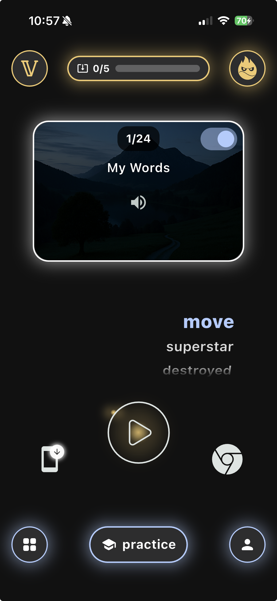
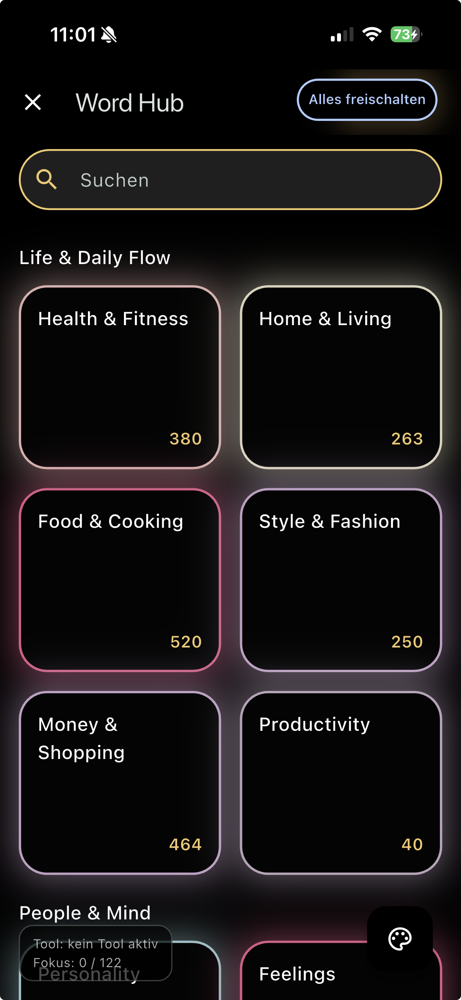
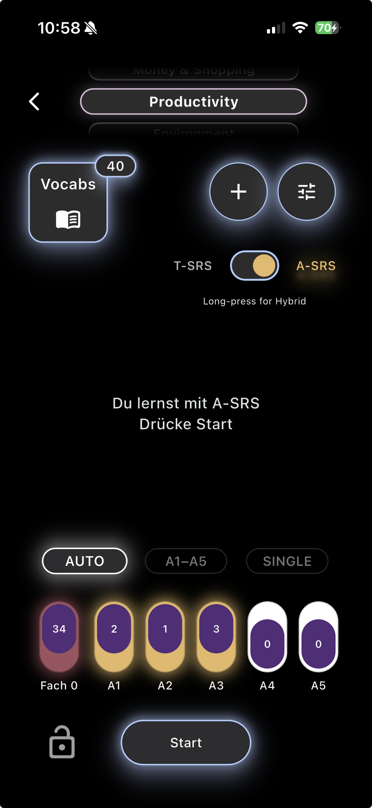
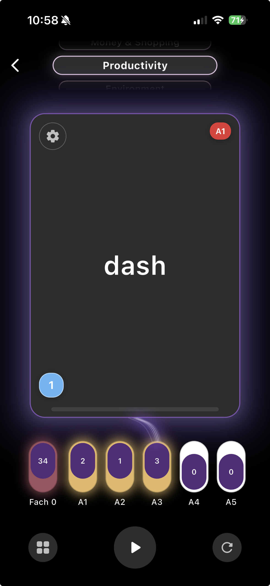
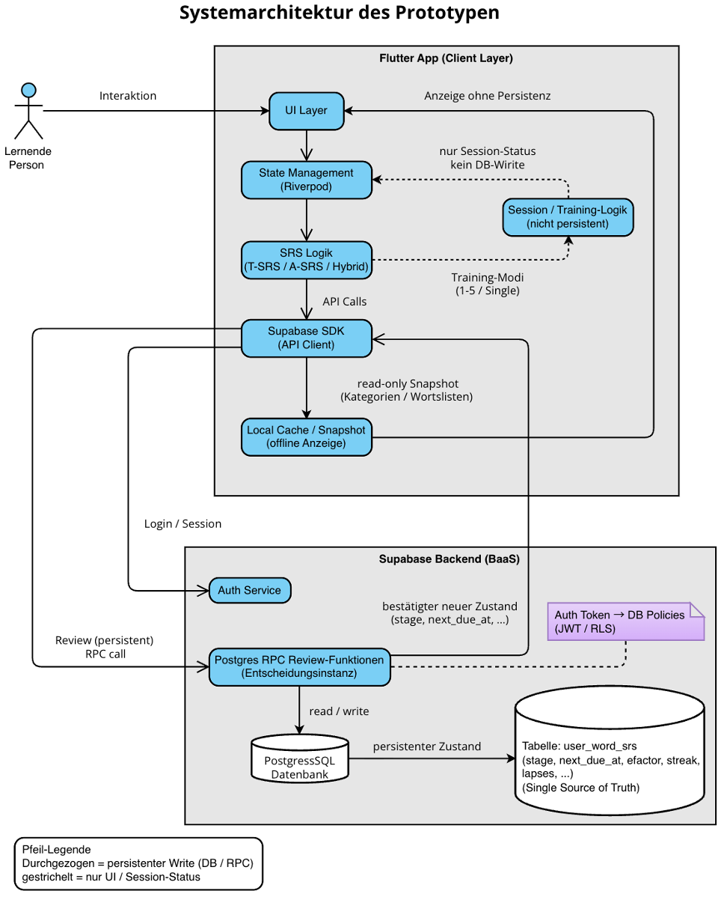
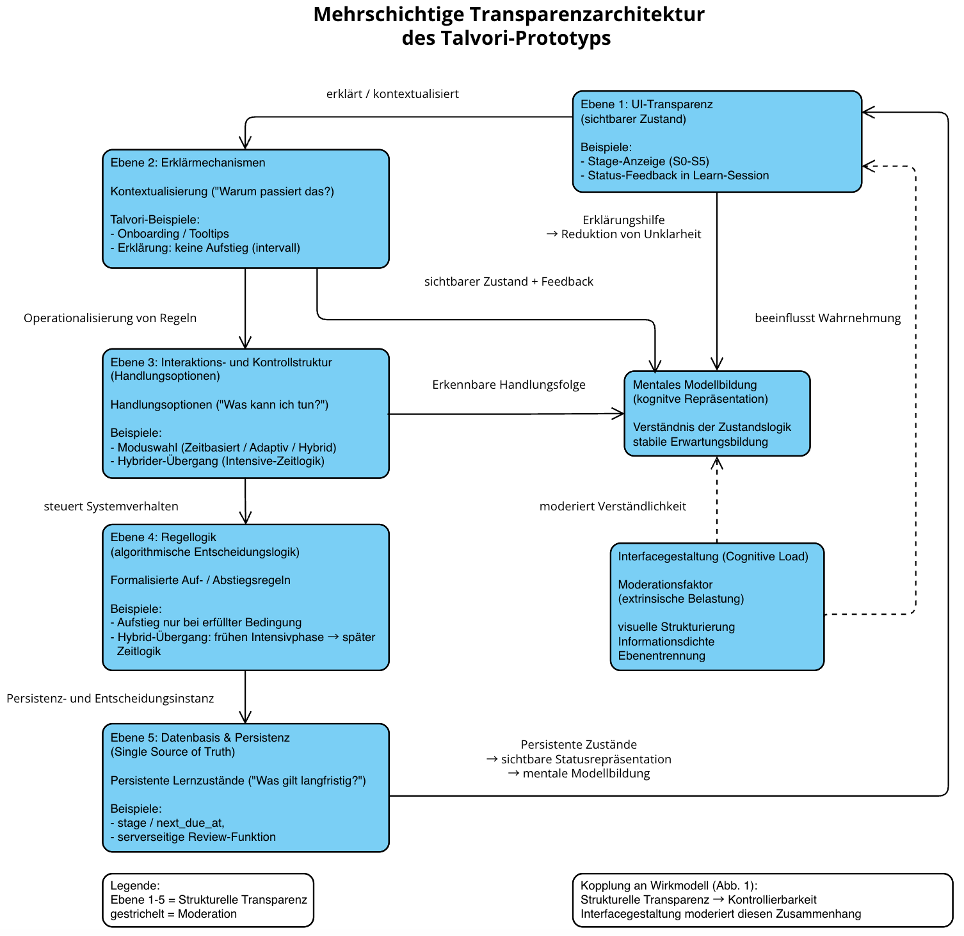
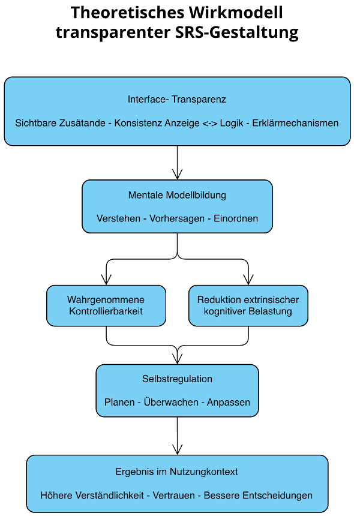

# Talvori – Transparent Spaced Repetition Language Learning App

Talvori is a mobile language learning application that implements a **transparent spaced-repetition system** designed to improve long-term vocabulary retention.

The project was developed as part of a **Bachelor thesis in Software Engineering** and focuses on making the internal learning logic of spaced-repetition systems **visible and understandable to the user**.

---

# App Screenshots

### Dashboard

The dashboard shows the current learning mode, vocabulary progress and spaced repetition stages.

---

### Word Hub

The Word Hub organizes vocabulary into thematic categories and provides access to the learning content.

---

### Category Overview

Users can browse categories and see how many words exist in each learning area.

---

### Learning Mode

Interactive learning interface with vocabulary cards, audio playback and learning progress tracking.

---

# Project Vision

Traditional spaced-repetition applications hide their internal learning logic behind algorithms.

Talvori takes a different approach.

The goal is to make the learning system **transparent and controllable** so that users understand:

- why a word appears
- when it will appear again
- how their learning progress evolves

This transparency supports **self-regulated learning** and allows learners to actively interact with the repetition system.

---

# System Architecture

Talvori follows a layered architecture separating the user interface, learning logic and persistent backend state.

The Flutter client handles user interaction and session state.  
Learning progress and repetition decisions are processed through backend logic implemented with Supabase and PostgreSQL.

---

# Transparency Architecture

Talvori introduces a multi-layer transparency architecture that makes internal learning mechanisms visible to the user.

The system reveals stages, rules and feedback directly through the interface.  
This allows learners to build mental models of how the learning system works.

---

# Theoretical Model

The system design is based on a theoretical model connecting interface transparency with cognitive understanding and self-regulated learning.

Transparent system feedback supports mental model formation, reduces cognitive load and increases perceived control over the learning process.

---

# Learning System

Talvori implements **three spaced-repetition modes**.

---

## Time-based Spaced Repetition (T-SRS)

A structured interval system where vocabulary appears again after predefined time intervals.

Example concept:
S0 → S1 → S2 → S3 → S4 → S5

Each stage represents increasing long-term retention.

---

## Adaptive Spaced Repetition (A-SRS)

An adaptive learning system that reacts to the learner's performance.

The system evaluates:

- correct answers
- streaks
- repetitions
- learning progress

Based on these signals the algorithm dynamically adjusts the learning stage.

---

## Hybrid Mode

Hybrid mode combines both approaches.

It merges:

- **time-based intervals**
- **adaptive difficulty**

This creates a balanced system that adapts to the learner while maintaining structured repetition intervals.

---

# Key Features

Talvori focuses on making the learning system understandable and interactive.

Main features include:

- transparent spaced repetition system  
- three learning modes (T-SRS, A-SRS, Hybrid)  
- vocabulary stage visualization  
- category-based vocabulary organization  
- modern mobile UI  
- real-time learning progress tracking  
- manual control of learning stages  

---

# Technologies

## Frontend

- Flutter
- Dart

## Backend

- Supabase
- PostgreSQL

## Architecture

- MVC-inspired architecture
- REST-based backend communication

## Development Tools

- Git
- GitHub

---

# Project Structure

Example simplified structure
lib
├── models
├── services
├── controllers
├── screens
└── widgets

backend
├── database
├── functions
└── migrations

---

# Research Context

This project was created as part of a **Bachelor thesis in Software Engineering**.

The research investigates how transparency in algorithm-driven learning systems influences:

- user understanding
- perceived control
- self-regulated learning behavior

Talvori therefore serves both as:

- a functional language learning application
- a research artifact for evaluating transparent learning algorithms

---

# Future Development

Planned improvements include:

- App Store release
- extended vocabulary datasets
- additional learning statistics
- improved adaptive learning algorithms
- cloud synchronization

---

# Author

Andreas Warda  
B.Sc. Software Engineering  
IU International University

GitHub  
https://github.com/warda777

---

# License

MIT License
