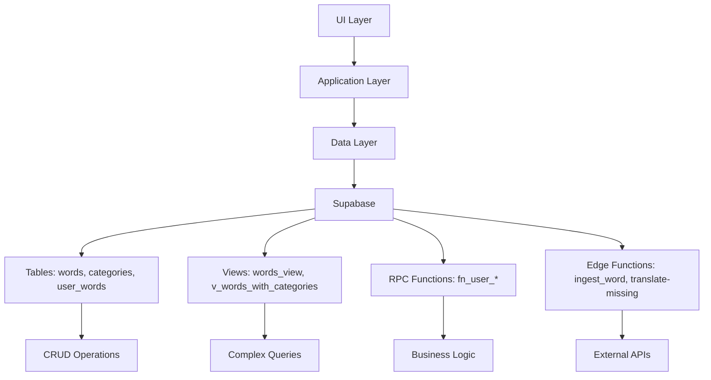

# 🗄️ Supabase Architecture Documentation

> **Letzte Aktualisierung:** $(date)  
> **Version:** 1.0  
> **Status:** ✅ Aktive Entwicklung

## 📋 Übersicht

Diese Dokumentation beschreibt alle Supabase-Tabellen, Views, RPC Functions und deren Verwendung in der Talvori-App.

---

## 🗂️ Tabellen (Tables)

### 1. `words` - Hauptwörter-Tabelle

**Zweck:** Speichert alle Wörter mit Übersetzungen und Metadaten

**Felder:**

- `id` (String) - Eindeutige UUID
- `text` (String) - Wort-Text
- `translation` (String) - Übersetzung
- `from_lang` (String) - Quellsprache
- `to_lang` (String) - Zielsprache
- `deck_id` (String?) - Optional: Deck-Zuordnung
- `favorite` (Boolean) - Favorit-Status
- `created_at` (DateTime) - Erstellungsdatum
- `due_at` (DateTime?) - Fälligkeitsdatum
- `srs_stage` (Integer) - SRS-Stufe

**Verwendung in der App:**

- `fetchRecentWords()` - Neueste Wörter laden
- `testIngestWord()` - Test-Funktion
- Word-Erstellung in Edge Functions

**Aktionen:** SELECT, INSERT, UPDATE

---

### 2. `categories` - Kategorien-Tabelle

**Zweck:** Organisiert Wörter in thematische Kategorien

**Felder:**

- `id` (String) - Eindeutige UUID
- `name` (String) - Kategorie-Name
- `slug` (String) - URL-freundlicher Name
- `group_slug` (String?) - Gruppenzuordnung
- `group_name` (String?) - Gruppenname
- `order_index` (Integer?) - Sortierreihenfolge
- `type` (String) - Kategorie-Typ

**Verwendung in der App:**

- `_ensureCategorySlug()` - UUID zu Slug konvertieren
- `findCategoryIdByName()` - Kategorie-ID per Name finden
- `fetchAllCategories()` - Alle Kategorien laden
- Auth-Check in `main.dart`

**Aktionen:** SELECT

---

### 3. `user_words` - User-Wörter Verknüpfung

**Zweck:** Verknüpft Benutzer mit Wörtern (Meine Wörter, Favoriten)

**Felder:**

- `user_id` (String) - Benutzer-UUID
- `word_id` (String) - Wort-UUID
- `picked` (Boolean) - In "Meine Wörter" markiert
- `created_at` (DateTime) - Erstellungsdatum

**Verwendung in der App:**

- `addToMyWords()` - Wort zu "Meine Wörter" hinzufügen
- `removeFromMyWords()` - Wort aus "Meine Wörter" entfernen
- `getPickedWordIds()` - Gemerkte Wort-IDs abfragen
- `fetchMyWords()` - Meine Wörter laden
- `countMyWords()` - Anzahl gemerkter Wörter

**Aktionen:** SELECT, INSERT, DELETE, UPSERT

---

## 👁️ Views (Sichten)

### 4. `words_view` - Wörter-View

**Zweck:** Optimierte Sicht für komplexe Wörter-Abfragen

**Verwendung in der App:**

- `fetchByFilter()` - Gefilterte Wörter-Suche mit Pagination
- Unterstützt Filter nach: Kategorie, Level, POS, Domain, Query

**Aktionen:** SELECT (mit komplexen Filtern)

---

### 5. `v_words_with_categories` - Wörter mit Kategorien

**Zweck:** Join-View für Wörter mit Kategorie-Informationen

**Verwendung in der App:**

- Edge Function `translate-missing`
- Komplexe Abfragen mit Kategorie-Daten

**Aktionen:** SELECT

---

### 6. `v_words_user` - Wörter mit User-Flags

**Zweck:** Optimierte Sicht für Wörter mit allen User-bezogenen Informationen

**Spalten:**

- Basis-Wort-Daten: `id`, `text`, `translation`, `level`, `pos`
- User-Flags: `in_my_words`, `favorite_user`, `picked_user`, `srs_stage_user`
- Meta-Daten: `next_due_at_user`, `user_added_at`, `category_slug`, `group_slug`

**Verwendung in der App:**

- `fetchWordUserViewsByFilter()` - Gefilterte Wörter mit User-Flags
- Quick Sets Filter: My Words, Favorites, Known Words, My Mix
- Mix Feature: Multi-category word collections
- Word List Screen: Alle Listen mit User-Status

**Aktionen:** SELECT (mit komplexen Filtern und User-Flags)

---

## ⚙️ RPC Functions (Stored Procedures)

### Lern-System Functions

#### `fn_user_stage_counts`

**Zweck:** Anzahl der Wörter pro SRS-Stufe pro Kategorie
**Parameter:** `cat` (String) - Kategorie-ID
**Rückgabe:** `stage` (Integer), `cnt` (Integer)
**Verwendung:** `fetchStageCounts()` - Stufen-Balken in UI

#### `fn_user_workload_today`

**Zweck:** Tägliche Arbeitslast (fällige + neue Wörter)
**Parameter:** `cat` (String) - Kategorie-ID
**Rückgabe:** `newTotal` (Integer), `dueToday` (Integer)
**Verwendung:** `fetchWorkloadToday()` - Tägliche Ziele

#### `fn_user_learn_queue`

**Zweck:** Alle Lern-Wörter einer Kategorie
**Parameter:** `cat` (String), `take` (Integer)
**Rückgabe:** Liste von `WordUserView`
**Verwendung:** `fetchLearnQueueAll()` - Komplette Lern-Queue

#### `fn_user_learn_queue_mode`

**Zweck:** Lern-Queue mit verschiedenen Modi
**Parameter:**

- `category_id` (String) - Kategorie-ID
- `mode` (String) - 'all', 'reviews', 'single'
- `single_stage` (Integer?) - Nur bei mode='single'
- `limit` (Integer) - Maximale Anzahl Wörter (Standard: 50)
  **Rückgabe:** Liste von `WordUserView`
  **Verwendung:** `fetchLearnQueueForMode()` - Modus-basierte Lern-Queue

#### `fn_user_review`

**Zweck:** Review-Ergebnis verarbeiten
**Parameter:**

- `p_word` (String) - Wort-ID
- `p_result` (Boolean) - Richtig/Falsch
  **Rückgabe:** `srs_stage` (Integer), `next_due_at` (String)
  **Verwendung:** `submitReview()` - SRS-Algorithmus

#### `fn_user_category_progress`

**Zweck:** Fortschritt einer Kategorie
**Parameter:** `cat` (String) - Kategorie-ID
**Rückgabe:** Stufen-Array, Gesamtanzahl, fällige Wörter
**Verwendung:** `fetchCategoryProgress()` - Fortschritts-Anzeige

### Single-Session (Single Mode)

#### `fn_single_session_seed`

**Zweck:** Startzustand für Single-Session vorbereiten (füllt SRC-Bucket)
**Parameter:** `p_category_id` (String), `p_stage` (Integer), `p_limit` (Integer)
**Verwendung:** `singleSeed(catId, stage)`

#### `fn_single_session_counts`

**Zweck:** Zähler für Session-Buckets ermitteln
**Parameter:** `p_category_id` (String), `p_stage` (Integer)
**Rückgabe:** `src`, `sr1`, `sr2` (Integer)
**Verwendung:** `singleCounts(catId, stage)`

#### `fn_single_session_move`

**Zweck:** Aktuelle Karte in SR1/SR2 verschieben
**Parameter:** `p_category_id` (String), `p_stage` (Integer), `p_word_id` (String), `p_correct` (Boolean)
**Verwendung:** `singleMove(catId, stage, wordId, correct)`

#### `fn_single_session_reset`

**Zweck:** Session zurücksetzen (alle Karten zurück nach SRC)
**Parameter:** `p_category_id` (String), `p_stage` (Integer)
**Verwendung:** `singleReset(catId, stage)`

#### `fn_single_session_next`

**Zweck:** Nächste Karte aus SRC (Single-Session) liefern
**Parameter:** `p_category_id` (String), `p_stage` (Integer)
**Rückgabe:** `{ word_id, bucket }` (als Map oder List mit erster Zeile)
**Verwendung:** `singleNextWordId(catId, stage)`

### Kategorie-Management Functions

#### `fn_reset_user_category`

**Zweck:** Kategorie für Benutzer zurücksetzen
**Parameter:** `p_category_id` (String) - Kategorie-ID
**Verwendung:** `resetCategory()` - Kategorie-Reset

#### `fn_seed_user_category`

**Zweck:** Kategorie für Start vorbereiten
**Parameter:** `p_category_id` (String) - Kategorie-ID
**Verwendung:** `seedForStart()` - Lern-Session starten

#### `fn_category_word_count`

**Zweck:** Wort-Anzahl pro Kategorie
**Parameter:** `p_category_id` (String) - Kategorie-ID
**Rückgabe:** Anzahl Wörter
**Verwendung:** `getCategoryWordCount()` - Kategorie-Statistiken

---

## 🔧 Edge Functions

### `ingest_word`

**Zweck:** Neues Wort über externe API erstellen
**Parameter:** `text`, `fromLang`, `toLang`
**Verwendung:** Wort-Erstellung mit Übersetzung

### `translate-missing`

**Zweck:** Fehlende Übersetzungen ergänzen
**Parameter:** `category` (optional)
**Verwendung:** Batch-Übersetzung fehlender Wörter

---

## 🔄 Datenfluss-Architektur

---

## 📊 Verwendungsstatistik

| Komponente                  | Häufigkeit | Kritikalität |
| --------------------------- | ---------- | ------------ |
| `fn_user_learn_queue_mode`  | Hoch       | Kritisch     |
| `fn_user_review`            | Hoch       | Kritisch     |
| `fn_user_category_progress` | Hoch       | Kritisch     |
| `words`                     | Hoch       | Kritisch     |
| `v_words_user`              | Hoch       | Kritisch     |
| `user_words`                | Mittel     | Wichtig      |
| `categories`                | Mittel     | Wichtig      |
| `words_view`                | Mittel     | Wichtig      |

## 🎯 Filter-System

### WordListFilter Types

Die App unterstützt verschiedene Filter-Kategorien über `WordListFilter`:

**Filter-Kategorien:**

- **Category**: Filtern nach Kategorie (UUID oder Slug)
- **Level**: CEFR-Level (A1, A2, B1, B2, C1, C2)
- **POS**: Part of Speech (noun, verb, adjective, etc.)
- **Domain**: Nach Gruppen-Domain (group_slug)
- **About**: Quick Sets Filter
  - `my-words`: In My Words markierte Wörter
  - `favorites`: User's Favorites
  - `known-words`: Wörter ab S1-Stufe
  - `my-mix`: Custom word collections
- **Query**: Textsuche (ilike auf text/translation)

**Verwendung:**

- `fetchWordUserViewsByFilter()` in SupabaseWordRepository
- Word List Screen mit Pagination
- Sort-Modi: Neueste, Alphabetisch

---

## 🚀 Geplante Erweiterungen

- [ ] **Performance-Optimierung:** Indizes für häufige Abfragen
- [ ] **Caching:** Redis für wiederkehrende Daten
- [ ] **Analytics:** Lern-Statistiken erweitern
- [ ] **Offline-Support:** Lokale Synchronisation

---

## 📝 Changelog

### Version 1.3 (Januar 2025)

- ✅ Mix Feature: Custom word collections with search and multi-category support
- ✅ Quick Sets: Fast access to predefined word sets (My Words, Favorites, Known Words, My Mix)
- ✅ Word List Filter: Advanced filtering with category, level, POS, domain, and query filters
- ✅ Enhanced Views: v_words_user with complete user flags support

### Version 1.2 (Januar 2025)

- ✅ S0-Lock Feature: Client-seitige Sperrung der S0-Stufe (keine neuen Karten)
- ✅ Keine Backend-Änderungen erforderlich (Client-seitige UI-Funktion)

### Version 1.1

- ✅ Grundlegende Tabellen-Struktur
- ✅ SRS-Algorithmus implementiert
- ✅ Lern-Modi (S0-S5, S1-S5, Single)
- ✅ User-Wörter Management
- ✅ Kategorie-System
- ✅ Single-Mode: Keine Stage-Änderung im Single-Modus

### Version 1.0

- ✅ Grundlegende Tabellen-Struktur
- ✅ SRS-Algorithmus implementiert
- ✅ Lern-Modi (S0-S5, S1-S5, Single)
- ✅ User-Wörter Management
- ✅ Kategorie-System

---

## 🔍 Troubleshooting

### Häufige Probleme:

1. **Null-Safety:** Alle String-Felder mit `?? ''` absichern
2. **RPC-Parameter:** Korrekte Parameter-Namen verwenden
3. **Auth-Status:** User-Authentifizierung vor Datenzugriff prüfen

### Debug-Tipps:

- RPC-Calls mit `debugPrint()` loggen
- Supabase-Dashboard für Live-Daten nutzen
- Edge Function Logs in Supabase Console prüfen

---

_Diese Dokumentation wird kontinuierlich aktualisiert. Bei Änderungen bitte entsprechend anpassen._
