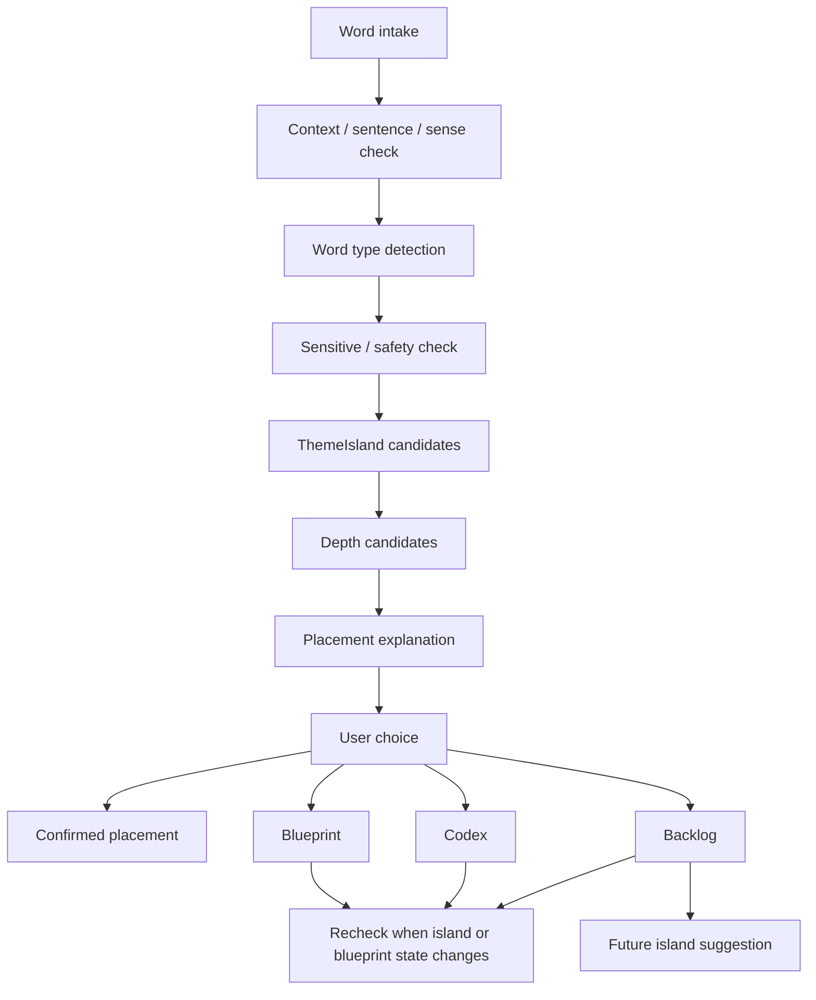

# Phase 2G-M13-D: Word-to-Island UX Flow

Stand: 2026-06-06

Status: `Planung gestartet / UX-Flow definiert`

## 1. Zweck

Dieses Dokument plant den Word-to-Island UX Flow aus Nutzersicht. Es klaert,
wie ein gelerntes, importiertes oder manuell hinzugefuegtes Wort zu einem
sicheren ThemeIsland-Vorschlag, einer passenden Depth-Ebene und einer
Nutzerentscheidung fuehrt.

M13-D ist nur Planungs- und UX-Strukturmaterial. Es ist keine finale
Routing-Implementierung, keine finale Datenstruktur, keine Runtime-
Konfiguration, keine automatische Wortplatzierung, keine App-Integration,
keine Assetfreigabe und keine ThemeIsland-Umsetzung.

## 2. Ausgangslage

M12-B/M12-B2 bestaetigen Word-to-Island Routing als erste Planungsrichtung:
Routing macht Vorschlaege, keine automatische Platzierung. M13-C konkretisiert
ThemeIsland-Kandidaten als Capability Sheets. M13-D uebersetzt diese
Grundlagen in einen einfachen Nutzerflow.

Kernprinzip:

Ein Wort darf erst sichtbar in der Welt erscheinen, wenn ThemeIsland, Depth-
Ebene, Safety-Kontext, Placement-Anforderung und Nutzerentscheidung zusammen
passen.

## 3. UX-Flow-Grundmodell

1. Wort kommt in Talvori an.
2. Kontext, Satz und Sense werden geprueft.
3. Worttyp wird erkannt.
4. Sensitive-/Safety-Check laeuft.
5. ThemeIsland-Kandidaten werden vorgeschlagen.
6. Depth-Ebene wird vorgeschlagen.
7. Placement-Optionen werden kurz erklaert.
8. Nutzer bestaetigt, aendert oder verschiebt.
9. Ergebnis geht in Placement, Blueprint, Codex oder Backlog.
10. Spaetere Aenderung bleibt moeglich.

Pflichtregeln:

- Kein automatisches sichtbares Platzieren.
- Nutzerbestaetigung bleibt Pflicht.
- Mehrdeutige Woerter brauchen Sense- oder Kontextentscheidung.
- Sensitive Begriffe gehen nicht automatisch in Weltobjekte.
- Kleine Objekte gehen nicht automatisch in IslandView.
- Verben werden nicht als statische Objekte erzwungen.
- Gebaeudeteile brauchen passenden Blueprint oder Bauzustand.

## 4. Textuelles UX-Diagramm

Lesart:

Der Flow endet nicht automatisch in sichtbarer Platzierung. Placement ist nur
eine moegliche Nutzerentscheidung neben Blueprint, Codex und Backlog.

## 5. Flow-Pfade

### 5.1 Pfad A: Sicher Direkt Passend

Beispiele: `apple`, `chair`, `book`, `pencil`

| Frage | Antwort |
| --- | --- |
| Was darf vorgeschlagen werden? | Ein passender ThemeIsland- und Depth-Vorschlag, z. B. `apple` fuer Garten/Essen/Einkauf oder `pencil` fuer Schule/Federmappe. |
| Was darf nicht automatisch sichtbar werden? | Kein Objekt erscheint ohne Nutzerbestaetigung und passende Depth-Ebene. |
| ThemeIsland-Kandidaten | Zuhause, Schule, Garten, Essen, Einkauf je nach Wort und Kontext. |
| Passende Depth-Ebene | Interior, ContainerOpenView, ObjectView oder DetailInteractionView; nicht automatisch IslandView. |
| Codex/Blueprint/Backlog | Wenn die passende Insel, Zone oder der passende Container fehlt. |
| Nutzerentscheidung | Vorschlag akzeptieren, andere Insel waehlen, Codex/Blueprint/Backlog nutzen. |
| Stop-Regel | Kein sicher wirkendes Wort darf ohne Bestaetigung sichtbar platziert werden. |

UX-Hinweis:

Der Nutzer soll nicht bei jedem einfachen Wort mit zu vielen Optionen belastet
werden. Talvori kann einen empfohlenen Standard anzeigen: "Passt gut zu
Schule / Federmappe. Jetzt vormerken?" Die Aenderbarkeit bleibt sichtbar.

### 5.2 Pfad B: Mehrdeutig

Beispiele: `bank`, `spring`, `mouse`, `light`

| Frage | Antwort |
| --- | --- |
| Was darf vorgeschlagen werden? | Eine Sense-Auswahl oder ein Kontextvorschlag, z. B. Sitzbank, Geldinstitut oder Flussufer. |
| Was darf nicht automatisch sichtbar werden? | Keine automatische Insel-, Objekt- oder Gebaeudezuordnung. |
| ThemeIsland-Kandidaten | Abhaengig vom Sense: Stadt/Natur/Technik/Einkauf/Kultur. |
| Passende Depth-Ebene | Erst nach Sense-Auswahl bestimmbar. |
| Codex/Blueprint/Backlog | Standardfallback, wenn Kontext fehlt. |
| Nutzerentscheidung | Bedeutung waehlen, Kontext bestaetigen oder spaeter entscheiden. |
| Stop-Regel | Kein Multi-home- oder mehrdeutiges Wort ohne Nutzerziel, Satzkontext oder Sense-Auswahl final platzieren. |

UX-Hinweis:

Tali/Vori soll kurz fragen: "Meinst du die Sitzbank, die Bank fuer Geld oder
das Flussufer?" Danach wird nur der gewaehlte Sinn weitergeroutet.

### 5.3 Pfad C: Gebaeudeteil Oder Zustandsabhaengig

Beispiele: `window`, `door`, `roof`, `wall`

| Frage | Antwort |
| --- | --- |
| Was darf vorgeschlagen werden? | Blueprint, Bauzustand oder spaeteres Gebaeude-Detail. |
| Was darf nicht automatisch sichtbar werden? | Kein frei schwebendes Fenster, Dach oder Wandobjekt. |
| ThemeIsland-Kandidaten | Zuhause/Alltag, Stadt/Dorf, Schule, Arbeit, ggf. andere Gebaeude-Themen. |
| Passende Depth-Ebene | BuildingView, BuildState, BlueprintEntry. |
| Codex/Blueprint/Backlog | Blueprint oder Backlog, wenn kein passendes Gebaeude existiert. |
| Nutzerentscheidung | Als Gebaeude-Blueprint vormerken, Codex speichern oder spaeter entscheiden. |
| Stop-Regel | Kein Gebaeudeteil ohne passenden Blueprint oder Bauzustand. |

UX-Hinweis:

Die Antwort soll ruhig sein: "Fenster passt spaeter zu einem Gebaeude. Ich
merke es als Blueprint vor." Das verhindert falsche Platzierung auf der Insel.

### 5.4 Pfad D: Kleinteil / Container-Objekt

Beispiele: `key`, `pencil`, `spoon`, `seed`

| Frage | Antwort |
| --- | --- |
| Was darf vorgeschlagen werden? | Ein Container-, ObjectView- oder DetailInteraction-Vorschlag. |
| Was darf nicht automatisch sichtbar werden? | Keine dauerhafte Anzeige in IslandView und keine Kleinteil-Wolke auf PlotView. |
| ThemeIsland-Kandidaten | Zuhause, Schule, Garten, Essen, Einkauf je nach Kontext. |
| Passende Depth-Ebene | ContainerOpenView, ObjectView, DetailInteractionView, Codex. |
| Codex/Blueprint/Backlog | Wenn Container, Raum oder Insel fehlen oder Mobile-Clutter-Risiko hoch ist. |
| Nutzerentscheidung | In Container vormerken, Challenge starten, nur Codex speichern oder spaeter entscheiden. |
| Stop-Regel | Keine TinyObjects dauerhaft in IslandView. |

UX-Hinweis:

Statt "Loeffel auf Insel platzieren" sollte Talvori sagen: "Loeffel passt gut
in eine Kuechenschublade. Moechtest du ihn dort fuer spaeter vormerken?"

### 5.5 Pfad E: Aktion / Verb

Beispiele: `cook`, `grow`, `repair`, `travel`

| Frage | Antwort |
| --- | --- |
| Was darf vorgeschlagen werden? | Eine Quest, Mini-Sequenz, Animation spaeter, Dialog oder DetailInteraction. |
| Was darf nicht automatisch sichtbar werden? | Kein Verb als statisches Objekt. |
| ThemeIsland-Kandidaten | Essen, Garten, Arbeit/Werkstatt, Reisen/Verkehr je nach Verb. |
| Passende Depth-Ebene | ActionOrSequence, DetailInteractionView, QuestWithoutSymbol, Codex. |
| Codex/Blueprint/Backlog | Wenn Sequenzsystem, passende Objekte oder Regeln fehlen. |
| Nutzerentscheidung | Sequenz vormerken, als Codex lernen, spaeter entscheiden. |
| Stop-Regel | Kein Verb als Objekt erzwingen. |

UX-Hinweis:

Tali/Vori kann erklaeren: "Cook ist eher eine Aktion. Wir merken es fuer eine
spaetere Kuechenaufgabe vor."

### 5.6 Pfad F: Abstrakter Begriff

Beispiele: `freedom`, `idea`, `memory`, `rule`

| Frage | Antwort |
| --- | --- |
| Was darf vorgeschlagen werden? | Codex, ContextCard, CompanionDialog, ggf. spaeter eine Szene oder Quest ohne Symbolzwang. |
| Was darf nicht automatisch sichtbar werden? | Keine pauschale Symbolik, kein Pflichtobjekt, keine Deko-Platzierung. |
| ThemeIsland-Kandidaten | Kultur/Gesellschaft, Schule, Zuhause/Dialog, Codex-only je nach Kontext. |
| Passende Depth-Ebene | AbstractOrSensitive, Codex, ContextCard, Dialog. |
| Codex/Blueprint/Backlog | Standardweg, solange keine passende Szene oder Frage existiert. |
| Nutzerentscheidung | Neutral erklaeren lassen, im Codex speichern, spaeter Kontext waehlen. |
| Stop-Regel | Keine automatische Darstellung abstrakter Begriffe. |

UX-Hinweis:

Abstrakte Begriffe duerfen im Lernsystem wichtig sein, ohne ein sichtbares
Weltobjekt zu brauchen.

### 5.7 Pfad G: Sensibler Begriff

Beispiele: Gesundheit, Religion, Politik, Gericht, Polizei, Krankenhaus

| Frage | Antwort |
| --- | --- |
| Was darf vorgeschlagen werden? | Neutraler CodexEntry, ContextCard, CompanionDialog oder BacklogOnly. |
| Was darf nicht automatisch sichtbar werden? | Kein Gebaeude, Symbol, Asset, Reward, Druckmechanik oder dramatische Companion-Reaktion. |
| ThemeIsland-Kandidaten | Sensitive/Special nur nach M12-D-Vertiefung; sonst Codex/Backlog. |
| Passende Depth-Ebene | AbstractOrSensitive, Codex, ContextCard, BacklogOnly. |
| Codex/Blueprint/Backlog | Standardweg. |
| Nutzerentscheidung | Neutrale Erklaerung waehlen, nicht sichtbar darstellen, spaeter entscheiden. |
| Stop-Regel | Keine automatische Visualisierung sensibler Begriffe. |

UX-Hinweis:

Tali/Vori bleibt ruhig und neutral: "Das ist ein sensibles Thema. Ich kann es
dir im Codex erklaeren, ohne es in der Welt zu platzieren."

## 6. UX-Entscheidungspunkte

Der Nutzer kann:

- Vorschlag akzeptieren,
- andere ThemeIsland waehlen,
- nur im Codex speichern,
- als Blueprint vormerken,
- spaeter entscheiden,
- nicht sichtbar darstellen,
- bei mehrdeutigen Woertern Bedeutung auswaehlen,
- bei sensiblen Woertern neutrale Erklaerung waehlen.

Einfache Defaults:

- Bei eindeutigem, passendem Wort: ein empfohlener Vorschlag plus "aendern"
  und "spaeter".
- Bei mehrdeutigem Wort: kurze Sense-Auswahl statt langer Matrix.
- Bei Kleinteil: Container/Depth vorschlagen, nicht IslandView.
- Bei Gebaeudeteil: Blueprint/Backlog statt Sofortplatzierung.
- Bei Verb: Quest/Sequenz vormerken oder Codex.
- Bei abstrakt/sensibel: Codex/ContextCard/Backlog als Standard.

UX-Schutz:

Der Nutzer darf nicht bei jedem Wort in eine schwere Entscheidung gezwungen
werden. Talvori soll Vorschlaege vereinfachen, aber die Aenderbarkeit sichtbar
halten.

## 7. Tali/Vori-Rolle

Tali/Vori darf:

- kurz und freundlich erklaeren,
- Vorschlaege begruenden,
- auf Risiken hinweisen,
- bei Mehrdeutigkeit eine einfache Sense-Frage stellen,
- Codex/Blueprint/Backlog als sichere Option anbieten,
- spaeter an vorgemerkte Woerter erinnern, wenn dies fair und optional bleibt.

Tali/Vori darf nicht:

- Entscheidungen erzwingen,
- sensible Begriffe dramatisieren,
- Premium-/Paywall-Logik im Routing verwenden,
- automatische Platzierung ausloesen,
- falsche Sicherheit suggerieren,
- aus einem Wort eine finale ThemeIsland-Umsetzung ableiten.

Beispieltexte:

- "Das passt gut zu Schule / Federmappe. Moechtest du es dort vormerken?"
- "Meinst du `bank` als Sitzbank oder als Geldinstitut?"
- "`window` passt spaeter zu einem Gebaeude. Ich kann es als Blueprint merken."
- "Das ist ein sensibles Thema. Wir koennen es neutral im Codex speichern."

## 8. Ergebnisziele

Nach dem UX-Flow landet ein Wort in genau einem sicheren Ergebniszustand:

| Ergebnis | Bedeutung |
| --- | --- |
| `PlacementCandidate` | Nutzer hat eine sichtbare Platzierungsoption bestaetigt, aber keine finale Runtime-Struktur ist definiert. |
| `BlueprintEntry` | Wort ist fuer spaeteren Bauzustand, Gebaeude oder Objektkontext vorgemerkt. |
| `CodexEntry` | Wort wird gelernt/erklaert, ohne sichtbare Platzierung. |
| `WordObjectBacklog` | Wort wartet auf passende Insel, Depth-Ebene, Sense, Safety-Regel oder Nutzerentscheidung. |
| `FutureIslandSuggestion` | Wort kann spaeter eine neue ThemeIsland-Empfehlung stuetzen. |

Diese Begriffe sind Planungsbegriffe, keine finale Datenstruktur.

## 9. Ueberforderungs-Schutz

Talvori soll die Routing-UX nicht wie ein Admin-Panel wirken lassen.

Regeln:

- maximal ein primaerer Vorschlag pro Wort,
- wenige sichtbare Alternativen,
- klare "spaeter entscheiden"-Option,
- keine technische Capability-Matrix im Nutzerflow,
- Tali/Vori fasst kurz zusammen,
- Details erst bei Bedarf,
- sensible oder mehrdeutige Begriffe zuerst neutral absichern.

## 10. Stop-Regeln

Aus M13-D darf nicht abgeleitet werden:

- keine finale Word-to-Island-Implementierung aus M13-D,
- keine finale Routing-Datenstruktur aus M13-D,
- keine Runtime-Konfiguration aus M13-D,
- keine automatische Wortplatzierung aus M13-D,
- keine automatische ThemeIsland-Auswahl ohne Nutzerbestaetigung,
- keine sichtbare Platzierung ohne passende Depth-Ebene,
- keine Kleinteile dauerhaft in IslandView,
- keine Gebaeudeteile ohne passenden Blueprint oder Bauzustand,
- keine Verben als statische Objekte erzwingen,
- keine sensiblen Begriffe automatisch visualisieren,
- keine App-/Assetfreigabe aus M13-D,
- kein Code aus M13-D,
- kein `frame_started` oder Bauzustand aus M13-D.

## 11. Naechster Erlaubter Schritt

Erlaubt ist nur:

- M13-D reviewen,
- M13-D dokumentarisch nachbessern,
- M13-E Device And Accessibility Preview Plan als reinen Planungsblock
  starten,
- M13-F Container Pagination And Tap Target Rules als reinen Planungsblock
  starten,
- einzelne UX-Pfade textlich vertiefen.

Weiterhin nicht erlaubt:

- Flutter-/Dart-Code,
- App-Integration,
- Tests,
- Spielassets,
- PNG-Erzeugung oder PNG-Aenderung,
- finale Word-to-Island-Implementierung,
- finale Datenstruktur,
- Runtime-Konfiguration,
- automatische Wortplatzierung,
- ThemeIsland-Umsetzung,
- `frame_started`,
- Bauzustaende.
