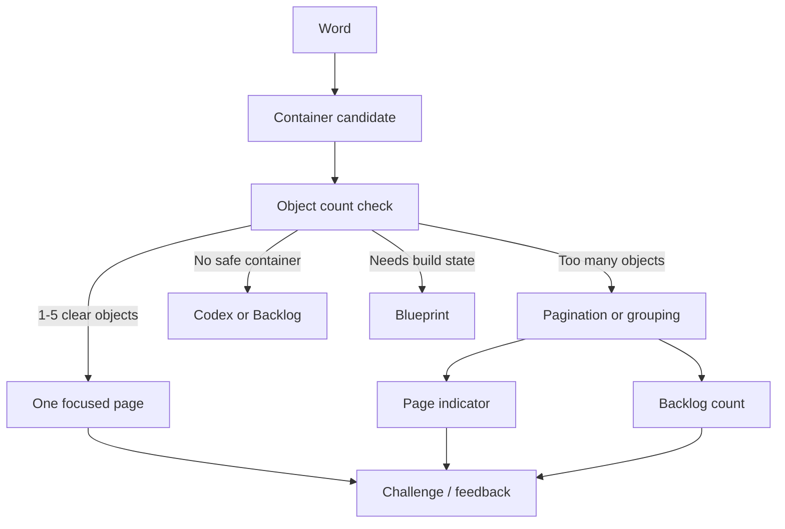

# Phase 2G-M13-F: Container Pagination And Tap Target Rules

Stand: 2026-06-06

Status: `Planung gestartet / Container- und Tap-Target-Regeln definiert`

## 1. Zweck

Dieses Dokument plant, wie ContainerOpenView, DetailInteractionView, kleine
Objektgruppen und Lernobjekte spaeter auf Mobile sauber bedienbar bleiben.
Es definiert Regeln fuer Pagination, sichtbare Objektanzahl, Tap-Ziele,
Fokusobjekte, Labels, Scroll/Swipe/Pages, Clutter-Vermeidung und QA-Overlays.

M13-F ist nur Planungs- und Visualisierungsmaterial. Es ist keine finale UI,
keine finale Datenstruktur, keine Runtime-Konfiguration, keine App-
Integration, kein Test und keine Implementierungsfreigabe.

Es werden keine PNGs erzeugt. Visualisierung erfolgt nur als Mermaid,
ASCII-Wireframe, Markdown-Tabelle und QA-/Overlay-Beschreibung.

## 2. Warum M13-F Noetig Ist

Talvori soll viele Lernwoerter aufnehmen koennen, aber Mobile darf nicht zu
einem Suchbild voller Kleinteile werden.

Kernprobleme:

- Kleine Objekte wie Stift, Loeffel, Samen, Schluessel oder Schraube duerfen
  nicht dauerhaft in IslandView als winzige Touch-Ziele liegen.
- Container duerfen nicht zu reinen Objektlisten werden.
- Viele Woerter koennen denselben Container betreffen.
- Mobile Screens brauchen klare Fokusobjekte, grosse Tap-Ziele und einfache
  Seitenlogik.
- Accessibility braucht Alternativen zu Farbe, Audio und sehr kleinen
  visuellen Details.
- Tali/Vori, Labels, Belohnungen und Hinweise duerfen Container-Inhalte nicht
  verdecken.

M13-F ergaenzt M12-E und M13-E: M12-E definiert Mobile-/Clutter-Grundregeln,
M13-E definiert Device-/Accessibility-Pruefungen, M13-F konkretisiert die
Regeln fuer Container und kleine Interaktionsobjekte.

## 3. Container-Grundregeln

### 3.1 Sichtbare Objektanzahl

Planungswerte, nicht Runtime-Konfiguration:

| Ebene | Sichtbare Objekte | Regel |
| --- | --- | --- |
| `ContainerOpenView` | 3 bis 5 Challenge-Objekte | Nur die aktuell sinnvollen Lernobjekte zeigen. |
| `DetailInteractionView` | 1 Hauptobjekt plus 2 bis 4 Auswahlobjekte | Fokus und Aufgabe muessen sofort klar sein. |
| `ObjectView` | 1 Fokusobjekt plus wenige Details | Kleine Details nur bei Bedarf zeigen. |
| `IslandView` | 0 TinyObjects | Keine Kleinteile als direkte Touch-Ziele. |

Wenn mehr als 5 kleine Objekte gleichzeitig relevant sind, braucht der
Container Pagination, Filter, Backlog oder Codex statt einer vollen Liste.

### 3.2 Primaeres Fokusobjekt

Jede Container-Seite braucht ein primaeres Fokusobjekt oder eine primaere
Lernhandlung.

Beispiele:

- Federmappe: "Finde den Bleistift."
- Kuechenschublade: "Tippe den Loeffel."
- Gartenbeet: "Waehle die Giesskanne."
- Werkzeugkiste: "Finde den Hammer."
- Bootskiste: "Finde den Kompass."

Ohne Fokusobjekt wirkt der Container wie Inventarverwaltung statt Lernmoment.

### 3.3 Sekundaere Objekte

Sekundaere Objekte duerfen sichtbar sein, wenn sie die Challenge unterstuetzen:

- Distraktoren bei Tap-Auswahl,
- Vergleichsobjekte bei Matching,
- sortierbare Objekte bei Sortieren,
- Kontextobjekte bei Mini-Sequenzen spaeter.

Sie duerfen die Aufgabe nicht verdecken oder das primaere Objekt optisch
ueberstimmen.

### 3.4 Backlog-Objekte

Backlog-Objekte duerfen gezaehlt, aber nicht als volle Objektliste angezeigt
werden.

Erlaubt:

- "Weitere 7 Woerter warten."
- "3 neue Schulwoerter passen spaeter in die Federmappe."
- "Mehr anzeigen" als spaeteres Konzept.

Nicht erlaubt:

- 20 Mini-Icons in einer Federmappe,
- mehrere Seiten ohne klare Lernhandlung,
- unsortierte Inventarliste als Nutzeransicht.

### 3.5 Label-Sichtbarkeit

Labels sind kontextuell:

- sichtbar bei Fokus,
- sichtbar bei Challenge,
- sichtbar bei Feedback,
- sichtbar im Accessibility-Modus,
- sonst reduziert oder ausgeblendet.

Labels duerfen Tap-Ziele nicht blockieren und nicht dauerhaft als Labelwolke
ueber dem Container liegen.

### 3.6 Codex Statt Sichtbarer Darstellung

Codex ist passend, wenn:

- der Gegenstand zu klein ist,
- der Container fehlt,
- das Wort abstrakt oder sensibel ist,
- die Ansicht ueberladen wuerde,
- die Nutzerentscheidung fehlt,
- der Kontext nicht sicher ist.

### 3.7 Blueprint Statt Platzierung

Blueprint ist passend, wenn:

- ein Gebaeudeteil passenden Bauzustand braucht,
- ein Objekt erst spaeter zu einem Raum oder Container gehoert,
- ein Container noch nicht freigeschaltet ist,
- ein Objekt Teil einer spaeteren Sequenz wird.

### 3.8 Pagination

Pagination wird noetig, wenn:

- mehr als 5 passende Challenge-Objekte vorhanden sind,
- ein Container mehrere Wortgruppen enthaelt,
- Objekte unterschiedliche Schwierigkeit haben,
- aktuelle Aufgabe und Sammelstatus getrennt werden muessen,
- Accessibility groessere Tap-Ziele braucht.

Keine Pagination ist noetig, wenn:

- 3 bis 5 Objekte fuer eine klare Challenge reichen,
- ein einzelnes Fokusobjekt mit 2 bis 4 Auswahlobjekten gezeigt wird,
- die restlichen Woerter sicher in Codex/Backlog warten koennen.

### 3.9 Suche Und Filter

Suche/Filter sind spaetere UX-Optionen, nicht erster MVP.

Sie werden erst relevant, wenn:

- ein Container viele gelernte Woerter sammelt,
- Nutzer gezielt Wiederholung suchen,
- mehrere Wortarten in einem Container leben,
- Pagination allein zu langsam wird.

### 3.10 Blockierte Container

Ein Container bleibt blockiert, wenn:

- Tap-Ziele nicht gross genug geplant werden koennen,
- sensibleSmallObjects ohne M12-D-Regeln auftreten,
- Growth-/Timer-Objekte ohne Fairness-Regeln auftauchen,
- zu viele Kleinteile ohne sinnvolle Gruppierung benoetigt werden,
- die Challenge-Art noch nicht passt,
- die mobile Komplexitaet ungeklaert bleibt.

## 4. Tap-Target-Regeln

Planungswerte, nicht Runtime-Konfiguration:

| Regel | Planungswert |
| --- | --- |
| Mindestgroesse direktes Tap-Ziel | ca. 44 bis 48 dp/pt als Denkrahmen |
| Mindestabstand | genug Abstand, damit keine Fehl-Taps entstehen |
| TinyObject in IslandView | nicht direkt tappbar |
| Fokusobjekt | groesser, zentraler oder klarer gerahmt |
| Sekundaerobjekte | kleiner als Fokus, aber noch gut tappbar |
| Labels | duerfen Tap-Ziele nicht verdecken |
| Tali/Vori | darf keine Touch-Ziele verdecken |
| Overlays | duerfen Lernobjekte nicht blockieren |
| Primary Action | klarer Button oder klares Hauptziel |

Regeln:

- Keine direkten TinyObject-Taps in IslandView.
- Kleine Objektgruppen brauchen ContainerOpenView oder DetailInteractionView.
- Fokusobjekte muessen groesser, zentraler oder visuell eindeutiger sein.
- Overlays duerfen Lernobjekte nicht verdecken.
- Labels duerfen Tap-Ziele nicht blockieren.
- Tali/Vori darf nicht ueber aktiven Objektgruppen schweben.
- Wichtige Aktionen brauchen einen klaren Primary Button oder eine eindeutige
  Hauptinteraktion.

## 5. Pagination- Und Navigationsregeln

### 5.1 Eine Seite Reicht, Wenn

- 3 bis 5 Objekte sichtbar sind,
- die Aufgabe in einem Satz erklaert werden kann,
- das Zielobjekt klar hervorsticht,
- keine weiteren Objekte fuer die aktuelle Challenge noetig sind,
- Tap-Ziele und Labels nicht kollidieren.

### 5.2 Mehrere Seiten Sind Noetig, Wenn

- mehr als 5 kleine Objekte gleichzeitig relevant waeren,
- unterschiedliche Objektgruppen getrennt werden muessen,
- Fortschritt und Challenge getrennt werden muessen,
- Accessibility groessere Darstellungen braucht,
- der Container sonst wie eine Inventarliste wirkt.

### 5.3 Page Indicator

Ein Page Indicator darf spaeter anzeigen:

- aktuelle Seite,
- Gesamtseitenzahl,
- ob weitere Backlog-Objekte warten,
- ob eine Seite gesperrt oder spaeter ist.

Er darf nicht wie ein Fortschrittsdruck wirken.

### 5.4 Swipe Oder Next/Back

Moegliche spaetere Optionen:

- Swipe zwischen Seiten,
- Next/Back-Buttons,
- einfache Seitenpunkte,
- "Weitere spaeter" statt endloser Liste.

MVP-Regel:

Keine Endlosliste und keine ueberladene Grid-Ansicht als erste Loesung.

### 5.5 Backlog Zaehlen Ohne Ueberladen

Backlog-Objekte duerfen angezeigt werden als:

- dezente Zahl,
- kurzer Hinweis,
- Codex-Link,
- Blueprint-Hinweis,
- spaetere Container-Erweiterung.

Sie duerfen nicht alle gleichzeitig sichtbar in den Container gelegt werden.

## 6. Textuelle Visualisierungen

### 6.1 Gute ContainerOpenView-Seite

```text
+------------------------------------------------+
| Container: Federmappe                 Seite 1/1 |
|                                                |
| Aufgabe: Finde den Bleistift                   |
|                                                |
|        [ Bleistift ]                            |
|          tap zone                               |
|                                                |
|   [Radiergummi]        [Lineal]                 |
|    tap zone            tap zone                 |
|                                                |
| Tali/Vori: "Schau auf die Form."               |
|                                                |
| [Spaeter]                         [Bestaetigen] |
+------------------------------------------------+
```

Warum gut:

- ein klares Ziel,
- drei Objekte,
- grosse Tap-Zonen,
- kurze Labels,
- Tali/Vori verdeckt nichts,
- klare Primaeraktion.

### 6.2 Blockierte / Ueberladene Container-Seite

```text
+------------------------------------------------+
| Federmappe                                     |
| pencil eraser ruler pen marker crayon glue ... |
| [tiny][tiny][tiny][tiny][tiny][tiny][tiny]     |
| [tiny][tiny][tiny][tiny][tiny][tiny][tiny]     |
| label label label label label label label      |
| Tali/Vori bubble over objects                  |
| audio-only instruction                         |
| no page indicator                              |
+------------------------------------------------+
```

Warum blockiert:

- zu viele Kleinteile,
- Labels ueberlagern Objekte,
- keine Challenge,
- keine klare Tap-Zone,
- Companion verdeckt Inhalt,
- keine Pagination,
- Audio-only-Hinweis ohne Fallback.

### 6.3 Routing-Flow Fuer Container-Objekte



### 6.4 QA-Overlay-Skizze

```text
+------------------------------------------------+
| SAFE TITLE AREA                                |
|------------------------------------------------|
|                                                |
|   [label zone]                                 |
|   +------------------+                         |
|   |  primary object  |  <- large tap zone      |
|   +------------------+                         |
|                                                |
| [secondary tap]        [secondary tap]          |
|                                                |
|------------------------------------------------|
| companion hint area, not over objects          |
|------------------------------------------------|
| [secondary action]              [primary action]|
+------------------------------------------------+
```

QA-Fragen:

- Liegt jedes Tap-Ziel frei?
- Bleibt jedes Label in seiner Zone?
- Verdeckt Tali/Vori keine Objekte?
- Gibt es eine klare Primaeraktion?
- Ist die Seite auch ohne Farbe oder Audio verstaendlich?

### 6.5 Gut / Blockiert

| Gut | Blockiert |
| --- | --- |
| 3 bis 5 Objekte pro Challenge-Seite | 12 Kleinteile ohne Fokus |
| Container als Lernmoment | Container als Inventarliste |
| Labels nur bei Fokus/Challenge | dauerhafte Labelwolke |
| Page Indicator bei Ueberlauf | kein Hinweis auf weitere Inhalte |
| Codex/Backlog fuer Rest | alles sichtbar erzwingen |
| Tali/Vori neben Inhalt | Tali/Vori ueber Tap-Zielen |

## 7. Beispiele

### 7.1 Schule / Federmappe

Objekte:

- Bleistift,
- Radiergummi,
- Lineal.

Warum geeignet:

- klarer Alltagscontainer,
- kleine Objektgruppe,
- sehr guter Tap-Auswahl- und Matching-Fit,
- gut fuer kurze Lernmomente.

Wann Clutter entsteht:

- wenn alle Stifte, Farben, Hefte und Kleinteile gleichzeitig sichtbar sind,
- wenn Labels jedes Objekt dauerhaft benennen,
- wenn die Federmappe als Inventarliste statt Challenge wirkt.

Wann Pagination/Backlog noetig wird:

- mehr als 5 Schreib- oder Schulobjekte,
- mehrere Wortgruppen wie Stifte, Papier, Werkzeuge,
- Wiederholungswoerter und neue Woerter gemischt,
- Accessibility braucht groessere Darstellung.

Stop-Regel:

Keine Schule-/Kleinteile-Umsetzung ohne Mobile-/Clutter- und Tap-Target-
Pruefung.

### 7.2 Zuhause / Kuechenschublade

Objekte:

- Loeffel,
- Gabel,
- Messer.

Warum geeignet:

- sehr klarer Container,
- gute Mini-Challenge "Finde den Loeffel",
- 3 Objekte reichen fuer ersten Lernmoment,
- vertrautes Beispiel fuer ContainerOpenView.

Warum nicht IslandView:

- Besteck waere in IslandView zu klein,
- IslandView wuerde mit TinyObjects ueberladen,
- Bedeutung entsteht erst im Raum/Container-Kontext.

Wie Challenge-Objekte begrenzt werden:

- eine Seite mit 3 Besteckteilen,
- weitere Kuechenobjekte in Codex/Backlog/naechstem Container,
- keine komplette Kuecheninventarliste.

Stop-Regel:

Kein TinyObject wie Loeffel, Gabel oder Messer dauerhaft auf der Insel
platzieren.

### 7.3 Garten / Beet

Objekte:

- Samen,
- Giesskanne,
- Pflanze.

Warum geeignet:

- natuerlicher Zusammenhang,
- gute Progressionssymbolik,
- Tap-Auswahl und spaetere Mini-Sequenz moeglich,
- klare Depth: Garten -> Beet -> DetailInteraction.

Warum Growth/Timer blockiert bleibt:

- Wachstum darf keine manipulative Warte- oder Streak-Mechanik erzeugen,
- Timer brauchen Fairness-Regeln,
- Pausen duerfen nicht bestraft werden.

Wie sichtbare Pflanzen begrenzt werden:

- ein Fokusbeet,
- wenige sichtbare Pflanzen,
- Backlog fuer weitere Samen/Pflanzen,
- Codex fuer nicht platzierte Pflanzenbegriffe.

Stop-Regel:

Keine Garten- oder Growth-Mechanik ohne Fairness-/Timer-Regeln.

### 7.4 Hafen / Bootskiste

Objekte:

- Kompass,
- Karte,
- Seil.

Warum geeignet:

- thematisch stark,
- gute Reise-/Navigationserzaehlung,
- spaeter geeignet fuer Mini-Sequenzen,
- Bootskiste oder Kajute bieten natuerliche Depth.

Warum mobil riskanter:

- Karte/Kompass/Seil koennen visuell detailreich werden,
- Hafen/Kajute brauchen mehr Kontext,
- Wasser/Dock/Boot koennen komplexe Tap-Zonen erzeugen,
- mehrere Objektgruppen konkurrieren schnell.

Warum separate Mobile-Komplexitaetspruefung noetig bleibt:

- Edge-/Water-Layouts sind riskanter,
- Kajute kann eng wirken,
- Navigation und Objektinteraktion duerfen nicht kollidieren.

Stop-Regel:

Keine Hafen-/Bootskisten-UX ohne separate Mobile-Komplexitaetspruefung.

## 8. Harte Blocker

Eine Container- oder DetailInteraction-Planung wird blockiert, wenn:

- mehr als wenige kleine Objekte gleichzeitig sichtbar sind, ohne Fokus,
- eine Objektliste ohne Challenge oder Lernhandlung entsteht,
- Tap-Ziele zu klein oder zu dicht sind,
- Labels Objekte ueberdecken,
- Deko Lernobjekte verdeckt,
- der Container wie Inventarverwaltung statt Lernmoment wirkt,
- Pagination trotz Objektueberlauf fehlt,
- Audio-only- oder farb-only-Feedback vorgesehen ist,
- Tali/Vori den Container verdeckt,
- sensitiveSmallObjects ohne M12-D-Regeln gezeigt werden,
- Growth-/Timer-Objekte ohne Fairness-Regeln geplant werden.

## 9. QA-Overlay-Regeln

Spaetere QA-Overlays sollen sichtbar machen:

- Tap-Zone pro Objekt,
- Label-Zone,
- Safe Area,
- Companion-Hinweiszone,
- Primary-Action-Zone,
- Page Indicator,
- blockierte oder Backlog-Objekte.

QA-Overlay ist keine Nutzeransicht. Es darf technische Labels enthalten, muss
aber getrennt von Product UI Preview bleiben.

## 10. Stop-Regeln

Aus M13-F darf nicht abgeleitet werden:

- keine Container-Implementierung aus M13-F,
- keine finale ContainerOpenView-UI aus M13-F,
- keine finale DetailInteractionView-UI aus M13-F,
- keine finale Pagination-Logik aus M13-F,
- keine Runtime-Konfiguration aus M13-F,
- keine Tests aus M13-F,
- keine PNG-Erzeugung aus M13-F,
- keine App-/Assetfreigabe aus M13-F,
- kein Code aus M13-F,
- kein `frame_started` oder Bauzustand aus M13-F,
- keine Kleinteile dauerhaft in IslandView,
- keine TinyObject-Tap-Ziele ohne Container, Zoom oder DetailInteraction,
- keine Growth-/Timer-Mechanik ohne Fairness-Regeln,
- keine sensitiveSmallObjects ohne M12-D-Regeln.

## 11. Naechster Erlaubter Schritt

Erlaubt ist nur:

- M13-F reviewen,
- M13-F dokumentarisch nachbessern,
- spaeter einen echten Device-Frame-Preview-Block planen,
- spaeter einen Accessibility-Fallback-Block planen,
- spaeter eine reine QA-Overlay-Preview planen, wenn ausdruecklich erlaubt.

Weiterhin nicht erlaubt:

- Flutter-/Dart-Code,
- App-Integration,
- Tests,
- Spielassets,
- PNG-Erzeugung,
- finale UI,
- finale Datenstruktur,
- Runtime-Konfiguration,
- Container-Implementierung,
- ThemeIsland-Umsetzung,
- `frame_started`,
- Bauzustaende.
