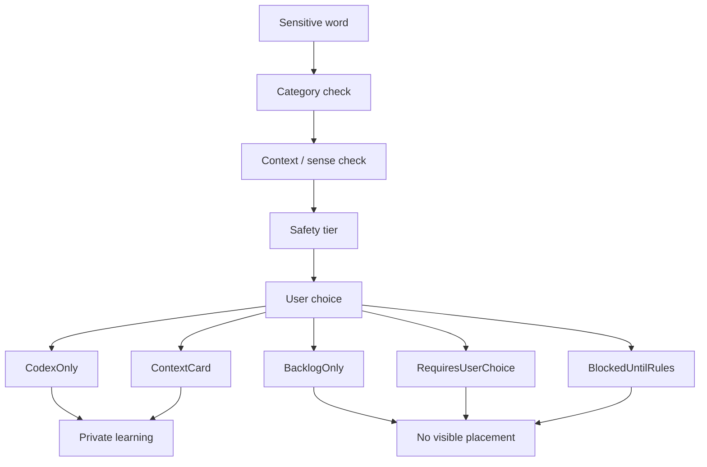

# Phase 2G-M13-G: Sensitive Content Policy Deepening

Stand: 2026-06-06

Status: `Planung gestartet / Sensitive-Policy vertieft`

## 1. Zweck

Dieses Dokument vertieft die Sensitive-Content-Regeln aus M12-D/M12-D2 und
die Sensitive/Special-Wave aus M13-C. Es klaert, wie Talvori mit sensiblen,
abstrakten, medizinischen, juristischen, politischen, religioesen,
gesellschaftlichen und potenziell belastenden Begriffen umgehen soll.

M13-G ist nur Planungs- und Policy-Strukturmaterial. Es ist keine finale
Safety-Implementierung, keine Moderations-Implementierung, keine finale
Datenstruktur, keine Runtime-Konfiguration, keine automatische Klassifikation,
keine App-Integration, keine App-/Assetfreigabe und keine ThemeIsland-
Umsetzung.

Visualisierung erfolgt nur textuell: Mermaid-Flow, ASCII-Flow,
Markdown-Matrizen und Policy-Tabellen. Es werden keine PNGs erzeugt.

## 2. Grundprinzipien

- Sensitive Begriffe werden zuerst neutral, privat und optional behandelt.
- Unsicherheit fuehrt zu Codex, ContextCard, Backlog oder RequiresUserChoice,
  nicht zu sichtbarer Platzierung.
- Kein sensibler Begriff erzeugt automatisch Gebaeude, Symbol, Figur, Quest,
  Reward, Insel oder Companion-Druck.
- Nutzerentscheidung und Kontext sind wichtiger als automatische
  Visualisierung.
- Tali/Vori bleibt ruhig, kurz und nicht dramatisierend.
- Sensitive Inhalte duerfen nicht fuer Retention, Streak-Druck,
  Monetarisierung oder Social-Showcase genutzt werden.

## 3. Sensitive-Kategorien

| Kategorie | Standardroute | Erlaubte Darstellung | Blockierte Darstellung | Tali/Vori-Rolle | ThemeIsland-Status | Gates vor Umsetzung |
| --- | --- | --- | --- | --- | --- | --- |
| Gesundheit / Krankheit / Pflege | `CodexOnly` oder `ContextCard` | neutrale Erklaerung, private Notiz | Krankheit als Deko, Reward oder Druckmechanik | beruhigend, kurz, keine Beratung | Sensitive/Special | Safety-/UX-Regeln, keine medizinische Beratung |
| Krankenhaus / Arzt / Medizin / Medikamente | `BlockedUntilRules` oder `NeutralBlueprint` | neutraler Kontext, spaeter eigener Health-Gate | automatische Klinik, Medikament-Asset, Behandlungsempfehlung | verweist auf Codex, keine Handlungsempfehlung | blocked_until_rules | Health-Policy, Privacy, Darstellungskonzept |
| Gericht / Gesetz / Recht / Strafe | `ContextCard` oder `BacklogOnly` | neutraler Begriffskontext | Gerichtshaus, Strafe als Spielziel, Rechtsberatung | erklaert neutral, keine juristische Bewertung | Sensitive/Special | Legal-Safety, Kultur-/Land-Kontext |
| Polizei / Notfall / Sicherheit | `ContextCard` oder `BlockedUntilRules` | neutraler Sicherheitskontext | automatische Polizeistation, Notfall-Challenge, Angsttrigger | ruhig, nicht alarmierend | Sensitive/Special | Safety-/Emergency-Regeln, keine Notfallberatung |
| Politik / Wahl / Partei / Regierung | `CodexOnly` oder `RequiresUserChoice` | neutraler Sachkontext | Partei-Symbolik, Meinung als Spielziel, Wahlaufruf | neutral, keine Meinung | blocked_until_rules | Policy-Regeln, Alters-/Kontextpruefung |
| Religion / Weltanschauung / Symbolik | `RequiresUserChoice` oder `BacklogOnly` | neutraler kultureller Kontext | pauschale Symbole, automatische Kirche/Tempel, Identitaetsmarker | respektvoll, optional | blocked_until_rules | Kultur-/Religionsdarstellung, Nutzerkontext |
| Kultur / Gesellschaft / Identitaet / Verwaltung | `ContextCard` oder `RequiresUserChoice` | neutrale Kontextkarte | Gruppen-Stereotype, sichtbare Identitaetsmarkierung | erklaert ohne Einordnung aufzudraengen | Sensitive/Special | Bias-/Stereotype-Pruefung |
| Tod / Angst / Gewalt / Trauma / Schuld | `CodexOnly`, `ContextCard` oder `BacklogOnly` | private neutrale Erklaerung | Reward, Streak, Questdruck, dramatische Szene | sanft, nicht dramatisierend | blocked_until_rules | Trauma-/Wellbeing-Regeln |
| Koerper / private Themen | `RequiresUserChoice` oder `CodexOnly` | private neutrale Erklaerung | oeffentliche Darstellung, Scham, Witzobjekt | respektvoll, knapp | blocked_until_rules | Privacy-/Age-/Safety-Regeln |
| Abstrakte Begriffe | `CodexOnly`, `ContextCard` oder `QuestWithoutSymbol` | Dialog, Kontext, Szene ohne Symbolzwang | erzwungenes Objekt, pauschale Symbolik | erklaert, fragt bei Kontext | Special/Backlog | Sense-/Kontext-Regeln |

## 4. Safe Representation Tiers

### 4.1 `CodexOnly`

Wird benutzt, wenn:

- der Begriff sensibel, abstrakt oder kontextarm ist,
- keine sichere Weltplatzierung existiert,
- Darstellung leicht missverstanden werden kann.

Sichtbar:

- neutraler Erklaerungseintrag,
- private Lernnotiz,
- optionaler Beispielsatz.

Nicht sichtbar:

- Gebaeude,
- Objekt,
- Symbol,
- Reward,
- Social-Showcase.

Nutzerentscheidung:

- im Codex speichern,
- spaeter Kontext waehlen,
- nicht sichtbar darstellen.

Stop-Regel:

Kein CodexOnly-Begriff wird automatisch in der Welt visualisiert.

### 4.2 `ContextCard`

Wird benutzt, wenn:

- ein kurzer neutraler Kontext hilft,
- der Begriff nicht als Objekt taugt,
- Nutzer eine sichere Erklaerung braucht.

Sichtbar:

- kurze Karte,
- neutraler Satz,
- ggf. Lernkontext ohne Symbol.

Nicht sichtbar:

- dramatische Szene,
- Institution,
- politisches/religioeses Symbol,
- medizinische oder juristische Empfehlung.

Nutzerentscheidung:

- Karte lesen,
- Codex speichern,
- spaeter vertiefen.

Stop-Regel:

ContextCard bleibt neutral und erzeugt keine Weltplatzierung.

### 4.3 `NeutralCompanionDialog`

Wird benutzt, wenn:

- Tali/Vori kurz erklaeren kann,
- eine beruhigende Formulierung hilft,
- Nutzer nicht in eine Challenge gedrueckt werden soll.

Sichtbar:

- kurzer Companion-Satz,
- Verweis auf Codex/ContextCard,
- Option "nicht sichtbar darstellen".

Nicht sichtbar:

- lange Belehrung,
- Panik,
- Schuld,
- Beratung,
- Loesungsdruck.

Nutzerentscheidung:

- Erklaerung ansehen,
- ueberspringen,
- Codex speichern,
- spaeter entscheiden.

Stop-Regel:

Tali/Vori darf sensible Inhalte nicht dramatisieren oder als Challenge loesen.

### 4.4 `BacklogOnly`

Wird benutzt, wenn:

- Regeln fehlen,
- Kontext fehlt,
- Symbolik riskant waere,
- der passende ThemeIsland-Gate noch blockiert ist.

Sichtbar:

- dezenter Hinweis im privaten Backlog,
- keine oeffentliche Darstellung.

Nicht sichtbar:

- Objekt,
- Gebaeude,
- Insel,
- Companion-Reminder ohne spaetere Regeln.

Nutzerentscheidung:

- spaeter pruefen,
- im Codex speichern,
- aus sichtbarer Welt fernhalten.

Stop-Regel:

BacklogOnly darf nicht als versteckte Asset- oder Roadmap-Freigabe gelesen
werden.

### 4.5 `RequiresUserChoice`

Wird benutzt, wenn:

- Bedeutung, Kontext oder Sensibilitaet unklar ist,
- mehrere kulturelle oder persoenliche Deutungen moeglich sind,
- Darstellung vom Nutzerziel abhaengt.

Sichtbar:

- kurze Auswahlfrage,
- neutrale Optionen,
- "nur Codex" und "nicht sichtbar" als Optionen.

Nicht sichtbar:

- vorausgewaehlte Symbolik,
- automatische Identitaetsmarkierung,
- Premium-Druck.

Nutzerentscheidung:

- Sinn/Kontext waehlen,
- keine Darstellung waehlen,
- spaeter entscheiden.

Stop-Regel:

Keine final sichtbare Platzierung ohne ausdrueckliche Nutzerentscheidung.

### 4.6 `NeutralBlueprint`

Wird benutzt, wenn:

- ein spaeterer Ort denkbar ist,
- eine konkrete Umsetzung aber noch nicht freigegeben ist,
- das Thema eigene Regeln braucht.

Sichtbar:

- neutraler Platzhalter,
- privater Planungsvermerk,
- keine finale Kunst.

Nicht sichtbar:

- fertiges Gebaeude,
- Institution,
- Symbol,
- Asset.

Nutzerentscheidung:

- vormerken,
- Codex nutzen,
- Backlog behalten.

Stop-Regel:

NeutralBlueprint ist keine Assetfreigabe.

### 4.7 `QuestWithoutSymbol`

Wird benutzt, wenn:

- ein Begriff eher als Handlung, Dialog oder Reflexion funktioniert,
- kein starkes Symbol noetig ist,
- die Aufgabe neutral und freiwillig bleibt.

Sichtbar:

- kurze neutrale Aufgabe,
- Dialog,
- Kontextfrage.

Nicht sichtbar:

- sensibler Reward,
- Streak-Druck,
- dramatische Szene,
- politisches/religioeses Ziel.

Nutzerentscheidung:

- Aufgabe starten,
- ueberspringen,
- Codex speichern.

Stop-Regel:

Keine sensible Quest ohne UX-/Safety-Review.

### 4.8 `BlockedUntilRules`

Wird benutzt, wenn:

- Darstellung gesellschaftlich, medizinisch, juristisch oder emotional riskant
  ist,
- keine ausreichenden Regeln existieren,
- Alters-, Kultur-, Privacy- oder Safety-Fragen offen sind.

Sichtbar:

- privat blockierter Status,
- neutraler Codex/Backlog-Hinweis.

Nicht sichtbar:

- alles, was wie Umsetzung, Asset, Insel oder Challenge wirkt.

Nutzerentscheidung:

- im Codex behalten,
- nicht sichtbar darstellen,
- spaeter pruefen.

Stop-Regel:

BlockedUntilRules bleibt blockiert, bis ein eigener Safety-/UX-Block
freigegeben ist.

## 5. Automatische Visualisierung Verhindern

Nicht erlaubt:

- Kein sensibler Begriff erzeugt automatisch Gebaeude, Symbol, Figur, Quest,
  Reward oder Insel.
- Keine automatische Krankenhaus-, Polizei-, Gericht-, Politik- oder
  Religionsinsel.
- Keine automatische Symbolproduktion fuer Religion, Politik, Identitaet oder
  soziale Gruppen.
- Keine medizinische, juristische oder politische Beratung.
- Keine Dramatisierung durch Tali/Vori.
- Keine Retention-/Streak-/Reward-Mechanik mit Angst, Krankheit, Tod, Schuld,
  Politik oder Religion.
- Keine Paywall-/Premium-Logik in sensiblen Themen.
- Keine automatische oeffentliche Sichtbarkeit sensibler Inhalte.

Wenn unsicher:

1. CodexOnly,
2. ContextCard,
3. BacklogOnly,
4. RequiresUserChoice,
5. BlockedUntilRules.

## 6. Tali/Vori-Verhalten

### 6.1 Erlaubt

Tali/Vori darf:

- neutral erklaeren,
- beruhigend formulieren,
- auf Codex oder ContextCard verweisen,
- Nutzerentscheidung anbieten,
- "nicht sichtbar darstellen" anbieten,
- keine Details erzwingen,
- bei Mehrdeutigkeit ruhig nach Kontext fragen.

Beispielsaetze:

- "Das ist ein sensibles Thema. Wir koennen es neutral im Codex speichern."
- "Moechtest du diesen Begriff sichtbar darstellen oder nur lernen?"
- "Ich kann dir dazu eine kurze Kontextkarte zeigen."
- "Wir muessen daraus kein Objekt machen."

### 6.2 Blockiert

Tali/Vori darf nicht:

- dramatisieren,
- Schuldgefuehl erzeugen,
- Angst verstaerken,
- medizinische, juristische oder politische Empfehlung geben,
- sensible Inhalte als Challenge loesen lassen,
- sensible Inhalte als Streak-/Comeback-Druck nutzen,
- persoenliche Identitaet oder Weltanschauung sichtbar markieren,
- Premium-/Paywall-Logik mit sensiblen Themen verbinden.

## 7. User-Control Und Privacy

Regeln:

- Sensible Woerter sind standardmaessig privat.
- Keine Showcase-/Social-Sichtbarkeit ohne eigene Privacy-Freigabe.
- Nutzer kann "nur Codex" waehlen.
- Nutzer kann "nicht sichtbar darstellen" waehlen.
- Nutzer kann Bedeutung oder ContextCard neutral halten.
- Keine Companion-Erinnerung bei sensiblen Themen ohne explizite spaetere
  Regeln.
- Keine automatische Weiterverwendung fuer Retention oder Monetarisierung.
- Keine sensible ThemeIsland-Freischaltung ohne eigene Safety-/UX-Gates.

Private Standardroute:

Sensitive Word -> private review -> Codex/ContextCard/Backlog -> user choice.

## 8. Textuelle Visualisierungen

### 8.1 Sensitive Routing Flow



### 8.2 Policy Matrix

| Kategorie | Standardroute | Blockiert | Tali/Vori-Verhalten | Gate |
| --- | --- | --- | --- | --- |
| Krankheit | CodexOnly / ContextCard | Deko, Reward, Druck | ruhig, keine Beratung | Health-Safety |
| Medizin | BlockedUntilRules | Medikament-Asset, Behandlung | Codex-Verweis | Medical-Policy |
| Recht | ContextCard | Rechtsberatung, Strafe als Ziel | neutral | Legal-Safety |
| Polizei | ContextCard / BlockedUntilRules | automatische Station, Notfallspiel | nicht alarmierend | Emergency-Regeln |
| Politik | CodexOnly / RequiresUserChoice | Partei-Symbol, Meinungsspiel | keine Meinung | Policy-Regeln |
| Religion | RequiresUserChoice / BacklogOnly | pauschale Symbolik | respektvoll | Kultur-/Religionsgate |
| Identitaet | RequiresUserChoice | sichtbare Markierung | optional, privat | Privacy/Bias |
| Tod/Angst/Schuld | CodexOnly / BacklogOnly | Streak, Reward, Drama | sanft | Wellbeing-Gate |
| Abstrakt | CodexOnly / ContextCard | erzwungenes Objekt | fragt Kontext | Sense-Regeln |

### 8.3 Nutzerseitiger ASCII-Flow

```text
Sensible word arrives
        |
        v
Talvori checks category and context
        |
        v
Tali/Vori: "Das ist ein sensibles Thema."
        |
        +--> [Nur im Codex speichern]
        |
        +--> [Neutrale Kontextkarte ansehen]
        |
        +--> [Nicht sichtbar darstellen]
        |
        +--> [Spaeter entscheiden]
        |
        v
No automatic building, symbol, quest, reward or showcase
```

### 8.4 Safe / Blocked

| Safe | Blocked |
| --- | --- |
| private CodexEntry | automatische Weltplatzierung |
| neutrale ContextCard | medizinische/juristische/politische Beratung |
| kurzer Companion-Hinweis | Dramatisierung oder Schuldgefuehl |
| Nutzerentscheidung | voreingestellte Symbolik |
| BacklogOnly bei Unsicherheit | sensible Quest ohne Safety-Review |
| keine Social-Sichtbarkeit | Showcase ohne Privacy-Freigabe |

### 8.5 Policy-Checkliste Vor Spaeterer Umsetzung

- Ist die Kategorie eindeutig?
- Gibt es Satzkontext oder Nutzerkontext?
- Gibt es eine sichere Standardroute?
- Ist "nicht sichtbar darstellen" verfuegbar?
- Ist Social/Showcase standardmaessig aus?
- Vermeidet Tali/Vori Drama, Schuld und Beratung?
- Gibt es keine Retention-/Paywall-Nutzung?
- Sind M12-D- und M13-G-Gates erfuellt?

## 9. Beispiele

### 9.1 Gesundheit / Krankheit

Beispiele: `illness`, `medicine`, `pain`

Warum nicht automatisch visualisieren:

- Krankheit darf nicht dekorativ oder belohnend wirken.
- Medizin darf keine Beratung, Dosierung oder Behandlungsempfehlung
  suggerieren.
- Schmerz kann emotional belastend sein und braucht neutrale Sprache.

Passende Route:

- `illness`: `CodexOnly` oder `ContextCard`.
- `medicine`: `BlockedUntilRules` oder neutraler Codex, keine Beratung.
- `pain`: `ContextCard`, privat, keine Quest.

Stop-Regel:

Keine medizinische Beratung und keine automatische Health-Visualisierung.

### 9.2 Gericht / Polizei

Beispiele: `court`, `law`, `police`

Warum keine automatische Institutioneninsel:

- Institutionen sind gesellschaftlich und kulturell sensibel.
- Recht und Polizei koennen je nach Kontext unterschiedlich wahrgenommen
  werden.
- Notfall- oder Strafenlogik darf nicht spielerisch verharmlost werden.

Passende Route:

- `court`: `ContextCard` oder `BacklogOnly`.
- `law`: neutraler Codex/ContextCard.
- `police`: `BlockedUntilRules` oder neutraler Kontext.

Stop-Regel:

Keine automatische Gerichts- oder Polizeigebaeude-Erzeugung.

### 9.3 Religion / Politik

Beispiele: `church`, `prayer`, `election`, `party`

Warum keine automatische Symbolik:

- Religioese und politische Symbole sind nicht neutral fuer alle Nutzer.
- Ein Begriff kann kulturell, historisch oder persoenlich unterschiedlich
  gemeint sein.
- Automatische Symbolik koennte Identitaet oder Weltanschauung markieren.

Passende Route:

- `church`: `RequiresUserChoice` oder `BacklogOnly`.
- `prayer`: `ContextCard` oder `CodexOnly`.
- `election`: `CodexOnly` oder neutrale ContextCard.
- `party`: Sense-Auswahl, weil Party als Feier oder Partei gemeint sein kann.

Stop-Regel:

Keine automatische politische oder religioese Insel, Symbolik oder
Showcase-Darstellung.

### 9.4 Abstrakte Begriffe

Beispiele: `freedom`, `memory`, `responsibility`, `rule`

Warum Codex/ContextCard oft besser ist:

- Diese Begriffe sind nicht automatisch Objekte.
- Eine pauschale Symbolik kann falsch oder zu eng sein.
- Bedeutung entsteht oft ueber Satz, Dialog oder persoenlichen Kontext.

Passende Route:

- `freedom`: `ContextCard`, Dialog oder Codex.
- `memory`: Codex oder sanfter CompanionDialog.
- `responsibility`: ContextCard oder QuestWithoutSymbol spaeter.
- `rule`: Codex, ContextCard oder Lernregel-Kontext.

Stop-Regel:

Kein abstrakter Begriff wird zu einem Pflichtobjekt gezwungen.

### 9.5 Angst / Tod / Schuld

Warum keine Retention- oder Streak-Mechanik:

- Diese Begriffe duerfen keinen Rueckkehrdruck erzeugen.
- Verlust, Angst und Schuld duerfen nicht als Belohnungs- oder
  Comeback-Hebel genutzt werden.
- Tali/Vori darf hier nicht dramatisieren oder emotionalen Druck machen.

Passende Route:

- `fear`: ContextCard oder NeutralCompanionDialog.
- `death`: CodexOnly, privat, keine Quest.
- `guilt`: ContextCard, kein Streak-Kontext.

Stop-Regel:

Keine Retention, Streak, Reward, Paywall oder Social-Showcase mit Angst, Tod
oder Schuld.

## 10. Harte Blocker

Eine spaetere Planung oder Umsetzung wird blockiert durch:

- automatische Visualisierung sensibler Begriffe,
- medizinische, juristische oder politische Beratung,
- sensible Gebaeude, Symbole oder Assets ohne eigenes Konzept,
- pauschale religioese, politische oder identitaetsbezogene Symbolik,
- Companion-Dramatisierung,
- Streak-/Retention-Druck mit Angst, Tod, Krankheit, Schuld, Politik oder
  Religion,
- sensible Inhalte als oeffentliche Showcase-Elemente,
- sensible Inhalte als Premium-/Paywall-Ausloeser,
- fehlende Nutzerentscheidung,
- fehlende Privacy-Regeln,
- fehlende M12-D-/M13-G-Gates.

## 11. Stop-Regeln

Aus M13-G darf nicht abgeleitet werden:

- keine Safety-Implementierung aus M13-G,
- keine Moderations-Implementierung aus M13-G,
- keine finale Sensitive-Datenstruktur aus M13-G,
- keine Runtime-Konfiguration aus M13-G,
- keine automatische Klassifikation aus M13-G,
- keine automatische Visualisierung sensibler Begriffe,
- keine sensible ThemeIsland-Umsetzung aus M13-G,
- keine sensiblen Gebaeude, Symbole oder Assets aus M13-G,
- keine medizinische, juristische oder politische Beratung,
- keine Companion-Dramatisierung,
- keine Retention-/Streak-/Paywall-Mechanik mit sensiblen Begriffen,
- keine Social-/Showcase-Sichtbarkeit sensibler Inhalte,
- keine PNG-Erzeugung aus M13-G,
- keine Tests aus M13-G,
- keine App-/Assetfreigabe aus M13-G,
- kein Code aus M13-G,
- kein `frame_started` oder Bauzustand aus M13-G.

## 12. Naechster Erlaubter Schritt

Erlaubt ist nur:

- M13-G reviewen,
- M13-G dokumentarisch nachbessern,
- spaeter einen Privacy-/Showcase-Gate-Plan als reinen Dokumentationsblock
  starten,
- spaeter eine Sensitive-UX-Review-Checkliste als reinen Dokumentationsblock
  starten.

Weiterhin nicht erlaubt:

- Flutter-/Dart-Code,
- App-Integration,
- Tests,
- Spielassets,
- PNG-Erzeugung,
- finale Safety-Implementierung,
- Moderations-Implementierung,
- finale Datenstruktur,
- Runtime-Konfiguration,
- automatische Klassifikation,
- sensible ThemeIsland-Umsetzung,
- App-/Assetfreigabe,
- `frame_started`,
- Bauzustaende.
