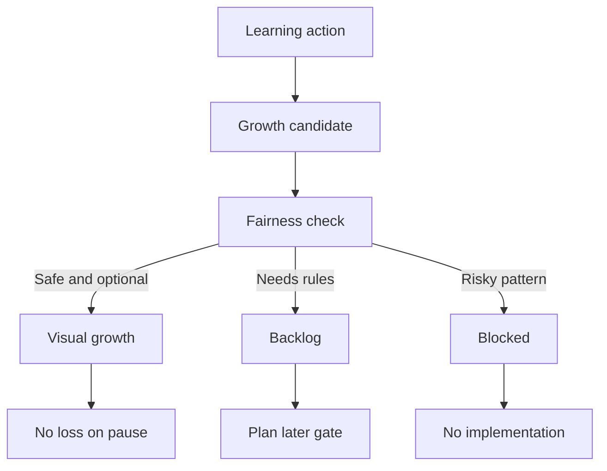
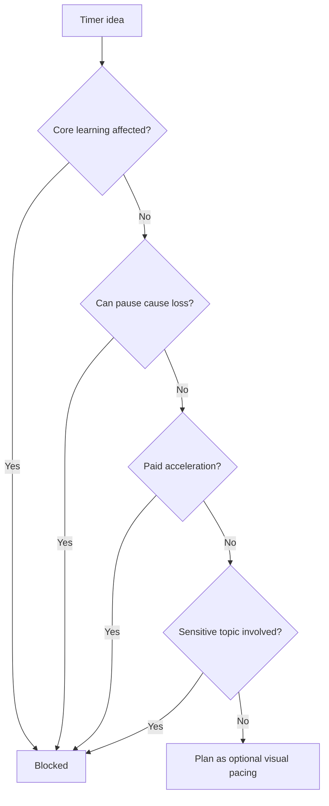

# Phase 2G-M13-H: Growth And Timer Fairness Rules

Stand: 2026-06-06

Status: `Planung gestartet / Growth- und Timer-Fairness definiert`

## 1. Zweck

Dieses Dokument klaert, wie Talvori spaeter mit Wachstum, Garten-/Farm-
Progression, Timern, Wartezeiten, Streaks, Comeback-Hinweisen, Tali/Vori-
Erinnerungen und Retention-Momenten fair umgeht, ohne Druck, Schuldgefuehl,
Pay-to-Win oder manipulative Dark Patterns zu erzeugen.

M13-H ist nur Planungs- und Fairness-Strukturmaterial. Es ist keine finale
Growth-Implementierung, keine Timer-Implementierung, keine Retention-
Implementierung, keine Monetarisierungsregel, keine finale Datenstruktur und
keine Runtime-Konfiguration.

Visualisierung erfolgt nur textuell: Mermaid-Diagramm, ASCII-Flow,
Markdown-Tabellen, Fairness-/Timer-Matrizen und Decision-Flows. Es werden
keine PNGs erzeugt.

## 2. Grundprinzipien

- Lernen darf sichtbar belohnt werden, aber nicht bestrafen.
- Pausen duerfen keinen Schaden verursachen.
- Wachstum darf motivieren, aber nicht manipulieren.
- Timer duerfen keine Angst erzeugen.
- Keine Streak-Schuldmechanik.
- Keine Pay-to-Win-Beschleunigung.
- Kein Premium-Druck bei Growth/Timer.
- Tali/Vori erinnert freundlich, aber nicht draengend.
- Sensitive Begriffe duerfen nie Grundlage fuer Retention-Druck sein.
- Kinder-/Familienkontext und unterschiedliche Lebenssituationen muessen
  beruecksichtigt werden.
- Comeback soll ein Willkommen sein, keine Abrechnung.

## 3. Growth-Arten

| Growth-Art | Nutzen | Risiko | MVP-Status | Benoetigte Gates | Blockiert bleibt |
| --- | --- | --- | --- | --- | --- |
| Rein visuelles Wachstum | sofort sichtbarer Fortschritt ohne Druck | kann wie finale Asset-/UI-Freigabe wirken | `early_candidate` als Planung | Device-/Accessibility-Pruefung, Asset-Gate | finale UI, Assets, Runtime |
| Lernfortschritt-Wachstum | Lernen fuehlt sich wirksam an | kann SRS/word_progress falsch koppeln | `early_candidate` nur konzeptionell | Reward-Bridge-Gate, SRS-Schutz | SRS-Mutation ohne Plan |
| Sammel-/Pflege-Wachstum | ruhige Motivation, Sammlung | kann Pflegepflicht erzeugen | `later_candidate` | Fairness-Review, No-Decay-Regeln | Pflichtpflege, Verfall |
| Zeitbasiertes Wachstum | Vorfreude, langsames Entfalten | Wartezeitdruck, FOMO, Pay-to-Win | `blocked_until_rules` | Timer-Fairness, No-Pay-to-Win | harte Warte-/Kaufdruck-Timer |
| Freiwillige Daily-Aktivitaet | kurzer Tagesimpuls | Streak-Schuld, Verlustangst | `early_candidate` als weich | Wellbeing-Regeln, Pause-Schutz | harte Streaks |
| Quest-/Challenge-basiertes Wachstum | klare Lernhandlung | Grinding oder Pflichtgefuehl | `mid_candidate` | Challenge-Review, Accessibility | Zwangsquests |
| Dekoratives Wachstum | Welt wirkt lebendig | Deko-Clutter | `later_candidate` | Mobile-/Clutter-Regeln | Deko-Massenproduktion |
| Blockiertes Wachstum | schuetzt vor schaedlichen Mustern | kann unklar wirken | `required_gate` | klare Kommunikation | unerklaerte Sperren |

Hinweis:

Die Werte sind Planungsstufen, keine Runtime-Konfiguration.

## 4. Timer-Regeln

### 4.1 Kurze Timer

Kurze Timer duerfen nur als Feedback- oder Animationsrhythmus geplant werden,
nicht als Druckmechanik.

Erlaubt:

- kurzer visueller Fortschritt nach einer Lernhandlung,
- sanfte Animation,
- keine Kaufoption,
- keine Strafe bei Abbruch.

Blockiert:

- "Komm in 3 Minuten zurueck oder verliere Fortschritt",
- Druck durch Tali/Vori,
- Pay-to-skip als Standardweg.

### 4.2 Lange Timer

Lange Timer sind riskant und bleiben blockiert, bis Timer-Fairness, Wellbeing
und Monetarisierung getrennt geprueft sind.

Blockiert:

- harte Wartezeiten fuer Core Learning,
- bezahlte Beschleunigung als Progress-Vorteil,
- Verlust bei Nicht-Rueckkehr,
- FOMO-Events ohne Alternativen.

### 4.3 Reale Wartezeit

Reale Wartezeit darf nicht fuer Lernzugang, Grundwortschatz oder erstes
Wow-Erlebnis erzwungen werden.

Erlaubt als spaetere Idee:

- optionale langsame Deko-Entfaltung,
- offline sichtbarer Fortschritt ohne Verlust,
- keine Bezahldruck-Loesung.

### 4.4 Offline-Fortschritt

Offline-Fortschritt soll freundlich sein:

- Nutzer verliert nichts.
- Welt kann beim Zurueckkommen sanft gewachsen wirken.
- Keine "Du warst weg, jetzt ist etwas kaputt"-Logik.
- Keine sensible Comeback-Erinnerung.

### 4.5 Pause / Unterbrechung

Pausen werden akzeptiert:

- kein Verfall,
- kein Fortschrittsverlust,
- keine harte Streak-Strafe,
- keine Pflanzensterben-Mechanik,
- keine Companion-Schuld.

### 4.6 Comeback Nach Tagen Oder Wochen

Comeback soll neutral und warm sein:

- "Willkommen zurueck."
- "Deine Woerter warten noch."
- "Moechtest du mit einer kleinen Aufgabe starten?"

Blockiert:

- "Du hast deine Serie verloren."
- "Deine Pflanze hat gelitten."
- "Du musst jetzt aufholen."

### 4.7 Keine Verfallsmechanik

Talvori darf keine Fortschritte, Pflanzen, Gebaeude oder Sammlungen durch
Pause zerstoeren.

Erlaubt:

- weiche Erinnerung,
- optionales Wiederholen,
- sichtbarer Rueckkehrbonus ohne Druck.

Blockiert:

- Verfall,
- Zerstoerung,
- Verlust,
- oeffentliche Beschaemung,
- Kaufen zur Rettung.

### 4.8 Push-Druck

Push-/Notification-Logik ist nicht Teil von M13-H und bleibt blockiert, bis ein
eigenes Notification-/Wellbeing-Konzept existiert.

### 4.9 Keine Timer Bei Sensiblen Begriffen

Sensitive Begriffe duerfen nie Timer-, Streak-, Comeback- oder
Retention-Ausloeser sein.

## 5. Streak- Und Retention-Regeln

Erlaubt:

- weiche Daily Word Quest,
- freiwilliger Tagesimpuls,
- kleine sichtbare Belohnung ohne Verlust,
- Wochenziel ohne Strafe,
- Rueckkehrbegruessung,
- optionales naechstes Ziel.

Blockiert:

- harte Streaks mit Strafe,
- Verlustangst,
- "Serie kaputt" als Schuldgefuehl,
- Drohung durch Tali/Vori,
- Belohnung, die Nutzer faktisch zwingt,
- monetarisierte Streak-Rettung,
- FOMO-Mechanik,
- Social-Vergleichs-/Ranking-Drucklogik,
- Premium-Vorteile fuer Lernfortschritt.

Regel:

Retention soll Einladung sein, nicht Druck. Ein kurzer Besuch muss sinnvoll
sein, aber ein langer Ausstieg darf nicht bestraft werden.

## 6. Tali/Vori-Verhalten Bei Growth Und Timer

### 6.1 Erlaubt

Tali/Vori darf:

- freundlich erinnern,
- Fortschritt feiern,
- Pause akzeptieren,
- Rueckkehr neutral begruessen,
- optionales Ziel anbieten,
- kleine Erfolge emotional spiegeln,
- "spaeter" respektieren.

Erlaubte Beispieltexte:

- "Willkommen zurueck. Deine Woerter sind noch da."
- "Schoen, dass du wieder reinschaust."
- "Moechtest du heute ein kleines Wort pflanzen?"
- "Du kannst auch einfach im Codex weitermachen."
- "Die Pflanze wartet geduldig."

### 6.2 Blockiert

Tali/Vori darf nicht:

- schlechtes Gewissen erzeugen,
- drohen,
- "deine Pflanze leidet"-Mechanik verwenden,
- "du hast versagt"-Wording nutzen,
- sensible Begriffe als Comeback-Druck nutzen,
- Streak-Verlust dramatisieren,
- Premium-Rettung empfehlen.

Blockierte Beispieltexte:

- "Du hast deine Pflanze vernachlaessigt."
- "Deine Serie ist kaputt."
- "Jetzt musst du aufholen."
- "Zahle, um den Fortschritt zu retten."
- "Tali/Vori ist enttaeuscht."

## 7. Textuelle Visualisierungen

### 7.1 Growth-Fairness-Flow



### 7.2 Growth-/Timer-Matrix

| Mechanik | Fair | Riskant | Blockiert |
| --- | --- | --- | --- |
| Sichtbarer Lernfortschritt | Objekt/Detail erscheint nach Aufgabe | zu viele Rewards auf einmal | Pay-to-progress |
| Gartenwachstum | Pflanze wartet geduldig | echte Wartezeit als Motivation | Pflanze stirbt bei Pause |
| Daily Word Quest | freiwillig, kurz | zu starke Belohnungsserie | harte Streak-Strafe |
| Comeback | warmes Willkommen | "Du hast viel verpasst" | Schuld oder Verlust |
| Offline-Fortschritt | nichts geht verloren | unklare Timer | Kaufdruck zum Beschleunigen |
| Farm-Produktion | spaeter mit Fairness | Produktionsketten stressen | FOMO/Verfall |

### 7.3 Nutzer Kommt Nach Pause Zurueck

```text
User returns after 7 days
        |
        v
Talvori checks: no decay, no loss, no shame
        |
        v
Tali/Vori: "Willkommen zurueck. Deine Woerter sind noch da."
        |
        +--> [kleine freiwillige Aufgabe]
        |
        +--> [Codex oeffnen]
        |
        +--> [spaeter entscheiden]
        |
        v
No streak punishment, no dead plants, no payment pressure
```

### 7.4 Safe / Blocked

| Faire Growth-Mechanik | Manipulative Growth-Mechanik |
| --- | --- |
| Pflanze wartet geduldig | Pflanze stirbt durch Pause |
| Rueckkehrbonus ohne Verlust | Fortschrittsverlust bei Inaktivitaet |
| Daily als Einladung | Daily als Pflicht |
| Tali/Vori begruesst neutral | Tali/Vori macht Schuld |
| keine Kaufrettung | monetarisierte Streak-Rettung |
| Backlog bei Risiko | Umsetzung trotz Fairness-Luecke |

### 7.5 Timer Decision Tree



### 7.6 Tali/Vori Reminder Tone Ladder

| Ton | Beispiel | Status |
| --- | --- | --- |
| Neutral | "Willkommen zurueck." | erlaubt |
| Einladend | "Moechtest du ein kleines Wort lernen?" | erlaubt |
| Feiernd | "Gut gemacht, ein Detail ist gewachsen." | erlaubt |
| Dringlich | "Du solltest jetzt zurueckkommen." | blockiert |
| Schuld | "Du hast deine Pflanze vernachlaessigt." | blockiert |
| Drohung | "Sonst verlierst du Fortschritt." | blockiert |

## 8. Beispiele

### 8.1 Garten / Beet

Objekte:

- Samen,
- Giesskanne,
- Pflanze.

Warum attraktiv:

- Wachstum passt emotional gut zu Lernen.
- Ein Beet kann kleine Fortschritte sichtbar machen.
- Samen -> Giesskanne -> Pflanze ist ein verstaendlicher Lernpfad.

Erlaubte Growth-Mechanik:

- Pflanze erscheint oder veraendert sich nach abgeschlossener Lernhandlung.
- Kein Verfall bei Pause.
- Kein Kaufdruck.
- Optionales naechstes Ziel.

Blockiert:

- Pflanzen sterben durch Pause.
- Timer erzwingt Rueckkehr.
- Streak rettbar gegen Geld.
- Tali/Vori sagt, die Pflanze leidet.

### 8.2 Land / Farm

Objekte:

- Feld,
- Ernte,
- Tierpflege.

Warum spaeter:

- Farm-Systeme erzeugen schnell Produktionsketten, Wartezeiten und
  Retention-Druck.
- Tierpflege kann Schuldgefuehl ausloesen, wenn Pause als Vernachlaessigung
  gelesen wird.
- Ernte-/Produktionsloops koennen FOMO erzeugen.

Notwendige Gates:

- Fairness-/Timer-Regeln,
- No-Decay-Regeln,
- keine Pay-to-Win-Beschleunigung,
- keine Tierleid- oder Schuldmechanik,
- Device-/Clutter-Pruefung.

### 8.3 Daily Word Quest

Erlaubt:

- freiwilliger kurzer Tagesimpuls,
- eine kleine Aufgabe,
- sichtbarer Mini-Fortschritt,
- keine Pflichtserie,
- keine Strafmeldung bei Auslassen.

Blockiert:

- harte Streak,
- "Serie kaputt",
- Geld fuer Streak-Rettung,
- Social-Ranking,
- FOMO-Belohnung.

### 8.4 Comeback Nach 7 Tagen

Erlaubtes Verhalten:

- Tali/Vori begruesst neutral.
- Fortschritt ist erhalten.
- Nutzer bekommt eine kleine freiwillige Option.
- Backlog/Codex bleiben ruhig verfuegbar.

Blockiert:

- "Du hast zu lange gefehlt."
- Verlustanzeige.
- tote Pflanzen.
- "Jetzt aufholen"-Druck.
- sensible Themen als Comeback-Ausloeser.

### 8.5 Premium-Beschleunigung

Warum blockiert:

- Pay-to-Win-Wachstum wuerde Lernfortschritt unfair machen.
- Premium-Druck kann Kinder-/Familiennutzer benachteiligen.
- Wartezeiten duerfen nicht gebaut werden, um Bezahlung attraktiv zu machen.
- Core Learning und erster Wow-Moment duerfen nicht hinter Timer/Premium
  liegen.

Erlaubte Richtung spaeter:

- kosmetische Varianten,
- zusaetzliche Deko ohne Lernvorteil,
- Komfort nur mit Fairness-Pruefung.

## 9. Harte Blocker

Eine Growth-, Timer- oder Retention-Planung wird blockiert durch:

- Pflanzen sterben oder verfallen durch Pause,
- Nutzer verliert Fortschritt durch Inaktivitaet,
- harte Streak-Strafen,
- monetarisierte Streak-Rettung,
- Pay-to-Win-Wachstumsbeschleunigung,
- Push-Druck ohne eigenes Notification-/Wellbeing-Konzept,
- Tali/Vori erzeugt Schuldgefuehl,
- sensible Begriffe als Comeback-/Retention-Ausloeser,
- Social-Ranking-Druck,
- FOMO-Mechanik,
- Timer, die Angst oder Zwang erzeugen,
- Growth-Mechanik ohne Device-/Accessibility-/UX-Pruefung,
- Growth-Mechanik ohne Fairness-Review.

## 10. Stop-Regeln

Aus M13-H darf nicht abgeleitet werden:

- keine Growth-Implementierung aus M13-H,
- keine Timer-Implementierung aus M13-H,
- keine Retention-Implementierung aus M13-H,
- keine Monetarisierungsregel aus M13-H,
- keine finale Datenstruktur aus M13-H,
- keine Runtime-Konfiguration aus M13-H,
- keine Pflanzenverfall- oder Verlustmechanik,
- keine harte Streak-Strafe,
- keine monetarisierte Streak-Rettung,
- keine Pay-to-Win-Beschleunigung,
- keine Push-Drucklogik ohne eigenes Konzept,
- keine Schuld-/Angst-/FOMO-Mechanik,
- keine sensiblen Begriffe als Retention-Ausloeser,
- keine Social-Ranking-Drucklogik,
- keine PNG-Erzeugung aus M13-H,
- keine Tests aus M13-H,
- keine App-/Assetfreigabe aus M13-H,
- kein Code aus M13-H,
- kein `frame_started` oder Bauzustand aus M13-H.

## 11. Naechster Erlaubter Schritt

Erlaubt ist nur:

- M13-H reviewen,
- M13-H dokumentarisch nachbessern,
- spaeter einen Notification-/Wellbeing-Plan als reinen Dokumentationsblock
  starten,
- spaeter eine Growth-UX-Review-Checkliste als reinen Dokumentationsblock
  starten,
- spaeter eine Monetarisierungs-Fairness-Pruefung als eigenes Dokument planen.

Weiterhin nicht erlaubt:

- Flutter-/Dart-Code,
- App-Integration,
- Tests,
- Spielassets,
- PNG-Erzeugung,
- finale Growth-Implementierung,
- finale Timer-Implementierung,
- finale Retention-Implementierung,
- Monetarisierungsregel,
- finale Datenstruktur,
- Runtime-Konfiguration,
- App-/Assetfreigabe,
- `frame_started`,
- Bauzustaende.
