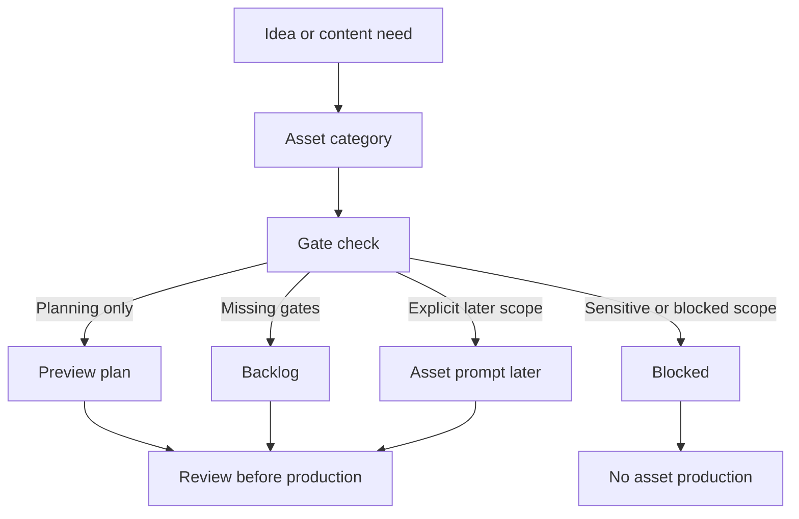

# Phase 2G-M13-I: Asset Prioritization Scope Gate

Stand: 2026-06-06

Status: `Planung gestartet / Asset-Scope-Gate definiert`

## 1. Ziel

Dieses Dokument klaert, welche Asset-Arten spaeter zuerst priorisiert werden
duerfen und welche weiterhin blockiert bleiben. Es schuetzt Talvori davor, aus
ThemeIsland-, Onboarding-, Container-, Growth-, Sensitive- oder
Word-to-Island-Planungen automatisch Assetproduktion abzuleiten.

M13-I ist nur Planungs- und Scope-Gate-Material. Es ist keine finale Assetliste,
keine Assetproduktion, keine App-/Assetfreigabe, keine finale
ThemeIsland-Roadmap und kein Implementierungsauftrag.

## 2. Grundprinzipien

- Assets folgen aus geprueften Produktentscheidungen, nicht aus Taxonomy-Fuelle.
- Ein Asset darf keine fehlende UX-Entscheidung ersetzen.
- User-visible, Debug/QA und Production Assets muessen getrennt bleiben.
- Kleine Objekte brauchen vor Assetproduktion Mobile-/Clutter- und Tap-Target-
  Pruefung.
- Sensitive oder belastende Begriffe erzeugen keine automatischen Gebaeude,
  Symbole, Figuren oder Dekoration.
- Growth-, Timer- und Farm-Assets duerfen keine Druck-, Verfall- oder
  Pay-to-Win-Mechanik vorbereiten.
- `frame_started` und weitere Bauzustaende bleiben blockiert, bis ein eigener
  Asset-/Build-State-Freigabeblock sie ausdruecklich oeffnet.

## 3. Asset-Kategorien

| Asset-Kategorie | Zweck | Status | Prioritaet | Benoetigte Gates | Blockiert bleibt |
| --- | --- | --- | --- | --- | --- |
| Existing approved mock assets | Bestehenden lokalen Mock-Slice tragen | Vorhanden und eng freigegeben | 0 | Bestehende Scope-Grenzen behalten | Keine Ausweitung auf neue Bauzustaende |
| Documentation previews | Planung sichtbar machen | Erlaubt, wenn explizit als Preview/Docs scoped | 1 | Fuehrendes Dokument, klare Grenzen, keine Asset-Freigabe | Nutzung als Spielasset oder finale UI |
| Debug/QA overlays | Lesbarkeit, Tap-Ziele, Clutter und Anchors pruefen | Spaeter moeglich | 1 | QA-Zweck, Device-/Accessibility-Plan, keine Nutzer-UI | Produktionsgrafik, Spielasset, versteckte Runtime-Entscheidung |
| Product UI previews | Produktnahes Verstaendnis pruefen | Spaeter moeglich | 1-2 | UX-Ziel, Device-Pruefung, Text-Containment, keine finale UI | Direkte App-Integration |
| Build-state overlays | Baufortschritt sichtbar machen | Eng blockiert ausser vorhandene Mock-Slice-Assets | Blockiert | Eigener Build-State-Gate, Assetprozess, Device-Review | `frame_started`, weitere Bauzustaende |
| ThemeIsland base assets | Inselbasis fuer Themenwelten | Nicht freigegeben | 2-4 spaeter | Roadmap-Review, Capability-Sheet, Device-/Scope-Gate | Finale ThemeIsland-Bases aus M13-I |
| Container/detail assets | Container und Detailraeume fuer Lernobjekte | Nicht freigegeben | 3 spaeter | M13-F, Mobile-/Clutter-Gate, Tap-Target-Gate | Direkte Container-Produktion |
| TinyObject assets | Sehr kleine Lernobjekte | Blockiert | Blockiert | M13-F, Device-Review, DetailInteraction-Konzept | TinyObject-Massenproduktion |
| Sensitive/special assets | Gesundheit, Politik, Religion, Polizei, Gericht usw. | Blockiert | Blockiert | M12-D/M13-G, Safety-/UX-/Policy-Review | Automatische Gebaeude, Symbole, Figuren, Deko |
| Companion/animation/audio assets | Tali/Vori Bewegung, Voice, FX, Audio | Blockiert | Blockiert | Companion-UX, Accessibility, Audio-Fallback, Personality-Konzept | Voice-/Audio-/Animation-Freigabe |
| Decorative assets | Atmosphaere und Lebendigkeit | Spaeter moeglich, aber vorsichtig | 2-4 spaeter | Clutter-Regeln, Lernobjekt-Abgrenzung, Device-Review | Deko-Massenproduktion, verdeckte Lernobjekte |
| System UI assets | Icons, Buttons, UI-Oberflaechen | Nicht durch M13-I freigegeben | Spaeter | Product-UI-Scope, Accessibility, Design-Gate | Finale UI oder App-Integration |

## 4. Prioritaetslogik

### Prioritaet 0: Bestehende freigegebene Mock-Slice-Assets

Nur die bereits vorhandenen und eng freigegebenen kleinen Waldlichtungs-Mock-
Assets bleiben als bestehender Scope gueltig:

- `base.png`
- `foundation_started.png`
- `foundation_complete.png`

Diese Prioritaet erlaubt keine neuen Assets und keine weiteren Bauzustaende.

### Prioritaet 1: Erst Preview- und QA-Planung, keine neuen Assets

Der naechste sinnvolle Schritt sind keine Spielassets, sondern Product-/QA-/
Device-Preview-Plaene fuer:

- Onboarding Choice,
- ContainerOpenView und DetailInteractionView,
- Word-to-Island UX Flow,
- Tap-Targets,
- Text-Containment,
- Accessibility,
- Clutter-Grenzen.

### Prioritaet 2: Spaetere nicht-sensitive Foundation Product Previews

Moegliche spaetere Produkt-Previews, noch keine Assets:

- Zuhause / Alltag,
- Schule / Lernen,
- Garten / Natur nah.

Diese duerfen erst nach Onboarding-, Device-, Tap-Target- und Clutter-Gates
produktnah visualisiert werden.

### Prioritaet 3: Spaetere Container-/Detail-Previews

Moegliche spaetere Preview-Themen:

- Federmappe,
- Kuechenschublade,
- Beet,
- Werkzeugkiste.

Diese bleiben Preview- oder QA-Material, bis Container-Pagination, Tap-Ziele,
Objektanzahl und Labels geprueft sind.

### Prioritaet 4: Spaetere Expansion-/System-Heavy-Assets

Folgende Bereiche sind spaeter denkbar, aber nicht durch M13-I freigegeben:

- Hafen,
- Stadt,
- Verkehr,
- Technik,
- Farm.

Sie brauchen eigene System-, Mobile-, Connector-, Water-, Vehicle-, Digital-
oder Fairness-Gates.

### Blockiert

- Sensitive/Special-Assets,
- finale ThemeIsland-Bases,
- neue Build-State-Assets wie `frame_started`,
- Companion Animation/Voice/Audio,
- Growth-/Timer-Assets mit Druckmechanik,
- TinyObject-Massenproduktion,
- Social-/Showcase-Assets.

## 5. Asset-Gates

Ein Asset darf spaeter erst als Kandidat fuer einen eigenen Asset-Prompt gelten,
wenn alle passenden Gates erfuellt sind:

- Fuehrendes Dokument existiert.
- Visuelle Preview oder QA-Repraesentation existiert.
- Device-/Accessibility-Review existiert.
- Tap-Target-/Clutter-Review existiert, wenn kleine Objekte betroffen sind.
- Sensitive-Policy-Review existiert, wenn sensible Inhalte betroffen sind.
- Growth-/Timer-Fairness-Review existiert, wenn Wachstum, Farm, Daily oder
  Comeback betroffen sind.
- Asset-Zweck ist klar.
- Asset ersetzt keine offene UX-Entscheidung.
- Asset ist keine finale UI, ausser ein spaeterer Block scoped genau das.
- Keine automatische Produktion aus Taxonomy, Roadmap, Routing, Capability
  Sheets oder Onboarding.
- User-visible, Debug/QA und Production Asset sind eindeutig getrennt.

## 6. Textuelle Visualisierungen

### 6.1 Asset Decision Flow



### 6.2 Asset Scope Matrix

| Asset-Kategorie | Prioritaet | Erlaubt jetzt | Gate vor spaeterem Asset | Blockiert |
| --- | --- | --- | --- | --- |
| Existing approved mock assets | 0 | Bestehende Nutzung im engen Mock-Slice | Keine Scope-Ausweitung | Neue Bauzustaende |
| Documentation previews | 1 | Dokumentieren und pruefen | Zweck und Grenzen klar | Spielasset-Nutzung |
| Debug/QA overlays | 1 | Planen, nicht erzeugen | Device-/QA-Review | Produktionsasset |
| Product UI previews | 1-2 | Spaeter planen | Accessibility, Text-Containment | Finale UI |
| Foundation product previews | 2 | Nur als spaeterer Kandidat | M13-B/E/F-Gates | Startinsel-Freigabe |
| Container/detail previews | 3 | Nur als spaeterer Kandidat | M13-F, Mobile/Clutter | Container-Implementierung |
| Expansion/System-heavy | 4 | Backlog | eigenes Systemkonzept | automatische Produktion |
| Sensitive/Special | Blockiert | Nein | M12-D/M13-G + Safety/UX | Assets, Symbole, Gebaeude |
| `frame_started` | Blockiert | Nein | eigener Build-State-Gate | Bauzustandsfreigabe |

### 6.3 Warum Ein Neues Asset Noch Nicht Produziert Wird

```text
Neue Idee
  |
  v
Ist es wirklich ein Asset-Bedarf?
  |
  +-- Nein -> UX-, Codex-, Blueprint- oder Backlog-Loesung
  |
  +-- Ja
        |
        v
    Kategorie bestimmen
        |
        v
    Gates pruefen
        |
        +-- Gates fehlen -> Backlog / Preview-Plan
        |
        +-- Sensitive oder Build-State blockiert -> Blocked
        |
        +-- Spaeter explizit erlaubt -> eigener Asset-Prompt
```

### 6.4 Safe / Blocked

| Safe Assetplanung | Scope Creep / Blockiert |
| --- | --- |
| Erst Zweck und Nutzerflow klaeren | Aus einer Wortliste sofort Bilder produzieren |
| Preview als Dokumentationsmaterial markieren | Preview als finale UI lesen |
| QA-Overlay von Spielasset trennen | Debug-Markierungen als Produktgrafik uebernehmen |
| Kleine Objekte zuerst in Container-/Detail-Gates pruefen | TinyObjects massenhaft als Inselpixel bauen |
| Sensitive Inhalte neutral in Codex/ContextCard routen | Krankenhaus, Polizei oder Religion automatisch bebildern |
| Growth fair und ohne Druck pruefen | Pflanzenverfall, Streak-Strafen oder Pay-to-Win vorbereiten |

## 7. Beispiele

### A. `frame_started`

`frame_started` bleibt blockiert, weil es ein neuer Build-State waere. Dafuer
fehlen weiterhin ein eigener Build-State-Freigabeblock, ein gepruefter visueller
Asset-Prompt, ein Device-Review, klare Anchor-/Overlay-Folgen und eine bewusste
Entscheidung, ob der Rohbau in der Waldlichtung ueberhaupt der naechste
produktnahe Schritt ist.

M13-I erzeugt keine Bauzustandsfreigabe. Es sagt nur: `frame_started` darf nicht
nebenbei aus Roadmap-, Capability- oder Asset-Priorisierungslogik entstehen.

### B. Foundation-Onboarding-Karten

Zuhause/Alltag, Schule/Lernen und Garten/Natur nah duerfen spaeter als
Product-/Device-Preview geprueft werden. Das ist noch kein Spielasset und keine
finale UI. Vor einem Asset braucht es:

- Onboarding-Choice-Review,
- Device-/Accessibility-Pruefung,
- Text-Containment,
- keine Pflicht-Startinsel,
- keine automatische ThemeIsland-Umsetzung.

### C. Containerobjekte

Federmappe, Kuechenschublade, Beet und Werkzeugkiste sind gute spaetere
Container-/Detail-Preview-Kandidaten. Sie brauchen aber zuerst:

- Container-Pagination- und Tap-Target-Regeln,
- maximale sichtbare Objektanzahl,
- Label-Regeln,
- Clutter-Review,
- klare Trennung zwischen ContainerOpenView, DetailInteractionView und Codex.

TinyObject-Massenproduktion bleibt blockiert.

### D. Sensitive/Special

Krankenhaus-, Gericht-, Polizei-, Religions- oder Politik-Assets bleiben
blockiert. M12-D und M13-G erlauben neutrale Wege wie Codex, ContextCard,
NeutralCompanionDialog oder Backlog, aber keine automatische Gebaeude-,
Symbol- oder Assetproduktion.

### E. Growth / Garten / Farm

Garten- und Farm-Assets duerfen keine Pflanzenverfall-, Timer-Druck-,
Pay-to-Win-, FOMO- oder Streak-Straf-Mechanik vorbereiten. Bevor es spaeter
produktnahe Growth-Assets gibt, braucht es Fairness-Gates, Device-/Accessibility-
Pruefung und eine klare Entscheidung, dass Wachstum motiviert, aber nicht
bestraft.

## 8. Harte Blocker

- automatische Assetproduktion aus Taxonomy, Routing, Capability Sheets,
  Onboarding oder Roadmap,
- Assetproduktion aus M13-I,
- finale Assetliste aus M13-I,
- App-/Assetfreigabe aus M13-I,
- ThemeIsland-Base-Produktion,
- `frame_started` oder andere neue Bauzustaende,
- TinyObject-Massenproduktion,
- Sensitive/Special-Assets,
- Companion-Animation-/Voice-/Audio-Assets,
- Growth-/Timer-Druckassets,
- Social-/Showcase-Assets,
- PNG-Erzeugung,
- Tests,
- Code,
- Runtime-Konfiguration.

## 9. Stop-Regeln

- Keine Assetproduktion aus M13-I.
- Keine finale Assetliste aus M13-I.
- Keine App-/Assetfreigabe aus M13-I.
- Keine ThemeIsland-Base-Produktion aus M13-I.
- Kein `frame_started` aus M13-I.
- Keine Bauzustaende aus M13-I.
- Keine TinyObject-Massenproduktion.
- Keine Sensitive-/Special-Assets.
- Keine Companion-Animation-/Voice-/Audio-Assets.
- Keine Growth-/Timer-Druckassets.
- Keine Social-/Showcase-Assets.
- Keine PNG-Erzeugung aus M13-I.
- Keine Tests aus M13-I.
- Kein Code aus M13-I.
- Keine Runtime-Konfiguration aus M13-I.
- Keine automatische Assetproduktion aus Taxonomy, Routing, Capability Sheets,
  Onboarding oder Roadmap.

## 10. Naechster erlaubter Schritt

Erlaubt sind nur Review, Nachbesserung oder ein weiterer reiner Planungsblock.
Ein spaeterer Asset-Prompt braucht ein eigenes, explizites Scope-Gate. Code,
Assets, Runtime-Konfiguration, App-Integration und `frame_started` bleiben
blockiert.
