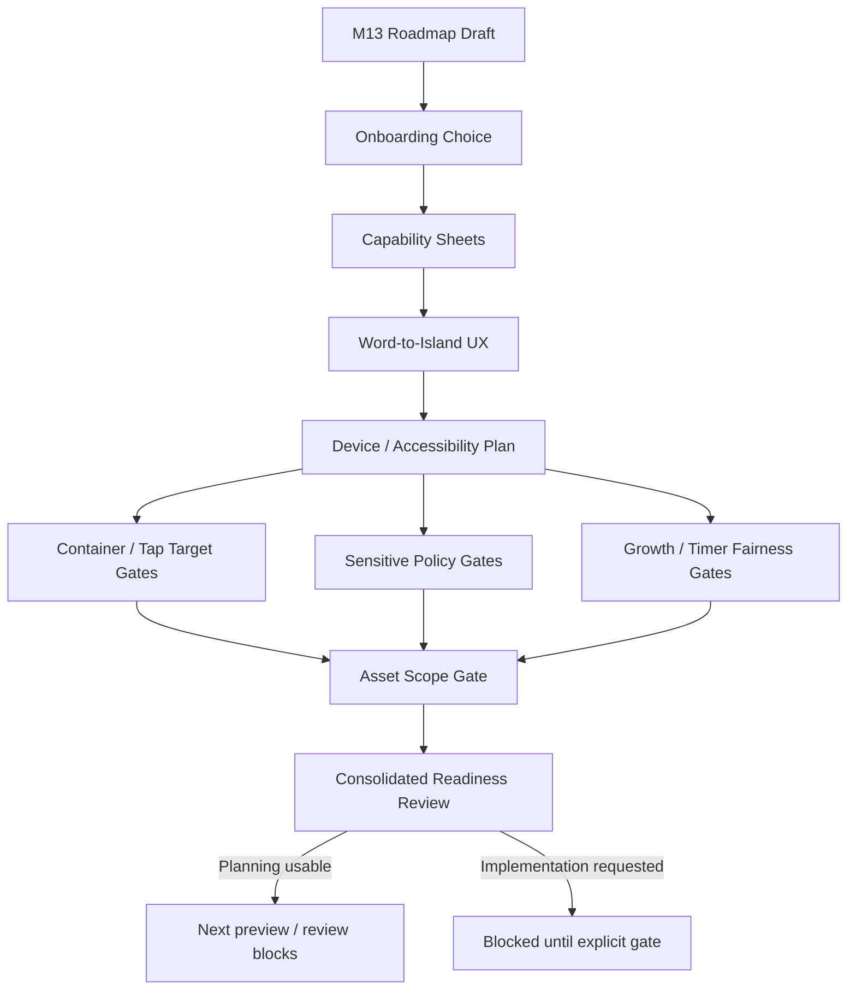

# Phase 2G-M13-J: Consolidated M13 Readiness Review

Stand: 2026-06-06

Status: `Review gestartet / M13-Kette als Planungsgrundlage geprueft`

## 1. Ziel

Dieses Dokument prueft die M13-Kette konsolidiert. Es klaert, ob M13-B bis
M13-I als zusammenhaengende Planungsgrundlage brauchbar sind und welche
Folgebloecke weiterhin noetig bleiben, bevor Code, Assets, App-Integration oder
`frame_started` wieder denkbar werden.

M13-J ist nur Review- und Readiness-Material. Es ist keine Umsetzung, keine
Freigabe und kein Produktionsauftrag.

## 2. Zusammenfassung Der M13-Kette

| Block | Zweck | Ergebnis | Bestaetigt | Nicht freigegeben | Offene Folgepruefung |
| --- | --- | --- | --- | --- | --- |
| M13 ThemeIsland Roadmap Draft | Erste Roadmap-Wellen aus M12 ableiten | Foundation, Expansion, System-Heavy und Sensitive/Special wurden sortiert | Roadmap-Draft als Orientierung | finale Roadmap, Startinsel, Umsetzung | Roadmap-Scope-Freeze und Product Preview |
| M13-A2 ThemeIsland Roadmap Visual Review | M13-Previews visuell pruefen | Wellen und Risiken sind brauchbar | M13 als erster Draft | finale Roadmap, Assets, Code | weitere Device-/UX-Pruefung |
| M13-B Early Island Onboarding Choice Review | Foundation-Wahl planen | Hybrid wurde als wahrscheinlich beste Richtung vorbereitet | reversible Wahl zwischen Zuhause, Schule, Garten | finale UI, finale Startinsel | echte Product Wireframes |
| M13-B2 Early Island Onboarding Choice Visual Review | Hybrid visuell pruefen | Hybrid ist als Planungsrichtung brauchbar | Lernfokus statt Pflichtstart | Onboarding-Implementierung | Device-/Accessibility-Preview |
| M13-C ThemeIsland Capability Sheets | Kandidaten strukturell konkretisieren | Foundation-Sheets und kompakte Spaeter-Sheets existieren | Capabilities als Planungsstruktur | finale Datenstruktur, ThemeIsland-Umsetzung | Scope- und System-Gates je Insel |
| M13-D Word-to-Island UX Flow | Wort -> Insel -> Depth -> Nutzerentscheidung planen | UX-Pfade fuer direkt passend, mehrdeutig, sensibel, Verb, Kleinteil usw. | keine automatische Platzierung | Routing-Implementierung, Runtime-Konfiguration | Product UX Preview |
| M13-E Device And Accessibility Preview Plan | Pruefplan fuer Device, Accessibility, Tap, Text und Clutter | Checklisten, harte Blocker und Freigabegrade existieren | Device-/Accessibility-Gate als Pflicht vor produktnaher UI | finale UI, Tests, App-Integration | echte Device-Preview |
| M13-F Container Pagination And Tap Target Rules | Container und kleine Objekte mobil planbar machen | Pagination-, Tap-Target-, Label- und QA-Regeln existieren | Container duerfen keine Objektlisten werden | Container-Implementierung | QA-Overlay-Preview |
| M13-G Sensitive Content Policy Deepening | Sensitive Inhalte vertiefen | Policy-, Privacy-, Tali/Vori- und Gate-Regeln existieren | sensible Begriffe neutral, privat, optional | Safety-/Moderations-Implementierung, Assets | weitere Safety-/UX-Pruefung |
| M13-H Growth And Timer Fairness Rules | Growth/Timer fair planen | No-decay, No-guilt, No-FOMO, No-pay-to-win wurden verankert | Wachstum darf motivieren, nicht bestrafen | Growth-/Timer-/Retention-Implementierung | Fairness-/Device-Review |
| M13-I Asset Prioritization Scope Gate | Asset-Scope absichern | Asset-Kategorien, Prioritaeten, Gates und Blocker existieren | keine automatische Assetproduktion | finale Assetliste, Assetproduktion, `frame_started` | Asset Prompt nur nach eigenem Gate |

## 3. Consolidated Readiness Matrix

| Bereich | M13-Quelle | Readiness | Wichtigste Erkenntnis | Blocker | Naechster erlaubter Schritt |
| --- | --- | --- | --- | --- | --- |
| ThemeIsland Roadmap | M13, M13-A2 | ready for planning | Wellenstruktur ist brauchbar, aber nicht final | finale Roadmap fehlt | Roadmap Scope Freeze Review |
| Foundation Choice | M13-B, M13-B2 | ready for planning | Zuhause, Schule und Garten bleiben Optionen | keine finale Startinsel | Product Wireframe Plan |
| Hybrid Onboarding Direction | M13-B, M13-B2 | ready for planning | kurze Frage + drei Karten + spaeter aenderbar | keine finale UI | Device-/Accessibility-Preview |
| ThemeIsland Capabilities | M13-C | ready for planning | Capabilities helfen, Scope zu sortieren | keine Datenstruktur | Capability-Gates je Insel |
| Word-to-Island UX | M13-D | needs preview | Routing braucht Nutzerentscheidung und Fallbacks | keine Implementierung | Product UX Preview Plan |
| Device/Accessibility | M13-E | needs real preview | Pruefkategorien sind klar | keine echte Device-Preview | Foundation Choice Device Preview |
| Container/Tap Targets | M13-F | needs QA preview | kleine Objekte brauchen Container, Zoom oder Backlog | keine QA-Overlay-Preview | Container QA Overlay Preview |
| Sensitive Policy | M13-G | ready for planning | sensible Begriffe bleiben neutral, privat und optional | keine Safety-Implementierung | Safety-/UX-Detailreview |
| Growth/Timer Fairness | M13-H | ready for planning | kein Verfall, keine Schuld, kein FOMO, kein Pay-to-Win | keine Fairness-Implementierung | Fairness Product Preview |
| Asset Scope Gate | M13-I | ready for planning | Assetproduktion bleibt gated | keine Assetfreigabe | Asset Gate Review |
| Code Readiness | M13-F/J | blocked | Planungsgrundlage reicht noch nicht fuer Code | keine Product/Device/QA-Previews | keine Codearbeit |
| Asset Readiness | M13-I | blocked | nur bestehende Mock-Slice-Assets bleiben eng gueltig | keine finale Assetliste | kein Asset-Prompt ohne Gate |
| `frame_started` Readiness | M13-I, Template | blocked | Prioritaet 0 oeffnet keinen Rohbau | eigener Build-State-Gate fehlt | blockiert lassen |

## 4. Textuelle Visualisierungen

### 4.1 M13 Readiness Flow



### 4.2 Warum M13 Keine Code- Oder Assetfreigabe Erzeugt

```text
M13-Kette geprueft
  |
  v
Planungsrichtung brauchbar?
  |
  +-- Ja -> weitere Preview-/Review-Bloecke
  |
  v
Sind Product UI, Device, Accessibility, QA Overlay und Asset Gate fertig?
  |
  +-- Nein -> Code und Assets bleiben blockiert
  |
  v
Gibt es einen expliziten Implementierungs- oder Asset-Prompt?
  |
  +-- Nein -> keine Umsetzung
  |
  +-- Ja -> neuer eigener Scope-Gate-Block erforderlich
```

### 4.3 Ready / Review / Blocked

| Status | Bereiche | Bedeutung |
| --- | --- | --- |
| Ready for planning | Roadmap-Wellen, Hybrid-Onboarding, Capabilities, Sensitive Policy, Growth Fairness, Asset Scope Gate | Als Planungsgrundlage brauchbar |
| Needs review | Word-to-Island Product UX, Foundation Device Preview, Container QA Overlay, Accessibility/Tap-Targets | Vor Umsetzung weiter visualisieren |
| Blocked for implementation | Code, Assets, `frame_started`, finale UI, Runtime-Konfiguration, finale Datenstruktur | Keine Freigabe aus M13-J |

### 4.4 Darf Jetzt Code Oder Asset Entstehen?

| Frage | Antwort aus M13-J |
| --- | --- |
| Gibt es eine finale Startinsel? | Nein |
| Gibt es eine finale Onboarding-UI? | Nein |
| Gibt es eine finale Word-to-Island-Implementierung? | Nein |
| Gibt es eine finale Container-/Depth-UI? | Nein |
| Gibt es eine finale Assetliste? | Nein |
| Gibt es eine Runtime-Konfiguration? | Nein |
| Gibt es eine Freigabe fuer `frame_started`? | Nein |

## 5. Zentrale Entscheidungen

- Hybrid-Onboarding ist als Planungsrichtung brauchbar.
- Die erste Wahl bleibt ein Lernfokus, keine finale Startinsel.
- Zuhause/Alltag, Schule/Lernen und Garten/Natur nah bleiben
  Foundation-Kandidaten, aber ohne Umsetzung.
- ThemeIsland-Wellen bleiben nicht-final.
- Word-to-Island braucht Nutzerentscheidung und keine automatische Platzierung.
- Kleine Objekte brauchen Container, Depth, DetailInteraction und Tap-Target-
  Regeln.
- Sensitive Begriffe bleiben privat, neutral, optional und nicht automatisch
  visualisiert.
- Growth/Timer bleibt fair: kein Verfall, keine Schuld, kein FOMO, kein
  Pay-to-Win und kein Premium-Druck.
- Assetproduktion bleibt durch Scope-Gates blockiert.
- `frame_started` bleibt blockiert.

## 6. Risiken Und Luecken

- Die Planungskette ist gross und kann unuebersichtlich werden.
- Es gibt noch keine echte Product UI fuer Onboarding.
- Es gibt noch keine echte Device-Preview fuer Foundation Choice.
- Es gibt noch keine echte UX-Preview fuer Word-to-Island.
- Es gibt noch keine echte QA-Overlay-Preview fuer Container/Tap Targets.
- Es gibt noch keine finale ThemeIsland Roadmap.
- Es gibt noch keine echte Assetfreigabe.
- Es gibt noch keinen Implementierungs-Scope.
- M13-Dokumente koennten faelschlich als Freigabe gelesen werden.
- `frame_started` koennte faelschlich aus Prioritaet 0 oder dem Mock-Slice
  abgeleitet werden, bleibt aber blockiert.

## 7. Entscheidungsempfehlung

Empfehlung: M13-Kette als Planungsgrundlage bestaetigen.

Begruendung:

- Die Kette trennt Roadmap, Onboarding, Routing, Capabilities, Device/Access,
  Container, Sensitive Policy, Growth Fairness und Asset Scope sauber genug.
- Die wichtigsten Nicht-Freigaben sind wiederholt dokumentiert.
- Die naechsten sinnvollen Schritte sind Preview-/Review-Bloecke, nicht Code.

Nicht freigegeben:

- Code,
- Assets,
- App-Integration,
- finale Runtime-Konfiguration,
- finale ThemeIsland-Roadmap,
- finale Startinsel,
- finale Onboarding-UI,
- `frame_started`.

## 8. Naechste Moegliche Folgebloecke

- M13-K Early Onboarding Product Wireframe Plan
- M13-L Word-to-Island Product UX Preview Plan
- M13-M Container QA Overlay Preview Plan
- M13-N Foundation Choice Device Preview Plan
- M13-O ThemeIsland Roadmap Scope Freeze Review
- M13-P Implementation Candidate Gate, nur falls vorher Preview-/Device-/
  Accessibility-Gates sauber abgeschlossen sind

Direkter Sprung zu Code, Assets, App-Integration oder `frame_started` bleibt
gesperrt.

## 9. Stop-Regeln

- Keine Codefreigabe aus M13-J.
- Keine Assetfreigabe aus M13-J.
- Keine App-Integration aus M13-J.
- Keine finale ThemeIsland-Roadmap aus M13-J.
- Keine finale Startinsel aus M13-J.
- Keine finale Onboarding-UI aus M13-J.
- Keine finale Word-to-Island-Implementierung aus M13-J.
- Keine finale Container-/Depth-UI aus M13-J.
- Keine finale Sensitive-Policy-Implementierung aus M13-J.
- Keine finale Growth-/Timer-Implementierung aus M13-J.
- Keine finale Assetliste aus M13-J.
- Keine Runtime-Konfiguration aus M13-J.
- Keine PNG-Erzeugung aus M13-J.
- Keine Tests aus M13-J.
- Kein `frame_started` oder Bauzustand aus M13-J.

## 10. Review-Fazit

M13-B bis M13-I sind zusammen als Planungsgrundlage brauchbar. Sie reichen aus,
um die naechsten reinen Preview-/Review-Bloecke geordneter zu starten. Sie
reichen nicht aus, um Code, Assets, App-Integration, Runtime-Konfiguration,
finale UI, finale Roadmap, finale Startinsel oder `frame_started` freizugeben.
