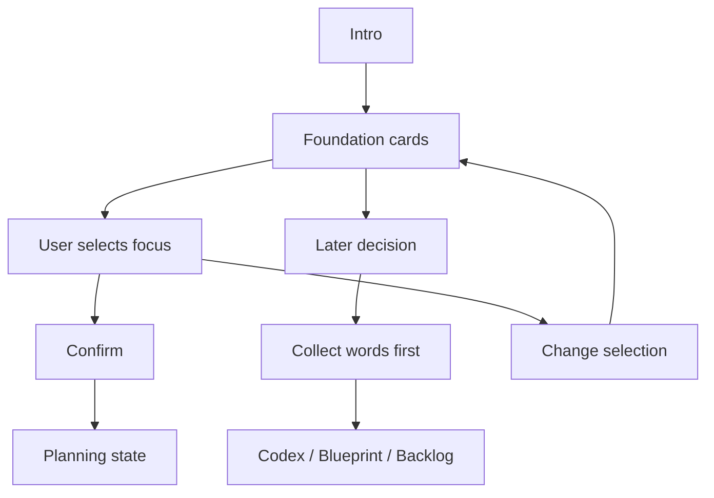

# Phase 2G-M13-K: Early Onboarding Product Wireframe Plan

Stand: 2026-06-06

Status: `Planung gestartet / mobile Wireframes textuell definiert`

## 1. Ziel

Dieses Dokument plant eine erste produktnahe Wireframe-Richtung fuer das Early
Onboarding. Es zeigt, wie Nutzer am Anfang kurz von Tali/Vori gefuehrt werden
und zwischen den Foundation-Lernfokus-Optionen Zuhause/Alltag, Schule/Lernen
und Garten/Natur nah waehlen koennen.

M13-K ist nur Wireframe- und UX-Planung. Es ist keine finale Onboarding-UI,
keine App-Integration, keine Implementierung, keine finale Startinsel und keine
Assetfreigabe.

## 2. Onboarding-Ziel

- Der Nutzer waehlt keinen endgueltigen Wohnort.
- Der Nutzer waehlt keinen endgueltigen Inseltyp.
- Der Nutzer waehlt einen ersten Lernfokus.
- Die Wahl bleibt spaeter aenderbar.
- Tali/Vori erklaert kurz, freundlich und ohne Druck.
- Es gibt keinen Pflicht-Hausstart.
- Es gibt keine irreversible Erstwahl.
- Es gibt keinen Premium-/Paywall-Druck.
- Unpassende Woerter gehen spaeter sicher in Codex, Blueprint oder Backlog.

## 3. Product-Wireframe-Ablauf

Der Flow soll kurz bleiben und maximal wenige States brauchen:

1. Begruessung durch Tali/Vori.
2. Kurze Erklaerung: "Waehle einen ersten Lernfokus."
3. Drei Foundation-Karten.
4. Auswahlzustand.
5. Bestaetigung.
6. Optionaler Hinweis: "Spaeter aenderbar."
7. Ergebnis: Foundation-Fokus gesetzt, aber keine finale Insel und kein Asset.

Nicht geplant:

- lange Erklaertexte,
- alle Roadmap-Wellen im Start-Onboarding,
- irreversible Entscheidung,
- automatische Wortplatzierung,
- Premium-Hinweis,
- finale UI-Optik.

## 4. Mobile ASCII-Wireframes

### 4.1 Begruessungszustand Mit Tali/Vori

```text
+--------------------------------+
| Talvori Welt                   |
|                                |
|        [ Tali/Vori ]           |
|                                |
|  Schoen, dass du da bist.      |
|  Waehle gleich einen ersten    |
|  Lernfokus fuer deine Welt.    |
|                                |
|       [ Weiter ]               |
|                                |
|  Spaeter kannst du wechseln.   |
+--------------------------------+
```

Planungsnotizen:

- Tali/Vori steht oberhalb des Textes und verdeckt keine Interaktion.
- Der Text ist kurz und freundlich.
- Der Hinweis zur Aenderbarkeit ist sichtbar, aber nicht dominant.

### 4.2 Drei Foundation-Karten Als Mobile Darstellung

```text
+--------------------------------+
| Waehle deinen Lernfokus        |
|                                |
| +----------------------------+ |
| | Zuhause / Alltag           | |
| | Dinge aus dem Alltag       | |
| | spoon, key, chair          | |
| +----------------------------+ |
|                                |
| +----------------------------+ |
| | Schule / Lernen            | |
| | Werkzeuge fuers Lernen     | |
| | pencil, book, ruler        | |
| +----------------------------+ |
|                                |
| +----------------------------+ |
| | Garten / Natur nah         | |
| | Natur und Pflege           | |
| | seed, leaf, flower         | |
| +----------------------------+ |
|                                |
|  [ Spaeter entscheiden ]       |
+--------------------------------+
```

Planungsnotizen:

- Karten stapeln sich auf kleinen Phones.
- Jede Karte braucht kurze Zeilen und klare Tap-Zone.
- Keine Karte wirkt als Pflichtpfad.

### 4.3 Ausgewaehlte Karte Und Bestaetigung

```text
+--------------------------------+
| Dein erster Lernfokus          |
|                                |
| +----------------------------+ |
| | Garten / Natur nah         | |
| | ausgewaehlt                | |
| | seed, watering can, leaf   | |
| +----------------------------+ |
|                                |
|  Du kannst spaeter wechseln.   |
|  Unpassende Woerter bleiben    |
|  sicher im Codex/Backlog.      |
|                                |
|       [ Bestaetigen ]          |
|       [ Auswahl aendern ]      |
+--------------------------------+
```

Planungsnotizen:

- Auswahl wird nicht nur ueber Farbe gezeigt.
- Primary Button ist klar.
- Aendern bleibt erreichbar.

### 4.4 Safe Exit / Spaeter Entscheiden / Fallback

```text
+--------------------------------+
| Noch nicht sicher?             |
|                                |
|  Das ist okay. Du kannst       |
|  zuerst Woerter sammeln.       |
|                                |
|  Passende Woerter kommen       |
|  spaeter in deine Welt.        |
|  Andere bleiben sicher in:     |
|                                |
|  - Codex                       |
|  - Blueprint                   |
|  - Backlog                     |
|                                |
|       [ Weiter sammeln ]       |
|       [ Fokus waehlen ]        |
+--------------------------------+
```

Planungsnotizen:

- Safe Exit reduziert Entscheidungsdruck.
- Codex/Blueprint/Backlog werden als sichere Zwischenablage erklaert.
- Kein Nutzer wird zur Foundation-Wahl gezwungen.

## 5. Foundation-Karteninhalt

| Karte | Rolle | Kurzer Nutzertext | Passende Woerter | Risiko | Schutzregel |
| --- | --- | --- | --- | --- | --- |
| Zuhause / Alltag | vertraute Alltagswoerter | "Lerne Dinge, die dir taeglich begegnen." | spoon, key, chair, table, window | wirkt wie Pflicht-Hausstart | klar als Option markieren; kein Hausbau-Zwang |
| Schule / Lernen | Lernwerkzeuge und einfache Objekte | "Starte mit Dingen rund ums Lernen." | pencil, book, ruler, eraser, notebook | wirkt zu schulisch oder verpflichtend | freundlich, spielnah und nicht wie Arbeitsblatt formulieren |
| Garten / Natur nah | Natur, Pflege und Wachstumssprache | "Entdecke Naturwoerter und kleine Dinge im Garten." | seed, leaf, flower, soil, watering can | suggeriert Growth-/Timer-Erwartung | kein Timer-, Verfall- oder Streak-Versprechen |

## 6. UX-Zustaende

Diese Zustaende sind UX-Planungszustaende, keine Runtime-State-Definition.

| Zustand | Bedeutung | Nutzeraktion | Guardrail |
| --- | --- | --- | --- |
| idle / intro | Onboarding beginnt | Weiter | Tali/Vori kurz halten |
| cards visible | drei Lernfokus-Karten sichtbar | Karte antippen oder spaeter entscheiden | keine ueberladene Auswahl |
| card focused | eine Karte hat Fokus | Details lesen | nicht nur farblich markieren |
| card selected | Karte ist ausgewaehlt | bestaetigen oder aendern | Auswahl bleibt reversibel |
| confirm visible | Primary Button sichtbar | bestaetigen | kein Druck, kein Countdown |
| later decision | Nutzer entscheidet spaeter | weiter sammeln | kein Verlust oder Nachteil |
| confirmed planning state | Lernfokus gemerkt | weiter zum naechsten Planungszustand | keine finale Insel/kein Asset |
| fallback to Codex/Blueprint/Backlog | Wort passt noch nicht | speichern | keine automatische Platzierung |

## 7. Device-/Accessibility-/Text-Containment-Regeln

Planungspruefung fuer spaetere Wireframes:

- kleine Phone-Breite zuerst pruefen,
- Portrait-Fokus,
- Tap-Targets gross genug planen,
- Abstand zwischen Karten und Buttons einplanen,
- kurze Labels statt langer Kartentexte,
- keine rein farbcodierte Auswahl,
- Tali/Vori nicht ueber interaktiven Elementen,
- "Spaeter entscheiden" erreichbar halten,
- reduzierte Bewegung als spaetere Option mitdenken,
- keine Audio-only-Erklaerung,
- Texte muessen in Karten, Rahmen und Panels bleiben,
- keine wichtigen Texte abschneiden.

## 8. Textuelle Visualisierungen

### 8.1 Onboarding Flow



### 8.2 Screen/State Matrix

| Screen/State | Purpose | Primary Action | Risk | Guardrail |
| --- | --- | --- | --- | --- |
| Intro | freundlich einordnen | Weiter | zu viel Text | maximal kurze Tali/Vori-Erklaerung |
| Cards visible | Lernfokus anbieten | Karte waehlen | Entscheidung ueberfordert | nur drei Karten |
| Card selected | Auswahl bestaetigen | Bestaetigen | irreversible Wirkung | "spaeter aenderbar" sichtbar |
| Later decision | Druck senken | Weiter sammeln | Nutzer fuehlt sich blockiert | Codex/Blueprint/Backlog erklaeren |
| Confirmed planning state | Fokus merken | weiter | finale Insel suggeriert | "Lernfokus, keine Startinsel" dokumentieren |

### 8.3 Good / Blocked Fuer Onboarding UX

| Good | Blocked |
| --- | --- |
| kurze Tali/Vori-Erklaerung | langer Tutorial-Text |
| drei klare Karten | alle Roadmap-Wellen im Start |
| Lernfokus statt Startinsel | Pflicht-Hausstart |
| Auswahl spaeter aenderbar | irreversible Erstwahl |
| Safe Exit sichtbar | Nutzer muss sofort waehlen |
| Codex/Blueprint/Backlog als Fallback | automatische Wortplatzierung |
| keine Premium-Erwaehnung | Paywall- oder Premium-Druck |

## 9. Risiken Und Harte Blocker

- Wireframe wirkt wie finale UI.
- Zuhause wirkt wie Pflicht-Hausstart.
- Garten suggeriert Timer-/Growth-Druck.
- Schule wirkt wie Pflichtschule oder Strafmodus.
- Texte laufen aus Karten, Rahmen oder Panels.
- Buttons sind zu klein oder zu nah.
- Tali/Vori verdeckt Interaktion.
- Premium-/Paywall-Hinweis erscheint im Start-Onboarding.
- Auswahl wirkt irreversibel.
- Automatische Wortplatzierung wird suggeriert.
- Foundation-Wahl wird als finale Startinsel gelesen.

## 10. Stop-Regeln

- Keine finale Onboarding-UI aus M13-K.
- Keine App-Integration aus M13-K.
- Keine Codefreigabe aus M13-K.
- Keine Assetfreigabe aus M13-K.
- Keine finale Startinsel aus M13-K.
- Keine ThemeIsland-Umsetzung aus M13-K.
- Keine finale Datenstruktur aus M13-K.
- Keine Runtime-Konfiguration aus M13-K.
- Keine PNG-Erzeugung aus M13-K.
- Keine Tests aus M13-K.
- Kein `frame_started` oder Bauzustand aus M13-K.

## 11. Naechster erlaubter Schritt

Erlaubt sind nur Review, Nachbesserung oder weitere reine Preview-/
Review-Planung, zum Beispiel Word-to-Island Product UX Preview, Container QA
Overlay Preview oder Foundation Choice Device Preview. Code, Assets,
App-Integration, finale UI, finale Datenstruktur, Runtime-Konfiguration und
`frame_started` bleiben blockiert.
