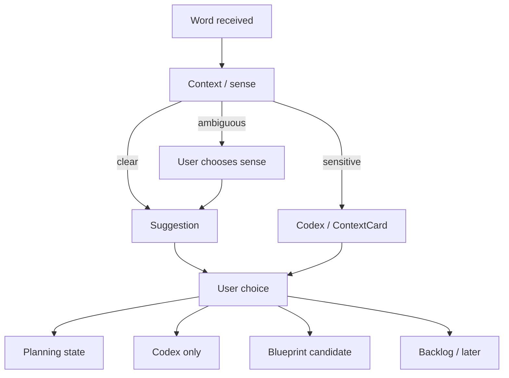

# Phase 2G-M13-L: Word-to-Island Product UX Preview Plan

Stand: 2026-06-06

Status: `Planung gestartet / Word-to-Island UX-Wireframes textuell definiert`

## 1. Ziel

Dieses Dokument plant eine erste produktnahe, aber nicht finale UX-Preview fuer
Word-to-Island. Es zeigt, wie ein gelerntes, importiertes oder manuell
hinzugefuegtes Wort dem Nutzer als sicherer Vorschlag erklaert wird, ohne
automatische Platzierung oder falsche Insel-/Depth-Zuordnung.

M13-L ist nur UX-Preview- und Wireframe-Planung. Es ist keine finale
Word-to-Island-UI, keine App-Integration, keine Implementierung, keine finale
Datenstruktur und keine Runtime-Konfiguration.

## 2. UX-Ziel

- Ein Wort wird nicht automatisch sichtbar platziert.
- Der Nutzer bekommt einen verstaendlichen Vorschlag.
- Der Nutzer kann bestaetigen, aendern, spaeter entscheiden oder nur im Codex
  speichern.
- Mehrdeutige Woerter brauchen Kontext- oder Sense-Auswahl.
- Kleine Objekte brauchen Container, Depth oder DetailInteraction statt
  IslandView.
- Sensible oder abstrakte Begriffe bleiben neutral und optional.
- Tali/Vori erklaert kurz, entscheidet aber nicht.
- Es gibt keinen Premium-/Paywall-Druck.
- Kein Asset und kein Bauzustand entsteht aus diesem Flow.

## 3. Product-UX-Ablauf

Der Flow soll kurz bleiben und keine Expertenbegriffe in der Nutzeransicht
zeigen:

1. Wort wurde gelernt, importiert oder manuell hinzugefuegt.
2. Talvori prueft Kontext, Sense und Worttyp.
3. Vorschlag erscheint: ThemeIsland + Depth + sichere Route.
4. Nutzer waehlt:
   - Vorschlag bestaetigen,
   - andere Insel waehlen,
   - nur Codex,
   - Blueprint vormerken,
   - spaeter entscheiden.
5. Ergebnis wird als Planning State dokumentiert, nicht als finale Platzierung.

Nicht geplant:

- automatische sichtbare Platzierung,
- technischer Routing-Dialog,
- finale Datenstruktur,
- Runtime-Konfiguration,
- Asset- oder Bauzustandsproduktion.

## 4. Mobile ASCII-Wireframes

### 4.1 Wort-Eingang / Gelerntes Wort

```text
+--------------------------------+
| Neues Wort gelernt             |
|                                |
|        apple                   |
|        Apfel                   |
|                                |
|  Tali/Vori: Ich kann dir       |
|  einen sicheren Ort            |
|  vorschlagen.                  |
|                                |
|       [ Vorschlag ansehen ]    |
|       [ Nur im Codex ]         |
|       [ Spaeter ]              |
+--------------------------------+
```

Planungsnotizen:

- Kein Wort wird direkt sichtbar platziert.
- Primary Action ist ein Vorschlag, keine Platzierung.
- Codex und Spaeter bleiben erreichbar.

### 4.2 Vorschlagskarte: ThemeIsland + Depth

```text
+--------------------------------+
| Vorschlag fuer apple           |
|                                |
|  Lernfokus: Garten / Essen     |
|  Ort: Beet oder Marktstand     |
|  Sichtbar: erst im Detail      |
|                                |
|  Warum? Apple passt zu         |
|  Essen, Garten und Einkauf.    |
|                                |
|       [ Vorschlag merken ]     |
|       [ Anderen Ort waehlen ]  |
|       [ Nur Codex ]            |
+--------------------------------+
```

Planungsnotizen:

- Mehrere passende Orte duerfen sichtbar sein.
- "merken" heisst Planning State, nicht finale Platzierung.
- Detail/Depth wird in einfacher Sprache erklaert.

### 4.3 Mehrdeutiges Wort Mit Sense-Auswahl

```text
+--------------------------------+
| Was meinst du mit bank?        |
|                                |
| +----------------------------+ |
| | Sitzbank                   | |
| | Park, Garten, Stadt        | |
| +----------------------------+ |
|                                |
| +----------------------------+ |
| | Bank / Geldinstitut        | |
| | Stadt, spaeter             | |
| +----------------------------+ |
|                                |
|       [ Bedeutung waehlen ]    |
|       [ Spaeter entscheiden ]  |
+--------------------------------+
```

Planungsnotizen:

- Kein mehrdeutiges Wort wird ohne Sense-Auswahl platziert.
- Die riskantere Bedeutung kann spaeter bleiben.
- Sprache bleibt nutzernah.

### 4.4 Kleines Objekt Mit Container-Hinweis

```text
+--------------------------------+
| Vorschlag fuer pencil          |
|                                |
|  Passt gut zu: Schule          |
|  Besserer Ort: Federmappe      |
|  Nicht dauerhaft auf Insel     |
|                                |
|  Kleine Dinge sind besser      |
|  in einem Container sichtbar.  |
|                                |
|       [ Federmappe merken ]    |
|       [ Nur Codex ]            |
|       [ Spaeter ]              |
+--------------------------------+
```

Planungsnotizen:

- TinyObject landet nicht in IslandView.
- Container wird als nutzerfreundlicher Ort erklaert.
- Keine Container-Implementierung wird freigegeben.

### 4.5 Sensibler / Abstrakter Begriff

```text
+--------------------------------+
| Vorschlag fuer freedom         |
|                                |
|  Dieses Wort braucht Kontext.  |
|  Es wird nicht als Objekt      |
|  in die Welt gesetzt.          |
|                                |
|  Sicherer Weg:                 |
|  Codex oder ContextCard        |
|                                |
|       [ Im Codex speichern ]   |
|       [ Kontext notieren ]     |
|       [ Spaeter ]              |
+--------------------------------+
```

Planungsnotizen:

- Abstrakte und sensible Begriffe werden neutral behandelt.
- Keine automatische Visualisierung.
- Kein Symbol, kein Gebaeude, kein Reward.

## 5. Beispielpfade

### A. Direkt Passend

Beispiele: `apple`, `book`, `chair`

| Wort | Vorschlag | Nutzerentscheidung | Guardrail |
| --- | --- | --- | --- |
| apple | Garten, Essen oder Einkauf; Detail/Container moeglich | bestaetigen, andere Insel, Codex, spaeter | Multi-home nicht final platzieren |
| book | Schule oder Zuhause; Regal/Schreibtisch | bestaetigen oder Codex | nicht als Inselobjekt erzwingen |
| chair | Zuhause, Schule oder Cafe; Raum/Interior | bestaetigen oder Blueprint | nur sichtbar, wenn passende Szene existiert |

### B. Mehrdeutig

Beispiele: `bank`, `mouse`, `spring`

- Erst Bedeutung waehlen.
- Danach ThemeIsland und Depth vorschlagen.
- Wenn Kontext fehlt: spaeter entscheiden oder Codex.

Blockiert:

- keine Platzierung ohne Sense-Auswahl,
- keine automatische Entscheidung durch Tali/Vori,
- keine technische Label-Flut.

### C. Kleinteil / Container

Beispiele: `pencil`, `spoon`, `key`, `seed`

- `pencil`: Schule -> Federmappe.
- `spoon`: Zuhause/Essen -> Kuechenschublade.
- `key`: Zuhause -> Kiste, Schublade oder DetailInteraction.
- `seed`: Garten -> Samenbeutel, Beet oder Pflanzkiste.

Guardrail:

Kleine Dinge gehoeren nicht dauerhaft in IslandView. Sie brauchen Container,
Depth, DetailInteraction, Codex oder Backlog.

### D. Gebaeudeteil / Blueprint

Beispiele: `window`, `door`, `roof`

- Nur sichtbar, wenn ein passender Gebaeudezustand existiert.
- Sonst Blueprint vormerken.
- Kein Bauzustand entsteht automatisch.

Blockiert:

- keine automatische Haus-/Gebaeudeproduktion,
- kein `frame_started`,
- keine Runtime-Konfiguration.

### E. Sensibel / Abstrakt

Beispiele: `illness`, `law`, `freedom`, `memory`

- `illness`: Codex/ContextCard, keine Visualisierung.
- `law`: Codex/ContextCard, keine Gerichts- oder Polizei-Asset-Ableitung.
- `freedom`: Kontextkarte oder Codex.
- `memory`: Codex, Satzkontext oder CompanionDialog.

Guardrail:

Sensible und abstrakte Begriffe bleiben neutral, privat, optional und ohne
automatische Weltplatzierung.

## 6. UX-Zustaende

Diese Zustaende sind UX-Planungszustaende, keine Runtime-State-Definition.

| Zustand | Bedeutung | Nutzeraktion | Guardrail |
| --- | --- | --- | --- |
| word received | Wort kommt an | Vorschlag ansehen | keine automatische Platzierung |
| context needed | Kontext fehlt | Bedeutung/Kontext geben oder spaeter | kein Raten als Pflicht |
| sense selected | Bedeutung gewaehlt | Vorschlag erzeugen | Nutzer kontrolliert Sense |
| suggestion ready | Vorschlag sichtbar | bestaetigen/aendern/Codex/spaeter | Vorschlag ist nicht final |
| suggestion accepted | Nutzer bestaetigt | Planning State merken | keine finale Weltplatzierung |
| changed by user | Nutzer waehlt anderen Ort | neuen Vorschlag merken | Safety bleibt hoeher als Wunsch |
| codex only | nur speichern | Codex | kein sichtbares Objekt |
| blueprint candidate | vormerken | Blueprint | kein Bauzustand |
| backlog/later | spaeter | Backlog | kein Verlust |
| blocked by safety/policy | sensible Route | Codex/ContextCard | keine Visualisierung |
| confirmed planning state | Entscheidung geplant | weiter | keine Runtime-Konfiguration |

## 7. Device-/Accessibility-/Text-Containment-Regeln

Planungspruefung fuer spaetere UX-Previews:

- kleine Phone-Breite zuerst pruefen,
- Portrait-Fokus,
- kurze Labels,
- keine langen technischen Erklaerungen,
- keine rein farbcodierte Entscheidung,
- klare Primary/Secondary Actions,
- "Spaeter entscheiden" erreichbar halten,
- Tali/Vori nicht ueber interaktiven Elementen,
- reduzierte Bewegung als spaetere Option mitdenken,
- keine Audio-only-Erklaerung,
- Texte bleiben in Karten, Rahmen und Panels,
- keine wichtigen Texte abschneiden.

## 8. Textuelle Visualisierungen

### 8.1 Word-to-Island Flow



### 8.2 Word Type / UX Route / Guardrail

| Word Type | UX Route | User Choice | Guardrail |
| --- | --- | --- | --- |
| direct object | Vorschlagskarte | bestaetigen/aendern/Codex/spaeter | keine finale Platzierung |
| multi-home object | mehrere passende Inseln | Kontext oder Auswahl | nicht automatisch entscheiden |
| ambiguous word | Sense-Auswahl | Bedeutung waehlen | kein Vorschlag ohne Sense |
| tiny object | Container/Detail-Hinweis | Container merken oder Codex | nicht in IslandView |
| building part | Blueprint-Hinweis | Blueprint oder Codex | kein Bauzustand |
| verb/action | Action/Sequence-Hinweis | spaeter oder Codex | kein statisches Objekt |
| abstract/sensitive | Codex/ContextCard | neutral speichern | keine Visualisierung |

### 8.3 Screen/State Matrix

| Screen/State | Purpose | Primary Action | Risk | Guardrail |
| --- | --- | --- | --- | --- |
| Word received | Wort wertvoll machen | Vorschlag ansehen | wirkt automatisch | klar "Vorschlag" nennen |
| Suggestion card | einfachen Ort erklaeren | Vorschlag merken | finale Platzierung suggeriert | Planning State benennen |
| Sense choice | Mehrdeutigkeit loesen | Bedeutung waehlen | zu technisch | einfache Beispiele |
| Container hint | Kleinteile sicher routen | Container merken | Inselpixel | Container statt IslandView |
| Codex/ContextCard | sensibel/abstrakt neutral halten | im Codex speichern | sichtbare Symbolik | keine Weltvisualisierung |

### 8.4 Good / Blocked Fuer Word-to-Island UX

| Good | Blocked |
| --- | --- |
| Vorschlag statt Zwang | automatische Platzierung |
| Nutzer waehlt Sense | mehrdeutiges Wort sofort platzieren |
| Container fuer Kleinteile | TinyObject in IslandView |
| Blueprint fuer Gebaeudeteile | Bauzustand erzeugen |
| Codex/ContextCard fuer sensibel/abstrakt | Symbol, Gebaeude oder Reward |
| Tali/Vori erklaert kurz | Tali/Vori entscheidet |
| Spaeter entscheiden sichtbar | Nutzer muss sofort waehlen |
| keine Premium-Erwaehnung | Paywall-/Premium-Druck |

## 9. Risiken Und Harte Blocker

- UX suggeriert automatische Platzierung.
- Vorschlag wirkt wie endgueltige Entscheidung.
- Technische Labels ueberfordern Nutzer.
- Mehrdeutige Woerter werden ohne Sense-Auswahl platziert.
- Kleinteile werden direkt in IslandView gedrueckt.
- Gebaeudeteile erzeugen Bauzustaende.
- Sensible Begriffe werden sichtbar visualisiert.
- Tali/Vori entscheidet statt Nutzer.
- Premium-/Paywall-Hinweis erscheint im Routing.
- Texte laufen aus Karten, Rahmen oder Panels.
- Buttons sind zu klein oder zu nah.
- Flow erzeugt finale Datenstruktur oder Runtime-Konfiguration.

## 10. Stop-Regeln

- Keine finale Word-to-Island-UI aus M13-L.
- Keine Word-to-Island-Implementierung aus M13-L.
- Keine Routing-Datenstruktur aus M13-L.
- Keine Runtime-Konfiguration aus M13-L.
- Keine automatische Wortplatzierung aus M13-L.
- Keine App-Integration aus M13-L.
- Keine Codefreigabe aus M13-L.
- Keine Assetfreigabe aus M13-L.
- Keine PNG-Erzeugung aus M13-L.
- Keine Tests aus M13-L.
- Kein `frame_started` oder Bauzustand aus M13-L.

## 11. Naechster erlaubter Schritt

Erlaubt sind nur Review, Nachbesserung oder weitere reine Preview-/
Review-Planung, zum Beispiel Container QA Overlay Preview oder Foundation
Choice Device Preview. Code, Assets, App-Integration, finale UI,
Routing-Datenstruktur, Runtime-Konfiguration, automatische Wortplatzierung und
`frame_started` bleiben blockiert.
