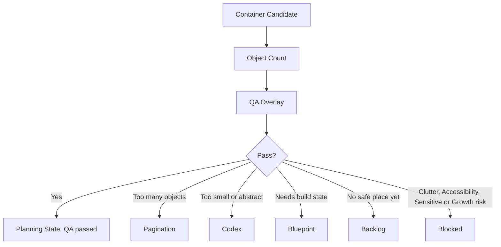

# Phase 2G-M13-M: Container QA Overlay Preview Plan

Stand: 2026-06-06

Status: `Planung gestartet / Container-QA-Overlay-Preview textuell definiert`

## 1. Ziel

Dieses Dokument plant eine erste QA-Overlay-Preview fuer `ContainerOpenView`,
`DetailInteractionView` und kleine Objektgruppen. Es zeigt, wie spaetere
Container-UX visuell gegen Tap-Zonen, Fokusobjekte, Label-Zonen, Safe Areas,
Clutter, Pagination und Tali/Vori-Ueberdeckung geprueft werden kann.

M13-M ist nur QA-/Preview-Planung. Es ist keine finale Container-UI, keine
App-Integration, keine Implementierung, keine finale Datenstruktur und keine
Runtime-Konfiguration.

Es werden keine PNGs erzeugt. Visualisierung erfolgt nur als ASCII-Wireframe,
ASCII-QA-Overlay, Mermaid-Flow, Markdown-Tabelle und QA-/Device-Checkliste.

## 2. QA-Ziel

- Container sollen Lernmomente sein, keine Inventarlisten.
- Kleine Objekte duerfen nicht dauerhaft in IslandView liegen.
- Container brauchen klare Fokusobjekte.
- Tap-Zonen muessen gross genug und voneinander getrennt sein.
- Labels duerfen Objekte und Buttons nicht verdecken.
- Tali/Vori darf keine Interaktion verdecken.
- Pagination muss sichtbar werden, wenn zu viele Objekte vorhanden sind.
- QA-Overlays sind Debug-/Review-Material, keine Nutzer-UI.
- Kein Asset, kein Code und kein Bauzustand entsteht aus diesem Block.

M13-M konkretisiert M13-F fuer die visuelle QA-Frage: Nicht nur "wie viele
Objekte sind erlaubt?", sondern "wie pruefen wir spaeter, ob Fokus, Labels,
Tap-Zonen und Safe Areas tatsaechlich funktionieren?".

## 3. QA-Overlay-Ebenen

| Overlay-Ebene | Zweck | Geprueft wird | Blockiert, wenn... | Spaeter sichtbar in Debug Preview? |
| --- | --- | --- | --- | --- |
| Safe Area | Randabstand und nicht verdeckte Bedienbereiche sichern. | Nichts liegt unter Systemrand, Buttonleiste oder Companion-Hinweis. | Fokusobjekt, Button oder Pagination am Rand klebt. | Ja |
| Container Bounds | Containerflaeche eindeutig begrenzen. | Ob Objekte im Container bleiben und die View nicht ueberladen. | Objekte ausserhalb des Containers schweben oder Liste statt Lernmoment entsteht. | Ja |
| Focus Object Zone | Primaeres Lernobjekt markieren. | Ob Zielobjekt groesser, zentraler oder klarer gerahmt ist. | Kein Fokusobjekt erkennbar ist. | Ja |
| Secondary Object Zone | Distraktoren oder Vergleichsobjekte ordnen. | Ob Sekundaerobjekte nicht dominieren. | Zu viele gleich wichtige Kleinteile sichtbar sind. | Ja |
| Label Zone | Labels lesbar halten. | Ob Labels nahe genug, aber nicht verdeckend sind. | Labels auf Objekt, Tap-Ziel oder Button liegen. | Ja |
| Tap Target Zone | Beruehrbare Flaechen pruefen. | Groesse, Abstand und Eindeutigkeit der Touch-Ziele. | Ziele zu klein, zu dicht oder ueberlappend sind. | Ja |
| Primary Button Zone | Hauptaktion erreichbar halten. | Button sichtbar, nicht verdeckt, nicht zu nah an anderen Zielen. | Primary Action fehlt oder Tali/Vori sie verdeckt. | Ja |
| Pagination Zone | Seitenlogik sichtbar machen. | Page Indicator, Next/Back oder Swipe-Hinweis. | Mehr Objekte vorhanden sind, aber keine Navigation geplant ist. | Ja |
| Tali/Vori Exclusion Zone | Companion darf UX nicht blockieren. | Companion-Bubble beruehrt keine Tap-Ziele und keinen Fokus. | Tali/Vori ueber Objektgruppe oder Button liegt. | Ja |
| Decoration/Background Zone | Deko von Lernobjekten trennen. | Deko bleibt ruhig und verdeckt nichts. | Deko wie Lernobjekt wirkt oder Zielobjekt verdeckt. | Optional |
| Blocked/Overflow Zone | Ueberlauf sichtbar markieren. | Wo Objekte nicht mehr gezeigt werden duerfen. | Ueberlauf trotzdem als Mini-Icons erscheint. | Ja |

## 4. ASCII-QA-Wireframes

### 4.1 Gute ContainerOpenView Mit QA-Overlay

```text
+----------------------------------+
| SAFE AREA                        |
| +------------------------------+ |
| | CONTAINER: Federmappe        | |
| |                              | |
| |   [FOCUS TAP]                | |
| |   Bleistift                  | |
| |                              | |
| | [tap] Radiergummi  [tap] Lineal|
| |                              | |
| | Label-Zone: kurz, oberhalb   | |
| +------------------------------+ |
| Page: 1/1                       |
| [ Primaer: Finden ]  [ Codex ]  |
+----------------------------------+
```

QA-Bewertung:

- Fokusobjekt ist klar.
- Sekundaerobjekte sind wenige und getrennt.
- Labels liegen nicht auf Tap-Zielen.
- Kein Objekt wird zur Mini-Inventarliste.

### 4.2 Ueberladene / Blockierte ContainerOpenView

```text
+----------------------------------+
| SAFE AREA                        |
| +------------------------------+ |
| | CONTAINER: Federmappe        | |
| | p e n pencil pen eraser clip | |
| | ruler marker glue key note   | |
| | tape card pen pen pin        | |
| | label label label label      | |
| +------------------------------+ |
| Page: fehlt                     |
| [ Finden ] [ Mehr ] [ Weiter ]  |
+----------------------------------+
```

QA-Bewertung:

- Zu viele Kleinteile gleichzeitig sichtbar.
- Keine klare Fokus-Zone.
- Labels wirken wie Labelwolke.
- Pagination fehlt trotz Ueberlauf.
- Ergebnis: blockiert, braucht Pagination, Backlog oder Codex.

### 4.3 DetailInteractionView Mit Grossem Fokusobjekt

```text
+----------------------------------+
| DETAIL INTERACTION               |
|                                  |
|        +----------------+        |
|        |  FOCUS OBJECT  |        |
|        |  Kompass       |        |
|        |  grosse Zone   |        |
|        +----------------+        |
|                                  |
|  [ Karte ]       [ Seil ]        |
|                                  |
|  Label: Finde den Kompass        |
|  [ Bestaetigen ]   [ Zurueck ]   |
+----------------------------------+
```

QA-Bewertung:

- Ein Hauptobjekt dominiert.
- Vergleichsobjekte sind gross genug.
- Die Aufgabe steht ausserhalb der Tap-Zonen.
- Kein finaler Screen, nur QA-Planung.

### 4.4 Pagination-Fall Mit Mehreren Seiten

```text
+----------------------------------+
| CONTAINER: Werkzeugkiste         |
|                                  |
| Seite 1/3                        |
| +--------+ +--------+ +--------+ |
| |Hammer  | |Zange   | |Schraube| |
| |tap     | |tap     | |tap     | |
| +--------+ +--------+ +--------+ |
|                                  |
|  (7 weitere Woerter warten)      |
|                                  |
| [ Zurueck ]       [ Weiter ]     |
+----------------------------------+
```

QA-Bewertung:

- Aktive Objekte sind begrenzt.
- Ueberlauf wird gezaehlt, aber nicht gezeigt.
- Pagination ist sichtbar.
- Suche/Filter bleiben spaeter, nicht erster MVP.

### 4.5 Tali/Vori-Ueberdeckungsrisiko Und Exclusion Zone

```text
+----------------------------------+
| SAFE AREA                        |
| +------------------------------+ |
| | EXCLUSION: Tali/Vori oben    | |
| | keine Buttons, keine Objekte | |
| +------------------------------+ |
|                                  |
| +------------------------------+ |
| | CONTAINER: Kuechenschublade  | |
| | [tap] Loeffel  [tap] Gabel   | |
| | [tap] Messer                 | |
| +------------------------------+ |
|                                  |
| [ Primaer: Tippen ] [ Spaeter ]  |
+----------------------------------+
```

QA-Bewertung:

- Companion-Bereich ist als Sperrzone geplant.
- Keine Bubble liegt ueber Fokusobjekt oder Button.
- Tali/Vori darf ermutigen, aber keine Interaktion blockieren.

## 5. Beispiel-Faelle

### A. Schule / Federmappe

Objekte:

- `pencil`,
- `eraser`,
- `ruler`.

Warum geeignet:

- Drei klare Schulobjekte.
- Gute erste Tap-Auswahl.
- Passender Container mit geringer Erklaerlast.

Wann Clutter entsteht:

- Mehr als 5 Stifte, Clips, Karten oder Miniobjekte gleichzeitig sichtbar.
- Labels ueber jedem Objekt.
- Federmappe wird zur Inventarliste.

Wichtige QA-Zonen:

- Focus Object Zone fuer `pencil`,
- Secondary Object Zone fuer `eraser` und `ruler`,
- Label Zone mit kurzen Labels,
- Tap Target Zone mit deutlichem Abstand.

QA-Entscheidung:

`QA passed`, wenn drei Objekte klar, gross genug und ohne Label-Ueberdeckung
gezeigt werden. Sonst `needs layout adjustment` oder `needs pagination`.

### B. Zuhause / Kuechenschublade

Objekte:

- `spoon`,
- `fork`,
- `knife`.

Warum geeignet:

- Klassischer Container-/Depth-Fall.
- Besteck passt logisch in Schublade.
- Challenge kann "Finde den Loeffel" bleiben.

Fokusobjekte vs. Objektliste:

- Gut: 1 Fokusobjekt plus 2 Distraktoren.
- Blockiert: ganze Bestecksammlung als Mini-Icons.

Tap-Zonen und Labels:

- Jedes Objekt braucht eigene Tap-Zone.
- Labels nur bei Fokus, Challenge, Feedback oder Accessibility.
- Schubladenrand und Griff duerfen nicht wie eigene Lernobjekte wirken.

### C. Garten / Beet

Objekte:

- `seed`,
- `watering can`,
- `plant`.

Warum geeignet:

- Starke naturnahe Lernlogik.
- `watering can` ist groesser als TinyObject und als Fokusobjekt geeignet.
- `seed` braucht eher Container/DetailInteraction, weil es sehr klein ist.

Blockiert bleibt:

- Growth-/Timer-Logik,
- Pflanzenverfall,
- Streak-Druck,
- "Pflanze leidet"-Companion-Wording.

QA-Hinweis:

Sichtbare Pflanzenanzahl begrenzen. Wenn mehrere Pflanzen oder Samenarten
entstehen, braucht der Flow Pagination, Codex, Backlog oder eigene
Growth-/Fairness-Pruefung.

### D. Hafen / Bootskiste

Objekte:

- `compass`,
- `map`,
- `rope`.

Warum mobil riskanter:

- Hafen/Kueste hat mehr visuelle Dichte.
- Wasser, Dock, Boot, Kiste und Navigation koennen schnell konkurrieren.
- `map` und `rope` koennen grosse oder kleine Formen haben.

QA-Entscheidung:

Hafen/Bootskiste bleibt wertvoll, aber braucht separate
Mobile-Komplexitaetspruefung. Ohne klare Container Bounds, Focus Zone und
Tali/Vori Exclusion Zone ist der Flow blockiert.

## 6. QA-Entscheidungspunkte

Diese Zustaende sind QA-Planungszustaende, keine Runtime-State-Definition:

| QA-Entscheidung | Bedeutung | Typische Folge |
| --- | --- | --- |
| `QA passed` | Fokus, Tap-Zonen, Labels und Safe Area wirken plausibel. | Darf spaeter produktnah visualisiert werden. |
| `needs layout adjustment` | Grundidee passt, Layout kollidiert. | Groessen, Abstaende, Labels oder Button-Zonen ueberarbeiten. |
| `needs pagination` | Zu viele Objekte fuer eine Seite. | Page Indicator, Next/Back oder Backlog planen. |
| `move to Codex` | Sichtbare Darstellung ueberlaedt oder ist abstrakt/sensibel. | Begriff neutral speichern. |
| `move to Blueprint` | Objekt braucht Gebaeudezustand, Container oder spaeteren Raum. | Vormerken, nicht platzieren. |
| `move to Backlog` | Kein passender Ort oder keine passende UX vorhanden. | Spaeter erneut pruefen. |
| `needs Device Preview` | Kleine Phone-Breite oder Tap-Ziele unklar. | Device-/Accessibility-Preview planen. |
| `blocked by Clutter` | Zu viele Kleinteile, Labels oder Deko. | Reduzieren, gruppieren, paginieren oder verschieben. |
| `blocked by Accessibility` | Audio/Farbe/kleine Details sind einzige Bedeutung. | Alternative Darstellung planen. |
| `blocked by Sensitive/Growth rules` | M13-G oder M13-H Gate fehlt. | Kein sichtbarer Container bis Review erfolgt. |

## 7. Device-/Accessibility-/Text-Containment-Regeln

M13-M wendet M13-E und M13-F auf Container-QA an:

- kleine Phone-Breite zuerst denken,
- Portrait-Fokus,
- Tap-Ziele mit ausreichend Abstand,
- klare Focus-Zone,
- kurze Labels,
- keine rein farbcodierte QA-Bedeutung,
- keine Audio-only-Erklaerung,
- reduzierte Bewegung moeglich halten,
- Tali/Vori nicht ueber interaktiven Elementen,
- Texte bleiben in Karten, Rahmen oder Panels,
- QA-Overlay darf Nutzer-UI nicht ersetzen.

Planungsregel:

Wenn das QA-Overlay nur durch technische Farben verstaendlich ist, ist es
nicht ausreichend. Jede blockierende Zone braucht Namen, Text oder Icon-
Alternative in spaeterer Review-Darstellung.

## 8. Textuelle Visualisierungen

### 8.1 Container-QA-Flow



### 8.2 QA Layer / Purpose / Checks / Blocker

| QA Layer | Purpose | Checks | Blocker |
| --- | --- | --- | --- |
| Safe Area | Bedienbereiche schuetzen. | Randabstand, Systembereich, Buttonbereich. | Wichtiges Element liegt zu nah am Rand. |
| Container Bounds | Container sichtbar begrenzen. | Objekte bleiben innerhalb des Containers. | Objekte schweben oder Container wirkt grenzenlos. |
| Focus Object Zone | Lernziel hervorheben. | Zielobjekt groesser oder klarer. | Kein Fokus erkennbar. |
| Secondary Object Zone | Distraktoren ordnen. | Wenige Vergleichsobjekte, klare Abstaende. | Objektliste statt Lernmoment. |
| Label Zone | Text lesbar halten. | Labels kurz, nicht verdeckend. | Label ueber Tap-Ziel oder Objekt. |
| Tap Target Zone | Interaktion pruefen. | Groesse, Abstand, Eindeutigkeit. | Zu klein, zu dicht, ueberlappend. |
| Primary Button Zone | Hauptaktion erreichbar machen. | Button sichtbar und frei. | Companion oder Label verdeckt Button. |
| Pagination Zone | Ueberlauf steuern. | Page Indicator oder Next/Back. | Objektueberlauf ohne Navigation. |
| Tali/Vori Exclusion Zone | Companion blockiert nichts. | Bubble bleibt ausserhalb aktiver Bereiche. | Tali/Vori verdeckt Fokus oder Button. |
| Blocked/Overflow Zone | Nicht zeigbare Objekte trennen. | Ueberlauf wird gezahlt, nicht ausgespielt. | Mini-Icon-Flut. |

### 8.3 Example / Object Count / Risk / QA Decision / Next Step

| Example | Object Count | Risk | QA Decision | Next Step |
| --- | --- | --- | --- | --- |
| Schule / Federmappe | 3 | gering, wenn Labels kurz bleiben | `QA passed` moeglich | Produktnahe Device-Preview spaeter |
| Kueche / Schublade | 3 | Besteckliste kann wachsen | `QA passed` oder `needs pagination` | Fokus-Challenge begrenzen |
| Garten / Beet | 3 | Growth-/Timer-Erwartung | `blocked by Growth rules` fuer Wachstum | M13-H beachten |
| Hafen / Bootskiste | 3 | Mobile- und Hintergrundkomplexitaet | `needs Device Preview` | separate Hafen-Mobile-Pruefung |
| Werkzeugkiste | 6+ | Kleinteile und Tools mischen sich | `needs pagination` | Seiten oder Backlog |
| Medizinbox | 3 | sensitiveSmallObjects | `blocked by Sensitive rules` | M13-G beachten |

### 8.4 Good / Blocked Fuer Container QA

| Good | Blocked |
| --- | --- |
| Ein Fokusobjekt plus wenige Sekundaerobjekte. | Viele Miniobjekte ohne Fokus. |
| Labels nur bei Fokus, Challenge oder Accessibility. | Dauerhafte Labelwolke. |
| Tap-Zonen gross, getrennt und benannt. | Dichte, ueberlappende Touch-Ziele. |
| Page Indicator bei Ueberlauf. | Container wird Endlosliste. |
| Tali/Vori ausserhalb aktiver Bereiche. | Companion verdeckt Button oder Objekt. |
| Codex/Blueprint/Backlog fuer unklare Faelle. | Alles sichtbar erzwingen. |
| QA-Overlay klar als Debug markiert. | QA-Overlay wirkt wie finale Nutzer-UI. |

## 9. Risiken Und Harte Blocker

Harte Blocker:

- Container wirkt wie Inventarverwaltung.
- Zu viele Kleinteile sind gleichzeitig sichtbar.
- Tap-Zonen sind zu klein oder zu dicht.
- Labels ueberdecken Objekte.
- Deko verdeckt Lernobjekte.
- Pagination fehlt trotz Objektueberlauf.
- Tali/Vori verdeckt Buttons oder Fokusobjekte.
- QA-Overlay wird als finale UI gelesen.
- Audio- oder Farb-only Feedback hat keine Alternative.
- SensitiveSmallObjects werden ohne M13-G geplant.
- Growth-/Timer-Objekte werden ohne M13-H geplant.
- Der Flow erzeugt eine finale Datenstruktur oder Runtime-Konfiguration.

## 10. Stop-Regeln

- Keine finale ContainerOpenView-UI aus M13-M.
- Keine finale DetailInteractionView-UI aus M13-M.
- Keine Container-Implementierung aus M13-M.
- Keine finale Datenstruktur aus M13-M.
- Keine Runtime-Konfiguration aus M13-M.
- Keine App-Integration aus M13-M.
- Keine Codefreigabe aus M13-M.
- Keine Assetfreigabe aus M13-M.
- Keine PNG-Erzeugung aus M13-M.
- Keine Tests aus M13-M.
- Kein `frame_started` oder Bauzustand aus M13-M.
- Keine Kleinteile ohne Container-/QA-/Device-Gates.
- Keine sensitiveSmallObjects ohne M13-G.
- Keine Growth-/Timer-Objekte ohne M13-H.

## 11. Naechster Erlaubter Schritt

Erlaubt bleibt nur:

- M13-M dokumentarisch reviewen,
- M13-M nachbessern,
- M13-N Foundation Choice Device Preview Plan als weiteren reinen
  Planungs-/Preview-Block starten,
- oder M13-O/M13-P nur als spaetere Gate-Planung vorbereiten.

Nicht erlaubt:

- Code,
- Tests,
- PNGs,
- Assets,
- finale Container-UI,
- finale Datenstruktur,
- Runtime-Konfiguration,
- App-Integration,
- `frame_started`.
