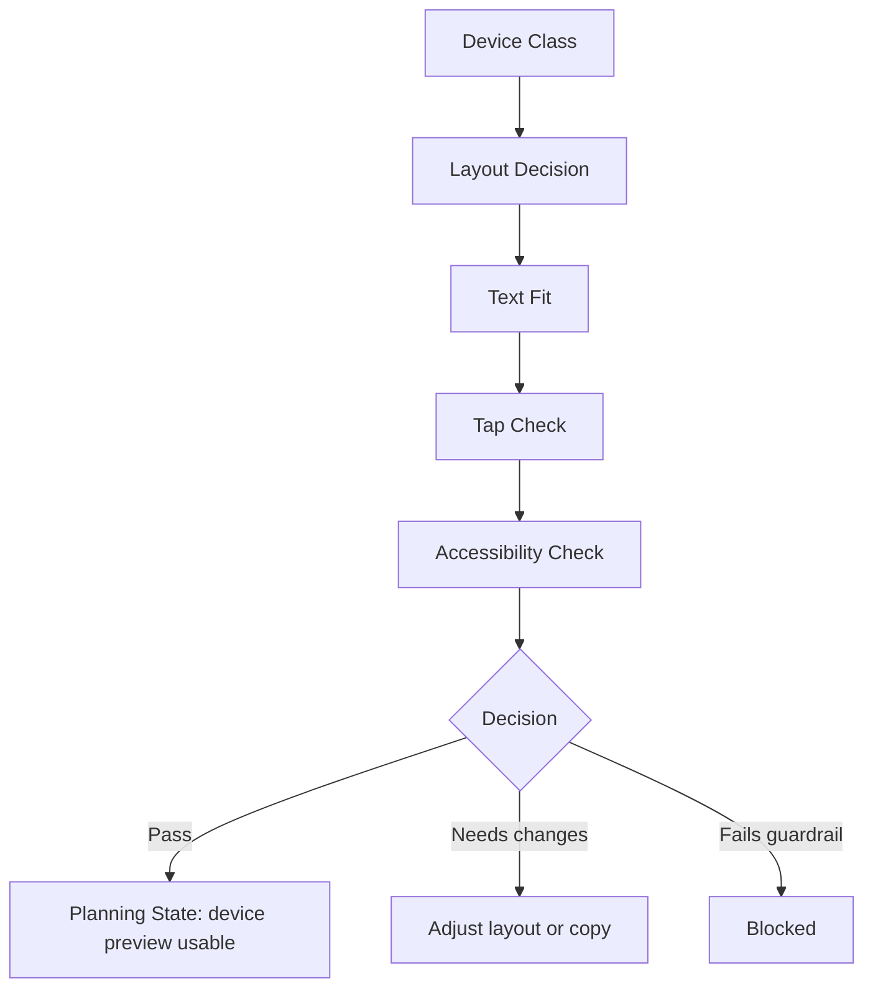

# Phase 2G-M13-N: Foundation Choice Device Preview Plan

Stand: 2026-06-06

Status: `Planung gestartet / Foundation-Choice-Device-Preview textuell definiert`

## 1. Ziel

Dieses Dokument plant eine erste Device-/Accessibility-/Text-Containment-
Preview fuer die Foundation Choice im Early Onboarding. Es zeigt, wie die drei
Foundation-Karten Zuhause/Alltag, Schule/Lernen und Garten/Natur nah auf
kleinen Phones, Standard Phones und grossen Phones plausibel funktionieren
koennen.

M13-N ist nur Device-/Preview-Planung. Es ist keine finale Onboarding-UI, keine
App-Integration, keine Implementierung, keine finale Startinsel, keine finale
Foundation-Choice-UI und keine Runtime-Konfiguration.

Es werden keine PNGs erzeugt. Visualisierung erfolgt nur als ASCII-Device-
Wireframe, ASCII-Safe-Area-/Tap-Zone-Overlay, Mermaid-Flow, Markdown-Tabelle
und Device-/Accessibility-/Text-Containment-Checkliste.

## 2. Device-Ziel

- Foundation Choice muss mobile-first funktionieren.
- Kleine Phones sind kritisch.
- Portrait ist primaerer Zielmodus.
- Karten duerfen nicht zu textlastig werden.
- Tali/Vori darf keine Karte, keinen Button und keinen Safe Exit verdecken.
- Primary Action muss klar erreichbar sein.
- "Spaeter entscheiden" muss sichtbar bleiben.
- Auswahl darf nicht nur ueber Farbe erkennbar sein.
- Keine finale UI und keine App-Freigabe entsteht aus diesem Block.

M13-N prueft die Form der Foundation-Wahl, nicht die finale Startinsel. Die
Auswahl bleibt Lernfokus, reversibel und ohne Pflicht-Hausstart.

## 3. Device-Klassen

| Device-Klasse | Kartenanordnung | Textlaenge | Buttonposition | Tali/Vori-Position | Safe-Exit-Position | Risiko | Gate vor Umsetzung |
| --- | --- | --- | --- | --- | --- | --- | --- |
| Small Phone / narrow width | drei Karten gestapelt, ggf. scrollbarer Inhalt | Titel plus 1 kurze Zeile, max. 3 Beispielwoerter | unten, aber sichtbar | oben oder kompakt zwischen Header und Cards, nie ueber Buttons | unter Karten oder neben Secondary Action | Text laeuft aus Karten, Button rutscht zu tief | echte Device-/Tap-Target-/Text-Containment-Pruefung |
| Standard Phone | drei Karten gestapelt mit mehr Padding | Titel, 1 kurze Zeile, 2 bis 3 Beispielwoerter | unten als klare Primary Action | oberhalb Karten oder als kleine Bubble | sichtbar unter Primary/Secondary | Karten koennen zu dicht wirken | Device-Preview plus Accessibility-Check |
| Large Phone | gestapelt oder 2+1 Layout nur falls ruhig | kurze Texte, kein Zusatzinhalt nur wegen Platz | unten oder sticky im Safe Area | oben rechts/links mit Exclusion Zone | sichtbar, nicht versteckt | zusaetzliche Komplexitaet wird eingefuehrt | kein neues UI-Modell ohne Review |
| Optional Tablet / later | spaeter eigenes Layout moeglich | nicht aus Phone ableiten | noch offen | noch offen | noch offen | Tablet koennte eigene UX brauchen | eigener Tablet-Review spaeter |

Planungsregel:

Small Phone entscheidet, ob die Foundation Choice grundsaetzlich tragfaehig
ist. Large Phone darf mehr Luft bieten, aber keine zusaetzliche Entscheidung,
keine vierte Karte und keine neue Roadmap-Logik einfuehren.

## 4. ASCII-Device-Wireframes

### 4.1 Small Phone Intro Mit Tali/Vori

```text
+----------------------------+
| SAFE AREA                  |
| Talvori Welt               |
|                            |
|     [ Tali/Vori ]          |
|                            |
| Waehle einen ersten        |
| Lernfokus. Du kannst       |
| spaeter wechseln.          |
|                            |
| [ Weiter ]                 |
| [ Spaeter entscheiden ]    |
+----------------------------+
```

Device-Notizen:

- Tali/Vori steht ueber Text und Buttons.
- Der Text bleibt kurz.
- Safe Exit ist sofort sichtbar.
- Kein finales UI-Look-and-Feel.

### 4.2 Small Phone Drei Karten Gestapelt

```text
+----------------------------+
| Waehle Lernfokus           |
|                            |
| +------------------------+ |
| | Zuhause / Alltag       | |
| | Dinge aus dem Alltag   | |
| | spoon, key, chair      | |
| +------------------------+ |
|                            |
| +------------------------+ |
| | Schule / Lernen        | |
| | Dinge fuers Lernen     | |
| | pencil, book, ruler    | |
| +------------------------+ |
|                            |
| +------------------------+ |
| | Garten / Natur nah     | |
| | Naturwoerter entdecken | |
| | seed, leaf, flower     | |
| +------------------------+ |
| [ Spaeter entscheiden ]    |
+----------------------------+
```

Device-Notizen:

- Stapelung ist der sichere Small-Phone-Default.
- Jede Karte ist eine eigene grosse Tap-Zone.
- Beispielwoerter sind begrenzt.

### 4.3 Small Phone Auswahl + Confirm + Safe Exit

```text
+----------------------------+
| Dein Lernfokus             |
|                            |
| +------------------------+ |
| | Garten / Natur nah     | |
| | AUSGEWAEHLT            | |
| | seed, leaf, flower     | |
| +------------------------+ |
|                            |
| Du kannst spaeter         |
| wechseln.                 |
|                            |
| [ Bestaetigen ]           |
| [ Auswahl aendern ]       |
| [ Spaeter entscheiden ]   |
+----------------------------+
```

Device-Notizen:

- Auswahl ist nicht nur Farbe, sondern Textstatus.
- Primary Action bleibt sichtbar.
- Safe Exit bleibt erreichbar.

### 4.4 Standard Phone Karten Mit Etwas Mehr Raum

```text
+--------------------------------+
| Waehle deinen Lernfokus        |
| [Tali/Vori kurz]               |
|                                |
| +----------------------------+ |
| | Zuhause / Alltag           | |
| | Vertraute Alltagswoerter   | |
| | spoon, key, chair          | |
| +----------------------------+ |
| +----------------------------+ |
| | Schule / Lernen            | |
| | Freundlich lernen          | |
| | pencil, book, ruler        | |
| +----------------------------+ |
| +----------------------------+ |
| | Garten / Natur nah         | |
| | Natur und Pflege           | |
| | seed, leaf, flower         | |
| +----------------------------+ |
| [ Weiter ]  [ Spaeter ]        |
+--------------------------------+
```

Device-Notizen:

- Mehr Padding ist erlaubt, aber keine langen Texte.
- Tali/Vori bleibt kurz und oberhalb der Karten.
- Buttons sind in einer klaren Zone.

### 4.5 Large Phone Layout Mit Mehr Luft

```text
+------------------------------------+
| Talvori Welt                       |
| Waehle einen ersten Lernfokus      |
|                                    |
| +---------------+ +---------------+|
| | Zuhause       | | Schule        ||
| | Alltag        | | Lernen        ||
| | spoon, key    | | pencil, book  ||
| +---------------+ +---------------+|
|                                    |
| +-------------------------------+  |
| | Garten / Natur nah            |  |
| | seed, leaf, flower            |  |
| +-------------------------------+  |
|                                    |
| [ Bestaetigen ] [ Spaeter ]        |
+------------------------------------+
```

Device-Notizen:

- Mehr Luft darf nicht zu mehr Optionen fuehren.
- 2+1 Layout ist nur Planungsoption und braucht Review.
- Small-Phone-Stapel bleibt sicherer Default.

### 4.6 Blockierter Fall

```text
+----------------------------+
| Waehle deinen ersten       |
| wunderbaren persoenlichen  |
| Lern-, Welt- und Baupfad   |
| fuer alle spaeteren...     |
| +------------------------+ |
| | Zuhause als Startort   | |
| | Du beginnst hier mit   | |
| | Haus und Alltag und... | |
| +------------------------+ |
|        [ Tali/Vori ]       |
| [Bestaetigen][Spaeter][X]  |
+----------------------------+
```

Blockiert, weil:

- Text laeuft konzeptionell zu lang.
- Zuhause wirkt wie Pflicht-Hausstart.
- Tali/Vori verdeckt Interaktion.
- Buttons sind zu klein und zu dicht.
- Safe Exit ist nicht ruhig erkennbar.

## 5. Tap-Zone-/Safe-Area-Overlays

### 5.1 Gute Tap-Zone-/Safe-Area-Planung

```text
+--------------------------------+
| SAFE AREA                      |
| +----------------------------+ |
| | TALI/VORI EXCLUSION ZONE   | |
| +----------------------------+ |
|                                |
| +----------------------------+ |
| | CARD TAP ZONE 1            | |
| | Zuhause / Alltag           | |
| +----------------------------+ |
| +----------------------------+ |
| | CARD TAP ZONE 2            | |
| | Schule / Lernen            | |
| +----------------------------+ |
| +----------------------------+ |
| | CARD TAP ZONE 3            | |
| | Garten / Natur nah         | |
| +----------------------------+ |
| PRIMARY BUTTON ZONE            |
| SECONDARY / SAFE EXIT ZONE     |
+--------------------------------+
```

QA-Notizen:

- Jede Karte hat eigene Tap-Zone.
- Tali/Vori ist in einer Exclusion Zone.
- Primary und Secondary sind getrennt.
- Safe Exit ist Teil der Bedienlogik, nicht versteckt.

### 5.2 Blockierte Tap-Zone-/Safe-Area-Planung

```text
+--------------------------------+
| SAFE AREA                      |
| Tali/Vori bubble overlaps      |
| +----------------------------+ |
| | Card 1 text text text text | |
| | Card 2 starts too close    | |
| | Card 3 hidden / cut off    | |
| +----------------------------+ |
| [Confirm][Later][Change]       |
| OVERFLOW / BLOCKED ZONE        |
+--------------------------------+
```

Blockiert, weil:

- Karten sind nicht klar getrennt.
- Tali/Vori ueberlappt Text oder Karte.
- Card 3 ist abgeschnitten.
- Buttons sind zu dicht.
- Overflow wird nicht geloest.

## 6. Foundation-Karten Device-Regeln

### 6.1 Zuhause / Alltag

Regeln:

- Titel kurz: `Zuhause / Alltag`.
- Untertext kurz: eine Zeile, z. B. "Dinge aus dem Alltag".
- Beispielwoerter begrenzen: maximal 3 sichtbar.
- Keine Formulierung wie "Dein Zuhause beginnt hier".
- Keine automatische Hausbaupflicht.

Schutz gegen Pflicht-Hausstart:

Die Karte muss als Lernfokus erscheinen. Sie darf nicht suggerieren, dass der
Nutzer mit einem Haus, Wohnort oder Bauzustand starten muss.

### 6.2 Schule / Lernen

Regeln:

- Titel kurz: `Schule / Lernen`.
- Untertext freundlich: nicht "Pflicht", nicht "Test", nicht "Arbeitsblatt".
- Beispielwoerter begrenzen: `pencil`, `book`, `ruler` reichen.
- Keine langen Lernpflichttexte.

Schutz gegen Pflichtschule-Eindruck:

Die Karte soll wie ein spielerischer Lernfokus wirken, nicht wie schulische
Kontrolle oder Strafmodus.

### 6.3 Garten / Natur Nah

Regeln:

- Titel kurz: `Garten / Natur nah`.
- Untertext attraktiv, aber neutral: "Naturwoerter entdecken".
- Beispielwoerter begrenzen: `seed`, `leaf`, `flower`.
- Kein Timer-, Growth-, Pflege- oder Verfallsversprechen.

Schutz gegen Growth-/Retention-Druck:

Die Karte darf Natur und Pflege andeuten, aber keine Wartezeit, Streak,
Pflanzenleid oder Belohnungsdruck versprechen.

## 7. Accessibility-/Text-Containment-Regeln

Zu pruefen:

- kurze Labels,
- keine abgeschnittenen Texte,
- kein Text ausserhalb von Karte, Rahmen oder Panel,
- keine rein farbcodierte Auswahl,
- Icons und Text gemeinsam denken,
- reduzierte Bewegung moeglich halten,
- kein Audio-only-Onboarding,
- ausreichender Abstand zwischen Buttons,
- Primary und Secondary Action klar trennen,
- "spaeter entscheiden" erreichbar halten,
- keine Premium-/Paywall-Erwaehnung.

Planungsregel:

Eine Foundation Choice darf erst produktnah weitergehen, wenn die Small-Phone-
Version lesbar, tappbar und ohne visuelle Ueberladung wirkt.

## 8. Textuelle Visualisierungen

### 8.1 Device-Preview-Flow



### 8.2 Device Class / Layout / Risk / Required Check / Decision

| Device Class | Layout | Risk | Required Check | Decision |
| --- | --- | --- | --- | --- |
| Small Phone | gestapelte Karten | Text, Buttons, Safe Exit koennen zu eng werden | Text-Containment, Tap-Zonen, Tali/Vori Exclusion | kritisch fuer Freigabe |
| Standard Phone | gestapelte Karten mit mehr Padding | zu viele Details wegen mehr Raum | kurze Texte, Button-Abstand | planbar |
| Large Phone | mehr Luft, optional 2+1 | Zusatzkomplexitaet | keine neuen Optionen, keine Roadmap-Erweiterung | nur nach Review |
| Tablet / later | offen | eigenes Layout noetig | eigener Preview-Block | spaeter |

### 8.3 UI Element / Small Phone Rule / Blocker

| UI Element | Small Phone Rule | Blocker |
| --- | --- | --- |
| Header | 1 kurze Zeile | langer Marken-/Featuretext |
| Tali/Vori | kleine Erklaerzone, keine Ueberdeckung | verdeckt Karte oder Button |
| Karte | Titel, 1 Untertext, max. 3 Woerter | Text laeuft aus Karte |
| Card Tap Zone | ganze Karte tappbar denken | winzige innere Buttons |
| Primary Button | klar, gross, sichtbar | zu tief oder zu klein |
| Safe Exit | sichtbar, nicht dominant | versteckt oder abgeschnitten |
| Auswahlstatus | Text/Icon plus ggf. Farbe | nur Farbe |
| Beispielwoerter | wenige, vertraut | lange Wortlisten |

### 8.4 Good / Blocked Fuer Foundation Choice Device UX

| Good | Blocked |
| --- | --- |
| Small Phone mit drei kurzen Karten. | Karten passen nicht auf small phone. |
| Tali/Vori erklaert kurz und verdeckt nichts. | Tali/Vori liegt ueber Button oder Karte. |
| Auswahl ist per Text/Icon erkennbar. | Auswahl ist nur farbcodiert. |
| Safe Exit bleibt sichtbar. | "Spaeter entscheiden" ist versteckt. |
| Zuhause ist Option, kein Pflichtstart. | Zuhause wirkt wie Startzwang. |
| Schule wirkt freundlich. | Schule wirkt wie Pflichtschule. |
| Garten bleibt ohne Timer-Versprechen. | Garten suggeriert Growth-/Retention-Druck. |
| Device-Plan bleibt Review-Material. | Device-Plan wirkt wie finale UI-Freigabe. |

## 9. Risiken Und Harte Blocker

Harte Blocker:

- Karten passen nicht auf small phone.
- Texte laufen aus Karten, Rahmen oder Panels.
- Safe Exit ist nicht sichtbar.
- Primary Button ist zu klein oder zu tief.
- Tali/Vori verdeckt Karte oder Button.
- Auswahl ist nur farbcodiert.
- Zuhause wirkt wie Pflicht-Hausstart.
- Schule wirkt wie Pflichtschule.
- Garten suggeriert Timer-/Growth-/Retention-Druck.
- Premium-/Paywall-Hinweis erscheint.
- Device-Plan wirkt wie finale UI-Freigabe.
- Der Flow erzeugt eine finale Datenstruktur oder Runtime-Konfiguration.

## 10. Stop-Regeln

- Keine finale Foundation-Choice-UI aus M13-N.
- Keine finale Onboarding-UI aus M13-N.
- Keine finale Startinsel aus M13-N.
- Keine App-Integration aus M13-N.
- Keine Codefreigabe aus M13-N.
- Keine Assetfreigabe aus M13-N.
- Keine finale Datenstruktur aus M13-N.
- Keine Runtime-Konfiguration aus M13-N.
- Keine PNG-Erzeugung aus M13-N.
- Keine Tests aus M13-N.
- Kein `frame_started` oder Bauzustand aus M13-N.
- Keine Foundation Choice als Pflicht-Hausstart.
- Keine Premium-/Paywall-Logik im Start-Onboarding.
- Keine Timer-/Growth-Versprechen in der Garten-Karte.

## 11. Naechster Erlaubter Schritt

Erlaubt bleibt nur:

- M13-N dokumentarisch reviewen,
- M13-N nachbessern,
- M13-O ThemeIsland Roadmap Scope Freeze Review als reinen Review-Block
  starten,
- oder weitere Preview-/Review-Planung ohne Code, Assets oder PNGs.

Nicht erlaubt:

- Code,
- Tests,
- PNGs,
- Assets,
- finale Onboarding-UI,
- finale Foundation-Choice-UI,
- finale Startinsel,
- finale Datenstruktur,
- Runtime-Konfiguration,
- App-Integration,
- `frame_started`.
