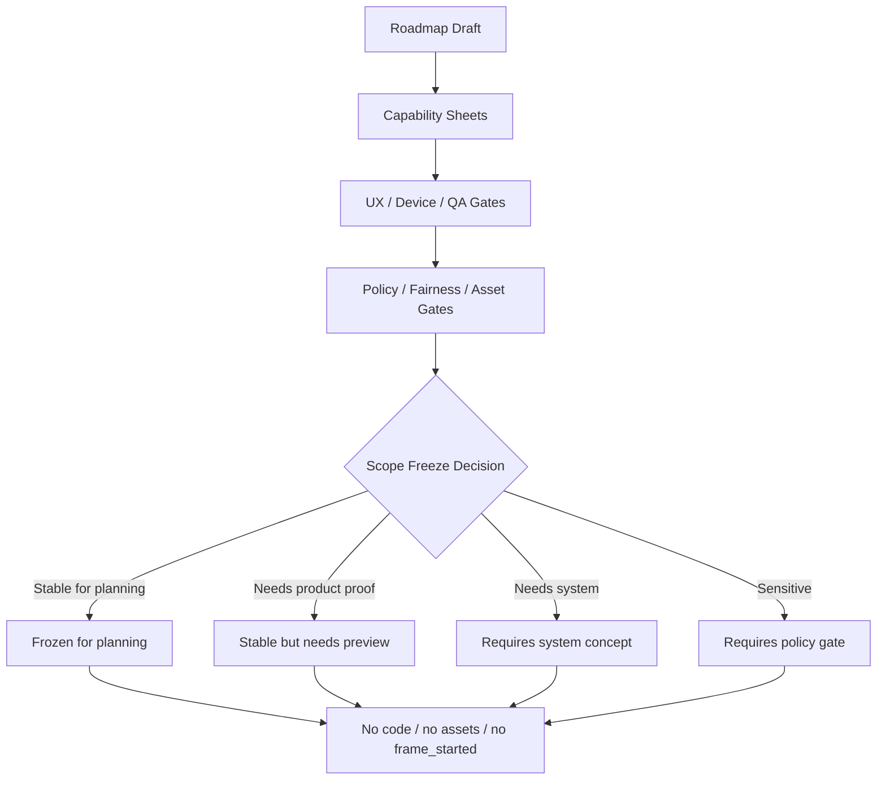

# Phase 2G-M13-O: ThemeIsland Roadmap Scope Freeze Review

Stand: 2026-06-06

Status: `Review gestartet / nicht-finaler Scope-Freeze geprueft`

## 1. Ziel

Dieses Dokument prueft, ob die bisherige ThemeIsland-Roadmap als nicht-finale,
aber stabile Planungsgrundlage eingefroren werden kann. Es klaert, welche
Teile der Roadmap fuer weitere Planung stabil genug sind und welche weiterhin
blockiert, offen oder nur als Hypothese gelten.

M13-O ist nur Review- und Scope-Freeze-Planung. Es ist keine finale
ThemeIsland-Roadmap, keine Umsetzung, keine Assetfreigabe, keine
App-Integration und keine Implementierungsfreigabe.

Ein Scope Freeze bedeutet hier nur: Die aktuelle Wellenlogik darf als
Planungsrahmen verwendet werden. Er bedeutet nicht: Code, Assets, Startinsel,
UI, Datenstruktur, Runtime-Konfiguration oder `frame_started` sind freigegeben.

## 2. Scope-Freeze-Level

| Freeze-Level | Bedeutung | Freigabegrenze |
| --- | --- | --- |
| `frozen-for-planning` | Als Planungsrahmen stabil genug. | Keine Codefreigabe, keine Assetfreigabe, keine finale Roadmap. |
| `stable-but-needs-preview` | Richtung ist plausibel, braucht aber produktnahe Preview oder Device-Pruefung. | Keine Umsetzung ohne Preview-/Review-Gate. |
| `candidate-only` | Als Kandidat brauchbar, aber noch nicht stabil genug fuer Detailplanung. | Nur weitere Research-/Previewplanung. |
| `requires-system-concept` | Thema braucht eigenes Systemkonzept vor weiterer Produktplanung. | Keine Insel- oder Featureplanung ohne System-Gate. |
| `requires-policy-gate` | Thema braucht Sensitive-/Safety-/Policy-/UX-Regeln. | Keine Visualisierung oder Inselplanung ohne Policy-Gate. |
| `blocked-for-implementation` | Fuer Umsetzung ausdruecklich blockiert. | Keine Code-, Asset-, UI- oder Runtime-Ableitung. |

## 3. Roadmap-Wellen Pruefung

### 3.1 Foundation / Starter Learning World

Kandidaten:

- Zuhause / Alltag,
- Schule / Lernen,
- Garten / Natur nah.

Als Planungsrichtung stabil:

- Die drei Kandidaten bleiben die sinnvollsten Foundation-Optionen.
- Sie decken vertraute Alltagswoerter, Lernmaterial und naturnahe Woerter ab.
- Die Container-/Depth-Beispiele sind einfach genug fuer weitere Preview-
  Planung.
- Hybrid-Onboarding und Device-Preview bestaetigen: Die Wahl bleibt
  Lernfokus, keine finale Startinsel.

Offen:

- echte Product-Preview,
- echte Device-/Accessibility-Pruefung,
- finale Copy fuer Karten,
- echte Tap-Target-Pruefung,
- keine finale Startinselentscheidung.

Fehlende Gates:

- M14-A Foundation Choice Product Preview Plan,
- Device-/Accessibility-/Tap-Target-Review,
- keine Pflicht-Hausstart-Pruefung,
- Growth-/Timer-Fairness fuer Garten,
- Mobile-/Clutter-Regeln fuer Schule/Kleinteile.

Nicht umsetzen:

- keine Foundation-Insel,
- keine finale Startinsel,
- keine finale Onboarding-UI,
- keine Assets,
- kein `frame_started`.

Erlaubter naechster Schritt:

- M13-O reviewen oder M14-A als reinen Product-Preview-Plan starten.

### 3.2 Expansion Wave 1

Kandidaten:

- Essen / Restaurant / Cafe,
- Einkauf / Versorgung,
- Land / Farm.

Als Planungsrichtung stabil:

- Diese Welle ist eine plausible zweite Ebene nach Foundation.
- Die Themen haben hohe Wortschatzbreite und Motivation.
- Sie bleiben nahe genug an Alltag und Container-/Depth-Logik.

Offen:

- Food-/Service-/Market-UX,
- Farm-/Growth-/Timer-Fairness,
- Clutter-Regeln fuer Regale, Produkte, Tiere und Werkzeuge,
- keine Assetpriorisierung.

Fehlende Gates:

- Product-Preview fuer Food/Einkauf/Farm,
- Growth-/Timer-Fairness fuer Farm,
- Mobile-/Clutter- und Container-QA,
- Asset-Scope-Gate je Thema.

Nicht umsetzen:

- keine Shop- oder Restaurantinsel,
- keine Farmmechanik,
- keine Produktionsloops,
- keine Produkt-/Regal-Assetproduktion.

Erlaubter naechster Schritt:

- als `candidate-only` oder `stable-but-needs-preview` weiter visualisieren.

### 3.3 Expansion Wave 2

Kandidaten:

- Kueste / Meer / Hafen,
- Natur / Berge / Outdoor,
- Freizeit / Sport.

Als Planungsrichtung stabil:

- Die Welle ist thematisch attraktiv und fuer spaetere Motivation stark.
- Hafen/Bootskiste, Outdoor-Ausrustung und Sporttasche sind plausible
  Container-Ansatzpunkte.

Offen:

- Water-/Dock-/Mobile-Komplexitaet,
- Action-/Sequence-Regeln,
- Outdoor- und Sportbewegungen,
- Path-/Navigation-Pruefung.

Fehlende Gates:

- Water-/Dock-Konzept,
- Action-/Sequence-Preview,
- Device-/Accessibility-Preview,
- Container-QA fuer komplexe Hintergruende.

Nicht umsetzen:

- keine Kuesten-/Hafeninsel,
- keine Sport-/Outdoor-Mechanik,
- keine Water-/Dock-Systeme,
- keine Assets.

Erlaubter naechster Schritt:

- als `candidate-only` belassen oder spaeter eigene Mobile-Komplexitaets-
  Preview planen.

### 3.4 System-Heavy Wave

Kandidaten:

- Stadt / Dorfzentrum,
- Reisen / Verkehr,
- Arbeit / Werkstatt,
- Technik / Digital.

Als Planungsrichtung stabil:

- Die Themen gehoeren spaeter und duerfen nicht in Foundation gedrueckt
  werden.
- Sie sind wertvoll, aber systemisch schwer.

Offen:

- Connector-/Path-System,
- Vehicle- und Travel-Konzept,
- Prozess-/Werkstattlogik,
- Digital-Object-/UI-Abgrenzung.

Fehlende Gates:

- Systemkonzept je Thema,
- Path-/Vehicle-/Digital-Review,
- Mobile-/Clutter-Pruefung,
- eigene Product-Preview.

Nicht umsetzen:

- keine Stadt-/Verkehr-/Technikinsel,
- keine Fahrzeuge,
- keine Strassenlogik,
- keine Digital-UI-Implementierung.

Erlaubter naechster Schritt:

- erst nach eigenem Systemkonzept weiter planen.

### 3.5 Sensitive / Special Wave

Kandidaten:

- Gesundheit,
- Kultur / Gesellschaft / Verwaltung,
- Religion,
- Politik,
- Gericht,
- Polizei,
- Krankenhaus.

Als Planungsrichtung stabil:

- Diese Themen bleiben sichtbar getrennt und gated.
- Sie duerfen nicht als fruehe Inseln, Symbole, Gebaeude oder Assets
  behandelt werden.

Offen:

- vertiefte Policy- und Safety-Regeln je Thema,
- Privacy,
- User-Control,
- neutrale Representation,
- Tali/Vori-Verhalten.

Fehlende Gates:

- Sensitive-Content-/Policy-Gate,
- UX-/Safety-Review,
- Privacy-Freigabe,
- neutrale Codex-/ContextCard-Preview.

Nicht umsetzen:

- keine Krankenhaus-, Polizei-, Gericht-, Politik- oder Religionsinsel,
- keine Institutionen-Assets,
- keine pauschale Symbolik,
- keine automatische Visualisierung.

Erlaubter naechster Schritt:

- nur Policy-/Safety-/UX-Review, keine Produktumsetzung.

## 4. Foundation-Kandidaten Bewertung

| Kandidat | Freeze-Level | Stabil? | Hauptrisiko | Weitere Gates | Jetzt nicht erlaubt |
| --- | --- | --- | --- | --- | --- |
| Zuhause / Alltag | `stable-but-needs-preview` | Ja, als Lernfokus-Kandidat | Pflicht-Hausstart, Hausbau-Anmutung, Gebaeudeteile ohne Blueprint | Product Preview, Device-/Tap-Target-Review, Copy-Review | finale Startinsel, Hausbaupflicht, Gebaeudezustand, Assets |
| Schule / Lernen | `stable-but-needs-preview` | Ja, als Lernfokus-Kandidat | Pflichtschule, Kleinteile, Label-/Tap-Clutter | Product Preview, Mobile-/Clutter-Review, Container-QA | finale Schulinsel, Kleinteile-Implementierung, Assetproduktion |
| Garten / Natur nah | `stable-but-needs-preview` | Ja, als Lernfokus-Kandidat | Growth-/Timer-/Retention-Erwartung | Product Preview, Fairness-/Timer-Gate, Device-Review | Growth-Mechanik, Timer, Streak-Druck, finale Startinsel |

Bewertung:

Die Foundation-Kandidaten koennen fuer weitere Planung eingefroren werden,
aber noch nicht als finale Startinsel oder finale UI. `frozen-for-planning`
gilt nur fuer die Dreiergruppe als Planungsrahmen. Die einzelnen Kandidaten
bleiben `stable-but-needs-preview`, weil echte Product-/Device-Previews noch
ausstehen.

## 5. Expansion-/System-/Sensitive-Matrix

| ThemeIsland | Wave | Freeze-Level | Hauptgrund | Hauptgate | Blocker | Erlaubter naechster Schritt |
| --- | --- | --- | --- | --- | --- | --- |
| Essen / Restaurant / Cafe | Expansion 1 | `stable-but-needs-preview` | alltagsnah, wortstark | Food-/Service-UX | Objektlisten, Service-Komplexitaet | Product-Preview-Plan |
| Einkauf / Versorgung | Expansion 1 | `candidate-only` | gute Woerter, aber viele Produkte | Market-/Clutter-Gate | Regal-/Produktflut, Kaufdruck-Metapher | Research/Preview |
| Land / Farm | Expansion 1 | `candidate-only` | stark, aber Growth-nah | Fairness-/Timer-Gate | Produktionsdruck, Tiere, Timer | Growth/Farm-Review |
| Kueste / Meer / Hafen | Expansion 2 | `candidate-only` | attraktiv, aber mobil komplex | Water-/Dock-/Mobile-Gate | Hafen-Dichte, Navigation | Mobile-Komplexitaets-Preview |
| Natur / Berge / Outdoor | Expansion 2 | `candidate-only` | gute Entdeckung | Action-/Outdoor-Gate | Ausruestung, Wege, Wetter | Outdoor-Preview |
| Freizeit / Sport | Expansion 2 | `candidate-only` | motivierend | Action-/Sequence-Gate | Bewegungen, Regeln, Clutter | Sport-UX-Research |
| Stadt / Dorfzentrum | System-Heavy | `requires-system-concept` | Hub-potenzial, aber Infrastruktur | Connector-/Path-Konzept | Wege, Verkehr, Dichte | Systemkonzept |
| Reisen / Verkehr | System-Heavy | `requires-system-concept` | starke Wortfelder | Vehicle-/Path-Konzept | Fahrzeuge, Navigation | Systemkonzept |
| Arbeit / Werkstatt | System-Heavy | `requires-system-concept` | Berufe und Tools | Process-/Workshop-Konzept | Maschinen, Rollen, Prozesse | Systemkonzept |
| Technik / Digital | System-Heavy | `requires-system-concept` | moderne Woerter | Digital-Object-/UI-Gate | UI-in-UI, Server/App-Abgrenzung | Digital-Konzept |
| Gesundheit | Sensitive/Special | `requires-policy-gate` | relevant, aber sensibel | M13-G/Safety-Review | Beratung, Krankheit, Medizin | Policy-/UX-Review |
| Kultur / Gesellschaft / Verwaltung | Sensitive/Special | `requires-policy-gate` | abstrakt/gesellschaftlich | Policy-/Representation-Gate | Institutionen, Identitaet | Policy-/UX-Review |
| Religion | Sensitive/Special | `blocked-for-implementation` | symbolisch sensibel | Religion-/Policy-Gate | pauschale Symbolik | Policy-only |
| Politik | Sensitive/Special | `blocked-for-implementation` | politisch sensibel | Politics-/Neutrality-Gate | Meinung, Partei, Manipulation | Policy-only |
| Gericht | Sensitive/Special | `blocked-for-implementation` | juristisch sensibel | Legal-/Representation-Gate | Beratung, Strafe | Policy-only |
| Polizei | Sensitive/Special | `blocked-for-implementation` | Institution/Safety | Safety-/Representation-Gate | automatische Station/Symbolik | Policy-only |
| Krankenhaus | Sensitive/Special | `blocked-for-implementation` | medizinisch sensibel | Medical-/Safety-Gate | Beratung, Krankheit, Notfall | Policy-only |

## 6. Textuelle Visualisierungen

### 6.1 Scope-Freeze-Flow



### 6.2 ThemeIsland / Wave / Freeze-Level / Gate

| ThemeIsland | Wave | Freeze-Level | Main Gate | Blocker | Next Allowed Step |
| --- | --- | --- | --- | --- | --- |
| Foundation-Gruppe | Foundation | `frozen-for-planning` | M14-A Product Preview | finale Startinsel | Product Preview Plan |
| Zuhause / Alltag | Foundation | `stable-but-needs-preview` | Device/Copy/Tap | Pflicht-Hausstart | Product Preview |
| Schule / Lernen | Foundation | `stable-but-needs-preview` | Clutter/Device | Pflichtschule/Kleinteile | Container/Device Review |
| Garten / Natur nah | Foundation | `stable-but-needs-preview` | Fairness/Device | Timer/Growth-Druck | Fairness Product Preview |
| Expansion Wave 1 | Expansion 1 | `candidate-only` | Food/Market/Farm Previews | Asset-/Objektflut | einzelne Previewplaene |
| Expansion Wave 2 | Expansion 2 | `candidate-only` | Water/Action/Mobile | System- und Mobile-Komplexitaet | spaetere Komplexitaetsreviews |
| System-Heavy | System | `requires-system-concept` | Path/Vehicle/Digital/Process | zu viele neue Systeme | Systemkonzept |
| Sensitive/Special | Special | `requires-policy-gate` | Policy/Safety/Privacy | sensible Visualisierung | Policy-only |

### 6.3 Warum Scope Freeze Keine Umsetzung Bedeutet

```text
Roadmap-Wellen stabil genug?
  |
  +-- Ja, fuer Planung
  |
  v
Gibt es finale UI, Datenstruktur, Runtime oder Assets?
  |
  +-- Nein
  |
  v
Gibt es explizite Implementierungsfreigabe?
  |
  +-- Nein
  |
  v
Scope Freeze = Planungsstabilitaet
Code / Assets / frame_started = weiterhin blockiert
```

### 6.4 Good / Blocked Fuer Roadmap Scope Freeze

| Good | Blocked |
| --- | --- |
| Wellen als Planungsrahmen einfrieren. | Wellen als finale Roadmap lesen. |
| Foundation-Gruppe als Kandidatenraum sichern. | Foundation als finale Startinsel lesen. |
| Risiken und Gates sichtbar halten. | Gates durch Freeze ueberspringen. |
| Expansion als spaetere Kandidaten behalten. | Expansion als Assetauftrag lesen. |
| System-Heavy an Systemkonzepte binden. | Stadt/Verkehr/Technik frueh bauen. |
| Sensitive/Special an Policy-Gates binden. | sensible Inseln oder Symbole ableiten. |
| `frame_started` weiter blockieren. | Rohbau aus alter Bauplanung ableiten. |

### 6.5 Darf Diese ThemeIsland Jetzt Umgesetzt Werden?

```text
Ist die Insel Foundation?
  |
  +-- Ja -> Product Preview + Device + Accessibility + Tap Gate fehlen
  |
  +-- Nein -> Expansion/System/Sensitive-Gates fehlen
  |
  v
Gibt es finale Roadmap + Implementierungsauftrag + Asset Gate?
  |
  +-- Nein -> keine Umsetzung
```

## 7. Entscheidungsempfehlung

Empfehlung: Roadmap als nicht-finale Planungsgrundlage einfrieren.

Konkret:

- Die Wellenstruktur wird als Planungsrahmen `frozen-for-planning`.
- Die drei Foundation-Kandidaten werden als `stable-but-needs-preview`
  eingestuft.
- Expansion Wave 1 bleibt `candidate-only` bis `stable-but-needs-preview` je
  Thema.
- Expansion Wave 2 bleibt `candidate-only`.
- System-Heavy bleibt `requires-system-concept`.
- Sensitive/Special bleibt `requires-policy-gate` oder
  `blocked-for-implementation`.

Nicht freigegeben:

- keine Codefreigabe,
- keine Assetfreigabe,
- keine finale ThemeIsland-Roadmap,
- keine finale Startinsel,
- keine App-Integration,
- keine Runtime-Konfiguration,
- kein `frame_started`.

## 8. Risiken Und Luecken

- Roadmap-Freeze wird faelschlich als finale Roadmap gelesen.
- Foundation-Kandidaten werden faelschlich als finale Startinseln gelesen.
- Zuhause wird Pflicht-Hausstart.
- Garten erzeugt Growth-/Timer-Erwartung.
- Schule wirkt zu schulisch oder zu kleinteilig.
- Expansion-Waves werden zu frueh als Asset-Auftraege gelesen.
- System-Heavy-Waves erzwingen zu viele neue Systeme.
- Sensitive/Special-Waves erzeugen Policy-/Safety-Risiko.
- `frame_started` wird aus alter Bauplanung abgeleitet, obwohl es weiter
  blockiert bleibt.

## 9. Naechste Moegliche Folgebloecke

- M13-P Implementation Candidate Gate, aber nur als Review-/Gate-Dokument.
- M14-A Foundation Choice Product Preview Plan.
- M14-B Word-to-Island Product Preview Plan.
- M14-C Container QA Product Preview Plan.
- M14-D ThemeIsland Roadmap Visual Refresh, nur falls noetig.
- M14-E Implementation Slice Candidate Review, nur falls alle Gates erfuellt
  sind.

Nicht direkt zu Code springen.

## 10. Stop-Regeln

- Keine finale ThemeIsland-Roadmap aus M13-O.
- Keine ThemeIsland-Umsetzung aus M13-O.
- Keine finale Startinsel aus M13-O.
- Keine finale Onboarding-UI aus M13-O.
- Keine finale Foundation-Choice-UI aus M13-O.
- Keine finale Datenstruktur aus M13-O.
- Keine Runtime-Konfiguration aus M13-O.
- Keine App-Integration aus M13-O.
- Keine Codefreigabe aus M13-O.
- Keine Assetfreigabe aus M13-O.
- Keine PNG-Erzeugung aus M13-O.
- Keine Tests aus M13-O.
- Kein `frame_started` oder Bauzustand aus M13-O.
- Kein Expansion-, System-Heavy- oder Sensitive-Thema ohne eigenes Gate.
- Kein Foundation-Start ohne Product-/Device-/Accessibility-Review.

## 11. Review-Fazit

M13-O kann die Roadmap als nicht-finale Planungsgrundlage einfrieren. Das ist
nuetzlich, weil weitere Preview- und Review-Bloecke auf stabile Wellen
verweisen koennen. Gleichzeitig bleibt die wichtigste Grenze bestehen: Kein
Teil dieses Freeze ist eine Umsetzung, Assetfreigabe, finale Roadmap,
Startinselentscheidung oder `frame_started`-Freigabe.
