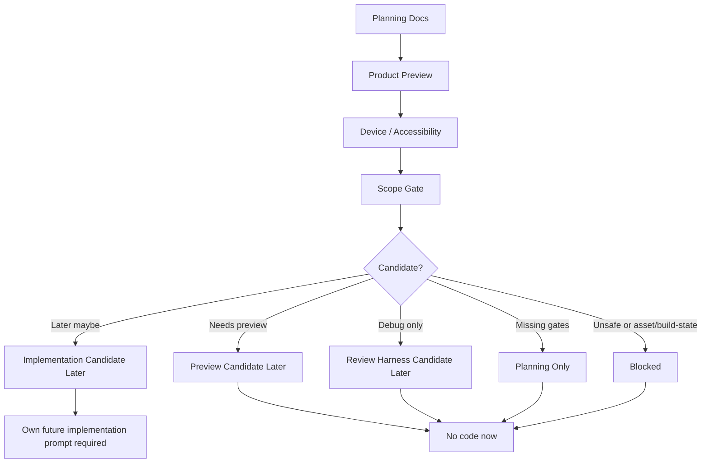

# Phase 2G-M13-P: Implementation Candidate Gate

Stand: 2026-06-06

Status: `Gate gestartet / keine Implementierungsfreigabe`

## 1. Ziel

Dieses Dokument prueft, ob aus der bisherigen M13-Kette irgendwann ein kleiner,
sicherer Implementierungs-Kandidat abgeleitet werden koennte. Es gibt
ausdruecklich keine Implementierung frei. Stattdessen zeigt es, welche Gates
noch fehlen und welche Minimal-Slices spaeter theoretisch geprueft werden
koennten.

M13-P ist nur ein Gate-/Readiness-Dokument. Es ist kein Implementierungsauftrag,
keine Codefreigabe, keine Assetfreigabe und keine Runtime-Konfiguration.

## 2. Readiness-Level

| Readiness-Level | Bedeutung | Freigabegrenze |
| --- | --- | --- |
| `not-a-candidate` | Der Bereich taugt aktuell nicht als Implementierungsrichtung. | Keine weitere technische Planung. |
| `planning-only` | Nur Dokumentation, Review oder Scope-Klaerung sinnvoll. | Keine Product Preview, kein Code. |
| `preview-candidate-later` | Spaeter als Product-/UX-Preview denkbar. | Erst Preview-Plan, keine App-Integration. |
| `review-harness-candidate-later` | Spaeter als Debug-/Review-Harness denkbar. | Erst Harness-Plan, keine Nutzer-UI. |
| `implementation-candidate-later` | Sehr kleiner spaeterer Implementierungskandidat denkbar. | Keine aktuelle Codefreigabe; eigener Implementierungs-Prompt Pflicht. |
| `blocked` | Ausdruecklich blockiert. | Keine Code-, Asset-, UI-, Runtime- oder Bauzustandsableitung. |

Auch `implementation-candidate-later` bedeutet keine aktuelle Codefreigabe.

## 3. Implementierungsbereiche

### 3.1 Foundation Choice Product Preview

Spaeterer Kandidat denkbar:

- Ja, aber nur als Product Preview und erst nach M14-A.

Fehlende Gates:

- echte Product-Preview,
- Device-/Accessibility-/Tap-Target-Review,
- Copy-Review gegen Pflicht-Hausstart,
- klares Nicht-final-UI-Gate.

Vermutlich betroffene Dateien/Module spaeter, noch nicht aendern:

- Home-/Onboarding-UI-Schichten,
- Companion-Hinweis-Komponenten,
- Navigation/Entry-Flow,
- ggf. lokaler Planning-State-Speicher nur nach eigenem Daten-Gate.

Jetzt nicht erlaubt:

- keine finale Onboarding-UI,
- keine finale Foundation-Choice-UI,
- keine Startinsel,
- keine App-Integration.

Empfehlung: `preview-candidate-later`.

### 3.2 Word-to-Island Planning State UX

Spaeterer Kandidat denkbar:

- Ja, aber zuerst als Product Preview fuer Vorschlagskarte, Sense-Auswahl,
  Codex/Blueprint/Backlog und Nutzerentscheidung.

Fehlende Gates:

- M14-B Product Preview,
- keine technische Routing-Datenstruktur,
- Sense-/Kontext-UX,
- Safety-Fallbacks,
- keine automatische Wortplatzierung.

Vermutlich betroffene Dateien/Module spaeter, noch nicht aendern:

- Word detail / import / learning result entry points,
- Companion explanation surface,
- Codex/Blueprint/Backlog UX,
- Routing domain erst nach eigenem Datenstruktur-Gate.

Jetzt nicht erlaubt:

- keine Word-to-Island-Implementierung,
- keine Routing-Datenstruktur,
- keine automatische Wortplatzierung,
- keine Runtime-Konfiguration.

Empfehlung: `preview-candidate-later`.

### 3.3 Container QA/Product Preview

Spaeterer Kandidat denkbar:

- Ja, zuerst als QA/Product Preview, nicht als Container-Implementierung.

Fehlende Gates:

- M14-C Container QA Product Preview Plan,
- echte Device-/Tap-Target-Pruefung,
- Pagination- und Label-Review,
- Clutter-Stopps.

Vermutlich betroffene Dateien/Module spaeter, noch nicht aendern:

- ContainerOpenView/DetailInteractionView UI, falls spaeter vorhanden,
- QA overlay tooling,
- challenge preview surfaces,
- accessibility labels.

Jetzt nicht erlaubt:

- keine finale ContainerOpenView-UI,
- keine finale DetailInteractionView-UI,
- keine Container-Implementierung,
- keine finale Datenstruktur.

Empfehlung: `preview-candidate-later`.

### 3.4 Device/Accessibility Review Harness

Spaeterer Kandidat denkbar:

- Ja, als interner Review-Harness spaeter denkbar, aber nicht als Nutzer-UI.

Fehlende Gates:

- M14-D Harness-Plan,
- klare Debug-/Product-Trennung,
- keine Testaenderung ohne expliziten Implementierungs-Prompt,
- keine runtimewirksame Konfiguration.

Vermutlich betroffene Dateien/Module spaeter, noch nicht aendern:

- preview-only/dev tooling,
- device frame wrappers,
- accessibility debug surfaces,
- screenshot/review helpers, falls separat erlaubt.

Jetzt nicht erlaubt:

- keine Tests,
- keine App-Integration,
- keine PNG-Erzeugung,
- keine finale Device-Regel als Runtime-Wert.

Empfehlung: `review-harness-candidate-later`.

### 3.5 Documentation-only Product Preview Generator

Spaeterer Kandidat denkbar:

- Moeglich, aber nur wenn weiterhin dokumentarisch und ohne App-Integration.

Fehlende Gates:

- Zweckklaerung,
- Output-Format,
- klare Nicht-Asset-Regeln,
- keine echten Preview-PNGs ohne explizite Erlaubnis.

Vermutlich betroffene Dateien/Module spaeter, noch nicht aendern:

- docs tooling,
- scripts nur nach eigenem Prompt,
- keine App- oder Asset-Ordner.

Jetzt nicht erlaubt:

- keine PNG-Erzeugung,
- keine Asset-Dateien,
- keine Tests,
- keine App-Integration.

Empfehlung: `planning-only` bis ein eigener Dokumentations-Tooling-Block
angefragt wird.

### 3.6 Existing Mock-Slice Review Extension

Spaeterer Kandidat denkbar:

- Nur als Review des bestehenden engen Mock-Slice, nicht als neuer Build.

Fehlende Gates:

- klare Frage, was geprueft wird,
- keine Ausweitung auf neue Assets,
- kein neues Build-State-Overlay,
- kein `frame_started`.

Vermutlich betroffene Dateien/Module spaeter, noch nicht aendern:

- bestehende Dokumentation,
- ggf. lokale Review-Notizen,
- keine Asset-Dateien.

Jetzt nicht erlaubt:

- keine Asset-Aenderungen,
- keine Bauzustaende,
- keine Codeaenderung,
- keine `frame_started`-Ableitung.

Empfehlung: `planning-only`.

### 3.7 `frame_started` / Rohbau

Spaeterer Kandidat denkbar:

- Nein. `frame_started` bleibt kein Implementierungs-Kandidat.

Fehlende Gates:

- Masterlayout,
- Plot-Typen,
- Anchors,
- Sockets,
- Footprints,
- Device-/Preview-Checks,
- Asset-Gates,
- eigener Build-State-Freigabeblock.

Vermutlich betroffene Dateien/Module spaeter, noch nicht aendern:

- Build-state asset docs,
- asset prompt docs,
- buildable island template,
- Asset-Dateien nur nach expliziter spaeterer Freigabe.

Jetzt nicht erlaubt:

- kein Rohbau,
- kein Bauzustand,
- kein Asset-Prompt,
- keine PNG-Erzeugung,
- kein Code.

Empfehlung: `blocked`.

Aus M13-O oder M13-P darf keine Rohbau-Freigabe abgeleitet werden. Kein
Bauzustand darf aus ThemeIsland-, Onboarding-, Word-to-Island- oder
Scope-Freeze-Dokumenten entstehen.

## 4. Minimal-Slice-Kriterien Fuer Spaeter

Ein spaeterer kleiner Implementierungs-Slice duerfte nur dann ueberhaupt
geprueft werden, wenn alle passenden Kriterien erfuellt sind:

- klarer Nutzerwert,
- sehr kleiner Scope,
- fuehrendes Dokument vorhanden,
- Product-/Device-/Accessibility-Preview vorhanden,
- Stop-Regeln klar,
- keine neuen Assets noetig,
- keine Runtime-Konfiguration noetig oder separat freigegeben,
- keine Persistenz,
- keine Supabase- oder SQLite-Datenmutation,
- keine SRS- oder Reward-Bridge-Aenderung,
- keine automatische Wortplatzierung,
- kein sensibler Inhalt,
- keine Growth-/Timer-Mechanik,
- Rollback oder Abbruch einfach moeglich,
- Tests erst in eigenem Implementierungs-Prompt.

Wenn eines dieser Kriterien fehlt, bleibt der Bereich Planungs- oder Preview-
Material.

## 5. Kandidatenmatrix

| Candidate | Readiness | User Value | Missing Gates | Main Risk | Allowed Next Step | Explicitly Blocked |
| --- | --- | --- | --- | --- | --- | --- |
| Early Onboarding Foundation Choice | `preview-candidate-later` | Nutzer waehlt Lernfokus statt Pflichtstart | M14-A, Product Preview, Device/Accessibility | finale UI oder Startinsel wird suggeriert | M14-A planen | Code, Startinsel, App-Integration |
| Word-to-Island Suggestion Card | `preview-candidate-later` | Wort bekommt verstaendlichen Vorschlag | M14-B, Sense/Safety/Fallback UX | automatische Platzierung | Product Preview planen | Routing-Code, Runtime-Struktur |
| Sense Selection for ambiguous words | `preview-candidate-later` | Mehrdeutige Woerter werden sicher | M14-B, Copy, Accessibility | zu viele Entscheidungen | UX Preview planen | automatische Sense-Entscheidung |
| Codex-only fallback | `implementation-candidate-later` | sicherer Nicht-Welt-Fallback | Product Preview, Daten-Gate, kein Persistence-Scope | wird zur versteckten Datenstruktur | M14-B/M14-E pruefen | Speicherung/Runtime ohne Gate |
| Container QA overlay review | `review-harness-candidate-later` | prueft Tap-Zonen/Labels/Clutter | M14-C/M14-D | Debug wird Nutzer-UI | Harness-Plan | finale Container-UI |
| Foundation Choice Device Preview | `preview-candidate-later` | kleine Phones werden frueh geprueft | M14-A Device Product Preview | Plan wird finale UI | Product Preview planen | App-Integration |
| ThemeIsland Roadmap | `planning-only` | stabiler Planungsrahmen | keine finale Roadmap, Scope Review | Freeze wird Umsetzung | M13-O reviewen | Implementierung |
| `frame_started` | `blocked` | kein aktueller Wert ohne Masterlayout | Masterlayout, Anchors, Asset Gate | Rohbau aus Planung abgeleitet | blockiert lassen | Bauzustand, PNG, Asset |
| Growth/Garden | `planning-only` | freundlicher Fortschritt spaeter | Fairness/Product Preview | Timer-/Retention-Druck | Fairness Preview | Growth-Implementierung |
| Sensitive/Special | `blocked` | sicherer Umgang spaeter | Policy/Safety/Privacy UX | sichtbare sensible Inhalte | Policy-only | Visualisierung, Assets |
| Asset Production | `blocked` | spaeter visuelle Qualitaet | Asset Prompt/Gate | Scope Creep | Asset Gate Review | neue Assets, PNGs |

## 6. Textuelle Visualisierungen

### 6.1 Implementation Readiness Flow



### 6.2 Warum M13-P Keine Codefreigabe Ist

```text
M13-P prueft Kandidaten
  |
  v
Gibt es Product Preview + Device + Accessibility + Scope Gate?
  |
  +-- Nein -> keine Implementierung
  |
  v
Gibt es expliziten Implementierungs-Prompt?
  |
  +-- Nein -> keine Codefreigabe
  |
  v
Gibt es Asset-/Runtime-/Daten-Gate?
  |
  +-- Nein -> keine Assets, keine Runtime, keine Datenstruktur
```

### 6.3 Candidate / Readiness / Missing Gate / Next Step

| Candidate | Readiness | Missing Gate | Next Step |
| --- | --- | --- | --- |
| Foundation Choice | `preview-candidate-later` | Product Preview | M14-A |
| Word-to-Island | `preview-candidate-later` | Product UX Preview | M14-B |
| Container QA | `review-harness-candidate-later` | QA Product Preview | M14-C |
| Device Harness | `review-harness-candidate-later` | Harness Plan | M14-D |
| Small Implementation Slice | `implementation-candidate-later` | M14-E Review | M14-E |
| `frame_started` | `blocked` | Build-State Gate fehlt | blockiert lassen |

### 6.4 Good / Blocked Fuer Implementation Candidate Gate

| Good | Blocked |
| --- | --- |
| Kandidaten nur fuer spaeter markieren. | Aus M13-P sofort Code ableiten. |
| Product Preview vor Implementierung fordern. | Preview-Gates ueberspringen. |
| Device/Accessibility vor Nutzer-UI pruefen. | kleine Phones spaeter entdecken. |
| Review-Harness klar von Nutzer-UI trennen. | Debug-Overlay als Produkt bauen. |
| Kein Asset ohne Asset-Gate. | neue PNGs oder Spielassets erzeugen. |
| `frame_started` blockiert lassen. | Rohbau aus Scope Freeze ableiten. |

### 6.5 Darf Jetzt Code Entstehen?

```text
Ist es M13-P?
  |
  +-- Ja -> Nein, M13-P ist Gate/Review
  |
  v
Gibt es M14-E mit explizitem Gruen?
  |
  +-- Nein -> kein Code
  |
  v
Gibt es separaten Implementierungs-Prompt?
  |
  +-- Nein -> kein Code
```

## 7. Entscheidungsempfehlung

Empfehlung: Noch keine direkte Implementierungsfreigabe.

Einige spaetere Product-/Review-Harness-Kandidaten sind denkbar:

- Foundation Choice Product Preview,
- Word-to-Island Product Preview,
- Container QA Product Preview,
- Device/Accessibility Review Harness.

Vor Code sollten zuerst M14-A, M14-B und M14-C als Product-Preview-Plaene
folgen. Ein echter kleiner Implementierungs-Slice darf erst in M14-E als
separater Candidate Review diskutiert werden. M14-F waere nur nach explizitem
Gruen aus M14-E denkbar.

Weiter blockiert:

- `frame_started`,
- Assets,
- Growth/Garden-Mechanik,
- Sensitive/Special-Umsetzung,
- Runtime-Konfiguration,
- automatische Wortplatzierung.

## 8. Naechste Moegliche Folgebloecke

- M14-A Foundation Choice Product Preview Plan.
- M14-B Word-to-Island Product Preview Plan.
- M14-C Container QA Product Preview Plan.
- M14-D Device/Accessibility Review Harness Plan.
- M14-E Small Implementation Slice Candidate Review.
- M14-F Actual Implementation Prompt, nur falls M14-E explizit gruenes Licht
  gibt.

Nicht direkt zu Code springen.

## 9. Risiken Und Blocker

- M13-P wird faelschlich als Codefreigabe gelesen.
- `implementation-candidate-later` wird als aktueller Auftrag gelesen.
- Product Preview wird uebersprungen.
- Device-/Accessibility-Gates werden uebersprungen.
- Review-Harness wird als Nutzer-UI implementiert.
- Codex-only fallback wird ohne Daten-Gate gespeichert.
- `frame_started` wird aus Scope Freeze oder Mock-Slice abgeleitet.
- Assetproduktion wird aus Candidate-Matrix abgeleitet.
- Runtime-Konfiguration entsteht nebenbei.

## 10. Stop-Regeln

- Keine Codefreigabe aus M13-P.
- Keine Implementierung aus M13-P.
- Keine Tests aus M13-P.
- Keine App-Integration aus M13-P.
- Keine Assetfreigabe aus M13-P.
- Keine PNG-Erzeugung aus M13-P.
- Keine finale ThemeIsland-Roadmap aus M13-P.
- Keine finale Startinsel aus M13-P.
- Keine finale Onboarding-UI aus M13-P.
- Keine finale Foundation-Choice-UI aus M13-P.
- Keine finale Word-to-Island-UI aus M13-P.
- Keine finale Container-UI aus M13-P.
- Keine finale Datenstruktur aus M13-P.
- Keine Runtime-Konfiguration aus M13-P.
- Kein `frame_started` oder Bauzustand aus M13-P.
- Keine automatische Wortplatzierung.
- Keine Growth-/Timer-Mechanik.
- Keine sensible Umsetzung.

## 11. Review-Fazit

M13-P kann spaetere Kandidaten benennen, aber keinen davon oeffnen. Die
naechste sinnvolle Richtung bleibt Product-/Preview-/Harness-Planung in M14,
nicht Code. `frame_started`, Assets, Runtime-Konfiguration, Persistenz,
automatische Wortplatzierung und sensible oder Growth-bezogene Umsetzung
bleiben blockiert.
