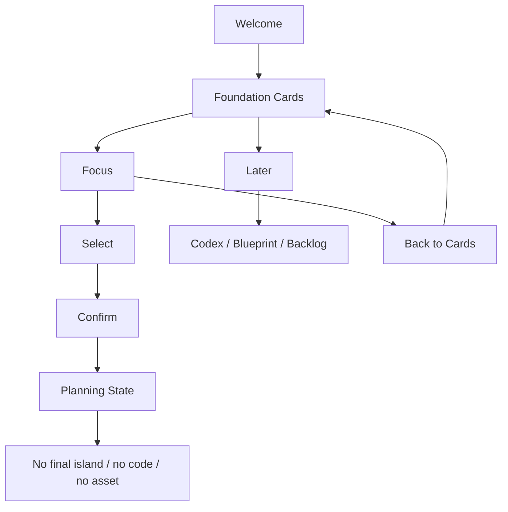

# M14-A: Foundation Choice Product Preview Plan

Stand: 2026-06-06

Status: `Product-Preview-Plan gestartet / keine UI- oder Implementierungsfreigabe`

## 1. Ziel

Dieses Dokument plant eine erste produktnahe, aber weiterhin nicht finale
Product-Preview-Richtung fuer die Foundation Choice. Es zeigt, wie die
Foundation-Wahl im Early Onboarding als Nutzererlebnis wirken koennte, ohne
daraus eine finale UI, App-Integration oder Implementierungsfreigabe
abzuleiten.

M14-A ist nur Product-Preview-Planung. Es ist keine finale
Foundation-Choice-UI, keine finale Onboarding-UI, keine finale Startinsel,
keine App-Integration, keine Datenstruktur, keine Runtime-Konfiguration und
kein Implementierungsauftrag.

Visualisierung erfolgt nur dokumentarisch:

- ASCII-Product-Wireframes,
- ASCII-Mobile-Frames,
- ASCII-State-Previews,
- Mermaid-Flows,
- Markdown-Tabellen,
- Product-/Device-/Accessibility-Checklisten.

Es werden keine PNGs, keine Spielassets und keine Asset-Dateien erzeugt.

## 2. Product-Ziel

Der Product-Preview-Plan soll pruefen, ob die Foundation Choice produktnah
verstaendlich, freundlich und kurz wirken kann.

Klare Zielaussagen:

- Der Nutzer waehlt einen ersten Lernfokus.
- Der Nutzer waehlt keine finale Startinsel.
- Die Wahl bleibt spaeter aenderbar.
- Tali/Vori erklaert kurz und freundlich.
- Der Flow soll emotionaler und produktnaeher wirken als reine Wireframes.
- Trotzdem darf er keine finale UI suggerieren.
- Kein Pflicht-Hausstart.
- Keine irreversible Erstwahl.
- Kein Premium-/Paywall-Druck.
- Keine automatische Wortplatzierung.
- Kein Asset oder Bauzustand entsteht aus der Wahl.

Product-Ton:

- ruhig,
- einladend,
- kurz,
- ohne Druck,
- mit klarer Agency fuer den Nutzer.

Nicht-Ziel:

- keine finale Onboarding-UI,
- kein finales Visual Design,
- keine finalen Icons,
- keine finalen Illustrationen,
- keine App-Integration,
- kein Code.

## 3. Product-Flow

Der Flow soll kurz bleiben und nur wenige States brauchen.

1. Welcome / Tali-Vori Intro.
2. Lernfokus-Erklaerung.
3. Foundation Cards sichtbar.
4. Karte fokussiert.
5. Karte ausgewaehlt.
6. Bestaetigung mit "spaeter aenderbar".
7. Safe Exit / spaeter entscheiden.
8. Ergebnis: Planning State, keine finale Insel.

Wichtig:

- Keine langen Erklaertexte.
- Keine ueberladene Entscheidungslogik.
- Keine Roadmap-Wellen im Start-Onboarding.
- Keine automatische Wortplatzierung.
- Kein Premium-/Paywall-Hinweis.
- Keine finale Startinsel.

## 4. ASCII-Product-Previews

Die folgenden Previews sind Produkt-Planungsskizzen. Sie sind keine finale UI
und duerfen nicht als App-Screen, Asset oder Implementierungsauftrag gelesen
werden.

### 4.1 Welcome Mit Tali/Vori Und Kurzer Erklaerung

```text
+--------------------------------+
| Talvori Welt                   |
|                                |
|        [ Tali / Vori ]         |
|                                |
|  Wir starten einfach.          |
|  Waehle einen ersten           |
|  Lernfokus fuer deine Welt.    |
|                                |
|        [ Weiter ]              |
|                                |
|  Du kannst spaeter wechseln.   |
+--------------------------------+
```

Product-Notizen:

- Tali/Vori erklaert freundlich, aber ohne Druck.
- Die Botschaft ist "Lernfokus", nicht "Startinsel".
- "Spaeter wechseln" ist sichtbar.
- Kein finaler Look, keine Assets, keine Animationen.

### 4.2 Foundation Cards Im Small-Phone-Stack

```text
+--------------------------------+
| Waehle deinen Lernfokus        |
|                                |
| +----------------------------+ |
| | Zuhause / Alltag           | |
| | Vertraute Alltagswoerter   | |
| | spoon, key, chair          | |
| +----------------------------+ |
|                                |
| +----------------------------+ |
| | Schule / Lernen            | |
| | Dinge fuers Lernen         | |
| | pencil, book, ruler        | |
| +----------------------------+ |
|                                |
| +----------------------------+ |
| | Garten / Natur nah         | |
| | Naturwoerter entdecken     | |
| | seed, leaf, flower         | |
| +----------------------------+ |
|                                |
|       [ Spaeter entscheiden ]  |
+--------------------------------+
```

Product-Notizen:

- Small Phone bleibt die fuehrende Planungsgroesse.
- Karten sind kurze Lernfokus-Angebote, keine Insel-Freigaben.
- Beispielwoerter sind begrenzt.
- Safe Exit bleibt sichtbar.

### 4.3 Karte Fokussiert Mit Kurzer Begruendung

```text
+--------------------------------+
| Zuhause / Alltag               |
|                                |
| +----------------------------+ |
| | FOKUS                      | |
| | Vertraute Dinge, die dir   | |
| | taeglich begegnen.         | |
| |                            | |
| | spoon, key, chair          | |
| +----------------------------+ |
|                                |
|  Das ist nur ein Lernfokus.    |
|  Kein Pflicht-Hausstart.       |
|                                |
| [ Auswaehlen ] [ Zurueck ]     |
+--------------------------------+
```

Product-Notizen:

- Fokus darf erklaeren, aber nicht ueberreden.
- Die Guardrail gegen Pflicht-Hausstart ist im Preview-Text sichtbar.
- Auswahl ist nicht nur farblich markiert.

### 4.4 Karte Ausgewaehlt + Confirm

```text
+--------------------------------+
| Dein erster Lernfokus          |
|                                |
| +----------------------------+ |
| | Garten / Natur nah         | |
| | AUSGEWAEHLT                | |
| | seed, leaf, flower         | |
| +----------------------------+ |
|                                |
|  Du kannst spaeter wechseln.   |
|  Kein Timer, kein Druck.       |
|                                |
|       [ Bestaetigen ]          |
|       [ Auswahl aendern ]      |
+--------------------------------+
```

Product-Notizen:

- Bestaetigung setzt nur einen Planning State.
- Garten darf attraktiv wirken, aber keinen Timer-/Growth-Druck aufbauen.
- "Auswahl aendern" bleibt sichtbar.

### 4.5 Safe Exit / Spaeter Entscheiden

```text
+--------------------------------+
| Noch nicht sicher?             |
|                                |
|  Kein Problem. Du kannst       |
|  zuerst Woerter sammeln.       |
|                                |
|  Was noch nicht passt, bleibt  |
|  sicher fuer spaeter in:       |
|                                |
|  - Codex                       |
|  - Blueprint                   |
|  - Backlog                     |
|                                |
|       [ Weiter sammeln ]       |
|       [ Lernfokus waehlen ]    |
+--------------------------------+
```

Product-Notizen:

- Safe Exit reduziert Entscheidungsdruck.
- Codex/Blueprint/Backlog sind sichere Planungs-Fallbacks.
- Es entsteht keine automatische Wortplatzierung.

### 4.6 Blockierter Fall: Zu Final Oder Zu Druckvoll

```text
+--------------------------------+
| Deine erste Insel ist Zuhause! |
|                                |
| Baue jetzt dein Haus und       |
| starte deine Welt. Diese Wahl  |
| bleibt fuer deinen Fortschritt.|
|                                |
| [ Haus bauen ] [ Premium ]     |
|                                |
| Tali: Komm jeden Tag zurueck,  |
| sonst verpasst du Wachstum.    |
+--------------------------------+
```

Blockiert, weil:

- Zuhause wirkt wie Pflicht-Hausstart.
- Die Wahl wirkt final und irreversibel.
- "Haus bauen" suggeriert Umsetzung und Bauzustand.
- Premium-Druck erscheint im Start-Onboarding.
- Growth-/Retention-Druck wird angedeutet.
- Tali/Vori erzeugt Druck statt Orientierung.

## 5. Foundation-Karten Produktnah

### 5.1 Zuhause / Alltag

| Feld | Planung |
| --- | --- |
| Produktrolle | vertrauter Lernfokus fuer Alltagswoerter |
| Kurzer Card-Text | "Vertraute Alltagswoerter." |
| Beispielwoerter | spoon, key, chair |
| Emotionale Wirkung | nahbar, vertraut, ruhig |
| Hauptrisiko | wirkt wie Pflicht-Hausstart oder Hausbau-Spiel |
| Guardrail | immer als Option und Lernfokus formulieren; kein Hausbau-Zwang |

Zusatzregeln:

- Keine Formulierung wie "Du startest mit deinem Haus".
- Keine automatische Hausbaupflicht.
- Gebaeudeteile wie window, door oder wall bleiben Blueprint/Backlog, solange
  kein passender Gebaeudezustand freigegeben ist.

### 5.2 Schule / Lernen

| Feld | Planung |
| --- | --- |
| Produktrolle | freundlicher Lernfokus fuer Lernwerkzeuge und einfache Objekte |
| Kurzer Card-Text | "Dinge fuers Lernen." |
| Beispielwoerter | pencil, book, ruler |
| Emotionale Wirkung | klar, hilfreich, leicht |
| Hauptrisiko | wirkt wie Pflichtschule, Testmodus oder Arbeitsblatt |
| Guardrail | spielnah, freundlich und nicht kontrollierend formulieren |

Zusatzregeln:

- Keine Formulierungen wie "Test", "Pflicht", "Aufgabe erledigen".
- Keine ueberladene IslandView.
- Kleinteile wie pencil, eraser oder ruler brauchen Container-/Clutter-Regeln.

### 5.3 Garten / Natur Nah

| Feld | Planung |
| --- | --- |
| Produktrolle | freundlicher Lernfokus fuer Naturwoerter |
| Kurzer Card-Text | "Naturwoerter entdecken." |
| Beispielwoerter | seed, leaf, flower |
| Emotionale Wirkung | warm, ruhig, neugierig |
| Hauptrisiko | suggeriert Timer, Growth, Pflegepflicht oder Retention-Druck |
| Guardrail | keine Timer-, Streak-, Verfalls- oder Pflegeversprechen |

Zusatzregeln:

- Keine Formulierung wie "pflege taeglich".
- Keine Pflanze-leidet-Mechanik.
- Growth bleibt ohne Fairness-/Timer-Gate blockiert.

## 6. Product-Copy-Regeln

### 6.1 Copy-Tabelle

| Copy | Status | Begruendung | Alternative |
| --- | --- | --- | --- |
| "Waehle deinen ersten Lernfokus." | erlaubt | beschreibt die Wahl praezise und nicht final | beibehalten |
| "Du kannst spaeter wechseln." | erlaubt | reduziert Druck und Lock-in | beibehalten |
| "Wir starten einfach." | erlaubt | freundlich, kurz, ohne Systemversprechen | beibehalten |
| "Diese Woerter passen gut dazu." | erlaubt | erklaert Beispiele ohne Platzierung | beibehalten |
| "Du kannst spaeter entscheiden." | erlaubt | Safe Exit bleibt klar | beibehalten |
| "Deine erste Insel ist ..." | blockiert | suggeriert finale Startinsel | "Dein erster Lernfokus ist ..." |
| "Du startest mit deinem Haus." | blockiert | erzwingt Pflicht-Hausstart | "Zuhause / Alltag ist eine Option." |
| "Diese Wahl bleibt." | blockiert | erzeugt irreversible Erstwahl | "Du kannst spaeter wechseln." |
| "Baue jetzt dein Zuhause." | blockiert | suggeriert Umsetzung und Bauzustand | "Lerne vertraute Alltagswoerter." |
| "Pflege deinen Garten taeglich." | blockiert | erzeugt Timer-/Retention-Druck | "Entdecke Naturwoerter." |
| "Premium freischalten." | blockiert | Paywall-Druck im Start-Onboarding | keine Premium-Erwaehnung |
| "Sonst verpasst du ..." | blockiert | FOMO und Druck | "Du kannst spaeter weitermachen." |

### 6.2 Ton-Regeln

Erlaubt:

- kurz,
- freundlich,
- reversibel,
- optional,
- lernfokussiert.

Blockiert:

- final,
- drohend,
- monetarisierend,
- bauzustandsnah,
- retentiongetrieben,
- schulisch verpflichtend.

## 7. Product-State-Regeln

Diese Zustaende sind Product-Preview-Zustaende, keine Runtime-State-Definition.

| Product State | Bedeutung | Nutzeraktion | Nicht ableiten |
| --- | --- | --- | --- |
| `intro` | Tali/Vori begruesst kurz | weiter | kein Tutorial-System |
| `cards_visible` | drei Foundation-Karten sichtbar | Karte waehlen oder spaeter entscheiden | keine finale Roadmap |
| `card_focus` | eine Karte ist hervorgehoben | begruenden lassen, auswaehlen, zurueck | keine Empfehlungspflicht |
| `card_selected` | Nutzer hat Fokus gewaehlt | bestaetigen oder aendern | keine Startinsel |
| `confirm_visible` | Primary Action sichtbar | bestaetigen | keine Runtime-Konfiguration |
| `safe_exit` | spaeter entscheiden | weiter sammeln | kein Nachteil |
| `planning_state_set` | Lernfokus ist planerisch gesetzt | naechster Planungszustand | keine Persistenzfreigabe |
| `later_decision` | Wahl vertagt | Codex/Blueprint/Backlog nutzen | keine automatische Platzierung |
| `blocked_by_guardrail` | Preview verletzt Schutzregel | nachbessern | keine Umsetzung |

## 8. Device-/Accessibility-Regeln

Planungsregeln fuer M14-A:

- Small Phone zuerst.
- Portrait bleibt Primaermodus.
- Karten muessen gestapelt funktionieren.
- Text darf nicht aus Karten laufen.
- Tap-Zonen muessen klar sein.
- Safe Exit bleibt sichtbar.
- Auswahl nicht nur durch Farbe markieren.
- Tali/Vori nicht ueber Buttons oder Karten platzieren.
- Kein Audio-only-Onboarding.
- Reduzierte Bewegung muss spaeter moeglich bleiben.
- Keine Premium-/Paywall-Erwaehnung.
- Product Preview darf keine finale UI suggerieren.

Device-Checkliste fuer spaetere visuelle Product Preview:

| Check | Erwartung | Blocker |
| --- | --- | --- |
| Small Phone Fit | drei Karten passen gestapelt mit Safe Exit | Karte oder Button abgeschnitten |
| Text Containment | alle Texte bleiben in Karten/Rahmen/Panels | Text laeuft aus Box |
| Tap-Zonen | Karten und Buttons klar getrennt | zu kleine oder dichte Ziele |
| Tali/Vori | erklaert, verdeckt nichts | Bubble liegt ueber Interaktion |
| Selection State | Text/Icon plus ggf. Farbe | nur farbcodiert |
| Safe Exit | sichtbar, ruhig, erreichbar | fehlt oder wirkt versteckt |
| Accessibility | keine Audio-only-Info, reduzierte Bewegung denkbar | Bedeutung nur ueber Ton/Farbe |

## 9. Textuelle Visualisierung

### 9.1 Product-Flow



### 9.2 Product State / Purpose / Primary Action / Risk / Guardrail

| Product State | Purpose | Primary Action | Risk | Guardrail |
| --- | --- | --- | --- | --- |
| Welcome | freundlich starten | Weiter | langer Tutorial-Text | Tali/Vori kurz halten |
| Cards | drei Lernfoki zeigen | Karte waehlen | zu viele Optionen | nur Foundation-Karten |
| Focus | Karte erklaeren | Auswaehlen | wirkt wie Empfehlungspflicht | Zurueck sichtbar |
| Selected | Wahl sichtbar machen | Bestaetigen | finaler Eindruck | "spaeter aenderbar" |
| Later | Druck senken | weiter sammeln | Nutzer fuehlt Verlust | kein Nachteil, Fallbacks |
| Planning State | Wahl planerisch merken | naechster Schritt spaeter | Runtime-State wird angenommen | keine Datenstrukturfreigabe |

### 9.3 Foundation Card / Product Promise / Risk / Guardrail

| Foundation Card | Product Promise | Risk | Guardrail |
| --- | --- | --- | --- |
| Zuhause / Alltag | vertraute Alltagswoerter | Pflicht-Hausstart | Option, Lernfokus, kein Hausbau |
| Schule / Lernen | hilfreiche Lernwoerter | Pflichtschule/Testmodus | freundlich, spielnah, leicht |
| Garten / Natur nah | Naturwoerter entdecken | Timer-/Growth-Druck | keine Pflegepflicht, kein Verfall |

### 9.4 Good / Blocked Fuer Foundation Choice Product Preview

| Good | Blocked |
| --- | --- |
| Lernfokus statt Startinsel. | "Deine erste Insel ist ..." |
| Safe Exit sichtbar. | Nutzer muss sofort waehlen. |
| Spaeter aenderbar klar. | irreversible Erstwahl. |
| Tali/Vori erklaert kurz. | Tali/Vori draengt oder verdeckt Buttons. |
| Karten sind kurz und mobil lesbar. | lange Kartenkopien laufen aus Boxen. |
| Beispiele erklaeren Wortfelder. | Beispiele wirken wie automatische Platzierung. |
| Keine Premium-Erwaehnung. | Paywall oder FOMO im Onboarding. |
| Product Preview bleibt Planung. | Preview wirkt wie finale UI-Freigabe. |

## 10. Risiken Und Harte Blocker

Harte Blocker:

- Product Preview wirkt wie finale UI.
- Zuhause wirkt wie Pflicht-Hausstart.
- Schule wirkt wie Pflichtschule oder Testmodus.
- Garten suggeriert Timer-/Growth-/Retention-Druck.
- "Spaeter entscheiden" fehlt.
- Auswahl wirkt irreversibel.
- Text laeuft aus Karten, Rahmen oder Panels.
- Tali/Vori verdeckt Buttons.
- Premium-/Paywall-Hinweis erscheint.
- Automatische Wortplatzierung wird suggeriert.
- Planning State wird als Runtime-Konfiguration gelesen.
- Flow erzeugt Code-, Asset- oder App-Freigabe.

## 11. Entscheidungsempfehlung

Optionen:

1. Product-Preview-Plan als Grundlage fuer spaetere visuelle Product Preview
   brauchbar.
2. Mit kleinen Copy-/Layout-Nachbesserungen brauchbar.
3. Noch nicht brauchbar, erneut planen.
4. Blockieren, weil zu final oder zu riskant.

Empfehlung:

M14-A ist als Product-Preview-Plan grundsaetzlich brauchbar. Der Plan
konkretisiert die Foundation Choice produktnaeher, ohne eine finale UI,
Startinsel, Datenstruktur, Runtime-Konfiguration, App-Integration oder
Implementierung freizugeben.

Naechster sinnvoller Schritt:

- M14-A2 Foundation Choice Product Preview Visual Plan/Review, weiterhin ohne
  Code, ohne App-Integration, ohne Assets und ohne finale UI.

Keine Freigabe:

- keine Codefreigabe,
- keine App-Integration,
- keine finale UI,
- keine Assetfreigabe,
- kein `frame_started`.

## 12. Stop-Regeln

- Keine finale Foundation-Choice-UI aus M14-A.
- Keine finale Onboarding-UI aus M14-A.
- Keine finale Startinsel aus M14-A.
- Keine finale ThemeIsland-Roadmap aus M14-A.
- Keine App-Integration aus M14-A.
- Keine Codefreigabe aus M14-A.
- Keine Implementierungsfreigabe aus M14-A.
- Keine Assetfreigabe aus M14-A.
- Keine finale Datenstruktur aus M14-A.
- Keine Runtime-Konfiguration aus M14-A.
- Keine automatische Wortplatzierung aus M14-A.
- Keine PNG-Erzeugung aus M14-A.
- Keine Tests aus M14-A.
- Keine Spielassets aus M14-A.
- Kein `frame_started` oder Bauzustand aus M14-A.

## 13. Review-Fazit

M14-A kann als erste produktnahe Planungsgrundlage fuer die Foundation Choice
genutzt werden. Der beste Kern bleibt: kurze Tali/Vori-Einfuehrung, drei
Foundation-Karten, reversible Wahl, sichtbarer Safe Exit und Planning State
ohne Runtime- oder Implementierungsfreigabe.

Der Plan macht die Foundation Choice greifbarer, oeffnet aber keine App-,
Code-, Asset-, UI-, Datenstruktur-, Runtime-, Startinsel- oder
`frame_started`-Freigabe.
