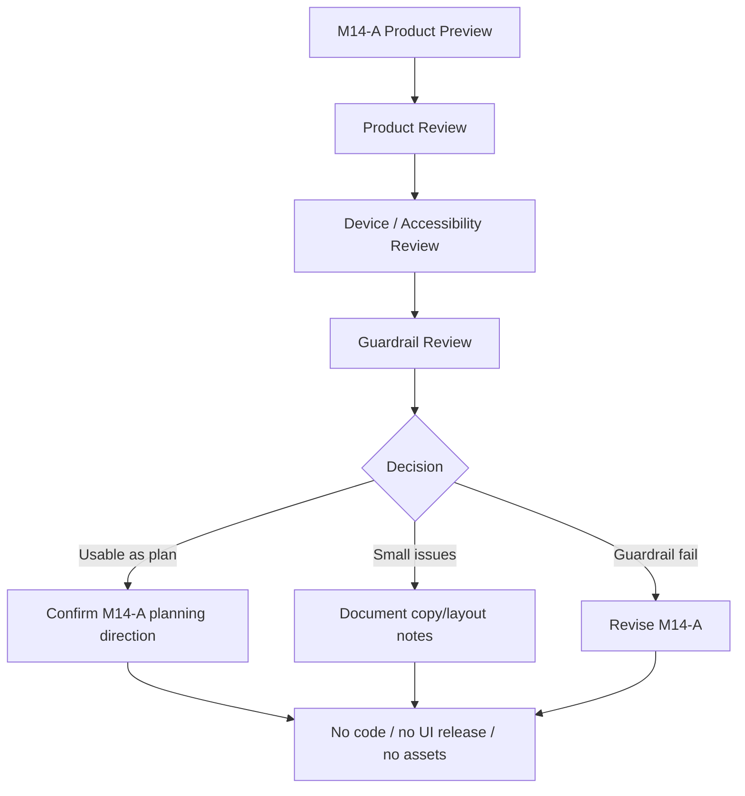

# M14-A2: Foundation Choice Product Preview Visual Review

Stand: 2026-06-06

Status: `Review gestartet / M14-A als Product-Preview-Plan grundsaetzlich bestaetigt`

## 1. Ziel

Dieses Dokument prueft den M14-A Product-Preview-Plan visuell und inhaltlich.
Es bewertet, ob die Foundation Choice als produktnahe, aber weiterhin nicht
finale Planung verstaendlich, freundlich, mobil plausibel und guardrail-
konform ist.

M14-A2 ist nur Review. Es ist keine finale Foundation-Choice-UI, keine finale
Onboarding-UI, keine finale Startinsel, keine App-Integration, keine
Datenstruktur, keine Runtime-Konfiguration und kein Implementierungsauftrag.

Visualisierung erfolgt nur dokumentarisch:

- ASCII-Review-Overlays,
- ASCII-Mobile-Frames,
- ASCII-State-Review-Skizzen,
- Mermaid-Flows,
- Markdown-Tabellen,
- Product-/Device-/Accessibility-Review-Checklisten.

Es werden keine PNGs, keine Spielassets und keine Asset-Dateien erzeugt.

## 2. Gepruefte Grundlage

Geprueft wurde:

- `docs/world_design/297-foundation-choice-product-preview-plan.md`,
- Welcome mit Tali/Vori,
- Foundation Cards im Small-Phone-Stack,
- Karte fokussiert mit kurzer Begruendung,
- Karte ausgewaehlt + Confirm,
- Safe Exit / spaeter entscheiden,
- blockierter Fall,
- Product-Copy-Regeln,
- Product-State-Regeln,
- Device-/Accessibility-Regeln,
- Stop-Regeln aus M14-A.

Nicht geprueft:

- keine echte App-UI,
- keine echten Device-Screenshots,
- keine PNG-Preview,
- keine Asset-Dateien,
- keine Runtime-Daten,
- keine Implementierung.

## 3. Visuelle Und Produktnahe Pruefung

| Prueffrage | Bewertung | Hinweis |
| --- | --- | --- |
| Wirkt der Flow kurz genug? | bestanden | Welcome, Cards, Focus, Confirm und Safe Exit bleiben als knapper Flow lesbar. |
| Wird Lernfokus statt Startinsel klar? | bestanden | M14-A wiederholt "Lernfokus" und blockiert "erste Insel" explizit. |
| Wird Aenderbarkeit klar? | bestanden | "Du kannst spaeter wechseln" ist im Welcome und Confirm sichtbar. |
| Ist Safe Exit sichtbar und ruhig genug? | bestanden | "Spaeter entscheiden" und "Weiter sammeln" sind vorhanden, ohne dominant zu wirken. |
| Erklaert Tali/Vori freundlich und ohne Druck? | bestanden | Die Tali/Vori-Texte sind kurz, neutral und nicht drohend. |
| Verdeckt Tali/Vori Interaktion? | bestanden in ASCII | Die Skizzen halten Tali/Vori oberhalb der Interaktion. Echte Device-Preview bleibt offen. |
| Bleiben Texte in Karten/Rahmen/Panels? | bestanden fuer ASCII | Die Textlaengen passen in die gezeigten Boxen. Spaetere Visual Preview muss das erneut pruefen. |
| Sind Karten nicht zu textlastig? | bestanden | Titel, eine kurze Zeile und drei Beispielwoerter bleiben plausibel. |
| Funktioniert Small-Phone-Stack als Produktidee? | bestanden | Drei gestapelte Karten sind der sicherste mobile Default. |
| Ist Auswahl nicht nur farbcodiert? | bestanden | `FOKUS` und `AUSGEWAEHLT` zeigen den Zustand textlich. |
| Wird automatische Wortplatzierung suggeriert? | bestanden | Beispiele werden als Wortfelder dargestellt, nicht als Platzierungen. |
| Wird Hausbau, Bauzustand oder `frame_started` suggeriert? | bestanden | Der blockierte Fall zeigt die Gefahr und stoppt sie. |
| Wird Premium-/Paywall-Druck erzeugt? | bestanden | Premium wird nur als blockierte Copy gezeigt. |
| Wird Timer-/Growth-/Retention-Druck erzeugt? | bestanden | Garten enthaelt die Guardrail "Kein Timer, kein Druck". |
| Wirkt Schule freundlich genug? | bestanden mit Beobachtung | "Dinge fuers Lernen" ist neutral; spaeter kann emotionalere Copy getestet werden. |
| Wirkt Zuhause vertraut, aber nicht verpflichtend? | bestanden | Der Fokuszustand nennt explizit "Kein Pflicht-Hausstart". |

Review-Fazit:

M14-A ist als Product-Preview-Plan grundsaetzlich brauchbar. Die staerksten
Schutzpunkte sind Lernfokus-Sprache, Reversibilitaet, Safe Exit und die
blockierte Negativskizze. Es gibt keine aktuelle Code-, Asset-, UI-, Runtime-
oder `frame_started`-Freigabe.

## 4. Foundation-Karten Review

### 4.1 Zuhause / Alltag

Produktwirkung:

- vertraut,
- ruhig,
- niedrigschwellig,
- geeignet fuer Alltagswoerter.

Copy:

- "Vertraute Alltagswoerter" ist kurz und klar.
- "Kein Pflicht-Hausstart" im Fokuszustand ist als Guardrail hilfreich.

Beispielwoerter:

- `spoon`, `key`, `chair` passen als Alltagswoerter.
- `window`, `door` sollten im Product Preview nicht prominent werden, weil
  Gebaeudeteile Blueprint/Bauzustand brauchen.

Risiko:

- Zuhause kann schnell wie Hausbaupflicht oder finaler Wohnort wirken.

Guardrail-Bewertung:

- ausreichend fuer den Planungsstand,
- in spaeterer Product Preview weiter sichtbar halten,
- keine Formulierung mit "Haus bauen", "dein Zuhause beginnt" oder
  "Startort".

### 4.2 Schule / Lernen

Produktwirkung:

- klar,
- lernnah,
- fuer Talvori naheliegend,
- noch etwas nuechtern, aber nicht strafend.

Copy:

- "Dinge fuers Lernen" ist kurz und verstaendlich.
- Fuer eine spaetere visuelle Product Preview koennte eine weichere Zeile
  getestet werden, z. B. "Kleine Dinge, die beim Lernen helfen."

Beispielwoerter:

- `pencil`, `book`, `ruler` passen.
- Kleinteile wie `eraser`, `pencil`, `ruler` brauchen spaeter Container- und
  Clutter-Gates.

Risiko:

- Schule kann wie Pflichtschule, Testmodus oder Arbeitsblatt wirken.

Guardrail-Bewertung:

- ausreichend fuer den Planungsstand,
- keine Copy mit "Test", "Pflicht", "Aufgabe erledigen" oder "Lernkontrolle".

### 4.3 Garten / Natur Nah

Produktwirkung:

- freundlich,
- warm,
- naturbezogen,
- gut geeignet fuer neugieriges Startgefuehl.

Copy:

- "Naturwoerter entdecken" ist attraktiv, ohne Timer zu versprechen.
- "Kein Timer, kein Druck" im Confirm-Zustand schuetzt gegen falsche
  Growth-Erwartung.

Beispielwoerter:

- `seed`, `leaf`, `flower` passen.
- `watering can` bleibt als SmallTool spaeter gut, braucht aber Depth-/
  Container-/Tap-Gates.

Risiko:

- Garten kann schnell Timer, Pflegepflicht, Streak oder Retention suggerieren.

Guardrail-Bewertung:

- ausreichend fuer den Planungsstand,
- keine Copy mit "taeglich pflegen", "warten", "waechst nur wenn" oder
  "Pflanze leidet".

## 5. Copy-Regeln Review

Die erlaubten Formulierungen aus M14-A sind kurz, freundlich und reversibel.
Sie vermeiden finale Startinsel-Sprache und setzen keine Bau- oder Runtime-
Erwartung.

Die blockierten Formulierungen sind fuer den aktuellen Stand ausreichend. Fuer
spaetere Product Previews sollten zusaetzlich diese problematischen Muster
blockiert bleiben:

| Copy | Status | Begruendung | Alternative |
| --- | --- | --- | --- |
| "Dein Startort ist ..." | blockiert | klingt nach finaler Startinsel | "Dein erster Lernfokus ist ..." |
| "Hier entsteht dein erstes Zuhause." | blockiert | suggeriert Hausbau und Bauzustand | "Hier passen Alltagswoerter gut." |
| "Schaffst du den Schulstart?" | blockiert | erzeugt Test-/Leistungsdruck | "Starte mit Dingen fuers Lernen." |
| "Dein Garten wartet auf dich." | blockiert | kann Retention-Druck erzeugen | "Entdecke Naturwoerter." |
| "Komm morgen wieder, damit es weitergeht." | blockiert | Timer-/Comeback-Druck | "Du kannst spaeter weitermachen." |
| "Schalte deinen Fokus frei." | blockiert | klingt nach Lock/Paywall | "Waehle deinen Fokus." |

Copy-Review-Fazit:

- keine Pflicht-Hausstart-Sprache,
- keine finale Insel-Sprache,
- keine Schulpflicht-Sprache,
- keine Growth-/Timer-Sprache,
- keine Premium-/Paywall-Sprache,
- keine automatische Platzierungs-Sprache.

## 6. Product-State-Regeln Review

| Product State | Review | Risiko | Entscheidung |
| --- | --- | --- | --- |
| `intro` | verstaendlich und kurz | Tali/Vori koennte spaeter zu viel erklaeren | beibehalten |
| `cards_visible` | drei Karten sind mobil plausibel | Karten koennen visuell zu dicht werden | Device-Preview spaeter |
| `card_focus` | sinnvoll fuer kurze Begruendung | wirkt wie Empfehlungspflicht | Zurueck/Option sichtbar halten |
| `card_selected` | klar, nicht nur Farbe | kann final wirken | "spaeter wechseln" sichtbar halten |
| `confirm_visible` | gute Primary Action | kann als Runtime-Commit gelesen werden | Planning-State-Hinweis noetig |
| `safe_exit` | stark gegen Entscheidungsdruck | darf nicht versteckt wirken | sichtbar halten |
| `planning_state_set` | als Planungszustand brauchbar | Persistenzfreigabe wird angenommen | keine Runtime-State-Definition |
| `later_decision` | kein Nachteil erkennbar | Nutzer koennte Unsicherheit fuehlen | positiv und ruhig formulieren |
| `blocked_by_guardrail` | hilfreich fuer Review | koennte als Fehlerzustand in App gelesen werden | nur Review-Zustand |

Klarstellung:

- Product States sind keine Runtime-State-Definition.
- `planning_state_set` ist keine Persistenzfreigabe.
- `later_decision` ist kein Nachteil.
- `blocked_by_guardrail` fuehrt zu Nachbesserung, nicht zu Implementierung.

## 7. Textuelle Review-Visualisierungen

### 7.1 Mermaid Review Flow



### 7.2 ASCII Review Overlay

```text
+--------------------------------+
| TALI/VORI ZONE                 |
| short, friendly, no pressure   |
|--------------------------------|
| CARD ZONE                      |
| +----------------------------+ |
| | Zuhause / Alltag           | |
| | short text + 3 words       | |
| +----------------------------+ |
| +----------------------------+ |
| | Schule / Lernen            | |
| | short text + 3 words       | |
| +----------------------------+ |
| +----------------------------+ |
| | Garten / Natur nah         | |
| | short text + 3 words       | |
| +----------------------------+ |
|--------------------------------|
| PRIMARY ACTION                 |
| [ Bestaetigen / Weiter ]       |
| SAFE EXIT                      |
| [ Spaeter entscheiden ]        |
| GUARDRAIL TEXT                 |
| Lernfokus, spaeter aenderbar   |
+--------------------------------+
```

Review-Notizen:

- Tali/Vori-Zone steht oberhalb und verdeckt nichts.
- Card Zone bleibt kurz und gestapelt.
- Primary Action und Safe Exit sind getrennt.
- Guardrail Text bleibt knapp.

### 7.3 Preview State / Review Result / Risk / Required Adjustment

| Preview State | Review Result | Risk | Required Adjustment |
| --- | --- | --- | --- |
| Welcome | brauchbar | zu viel Tali/Vori-Text | spaeter kurz halten |
| Cards stack | brauchbar | Karten koennen eng werden | Device Preview noetig |
| Focus card | brauchbar | wirkt wie Empfehlungspflicht | Zurueck und Option sichtbar |
| Selected + Confirm | brauchbar | finaler Eindruck | "spaeter wechseln" sichtbar |
| Safe Exit | stark | koennte versteckt werden | ruhig, aber sichtbar halten |
| Blocked example | wichtig | koennte missverstanden werden | klar als blockiert markieren |

### 7.4 Good / Needs Adjustment / Blocked

| Good | Needs Adjustment | Blocked |
| --- | --- | --- |
| Lernfokus-Sprache | spaeter echte Small-Phone-Pruefung | Startinsel-Sprache |
| Reversible Wahl | Schule ggf. emotionaler testen | Pflicht-Hausstart |
| Safe Exit sichtbar | Guardrail-Text knapp halten | irreversible Wahl |
| Tali/Vori kurz | Card-Spacings spaeter pruefen | Premium-/Paywall-Druck |
| Textstatus fuer Auswahl | Fokuszustand nicht zu stark empfehlen | Timer-/Growth-Druck |
| Keine automatische Platzierung | Beispielwoerter begrenzen | Bauzustand oder `frame_started` |

### 7.5 Darf Aus M14-A2 Code Entstehen?

```text
Ist M14-A2 ein Review?
  |
  +-- Ja -> keine Codefreigabe
          |
          v
     Gibt es finale UI-Freigabe?
          |
          +-- Nein -> keine App-Integration
                  |
                  v
             Gibt es Asset-/Runtime-Gate?
                  |
                  +-- Nein -> keine Assets, keine Runtime, kein frame_started
```

## 8. Risiken Und Harte Blocker

Harte Blocker:

- Review wird als finale UI-Freigabe gelesen.
- Product Preview wirkt wie App-Screen statt Planungsreview.
- Zuhause wirkt wie Pflicht-Hausstart.
- Schule wirkt wie Pflichtschule oder Testmodus.
- Garten suggeriert Timer-/Growth-/Retention-Druck.
- Safe Exit fehlt oder wirkt versteckt.
- Auswahl wirkt irreversibel.
- Text laeuft aus Karten, Rahmen oder Panels.
- Tali/Vori verdeckt Buttons.
- Premium-/Paywall-Hinweis erscheint.
- Automatische Wortplatzierung wird suggeriert.
- Product State wird als Runtime-Konfiguration gelesen.
- Review erzeugt Code-, Asset- oder App-Freigabe.

## 9. Entscheidungsempfehlung

Optionen:

1. M14-A als Product-Preview-Plan bestaetigen.
2. M14-A mit kleinen Nachbesserungen bestaetigen.
3. M14-A erneut nachbessern.
4. M14-A blockieren, weil zu final oder zu riskant.

Empfehlung:

M14-A grundsaetzlich als Product-Preview-Plan bestaetigen.

Kleine Hinweise fuer spaetere Preview-Bloecke:

- Schule darf in einer spaeteren Visual Product Preview emotionaler wirken,
  ohne Pflichtschule-Sprache zu nutzen.
- Der Fokuszustand sollte nicht wie eine Systemempfehlung wirken.
- Safe Exit und "spaeter wechseln" muessen in jeder spaeteren Preview sichtbar
  bleiben.
- Beispielwoerter duerfen nicht wie automatische Platzierungen wirken.

Naechster moeglicher Schritt:

- M14-B Word-to-Island Product Preview Plan,
- oder M14-A3 Visual Product Preview Plan, falls vor M14-B eine weitere
  Foundation-Choice-Visualisierung gewuenscht ist.

Keine Freigabe:

- keine Codefreigabe,
- keine App-Integration,
- keine finale UI,
- keine Assetfreigabe,
- kein `frame_started`.

## 10. Stop-Regeln

- Keine finale Foundation-Choice-UI aus M14-A2.
- Keine finale Onboarding-UI aus M14-A2.
- Keine finale Startinsel aus M14-A2.
- Keine finale ThemeIsland-Roadmap aus M14-A2.
- Keine App-Integration aus M14-A2.
- Keine Codefreigabe aus M14-A2.
- Keine Implementierungsfreigabe aus M14-A2.
- Keine Assetfreigabe aus M14-A2.
- Keine finale Datenstruktur aus M14-A2.
- Keine Runtime-Konfiguration aus M14-A2.
- Keine automatische Wortplatzierung aus M14-A2.
- Keine PNG-Erzeugung aus M14-A2.
- Keine Tests aus M14-A2.
- Keine Spielassets aus M14-A2.
- Kein `frame_started` oder Bauzustand aus M14-A2.

## 11. Review-Fazit

M14-A2 bestaetigt M14-A als brauchbare Product-Preview-Planungsrichtung. Der
Flow ist kurz, die Lernfokus-Sprache ist verstaendlich, die Wahl bleibt
reversibel, Safe Exit ist sichtbar, und die wichtigsten Guardrails gegen
Pflicht-Hausstart, Pflichtschule, Growth-/Timer-Druck, Premium-Druck,
automatische Wortplatzierung und Bauzustandsableitung sind dokumentiert.

Der Review oeffnet keine App-, Code-, Asset-, UI-, Datenstruktur-, Runtime-,
Startinsel- oder `frame_started`-Freigabe.
