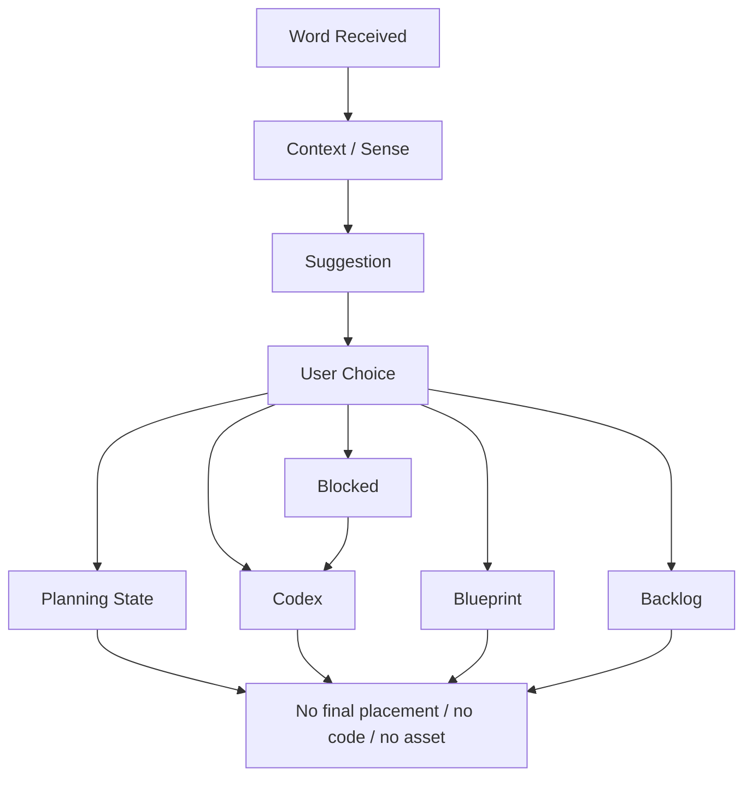

# M14-B: Word-to-Island Product Preview Plan

Stand: 2026-06-06

Status: `Product-Preview-Plan gestartet / keine Word-to-Island-Freigabe`

## 1. Ziel

Dieses Dokument plant eine erste produktnahe, aber weiterhin nicht finale
Product-Preview-Richtung fuer Word-to-Island. Es zeigt, wie ein gelerntes,
importiertes oder manuell hinzugefuegtes Wort dem Nutzer als sicherer
Vorschlag erklaert wird, ohne automatische Platzierung, ohne finale Routing-
Datenstruktur und ohne Implementierungsfreigabe.

M14-B ist nur Product-Preview-Planung. Es ist keine finale Word-to-Island-UI,
keine App-Integration, keine Implementierung, keine finale Datenstruktur,
keine Runtime-Konfiguration und keine automatische Wortplatzierung.

Visualisierung erfolgt nur dokumentarisch:

- ASCII-Product-Wireframes,
- ASCII-Mobile-Frames,
- ASCII-State-Previews,
- Mermaid-Flows,
- Markdown-Tabellen,
- Product-/Device-/Accessibility-Checklisten.

Es werden keine PNGs, keine Spielassets und keine Asset-Dateien erzeugt.

## 2. Product-Ziel

Der Product-Preview-Plan soll pruefen, ob Word-to-Island als kurzer,
verstaendlicher und sicherer Vorschlagsflow erklaerbar ist.

Klare Zielaussagen:

- Ein Wort wird nicht automatisch sichtbar platziert.
- Talvori macht einen verstaendlichen Vorschlag.
- Der Nutzer entscheidet.
- Der Nutzer kann bestaetigen, aendern, nur Codex waehlen, Blueprint vormerken
  oder spaeter entscheiden.
- Mehrdeutige Woerter brauchen Sense-/Kontext-Auswahl.
- Kleinteile brauchen Container, Depth oder DetailInteraction statt
  IslandView.
- Gebaeudeteile brauchen Blueprint statt Bauzustand.
- Sensible oder abstrakte Begriffe bleiben neutral ueber Codex, ContextCard
  oder Backlog.
- Tali/Vori erklaert kurz, entscheidet aber nicht.
- Kein Premium-/Paywall-Druck.
- Kein Asset, kein Bauzustand, kein `frame_started`.

Product-Ton:

- ruhig,
- erklaerend,
- optional,
- reversibel,
- ohne technische Label-Flut,
- mit klarer Nutzerentscheidung.

Nicht-Ziel:

- keine finale Word-to-Island-UI,
- keine finale Routing-Datenstruktur,
- kein Routing-Code,
- keine automatische Platzierung,
- keine App-Integration,
- kein Code.

## 3. Product-Flow

Der Flow soll kurz bleiben und keine technischen Begriffe in der Nutzeransicht
erzwingen.

1. Word received / Wort gelernt oder importiert.
2. Context check / Sense needed.
3. Suggestion card.
4. User choice.
5. Confirm suggestion.
6. Change route.
7. Codex only.
8. Blueprint candidate.
9. Later / Backlog.
10. Ergebnis: Planning State, keine finale Platzierung.

Wichtig:

- Keine ueberladene Entscheidungslogik.
- Kein technischer Routing-Dialog.
- Kein automatisches sichtbares Platzieren.
- Keine finale Datenstruktur.
- Keine Runtime-Konfiguration.
- Kein Asset und kein Bauzustand.

## 4. ASCII-Product-Previews

Die folgenden Previews sind Produkt-Planungsskizzen. Sie sind keine finale UI
und duerfen nicht als App-Screen, Asset oder Implementierungsauftrag gelesen
werden.

### 4.1 Wort Wurde Gelernt Oder Importiert

```text
+--------------------------------+
| Neues Wort                      |
|                                |
|        apple                   |
|        Apfel                   |
|                                |
| Tali/Vori: Ich habe einen      |
| Vorschlag, aber du entscheidest.|
|                                |
|       [ Vorschlag ansehen ]    |
|       [ Nur im Codex ]         |
|       [ Spaeter entscheiden ]  |
+--------------------------------+
```

Product-Notizen:

- Das Wort wird nur angenommen, nicht platziert.
- Tali/Vori spricht von Vorschlag, nicht von Entscheidung.
- Codex und Spaeter bleiben erreichbar.

### 4.2 Vorschlagskarte Mit ThemeIsland + Depth

```text
+--------------------------------+
| Vorschlag fuer apple           |
|                                |
|  Lernfokus: Garten / Essen     |
|  Naeherer Ort: Beet / Korb     |
|  Sichtbar: spaeter im Detail   |
|                                |
|  Passt gut, weil apple zu      |
|  Natur, Essen und Einkauf      |
|  gehoeren kann.                |
|                                |
|       [ Vorschlag merken ]     |
|       [ Aendern ]              |
|       [ Nur Codex ]            |
|       [ Spaeter ]              |
+--------------------------------+
```

Product-Notizen:

- ThemeIsland und Depth werden nutzernah beschrieben.
- "merken" bedeutet Planning State, keine finale Platzierung.
- Multi-home bleibt offen und aenderbar.

### 4.3 Mehrdeutiges Wort Mit Sense-Auswahl

```text
+--------------------------------+
| Welche Bedeutung meinst du?    |
|                                |
|        bank                    |
|                                |
| +----------------------------+ |
| | Sitzbank                   | |
| | Park, Garten, Stadt        | |
| +----------------------------+ |
|                                |
| +----------------------------+ |
| | Bank / Geldinstitut        | |
| | Stadt, spaeter             | |
| +----------------------------+ |
|                                |
|       [ Bedeutung waehlen ]    |
|       [ Nur Codex ]            |
|       [ Spaeter entscheiden ]  |
+--------------------------------+
```

Product-Notizen:

- Sense-Auswahl kommt vor Routing.
- Riskantere oder systemschwere Bedeutung bleibt spaeter.
- Keine automatische Sense-Entscheidung.

### 4.4 Kleines Objekt Mit Container-Hinweis

```text
+--------------------------------+
| Vorschlag fuer pencil          |
|                                |
|  Passt gut zu: Schule          |
|  Besserer Ort: Federmappe      |
|  Nicht dauerhaft auf Insel     |
|                                |
|  Kleine Dinge funktionieren    |
|  besser in Detailansichten.    |
|                                |
|       [ Federmappe merken ]    |
|       [ Anderen Ort waehlen ]  |
|       [ Nur Codex ]            |
|       [ Spaeter ]              |
+--------------------------------+
```

Product-Notizen:

- TinyObject wird nicht in IslandView gedrueckt.
- Container/Depth wird als hilfreicher Vorschlag erklaert.
- Keine Container-Implementierung wird freigegeben.

### 4.5 Gebaeudeteil Mit Blueprint-Hinweis

```text
+--------------------------------+
| Vorschlag fuer window          |
|                                |
|  Fenster passt spaeter zu      |
|  einem passenden Gebaeude.     |
|                                |
|  Jetzt sicherer Weg:           |
|  Blueprint vormerken           |
|                                |
|       [ Blueprint merken ]     |
|       [ Nur Codex ]            |
|       [ Spaeter ]              |
+--------------------------------+
```

Product-Notizen:

- Kein Fenster wird frei platziert.
- Kein Bauzustand entsteht.
- `frame_started` bleibt blockiert.

### 4.6 Sensibler Oder Abstrakter Begriff

```text
+--------------------------------+
| Vorschlag fuer illness         |
|                                |
|  Dieses Wort braucht Kontext.  |
|  Es wird nicht automatisch     |
|  in der Welt sichtbar.         |
|                                |
|  Sicherer Weg:                 |
|  Codex oder ContextCard        |
|                                |
|       [ Im Codex speichern ]   |
|       [ ContextCard ]          |
|       [ Spaeter ]              |
+--------------------------------+
```

Product-Notizen:

- Sensible Begriffe bleiben neutral.
- Kein Gebaeude, Symbol, Asset oder Reward.
- Tali/Vori dramatisiert nicht.

### 4.7 Blockierter Fall: Automatische Platzierung / Finale UI / Technikflut

```text
+--------------------------------+
| ROUTING RESULT: object_id=42   |
| island_slot=home_core          |
| depth=container_item           |
|                                |
| Ich platziere das Wort jetzt.  |
| Deine Insel wurde aktualisiert.|
|                                |
| [ Fenster bauen ] [ Premium ]  |
| [ Runtime speichern ]          |
+--------------------------------+
```

Blockiert, weil:

- technische Labels ueberfordern Nutzer,
- automatische Platzierung suggeriert wird,
- Vorschlag wie finale Entscheidung wirkt,
- Gebaeudeteil Bauzustand erzeugt,
- Premium-Druck erscheint,
- Runtime-Konfiguration und Implementierung angedeutet werden.

## 5. Produktnahe Beispielpfade

### 5.1 Direkt Passend

Beispiele: `apple`, `book`, `chair`

| Wort | Product Route | Nutzerentscheidung | Guardrail |
| --- | --- | --- | --- |
| apple | Garten/Essen/Einkauf; Beet, Korb oder Marktstand spaeter | Vorschlag merken, andere Route, Codex, spaeter | Multi-home nicht final platzieren |
| book | Schule/Zuhause; Regal oder Tisch spaeter | bestaetigen, aendern, Codex | nicht als Inselobjekt erzwingen |
| chair | Zuhause/Schule/Cafe; Raum oder Interior spaeter | Blueprint/Route merken, aendern | nur sichtbar, wenn passende Szene existiert |

Product-Lesart:

Direkt passend bedeutet nicht automatisch platziert. Talvori darf einen
einfachen Vorschlag machen, aber der Nutzer bestaetigt, aendert oder vertagt.

### 5.2 Mehrdeutig

Beispiele: `bank`, `mouse`, `spring`

| Wort | Sense-Auswahl | Danach moeglich | Guardrail |
| --- | --- | --- | --- |
| bank | Sitzbank / Geldinstitut / Ufer je nach Kontext | Garten/Stadt/Codex spaeter | keine automatische Bedeutung |
| mouse | Tier / Computermaus | Natur/Technik spaeter | Digital-/Technik-Gate beachten |
| spring | Jahreszeit / Quelle / springen | Natur/Action/Codex | erst Kontext, dann Vorschlag |

Product-Lesart:

Mehrdeutige Woerter brauchen zuerst eine einfache Bedeutungsauswahl. Tali/Vori
kann helfen, aber entscheidet nicht.

### 5.3 Kleinteil / Container

Beispiele: `pencil`, `spoon`, `key`, `seed`

| Wort | Product Route | Nutzerentscheidung | Guardrail |
| --- | --- | --- | --- |
| pencil | Schule -> Federmappe | Container merken, Codex, spaeter | keine IslandView-Kleinteile |
| spoon | Zuhause/Essen -> Kuechenschublade | Container merken, andere Route | nicht auf Inseloberflaeche |
| key | Zuhause -> Kiste/Schublade/Detail | Blueprint/Codex/spaeter | Tap-Ziel/Clutter beachten |
| seed | Garten -> Samenbeutel/Beet | Gartenroute merken, Codex | keine Growth-/Timer-Ableitung |

Product-Lesart:

Kleinteile brauchen Container, Depth, DetailInteraction, Codex oder Backlog.
Eine sichtbare IslandView-Platzierung bleibt blockiert.

### 5.4 Gebaeudeteil / Blueprint

Beispiele: `window`, `door`, `roof`

| Wort | Product Route | Nutzerentscheidung | Guardrail |
| --- | --- | --- | --- |
| window | Blueprint fuer spaeteres Gebaeude | Blueprint merken oder Codex | kein frei schwebendes Fenster |
| door | Blueprint / Gebaeudezustand spaeter | Blueprint oder spaeter | kein automatischer Bauzustand |
| roof | Blueprint / Gebaeude-Detail spaeter | Blueprint oder Backlog | kein `frame_started` |

Product-Lesart:

Gebaeudeteile werden nicht gebaut. Sie werden hoechstens als Blueprint
vorgemerkt, bis ein passender Gebaeudezustand freigegeben ist.

### 5.5 Sensibel / Abstrakt

Beispiele: `illness`, `law`, `freedom`, `memory`

| Wort | Product Route | Nutzerentscheidung | Guardrail |
| --- | --- | --- | --- |
| illness | Codex/ContextCard | neutral speichern, spaeter | keine sichtbare Visualisierung |
| law | Codex/ContextCard | Kontext notieren, spaeter | keine Gericht-/Polizei-Ableitung |
| freedom | Codex/ContextCard/Dialog spaeter | neutral erklaeren lassen | keine pauschale Symbolik |
| memory | Codex/Satzkontext | speichern oder spaeter | kein Pflichtobjekt |

Product-Lesart:

Sensible und abstrakte Begriffe bleiben neutral, privat, optional und ohne
automatische Weltplatzierung.

## 6. Product-Copy-Regeln

### 6.1 Copy-Tabelle

| Copy | Status | Begruendung | Alternative |
| --- | --- | --- | --- |
| "Ich habe einen Vorschlag." | erlaubt | macht Tali/Vori hilfreich, nicht entscheidend | beibehalten |
| "Du entscheidest, wohin das Wort gehoert." | erlaubt | bestaetigt Nutzerkontrolle | beibehalten |
| "Du kannst es auch nur im Codex behalten." | erlaubt | sicherer Fallback ohne Weltzwang | beibehalten |
| "Das Wort kann spaeter eingeordnet werden." | erlaubt | macht Vertagen normal | beibehalten |
| "Dieses Wort braucht zuerst eine Bedeutung." | erlaubt | erklaert Sense-Auswahl ohne Technik | beibehalten |
| "Fuer kleine Dinge nutzen wir spaeter Detailansichten." | erlaubt | erklaert Clutter-Schutz | "Kleine Dinge sehen wir spaeter im Detail." |
| "Ich platziere das Wort jetzt." | blockiert | suggeriert automatische Platzierung | "Ich habe einen Vorschlag." |
| "Das Wort gehoert sicher hierhin." | blockiert | klingt final und fehlerfrei | "Das koennte gut passen." |
| "Deine Insel wurde aktualisiert." | blockiert | suggeriert Runtime-/Welt-Update | "Der Vorschlag ist vorgemerkt." |
| "Baue jetzt ein Fenster." | blockiert | erzeugt Bauzustand | "Fenster kann als Blueprint warten." |
| "Dieses Wort ist zu sensibel fuer dich." | blockiert | bevormundend und dramatisierend | "Dieses Wort bleibt neutral im Codex." |
| "Premium fuer bessere Vorschlaege." | blockiert | Paywall-Druck im Routing | keine Premium-Erwaehnung |
| "Sonst geht dein Fortschritt verloren." | blockiert | Verlustangst und Druck | "Du kannst spaeter weitermachen." |

### 6.2 Ton-Regeln

Erlaubt:

- Vorschlagssprache,
- Nutzerentscheidung,
- ruhiger Fallback,
- kurze Erklaerung,
- reversible Planung.

Blockiert:

- automatische Platzierung,
- finale Gewissheit,
- technische IDs in Nutzeransicht,
- Bauzustands-Copy,
- sensible Dramatisierung,
- Premium-/Paywall-Druck,
- Verlustangst.

## 7. Product-State-Regeln

Diese Zustaende sind Product-Preview-Zustaende, keine Runtime-State-Definition.

| Product State | Bedeutung | Nutzeraktion | Nicht ableiten |
| --- | --- | --- | --- |
| `word_received` | Wort ist gelernt/importiert/manuell hinzugefuegt | Vorschlag ansehen, Codex, spaeter | keine sichtbare Platzierung |
| `context_needed` | Kontext oder Bedeutung fehlt | Sense/Kontext waehlen oder vertagen | keine automatische Bedeutung |
| `sense_selected` | Nutzer hat Bedeutung gewaehlt | Vorschlag ansehen | keine finale Route |
| `suggestion_ready` | Vorschlag ist vorbereitet | lesen, bestaetigen, aendern | keine Routing-Datenstruktur |
| `suggestion_focused` | Vorschlag wird erklaert | bestaetigen, aendern, Codex | keine Systemempfehlungspflicht |
| `suggestion_confirmed` | Vorschlag wird planerisch gemerkt | weiter | keine finale Platzierung |
| `route_changed` | Nutzer waehlt andere Route | Alternative merken | keine automatische Ueberschreibung |
| `codex_only` | Wort bleibt nur im Codex | speichern | keine Weltvisualisierung |
| `blueprint_candidate` | Wort wartet auf passenden Zustand | vormerken | kein Bauzustand |
| `later_backlog` | Nutzer entscheidet spaeter | weiter | kein Nachteil |
| `blocked_by_policy` | Safety/Policy blockiert Weltweg | Codex/ContextCard/Backlog | keine Visualisierung |
| `planning_state_set` | Ergebnis ist nur planerisch vorgemerkt | spaeter pruefen | keine Persistenzfreigabe |

## 8. Device-/Accessibility-Regeln

Planungsregeln fuer M14-B:

- Small Phone zuerst.
- Portrait bleibt Primaermodus.
- Vorschlagskarte darf nicht zu textlastig werden.
- Sense-Auswahl darf nicht zu viele Optionen zeigen.
- Primary und Secondary Actions muessen klar sein.
- "Spaeter entscheiden" bleibt erreichbar.
- Entscheidung nicht nur farbcodiert zeigen.
- Tali/Vori nicht ueber Buttons platzieren.
- Kein Audio-only-Hinweis.
- Reduzierte Bewegung spaeter ermoeglichen.
- Keine Premium-/Paywall-Erwaehnung.
- Keine technischen internen Labels in Nutzeransicht.

Device-Checkliste fuer spaetere visuelle Product Preview:

| Check | Erwartung | Blocker |
| --- | --- | --- |
| Small Phone Fit | Vorschlagskarte plus Actions bleiben lesbar | Actions abgeschnitten |
| Text Containment | Texte bleiben in Karten/Rahmen/Panels | lange Erklaerung laeuft aus Box |
| Sense-Auswahl | 2 bis 3 klare Optionen | zu viele Bedeutungen auf einmal |
| Primary Action | Vorschlag merken/bestaetigen klar | unklare oder zu kleine Buttons |
| Secondary Actions | Aendern, Codex, Spaeter erreichbar | Safe Exit fehlt |
| Tali/Vori | erklaert kurz, verdeckt nichts | Bubble ueber Buttons |
| Accessibility | keine reine Farbe, kein Audio-only | Bedeutung nur visuell oder auditiv |
| Copy | keine Techniklabels | IDs, Enum-Namen oder Debug-Werte sichtbar |

## 9. Textuelle Visualisierung

### 9.1 Product-Flow



### 9.2 Product State / Purpose / Primary Action / Risk / Guardrail

| Product State | Purpose | Primary Action | Risk | Guardrail |
| --- | --- | --- | --- | --- |
| Word received | Wort einordnen | Vorschlag ansehen | wirkt wie Auto-Platzierung | Tali/Vori sagt Vorschlag |
| Context needed | Bedeutung klaeren | Sense waehlen | zu viele Optionen | 2 bis 3 Optionen |
| Suggestion ready | sichere Route zeigen | merken/bestaetigen | wirkt final | "aendern" und "spaeter" sichtbar |
| Route changed | Nutzer kontrolliert Route | Alternative waehlen | Entscheidungsflut | einfache Alternativen |
| Codex only | Weltzwang vermeiden | Codex speichern | wirkt wie Verlust | als sicherer Weg formulieren |
| Blueprint candidate | Zustandsabhaengig vormerken | Blueprint merken | wirkt wie Bauauftrag | kein Bauzustand |
| Later backlog | Entscheidung vertagen | spaeter | wirkt wie Nachteil | neutral und ohne Verlust |
| Blocked by policy | Safety schuetzen | Codex/ContextCard | wirkt dramatisch | ruhige, neutrale Copy |

### 9.3 Word Type / Product Route / User Choice / Guardrail

| Word Type | Product Route | User Choice | Guardrail |
| --- | --- | --- | --- |
| direkt passend | Vorschlagskarte mit ThemeIsland + Depth | merken, aendern, Codex, spaeter | keine finale Platzierung |
| mehrdeutig | Sense-Auswahl vor Vorschlag | Bedeutung waehlen oder spaeter | kein automatischer Sense |
| Kleinteil | Container/Detail statt IslandView | Container merken, Codex, spaeter | kein TinyObject auf Insel |
| Gebaeudeteil | Blueprint/Backlog | Blueprint merken, Codex | kein Bauzustand |
| Verb/Aktion | spaetere Sequenz/Codex | vormerken oder Codex | kein statisches Objekt |
| abstrakt | Codex/ContextCard | neutral speichern | keine Symbolpflicht |
| sensibel | Codex/ContextCard/Backlog | nicht sichtbar darstellen | keine automatische Visualisierung |

### 9.4 Good / Blocked Fuer Word-to-Island Product Preview

| Good | Blocked |
| --- | --- |
| Vorschlag statt Platzierung. | "Ich platziere das Wort jetzt." |
| Nutzer entscheidet. | Tali/Vori entscheidet. |
| Sense-Auswahl bei Mehrdeutigkeit. | `bank` automatisch platzieren. |
| Containerhinweis fuer Kleinteile. | TinyObjects dauerhaft in IslandView. |
| Blueprint fuer Gebaeudeteile. | Fenster oder Dach direkt bauen. |
| Codex/ContextCard fuer sensible Begriffe. | sichtbares Symbol oder Gebaeude. |
| Spaeter entscheiden sichtbar. | Verlust oder Nachteil beim Vertagen. |
| Product Preview bleibt Planung. | Runtime-, Code- oder Asset-Freigabe. |

## 10. Risiken Und Harte Blocker

Harte Blocker:

- Product Preview wirkt wie finale UI.
- UX suggeriert automatische Platzierung.
- Vorschlag wirkt wie endgueltige Entscheidung.
- Tali/Vori entscheidet statt Nutzer.
- Mehrdeutige Woerter werden ohne Sense-Auswahl eingeordnet.
- Kleinteile werden direkt in IslandView gedrueckt.
- Gebaeudeteile erzeugen Bauzustaende.
- Sensible Begriffe werden sichtbar visualisiert.
- Technische Labels ueberfordern Nutzer.
- "Spaeter entscheiden" fehlt.
- Premium-/Paywall-Hinweis erscheint.
- Product State wird als Runtime-Konfiguration gelesen.
- Flow erzeugt Code-, Asset- oder App-Freigabe.

## 11. Entscheidungsempfehlung

Optionen:

1. Product-Preview-Plan als Grundlage fuer spaetere visuelle Product Preview
   brauchbar.
2. Mit kleinen Copy-/Layout-Nachbesserungen brauchbar.
3. Noch nicht brauchbar, erneut planen.
4. Blockieren, weil zu final oder zu riskant.

Empfehlung:

M14-B ist als Product-Preview-Plan grundsaetzlich brauchbar. Der Plan
konkretisiert Word-to-Island als kurze Vorschlags- und Nutzerentscheidungs-UX,
ohne finale UI, Routing-Datenstruktur, Runtime-Konfiguration, App-Integration
oder Implementierung freizugeben.

Naechster sinnvoller Schritt:

- M14-B2 Word-to-Island Product Preview Visual Review, weiterhin ohne Code,
  ohne App-Integration, ohne Assets, ohne finale UI und ohne Runtime-
  Konfiguration.

Keine Freigabe:

- keine Codefreigabe,
- keine App-Integration,
- keine finale UI,
- keine Assetfreigabe,
- keine Runtime-Konfiguration,
- kein `frame_started`.

## 12. Stop-Regeln

- Keine finale Word-to-Island-UI aus M14-B.
- Keine Word-to-Island-Implementierung aus M14-B.
- Keine finale Routing-Datenstruktur aus M14-B.
- Keine Runtime-Konfiguration aus M14-B.
- Keine automatische Wortplatzierung aus M14-B.
- Keine App-Integration aus M14-B.
- Keine Codefreigabe aus M14-B.
- Keine Implementierungsfreigabe aus M14-B.
- Keine Assetfreigabe aus M14-B.
- Keine PNG-Erzeugung aus M14-B.
- Keine Tests aus M14-B.
- Keine Spielassets aus M14-B.
- Kein `frame_started` oder Bauzustand aus M14-B.

## 13. Review-Fazit

M14-B kann als erste produktnahe Planungsgrundlage fuer Word-to-Island genutzt
werden. Der beste Kern bleibt: Wort kommt an, Talvori macht einen Vorschlag,
der Nutzer entscheidet, und das Ergebnis bleibt Planning State, Codex,
Blueprint oder Backlog statt finaler Platzierung.

Der Plan macht Word-to-Island greifbarer, oeffnet aber keine App-, Code-,
Asset-, UI-, Routing-Datenstruktur-, Runtime-, automatische Platzierungs- oder
`frame_started`-Freigabe.
