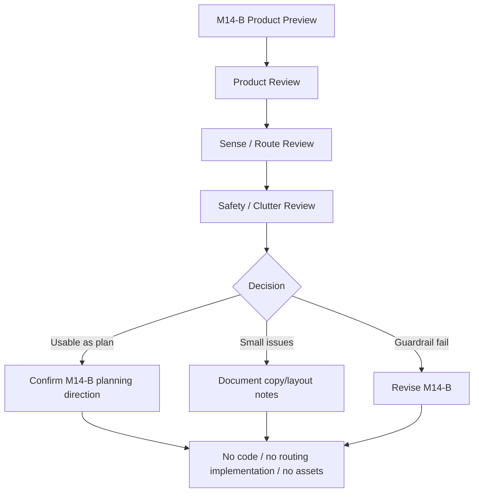

# M14-B2: Word-to-Island Product Preview Visual Review

Stand: 2026-06-06

Status: `Review gestartet / M14-B als Product-Preview-Plan grundsaetzlich bestaetigt`

## 1. Ziel

Dieses Dokument prueft den M14-B Product-Preview-Plan visuell und inhaltlich.
Es bewertet, ob Word-to-Island als produktnahe, aber weiterhin nicht finale
Vorschlags-UX verstaendlich, mobil plausibel, guardrail-konform und nicht zu
technisch wirkt.

M14-B2 ist nur Review. Es ist keine finale Word-to-Island-UI, keine App-
Integration, keine Implementierung, keine finale Routing-Datenstruktur, keine
Runtime-Konfiguration und keine automatische Wortplatzierung.

Visualisierung erfolgt nur dokumentarisch:

- ASCII-Review-Overlays,
- ASCII-Mobile-Frames,
- ASCII-State-Review-Skizzen,
- Mermaid-Flows,
- Markdown-Tabellen,
- Product-/Device-/Accessibility-Review-Checklisten.

Es werden keine PNGs, keine Spielassets und keine Asset-Dateien erzeugt.

## 2. Gepruefte Grundlage

Geprueft wurde:

- `docs/world_design/299-word-to-island-product-preview-plan.md`,
- Wort wurde gelernt oder importiert,
- Vorschlagskarte mit ThemeIsland + Depth,
- mehrdeutiges Wort mit Sense-Auswahl,
- kleines Objekt mit Container-Hinweis,
- Gebaeudeteil mit Blueprint-Hinweis,
- sensibler/abstrakter Begriff mit Codex/ContextCard-Route,
- blockierter Fall,
- Product-Copy-Regeln,
- Product-State-Regeln,
- Device-/Accessibility-Regeln,
- Stop-Regeln aus M14-B.

Nicht geprueft:

- keine echte App-UI,
- keine echten Device-Screenshots,
- keine PNG-Preview,
- keine Asset-Dateien,
- keine Routing-Datenstruktur,
- keine Runtime-Konfiguration,
- keine Implementierung.

## 3. Visuelle Und Produktnahe Pruefung

| Prueffrage | Bewertung | Hinweis |
| --- | --- | --- |
| Wirkt der Flow kurz genug? | bestanden | Word received, Sense, Suggestion, User Choice und Fallbacks bleiben als kurzer Flow lesbar. |
| Wird klar, dass Talvori nur einen Vorschlag macht? | bestanden | "Ich habe einen Vorschlag" und "du entscheidest" setzen die richtige Rolle. |
| Wird klar, dass der Nutzer entscheidet? | bestanden | Bestaetigen, aendern, Codex und spaeter bleiben sichtbar. |
| Wird keine automatische Wortplatzierung suggeriert? | bestanden | "merken" und Planning State ersetzen Platzierungs-Copy. |
| Wird keine finale Routing-Datenstruktur suggeriert? | bestanden | Die gute Preview nutzt keine IDs oder Enums; der blockierte Fall markiert Technikflut. |
| Wird keine Runtime-Konfiguration suggeriert? | bestanden | Runtime wird nur im blockierten Negativfall genannt. |
| Bleiben Texte in Karten/Rahmen/Panels? | bestanden fuer ASCII | Die Previews sind knapp; spaetere Visual Preview muss echten Textfit pruefen. |
| Sind die Karten nicht zu textlastig? | bestanden mit Beobachtung | Vorschlagskarte ist an der oberen Grenze, aber noch lesbar. |
| Funktioniert der Small-Phone-Ansatz? | bestanden | Stack und klare Actions sind plausibel. Echte Device-Pruefung bleibt offen. |
| Ist "Spaeter entscheiden" sichtbar und ruhig genug? | bestanden | Spaeter ist in den zentralen States erreichbar und nicht als Verlust formuliert. |
| Ist "Nur Codex" als sicherer Fallback verstaendlich? | bestanden | Codex wird als normaler, sicherer Weg gezeigt. |
| Ist "Blueprint" verstaendlich, ohne Bauzustand zu suggerieren? | bestanden mit Beobachtung | "Blueprint vormerken" ist brauchbar, braucht spaeter ggf. einfache Erklaerung. |
| Werden Kleinteile aus IslandView herausgehalten? | bestanden | Pencil/Federmappe und "nicht dauerhaft auf Insel" sind klar. |
| Werden sensible/abstrakte Begriffe neutral behandelt? | bestanden | Illness/freedom/law/memory fuehren zu Codex/ContextCard/Backlog. |
| Erklaert Tali/Vori kurz, ohne zu entscheiden? | bestanden | Tali/Vori fuehrt ein, trifft aber keine finale Entscheidung. |
| Gibt es keine Premium-/Paywall-Suggestion? | bestanden | Premium erscheint nur im blockierten Negativfall. |
| Gibt es keine `frame_started`- oder Bauzustandsableitung? | bestanden | Window/door/roof bleiben Blueprint, kein Bauzustand. |

Review-Fazit:

M14-B ist als Product-Preview-Plan grundsaetzlich brauchbar. Der Flow schafft
eine klare Vorschlagslogik: Wort kommt an, Talvori schlaegt vor, der Nutzer
entscheidet, und das Ergebnis bleibt Planning State, Codex, Blueprint oder
Backlog. Es gibt keine aktuelle Code-, Asset-, UI-, Routing-, Runtime-,
Platzierungs- oder `frame_started`-Freigabe.

## 4. Beispielpfade Review

### 4.1 Direkt Passend

Beispiele: `apple`, `book`, `chair`

| Wort | Review | Risiko | Guardrail-Bewertung |
| --- | --- | --- | --- |
| apple | Vorschlag Garten/Essen/Einkauf ist verstaendlich. | Multi-home koennte final wirken. | "aendern", "Codex" und "spaeter" halten es offen. |
| book | Schule/Zuhause mit Regal/Tisch ist plausibel. | Koennte als sichtbares Inselobjekt missverstanden werden. | Depth-Hinweis und Codex-Fallback reichen fuer den Planungsstand. |
| chair | Raum/Interior-Logik ist nachvollziehbar. | Sichtbarkeit braucht passende Szene. | Blueprint/Route merken statt Platzierung ist richtig. |

Direkt-passend-Fazit:

Die Vorschlaege sind produktnah verstaendlich. Wichtig bleibt, dass "direkt
passend" nie "automatisch sichtbar platziert" bedeutet.

### 4.2 Mehrdeutig

Beispiele: `bank`, `mouse`, `spring`

| Wort | Review | Risiko | Guardrail-Bewertung |
| --- | --- | --- | --- |
| bank | Sense-Auswahl Sitzbank/Geldinstitut ist klar. | Ufer-Sense koennte als dritte Option fehlen. | Fuer Product Preview reichen 2 bis 3 Optionen; Kontext darf spaeter ergaenzen. |
| mouse | Tier/Computermaus ist ein guter Digital-vs-Natur-Fall. | Technik/Digital koennte System-Gate brauchen. | Digital-/Technik-Gate ist genannt. |
| spring | Jahreszeit/Quelle/springen zeigt Wortarten-Mix. | Drei Bedeutungen koennen mobil eng werden. | Nur wenige Optionen gleichzeitig zeigen. |

Mehrdeutig-Fazit:

Sense-Auswahl ist ausreichend und nicht zu technisch. Keine automatische
Bedeutung wird suggeriert.

### 4.3 Kleinteil / Container

Beispiele: `pencil`, `spoon`, `key`, `seed`

| Wort | Review | Risiko | Guardrail-Bewertung |
| --- | --- | --- | --- |
| pencil | Schule -> Federmappe ist sehr klar. | viele Stifte/Kleinteile koennen Clutter erzeugen. | Container/Depth-Hinweis ausreichend. |
| spoon | Kuechenschublade ist plausibel. | Zuhause/Essen-Multi-home kann offen bleiben. | nicht auf Inseloberflaeche ist klar. |
| key | Kiste/Schublade/Detail passt. | kleines Tap-Ziel. | Tap-/Clutter-Risiko wird genannt. |
| seed | Gartenroute ist plausibel. | Growth-/Timer-Erwartung. | keine Growth-/Timer-Ableitung ist klar. |

Kleinteil-Fazit:

Container/Depth ist verstaendlich. IslandView-Platzierung bleibt sauber
blockiert, Tap-/Clutter-Risiko ist ausreichend sichtbar.

### 4.4 Gebaeudeteil / Blueprint

Beispiele: `window`, `door`, `roof`

| Wort | Review | Risiko | Guardrail-Bewertung |
| --- | --- | --- | --- |
| window | Blueprint-Hinweis ist gut verstaendlich. | Blueprint kann wie Bauauftrag wirken. | "vormerken" und "kein Bauzustand" muessen sichtbar bleiben. |
| door | Blueprint statt Bauzustand ist passend. | wirkt schnell wie Gebaeude-Update. | kein automatischer Bauzustand ist dokumentiert. |
| roof | `frame_started`-Blockade ist klar. | Rohbau-Ableitung. | Stop-Regel ist ausreichend. |

Blueprint-Fazit:

Blueprint ist als sicherer Zwischenweg brauchbar, aber spaeter muss die Copy
noch einfacher erklaeren: vormerken, nicht bauen.

### 4.5 Sensibel / Abstrakt

Beispiele: `illness`, `law`, `freedom`, `memory`

| Wort | Review | Risiko | Guardrail-Bewertung |
| --- | --- | --- | --- |
| illness | Codex/ContextCard ist neutral. | Gesundheitsberatung oder Dramatisierung. | keine sichtbare Visualisierung ist klar. |
| law | Codex/ContextCard passt. | Gericht-/Polizei-Ableitung. | keine Institutionen-Ableitung ist klar. |
| freedom | Codex/ContextCard/Dialog ist geeignet. | pauschale Symbolik. | keine Symbolpflicht ist klar. |
| memory | Codex/Satzkontext ist ruhig. | Pflichtobjekt oder emotionaler Druck. | kein Pflichtobjekt ist ausreichend. |

Sensibel-/Abstrakt-Fazit:

Die Behandlung bleibt neutral genug. Es wird keine sichtbare Visualisierung,
keine Dramatisierung und kein Beratungsversprechen suggeriert.

## 5. Copy-Regeln Review

Die erlaubten Formulierungen aus M14-B sind kurz, freundlich und
entscheidungsoffen. Sie nutzen Vorschlagssprache statt Platzierungssprache.

Die blockierten Formulierungen sind fuer den aktuellen Stand gut. Fuer spaetere
Product Previews sollten zusaetzlich diese problematischen Muster blockiert
bleiben:

| Copy | Status | Begruendung | Alternative |
| --- | --- | --- | --- |
| "Ich weiss, wohin das Wort gehoert." | blockiert | Tali/Vori entscheidet zu stark. | "Ich habe einen Vorschlag." |
| "Wir speichern die Route jetzt." | blockiert | klingt nach Runtime-/Persistenzfreigabe. | "Der Vorschlag kann vorgemerkt werden." |
| "Dein Wort erscheint gleich in der Welt." | blockiert | suggeriert automatische Platzierung. | "Du kannst spaeter entscheiden." |
| "Blueprint erstellt." | blockiert | klingt wie Bauauftrag oder Datenobjekt. | "Als Blueprint vormerken." |
| "Nur Codex, weil es nicht passt." | blockiert | Codex wirkt wie Verlust. | "Codex ist ein sicherer Ort dafuer." |
| "Das ist ein Problemwort." | blockiert | dramatisiert sensible Inhalte. | "Dieses Wort braucht Kontext." |

Copy-Review-Fazit:

- Vorschlagssprache funktioniert.
- "Nur Codex" muss positiv bleiben.
- "Blueprint" braucht immer "vormerken" oder "spaeter".
- Keine technische Begriffe wie IDs, Slots, Runtime, Object Type oder
  Route-ID in Nutzeransicht.
- Keine Premium-/Paywall-Sprache.

## 6. Product-State-Regeln Review

| Product State | Review | Risiko | Entscheidung |
| --- | --- | --- | --- |
| `word_received` | klarer Einstieg | wirkt wie Auto-Platzierung | Vorschlagssprache beibehalten |
| `context_needed` | wichtig fuer Sicherheit | kann zu viel Nachfrage erzeugen | wenige Optionen zeigen |
| `sense_selected` | ausreichend fuer Mehrdeutigkeit | klingt final | danach nur Vorschlag zeigen |
| `suggestion_ready` | brauchbarer Zwischenzustand | Routing-Datenstruktur wird angenommen | keine technische Sprache |
| `suggestion_focused` | erklaert Vorschlag | wirkt wie Empfehlungspflicht | Aendern/Codex/Spaeter sichtbar |
| `suggestion_confirmed` | planerisch sinnvoll | kann finale Platzierung suggerieren | "vorgemerkt" statt "platziert" |
| `route_changed` | Nutzerkontrolle sichtbar | Entscheidungsflut | wenige Alternativen |
| `codex_only` | sicherer Fallback | wirkt wie Verlust | positiv formulieren |
| `blueprint_candidate` | guter Zustand fuer Gebaeudeteile | wirkt wie Bauzustand | "vormerken" und "spaeter" |
| `later_backlog` | reduziert Druck | wirkt wie Nachteil | neutraler Safe Exit |
| `blocked_by_policy` | Safety-Fallback sichtbar | kann dramatisieren | ruhig zu Codex/ContextCard |
| `planning_state_set` | nuetzlich als Reviewbegriff | Persistenzfreigabe wird angenommen | keine Runtime-State-Definition |

Klarstellung:

- Product States sind keine Runtime-State-Definition.
- `planning_state_set` ist keine Persistenzfreigabe.
- `suggestion_confirmed` ist keine finale Platzierung.
- `blueprint_candidate` ist kein Bauzustand.
- `codex_only` ist kein Verlust.
- `blocked_by_policy` fuehrt zu neutralem Fallback, nicht zu Implementierung.

## 7. Textuelle Review-Visualisierungen

### 7.1 Mermaid Review Flow



### 7.2 ASCII Review Overlay

```text
+--------------------------------+
| WORD ZONE                      |
| apple / Apfel                  |
|--------------------------------|
| SUGGESTION ZONE                |
| Lernfokus: Garten / Essen      |
| Naeherer Ort: Beet / Korb      |
| Sichtbar: spaeter im Detail    |
|--------------------------------|
| USER CHOICE ZONE               |
| [ Vorschlag merken ]           |
| [ Aendern ]                    |
|--------------------------------|
| FALLBACK ZONE                  |
| [ Nur Codex ] [ Spaeter ]      |
|--------------------------------|
| GUARDRAIL TEXT                 |
| Vorschlag, keine Platzierung   |
+--------------------------------+
```

Review-Notizen:

- Word Zone bleibt kurz.
- Suggestion Zone nutzt nutzernahe Sprache.
- User Choice Zone steht vor Fallbacks, aber Fallbacks bleiben sichtbar.
- Guardrail Text verhindert finale Platzierungslesart.

### 7.3 Preview State / Review Result / Risk / Required Adjustment

| Preview State | Review Result | Risk | Required Adjustment |
| --- | --- | --- | --- |
| Word received | brauchbar | Auto-Platzierung wird angenommen | "Vorschlag" sichtbar halten |
| Suggestion card | brauchbar | zu viel Text | spaeter Text kuerzen |
| Sense selection | brauchbar | zu viele Bedeutungen | 2 bis 3 Optionen |
| Container hint | stark | Container wirkt wie Implementierung | "spaeter" und "merken" nutzen |
| Blueprint hint | brauchbar | Blueprint wirkt wie Bauauftrag | "kein Bauzustand" sichtbar |
| Sensitive route | stark | Codex wirkt wie Ausschluss | Codex positiv rahmen |
| Blocked case | wichtig | Technikbegriffe koennten irritieren | klar als blockiert markieren |

### 7.4 Good / Needs Adjustment / Blocked

| Good | Needs Adjustment | Blocked |
| --- | --- | --- |
| Vorschlag statt Platzierung | Vorschlagskarte spaeter kuerzen | automatische Platzierung |
| Nutzer entscheidet | Blueprint einfacher erklaeren | finale Routing-Datenstruktur |
| Sense-Auswahl bei Mehrdeutigkeit | Sense-Optionen begrenzen | Tali/Vori entscheidet |
| Container statt IslandView | Codex positiv rahmen | Kleinteile in IslandView |
| Codex/ContextCard fuer sensible Begriffe | "Planning State" nicht nutzernah zeigen | sichtbare sensible Visualisierung |
| Spaeter entscheiden sichtbar | echte Small-Phone-Pruefung bleibt offen | Runtime-/Code-/Asset-Freigabe |

### 7.5 Word Type / Review Result / Main Guardrail

| Word Type | Review Result | Main Guardrail |
| --- | --- | --- |
| direkt passend | brauchbar | keine finale Platzierung |
| mehrdeutig | brauchbar | Sense-Auswahl vor Route |
| Kleinteil | stark | Container/Depth statt IslandView |
| Gebaeudeteil | brauchbar | Blueprint, kein Bauzustand |
| Verb/Aktion | planbar | kein statisches Objekt |
| abstrakt | brauchbar | Codex/ContextCard |
| sensibel | brauchbar | neutral, optional, nicht sichtbar |

### 7.6 Darf Aus M14-B2 Code Entstehen?

```text
Ist M14-B2 ein Review?
  |
  +-- Ja -> keine Codefreigabe
          |
          v
     Gibt es finale Routing-Datenstruktur?
          |
          +-- Nein -> keine Implementierung
                  |
                  v
             Gibt es App-/Asset-/Runtime-Gate?
                  |
                  +-- Nein -> keine App, keine Assets, keine Runtime
```

## 8. Risiken Und Harte Blocker

Harte Blocker:

- Review wird als finale UI-Freigabe gelesen.
- Product Preview wirkt wie App-Screen statt Planungsreview.
- UX suggeriert automatische Platzierung.
- Vorschlag wirkt endgueltig.
- Tali/Vori entscheidet statt Nutzer.
- Mehrdeutige Woerter werden ohne Sense-Auswahl geroutet.
- Kleinteile werden direkt in IslandView gedrueckt.
- Gebaeudeteile erzeugen Bauzustaende.
- Sensible Begriffe werden sichtbar visualisiert.
- Technische Labels ueberfordern Nutzer.
- "Spaeter entscheiden" fehlt.
- "Nur Codex" wirkt wie Verlust.
- Blueprint wirkt wie Bauauftrag.
- Premium-/Paywall-Hinweis erscheint.
- Product State wird als Runtime-Konfiguration gelesen.
- Review erzeugt Code-, Asset- oder App-Freigabe.

## 9. Entscheidungsempfehlung

Optionen:

1. M14-B als Product-Preview-Plan bestaetigen.
2. M14-B mit kleinen Nachbesserungen bestaetigen.
3. M14-B erneut nachbessern.
4. M14-B blockieren, weil zu final oder zu riskant.

Empfehlung:

M14-B grundsaetzlich als Product-Preview-Plan bestaetigen.

Kleine Hinweise fuer spaetere Preview-Bloecke:

- Vorschlagskarten spaeter kuerzen, wenn sie auf Small Phone zu dicht wirken.
- Blueprint immer als "vormerken" und nicht als "bauen" erklaeren.
- Codex positiv rahmen, nicht als Verlust oder Ausschluss.
- Sense-Auswahl auf wenige Optionen begrenzen.
- "Planning State" nur intern verwenden, nicht als Nutzerbegriff.

Naechster moeglicher Schritt:

- M14-C Container QA Product Preview Plan,
- oder M14-B3 Visual Product Preview Plan, falls vor M14-C eine weitere
  Word-to-Island-Visualisierung gewuenscht ist.

Keine Freigabe:

- keine Codefreigabe,
- keine App-Integration,
- keine finale UI,
- keine Assetfreigabe,
- keine Runtime-Konfiguration,
- keine automatische Wortplatzierung,
- kein `frame_started`.

## 10. Stop-Regeln

- Keine finale Word-to-Island-UI aus M14-B2.
- Keine Word-to-Island-Implementierung aus M14-B2.
- Keine finale Routing-Datenstruktur aus M14-B2.
- Keine Runtime-Konfiguration aus M14-B2.
- Keine automatische Wortplatzierung aus M14-B2.
- Keine App-Integration aus M14-B2.
- Keine Codefreigabe aus M14-B2.
- Keine Implementierungsfreigabe aus M14-B2.
- Keine Assetfreigabe aus M14-B2.
- Keine PNG-Erzeugung aus M14-B2.
- Keine Tests aus M14-B2.
- Keine Spielassets aus M14-B2.
- Kein `frame_started` oder Bauzustand aus M14-B2.

## 11. Review-Fazit

M14-B2 bestaetigt M14-B als brauchbare Product-Preview-Planungsrichtung.
Word-to-Island wirkt als Vorschlags-UX verstaendlich, weil Talvori nur
erklaert, der Nutzer entscheidet und Fallbacks wie Codex, Blueprint und Backlog
sichtbar bleiben. Die wichtigsten Guardrails gegen automatische Platzierung,
Routing-Implementierung, finale Datenstruktur, Runtime-Konfiguration,
Kleinteile in IslandView, Bauzustandsableitung, sensible Visualisierung und
`frame_started` sind dokumentiert.

Der Review oeffnet keine App-, Code-, Asset-, UI-, Routing-Datenstruktur-,
Runtime-, automatische Platzierungs- oder `frame_started`-Freigabe.
