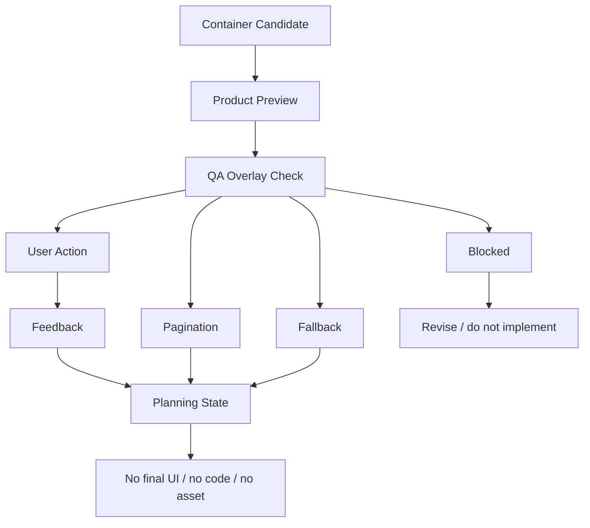

# M14-C: Container QA Product Preview Plan

Stand: 2026-06-06

Status: `Product-Preview-Plan gestartet / keine Container-Freigabe`

## 1. Ziel

Dieses Dokument plant eine erste produktnahe, aber weiterhin nicht finale
Product-Preview-Richtung fuer Container QA. Es zeigt, wie `ContainerOpenView`,
`DetailInteractionView` und kleine Objektgruppen spaeter als Lernmoment
geprueft werden koennen, ohne Inventarlisten, Clutter, zu kleine Tap-Ziele
oder finale UI-/Implementierungsfreigabe zu erzeugen.

M14-C ist nur Product-Preview- und QA-Planung. Es ist keine finale
`ContainerOpenView`-UI, keine finale `DetailInteractionView`-UI, keine
Container-Implementierung, keine finale Datenstruktur, keine
Runtime-Konfiguration und keine App-/Assetfreigabe.

Visualisierung erfolgt nur dokumentarisch:

- ASCII-Product-Wireframes,
- ASCII-QA-Overlays,
- ASCII-Mobile-Frames,
- Mermaid-Flows,
- Markdown-Tabellen,
- Product-/Device-/Accessibility-/QA-Checklisten.

Es werden keine PNGs, keine Spielassets und keine Asset-Dateien erzeugt.

## 2. Product-Ziel

Container sollen spaeter kleine Lernobjekte sinnvoll fokussieren, ohne
Talvori in eine Inventarverwaltung zu verwandeln.

Klare Zielaussagen:

- Container sind Lernmomente, keine Inventarlisten.
- Kleine Objekte werden nicht dauerhaft in IslandView platziert.
- Container zeigen wenige relevante Fokusobjekte.
- Nutzer erkennt, was er tun soll.
- Tap-Zonen bleiben gross und getrennt.
- Labels bleiben kurz und verdecken keine Objekte.
- Pagination erscheint nur, wenn noetig.
- Tali/Vori erklaert kurz, verdeckt aber nichts.
- QA-Overlay ist Debug-/Review-Material, keine Nutzer-UI.
- Kein Asset, kein Bauzustand, kein `frame_started`.

Product-Ton:

- fokussiert,
- ruhig,
- lernmomentnah,
- nicht inventarartig,
- nicht technisch,
- mit klarer Hauptaktion.

Nicht-Ziel:

- keine finale ContainerOpenView-UI,
- keine finale DetailInteractionView-UI,
- keine Container-Implementierung,
- keine finale Datenstruktur,
- keine Runtime-Konfiguration,
- keine App-Integration,
- kein Code.

## 3. Product-Flow

Der Flow soll kurz bleiben und keine technische Label-Flut erzeugen.

1. Container candidate / kleines Objekt braucht Detailort.
2. ContainerOpenView preview.
3. Fokusobjekt sichtbar.
4. Mini-Lernmoment / Auswahl.
5. Feedback / kurzer Reward Moment.
6. Optional: naechste Seite / Pagination.
7. Fallback: Codex / Blueprint / Backlog.
8. QA decision: pass / adjust / blocked.
9. Ergebnis: Planning State, keine finale UI.

Wichtig:

- Keine Inventarliste.
- Keine dauerhaften TinyObjects in IslandView.
- Keine ueberladene Grid-Ansicht.
- Keine technischen QA-Labels in Nutzeransicht.
- Keine finale UI, keine Runtime-Konfiguration und kein Code.

## 4. ASCII-Product-Previews

Die folgenden Previews sind Produkt-Planungsskizzen. Sie sind keine finale UI
und duerfen nicht als App-Screen, Asset oder Implementierungsauftrag gelesen
werden.

### 4.1 Gute ContainerOpenView Als Product Preview

```text
+--------------------------------+
| Federmappe                     |
|                                |
|  Tali/Vori: Schau dir wenige   |
|  Dinge genauer an.             |
|                                |
| +----------------------------+ |
| | Fokus: Bleistift           | |
| | [ grosse Tap-Zone ]        | |
| +----------------------------+ |
|                                |
| [ Radiergummi ]   [ Lineal ]   |
|                                |
|       [ Passendes Objekt ]     |
|       [ Nur Codex ]            |
+--------------------------------+
```

Product-Notizen:

- Ein Fokusobjekt ist klar.
- Zwei Sekundaerobjekte reichen fuer eine Mini-Auswahl.
- Labels sind kurz.
- Keine Inventarliste.

### 4.2 DetailInteractionView Mit Einem Fokusobjekt

```text
+--------------------------------+
| Detailansicht                  |
|                                |
|       +----------------+       |
|       |    Kompass     |       |
|       |  Fokusobjekt   |       |
|       +----------------+       |
|                                |
|  Waehle, was du gehoert hast.  |
|                                |
| [ Kompass ] [ Karte ] [ Seil ] |
|                                |
|       [ Bestaetigen ]          |
|       [ Spaeter ]              |
+--------------------------------+
```

Product-Notizen:

- Ein Hauptobjekt dominiert.
- Vergleichsobjekte sind wenige und tappbar.
- Aufgabe und Buttons verdecken nichts.
- Hafen/Bootskiste bleibt spaeter riskanter und braucht eigene Mobile-Pruefung.

### 4.3 Schule / Federmappe

```text
+--------------------------------+
| Schule / Federmappe            |
|                                |
|  Finde das passende Ding.      |
|                                |
| +---------+ +---------+        |
| | pencil  | | eraser  |        |
| | tap     | | tap     |        |
| +---------+ +---------+        |
|                                |
| +---------+                    |
| | ruler   |                    |
| | tap     |                    |
| +---------+                    |
|                                |
| [ Bleistift waehlen ] [ Codex ]|
+--------------------------------+
```

Product-Notizen:

- Drei Objekte sind fuer Small Phone plausibel.
- Kein Stiftehaufen, keine Labelwolke.
- Federmappe bleibt Container-Preview, keine finale Container-UI.

### 4.4 Zuhause / Kuechenschublade

```text
+--------------------------------+
| Kuechenschublade               |
|                                |
|  Waehle den Loeffel.           |
|                                |
| +---------+ +---------+        |
| | spoon   | | fork    |        |
| | tap     | | tap     |        |
| +---------+ +---------+        |
|                                |
| +---------+                    |
| | knife   |                    |
| | tap     |                    |
| +---------+                    |
|                                |
| [ Auswahl pruefen ] [ Spaeter ]|
+--------------------------------+
```

Product-Notizen:

- Fokusobjekte statt Besteck-Inventar.
- `knife` wird neutral behandelt, nicht dramatisiert.
- Labels bleiben innerhalb der Objektzonen.
- Keine Sicherheitsberatung, keine Warnsymbolik, keine Assetfreigabe.

### 4.5 Garten / Beet

```text
+--------------------------------+
| Garten / Beet                  |
|                                |
|  Naturwoerter im Detail.       |
|                                |
| +---------+ +---------+        |
| | seed    | | can     |        |
| | tap     | | tap     |        |
| +---------+ +---------+        |
|                                |
| +---------+                    |
| | plant   |                    |
| | tap     |                    |
| +---------+                    |
|                                |
| [ Objekt waehlen ] [ Codex ]   |
+--------------------------------+
```

Product-Notizen:

- Naturfokus bleibt ruhig.
- Keine Timer-, Growth- oder Pflegepflicht.
- `seed` ist klein und braucht Detail/Container-Logik.
- Sichtbare Pflanzenanzahl bleibt begrenzt.

### 4.6 Pagination-Fall Mit Mehr Objekten

```text
+--------------------------------+
| Werkzeugkiste                  |
|                                |
| Seite 1 von 3                  |
|                                |
| +---------+ +---------+        |
| | hammer  | | screw   |        |
| | tap     | | tap     |        |
| +---------+ +---------+        |
|                                |
| +---------+                    |
| | pliers  |                    |
| | tap     |                    |
| +---------+                    |
|                                |
|  6 weitere Woerter warten.     |
| [ Zurueck ]        [ Weiter ]  |
+--------------------------------+
```

Product-Notizen:

- Aktive Objekte bleiben begrenzt.
- Ueberlauf wird gezaehlt, aber nicht als Mini-Icons gezeigt.
- Pagination ist sichtbar, aber nicht dominant.
- Keine Endlosliste.

### 4.7 Blockierter Fall: Inventarliste / Clutter / Ueberdeckung

```text
+--------------------------------+
| Inventar: alle Objekte         |
| pen pencil eraser ruler clip   |
| spoon fork knife seed plant    |
| key screw rope map compass     |
| label label label label label  |
|                                |
|      [ Tali/Vori Bubble ]      |
|      verdeckt Buttons          |
|                                |
| [tap][tap][tap][tap][Premium]  |
+--------------------------------+
```

Blockiert, weil:

- Container wirkt wie Inventarverwaltung.
- Zu viele Kleinteile sind gleichzeitig sichtbar.
- Tap-Ziele sind zu klein und zu dicht.
- Labels bilden eine Labelwolke.
- Tali/Vori verdeckt Interaktion.
- Premium-Druck erscheint.
- QA-Overlay und Nutzer-UI waeren vermischt.

## 5. QA-Overlay-Zonen

Diese Zonen sind textuelle QA-Planung. Sie sind Debug-/Review-Material, keine
Nutzer-UI.

| QA Zone | Zweck | Gute Auspraegung | Blocker | Hinweis fuer spaetere Preview |
| --- | --- | --- | --- | --- |
| Safe Area | Rand und Systembereiche schuetzen | Buttons und Fokus liegen nicht am Rand | Button oder Fokusobjekt klebt am Rand | zuerst Small Phone pruefen |
| Container Bounds | Container klar begrenzen | alle Objekte bleiben innerhalb der Flaeche | Objekte schweben ausserhalb | Bounds nur im QA-Overlay zeigen |
| Focus Object Zone | Lernziel hervorheben | ein Objekt ist deutlich zentraler | kein klares Zielobjekt | Fokus muss ohne Farbe erkennbar sein |
| Secondary Object Zone | Vergleichsobjekte ordnen | 2 bis 4 Objekte, klar getrennt | zu viele gleich wichtige Objekte | Distraktoren duerfen nicht dominieren |
| Label Zone | Texte lesbar halten | kurze Labels neben/unter Objekten | Label verdeckt Objekt oder Button | Labels nur bei Fokus/Challenge |
| Tap Target Zone | Touch-Ziele pruefen | grosse, getrennte Zonen | zu klein, zu dicht, ueberlappend | spaeter mit Device-Overlay pruefen |
| Primary Action Zone | Hauptaktion erreichbar halten | klarer Button oder klares Hauptziel | Primary fehlt oder ist verdeckt | nicht von Tali/Vori blockieren lassen |
| Pagination Zone | Ueberlauf loesen | Seite, Next/Back oder Hinweis | viele Objekte ohne Seitenlogik | nicht als Progressdruck formulieren |
| Tali/Vori Exclusion Zone | Companion-Ueberdeckung verhindern | Bubble oberhalb/ausserhalb aktiver Zonen | verdeckt Button oder Fokusobjekt | Exclusion Zone im QA-Overlay markieren |
| Overflow/Blocked Zone | nicht zeigbare Objekte schuetzen | Backlog/Codex-Hinweis statt Mini-Icons | Ueberlauf wird sichtbar hineingepresst | "weitere Woerter warten" reicht |

## 6. Produktnahe Beispielpfade

### 6.1 Schule / Federmappe

Objekte:

- `pencil`,
- `eraser`,
- `ruler`.

Warum tragfaehig:

- bekannte Schulobjekte,
- klare Containerlogik,
- drei Objekte reichen fuer Tap-Auswahl.

Mini-Lernmoment:

- "Waehle den Bleistift."
- Primaerobjekt: `pencil`.
- Vergleichsobjekte: `eraser`, `ruler`.

Clutter-Risiko:

- zu viele Stifte,
- zu viele kleine Schreibwaren,
- Labels ueber jedem Objekt,
- Federmappe wird Inventarliste.

QA-Guardrail:

- maximal wenige Objekte sichtbar,
- Fokusobjekt klar,
- Tap-Zonen gross,
- Codex/Backlog fuer uebrige Woerter.

### 6.2 Zuhause / Kuechenschublade

Objekte:

- `spoon`,
- `fork`,
- `knife`.

Warum tragfaehig:

- Besteck passt logisch in eine Schublade.
- Drei Objekte sind als Mini-Auswahl verstaendlich.
- Schublade schuetzt vor IslandView-Clutter.

Mini-Lernmoment:

- "Waehle den Loeffel."
- `spoon` als Fokus,
- `fork` und `knife` als Vergleich.

Safety-Hinweis bei `knife`:

- neutral behandeln,
- keine Dramatisierung,
- keine Sicherheitsberatung,
- kein Warn-Reward,
- bei sensiblerem Kontext Codex/ContextCard nutzen.

QA-Guardrail:

- Fokusobjekte statt Inventarliste,
- Labels kurz,
- Messer nicht als dramatisches Objekt hervorheben,
- keine App-/Assetfreigabe.

### 6.3 Garten / Beet

Objekte:

- `seed`,
- `watering can`,
- `plant`.

Warum tragfaehig:

- Naturfokus ist freundlich.
- `watering can` funktioniert als groesseres Fokusobjekt.
- `seed` und `plant` passen zu Garten/Beet, aber brauchen Detailtiefe.

Mini-Lernmoment:

- "Waehle die Giesskanne."
- oder "Welches Ding hilft beim Giessen?"

Blockiert:

- Timer,
- Pflegepflicht,
- Pflanzenverfall,
- Streak-Druck,
- "Pflanze leidet"-Wording.

QA-Guardrail:

- sichtbare Pflanzenanzahl begrenzen,
- keine Growth-/Timer-Ableitung,
- Backlog/Codex fuer weitere Pflanzenwoerter.

### 6.4 Hafen / Bootskiste

Objekte:

- `compass`,
- `map`,
- `rope`.

Warum spaeter wertvoll:

- gute Reise-/Hafen-Wortgruppe,
- klare Containerlogik,
- Kompass/Karte/Seil sind gut unterscheidbar.

Warum mobil riskanter:

- Hafen/Kueste ist visuell dichter,
- Water/Dock/Travel-Systeme koennen Systemkomplexitaet erzeugen,
- kleine Linien/Seile/Karten koennen auf Phone schwer lesbar sein.

QA-Guardrail:

- separate Mobile-Komplexitaetspruefung,
- keine Hafen-Assetableitung,
- keine Travel-/Water-Implementierung,
- erst nach Product-/Device-/Accessibility-Review weiter.

## 7. Product-Copy-Regeln

### 7.1 Copy-Tabelle

| Copy | Status | Begruendung | Alternative |
| --- | --- | --- | --- |
| "Schau dir wenige Dinge genauer an." | erlaubt | Fokus statt Inventar | beibehalten |
| "Waehle das passende Objekt." | erlaubt | klare Mini-Lernhandlung | beibehalten |
| "Das bleibt eine Detailansicht." | erlaubt | verhindert IslandView-Erwartung | beibehalten |
| "Mehr Dinge kommen spaeter." | erlaubt | erklaert Pagination/Backlog ruhig | "Weitere Woerter warten." |
| "Du kannst es im Codex behalten." | erlaubt | sicherer Fallback | beibehalten |
| "Diese Ansicht ist nur ein Vorschlag." | erlaubt | verhindert finale UI-Lesart | beibehalten |
| "Hier ist dein Inventar." | blockiert | macht Container zur Verwaltung | "Schau dir wenige Dinge genauer an." |
| "Alle Objekte muessen hier rein." | blockiert | erzwingt Ueberladung | "Mehr Dinge kommen spaeter." |
| "Tippe auf jedes kleine Ding." | blockiert | erzeugt TinyObject-Tap-Druck | "Waehle das passende Objekt." |
| "Deine Pflanze braucht taegliche Pflege." | blockiert | Growth-/Retention-Druck | "Naturwoerter im Detail." |
| "Dieses Messer ist gefaehrlich." | blockiert | dramatisiert und beratungsaehnlich | "Waehle den Loeffel." |
| "Premium fuer mehr Platz." | blockiert | Paywall-Druck | keine Premium-Erwaehnung |
| "Sonst verlierst du Fortschritt." | blockiert | Verlustangst | "Du kannst spaeter weitermachen." |

### 7.2 Ton-Regeln

Erlaubt:

- Fokus,
- wenige Dinge,
- ruhige Auswahl,
- positive Fallbacks,
- kurze Hinweise.

Blockiert:

- Inventarsprache,
- Vollstaendigkeitsdruck,
- TinyObject-Tap-Druck,
- Timer-/Growth-Druck,
- Dramatisierung,
- Premium-/Paywall-Sprache,
- Verlustangst.

## 8. Product-State-Regeln

Diese Zustaende sind Product-Preview-/QA-Zustaende, keine
Runtime-State-Definition.

| Product State | Bedeutung | Nutzeraktion / QA-Aktion | Nicht ableiten |
| --- | --- | --- | --- |
| `container_candidate` | Wort braucht Detailort | Container pruefen | keine automatische Platzierung |
| `container_preview_ready` | Container-Preview ist skizziert | View pruefen | keine finale UI |
| `focus_object_visible` | Hauptobjekt ist sichtbar | Fokus bewerten | keine Assetfreigabe |
| `object_selected` | Nutzer waehlt Objekt | Auswahl pruefen | keine Runtime-Aktion |
| `mini_challenge_active` | kurze Lernhandlung laeuft | Aufgabe loesen | keine Challenge-Implementierung |
| `feedback_visible` | kurzer Feedback-Moment | Feedback beurteilen | keine Reward-Implementierung |
| `pagination_needed` | Ueberlauf erkannt | Seite/Backlog planen | keine Endlosliste |
| `codex_fallback` | Codex statt Sichtbarkeit | speichern | kein Verlust |
| `blueprint_fallback` | spaeterer Ort/Bauzustand noetig | vormerken | kein Bauzustand |
| `backlog_later` | spaeter entscheiden | vertagen | kein Nachteil |
| `qa_passed` | QA-Regeln passen im Plan | Review notieren | keine Implementierungsfreigabe |
| `qa_needs_adjustment` | Layout/Copy muss nachbessern | Plan anpassen | kein Code |
| `qa_blocked` | Guardrail verletzt | blockieren | keine Umsetzung |
| `planning_state_set` | Ergebnis nur planerisch | spaeter reviewen | keine Persistenzfreigabe |

## 9. Device-/Accessibility-Regeln

Planungsregeln fuer M14-C:

- Small Phone zuerst.
- Portrait bleibt Primaermodus.
- Maximal wenige Fokusobjekte sichtbar.
- Objektanzahl klar begrenzen.
- Tap-Zonen gross und getrennt.
- Auswahl nicht nur farbcodiert zeigen.
- Labels kurz und nicht ueber Objekten.
- Tali/Vori nicht ueber Buttons oder Fokusobjekten.
- Kein Audio-only-Hinweis.
- Reduzierte Bewegung spaeter ermoeglichen.
- Pagination sichtbar, aber nicht dominant.
- Keine technischen internen QA-Labels in Nutzeransicht.

Device-Checkliste fuer spaetere visuelle Product Preview:

| Check | Erwartung | Blocker |
| --- | --- | --- |
| Small Phone Fit | Container plus Actions bleiben lesbar | Buttons oder Objekte abgeschnitten |
| Object Count | 3 bis 5 relevante Objekte | Mini-Inventar |
| Tap-Zonen | gross, getrennt, eindeutig | zu klein oder ueberlappend |
| Labels | kurz, nicht verdeckend | Labelwolke |
| Tali/Vori | kurze Erklaerung ausserhalb aktiver Zonen | Bubble verdeckt Fokus/Button |
| Pagination | sichtbar bei Ueberlauf | Ueberlauf ohne Seitenlogik |
| Accessibility | nicht nur Farbe, kein Audio-only | Bedeutung nur ueber Farbe/Ton |
| QA Overlay | nur Review/Debug | wird als Nutzer-UI gelesen |

## 10. Textuelle Visualisierung

### 10.1 Product-/QA-Flow



### 10.2 Product State / Purpose / Primary Action / Risk / Guardrail

| Product State | Purpose | Primary Action | Risk | Guardrail |
| --- | --- | --- | --- | --- |
| Container candidate | Detailort statt IslandView | Container pruefen | automatische Platzierung | nur Vorschlag |
| Container preview ready | Lernmoment skizzieren | Fokus ansehen | finale UI-Lesart | Planung markieren |
| Focus object visible | Zielobjekt klar machen | Objekt waehlen | kein Fokus | Fokuszone |
| Mini challenge active | Lernhandlung starten | passende Auswahl | Challenge-Implementierung | Preview-only |
| Feedback visible | kurzer Abschluss | weiter | Reward-System | kein Reward-Gate |
| Pagination needed | Ueberlauf loesen | weiter/zurueck | Inventarliste | wenige Objekte pro Seite |
| Fallback | Codex/Blueprint/Backlog | speichern/vormerken | Verlustgefuehl | positiv formulieren |
| QA blocked | Guardrail verletzt | nachbessern | trotzdem bauen | blockieren |

### 10.3 QA Zone / Purpose / Good / Blocker

| QA Zone | Purpose | Good | Blocker |
| --- | --- | --- | --- |
| Safe Area | Rand schuetzen | Buttons/Fokus mit Abstand | Randkollision |
| Container Bounds | Inhalt begrenzen | klare Flaeche | schwebende Objekte |
| Focus Object Zone | Lernziel zeigen | ein klares Hauptobjekt | kein Fokus |
| Secondary Object Zone | Vergleich ordnen | wenige Distraktoren | zu viele Kleinteile |
| Label Zone | Lesbarkeit | kurze Labels | Labelwolke |
| Tap Target Zone | Bedienbarkeit | getrennte grosse Ziele | zu klein/zu dicht |
| Primary Action Zone | Hauptaktion | klarer Button | verdeckt/unklar |
| Pagination Zone | Ueberlauf | Seite/Weiter | keine Seitenlogik |
| Tali/Vori Exclusion | Ueberdeckung verhindern | Bubble ausserhalb | verdeckt Fokus/Button |
| Overflow/Blocked | Clutter stoppen | Backlog/Codex | Mini-Icon-Masse |

### 10.4 Example / Object Count / Product Route / QA Risk / Guardrail

| Example | Object Count | Product Route | QA Risk | Guardrail |
| --- | --- | --- | --- | --- |
| Federmappe | 3 | ContainerOpenView | Kleinteile/Labels | Fokus + 2 Distraktoren |
| Kuechenschublade | 3 | ContainerOpenView | Knife-Dramatisierung | neutral, kein Inventar |
| Garten/Beet | 3 | Detail/Container | Growth-Erwartung | keine Timer/Pflegepflicht |
| Bootskiste | 3 | Container spaeter | Mobile-Komplexitaet | separate Pruefung |
| Werkzeugkiste | 3 pro Seite | Pagination | zu viele Miniobjekte | Backlog zaehlen |

### 10.5 Good / Blocked Fuer Container QA Product Preview

| Good | Blocked |
| --- | --- |
| wenige Fokusobjekte | Inventarliste |
| Container als Lernmoment | alle Objekte muessen rein |
| grosse getrennte Tap-Zonen | Mini-Tap-Ziele |
| kurze Labels | Labelwolke |
| Pagination bei Ueberlauf | endlose Grid-Liste |
| Tali/Vori ausserhalb aktiver Zonen | Companion verdeckt Buttons |
| Codex/Blueprint/Backlog als Fallback | Ueberlauf als Mini-Icons |
| Product Preview bleibt Planung | finale UI, Code oder Asset-Freigabe |

## 11. Risiken Und Harte Blocker

Harte Blocker:

- Product Preview wirkt wie finale Container-UI.
- Container wirkt wie Inventarverwaltung.
- Zu viele Kleinteile gleichzeitig sichtbar.
- Tap-Zonen zu klein oder zu dicht.
- Labels verdecken Objekte.
- Deko verdeckt Lernobjekte.
- Pagination fehlt trotz Objektueberlauf.
- Tali/Vori verdeckt Buttons oder Fokusobjekte.
- QA-Overlay wird als Nutzer-UI gelesen.
- SensitiveSmallObjects ohne M13-G/M14-B2.
- Growth/Timer-Objekte ohne M13-H.
- Premium-/Paywall-Hinweis erscheint.
- Product State wird als Runtime-Konfiguration gelesen.
- Flow erzeugt Code-, Asset- oder App-Freigabe.

## 12. Entscheidungsempfehlung

Optionen:

1. Product-Preview-Plan als Grundlage fuer spaetere visuelle Product Preview
   brauchbar.
2. Mit kleinen Copy-/Layout-Nachbesserungen brauchbar.
3. Noch nicht brauchbar, erneut planen.
4. Blockieren, weil zu final oder zu riskant.

Empfehlung:

M14-C ist als Product-Preview-Plan grundsaetzlich brauchbar, wenn Clutter-,
Tap-Ziel-, Label- und Pagination-Gates strikt bleiben.

Naechster sinnvoller Schritt:

- M14-C2 Container QA Product Preview Visual Review, weiterhin ohne Code,
  ohne App-Integration, ohne Assets, ohne finale UI und ohne Runtime-
  Konfiguration.

Keine Freigabe:

- keine Codefreigabe,
- keine App-Integration,
- keine finale UI,
- keine Assetfreigabe,
- keine Runtime-Konfiguration,
- kein `frame_started`.

## 13. Stop-Regeln

- Keine finale ContainerOpenView-UI aus M14-C.
- Keine finale DetailInteractionView-UI aus M14-C.
- Keine Container-Implementierung aus M14-C.
- Keine finale Datenstruktur aus M14-C.
- Keine Runtime-Konfiguration aus M14-C.
- Keine App-Integration aus M14-C.
- Keine Codefreigabe aus M14-C.
- Keine Implementierungsfreigabe aus M14-C.
- Keine Assetfreigabe aus M14-C.
- Keine PNG-Erzeugung aus M14-C.
- Keine Tests aus M14-C.
- Keine Spielassets aus M14-C.
- Kein `frame_started` oder Bauzustand aus M14-C.

## 14. Review-Fazit

M14-C kann als erste produktnahe Planungsgrundlage fuer Container QA genutzt
werden. Der beste Kern bleibt: kleine Objekte brauchen einen fokussierten
Detailort, Container zeigen wenige relevante Objekte, QA-Zonen pruefen
Clutter, Tap-Ziele, Labels, Pagination und Tali/Vori-Ueberdeckung, und das
Ergebnis bleibt Planning State, Fallback oder Review-Entscheidung statt
finaler UI.

Der Plan macht Container QA greifbarer, oeffnet aber keine App-, Code-,
Asset-, UI-, Container-Implementierungs-, Datenstruktur-, Runtime- oder
`frame_started`-Freigabe.
