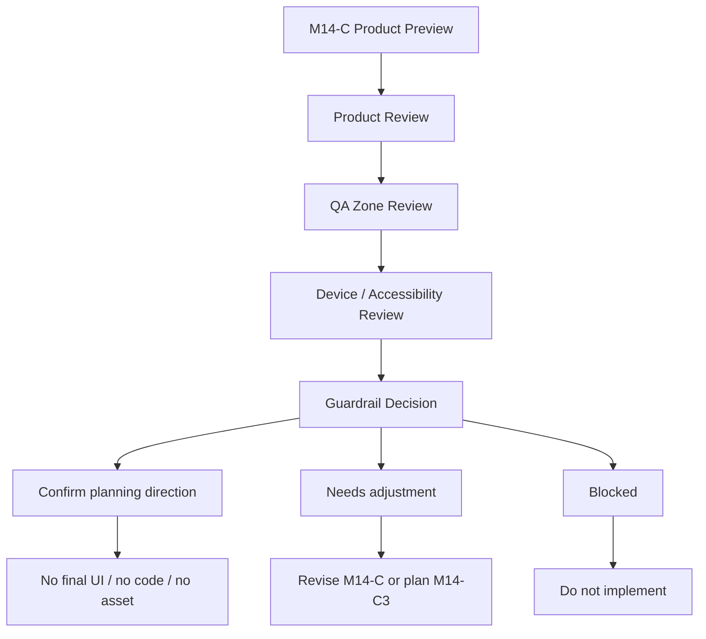

# M14-C2: Container QA Product Preview Visual Review

Stand: 2026-06-06

Status: `Review gestartet / keine Container-Freigabe`

## 1. Ziel

Dieses Dokument prueft den M14-C Product-Preview-Plan visuell und inhaltlich.
Es bewertet, ob `ContainerOpenView`, `DetailInteractionView`, kleine
Objektgruppen und QA-Zonen als produktnahe, aber weiterhin nicht finale
Planung verstaendlich, mobil plausibel, guardrail-konform und nicht
inventarartig wirken.

M14-C2 ist nur Review. Es ist keine finale `ContainerOpenView`-UI, keine
finale `DetailInteractionView`-UI, keine App-Integration, keine
Implementierung, keine finale Datenstruktur, keine Runtime-Konfiguration und
keine App-/Assetfreigabe.

Visualisierung erfolgt nur dokumentarisch:

- ASCII-Review-Overlays,
- ASCII-Mobile-Frames,
- ASCII-State-Review-Skizzen,
- Mermaid-Flows,
- Markdown-Tabellen,
- Product-/Device-/Accessibility-/QA-Review-Checklisten.

Es werden keine PNGs, keine Spielassets und keine Asset-Dateien erzeugt.

## 2. Gepruefte Grundlage

Geprueft wurde:

- `docs/world_design/301-container-qa-product-preview-plan.md`
- die dort enthaltenen ASCII-Product-Previews:
  - gute ContainerOpenView als Product Preview,
  - DetailInteractionView mit einem Fokusobjekt,
  - Schule / Federmappe,
  - Zuhause / Kuechenschublade,
  - Garten / Beet,
  - Pagination-Fall mit mehr Objekten,
  - blockierter Fall.
- QA-Overlay-Zonen,
- Product-Copy-Regeln,
- Product-State-Regeln,
- Device-/Accessibility-Regeln,
- Stop-Regeln aus M14-C.

Review-Frage:

Kann M14-C als produktnaher Planungsrahmen fuer spaetere Container-QA-Previews
bestaetigt werden, ohne dass daraus finale UI, Container-Implementierung,
Runtime-Konfiguration, Assets oder `frame_started` abgeleitet werden?

## 3. Visuelle / Product-Pruefung

### 3.1 Gesamtbewertung

| Prueffrage | Bewertung | Risiko | Hinweis |
| --- | --- | --- | --- |
| Wirkt ContainerOpenView wie ein Lernmoment statt Inventarliste? | Ja, grundsaetzlich | Inventarsprache im Negativfall muss klar blockiert bleiben | Fokusobjekt + wenige Distraktoren beibehalten |
| Wird klar, dass kleine Objekte nicht dauerhaft in IslandView liegen? | Ja | Koennte bei zu knapper Copy vergessen werden | Detailansicht/Fallback weiter explizit nennen |
| Sind wenige Fokusobjekte sichtbar? | Ja | 3 bis 5 Objekte duerfen nicht wachsen | Pagination/Backlog frueh nutzen |
| Ist das Fokusobjekt klar erkennbar? | Ja | Fokus darf nicht nur Farbe sein | Groesse, Position und Label kombinieren |
| Sind Sekundaerobjekte begrenzt und nicht dominant? | Ja | Distraktoren koennen bei vielen Woertern kippen | pro Seite begrenzen |
| Sind Tap-Zonen ausreichend klar und getrennt? | Als Planung ja | echte Device-Pruefung fehlt | M14-D/M14-C3 spaeter noetig |
| Bleiben Labels kurz und in Karten/Rahmen/Panels? | Ja | lange Wortformen koennen brechen | Text-Containment-Gate offen halten |
| Verdecken Labels keine Objekte oder Buttons? | Ja in der Planung | echte Preview fehlt | QA-Overlay spaeter pruefen |
| Verdeckt Tali/Vori keine Buttons, Fokusobjekte oder Pagination? | Ja als Guardrail | Exclusion Zone muss in spaeterer Preview sichtbar sein | Companion-Bubble ausserhalb aktiver Zonen |
| Ist Pagination sichtbar, aber nicht dominant? | Ja | kann wie Fortschrittsdruck wirken | neutral: "weitere Woerter warten" |
| Wird QA-Overlay als Debug-/Review-Material verstanden? | Ja | darf nicht in Nutzer-UI wandern | klar als Review-Layer markieren |
| Wird keine finale Container-UI suggeriert? | Ja | Product-Preview-Naehe bleibt riskant | "nicht finale Planung" wiederholen |
| Wird keine Container-Implementierung suggeriert? | Ja | Product States koennen technisch wirken | keine Runtime-Lesart erlauben |
| Wird keine Runtime-Konfiguration suggeriert? | Ja | State-Namen koennen missverstanden werden | als Preview-/QA-Zustaende markieren |
| Wird kein Premium-/Paywall-Druck erzeugt? | Ja | Negativfall zeigt Premium nur als Blocker | keine Premium-Copy in spaeteren Previews |
| Bleiben SensitiveSmallObjects an M13-G/M14-B2 gebunden? | Ja | sensible Kleinobjekte brauchen eigene Route | Policy-Gate hart halten |
| Bleiben Growth/Timer-Objekte an M13-H gebunden? | Ja | Garten kann falsche Erwartung wecken | keine Pflegepflicht, kein Timer |
| Gibt es keine `frame_started`- oder Bauzustandsableitung? | Ja | Blueprint-Fallback nicht als Bauauftrag lesen | Bauzustaende weiter blockiert |

### 3.2 Review-Fazit Zur Product-Wirkung

M14-C wirkt als Plan fuer einen spaeteren produktnahen Review brauchbar. Die
staerkste Entscheidung ist, Container nicht als Sammel-/Inventarort zu
beschreiben, sondern als kurze Detail- und Lernmomente mit klarer Fokuszone.

Die Beispiele Federmappe, Kuechenschublade und Beet bleiben ruhig und
verstaendlich. Der Hafen-/Bootskisten-Fall ist bewusst als spaeter wertvoll,
aber mobiler riskanter markiert. Der blockierte Negativfall erfuellt seinen
Zweck: Er zeigt deutlich, warum Objektlisten, Labelwolken, kleine Tap-Ziele,
Premium-Druck und Tali/Vori-Ueberdeckung nicht erlaubt sind.

## 4. Beispielpfade Im Review

### 4.1 Schule / Federmappe

Woerter:

- `pencil`,
- `eraser`,
- `ruler`.

Bewertung:

| Kriterium | Review Result | Hinweis |
| --- | --- | --- |
| Tragfaehig als Mini-Lernmoment | Ja | klare Schulobjekte, gute Containerlogik |
| Clutter kontrolliert | Ja, wenn bei drei Objekten geblieben wird | keine Stiftehaufen, keine Labelwolke |
| Tap-Zonen plausibel | Als Planung ja | echte Small-Phone-Pruefung bleibt noetig |
| Ton | brauchbar | darf nicht nach Pflichtschule klingen |

Guardrail:

- Federmappe bleibt Detail-/Container-Szene.
- Keine ueberladene IslandView.
- Keine permanente Liste aller Schreibwaren.
- Keine finale Container-UI aus diesem Review.

### 4.2 Zuhause / Kuechenschublade

Woerter:

- `spoon`,
- `fork`,
- `knife`.

Bewertung:

| Kriterium | Review Result | Hinweis |
| --- | --- | --- |
| Fokusobjekte statt Inventarliste | Ja | Schublade schuetzt vor IslandView-Clutter |
| `knife` neutral genug | Ja | keine Dramatisierung, keine Beratung |
| Safety-Ton | brauchbar | bei sensiblerem Kontext Codex/ContextCard |
| Tap-Zonen | plausibel im Plan | spaetere Device-Preview noetig |

Guardrail:

- `knife` darf nicht als Angst-, Warn- oder Beratungsobjekt dramatisiert
  werden.
- Besteck bleibt Mini-Lernmoment, keine Inventarverwaltung.
- Keine Sicherheitsberatung und keine Reward-/Penalty-Logik.

### 4.3 Garten / Beet

Woerter:

- `seed`,
- `watering can`,
- `plant`.

Bewertung:

| Kriterium | Review Result | Hinweis |
| --- | --- | --- |
| Naturfokus verstaendlich | Ja | freundlich und ruhig |
| Keine Timer-/Growth-/Pflegepflicht | Ja | klare Stop-Regel vorhanden |
| Objektanzahl begrenzt | Ja | sichtbare Pflanzenanzahl bleibt Gate |
| Mobile-Risiko | mittel | Samen/Pflanzen koennen klein werden |

Guardrail:

- Keine taegliche Pflegepflicht.
- Keine Pflanzenverfall-Mechanik.
- Keine Streak-/Comeback-Schuld.
- Growth bleibt an M13-H gebunden.

### 4.4 Hafen / Bootskiste

Woerter:

- `compass`,
- `map`,
- `rope`.

Bewertung:

| Kriterium | Review Result | Hinweis |
| --- | --- | --- |
| Spaeter wertvoll | Ja | gute Travel-/Hafen-Wortgruppe |
| Mobil riskanter | Ja | kleine Linien/Seile/Karten koennen dicht wirken |
| Separate Mobile-Komplexitaetspruefung | ausreichend markiert | bleibt Gate vor Product Preview |
| System-Risiko | hoch | Water/Dock/Travel nicht aus M14-C ableiten |

Guardrail:

- Keine Hafen-Assetableitung.
- Keine Travel-/Water-Implementierung.
- Keine Bootskiste ohne Device-/Accessibility-/Clutter-Review.

### 4.5 Pagination-Fall / Werkzeugkiste

Bewertung:

| Kriterium | Review Result | Hinweis |
| --- | --- | --- |
| Ueberlauf verstaendlich | Ja | "6 weitere Woerter warten" ist ruhig |
| Keine Endlosliste | Ja | Page-Logik statt Grid-Masse |
| Backlog/Codex statt Mini-Icon-Masse | Ja | guter Scope-Schutz |
| Pagination dominant? | Nein | sichtbar, aber nicht als Druck formuliert |

Guardrail:

- Pagination darf keine Belohnungs-/Druckmechanik werden.
- Ueberlauf darf nicht als Mini-Icon-Masse gezeigt werden.
- Suche/Filter bleiben spaetere Optionen, nicht MVP-Pflicht.

## 5. QA-Zonen-Pruefung

| QA-Zone | Zweck verstaendlich? | Gute Auspraegung ausreichend? | Blocker vollstaendig? | Fuer spaetere Product Preview brauchbar? | Review-Hinweis |
| --- | --- | --- | --- | --- | --- |
| Safe Area | Ja | Ja | Ja | Ja | besonders Small Phone |
| Container Bounds | Ja | Ja | Ja | Ja | nur im QA-Overlay sichtbar |
| Focus Object Zone | Ja | Ja | Ja | Ja | Fokus nicht nur Farbe |
| Secondary Object Zone | Ja | Ja | Ja | Ja | Distraktoren klar begrenzen |
| Label Zone | Ja | Ja | Ja | Ja | lange Labels kuerzen/umbrachen |
| Tap Target Zone | Ja | Planungswert reicht | Ja | Ja, aber Device-Gate noetig | echte Groessen spaeter pruefen |
| Primary Action Zone | Ja | Ja | Ja | Ja | nicht von Companion verdecken |
| Pagination Zone | Ja | Ja | Ja | Ja | sichtbar, aber ruhig |
| Tali/Vori Exclusion Zone | Ja | Ja | Ja | Ja | Bubble ausserhalb aktiver Zonen |
| Overflow/Blocked Zone | Ja | Ja | Ja | Ja | Backlog/Codex statt Icon-Masse |

QA-Fazit:

Die Zonen sind fuer einen spaeteren Product-Preview-/QA-Overlay-Block
brauchbar. Der wichtigste offene Punkt ist echte Device-Pruefung: Die
M14-C-Zonen sind konzeptionell sauber, aber noch keine bestaetigten Pixel-,
Tap-Target- oder Runtime-Werte.

## 6. Copy-Regeln Im Review

### 6.1 Bewertung Der Erlaubten Copy

| Copy | Review Result | Hinweis |
| --- | --- | --- |
| "Schau dir wenige Dinge genauer an." | gut | fokusnah, nicht inventarartig |
| "Waehle das passende Objekt." | gut | klare Lernhandlung |
| "Das bleibt eine Detailansicht." | brauchbar | verhindert IslandView-Erwartung, etwas technisch |
| "Mehr Dinge kommen spaeter." | gut | ruhig und nicht drueckend |
| "Du kannst es im Codex behalten." | gut | sicherer Fallback |
| "Diese Ansicht ist nur ein Vorschlag." | gut | verhindert finale UI-Lesart |

Kleine Hinweise:

- "Das bleibt eine Detailansicht." kann fuer Nutzer spaeter etwas technisch
  klingen. Fuer Product Preview ist es brauchbar; spaetere App-Copy koennte
  weicher werden, z. B. "Wir schauen es uns kurz genauer an."
- "Mehr Dinge kommen spaeter." sollte nicht wie Unlock-Druck wirken. Die
  Alternative "Weitere Woerter warten." bleibt ruhiger.

### 6.2 Bewertung Der Blockierten Copy

| Copy | Review Result | Warum wichtig |
| --- | --- | --- |
| "Hier ist dein Inventar." | vollstaendig blockiert | macht Container zur Verwaltung |
| "Alle Objekte muessen hier rein." | vollstaendig blockiert | erzeugt Ueberladung |
| "Tippe auf jedes kleine Ding." | vollstaendig blockiert | erzeugt TinyObject-Tap-Druck |
| "Deine Pflanze braucht taegliche Pflege." | vollstaendig blockiert | Growth-/Retention-Druck |
| "Dieses Messer ist gefaehrlich." | vollstaendig blockiert | dramatisiert und wirkt beratungsaehnlich |
| "Premium fuer mehr Platz." | vollstaendig blockiert | Paywall-Druck |
| "Sonst verlierst du Fortschritt." | vollstaendig blockiert | Verlustangst |

Zusaetzlich blockierte Copy-Beispiele:

| Copy | Status | Begruendung | Alternative |
| --- | --- | --- | --- |
| "Deine Kiste ist voll." | blockiert | erzeugt Inventar-/Platzdruck | "Weitere Woerter warten." |
| "Schalte mehr Slots frei." | blockiert | Slot-/Monetarisierungsdruck | "Wir pruefen spaeter mehr Dinge." |
| "Sortiere alles ein." | blockiert | Vollstaendigkeitszwang | "Waehle ein passendes Objekt." |
| "Schnell, bevor es weg ist." | blockiert | FOMO/Timer-Druck | "Du kannst spaeter weitermachen." |

Copy-Fazit:

Die M14-C-Copy-Regeln sind brauchbar. Wichtig bleibt, spaetere Product Preview
noch weniger inventarartig zu formulieren und "Slots", "voll", "alles" und
"freischalten" zu vermeiden.

## 7. Product-State-Regeln Im Review

Diese Zustaende bleiben Product-Preview-/QA-Zustaende, keine
Runtime-State-Definition.

| Product State | Review Result | Guardrail |
| --- | --- | --- |
| `container_candidate` | brauchbar | nur Vorschlag, keine automatische Platzierung |
| `container_preview_ready` | brauchbar | keine finale UI |
| `focus_object_visible` | stark | Fokus darf nicht nur Farbe sein |
| `object_selected` | brauchbar | keine Runtime-Aktion ableiten |
| `mini_challenge_active` | brauchbar, aber riskant | keine Challenge-Implementierung |
| `feedback_visible` | brauchbar, aber riskant | keine Reward-Implementierung |
| `pagination_needed` | stark | keine Endlosliste, kein Druck |
| `codex_fallback` | stark | kein Verlust |
| `blueprint_fallback` | brauchbar | kein Bauzustand |
| `backlog_later` | stark | kein Nachteil |
| `qa_passed` | brauchbar, aber klar begrenzen | keine Implementierungsfreigabe |
| `qa_needs_adjustment` | stark | Plan nachbessern, kein Code |
| `qa_blocked` | stark | Umsetzung stoppen |
| `planning_state_set` | brauchbar, aber riskant | keine Persistenzfreigabe |

Klarstellungen:

- `qa_passed` ist keine Implementierungsfreigabe.
- `mini_challenge_active` ist keine Challenge-Implementierung.
- `feedback_visible` ist keine Reward-Implementierung.
- `planning_state_set` ist keine Persistenzfreigabe.
- `blueprint_fallback` ist kein Bauzustand.

## 8. Textuelle Review-Visualisierungen

### 8.1 Mermaid Review Flow



### 8.2 ASCII Review Overlay: Guter Container-Preview-Zustand

```text
+--------------------------------------+
| SAFE AREA                            |
| +----------------------------------+ |
| | CONTAINER BOUNDS                 | |
| |                                  | |
| |  TALI/VORI EXCLUSION ZONE        | |
| |  (Bubble darf hier bleiben)      | |
| |                                  | |
| | +------------------------------+ | |
| | | FOCUS OBJECT ZONE            | | |
| | | grosses Objekt / klare Tap    | | |
| | +------------------------------+ | |
| |                                  | |
| | +----------+      +----------+   | |
| | | SECONDARY|      | SECONDARY|   | |
| | | TAP ZONE |      | TAP ZONE |   | |
| | +----------+      +----------+   | |
| |                                  | |
| | LABEL ZONE: kurz, nicht darueber | |
| |                                  | |
| | [ PRIMARY ACTION ZONE ]          | |
| | [ Codex / Spaeter ]              | |
| |                                  | |
| | PAGINATION ZONE: Seite 1 von 2   | |
| +----------------------------------+ |
+--------------------------------------+
```

Review-Hinweis:

- QA-Zonen sind im Review sichtbar.
- In der Nutzeransicht duerfen diese Debug-Begriffe nicht erscheinen.
- Tali/Vori bleibt ausserhalb aktiver Tap-Zonen.

### 8.3 Preview State / Review Result / Risk / Required Adjustment

| Preview State | Review Result | Risk | Required Adjustment |
| --- | --- | --- | --- |
| Good ContainerOpenView | bestaetigbar | kann zu final wirken | Preview-only markieren |
| DetailInteractionView | bestaetigbar | Hauptobjekt koennte zu assetnah wirken | keine Assetableitung |
| Federmappe | bestaetigbar | Kleinteile/Schulpflicht | freundlich, wenige Objekte |
| Kuechenschublade | bestaetigbar | Knife-Dramatisierung | neutral, keine Beratung |
| Garten/Beet | bestaetigbar mit Gate | Growth-Erwartung | keine Pflege-/Timer-Copy |
| Bootskiste | spaeter pruefen | Mobile-/Water-/Travel-Komplexitaet | eigenes Mobile-Gate |
| Pagination | bestaetigbar | kann Slot-/Inventarsprache kippen | "Woerter warten", keine Slots |
| Blockierter Fall | gut als Negativbeispiel | darf nicht als Option gelesen werden | klar blockiert halten |

### 8.4 Good / Needs Adjustment / Blocked

| Good | Needs Adjustment | Blocked |
| --- | --- | --- |
| wenige Fokusobjekte | "Detailansicht" spaeter weicher formulieren | Inventarliste |
| ein klares Fokusobjekt | echte Device-Tap-Pruefung nachholen | TinyObject-Taps in IslandView |
| grosse getrennte Tap-Zonen | lange Labels kuerzen | Labelwolke |
| Tali/Vori ausserhalb aktiver Zonen | Exclusion Zone spaeter visuell pruefen | Companion verdeckt Buttons |
| Pagination bei Ueberlauf | Page-Copy ruhig halten | Endlosliste / Grid-Masse |
| Codex/Blueprint/Backlog als Fallback | Blueprint nicht bauartig framen | Bauzustand aus Fallback |
| QA-Overlay als Reviewmaterial | Debug-Begriffe aus Nutzeransicht halten | QA-Overlay als Nutzer-UI |

### 8.5 Decision Tree: Darf Aus M14-C2 Code Entstehen?

```text
Start: M14-C2 Review abgeschlossen?
 |
 +-- Nein -> Weiter dokumentarisch pruefen.
 |
 +-- Ja -> Wurde Code ausdruecklich freigegeben?
          |
          +-- Nein -> Kein Code.
          |
          +-- Ja -> Nicht durch M14-C2; eigener Implementierungs-Prompt noetig.
```

### 8.6 Example / Review Result / Main Guardrail

| Example | Review Result | Main Guardrail |
| --- | --- | --- |
| Schule / Federmappe | bestaetigbar | wenige Objekte, kein Pflichtschule-Ton |
| Zuhause / Kuechenschublade | bestaetigbar | neutraler `knife`-Umgang, keine Inventarliste |
| Garten / Beet | bestaetigbar mit Growth-Gate | keine Timer-/Pflegepflicht |
| Hafen / Bootskiste | spaeter pruefen | Mobile-/Water-/Travel-Gate |
| Werkzeugkiste / Pagination | bestaetigbar | keine Endlosliste, keine Slot-Sprache |

## 9. Harte Risiken Und Blocker

Harte Blocker:

- Review wird als finale Container-UI-Freigabe gelesen.
- Product Preview wirkt wie App-Screen statt Planungsreview.
- Container wirkt wie Inventarverwaltung.
- Zu viele Kleinteile gleichzeitig sichtbar.
- Tap-Zonen zu klein oder zu dicht.
- Labels verdecken Objekte.
- Deko verdeckt Lernobjekte.
- Pagination fehlt trotz Objektueberlauf.
- Tali/Vori verdeckt Buttons oder Fokusobjekte.
- QA-Overlay wird als Nutzer-UI gelesen.
- SensitiveSmallObjects ohne M13-G/M14-B2.
- Growth/Timer-Objekte ohne M13-H.
- Premium-/Paywall-Hinweis erscheint.
- Product State wird als Runtime-Konfiguration gelesen.
- Review erzeugt Code-, Asset- oder App-Freigabe.

Zusaetzliche Review-Risiken:

- "Detailansicht" kann spaeter zu technisch wirken.
- "Mehr Dinge kommen spaeter" darf nicht als Unlock- oder Slot-Druck wirken.
- `qa_passed` darf nicht in Richtung Implementierungsfreigabe kippen.
- `blueprint_fallback` darf keinen Bauzustand suggerieren.

## 10. Entscheidungsempfehlung

Optionen:

1. M14-C als Product-Preview-Plan bestaetigen.
2. M14-C mit kleinen Nachbesserungen bestaetigen.
3. M14-C erneut nachbessern.
4. M14-C blockieren, weil zu final oder zu riskant.

Empfehlung:

M14-C sollte grundsaetzlich als Product-Preview-Plan bestaetigt werden.

Kleine Hinweise fuer spaetere Preview-Bloecke:

- Copy noch weniger inventarartig halten.
- "Detailansicht" spaeter ggf. weicher formulieren.
- Pagination nie als Slot-/Unlock-/Progressdruck formulieren.
- QA-Begriffe strikt aus Nutzeransicht heraushalten.
- Tali/Vori-Exclusion-Zone in spaeterer visueller Preview sichtbar pruefen.
- Echte Device-/Accessibility-/Tap-Target-Pruefung bleibt noetig.

Naechster sinnvoller Schritt:

- M14-D Device/Accessibility Review Harness Plan oder
- M14-C3 Visual Product Preview Plan.

Keine Freigabe:

- keine Codefreigabe,
- keine App-Integration,
- keine finale UI,
- keine Assetfreigabe,
- keine Runtime-Konfiguration,
- kein `frame_started`.

## 11. Stop-Regeln

- Keine finale ContainerOpenView-UI aus M14-C2.
- Keine finale DetailInteractionView-UI aus M14-C2.
- Keine Container-Implementierung aus M14-C2.
- Keine finale Datenstruktur aus M14-C2.
- Keine Runtime-Konfiguration aus M14-C2.
- Keine App-Integration aus M14-C2.
- Keine Codefreigabe aus M14-C2.
- Keine Implementierungsfreigabe aus M14-C2.
- Keine Assetfreigabe aus M14-C2.
- Keine PNG-Erzeugung aus M14-C2.
- Keine Tests aus M14-C2.
- Keine Spielassets aus M14-C2.
- Kein `frame_started` oder Bauzustand aus M14-C2.

## 12. Review-Fazit

M14-C ist als Container QA Product Preview Plan brauchbar. Die Planung
vermittelt Container als fokussierte Lernmomente statt als Inventarlisten,
haelt kleine Objekte aus der IslandView heraus, macht Fokusobjekte und
Sekundaerobjekte unterscheidbar, setzt Tap-Zonen, Label-Zonen,
Tali/Vori-Exclusion und Pagination als QA-Gates und bindet sensitive sowie
Growth-/Timer-Faelle weiter an ihre eigenen Regelbloecke.

Der Review bestaetigt nur die Planungsrichtung. M14-C2 erzeugt keine finale
Container-UI, keine Implementierung, keine Runtime-Konfiguration, keine App-/
Assetfreigabe, keinen Code und kein `frame_started`.
