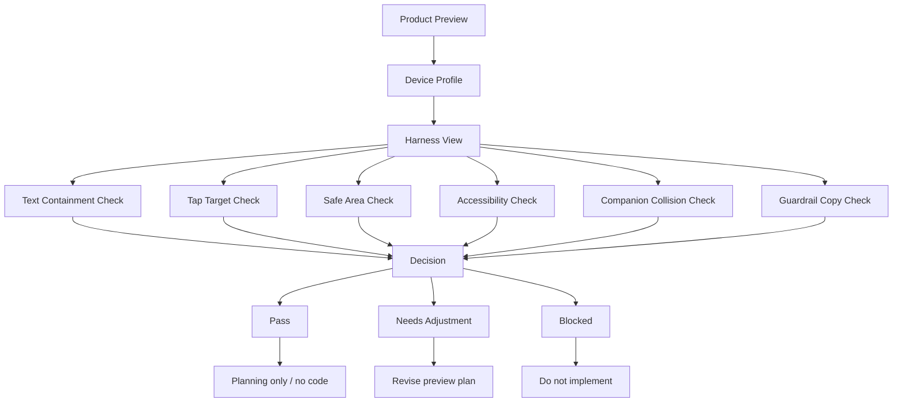

# M14-D: Device/Accessibility Review Harness Plan

Stand: 2026-06-06

Status: `Review-Harness-Plan gestartet / keine Harness-Implementierung`

## 1. Ziel

Dieses Dokument plant, wie spaetere Device-/Accessibility-/
Text-Containment-/Tap-Target-/QA-Pruefungen fuer die bisher geplanten
Product-Preview-Flows systematisch vorbereitet werden koennten.

M14-D ist nur ein Review-Harness-Plan. Es ist keine Test-Implementierung, kein
Flutter-Code, keine App-Integration, keine Widget-Test-Erstellung, keine
finale UI, keine Runtime-Konfiguration und keine Implementierungsfreigabe.

Visualisierung erfolgt nur dokumentarisch:

- ASCII-Harness-Flows,
- ASCII-Device-Frames,
- ASCII-QA-Check-Overlays,
- Mermaid-Flows,
- Markdown-Tabellen,
- Device-/Accessibility-/Tap-Target-/Text-Containment-Checklisten.

Es werden keine PNGs, keine Screenshots, keine Tests, keine Spielassets und
keine Asset-Dateien erzeugt.

## 2. Review-Harness-Ziel

Der spaetere Harness soll Product-Preview-Zustaende pruefbar machen, ohne
selbst ein Nutzerfeature oder eine finale App-UI zu werden.

Klare Zielaussagen:

- Der spaetere Harness soll Sichtbarkeit, Lesbarkeit, Tap-Ziele,
  Text-Containment, Safe Areas und Companion-Ueberdeckung pruefbar machen.
- Der Harness ist kein Nutzerfeature.
- Der Harness ist keine finale App-UI.
- M14-D erzeugt aktuell keinen Code und keine Tests.
- M14-D erzeugt keine Screenshots.
- Der Harness darf spaeter nur nach eigenem Implementierungs-Gate entstehen.
- Kein Asset, kein Bauzustand, kein `frame_started`.

Nicht-Ziel:

- keine Test-Harness-Implementierung,
- keine Widget-Tests,
- keine Flutter-/Dart-Dateien,
- keine Screenshot-Pipeline,
- keine Runtime-Konfiguration,
- keine App-Integration.

## 3. Zu Pruefende Product-Bereiche

| Product-Bereich | Prueffokus | Typisches Risiko | Benoetigte Pruefansicht | Harte Blocker | Naechster erlaubter Schritt |
| --- | --- | --- | --- | --- | --- |
| Foundation Choice | drei Karten, Safe Exit, Tali/Vori | Pflicht-Hausstart, Textueberlauf | Small Phone Portrait mit Kartenstack | Safe Exit fehlt, Karte wirkt final | Product Preview oder M14-D2 Review |
| Word-to-Island Suggestion | Vorschlagskarte, Nutzerentscheidung | automatische Platzierung | Word Card mit Actions | Vorschlag wirkt endgueltig | Product UX Review |
| Sense Selection | wenige Bedeutungen, klare Wahl | zu viele Optionen, falsche Bedeutung | Sense-Auswahl-Frame | automatische Sense-Wahl | UX-Nachbesserung |
| Codex/Blueprint/Backlog Fallback | Fallback sichtbar, positiv | Verlustgefuehl, Bauauftrag | Fallback-Panel | Codex wirkt wie Fehler | Copy-/Guardrail-Review |
| ContainerOpenView | wenige Fokusobjekte | Inventarliste, Clutter | Container + QA-Zonen | Mini-Icon-Masse | Container QA Review |
| DetailInteractionView | ein Fokusobjekt | zu klein, zu assetnah | Fokusobjekt-Frame | kein klares Zielobjekt | Device-/Tap-Review |
| Container Pagination | Ueberlauf ruhig loesen | Endlosliste, Slot-Druck | Pagination-Frame | keine Page-Logik | Pagination-Copy-Review |
| Tali/Vori Bubble | Companion ausserhalb aktiver Zonen | Buttons/Fokus verdeckt | Exclusion-Overlay | Bubble blockiert Interaktion | Companion Collision Review |
| Safe Exit / Later Decision | spaeter entscheiden sichtbar | Lock-in, Druck | Secondary-Action-Zone | Safe Exit versteckt | Accessibility Review |
| Blocked/Guardrail States | klare Stopps | zu technisch, zu hart | Guardrail-Copy-Frame | Blocker wirkt wie App-Fehler | Copy-/Safety-Review |

## 4. Device-Klassen

| Device-Klasse | Warum relevant | Was wird geprueft | Besonders riskante Layouts | Gate vor Implementierung |
| --- | --- | --- | --- | --- |
| Small Phone Portrait | kritischster Mobile-Fall | Textfit, Kartenstack, Tap-Abstand, Safe Exit | drei Karten, Sense-Auswahl, Container mit 3+ Objekten | echte Device-/Text-/Tap-Pruefung |
| Standard Phone Portrait | Hauptfall | Lesbarkeit, Primary/Secondary Actions, Tali/Vori | Word-to-Island Card, Container Pagination | Product-/Accessibility-Review |
| Large Phone Portrait | mehr Raum, aber kein Zusatzscope | Luft ohne Zusatzkomplexitaet | zu viele Karten/Objekte, neue Spalten | Scope-Guardrail |
| Small Phone Landscape | spaeterer Risikofall | geringe Hoehe, verdeckte Buttons | Companion Bubble, Pagination, Safe Exit | eigener Sonderfall-Review |
| Tablet optional spaeter | andere Dichte, mehr Breite | keine Ueberladung trotz Raum | zu viele gleichzeitige Objekte | eigenes Tablet-Gate |

Device-Grundregel:

Small Phone Portrait fuehrt. Groessere Devices duerfen nicht genutzt werden,
um mehr Karten, mehr Objekte oder mehr technische Labels in die Nutzeransicht
zu schieben.

## 5. Accessibility- Und UX-Pruefkategorien

| Kategorie | Ziel | Gute Auspraegung | Blocker | Betroffene M14-Flows | Spaeterer Review-/Test-Typ |
| --- | --- | --- | --- | --- | --- |
| Text Containment | Texte bleiben in Karten/Rahmen/Panels | Umbruch, kurze Labels, keine abgeschnittenen Woerter | Text laeuft heraus | Foundation, Word-to-Island, Container | visueller Textfit-Review |
| Tap Target Spacing | Touch-Ziele gross und getrennt | klare Abstaende, keine Mini-Taps | Ueberlappung, TinyObject-Taps | Foundation, Container, Detail | Tap-Overlay-Review |
| Safe Area Compliance | wichtige Elemente nicht am Rand | Buttons und Fokus mit Abstand | Randkollision | alle Mobile-Flows | Device-Frame-Review |
| Focus Order | Nutzer versteht Reihenfolge | Titel, Fokus, Aktion, Fallback | chaotische Reihenfolge | Word-to-Island, Container | UX-Review |
| Color Independence | Bedeutung nicht nur Farbe | Text/Icon/Position ergaenzen Farbe | reine Farbcodierung | Foundation, Sense, QA | Accessibility-Review |
| Motion Reduction | Bewegung optional halten | statische Alternative moeglich | Bewegung Pflicht | Companion, Product Preview | Motion-Review |
| Audio Independence | Audio nicht alleiniger Hinweis | Text-Fallback | Audio-only | Challenge/Companion spaeter | Accessibility-Review |
| Companion Overlay Safety | Tali/Vori verdeckt nichts | Exclusion Zone | Bubble ueber Button/Fokus | alle Flows mit Tali/Vori | Collision-Review |
| Pagination Visibility | Ueberlauf sichtbar, ruhig | Seite/Weiter/Backlog | versteckte oder dominante Pagination | Container | Pagination-Review |
| Fallback Visibility | Codex/Blueprint/Backlog erreichbar | positiv und nicht als Verlust | Fallback fehlt oder wirkt strafend | Word-to-Island, Container | Fallback-Copy-Review |
| Guardrail Copy Visibility | Stopps klar, aber freundlich | kurz, neutral, nicht dramatisch | harte Fehlermeldung | Blocked States | Copy-/Safety-Review |
| Sensitive/Growth Safety Copy | kein Druck, keine Beratung | neutral, optional | Dramatisierung, Timer, Pflegepflicht | Sensitive, Garden, Container | Policy-/Fairness-Review |
| Runtime/Implementation Misread Prevention | Planung bleibt Planung | Labels: preview-only / review-only | State als Runtime gelesen | alle M14-Dokumente | Readiness-Review |

Hinweis:

Die Spalte "Spaeterer Review-/Test-Typ" beschreibt nur moegliche spaetere
Pruefarten. M14-D erstellt keine Tests und keine Implementierung.

## 6. ASCII-Harness-Frames

Die folgenden Frames sind Review-Harness-Skizzen. Sie sind keine finale UI,
keine Screenshots und keine App-Implementierung.

### 6.1 Small Phone Foundation Choice Check

```text
+--------------------------------+
| HARNESS: Small Phone Portrait  |
| SAFE AREA                      |
|                                |
| Tali/Vori Zone                 |
| "Waehle einen Lernfokus."      |
|                                |
| +----------------------------+ |
| | Card: Zuhause / Alltag     | |
| | Text fit? Tap zone?        | |
| +----------------------------+ |
| +----------------------------+ |
| | Card: Schule / Lernen      | |
| | Text fit? Tap zone?        | |
| +----------------------------+ |
| +----------------------------+ |
| | Card: Garten / Natur nah   | |
| | Text fit? Tap zone?        | |
| +----------------------------+ |
|                                |
| [ Primary ]   [ Spaeter ]      |
+--------------------------------+
Checks: Text Containment, Tap Spacing, Safe Exit, no forced home start.
```

### 6.2 Small Phone Word-to-Island Suggestion Check

```text
+--------------------------------+
| HARNESS: Word Suggestion       |
| SAFE AREA                      |
|                                |
| Word Zone: "apple"             |
|                                |
| +----------------------------+ |
| | Suggestion Zone            | |
| | Island: Garten/Zuhause?    | |
| | Depth: Detail/Container    | |
| +----------------------------+ |
|                                |
| User Choice Zone               |
| [ Bestaetigen ] [ Aendern ]    |
| [ Codex ]      [ Spaeter ]     |
+--------------------------------+
Checks: no automatic placement, actions visible, fallback visible.
```

### 6.3 Sense Selection Check

```text
+--------------------------------+
| HARNESS: Sense Selection       |
|                                |
| Word: "bank"                   |
|                                |
| Waehle die Bedeutung:          |
| +----------------------------+ |
| | Geld / Ort                  | |
| +----------------------------+ |
| +----------------------------+ |
| | Sitzbank                    | |
| +----------------------------+ |
|                                |
| [ Weiter ]      [ Spaeter ]    |
+--------------------------------+
Checks: few choices, no forced meaning, no technical labels.
```

### 6.4 ContainerOpenView Tap-Zone Check

```text
+--------------------------------+
| HARNESS: Container Tap Zones   |
| SAFE AREA                      |
| +----------------------------+ |
| | Container Bounds           | |
| |                            | |
| | +--------+   +--------+    | |
| | | pencil |   | eraser |    | |
| | | TAP    |   | TAP    |    | |
| | +--------+   +--------+    | |
| |                            | |
| | +--------+                 | |
| | | ruler  |                 | |
| | | TAP    |                 | |
| | +--------+                 | |
| |                            | |
| | Label Zone: short only     | |
| +----------------------------+ |
| [ Primary Action ]            |
+--------------------------------+
Checks: object count, tap spacing, label containment, no inventory list.
```

### 6.5 DetailInteractionView Focus Check

```text
+--------------------------------+
| HARNESS: Detail Focus          |
|                                |
|      FOCUS OBJECT ZONE         |
|      +----------------+        |
|      | compass        |        |
|      | large target   |        |
|      +----------------+        |
|                                |
| Secondary choices:             |
| [ map ] [ rope ]               |
|                                |
| [ Confirm ] [ Codex ]          |
+--------------------------------+
Checks: one clear focus, secondary choices limited, no asset inference.
```

### 6.6 Tali/Vori Overlay Collision Check

```text
+--------------------------------+
| HARNESS: Companion Collision   |
|                                |
| Tali/Vori Exclusion Zone       |
| +----------------------------+ |
| | Bubble allowed here        | |
| +----------------------------+ |
|                                |
| +----------------------------+ |
| | Active Card / Focus Object | |
| | DO NOT COVER               | |
| +----------------------------+ |
|                                |
| [ Primary Button ] [ Later ]   |
| DO NOT COVER BUTTONS           |
+--------------------------------+
Checks: bubble never covers cards, focus, pagination or buttons.
```

### 6.7 Blocked State / Guardrail Copy Check

```text
+--------------------------------+
| HARNESS: Guardrail State       |
|                                |
| This is a planning block.      |
| No final UI / no code / no     |
| runtime config / no assets.    |
|                                |
| [ Back to review ]             |
| [ Later decision ]             |
+--------------------------------+
Checks: guardrail copy visible, neutral, not an app error.
```

## 7. Review-Harness-State-Modell

Diese Zustaende sind Review-Harness-Planungszustaende, keine
Runtime-State-Definition und keine Test-Implementierung.

| Harness State | Bedeutung | Nicht ableiten |
| --- | --- | --- |
| `harness_candidate` | Flow koennte spaeter harness-geprueft werden | keine Implementierung |
| `device_profile_selected` | Device-Klasse fuer Review gewaehlt | keine Device-Runtime-Regel |
| `preview_state_loaded` | Planungszustand wird im Harness betrachtet | keine App-UI |
| `text_containment_checked` | Textfit wurde pruefbar gemacht | kein Screenshot-Test |
| `tap_targets_checked` | Tap-Zonen wurden pruefbar gemacht | keine finale Tap-Konfiguration |
| `safe_area_checked` | Safe Areas wurden betrachtet | keine Layout-Implementierung |
| `accessibility_checked` | Accessibility-Kriterien wurden geprueft | keine Compliance-Freigabe |
| `companion_collision_checked` | Tali/Vori-Ueberdeckung wurde geprueft | keine Companion-Implementierung |
| `guardrail_copy_checked` | Stop-/Fallback-Copy wurde geprueft | keine finale App-Copy |
| `harness_passed` | Plan wirkt review-tauglich | keine Implementierungsfreigabe |
| `harness_needs_adjustment` | Layout/Copy muss nachbessern | kein Code |
| `harness_blocked` | Guardrail verletzt | keine Umsetzung |

Klarstellungen:

- `harness_passed` ist keine Implementierungsfreigabe.
- `preview_state_loaded` ist keine App-Integration.
- `tap_targets_checked` erzeugt keine Runtime-Konfiguration.
- `accessibility_checked` ist kein finaler Accessibility-Abschluss.

## 8. Textuelle Visualisierung

### 8.1 Mermaid Flow



### 8.2 Product Area / Device Risk / Accessibility Risk / Required Harness Check / Blocker

| Product Area | Device Risk | Accessibility Risk | Required Harness Check | Blocker |
| --- | --- | --- | --- | --- |
| Foundation Choice | cards too tall | color-only selection | text/tap/safe-exit | forced start |
| Word-to-Island Suggestion | card too dense | technical labels | action/fallback visibility | automatic placement |
| Sense Selection | option overload | unclear focus order | choice count/focus | forced sense |
| Codex/Blueprint/Backlog | fallback hidden | loss framing | fallback copy | Codex as punishment |
| ContainerOpenView | tiny tap zones | label overlap | tap/label QA | inventory list |
| DetailInteractionView | focus too small | object not clear | focus/tap QA | no focus object |
| Container Pagination | page controls hidden | progress pressure | pagination visibility | endless grid |
| Tali/Vori Bubble | collision | covers action | exclusion zone | blocked button |
| Safe Exit / Later | hidden action | lock-in | secondary action visibility | irreversible choice |
| Guardrail States | too technical | harsh copy | neutral copy | app-error tone |

### 8.3 Check Category / Good / Blocked / Applies To

| Check Category | Good | Blocked | Applies To |
| --- | --- | --- | --- |
| Text Containment | text wraps inside box | clipped or overflowing text | all |
| Tap Target Spacing | separate large targets | overlapping or tiny targets | Foundation, Container |
| Safe Area Compliance | important controls away from edges | edge collision | all mobile |
| Focus Order | obvious reading/action order | scattered priorities | Word, Container |
| Color Independence | text/icon/position support | color-only meaning | all |
| Motion Reduction | static alternative possible | motion required | Companion |
| Audio Independence | text fallback | audio-only | Challenge/Companion |
| Companion Overlay Safety | bubble outside active zones | covers focus/button | all Tali/Vori flows |
| Pagination Visibility | clear but quiet page state | hidden or dominant page control | Container |
| Fallback Visibility | Codex/Backlog visible and calm | fallback feels like loss | Word, Container |
| Guardrail Copy Visibility | neutral planning copy | app-error or pressure copy | Blocked states |
| Sensitive/Growth Safety Copy | neutral, optional | advice, pressure, timer | Sensitive/Garden |
| Runtime Misread Prevention | preview-only labels | runtime/config inference | all planning |

### 8.4 Harness State / Meaning / Not Allowed To Infer

| Harness State | Meaning | Not Allowed To Infer |
| --- | --- | --- |
| `harness_candidate` | possible later review target | test creation |
| `device_profile_selected` | review device chosen | runtime breakpoint |
| `preview_state_loaded` | planned state displayed conceptually | app screen |
| `text_containment_checked` | text issue considered | screenshot generated |
| `tap_targets_checked` | tap zones considered | final hitboxes |
| `safe_area_checked` | safe areas considered | implementation layout |
| `accessibility_checked` | accessibility reviewed | compliance release |
| `companion_collision_checked` | overlay risk reviewed | companion UI |
| `guardrail_copy_checked` | copy risk reviewed | final app copy |
| `harness_passed` | plan is review-tauglich | implementation release |
| `harness_needs_adjustment` | needs plan update | code task |
| `harness_blocked` | guardrail violation | workaround implementation |

### 8.5 Good / Blocked Fuer Device/Accessibility Review Harness

| Good | Blocked |
| --- | --- |
| review-only harness plan | Harness-Implementierung |
| ASCII device frames | Screenshots oder PNGs |
| tap zones as planning overlay | finale hitbox values |
| text-containment checklist | Widget-Test-Erstellung |
| Tali/Vori exclusion planning | Companion-UI-Implementierung |
| fallback visibility review | Runtime-Fallback-System |
| guardrail copy review | finale App-Copy |
| implementation only after own gate | Codefreigabe aus M14-D |

## 9. Risiken Und Harte Blocker

Harte Blocker:

- Harness-Plan wird als Implementierungsfreigabe gelesen.
- Harness wird als Nutzerfeature gelesen.
- Harness erzeugt Tests oder Flutter-Code.
- Product Preview wirkt wie finale UI.
- Text laeuft aus Karten/Rahmen/Panels.
- Tap-Ziele sind zu klein oder ueberlappen.
- Tali/Vori verdeckt Buttons, Karten, Fokusobjekte oder Pagination.
- Auswahl ist nur ueber Farbe erkennbar.
- Audio-only-Hinweise ohne Text-Fallback.
- Bewegung ohne reduzierte Alternative.
- Safe Exit / Later Decision ist versteckt.
- Codex/Blueprint/Backlog wirkt wie Verlust oder Bauauftrag.
- Sensitive/Growth-Texte erzeugen Druck, Beratung oder Dramatisierung.
- Runtime-State oder Persistenz wird abgeleitet.
- Code-, Test-, Asset- oder App-Freigabe wird abgeleitet.

## 10. Entscheidungsempfehlung

Optionen:

1. M14-D als Review-Harness-Plan bestaetigen.
2. M14-D mit kleinen Nachbesserungen bestaetigen.
3. M14-D erneut nachbessern.
4. M14-D blockieren, weil zu implementierungsnah.

Empfehlung:

M14-D ist als Review-Harness-Plan grundsaetzlich brauchbar.

Noch nicht erlaubt:

- keine Harness-Implementierung,
- keine Tests,
- keine Widget-Tests,
- kein Flutter-Code,
- keine Screenshots,
- keine App-Integration,
- keine finale UI,
- keine Assetfreigabe,
- keine Runtime-Konfiguration,
- kein `frame_started`.

Naechster sinnvoller Schritt:

- M14-E Small Implementation Slice Candidate Review, aber nur als
  Gate-Dokument, oder
- M14-D2 Review Harness Visual Review, falls M14-D zuerst visuell/textuell
  geprueft werden soll.

## 11. Stop-Regeln

- Keine Harness-Implementierung aus M14-D.
- Keine Tests aus M14-D.
- Keine Widget-Tests aus M14-D.
- Keine Flutter-/Dart-Dateien aus M14-D.
- Keine App-Integration aus M14-D.
- Keine finale UI aus M14-D.
- Keine finale Datenstruktur aus M14-D.
- Keine Runtime-Konfiguration aus M14-D.
- Keine Codefreigabe aus M14-D.
- Keine Implementierungsfreigabe aus M14-D.
- Keine Assetfreigabe aus M14-D.
- Keine PNG-Erzeugung aus M14-D.
- Keine Screenshots aus M14-D.
- Keine Spielassets aus M14-D.
- Kein `frame_started` oder Bauzustand aus M14-D.

## 12. Planungsfazit

M14-D schafft einen geordneten Plan fuer spaetere Device-/Accessibility-/
Text-Containment-/Tap-Target-/QA-Pruefungen. Der Harness-Gedanke ist
brauchbar, weil Foundation Choice, Word-to-Island, Sense Selection, Fallbacks,
ContainerOpenView, DetailInteractionView, Pagination und Tali/Vori-Bubbles
nicht nur fachlich, sondern auch auf kleinen mobilen Flaechen pruefbar werden
muessen.

Der Block bleibt aber konsequent vor der Umsetzung stehen. M14-D erzeugt keine
Tests, keine Screenshots, keine Harness-Implementierung, keine Flutter-/Dart-
Dateien, keine finale UI, keine Runtime-Konfiguration, keine App-/Assetfreigabe,
keinen Code und kein `frame_started`.
