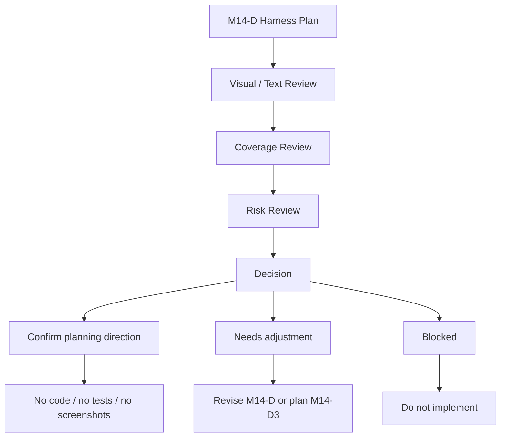

# M14-D2: Device/Accessibility Review Harness Visual Review

Stand: 2026-06-06

Status: `Review gestartet / keine Harness-Freigabe`

## 1. Ziel

Dieses Dokument prueft den M14-D Review-Harness-Plan visuell und inhaltlich.
Es bewertet, ob die geplanten Device-/Accessibility-/Text-Containment-/
Tap-Target-/QA-Pruefungen verstaendlich, vollstaendig, nicht zu
implementierungsnah und guardrail-konform sind.

M14-D2 ist nur Review. Es ist keine Harness-Implementierung, keine
Test-Erstellung, kein Flutter-Code, keine App-Integration, keine finale UI,
keine Runtime-Konfiguration und keine Implementierungsfreigabe.

Visualisierung erfolgt nur dokumentarisch:

- ASCII-Review-Overlays,
- ASCII-Device-Frames,
- ASCII-Harness-Review-Skizzen,
- Mermaid-Flows,
- Markdown-Tabellen,
- Device-/Accessibility-/Tap-Target-/Text-Containment-Review-Checklisten.

Es werden keine PNGs, keine Screenshots, keine Tests, keine Spielassets und
keine Asset-Dateien erzeugt.

## 2. Gepruefte Grundlage

Geprueft wurde:

- `docs/world_design/303-device-accessibility-review-harness-plan.md`
- die dort enthaltenen ASCII-Harness-Frames:
  - Small Phone Foundation Choice Check,
  - Small Phone Word-to-Island Suggestion Check,
  - Sense Selection Check,
  - ContainerOpenView Tap-Zone Check,
  - DetailInteractionView Focus Check,
  - Tali/Vori Overlay Collision Check,
  - Blocked State / Guardrail Copy Check.
- Review-Harness-Ziel,
- Product-Bereich-Matrix,
- Device-Klassen,
- Accessibility-/UX-Pruefkategorien,
- Review-Harness-State-Modell,
- Stop-Regeln aus M14-D.

Review-Frage:

Kann M14-D als Review-Harness-Plan bestaetigt werden, ohne dass daraus eine
Harness-Implementierung, Tests, Screenshots, Flutter-/Dart-Code, finale UI,
Runtime-Konfiguration, App-/Assetfreigabe oder `frame_started` abgeleitet
werden?

## 3. Visuelle / Harness-Pruefung

### 3.1 Gesamtbewertung

| Prueffrage | Bewertung | Risiko | Hinweis |
| --- | --- | --- | --- |
| Wird klar, dass der Harness kein Nutzerfeature ist? | Ja | Harness-Begriff kann produktnah wirken | weiter als Review-only markieren |
| Wird klar, dass der Harness keine finale App-UI ist? | Ja | ASCII-Frames koennen wie UI-Skizzen wirken | "keine finale UI" wiederholen |
| Gibt M14-D/M14-D2 Code oder Tests frei? | Nein | Harness-Plan kann zu Implementierungswunsch fuehren | Stop-Regeln hart halten |
| Sind Foundation Choice, Word-to-Island, Sense Selection, Fallbacks, Container, Pagination, Tali/Vori, Safe Exit und Blocked States abgedeckt? | Ja | Challenge/Companion-Sonderfaelle bleiben spaeter | fuer M14-D ausreichend |
| Ist Small Phone Portrait als Leitfall erkennbar? | Ja | Standard/Large Phone duerfen Scope nicht vergroessern | Small Phone bleibt kritisch |
| Sind Standard, Large, Landscape und Tablet korrekt eingeordnet? | Ja | Tablet kann zu Zusatzkomplexitaet fuehren | Folge-/Risikofaelle bleiben spaeter |
| Sind Text-Containment, Tap-Ziele, Safe Areas und Companion Collision sichtbar? | Ja | echte Device-/Pixelpruefung fehlt | M14-D plant nur Review |
| Sind Fallbacks neutral und nicht als Verlust/Bauauftrag gerahmt? | Ja | Blueprint kann bauartig klingen | Fallback-Copy weiter pruefen |
| Sind Sensitive/Growth Safety Copy und Runtime-Misread-Prevention beruecksichtigt? | Ja | Safety/Growth koennen bei spaeterer UI kippen | M13-G/M13-H bleiben Gates |
| Werden Screenshots, PNGs, Tests, Widget-Tests oder Flutter-Dateien suggeriert? | Nein | "Review-/Test-Typ" kann missverstanden werden | immer als spaeter markieren |
| Wird kein `frame_started` oder Bauzustand abgeleitet? | Ja | Blueprint/Fallback nicht mit Bau verwechseln | Bauzustaende blockiert |

### 3.2 Review-Fazit Zur Harness-Wirkung

M14-D ist als Review-Harness-Plan verstaendlich und hinreichend breit
angelegt. Der Plan macht klar, dass spaetere Product-Preview-Zustaende nicht
nur inhaltlich, sondern auch auf Device-Lesbarkeit, Accessibility, Tap-Ziele,
Safe Areas, Text-Containment, Companion-Ueberdeckung, Fallback-Sichtbarkeit
und Guardrail-Copy geprueft werden muessen.

Der wichtigste Schutz ist die wiederholte Trennung zwischen Harness-Plan und
Harness-Implementierung. M14-D bleibt auf der richtigen Seite dieser Grenze,
solange die Begriffe `harness_passed`, `checked` und `preview_state_loaded`
nicht als Teststatus, Runtime-State oder App-Integration gelesen werden.

## 4. ASCII-Harness-Frames Im Review

### 4.1 Small Phone Foundation Choice Check

| Pruefpunkt | Review Result | Hinweis |
| --- | --- | --- |
| Kartenstack verstaendlich | Ja | Small Phone als Leitfall klar |
| Safe Exit sichtbar | Ja | Secondary Action bleibt sichtbar |
| Kein Pflicht-Hausstart | Ja | Zuhause ist nur eine Karte |
| Text-Containment markiert | Ja | "Text fit?" ist als Review-Hinweis brauchbar |

Guardrail:

- Keine finale Foundation-Choice-UI.
- Keine App-Integration.
- Keine Runtime-State-Ableitung.

### 4.2 Small Phone Word-to-Island Suggestion Check

| Pruefpunkt | Review Result | Hinweis |
| --- | --- | --- |
| Vorschlag statt Platzierung | Ja | Suggestion Zone bleibt Vorschlag |
| Nutzerentscheidung sichtbar | Ja | Bestaetigen/Aendern/Codex/Spaeter sichtbar |
| Fallback sichtbar | Ja | Codex und Spaeter bleiben erreichbar |

Guardrail:

- Keine automatische Wortplatzierung.
- Keine finale Word-to-Island-UI.
- Keine Routing-Datenstruktur.

### 4.3 Sense Selection Check

| Pruefpunkt | Review Result | Hinweis |
| --- | --- | --- |
| Wenige Optionen | Ja | zwei Beispieloptionen sind plausibel |
| Keine automatische Bedeutung | Ja | Nutzer waehlt Bedeutung |
| Keine technischen Labels | Ja | keine internen Routing-Begriffe |

Guardrail:

- Keine automatische Sense-Wahl.
- Keine Runtime-Konfiguration.
- Keine Tests aus diesem Frame.

### 4.4 ContainerOpenView Tap-Zone Check

| Pruefpunkt | Review Result | Hinweis |
| --- | --- | --- |
| Tap-Zonen plausibel | Ja als Planung | echte Device-Pruefung bleibt offen |
| Keine Inventarliste | Ja | drei Objekte bleiben begrenzt |
| Labels in Grenzen | Ja | Label Zone ist sichtbar |

Guardrail:

- Keine finale ContainerOpenView-UI.
- Keine finale Hitbox-Konfiguration.
- Keine Container-Implementierung.

### 4.5 DetailInteractionView Focus Check

| Pruefpunkt | Review Result | Hinweis |
| --- | --- | --- |
| Fokusobjekt klar | Ja | Focus Object Zone dominiert |
| Keine Assetableitung | Ja | "no asset inference" ist klar |
| Secondary Choices begrenzt | Ja | map/rope reichen als Vergleich |

Guardrail:

- Keine finale DetailInteractionView-UI.
- Keine Spielasset-Ableitung.
- Kein finaler Focus-Object-Renderer.

### 4.6 Tali/Vori Overlay Collision Check

| Pruefpunkt | Review Result | Hinweis |
| --- | --- | --- |
| Exclusion Zone verstaendlich | Ja | Bubble-Zone ist klar getrennt |
| Aktive Zonen geschuetzt | Ja | Active Card / Focus Object ist markiert |
| Buttons geschuetzt | Ja | "Do not cover buttons" ist eindeutig |

Guardrail:

- Keine Companion-UI-Implementierung.
- Keine finale Bubble-Position.
- Keine App-Integration.

### 4.7 Blocked State / Guardrail Copy Check

| Pruefpunkt | Review Result | Hinweis |
| --- | --- | --- |
| Neutral genug | Ja | Planning-Block statt Fehlermeldung |
| Nicht wie App-Fehler | Ja | ruhige Guardrail-Copy |
| Keine Code-/Runtime-Ableitung | Ja | Stopps sind explizit |

Guardrail:

- Keine finale App-Copy.
- Keine Runtime-State-Ableitung.
- Kein Implementierungsauftrag.

## 5. Pruefkategorien Im Review

| Kategorie | Ziel verstaendlich? | Gute Auspraegung ausreichend? | Blocker vollstaendig? | M14-Flows passend? | Spaeterer Review-/Test-Typ korrekt als spaeter? | Review-Hinweis |
| --- | --- | --- | --- | --- | --- | --- |
| Text Containment | Ja | Ja | Ja | Ja | Ja | Kernkategorie fuer alle Product Previews |
| Tap Target Spacing | Ja | Ja | Ja | Ja | Ja | echte Werte bleiben spaeter |
| Safe Area Compliance | Ja | Ja | Ja | Ja | Ja | Small Phone kritisch |
| Focus Order | Ja | Ja | Ja | Ja | Ja | wichtig fuer Word und Container |
| Color Independence | Ja | Ja | Ja | Ja | Ja | nicht nur Farbe |
| Motion Reduction | Ja | Ja | Ja | Ja | Ja | spaeter bei Companion/Animation |
| Audio Independence | Ja | Ja | Ja | Ja | Ja | keine Audio-only-Hinweise |
| Companion Overlay Safety | Ja | Ja | Ja | Ja | Ja | Tali/Vori-Zone hart pruefen |
| Pagination Visibility | Ja | Ja | Ja | Ja | Ja | nicht dominant formulieren |
| Fallback Visibility | Ja | Ja | Ja | Ja | Ja | Codex/Backlog nicht als Verlust |
| Guardrail Copy Visibility | Ja | Ja | Ja | Ja | Ja | Stopps neutral halten |
| Sensitive/Growth Safety Copy | Ja | Ja | Ja | Ja | Ja | M13-G/M13-H bleiben fuehrend |
| Runtime/Implementation Misread Prevention | Ja | Ja | Ja | Ja | Ja | zentrale M14-D2-Leitplanke |

Kategorie-Fazit:

Die Kategorien sind fuer einen spaeteren Review-Harness-Plan vollstaendig
genug. Die einzige scharfe Grenze bleibt sprachlich: "spaeterer Review-/
Test-Typ" darf nicht als aktuelle Test-Erstellung verstanden werden.

## 6. Harness-State-Regeln Im Review

Diese Zustaende bleiben Review-Harness-Planungszustaende, keine
Runtime-State-Definition und keine Test-Implementierung.

| Harness State | Review Result | Guardrail |
| --- | --- | --- |
| `harness_candidate` | brauchbar | keine Implementierung |
| `device_profile_selected` | brauchbar | kein Runtime-Breakpoint |
| `preview_state_loaded` | brauchbar, aber riskant | keine App-Integration |
| `text_containment_checked` | brauchbar | kein Screenshot-Test |
| `tap_targets_checked` | brauchbar, aber riskant | keine finale Hitbox-Konfiguration |
| `safe_area_checked` | brauchbar | keine Layout-Implementierung |
| `accessibility_checked` | brauchbar, aber riskant | keine Compliance-Freigabe |
| `companion_collision_checked` | brauchbar | keine Companion-Implementierung |
| `guardrail_copy_checked` | brauchbar | keine finale App-Copy |
| `harness_passed` | brauchbar, aber klar begrenzen | keine Implementierungsfreigabe |
| `harness_needs_adjustment` | stark | Plan nachbessern, kein Code |
| `harness_blocked` | stark | Umsetzung stoppen |

Klarstellungen:

- Harness States sind keine Runtime-State-Definition.
- `harness_passed` ist keine Implementierungsfreigabe.
- `preview_state_loaded` ist keine App-Integration.
- `tap_targets_checked` erzeugt keine finale Hitbox-Konfiguration.
- `accessibility_checked` ist keine Compliance-Freigabe.
- `guardrail_copy_checked` ist keine finale App-Copy.

## 7. Textuelle Review-Visualisierungen

### 7.1 Mermaid Review Flow



### 7.2 ASCII Review Overlay: Guter Harness-Review-Zustand

```text
+--------------------------------------+
| HARNESS REVIEW: DEVICE FRAME         |
| +----------------------------------+ |
| | SAFE AREA                        | |
| |                                  | |
| | TEXT CONTAINMENT ZONE            | |
| | +------------------------------+ | |
| | | Copy stays inside frame      | | |
| | +------------------------------+ | |
| |                                  | |
| | TAP TARGET ZONE                  | |
| | [ target ]       [ target ]      | |
| |                                  | |
| | COMPANION EXCLUSION ZONE         | |
| | Bubble may not cover actions     | |
| |                                  | |
| | FALLBACK ZONE                    | |
| | [ Codex ] [ Backlog ] [ Later ]  | |
| |                                  | |
| | GUARDRAIL COPY ZONE              | |
| | Review-only / no code / no tests | |
| +----------------------------------+ |
+--------------------------------------+
```

Review-Hinweis:

- Dieses Overlay ist Review-Material.
- Es ist keine Nutzeransicht.
- Es erzeugt keine Screenshots, Tests oder App-UI.

### 7.3 Harness Area / Review Result / Risk / Required Adjustment

| Harness Area | Review Result | Risk | Required Adjustment |
| --- | --- | --- | --- |
| Foundation Choice | bestaetigbar | Pflicht-Hausstart | Safe Exit sichtbar halten |
| Word-to-Island Suggestion | bestaetigbar | automatische Platzierung | Vorschlag/Nutzerwahl betonen |
| Sense Selection | bestaetigbar | zu viele Optionen | wenige Bedeutungen |
| Fallbacks | bestaetigbar | Verlust/Bauauftrag | neutral formulieren |
| ContainerOpenView | bestaetigbar | Inventarliste | Fokus + wenige Objekte |
| DetailInteractionView | bestaetigbar | Assetableitung | Preview-only markieren |
| Pagination | bestaetigbar | Slot-/Progressdruck | ruhige Copy |
| Tali/Vori Bubble | bestaetigbar | Collision | Exclusion Zone pruefen |
| Blocked States | bestaetigbar | App-Fehler-Ton | neutrale Guardrail-Copy |

### 7.4 Good / Needs Adjustment / Blocked

| Good | Needs Adjustment | Blocked |
| --- | --- | --- |
| Review-only Harness-Plan | "Review-/Test-Typ" immer als spaeter markieren | Harness-Implementierung |
| Small Phone Portrait als Leitfall | echte Device-Werte spaeter pruefen | Tests oder Widget-Tests |
| ASCII-Device-Frames | "checked" nicht als Teststatus lesen | Screenshots oder PNGs |
| Tap-/Text-/Safe-Area-Zonen | Hitbox-Werte nicht finalisieren | Flutter-/Dart-Dateien |
| Tali/Vori Exclusion | Bubble-Position nicht finalisieren | App-Integration |
| Fallback-Sichtbarkeit | Blueprint nicht bauartig formulieren | Runtime-Konfiguration |
| Guardrail Copy | Copy spaeter produktnah kuerzen | Code-/Assetfreigabe |

### 7.5 Decision Tree: Darf Aus M14-D2 Code Oder Tests Entstehen?

```text
Start: M14-D2 Review abgeschlossen?
 |
 +-- Nein -> Weiter dokumentarisch pruefen.
 |
 +-- Ja -> Wurden Code oder Tests explizit in einem eigenen Implementierungs-
          Prompt freigegeben?
          |
          +-- Nein -> Kein Code. Keine Tests. Keine Screenshots.
          |
          +-- Ja -> Nicht durch M14-D2; eigener Gate-/Implementierungsblock noetig.
```

### 7.6 Check Category / Review Result / Main Guardrail

| Check Category | Review Result | Main Guardrail |
| --- | --- | --- |
| Text Containment | bestaetigbar | keine Texte ausserhalb von Boxen |
| Tap Target Spacing | bestaetigbar | keine finalen Hitbox-Werte |
| Safe Area Compliance | bestaetigbar | kein Layout-Code |
| Color Independence | bestaetigbar | keine reine Farbbedeutung |
| Companion Overlay Safety | bestaetigbar | keine Bubble-Implementierung |
| Fallback Visibility | bestaetigbar | kein Verlust-/Bauauftrag-Framing |
| Sensitive/Growth Safety Copy | bestaetigbar | M13-G/M13-H bleiben Gates |
| Runtime Misread Prevention | zentral | keine State-/Persistenzableitung |

## 8. Risiken Und Harte Blocker

Harte Blocker:

- Review wird als Harness-Implementierungsfreigabe gelesen.
- Harness wird als Nutzerfeature gelesen.
- Harness wird als finale App-UI gelesen.
- Review erzeugt Tests, Widget-Tests oder Flutter-Code.
- Review erzeugt Screenshots oder PNGs.
- Product Preview wirkt wie finale UI.
- Text laeuft aus Karten/Rahmen/Panels.
- Tap-Ziele sind zu klein oder ueberlappen.
- Tali/Vori verdeckt Buttons, Karten, Fokusobjekte oder Pagination.
- Auswahl ist nur ueber Farbe erkennbar.
- Audio-only-Hinweise ohne Text-Fallback.
- Bewegung ohne reduzierte Alternative.
- Safe Exit / Later Decision ist versteckt.
- Codex/Blueprint/Backlog wirkt wie Verlust oder Bauauftrag.
- Sensitive/Growth-Texte erzeugen Druck, Beratung oder Dramatisierung.
- Runtime-State oder Persistenz wird abgeleitet.
- Code-, Test-, Asset- oder App-Freigabe wird abgeleitet.

Zusaetzliche Review-Risiken:

- `harness_passed` klingt stark und muss weiter als Planungsstatus markiert
  bleiben.
- "Review-/Test-Typ" kann wie Test-Erstellung wirken und muss als spaeterer
  moeglicher Prueftyp gelesen werden.
- ASCII-Device-Frames koennen produktnah wirken, sind aber nur Review-Skizzen.

## 9. Entscheidungsempfehlung

Optionen:

1. M14-D als Review-Harness-Plan bestaetigen.
2. M14-D mit kleinen Nachbesserungen bestaetigen.
3. M14-D erneut nachbessern.
4. M14-D blockieren, weil zu implementierungsnah.

Empfehlung:

M14-D sollte grundsaetzlich als Review-Harness-Plan bestaetigt werden.

Kleine Hinweise fuer spaetere Bloecke:

- `harness_passed` immer als Planungs-/Reviewstatus markieren.
- "Review-/Test-Typ" immer als spaeter moeglich, nicht jetzt, formulieren.
- Blueprint/Fallback nie als Bauauftrag formulieren.
- Device-Werte, Hitboxes und Accessibility-Abschluesse nicht finalisieren.

Naechster sinnvoller Schritt:

- M14-E Small Implementation Slice Candidate Review, aber nur als
  Gate-Dokument, oder
- M14-D3 Harness Scope Refinement, falls der Scope weiter verengt werden soll.

Keine Freigabe:

- keine Harness-Implementierung,
- keine Tests,
- keine Widget-Tests,
- kein Flutter-Code,
- keine Screenshots,
- keine Codefreigabe,
- keine App-Integration,
- keine finale UI,
- keine Assetfreigabe,
- keine Runtime-Konfiguration,
- kein `frame_started`.

## 10. Stop-Regeln

- Keine Harness-Implementierung aus M14-D2.
- Keine Tests aus M14-D2.
- Keine Widget-Tests aus M14-D2.
- Keine Flutter-/Dart-Dateien aus M14-D2.
- Keine App-Integration aus M14-D2.
- Keine finale UI aus M14-D2.
- Keine finale Datenstruktur aus M14-D2.
- Keine Runtime-Konfiguration aus M14-D2.
- Keine Codefreigabe aus M14-D2.
- Keine Implementierungsfreigabe aus M14-D2.
- Keine Assetfreigabe aus M14-D2.
- Keine PNG-Erzeugung aus M14-D2.
- Keine Screenshots aus M14-D2.
- Keine Spielassets aus M14-D2.
- Kein `frame_started` oder Bauzustand aus M14-D2.

## 11. Review-Fazit

M14-D ist als Device/Accessibility Review Harness Plan brauchbar. Die
Abdeckung der Product-Bereiche, Device-Klassen, Accessibility-/UX-Kategorien,
ASCII-Harness-Frames und Planungszustaende reicht fuer eine erste
systematische Review-Grundlage aus.

Der Review bestaetigt nur die Planungsrichtung. M14-D2 erzeugt keine
Harness-Implementierung, keine Tests, keine Widget-Tests, keine Flutter-/Dart-
Dateien, keine Screenshots, keine PNGs, keine finale UI, keine Runtime-
Konfiguration, keine App-/Assetfreigabe, keinen Code und kein `frame_started`.
