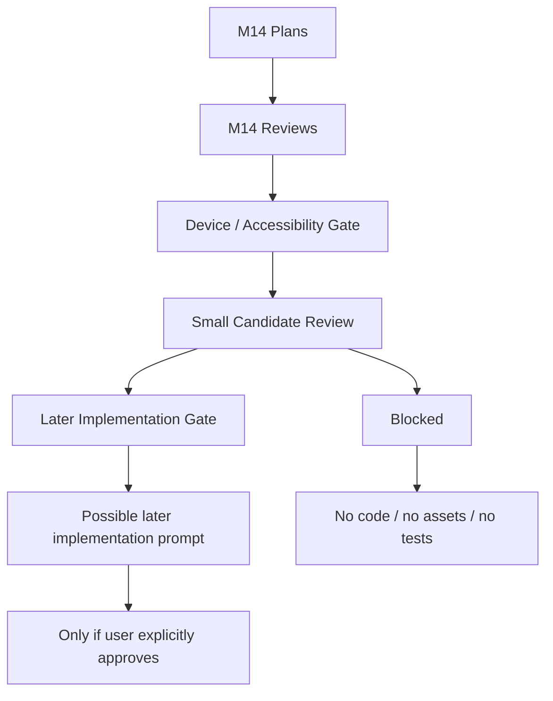

# M14-E: Small Implementation Slice Candidate Review

Stand: 2026-06-06

Status: `Gate-Review gestartet / keine Implementierungsfreigabe`

## 1. Ziel

Dieses Dokument prueft, ob aus den bisherigen M14-Planungs- und
Reviewbloecken ein sehr kleiner spaeterer Implementierungs-Slice denkbar
waere. Es gibt ausdruecklich keine Implementierung frei.

M14-E ist nur ein Gate-/Readiness-Review. Es ist kein Implementierungsauftrag,
keine Codefreigabe, keine Testfreigabe, keine App-Integration, keine
Runtime-Konfiguration und keine Assetfreigabe.

Visualisierung erfolgt nur dokumentarisch:

- ASCII-Gate-Flows,
- ASCII-Decision-Maps,
- Mermaid-Flows,
- Markdown-Tabellen,
- Readiness-/Blocker-/Scope-Matrizen.

Es werden keine PNGs, keine Screenshots, keine Tests, keine Widget-Tests,
keine Flutter-/Dart-Dateien, keine Spielassets und keine Asset-Dateien
erzeugt.

## 2. Readiness-Level

| Readiness-Level | Bedeutung | Wichtige Grenze |
| --- | --- | --- |
| `not-a-candidate` | fuer Implementierung aktuell nicht sinnvoll | nicht weiter planen, wenn Scope falsch ist |
| `planning-only` | nur Dokumentations-/Planungsstand | keine Product Preview oder Codeableitung |
| `review-candidate-later` | spaeterer Review- oder Product-Preview-Kandidat | braucht eigenen Reviewblock |
| `harness-candidate-later` | spaeterer Harness-Kandidat denkbar | braucht eigenes Harness-Implementierungs-Gate |
| `implementation-candidate-later` | sehr kleiner spaeterer Implementierungs-Slice denkbar | keine aktuelle Codefreigabe |
| `blocked` | aktuell hart blockiert | keine Umsetzung ohne neue Grundlagen |

Auch `implementation-candidate-later` bedeutet keine aktuelle Codefreigabe.

## 3. Minimal-Slice-Kriterien

Ein spaeterer sehr kleiner Implementierungs-Slice darf nur erneut geprueft
werden, wenn alle harten Kriterien erfuellt sind:

- klarer Nutzerwert,
- extrem kleiner Scope,
- fuehrendes Dokument vorhanden,
- Review/Visual Review vorhanden,
- Device-/Accessibility-Gate vorhanden,
- keine neuen Assets noetig,
- keine neuen PNGs noetig,
- keine Runtime-Konfiguration noetig,
- keine Persistenz,
- keine Supabase Writes,
- keine SRS-/`word_progress`-Aenderung,
- keine Reward Bridge,
- keine automatische Wortplatzierung,
- kein sensibler Inhalt,
- keine Growth-/Timer-Mechanik,
- kein `frame_started`,
- einfache Ruecknahme moeglich,
- Tests nur in eigenem spaeteren Implementierungs-Prompt.

Wenn ein Kriterium unklar ist, bleibt der Kandidat mindestens
`review-candidate-later` oder `harness-candidate-later`, nicht
implementierungsbereit.

## 4. Kandidatenpruefung

### 4.1 Foundation Choice Product Preview

- Denkbar als spaeterer kleiner Slice: ja, aber nur nach eigenem Gate.
- Readiness-Level: `implementation-candidate-later`.
- Benoetigte Gates:
  - finaler Scope fuer nicht-finale Product Preview,
  - Device-/Accessibility-Pruefung,
  - Copy-/Guardrail-Freeze,
  - keine Persistenz und keine finale Startinsel.
- Hauptnutzerwert: erster Lernfokus wird verstaendlich und reversibel.
- Hauptblocker: wirkt schnell wie finale Onboarding-UI oder finale Startinsel.
- Hypothetisch betroffene Dateien/Module:
  - Home-/Onboarding-nahe UI-Bereiche,
  - spaeterer lokaler Preview-/Demo-Scope,
  - keine Aenderung in M14-E.
- Erlaubter naechster Schritt: M15-A Foundation Choice Implementation Gate.
- Blockiert bleibt:
  - finale Foundation-Choice-UI,
  - finale Startinsel,
  - Persistenz,
  - App-Integration aus M14-E.

### 4.2 Word-to-Island Suggestion Card

- Denkbar als spaeterer kleiner Slice: ja, aber riskanter.
- Readiness-Level: `review-candidate-later`.
- Benoetigte Gates:
  - klare Nicht-Automatik,
  - Sense-/Fallback-Regeln,
  - Device-/Accessibility-Review,
  - keine Routing-Datenstruktur.
- Hauptnutzerwert: Nutzer versteht, dass Talvori Vorschlaege macht und nicht
  automatisch platziert.
- Hauptblocker: automatische Wortplatzierung oder Routing-Implementierung wird
  suggeriert.
- Hypothetisch betroffene Dateien/Module:
  - Product-Preview-/UX-Demo-Bereich,
  - spaeteres Word-to-Island UI-Konzept,
  - keine Aenderung in M14-E.
- Erlaubter naechster Schritt: M15-B Word-to-Island Implementation Gate oder
  weiterer Product-Preview-Review.
- Blockiert bleibt:
  - finale Word-to-Island-UI,
  - Routing-Datenstruktur,
  - automatische Wortplatzierung.

### 4.3 Sense Selection Preview

- Denkbar als spaeterer kleiner Slice: ja, aber nur als Preview.
- Readiness-Level: `review-candidate-later`.
- Benoetigte Gates:
  - Begrenzung auf wenige Bedeutungen,
  - keine automatische Sense-Wahl,
  - Device-/Text-Containment-Check.
- Hauptnutzerwert: Mehrdeutigkeit wird sichtbar und nutzerkontrolliert.
- Hauptblocker: Sense-Auswahl wird zu technisch oder zu umfangreich.
- Hypothetisch betroffene Dateien/Module:
  - Preview-nahe Word-UX-Komponenten,
  - keine Runtime-Sense-Engine.
- Erlaubter naechster Schritt: Sense Selection Product Preview Review.
- Blockiert bleibt:
  - automatische Bedeutungsentscheidung,
  - Runtime-Konfiguration,
  - Tests aus M14-E.

### 4.4 Codex/Blueprint/Backlog Fallback Preview

- Denkbar als spaeterer kleiner Slice: ja, aber getrennt betrachten.
- Readiness-Level: `review-candidate-later`.
- Benoetigte Gates:
  - positive Fallback-Copy,
  - Blueprint nicht als Bauauftrag,
  - Codex nicht als Verlust.
- Hauptnutzerwert: Nutzer hat sichere, reversible Wege fuer unklare Woerter.
- Hauptblocker: Blueprint wird als Bauzustand oder Codex als Strafe gelesen.
- Hypothetisch betroffene Dateien/Module:
  - Preview-Fallback-UI,
  - spaeterer Codex-/Blueprint-/Backlog-Konzeptbereich,
  - keine Persistenz.
- Erlaubter naechster Schritt: Fallback Scope Review.
- Blockiert bleibt:
  - Persistenz,
  - Bauzustand,
  - finale Datenstruktur.

### 4.5 ContainerOpenView Product Preview

- Denkbar als spaeterer kleiner Slice: nur als spaetere Product Preview.
- Readiness-Level: `review-candidate-later`.
- Benoetigte Gates:
  - Container-QA-Gates,
  - Device-/Tap-Target-Pruefung,
  - keine Inventarliste,
  - keine neuen Assets.
- Hauptnutzerwert: kleine Objekte werden als Lernmoment statt IslandView-
  Clutter gezeigt.
- Hauptblocker: wird schnell finale Container-UI oder Inventarverwaltung.
- Hypothetisch betroffene Dateien/Module:
  - Preview-nahe Container-UI,
  - keine Container-Implementierung.
- Erlaubter naechster Schritt: M14-C3 Visual Product Preview Plan oder
  Container Implementation Gate spaeter.
- Blockiert bleibt:
  - finale ContainerOpenView-UI,
  - Container-Implementierung,
  - Assetproduktion.

### 4.6 DetailInteractionView Product Preview

- Denkbar als spaeterer kleiner Slice: spaeter, aber nicht jetzt.
- Readiness-Level: `review-candidate-later`.
- Benoetigte Gates:
  - Fokusobjekt-Regeln,
  - keine Assetableitung,
  - Device-/Tap-Target-Pruefung.
- Hauptnutzerwert: ein kleines oder komplexes Objekt kann fokussiert gelernt
  werden.
- Hauptblocker: Focus Object wird als Spielasset oder finale UI gelesen.
- Hypothetisch betroffene Dateien/Module:
  - Preview-nahe Detail-UI,
  - keine Renderer- oder Asset-Aenderung.
- Erlaubter naechster Schritt: DetailInteraction Product Preview Review.
- Blockiert bleibt:
  - finale DetailInteractionView-UI,
  - Focus-Object-Renderer,
  - neue Assets.

### 4.7 Device/Accessibility Review Harness

- Denkbar als spaeterer kleiner Slice: ja, als Harness-Kandidat.
- Readiness-Level: `harness-candidate-later`.
- Benoetigte Gates:
  - eigener Harness-Implementierungs-Gateblock,
  - klarer Nicht-Nutzerfeature-Scope,
  - Test-/Screenshot-Regeln,
  - keine produktive UI.
- Hauptnutzerwert: spaetere Previews koennen systematisch gegen Device- und
  Accessibility-Risiken geprueft werden.
- Hauptblocker: Harness wird als App-Feature, Test-Suite oder Screenshot-
  Pipeline aus M14-E abgeleitet.
- Hypothetisch betroffene Dateien/Module:
  - spaeterer isolierter Review-/Harness-Bereich,
  - ggf. Test-/Tooling-Bereich erst nach Freigabe,
  - keine Aenderung in M14-E.
- Erlaubter naechster Schritt: eigenes Harness Implementation Gate, nicht
  Implementierung aus M14-E.
- Blockiert bleibt:
  - Harness-Implementierung,
  - Tests,
  - Widget-Tests,
  - Screenshots,
  - Flutter-Code.

### 4.8 Existing Mock-Slice Review Extension

- Denkbar als spaeterer kleiner Slice: theoretisch, aber stark begrenzt.
- Readiness-Level: `review-candidate-later`.
- Benoetigte Gates:
  - Bezug auf bestehenden 2E/2F-Mock-Slice,
  - keine neuen Bauzustaende,
  - keine neuen Assets,
  - Ruecknahme einfach.
- Hauptnutzerwert: bestehende Waldlichtung-Mock-Erfahrung koennte reviewbar
  bleiben.
- Hauptblocker: Scope driftet zu Bauzustand, Asset oder Welt-Implementierung.
- Hypothetisch betroffene Dateien/Module:
  - bestehender lokaler Mock-Slice,
  - keine Aenderung in M14-E.
- Erlaubter naechster Schritt: eigener Mock-Slice Scope Gate.
- Blockiert bleibt:
  - neue Assets,
  - neue Bauzustaende,
  - `frame_started`.

### 4.9 `frame_started` / Rohbau

- Denkbar als spaeterer kleiner Slice: nein.
- Readiness-Level: `blocked`.
- Benoetigte Gates:
  - Masterlayout,
  - Plot-Typen,
  - Anchors,
  - Sockets,
  - Footprints,
  - Device-/Preview-Checks,
  - Asset-Gates.
- Hauptnutzerwert: aktuell nicht bewertbar.
- Hauptblocker: notwendige Layout-/Asset-/Systemgrundlagen fehlen weiterhin.
- Hypothetisch betroffene Dateien/Module:
  - Build-State-/Asset-/Rendering-Bereiche,
  - keine Aenderung in M14-E.
- Erlaubter naechster Schritt: keiner fuer Implementierung; nur separate
  Planungs-/Gatebloecke.
- Blockiert bleibt:
  - Rohbau-Freigabe,
  - `frame_started.png`,
  - Bauzustand,
  - Assetproduktion.

## 5. Kandidatenmatrix

| Candidate | Readiness | User Value | Missing Gates | Main Risk | Allowed Next Step | Explicitly Blocked |
| --- | --- | --- | --- | --- | --- | --- |
| Early Onboarding Foundation Choice | `implementation-candidate-later` | erster Lernfokus | eigener Implementation Gate, Device final review | finale Startinsel | M15-A Gate | finale UI, Persistenz |
| Foundation Choice Device/Accessibility Harness | `harness-candidate-later` | pruefbarer Mobile-Fit | Harness-Gate | Test-/Screenshot-Ableitung | Harness Scope Gate | Tests, Screenshots |
| Word-to-Island Suggestion Card | `review-candidate-later` | Vorschlag erklaeren | Route-/Sense-Gates | automatische Platzierung | M15-B Gate | Routing-Code |
| Sense Selection | `review-candidate-later` | Mehrdeutigkeit klaeren | Option-Limit, Copy | technische UX | Product Review | automatische Sense-Wahl |
| Codex-only Fallback | `review-candidate-later` | sicherer Fallback | positive Copy | wirkt wie Verlust | Fallback Review | Persistenz |
| Blueprint Fallback | `review-candidate-later` | vormerken ohne Platzierung | Bauauftrag-Schutz | Bauzustand | Fallback Review | Bauzustand |
| Container QA Overlay | `harness-candidate-later` | QA gegen Clutter | Harness-Gate | QA als UI | M14-D3/M14-C3 | finale UI |
| ContainerOpenView Preview | `review-candidate-later` | kleine Objekte fokussieren | Device/Tap | Inventarliste | M14-C3 | Implementierung |
| DetailInteractionView Preview | `review-candidate-later` | Fokusobjekt lernen | Asset-/Device-Gate | Assetableitung | Detail Review | neue Assets |
| Device/Accessibility Review Harness | `harness-candidate-later` | systematische Pruefung | eigener Harness-Gate | Tests aus M14-E | Harness Gate | Harness-Code |
| Existing Forest Clearing Mock Extension | `review-candidate-later` | vorhandenen Slice pruefen | Scope Gate | Bau-/Asset-Scope | Mock Gate | neue Bauzustaende |
| `frame_started` | `blocked` | aktuell nicht bewertbar | Masterlayout/Anchors/Assets | Rohbau-Freigabe | keiner | `frame_started` |
| New Assets | `blocked` | aktuell kein Nutzerwert ohne Gate | Asset Scope Gate | Assetproduktion aus Planung | Asset Gate spaeter | Asset-Dateien |
| Growth/Garden Mechanics | `blocked` | spaeter Motivation | Fairness-/Timer-Gate | Druck/Retention | M13-H Folgegate | Timer/Growth-Code |
| Sensitive/Special Content | `blocked` | spaeter neutraler Kontext | Policy-/Safety-Gate | Dramatisierung/Beratung | M13-G Folgegate | sensible Visualisierung |

## 6. Textuelle Gate-Visualisierungen

### 6.1 Mermaid Gate Flow



### 6.2 ASCII Decision Flow: Warum M14-E Keine Codefreigabe Ist

```text
M14-E fragt: Ist ein kleiner Slice denkbar?
 |
 +-- Ja, spaeter vielleicht
 |    |
 |    +-- Braucht eigenes Gate
 |    +-- Braucht Nutzerfreigabe
 |    +-- Braucht separaten Implementierungs-Prompt
 |
 +-- Nein oder unklar
      |
      +-- bleibt Review / Harness / Blocked

Ergebnis jetzt: Kein Code. Keine Tests. Keine Assets.
```

### 6.3 Candidate / Readiness / Gate / Blocker / Next Step

| Candidate | Readiness | Gate | Blocker | Next Step |
| --- | --- | --- | --- | --- |
| Foundation Choice | `implementation-candidate-later` | M15-A | finale Startinsel | eigenes Gate |
| Word Suggestion | `review-candidate-later` | M15-B | automatische Platzierung | Review/Gate |
| Sense Selection | `review-candidate-later` | UX Gate | technische Auswahl | Preview Review |
| Codex Fallback | `review-candidate-later` | Copy Gate | Verlustgefuehl | Fallback Review |
| ContainerOpenView | `review-candidate-later` | Device/Tap Gate | Inventarliste | M14-C3 |
| Harness | `harness-candidate-later` | Harness Gate | Testableitung | eigener Gate |
| Mock Extension | `review-candidate-later` | Scope Gate | Bau-Scope | Mock Gate |
| `frame_started` | `blocked` | Masterlayout/Asset Gates | Rohbau | keiner |

### 6.4 Good / Blocked Fuer Small Implementation Slice Candidate Review

| Good | Blocked |
| --- | --- |
| klare spaetere Kandidaten benennen | direkte Implementierung |
| Readiness-Level verwenden | Codefreigabe |
| Missing Gates sichtbar machen | Tests aus M14-E |
| hypothetische Module nur nennen | Dateien/Module aendern |
| `implementation-candidate-later` eng begrenzen | aktuelle Implementierungsfreigabe |
| `frame_started` blockieren | Rohbau-Freigabe |
| Assets separat gaten | neue Asset-Dateien |

### 6.5 Decision Tree: Darf Jetzt Code Entstehen?

```text
Darf aus M14-E jetzt Code entstehen?
 |
 +-- Nein.
     |
     +-- Ist ein Kandidat spaeter denkbar?
         |
         +-- Ja -> eigenes Gate + eigener Implementierungs-Prompt noetig.
         |
         +-- Nein -> blocked / planning-only.
```

## 7. Einzelentscheidung Zu `frame_started`

`frame_started` bleibt kein Implementierungs-Kandidat.

Grund:

- Masterlayout fehlt weiterhin als freigegebene Umsetzungsgrundlage.
- Plot-Typen fehlen fuer produktive Bauzustandsableitung.
- Anchors, Sockets und Footprints sind nicht final implementierungsbereit.
- Device-/Preview-Checks fuer Rohbau fehlen.
- Asset-Gates fuer neue Bauzustaende fehlen.

Aus M14-E darf keine Rohbau-Freigabe entstehen. Kein Bauzustand darf aus
Product Preview, Harness Review oder Candidate Review abgeleitet werden.

## 8. Einzelentscheidung Zu Device/Accessibility Harness

Ein spaeterer Device-/Accessibility-Harness koennte wertvoll sein, weil
Foundation Choice, Word-to-Island, Sense Selection, Fallbacks, Container und
Tali/Vori-Ueberdeckung spaeter systematisch pruefbar sein muessen.

Aber:

- M14-D gibt keine Harness-Implementierung frei.
- M14-D2 gibt keine Harness-Implementierung frei.
- M14-E gibt keine Harness-Implementierung frei.
- Vor Harness-Code braucht es ein eigenes Implementierungs-Gate.
- Aus M14-E entstehen keine Tests, keine Widget-Tests, keine Screenshots und
  kein Flutter-Code.

Readiness:

- `harness-candidate-later`, nicht `implementation-candidate-later`.

## 9. Entscheidungsempfehlung

Optionen:

1. Noch keine Implementierungskandidaten.
2. Nur spaetere Review-/Harness-Kandidaten.
3. Ein sehr kleiner spaeterer Implementierungs-Kandidat denkbar.
4. Direkte Implementierung freigeben.

Empfehlung:

Keine direkte Implementierungsfreigabe.

Spaetere Review-/Harness-Kandidaten sind denkbar. Ein sehr kleiner spaeterer
Implementierungs-Kandidat koennte nach weiterem Gate denkbar sein, vor allem
Foundation Choice als streng begrenzter, reversibler Product-Preview-Slice.
Das ist aber nicht jetzt freigegeben.

Vor Code braucht es:

- M14-F Actual Implementation Prompt oder einen eigenen Implementierungsblock,
- ausdrueckliche Nutzerfreigabe,
- klaren Minimal-Scope,
- eigene Testentscheidung,
- keine neuen Assets,
- keine Runtime-Konfiguration,
- keine Persistenz.

Weiter blockiert:

- `frame_started`,
- neue Assets,
- Growth/Garden-Mechaniken,
- Sensitive/Special Content,
- Runtime-Konfiguration,
- automatische Wortplatzierung.

## 10. Moegliche FolgeBloecke

- M14-F Actual Implementation Prompt, nur falls M14-E ausdruecklich spaeteren
  Minimal-Slice empfiehlt und der Nutzer freigibt.
- M14-E2 Small Implementation Slice Visual Review, falls M14-E zuerst geprueft
  werden soll.
- M14-D3 Harness Scope Refinement, falls Harness-Scope enger werden muss.
- M15-A Foundation Choice Implementation Gate, nur als spaeterer eigener
  Gate-Block.
- M15-B Word-to-Island Implementation Gate, nur als spaeterer eigener
  Gate-Block.

Nicht direkt zu Code springen.

## 11. Stop-Regeln

- Keine Implementierung aus M14-E.
- Keine Tests aus M14-E.
- Keine Widget-Tests aus M14-E.
- Keine Flutter-/Dart-Dateien aus M14-E.
- Keine App-Integration aus M14-E.
- Keine finale UI aus M14-E.
- Keine finale Datenstruktur aus M14-E.
- Keine Runtime-Konfiguration aus M14-E.
- Keine Codefreigabe aus M14-E.
- Keine Implementierungsfreigabe aus M14-E.
- Keine Assetfreigabe aus M14-E.
- Keine PNG-Erzeugung aus M14-E.
- Keine Screenshots aus M14-E.
- Keine Spielassets aus M14-E.
- Keine automatische Wortplatzierung aus M14-E.
- Kein `frame_started` oder Bauzustand aus M14-E.

## 12. Gate-Fazit

M14-E ist als Small Implementation Slice Candidate Review brauchbar. Der Block
macht sichtbar, dass einige spaetere Review-/Harness-Kandidaten denkbar sind
und ein sehr kleiner spaeterer Foundation-Choice-Slice nach weiterem Gate
theoretisch geprueft werden koennte.

Der Block gibt nichts frei. M14-E erzeugt keine Implementierung, keine Tests,
keine Widget-Tests, keine Flutter-/Dart-Dateien, keine Screenshots, keine
PNGs, keine App-Integration, keine finale UI, keine Runtime-Konfiguration,
keine App-/Assetfreigabe, keinen Code und kein `frame_started`.
