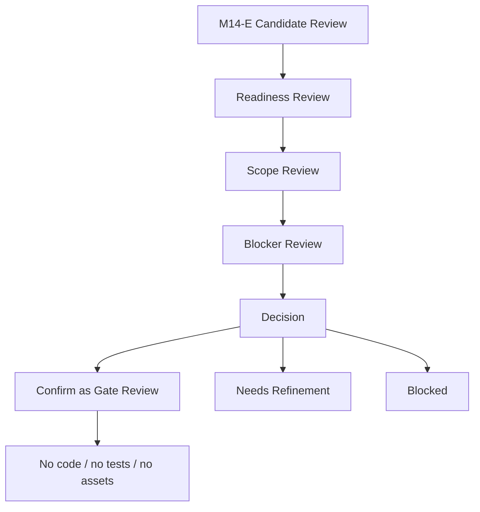

# M14-E2: Small Implementation Slice Candidate Visual Review

Stand: 2026-06-06

Status: `Visual Review gestartet / keine Implementierungsfreigabe`

## 1. Ziel

Dieses Dokument prueft M14-E visuell/textuell und bewertet, ob die
Candidate-Review-Logik verstaendlich, ausreichend vorsichtig, nicht zu
implementierungsnah und guardrail-konform ist.

M14-E2 ist nur Review. Es ist keine Implementierung, keine Codefreigabe, keine
Testfreigabe, keine App-Integration, keine Runtime-Konfiguration und keine
Assetfreigabe.

Visualisierung erfolgt nur dokumentarisch:

- ASCII-Review-Flows,
- ASCII-Decision-Maps,
- Mermaid-Flows,
- Markdown-Tabellen,
- Readiness-/Blocker-/Scope-Matrizen.

Es werden keine PNGs, keine Screenshots, keine Tests, keine Widget-Tests,
keine Flutter-/Dart-Dateien, keine Spielassets und keine Asset-Dateien
erzeugt.

## 2. Gepruefte Grundlage

Geprueft wurde:

- `docs/world_design/305-small-implementation-slice-candidate-review.md`,
- die dort definierten Readiness-Level:
  - `not-a-candidate`,
  - `planning-only`,
  - `review-candidate-later`,
  - `harness-candidate-later`,
  - `implementation-candidate-later`,
  - `blocked`,
- die Minimal-Slice-Kriterien,
- die Kandidatenpruefung,
- die Kandidatenmatrix,
- die Gate-Visualisierungen,
- die Einzelentscheidung zu `frame_started`,
- die Einzelentscheidung zu Device/Accessibility Harness,
- die Stop-Regeln aus M14-E.

M14-E2 liest diese Grundlage nicht als Freigabe, sondern als Gate-Review, das
weitere Gate-Bloecke vorbereiten kann.

## 3. Candidate-Review-Pruefung

| Prueffrage | Ergebnis | Hinweis |
| --- | --- | --- |
| Wird klar, dass M14-E keine Implementierung freigibt? | bestaetigt | Der Block nennt mehrfach keine Code-, Test-, App- oder Assetfreigabe. |
| Wird klar, dass `implementation-candidate-later` keine aktuelle Codefreigabe bedeutet? | bestaetigt mit Sprachhinweis | Der Begriff ist brauchbar, muss aber in Folgeblocken immer mit "later" und "eigenes Gate" erklaert werden. |
| Wird klar, dass vor Code ein eigenes Gate und ein separater Implementierungs-Prompt noetig sind? | bestaetigt | M14-F darf nicht automatisch entstehen; Nutzerfreigabe bleibt Pflicht. |
| Sind die Readiness-Level verstaendlich und trennscharf? | bestaetigt | `review-candidate-later`, `harness-candidate-later` und `implementation-candidate-later` bleiben unterscheidbar. |
| Sind die Minimal-Slice-Kriterien hart genug? | bestaetigt mit Ergaenzung | Explizite Nutzerfreigabe, lokaler Ruecknahmeweg und keine Feature-Flag-/Persistenzableitung sollten spaeter erneut sichtbar sein. |
| Sind alle wichtigen Kandidaten bewertet? | bestaetigt | Foundation Choice, Word-to-Island, Fallbacks, Container, Harness, Mock Extension, Assets, Growth, Sensitive und `frame_started` sind abgedeckt. |
| Werden hypothetische Dateien/Module nur genannt und nicht geaendert? | bestaetigt | M14-E bleibt dokumentarisch. |
| Wird Foundation Choice als spaeter denkbar, aber nicht jetzt freigegeben dargestellt? | bestaetigt | Hauptrisiko finale Onboarding-UI bleibt genannt. |
| Bleiben Word-to-Island, Sense Selection, Fallbacks, Container und Harness ausreichend gegated? | bestaetigt | Alle brauchen eigene Reviews, Gates oder Implementierungs-Prompts. |
| Bleibt `frame_started` klar blockiert? | bestaetigt | `frame_started` bleibt `blocked`, ohne naechsten Implementierungsschritt. |
| Bleiben neue Assets klar blockiert? | bestaetigt | Asset-Produktion bleibt an eigene Asset-Gates gebunden. |
| Bleiben Growth/Garden, Sensitive/Special, Runtime-Konfiguration und automatische Wortplatzierung blockiert? | bestaetigt | Keine direkte Ableitung aus M14-E. |
| Wird keine direkte M14-F-Codefreigabe suggeriert? | bestaetigt mit Hinweis | M14-F darf nur nach ausdruecklicher Nutzerfreigabe und eigenem Implementierungs-Prompt starten. |
| Wird keine App-/Assetfreigabe erzeugt? | bestaetigt | Keine Freigabe in M14-E oder M14-E2. |

## 4. Kandidaten Einzelreview

| Candidate | Readiness plausibel? | User Value nachvollziehbar? | Missing Gates vollstaendig? | Main Risk klar? | Next Step vorsichtig genug? | Explicitly Blocked vollstaendig? | Review Result |
| --- | --- | --- | --- | --- | --- | --- | --- |
| Early Onboarding Foundation Choice | ja | ja, erster Lernfokus | ja, eigenes Gate fehlt | finale Startinsel/finale UI | ja, M15-A Gate | ja | brauchbar, aber nicht jetzt |
| Foundation Choice Device/Accessibility Harness | ja | ja, Mobile-Fit pruefbar | ja, Harness-Gate fehlt | Test-/Screenshot-Ableitung | ja, Harness Scope Gate | ja | spaeterer Harness-Kandidat |
| Word-to-Island Suggestion Card | ja | ja, Vorschlag erklaeren | ja, Route-/Sense-Gates fehlen | automatische Platzierung | ja, M15-B oder Review | ja | nur Review-Kandidat |
| Sense Selection | ja | ja, Mehrdeutigkeit klaeren | ja, Option-Limit und Copy fehlen | Runtime-Sense-Engine | ja, Product Review | ja | nur Preview/Review |
| Codex-only Fallback | ja | ja, sicherer Fallback | ja, positive Copy fehlt | wirkt wie Verlust | ja, Fallback Review | ja | brauchbar als Review-Kandidat |
| Blueprint Fallback | ja | ja, Vormerken ohne Platzierung | ja, Bauauftrag-Schutz fehlt | Bauzustand | ja, Fallback Review | ja | brauchbar, aber sehr gated |
| Container QA Overlay | ja | ja, Clutter pruefen | ja, Harness-Gate fehlt | QA als Nutzer-UI | ja, M14-D3/M14-C3 | ja | Harness-/Review-Kandidat |
| ContainerOpenView Preview | ja | ja, Kleinteile fokussieren | ja, Device/Tap fehlt | Inventarliste/finale UI | ja, M14-C3 | ja | nicht implementierungsbereit |
| DetailInteractionView Preview | ja | ja, Fokusobjekt lernen | ja, Asset-/Device-Gate fehlt | Assetableitung | ja, Detail Review | ja | nicht implementierungsbereit |
| Device/Accessibility Review Harness | ja | ja, systematische Pruefung | ja, eigenes Harness-Gate fehlt | Tests aus Review | ja, Harness Gate | ja | `harness-candidate-later` bleibt korrekt |
| Existing Forest Clearing Mock Extension | ja, aber eng | begrenzt, bestehender Slice reviewbar | ja, Scope Gate fehlt | Drift zu Bauzustand | ja, Mock Gate | ja | nur mit sehr enger Begrenzung |
| `frame_started` | ja | aktuell nicht bewertbar | ja, viele Grundlagen fehlen | Rohbau-Freigabe | ja, keiner | ja | bleibt hart blockiert |
| New Assets | ja | ohne Gate kein Nutzerwert | ja, Asset Scope Gate fehlt | Assetproduktion aus Planung | ja, Asset Gate spaeter | ja | bleibt blockiert |
| Growth/Garden Mechanics | ja | spaeter Motivation | ja, Fairness-/Timer-Gate fehlt | Druck/Retention | ja, Fairness-Folgegate | ja | bleibt blockiert |
| Sensitive/Special Content | ja | spaeter neutraler Kontext | ja, Policy-/Safety-Gate fehlt | Beratung/Dramatisierung | ja, Policy-Folgegate | ja | bleibt blockiert |

## 5. Readiness-Level Review

| Readiness Level | Review Result | Misread Risk | Guardrail |
| --- | --- | --- | --- |
| `not-a-candidate` | klar | koennte als "einfach nicht priorisiert" gelesen werden | bedeutet: nicht weiter Richtung Umsetzung bewegen |
| `planning-only` | klar | koennte als Product-Preview-Freigabe gelesen werden | nur Dokumentation, keine Preview-/UI-/Codeableitung |
| `review-candidate-later` | brauchbar | koennte wie App-UI-Freigabe wirken | braucht eigenen Reviewblock, keine App-Integration |
| `harness-candidate-later` | brauchbar | koennte wie Testfreigabe wirken | braucht eigenes Harness-Implementierungs-Gate, keine Tests jetzt |
| `implementation-candidate-later` | brauchbar, aber sprachlich sensibel | hoechstes Misread-Risiko als aktuelle Codefreigabe | immer mit "keine aktuelle Codefreigabe", "eigenes Gate" und "Nutzerfreigabe" koppeln |
| `blocked` | klar | koennte durch spaetere Kandidatenmatrix aufgeweicht werden | bleibt hart, bis fehlende Grundlagen explizit geloest sind |

Besonders wichtig: `implementation-candidate-later` darf in Folgeblocken nie
allein stehen. Der Begriff braucht immer die drei Sicherungen:

- kein aktueller Code,
- eigener Gate-Block,
- separater Implementierungs-Prompt mit ausdruecklicher Nutzerfreigabe.

## 6. Minimal-Slice-Kriterien Review

| Minimal-Slice-Kriterium | Review Result | Blocker / Hinweis |
| --- | --- | --- |
| klarer Nutzerwert | ausreichend | Nutzerwert muss klein und direkt pruefbar bleiben. |
| extrem kleiner Scope | ausreichend | Scope darf nicht mehrere Flows koppeln. |
| fuehrendes Dokument vorhanden | ausreichend | Fuehrendes Dokument ersetzt keine Implementierungsfreigabe. |
| Review/Visual Review vorhanden | ausreichend | Review bleibt keine Codefreigabe. |
| Device-/Accessibility-Gate vorhanden | ausreichend | Gate darf keine Compliance- oder Runtime-Freigabe suggerieren. |
| keine neuen Assets noetig | hart genug | Neue Assets bleiben eigener Gate-Block. |
| keine neuen PNGs noetig | hart genug | Keine Preview- oder UI-PNGs aus Candidate Review. |
| keine Runtime-Konfiguration noetig | hart genug | Keine finalen Werte oder Config-Schemata ableiten. |
| keine Persistenz | hart genug | Kein lokales oder Remote-Speichern aus diesem Gate. |
| keine Supabase Writes | hart genug | Supabase bleibt ohne explizite Freigabe tabu. |
| keine SRS-/`word_progress`-Aenderung | hart genug | Lernlogik bleibt unberuehrt. |
| keine Reward Bridge | hart genug | Keine Belohnungsbruecke aus diesem Gate. |
| keine automatische Wortplatzierung | hart genug | Nutzerentscheidung bleibt Pflicht. |
| kein sensibler Inhalt | hart genug | Sensitive/Special bleibt Policy-gated. |
| keine Growth-/Timer-Mechanik | hart genug | M13-H bleibt fuehrend. |
| kein `frame_started` | hart genug | Kein Rohbau, kein Bauzustand. |
| einfache Ruecknahme moeglich | ausreichend | Spaeter sollte ein expliziter Ruecknahme-/Rollback-Pfad genannt werden. |
| Tests nur in eigenem spaeteren Implementierungs-Prompt | hart genug | Keine Tests aus M14-E2. |
| ausdrueckliche Nutzerfreigabe fuer Implementierungs-Prompt | sollte ergaenzt bleiben | Verhindert automatische M14-F-Codeableitung. |
| keine Feature-Flag-/Persistenzableitung | sollte ergaenzt bleiben | Verhindert Runtime- oder Speicherschleichpfade. |

## 7. Textuelle Review-Visualisierungen

### 7.1 Mermaid Review Flow



### 7.2 ASCII Review Decision Flow

```text
M14-E2 prueft M14-E
 |
 +-- Sind Kandidaten sprachlich vorsichtig?
 |    |
 |    +-- Ja -> als Review-Logik brauchbar
 |    +-- Nein -> M14-E3 Scope Refinement
 |
 +-- Gibt es eine aktuelle Implementierungsfreigabe?
      |
      +-- Nein.
          |
          +-- Vor Code: eigener Gate-Block
          +-- Vor Code: separater Implementierungs-Prompt
          +-- Vor Code: ausdrueckliche Nutzerfreigabe

Ergebnis M14-E2: Kein Code. Keine Tests. Keine Assets.
```

### 7.3 Candidate / Review Result / Main Concern / Required Adjustment

| Candidate | Review Result | Main Concern | Required Adjustment |
| --- | --- | --- | --- |
| Foundation Choice | bestaetigt als spaeter denkbar | finale Onboarding-UI | in Folgeblocken "nicht final" sichtbar halten |
| Word-to-Island | Review-Kandidat | automatische Platzierung | Nutzerentscheidung und Fallbacks zeigen |
| Sense Selection | Review-Kandidat | Runtime-Sense-Engine | wenige Optionen, keine Engine ableiten |
| Codex Fallback | Review-Kandidat | Verlustgefuehl | positive Fallback-Copy |
| Blueprint Fallback | Review-Kandidat | Bauauftrag | "vormerken" statt "bauen" |
| Container Preview | Review-Kandidat | Inventarliste | Fokusobjekt und QA-Gates |
| Harness | Harness-Kandidat | Testfreigabe | eigenes Harness-Gate |
| Mock Extension | eng begrenzter Review-Kandidat | neue Bauzustaende | keine Assets, kein `frame_started` |
| `frame_started` | blockiert | Rohbau-Freigabe | keine naechste Umsetzung |
| New Assets | blockiert | Scope Creep | eigenes Asset-Gate |
| Growth/Garden | blockiert | Druck/Retention | Fairness-Gate |
| Sensitive/Special | blockiert | Policy-/Safety-Risiko | Policy-Gate |

### 7.4 Readiness Level / Review Result / Misread Risk / Guardrail

| Readiness Level | Review Result | Misread Risk | Guardrail |
| --- | --- | --- | --- |
| `not-a-candidate` | stabil | gering | keine Umsetzung planen |
| `planning-only` | stabil | mittelhoch | nur Dokumentation |
| `review-candidate-later` | stabil | mittelhoch | eigener Reviewblock |
| `harness-candidate-later` | stabil | hoch | keine Tests, kein Harness-Code |
| `implementation-candidate-later` | stabil mit Sprachschutz | sehr hoch | kein aktueller Code, eigenes Gate |
| `blocked` | stabil | mittel | harte Stop-Regel wiederholen |

### 7.5 Good / Needs Adjustment / Blocked

| Good | Needs Adjustment | Blocked |
| --- | --- | --- |
| Kandidaten nur als spaeter denkbar markieren | `implementation-candidate-later` immer erklaeren | direkte Codefreigabe |
| Missing Gates sichtbar machen | Rollback/Ruecknahme spaeter expliziter nennen | Tests aus Candidate Review |
| `frame_started` als `blocked` fuehren | M14-F nur mit Nutzerfreigabe nennen | neue Assets |
| Hypothetische Module nicht aendern | Harness als Nicht-Nutzerfeature wiederholen | Runtime-Konfiguration |
| Fallbacks positiv rahmen | Blueprint nicht als Bauauftrag formulieren | automatische Wortplatzierung |
| Sensitive/Growth getrennt gaten | Candidate Matrix nicht als Roadmap-Freigabe lesen | App-/Assetfreigabe |

### 7.6 Decision Tree: Darf M14-F Jetzt Direkt Code Schreiben?

```text
Darf M14-F jetzt direkt Code schreiben?
 |
 +-- Nein.
     |
     +-- Hat der Nutzer einen konkreten minimalen Slice freigegeben?
     |    |
     |    +-- Nein -> kein Code.
     |    +-- Ja  -> eigenes Implementierungs-Prompt pruefen.
     |
     +-- Sind Tests, Assets, Runtime und Persistenz separat entschieden?
          |
          +-- Nein -> kein Code.
          +-- Ja  -> trotzdem nur der explizit freigegebene Minimal-Scope.
```

## 8. Risiken Und Harte Blocker

Harte Blocker:

- M14-E2 wird als Implementierungsfreigabe gelesen.
- `implementation-candidate-later` wird als aktuelle Codefreigabe gelesen.
- Foundation Choice wird als finale Onboarding-UI gelesen.
- Word-to-Island wird als automatische Platzierung gelesen.
- Sense Selection wird als Runtime-Sense-Engine gelesen.
- Codex/Blueprint/Backlog wird als Persistenz oder Bauauftrag gelesen.
- ContainerOpenView wird als finale Container-UI gelesen.
- Harness wird als Test-/Screenshot-/Flutter-Freigabe gelesen.
- Existing Mock Extension driftet zu neuen Bauzustaenden.
- `frame_started` wird aus Candidate Review abgeleitet.
- New Assets werden aus Candidate Review abgeleitet.
- Growth/Garden wird ohne Fairness-Gate umgesetzt.
- Sensitive/Special wird ohne Policy-Gate umgesetzt.
- Runtime-Konfiguration wird abgeleitet.
- Code-, Test-, Asset- oder App-Freigabe wird abgeleitet.

## 9. Entscheidungsempfehlung

Optionen:

1. M14-E als Candidate Review bestaetigen.
2. M14-E mit kleinen Nachbesserungen bestaetigen.
3. M14-E erneut nachbessern.
4. M14-E blockieren, weil zu implementierungsnah.

Empfehlung:

M14-E grundsaetzlich bestaetigen.

Kleine Sprachhinweise bleiben fuer Folgeblocke wichtig:

- `implementation-candidate-later` immer als spaeter, gegated und nicht
  codefreigegeben erklaeren,
- M14-F nicht automatisch als Codeblock lesen,
- Harness-Kandidaten nicht als Tests oder Screenshot-Pipeline lesen,
- Blueprint/Fallbacks nicht als Persistenz oder Bauauftrag rahmen,
- `frame_started`, neue Assets, Runtime-Konfiguration, automatische
  Wortplatzierung, Growth/Garden und Sensitive/Special hart blockiert halten.

Keine direkte Implementierungsfreigabe.

M14-F darf nur als separater Prompt nach ausdruecklicher Nutzerfreigabe
entstehen. Vor Code braucht es klaren Minimal-Scope, eigene Testentscheidung
und weiterhin keine neuen Assets, keine Runtime-Konfiguration, keine
Persistenz und kein `frame_started`.

## 10. Moegliche FolgeBloecke

- M14-F Actual Implementation Prompt, nur wenn der Nutzer ausdruecklich einen
  minimalen Slice freigibt.
- M15-A Foundation Choice Implementation Gate, wenn zuerst ein weiterer
  Gate-Block gewuenscht ist.
- M14-E3 Candidate Scope Refinement, wenn M14-E2-Luecken vertieft werden
  sollen.
- M15-B Word-to-Island Implementation Gate, spaeter, nicht jetzt.
- M15-C Harness Implementation Gate, spaeter, nicht jetzt.

Nicht direkt zu Code springen.

## 11. M14-V1 Visual Support

M14-E2 wurde durch M14-V1 visuell unterstuetzt.

Die echte PNG-Dokumentationsvisualisierung fuer M14-E/M14-E2 liegt hier:

`docs/world_design/previews/m14_visual_backfill_283_306/13_small_implementation_candidate_gate.png`

Die Visualisierung bestaetigt nur die Review-Lesbarkeit des Candidate Gates.
Daraus folgt weiterhin keine Codefreigabe, keine Testfreigabe, keine
App-Integration, keine Runtime-Konfiguration, keine Assetfreigabe, keine
Implementierungsfreigabe und kein `frame_started`.

## 12. Stop-Regeln

- Keine Implementierung aus M14-E2.
- Keine Tests aus M14-E2.
- Keine Widget-Tests aus M14-E2.
- Keine Flutter-/Dart-Dateien aus M14-E2.
- Keine App-Integration aus M14-E2.
- Keine finale UI aus M14-E2.
- Keine finale Datenstruktur aus M14-E2.
- Keine Runtime-Konfiguration aus M14-E2.
- Keine Codefreigabe aus M14-E2.
- Keine Implementierungsfreigabe aus M14-E2.
- Keine Assetfreigabe aus M14-E2.
- Keine PNG-Erzeugung aus M14-E2.
- Keine Screenshots aus M14-E2.
- Keine Spielassets aus M14-E2.
- Keine automatische Wortplatzierung aus M14-E2.
- Kein `frame_started` oder Bauzustand aus M14-E2.

## 13. Review-Fazit

M14-E ist als Small Implementation Slice Candidate Review verstaendlich und
vorsichtig genug. M14-E2 bestaetigt die Candidate-Review-Logik als
Planungsgrundlage fuer spaetere Gate-Bloecke.

Der wichtigste Sprachschutz bleibt: `implementation-candidate-later` ist kein
aktueller Implementierungsauftrag. Es beschreibt nur, dass ein sehr kleiner
Slice spaeter erneut geprueft werden koennte.

M14-E2 erzeugt keine Implementierung, keine Tests, keine Widget-Tests, keine
Flutter-/Dart-Dateien, keine Screenshots, keine PNGs, keine App-Integration,
keine finale UI, keine finale Datenstruktur, keine Runtime-Konfiguration,
keine automatische Wortplatzierung, keine App-/Assetfreigabe, keine
Implementierungsfreigabe, keinen Code und kein `frame_started`.
