# M15-A: Foundation Choice Implementation Gate

Stand: 2026-06-06

Status: `Gate gestartet / keine Implementierungsfreigabe`

## 1. Ziel

Dieses Dokument prueft, ob ein spaeterer minimaler Foundation-Choice-
Implementierungs-Slice ueberhaupt sauber abgegrenzt werden koennte.

M15-A ist nur ein Gate-Dokument. Es ist kein Implementierungsauftrag, keine
Codefreigabe, keine Testfreigabe, keine App-Integration, keine
Runtime-Konfiguration, keine Persistenz und keine Assetfreigabe.

Es entstehen keine Flutter-/Dart-Dateien, keine Tests, keine Widget-Tests,
keine Screenshots, keine neuen PNGs, keine PNG-Aenderungen, keine Spielassets
und keine Asset-Dateien unter `assets/`.

## 2. Gepruefte Grundlage

Fuehrende Dokumente:

- `docs/world_design/281-early-island-onboarding-choice-review.md`
- `docs/world_design/282-early-island-onboarding-choice-visual-review.md`
- `docs/world_design/291-early-onboarding-product-wireframe-plan.md`
- `docs/world_design/294-foundation-choice-device-preview-plan.md`
- `docs/world_design/297-foundation-choice-product-preview-plan.md`
- `docs/world_design/298-foundation-choice-product-preview-visual-review.md`
- `docs/world_design/303-device-accessibility-review-harness-plan.md`
- `docs/world_design/304-device-accessibility-review-harness-visual-review.md`
- `docs/world_design/305-small-implementation-slice-candidate-review.md`
- `docs/world_design/306-small-implementation-slice-candidate-visual-review.md`
- `docs/world_design/307-visual-backfill-283-306.md`
- `docs/world_design/308-visual-backfill-quality-review.md`

Fuehrende Visuals:

- `docs/world_design/previews/m14_visual_backfill_283_306/09_foundation_choice_product_flow.png`
- `docs/world_design/previews/m14_visual_backfill_283_306/13_small_implementation_candidate_gate.png`
- `docs/world_design/previews/m14_visual_backfill_283_306/14_global_stop_rules_map.png`

Diese Quellen bestaetigen nur eine spaetere Moeglichkeit fuer einen sehr engen
Foundation-Choice-Kandidaten. Sie erzeugen keine Codefreigabe.

## 3. Minimal-Scope-Pruefung

Gepruefter spaeterer Kandidat:

> Foundation Choice als rein lokaler, nicht persistenter, nicht finaler
> Product-Preview-Screen/Flow.

### 3.1 Minimaler Nutzerwert

Ein spaeterer Minimal-Slice koennte dem Nutzer zeigen, dass Talvori zu Beginn
keinen finalen Wohnort und keine finale Startinsel verlangt, sondern nur einen
ersten Lernfokus anbietet. Der Wert waere:

- Orientierung in den ersten Sekunden,
- sichtbare Reversibilitaet,
- weniger Druck durch Safe Exit,
- freundlicher Tali/Vori-Intro-Moment,
- erste Product-Preview statt abstrakter Planung.

Dieser Nutzerwert ist klein genug, wenn er isoliert bleibt und keine App-weite
Onboarding- oder World-State-Logik ausloest.

### 3.2 Maximal erlaubte UI-Zustaende fuer spaeter

Falls ein spaeterer Implementierungs-Prompt explizit freigegeben wird, duerfte
ein Minimal-Slice hoechstens diese lokalen Preview-Zustaende enthalten:

- `intro_preview`
- `cards_visible_preview`
- `card_focused_preview`
- `card_selected_local`
- `confirm_visible_preview`
- `later_decision_preview`
- `local_preview_done`

Diese Zustaende waeren nur Preview-/Demo-Zustaende. Sie waeren keine Runtime-
State-Definition, keine Persistenzlogik und keine Onboarding-Freigabe.

### 3.3 Was nicht enthalten sein darf

Ein spaeterer Minimal-Slice duerfte nicht enthalten:

- finale Foundation-Choice-UI,
- finales Onboarding,
- finale Startinsel,
- App-weite Navigation,
- Persistenz,
- Supabase,
- lokale Datenbankwrites,
- SRS- oder `word_progress`-Aenderung,
- Reward Bridge,
- automatische Wortplatzierung,
- ThemeIsland-Erzeugung,
- Asset-Erzeugung,
- Bauzustand,
- `frame_started`,
- Growth-/Timer-Mechanik,
- Sensitive/Special Content,
- Paywall-/Premium-Druck,
- Push-/Reminder-/Retention-Logik.

### 3.4 Fehlende Gates

Vor jedem Code waeren weiterhin mindestens diese Gates noetig:

- ausdrueckliche Nutzerfreigabe fuer einen separaten Implementierungs-Prompt,
- exakter Minimal-Scope mit "local preview only",
- Zielort im App-/Preview-Kontext ohne App-weite Navigation,
- Device-/Accessibility-Akzeptanz fuer Small Phone,
- Copy-/Guardrail-Freeze fuer die drei Karten,
- klare Testentscheidung in einem eigenen Implementierungsblock,
- Ruecknahme-/Abbruchpfad,
- Bestaetigung, dass keine Persistenz, keine Runtime-Konfiguration und keine
  Assets entstehen.

### 3.5 Groessenentscheidung

Der Slice waere nur dann klein genug, wenn er als isolierte, lokale
Preview/Demo ohne Speichern und ohne Onboarding-Commit betrachtet wird.

Sobald Navigation, Persistenz, Home-Integration, echte Onboarding-Logik,
Feature Flags, Datenmodell, Tests oder Assets dazukommen, ist der Scope nicht
mehr klein genug und muss in einen neuen Gate-Block.

## 4. Erlaubter Minimal-Scope Fuer Spaeter

Nur theoretisch spaeter denkbar:

- lokale Preview-/Demo-Darstellung,
- Tali/Vori-kurzer Intro-Text als Platzhalter,
- drei Foundation-Karten:
  - Zuhause / Alltag,
  - Schule / Lernen,
  - Garten / Natur nah,
- Auswahlzustand nur lokal/in-memory,
- sichtbarer Hinweis: spaeter aenderbar,
- sichtbarer Safe Exit / spaeter entscheiden,
- keine finale Startinsel,
- kein echtes Onboarding,
- kein Persistieren,
- keine Runtime-Konfiguration,
- keine automatische Wortplatzierung,
- keine Assets,
- kein Build-State,
- kein `frame_started`.

Dieser Scope ist nur eine Gate-Grenze. Er ist keine aktuelle Freigabe.

## 5. Hart Blockierter Scope

Aus M15-A bleibt hart blockiert:

- finale Foundation-Choice-UI,
- finales Onboarding,
- finale Startinsel,
- Persistenz,
- Supabase,
- lokale Datenbankaenderung,
- SRS-/`word_progress`-Aenderung,
- Reward Bridge,
- automatische Wortplatzierung,
- ThemeIsland-Erzeugung,
- Asset-Erzeugung,
- Bauzustand,
- `frame_started`,
- Growth-/Timer-Mechanik,
- Sensitive/Special Content,
- Paywall-/Premium-Druck,
- Push-/Reminder-/Retention,
- App-weite Navigation ohne eigenes Gate.

## 6. Hypothetisch Betroffene Bereiche

Diese Bereiche waeren nur in einem spaeteren, separaten Implementierungs-Prompt
zu pruefen. In M15-A wird nichts geaendert.

Moegliche UI-nahe Flutter-Bereiche:

- Home-/Talvori-Welt-Zentrale-nahe UI-Schichten,
- Onboarding- oder First-Run-nahe UI-Schichten, falls vorhanden,
- isolierte Preview-/Demo-UI, falls ein spaeterer Scope dafuer angelegt wird,
- Companion-Bubble-/Text-nahe UI-Schichten fuer Tali/Vori-Platzhalter.

Moegliche Navigations- oder Shell-Bereiche:

- ein spaeterer isolierter Preview-Einstieg,
- keine App-weite Navigation aus M15-A,
- keine dauerhafte Route ohne eigenes Gate.

Moegliche Testbereiche:

- spaetere Widget-/UI-Tests nur nach eigener Testfreigabe,
- keine Tests aus M15-A,
- keine Test-Harness-Implementierung aus M15-A.

Moegliche Preview-/Demo-Bereiche:

- lokale, nicht persistente Demo,
- keine Produktivdaten,
- keine Runtime-Konfiguration,
- keine Assets.

## 7. Readiness-Matrix

| Area | Current Evidence | Missing Gate | Risk | Allowed Later Scope | Blocked Now | Gate Decision |
| --- | --- | --- | --- | --- | --- | --- |
| Product Flow | M14-A/M14-A2 bestaetigen kurzen Lernfokus-Flow | separater Implementierungs-Prompt | wirkt wie finales Onboarding | lokale Preview mit Intro, Karten, Confirm, Later | finale UI, echtes Onboarding | spaeter denkbar |
| Device/Accessibility | M13-N, M14-D und M14-D2 definieren Small-Phone-Checks | echte Implementierungs-Device-Pruefung | Text/Tap/Safe Exit kippen mobil | Small-Phone-first Preview | Compliance- oder Harness-Freigabe | Gate fehlt |
| Copy/Guardrails | M14-A2 bestaetigt Lernfokus, reversibel, kein Druck | Copy-Freeze fuer Minimal-Slice | Startinsel- oder Pflicht-Hausstart-Sprache | kurze Platzhaltercopy | finale App-Copy | Gate fehlt |
| Visual Backfill | M14-V1/M14-V1-B akzeptieren `09`, `13`, `14` als Docs-Previews | keine, fuer Planung ausreichend | PNG wird als UI gelesen | Referenzvisuals fuer Scope | neue PNGs, PNG-Aenderungen | Planung brauchbar |
| Local In-Memory State | M14-E nennt Foundation Choice als `implementation-candidate-later` | exakte lokale State-Grenze | State wird Persistenz | lokale Auswahl nur in Preview | Runtime-State, Speichern | spaeter denkbar |
| Persistence | M14-E/E2 blockieren Persistenz | kein Gate, bleibt blockiert | Onboarding-Commit entsteht | keiner | Persistenz, DB, Supabase | blockiert |
| Navigation | M14-A plant nur Flow, nicht App-Route | eigenes Navigation-Gate | App-weite Integration | hoechstens isolierter Preview-Einstieg spaeter | Home-/Onboarding-Integration | blockiert |
| Tests | M14-E/E2: Tests nur spaeter eigener Prompt | Testentscheidung fehlt | Tests aus Gate abgeleitet | keiner aus M15-A | Tests, Widget-Tests | blockiert |
| Assets | M14-V1-B bestaetigt Doku-PNGs nicht als Assets | Asset-Gate fehlt | Preview wird Assetauftrag | keine Assets | Spielassets, `assets/` | blockiert |
| Runtime Config | M14-E/E2 blockieren Runtime-Konfiguration | kein Config-Gate | Feature Flag/Schema entsteht | keiner | Runtime-Werte, Config-Dateien | blockiert |
| `frame_started` | M14-E/E2/V1-B blockieren Rohbau klar | Masterlayout/Asset-Gates fehlen | Bauzustand wird abgeleitet | keiner | `frame_started`, Bauzustand | blockiert |

## 8. Entscheidung

Entscheidungsoptionen:

1. Kein Foundation-Choice-Slice denkbar.
2. Nur weiterer Review noetig.
3. Minimaler spaeterer Foundation-Choice-Slice denkbar, aber erst mit
   separatem Implementierungs-Prompt und Nutzerfreigabe.
4. Direkte Implementierung freigeben.

Empfehlung: Option 3.

Begruendung:

- Die Product-/Device-/Visual-Review-Grundlagen sind stark genug, um einen
  spaeteren Minimal-Scope zu beschreiben.
- Der denkbare Slice bleibt nur dann sicher, wenn er lokal, nicht persistent,
  nicht final und ohne App-weite Integration bleibt.
- M15-A selbst gibt keinen Code frei.
- Vor Code braucht es ausdrueckliche Nutzerfreigabe und einen separaten
  Implementierungs-Prompt.

## 9. Textuelle Visualisierungen

### 9.1 Mermaid Gate Flow

```mermaid
flowchart TD
  A["Foundation Choice Docs"] --> B["Product Visual Review"]
  B --> C["Device / Accessibility Evidence"]
  C --> D["M15-A Gate"]
  D --> E["Later Implementation Prompt"]
  D --> F["Blocked"]
  E --> G["Only with explicit user approval"]
  F --> H["No code now"]
```



### 9.2 ASCII Scope Boundary

```text
Allowed later minimal slice
-----------------------------------------
- local preview/demo only
- Tali/Vori placeholder text
- 3 Foundation cards
- local in-memory selection
- "spaeter aenderbar"
- Safe Exit / spaeter entscheiden

Hard blocked scope
-----------------------------------------
- final onboarding
- final start island
- persistence / Supabase / DB writes
- SRS / word_progress / Reward Bridge
- automatic word placement
- assets / build states / frame_started
- app-wide navigation
- runtime config
```

### 9.3 Area / Evidence / Risk / Decision

| Area | Evidence | Risk | Decision |
| --- | --- | --- | --- |
| Product flow | M14-A/M14-A2 | finale UI | spaeter denkbar |
| Device fit | M13-N/M14-D/M14-D2 | small-phone failure | Gate fehlt |
| Copy | M14-A2 | Pflicht-Hausstart | Gate fehlt |
| Visuals | M14-V1/V1-B | PNG als UI gelesen | Planung brauchbar |
| State | M14-E/E2 | Persistenzableitung | nur local/in-memory spaeter |
| Navigation | M14-A nicht final | App-Integration | blockiert |
| Tests | M14-E Kriterien | Testfreigabe | blockiert |
| Assets | M14-V1-B Stop-Regeln | Assetauftrag | blockiert |
| `frame_started` | globale Stop-Regeln | Bauzustand | blockiert |

### 9.4 Decision Tree: Darf Jetzt Code Entstehen?

```text
Darf jetzt Code entstehen?
 |
 +-- Nein.
     |
     +-- Ist M15-A ein Implementierungsauftrag?
     |    |
     |    +-- Nein.
     |
     +-- Gibt es ausdrueckliche Nutzerfreigabe fuer einen separaten Prompt?
     |    |
     |    +-- Nein -> kein Code.
     |
     +-- Sind Persistenz, Runtime-Konfiguration, Assets und Tests freigegeben?
          |
          +-- Nein -> kein Code.
```

## 10. Stop-Regeln

Aus M15-A folgt ausdruecklich:

- Keine Implementierung.
- Keine Tests.
- Keine Widget-Tests.
- Keine Flutter-/Dart-Dateien.
- Keine App-Integration.
- Keine finale UI.
- Keine Runtime-Konfiguration.
- Keine Persistenz.
- Keine Supabase Writes.
- Keine SRS-/`word_progress`-Aenderung.
- Keine Reward Bridge.
- Keine Codefreigabe.
- Keine Implementierungsfreigabe.
- Keine Assetfreigabe.
- Keine PNG-Erzeugung.
- Keine PNG-Aenderung.
- Keine Screenshots.
- Keine Spielassets.
- Keine Asset-Dateien unter `assets/`.
- Keine automatische Wortplatzierung.
- Kein `frame_started`.
- Kein Bauzustand.

